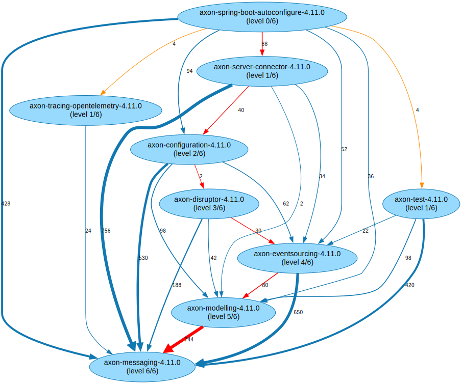
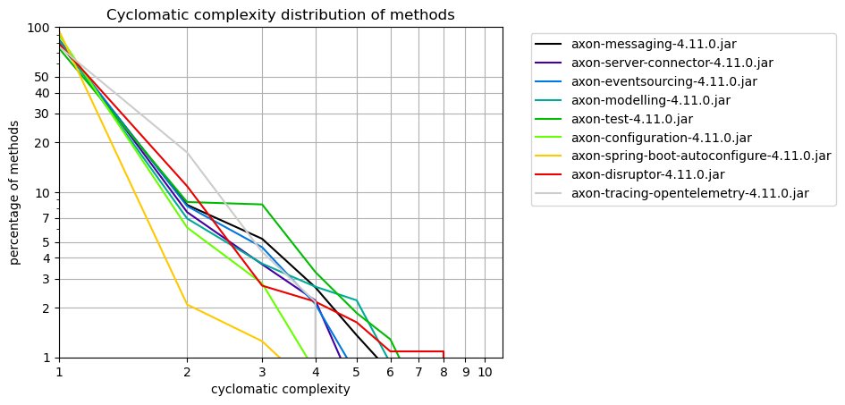
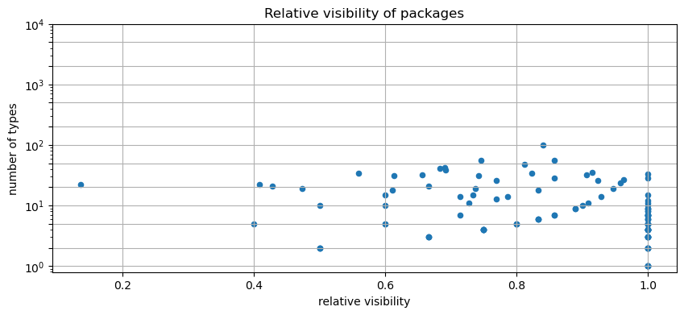

# Code Graph Analysis Pipeline Examples

This repository provides examples of how to analyze TypeScript code and Java artifacts using a fully automated GitHub Workflows pipeline with the [code-graph-analysis-pipeline](https://github.com/JohT/code-graph-analysis-pipeline).

The process involves three steps:

1. **Extract**: Upload TypeScript source code and/or Java artifacts, optionally including their git history, using [actions/upload-artifact](https://github.com/actions/upload-artifact).

1. **Analyze**: Use the shared workflow [JohT/code-graph-analysis-pipeline/.github/workflows/public-analyze-code-graph.yml](https://github.com/JohT/code-graph-analysis-pipeline/blob/main/.github/workflows/public-analyze-code-graph.yml) to analyze the code and artifacts, then upload the results.

1. **Use**: Download the analysis results with [actions/download-artifact](https://github.com/actions/download-artifact) and utilize them as needed.

## Table of Contents
<!-- TOC -->

- [Table of Contents](#table-of-contents)
- [:rocket: TypeScript Code Pipeline](#rocket-typescript-code-pipeline)
- [:coffee: Java Artifacts Pipeline](#coffee-java-artifacts-pipeline)
- [:bookmark_tabs: CSV Report Reference](#bookmark_tabs-csv-report-reference)
- [:notebook: Jupyter Notebook Report Reference](#notebook-jupyter-notebook-report-reference)
- [:framed_picture: Image Reference](#framed_picture-image-reference)
- [:recycle: Update Analysis Workflow with Renovate](#recycle-update-analysis-workflow-with-renovate)
- [:page_facing_up: License](#page_facing_up-license)
- [:bar_chart: Analysis Results](#bar_chart-analysis-results)
    - [External Dependencies of Java Packages](#external-dependencies-of-java-packages)
    - [Dependencies Graph of Java Artifacts](#dependencies-graph-of-java-artifacts)
    - [Longest Paths of Java Artifacts](#longest-paths-of-java-artifacts)
    - [All Pairs Shortest Paths of Java Packages per Artifact](#all-pairs-shortest-paths-of-java-packages-per-artifact)
    - [Object-Oriented Design Metrics for Java Packages](#object-oriented-design-metrics-for-java-packages)
    - [Effective Line Count of Java Methods](#effective-line-count-of-java-methods)
    - [Cyclomatic Complexity Distribution for Java Methods](#cyclomatic-complexity-distribution-for-java-methods)
    - [Visibility of Java Types](#visibility-of-java-types)
    - [Communities and Node Embeddings of Java Packages](#communities-and-node-embeddings-of-java-packages)
    - [Word Cloud of Git Authors](#word-cloud-of-git-authors)

<!-- /TOC -->

## :rocket: TypeScript Code Pipeline

This example demonstrates how to analyze TypeScript code in a GitHub Workflows pipeline.

1. The first job, [prepare-code-to-analyze](https://github.com/JohT/code-graph-analysis-examples/blob/23143b34d8fc6e0ab7d80102d8de0b6e6a4ec98e/.github/workflows/typescript-code-analysis.yml#L40), in the GitHub Actions Workflow [typescript-code-analysis.yml](https://github.com/JohT/code-graph-analysis-examples/blob/23143b34d8fc6e0ab7d80102d8de0b6e6a4ec98e/.github/workflows/typescript-code-analysis.yml), shows how to extract TypeScript code from a repository and upload it for analysis.

2. The second job, [analyze-code-graph](https://github.com/JohT/code-graph-analysis-examples/blob/23143b34d8fc6e0ab7d80102d8de0b6e6a4ec98e/.github/workflows/typescript-code-analysis.yml#L89), calls the shared analysis workflows using the uploaded artifacts' names as parameters. Here is a simple example:

  ```yaml
  name: Analyze Code Graph
  needs: [prepare-code-to-analyze]
  uses: JohT/code-graph-analysis-pipeline/.github/workflows/public-analyze-code-graph.yml
  with:
    analysis-name: ${{ needs.prepare-code-to-analyze.outputs.analysis-name }}
    sources-upload-name: ${{ needs.prepare-code-to-analyze.outputs.sources-upload-name }}
  ```

3. The third job, [analyze-code-graph](https://github.com/JohT/code-graph-analysis-examples/blob/23143b34d8fc6e0ab7d80102d8de0b6e6a4ec98e/.github/workflows/typescript-code-analysis.yml#L99), demonstrates how to download the analysis results and commit them back to the repository.

## :coffee: Java Artifacts Pipeline

Java artifacts are analyzed similarly to TypeScript code. The main difference is that Java artifacts are downloaded from a Maven repository instead of being part of the repository.

To include the git history in the analysis, checkout the corresponding source repository and upload it as the source artifact, similar to the TypeScript example. The Java source code isn't used for the analysis, so a bare git clone is sufficient.

The first job, [prepare-code-to-analyze](https://github.com/JohT/code-graph-analysis-examples/blob/23143b34d8fc6e0ab7d80102d8de0b6e6a4ec98e/.github/workflows/java-code-analysis.yml#L40), in the GitHub Actions Workflow [java-code-analysis.yml](https://github.com/JohT/code-graph-analysis-examples/blob/23143b34d8fc6e0ab7d80102d8de0b6e6a4ec98e/.github/workflows/java-code-analysis.yml), shows how to prepare the Java artifacts and git history for analysis.

The second and third jobs are the same as for the TypeScript example.

## :bookmark_tabs: CSV Report Reference

[CSV_REPORTS.md](./analysis-results/CSV_REPORTS.md) lists all CSV Cypher query result reports inside the [results](./results) directory. It can be generated as described in [Generate CSV Report Reference](./COMMANDS.md#generate-csv-cypher-query-report-reference).

## :notebook: Jupyter Notebook Report Reference

[JUPYTER_REPORTS.md](./analysis-results/JUPYTER_REPORTS.md) lists all Jupyter Notebook reports inside the [results](./results) directory. It can be generated as described in [Generate Jupyter Notebook Report Reference](./COMMANDS.md#generate-jupyter-notebook-report-reference).

## :framed_picture: Image Reference

[IMAGES.md](./analysis-results/IMAGES.md) lists all PNG images inside the [results](./results) directory. It can be generated as described in [Generate Image Reference](./COMMANDS.md#generate-image-reference).

## :recycle: Update Analysis Workflow with Renovate

This repository uses [Renovate](https://docs.renovatebot.com) to automatically update the analysis workflow to the latest version. To enable this, add the following extension to your Renovate configuration:

```json
"extends": [
  "github>JohT/code-graph-analysis-pipeline//renovate-presets/code-graph-analysis-workflow-latest-digest.json5"
]
```

You can find the complete configuration in the [renovate.json](./renovate.json) file.

## :page_facing_up: License

This repository is licensed under the Apache License, Version 2.0. See [LICENSE](./LICENSE) for the full license text.

## :bar_chart: Analysis Results

Here are ten examples from over a hundred reports generated by the analysis. These examples illustrate the results of analyzing [AxonFramework](https://github.com/AxonFramework/AxonFramework), a Java framework for Evolutionary Message-Driven Microservices on the JVM. For the complete set of reports, visit the [analysis-results](./analysis-results) directory.

### External Dependencies of Java Packages


### Dependencies Graph of Java Artifacts


### Longest Path(s) of Java Artifacts



### All Pairs Shortest Paths of Java Packages per Artifact


### Object-Oriented Design Metrics for Java Packages


### Effective Line Count of Java Methods


### Cyclomatic Complexity Distribution for Java Methods



### Visibility of Java Types



### Communities and Node Embeddings of Java Packages


### Word Cloud of Git Authors


