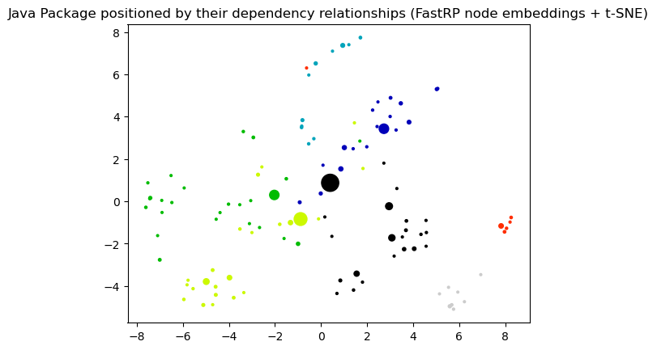
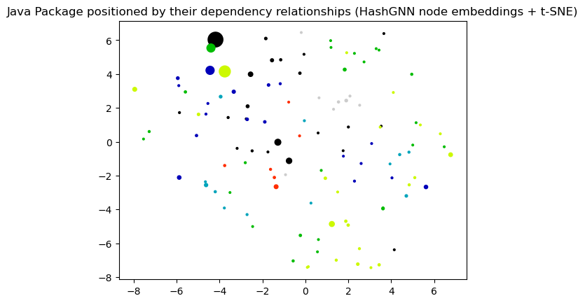
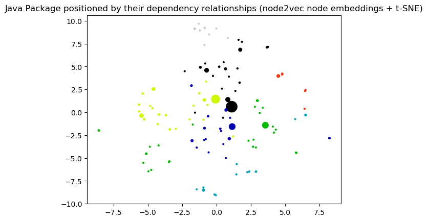

# Node Embeddings

This notebook demonstrates different methods for node embeddings and how to further reduce their dimensionality to be able to visualize them in a 2D plot. 

Node embeddings are essentially an array of floating point numbers (length = embedding dimension) that can be used as "features" in machine learning. These numbers approximate the relationship and similarity information of each node and can also be seen as a way to encode the topology of the graph.

## Considerations

Due to dimensionality reduction some information gets lost, especially when visualizing node embeddings in two dimensions. Nevertheless, it helps to get an intuition on what node embeddings are and how much of the similarity and neighborhood information is retained. The latter can be observed by how well nodes of the same color and therefore same community are placed together and how much bigger nodes with a high centrality score influence them. 

If the visualization doesn't show a somehow clear separation between the communities (colors) here are some ideas for tuning: 
- Clean the data, e.g. filter out very few nodes with extremely high degree that aren't actually that important
- Try directed vs. undirected projections
- Tune the embedding algorithm, e.g. use a higher dimensionality
- Tune t-SNE that is used to reduce the node embeddings dimension to two dimensions for visualization. 

It could also be the case that the node embeddings are good enough and well suited the way they are despite their visualization for the down stream task like node classification or link prediction. In that case it makes sense to see how the whole pipeline performs before tuning the node embeddings in detail. 

## Note about data dependencies

PageRank centrality and Leiden community are also fetched from the Graph and need to be calculated first.
This makes it easier to see if the embeddings approximate the structural information of the graph in the plot.
If these properties are missing you will only see black dots all of the same size.

   

### References
- [jqassistant](https://jqassistant.org)
- [Neo4j Python Driver](https://neo4j.com/docs/api/python-driver/current)
- [Tutorial: Applied Graph Embeddings](https://neo4j.com/developer/graph-data-science/applied-graph-embeddings)
- [Visualizing the embeddings in 2D](https://github.com/openai/openai-cookbook/blob/main/examples/Visualizing_embeddings_in_2D.ipynb)
- [scikit-learn TSNE](https://scikit-learn.org/stable/modules/generated/sklearn.manifold.TSNE.html#sklearn.manifold.TSNE)
- [AttributeError: 'list' object has no attribute 'shape'](https://bobbyhadz.com/blog/python-attributeerror-list-object-has-no-attribute-shape)
- [Fast Random Projection (neo4j)](https://neo4j.com/docs/graph-data-science/current/machine-learning/node-embeddings/fastrp)
- [HashGNN (neo4j)](https://neo4j.com/docs/graph-data-science/2.6/machine-learning/node-embeddings/hashgnn)
- [node2vec (neo4j)](https://neo4j.com/docs/graph-data-science/current/machine-learning/node-embeddings/node2vec) computes a vector representation of a node based on second order random walks in the graph. 
- [Complete guide to understanding Node2Vec algorithm](https://towardsdatascience.com/complete-guide-to-understanding-node2vec-algorithm-4e9a35e5d147)

    The openTSNE version is: 1.0.1
    The pandas version is: 1.5.1

### Dimensionality reduction with t-distributed stochastic neighbor embedding (t-SNE)

The following function takes the original node embeddings with a higher dimensionality, e.g. 64 floating point numbers, and reduces them into a two dimensional array for visualization. 

> It converts similarities between data points to joint probabilities and tries to minimize the Kullback-Leibler divergence between the joint probabilities of the low-dimensional embedding and the high-dimensional data.

(see https://opentsne.readthedocs.io)

## 1. Java Packages

### 1.1 Generate Node Embeddings using Fast Random Projection (Fast RP) for Java Packages

[Fast Random Projection](https://neo4j.com/docs/graph-data-science/current/machine-learning/node-embeddings/fastrp) is used to reduce the dimensionality of the node feature space while preserving most of the distance information. Nodes with similar neighborhood result in node embedding with similar vectors.

**👉Hint:** To skip existing node embeddings and always calculate them based on the parameters below edit `Node_Embeddings_0a_Query_Calculated` so that it won't return any results.

    The results have been provided by the query filename: ../cypher/Node_Embeddings/Node_Embeddings_0a_Query_Calculated.cypher

<table border="1" class="dataframe">
  <thead>
    <tr style="text-align: right;">
      <th></th>
      <th>codeUnitName</th>
      <th>shortCodeUnitName</th>
      <th>projectName</th>
      <th>communityId</th>
      <th>centrality</th>
      <th>embedding</th>
    </tr>
  </thead>
  <tbody>
    <tr>
      <th>0</th>
      <td>org.axonframework.commandhandling</td>
      <td>commandhandling</td>
      <td>axon-messaging-4.10.3</td>
      <td>0</td>
      <td>0.073179</td>
      <td>[0.26381057500839233, -0.2140716314315796, -0....</td>
    </tr>
    <tr>
      <th>1</th>
      <td>org.axonframework.commandhandling.callbacks</td>
      <td>callbacks</td>
      <td>axon-messaging-4.10.3</td>
      <td>0</td>
      <td>0.015708</td>
      <td>[0.20709964632987976, -0.2799694538116455, 0.0...</td>
    </tr>
    <tr>
      <th>2</th>
      <td>org.axonframework.commandhandling.distributed</td>
      <td>distributed</td>
      <td>axon-messaging-4.10.3</td>
      <td>0</td>
      <td>0.023111</td>
      <td>[0.27463600039482117, -0.11441196501255035, -0...</td>
    </tr>
    <tr>
      <th>3</th>
      <td>org.axonframework.commandhandling.distributed....</td>
      <td>commandfilter</td>
      <td>axon-messaging-4.10.3</td>
      <td>0</td>
      <td>0.013919</td>
      <td>[0.13662932813167572, -0.24026647210121155, -0...</td>
    </tr>
    <tr>
      <th>4</th>
      <td>org.axonframework.commandhandling.gateway</td>
      <td>gateway</td>
      <td>axon-messaging-4.10.3</td>
      <td>0</td>
      <td>0.013360</td>
      <td>[0.23006242513656616, -0.21892967820167542, 0....</td>
    </tr>
  </tbody>
</table>

### 1.2 Dimensionality reduction with t-distributed stochastic neighbor embedding (t-SNE)

This step takes the original node embeddings with a higher dimensionality, e.g. 64 floating point numbers, and reduces them into a two dimensional array for visualization. For more details look up the function declaration for "prepare_node_embeddings_for_2d_visualization".

    --------------------------------------------------------------------------------
    TSNE(early_exaggeration=12, random_state=47, verbose=1)
    --------------------------------------------------------------------------------
    ===> Finding 90 nearest neighbors using exact search using euclidean distance...
       --> Time elapsed: 0.02 seconds
    ===> Calculating affinity matrix...
       --> Time elapsed: 0.01 seconds
    ===> Calculating PCA-based initialization...
       --> Time elapsed: 0.01 seconds
    ===> Running optimization with exaggeration=12.00, lr=9.50 for 250 iterations...
    Iteration   50, KL divergence -0.8830, 50 iterations in 0.0592 sec
    Iteration  100, KL divergence 1.2204, 50 iterations in 0.0162 sec
    Iteration  150, KL divergence 1.2204, 50 iterations in 0.0149 sec
    Iteration  200, KL divergence 1.2204, 50 iterations in 0.0149 sec
    Iteration  250, KL divergence 1.2204, 50 iterations in 0.0149 sec
       --> Time elapsed: 0.12 seconds
    ===> Running optimization with exaggeration=1.00, lr=114.00 for 500 iterations...
    Iteration   50, KL divergence 0.1972, 50 iterations in 0.0522 sec
    Iteration  100, KL divergence 0.1754, 50 iterations in 0.0442 sec
    Iteration  150, KL divergence 0.1693, 50 iterations in 0.0425 sec
    Iteration  200, KL divergence 0.1688, 50 iterations in 0.0421 sec
    Iteration  250, KL divergence 0.1687, 50 iterations in 0.0459 sec
    Iteration  300, KL divergence 0.1688, 50 iterations in 0.0610 sec
    Iteration  350, KL divergence 0.1690, 50 iterations in 0.0417 sec
    Iteration  400, KL divergence 0.1689, 50 iterations in 0.0412 sec
    Iteration  450, KL divergence 0.1689, 50 iterations in 0.0413 sec
    Iteration  500, KL divergence 0.1690, 50 iterations in 0.0412 sec
       --> Time elapsed: 0.45 seconds

    (114, 2)

<table border="1" class="dataframe">
  <thead>
    <tr style="text-align: right;">
      <th></th>
      <th>codeUnit</th>
      <th>artifact</th>
      <th>communityId</th>
      <th>centrality</th>
      <th>x</th>
      <th>y</th>
    </tr>
  </thead>
  <tbody>
    <tr>
      <th>0</th>
      <td>org.axonframework.commandhandling</td>
      <td>axon-messaging-4.10.3</td>
      <td>0</td>
      <td>0.073179</td>
      <td>1.545112</td>
      <td>-3.415745</td>
    </tr>
    <tr>
      <th>1</th>
      <td>org.axonframework.commandhandling.callbacks</td>
      <td>axon-messaging-4.10.3</td>
      <td>0</td>
      <td>0.015708</td>
      <td>1.411022</td>
      <td>-4.189483</td>
    </tr>
    <tr>
      <th>2</th>
      <td>org.axonframework.commandhandling.distributed</td>
      <td>axon-messaging-4.10.3</td>
      <td>0</td>
      <td>0.023111</td>
      <td>0.836277</td>
      <td>-3.736140</td>
    </tr>
    <tr>
      <th>3</th>
      <td>org.axonframework.commandhandling.distributed....</td>
      <td>axon-messaging-4.10.3</td>
      <td>0</td>
      <td>0.013919</td>
      <td>0.689225</td>
      <td>-4.350125</td>
    </tr>
    <tr>
      <th>4</th>
      <td>org.axonframework.commandhandling.gateway</td>
      <td>axon-messaging-4.10.3</td>
      <td>0</td>
      <td>0.013360</td>
      <td>1.799008</td>
      <td>-3.816154</td>
    </tr>
  </tbody>
</table>

### 1.3 Visualization of the node embeddings reduced to two dimensions

    

    

### 1.4 Node Embeddings for Java Packages using HashGNN

[HashGNN](https://neo4j.com/docs/graph-data-science/2.6/machine-learning/node-embeddings/hashgnn) resembles Graph Neural Networks (GNN) but does not include a model or require training. It combines ideas of GNNs and fast randomized algorithms. For more details see [HashGNN](https://neo4j.com/docs/graph-data-science/2.6/machine-learning/node-embeddings/hashgnn). Here, the latter 3 steps are combined into one for HashGNN.

    The results have been provided by the query filename: ../cypher/Node_Embeddings/Node_Embeddings_0a_Query_Calculated.cypher

<table border="1" class="dataframe">
  <thead>
    <tr style="text-align: right;">
      <th></th>
      <th>codeUnitName</th>
      <th>shortCodeUnitName</th>
      <th>projectName</th>
      <th>communityId</th>
      <th>centrality</th>
      <th>embedding</th>
    </tr>
  </thead>
  <tbody>
    <tr>
      <th>0</th>
      <td>org.axonframework.commandhandling</td>
      <td>commandhandling</td>
      <td>axon-messaging-4.10.3</td>
      <td>0</td>
      <td>0.073179</td>
      <td>[-1.0825317353010178, -0.21650634706020355, -0...</td>
    </tr>
    <tr>
      <th>1</th>
      <td>org.axonframework.commandhandling.callbacks</td>
      <td>callbacks</td>
      <td>axon-messaging-4.10.3</td>
      <td>0</td>
      <td>0.015708</td>
      <td>[-0.8660253882408142, -1.0825317353010178, -0....</td>
    </tr>
    <tr>
      <th>2</th>
      <td>org.axonframework.commandhandling.distributed</td>
      <td>distributed</td>
      <td>axon-messaging-4.10.3</td>
      <td>0</td>
      <td>0.023111</td>
      <td>[0.4330126941204071, -0.21650634706020355, 0.0...</td>
    </tr>
    <tr>
      <th>3</th>
      <td>org.axonframework.commandhandling.distributed....</td>
      <td>commandfilter</td>
      <td>axon-messaging-4.10.3</td>
      <td>0</td>
      <td>0.013919</td>
      <td>[-0.8660253882408142, -1.0825317353010178, -0....</td>
    </tr>
    <tr>
      <th>4</th>
      <td>org.axonframework.commandhandling.gateway</td>
      <td>gateway</td>
      <td>axon-messaging-4.10.3</td>
      <td>0</td>
      <td>0.013360</td>
      <td>[-1.7320507764816284, 1.2990380823612213, -0.6...</td>
    </tr>
  </tbody>
</table>

    --------------------------------------------------------------------------------
    TSNE(early_exaggeration=12, random_state=47, verbose=1)
    --------------------------------------------------------------------------------
    ===> Finding 90 nearest neighbors using exact search using euclidean distance...
       --> Time elapsed: 0.01 seconds
    ===> Calculating affinity matrix...
       --> Time elapsed: 0.00 seconds
    ===> Calculating PCA-based initialization...
       --> Time elapsed: 0.01 seconds
    ===> Running optimization with exaggeration=12.00, lr=9.50 for 250 iterations...
    Iteration   50, KL divergence -0.7311, 50 iterations in 0.0854 sec
    Iteration  100, KL divergence 1.2254, 50 iterations in 0.0170 sec
    Iteration  150, KL divergence 1.2254, 50 iterations in 0.0147 sec
    Iteration  200, KL divergence 1.2254, 50 iterations in 0.0147 sec
    Iteration  250, KL divergence 1.2254, 50 iterations in 0.0147 sec
       --> Time elapsed: 0.15 seconds
    ===> Running optimization with exaggeration=1.00, lr=114.00 for 500 iterations...
    Iteration   50, KL divergence 0.6458, 50 iterations in 0.0443 sec
    Iteration  100, KL divergence 0.6295, 50 iterations in 0.0450 sec
    Iteration  150, KL divergence 0.6280, 50 iterations in 0.0445 sec
    Iteration  200, KL divergence 0.6269, 50 iterations in 0.0445 sec
    Iteration  250, KL divergence 0.6262, 50 iterations in 0.0447 sec
    Iteration  300, KL divergence 0.6235, 50 iterations in 0.0462 sec
    Iteration  350, KL divergence 0.6223, 50 iterations in 0.0457 sec
    Iteration  400, KL divergence 0.6215, 50 iterations in 0.0529 sec
    Iteration  450, KL divergence 0.6215, 50 iterations in 0.0579 sec
    Iteration  500, KL divergence 0.6214, 50 iterations in 0.0452 sec
       --> Time elapsed: 0.47 seconds

    (114, 2)

<table border="1" class="dataframe">
  <thead>
    <tr style="text-align: right;">
      <th></th>
      <th>codeUnit</th>
      <th>artifact</th>
      <th>communityId</th>
      <th>centrality</th>
      <th>x</th>
      <th>y</th>
    </tr>
  </thead>
  <tbody>
    <tr>
      <th>0</th>
      <td>org.axonframework.commandhandling</td>
      <td>axon-messaging-4.10.3</td>
      <td>0</td>
      <td>0.073179</td>
      <td>-2.553574</td>
      <td>3.988160</td>
    </tr>
    <tr>
      <th>1</th>
      <td>org.axonframework.commandhandling.callbacks</td>
      <td>axon-messaging-4.10.3</td>
      <td>0</td>
      <td>0.015708</td>
      <td>-3.599796</td>
      <td>1.430703</td>
    </tr>
    <tr>
      <th>2</th>
      <td>org.axonframework.commandhandling.distributed</td>
      <td>axon-messaging-4.10.3</td>
      <td>0</td>
      <td>0.023111</td>
      <td>-1.844004</td>
      <td>6.099533</td>
    </tr>
    <tr>
      <th>3</th>
      <td>org.axonframework.commandhandling.distributed....</td>
      <td>axon-messaging-4.10.3</td>
      <td>0</td>
      <td>0.013919</td>
      <td>-5.869184</td>
      <td>1.720699</td>
    </tr>
    <tr>
      <th>4</th>
      <td>org.axonframework.commandhandling.gateway</td>
      <td>axon-messaging-4.10.3</td>
      <td>0</td>
      <td>0.013360</td>
      <td>-1.744324</td>
      <td>-0.603482</td>
    </tr>
  </tbody>
</table>

    

    

### 2.5 Node Embeddings for Java Packages using node2vec

    The results have been provided by the query filename: ../cypher/Node_Embeddings/Node_Embeddings_0a_Query_Calculated.cypher

<table border="1" class="dataframe">
  <thead>
    <tr style="text-align: right;">
      <th></th>
      <th>codeUnitName</th>
      <th>shortCodeUnitName</th>
      <th>projectName</th>
      <th>communityId</th>
      <th>centrality</th>
      <th>embedding</th>
    </tr>
  </thead>
  <tbody>
    <tr>
      <th>0</th>
      <td>org.axonframework.commandhandling</td>
      <td>commandhandling</td>
      <td>axon-messaging-4.10.3</td>
      <td>0</td>
      <td>0.073179</td>
      <td>[0.6036520004272461, -0.09704083204269409, -0....</td>
    </tr>
    <tr>
      <th>1</th>
      <td>org.axonframework.commandhandling.callbacks</td>
      <td>callbacks</td>
      <td>axon-messaging-4.10.3</td>
      <td>0</td>
      <td>0.015708</td>
      <td>[0.5897955298423767, 0.13364499807357788, -0.2...</td>
    </tr>
    <tr>
      <th>2</th>
      <td>org.axonframework.commandhandling.distributed</td>
      <td>distributed</td>
      <td>axon-messaging-4.10.3</td>
      <td>0</td>
      <td>0.023111</td>
      <td>[0.5009806752204895, 0.11124832183122635, -0.4...</td>
    </tr>
    <tr>
      <th>3</th>
      <td>org.axonframework.commandhandling.distributed....</td>
      <td>commandfilter</td>
      <td>axon-messaging-4.10.3</td>
      <td>0</td>
      <td>0.013919</td>
      <td>[0.3950958847999573, 0.043946534395217896, -0....</td>
    </tr>
    <tr>
      <th>4</th>
      <td>org.axonframework.commandhandling.gateway</td>
      <td>gateway</td>
      <td>axon-messaging-4.10.3</td>
      <td>0</td>
      <td>0.013360</td>
      <td>[0.6895321607589722, 0.10247272253036499, -0.1...</td>
    </tr>
  </tbody>
</table>

    --------------------------------------------------------------------------------
    TSNE(early_exaggeration=12, random_state=47, verbose=1)
    --------------------------------------------------------------------------------
    ===> Finding 90 nearest neighbors using exact search using euclidean distance...
       --> Time elapsed: 0.00 seconds
    ===> Calculating affinity matrix...
       --> Time elapsed: 0.00 seconds
    ===> Calculating PCA-based initialization...
       --> Time elapsed: 0.00 seconds
    ===> Running optimization with exaggeration=12.00, lr=9.50 for 250 iterations...
    Iteration   50, KL divergence -0.8597, 50 iterations in 0.0653 sec
    Iteration  100, KL divergence -2.8808, 50 iterations in 0.0210 sec
    Iteration  150, KL divergence 1.1667, 50 iterations in 0.0166 sec
    Iteration  200, KL divergence 1.1667, 50 iterations in 0.0150 sec
    Iteration  250, KL divergence 1.1667, 50 iterations in 0.0149 sec
       --> Time elapsed: 0.13 seconds
    ===> Running optimization with exaggeration=1.00, lr=114.00 for 500 iterations...
    Iteration   50, KL divergence 0.3757, 50 iterations in 0.0565 sec
    Iteration  100, KL divergence 0.3451, 50 iterations in 0.0518 sec
    Iteration  150, KL divergence 0.3436, 50 iterations in 0.0489 sec
    Iteration  200, KL divergence 0.3413, 50 iterations in 0.0475 sec
    Iteration  250, KL divergence 0.3410, 50 iterations in 0.0473 sec
    Iteration  300, KL divergence 0.3408, 50 iterations in 0.0475 sec
    Iteration  350, KL divergence 0.3409, 50 iterations in 0.0491 sec
    Iteration  400, KL divergence 0.3408, 50 iterations in 0.0484 sec
    Iteration  450, KL divergence 0.3408, 50 iterations in 0.0481 sec
    Iteration  500, KL divergence 0.3407, 50 iterations in 0.0613 sec
       --> Time elapsed: 0.51 seconds

    (114, 2)

<table border="1" class="dataframe">
  <thead>
    <tr style="text-align: right;">
      <th></th>
      <th>codeUnit</th>
      <th>artifact</th>
      <th>communityId</th>
      <th>centrality</th>
      <th>x</th>
      <th>y</th>
    </tr>
  </thead>
  <tbody>
    <tr>
      <th>0</th>
      <td>org.axonframework.commandhandling</td>
      <td>axon-messaging-4.10.3</td>
      <td>0</td>
      <td>0.073179</td>
      <td>1.729933</td>
      <td>6.843349</td>
    </tr>
    <tr>
      <th>1</th>
      <td>org.axonframework.commandhandling.callbacks</td>
      <td>axon-messaging-4.10.3</td>
      <td>0</td>
      <td>0.015708</td>
      <td>1.854004</td>
      <td>7.703834</td>
    </tr>
    <tr>
      <th>2</th>
      <td>org.axonframework.commandhandling.distributed</td>
      <td>axon-messaging-4.10.3</td>
      <td>0</td>
      <td>0.023111</td>
      <td>3.676686</td>
      <td>7.107067</td>
    </tr>
    <tr>
      <th>3</th>
      <td>org.axonframework.commandhandling.distributed....</td>
      <td>axon-messaging-4.10.3</td>
      <td>0</td>
      <td>0.013919</td>
      <td>3.755930</td>
      <td>7.148332</td>
    </tr>
    <tr>
      <th>4</th>
      <td>org.axonframework.commandhandling.gateway</td>
      <td>axon-messaging-4.10.3</td>
      <td>0</td>
      <td>0.013360</td>
      <td>1.606468</td>
      <td>7.927128</td>
    </tr>
  </tbody>
</table>

    

    

