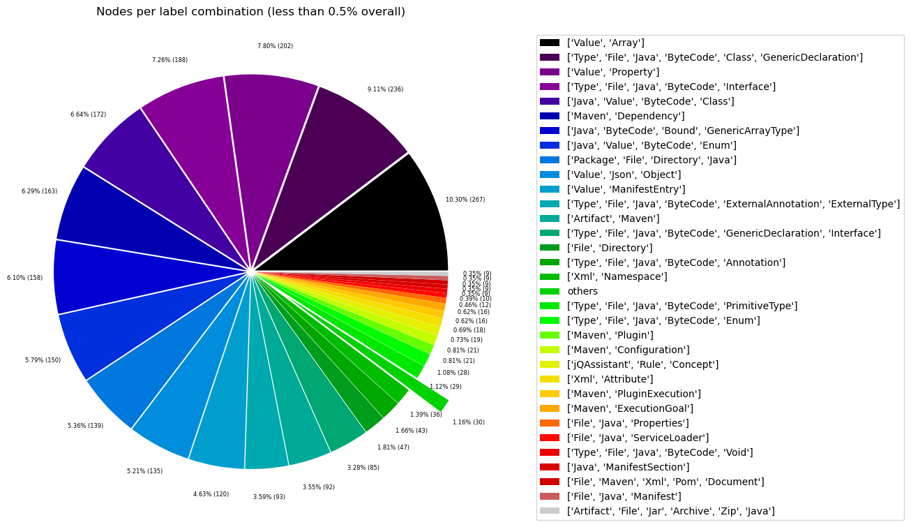
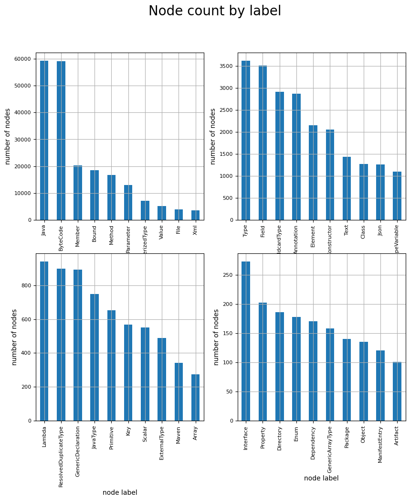
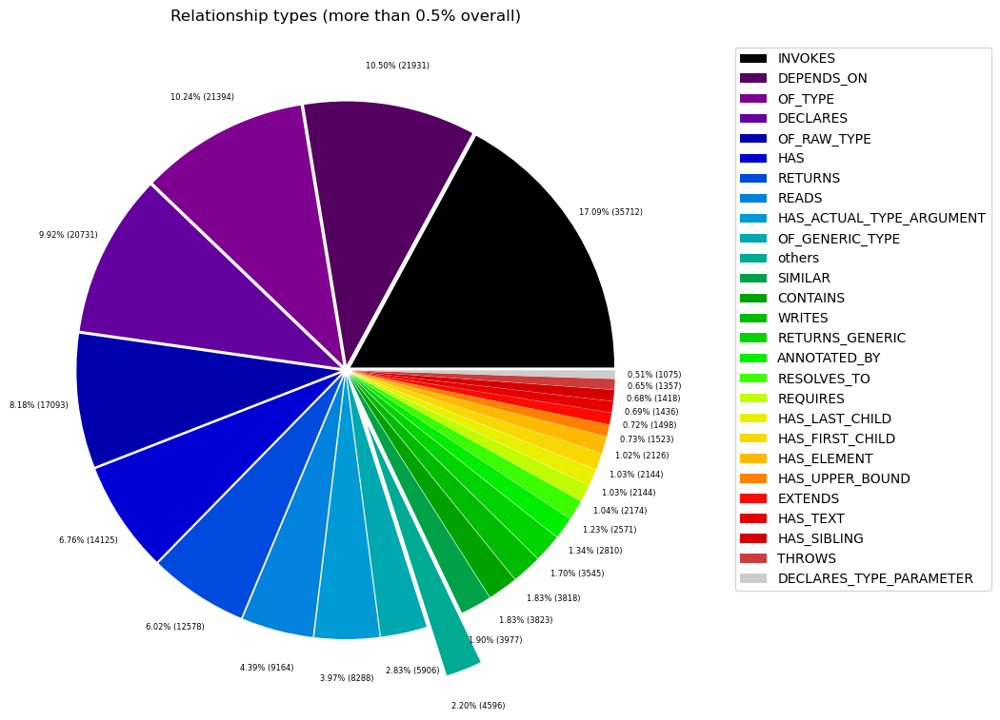
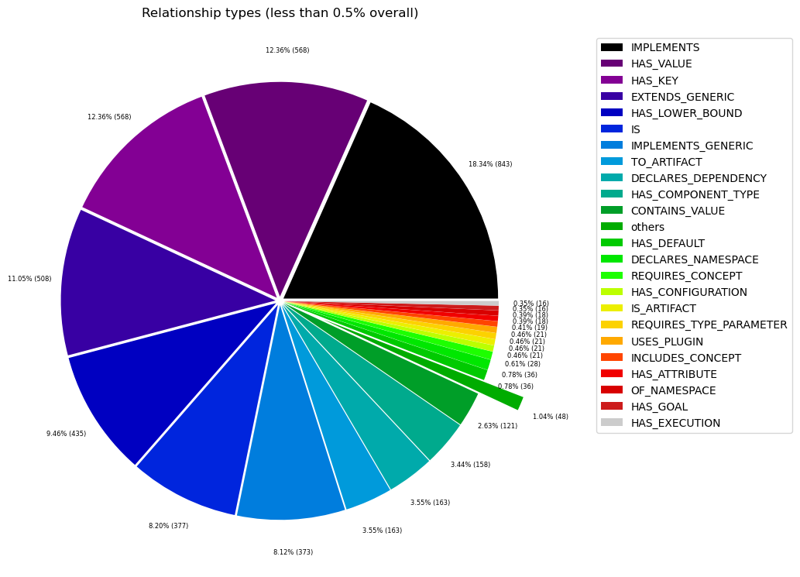

# Overview in General
   

This file contains a general overview of the data in the graph including node labels and relationships types.

### References
- [jqassistant](https://jqassistant.org)
- [Neo4j Python Driver](https://neo4j.com/docs/api/python-driver/current)

## Node Labels

### Table 1a - Highest node count by label combination

Lists the 30 label combinations with the highest number of nodes. The labels with the lowest node count are listed in table 1b.
The total list would sum up to the total number of labels (100%).

The whole table can be found in the CSV report `Node_label_combination_count`.

<table border="1" class="dataframe">
  <thead>
    <tr style="text-align: right;">
      <th></th>
      <th>nodeLabels</th>
      <th>nodesWithThatLabels</th>
      <th>nodesWithThatLabelsPercent</th>
    </tr>
  </thead>
  <tbody>
    <tr>
      <th>0</th>
      <td>[Java, ByteCode, Member, Method]</td>
      <td>13193</td>
      <td>20.216369</td>
    </tr>
    <tr>
      <th>1</th>
      <td>[Java, ByteCode, Parameter]</td>
      <td>13029</td>
      <td>19.965062</td>
    </tr>
    <tr>
      <th>2</th>
      <td>[Java, ByteCode, Bound, ParameterizedType]</td>
      <td>7176</td>
      <td>10.996184</td>
    </tr>
    <tr>
      <th>3</th>
      <td>[Java, ByteCode, Bound]</td>
      <td>7118</td>
      <td>10.907308</td>
    </tr>
    <tr>
      <th>4</th>
      <td>[Java, ByteCode, Member, Field]</td>
      <td>3505</td>
      <td>5.370907</td>
    </tr>
    <tr>
      <th>5</th>
      <td>[Java, ByteCode, Bound, WildcardType]</td>
      <td>2908</td>
      <td>4.456090</td>
    </tr>
    <tr>
      <th>6</th>
      <td>[Java, Value, ByteCode, Annotation]</td>
      <td>2822</td>
      <td>4.324308</td>
    </tr>
    <tr>
      <th>7</th>
      <td>[Xml, Element]</td>
      <td>2144</td>
      <td>3.285371</td>
    </tr>
    <tr>
      <th>8</th>
      <td>[Java, ByteCode, Member, Method, Constructor]</td>
      <td>2052</td>
      <td>3.144394</td>
    </tr>
    <tr>
      <th>9</th>
      <td>[Xml, Text]</td>
      <td>1436</td>
      <td>2.200463</td>
    </tr>
    <tr>
      <th>10</th>
      <td>[Java, ByteCode, Bound, TypeVariable]</td>
      <td>1096</td>
      <td>1.679462</td>
    </tr>
    <tr>
      <th>11</th>
      <td>[Java, ByteCode, Member, Method, Lambda]</td>
      <td>942</td>
      <td>1.443479</td>
    </tr>
    <tr>
      <th>12</th>
      <td>[Type, File, Java, ByteCode, ResolvedDuplicate...</td>
      <td>899</td>
      <td>1.377588</td>
    </tr>
    <tr>
      <th>13</th>
      <td>[Type, File, Java, ByteCode, Class]</td>
      <td>864</td>
      <td>1.323955</td>
    </tr>
    <tr>
      <th>14</th>
      <td>[Type, File, Java, ByteCode, JavaType]</td>
      <td>748</td>
      <td>1.146202</td>
    </tr>
    <tr>
      <th>15</th>
      <td>[Java, Value, ByteCode, Primitive]</td>
      <td>652</td>
      <td>0.999096</td>
    </tr>
    <tr>
      <th>16</th>
      <td>[Java, ByteCode, GenericDeclaration, Member, M...</td>
      <td>569</td>
      <td>0.871910</td>
    </tr>
    <tr>
      <th>17</th>
      <td>[Json, Key]</td>
      <td>568</td>
      <td>0.870378</td>
    </tr>
    <tr>
      <th>18</th>
      <td>[Value, Json, Scalar]</td>
      <td>551</td>
      <td>0.844328</td>
    </tr>
    <tr>
      <th>19</th>
      <td>[Type, File, Java, ByteCode, ExternalType]</td>
      <td>396</td>
      <td>0.606813</td>
    </tr>
    <tr>
      <th>20</th>
      <td>[Value, Array]</td>
      <td>267</td>
      <td>0.409139</td>
    </tr>
    <tr>
      <th>21</th>
      <td>[Type, File, Java, ByteCode, Class, GenericDec...</td>
      <td>236</td>
      <td>0.361636</td>
    </tr>
    <tr>
      <th>22</th>
      <td>[Value, Property]</td>
      <td>202</td>
      <td>0.309536</td>
    </tr>
    <tr>
      <th>23</th>
      <td>[Type, File, Java, ByteCode, Interface]</td>
      <td>188</td>
      <td>0.288083</td>
    </tr>
    <tr>
      <th>24</th>
      <td>[Java, Value, ByteCode, Class]</td>
      <td>172</td>
      <td>0.263565</td>
    </tr>
    <tr>
      <th>25</th>
      <td>[Maven, Dependency]</td>
      <td>163</td>
      <td>0.249774</td>
    </tr>
    <tr>
      <th>26</th>
      <td>[Java, ByteCode, Bound, GenericArrayType]</td>
      <td>158</td>
      <td>0.242112</td>
    </tr>
    <tr>
      <th>27</th>
      <td>[Java, Value, ByteCode, Enum]</td>
      <td>150</td>
      <td>0.229853</td>
    </tr>
    <tr>
      <th>28</th>
      <td>[Package, File, Directory, Java]</td>
      <td>139</td>
      <td>0.212997</td>
    </tr>
    <tr>
      <th>29</th>
      <td>[Value, Json, Object]</td>
      <td>135</td>
      <td>0.206868</td>
    </tr>
  </tbody>
</table>

### Chart 1a - Highest node count by label combination

Values under 0.5% will be grouped into "others" to get a cleaner plot. The group "others" is then broken down in Chart 1b.

    <Figure size 640x480 with 0 Axes>

    

    

### Table 1b - Lowest node count by label combination

Lists the 30 label combinations with the lowest number of nodes until they reach 0.5% of the total node count, which are shown above.

<table border="1" class="dataframe">
  <thead>
    <tr style="text-align: right;">
      <th></th>
      <th>nodeLabels</th>
      <th>nodesWithThatLabels</th>
      <th>nodesWithThatLabelsPercent</th>
    </tr>
  </thead>
  <tbody>
    <tr>
      <th>0</th>
      <td>[Analyze, Task, jQAssistant]</td>
      <td>1</td>
      <td>0.001532</td>
    </tr>
    <tr>
      <th>1</th>
      <td>[File, TS, Scan]</td>
      <td>1</td>
      <td>0.001532</td>
    </tr>
    <tr>
      <th>2</th>
      <td>[Package, File, Json, NPM]</td>
      <td>1</td>
      <td>0.001532</td>
    </tr>
    <tr>
      <th>3</th>
      <td>[File, Json]</td>
      <td>2</td>
      <td>0.003065</td>
    </tr>
    <tr>
      <th>4</th>
      <td>[File]</td>
      <td>3</td>
      <td>0.004597</td>
    </tr>
    <tr>
      <th>5</th>
      <td>[Java, ByteCode, GenericDeclaration, Member, M...</td>
      <td>4</td>
      <td>0.006129</td>
    </tr>
    <tr>
      <th>6</th>
      <td>[Maven, Exclusion]</td>
      <td>5</td>
      <td>0.007662</td>
    </tr>
    <tr>
      <th>7</th>
      <td>[Value, Array, Json]</td>
      <td>6</td>
      <td>0.009194</td>
    </tr>
    <tr>
      <th>8</th>
      <td>[Dependency, NPM]</td>
      <td>7</td>
      <td>0.010726</td>
    </tr>
    <tr>
      <th>9</th>
      <td>[Type, File, Java, ByteCode, Void]</td>
      <td>9</td>
      <td>0.013791</td>
    </tr>
    <tr>
      <th>10</th>
      <td>[File, Maven, Xml, Pom, Document]</td>
      <td>9</td>
      <td>0.013791</td>
    </tr>
    <tr>
      <th>11</th>
      <td>[Java, ManifestSection]</td>
      <td>9</td>
      <td>0.013791</td>
    </tr>
    <tr>
      <th>12</th>
      <td>[File, Java, Manifest]</td>
      <td>9</td>
      <td>0.013791</td>
    </tr>
    <tr>
      <th>13</th>
      <td>[Artifact, File, Jar, Archive, Zip, Java]</td>
      <td>9</td>
      <td>0.013791</td>
    </tr>
    <tr>
      <th>14</th>
      <td>[File, Java, ServiceLoader]</td>
      <td>10</td>
      <td>0.015324</td>
    </tr>
    <tr>
      <th>15</th>
      <td>[File, Java, Properties]</td>
      <td>12</td>
      <td>0.018388</td>
    </tr>
    <tr>
      <th>16</th>
      <td>[Maven, PluginExecution]</td>
      <td>16</td>
      <td>0.024518</td>
    </tr>
    <tr>
      <th>17</th>
      <td>[Maven, ExecutionGoal]</td>
      <td>16</td>
      <td>0.024518</td>
    </tr>
    <tr>
      <th>18</th>
      <td>[Xml, Attribute]</td>
      <td>18</td>
      <td>0.027582</td>
    </tr>
    <tr>
      <th>19</th>
      <td>[jQAssistant, Rule, Concept]</td>
      <td>19</td>
      <td>0.029115</td>
    </tr>
    <tr>
      <th>20</th>
      <td>[Maven, Configuration]</td>
      <td>21</td>
      <td>0.032179</td>
    </tr>
    <tr>
      <th>21</th>
      <td>[Maven, Plugin]</td>
      <td>21</td>
      <td>0.032179</td>
    </tr>
    <tr>
      <th>22</th>
      <td>[Type, File, Java, ByteCode, Enum]</td>
      <td>28</td>
      <td>0.042906</td>
    </tr>
    <tr>
      <th>23</th>
      <td>[Type, File, Java, ByteCode, PrimitiveType]</td>
      <td>29</td>
      <td>0.044438</td>
    </tr>
    <tr>
      <th>24</th>
      <td>[Xml, Namespace]</td>
      <td>36</td>
      <td>0.055165</td>
    </tr>
    <tr>
      <th>25</th>
      <td>[Type, File, Java, ByteCode, Annotation]</td>
      <td>43</td>
      <td>0.065891</td>
    </tr>
    <tr>
      <th>26</th>
      <td>[File, Directory]</td>
      <td>47</td>
      <td>0.072021</td>
    </tr>
    <tr>
      <th>27</th>
      <td>[Type, File, Java, ByteCode, GenericDeclaratio...</td>
      <td>85</td>
      <td>0.130250</td>
    </tr>
    <tr>
      <th>28</th>
      <td>[Artifact, Maven]</td>
      <td>92</td>
      <td>0.140977</td>
    </tr>
    <tr>
      <th>29</th>
      <td>[Type, File, Java, ByteCode, ExternalAnnotatio...</td>
      <td>93</td>
      <td>0.142509</td>
    </tr>
  </tbody>
</table>

### Chart 1b - Lowest node count by label combination

Shows the lowest (less than 0.5% overall) node count label combinations. Therefore, this plot breaks down the "others" slice of the pie chart above. Values under 0.01% will be grouped into "others" to get a cleaner plot.

    <Figure size 640x480 with 0 Axes>

    

    

### Table 1c - Highest node count by single label

Lists the 40 labels with the highest number of nodes.
Doesn't sum up to the total number of nodes or 100% because one node can have multiple labels.
Helps to identify commonly used labels.

<table border="1" class="dataframe">
  <thead>
    <tr style="text-align: right;">
      <th></th>
      <th>nodeLabel</th>
      <th>nodesWithThatLabel</th>
      <th>nodesWithThatLabelPercent</th>
    </tr>
  </thead>
  <tbody>
    <tr>
      <th>0</th>
      <td>Java</td>
      <td>59352</td>
      <td>90.948375</td>
    </tr>
    <tr>
      <th>1</th>
      <td>ByteCode</td>
      <td>59164</td>
      <td>90.660292</td>
    </tr>
    <tr>
      <th>2</th>
      <td>Member</td>
      <td>20265</td>
      <td>31.053188</td>
    </tr>
    <tr>
      <th>3</th>
      <td>Bound</td>
      <td>18456</td>
      <td>28.281157</td>
    </tr>
    <tr>
      <th>4</th>
      <td>Method</td>
      <td>16760</td>
      <td>25.682281</td>
    </tr>
    <tr>
      <th>5</th>
      <td>Parameter</td>
      <td>13029</td>
      <td>19.965062</td>
    </tr>
    <tr>
      <th>6</th>
      <td>ParameterizedType</td>
      <td>7176</td>
      <td>10.996184</td>
    </tr>
    <tr>
      <th>7</th>
      <td>Value</td>
      <td>5077</td>
      <td>7.779770</td>
    </tr>
    <tr>
      <th>8</th>
      <td>File</td>
      <td>3860</td>
      <td>5.914893</td>
    </tr>
    <tr>
      <th>9</th>
      <td>Xml</td>
      <td>3643</td>
      <td>5.582372</td>
    </tr>
    <tr>
      <th>10</th>
      <td>Type</td>
      <td>3618</td>
      <td>5.544063</td>
    </tr>
    <tr>
      <th>11</th>
      <td>Field</td>
      <td>3505</td>
      <td>5.370907</td>
    </tr>
    <tr>
      <th>12</th>
      <td>WildcardType</td>
      <td>2908</td>
      <td>4.456090</td>
    </tr>
    <tr>
      <th>13</th>
      <td>Annotation</td>
      <td>2865</td>
      <td>4.390199</td>
    </tr>
    <tr>
      <th>14</th>
      <td>Element</td>
      <td>2144</td>
      <td>3.285371</td>
    </tr>
    <tr>
      <th>15</th>
      <td>Constructor</td>
      <td>2056</td>
      <td>3.150523</td>
    </tr>
    <tr>
      <th>16</th>
      <td>Text</td>
      <td>1436</td>
      <td>2.200463</td>
    </tr>
    <tr>
      <th>17</th>
      <td>Class</td>
      <td>1272</td>
      <td>1.949156</td>
    </tr>
    <tr>
      <th>18</th>
      <td>Json</td>
      <td>1263</td>
      <td>1.935365</td>
    </tr>
    <tr>
      <th>19</th>
      <td>TypeVariable</td>
      <td>1096</td>
      <td>1.679462</td>
    </tr>
    <tr>
      <th>20</th>
      <td>Lambda</td>
      <td>942</td>
      <td>1.443479</td>
    </tr>
    <tr>
      <th>21</th>
      <td>ResolvedDuplicateType</td>
      <td>899</td>
      <td>1.377588</td>
    </tr>
    <tr>
      <th>22</th>
      <td>GenericDeclaration</td>
      <td>894</td>
      <td>1.369926</td>
    </tr>
    <tr>
      <th>23</th>
      <td>JavaType</td>
      <td>748</td>
      <td>1.146202</td>
    </tr>
    <tr>
      <th>24</th>
      <td>Primitive</td>
      <td>652</td>
      <td>0.999096</td>
    </tr>
    <tr>
      <th>25</th>
      <td>Key</td>
      <td>568</td>
      <td>0.870378</td>
    </tr>
    <tr>
      <th>26</th>
      <td>Scalar</td>
      <td>551</td>
      <td>0.844328</td>
    </tr>
    <tr>
      <th>27</th>
      <td>ExternalType</td>
      <td>489</td>
      <td>0.749322</td>
    </tr>
    <tr>
      <th>28</th>
      <td>Maven</td>
      <td>343</td>
      <td>0.525598</td>
    </tr>
    <tr>
      <th>29</th>
      <td>Array</td>
      <td>273</td>
      <td>0.418333</td>
    </tr>
    <tr>
      <th>30</th>
      <td>Interface</td>
      <td>273</td>
      <td>0.418333</td>
    </tr>
    <tr>
      <th>31</th>
      <td>Property</td>
      <td>202</td>
      <td>0.309536</td>
    </tr>
    <tr>
      <th>32</th>
      <td>Directory</td>
      <td>186</td>
      <td>0.285018</td>
    </tr>
    <tr>
      <th>33</th>
      <td>Enum</td>
      <td>178</td>
      <td>0.272759</td>
    </tr>
    <tr>
      <th>34</th>
      <td>Dependency</td>
      <td>170</td>
      <td>0.260500</td>
    </tr>
    <tr>
      <th>35</th>
      <td>GenericArrayType</td>
      <td>158</td>
      <td>0.242112</td>
    </tr>
    <tr>
      <th>36</th>
      <td>Package</td>
      <td>140</td>
      <td>0.214530</td>
    </tr>
    <tr>
      <th>37</th>
      <td>Object</td>
      <td>135</td>
      <td>0.206868</td>
    </tr>
    <tr>
      <th>38</th>
      <td>ManifestEntry</td>
      <td>120</td>
      <td>0.183883</td>
    </tr>
    <tr>
      <th>39</th>
      <td>Artifact</td>
      <td>101</td>
      <td>0.154768</td>
    </tr>
  </tbody>
</table>

### Chart 1c - Highest node count by label

Shows the 40 labels with the highest number of nodes.

    <Figure size 640x480 with 0 Axes>

    

    

## Relationship Types

### Table 2a - Highest relationship count by type

Lists the 30 relationship types with the highest number of occurrences.
The whole table can be found in the CSV report `Relationship_type_count`.

    Total number of relationships: 208910

<table border="1" class="dataframe">
  <thead>
    <tr style="text-align: right;">
      <th></th>
      <th>relationshipType</th>
      <th>nodesWithThatRelationshipType</th>
      <th>nodesWithThatRelationshipTypePercent</th>
    </tr>
  </thead>
  <tbody>
    <tr>
      <th>0</th>
      <td>INVOKES</td>
      <td>35697</td>
      <td>17.087262</td>
    </tr>
    <tr>
      <th>1</th>
      <td>DEPENDS_ON</td>
      <td>21931</td>
      <td>10.497822</td>
    </tr>
    <tr>
      <th>2</th>
      <td>OF_TYPE</td>
      <td>21394</td>
      <td>10.240774</td>
    </tr>
    <tr>
      <th>3</th>
      <td>DECLARES</td>
      <td>20710</td>
      <td>9.913360</td>
    </tr>
    <tr>
      <th>4</th>
      <td>OF_RAW_TYPE</td>
      <td>17093</td>
      <td>8.181992</td>
    </tr>
    <tr>
      <th>5</th>
      <td>HAS</td>
      <td>14125</td>
      <td>6.761285</td>
    </tr>
    <tr>
      <th>6</th>
      <td>RETURNS</td>
      <td>12578</td>
      <td>6.020774</td>
    </tr>
    <tr>
      <th>7</th>
      <td>READS</td>
      <td>9164</td>
      <td>4.386578</td>
    </tr>
    <tr>
      <th>8</th>
      <td>HAS_ACTUAL_TYPE_ARGUMENT</td>
      <td>8288</td>
      <td>3.967259</td>
    </tr>
    <tr>
      <th>9</th>
      <td>OF_GENERIC_TYPE</td>
      <td>5906</td>
      <td>2.827055</td>
    </tr>
    <tr>
      <th>10</th>
      <td>SIMILAR</td>
      <td>3977</td>
      <td>1.903691</td>
    </tr>
    <tr>
      <th>11</th>
      <td>CONTAINS</td>
      <td>3823</td>
      <td>1.829975</td>
    </tr>
    <tr>
      <th>12</th>
      <td>WRITES</td>
      <td>3818</td>
      <td>1.827581</td>
    </tr>
    <tr>
      <th>13</th>
      <td>RETURNS_GENERIC</td>
      <td>3545</td>
      <td>1.696903</td>
    </tr>
    <tr>
      <th>14</th>
      <td>ANNOTATED_BY</td>
      <td>2810</td>
      <td>1.345077</td>
    </tr>
    <tr>
      <th>15</th>
      <td>RESOLVES_TO</td>
      <td>2560</td>
      <td>1.225408</td>
    </tr>
    <tr>
      <th>16</th>
      <td>REQUIRES</td>
      <td>2174</td>
      <td>1.040640</td>
    </tr>
    <tr>
      <th>17</th>
      <td>HAS_FIRST_CHILD</td>
      <td>2144</td>
      <td>1.026279</td>
    </tr>
    <tr>
      <th>18</th>
      <td>HAS_LAST_CHILD</td>
      <td>2144</td>
      <td>1.026279</td>
    </tr>
    <tr>
      <th>19</th>
      <td>HAS_ELEMENT</td>
      <td>2126</td>
      <td>1.017663</td>
    </tr>
    <tr>
      <th>20</th>
      <td>HAS_UPPER_BOUND</td>
      <td>1523</td>
      <td>0.729022</td>
    </tr>
    <tr>
      <th>21</th>
      <td>EXTENDS</td>
      <td>1498</td>
      <td>0.717055</td>
    </tr>
    <tr>
      <th>22</th>
      <td>HAS_TEXT</td>
      <td>1436</td>
      <td>0.687377</td>
    </tr>
    <tr>
      <th>23</th>
      <td>HAS_SIBLING</td>
      <td>1418</td>
      <td>0.678761</td>
    </tr>
    <tr>
      <th>24</th>
      <td>THROWS</td>
      <td>1357</td>
      <td>0.649562</td>
    </tr>
    <tr>
      <th>25</th>
      <td>DECLARES_TYPE_PARAMETER</td>
      <td>1075</td>
      <td>0.514576</td>
    </tr>
    <tr>
      <th>26</th>
      <td>IMPLEMENTS</td>
      <td>843</td>
      <td>0.403523</td>
    </tr>
    <tr>
      <th>27</th>
      <td>HAS_KEY</td>
      <td>568</td>
      <td>0.271887</td>
    </tr>
    <tr>
      <th>28</th>
      <td>HAS_VALUE</td>
      <td>568</td>
      <td>0.271887</td>
    </tr>
    <tr>
      <th>29</th>
      <td>EXTENDS_GENERIC</td>
      <td>508</td>
      <td>0.243167</td>
    </tr>
  </tbody>
</table>

### Chart 2a - Highest relationship count by type

Values under 0.5% will be grouped into "others" to get a cleaner plot. The group "others" is then broken down in the second chart.

    <Figure size 640x480 with 0 Axes>

    

    

### Table 2b - Lowest relationship count by type

Lists the 30 relationships type with the lowest number of occurrences up to 0.5% of the total node count. This is essentially breaking down the "others" slice from the chart above.

<table border="1" class="dataframe">
  <thead>
    <tr style="text-align: right;">
      <th></th>
      <th>relationshipType</th>
      <th>nodesWithThatRelationshipType</th>
      <th>nodesWithThatRelationshipTypePercent</th>
    </tr>
  </thead>
  <tbody>
    <tr>
      <th>0</th>
      <td>HAS_PROPERTY</td>
      <td>1</td>
      <td>0.000479</td>
    </tr>
    <tr>
      <th>1</th>
      <td>THROWS_GENERIC</td>
      <td>5</td>
      <td>0.002393</td>
    </tr>
    <tr>
      <th>2</th>
      <td>EXCLUDES</td>
      <td>5</td>
      <td>0.002393</td>
    </tr>
    <tr>
      <th>3</th>
      <td>DECLARES_DEV_DEPENDENCY</td>
      <td>7</td>
      <td>0.003351</td>
    </tr>
    <tr>
      <th>4</th>
      <td>HAS_PARENT</td>
      <td>9</td>
      <td>0.004308</td>
    </tr>
    <tr>
      <th>5</th>
      <td>DESCRIBES</td>
      <td>9</td>
      <td>0.004308</td>
    </tr>
    <tr>
      <th>6</th>
      <td>HAS_ROOT_ELEMENT</td>
      <td>12</td>
      <td>0.005744</td>
    </tr>
    <tr>
      <th>7</th>
      <td>HAS_GOAL</td>
      <td>16</td>
      <td>0.007659</td>
    </tr>
    <tr>
      <th>8</th>
      <td>HAS_EXECUTION</td>
      <td>16</td>
      <td>0.007659</td>
    </tr>
    <tr>
      <th>9</th>
      <td>OF_NAMESPACE</td>
      <td>18</td>
      <td>0.008616</td>
    </tr>
    <tr>
      <th>10</th>
      <td>HAS_ATTRIBUTE</td>
      <td>18</td>
      <td>0.008616</td>
    </tr>
    <tr>
      <th>11</th>
      <td>INCLUDES_CONCEPT</td>
      <td>19</td>
      <td>0.009095</td>
    </tr>
    <tr>
      <th>12</th>
      <td>HAS_CONFIGURATION</td>
      <td>21</td>
      <td>0.010052</td>
    </tr>
    <tr>
      <th>13</th>
      <td>USES_PLUGIN</td>
      <td>21</td>
      <td>0.010052</td>
    </tr>
    <tr>
      <th>14</th>
      <td>REQUIRES_TYPE_PARAMETER</td>
      <td>21</td>
      <td>0.010052</td>
    </tr>
    <tr>
      <th>15</th>
      <td>IS_ARTIFACT</td>
      <td>21</td>
      <td>0.010052</td>
    </tr>
    <tr>
      <th>16</th>
      <td>REQUIRES_CONCEPT</td>
      <td>28</td>
      <td>0.013403</td>
    </tr>
    <tr>
      <th>17</th>
      <td>HAS_DEFAULT</td>
      <td>36</td>
      <td>0.017232</td>
    </tr>
    <tr>
      <th>18</th>
      <td>DECLARES_NAMESPACE</td>
      <td>36</td>
      <td>0.017232</td>
    </tr>
    <tr>
      <th>19</th>
      <td>CONTAINS_VALUE</td>
      <td>121</td>
      <td>0.057920</td>
    </tr>
    <tr>
      <th>20</th>
      <td>HAS_COMPONENT_TYPE</td>
      <td>158</td>
      <td>0.075631</td>
    </tr>
    <tr>
      <th>21</th>
      <td>TO_ARTIFACT</td>
      <td>163</td>
      <td>0.078024</td>
    </tr>
    <tr>
      <th>22</th>
      <td>DECLARES_DEPENDENCY</td>
      <td>163</td>
      <td>0.078024</td>
    </tr>
    <tr>
      <th>23</th>
      <td>IMPLEMENTS_GENERIC</td>
      <td>373</td>
      <td>0.178546</td>
    </tr>
    <tr>
      <th>24</th>
      <td>IS</td>
      <td>377</td>
      <td>0.180460</td>
    </tr>
    <tr>
      <th>25</th>
      <td>HAS_LOWER_BOUND</td>
      <td>435</td>
      <td>0.208224</td>
    </tr>
    <tr>
      <th>26</th>
      <td>EXTENDS_GENERIC</td>
      <td>508</td>
      <td>0.243167</td>
    </tr>
    <tr>
      <th>27</th>
      <td>HAS_VALUE</td>
      <td>568</td>
      <td>0.271887</td>
    </tr>
    <tr>
      <th>28</th>
      <td>HAS_KEY</td>
      <td>568</td>
      <td>0.271887</td>
    </tr>
    <tr>
      <th>29</th>
      <td>IMPLEMENTS</td>
      <td>843</td>
      <td>0.403523</td>
    </tr>
  </tbody>
</table>

### Chart 2b - Lowest relationship count by type

Shows the lowest (less than 0.5% overall) relationship types. This plot breaks down the "others" slice of the pie chart above. Values under 0.01% will be grouped into "others" to get a cleaner plot.

    <Figure size 640x480 with 0 Axes>

    

    

## Node labels with their relationships

### Table 3a - Highest relationship count by node labels and relationship type

Lists the 30 node labels and their relationship types with the highest number of occurrences.

<table border="1" class="dataframe">
  <thead>
    <tr style="text-align: right;">
      <th></th>
      <th>sourceLabels</th>
      <th>relationType</th>
      <th>targetLabels</th>
      <th>numberOfRelationships</th>
      <th>numberOfNodesWithSameLabelsAsSource</th>
      <th>numberOfNodesWithSameLabelsAsTarget</th>
      <th>densityInPercent</th>
    </tr>
  </thead>
  <tbody>
    <tr>
      <th>0</th>
      <td>[Java, ByteCode, Member, Method]</td>
      <td>INVOKES</td>
      <td>[Java, ByteCode, Member, Method]</td>
      <td>21797</td>
      <td>13099</td>
      <td>13099</td>
      <td>0.012703</td>
    </tr>
    <tr>
      <th>1</th>
      <td>[Java, ByteCode, Member, Method]</td>
      <td>HAS</td>
      <td>[Java, ByteCode, Parameter]</td>
      <td>8362</td>
      <td>13099</td>
      <td>13029</td>
      <td>0.004900</td>
    </tr>
    <tr>
      <th>2</th>
      <td>[Java, ByteCode, Member, Method]</td>
      <td>READS</td>
      <td>[Java, ByteCode, Member, Field]</td>
      <td>8218</td>
      <td>13099</td>
      <td>3505</td>
      <td>0.017899</td>
    </tr>
    <tr>
      <th>3</th>
      <td>[Java, ByteCode, Parameter]</td>
      <td>OF_TYPE</td>
      <td>[Type, File, Java, ByteCode, JavaType]</td>
      <td>6371</td>
      <td>13029</td>
      <td>748</td>
      <td>0.065372</td>
    </tr>
    <tr>
      <th>4</th>
      <td>[Type, File, Java, ByteCode, Class]</td>
      <td>DECLARES</td>
      <td>[Java, ByteCode, Member, Method]</td>
      <td>5103</td>
      <td>814</td>
      <td>13099</td>
      <td>0.047859</td>
    </tr>
    <tr>
      <th>5</th>
      <td>[Type, File, Java, ByteCode, Class]</td>
      <td>DEPENDS_ON</td>
      <td>[Type, File, Java, ByteCode, JavaType]</td>
      <td>4480</td>
      <td>814</td>
      <td>748</td>
      <td>0.735787</td>
    </tr>
    <tr>
      <th>6</th>
      <td>[Java, ByteCode, Bound]</td>
      <td>OF_RAW_TYPE</td>
      <td>[Type, File, Java, ByteCode, JavaType]</td>
      <td>3570</td>
      <td>7118</td>
      <td>748</td>
      <td>0.067052</td>
    </tr>
    <tr>
      <th>7</th>
      <td>[Java, ByteCode, Bound, ParameterizedType]</td>
      <td>OF_RAW_TYPE</td>
      <td>[Type, File, Java, ByteCode, JavaType]</td>
      <td>3053</td>
      <td>7176</td>
      <td>748</td>
      <td>0.056878</td>
    </tr>
    <tr>
      <th>8</th>
      <td>[Java, ByteCode, Bound, ParameterizedType]</td>
      <td>HAS_ACTUAL_TYPE_ARGUMENT</td>
      <td>[Java, ByteCode, Bound, WildcardType]</td>
      <td>2908</td>
      <td>7176</td>
      <td>2908</td>
      <td>0.013935</td>
    </tr>
    <tr>
      <th>9</th>
      <td>[Java, ByteCode, Parameter]</td>
      <td>OF_GENERIC_TYPE</td>
      <td>[Java, ByteCode, Bound, ParameterizedType]</td>
      <td>2657</td>
      <td>13029</td>
      <td>7176</td>
      <td>0.002842</td>
    </tr>
    <tr>
      <th>10</th>
      <td>[Java, ByteCode, Bound, ParameterizedType]</td>
      <td>HAS_ACTUAL_TYPE_ARGUMENT</td>
      <td>[Java, ByteCode, Bound, TypeVariable]</td>
      <td>2454</td>
      <td>7176</td>
      <td>1096</td>
      <td>0.031202</td>
    </tr>
    <tr>
      <th>11</th>
      <td>[Java, ByteCode, Member, Method, Constructor]</td>
      <td>WRITES</td>
      <td>[Java, ByteCode, Member, Field]</td>
      <td>2438</td>
      <td>2052</td>
      <td>3505</td>
      <td>0.033898</td>
    </tr>
    <tr>
      <th>12</th>
      <td>[Java, Value, ByteCode, Annotation]</td>
      <td>OF_TYPE</td>
      <td>[Type, File, Java, ByteCode, ExternalAnnotatio...</td>
      <td>2341</td>
      <td>2822</td>
      <td>93</td>
      <td>0.891993</td>
    </tr>
    <tr>
      <th>13</th>
      <td>[Type, File, Java, ByteCode, Class]</td>
      <td>DECLARES</td>
      <td>[Java, ByteCode, Member, Field]</td>
      <td>2203</td>
      <td>814</td>
      <td>3505</td>
      <td>0.077215</td>
    </tr>
    <tr>
      <th>14</th>
      <td>[Xml, Element]</td>
      <td>HAS_ELEMENT</td>
      <td>[Xml, Element]</td>
      <td>2126</td>
      <td>2144</td>
      <td>2144</td>
      <td>0.046250</td>
    </tr>
    <tr>
      <th>15</th>
      <td>[Java, ByteCode, Member, Method, Constructor]</td>
      <td>INVOKES</td>
      <td>[Java, ByteCode, Member, Method, Constructor]</td>
      <td>2123</td>
      <td>2052</td>
      <td>2052</td>
      <td>0.050419</td>
    </tr>
    <tr>
      <th>16</th>
      <td>[Type, File, Java, ByteCode, Class, GenericDec...</td>
      <td>DECLARES</td>
      <td>[Java, ByteCode, Member, Method]</td>
      <td>2116</td>
      <td>231</td>
      <td>13099</td>
      <td>0.069930</td>
    </tr>
    <tr>
      <th>17</th>
      <td>[Java, ByteCode, Member, Method]</td>
      <td>RETURNS</td>
      <td>[Type, File, Java, ByteCode, JavaType]</td>
      <td>2091</td>
      <td>13099</td>
      <td>748</td>
      <td>0.021341</td>
    </tr>
    <tr>
      <th>18</th>
      <td>[Java, ByteCode, Member, Method]</td>
      <td>INVOKES</td>
      <td>[Java, ByteCode, Member, Method, Constructor]</td>
      <td>2032</td>
      <td>13099</td>
      <td>2052</td>
      <td>0.007560</td>
    </tr>
    <tr>
      <th>19</th>
      <td>[Java, ByteCode, Member, Method, Constructor]</td>
      <td>HAS</td>
      <td>[Java, ByteCode, Parameter]</td>
      <td>2027</td>
      <td>2052</td>
      <td>13029</td>
      <td>0.007582</td>
    </tr>
    <tr>
      <th>20</th>
      <td>[Java, ByteCode, Parameter]</td>
      <td>OF_GENERIC_TYPE</td>
      <td>[Java, ByteCode, Bound]</td>
      <td>2022</td>
      <td>13029</td>
      <td>7118</td>
      <td>0.002180</td>
    </tr>
    <tr>
      <th>21</th>
      <td>[Java, ByteCode, Member, Method, Lambda]</td>
      <td>INVOKES</td>
      <td>[Java, ByteCode, Member, Method]</td>
      <td>1877</td>
      <td>942</td>
      <td>13099</td>
      <td>0.015212</td>
    </tr>
    <tr>
      <th>22</th>
      <td>[Java, ByteCode, Bound, ParameterizedType]</td>
      <td>HAS_ACTUAL_TYPE_ARGUMENT</td>
      <td>[Java, ByteCode, Bound]</td>
      <td>1807</td>
      <td>7176</td>
      <td>7118</td>
      <td>0.003538</td>
    </tr>
    <tr>
      <th>23</th>
      <td>[Java, ByteCode, Member, Method, Constructor]</td>
      <td>INVOKES</td>
      <td>[Java, ByteCode, Member, Method]</td>
      <td>1800</td>
      <td>2052</td>
      <td>13099</td>
      <td>0.006697</td>
    </tr>
    <tr>
      <th>24</th>
      <td>[Java, ByteCode, Member, Method]</td>
      <td>RETURNS</td>
      <td>[Type, File, Java, ByteCode, Void]</td>
      <td>1787</td>
      <td>13099</td>
      <td>9</td>
      <td>1.515807</td>
    </tr>
    <tr>
      <th>25</th>
      <td>[Java, ByteCode, Parameter]</td>
      <td>ANNOTATED_BY</td>
      <td>[Java, Value, ByteCode, Annotation]</td>
      <td>1731</td>
      <td>13029</td>
      <td>2822</td>
      <td>0.004708</td>
    </tr>
    <tr>
      <th>26</th>
      <td>[Java, ByteCode, GenericDeclaration, Member, M...</td>
      <td>INVOKES</td>
      <td>[Java, ByteCode, Member, Method]</td>
      <td>1723</td>
      <td>555</td>
      <td>13099</td>
      <td>0.023700</td>
    </tr>
    <tr>
      <th>27</th>
      <td>[Type, File, Java, ByteCode, Class]</td>
      <td>SIMILAR</td>
      <td>[Type, File, Java, ByteCode, Class]</td>
      <td>1578</td>
      <td>814</td>
      <td>814</td>
      <td>0.238154</td>
    </tr>
    <tr>
      <th>28</th>
      <td>[Type, File, Java, ByteCode, Class, GenericDec...</td>
      <td>DEPENDS_ON</td>
      <td>[Type, File, Java, ByteCode, JavaType]</td>
      <td>1555</td>
      <td>231</td>
      <td>748</td>
      <td>0.899947</td>
    </tr>
    <tr>
      <th>29</th>
      <td>[Type, File, Java, ByteCode, JavaType]</td>
      <td>DECLARES</td>
      <td>[Java, ByteCode, Member, Method]</td>
      <td>1541</td>
      <td>748</td>
      <td>13099</td>
      <td>0.015728</td>
    </tr>
  </tbody>
</table>

## Graph Density

    total_number_of_nodes (vertices): 65259
    total_number_of_relationships (edges): 208910
    -> total directed graph density: 4.9055200478418084e-05
    -> total directed graph density in percent: 0.004905520047841809

