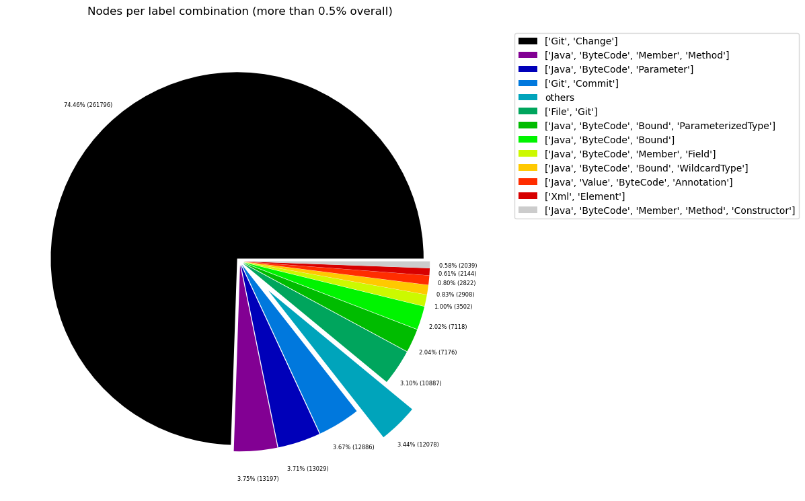
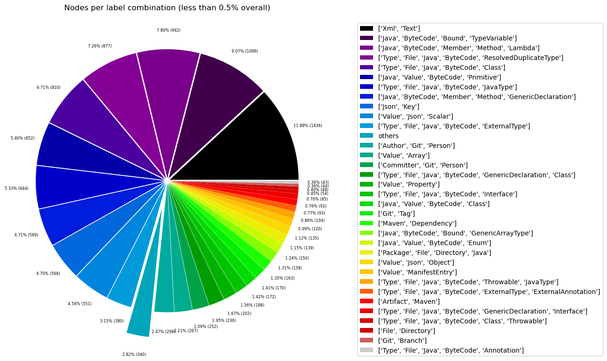
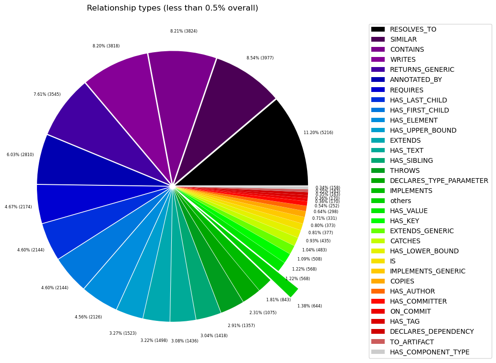

# Overview in General
   

This file contains a general overview of the data in the graph including node labels and relationships types.

### References
- [jqassistant](https://jqassistant.org)
- [Neo4j Python Driver](https://neo4j.com/docs/api/python-driver/current)

## Node Labels

### Table 1a - Highest node count by label combination

Lists the 30 label combinations with the highest number of nodes. The labels with the lowest node count are listed in table 1b.
The total list would sum up to the total number of labels (100%).

The whole table can be found in the CSV report `Node_label_combination_count`.

<table border="1" class="dataframe">
  <thead>
    <tr style="text-align: right;">
      <th></th>
      <th>nodeLabels</th>
      <th>nodesWithThatLabels</th>
      <th>nodesWithThatLabelsPercent</th>
    </tr>
  </thead>
  <tbody>
    <tr>
      <th>0</th>
      <td>[Java, ByteCode, Member, Method]</td>
      <td>13287</td>
      <td>20.322418</td>
    </tr>
    <tr>
      <th>1</th>
      <td>[Java, ByteCode, Parameter]</td>
      <td>13029</td>
      <td>19.927808</td>
    </tr>
    <tr>
      <th>2</th>
      <td>[Java, ByteCode, ParameterizedType, Bound]</td>
      <td>7176</td>
      <td>10.975666</td>
    </tr>
    <tr>
      <th>3</th>
      <td>[Java, ByteCode, Bound]</td>
      <td>7118</td>
      <td>10.886955</td>
    </tr>
    <tr>
      <th>4</th>
      <td>[Java, ByteCode, Member, Field]</td>
      <td>3511</td>
      <td>5.370062</td>
    </tr>
    <tr>
      <th>5</th>
      <td>[Java, ByteCode, Bound, WildcardType]</td>
      <td>2908</td>
      <td>4.447775</td>
    </tr>
    <tr>
      <th>6</th>
      <td>[Java, Value, ByteCode, Annotation]</td>
      <td>2822</td>
      <td>4.316239</td>
    </tr>
    <tr>
      <th>7</th>
      <td>[Xml, Element]</td>
      <td>2144</td>
      <td>3.279240</td>
    </tr>
    <tr>
      <th>8</th>
      <td>[Java, ByteCode, Member, Constructor, Method]</td>
      <td>2067</td>
      <td>3.161469</td>
    </tr>
    <tr>
      <th>9</th>
      <td>[Xml, Text]</td>
      <td>1436</td>
      <td>2.196357</td>
    </tr>
    <tr>
      <th>10</th>
      <td>[Java, ByteCode, Bound, TypeVariable]</td>
      <td>1096</td>
      <td>1.676328</td>
    </tr>
    <tr>
      <th>11</th>
      <td>[Java, ByteCode, Member, Method, Lambda]</td>
      <td>942</td>
      <td>1.440786</td>
    </tr>
    <tr>
      <th>12</th>
      <td>[Type, File, Java, ByteCode, ResolvedDuplicate...</td>
      <td>877</td>
      <td>1.341368</td>
    </tr>
    <tr>
      <th>13</th>
      <td>[Type, File, Java, ByteCode, Class]</td>
      <td>810</td>
      <td>1.238892</td>
    </tr>
    <tr>
      <th>14</th>
      <td>[Java, Value, ByteCode, Primitive]</td>
      <td>652</td>
      <td>0.997232</td>
    </tr>
    <tr>
      <th>15</th>
      <td>[Type, File, Java, ByteCode, JavaType]</td>
      <td>644</td>
      <td>0.984996</td>
    </tr>
    <tr>
      <th>16</th>
      <td>[Java, ByteCode, Member, Method, GenericDeclar...</td>
      <td>569</td>
      <td>0.870283</td>
    </tr>
    <tr>
      <th>17</th>
      <td>[Json, Key]</td>
      <td>568</td>
      <td>0.868754</td>
    </tr>
    <tr>
      <th>18</th>
      <td>[Value, Json, Scalar]</td>
      <td>551</td>
      <td>0.842752</td>
    </tr>
    <tr>
      <th>19</th>
      <td>[Type, File, Java, ByteCode, ExternalType]</td>
      <td>380</td>
      <td>0.581209</td>
    </tr>
    <tr>
      <th>20</th>
      <td>[Value, Array]</td>
      <td>267</td>
      <td>0.408376</td>
    </tr>
    <tr>
      <th>21</th>
      <td>[Type, File, Java, ByteCode, Class, GenericDec...</td>
      <td>236</td>
      <td>0.360961</td>
    </tr>
    <tr>
      <th>22</th>
      <td>[Value, Property]</td>
      <td>202</td>
      <td>0.308958</td>
    </tr>
    <tr>
      <th>23</th>
      <td>[Type, File, Java, ByteCode, Interface]</td>
      <td>188</td>
      <td>0.287545</td>
    </tr>
    <tr>
      <th>24</th>
      <td>[Java, Value, ByteCode, Class]</td>
      <td>172</td>
      <td>0.263073</td>
    </tr>
    <tr>
      <th>25</th>
      <td>[Maven, Dependency]</td>
      <td>163</td>
      <td>0.249308</td>
    </tr>
    <tr>
      <th>26</th>
      <td>[Java, ByteCode, Bound, GenericArrayType]</td>
      <td>158</td>
      <td>0.241660</td>
    </tr>
    <tr>
      <th>27</th>
      <td>[Java, Value, ByteCode, Enum]</td>
      <td>150</td>
      <td>0.229424</td>
    </tr>
    <tr>
      <th>28</th>
      <td>[Package, File, Directory, Java]</td>
      <td>139</td>
      <td>0.212600</td>
    </tr>
    <tr>
      <th>29</th>
      <td>[Value, Json, Object]</td>
      <td>135</td>
      <td>0.206482</td>
    </tr>
  </tbody>
</table>

### Chart 1a - Highest node count by label combination

Values under 0.5% will be grouped into "others" to get a cleaner plot. The group "others" is then broken down in Chart 1b.

    <Figure size 640x480 with 0 Axes>

    

    

### Table 1b - Lowest node count by label combination

Lists the 30 label combinations with the lowest number of nodes until they reach 0.5% of the total node count, which are shown above.

<table border="1" class="dataframe">
  <thead>
    <tr style="text-align: right;">
      <th></th>
      <th>nodeLabels</th>
      <th>nodesWithThatLabels</th>
      <th>nodesWithThatLabelsPercent</th>
    </tr>
  </thead>
  <tbody>
    <tr>
      <th>0</th>
      <td>[Analyze, Task, jQAssistant]</td>
      <td>1</td>
      <td>0.001529</td>
    </tr>
    <tr>
      <th>1</th>
      <td>[Package, File, Json, NPM]</td>
      <td>1</td>
      <td>0.001529</td>
    </tr>
    <tr>
      <th>2</th>
      <td>[File, TS, Scan]</td>
      <td>1</td>
      <td>0.001529</td>
    </tr>
    <tr>
      <th>3</th>
      <td>[Repository, File, Git]</td>
      <td>1</td>
      <td>0.001529</td>
    </tr>
    <tr>
      <th>4</th>
      <td>[Git, Tag]</td>
      <td>1</td>
      <td>0.001529</td>
    </tr>
    <tr>
      <th>5</th>
      <td>[Author, Git, Person]</td>
      <td>1</td>
      <td>0.001529</td>
    </tr>
    <tr>
      <th>6</th>
      <td>[Committer, Git, Person]</td>
      <td>1</td>
      <td>0.001529</td>
    </tr>
    <tr>
      <th>7</th>
      <td>[Git, Branch]</td>
      <td>1</td>
      <td>0.001529</td>
    </tr>
    <tr>
      <th>8</th>
      <td>[Git, Commit]</td>
      <td>1</td>
      <td>0.001529</td>
    </tr>
    <tr>
      <th>9</th>
      <td>[File, Json]</td>
      <td>2</td>
      <td>0.003059</td>
    </tr>
    <tr>
      <th>10</th>
      <td>[File]</td>
      <td>3</td>
      <td>0.004588</td>
    </tr>
    <tr>
      <th>11</th>
      <td>[Java, ByteCode, Member, Constructor, Method, ...</td>
      <td>4</td>
      <td>0.006118</td>
    </tr>
    <tr>
      <th>12</th>
      <td>[Maven, Exclusion]</td>
      <td>5</td>
      <td>0.007647</td>
    </tr>
    <tr>
      <th>13</th>
      <td>[Value, Json, Array]</td>
      <td>6</td>
      <td>0.009177</td>
    </tr>
    <tr>
      <th>14</th>
      <td>[Dependency, NPM]</td>
      <td>7</td>
      <td>0.010706</td>
    </tr>
    <tr>
      <th>15</th>
      <td>[Artifact, File, Jar, Archive, Zip, Java]</td>
      <td>9</td>
      <td>0.013765</td>
    </tr>
    <tr>
      <th>16</th>
      <td>[File, Java, Manifest]</td>
      <td>9</td>
      <td>0.013765</td>
    </tr>
    <tr>
      <th>17</th>
      <td>[Type, File, Java, ByteCode, Void]</td>
      <td>9</td>
      <td>0.013765</td>
    </tr>
    <tr>
      <th>18</th>
      <td>[File, Maven, Xml, Pom, Document]</td>
      <td>9</td>
      <td>0.013765</td>
    </tr>
    <tr>
      <th>19</th>
      <td>[Java, ManifestSection]</td>
      <td>9</td>
      <td>0.013765</td>
    </tr>
    <tr>
      <th>20</th>
      <td>[File, Java, ServiceLoader]</td>
      <td>10</td>
      <td>0.015295</td>
    </tr>
    <tr>
      <th>21</th>
      <td>[File, Java, Properties]</td>
      <td>12</td>
      <td>0.018354</td>
    </tr>
    <tr>
      <th>22</th>
      <td>[Maven, ExecutionGoal]</td>
      <td>16</td>
      <td>0.024472</td>
    </tr>
    <tr>
      <th>23</th>
      <td>[Maven, PluginExecution]</td>
      <td>16</td>
      <td>0.024472</td>
    </tr>
    <tr>
      <th>24</th>
      <td>[Type, File, Java, ByteCode, Throwable, Extern...</td>
      <td>16</td>
      <td>0.024472</td>
    </tr>
    <tr>
      <th>25</th>
      <td>[Xml, Attribute]</td>
      <td>18</td>
      <td>0.027531</td>
    </tr>
    <tr>
      <th>26</th>
      <td>[jQAssistant, Rule, Concept]</td>
      <td>19</td>
      <td>0.029060</td>
    </tr>
    <tr>
      <th>27</th>
      <td>[Maven, Plugin]</td>
      <td>21</td>
      <td>0.032119</td>
    </tr>
    <tr>
      <th>28</th>
      <td>[Maven, Configuration]</td>
      <td>21</td>
      <td>0.032119</td>
    </tr>
    <tr>
      <th>29</th>
      <td>[Type, File, Java, ByteCode, Throwable, Resolv...</td>
      <td>22</td>
      <td>0.033649</td>
    </tr>
  </tbody>
</table>

### Chart 1b - Lowest node count by label combination

Shows the lowest (less than 0.5% overall) node count label combinations. Therefore, this plot breaks down the "others" slice of the pie chart above. Values under 0.01% will be grouped into "others" to get a cleaner plot.

    <Figure size 640x480 with 0 Axes>

    

    

### Table 1c - Highest node count by single label

Lists the 40 labels with the highest number of nodes.
Doesn't sum up to the total number of nodes or 100% because one node can have multiple labels.
Helps to identify commonly used labels.

<table border="1" class="dataframe">
  <thead>
    <tr style="text-align: right;">
      <th></th>
      <th>nodeLabel</th>
      <th>nodesWithThatLabel</th>
      <th>nodesWithThatLabelPercent</th>
    </tr>
  </thead>
  <tbody>
    <tr>
      <th>0</th>
      <td>Java</td>
      <td>59467</td>
      <td>90.954559</td>
    </tr>
    <tr>
      <th>1</th>
      <td>ByteCode</td>
      <td>59279</td>
      <td>90.667013</td>
    </tr>
    <tr>
      <th>2</th>
      <td>Member</td>
      <td>20380</td>
      <td>31.171135</td>
    </tr>
    <tr>
      <th>3</th>
      <td>Bound</td>
      <td>18456</td>
      <td>28.228384</td>
    </tr>
    <tr>
      <th>4</th>
      <td>Method</td>
      <td>16869</td>
      <td>25.801074</td>
    </tr>
    <tr>
      <th>5</th>
      <td>Parameter</td>
      <td>13029</td>
      <td>19.927808</td>
    </tr>
    <tr>
      <th>6</th>
      <td>ParameterizedType</td>
      <td>7176</td>
      <td>10.975666</td>
    </tr>
    <tr>
      <th>7</th>
      <td>Value</td>
      <td>5077</td>
      <td>7.765253</td>
    </tr>
    <tr>
      <th>8</th>
      <td>File</td>
      <td>3862</td>
      <td>5.906915</td>
    </tr>
    <tr>
      <th>9</th>
      <td>Xml</td>
      <td>3643</td>
      <td>5.571955</td>
    </tr>
    <tr>
      <th>10</th>
      <td>Type</td>
      <td>3618</td>
      <td>5.533718</td>
    </tr>
    <tr>
      <th>11</th>
      <td>Field</td>
      <td>3511</td>
      <td>5.370062</td>
    </tr>
    <tr>
      <th>12</th>
      <td>WildcardType</td>
      <td>2908</td>
      <td>4.447775</td>
    </tr>
    <tr>
      <th>13</th>
      <td>Annotation</td>
      <td>2865</td>
      <td>4.382007</td>
    </tr>
    <tr>
      <th>14</th>
      <td>Element</td>
      <td>2144</td>
      <td>3.279240</td>
    </tr>
    <tr>
      <th>15</th>
      <td>Constructor</td>
      <td>2071</td>
      <td>3.167587</td>
    </tr>
    <tr>
      <th>16</th>
      <td>Text</td>
      <td>1436</td>
      <td>2.196357</td>
    </tr>
    <tr>
      <th>17</th>
      <td>Class</td>
      <td>1272</td>
      <td>1.945519</td>
    </tr>
    <tr>
      <th>18</th>
      <td>Json</td>
      <td>1263</td>
      <td>1.931754</td>
    </tr>
    <tr>
      <th>19</th>
      <td>TypeVariable</td>
      <td>1096</td>
      <td>1.676328</td>
    </tr>
    <tr>
      <th>20</th>
      <td>Lambda</td>
      <td>942</td>
      <td>1.440786</td>
    </tr>
    <tr>
      <th>21</th>
      <td>ResolvedDuplicateType</td>
      <td>899</td>
      <td>1.375017</td>
    </tr>
    <tr>
      <th>22</th>
      <td>GenericDeclaration</td>
      <td>894</td>
      <td>1.367370</td>
    </tr>
    <tr>
      <th>23</th>
      <td>JavaType</td>
      <td>748</td>
      <td>1.144063</td>
    </tr>
    <tr>
      <th>24</th>
      <td>Primitive</td>
      <td>652</td>
      <td>0.997232</td>
    </tr>
    <tr>
      <th>25</th>
      <td>Key</td>
      <td>568</td>
      <td>0.868754</td>
    </tr>
    <tr>
      <th>26</th>
      <td>Scalar</td>
      <td>551</td>
      <td>0.842752</td>
    </tr>
    <tr>
      <th>27</th>
      <td>ExternalType</td>
      <td>489</td>
      <td>0.747924</td>
    </tr>
    <tr>
      <th>28</th>
      <td>Maven</td>
      <td>343</td>
      <td>0.524617</td>
    </tr>
    <tr>
      <th>29</th>
      <td>Array</td>
      <td>273</td>
      <td>0.417552</td>
    </tr>
    <tr>
      <th>30</th>
      <td>Interface</td>
      <td>273</td>
      <td>0.417552</td>
    </tr>
    <tr>
      <th>31</th>
      <td>Property</td>
      <td>202</td>
      <td>0.308958</td>
    </tr>
    <tr>
      <th>32</th>
      <td>Throwable</td>
      <td>196</td>
      <td>0.299781</td>
    </tr>
    <tr>
      <th>33</th>
      <td>Directory</td>
      <td>187</td>
      <td>0.286016</td>
    </tr>
    <tr>
      <th>34</th>
      <td>Enum</td>
      <td>178</td>
      <td>0.272250</td>
    </tr>
    <tr>
      <th>35</th>
      <td>Dependency</td>
      <td>170</td>
      <td>0.260014</td>
    </tr>
    <tr>
      <th>36</th>
      <td>GenericArrayType</td>
      <td>158</td>
      <td>0.241660</td>
    </tr>
    <tr>
      <th>37</th>
      <td>Package</td>
      <td>140</td>
      <td>0.214129</td>
    </tr>
    <tr>
      <th>38</th>
      <td>Object</td>
      <td>135</td>
      <td>0.206482</td>
    </tr>
    <tr>
      <th>39</th>
      <td>ManifestEntry</td>
      <td>120</td>
      <td>0.183540</td>
    </tr>
  </tbody>
</table>

### Chart 1c - Highest node count by label

Shows the 40 labels with the highest number of nodes.

    <Figure size 640x480 with 0 Axes>

    

    

## Relationship Types

### Table 2a - Highest relationship count by type

Lists the 30 relationship types with the highest number of occurrences.
The whole table can be found in the CSV report `Relationship_type_count`.

    Total number of relationships: 209889

<table border="1" class="dataframe">
  <thead>
    <tr style="text-align: right;">
      <th></th>
      <th>relationshipType</th>
      <th>nodesWithThatRelationshipType</th>
      <th>nodesWithThatRelationshipTypePercent</th>
    </tr>
  </thead>
  <tbody>
    <tr>
      <th>0</th>
      <td>INVOKES</td>
      <td>36005</td>
      <td>17.154305</td>
    </tr>
    <tr>
      <th>1</th>
      <td>DEPENDS_ON</td>
      <td>21931</td>
      <td>10.448856</td>
    </tr>
    <tr>
      <th>2</th>
      <td>OF_TYPE</td>
      <td>21394</td>
      <td>10.193007</td>
    </tr>
    <tr>
      <th>3</th>
      <td>DECLARES</td>
      <td>20825</td>
      <td>9.921911</td>
    </tr>
    <tr>
      <th>4</th>
      <td>OF_RAW_TYPE</td>
      <td>17093</td>
      <td>8.143828</td>
    </tr>
    <tr>
      <th>5</th>
      <td>HAS</td>
      <td>14125</td>
      <td>6.729748</td>
    </tr>
    <tr>
      <th>6</th>
      <td>RETURNS</td>
      <td>12578</td>
      <td>5.992691</td>
    </tr>
    <tr>
      <th>7</th>
      <td>READS</td>
      <td>9166</td>
      <td>4.367070</td>
    </tr>
    <tr>
      <th>8</th>
      <td>HAS_ACTUAL_TYPE_ARGUMENT</td>
      <td>8288</td>
      <td>3.948754</td>
    </tr>
    <tr>
      <th>9</th>
      <td>OF_GENERIC_TYPE</td>
      <td>5906</td>
      <td>2.813868</td>
    </tr>
    <tr>
      <th>10</th>
      <td>SIMILAR</td>
      <td>3977</td>
      <td>1.894811</td>
    </tr>
    <tr>
      <th>11</th>
      <td>CONTAINS</td>
      <td>3824</td>
      <td>1.821915</td>
    </tr>
    <tr>
      <th>12</th>
      <td>WRITES</td>
      <td>3818</td>
      <td>1.819057</td>
    </tr>
    <tr>
      <th>13</th>
      <td>RETURNS_GENERIC</td>
      <td>3545</td>
      <td>1.688988</td>
    </tr>
    <tr>
      <th>14</th>
      <td>ANNOTATED_BY</td>
      <td>2810</td>
      <td>1.338803</td>
    </tr>
    <tr>
      <th>15</th>
      <td>RESOLVES_TO</td>
      <td>2619</td>
      <td>1.247802</td>
    </tr>
    <tr>
      <th>16</th>
      <td>REQUIRES</td>
      <td>2174</td>
      <td>1.035786</td>
    </tr>
    <tr>
      <th>17</th>
      <td>HAS_FIRST_CHILD</td>
      <td>2144</td>
      <td>1.021492</td>
    </tr>
    <tr>
      <th>18</th>
      <td>HAS_LAST_CHILD</td>
      <td>2144</td>
      <td>1.021492</td>
    </tr>
    <tr>
      <th>19</th>
      <td>HAS_ELEMENT</td>
      <td>2126</td>
      <td>1.012916</td>
    </tr>
    <tr>
      <th>20</th>
      <td>HAS_UPPER_BOUND</td>
      <td>1523</td>
      <td>0.725622</td>
    </tr>
    <tr>
      <th>21</th>
      <td>EXTENDS</td>
      <td>1498</td>
      <td>0.713711</td>
    </tr>
    <tr>
      <th>22</th>
      <td>HAS_TEXT</td>
      <td>1436</td>
      <td>0.684171</td>
    </tr>
    <tr>
      <th>23</th>
      <td>HAS_SIBLING</td>
      <td>1418</td>
      <td>0.675595</td>
    </tr>
    <tr>
      <th>24</th>
      <td>THROWS</td>
      <td>1357</td>
      <td>0.646532</td>
    </tr>
    <tr>
      <th>25</th>
      <td>DECLARES_TYPE_PARAMETER</td>
      <td>1075</td>
      <td>0.512175</td>
    </tr>
    <tr>
      <th>26</th>
      <td>IMPLEMENTS</td>
      <td>843</td>
      <td>0.401641</td>
    </tr>
    <tr>
      <th>27</th>
      <td>HAS_KEY</td>
      <td>568</td>
      <td>0.270619</td>
    </tr>
    <tr>
      <th>28</th>
      <td>HAS_VALUE</td>
      <td>568</td>
      <td>0.270619</td>
    </tr>
    <tr>
      <th>29</th>
      <td>EXTENDS_GENERIC</td>
      <td>508</td>
      <td>0.242033</td>
    </tr>
  </tbody>
</table>

### Chart 2a - Highest relationship count by type

Values under 0.5% will be grouped into "others" to get a cleaner plot. The group "others" is then broken down in the second chart.

    <Figure size 640x480 with 0 Axes>

    

    

### Table 2b - Lowest relationship count by type

Lists the 30 relationships type with the lowest number of occurrences up to 0.5% of the total node count. This is essentially breaking down the "others" slice from the chart above.

<table border="1" class="dataframe">
  <thead>
    <tr style="text-align: right;">
      <th></th>
      <th>relationshipType</th>
      <th>nodesWithThatRelationshipType</th>
      <th>nodesWithThatRelationshipTypePercent</th>
    </tr>
  </thead>
  <tbody>
    <tr>
      <th>0</th>
      <td>ON_COMMIT</td>
      <td>1</td>
      <td>0.000476</td>
    </tr>
    <tr>
      <th>1</th>
      <td>HAS_AUTHOR</td>
      <td>1</td>
      <td>0.000476</td>
    </tr>
    <tr>
      <th>2</th>
      <td>HAS_BRANCH</td>
      <td>1</td>
      <td>0.000476</td>
    </tr>
    <tr>
      <th>3</th>
      <td>HAS_TAG</td>
      <td>1</td>
      <td>0.000476</td>
    </tr>
    <tr>
      <th>4</th>
      <td>HAS_COMMITTER</td>
      <td>1</td>
      <td>0.000476</td>
    </tr>
    <tr>
      <th>5</th>
      <td>HAS_PROPERTY</td>
      <td>1</td>
      <td>0.000476</td>
    </tr>
    <tr>
      <th>6</th>
      <td>HAS_COMMIT</td>
      <td>1</td>
      <td>0.000476</td>
    </tr>
    <tr>
      <th>7</th>
      <td>HAS_HEAD</td>
      <td>2</td>
      <td>0.000953</td>
    </tr>
    <tr>
      <th>8</th>
      <td>COMMITTED</td>
      <td>2</td>
      <td>0.000953</td>
    </tr>
    <tr>
      <th>9</th>
      <td>THROWS_GENERIC</td>
      <td>5</td>
      <td>0.002382</td>
    </tr>
    <tr>
      <th>10</th>
      <td>EXCLUDES</td>
      <td>5</td>
      <td>0.002382</td>
    </tr>
    <tr>
      <th>11</th>
      <td>DECLARES_DEV_DEPENDENCY</td>
      <td>7</td>
      <td>0.003335</td>
    </tr>
    <tr>
      <th>12</th>
      <td>HAS_PARENT</td>
      <td>9</td>
      <td>0.004288</td>
    </tr>
    <tr>
      <th>13</th>
      <td>DESCRIBES</td>
      <td>9</td>
      <td>0.004288</td>
    </tr>
    <tr>
      <th>14</th>
      <td>HAS_ROOT_ELEMENT</td>
      <td>13</td>
      <td>0.006194</td>
    </tr>
    <tr>
      <th>15</th>
      <td>HAS_EXECUTION</td>
      <td>16</td>
      <td>0.007623</td>
    </tr>
    <tr>
      <th>16</th>
      <td>HAS_GOAL</td>
      <td>16</td>
      <td>0.007623</td>
    </tr>
    <tr>
      <th>17</th>
      <td>OF_NAMESPACE</td>
      <td>18</td>
      <td>0.008576</td>
    </tr>
    <tr>
      <th>18</th>
      <td>HAS_ATTRIBUTE</td>
      <td>18</td>
      <td>0.008576</td>
    </tr>
    <tr>
      <th>19</th>
      <td>INCLUDES_CONCEPT</td>
      <td>19</td>
      <td>0.009052</td>
    </tr>
    <tr>
      <th>20</th>
      <td>USES_PLUGIN</td>
      <td>21</td>
      <td>0.010005</td>
    </tr>
    <tr>
      <th>21</th>
      <td>REQUIRES_TYPE_PARAMETER</td>
      <td>21</td>
      <td>0.010005</td>
    </tr>
    <tr>
      <th>22</th>
      <td>IS_ARTIFACT</td>
      <td>21</td>
      <td>0.010005</td>
    </tr>
    <tr>
      <th>23</th>
      <td>HAS_CONFIGURATION</td>
      <td>21</td>
      <td>0.010005</td>
    </tr>
    <tr>
      <th>24</th>
      <td>REQUIRES_CONCEPT</td>
      <td>28</td>
      <td>0.013340</td>
    </tr>
    <tr>
      <th>25</th>
      <td>HAS_DEFAULT</td>
      <td>36</td>
      <td>0.017152</td>
    </tr>
    <tr>
      <th>26</th>
      <td>DECLARES_NAMESPACE</td>
      <td>36</td>
      <td>0.017152</td>
    </tr>
    <tr>
      <th>27</th>
      <td>CONTAINS_VALUE</td>
      <td>121</td>
      <td>0.057650</td>
    </tr>
    <tr>
      <th>28</th>
      <td>HAS_COMPONENT_TYPE</td>
      <td>158</td>
      <td>0.075278</td>
    </tr>
    <tr>
      <th>29</th>
      <td>TO_ARTIFACT</td>
      <td>163</td>
      <td>0.077660</td>
    </tr>
  </tbody>
</table>

### Chart 2b - Lowest relationship count by type

Shows the lowest (less than 0.5% overall) relationship types. This plot breaks down the "others" slice of the pie chart above. Values under 0.01% will be grouped into "others" to get a cleaner plot.

    <Figure size 640x480 with 0 Axes>

    

    

## Node labels with their relationships

### Table 3a - Highest relationship count by node labels and relationship type

Lists the 30 node labels and their relationship types with the highest number of occurrences.

<table border="1" class="dataframe">
  <thead>
    <tr style="text-align: right;">
      <th></th>
      <th>sourceLabels</th>
      <th>relationType</th>
      <th>targetLabels</th>
      <th>numberOfRelationships</th>
      <th>numberOfNodesWithSameLabelsAsSource</th>
      <th>numberOfNodesWithSameLabelsAsTarget</th>
      <th>densityInPercent</th>
    </tr>
  </thead>
  <tbody>
    <tr>
      <th>0</th>
      <td>[Java, ByteCode, Member, Method]</td>
      <td>INVOKES</td>
      <td>[Java, ByteCode, Member, Method]</td>
      <td>21955</td>
      <td>13195</td>
      <td>13195</td>
      <td>0.012610</td>
    </tr>
    <tr>
      <th>1</th>
      <td>[Java, ByteCode, Member, Method]</td>
      <td>HAS</td>
      <td>[Java, ByteCode, Parameter]</td>
      <td>8361</td>
      <td>13195</td>
      <td>13029</td>
      <td>0.004863</td>
    </tr>
    <tr>
      <th>2</th>
      <td>[Java, ByteCode, Member, Method]</td>
      <td>READS</td>
      <td>[Java, ByteCode, Member, Field]</td>
      <td>8192</td>
      <td>13195</td>
      <td>3511</td>
      <td>0.017683</td>
    </tr>
    <tr>
      <th>3</th>
      <td>[Java, ByteCode, Parameter]</td>
      <td>OF_TYPE</td>
      <td>[Type, File, Java, ByteCode, JavaType]</td>
      <td>6079</td>
      <td>13029</td>
      <td>644</td>
      <td>0.072449</td>
    </tr>
    <tr>
      <th>4</th>
      <td>[Type, File, Java, ByteCode, Class]</td>
      <td>DECLARES</td>
      <td>[Java, ByteCode, Member, Method]</td>
      <td>5016</td>
      <td>760</td>
      <td>13195</td>
      <td>0.050019</td>
    </tr>
    <tr>
      <th>5</th>
      <td>[Type, File, Java, ByteCode, Class]</td>
      <td>DEPENDS_ON</td>
      <td>[Type, File, Java, ByteCode, JavaType]</td>
      <td>3995</td>
      <td>760</td>
      <td>644</td>
      <td>0.816239</td>
    </tr>
    <tr>
      <th>6</th>
      <td>[Java, ByteCode, Bound]</td>
      <td>OF_RAW_TYPE</td>
      <td>[Type, File, Java, ByteCode, JavaType]</td>
      <td>3427</td>
      <td>7118</td>
      <td>644</td>
      <td>0.074760</td>
    </tr>
    <tr>
      <th>7</th>
      <td>[Java, ByteCode, ParameterizedType, Bound]</td>
      <td>OF_RAW_TYPE</td>
      <td>[Type, File, Java, ByteCode, JavaType]</td>
      <td>3053</td>
      <td>7176</td>
      <td>644</td>
      <td>0.066063</td>
    </tr>
    <tr>
      <th>8</th>
      <td>[Java, ByteCode, ParameterizedType, Bound]</td>
      <td>HAS_ACTUAL_TYPE_ARGUMENT</td>
      <td>[Java, ByteCode, Bound, WildcardType]</td>
      <td>2908</td>
      <td>7176</td>
      <td>2908</td>
      <td>0.013935</td>
    </tr>
    <tr>
      <th>9</th>
      <td>[Java, ByteCode, Parameter]</td>
      <td>OF_GENERIC_TYPE</td>
      <td>[Java, ByteCode, ParameterizedType, Bound]</td>
      <td>2657</td>
      <td>13029</td>
      <td>7176</td>
      <td>0.002842</td>
    </tr>
    <tr>
      <th>10</th>
      <td>[Java, ByteCode, ParameterizedType, Bound]</td>
      <td>HAS_ACTUAL_TYPE_ARGUMENT</td>
      <td>[Java, ByteCode, Bound, TypeVariable]</td>
      <td>2454</td>
      <td>7176</td>
      <td>1096</td>
      <td>0.031202</td>
    </tr>
    <tr>
      <th>11</th>
      <td>[Java, ByteCode, Member, Constructor, Method]</td>
      <td>WRITES</td>
      <td>[Java, ByteCode, Member, Field]</td>
      <td>2438</td>
      <td>2067</td>
      <td>3511</td>
      <td>0.033594</td>
    </tr>
    <tr>
      <th>12</th>
      <td>[Java, Value, ByteCode, Annotation]</td>
      <td>OF_TYPE</td>
      <td>[Type, File, Java, ByteCode, ExternalAnnotatio...</td>
      <td>2341</td>
      <td>2822</td>
      <td>93</td>
      <td>0.891993</td>
    </tr>
    <tr>
      <th>13</th>
      <td>[Xml, Element]</td>
      <td>HAS_ELEMENT</td>
      <td>[Xml, Element]</td>
      <td>2126</td>
      <td>2144</td>
      <td>2144</td>
      <td>0.046250</td>
    </tr>
    <tr>
      <th>14</th>
      <td>[Java, ByteCode, Member, Constructor, Method]</td>
      <td>INVOKES</td>
      <td>[Java, ByteCode, Member, Constructor, Method]</td>
      <td>2123</td>
      <td>2067</td>
      <td>2067</td>
      <td>0.049690</td>
    </tr>
    <tr>
      <th>15</th>
      <td>[Type, File, Java, ByteCode, Class]</td>
      <td>DECLARES</td>
      <td>[Java, ByteCode, Member, Field]</td>
      <td>2090</td>
      <td>760</td>
      <td>3511</td>
      <td>0.078325</td>
    </tr>
    <tr>
      <th>16</th>
      <td>[Java, ByteCode, Member, Method]</td>
      <td>RETURNS</td>
      <td>[Type, File, Java, ByteCode, JavaType]</td>
      <td>2078</td>
      <td>13195</td>
      <td>644</td>
      <td>0.024454</td>
    </tr>
    <tr>
      <th>17</th>
      <td>[Type, File, Java, ByteCode, Class, GenericDec...</td>
      <td>DECLARES</td>
      <td>[Java, ByteCode, Member, Method]</td>
      <td>2070</td>
      <td>229</td>
      <td>13195</td>
      <td>0.068506</td>
    </tr>
    <tr>
      <th>18</th>
      <td>[Java, ByteCode, Member, Method]</td>
      <td>INVOKES</td>
      <td>[Java, ByteCode, Member, Constructor, Method]</td>
      <td>2031</td>
      <td>13195</td>
      <td>2067</td>
      <td>0.007447</td>
    </tr>
    <tr>
      <th>19</th>
      <td>[Java, ByteCode, Member, Constructor, Method]</td>
      <td>HAS</td>
      <td>[Java, ByteCode, Parameter]</td>
      <td>2027</td>
      <td>2067</td>
      <td>13029</td>
      <td>0.007527</td>
    </tr>
    <tr>
      <th>20</th>
      <td>[Java, ByteCode, Parameter]</td>
      <td>OF_GENERIC_TYPE</td>
      <td>[Java, ByteCode, Bound]</td>
      <td>2022</td>
      <td>13029</td>
      <td>7118</td>
      <td>0.002180</td>
    </tr>
    <tr>
      <th>21</th>
      <td>[Java, ByteCode, Member, Method, Lambda]</td>
      <td>INVOKES</td>
      <td>[Java, ByteCode, Member, Method]</td>
      <td>1889</td>
      <td>942</td>
      <td>13195</td>
      <td>0.015197</td>
    </tr>
    <tr>
      <th>22</th>
      <td>[Java, ByteCode, Member, Constructor, Method]</td>
      <td>INVOKES</td>
      <td>[Java, ByteCode, Member, Method]</td>
      <td>1817</td>
      <td>2067</td>
      <td>13195</td>
      <td>0.006662</td>
    </tr>
    <tr>
      <th>23</th>
      <td>[Java, ByteCode, ParameterizedType, Bound]</td>
      <td>HAS_ACTUAL_TYPE_ARGUMENT</td>
      <td>[Java, ByteCode, Bound]</td>
      <td>1807</td>
      <td>7176</td>
      <td>7118</td>
      <td>0.003538</td>
    </tr>
    <tr>
      <th>24</th>
      <td>[Java, ByteCode, Member, Method]</td>
      <td>RETURNS</td>
      <td>[Type, File, Java, ByteCode, Void]</td>
      <td>1776</td>
      <td>13195</td>
      <td>9</td>
      <td>1.495516</td>
    </tr>
    <tr>
      <th>25</th>
      <td>[Java, ByteCode, Parameter]</td>
      <td>ANNOTATED_BY</td>
      <td>[Java, Value, ByteCode, Annotation]</td>
      <td>1731</td>
      <td>13029</td>
      <td>2822</td>
      <td>0.004708</td>
    </tr>
    <tr>
      <th>26</th>
      <td>[Java, ByteCode, Member, Method, GenericDeclar...</td>
      <td>INVOKES</td>
      <td>[Java, ByteCode, Member, Method]</td>
      <td>1711</td>
      <td>557</td>
      <td>13195</td>
      <td>0.023280</td>
    </tr>
    <tr>
      <th>27</th>
      <td>[Java, ByteCode, ParameterizedType, Bound]</td>
      <td>OF_RAW_TYPE</td>
      <td>[Type, File, Java, ByteCode, GenericDeclaratio...</td>
      <td>1535</td>
      <td>7176</td>
      <td>71</td>
      <td>0.301278</td>
    </tr>
    <tr>
      <th>28</th>
      <td>[Type, File, Java, ByteCode, JavaType]</td>
      <td>DECLARES</td>
      <td>[Java, ByteCode, Member, Method]</td>
      <td>1509</td>
      <td>644</td>
      <td>13195</td>
      <td>0.017758</td>
    </tr>
    <tr>
      <th>29</th>
      <td>[Java, ByteCode, Parameter]</td>
      <td>OF_TYPE</td>
      <td>[Type, File, Java, ByteCode, ResolvedDuplicate...</td>
      <td>1498</td>
      <td>13029</td>
      <td>877</td>
      <td>0.013110</td>
    </tr>
  </tbody>
</table>

## Graph Density

    total_number_of_nodes (vertices): 65381
    total_number_of_relationships (edges): 209889
    -> total directed graph density: 4.910132405115117e-05
    -> total directed graph density in percent: 0.004910132405115117

