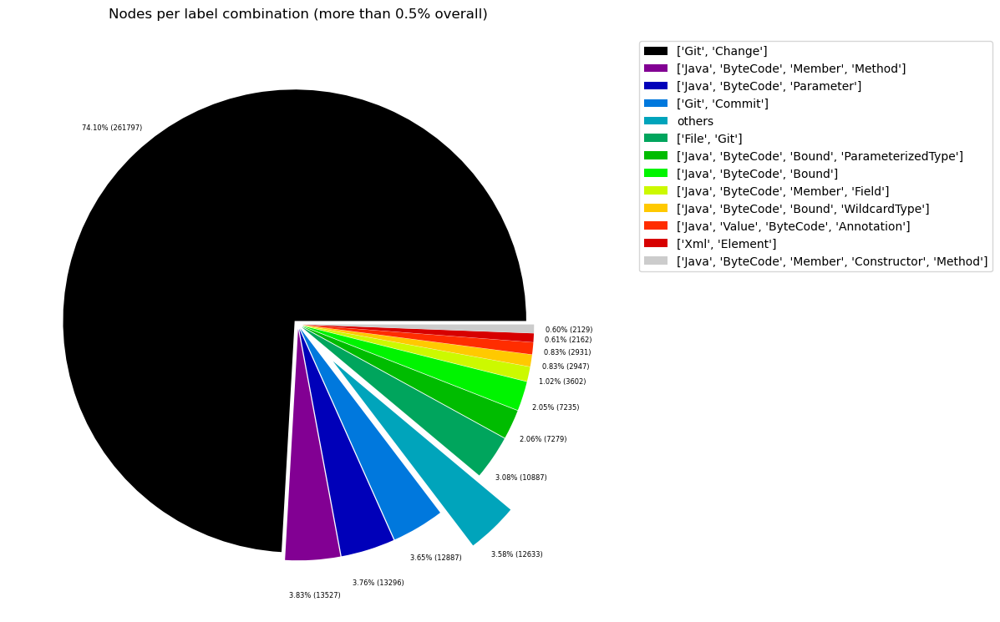
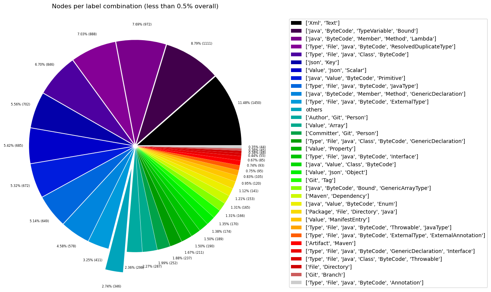
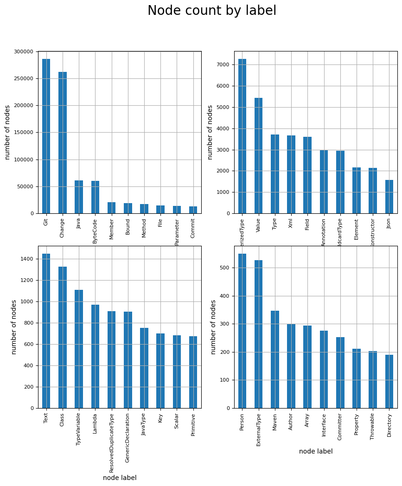
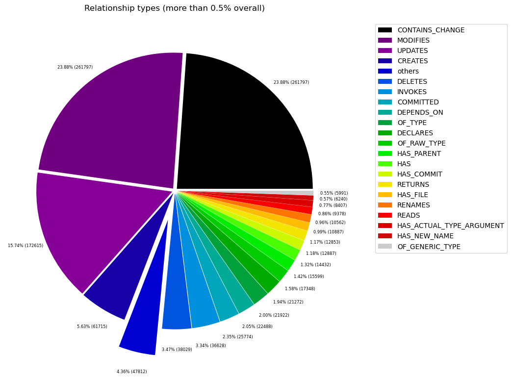
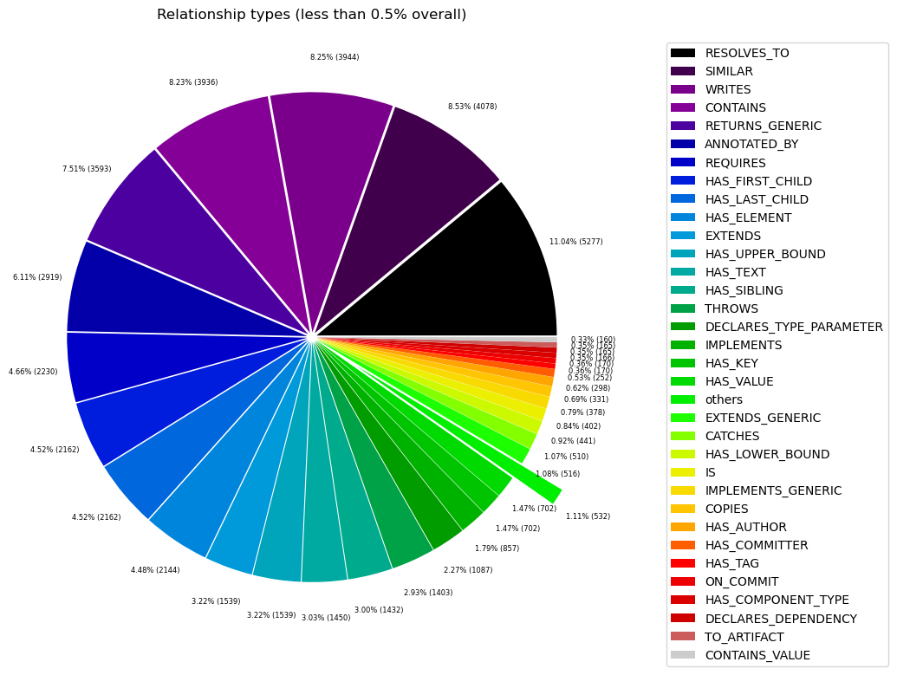

# Overview in General
   

This file contains a general overview of the data in the graph including node labels and relationships types.

### References
- [jqassistant](https://jqassistant.org)
- [Neo4j Python Driver](https://neo4j.com/docs/api/python-driver/current)

## Node Labels

### Table 1a - Highest node count by label combination

Lists the 30 label combinations with the highest number of nodes. The labels with the lowest node count are listed in table 1b.
The total list would sum up to the total number of labels (100%).

The whole table can be found in the CSV report `Node_label_combination_count`.

<table border="1" class="dataframe">
  <thead>
    <tr style="text-align: right;">
      <th></th>
      <th>nodeLabels</th>
      <th>nodesWithThatLabels</th>
      <th>nodesWithThatLabelsPercent</th>
    </tr>
  </thead>
  <tbody>
    <tr>
      <th>0</th>
      <td>[Git, Change]</td>
      <td>261797</td>
      <td>74.098174</td>
    </tr>
    <tr>
      <th>1</th>
      <td>[Java, ByteCode, Member, Method]</td>
      <td>13527</td>
      <td>3.828638</td>
    </tr>
    <tr>
      <th>2</th>
      <td>[Java, ByteCode, Parameter]</td>
      <td>13296</td>
      <td>3.763257</td>
    </tr>
    <tr>
      <th>3</th>
      <td>[Git, Commit]</td>
      <td>12887</td>
      <td>3.647495</td>
    </tr>
    <tr>
      <th>4</th>
      <td>[File, Git]</td>
      <td>10887</td>
      <td>3.081421</td>
    </tr>
    <tr>
      <th>5</th>
      <td>[Java, ByteCode, Bound, ParameterizedType]</td>
      <td>7279</td>
      <td>2.060225</td>
    </tr>
    <tr>
      <th>6</th>
      <td>[Java, ByteCode, Bound]</td>
      <td>7235</td>
      <td>2.047771</td>
    </tr>
    <tr>
      <th>7</th>
      <td>[Java, ByteCode, Member, Field]</td>
      <td>3602</td>
      <td>1.019498</td>
    </tr>
    <tr>
      <th>8</th>
      <td>[Java, ByteCode, Bound, WildcardType]</td>
      <td>2947</td>
      <td>0.834109</td>
    </tr>
    <tr>
      <th>9</th>
      <td>[Java, Value, ByteCode, Annotation]</td>
      <td>2931</td>
      <td>0.829581</td>
    </tr>
    <tr>
      <th>10</th>
      <td>[Xml, Element]</td>
      <td>2162</td>
      <td>0.611925</td>
    </tr>
    <tr>
      <th>11</th>
      <td>[Java, ByteCode, Member, Constructor, Method]</td>
      <td>2128</td>
      <td>0.602302</td>
    </tr>
    <tr>
      <th>12</th>
      <td>[Xml, Text]</td>
      <td>1450</td>
      <td>0.410403</td>
    </tr>
    <tr>
      <th>13</th>
      <td>[Java, ByteCode, TypeVariable, Bound]</td>
      <td>1111</td>
      <td>0.314454</td>
    </tr>
    <tr>
      <th>14</th>
      <td>[Java, ByteCode, Member, Method, Lambda]</td>
      <td>972</td>
      <td>0.275112</td>
    </tr>
    <tr>
      <th>15</th>
      <td>[Type, File, Java, ByteCode, ResolvedDuplicate...</td>
      <td>888</td>
      <td>0.251337</td>
    </tr>
    <tr>
      <th>16</th>
      <td>[Type, File, Java, Class, ByteCode]</td>
      <td>846</td>
      <td>0.239449</td>
    </tr>
    <tr>
      <th>17</th>
      <td>[Json, Key]</td>
      <td>702</td>
      <td>0.198692</td>
    </tr>
    <tr>
      <th>18</th>
      <td>[Value, Json, Scalar]</td>
      <td>685</td>
      <td>0.193880</td>
    </tr>
    <tr>
      <th>19</th>
      <td>[Java, Value, ByteCode, Primitive]</td>
      <td>672</td>
      <td>0.190201</td>
    </tr>
    <tr>
      <th>20</th>
      <td>[Type, File, Java, ByteCode, JavaType]</td>
      <td>649</td>
      <td>0.183691</td>
    </tr>
    <tr>
      <th>21</th>
      <td>[Java, ByteCode, Member, Method, GenericDeclar...</td>
      <td>578</td>
      <td>0.163595</td>
    </tr>
    <tr>
      <th>22</th>
      <td>[Type, File, Java, ByteCode, ExternalType]</td>
      <td>411</td>
      <td>0.116328</td>
    </tr>
    <tr>
      <th>23</th>
      <td>[Author, Git, Person]</td>
      <td>298</td>
      <td>0.084345</td>
    </tr>
    <tr>
      <th>24</th>
      <td>[Value, Array]</td>
      <td>287</td>
      <td>0.081232</td>
    </tr>
    <tr>
      <th>25</th>
      <td>[Committer, Git, Person]</td>
      <td>252</td>
      <td>0.071325</td>
    </tr>
    <tr>
      <th>26</th>
      <td>[Type, File, Java, Class, ByteCode, GenericDec...</td>
      <td>237</td>
      <td>0.067080</td>
    </tr>
    <tr>
      <th>27</th>
      <td>[Value, Property]</td>
      <td>211</td>
      <td>0.059721</td>
    </tr>
    <tr>
      <th>28</th>
      <td>[Type, File, Java, ByteCode, Interface]</td>
      <td>190</td>
      <td>0.053777</td>
    </tr>
    <tr>
      <th>29</th>
      <td>[Java, Value, Class, ByteCode]</td>
      <td>189</td>
      <td>0.053494</td>
    </tr>
  </tbody>
</table>

### Chart 1a - Highest node count by label combination

Values under 0.5% will be grouped into "others" to get a cleaner plot. The group "others" is then broken down in Chart 1b.

    <Figure size 640x480 with 0 Axes>

    

    

### Table 1b - Lowest node count by label combination

Lists the 30 label combinations with the lowest number of nodes until they reach 0.5% of the total node count, which are shown above.

<table border="1" class="dataframe">
  <thead>
    <tr style="text-align: right;">
      <th></th>
      <th>nodeLabels</th>
      <th>nodesWithThatLabels</th>
      <th>nodesWithThatLabelsPercent</th>
    </tr>
  </thead>
  <tbody>
    <tr>
      <th>0</th>
      <td>[Analyze, Task, jQAssistant]</td>
      <td>1</td>
      <td>0.000283</td>
    </tr>
    <tr>
      <th>1</th>
      <td>[Package, File, Json, NPM]</td>
      <td>1</td>
      <td>0.000283</td>
    </tr>
    <tr>
      <th>2</th>
      <td>[Repository, File, Git]</td>
      <td>1</td>
      <td>0.000283</td>
    </tr>
    <tr>
      <th>3</th>
      <td>[File, TS, Scan]</td>
      <td>1</td>
      <td>0.000283</td>
    </tr>
    <tr>
      <th>4</th>
      <td>[File, Json]</td>
      <td>2</td>
      <td>0.000566</td>
    </tr>
    <tr>
      <th>5</th>
      <td>[File]</td>
      <td>3</td>
      <td>0.000849</td>
    </tr>
    <tr>
      <th>6</th>
      <td>[Java, ByteCode, Member, Constructor, Method, ...</td>
      <td>4</td>
      <td>0.001132</td>
    </tr>
    <tr>
      <th>7</th>
      <td>[Maven, Exclusion]</td>
      <td>5</td>
      <td>0.001415</td>
    </tr>
    <tr>
      <th>8</th>
      <td>[Value, Array, Json]</td>
      <td>6</td>
      <td>0.001698</td>
    </tr>
    <tr>
      <th>9</th>
      <td>[Dependency, NPM]</td>
      <td>7</td>
      <td>0.001981</td>
    </tr>
    <tr>
      <th>10</th>
      <td>[Type, File, Java, ByteCode, Void]</td>
      <td>9</td>
      <td>0.002547</td>
    </tr>
    <tr>
      <th>11</th>
      <td>[File, Maven, Xml, Pom, Document]</td>
      <td>9</td>
      <td>0.002547</td>
    </tr>
    <tr>
      <th>12</th>
      <td>[Java, ManifestSection]</td>
      <td>9</td>
      <td>0.002547</td>
    </tr>
    <tr>
      <th>13</th>
      <td>[File, Java, Manifest]</td>
      <td>9</td>
      <td>0.002547</td>
    </tr>
    <tr>
      <th>14</th>
      <td>[Artifact, File, Jar, Archive, Zip, Java]</td>
      <td>9</td>
      <td>0.002547</td>
    </tr>
    <tr>
      <th>15</th>
      <td>[File, Java, ServiceLoader]</td>
      <td>10</td>
      <td>0.002830</td>
    </tr>
    <tr>
      <th>16</th>
      <td>[File, Java, Properties]</td>
      <td>12</td>
      <td>0.003396</td>
    </tr>
    <tr>
      <th>17</th>
      <td>[Maven, PluginExecution]</td>
      <td>16</td>
      <td>0.004529</td>
    </tr>
    <tr>
      <th>18</th>
      <td>[Maven, ExecutionGoal]</td>
      <td>16</td>
      <td>0.004529</td>
    </tr>
    <tr>
      <th>19</th>
      <td>[Xml, Attribute]</td>
      <td>18</td>
      <td>0.005095</td>
    </tr>
    <tr>
      <th>20</th>
      <td>[jQAssistant, Rule, Concept]</td>
      <td>19</td>
      <td>0.005378</td>
    </tr>
    <tr>
      <th>21</th>
      <td>[Maven, Configuration]</td>
      <td>21</td>
      <td>0.005944</td>
    </tr>
    <tr>
      <th>22</th>
      <td>[Maven, Plugin]</td>
      <td>21</td>
      <td>0.005944</td>
    </tr>
    <tr>
      <th>23</th>
      <td>[Type, File, Java, ByteCode, Throwable, Extern...</td>
      <td>21</td>
      <td>0.005944</td>
    </tr>
    <tr>
      <th>24</th>
      <td>[Type, File, Java, ByteCode, Throwable, Resolv...</td>
      <td>22</td>
      <td>0.006227</td>
    </tr>
    <tr>
      <th>25</th>
      <td>[Type, File, Java, ByteCode, Enum]</td>
      <td>28</td>
      <td>0.007925</td>
    </tr>
    <tr>
      <th>26</th>
      <td>[Type, File, Java, ByteCode, PrimitiveType]</td>
      <td>30</td>
      <td>0.008491</td>
    </tr>
    <tr>
      <th>27</th>
      <td>[Xml, Namespace]</td>
      <td>36</td>
      <td>0.010189</td>
    </tr>
    <tr>
      <th>28</th>
      <td>[Type, File, Java, ByteCode, Annotation]</td>
      <td>44</td>
      <td>0.012454</td>
    </tr>
    <tr>
      <th>29</th>
      <td>[Git, Branch]</td>
      <td>45</td>
      <td>0.012737</td>
    </tr>
  </tbody>
</table>

### Chart 1b - Lowest node count by label combination

Shows the lowest (less than 0.5% overall) node count label combinations. Therefore, this plot breaks down the "others" slice of the pie chart above. Values under 0.01% will be grouped into "others" to get a cleaner plot.

    <Figure size 640x480 with 0 Axes>

    

    

### Table 1c - Highest node count by single label

Lists the 40 labels with the highest number of nodes.
Doesn't sum up to the total number of nodes or 100% because one node can have multiple labels.
Helps to identify commonly used labels.

<table border="1" class="dataframe">
  <thead>
    <tr style="text-align: right;">
      <th></th>
      <th>nodeLabel</th>
      <th>nodesWithThatLabel</th>
      <th>nodesWithThatLabelPercent</th>
    </tr>
  </thead>
  <tbody>
    <tr>
      <th>0</th>
      <td>Git</td>
      <td>286337</td>
      <td>81.043896</td>
    </tr>
    <tr>
      <th>1</th>
      <td>Change</td>
      <td>261797</td>
      <td>74.098174</td>
    </tr>
    <tr>
      <th>2</th>
      <td>Java</td>
      <td>60695</td>
      <td>17.178916</td>
    </tr>
    <tr>
      <th>3</th>
      <td>ByteCode</td>
      <td>60505</td>
      <td>17.125139</td>
    </tr>
    <tr>
      <th>4</th>
      <td>Member</td>
      <td>20811</td>
      <td>5.890278</td>
    </tr>
    <tr>
      <th>5</th>
      <td>Bound</td>
      <td>18738</td>
      <td>5.303543</td>
    </tr>
    <tr>
      <th>6</th>
      <td>Method</td>
      <td>17209</td>
      <td>4.870780</td>
    </tr>
    <tr>
      <th>7</th>
      <td>File</td>
      <td>14848</td>
      <td>4.202530</td>
    </tr>
    <tr>
      <th>8</th>
      <td>Parameter</td>
      <td>13296</td>
      <td>3.763257</td>
    </tr>
    <tr>
      <th>9</th>
      <td>Commit</td>
      <td>12887</td>
      <td>3.647495</td>
    </tr>
    <tr>
      <th>10</th>
      <td>ParameterizedType</td>
      <td>7279</td>
      <td>2.060225</td>
    </tr>
    <tr>
      <th>11</th>
      <td>Value</td>
      <td>5428</td>
      <td>1.536324</td>
    </tr>
    <tr>
      <th>12</th>
      <td>Type</td>
      <td>3715</td>
      <td>1.051482</td>
    </tr>
    <tr>
      <th>13</th>
      <td>Xml</td>
      <td>3675</td>
      <td>1.040160</td>
    </tr>
    <tr>
      <th>14</th>
      <td>Field</td>
      <td>3602</td>
      <td>1.019498</td>
    </tr>
    <tr>
      <th>15</th>
      <td>Annotation</td>
      <td>2975</td>
      <td>0.842034</td>
    </tr>
    <tr>
      <th>16</th>
      <td>WildcardType</td>
      <td>2947</td>
      <td>0.834109</td>
    </tr>
    <tr>
      <th>17</th>
      <td>Element</td>
      <td>2162</td>
      <td>0.611925</td>
    </tr>
    <tr>
      <th>18</th>
      <td>Constructor</td>
      <td>2132</td>
      <td>0.603434</td>
    </tr>
    <tr>
      <th>19</th>
      <td>Json</td>
      <td>1570</td>
      <td>0.444368</td>
    </tr>
    <tr>
      <th>20</th>
      <td>Text</td>
      <td>1450</td>
      <td>0.410403</td>
    </tr>
    <tr>
      <th>21</th>
      <td>Class</td>
      <td>1327</td>
      <td>0.375590</td>
    </tr>
    <tr>
      <th>22</th>
      <td>TypeVariable</td>
      <td>1111</td>
      <td>0.314454</td>
    </tr>
    <tr>
      <th>23</th>
      <td>Lambda</td>
      <td>972</td>
      <td>0.275112</td>
    </tr>
    <tr>
      <th>24</th>
      <td>ResolvedDuplicateType</td>
      <td>910</td>
      <td>0.257563</td>
    </tr>
    <tr>
      <th>25</th>
      <td>GenericDeclaration</td>
      <td>904</td>
      <td>0.255865</td>
    </tr>
    <tr>
      <th>26</th>
      <td>JavaType</td>
      <td>754</td>
      <td>0.213410</td>
    </tr>
    <tr>
      <th>27</th>
      <td>Key</td>
      <td>702</td>
      <td>0.198692</td>
    </tr>
    <tr>
      <th>28</th>
      <td>Scalar</td>
      <td>685</td>
      <td>0.193880</td>
    </tr>
    <tr>
      <th>29</th>
      <td>Primitive</td>
      <td>672</td>
      <td>0.190201</td>
    </tr>
    <tr>
      <th>30</th>
      <td>Person</td>
      <td>550</td>
      <td>0.155670</td>
    </tr>
    <tr>
      <th>31</th>
      <td>ExternalType</td>
      <td>527</td>
      <td>0.149160</td>
    </tr>
    <tr>
      <th>32</th>
      <td>Maven</td>
      <td>346</td>
      <td>0.097931</td>
    </tr>
    <tr>
      <th>33</th>
      <td>Author</td>
      <td>298</td>
      <td>0.084345</td>
    </tr>
    <tr>
      <th>34</th>
      <td>Array</td>
      <td>293</td>
      <td>0.082930</td>
    </tr>
    <tr>
      <th>35</th>
      <td>Interface</td>
      <td>275</td>
      <td>0.077835</td>
    </tr>
    <tr>
      <th>36</th>
      <td>Committer</td>
      <td>252</td>
      <td>0.071325</td>
    </tr>
    <tr>
      <th>37</th>
      <td>Property</td>
      <td>211</td>
      <td>0.059721</td>
    </tr>
    <tr>
      <th>38</th>
      <td>Throwable</td>
      <td>203</td>
      <td>0.057456</td>
    </tr>
    <tr>
      <th>39</th>
      <td>Directory</td>
      <td>189</td>
      <td>0.053494</td>
    </tr>
  </tbody>
</table>

### Chart 1c - Highest node count by label

Shows the 40 labels with the highest number of nodes.

    <Figure size 640x480 with 0 Axes>

    

    

## Relationship Types

### Table 2a - Highest relationship count by type

Lists the 30 relationship types with the highest number of occurrences.
The whole table can be found in the CSV report `Relationship_type_count`.

    Total number of relationships: 1096433

<table border="1" class="dataframe">
  <thead>
    <tr style="text-align: right;">
      <th></th>
      <th>relationshipType</th>
      <th>nodesWithThatRelationshipType</th>
      <th>nodesWithThatRelationshipTypePercent</th>
    </tr>
  </thead>
  <tbody>
    <tr>
      <th>0</th>
      <td>CONTAINS_CHANGE</td>
      <td>261797</td>
      <td>23.877154</td>
    </tr>
    <tr>
      <th>1</th>
      <td>MODIFIES</td>
      <td>261797</td>
      <td>23.877154</td>
    </tr>
    <tr>
      <th>2</th>
      <td>UPDATES</td>
      <td>172615</td>
      <td>15.743324</td>
    </tr>
    <tr>
      <th>3</th>
      <td>CREATES</td>
      <td>61715</td>
      <td>5.628707</td>
    </tr>
    <tr>
      <th>4</th>
      <td>DELETES</td>
      <td>38029</td>
      <td>3.468429</td>
    </tr>
    <tr>
      <th>5</th>
      <td>INVOKES</td>
      <td>36628</td>
      <td>3.340651</td>
    </tr>
    <tr>
      <th>6</th>
      <td>COMMITTED</td>
      <td>25774</td>
      <td>2.350714</td>
    </tr>
    <tr>
      <th>7</th>
      <td>DEPENDS_ON</td>
      <td>22488</td>
      <td>2.051015</td>
    </tr>
    <tr>
      <th>8</th>
      <td>OF_TYPE</td>
      <td>21922</td>
      <td>1.999393</td>
    </tr>
    <tr>
      <th>9</th>
      <td>DECLARES</td>
      <td>21272</td>
      <td>1.940109</td>
    </tr>
    <tr>
      <th>10</th>
      <td>OF_RAW_TYPE</td>
      <td>17348</td>
      <td>1.582222</td>
    </tr>
    <tr>
      <th>11</th>
      <td>HAS_PARENT</td>
      <td>15599</td>
      <td>1.422704</td>
    </tr>
    <tr>
      <th>12</th>
      <td>HAS</td>
      <td>14432</td>
      <td>1.316268</td>
    </tr>
    <tr>
      <th>13</th>
      <td>HAS_COMMIT</td>
      <td>12887</td>
      <td>1.175357</td>
    </tr>
    <tr>
      <th>14</th>
      <td>RETURNS</td>
      <td>12853</td>
      <td>1.172256</td>
    </tr>
    <tr>
      <th>15</th>
      <td>HAS_FILE</td>
      <td>10887</td>
      <td>0.992947</td>
    </tr>
    <tr>
      <th>16</th>
      <td>RENAMES</td>
      <td>10562</td>
      <td>0.963306</td>
    </tr>
    <tr>
      <th>17</th>
      <td>READS</td>
      <td>9378</td>
      <td>0.855319</td>
    </tr>
    <tr>
      <th>18</th>
      <td>HAS_ACTUAL_TYPE_ARGUMENT</td>
      <td>8407</td>
      <td>0.766759</td>
    </tr>
    <tr>
      <th>19</th>
      <td>HAS_NEW_NAME</td>
      <td>6240</td>
      <td>0.569118</td>
    </tr>
    <tr>
      <th>20</th>
      <td>OF_GENERIC_TYPE</td>
      <td>5991</td>
      <td>0.546408</td>
    </tr>
    <tr>
      <th>21</th>
      <td>RESOLVES_TO</td>
      <td>5277</td>
      <td>0.481288</td>
    </tr>
    <tr>
      <th>22</th>
      <td>SIMILAR</td>
      <td>4078</td>
      <td>0.371933</td>
    </tr>
    <tr>
      <th>23</th>
      <td>WRITES</td>
      <td>3944</td>
      <td>0.359712</td>
    </tr>
    <tr>
      <th>24</th>
      <td>CONTAINS</td>
      <td>3936</td>
      <td>0.358982</td>
    </tr>
    <tr>
      <th>25</th>
      <td>RETURNS_GENERIC</td>
      <td>3593</td>
      <td>0.327699</td>
    </tr>
    <tr>
      <th>26</th>
      <td>ANNOTATED_BY</td>
      <td>2919</td>
      <td>0.266227</td>
    </tr>
    <tr>
      <th>27</th>
      <td>REQUIRES</td>
      <td>2230</td>
      <td>0.203387</td>
    </tr>
    <tr>
      <th>28</th>
      <td>HAS_FIRST_CHILD</td>
      <td>2162</td>
      <td>0.197185</td>
    </tr>
    <tr>
      <th>29</th>
      <td>HAS_LAST_CHILD</td>
      <td>2162</td>
      <td>0.197185</td>
    </tr>
  </tbody>
</table>

### Chart 2a - Highest relationship count by type

Values under 0.5% will be grouped into "others" to get a cleaner plot. The group "others" is then broken down in the second chart.

    <Figure size 640x480 with 0 Axes>

    

    

### Table 2b - Lowest relationship count by type

Lists the 30 relationships type with the lowest number of occurrences up to 0.5% of the total node count. This is essentially breaking down the "others" slice from the chart above.

<table border="1" class="dataframe">
  <thead>
    <tr style="text-align: right;">
      <th></th>
      <th>relationshipType</th>
      <th>nodesWithThatRelationshipType</th>
      <th>nodesWithThatRelationshipTypePercent</th>
    </tr>
  </thead>
  <tbody>
    <tr>
      <th>0</th>
      <td>HAS_PROPERTY</td>
      <td>1</td>
      <td>0.000091</td>
    </tr>
    <tr>
      <th>1</th>
      <td>THROWS_GENERIC</td>
      <td>5</td>
      <td>0.000456</td>
    </tr>
    <tr>
      <th>2</th>
      <td>EXCLUDES</td>
      <td>5</td>
      <td>0.000456</td>
    </tr>
    <tr>
      <th>3</th>
      <td>DECLARES_DEV_DEPENDENCY</td>
      <td>7</td>
      <td>0.000638</td>
    </tr>
    <tr>
      <th>4</th>
      <td>DESCRIBES</td>
      <td>9</td>
      <td>0.000821</td>
    </tr>
    <tr>
      <th>5</th>
      <td>HAS_ROOT_ELEMENT</td>
      <td>11</td>
      <td>0.001003</td>
    </tr>
    <tr>
      <th>6</th>
      <td>HAS_GOAL</td>
      <td>16</td>
      <td>0.001459</td>
    </tr>
    <tr>
      <th>7</th>
      <td>HAS_EXECUTION</td>
      <td>16</td>
      <td>0.001459</td>
    </tr>
    <tr>
      <th>8</th>
      <td>OF_NAMESPACE</td>
      <td>18</td>
      <td>0.001642</td>
    </tr>
    <tr>
      <th>9</th>
      <td>HAS_ATTRIBUTE</td>
      <td>18</td>
      <td>0.001642</td>
    </tr>
    <tr>
      <th>10</th>
      <td>INCLUDES_CONCEPT</td>
      <td>19</td>
      <td>0.001733</td>
    </tr>
    <tr>
      <th>11</th>
      <td>IS_ARTIFACT</td>
      <td>21</td>
      <td>0.001915</td>
    </tr>
    <tr>
      <th>12</th>
      <td>HAS_CONFIGURATION</td>
      <td>21</td>
      <td>0.001915</td>
    </tr>
    <tr>
      <th>13</th>
      <td>USES_PLUGIN</td>
      <td>21</td>
      <td>0.001915</td>
    </tr>
    <tr>
      <th>14</th>
      <td>REQUIRES_TYPE_PARAMETER</td>
      <td>24</td>
      <td>0.002189</td>
    </tr>
    <tr>
      <th>15</th>
      <td>REQUIRES_CONCEPT</td>
      <td>28</td>
      <td>0.002554</td>
    </tr>
    <tr>
      <th>16</th>
      <td>DECLARES_NAMESPACE</td>
      <td>36</td>
      <td>0.003283</td>
    </tr>
    <tr>
      <th>17</th>
      <td>HAS_DEFAULT</td>
      <td>39</td>
      <td>0.003557</td>
    </tr>
    <tr>
      <th>18</th>
      <td>HAS_BRANCH</td>
      <td>45</td>
      <td>0.004104</td>
    </tr>
    <tr>
      <th>19</th>
      <td>HAS_HEAD</td>
      <td>46</td>
      <td>0.004195</td>
    </tr>
    <tr>
      <th>20</th>
      <td>COPY_OF</td>
      <td>126</td>
      <td>0.011492</td>
    </tr>
    <tr>
      <th>21</th>
      <td>CONTAINS_VALUE</td>
      <td>160</td>
      <td>0.014593</td>
    </tr>
    <tr>
      <th>22</th>
      <td>DECLARES_DEPENDENCY</td>
      <td>165</td>
      <td>0.015049</td>
    </tr>
    <tr>
      <th>23</th>
      <td>TO_ARTIFACT</td>
      <td>165</td>
      <td>0.015049</td>
    </tr>
    <tr>
      <th>24</th>
      <td>HAS_COMPONENT_TYPE</td>
      <td>166</td>
      <td>0.015140</td>
    </tr>
    <tr>
      <th>25</th>
      <td>ON_COMMIT</td>
      <td>170</td>
      <td>0.015505</td>
    </tr>
    <tr>
      <th>26</th>
      <td>HAS_TAG</td>
      <td>170</td>
      <td>0.015505</td>
    </tr>
    <tr>
      <th>27</th>
      <td>HAS_COMMITTER</td>
      <td>252</td>
      <td>0.022984</td>
    </tr>
    <tr>
      <th>28</th>
      <td>HAS_AUTHOR</td>
      <td>298</td>
      <td>0.027179</td>
    </tr>
    <tr>
      <th>29</th>
      <td>COPIES</td>
      <td>331</td>
      <td>0.030189</td>
    </tr>
  </tbody>
</table>

### Chart 2b - Lowest relationship count by type

Shows the lowest (less than 0.5% overall) relationship types. This plot breaks down the "others" slice of the pie chart above. Values under 0.01% will be grouped into "others" to get a cleaner plot.

    <Figure size 640x480 with 0 Axes>

    

    

## Node labels with their relationships

### Table 3a - Highest relationship count by node labels and relationship type

Lists the 30 node labels and their relationship types with the highest number of occurrences.

<table border="1" class="dataframe">
  <thead>
    <tr style="text-align: right;">
      <th></th>
      <th>sourceLabels</th>
      <th>relationType</th>
      <th>targetLabels</th>
      <th>numberOfRelationships</th>
      <th>numberOfNodesWithSameLabelsAsSource</th>
      <th>numberOfNodesWithSameLabelsAsTarget</th>
      <th>densityInPercent</th>
    </tr>
  </thead>
  <tbody>
    <tr>
      <th>0</th>
      <td>[Git, Change]</td>
      <td>MODIFIES</td>
      <td>[File, Git]</td>
      <td>261797</td>
      <td>261797</td>
      <td>10887</td>
      <td>0.009185</td>
    </tr>
    <tr>
      <th>1</th>
      <td>[Git, Commit]</td>
      <td>CONTAINS_CHANGE</td>
      <td>[Git, Change]</td>
      <td>261797</td>
      <td>12887</td>
      <td>261797</td>
      <td>0.007760</td>
    </tr>
    <tr>
      <th>2</th>
      <td>[Git, Change]</td>
      <td>UPDATES</td>
      <td>[File, Git]</td>
      <td>172615</td>
      <td>261797</td>
      <td>10887</td>
      <td>0.006056</td>
    </tr>
    <tr>
      <th>3</th>
      <td>[Git, Change]</td>
      <td>CREATES</td>
      <td>[File, Git]</td>
      <td>61715</td>
      <td>261797</td>
      <td>10887</td>
      <td>0.002165</td>
    </tr>
    <tr>
      <th>4</th>
      <td>[Git, Change]</td>
      <td>DELETES</td>
      <td>[File, Git]</td>
      <td>38029</td>
      <td>261797</td>
      <td>10887</td>
      <td>0.001334</td>
    </tr>
    <tr>
      <th>5</th>
      <td>[Java, ByteCode, Member, Method]</td>
      <td>INVOKES</td>
      <td>[Java, ByteCode, Member, Method]</td>
      <td>22255</td>
      <td>13428</td>
      <td>13428</td>
      <td>0.012343</td>
    </tr>
    <tr>
      <th>6</th>
      <td>[Git, Commit]</td>
      <td>HAS_PARENT</td>
      <td>[Git, Commit]</td>
      <td>15590</td>
      <td>12887</td>
      <td>12887</td>
      <td>0.009387</td>
    </tr>
    <tr>
      <th>7</th>
      <td>[Repository, File, Git]</td>
      <td>HAS_COMMIT</td>
      <td>[Git, Commit]</td>
      <td>12887</td>
      <td>1</td>
      <td>12887</td>
      <td>100.000000</td>
    </tr>
    <tr>
      <th>8</th>
      <td>[Committer, Git, Person]</td>
      <td>COMMITTED</td>
      <td>[Git, Commit]</td>
      <td>12887</td>
      <td>252</td>
      <td>12887</td>
      <td>0.396825</td>
    </tr>
    <tr>
      <th>9</th>
      <td>[Author, Git, Person]</td>
      <td>COMMITTED</td>
      <td>[Git, Commit]</td>
      <td>12887</td>
      <td>298</td>
      <td>12887</td>
      <td>0.335570</td>
    </tr>
    <tr>
      <th>10</th>
      <td>[Repository, File, Git]</td>
      <td>HAS_FILE</td>
      <td>[File, Git]</td>
      <td>10887</td>
      <td>1</td>
      <td>10887</td>
      <td>100.000000</td>
    </tr>
    <tr>
      <th>11</th>
      <td>[Git, Change]</td>
      <td>RENAMES</td>
      <td>[File, Git]</td>
      <td>10562</td>
      <td>261797</td>
      <td>10887</td>
      <td>0.000371</td>
    </tr>
    <tr>
      <th>12</th>
      <td>[Java, ByteCode, Member, Method]</td>
      <td>HAS</td>
      <td>[Java, ByteCode, Parameter]</td>
      <td>8495</td>
      <td>13428</td>
      <td>13296</td>
      <td>0.004758</td>
    </tr>
    <tr>
      <th>13</th>
      <td>[Java, ByteCode, Member, Method]</td>
      <td>READS</td>
      <td>[Java, ByteCode, Member, Field]</td>
      <td>8420</td>
      <td>13428</td>
      <td>3602</td>
      <td>0.017408</td>
    </tr>
    <tr>
      <th>14</th>
      <td>[File, Git]</td>
      <td>HAS_NEW_NAME</td>
      <td>[File, Git]</td>
      <td>6240</td>
      <td>10887</td>
      <td>10887</td>
      <td>0.005265</td>
    </tr>
    <tr>
      <th>15</th>
      <td>[Java, ByteCode, Parameter]</td>
      <td>OF_TYPE</td>
      <td>[Type, File, Java, ByteCode, JavaType]</td>
      <td>6160</td>
      <td>13296</td>
      <td>649</td>
      <td>0.071386</td>
    </tr>
    <tr>
      <th>16</th>
      <td>[Java, ByteCode, Bound]</td>
      <td>OF_RAW_TYPE</td>
      <td>[Type, File, Java, ByteCode, JavaType]</td>
      <td>3465</td>
      <td>7235</td>
      <td>649</td>
      <td>0.073794</td>
    </tr>
    <tr>
      <th>17</th>
      <td>[Java, ByteCode, Bound, ParameterizedType]</td>
      <td>OF_RAW_TYPE</td>
      <td>[Type, File, Java, ByteCode, JavaType]</td>
      <td>3110</td>
      <td>7279</td>
      <td>649</td>
      <td>0.065833</td>
    </tr>
    <tr>
      <th>18</th>
      <td>[Java, ByteCode, Bound, ParameterizedType]</td>
      <td>HAS_ACTUAL_TYPE_ARGUMENT</td>
      <td>[Java, ByteCode, Bound, WildcardType]</td>
      <td>2947</td>
      <td>7279</td>
      <td>2947</td>
      <td>0.013738</td>
    </tr>
    <tr>
      <th>19</th>
      <td>[Java, ByteCode, Parameter]</td>
      <td>OF_GENERIC_TYPE</td>
      <td>[Java, ByteCode, Bound, ParameterizedType]</td>
      <td>2695</td>
      <td>13296</td>
      <td>7279</td>
      <td>0.002785</td>
    </tr>
    <tr>
      <th>20</th>
      <td>[Java, ByteCode, Member, Constructor, Method]</td>
      <td>WRITES</td>
      <td>[Java, ByteCode, Member, Field]</td>
      <td>2519</td>
      <td>2128</td>
      <td>3602</td>
      <td>0.032863</td>
    </tr>
    <tr>
      <th>21</th>
      <td>[Java, ByteCode, Bound, ParameterizedType]</td>
      <td>HAS_ACTUAL_TYPE_ARGUMENT</td>
      <td>[Java, ByteCode, TypeVariable, Bound]</td>
      <td>2474</td>
      <td>7279</td>
      <td>1111</td>
      <td>0.030592</td>
    </tr>
    <tr>
      <th>22</th>
      <td>[Java, Value, ByteCode, Annotation]</td>
      <td>OF_TYPE</td>
      <td>[Type, File, Java, ByteCode, ExternalType, Ext...</td>
      <td>2445</td>
      <td>2931</td>
      <td>95</td>
      <td>0.878091</td>
    </tr>
    <tr>
      <th>23</th>
      <td>[Java, ByteCode, Member, Constructor, Method]</td>
      <td>INVOKES</td>
      <td>[Java, ByteCode, Member, Constructor, Method]</td>
      <td>2195</td>
      <td>2128</td>
      <td>2128</td>
      <td>0.048472</td>
    </tr>
    <tr>
      <th>24</th>
      <td>[Xml, Element]</td>
      <td>HAS_ELEMENT</td>
      <td>[Xml, Element]</td>
      <td>2144</td>
      <td>2162</td>
      <td>2162</td>
      <td>0.045868</td>
    </tr>
    <tr>
      <th>25</th>
      <td>[Java, ByteCode, Member, Method]</td>
      <td>INVOKES</td>
      <td>[Java, ByteCode, Member, Constructor, Method]</td>
      <td>2113</td>
      <td>13428</td>
      <td>2128</td>
      <td>0.007395</td>
    </tr>
    <tr>
      <th>26</th>
      <td>[Java, ByteCode, Member, Method]</td>
      <td>RETURNS</td>
      <td>[Type, File, Java, ByteCode, JavaType]</td>
      <td>2107</td>
      <td>13428</td>
      <td>649</td>
      <td>0.024177</td>
    </tr>
    <tr>
      <th>27</th>
      <td>[Java, ByteCode, Member, Constructor, Method]</td>
      <td>HAS</td>
      <td>[Java, ByteCode, Parameter]</td>
      <td>2075</td>
      <td>2128</td>
      <td>13296</td>
      <td>0.007334</td>
    </tr>
    <tr>
      <th>28</th>
      <td>[Java, ByteCode, Parameter]</td>
      <td>OF_GENERIC_TYPE</td>
      <td>[Java, ByteCode, Bound]</td>
      <td>2056</td>
      <td>13296</td>
      <td>7235</td>
      <td>0.002137</td>
    </tr>
    <tr>
      <th>29</th>
      <td>[Java, ByteCode, Member, Method, Lambda]</td>
      <td>INVOKES</td>
      <td>[Java, ByteCode, Member, Method]</td>
      <td>1954</td>
      <td>972</td>
      <td>13428</td>
      <td>0.014971</td>
    </tr>
  </tbody>
</table>

## Graph Density

    total_number_of_nodes (vertices): 353311
    total_number_of_relationships (edges): 1096433
    -> total directed graph density: 8.783528393377125e-06
    -> total directed graph density in percent: 0.0008783528393377125

