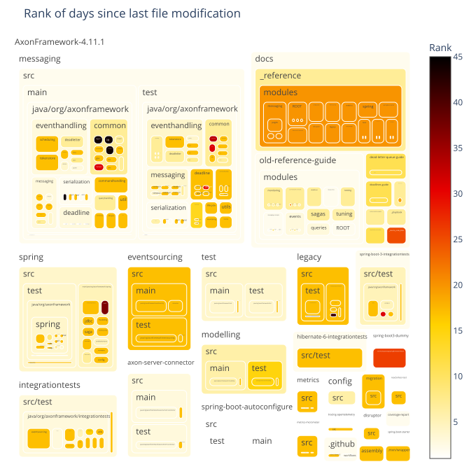
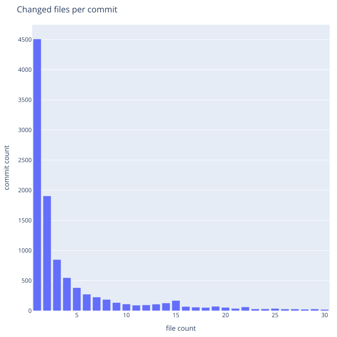
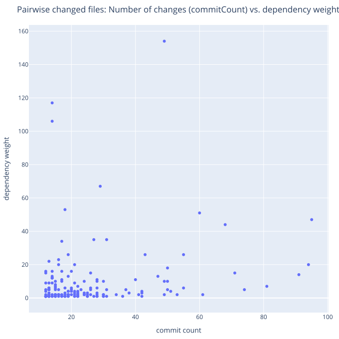

# git log/history
   

### References
- [Visualizing Code: Polyglot Notebooks Repository (YouTube)](https://youtu.be/ipOpToPS-PY?si=3doePt2cp-LgEUmt)
- [gitstractor (GitHub)](https://github.com/IntegerMan/gitstractor)
- [Neo4j Python Driver](https://neo4j.com/docs/api/python-driver/current)

    Command line execution (CLI mode): Yes

## Git History - Directory Commit Statistics

### Data Preview

<table border="1" class="dataframe">
  <thead>
    <tr style="text-align: right;">
      <th></th>
      <th>fileCount</th>
      <th>authorCount</th>
      <th>commitCount</th>
      <th>daysSinceLastCommit</th>
      <th>daysSinceLastCreation</th>
      <th>daysSinceLastModification</th>
    </tr>
  </thead>
  <tbody>
    <tr>
      <th>count</th>
      <td>563.000000</td>
      <td>563.000000</td>
      <td>563.000000</td>
      <td>563.000000</td>
      <td>563.000000</td>
      <td>563.000000</td>
    </tr>
    <tr>
      <th>mean</th>
      <td>24.492007</td>
      <td>19.502664</td>
      <td>1596.113677</td>
      <td>206.362345</td>
      <td>1063.900533</td>
      <td>299.301954</td>
    </tr>
    <tr>
      <th>std</th>
      <td>117.928146</td>
      <td>21.209040</td>
      <td>7954.335528</td>
      <td>127.121149</td>
      <td>968.697642</td>
      <td>367.525167</td>
    </tr>
    <tr>
      <th>min</th>
      <td>1.000000</td>
      <td>2.000000</td>
      <td>3.000000</td>
      <td>59.000000</td>
      <td>65.000000</td>
      <td>58.000000</td>
    </tr>
    <tr>
      <th>25%</th>
      <td>1.000000</td>
      <td>7.000000</td>
      <td>50.500000</td>
      <td>123.000000</td>
      <td>305.000000</td>
      <td>122.000000</td>
    </tr>
    <tr>
      <th>50%</th>
      <td>4.000000</td>
      <td>12.000000</td>
      <td>141.000000</td>
      <td>265.000000</td>
      <td>824.000000</td>
      <td>264.000000</td>
    </tr>
    <tr>
      <th>75%</th>
      <td>10.000000</td>
      <td>25.000000</td>
      <td>595.500000</td>
      <td>265.000000</td>
      <td>1878.000000</td>
      <td>264.000000</td>
    </tr>
    <tr>
      <th>max</th>
      <td>2250.000000</td>
      <td>212.000000</td>
      <td>154891.000000</td>
      <td>2415.000000</td>
      <td>5542.000000</td>
      <td>2893.000000</td>
    </tr>
  </tbody>
</table>

<table border="1" class="dataframe">
  <thead>
    <tr style="text-align: right;">
      <th></th>
      <th>directoryPath</th>
      <th>directoryParentPath</th>
      <th>directoryName</th>
      <th>fileCount</th>
      <th>firstFile</th>
      <th>mostFrequentFileExtension</th>
      <th>authorCount</th>
      <th>mainAuthor</th>
      <th>secondAuthor</th>
      <th>commitCount</th>
      <th>daysSinceLastCommit</th>
      <th>daysSinceLastCreation</th>
      <th>daysSinceLastModification</th>
      <th>lastCommitDate</th>
      <th>lastCreationDate</th>
      <th>lastModificationDate</th>
      <th>maxCommitSha</th>
    </tr>
  </thead>
  <tbody>
    <tr>
      <th>0</th>
      <td>AxonFramework-4.11.1/assembly</td>
      <td>AxonFramework-4.11.1</td>
      <td>assembly</td>
      <td>1</td>
      <td>AxonFramework-4.11.1/assembly/axon-full.xml</td>
      <td>xml</td>
      <td>6</td>
      <td>Allard Buijze</td>
      <td>Steven van Beelen</td>
      <td>47</td>
      <td>265</td>
      <td>5542</td>
      <td>264</td>
      <td>2024-07-30</td>
      <td>2010-02-16</td>
      <td>2024-07-30</td>
      <td>fe95401de37055093f4e79fbe39a807a9d041240</td>
    </tr>
    <tr>
      <th>1</th>
      <td>AxonFramework-4.11.1/axon-server-connector/src/main/java/org/axonframework/axonserver/connector/heartbeat/source</td>
      <td>AxonFramework-4.11.1/axon-server-connector/src/main/java/org/axonframework/axonserver/connector/heartbeat</td>
      <td>source</td>
      <td>1</td>
      <td>AxonFramework-4.11.1/axon-server-connector/src/main/java/org/axonframework/axonserver/connector/heartbeat/source/GrpcHeartbeatSource.java</td>
      <td>java</td>
      <td>10</td>
      <td>Steven van Beelen</td>
      <td>Sara Pellegrini</td>
      <td>31</td>
      <td>265</td>
      <td>2013</td>
      <td>264</td>
      <td>2024-07-30</td>
      <td>2019-10-16</td>
      <td>2024-07-30</td>
      <td>fe00b61e3d1268e540588c0b5e1921c535074072</td>
    </tr>
    <tr>
      <th>2</th>
      <td>AxonFramework-4.11.1/axon-server-connector/src/main/resources/META-INF/services</td>
      <td>AxonFramework-4.11.1/axon-server-connector/src/main/resources</td>
      <td>META-INF/services</td>
      <td>1</td>
      <td>AxonFramework-4.11.1/axon-server-connector/src/main/resources/META-INF/services/org.axonframework.config.ConfigurerModule</td>
      <td>ConfigurerModule</td>
      <td>7</td>
      <td>Allard Buijze</td>
      <td>Marc Gathier</td>
      <td>22</td>
      <td>265</td>
      <td>2382</td>
      <td>2382</td>
      <td>2024-07-30</td>
      <td>2018-10-12</td>
      <td>2018-10-12</td>
      <td>f87aa13a6118aae79bd02cdc5a8406e126e5bdc1</td>
    </tr>
    <tr>
      <th>3</th>
      <td>AxonFramework-4.11.1/axon-server-connector/src/test/java/org/axonframework/axonserver/connector/event/util</td>
      <td>AxonFramework-4.11.1/axon-server-connector/src/test/java/org/axonframework/axonserver/connector/event</td>
      <td>util</td>
      <td>1</td>
      <td>AxonFramework-4.11.1/axon-server-connector/src/test/java/org/axonframework/axonserver/connector/event/util/EventCipherTests.java</td>
      <td>java</td>
      <td>11</td>
      <td>Steven van Beelen</td>
      <td>Allard Buijze</td>
      <td>69</td>
      <td>265</td>
      <td>2406</td>
      <td>264</td>
      <td>2024-07-30</td>
      <td>2018-09-18</td>
      <td>2024-07-30</td>
      <td>fd487ec121971cebef59ef35ec2ae82f97190cb6</td>
    </tr>
    <tr>
      <th>4</th>
      <td>AxonFramework-4.11.1/config/src/test/resources/META-INF</td>
      <td>AxonFramework-4.11.1/config/src/test/resources</td>
      <td>META-INF</td>
      <td>1</td>
      <td>AxonFramework-4.11.1/config/src/test/resources/META-INF/persistence.xml</td>
      <td>xml</td>
      <td>5</td>
      <td>Steven van Beelen</td>
      <td>smcvb</td>
      <td>34</td>
      <td>265</td>
      <td>2384</td>
      <td>264</td>
      <td>2024-07-30</td>
      <td>2018-10-10</td>
      <td>2024-07-30</td>
      <td>f526be04f89262baf7e130a523770b405af51b2b</td>
    </tr>
    <tr>
      <th>5</th>
      <td>AxonFramework-4.11.1/coverage-report</td>
      <td>AxonFramework-4.11.1</td>
      <td>coverage-report</td>
      <td>1</td>
      <td>AxonFramework-4.11.1/coverage-report/pom.xml</td>
      <td>xml</td>
      <td>10</td>
      <td>Steven van Beelen</td>
      <td>Mitchell Herrijgers</td>
      <td>166</td>
      <td>66</td>
      <td>1207</td>
      <td>65</td>
      <td>2025-02-14</td>
      <td>2021-12-30</td>
      <td>2025-02-14</td>
      <td>ff147d51c6cf46d3eb4facf4bfe6d03dd6bb4b5e</td>
    </tr>
    <tr>
      <th>6</th>
      <td>AxonFramework-4.11.1/docs/_playbook/localLinks</td>
      <td>AxonFramework-4.11.1/docs/_playbook</td>
      <td>localLinks</td>
      <td>1</td>
      <td>AxonFramework-4.11.1/docs/_playbook/localLinks/axoniq-library-ui</td>
      <td>axoniq-library-ui</td>
      <td>7</td>
      <td>Steven van Beelen</td>
      <td>Allard Buijze</td>
      <td>10</td>
      <td>265</td>
      <td>317</td>
      <td>317</td>
      <td>2024-07-30</td>
      <td>2024-06-07</td>
      <td>2024-06-07</td>
      <td>fcf55fb4f72d050c0949cac6a1818df2cd53d608</td>
    </tr>
    <tr>
      <th>7</th>
      <td>AxonFramework-4.11.1/docs/_reference/modules/ROOT/attachments</td>
      <td>AxonFramework-4.11.1/docs/_reference/modules/ROOT</td>
      <td>attachments</td>
      <td>1</td>
      <td>AxonFramework-4.11.1/docs/_reference/modules/ROOT/attachments/axonframework_overview.gv</td>
      <td>gv</td>
      <td>8</td>
      <td>Steven van Beelen</td>
      <td>Milen Dyankov</td>
      <td>18</td>
      <td>265</td>
      <td>305</td>
      <td>305</td>
      <td>2024-07-30</td>
      <td>2024-06-19</td>
      <td>2024-06-19</td>
      <td>f851948ee70e6cc9742c7b1bde5941ed2655e28f</td>
    </tr>
    <tr>
      <th>8</th>
      <td>AxonFramework-4.11.1/docs/_reference/modules/ROOT/partials</td>
      <td>AxonFramework-4.11.1/docs/_reference/modules/ROOT</td>
      <td>partials</td>
      <td>1</td>
      <td>AxonFramework-4.11.1/docs/_reference/modules/ROOT/partials/nav.adoc</td>
      <td>adoc</td>
      <td>8</td>
      <td>Steven van Beelen</td>
      <td>Milen Dyankov</td>
      <td>18</td>
      <td>265</td>
      <td>305</td>
      <td>305</td>
      <td>2024-07-30</td>
      <td>2024-06-19</td>
      <td>2024-06-19</td>
      <td>f851948ee70e6cc9742c7b1bde5941ed2655e28f</td>
    </tr>
    <tr>
      <th>9</th>
      <td>AxonFramework-4.11.1/docs/_reference/modules/axon-server-connector/pages</td>
      <td>AxonFramework-4.11.1/docs/_reference/modules/axon-server-connector</td>
      <td>pages</td>
      <td>1</td>
      <td>AxonFramework-4.11.1/docs/_reference/modules/axon-server-connector/pages/index.adoc</td>
      <td>adoc</td>
      <td>8</td>
      <td>Steven van Beelen</td>
      <td>Milen Dyankov</td>
      <td>19</td>
      <td>265</td>
      <td>305</td>
      <td>305</td>
      <td>2024-07-30</td>
      <td>2024-06-19</td>
      <td>2024-06-19</td>
      <td>f851948ee70e6cc9742c7b1bde5941ed2655e28f</td>
    </tr>
    <tr>
      <th>10</th>
      <td>AxonFramework-4.11.1/docs/_reference/modules/axon-server-connector/partials</td>
      <td>AxonFramework-4.11.1/docs/_reference/modules/axon-server-connector</td>
      <td>partials</td>
      <td>1</td>
      <td>AxonFramework-4.11.1/docs/_reference/modules/axon-server-connector/partials/nav.adoc</td>
      <td>adoc</td>
      <td>8</td>
      <td>Steven van Beelen</td>
      <td>Milen Dyankov</td>
      <td>18</td>
      <td>265</td>
      <td>305</td>
      <td>305</td>
      <td>2024-07-30</td>
      <td>2024-06-19</td>
      <td>2024-06-19</td>
      <td>f851948ee70e6cc9742c7b1bde5941ed2655e28f</td>
    </tr>
    <tr>
      <th>11</th>
      <td>AxonFramework-4.11.1/docs/_reference/modules/configuration/pages</td>
      <td>AxonFramework-4.11.1/docs/_reference/modules/configuration</td>
      <td>pages</td>
      <td>1</td>
      <td>AxonFramework-4.11.1/docs/_reference/modules/configuration/pages/index.adoc</td>
      <td>adoc</td>
      <td>8</td>
      <td>Steven van Beelen</td>
      <td>Milen Dyankov</td>
      <td>19</td>
      <td>265</td>
      <td>305</td>
      <td>305</td>
      <td>2024-07-30</td>
      <td>2024-06-19</td>
      <td>2024-06-19</td>
      <td>f851948ee70e6cc9742c7b1bde5941ed2655e28f</td>
    </tr>
    <tr>
      <th>12</th>
      <td>AxonFramework-4.11.1/docs/_reference/modules/configuration/partials</td>
      <td>AxonFramework-4.11.1/docs/_reference/modules/configuration</td>
      <td>partials</td>
      <td>1</td>
      <td>AxonFramework-4.11.1/docs/_reference/modules/configuration/partials/nav.adoc</td>
      <td>adoc</td>
      <td>8</td>
      <td>Steven van Beelen</td>
      <td>Milen Dyankov</td>
      <td>18</td>
      <td>265</td>
      <td>305</td>
      <td>305</td>
      <td>2024-07-30</td>
      <td>2024-06-19</td>
      <td>2024-06-19</td>
      <td>f851948ee70e6cc9742c7b1bde5941ed2655e28f</td>
    </tr>
    <tr>
      <th>13</th>
      <td>AxonFramework-4.11.1/docs/_reference/modules/disruptor/pages</td>
      <td>AxonFramework-4.11.1/docs/_reference/modules/disruptor</td>
      <td>pages</td>
      <td>1</td>
      <td>AxonFramework-4.11.1/docs/_reference/modules/disruptor/pages/index.adoc</td>
      <td>adoc</td>
      <td>8</td>
      <td>Steven van Beelen</td>
      <td>Milen Dyankov</td>
      <td>19</td>
      <td>265</td>
      <td>305</td>
      <td>305</td>
      <td>2024-07-30</td>
      <td>2024-06-19</td>
      <td>2024-06-19</td>
      <td>f851948ee70e6cc9742c7b1bde5941ed2655e28f</td>
    </tr>
    <tr>
      <th>14</th>
      <td>AxonFramework-4.11.1/docs/_reference/modules/disruptor/partials</td>
      <td>AxonFramework-4.11.1/docs/_reference/modules/disruptor</td>
      <td>partials</td>
      <td>1</td>
      <td>AxonFramework-4.11.1/docs/_reference/modules/disruptor/partials/nav.adoc</td>
      <td>adoc</td>
      <td>8</td>
      <td>Steven van Beelen</td>
      <td>Milen Dyankov</td>
      <td>18</td>
      <td>265</td>
      <td>305</td>
      <td>305</td>
      <td>2024-07-30</td>
      <td>2024-06-19</td>
      <td>2024-06-19</td>
      <td>f851948ee70e6cc9742c7b1bde5941ed2655e28f</td>
    </tr>
    <tr>
      <th>15</th>
      <td>AxonFramework-4.11.1/docs/_reference/modules/eventsourcing/pages</td>
      <td>AxonFramework-4.11.1/docs/_reference/modules/eventsourcing</td>
      <td>pages</td>
      <td>1</td>
      <td>AxonFramework-4.11.1/docs/_reference/modules/eventsourcing/pages/index.adoc</td>
      <td>adoc</td>
      <td>8</td>
      <td>Steven van Beelen</td>
      <td>Milen Dyankov</td>
      <td>20</td>
      <td>265</td>
      <td>305</td>
      <td>305</td>
      <td>2024-07-30</td>
      <td>2024-06-19</td>
      <td>2024-06-19</td>
      <td>f851948ee70e6cc9742c7b1bde5941ed2655e28f</td>
    </tr>
    <tr>
      <th>16</th>
      <td>AxonFramework-4.11.1/docs/_reference/modules/eventsourcing/partials</td>
      <td>AxonFramework-4.11.1/docs/_reference/modules/eventsourcing</td>
      <td>partials</td>
      <td>1</td>
      <td>AxonFramework-4.11.1/docs/_reference/modules/eventsourcing/partials/nav.adoc</td>
      <td>adoc</td>
      <td>8</td>
      <td>Steven van Beelen</td>
      <td>Milen Dyankov</td>
      <td>18</td>
      <td>265</td>
      <td>305</td>
      <td>305</td>
      <td>2024-07-30</td>
      <td>2024-06-19</td>
      <td>2024-06-19</td>
      <td>f851948ee70e6cc9742c7b1bde5941ed2655e28f</td>
    </tr>
    <tr>
      <th>17</th>
      <td>AxonFramework-4.11.1/docs/_reference/modules/legacy/pages</td>
      <td>AxonFramework-4.11.1/docs/_reference/modules/legacy</td>
      <td>pages</td>
      <td>1</td>
      <td>AxonFramework-4.11.1/docs/_reference/modules/legacy/pages/index.adoc</td>
      <td>adoc</td>
      <td>8</td>
      <td>Steven van Beelen</td>
      <td>Milen Dyankov</td>
      <td>19</td>
      <td>265</td>
      <td>305</td>
      <td>305</td>
      <td>2024-07-30</td>
      <td>2024-06-19</td>
      <td>2024-06-19</td>
      <td>f851948ee70e6cc9742c7b1bde5941ed2655e28f</td>
    </tr>
    <tr>
      <th>18</th>
      <td>AxonFramework-4.11.1/docs/_reference/modules/legacy/partials</td>
      <td>AxonFramework-4.11.1/docs/_reference/modules/legacy</td>
      <td>partials</td>
      <td>1</td>
      <td>AxonFramework-4.11.1/docs/_reference/modules/legacy/partials/nav.adoc</td>
      <td>adoc</td>
      <td>8</td>
      <td>Steven van Beelen</td>
      <td>Milen Dyankov</td>
      <td>18</td>
      <td>265</td>
      <td>305</td>
      <td>305</td>
      <td>2024-07-30</td>
      <td>2024-06-19</td>
      <td>2024-06-19</td>
      <td>f851948ee70e6cc9742c7b1bde5941ed2655e28f</td>
    </tr>
    <tr>
      <th>19</th>
      <td>AxonFramework-4.11.1/docs/_reference/modules/metrics/pages</td>
      <td>AxonFramework-4.11.1/docs/_reference/modules/metrics</td>
      <td>pages</td>
      <td>1</td>
      <td>AxonFramework-4.11.1/docs/_reference/modules/metrics/pages/index.adoc</td>
      <td>adoc</td>
      <td>8</td>
      <td>Steven van Beelen</td>
      <td>Milen Dyankov</td>
      <td>19</td>
      <td>265</td>
      <td>305</td>
      <td>305</td>
      <td>2024-07-30</td>
      <td>2024-06-19</td>
      <td>2024-06-19</td>
      <td>f851948ee70e6cc9742c7b1bde5941ed2655e28f</td>
    </tr>
    <tr>
      <th>20</th>
      <td>AxonFramework-4.11.1/docs/_reference/modules/metrics/partials</td>
      <td>AxonFramework-4.11.1/docs/_reference/modules/metrics</td>
      <td>partials</td>
      <td>1</td>
      <td>AxonFramework-4.11.1/docs/_reference/modules/metrics/partials/nav.adoc</td>
      <td>adoc</td>
      <td>8</td>
      <td>Steven van Beelen</td>
      <td>Milen Dyankov</td>
      <td>18</td>
      <td>265</td>
      <td>305</td>
      <td>305</td>
      <td>2024-07-30</td>
      <td>2024-06-19</td>
      <td>2024-06-19</td>
      <td>f851948ee70e6cc9742c7b1bde5941ed2655e28f</td>
    </tr>
    <tr>
      <th>21</th>
      <td>AxonFramework-4.11.1/docs/_reference/modules/micrometer/pages</td>
      <td>AxonFramework-4.11.1/docs/_reference/modules/micrometer</td>
      <td>pages</td>
      <td>1</td>
      <td>AxonFramework-4.11.1/docs/_reference/modules/micrometer/pages/index.adoc</td>
      <td>adoc</td>
      <td>8</td>
      <td>Steven van Beelen</td>
      <td>Milen Dyankov</td>
      <td>19</td>
      <td>265</td>
      <td>305</td>
      <td>305</td>
      <td>2024-07-30</td>
      <td>2024-06-19</td>
      <td>2024-06-19</td>
      <td>f851948ee70e6cc9742c7b1bde5941ed2655e28f</td>
    </tr>
    <tr>
      <th>22</th>
      <td>AxonFramework-4.11.1/docs/_reference/modules/micrometer/partials</td>
      <td>AxonFramework-4.11.1/docs/_reference/modules/micrometer</td>
      <td>partials</td>
      <td>1</td>
      <td>AxonFramework-4.11.1/docs/_reference/modules/micrometer/partials/nav.adoc</td>
      <td>adoc</td>
      <td>8</td>
      <td>Steven van Beelen</td>
      <td>Milen Dyankov</td>
      <td>18</td>
      <td>265</td>
      <td>305</td>
      <td>305</td>
      <td>2024-07-30</td>
      <td>2024-06-19</td>
      <td>2024-06-19</td>
      <td>f851948ee70e6cc9742c7b1bde5941ed2655e28f</td>
    </tr>
    <tr>
      <th>23</th>
      <td>AxonFramework-4.11.1/docs/_reference/modules/modeling/partials</td>
      <td>AxonFramework-4.11.1/docs/_reference/modules/modeling</td>
      <td>partials</td>
      <td>1</td>
      <td>AxonFramework-4.11.1/docs/_reference/modules/modeling/partials/nav.adoc</td>
      <td>adoc</td>
      <td>8</td>
      <td>Steven van Beelen</td>
      <td>Milen Dyankov</td>
      <td>18</td>
      <td>265</td>
      <td>305</td>
      <td>305</td>
      <td>2024-07-30</td>
      <td>2024-06-19</td>
      <td>2024-06-19</td>
      <td>f851948ee70e6cc9742c7b1bde5941ed2655e28f</td>
    </tr>
    <tr>
      <th>24</th>
      <td>AxonFramework-4.11.1/docs/_reference/modules/spring/pages</td>
      <td>AxonFramework-4.11.1/docs/_reference/modules/spring</td>
      <td>pages</td>
      <td>1</td>
      <td>AxonFramework-4.11.1/docs/_reference/modules/spring/pages/index.adoc</td>
      <td>adoc</td>
      <td>8</td>
      <td>Steven van Beelen</td>
      <td>Milen Dyankov</td>
      <td>19</td>
      <td>265</td>
      <td>305</td>
      <td>305</td>
      <td>2024-07-30</td>
      <td>2024-06-19</td>
      <td>2024-06-19</td>
      <td>f851948ee70e6cc9742c7b1bde5941ed2655e28f</td>
    </tr>
    <tr>
      <th>25</th>
      <td>AxonFramework-4.11.1/docs/_reference/modules/spring/partials</td>
      <td>AxonFramework-4.11.1/docs/_reference/modules/spring</td>
      <td>partials</td>
      <td>1</td>
      <td>AxonFramework-4.11.1/docs/_reference/modules/spring/partials/nav.adoc</td>
      <td>adoc</td>
      <td>8</td>
      <td>Steven van Beelen</td>
      <td>Milen Dyankov</td>
      <td>18</td>
      <td>265</td>
      <td>305</td>
      <td>305</td>
      <td>2024-07-30</td>
      <td>2024-06-19</td>
      <td>2024-06-19</td>
      <td>f851948ee70e6cc9742c7b1bde5941ed2655e28f</td>
    </tr>
    <tr>
      <th>26</th>
      <td>AxonFramework-4.11.1/docs/_reference/modules/springboot-starter/pages</td>
      <td>AxonFramework-4.11.1/docs/_reference/modules/springboot-starter</td>
      <td>pages</td>
      <td>1</td>
      <td>AxonFramework-4.11.1/docs/_reference/modules/springboot-starter/pages/index.adoc</td>
      <td>adoc</td>
      <td>8</td>
      <td>Steven van Beelen</td>
      <td>Milen Dyankov</td>
      <td>20</td>
      <td>265</td>
      <td>305</td>
      <td>305</td>
      <td>2024-07-30</td>
      <td>2024-06-19</td>
      <td>2024-06-19</td>
      <td>f851948ee70e6cc9742c7b1bde5941ed2655e28f</td>
    </tr>
    <tr>
      <th>27</th>
      <td>AxonFramework-4.11.1/docs/_reference/modules/springboot-starter/partials</td>
      <td>AxonFramework-4.11.1/docs/_reference/modules/springboot-starter</td>
      <td>partials</td>
      <td>1</td>
      <td>AxonFramework-4.11.1/docs/_reference/modules/springboot-starter/partials/nav.adoc</td>
      <td>adoc</td>
      <td>8</td>
      <td>Steven van Beelen</td>
      <td>Milen Dyankov</td>
      <td>18</td>
      <td>265</td>
      <td>305</td>
      <td>305</td>
      <td>2024-07-30</td>
      <td>2024-06-19</td>
      <td>2024-06-19</td>
      <td>f851948ee70e6cc9742c7b1bde5941ed2655e28f</td>
    </tr>
    <tr>
      <th>28</th>
      <td>AxonFramework-4.11.1/docs/_reference/modules/test/pages</td>
      <td>AxonFramework-4.11.1/docs/_reference/modules/test</td>
      <td>pages</td>
      <td>1</td>
      <td>AxonFramework-4.11.1/docs/_reference/modules/test/pages/index.adoc</td>
      <td>adoc</td>
      <td>8</td>
      <td>Steven van Beelen</td>
      <td>Milen Dyankov</td>
      <td>19</td>
      <td>265</td>
      <td>305</td>
      <td>305</td>
      <td>2024-07-30</td>
      <td>2024-06-19</td>
      <td>2024-06-19</td>
      <td>f851948ee70e6cc9742c7b1bde5941ed2655e28f</td>
    </tr>
    <tr>
      <th>29</th>
      <td>AxonFramework-4.11.1/docs/_reference/modules/test/partials</td>
      <td>AxonFramework-4.11.1/docs/_reference/modules/test</td>
      <td>partials</td>
      <td>1</td>
      <td>AxonFramework-4.11.1/docs/_reference/modules/test/partials/nav.adoc</td>
      <td>adoc</td>
      <td>8</td>
      <td>Steven van Beelen</td>
      <td>Milen Dyankov</td>
      <td>18</td>
      <td>265</td>
      <td>305</td>
      <td>305</td>
      <td>2024-07-30</td>
      <td>2024-06-19</td>
      <td>2024-06-19</td>
      <td>f851948ee70e6cc9742c7b1bde5941ed2655e28f</td>
    </tr>
  </tbody>
</table>

### Number of files per directory

    

    

    os.path.abspath=/home/runner/work/code-graph-analysis-examples/code-graph-analysis-examples/jupyter
    os.path.curdir=.

### Most frequent file extension per directory

    

    

    os.path.abspath=/home/runner/work/code-graph-analysis-examples/code-graph-analysis-examples/jupyter
    os.path.curdir=.

### Number of commits per directory

    

    

    os.path.abspath=/home/runner/work/code-graph-analysis-examples/code-graph-analysis-examples/jupyter
    os.path.curdir=.

### Number of distinct authors per directory

    

    

    os.path.abspath=/home/runner/work/code-graph-analysis-examples/code-graph-analysis-examples/jupyter
    os.path.curdir=.

### Directories with very few different authors

    

    

    os.path.abspath=/home/runner/work/code-graph-analysis-examples/code-graph-analysis-examples/jupyter
    os.path.curdir=.

### Main author per directory

    

    

    os.path.abspath=/home/runner/work/code-graph-analysis-examples/code-graph-analysis-examples/jupyter
    os.path.curdir=.

### Second author per directory

    

    

    os.path.abspath=/home/runner/work/code-graph-analysis-examples/code-graph-analysis-examples/jupyter
    os.path.curdir=.

### Days since last commit per directory

    

    

    os.path.abspath=/home/runner/work/code-graph-analysis-examples/code-graph-analysis-examples/jupyter
    os.path.curdir=.

### Days since last commit per directory (ranked)

    

    

    os.path.abspath=/home/runner/work/code-graph-analysis-examples/code-graph-analysis-examples/jupyter
    os.path.curdir=.

### Days since last file creation per directory

    

    

    os.path.abspath=/home/runner/work/code-graph-analysis-examples/code-graph-analysis-examples/jupyter
    os.path.curdir=.

### Days since last file creation per directory (ranked)

    

    

    os.path.abspath=/home/runner/work/code-graph-analysis-examples/code-graph-analysis-examples/jupyter
    os.path.curdir=.

### Days since last file modification per directory

    

    

    os.path.abspath=/home/runner/work/code-graph-analysis-examples/code-graph-analysis-examples/jupyter
    os.path.curdir=.

### Days since last file modification per directory (ranked)

    

    

    os.path.abspath=/home/runner/work/code-graph-analysis-examples/code-graph-analysis-examples/jupyter
    os.path.curdir=.

### File changed frequently with other files

    

    

    os.path.abspath=/home/runner/work/code-graph-analysis-examples/code-graph-analysis-examples/jupyter
    os.path.curdir=.

## Filecount per commit

Shows how many commits had changed one file, how many had changed two files, and so on.
The chart is limited to 30 lines for improved readability.
The data preview also includes overall statistics including the number of commits that are filtered out in the chart.

### Preview data

    Sum of commits that changed more than 30 files (each) = 961
    Max changed files with one commit = 2178

<table border="1" class="dataframe">
  <thead>
    <tr style="text-align: right;">
      <th></th>
      <th>filesPerCommit</th>
      <th>commitCount</th>
    </tr>
  </thead>
  <tbody>
    <tr>
      <th>count</th>
      <td>333.000000</td>
      <td>333.000000</td>
    </tr>
    <tr>
      <th>mean</th>
      <td>344.075075</td>
      <td>33.960961</td>
    </tr>
    <tr>
      <th>std</th>
      <td>440.375494</td>
      <td>274.606293</td>
    </tr>
    <tr>
      <th>min</th>
      <td>1.000000</td>
      <td>1.000000</td>
    </tr>
    <tr>
      <th>25%</th>
      <td>84.000000</td>
      <td>1.000000</td>
    </tr>
    <tr>
      <th>50%</th>
      <td>186.000000</td>
      <td>2.000000</td>
    </tr>
    <tr>
      <th>75%</th>
      <td>428.000000</td>
      <td>5.000000</td>
    </tr>
    <tr>
      <th>max</th>
      <td>2178.000000</td>
      <td>4508.000000</td>
    </tr>
  </tbody>
</table>

<table border="1" class="dataframe">
  <thead>
    <tr style="text-align: right;">
      <th></th>
      <th>filesPerCommit</th>
      <th>commitCount</th>
    </tr>
  </thead>
  <tbody>
    <tr>
      <th>0</th>
      <td>1</td>
      <td>4508</td>
    </tr>
    <tr>
      <th>1</th>
      <td>2</td>
      <td>1905</td>
    </tr>
    <tr>
      <th>2</th>
      <td>3</td>
      <td>848</td>
    </tr>
    <tr>
      <th>3</th>
      <td>4</td>
      <td>548</td>
    </tr>
    <tr>
      <th>4</th>
      <td>5</td>
      <td>381</td>
    </tr>
    <tr>
      <th>5</th>
      <td>6</td>
      <td>273</td>
    </tr>
    <tr>
      <th>6</th>
      <td>7</td>
      <td>226</td>
    </tr>
    <tr>
      <th>7</th>
      <td>8</td>
      <td>187</td>
    </tr>
    <tr>
      <th>8</th>
      <td>9</td>
      <td>134</td>
    </tr>
    <tr>
      <th>9</th>
      <td>10</td>
      <td>110</td>
    </tr>
    <tr>
      <th>10</th>
      <td>11</td>
      <td>91</td>
    </tr>
    <tr>
      <th>11</th>
      <td>12</td>
      <td>97</td>
    </tr>
    <tr>
      <th>12</th>
      <td>13</td>
      <td>108</td>
    </tr>
    <tr>
      <th>13</th>
      <td>14</td>
      <td>127</td>
    </tr>
    <tr>
      <th>14</th>
      <td>15</td>
      <td>169</td>
    </tr>
    <tr>
      <th>15</th>
      <td>16</td>
      <td>69</td>
    </tr>
    <tr>
      <th>16</th>
      <td>17</td>
      <td>58</td>
    </tr>
    <tr>
      <th>17</th>
      <td>18</td>
      <td>53</td>
    </tr>
    <tr>
      <th>18</th>
      <td>19</td>
      <td>73</td>
    </tr>
    <tr>
      <th>19</th>
      <td>20</td>
      <td>55</td>
    </tr>
    <tr>
      <th>20</th>
      <td>21</td>
      <td>38</td>
    </tr>
    <tr>
      <th>21</th>
      <td>22</td>
      <td>63</td>
    </tr>
    <tr>
      <th>22</th>
      <td>23</td>
      <td>30</td>
    </tr>
    <tr>
      <th>23</th>
      <td>24</td>
      <td>31</td>
    </tr>
    <tr>
      <th>24</th>
      <td>25</td>
      <td>37</td>
    </tr>
    <tr>
      <th>25</th>
      <td>26</td>
      <td>28</td>
    </tr>
    <tr>
      <th>26</th>
      <td>27</td>
      <td>28</td>
    </tr>
    <tr>
      <th>27</th>
      <td>28</td>
      <td>24</td>
    </tr>
    <tr>
      <th>28</th>
      <td>29</td>
      <td>28</td>
    </tr>
    <tr>
      <th>29</th>
      <td>30</td>
      <td>21</td>
    </tr>
  </tbody>
</table>

### Bar chart with the number of files per commit distribution

    

    

    os.path.abspath=/home/runner/work/code-graph-analysis-examples/code-graph-analysis-examples/jupyter
    os.path.curdir=.

## Pairwise Changed Files vs. Dependency Weight

This section explores the correlation between how often pairs of files are changed together (common commit count) and their dependency weight. Note that these results should be interpreted cautiously, as comparing pairwise changes and dependencies is inherently challenging.

### Considerations
- **Historical vs. Current State**: Pairwise changes reflect the entire git history, while dependency weight represents the current state of the codebase.
- **Commit Granularity**: Developers may use different commit strategies, such as squashing changes into a single commit or creating fine-grained commits. Ideally, each commit should represent a single semantic change for accurate analysis.
- **Dependency Representation**: Some file types (e.g., Java files with import statements) clearly define dependencies, while others (e.g., shell scripts, XML, YAML) lack explicit dependency relationships.
- **Repository Characteristics**: Repositories with generated code may have many large commits, while stabilized repositories may only update configuration files for dependency changes.

#### Data Preview

    Received notification from DBMS server: {severity: WARNING} {code: Neo.ClientNotification.Statement.UnknownPropertyKeyWarning} {category: UNRECOGNIZED} {title: The provided property key is not in the database} {description: One of the property names in your query is not available in the database, make sure you didn't misspell it or that the label is available when you run this statement in your application (the missing property name is: cardinality)} {position: line: 9, column: 48, offset: 576} for query: "// List pair of files that were changed together and that have a declared dependency between each other.\n \n MATCH (firstCodeFile:File)-[dependency:DEPENDS_ON]->(secondCodeFile:File)\n MATCH (firstCodeFile)-[pairwiseChange:CHANGED_TOGETHER_WITH]-(secondCodeFile)\n //De-duplicating the pairs of files isn't necessary, because the dependency relation is directed.\n //WHERE elementId(firstCodeFile) < elementId(secondCodeFile)\n  WITH  firstCodeFile.fileName      AS firstFileName\n       ,secondCodeFile.fileName     AS secondFileName\n       ,coalesce(dependency.weight, dependency.cardinality)    AS dependencyWeight\n       ,pairwiseChange.commitCount  AS commitCount\n       ,dependency.fileDistanceAsFewestChangeDirectoryCommands AS fileDistanceAsFewestChangeDirectoryCommands\n RETURN dependencyWeight\n       ,commitCount\n       ,fileDistanceAsFewestChangeDirectoryCommands\n       // ,count(*)                    AS occurrences\n       // ,collect(firstFileName + ' -> ' + secondFileName)[0..3] AS examples\n ORDER BY dependencyWeight, commitCount\n \n // MATCH (firstCodeFile:File)-[dependency:DEPENDS_ON]->(secondCodeFile:File)\n // MATCH (firstCodeFile)-[pairwiseChange:CHANGED_TOGETHER_WITH]-(secondCodeFile)\n // WHERE elementId(firstCodeFile) < elementId(secondCodeFile)\n // RETURN firstCodeFile.fileName  AS firstFileName\n //       ,secondCodeFile.fileName AS secondFileName\n //       ,dependency.weight           AS dependencyWeight\n //       ,pairwiseChange.commitCount  AS commitCount\n // ORDER BY dependencyWeight, commitCount\n \n //  MATCH (g1:!Git&File)-[relation:CHANGED_TOGETHER_WITH|DEPENDS_ON]-(g2:!Git&File) \n //   WITH count(DISTINCT relation)   AS relatedFilesCount\n //       ,collect(DISTINCT relation) AS relations\n // UNWIND relations AS relation\n //   WITH relatedFilesCount\n //       ,coalesce(relation.commitCount, 0)                                 AS commitCount\n //       ,coalesce(relation.weight, 0)                                      AS dependencyWeight\n //       ,coalesce(relation.fileDistanceAsFewestChangeDirectoryCommands, 0) AS fileDistanceAsFewestChangeDirectoryCommands\n // RETURN dependencyWeight\n //       ,commitCount\n //       ,fileDistanceAsFewestChangeDirectoryCommands\n // ORDER BY dependencyWeight, commitCount\n"

<table border="1" class="dataframe">
  <thead>
    <tr style="text-align: right;">
      <th></th>
      <th>dependencyWeight</th>
      <th>commitCount</th>
      <th>fileDistanceAsFewestChangeDirectoryCommands</th>
    </tr>
  </thead>
  <tbody>
    <tr>
      <th>0</th>
      <td>1</td>
      <td>12</td>
      <td>0</td>
    </tr>
    <tr>
      <th>1</th>
      <td>1</td>
      <td>12</td>
      <td>0</td>
    </tr>
    <tr>
      <th>2</th>
      <td>1</td>
      <td>12</td>
      <td>4</td>
    </tr>
    <tr>
      <th>3</th>
      <td>1</td>
      <td>12</td>
      <td>0</td>
    </tr>
    <tr>
      <th>4</th>
      <td>1</td>
      <td>12</td>
      <td>0</td>
    </tr>
    <tr>
      <th>5</th>
      <td>1</td>
      <td>12</td>
      <td>4</td>
    </tr>
    <tr>
      <th>6</th>
      <td>1</td>
      <td>12</td>
      <td>0</td>
    </tr>
    <tr>
      <th>7</th>
      <td>1</td>
      <td>12</td>
      <td>2</td>
    </tr>
    <tr>
      <th>8</th>
      <td>1</td>
      <td>12</td>
      <td>0</td>
    </tr>
    <tr>
      <th>9</th>
      <td>1</td>
      <td>12</td>
      <td>4</td>
    </tr>
    <tr>
      <th>10</th>
      <td>1</td>
      <td>13</td>
      <td>0</td>
    </tr>
    <tr>
      <th>11</th>
      <td>1</td>
      <td>13</td>
      <td>4</td>
    </tr>
    <tr>
      <th>12</th>
      <td>1</td>
      <td>13</td>
      <td>0</td>
    </tr>
    <tr>
      <th>13</th>
      <td>1</td>
      <td>13</td>
      <td>4</td>
    </tr>
    <tr>
      <th>14</th>
      <td>1</td>
      <td>14</td>
      <td>4</td>
    </tr>
    <tr>
      <th>15</th>
      <td>1</td>
      <td>14</td>
      <td>2</td>
    </tr>
    <tr>
      <th>16</th>
      <td>1</td>
      <td>15</td>
      <td>0</td>
    </tr>
    <tr>
      <th>17</th>
      <td>1</td>
      <td>15</td>
      <td>2</td>
    </tr>
    <tr>
      <th>18</th>
      <td>1</td>
      <td>15</td>
      <td>0</td>
    </tr>
    <tr>
      <th>19</th>
      <td>1</td>
      <td>16</td>
      <td>0</td>
    </tr>
  </tbody>
</table>

#### Data Statistics

    'Pairwise changed git files compared to dependency weights - Overall statistics'

<table border="1" class="dataframe">
  <thead>
    <tr style="text-align: right;">
      <th></th>
      <th>dependencyWeight</th>
      <th>commitCount</th>
      <th>fileDistanceAsFewestChangeDirectoryCommands</th>
    </tr>
  </thead>
  <tbody>
    <tr>
      <th>count</th>
      <td>166.000000</td>
      <td>166.000000</td>
      <td>166.000000</td>
    </tr>
    <tr>
      <th>mean</th>
      <td>9.590361</td>
      <td>25.204819</td>
      <td>1.373494</td>
    </tr>
    <tr>
      <th>std</th>
      <td>19.230680</td>
      <td>16.573260</td>
      <td>1.570260</td>
    </tr>
    <tr>
      <th>min</th>
      <td>1.000000</td>
      <td>12.000000</td>
      <td>0.000000</td>
    </tr>
    <tr>
      <th>25%</th>
      <td>1.250000</td>
      <td>14.250000</td>
      <td>0.000000</td>
    </tr>
    <tr>
      <th>50%</th>
      <td>3.000000</td>
      <td>19.000000</td>
      <td>0.000000</td>
    </tr>
    <tr>
      <th>75%</th>
      <td>10.000000</td>
      <td>28.000000</td>
      <td>2.000000</td>
    </tr>
    <tr>
      <th>max</th>
      <td>154.000000</td>
      <td>95.000000</td>
      <td>4.000000</td>
    </tr>
  </tbody>
</table>

    'Pairwise changed git files compared to dependency weights - Pearson Correlation'

<table border="1" class="dataframe">
  <thead>
    <tr style="text-align: right;">
      <th></th>
      <th>dependencyWeight</th>
      <th>commitCount</th>
      <th>fileDistanceAsFewestChangeDirectoryCommands</th>
    </tr>
  </thead>
  <tbody>
    <tr>
      <th>dependencyWeight</th>
      <td>1.000000</td>
      <td>0.200368</td>
      <td>-0.141013</td>
    </tr>
    <tr>
      <th>commitCount</th>
      <td>0.200368</td>
      <td>1.000000</td>
      <td>-0.145947</td>
    </tr>
    <tr>
      <th>fileDistanceAsFewestChangeDirectoryCommands</th>
      <td>-0.141013</td>
      <td>-0.145947</td>
      <td>1.000000</td>
    </tr>
  </tbody>
</table>

    'Pairwise changed git files compared to dependency weights - Spearman Correlation'

<table border="1" class="dataframe">
  <thead>
    <tr style="text-align: right;">
      <th></th>
      <th>dependencyWeight</th>
      <th>commitCount</th>
      <th>fileDistanceAsFewestChangeDirectoryCommands</th>
    </tr>
  </thead>
  <tbody>
    <tr>
      <th>dependencyWeight</th>
      <td>1.000000</td>
      <td>0.214529</td>
      <td>-0.091448</td>
    </tr>
    <tr>
      <th>commitCount</th>
      <td>0.214529</td>
      <td>1.000000</td>
      <td>-0.133180</td>
    </tr>
    <tr>
      <th>fileDistanceAsFewestChangeDirectoryCommands</th>
      <td>-0.091448</td>
      <td>-0.133180</td>
      <td>1.000000</td>
    </tr>
  </tbody>
</table>

    'Pearson Correlation with p-value for commitCount and dependencyWeight'

    PearsonRResult(statistic=0.20036758755264605, pvalue=0.009643647845018762)

    'Spearman Correlation with p-value for commitCount and dependencyWeight'

    SignificanceResult(statistic=0.21452881933918705, pvalue=0.005511439972198768)

    

    

    os.path.abspath=/home/runner/work/code-graph-analysis-examples/code-graph-analysis-examples/jupyter
    os.path.curdir=.

## WordCloud of git authors

<table border="1" class="dataframe">
  <thead>
    <tr style="text-align: right;">
      <th></th>
      <th>word</th>
      <th>frequency</th>
    </tr>
  </thead>
  <tbody>
    <tr>
      <th>0</th>
      <td>Steven van Beelen</td>
      <td>3360</td>
    </tr>
    <tr>
      <th>1</th>
      <td>Allard Buijze</td>
      <td>2721</td>
    </tr>
    <tr>
      <th>2</th>
      <td>smcvb</td>
      <td>822</td>
    </tr>
    <tr>
      <th>3</th>
      <td>Milan Savic</td>
      <td>449</td>
    </tr>
    <tr>
      <th>4</th>
      <td>Mitchell Herrijgers</td>
      <td>309</td>
    </tr>
    <tr>
      <th>5</th>
      <td>Gerard Klijs</td>
      <td>246</td>
    </tr>
    <tr>
      <th>6</th>
      <td>Marc Gathier</td>
      <td>231</td>
    </tr>
    <tr>
      <th>7</th>
      <td>sara pellegrini</td>
      <td>163</td>
    </tr>
    <tr>
      <th>8</th>
      <td>Rene de Waele</td>
      <td>121</td>
    </tr>
    <tr>
      <th>9</th>
      <td>Jettro Coenradie</td>
      <td>117</td>
    </tr>
  </tbody>
</table>

    

    

