# git log/history
   

### References
- [Visualizing Code: Polyglot Notebooks Repository (YouTube)](https://youtu.be/ipOpToPS-PY?si=3doePt2cp-LgEUmt)
- [gitstractor (GitHub)](https://github.com/IntegerMan/gitstractor)
- [Neo4j Python Driver](https://neo4j.com/docs/api/python-driver/current)

    Command line execution (CLI mode): Yes

## Git History - Directory Commit Statistics

### Treemap Layout Functions and Constants

### Visualization Data Preparation Functions

### File Data Preparation Functions

### File Data Preparation 

    Received notification from DBMS server: {severity: WARNING} {code: Neo.ClientNotification.Statement.AggregationSkippedNull} {category: UNRECOGNIZED} {title: The query contains an aggregation function that skips null values.} {description: null value eliminated in set function.} {position: None} for query: "// List git files with commit statistics\n \n  MATCH (git_file:File&Git&!Repository)\n  WHERE git_file.deletedAt IS NULL // filter out deleted files\n   WITH percentileDisc(git_file.createdAtEpoch, 0.5)          AS medianCreatedAtEpoch\n       ,percentileDisc(git_file.lastModificationAtEpoch, 0.5) AS medianLastModificationAtEpoch\n       ,collect(git_file)                                     AS git_files\n UNWIND git_files AS git_file\n   WITH *\n       ,datetime.fromepochMillis(coalesce(git_file.createdAtEpoch, medianCreatedAtEpoch))                                            AS fileCreatedAtTimestamp\n       ,datetime.fromepochMillis(coalesce(git_file.lastModificationAtEpoch, git_file.createdAtEpoch, medianLastModificationAtEpoch)) AS fileLastModificationAtTimestamp\n  MATCH (git_repository:Git&Repository)-[:HAS_FILE]->(git_file)\n  MATCH (git_commit:Git&Commit)-[:CONTAINS_CHANGE]->(git_change:Git&Change)-->(old_files_included:Git&File&!Repository)-[:HAS_NEW_NAME*0..3]->(git_file)\n RETURN git_repository.name + '/' + git_file.relativePath AS filePath\n       ,split(git_commit.author, ' <')[0]                 AS author\n       ,count(DISTINCT git_commit.sha)                    AS commitCount\n       ,date(max(git_commit.date))                        AS lastCommitDate\n       ,max(date(fileCreatedAtTimestamp))                 AS lastCreationDate\n       ,max(date(fileLastModificationAtTimestamp))        AS lastModificationDate\n       ,duration.inDays(date(max(git_commit.date)), date()).days               AS daysSinceLastCommit\n       ,duration.inDays(max(fileCreatedAtTimestamp), datetime()).days          AS daysSinceLastCreation\n       ,duration.inDays(max(fileLastModificationAtTimestamp), datetime()).days AS daysSinceLastModification\n       ,max(git_commit.sha)                               AS maxCommitSha\n ORDER BY filePath ASCENDING, commitCount DESCENDING"

### Data Preview

<table border="1" class="dataframe">
  <thead>
    <tr style="text-align: right;">
      <th></th>
      <th>fileCount</th>
      <th>authorCount</th>
      <th>commitCount</th>
      <th>daysSinceLastCommit</th>
      <th>daysSinceLastCreation</th>
      <th>daysSinceLastModification</th>
    </tr>
  </thead>
  <tbody>
    <tr>
      <th>count</th>
      <td>291.000000</td>
      <td>291.000000</td>
      <td>291.000000</td>
      <td>291.000000</td>
      <td>291.000000</td>
      <td>291.000000</td>
    </tr>
    <tr>
      <th>mean</th>
      <td>13.240550</td>
      <td>7.728522</td>
      <td>343.522337</td>
      <td>422.237113</td>
      <td>673.371134</td>
      <td>601.494845</td>
    </tr>
    <tr>
      <th>std</th>
      <td>53.778125</td>
      <td>7.038209</td>
      <td>1446.295449</td>
      <td>1068.709845</td>
      <td>1241.256860</td>
      <td>1252.419219</td>
    </tr>
    <tr>
      <th>min</th>
      <td>1.000000</td>
      <td>2.000000</td>
      <td>2.000000</td>
      <td>3.000000</td>
      <td>2.000000</td>
      <td>2.000000</td>
    </tr>
    <tr>
      <th>25%</th>
      <td>1.000000</td>
      <td>3.000000</td>
      <td>24.000000</td>
      <td>4.000000</td>
      <td>71.000000</td>
      <td>17.000000</td>
    </tr>
    <tr>
      <th>50%</th>
      <td>3.000000</td>
      <td>7.000000</td>
      <td>74.000000</td>
      <td>66.000000</td>
      <td>267.000000</td>
      <td>114.000000</td>
    </tr>
    <tr>
      <th>75%</th>
      <td>8.000000</td>
      <td>8.000000</td>
      <td>181.000000</td>
      <td>236.000000</td>
      <td>369.000000</td>
      <td>277.000000</td>
    </tr>
    <tr>
      <th>max</th>
      <td>828.000000</td>
      <td>70.000000</td>
      <td>21397.000000</td>
      <td>4777.000000</td>
      <td>4864.000000</td>
      <td>4776.000000</td>
    </tr>
  </tbody>
</table>

<table border="1" class="dataframe">
  <thead>
    <tr style="text-align: right;">
      <th></th>
      <th>directoryPath</th>
      <th>directoryParentPath</th>
      <th>directoryName</th>
      <th>fileCount</th>
      <th>firstFile</th>
      <th>mostFrequentFileExtension</th>
      <th>authorCount</th>
      <th>mainAuthor</th>
      <th>secondAuthor</th>
      <th>commitCount</th>
      <th>daysSinceLastCommit</th>
      <th>daysSinceLastCreation</th>
      <th>daysSinceLastModification</th>
      <th>lastCommitDate</th>
      <th>lastCreationDate</th>
      <th>lastModificationDate</th>
      <th>maxCommitSha</th>
    </tr>
  </thead>
  <tbody>
    <tr>
      <th>0</th>
      <td>AxonFramework-4.11.1/.idea/copyright</td>
      <td>AxonFramework-4.11.1/.idea</td>
      <td>copyright</td>
      <td>1</td>
      <td>AxonFramework-4.11.1/.idea/copyright/Axon_Framework_copyright_template.xml</td>
      <td>xml</td>
      <td>2</td>
      <td>Steven van Beelen</td>
      <td>Allard Buijze</td>
      <td>9</td>
      <td>28</td>
      <td>73</td>
      <td>73</td>
      <td>2025-02-24</td>
      <td>2025-01-09</td>
      <td>2025-01-09</td>
      <td>fe926a4970bdf1e538e8e7fb8d147ffdc676e713</td>
    </tr>
    <tr>
      <th>1</th>
      <td>AxonFramework-4.11.1/.idea/inspectionProfiles</td>
      <td>AxonFramework-4.11.1/.idea</td>
      <td>inspectionProfiles</td>
      <td>1</td>
      <td>AxonFramework-4.11.1/.idea/inspectionProfiles/Project_Default.xml</td>
      <td>xml</td>
      <td>2</td>
      <td>Steven van Beelen</td>
      <td>Allard Buijze</td>
      <td>9</td>
      <td>28</td>
      <td>73</td>
      <td>73</td>
      <td>2025-02-24</td>
      <td>2025-01-09</td>
      <td>2025-01-09</td>
      <td>fe926a4970bdf1e538e8e7fb8d147ffdc676e713</td>
    </tr>
    <tr>
      <th>2</th>
      <td>AxonFramework-4.11.1/axon-5-module-structure-suggestion/messaging-core/src/test/java/org/axonframework/messaging</td>
      <td>AxonFramework-4.11.1/axon-5-module-structure-suggestion/messaging-core/src</td>
      <td>test/java/org/axonframework/messaging</td>
      <td>1</td>
      <td>AxonFramework-4.11.1/axon-5-module-structure-suggestion/messaging-core/src/test/java/org/axonframework/messaging/UnitOfWorkTest.java</td>
      <td>java</td>
      <td>2</td>
      <td>Steven van Beelen</td>
      <td>Mitchell Herrijgers</td>
      <td>13</td>
      <td>28</td>
      <td>513</td>
      <td>513</td>
      <td>2025-02-24</td>
      <td>2023-10-27</td>
      <td>2023-10-27</td>
      <td>ea5ee757f6536e2b4f6f5d0cac71a07b94c4c0c4</td>
    </tr>
    <tr>
      <th>3</th>
      <td>AxonFramework-4.11.1/axon-server-connector/src/main/java/org/axonframework/axonserver/connector/command</td>
      <td>AxonFramework-4.11.1/axon-server-connector/src/main/java/org/axonframework/axonserver/connector</td>
      <td>command</td>
      <td>1</td>
      <td>AxonFramework-4.11.1/axon-server-connector/src/main/java/org/axonframework/axonserver/connector/command/AxonServerConnector.java</td>
      <td>java</td>
      <td>3</td>
      <td>Steven van Beelen</td>
      <td>Allard Buijze</td>
      <td>41</td>
      <td>28</td>
      <td>369</td>
      <td>46</td>
      <td>2025-02-24</td>
      <td>2024-03-19</td>
      <td>2025-02-05</td>
      <td>fcedac961db62285c0c224c507284ef1746d5f35</td>
    </tr>
    <tr>
      <th>4</th>
      <td>AxonFramework-4.11.1/core/src/test/java/org/axonframework/commandhandling/disruptor</td>
      <td>AxonFramework-4.11.1/core/src/test/java/org/axonframework</td>
      <td>commandhandling/disruptor</td>
      <td>1</td>
      <td>AxonFramework-4.11.1/core/src/test/java/org/axonframework/commandhandling/disruptor/EventPublisherTest.java</td>
      <td>java</td>
      <td>2</td>
      <td>Allard Buijze</td>
      <td>Rene de Waele</td>
      <td>2</td>
      <td>3455</td>
      <td>3477</td>
      <td>3454</td>
      <td>2015-10-08</td>
      <td>2015-09-15</td>
      <td>2015-10-08</td>
      <td>30d68fd229c59f5aa8f45848de82c91967eebcba</td>
    </tr>
    <tr>
      <th>5</th>
      <td>AxonFramework-4.11.1/core/src/test/java/org/axonframework/contextsupport/spring</td>
      <td>AxonFramework-4.11.1/core/src/test/java/org/axonframework</td>
      <td>contextsupport/spring</td>
      <td>1</td>
      <td>AxonFramework-4.11.1/core/src/test/java/org/axonframework/contextsupport/spring/WiringTest.java</td>
      <td>java</td>
      <td>2</td>
      <td>Sebastian Ganslandt</td>
      <td>lburgazzoli</td>
      <td>2</td>
      <td>4220</td>
      <td>4314</td>
      <td>4314</td>
      <td>2013-09-03</td>
      <td>2013-05-31</td>
      <td>2013-05-31</td>
      <td>f17a45795111f567ca57f97c63a976c1a9a2cce0</td>
    </tr>
    <tr>
      <th>6</th>
      <td>AxonFramework-4.11.1/core/src/test/java/org/axonframework/eventhandling/scheduling/quartz</td>
      <td>AxonFramework-4.11.1/core/src/test/java/org/axonframework</td>
      <td>eventhandling/scheduling/quartz</td>
      <td>1</td>
      <td>AxonFramework-4.11.1/core/src/test/java/org/axonframework/eventhandling/scheduling/quartz/Quartz2EventSchedulerTest.java</td>
      <td>java</td>
      <td>14</td>
      <td>Allard Buijze</td>
      <td>smcvb</td>
      <td>121</td>
      <td>237</td>
      <td>4659</td>
      <td>4659</td>
      <td>2024-07-30</td>
      <td>2012-06-20</td>
      <td>2012-06-20</td>
      <td>fdd51aa788071375721c67bb30bf5709136e974a</td>
    </tr>
    <tr>
      <th>7</th>
      <td>AxonFramework-4.11.1/docs/_playbook/localLinks</td>
      <td>AxonFramework-4.11.1/docs/_playbook</td>
      <td>localLinks</td>
      <td>1</td>
      <td>AxonFramework-4.11.1/docs/_playbook/localLinks/axoniq-library-ui</td>
      <td>axoniq-library-ui</td>
      <td>7</td>
      <td>Steven van Beelen</td>
      <td>Allard Buijze</td>
      <td>13</td>
      <td>236</td>
      <td>289</td>
      <td>289</td>
      <td>2024-07-31</td>
      <td>2024-06-07</td>
      <td>2024-06-07</td>
      <td>fcf55fb4f72d050c0949cac6a1818df2cd53d608</td>
    </tr>
    <tr>
      <th>8</th>
      <td>AxonFramework-4.11.1/docs/_reference/modules/ROOT/attachments</td>
      <td>AxonFramework-4.11.1/docs/_reference/modules/ROOT</td>
      <td>attachments</td>
      <td>1</td>
      <td>AxonFramework-4.11.1/docs/_reference/modules/ROOT/attachments/axonframework_overview.gv</td>
      <td>gv</td>
      <td>8</td>
      <td>Steven van Beelen</td>
      <td>Milen Dyankov</td>
      <td>22</td>
      <td>236</td>
      <td>277</td>
      <td>277</td>
      <td>2024-07-31</td>
      <td>2024-06-19</td>
      <td>2024-06-19</td>
      <td>f851948ee70e6cc9742c7b1bde5941ed2655e28f</td>
    </tr>
    <tr>
      <th>9</th>
      <td>AxonFramework-4.11.1/docs/_reference/modules/ROOT/partials</td>
      <td>AxonFramework-4.11.1/docs/_reference/modules/ROOT</td>
      <td>partials</td>
      <td>1</td>
      <td>AxonFramework-4.11.1/docs/_reference/modules/ROOT/partials/nav.adoc</td>
      <td>adoc</td>
      <td>8</td>
      <td>Steven van Beelen</td>
      <td>Milen Dyankov</td>
      <td>22</td>
      <td>236</td>
      <td>277</td>
      <td>277</td>
      <td>2024-07-31</td>
      <td>2024-06-19</td>
      <td>2024-06-19</td>
      <td>f851948ee70e6cc9742c7b1bde5941ed2655e28f</td>
    </tr>
    <tr>
      <th>10</th>
      <td>AxonFramework-4.11.1/docs/_reference/modules/axon-server-connector/pages</td>
      <td>AxonFramework-4.11.1/docs/_reference/modules/axon-server-connector</td>
      <td>pages</td>
      <td>1</td>
      <td>AxonFramework-4.11.1/docs/_reference/modules/axon-server-connector/pages/index.adoc</td>
      <td>adoc</td>
      <td>8</td>
      <td>Steven van Beelen</td>
      <td>Milen Dyankov</td>
      <td>23</td>
      <td>236</td>
      <td>277</td>
      <td>277</td>
      <td>2024-07-31</td>
      <td>2024-06-19</td>
      <td>2024-06-19</td>
      <td>f851948ee70e6cc9742c7b1bde5941ed2655e28f</td>
    </tr>
    <tr>
      <th>11</th>
      <td>AxonFramework-4.11.1/docs/_reference/modules/axon-server-connector/partials</td>
      <td>AxonFramework-4.11.1/docs/_reference/modules/axon-server-connector</td>
      <td>partials</td>
      <td>1</td>
      <td>AxonFramework-4.11.1/docs/_reference/modules/axon-server-connector/partials/nav.adoc</td>
      <td>adoc</td>
      <td>8</td>
      <td>Steven van Beelen</td>
      <td>Milen Dyankov</td>
      <td>22</td>
      <td>236</td>
      <td>277</td>
      <td>277</td>
      <td>2024-07-31</td>
      <td>2024-06-19</td>
      <td>2024-06-19</td>
      <td>f851948ee70e6cc9742c7b1bde5941ed2655e28f</td>
    </tr>
    <tr>
      <th>12</th>
      <td>AxonFramework-4.11.1/docs/_reference/modules/configuration/pages</td>
      <td>AxonFramework-4.11.1/docs/_reference/modules/configuration</td>
      <td>pages</td>
      <td>1</td>
      <td>AxonFramework-4.11.1/docs/_reference/modules/configuration/pages/index.adoc</td>
      <td>adoc</td>
      <td>8</td>
      <td>Steven van Beelen</td>
      <td>Milen Dyankov</td>
      <td>23</td>
      <td>236</td>
      <td>277</td>
      <td>277</td>
      <td>2024-07-31</td>
      <td>2024-06-19</td>
      <td>2024-06-19</td>
      <td>f851948ee70e6cc9742c7b1bde5941ed2655e28f</td>
    </tr>
    <tr>
      <th>13</th>
      <td>AxonFramework-4.11.1/docs/_reference/modules/configuration/partials</td>
      <td>AxonFramework-4.11.1/docs/_reference/modules/configuration</td>
      <td>partials</td>
      <td>1</td>
      <td>AxonFramework-4.11.1/docs/_reference/modules/configuration/partials/nav.adoc</td>
      <td>adoc</td>
      <td>8</td>
      <td>Steven van Beelen</td>
      <td>Milen Dyankov</td>
      <td>22</td>
      <td>236</td>
      <td>277</td>
      <td>277</td>
      <td>2024-07-31</td>
      <td>2024-06-19</td>
      <td>2024-06-19</td>
      <td>f851948ee70e6cc9742c7b1bde5941ed2655e28f</td>
    </tr>
    <tr>
      <th>14</th>
      <td>AxonFramework-4.11.1/docs/_reference/modules/disruptor/pages</td>
      <td>AxonFramework-4.11.1/docs/_reference/modules/disruptor</td>
      <td>pages</td>
      <td>1</td>
      <td>AxonFramework-4.11.1/docs/_reference/modules/disruptor/pages/index.adoc</td>
      <td>adoc</td>
      <td>8</td>
      <td>Steven van Beelen</td>
      <td>Milen Dyankov</td>
      <td>23</td>
      <td>236</td>
      <td>277</td>
      <td>277</td>
      <td>2024-07-31</td>
      <td>2024-06-19</td>
      <td>2024-06-19</td>
      <td>f851948ee70e6cc9742c7b1bde5941ed2655e28f</td>
    </tr>
    <tr>
      <th>15</th>
      <td>AxonFramework-4.11.1/docs/_reference/modules/disruptor/partials</td>
      <td>AxonFramework-4.11.1/docs/_reference/modules/disruptor</td>
      <td>partials</td>
      <td>1</td>
      <td>AxonFramework-4.11.1/docs/_reference/modules/disruptor/partials/nav.adoc</td>
      <td>adoc</td>
      <td>8</td>
      <td>Steven van Beelen</td>
      <td>Milen Dyankov</td>
      <td>22</td>
      <td>236</td>
      <td>277</td>
      <td>277</td>
      <td>2024-07-31</td>
      <td>2024-06-19</td>
      <td>2024-06-19</td>
      <td>f851948ee70e6cc9742c7b1bde5941ed2655e28f</td>
    </tr>
    <tr>
      <th>16</th>
      <td>AxonFramework-4.11.1/docs/_reference/modules/eventsourcing/pages</td>
      <td>AxonFramework-4.11.1/docs/_reference/modules/eventsourcing</td>
      <td>pages</td>
      <td>1</td>
      <td>AxonFramework-4.11.1/docs/_reference/modules/eventsourcing/pages/index.adoc</td>
      <td>adoc</td>
      <td>8</td>
      <td>Steven van Beelen</td>
      <td>Milen Dyankov</td>
      <td>24</td>
      <td>236</td>
      <td>277</td>
      <td>277</td>
      <td>2024-07-31</td>
      <td>2024-06-19</td>
      <td>2024-06-19</td>
      <td>f851948ee70e6cc9742c7b1bde5941ed2655e28f</td>
    </tr>
    <tr>
      <th>17</th>
      <td>AxonFramework-4.11.1/docs/_reference/modules/eventsourcing/partials</td>
      <td>AxonFramework-4.11.1/docs/_reference/modules/eventsourcing</td>
      <td>partials</td>
      <td>1</td>
      <td>AxonFramework-4.11.1/docs/_reference/modules/eventsourcing/partials/nav.adoc</td>
      <td>adoc</td>
      <td>8</td>
      <td>Steven van Beelen</td>
      <td>Milen Dyankov</td>
      <td>22</td>
      <td>236</td>
      <td>277</td>
      <td>277</td>
      <td>2024-07-31</td>
      <td>2024-06-19</td>
      <td>2024-06-19</td>
      <td>f851948ee70e6cc9742c7b1bde5941ed2655e28f</td>
    </tr>
    <tr>
      <th>18</th>
      <td>AxonFramework-4.11.1/docs/_reference/modules/legacy/pages</td>
      <td>AxonFramework-4.11.1/docs/_reference/modules/legacy</td>
      <td>pages</td>
      <td>1</td>
      <td>AxonFramework-4.11.1/docs/_reference/modules/legacy/pages/index.adoc</td>
      <td>adoc</td>
      <td>8</td>
      <td>Steven van Beelen</td>
      <td>Milen Dyankov</td>
      <td>23</td>
      <td>236</td>
      <td>277</td>
      <td>277</td>
      <td>2024-07-31</td>
      <td>2024-06-19</td>
      <td>2024-06-19</td>
      <td>f851948ee70e6cc9742c7b1bde5941ed2655e28f</td>
    </tr>
    <tr>
      <th>19</th>
      <td>AxonFramework-4.11.1/docs/_reference/modules/legacy/partials</td>
      <td>AxonFramework-4.11.1/docs/_reference/modules/legacy</td>
      <td>partials</td>
      <td>1</td>
      <td>AxonFramework-4.11.1/docs/_reference/modules/legacy/partials/nav.adoc</td>
      <td>adoc</td>
      <td>8</td>
      <td>Steven van Beelen</td>
      <td>Milen Dyankov</td>
      <td>22</td>
      <td>236</td>
      <td>277</td>
      <td>277</td>
      <td>2024-07-31</td>
      <td>2024-06-19</td>
      <td>2024-06-19</td>
      <td>f851948ee70e6cc9742c7b1bde5941ed2655e28f</td>
    </tr>
    <tr>
      <th>20</th>
      <td>AxonFramework-4.11.1/docs/_reference/modules/metrics/pages</td>
      <td>AxonFramework-4.11.1/docs/_reference/modules/metrics</td>
      <td>pages</td>
      <td>1</td>
      <td>AxonFramework-4.11.1/docs/_reference/modules/metrics/pages/index.adoc</td>
      <td>adoc</td>
      <td>8</td>
      <td>Steven van Beelen</td>
      <td>Milen Dyankov</td>
      <td>23</td>
      <td>236</td>
      <td>277</td>
      <td>277</td>
      <td>2024-07-31</td>
      <td>2024-06-19</td>
      <td>2024-06-19</td>
      <td>f851948ee70e6cc9742c7b1bde5941ed2655e28f</td>
    </tr>
    <tr>
      <th>21</th>
      <td>AxonFramework-4.11.1/docs/_reference/modules/metrics/partials</td>
      <td>AxonFramework-4.11.1/docs/_reference/modules/metrics</td>
      <td>partials</td>
      <td>1</td>
      <td>AxonFramework-4.11.1/docs/_reference/modules/metrics/partials/nav.adoc</td>
      <td>adoc</td>
      <td>8</td>
      <td>Steven van Beelen</td>
      <td>Milen Dyankov</td>
      <td>22</td>
      <td>236</td>
      <td>277</td>
      <td>277</td>
      <td>2024-07-31</td>
      <td>2024-06-19</td>
      <td>2024-06-19</td>
      <td>f851948ee70e6cc9742c7b1bde5941ed2655e28f</td>
    </tr>
    <tr>
      <th>22</th>
      <td>AxonFramework-4.11.1/docs/_reference/modules/micrometer/pages</td>
      <td>AxonFramework-4.11.1/docs/_reference/modules/micrometer</td>
      <td>pages</td>
      <td>1</td>
      <td>AxonFramework-4.11.1/docs/_reference/modules/micrometer/pages/index.adoc</td>
      <td>adoc</td>
      <td>8</td>
      <td>Steven van Beelen</td>
      <td>Milen Dyankov</td>
      <td>23</td>
      <td>236</td>
      <td>277</td>
      <td>277</td>
      <td>2024-07-31</td>
      <td>2024-06-19</td>
      <td>2024-06-19</td>
      <td>f851948ee70e6cc9742c7b1bde5941ed2655e28f</td>
    </tr>
    <tr>
      <th>23</th>
      <td>AxonFramework-4.11.1/docs/_reference/modules/micrometer/partials</td>
      <td>AxonFramework-4.11.1/docs/_reference/modules/micrometer</td>
      <td>partials</td>
      <td>1</td>
      <td>AxonFramework-4.11.1/docs/_reference/modules/micrometer/partials/nav.adoc</td>
      <td>adoc</td>
      <td>8</td>
      <td>Steven van Beelen</td>
      <td>Milen Dyankov</td>
      <td>22</td>
      <td>236</td>
      <td>277</td>
      <td>277</td>
      <td>2024-07-31</td>
      <td>2024-06-19</td>
      <td>2024-06-19</td>
      <td>f851948ee70e6cc9742c7b1bde5941ed2655e28f</td>
    </tr>
    <tr>
      <th>24</th>
      <td>AxonFramework-4.11.1/docs/_reference/modules/modeling/partials</td>
      <td>AxonFramework-4.11.1/docs/_reference/modules/modeling</td>
      <td>partials</td>
      <td>1</td>
      <td>AxonFramework-4.11.1/docs/_reference/modules/modeling/partials/nav.adoc</td>
      <td>adoc</td>
      <td>8</td>
      <td>Steven van Beelen</td>
      <td>Milen Dyankov</td>
      <td>22</td>
      <td>236</td>
      <td>277</td>
      <td>277</td>
      <td>2024-07-31</td>
      <td>2024-06-19</td>
      <td>2024-06-19</td>
      <td>f851948ee70e6cc9742c7b1bde5941ed2655e28f</td>
    </tr>
    <tr>
      <th>25</th>
      <td>AxonFramework-4.11.1/docs/_reference/modules/spring/pages</td>
      <td>AxonFramework-4.11.1/docs/_reference/modules/spring</td>
      <td>pages</td>
      <td>1</td>
      <td>AxonFramework-4.11.1/docs/_reference/modules/spring/pages/index.adoc</td>
      <td>adoc</td>
      <td>8</td>
      <td>Steven van Beelen</td>
      <td>Milen Dyankov</td>
      <td>23</td>
      <td>236</td>
      <td>277</td>
      <td>277</td>
      <td>2024-07-31</td>
      <td>2024-06-19</td>
      <td>2024-06-19</td>
      <td>f851948ee70e6cc9742c7b1bde5941ed2655e28f</td>
    </tr>
    <tr>
      <th>26</th>
      <td>AxonFramework-4.11.1/docs/_reference/modules/spring/partials</td>
      <td>AxonFramework-4.11.1/docs/_reference/modules/spring</td>
      <td>partials</td>
      <td>1</td>
      <td>AxonFramework-4.11.1/docs/_reference/modules/spring/partials/nav.adoc</td>
      <td>adoc</td>
      <td>8</td>
      <td>Steven van Beelen</td>
      <td>Milen Dyankov</td>
      <td>22</td>
      <td>236</td>
      <td>277</td>
      <td>277</td>
      <td>2024-07-31</td>
      <td>2024-06-19</td>
      <td>2024-06-19</td>
      <td>f851948ee70e6cc9742c7b1bde5941ed2655e28f</td>
    </tr>
    <tr>
      <th>27</th>
      <td>AxonFramework-4.11.1/docs/_reference/modules/springboot-starter/pages</td>
      <td>AxonFramework-4.11.1/docs/_reference/modules/springboot-starter</td>
      <td>pages</td>
      <td>1</td>
      <td>AxonFramework-4.11.1/docs/_reference/modules/springboot-starter/pages/index.adoc</td>
      <td>adoc</td>
      <td>8</td>
      <td>Steven van Beelen</td>
      <td>Milen Dyankov</td>
      <td>24</td>
      <td>236</td>
      <td>277</td>
      <td>277</td>
      <td>2024-07-31</td>
      <td>2024-06-19</td>
      <td>2024-06-19</td>
      <td>f851948ee70e6cc9742c7b1bde5941ed2655e28f</td>
    </tr>
    <tr>
      <th>28</th>
      <td>AxonFramework-4.11.1/docs/_reference/modules/springboot-starter/partials</td>
      <td>AxonFramework-4.11.1/docs/_reference/modules/springboot-starter</td>
      <td>partials</td>
      <td>1</td>
      <td>AxonFramework-4.11.1/docs/_reference/modules/springboot-starter/partials/nav.adoc</td>
      <td>adoc</td>
      <td>8</td>
      <td>Steven van Beelen</td>
      <td>Milen Dyankov</td>
      <td>22</td>
      <td>236</td>
      <td>277</td>
      <td>277</td>
      <td>2024-07-31</td>
      <td>2024-06-19</td>
      <td>2024-06-19</td>
      <td>f851948ee70e6cc9742c7b1bde5941ed2655e28f</td>
    </tr>
    <tr>
      <th>29</th>
      <td>AxonFramework-4.11.1/docs/_reference/modules/test/pages</td>
      <td>AxonFramework-4.11.1/docs/_reference/modules/test</td>
      <td>pages</td>
      <td>1</td>
      <td>AxonFramework-4.11.1/docs/_reference/modules/test/pages/index.adoc</td>
      <td>adoc</td>
      <td>8</td>
      <td>Steven van Beelen</td>
      <td>Milen Dyankov</td>
      <td>23</td>
      <td>236</td>
      <td>277</td>
      <td>277</td>
      <td>2024-07-31</td>
      <td>2024-06-19</td>
      <td>2024-06-19</td>
      <td>f851948ee70e6cc9742c7b1bde5941ed2655e28f</td>
    </tr>
  </tbody>
</table>

### Number of files per directory

    
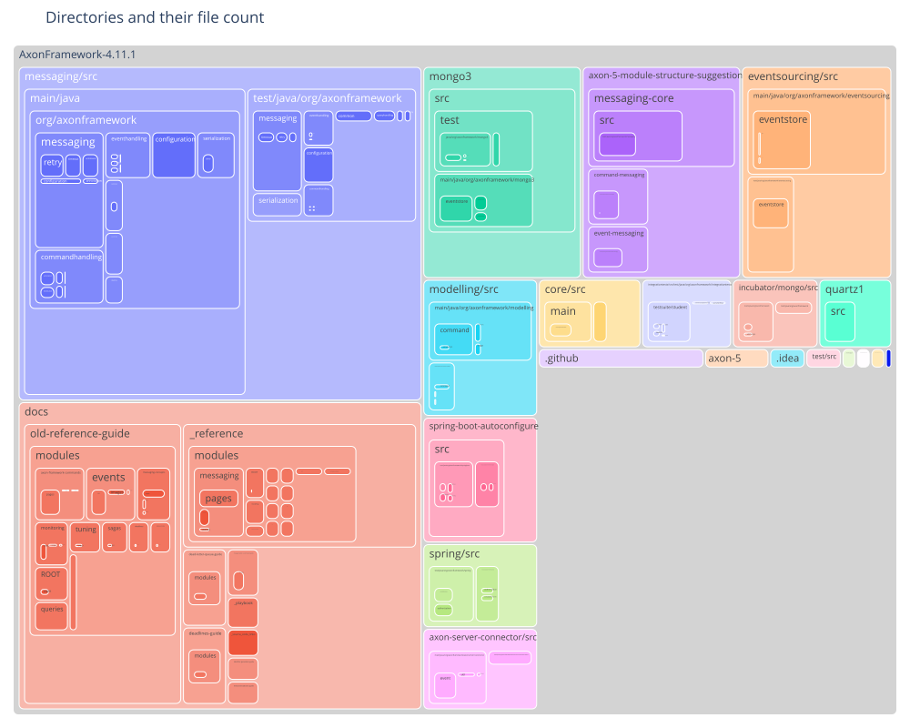
    

### Most frequent file extension per directory

    
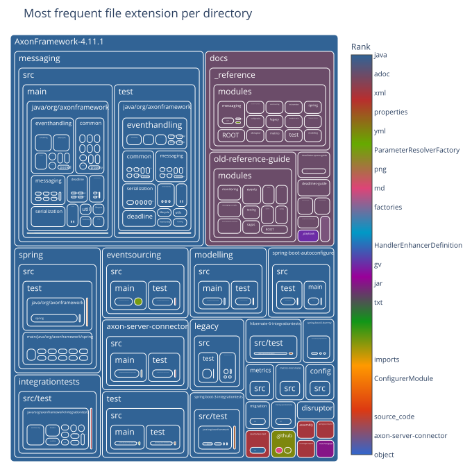
    

### Number of commits per directory

    
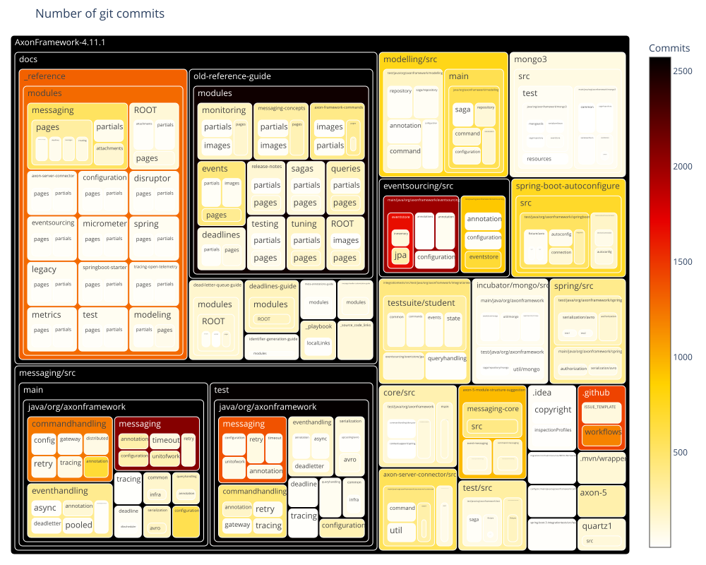
    

### Number of distinct authors per directory

    
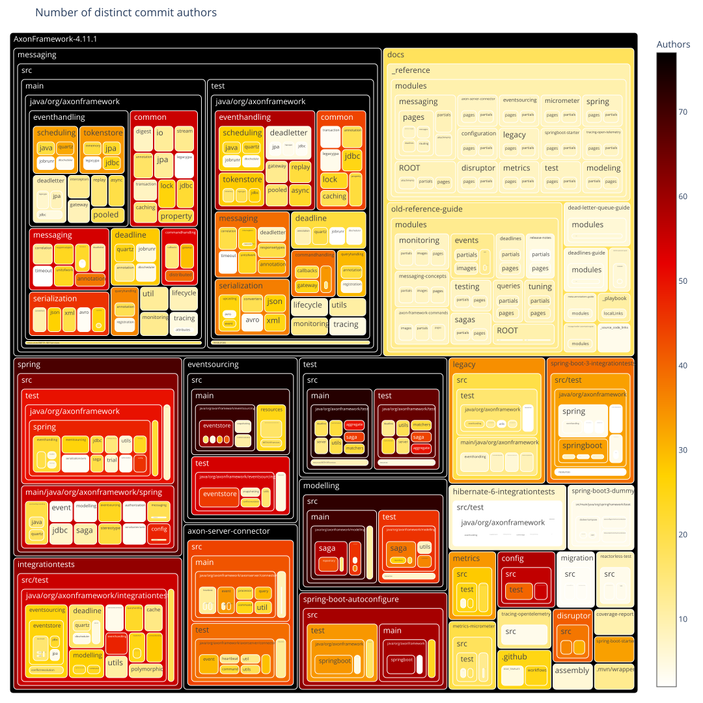
    

### Main author per directory

    
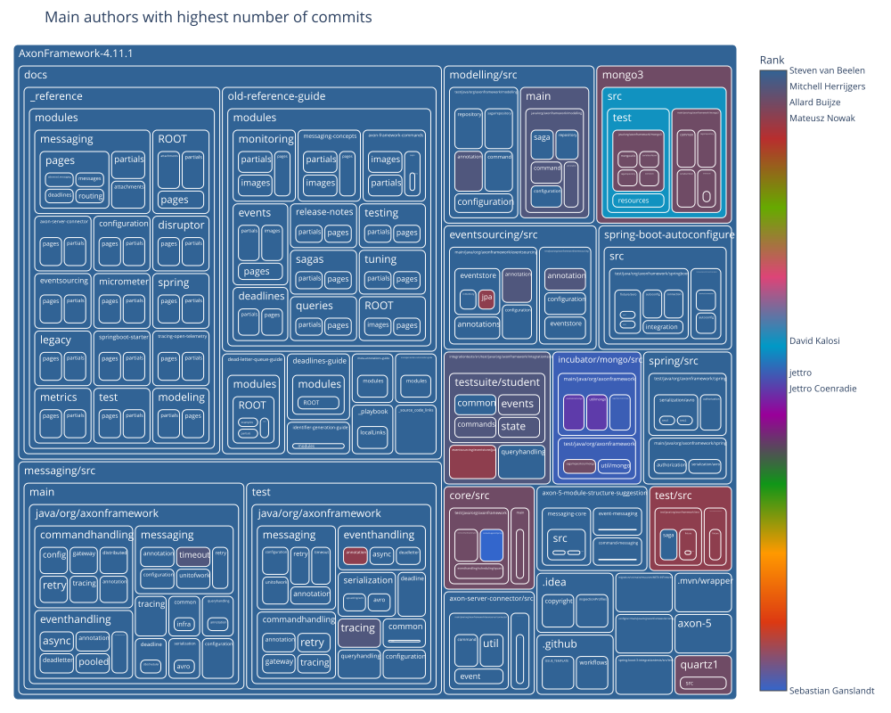
    

### Second author per directory

    
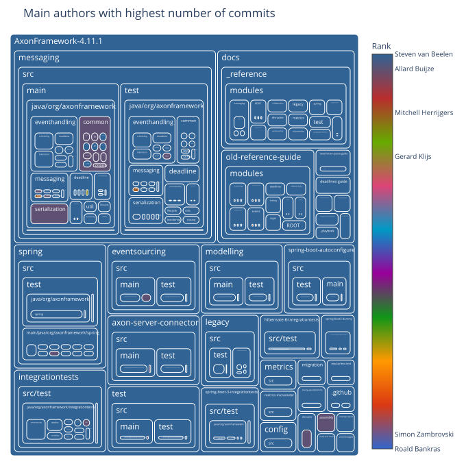
    

### Days since last commit per directory

    
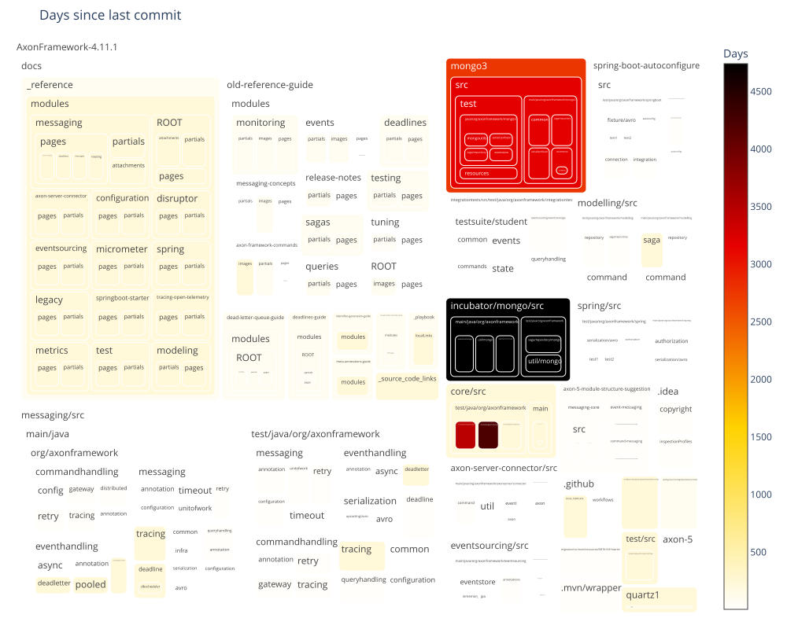
    

### Days since last commit per directory (ranked)

    
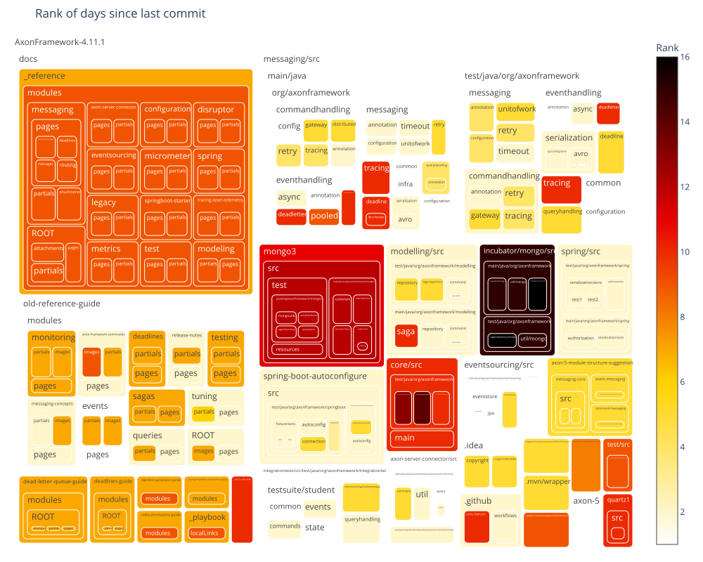
    

### Days since last file creation per directory

    
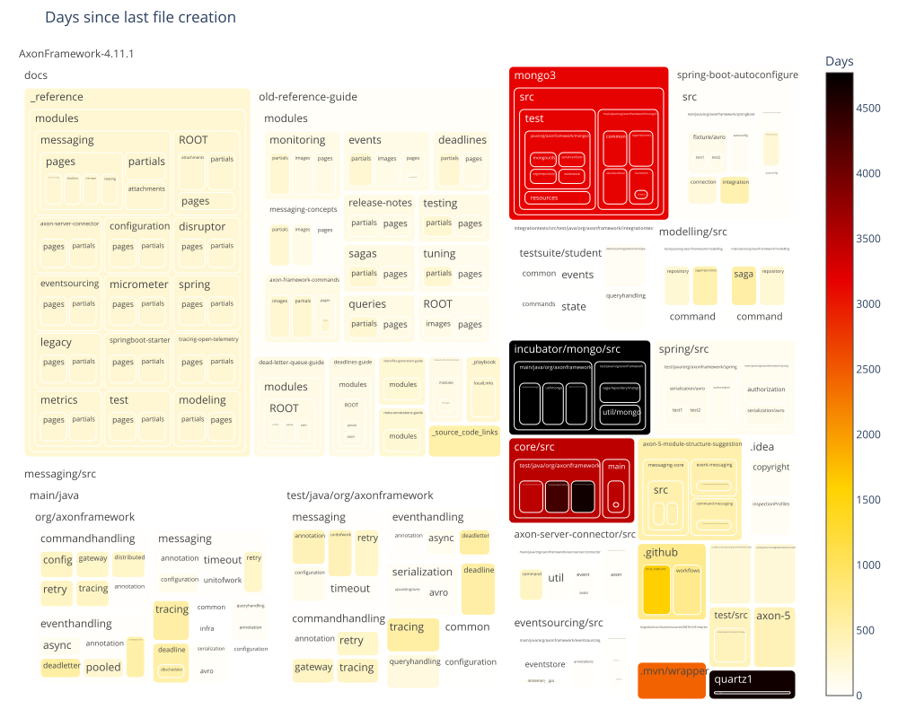
    

### Days since last file creation per directory (ranked)

    
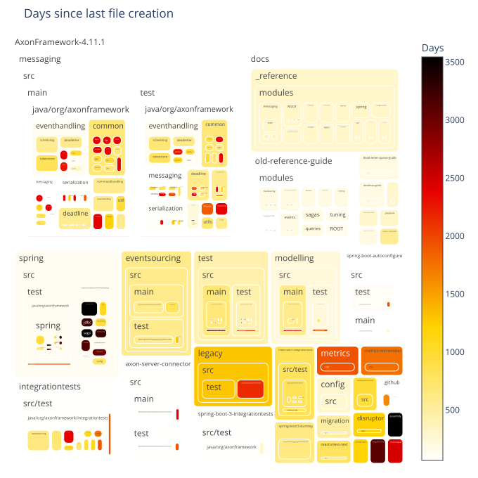
    

### Days since last file modification per directory

    
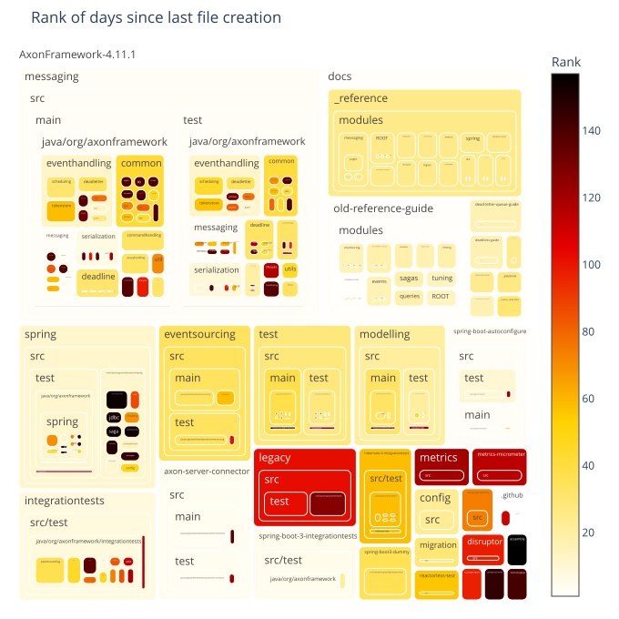
    

### Days since last file modification per directory (ranked)

    
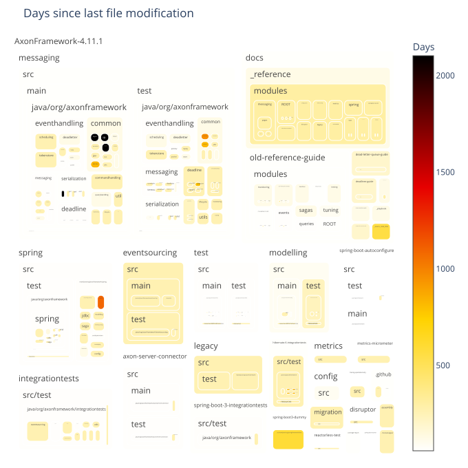
    

## Filecount per commit

Shows how many commits had changed one file, how many had changed two files, and so on.
The chart is limited to 30 lines for improved readability.
The data preview also includes overall statistics including the number of commits that are filtered out in the chart.

### Preview data

    Sum of commits that changed more than 30 files (each) = 1168
    Max changed files with one commit = 4041

<table border="1" class="dataframe">
  <thead>
    <tr style="text-align: right;">
      <th></th>
      <th>filesPerCommit</th>
      <th>commitCount</th>
    </tr>
  </thead>
  <tbody>
    <tr>
      <th>count</th>
      <td>377.000000</td>
      <td>377.000000</td>
    </tr>
    <tr>
      <th>mean</th>
      <td>398.572944</td>
      <td>35.114058</td>
    </tr>
    <tr>
      <th>std</th>
      <td>559.546155</td>
      <td>298.774056</td>
    </tr>
    <tr>
      <th>min</th>
      <td>1.000000</td>
      <td>1.000000</td>
    </tr>
    <tr>
      <th>25%</th>
      <td>95.000000</td>
      <td>1.000000</td>
    </tr>
    <tr>
      <th>50%</th>
      <td>204.000000</td>
      <td>2.000000</td>
    </tr>
    <tr>
      <th>75%</th>
      <td>429.000000</td>
      <td>5.000000</td>
    </tr>
    <tr>
      <th>max</th>
      <td>4041.000000</td>
      <td>5198.000000</td>
    </tr>
  </tbody>
</table>

<table border="1" class="dataframe">
  <thead>
    <tr style="text-align: right;">
      <th></th>
      <th>filesPerCommit</th>
      <th>commitCount</th>
    </tr>
  </thead>
  <tbody>
    <tr>
      <th>0</th>
      <td>1</td>
      <td>5198</td>
    </tr>
    <tr>
      <th>1</th>
      <td>2</td>
      <td>2216</td>
    </tr>
    <tr>
      <th>2</th>
      <td>3</td>
      <td>1033</td>
    </tr>
    <tr>
      <th>3</th>
      <td>4</td>
      <td>648</td>
    </tr>
    <tr>
      <th>4</th>
      <td>5</td>
      <td>435</td>
    </tr>
    <tr>
      <th>5</th>
      <td>6</td>
      <td>327</td>
    </tr>
    <tr>
      <th>6</th>
      <td>7</td>
      <td>261</td>
    </tr>
    <tr>
      <th>7</th>
      <td>8</td>
      <td>214</td>
    </tr>
    <tr>
      <th>8</th>
      <td>9</td>
      <td>160</td>
    </tr>
    <tr>
      <th>9</th>
      <td>10</td>
      <td>145</td>
    </tr>
    <tr>
      <th>10</th>
      <td>11</td>
      <td>110</td>
    </tr>
    <tr>
      <th>11</th>
      <td>12</td>
      <td>105</td>
    </tr>
    <tr>
      <th>12</th>
      <td>13</td>
      <td>124</td>
    </tr>
    <tr>
      <th>13</th>
      <td>14</td>
      <td>168</td>
    </tr>
    <tr>
      <th>14</th>
      <td>15</td>
      <td>188</td>
    </tr>
    <tr>
      <th>15</th>
      <td>16</td>
      <td>77</td>
    </tr>
    <tr>
      <th>16</th>
      <td>17</td>
      <td>70</td>
    </tr>
    <tr>
      <th>17</th>
      <td>18</td>
      <td>60</td>
    </tr>
    <tr>
      <th>18</th>
      <td>19</td>
      <td>83</td>
    </tr>
    <tr>
      <th>19</th>
      <td>20</td>
      <td>74</td>
    </tr>
    <tr>
      <th>20</th>
      <td>21</td>
      <td>46</td>
    </tr>
    <tr>
      <th>21</th>
      <td>22</td>
      <td>68</td>
    </tr>
    <tr>
      <th>22</th>
      <td>23</td>
      <td>33</td>
    </tr>
    <tr>
      <th>23</th>
      <td>24</td>
      <td>36</td>
    </tr>
    <tr>
      <th>24</th>
      <td>25</td>
      <td>42</td>
    </tr>
    <tr>
      <th>25</th>
      <td>26</td>
      <td>33</td>
    </tr>
    <tr>
      <th>26</th>
      <td>27</td>
      <td>35</td>
    </tr>
    <tr>
      <th>27</th>
      <td>28</td>
      <td>29</td>
    </tr>
    <tr>
      <th>28</th>
      <td>29</td>
      <td>29</td>
    </tr>
    <tr>
      <th>29</th>
      <td>30</td>
      <td>23</td>
    </tr>
  </tbody>
</table>

### Bar chart with the number of files per commit distribution

    
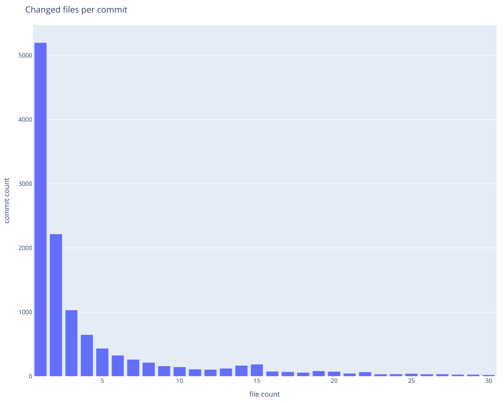
    

## WordCloud of git authors

<table border="1" class="dataframe">
  <thead>
    <tr style="text-align: right;">
      <th></th>
      <th>word</th>
      <th>frequency</th>
    </tr>
  </thead>
  <tbody>
    <tr>
      <th>0</th>
      <td>Steven van Beelen</td>
      <td>4305</td>
    </tr>
    <tr>
      <th>1</th>
      <td>Allard Buijze</td>
      <td>3148</td>
    </tr>
    <tr>
      <th>2</th>
      <td>smcvb</td>
      <td>822</td>
    </tr>
    <tr>
      <th>3</th>
      <td>Milan Savic</td>
      <td>449</td>
    </tr>
    <tr>
      <th>4</th>
      <td>Mateusz Nowak</td>
      <td>412</td>
    </tr>
    <tr>
      <th>5</th>
      <td>Mitchell Herrijgers</td>
      <td>408</td>
    </tr>
    <tr>
      <th>6</th>
      <td>Gerard Klijs</td>
      <td>247</td>
    </tr>
    <tr>
      <th>7</th>
      <td>Marc Gathier</td>
      <td>231</td>
    </tr>
    <tr>
      <th>8</th>
      <td>sara pellegrini</td>
      <td>163</td>
    </tr>
    <tr>
      <th>9</th>
      <td>Rene de Waele</td>
      <td>129</td>
    </tr>
  </tbody>
</table>

    

    

