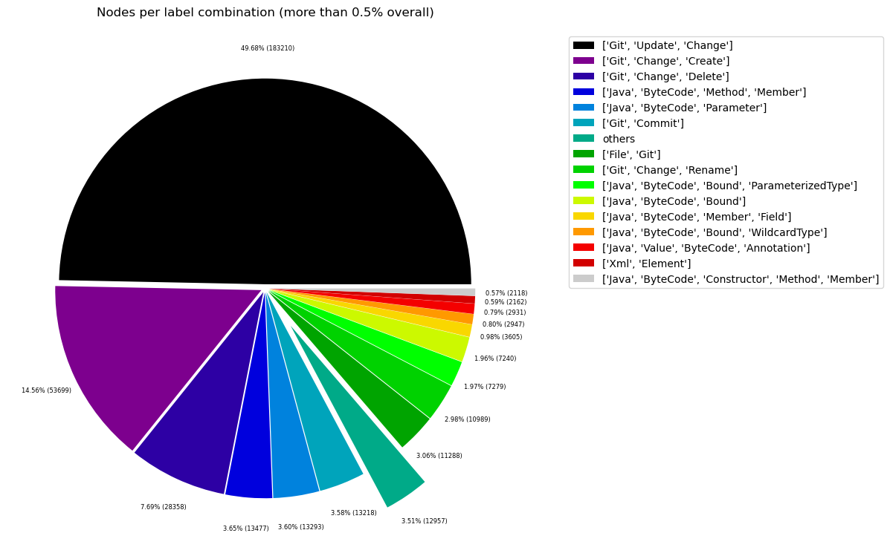
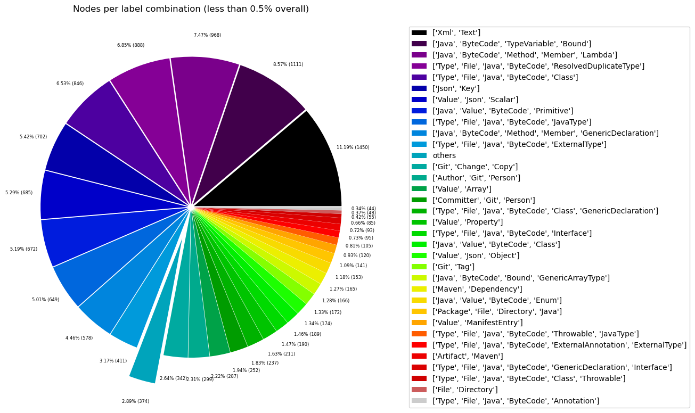
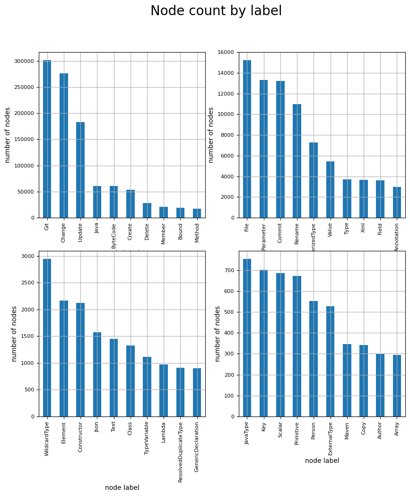
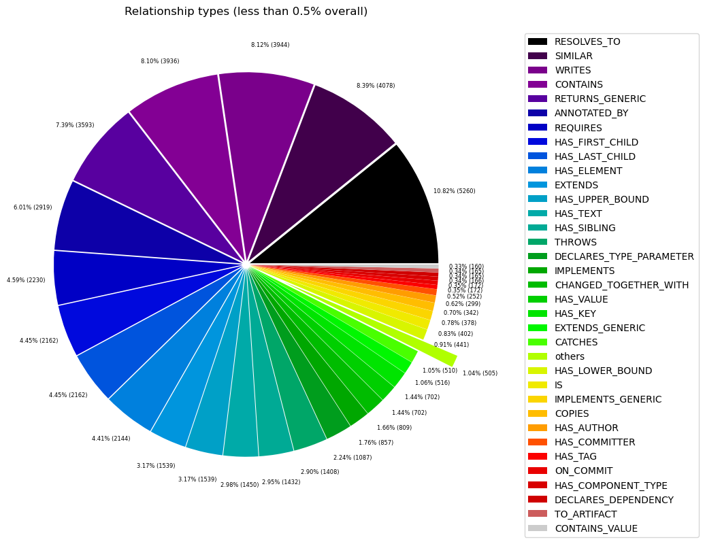

# Overview in General
   

This file contains a general overview of the data in the graph including node labels and relationships types.

### References
- [jqassistant](https://jqassistant.org)
- [Neo4j Python Driver](https://neo4j.com/docs/api/python-driver/current)

## Node Labels

### Table 1a - Highest node count by label combination

Lists the 30 label combinations with the highest number of nodes. The labels with the lowest node count are listed in table 1b.
The total list would sum up to the total number of labels (100%).

The whole table can be found in the CSV report `Node_label_combination_count`.

<table border="1" class="dataframe">
  <thead>
    <tr style="text-align: right;">
      <th></th>
      <th>nodeLabels</th>
      <th>nodesWithThatLabels</th>
      <th>nodesWithThatLabelsPercent</th>
    </tr>
  </thead>
  <tbody>
    <tr>
      <th>0</th>
      <td>[Git, Update, Change]</td>
      <td>183210</td>
      <td>49.681238</td>
    </tr>
    <tr>
      <th>1</th>
      <td>[Git, Change, Create]</td>
      <td>53699</td>
      <td>14.561611</td>
    </tr>
    <tr>
      <th>2</th>
      <td>[Git, Change, Delete]</td>
      <td>28358</td>
      <td>7.689867</td>
    </tr>
    <tr>
      <th>3</th>
      <td>[Java, ByteCode, Method, Member]</td>
      <td>13477</td>
      <td>3.654572</td>
    </tr>
    <tr>
      <th>4</th>
      <td>[Java, ByteCode, Parameter]</td>
      <td>13293</td>
      <td>3.604676</td>
    </tr>
    <tr>
      <th>5</th>
      <td>[Git, Commit]</td>
      <td>13218</td>
      <td>3.584338</td>
    </tr>
    <tr>
      <th>6</th>
      <td>[File, Git]</td>
      <td>11288</td>
      <td>3.060978</td>
    </tr>
    <tr>
      <th>7</th>
      <td>[Git, Change, Rename]</td>
      <td>10989</td>
      <td>2.979898</td>
    </tr>
    <tr>
      <th>8</th>
      <td>[Java, ByteCode, Bound, ParameterizedType]</td>
      <td>7279</td>
      <td>1.973854</td>
    </tr>
    <tr>
      <th>9</th>
      <td>[Java, ByteCode, Bound]</td>
      <td>7240</td>
      <td>1.963278</td>
    </tr>
    <tr>
      <th>10</th>
      <td>[Java, ByteCode, Member, Field]</td>
      <td>3605</td>
      <td>0.977571</td>
    </tr>
    <tr>
      <th>11</th>
      <td>[Java, ByteCode, Bound, WildcardType]</td>
      <td>2947</td>
      <td>0.799141</td>
    </tr>
    <tr>
      <th>12</th>
      <td>[Java, Value, ByteCode, Annotation]</td>
      <td>2931</td>
      <td>0.794802</td>
    </tr>
    <tr>
      <th>13</th>
      <td>[Xml, Element]</td>
      <td>2162</td>
      <td>0.586272</td>
    </tr>
    <tr>
      <th>14</th>
      <td>[Java, ByteCode, Constructor, Method, Member]</td>
      <td>2118</td>
      <td>0.574340</td>
    </tr>
    <tr>
      <th>15</th>
      <td>[Xml, Text]</td>
      <td>1450</td>
      <td>0.393198</td>
    </tr>
    <tr>
      <th>16</th>
      <td>[Java, ByteCode, TypeVariable, Bound]</td>
      <td>1111</td>
      <td>0.301271</td>
    </tr>
    <tr>
      <th>17</th>
      <td>[Java, ByteCode, Method, Member, Lambda]</td>
      <td>968</td>
      <td>0.262494</td>
    </tr>
    <tr>
      <th>18</th>
      <td>[Type, File, Java, ByteCode, ResolvedDuplicate...</td>
      <td>888</td>
      <td>0.240800</td>
    </tr>
    <tr>
      <th>19</th>
      <td>[Type, File, Java, ByteCode, Class]</td>
      <td>846</td>
      <td>0.229411</td>
    </tr>
    <tr>
      <th>20</th>
      <td>[Json, Key]</td>
      <td>702</td>
      <td>0.190362</td>
    </tr>
    <tr>
      <th>21</th>
      <td>[Value, Json, Scalar]</td>
      <td>685</td>
      <td>0.185752</td>
    </tr>
    <tr>
      <th>22</th>
      <td>[Java, Value, ByteCode, Primitive]</td>
      <td>672</td>
      <td>0.182227</td>
    </tr>
    <tr>
      <th>23</th>
      <td>[Type, File, Java, ByteCode, JavaType]</td>
      <td>649</td>
      <td>0.175990</td>
    </tr>
    <tr>
      <th>24</th>
      <td>[Java, ByteCode, Method, Member, GenericDeclar...</td>
      <td>578</td>
      <td>0.156737</td>
    </tr>
    <tr>
      <th>25</th>
      <td>[Type, File, Java, ByteCode, ExternalType]</td>
      <td>411</td>
      <td>0.111451</td>
    </tr>
    <tr>
      <th>26</th>
      <td>[Git, Change, Copy]</td>
      <td>342</td>
      <td>0.092740</td>
    </tr>
    <tr>
      <th>27</th>
      <td>[Author, Git, Person]</td>
      <td>299</td>
      <td>0.081080</td>
    </tr>
    <tr>
      <th>28</th>
      <td>[Value, Array]</td>
      <td>287</td>
      <td>0.077826</td>
    </tr>
    <tr>
      <th>29</th>
      <td>[Committer, Git, Person]</td>
      <td>252</td>
      <td>0.068335</td>
    </tr>
  </tbody>
</table>

### Chart 1a - Highest node count by label combination

Values under 0.5% will be grouped into "others" to get a cleaner plot. The group "others" is then broken down in Chart 1b.

    <Figure size 640x480 with 0 Axes>

    

    

### Table 1b - Lowest node count by label combination

Lists the 30 label combinations with the lowest number of nodes until they reach 0.5% of the total node count, which are shown above.

<table border="1" class="dataframe">
  <thead>
    <tr style="text-align: right;">
      <th></th>
      <th>nodeLabels</th>
      <th>nodesWithThatLabels</th>
      <th>nodesWithThatLabelsPercent</th>
    </tr>
  </thead>
  <tbody>
    <tr>
      <th>0</th>
      <td>[Analyze, Task, jQAssistant]</td>
      <td>1</td>
      <td>0.000271</td>
    </tr>
    <tr>
      <th>1</th>
      <td>[Package, File, Json, NPM]</td>
      <td>1</td>
      <td>0.000271</td>
    </tr>
    <tr>
      <th>2</th>
      <td>[Repository, File, Git]</td>
      <td>1</td>
      <td>0.000271</td>
    </tr>
    <tr>
      <th>3</th>
      <td>[File, TS, Scan]</td>
      <td>1</td>
      <td>0.000271</td>
    </tr>
    <tr>
      <th>4</th>
      <td>[File, Json]</td>
      <td>2</td>
      <td>0.000542</td>
    </tr>
    <tr>
      <th>5</th>
      <td>[File]</td>
      <td>3</td>
      <td>0.000814</td>
    </tr>
    <tr>
      <th>6</th>
      <td>[Java, ByteCode, Constructor, Method, Member, ...</td>
      <td>4</td>
      <td>0.001085</td>
    </tr>
    <tr>
      <th>7</th>
      <td>[Maven, Exclusion]</td>
      <td>5</td>
      <td>0.001356</td>
    </tr>
    <tr>
      <th>8</th>
      <td>[Value, Array, Json]</td>
      <td>6</td>
      <td>0.001627</td>
    </tr>
    <tr>
      <th>9</th>
      <td>[Dependency, NPM]</td>
      <td>7</td>
      <td>0.001898</td>
    </tr>
    <tr>
      <th>10</th>
      <td>[Type, File, Java, ByteCode, Void]</td>
      <td>9</td>
      <td>0.002441</td>
    </tr>
    <tr>
      <th>11</th>
      <td>[File, Maven, Xml, Pom, Document]</td>
      <td>9</td>
      <td>0.002441</td>
    </tr>
    <tr>
      <th>12</th>
      <td>[Java, ManifestSection]</td>
      <td>9</td>
      <td>0.002441</td>
    </tr>
    <tr>
      <th>13</th>
      <td>[File, Java, Manifest]</td>
      <td>9</td>
      <td>0.002441</td>
    </tr>
    <tr>
      <th>14</th>
      <td>[File, Artifact, Jar, Archive, Zip, Java]</td>
      <td>9</td>
      <td>0.002441</td>
    </tr>
    <tr>
      <th>15</th>
      <td>[File, Java, ServiceLoader]</td>
      <td>10</td>
      <td>0.002712</td>
    </tr>
    <tr>
      <th>16</th>
      <td>[File, Java, Properties]</td>
      <td>12</td>
      <td>0.003254</td>
    </tr>
    <tr>
      <th>17</th>
      <td>[Maven, ExecutionGoal]</td>
      <td>16</td>
      <td>0.004339</td>
    </tr>
    <tr>
      <th>18</th>
      <td>[Maven, PluginExecution]</td>
      <td>16</td>
      <td>0.004339</td>
    </tr>
    <tr>
      <th>19</th>
      <td>[Xml, Attribute]</td>
      <td>18</td>
      <td>0.004881</td>
    </tr>
    <tr>
      <th>20</th>
      <td>[jQAssistant, Rule, Concept]</td>
      <td>19</td>
      <td>0.005152</td>
    </tr>
    <tr>
      <th>21</th>
      <td>[Type, File, Java, ByteCode, Throwable, Extern...</td>
      <td>21</td>
      <td>0.005695</td>
    </tr>
    <tr>
      <th>22</th>
      <td>[Maven, Configuration]</td>
      <td>21</td>
      <td>0.005695</td>
    </tr>
    <tr>
      <th>23</th>
      <td>[Maven, Plugin]</td>
      <td>21</td>
      <td>0.005695</td>
    </tr>
    <tr>
      <th>24</th>
      <td>[Type, File, Java, ByteCode, Throwable, Resolv...</td>
      <td>22</td>
      <td>0.005966</td>
    </tr>
    <tr>
      <th>25</th>
      <td>[Git, Branch]</td>
      <td>28</td>
      <td>0.007593</td>
    </tr>
    <tr>
      <th>26</th>
      <td>[Type, File, Java, ByteCode, Enum]</td>
      <td>28</td>
      <td>0.007593</td>
    </tr>
    <tr>
      <th>27</th>
      <td>[Type, File, Java, ByteCode, PrimitiveType]</td>
      <td>30</td>
      <td>0.008135</td>
    </tr>
    <tr>
      <th>28</th>
      <td>[Xml, Namespace]</td>
      <td>36</td>
      <td>0.009762</td>
    </tr>
    <tr>
      <th>29</th>
      <td>[Type, File, Java, ByteCode, Annotation]</td>
      <td>44</td>
      <td>0.011932</td>
    </tr>
  </tbody>
</table>

### Chart 1b - Lowest node count by label combination

Shows the lowest (less than 0.5% overall) node count label combinations. Therefore, this plot breaks down the "others" slice of the pie chart above. Values under 0.01% will be grouped into "others" to get a cleaner plot.

    <Figure size 640x480 with 0 Axes>

    

    

### Table 1c - Highest node count by single label

Lists the 40 labels with the highest number of nodes.
Doesn't sum up to the total number of nodes or 100% because one node can have multiple labels.
Helps to identify commonly used labels.

<table border="1" class="dataframe">
  <thead>
    <tr style="text-align: right;">
      <th></th>
      <th>nodeLabel</th>
      <th>nodesWithThatLabel</th>
      <th>nodesWithThatLabelPercent</th>
    </tr>
  </thead>
  <tbody>
    <tr>
      <th>0</th>
      <td>Git</td>
      <td>301856</td>
      <td>81.854593</td>
    </tr>
    <tr>
      <th>1</th>
      <td>Change</td>
      <td>276598</td>
      <td>75.005356</td>
    </tr>
    <tr>
      <th>2</th>
      <td>Update</td>
      <td>183210</td>
      <td>49.681238</td>
    </tr>
    <tr>
      <th>3</th>
      <td>Java</td>
      <td>60636</td>
      <td>16.442725</td>
    </tr>
    <tr>
      <th>4</th>
      <td>ByteCode</td>
      <td>60446</td>
      <td>16.391202</td>
    </tr>
    <tr>
      <th>5</th>
      <td>Create</td>
      <td>53699</td>
      <td>14.561611</td>
    </tr>
    <tr>
      <th>6</th>
      <td>Delete</td>
      <td>28358</td>
      <td>7.689867</td>
    </tr>
    <tr>
      <th>7</th>
      <td>Member</td>
      <td>20750</td>
      <td>5.626798</td>
    </tr>
    <tr>
      <th>8</th>
      <td>Bound</td>
      <td>18743</td>
      <td>5.082558</td>
    </tr>
    <tr>
      <th>9</th>
      <td>Method</td>
      <td>17145</td>
      <td>4.649227</td>
    </tr>
    <tr>
      <th>10</th>
      <td>File</td>
      <td>15249</td>
      <td>4.135087</td>
    </tr>
    <tr>
      <th>11</th>
      <td>Parameter</td>
      <td>13293</td>
      <td>3.604676</td>
    </tr>
    <tr>
      <th>12</th>
      <td>Commit</td>
      <td>13218</td>
      <td>3.584338</td>
    </tr>
    <tr>
      <th>13</th>
      <td>Rename</td>
      <td>10989</td>
      <td>2.979898</td>
    </tr>
    <tr>
      <th>14</th>
      <td>ParameterizedType</td>
      <td>7279</td>
      <td>1.973854</td>
    </tr>
    <tr>
      <th>15</th>
      <td>Value</td>
      <td>5428</td>
      <td>1.471916</td>
    </tr>
    <tr>
      <th>16</th>
      <td>Type</td>
      <td>3715</td>
      <td>1.007400</td>
    </tr>
    <tr>
      <th>17</th>
      <td>Xml</td>
      <td>3675</td>
      <td>0.996553</td>
    </tr>
    <tr>
      <th>18</th>
      <td>Field</td>
      <td>3605</td>
      <td>0.977571</td>
    </tr>
    <tr>
      <th>19</th>
      <td>Annotation</td>
      <td>2975</td>
      <td>0.806734</td>
    </tr>
    <tr>
      <th>20</th>
      <td>WildcardType</td>
      <td>2947</td>
      <td>0.799141</td>
    </tr>
    <tr>
      <th>21</th>
      <td>Element</td>
      <td>2162</td>
      <td>0.586272</td>
    </tr>
    <tr>
      <th>22</th>
      <td>Constructor</td>
      <td>2122</td>
      <td>0.575425</td>
    </tr>
    <tr>
      <th>23</th>
      <td>Json</td>
      <td>1570</td>
      <td>0.425738</td>
    </tr>
    <tr>
      <th>24</th>
      <td>Text</td>
      <td>1450</td>
      <td>0.393198</td>
    </tr>
    <tr>
      <th>25</th>
      <td>Class</td>
      <td>1327</td>
      <td>0.359844</td>
    </tr>
    <tr>
      <th>26</th>
      <td>TypeVariable</td>
      <td>1111</td>
      <td>0.301271</td>
    </tr>
    <tr>
      <th>27</th>
      <td>Lambda</td>
      <td>968</td>
      <td>0.262494</td>
    </tr>
    <tr>
      <th>28</th>
      <td>ResolvedDuplicateType</td>
      <td>910</td>
      <td>0.246766</td>
    </tr>
    <tr>
      <th>29</th>
      <td>GenericDeclaration</td>
      <td>904</td>
      <td>0.245139</td>
    </tr>
    <tr>
      <th>30</th>
      <td>JavaType</td>
      <td>754</td>
      <td>0.204463</td>
    </tr>
    <tr>
      <th>31</th>
      <td>Key</td>
      <td>702</td>
      <td>0.190362</td>
    </tr>
    <tr>
      <th>32</th>
      <td>Scalar</td>
      <td>685</td>
      <td>0.185752</td>
    </tr>
    <tr>
      <th>33</th>
      <td>Primitive</td>
      <td>672</td>
      <td>0.182227</td>
    </tr>
    <tr>
      <th>34</th>
      <td>Person</td>
      <td>551</td>
      <td>0.149415</td>
    </tr>
    <tr>
      <th>35</th>
      <td>ExternalType</td>
      <td>527</td>
      <td>0.142907</td>
    </tr>
    <tr>
      <th>36</th>
      <td>Maven</td>
      <td>346</td>
      <td>0.093825</td>
    </tr>
    <tr>
      <th>37</th>
      <td>Copy</td>
      <td>342</td>
      <td>0.092740</td>
    </tr>
    <tr>
      <th>38</th>
      <td>Author</td>
      <td>299</td>
      <td>0.081080</td>
    </tr>
    <tr>
      <th>39</th>
      <td>Array</td>
      <td>293</td>
      <td>0.079453</td>
    </tr>
  </tbody>
</table>

### Chart 1c - Highest node count by label

Shows the 40 labels with the highest number of nodes.

    <Figure size 640x480 with 0 Axes>

    

    

## Relationship Types

### Table 2a - Highest relationship count by type

Lists the 30 relationship types with the highest number of occurrences.
The whole table can be found in the CSV report `Relationship_type_count`.

    Total number of relationships: 1144320

<table border="1" class="dataframe">
  <thead>
    <tr style="text-align: right;">
      <th></th>
      <th>relationshipType</th>
      <th>nodesWithThatRelationshipType</th>
      <th>nodesWithThatRelationshipTypePercent</th>
    </tr>
  </thead>
  <tbody>
    <tr>
      <th>0</th>
      <td>CONTAINS_CHANGE</td>
      <td>276598</td>
      <td>24.171386</td>
    </tr>
    <tr>
      <th>1</th>
      <td>MODIFIES</td>
      <td>276598</td>
      <td>24.171386</td>
    </tr>
    <tr>
      <th>2</th>
      <td>UPDATES</td>
      <td>183210</td>
      <td>16.010382</td>
    </tr>
    <tr>
      <th>3</th>
      <td>CREATES</td>
      <td>65030</td>
      <td>5.682851</td>
    </tr>
    <tr>
      <th>4</th>
      <td>DELETES</td>
      <td>39347</td>
      <td>3.438461</td>
    </tr>
    <tr>
      <th>5</th>
      <td>INVOKES</td>
      <td>36545</td>
      <td>3.193600</td>
    </tr>
    <tr>
      <th>6</th>
      <td>COMMITTED</td>
      <td>26436</td>
      <td>2.310193</td>
    </tr>
    <tr>
      <th>7</th>
      <td>DEPENDS_ON</td>
      <td>22492</td>
      <td>1.965534</td>
    </tr>
    <tr>
      <th>8</th>
      <td>OF_TYPE</td>
      <td>21920</td>
      <td>1.915548</td>
    </tr>
    <tr>
      <th>9</th>
      <td>DECLARES</td>
      <td>21211</td>
      <td>1.853590</td>
    </tr>
    <tr>
      <th>10</th>
      <td>OF_RAW_TYPE</td>
      <td>17353</td>
      <td>1.516446</td>
    </tr>
    <tr>
      <th>11</th>
      <td>HAS_PARENT</td>
      <td>16050</td>
      <td>1.402580</td>
    </tr>
    <tr>
      <th>12</th>
      <td>HAS</td>
      <td>14429</td>
      <td>1.260924</td>
    </tr>
    <tr>
      <th>13</th>
      <td>HAS_COMMIT</td>
      <td>13218</td>
      <td>1.155096</td>
    </tr>
    <tr>
      <th>14</th>
      <td>RETURNS</td>
      <td>12844</td>
      <td>1.122413</td>
    </tr>
    <tr>
      <th>15</th>
      <td>HAS_FILE</td>
      <td>11288</td>
      <td>0.986437</td>
    </tr>
    <tr>
      <th>16</th>
      <td>RENAMES</td>
      <td>10989</td>
      <td>0.960308</td>
    </tr>
    <tr>
      <th>17</th>
      <td>READS</td>
      <td>9379</td>
      <td>0.819613</td>
    </tr>
    <tr>
      <th>18</th>
      <td>HAS_ACTUAL_TYPE_ARGUMENT</td>
      <td>8407</td>
      <td>0.734672</td>
    </tr>
    <tr>
      <th>19</th>
      <td>HAS_NEW_NAME</td>
      <td>6382</td>
      <td>0.557711</td>
    </tr>
    <tr>
      <th>20</th>
      <td>OF_GENERIC_TYPE</td>
      <td>5996</td>
      <td>0.523979</td>
    </tr>
    <tr>
      <th>21</th>
      <td>RESOLVES_TO</td>
      <td>5260</td>
      <td>0.459662</td>
    </tr>
    <tr>
      <th>22</th>
      <td>SIMILAR</td>
      <td>4078</td>
      <td>0.356369</td>
    </tr>
    <tr>
      <th>23</th>
      <td>WRITES</td>
      <td>3944</td>
      <td>0.344659</td>
    </tr>
    <tr>
      <th>24</th>
      <td>CONTAINS</td>
      <td>3936</td>
      <td>0.343960</td>
    </tr>
    <tr>
      <th>25</th>
      <td>RETURNS_GENERIC</td>
      <td>3593</td>
      <td>0.313986</td>
    </tr>
    <tr>
      <th>26</th>
      <td>ANNOTATED_BY</td>
      <td>2919</td>
      <td>0.255086</td>
    </tr>
    <tr>
      <th>27</th>
      <td>REQUIRES</td>
      <td>2230</td>
      <td>0.194876</td>
    </tr>
    <tr>
      <th>28</th>
      <td>HAS_FIRST_CHILD</td>
      <td>2162</td>
      <td>0.188933</td>
    </tr>
    <tr>
      <th>29</th>
      <td>HAS_LAST_CHILD</td>
      <td>2162</td>
      <td>0.188933</td>
    </tr>
  </tbody>
</table>

### Chart 2a - Highest relationship count by type

Values under 0.5% will be grouped into "others" to get a cleaner plot. The group "others" is then broken down in the second chart.

    <Figure size 640x480 with 0 Axes>

    

    

### Table 2b - Lowest relationship count by type

Lists the 30 relationships type with the lowest number of occurrences up to 0.5% of the total node count. This is essentially breaking down the "others" slice from the chart above.

<table border="1" class="dataframe">
  <thead>
    <tr style="text-align: right;">
      <th></th>
      <th>relationshipType</th>
      <th>nodesWithThatRelationshipType</th>
      <th>nodesWithThatRelationshipTypePercent</th>
    </tr>
  </thead>
  <tbody>
    <tr>
      <th>0</th>
      <td>HAS_PROPERTY</td>
      <td>1</td>
      <td>0.000087</td>
    </tr>
    <tr>
      <th>1</th>
      <td>THROWS_GENERIC</td>
      <td>5</td>
      <td>0.000437</td>
    </tr>
    <tr>
      <th>2</th>
      <td>EXCLUDES</td>
      <td>5</td>
      <td>0.000437</td>
    </tr>
    <tr>
      <th>3</th>
      <td>DECLARES_DEV_DEPENDENCY</td>
      <td>7</td>
      <td>0.000612</td>
    </tr>
    <tr>
      <th>4</th>
      <td>DESCRIBES</td>
      <td>9</td>
      <td>0.000786</td>
    </tr>
    <tr>
      <th>5</th>
      <td>HAS_ROOT_ELEMENT</td>
      <td>12</td>
      <td>0.001049</td>
    </tr>
    <tr>
      <th>6</th>
      <td>HAS_GOAL</td>
      <td>16</td>
      <td>0.001398</td>
    </tr>
    <tr>
      <th>7</th>
      <td>HAS_EXECUTION</td>
      <td>16</td>
      <td>0.001398</td>
    </tr>
    <tr>
      <th>8</th>
      <td>OF_NAMESPACE</td>
      <td>18</td>
      <td>0.001573</td>
    </tr>
    <tr>
      <th>9</th>
      <td>HAS_ATTRIBUTE</td>
      <td>18</td>
      <td>0.001573</td>
    </tr>
    <tr>
      <th>10</th>
      <td>INCLUDES_CONCEPT</td>
      <td>19</td>
      <td>0.001660</td>
    </tr>
    <tr>
      <th>11</th>
      <td>IS_ARTIFACT</td>
      <td>21</td>
      <td>0.001835</td>
    </tr>
    <tr>
      <th>12</th>
      <td>HAS_CONFIGURATION</td>
      <td>21</td>
      <td>0.001835</td>
    </tr>
    <tr>
      <th>13</th>
      <td>USES_PLUGIN</td>
      <td>21</td>
      <td>0.001835</td>
    </tr>
    <tr>
      <th>14</th>
      <td>REQUIRES_TYPE_PARAMETER</td>
      <td>24</td>
      <td>0.002097</td>
    </tr>
    <tr>
      <th>15</th>
      <td>REQUIRES_CONCEPT</td>
      <td>28</td>
      <td>0.002447</td>
    </tr>
    <tr>
      <th>16</th>
      <td>HAS_BRANCH</td>
      <td>28</td>
      <td>0.002447</td>
    </tr>
    <tr>
      <th>17</th>
      <td>HAS_HEAD</td>
      <td>29</td>
      <td>0.002534</td>
    </tr>
    <tr>
      <th>18</th>
      <td>DECLARES_NAMESPACE</td>
      <td>36</td>
      <td>0.003146</td>
    </tr>
    <tr>
      <th>19</th>
      <td>HAS_DEFAULT</td>
      <td>39</td>
      <td>0.003408</td>
    </tr>
    <tr>
      <th>20</th>
      <td>COPY_OF</td>
      <td>132</td>
      <td>0.011535</td>
    </tr>
    <tr>
      <th>21</th>
      <td>CONTAINS_VALUE</td>
      <td>160</td>
      <td>0.013982</td>
    </tr>
    <tr>
      <th>22</th>
      <td>DECLARES_DEPENDENCY</td>
      <td>165</td>
      <td>0.014419</td>
    </tr>
    <tr>
      <th>23</th>
      <td>TO_ARTIFACT</td>
      <td>165</td>
      <td>0.014419</td>
    </tr>
    <tr>
      <th>24</th>
      <td>HAS_COMPONENT_TYPE</td>
      <td>166</td>
      <td>0.014506</td>
    </tr>
    <tr>
      <th>25</th>
      <td>ON_COMMIT</td>
      <td>172</td>
      <td>0.015031</td>
    </tr>
    <tr>
      <th>26</th>
      <td>HAS_TAG</td>
      <td>172</td>
      <td>0.015031</td>
    </tr>
    <tr>
      <th>27</th>
      <td>HAS_COMMITTER</td>
      <td>252</td>
      <td>0.022022</td>
    </tr>
    <tr>
      <th>28</th>
      <td>HAS_AUTHOR</td>
      <td>299</td>
      <td>0.026129</td>
    </tr>
    <tr>
      <th>29</th>
      <td>COPIES</td>
      <td>342</td>
      <td>0.029887</td>
    </tr>
  </tbody>
</table>

### Chart 2b - Lowest relationship count by type

Shows the lowest (less than 0.5% overall) relationship types. This plot breaks down the "others" slice of the pie chart above. Values under 0.01% will be grouped into "others" to get a cleaner plot.

    <Figure size 640x480 with 0 Axes>

    

    

## Node labels with their relationships

### Table 3a - Highest relationship count by node labels and relationship type

Lists the 30 node labels and their relationship types with the highest number of occurrences.

<table border="1" class="dataframe">
  <thead>
    <tr style="text-align: right;">
      <th></th>
      <th>sourceLabels</th>
      <th>relationType</th>
      <th>targetLabels</th>
      <th>numberOfRelationships</th>
      <th>numberOfNodesWithSameLabelsAsSource</th>
      <th>numberOfNodesWithSameLabelsAsTarget</th>
      <th>densityInPercent</th>
    </tr>
  </thead>
  <tbody>
    <tr>
      <th>0</th>
      <td>[Git, Update, Change]</td>
      <td>MODIFIES</td>
      <td>[File, Git]</td>
      <td>183210</td>
      <td>183210</td>
      <td>11288</td>
      <td>0.008859</td>
    </tr>
    <tr>
      <th>1</th>
      <td>[Git, Update, Change]</td>
      <td>UPDATES</td>
      <td>[File, Git]</td>
      <td>183210</td>
      <td>183210</td>
      <td>11288</td>
      <td>0.008859</td>
    </tr>
    <tr>
      <th>2</th>
      <td>[Git, Commit]</td>
      <td>CONTAINS_CHANGE</td>
      <td>[Git, Update, Change]</td>
      <td>183210</td>
      <td>13218</td>
      <td>183210</td>
      <td>0.007565</td>
    </tr>
    <tr>
      <th>3</th>
      <td>[Git, Commit]</td>
      <td>CONTAINS_CHANGE</td>
      <td>[Git, Change, Create]</td>
      <td>53699</td>
      <td>13218</td>
      <td>53699</td>
      <td>0.007565</td>
    </tr>
    <tr>
      <th>4</th>
      <td>[Git, Change, Create]</td>
      <td>MODIFIES</td>
      <td>[File, Git]</td>
      <td>53699</td>
      <td>53699</td>
      <td>11288</td>
      <td>0.008859</td>
    </tr>
    <tr>
      <th>5</th>
      <td>[Git, Change, Create]</td>
      <td>CREATES</td>
      <td>[File, Git]</td>
      <td>53699</td>
      <td>53699</td>
      <td>11288</td>
      <td>0.008859</td>
    </tr>
    <tr>
      <th>6</th>
      <td>[Git, Commit]</td>
      <td>CONTAINS_CHANGE</td>
      <td>[Git, Change, Delete]</td>
      <td>28358</td>
      <td>13218</td>
      <td>28358</td>
      <td>0.007565</td>
    </tr>
    <tr>
      <th>7</th>
      <td>[Git, Change, Delete]</td>
      <td>DELETES</td>
      <td>[File, Git]</td>
      <td>28358</td>
      <td>28358</td>
      <td>11288</td>
      <td>0.008859</td>
    </tr>
    <tr>
      <th>8</th>
      <td>[Git, Change, Delete]</td>
      <td>MODIFIES</td>
      <td>[File, Git]</td>
      <td>28358</td>
      <td>28358</td>
      <td>11288</td>
      <td>0.008859</td>
    </tr>
    <tr>
      <th>9</th>
      <td>[Java, ByteCode, Method, Member]</td>
      <td>INVOKES</td>
      <td>[Java, ByteCode, Method, Member]</td>
      <td>22238</td>
      <td>13377</td>
      <td>13377</td>
      <td>0.012427</td>
    </tr>
    <tr>
      <th>10</th>
      <td>[Git, Commit]</td>
      <td>HAS_PARENT</td>
      <td>[Git, Commit]</td>
      <td>16041</td>
      <td>13218</td>
      <td>13218</td>
      <td>0.009181</td>
    </tr>
    <tr>
      <th>11</th>
      <td>[Repository, File, Git]</td>
      <td>HAS_COMMIT</td>
      <td>[Git, Commit]</td>
      <td>13218</td>
      <td>1</td>
      <td>13218</td>
      <td>100.000000</td>
    </tr>
    <tr>
      <th>12</th>
      <td>[Author, Git, Person]</td>
      <td>COMMITTED</td>
      <td>[Git, Commit]</td>
      <td>13218</td>
      <td>299</td>
      <td>13218</td>
      <td>0.334448</td>
    </tr>
    <tr>
      <th>13</th>
      <td>[Committer, Git, Person]</td>
      <td>COMMITTED</td>
      <td>[Git, Commit]</td>
      <td>13218</td>
      <td>252</td>
      <td>13218</td>
      <td>0.396825</td>
    </tr>
    <tr>
      <th>14</th>
      <td>[Repository, File, Git]</td>
      <td>HAS_FILE</td>
      <td>[File, Git]</td>
      <td>11288</td>
      <td>1</td>
      <td>11288</td>
      <td>100.000000</td>
    </tr>
    <tr>
      <th>15</th>
      <td>[Git, Commit]</td>
      <td>CONTAINS_CHANGE</td>
      <td>[Git, Change, Rename]</td>
      <td>10989</td>
      <td>13218</td>
      <td>10989</td>
      <td>0.007565</td>
    </tr>
    <tr>
      <th>16</th>
      <td>[Git, Change, Rename]</td>
      <td>DELETES</td>
      <td>[File, Git]</td>
      <td>10989</td>
      <td>10989</td>
      <td>11288</td>
      <td>0.008859</td>
    </tr>
    <tr>
      <th>17</th>
      <td>[Git, Change, Rename]</td>
      <td>CREATES</td>
      <td>[File, Git]</td>
      <td>10989</td>
      <td>10989</td>
      <td>11288</td>
      <td>0.008859</td>
    </tr>
    <tr>
      <th>18</th>
      <td>[Git, Change, Rename]</td>
      <td>MODIFIES</td>
      <td>[File, Git]</td>
      <td>10989</td>
      <td>10989</td>
      <td>11288</td>
      <td>0.008859</td>
    </tr>
    <tr>
      <th>19</th>
      <td>[Git, Change, Rename]</td>
      <td>RENAMES</td>
      <td>[File, Git]</td>
      <td>10989</td>
      <td>10989</td>
      <td>11288</td>
      <td>0.008859</td>
    </tr>
    <tr>
      <th>20</th>
      <td>[Java, ByteCode, Method, Member]</td>
      <td>HAS</td>
      <td>[Java, ByteCode, Parameter]</td>
      <td>8506</td>
      <td>13377</td>
      <td>13293</td>
      <td>0.004783</td>
    </tr>
    <tr>
      <th>21</th>
      <td>[Java, ByteCode, Method, Member]</td>
      <td>READS</td>
      <td>[Java, ByteCode, Member, Field]</td>
      <td>8444</td>
      <td>13377</td>
      <td>3605</td>
      <td>0.017510</td>
    </tr>
    <tr>
      <th>22</th>
      <td>[File, Git]</td>
      <td>HAS_NEW_NAME</td>
      <td>[File, Git]</td>
      <td>6382</td>
      <td>11288</td>
      <td>11288</td>
      <td>0.005009</td>
    </tr>
    <tr>
      <th>23</th>
      <td>[Java, ByteCode, Parameter]</td>
      <td>OF_TYPE</td>
      <td>[Type, File, Java, ByteCode, JavaType]</td>
      <td>6156</td>
      <td>13293</td>
      <td>649</td>
      <td>0.071356</td>
    </tr>
    <tr>
      <th>24</th>
      <td>[Java, ByteCode, Bound]</td>
      <td>OF_RAW_TYPE</td>
      <td>[Type, File, Java, ByteCode, JavaType]</td>
      <td>3465</td>
      <td>7240</td>
      <td>649</td>
      <td>0.073743</td>
    </tr>
    <tr>
      <th>25</th>
      <td>[Java, ByteCode, Bound, ParameterizedType]</td>
      <td>OF_RAW_TYPE</td>
      <td>[Type, File, Java, ByteCode, JavaType]</td>
      <td>3110</td>
      <td>7279</td>
      <td>649</td>
      <td>0.065833</td>
    </tr>
    <tr>
      <th>26</th>
      <td>[Java, ByteCode, Bound, ParameterizedType]</td>
      <td>HAS_ACTUAL_TYPE_ARGUMENT</td>
      <td>[Java, ByteCode, Bound, WildcardType]</td>
      <td>2947</td>
      <td>7279</td>
      <td>2947</td>
      <td>0.013738</td>
    </tr>
    <tr>
      <th>27</th>
      <td>[Java, ByteCode, Parameter]</td>
      <td>OF_GENERIC_TYPE</td>
      <td>[Java, ByteCode, Bound, ParameterizedType]</td>
      <td>2695</td>
      <td>13293</td>
      <td>7279</td>
      <td>0.002785</td>
    </tr>
    <tr>
      <th>28</th>
      <td>[Java, ByteCode, Constructor, Method, Member]</td>
      <td>WRITES</td>
      <td>[Java, ByteCode, Member, Field]</td>
      <td>2519</td>
      <td>2118</td>
      <td>3605</td>
      <td>0.032991</td>
    </tr>
    <tr>
      <th>29</th>
      <td>[Java, ByteCode, Bound, ParameterizedType]</td>
      <td>HAS_ACTUAL_TYPE_ARGUMENT</td>
      <td>[Java, ByteCode, TypeVariable, Bound]</td>
      <td>2474</td>
      <td>7279</td>
      <td>1111</td>
      <td>0.030592</td>
    </tr>
  </tbody>
</table>

## Graph Density

    total_number_of_nodes (vertices): 368771
    total_number_of_relationships (edges): 1144320
    -> total directed graph density: 8.4146323212388e-06
    -> total directed graph density in percent: 0.00084146323212388

