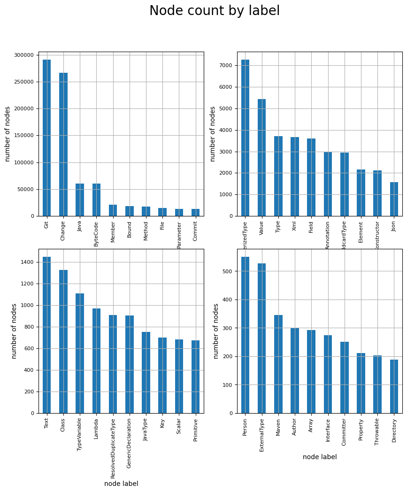
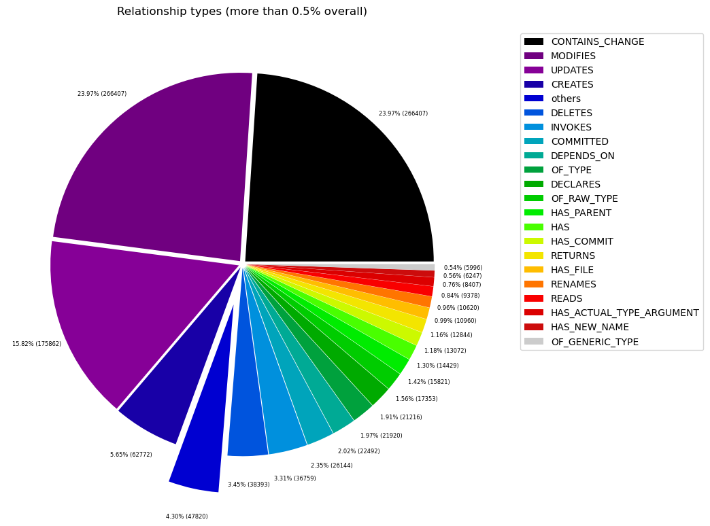
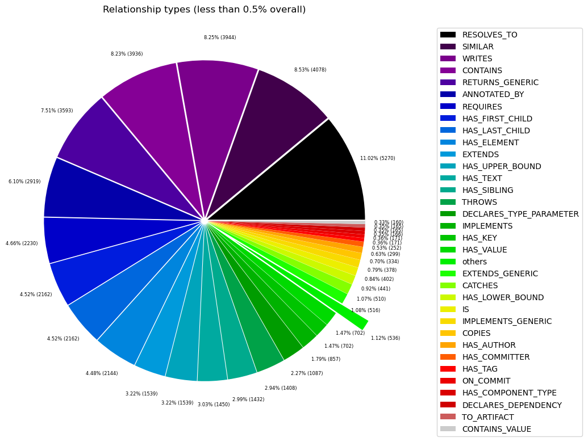

# Overview in General
   

This file contains a general overview of the data in the graph including node labels and relationships types.

### References
- [jqassistant](https://jqassistant.org)
- [Neo4j Python Driver](https://neo4j.com/docs/api/python-driver/current)

## Node Labels

### Table 1a - Highest node count by label combination

Lists the 30 label combinations with the highest number of nodes. The labels with the lowest node count are listed in table 1b.
The total list would sum up to the total number of labels (100%).

The whole table can be found in the CSV report `Node_label_combination_count`.

<table border="1" class="dataframe">
  <thead>
    <tr style="text-align: right;">
      <th></th>
      <th>nodeLabels</th>
      <th>nodesWithThatLabels</th>
      <th>nodesWithThatLabelsPercent</th>
    </tr>
  </thead>
  <tbody>
    <tr>
      <th>0</th>
      <td>[Git, Change]</td>
      <td>266407</td>
      <td>74.388766</td>
    </tr>
    <tr>
      <th>1</th>
      <td>[Java, ByteCode, Member, Method]</td>
      <td>13483</td>
      <td>3.764855</td>
    </tr>
    <tr>
      <th>2</th>
      <td>[Java, ByteCode, Parameter]</td>
      <td>13293</td>
      <td>3.711801</td>
    </tr>
    <tr>
      <th>3</th>
      <td>[Git, Commit]</td>
      <td>13072</td>
      <td>3.650092</td>
    </tr>
    <tr>
      <th>4</th>
      <td>[File, Git]</td>
      <td>10960</td>
      <td>3.060358</td>
    </tr>
    <tr>
      <th>5</th>
      <td>[Java, ByteCode, Bound, ParameterizedType]</td>
      <td>7279</td>
      <td>2.032514</td>
    </tr>
    <tr>
      <th>6</th>
      <td>[Java, ByteCode, Bound]</td>
      <td>7240</td>
      <td>2.021624</td>
    </tr>
    <tr>
      <th>7</th>
      <td>[Java, ByteCode, Member, Field]</td>
      <td>3606</td>
      <td>1.006903</td>
    </tr>
    <tr>
      <th>8</th>
      <td>[Java, ByteCode, Bound, WildcardType]</td>
      <td>2947</td>
      <td>0.822890</td>
    </tr>
    <tr>
      <th>9</th>
      <td>[Java, Value, ByteCode, Annotation]</td>
      <td>2931</td>
      <td>0.818422</td>
    </tr>
    <tr>
      <th>10</th>
      <td>[Xml, Element]</td>
      <td>2162</td>
      <td>0.603695</td>
    </tr>
    <tr>
      <th>11</th>
      <td>[Java, ByteCode, Member, Constructor, Method]</td>
      <td>2116</td>
      <td>0.590850</td>
    </tr>
    <tr>
      <th>12</th>
      <td>[Xml, Text]</td>
      <td>1450</td>
      <td>0.404883</td>
    </tr>
    <tr>
      <th>13</th>
      <td>[Java, ByteCode, TypeVariable, Bound]</td>
      <td>1111</td>
      <td>0.310224</td>
    </tr>
    <tr>
      <th>14</th>
      <td>[Java, ByteCode, Member, Method, Lambda]</td>
      <td>968</td>
      <td>0.270294</td>
    </tr>
    <tr>
      <th>15</th>
      <td>[Type, File, Java, ByteCode, ResolvedDuplicate...</td>
      <td>888</td>
      <td>0.247956</td>
    </tr>
    <tr>
      <th>16</th>
      <td>[Type, File, Java, Class, ByteCode]</td>
      <td>846</td>
      <td>0.236228</td>
    </tr>
    <tr>
      <th>17</th>
      <td>[Json, Key]</td>
      <td>702</td>
      <td>0.196019</td>
    </tr>
    <tr>
      <th>18</th>
      <td>[Value, Json, Scalar]</td>
      <td>685</td>
      <td>0.191272</td>
    </tr>
    <tr>
      <th>19</th>
      <td>[Java, Value, ByteCode, Primitive]</td>
      <td>672</td>
      <td>0.187642</td>
    </tr>
    <tr>
      <th>20</th>
      <td>[Type, File, Java, ByteCode, JavaType]</td>
      <td>649</td>
      <td>0.181220</td>
    </tr>
    <tr>
      <th>21</th>
      <td>[Java, ByteCode, Member, Method, GenericDeclar...</td>
      <td>578</td>
      <td>0.161395</td>
    </tr>
    <tr>
      <th>22</th>
      <td>[Type, File, Java, ByteCode, ExternalType]</td>
      <td>411</td>
      <td>0.114763</td>
    </tr>
    <tr>
      <th>23</th>
      <td>[Author, Git, Person]</td>
      <td>299</td>
      <td>0.083490</td>
    </tr>
    <tr>
      <th>24</th>
      <td>[Value, Array]</td>
      <td>287</td>
      <td>0.080139</td>
    </tr>
    <tr>
      <th>25</th>
      <td>[Committer, Git, Person]</td>
      <td>252</td>
      <td>0.070366</td>
    </tr>
    <tr>
      <th>26</th>
      <td>[Type, File, Java, Class, ByteCode, GenericDec...</td>
      <td>237</td>
      <td>0.066177</td>
    </tr>
    <tr>
      <th>27</th>
      <td>[Value, Property]</td>
      <td>211</td>
      <td>0.058917</td>
    </tr>
    <tr>
      <th>28</th>
      <td>[Type, File, Java, ByteCode, Interface]</td>
      <td>190</td>
      <td>0.053054</td>
    </tr>
    <tr>
      <th>29</th>
      <td>[Java, Value, Class, ByteCode]</td>
      <td>189</td>
      <td>0.052774</td>
    </tr>
  </tbody>
</table>

### Chart 1a - Highest node count by label combination

Values under 0.5% will be grouped into "others" to get a cleaner plot. The group "others" is then broken down in Chart 1b.

    <Figure size 640x480 with 0 Axes>

    

    

### Table 1b - Lowest node count by label combination

Lists the 30 label combinations with the lowest number of nodes until they reach 0.5% of the total node count, which are shown above.

<table border="1" class="dataframe">
  <thead>
    <tr style="text-align: right;">
      <th></th>
      <th>nodeLabels</th>
      <th>nodesWithThatLabels</th>
      <th>nodesWithThatLabelsPercent</th>
    </tr>
  </thead>
  <tbody>
    <tr>
      <th>0</th>
      <td>[Analyze, Task, jQAssistant]</td>
      <td>1</td>
      <td>0.000279</td>
    </tr>
    <tr>
      <th>1</th>
      <td>[Package, File, Json, NPM]</td>
      <td>1</td>
      <td>0.000279</td>
    </tr>
    <tr>
      <th>2</th>
      <td>[Repository, File, Git]</td>
      <td>1</td>
      <td>0.000279</td>
    </tr>
    <tr>
      <th>3</th>
      <td>[File, TS, Scan]</td>
      <td>1</td>
      <td>0.000279</td>
    </tr>
    <tr>
      <th>4</th>
      <td>[File, Json]</td>
      <td>2</td>
      <td>0.000558</td>
    </tr>
    <tr>
      <th>5</th>
      <td>[File]</td>
      <td>3</td>
      <td>0.000838</td>
    </tr>
    <tr>
      <th>6</th>
      <td>[Java, ByteCode, Member, Constructor, Method, ...</td>
      <td>4</td>
      <td>0.001117</td>
    </tr>
    <tr>
      <th>7</th>
      <td>[Maven, Exclusion]</td>
      <td>5</td>
      <td>0.001396</td>
    </tr>
    <tr>
      <th>8</th>
      <td>[Value, Array, Json]</td>
      <td>6</td>
      <td>0.001675</td>
    </tr>
    <tr>
      <th>9</th>
      <td>[Dependency, NPM]</td>
      <td>7</td>
      <td>0.001955</td>
    </tr>
    <tr>
      <th>10</th>
      <td>[Type, File, Java, ByteCode, Void]</td>
      <td>9</td>
      <td>0.002513</td>
    </tr>
    <tr>
      <th>11</th>
      <td>[File, Maven, Xml, Pom, Document]</td>
      <td>9</td>
      <td>0.002513</td>
    </tr>
    <tr>
      <th>12</th>
      <td>[Java, ManifestSection]</td>
      <td>9</td>
      <td>0.002513</td>
    </tr>
    <tr>
      <th>13</th>
      <td>[File, Java, Manifest]</td>
      <td>9</td>
      <td>0.002513</td>
    </tr>
    <tr>
      <th>14</th>
      <td>[Artifact, File, Jar, Archive, Zip, Java]</td>
      <td>9</td>
      <td>0.002513</td>
    </tr>
    <tr>
      <th>15</th>
      <td>[File, Java, ServiceLoader]</td>
      <td>10</td>
      <td>0.002792</td>
    </tr>
    <tr>
      <th>16</th>
      <td>[File, Java, Properties]</td>
      <td>12</td>
      <td>0.003351</td>
    </tr>
    <tr>
      <th>17</th>
      <td>[Maven, PluginExecution]</td>
      <td>16</td>
      <td>0.004468</td>
    </tr>
    <tr>
      <th>18</th>
      <td>[Maven, ExecutionGoal]</td>
      <td>16</td>
      <td>0.004468</td>
    </tr>
    <tr>
      <th>19</th>
      <td>[Xml, Attribute]</td>
      <td>18</td>
      <td>0.005026</td>
    </tr>
    <tr>
      <th>20</th>
      <td>[jQAssistant, Rule, Concept]</td>
      <td>19</td>
      <td>0.005305</td>
    </tr>
    <tr>
      <th>21</th>
      <td>[Maven, Configuration]</td>
      <td>21</td>
      <td>0.005864</td>
    </tr>
    <tr>
      <th>22</th>
      <td>[Maven, Plugin]</td>
      <td>21</td>
      <td>0.005864</td>
    </tr>
    <tr>
      <th>23</th>
      <td>[Type, File, Java, ByteCode, Throwable, Extern...</td>
      <td>21</td>
      <td>0.005864</td>
    </tr>
    <tr>
      <th>24</th>
      <td>[Type, File, Java, ByteCode, Throwable, Resolv...</td>
      <td>22</td>
      <td>0.006143</td>
    </tr>
    <tr>
      <th>25</th>
      <td>[Type, File, Java, ByteCode, Enum]</td>
      <td>28</td>
      <td>0.007818</td>
    </tr>
    <tr>
      <th>26</th>
      <td>[Type, File, Java, ByteCode, PrimitiveType]</td>
      <td>30</td>
      <td>0.008377</td>
    </tr>
    <tr>
      <th>27</th>
      <td>[Xml, Namespace]</td>
      <td>36</td>
      <td>0.010052</td>
    </tr>
    <tr>
      <th>28</th>
      <td>[Type, File, Java, ByteCode, Annotation]</td>
      <td>44</td>
      <td>0.012286</td>
    </tr>
    <tr>
      <th>29</th>
      <td>[Git, Branch]</td>
      <td>46</td>
      <td>0.012845</td>
    </tr>
  </tbody>
</table>

### Chart 1b - Lowest node count by label combination

Shows the lowest (less than 0.5% overall) node count label combinations. Therefore, this plot breaks down the "others" slice of the pie chart above. Values under 0.01% will be grouped into "others" to get a cleaner plot.

    <Figure size 640x480 with 0 Axes>

    

    

### Table 1c - Highest node count by single label

Lists the 40 labels with the highest number of nodes.
Doesn't sum up to the total number of nodes or 100% because one node can have multiple labels.
Helps to identify commonly used labels.

<table border="1" class="dataframe">
  <thead>
    <tr style="text-align: right;">
      <th></th>
      <th>nodeLabel</th>
      <th>nodesWithThatLabel</th>
      <th>nodesWithThatLabelPercent</th>
    </tr>
  </thead>
  <tbody>
    <tr>
      <th>0</th>
      <td>Git</td>
      <td>291208</td>
      <td>81.313944</td>
    </tr>
    <tr>
      <th>1</th>
      <td>Change</td>
      <td>266407</td>
      <td>74.388766</td>
    </tr>
    <tr>
      <th>2</th>
      <td>Java</td>
      <td>60641</td>
      <td>16.932773</td>
    </tr>
    <tr>
      <th>3</th>
      <td>ByteCode</td>
      <td>60451</td>
      <td>16.879719</td>
    </tr>
    <tr>
      <th>4</th>
      <td>Member</td>
      <td>20755</td>
      <td>5.795414</td>
    </tr>
    <tr>
      <th>5</th>
      <td>Bound</td>
      <td>18743</td>
      <td>5.233604</td>
    </tr>
    <tr>
      <th>6</th>
      <td>Method</td>
      <td>17149</td>
      <td>4.788511</td>
    </tr>
    <tr>
      <th>7</th>
      <td>File</td>
      <td>14921</td>
      <td>4.166387</td>
    </tr>
    <tr>
      <th>8</th>
      <td>Parameter</td>
      <td>13293</td>
      <td>3.711801</td>
    </tr>
    <tr>
      <th>9</th>
      <td>Commit</td>
      <td>13072</td>
      <td>3.650092</td>
    </tr>
    <tr>
      <th>10</th>
      <td>ParameterizedType</td>
      <td>7279</td>
      <td>2.032514</td>
    </tr>
    <tr>
      <th>11</th>
      <td>Value</td>
      <td>5428</td>
      <td>1.515659</td>
    </tr>
    <tr>
      <th>12</th>
      <td>Type</td>
      <td>3715</td>
      <td>1.037339</td>
    </tr>
    <tr>
      <th>13</th>
      <td>Xml</td>
      <td>3675</td>
      <td>1.026169</td>
    </tr>
    <tr>
      <th>14</th>
      <td>Field</td>
      <td>3606</td>
      <td>1.006903</td>
    </tr>
    <tr>
      <th>15</th>
      <td>Annotation</td>
      <td>2975</td>
      <td>0.830709</td>
    </tr>
    <tr>
      <th>16</th>
      <td>WildcardType</td>
      <td>2947</td>
      <td>0.822890</td>
    </tr>
    <tr>
      <th>17</th>
      <td>Element</td>
      <td>2162</td>
      <td>0.603695</td>
    </tr>
    <tr>
      <th>18</th>
      <td>Constructor</td>
      <td>2120</td>
      <td>0.591967</td>
    </tr>
    <tr>
      <th>19</th>
      <td>Json</td>
      <td>1570</td>
      <td>0.438391</td>
    </tr>
    <tr>
      <th>20</th>
      <td>Text</td>
      <td>1450</td>
      <td>0.404883</td>
    </tr>
    <tr>
      <th>21</th>
      <td>Class</td>
      <td>1327</td>
      <td>0.370538</td>
    </tr>
    <tr>
      <th>22</th>
      <td>TypeVariable</td>
      <td>1111</td>
      <td>0.310224</td>
    </tr>
    <tr>
      <th>23</th>
      <td>Lambda</td>
      <td>968</td>
      <td>0.270294</td>
    </tr>
    <tr>
      <th>24</th>
      <td>ResolvedDuplicateType</td>
      <td>910</td>
      <td>0.254099</td>
    </tr>
    <tr>
      <th>25</th>
      <td>GenericDeclaration</td>
      <td>904</td>
      <td>0.252424</td>
    </tr>
    <tr>
      <th>26</th>
      <td>JavaType</td>
      <td>754</td>
      <td>0.210539</td>
    </tr>
    <tr>
      <th>27</th>
      <td>Key</td>
      <td>702</td>
      <td>0.196019</td>
    </tr>
    <tr>
      <th>28</th>
      <td>Scalar</td>
      <td>685</td>
      <td>0.191272</td>
    </tr>
    <tr>
      <th>29</th>
      <td>Primitive</td>
      <td>672</td>
      <td>0.187642</td>
    </tr>
    <tr>
      <th>30</th>
      <td>Person</td>
      <td>551</td>
      <td>0.153856</td>
    </tr>
    <tr>
      <th>31</th>
      <td>ExternalType</td>
      <td>527</td>
      <td>0.147154</td>
    </tr>
    <tr>
      <th>32</th>
      <td>Maven</td>
      <td>346</td>
      <td>0.096614</td>
    </tr>
    <tr>
      <th>33</th>
      <td>Author</td>
      <td>299</td>
      <td>0.083490</td>
    </tr>
    <tr>
      <th>34</th>
      <td>Array</td>
      <td>293</td>
      <td>0.081814</td>
    </tr>
    <tr>
      <th>35</th>
      <td>Interface</td>
      <td>275</td>
      <td>0.076788</td>
    </tr>
    <tr>
      <th>36</th>
      <td>Committer</td>
      <td>252</td>
      <td>0.070366</td>
    </tr>
    <tr>
      <th>37</th>
      <td>Property</td>
      <td>211</td>
      <td>0.058917</td>
    </tr>
    <tr>
      <th>38</th>
      <td>Throwable</td>
      <td>203</td>
      <td>0.056684</td>
    </tr>
    <tr>
      <th>39</th>
      <td>Directory</td>
      <td>189</td>
      <td>0.052774</td>
    </tr>
  </tbody>
</table>

### Chart 1c - Highest node count by label

Shows the 40 labels with the highest number of nodes.

    <Figure size 640x480 with 0 Axes>

    

    

## Relationship Types

### Table 2a - Highest relationship count by type

Lists the 30 relationship types with the highest number of occurrences.
The whole table can be found in the CSV report `Relationship_type_count`.

    Total number of relationships: 1111319

<table border="1" class="dataframe">
  <thead>
    <tr style="text-align: right;">
      <th></th>
      <th>relationshipType</th>
      <th>nodesWithThatRelationshipType</th>
      <th>nodesWithThatRelationshipTypePercent</th>
    </tr>
  </thead>
  <tbody>
    <tr>
      <th>0</th>
      <td>CONTAINS_CHANGE</td>
      <td>266407</td>
      <td>23.972145</td>
    </tr>
    <tr>
      <th>1</th>
      <td>MODIFIES</td>
      <td>266407</td>
      <td>23.972145</td>
    </tr>
    <tr>
      <th>2</th>
      <td>UPDATES</td>
      <td>175862</td>
      <td>15.824619</td>
    </tr>
    <tr>
      <th>3</th>
      <td>CREATES</td>
      <td>62772</td>
      <td>5.648423</td>
    </tr>
    <tr>
      <th>4</th>
      <td>DELETES</td>
      <td>38393</td>
      <td>3.454724</td>
    </tr>
    <tr>
      <th>5</th>
      <td>INVOKES</td>
      <td>36759</td>
      <td>3.307691</td>
    </tr>
    <tr>
      <th>6</th>
      <td>COMMITTED</td>
      <td>26144</td>
      <td>2.352520</td>
    </tr>
    <tr>
      <th>7</th>
      <td>DEPENDS_ON</td>
      <td>22492</td>
      <td>2.023901</td>
    </tr>
    <tr>
      <th>8</th>
      <td>OF_TYPE</td>
      <td>21920</td>
      <td>1.972431</td>
    </tr>
    <tr>
      <th>9</th>
      <td>DECLARES</td>
      <td>21216</td>
      <td>1.909083</td>
    </tr>
    <tr>
      <th>10</th>
      <td>OF_RAW_TYPE</td>
      <td>17353</td>
      <td>1.561478</td>
    </tr>
    <tr>
      <th>11</th>
      <td>HAS_PARENT</td>
      <td>15821</td>
      <td>1.423624</td>
    </tr>
    <tr>
      <th>12</th>
      <td>HAS</td>
      <td>14429</td>
      <td>1.298367</td>
    </tr>
    <tr>
      <th>13</th>
      <td>HAS_COMMIT</td>
      <td>13072</td>
      <td>1.176260</td>
    </tr>
    <tr>
      <th>14</th>
      <td>RETURNS</td>
      <td>12844</td>
      <td>1.155744</td>
    </tr>
    <tr>
      <th>15</th>
      <td>HAS_FILE</td>
      <td>10960</td>
      <td>0.986215</td>
    </tr>
    <tr>
      <th>16</th>
      <td>RENAMES</td>
      <td>10620</td>
      <td>0.955621</td>
    </tr>
    <tr>
      <th>17</th>
      <td>READS</td>
      <td>9378</td>
      <td>0.843862</td>
    </tr>
    <tr>
      <th>18</th>
      <td>HAS_ACTUAL_TYPE_ARGUMENT</td>
      <td>8407</td>
      <td>0.756488</td>
    </tr>
    <tr>
      <th>19</th>
      <td>HAS_NEW_NAME</td>
      <td>6247</td>
      <td>0.562125</td>
    </tr>
    <tr>
      <th>20</th>
      <td>OF_GENERIC_TYPE</td>
      <td>5996</td>
      <td>0.539539</td>
    </tr>
    <tr>
      <th>21</th>
      <td>RESOLVES_TO</td>
      <td>5270</td>
      <td>0.474211</td>
    </tr>
    <tr>
      <th>22</th>
      <td>SIMILAR</td>
      <td>4078</td>
      <td>0.366951</td>
    </tr>
    <tr>
      <th>23</th>
      <td>WRITES</td>
      <td>3944</td>
      <td>0.354894</td>
    </tr>
    <tr>
      <th>24</th>
      <td>CONTAINS</td>
      <td>3936</td>
      <td>0.354174</td>
    </tr>
    <tr>
      <th>25</th>
      <td>RETURNS_GENERIC</td>
      <td>3593</td>
      <td>0.323310</td>
    </tr>
    <tr>
      <th>26</th>
      <td>ANNOTATED_BY</td>
      <td>2919</td>
      <td>0.262661</td>
    </tr>
    <tr>
      <th>27</th>
      <td>REQUIRES</td>
      <td>2230</td>
      <td>0.200662</td>
    </tr>
    <tr>
      <th>28</th>
      <td>HAS_FIRST_CHILD</td>
      <td>2162</td>
      <td>0.194544</td>
    </tr>
    <tr>
      <th>29</th>
      <td>HAS_LAST_CHILD</td>
      <td>2162</td>
      <td>0.194544</td>
    </tr>
  </tbody>
</table>

### Chart 2a - Highest relationship count by type

Values under 0.5% will be grouped into "others" to get a cleaner plot. The group "others" is then broken down in the second chart.

    <Figure size 640x480 with 0 Axes>

    

    

### Table 2b - Lowest relationship count by type

Lists the 30 relationships type with the lowest number of occurrences up to 0.5% of the total node count. This is essentially breaking down the "others" slice from the chart above.

<table border="1" class="dataframe">
  <thead>
    <tr style="text-align: right;">
      <th></th>
      <th>relationshipType</th>
      <th>nodesWithThatRelationshipType</th>
      <th>nodesWithThatRelationshipTypePercent</th>
    </tr>
  </thead>
  <tbody>
    <tr>
      <th>0</th>
      <td>HAS_PROPERTY</td>
      <td>1</td>
      <td>0.000090</td>
    </tr>
    <tr>
      <th>1</th>
      <td>THROWS_GENERIC</td>
      <td>5</td>
      <td>0.000450</td>
    </tr>
    <tr>
      <th>2</th>
      <td>EXCLUDES</td>
      <td>5</td>
      <td>0.000450</td>
    </tr>
    <tr>
      <th>3</th>
      <td>DECLARES_DEV_DEPENDENCY</td>
      <td>7</td>
      <td>0.000630</td>
    </tr>
    <tr>
      <th>4</th>
      <td>DESCRIBES</td>
      <td>9</td>
      <td>0.000810</td>
    </tr>
    <tr>
      <th>5</th>
      <td>HAS_ROOT_ELEMENT</td>
      <td>12</td>
      <td>0.001080</td>
    </tr>
    <tr>
      <th>6</th>
      <td>HAS_GOAL</td>
      <td>16</td>
      <td>0.001440</td>
    </tr>
    <tr>
      <th>7</th>
      <td>HAS_EXECUTION</td>
      <td>16</td>
      <td>0.001440</td>
    </tr>
    <tr>
      <th>8</th>
      <td>OF_NAMESPACE</td>
      <td>18</td>
      <td>0.001620</td>
    </tr>
    <tr>
      <th>9</th>
      <td>HAS_ATTRIBUTE</td>
      <td>18</td>
      <td>0.001620</td>
    </tr>
    <tr>
      <th>10</th>
      <td>INCLUDES_CONCEPT</td>
      <td>19</td>
      <td>0.001710</td>
    </tr>
    <tr>
      <th>11</th>
      <td>IS_ARTIFACT</td>
      <td>21</td>
      <td>0.001890</td>
    </tr>
    <tr>
      <th>12</th>
      <td>HAS_CONFIGURATION</td>
      <td>21</td>
      <td>0.001890</td>
    </tr>
    <tr>
      <th>13</th>
      <td>USES_PLUGIN</td>
      <td>21</td>
      <td>0.001890</td>
    </tr>
    <tr>
      <th>14</th>
      <td>REQUIRES_TYPE_PARAMETER</td>
      <td>24</td>
      <td>0.002160</td>
    </tr>
    <tr>
      <th>15</th>
      <td>REQUIRES_CONCEPT</td>
      <td>28</td>
      <td>0.002520</td>
    </tr>
    <tr>
      <th>16</th>
      <td>DECLARES_NAMESPACE</td>
      <td>36</td>
      <td>0.003239</td>
    </tr>
    <tr>
      <th>17</th>
      <td>HAS_DEFAULT</td>
      <td>39</td>
      <td>0.003509</td>
    </tr>
    <tr>
      <th>18</th>
      <td>HAS_BRANCH</td>
      <td>46</td>
      <td>0.004139</td>
    </tr>
    <tr>
      <th>19</th>
      <td>HAS_HEAD</td>
      <td>47</td>
      <td>0.004229</td>
    </tr>
    <tr>
      <th>20</th>
      <td>COPY_OF</td>
      <td>127</td>
      <td>0.011428</td>
    </tr>
    <tr>
      <th>21</th>
      <td>CONTAINS_VALUE</td>
      <td>160</td>
      <td>0.014397</td>
    </tr>
    <tr>
      <th>22</th>
      <td>DECLARES_DEPENDENCY</td>
      <td>165</td>
      <td>0.014847</td>
    </tr>
    <tr>
      <th>23</th>
      <td>TO_ARTIFACT</td>
      <td>165</td>
      <td>0.014847</td>
    </tr>
    <tr>
      <th>24</th>
      <td>HAS_COMPONENT_TYPE</td>
      <td>166</td>
      <td>0.014937</td>
    </tr>
    <tr>
      <th>25</th>
      <td>ON_COMMIT</td>
      <td>171</td>
      <td>0.015387</td>
    </tr>
    <tr>
      <th>26</th>
      <td>HAS_TAG</td>
      <td>171</td>
      <td>0.015387</td>
    </tr>
    <tr>
      <th>27</th>
      <td>HAS_COMMITTER</td>
      <td>252</td>
      <td>0.022676</td>
    </tr>
    <tr>
      <th>28</th>
      <td>HAS_AUTHOR</td>
      <td>299</td>
      <td>0.026905</td>
    </tr>
    <tr>
      <th>29</th>
      <td>COPIES</td>
      <td>334</td>
      <td>0.030054</td>
    </tr>
  </tbody>
</table>

### Chart 2b - Lowest relationship count by type

Shows the lowest (less than 0.5% overall) relationship types. This plot breaks down the "others" slice of the pie chart above. Values under 0.01% will be grouped into "others" to get a cleaner plot.

    <Figure size 640x480 with 0 Axes>

    

    

## Node labels with their relationships

### Table 3a - Highest relationship count by node labels and relationship type

Lists the 30 node labels and their relationship types with the highest number of occurrences.

<table border="1" class="dataframe">
  <thead>
    <tr style="text-align: right;">
      <th></th>
      <th>sourceLabels</th>
      <th>relationType</th>
      <th>targetLabels</th>
      <th>numberOfRelationships</th>
      <th>numberOfNodesWithSameLabelsAsSource</th>
      <th>numberOfNodesWithSameLabelsAsTarget</th>
      <th>densityInPercent</th>
    </tr>
  </thead>
  <tbody>
    <tr>
      <th>0</th>
      <td>[Git, Change]</td>
      <td>MODIFIES</td>
      <td>[File, Git]</td>
      <td>266407</td>
      <td>266407</td>
      <td>10960</td>
      <td>0.009124</td>
    </tr>
    <tr>
      <th>1</th>
      <td>[Git, Commit]</td>
      <td>CONTAINS_CHANGE</td>
      <td>[Git, Change]</td>
      <td>266407</td>
      <td>13072</td>
      <td>266407</td>
      <td>0.007650</td>
    </tr>
    <tr>
      <th>2</th>
      <td>[Git, Change]</td>
      <td>UPDATES</td>
      <td>[File, Git]</td>
      <td>175862</td>
      <td>266407</td>
      <td>10960</td>
      <td>0.006023</td>
    </tr>
    <tr>
      <th>3</th>
      <td>[Git, Change]</td>
      <td>CREATES</td>
      <td>[File, Git]</td>
      <td>62772</td>
      <td>266407</td>
      <td>10960</td>
      <td>0.002150</td>
    </tr>
    <tr>
      <th>4</th>
      <td>[Git, Change]</td>
      <td>DELETES</td>
      <td>[File, Git]</td>
      <td>38393</td>
      <td>266407</td>
      <td>10960</td>
      <td>0.001315</td>
    </tr>
    <tr>
      <th>5</th>
      <td>[Java, ByteCode, Member, Method]</td>
      <td>INVOKES</td>
      <td>[Java, ByteCode, Member, Method]</td>
      <td>22506</td>
      <td>13388</td>
      <td>13388</td>
      <td>0.012556</td>
    </tr>
    <tr>
      <th>6</th>
      <td>[Git, Commit]</td>
      <td>HAS_PARENT</td>
      <td>[Git, Commit]</td>
      <td>15812</td>
      <td>13072</td>
      <td>13072</td>
      <td>0.009253</td>
    </tr>
    <tr>
      <th>7</th>
      <td>[Repository, File, Git]</td>
      <td>HAS_COMMIT</td>
      <td>[Git, Commit]</td>
      <td>13072</td>
      <td>1</td>
      <td>13072</td>
      <td>100.000000</td>
    </tr>
    <tr>
      <th>8</th>
      <td>[Author, Git, Person]</td>
      <td>COMMITTED</td>
      <td>[Git, Commit]</td>
      <td>13072</td>
      <td>299</td>
      <td>13072</td>
      <td>0.334448</td>
    </tr>
    <tr>
      <th>9</th>
      <td>[Committer, Git, Person]</td>
      <td>COMMITTED</td>
      <td>[Git, Commit]</td>
      <td>13072</td>
      <td>252</td>
      <td>13072</td>
      <td>0.396825</td>
    </tr>
    <tr>
      <th>10</th>
      <td>[Repository, File, Git]</td>
      <td>HAS_FILE</td>
      <td>[File, Git]</td>
      <td>10960</td>
      <td>1</td>
      <td>10960</td>
      <td>100.000000</td>
    </tr>
    <tr>
      <th>11</th>
      <td>[Git, Change]</td>
      <td>RENAMES</td>
      <td>[File, Git]</td>
      <td>10620</td>
      <td>266407</td>
      <td>10960</td>
      <td>0.000364</td>
    </tr>
    <tr>
      <th>12</th>
      <td>[Java, ByteCode, Member, Method]</td>
      <td>HAS</td>
      <td>[Java, ByteCode, Parameter]</td>
      <td>8503</td>
      <td>13388</td>
      <td>13293</td>
      <td>0.004778</td>
    </tr>
    <tr>
      <th>13</th>
      <td>[Java, ByteCode, Member, Method]</td>
      <td>READS</td>
      <td>[Java, ByteCode, Member, Field]</td>
      <td>8430</td>
      <td>13388</td>
      <td>3606</td>
      <td>0.017462</td>
    </tr>
    <tr>
      <th>14</th>
      <td>[File, Git]</td>
      <td>HAS_NEW_NAME</td>
      <td>[File, Git]</td>
      <td>6247</td>
      <td>10960</td>
      <td>10960</td>
      <td>0.005201</td>
    </tr>
    <tr>
      <th>15</th>
      <td>[Java, ByteCode, Parameter]</td>
      <td>OF_TYPE</td>
      <td>[Type, File, Java, ByteCode, JavaType]</td>
      <td>6156</td>
      <td>13293</td>
      <td>649</td>
      <td>0.071356</td>
    </tr>
    <tr>
      <th>16</th>
      <td>[Java, ByteCode, Bound]</td>
      <td>OF_RAW_TYPE</td>
      <td>[Type, File, Java, ByteCode, JavaType]</td>
      <td>3465</td>
      <td>7240</td>
      <td>649</td>
      <td>0.073743</td>
    </tr>
    <tr>
      <th>17</th>
      <td>[Java, ByteCode, Bound, ParameterizedType]</td>
      <td>OF_RAW_TYPE</td>
      <td>[Type, File, Java, ByteCode, JavaType]</td>
      <td>3110</td>
      <td>7279</td>
      <td>649</td>
      <td>0.065833</td>
    </tr>
    <tr>
      <th>18</th>
      <td>[Java, ByteCode, Bound, ParameterizedType]</td>
      <td>HAS_ACTUAL_TYPE_ARGUMENT</td>
      <td>[Java, ByteCode, Bound, WildcardType]</td>
      <td>2947</td>
      <td>7279</td>
      <td>2947</td>
      <td>0.013738</td>
    </tr>
    <tr>
      <th>19</th>
      <td>[Java, ByteCode, Parameter]</td>
      <td>OF_GENERIC_TYPE</td>
      <td>[Java, ByteCode, Bound, ParameterizedType]</td>
      <td>2695</td>
      <td>13293</td>
      <td>7279</td>
      <td>0.002785</td>
    </tr>
    <tr>
      <th>20</th>
      <td>[Java, ByteCode, Member, Constructor, Method]</td>
      <td>WRITES</td>
      <td>[Java, ByteCode, Member, Field]</td>
      <td>2519</td>
      <td>2116</td>
      <td>3606</td>
      <td>0.033013</td>
    </tr>
    <tr>
      <th>21</th>
      <td>[Java, ByteCode, Bound, ParameterizedType]</td>
      <td>HAS_ACTUAL_TYPE_ARGUMENT</td>
      <td>[Java, ByteCode, TypeVariable, Bound]</td>
      <td>2474</td>
      <td>7279</td>
      <td>1111</td>
      <td>0.030592</td>
    </tr>
    <tr>
      <th>22</th>
      <td>[Java, Value, ByteCode, Annotation]</td>
      <td>OF_TYPE</td>
      <td>[Type, File, Java, ByteCode, ExternalType, Ext...</td>
      <td>2445</td>
      <td>2931</td>
      <td>95</td>
      <td>0.878091</td>
    </tr>
    <tr>
      <th>23</th>
      <td>[Java, ByteCode, Member, Constructor, Method]</td>
      <td>INVOKES</td>
      <td>[Java, ByteCode, Member, Constructor, Method]</td>
      <td>2199</td>
      <td>2116</td>
      <td>2116</td>
      <td>0.049113</td>
    </tr>
    <tr>
      <th>24</th>
      <td>[Xml, Element]</td>
      <td>HAS_ELEMENT</td>
      <td>[Xml, Element]</td>
      <td>2144</td>
      <td>2162</td>
      <td>2162</td>
      <td>0.045868</td>
    </tr>
    <tr>
      <th>25</th>
      <td>[Java, ByteCode, Member, Method]</td>
      <td>INVOKES</td>
      <td>[Java, ByteCode, Member, Constructor, Method]</td>
      <td>2120</td>
      <td>13388</td>
      <td>2116</td>
      <td>0.007483</td>
    </tr>
    <tr>
      <th>26</th>
      <td>[Java, ByteCode, Member, Method]</td>
      <td>RETURNS</td>
      <td>[Type, File, Java, ByteCode, JavaType]</td>
      <td>2108</td>
      <td>13388</td>
      <td>649</td>
      <td>0.024261</td>
    </tr>
    <tr>
      <th>27</th>
      <td>[Java, ByteCode, Member, Constructor, Method]</td>
      <td>HAS</td>
      <td>[Java, ByteCode, Parameter]</td>
      <td>2075</td>
      <td>2116</td>
      <td>13293</td>
      <td>0.007377</td>
    </tr>
    <tr>
      <th>28</th>
      <td>[Java, ByteCode, Parameter]</td>
      <td>OF_GENERIC_TYPE</td>
      <td>[Java, ByteCode, Bound]</td>
      <td>2061</td>
      <td>13293</td>
      <td>7240</td>
      <td>0.002141</td>
    </tr>
    <tr>
      <th>29</th>
      <td>[Java, ByteCode, Member, Method, Lambda]</td>
      <td>INVOKES</td>
      <td>[Java, ByteCode, Member, Method]</td>
      <td>1929</td>
      <td>968</td>
      <td>13388</td>
      <td>0.014885</td>
    </tr>
  </tbody>
</table>

## Graph Density

    total_number_of_nodes (vertices): 358128
    total_number_of_relationships (edges): 1111319
    -> total directed graph density: 8.66489685644496e-06
    -> total directed graph density in percent: 0.0008664896856444961

