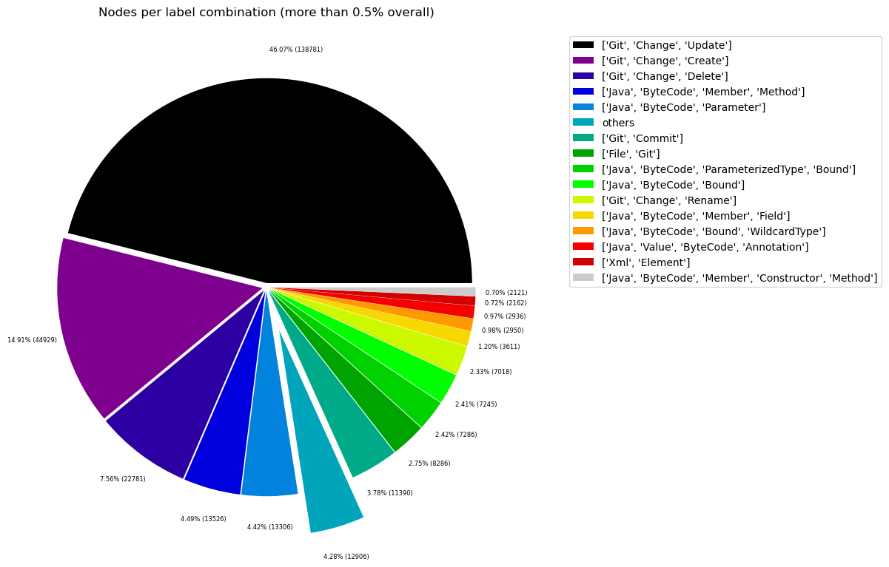
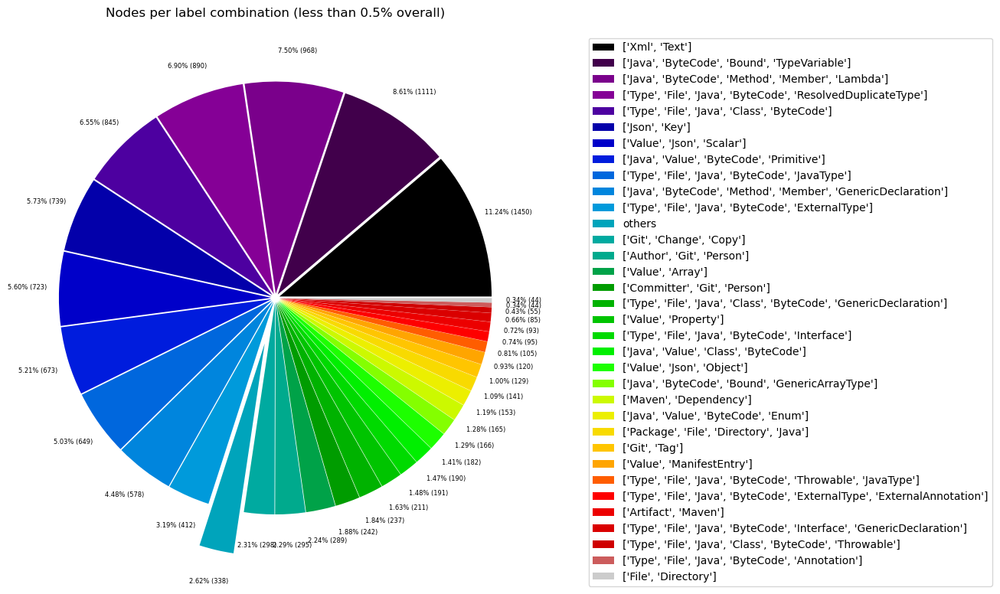
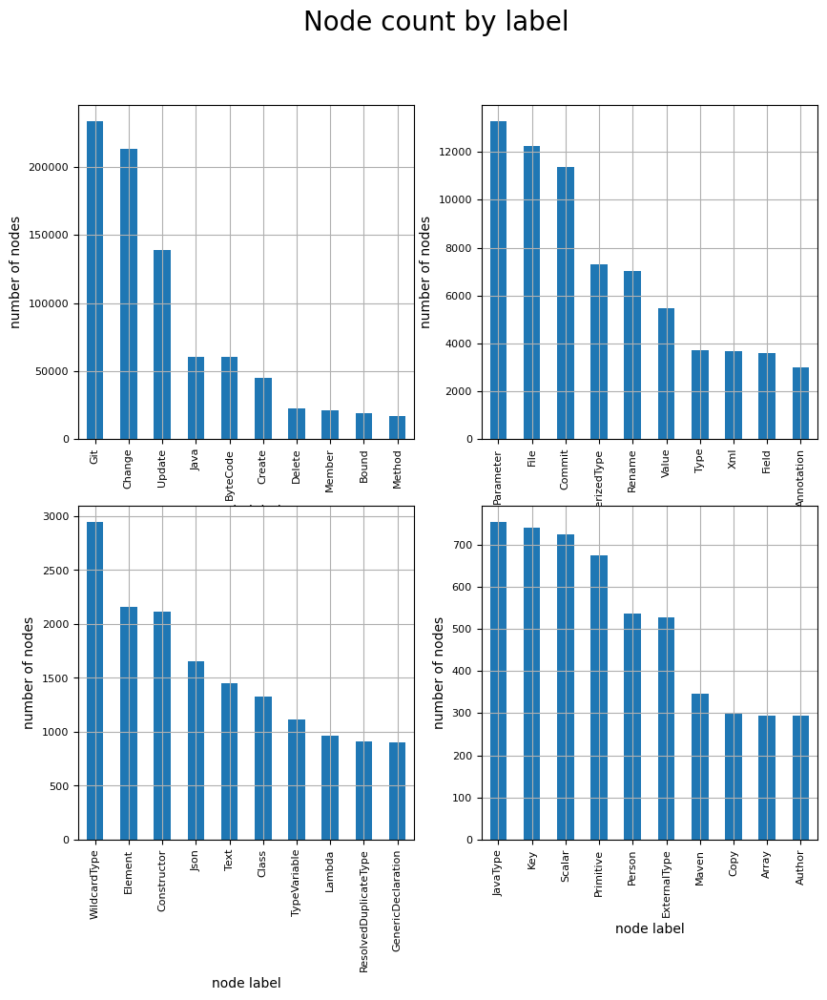
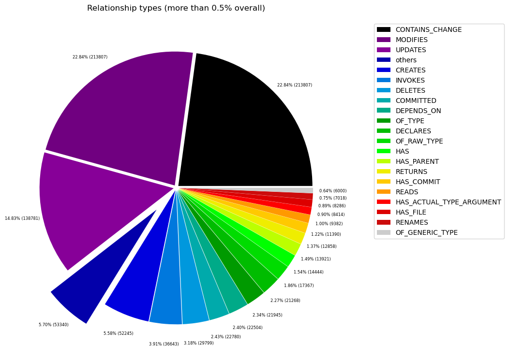
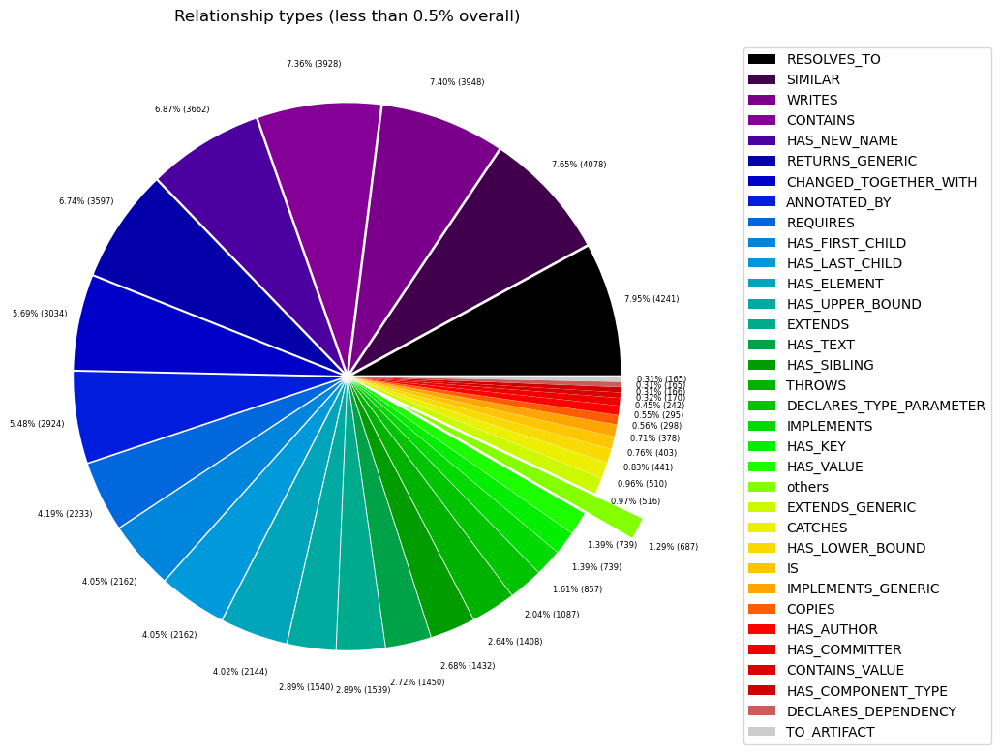

# Overview in General
   

This file contains a general overview of the data in the graph including node labels and relationships types.

### References
- [jqassistant](https://jqassistant.org)
- [Neo4j Python Driver](https://neo4j.com/docs/api/python-driver/current)

## Node Labels

### Table 1a - Highest node count by label combination

Lists the 30 label combinations with the highest number of nodes. The labels with the lowest node count are listed in table 1b.
The total list would sum up to the total number of labels (100%).

The whole table can be found in the CSV report `Node_label_combination_count`.

<table border="1" class="dataframe">
  <thead>
    <tr style="text-align: right;">
      <th></th>
      <th>nodeLabels</th>
      <th>nodesWithThatLabels</th>
      <th>nodesWithThatLabelsPercent</th>
    </tr>
  </thead>
  <tbody>
    <tr>
      <th>0</th>
      <td>[Git, Change, Update]</td>
      <td>138781</td>
      <td>46.070829</td>
    </tr>
    <tr>
      <th>1</th>
      <td>[Git, Change, Create]</td>
      <td>44929</td>
      <td>14.914983</td>
    </tr>
    <tr>
      <th>2</th>
      <td>[Git, Change, Delete]</td>
      <td>22781</td>
      <td>7.562559</td>
    </tr>
    <tr>
      <th>3</th>
      <td>[Java, ByteCode, Member, Method]</td>
      <td>13526</td>
      <td>4.490197</td>
    </tr>
    <tr>
      <th>4</th>
      <td>[Java, ByteCode, Parameter]</td>
      <td>13306</td>
      <td>4.417164</td>
    </tr>
    <tr>
      <th>5</th>
      <td>[Git, Commit]</td>
      <td>11390</td>
      <td>3.781114</td>
    </tr>
    <tr>
      <th>6</th>
      <td>[File, Git]</td>
      <td>8286</td>
      <td>2.750686</td>
    </tr>
    <tr>
      <th>7</th>
      <td>[Java, ByteCode, ParameterizedType, Bound]</td>
      <td>7286</td>
      <td>2.418718</td>
    </tr>
    <tr>
      <th>8</th>
      <td>[Java, ByteCode, Bound]</td>
      <td>7245</td>
      <td>2.405107</td>
    </tr>
    <tr>
      <th>9</th>
      <td>[Git, Change, Rename]</td>
      <td>7018</td>
      <td>2.329750</td>
    </tr>
    <tr>
      <th>10</th>
      <td>[Java, ByteCode, Member, Field]</td>
      <td>3611</td>
      <td>1.198736</td>
    </tr>
    <tr>
      <th>11</th>
      <td>[Java, ByteCode, Bound, WildcardType]</td>
      <td>2950</td>
      <td>0.979305</td>
    </tr>
    <tr>
      <th>12</th>
      <td>[Java, Value, ByteCode, Annotation]</td>
      <td>2936</td>
      <td>0.974658</td>
    </tr>
    <tr>
      <th>13</th>
      <td>[Xml, Element]</td>
      <td>2162</td>
      <td>0.717714</td>
    </tr>
    <tr>
      <th>14</th>
      <td>[Java, ByteCode, Member, Constructor, Method]</td>
      <td>2121</td>
      <td>0.704104</td>
    </tr>
    <tr>
      <th>15</th>
      <td>[Xml, Text]</td>
      <td>1450</td>
      <td>0.481353</td>
    </tr>
    <tr>
      <th>16</th>
      <td>[Java, ByteCode, Bound, TypeVariable]</td>
      <td>1111</td>
      <td>0.368816</td>
    </tr>
    <tr>
      <th>17</th>
      <td>[Java, ByteCode, Member, Method, Lambda]</td>
      <td>968</td>
      <td>0.321345</td>
    </tr>
    <tr>
      <th>18</th>
      <td>[Type, File, Java, ByteCode, ResolvedDuplicate...</td>
      <td>890</td>
      <td>0.295451</td>
    </tr>
    <tr>
      <th>19</th>
      <td>[Type, File, Java, Class, ByteCode]</td>
      <td>845</td>
      <td>0.280513</td>
    </tr>
    <tr>
      <th>20</th>
      <td>[Json, Key]</td>
      <td>739</td>
      <td>0.245324</td>
    </tr>
    <tr>
      <th>21</th>
      <td>[Value, Json, Scalar]</td>
      <td>723</td>
      <td>0.240013</td>
    </tr>
    <tr>
      <th>22</th>
      <td>[Java, Value, ByteCode, Primitive]</td>
      <td>673</td>
      <td>0.223414</td>
    </tr>
    <tr>
      <th>23</th>
      <td>[Type, File, Java, ByteCode, JavaType]</td>
      <td>649</td>
      <td>0.215447</td>
    </tr>
    <tr>
      <th>24</th>
      <td>[Java, ByteCode, Member, Method, GenericDeclar...</td>
      <td>578</td>
      <td>0.191877</td>
    </tr>
    <tr>
      <th>25</th>
      <td>[Type, File, Java, ByteCode, ExternalType]</td>
      <td>412</td>
      <td>0.136771</td>
    </tr>
    <tr>
      <th>26</th>
      <td>[Git, Change, Copy]</td>
      <td>298</td>
      <td>0.098926</td>
    </tr>
    <tr>
      <th>27</th>
      <td>[Author, Git, Person]</td>
      <td>295</td>
      <td>0.097931</td>
    </tr>
    <tr>
      <th>28</th>
      <td>[Value, Array]</td>
      <td>289</td>
      <td>0.095939</td>
    </tr>
    <tr>
      <th>29</th>
      <td>[Committer, Git, Person]</td>
      <td>242</td>
      <td>0.080336</td>
    </tr>
  </tbody>
</table>

### Chart 1a - Highest node count by label combination

Values under 0.5% will be grouped into "others" to get a cleaner plot. The group "others" is then broken down in Chart 1b.

    <Figure size 640x480 with 0 Axes>

    

    

### Table 1b - Lowest node count by label combination

Lists the 30 label combinations with the lowest number of nodes until they reach 0.5% of the total node count, which are shown above.

<table border="1" class="dataframe">
  <thead>
    <tr style="text-align: right;">
      <th></th>
      <th>nodeLabels</th>
      <th>nodesWithThatLabels</th>
      <th>nodesWithThatLabelsPercent</th>
    </tr>
  </thead>
  <tbody>
    <tr>
      <th>0</th>
      <td>[Analyze, Task, jQAssistant]</td>
      <td>1</td>
      <td>0.000332</td>
    </tr>
    <tr>
      <th>1</th>
      <td>[Git, Branch]</td>
      <td>1</td>
      <td>0.000332</td>
    </tr>
    <tr>
      <th>2</th>
      <td>[Repository, File, Git]</td>
      <td>1</td>
      <td>0.000332</td>
    </tr>
    <tr>
      <th>3</th>
      <td>[File, Json]</td>
      <td>2</td>
      <td>0.000664</td>
    </tr>
    <tr>
      <th>4</th>
      <td>[File]</td>
      <td>3</td>
      <td>0.000996</td>
    </tr>
    <tr>
      <th>5</th>
      <td>[Java, ByteCode, Member, Constructor, Method, ...</td>
      <td>4</td>
      <td>0.001328</td>
    </tr>
    <tr>
      <th>6</th>
      <td>[Maven, Exclusion]</td>
      <td>5</td>
      <td>0.001660</td>
    </tr>
    <tr>
      <th>7</th>
      <td>[Value, Json, Array]</td>
      <td>6</td>
      <td>0.001992</td>
    </tr>
    <tr>
      <th>8</th>
      <td>[File, Maven, Xml, Pom, Document]</td>
      <td>9</td>
      <td>0.002988</td>
    </tr>
    <tr>
      <th>9</th>
      <td>[Type, File, Java, ByteCode, Void]</td>
      <td>9</td>
      <td>0.002988</td>
    </tr>
    <tr>
      <th>10</th>
      <td>[Java, ManifestSection]</td>
      <td>9</td>
      <td>0.002988</td>
    </tr>
    <tr>
      <th>11</th>
      <td>[File, Artifact, Jar, Archive, Zip, Java]</td>
      <td>9</td>
      <td>0.002988</td>
    </tr>
    <tr>
      <th>12</th>
      <td>[File, Java, Manifest]</td>
      <td>9</td>
      <td>0.002988</td>
    </tr>
    <tr>
      <th>13</th>
      <td>[File, Java, ServiceLoader]</td>
      <td>10</td>
      <td>0.003320</td>
    </tr>
    <tr>
      <th>14</th>
      <td>[File, Java, Properties]</td>
      <td>12</td>
      <td>0.003984</td>
    </tr>
    <tr>
      <th>15</th>
      <td>[Maven, ExecutionGoal]</td>
      <td>16</td>
      <td>0.005311</td>
    </tr>
    <tr>
      <th>16</th>
      <td>[Maven, PluginExecution]</td>
      <td>16</td>
      <td>0.005311</td>
    </tr>
    <tr>
      <th>17</th>
      <td>[Xml, Attribute]</td>
      <td>18</td>
      <td>0.005975</td>
    </tr>
    <tr>
      <th>18</th>
      <td>[jQAssistant, Rule, Concept]</td>
      <td>19</td>
      <td>0.006307</td>
    </tr>
    <tr>
      <th>19</th>
      <td>[Type, File, Java, ByteCode, Throwable, Extern...</td>
      <td>21</td>
      <td>0.006971</td>
    </tr>
    <tr>
      <th>20</th>
      <td>[Maven, Plugin]</td>
      <td>21</td>
      <td>0.006971</td>
    </tr>
    <tr>
      <th>21</th>
      <td>[Maven, Configuration]</td>
      <td>21</td>
      <td>0.006971</td>
    </tr>
    <tr>
      <th>22</th>
      <td>[Type, File, Java, ByteCode, Throwable, Resolv...</td>
      <td>22</td>
      <td>0.007303</td>
    </tr>
    <tr>
      <th>23</th>
      <td>[Type, File, Java, ByteCode, Enum]</td>
      <td>28</td>
      <td>0.009295</td>
    </tr>
    <tr>
      <th>24</th>
      <td>[Type, File, Java, ByteCode, PrimitiveType]</td>
      <td>30</td>
      <td>0.009959</td>
    </tr>
    <tr>
      <th>25</th>
      <td>[Xml, Namespace]</td>
      <td>36</td>
      <td>0.011951</td>
    </tr>
    <tr>
      <th>26</th>
      <td>[Type, File, Java, ByteCode, Annotation]</td>
      <td>44</td>
      <td>0.014607</td>
    </tr>
    <tr>
      <th>27</th>
      <td>[File, Directory]</td>
      <td>44</td>
      <td>0.014607</td>
    </tr>
    <tr>
      <th>28</th>
      <td>[Type, File, Java, Class, ByteCode, Throwable]</td>
      <td>55</td>
      <td>0.018258</td>
    </tr>
    <tr>
      <th>29</th>
      <td>[Type, File, Java, ByteCode, Interface, Generi...</td>
      <td>85</td>
      <td>0.028217</td>
    </tr>
  </tbody>
</table>

### Chart 1b - Lowest node count by label combination

Shows the lowest (less than 0.5% overall) node count label combinations. Therefore, this plot breaks down the "others" slice of the pie chart above. Values under 0.01% will be grouped into "others" to get a cleaner plot.

    <Figure size 640x480 with 0 Axes>

    

    

### Table 1c - Highest node count by single label

Lists the 40 labels with the highest number of nodes.
Doesn't sum up to the total number of nodes or 100% because one node can have multiple labels.
Helps to identify commonly used labels.

<table border="1" class="dataframe">
  <thead>
    <tr style="text-align: right;">
      <th></th>
      <th>nodeLabel</th>
      <th>nodesWithThatLabel</th>
      <th>nodesWithThatLabelPercent</th>
    </tr>
  </thead>
  <tbody>
    <tr>
      <th>0</th>
      <td>Git</td>
      <td>234151</td>
      <td>77.730601</td>
    </tr>
    <tr>
      <th>1</th>
      <td>Change</td>
      <td>213807</td>
      <td>70.977048</td>
    </tr>
    <tr>
      <th>2</th>
      <td>Update</td>
      <td>138781</td>
      <td>46.070829</td>
    </tr>
    <tr>
      <th>3</th>
      <td>Java</td>
      <td>60732</td>
      <td>20.161071</td>
    </tr>
    <tr>
      <th>4</th>
      <td>ByteCode</td>
      <td>60542</td>
      <td>20.097997</td>
    </tr>
    <tr>
      <th>5</th>
      <td>Create</td>
      <td>44929</td>
      <td>14.914983</td>
    </tr>
    <tr>
      <th>6</th>
      <td>Delete</td>
      <td>22781</td>
      <td>7.562559</td>
    </tr>
    <tr>
      <th>7</th>
      <td>Member</td>
      <td>20808</td>
      <td>6.907587</td>
    </tr>
    <tr>
      <th>8</th>
      <td>Bound</td>
      <td>18758</td>
      <td>6.227053</td>
    </tr>
    <tr>
      <th>9</th>
      <td>Method</td>
      <td>17197</td>
      <td>5.708851</td>
    </tr>
    <tr>
      <th>10</th>
      <td>Parameter</td>
      <td>13306</td>
      <td>4.417164</td>
    </tr>
    <tr>
      <th>11</th>
      <td>File</td>
      <td>12244</td>
      <td>4.064614</td>
    </tr>
    <tr>
      <th>12</th>
      <td>Commit</td>
      <td>11390</td>
      <td>3.781114</td>
    </tr>
    <tr>
      <th>13</th>
      <td>ParameterizedType</td>
      <td>7286</td>
      <td>2.418718</td>
    </tr>
    <tr>
      <th>14</th>
      <td>Rename</td>
      <td>7018</td>
      <td>2.329750</td>
    </tr>
    <tr>
      <th>15</th>
      <td>Value</td>
      <td>5483</td>
      <td>1.820180</td>
    </tr>
    <tr>
      <th>16</th>
      <td>Type</td>
      <td>3718</td>
      <td>1.234256</td>
    </tr>
    <tr>
      <th>17</th>
      <td>Xml</td>
      <td>3675</td>
      <td>1.219982</td>
    </tr>
    <tr>
      <th>18</th>
      <td>Field</td>
      <td>3611</td>
      <td>1.198736</td>
    </tr>
    <tr>
      <th>19</th>
      <td>Annotation</td>
      <td>2980</td>
      <td>0.989264</td>
    </tr>
    <tr>
      <th>20</th>
      <td>WildcardType</td>
      <td>2950</td>
      <td>0.979305</td>
    </tr>
    <tr>
      <th>21</th>
      <td>Element</td>
      <td>2162</td>
      <td>0.717714</td>
    </tr>
    <tr>
      <th>22</th>
      <td>Constructor</td>
      <td>2125</td>
      <td>0.705432</td>
    </tr>
    <tr>
      <th>23</th>
      <td>Json</td>
      <td>1652</td>
      <td>0.548411</td>
    </tr>
    <tr>
      <th>24</th>
      <td>Text</td>
      <td>1450</td>
      <td>0.481353</td>
    </tr>
    <tr>
      <th>25</th>
      <td>Class</td>
      <td>1327</td>
      <td>0.440521</td>
    </tr>
    <tr>
      <th>26</th>
      <td>TypeVariable</td>
      <td>1111</td>
      <td>0.368816</td>
    </tr>
    <tr>
      <th>27</th>
      <td>Lambda</td>
      <td>968</td>
      <td>0.321345</td>
    </tr>
    <tr>
      <th>28</th>
      <td>ResolvedDuplicateType</td>
      <td>912</td>
      <td>0.302755</td>
    </tr>
    <tr>
      <th>29</th>
      <td>GenericDeclaration</td>
      <td>904</td>
      <td>0.300099</td>
    </tr>
    <tr>
      <th>30</th>
      <td>JavaType</td>
      <td>754</td>
      <td>0.250304</td>
    </tr>
    <tr>
      <th>31</th>
      <td>Key</td>
      <td>739</td>
      <td>0.245324</td>
    </tr>
    <tr>
      <th>32</th>
      <td>Scalar</td>
      <td>723</td>
      <td>0.240013</td>
    </tr>
    <tr>
      <th>33</th>
      <td>Primitive</td>
      <td>673</td>
      <td>0.223414</td>
    </tr>
    <tr>
      <th>34</th>
      <td>Person</td>
      <td>537</td>
      <td>0.178267</td>
    </tr>
    <tr>
      <th>35</th>
      <td>ExternalType</td>
      <td>528</td>
      <td>0.175279</td>
    </tr>
    <tr>
      <th>36</th>
      <td>Maven</td>
      <td>346</td>
      <td>0.114861</td>
    </tr>
    <tr>
      <th>37</th>
      <td>Copy</td>
      <td>298</td>
      <td>0.098926</td>
    </tr>
    <tr>
      <th>38</th>
      <td>Array</td>
      <td>295</td>
      <td>0.097931</td>
    </tr>
    <tr>
      <th>39</th>
      <td>Author</td>
      <td>295</td>
      <td>0.097931</td>
    </tr>
  </tbody>
</table>

### Chart 1c - Highest node count by label

Shows the 40 labels with the highest number of nodes.

    <Figure size 640x480 with 0 Axes>

    

    

## Relationship Types

### Table 2a - Highest relationship count by type

Lists the 30 relationship types with the highest number of occurrences.
The whole table can be found in the CSV report `Relationship_type_count`.

    Total number of relationships: 935999

<table border="1" class="dataframe">
  <thead>
    <tr style="text-align: right;">
      <th></th>
      <th>relationshipType</th>
      <th>nodesWithThatRelationshipType</th>
      <th>nodesWithThatRelationshipTypePercent</th>
    </tr>
  </thead>
  <tbody>
    <tr>
      <th>0</th>
      <td>CONTAINS_CHANGE</td>
      <td>213807</td>
      <td>22.842653</td>
    </tr>
    <tr>
      <th>1</th>
      <td>MODIFIES</td>
      <td>213807</td>
      <td>22.842653</td>
    </tr>
    <tr>
      <th>2</th>
      <td>UPDATES</td>
      <td>138781</td>
      <td>14.827046</td>
    </tr>
    <tr>
      <th>3</th>
      <td>CREATES</td>
      <td>52245</td>
      <td>5.581737</td>
    </tr>
    <tr>
      <th>4</th>
      <td>INVOKES</td>
      <td>36643</td>
      <td>3.914855</td>
    </tr>
    <tr>
      <th>5</th>
      <td>DELETES</td>
      <td>29799</td>
      <td>3.183657</td>
    </tr>
    <tr>
      <th>6</th>
      <td>COMMITTED</td>
      <td>22780</td>
      <td>2.433763</td>
    </tr>
    <tr>
      <th>7</th>
      <td>DEPENDS_ON</td>
      <td>22504</td>
      <td>2.404276</td>
    </tr>
    <tr>
      <th>8</th>
      <td>OF_TYPE</td>
      <td>21945</td>
      <td>2.344554</td>
    </tr>
    <tr>
      <th>9</th>
      <td>DECLARES</td>
      <td>21268</td>
      <td>2.272225</td>
    </tr>
    <tr>
      <th>10</th>
      <td>OF_RAW_TYPE</td>
      <td>17367</td>
      <td>1.855451</td>
    </tr>
    <tr>
      <th>11</th>
      <td>HAS</td>
      <td>14444</td>
      <td>1.543164</td>
    </tr>
    <tr>
      <th>12</th>
      <td>HAS_PARENT</td>
      <td>13921</td>
      <td>1.487288</td>
    </tr>
    <tr>
      <th>13</th>
      <td>RETURNS</td>
      <td>12858</td>
      <td>1.373719</td>
    </tr>
    <tr>
      <th>14</th>
      <td>HAS_COMMIT</td>
      <td>11390</td>
      <td>1.216882</td>
    </tr>
    <tr>
      <th>15</th>
      <td>READS</td>
      <td>9382</td>
      <td>1.002351</td>
    </tr>
    <tr>
      <th>16</th>
      <td>HAS_ACTUAL_TYPE_ARGUMENT</td>
      <td>8414</td>
      <td>0.898933</td>
    </tr>
    <tr>
      <th>17</th>
      <td>HAS_FILE</td>
      <td>8286</td>
      <td>0.885257</td>
    </tr>
    <tr>
      <th>18</th>
      <td>RENAMES</td>
      <td>7018</td>
      <td>0.749787</td>
    </tr>
    <tr>
      <th>19</th>
      <td>OF_GENERIC_TYPE</td>
      <td>6000</td>
      <td>0.641026</td>
    </tr>
    <tr>
      <th>20</th>
      <td>RESOLVES_TO</td>
      <td>4241</td>
      <td>0.453099</td>
    </tr>
    <tr>
      <th>21</th>
      <td>SIMILAR</td>
      <td>4078</td>
      <td>0.435684</td>
    </tr>
    <tr>
      <th>22</th>
      <td>WRITES</td>
      <td>3948</td>
      <td>0.421795</td>
    </tr>
    <tr>
      <th>23</th>
      <td>CONTAINS</td>
      <td>3928</td>
      <td>0.419659</td>
    </tr>
    <tr>
      <th>24</th>
      <td>HAS_NEW_NAME</td>
      <td>3662</td>
      <td>0.391240</td>
    </tr>
    <tr>
      <th>25</th>
      <td>RETURNS_GENERIC</td>
      <td>3597</td>
      <td>0.384295</td>
    </tr>
    <tr>
      <th>26</th>
      <td>CHANGED_TOGETHER_WITH</td>
      <td>3034</td>
      <td>0.324146</td>
    </tr>
    <tr>
      <th>27</th>
      <td>ANNOTATED_BY</td>
      <td>2924</td>
      <td>0.312393</td>
    </tr>
    <tr>
      <th>28</th>
      <td>REQUIRES</td>
      <td>2233</td>
      <td>0.238569</td>
    </tr>
    <tr>
      <th>29</th>
      <td>HAS_FIRST_CHILD</td>
      <td>2162</td>
      <td>0.230983</td>
    </tr>
  </tbody>
</table>

### Chart 2a - Highest relationship count by type

Values under 0.5% will be grouped into "others" to get a cleaner plot. The group "others" is then broken down in the second chart.

    <Figure size 640x480 with 0 Axes>

    

    

### Table 2b - Lowest relationship count by type

Lists the 30 relationships type with the lowest number of occurrences up to 0.5% of the total node count. This is essentially breaking down the "others" slice from the chart above.

<table border="1" class="dataframe">
  <thead>
    <tr style="text-align: right;">
      <th></th>
      <th>relationshipType</th>
      <th>nodesWithThatRelationshipType</th>
      <th>nodesWithThatRelationshipTypePercent</th>
    </tr>
  </thead>
  <tbody>
    <tr>
      <th>0</th>
      <td>HAS_PROPERTY</td>
      <td>1</td>
      <td>0.000107</td>
    </tr>
    <tr>
      <th>1</th>
      <td>HAS_BRANCH</td>
      <td>1</td>
      <td>0.000107</td>
    </tr>
    <tr>
      <th>2</th>
      <td>HAS_HEAD</td>
      <td>2</td>
      <td>0.000214</td>
    </tr>
    <tr>
      <th>3</th>
      <td>THROWS_GENERIC</td>
      <td>5</td>
      <td>0.000534</td>
    </tr>
    <tr>
      <th>4</th>
      <td>EXCLUDES</td>
      <td>5</td>
      <td>0.000534</td>
    </tr>
    <tr>
      <th>5</th>
      <td>DESCRIBES</td>
      <td>9</td>
      <td>0.000962</td>
    </tr>
    <tr>
      <th>6</th>
      <td>HAS_ROOT_ELEMENT</td>
      <td>10</td>
      <td>0.001068</td>
    </tr>
    <tr>
      <th>7</th>
      <td>HAS_GOAL</td>
      <td>16</td>
      <td>0.001709</td>
    </tr>
    <tr>
      <th>8</th>
      <td>HAS_EXECUTION</td>
      <td>16</td>
      <td>0.001709</td>
    </tr>
    <tr>
      <th>9</th>
      <td>OF_NAMESPACE</td>
      <td>18</td>
      <td>0.001923</td>
    </tr>
    <tr>
      <th>10</th>
      <td>HAS_ATTRIBUTE</td>
      <td>18</td>
      <td>0.001923</td>
    </tr>
    <tr>
      <th>11</th>
      <td>INCLUDES_CONCEPT</td>
      <td>19</td>
      <td>0.002030</td>
    </tr>
    <tr>
      <th>12</th>
      <td>USES_PLUGIN</td>
      <td>21</td>
      <td>0.002244</td>
    </tr>
    <tr>
      <th>13</th>
      <td>IS_ARTIFACT</td>
      <td>21</td>
      <td>0.002244</td>
    </tr>
    <tr>
      <th>14</th>
      <td>HAS_CONFIGURATION</td>
      <td>21</td>
      <td>0.002244</td>
    </tr>
    <tr>
      <th>15</th>
      <td>REQUIRES_TYPE_PARAMETER</td>
      <td>24</td>
      <td>0.002564</td>
    </tr>
    <tr>
      <th>16</th>
      <td>REQUIRES_CONCEPT</td>
      <td>28</td>
      <td>0.002991</td>
    </tr>
    <tr>
      <th>17</th>
      <td>DECLARES_NAMESPACE</td>
      <td>36</td>
      <td>0.003846</td>
    </tr>
    <tr>
      <th>18</th>
      <td>HAS_DEFAULT</td>
      <td>39</td>
      <td>0.004167</td>
    </tr>
    <tr>
      <th>19</th>
      <td>COPY_OF</td>
      <td>119</td>
      <td>0.012714</td>
    </tr>
    <tr>
      <th>20</th>
      <td>HAS_TAG</td>
      <td>129</td>
      <td>0.013782</td>
    </tr>
    <tr>
      <th>21</th>
      <td>ON_COMMIT</td>
      <td>129</td>
      <td>0.013782</td>
    </tr>
    <tr>
      <th>22</th>
      <td>DECLARES_DEPENDENCY</td>
      <td>165</td>
      <td>0.017628</td>
    </tr>
    <tr>
      <th>23</th>
      <td>TO_ARTIFACT</td>
      <td>165</td>
      <td>0.017628</td>
    </tr>
    <tr>
      <th>24</th>
      <td>HAS_COMPONENT_TYPE</td>
      <td>166</td>
      <td>0.017735</td>
    </tr>
    <tr>
      <th>25</th>
      <td>CONTAINS_VALUE</td>
      <td>170</td>
      <td>0.018162</td>
    </tr>
    <tr>
      <th>26</th>
      <td>HAS_COMMITTER</td>
      <td>242</td>
      <td>0.025855</td>
    </tr>
    <tr>
      <th>27</th>
      <td>HAS_AUTHOR</td>
      <td>295</td>
      <td>0.031517</td>
    </tr>
    <tr>
      <th>28</th>
      <td>COPIES</td>
      <td>298</td>
      <td>0.031838</td>
    </tr>
    <tr>
      <th>29</th>
      <td>IMPLEMENTS_GENERIC</td>
      <td>378</td>
      <td>0.040385</td>
    </tr>
  </tbody>
</table>

### Chart 2b - Lowest relationship count by type

Shows the lowest (less than 0.5% overall) relationship types. This plot breaks down the "others" slice of the pie chart above. Values under 0.01% will be grouped into "others" to get a cleaner plot.

    <Figure size 640x480 with 0 Axes>

    

    

## Node labels with their relationships

### Table 3a - Highest relationship count by node labels and relationship type

Lists the 30 node labels and their relationship types with the highest number of occurrences.

<table border="1" class="dataframe">
  <thead>
    <tr style="text-align: right;">
      <th></th>
      <th>sourceLabels</th>
      <th>relationType</th>
      <th>targetLabels</th>
      <th>numberOfRelationships</th>
      <th>numberOfNodesWithSameLabelsAsSource</th>
      <th>numberOfNodesWithSameLabelsAsTarget</th>
      <th>densityInPercent</th>
    </tr>
  </thead>
  <tbody>
    <tr>
      <th>0</th>
      <td>[Git, Change, Update]</td>
      <td>MODIFIES</td>
      <td>[File, Git]</td>
      <td>138781</td>
      <td>138781</td>
      <td>8286</td>
      <td>0.012069</td>
    </tr>
    <tr>
      <th>1</th>
      <td>[Git, Change, Update]</td>
      <td>UPDATES</td>
      <td>[File, Git]</td>
      <td>138781</td>
      <td>138781</td>
      <td>8286</td>
      <td>0.012069</td>
    </tr>
    <tr>
      <th>2</th>
      <td>[Git, Commit]</td>
      <td>CONTAINS_CHANGE</td>
      <td>[Git, Change, Update]</td>
      <td>138781</td>
      <td>11390</td>
      <td>138781</td>
      <td>0.008780</td>
    </tr>
    <tr>
      <th>3</th>
      <td>[Git, Change, Create]</td>
      <td>MODIFIES</td>
      <td>[File, Git]</td>
      <td>44929</td>
      <td>44929</td>
      <td>8286</td>
      <td>0.012069</td>
    </tr>
    <tr>
      <th>4</th>
      <td>[Git, Change, Create]</td>
      <td>CREATES</td>
      <td>[File, Git]</td>
      <td>44929</td>
      <td>44929</td>
      <td>8286</td>
      <td>0.012069</td>
    </tr>
    <tr>
      <th>5</th>
      <td>[Git, Commit]</td>
      <td>CONTAINS_CHANGE</td>
      <td>[Git, Change, Create]</td>
      <td>44929</td>
      <td>11390</td>
      <td>44929</td>
      <td>0.008780</td>
    </tr>
    <tr>
      <th>6</th>
      <td>[Git, Commit]</td>
      <td>CONTAINS_CHANGE</td>
      <td>[Git, Change, Delete]</td>
      <td>22781</td>
      <td>11390</td>
      <td>22781</td>
      <td>0.008780</td>
    </tr>
    <tr>
      <th>7</th>
      <td>[Git, Change, Delete]</td>
      <td>MODIFIES</td>
      <td>[File, Git]</td>
      <td>22781</td>
      <td>22781</td>
      <td>8286</td>
      <td>0.012069</td>
    </tr>
    <tr>
      <th>8</th>
      <td>[Git, Change, Delete]</td>
      <td>DELETES</td>
      <td>[File, Git]</td>
      <td>22781</td>
      <td>22781</td>
      <td>8286</td>
      <td>0.012069</td>
    </tr>
    <tr>
      <th>9</th>
      <td>[Java, ByteCode, Member, Method]</td>
      <td>INVOKES</td>
      <td>[Java, ByteCode, Member, Method]</td>
      <td>22189</td>
      <td>13426</td>
      <td>13426</td>
      <td>0.012310</td>
    </tr>
    <tr>
      <th>10</th>
      <td>[Git, Commit]</td>
      <td>HAS_PARENT</td>
      <td>[Git, Commit]</td>
      <td>13912</td>
      <td>11390</td>
      <td>11390</td>
      <td>0.010724</td>
    </tr>
    <tr>
      <th>11</th>
      <td>[Repository, File, Git]</td>
      <td>HAS_COMMIT</td>
      <td>[Git, Commit]</td>
      <td>11390</td>
      <td>1</td>
      <td>11390</td>
      <td>100.000000</td>
    </tr>
    <tr>
      <th>12</th>
      <td>[Author, Git, Person]</td>
      <td>COMMITTED</td>
      <td>[Git, Commit]</td>
      <td>11390</td>
      <td>295</td>
      <td>11390</td>
      <td>0.338983</td>
    </tr>
    <tr>
      <th>13</th>
      <td>[Committer, Git, Person]</td>
      <td>COMMITTED</td>
      <td>[Git, Commit]</td>
      <td>11390</td>
      <td>242</td>
      <td>11390</td>
      <td>0.413223</td>
    </tr>
    <tr>
      <th>14</th>
      <td>[Java, ByteCode, Member, Method]</td>
      <td>HAS</td>
      <td>[Java, ByteCode, Parameter]</td>
      <td>8515</td>
      <td>13426</td>
      <td>13306</td>
      <td>0.004766</td>
    </tr>
    <tr>
      <th>15</th>
      <td>[Java, ByteCode, Member, Method]</td>
      <td>READS</td>
      <td>[Java, ByteCode, Member, Field]</td>
      <td>8375</td>
      <td>13426</td>
      <td>3611</td>
      <td>0.017275</td>
    </tr>
    <tr>
      <th>16</th>
      <td>[Repository, File, Git]</td>
      <td>HAS_FILE</td>
      <td>[File, Git]</td>
      <td>8286</td>
      <td>1</td>
      <td>8286</td>
      <td>100.000000</td>
    </tr>
    <tr>
      <th>17</th>
      <td>[Git, Commit]</td>
      <td>CONTAINS_CHANGE</td>
      <td>[Git, Change, Rename]</td>
      <td>7018</td>
      <td>11390</td>
      <td>7018</td>
      <td>0.008780</td>
    </tr>
    <tr>
      <th>18</th>
      <td>[Git, Change, Rename]</td>
      <td>CREATES</td>
      <td>[File, Git]</td>
      <td>7018</td>
      <td>7018</td>
      <td>8286</td>
      <td>0.012069</td>
    </tr>
    <tr>
      <th>19</th>
      <td>[Git, Change, Rename]</td>
      <td>RENAMES</td>
      <td>[File, Git]</td>
      <td>7018</td>
      <td>7018</td>
      <td>8286</td>
      <td>0.012069</td>
    </tr>
    <tr>
      <th>20</th>
      <td>[Git, Change, Rename]</td>
      <td>MODIFIES</td>
      <td>[File, Git]</td>
      <td>7018</td>
      <td>7018</td>
      <td>8286</td>
      <td>0.012069</td>
    </tr>
    <tr>
      <th>21</th>
      <td>[Git, Change, Rename]</td>
      <td>DELETES</td>
      <td>[File, Git]</td>
      <td>7018</td>
      <td>7018</td>
      <td>8286</td>
      <td>0.012069</td>
    </tr>
    <tr>
      <th>22</th>
      <td>[Java, ByteCode, Parameter]</td>
      <td>OF_TYPE</td>
      <td>[Type, File, Java, ByteCode, JavaType]</td>
      <td>6160</td>
      <td>13306</td>
      <td>649</td>
      <td>0.071333</td>
    </tr>
    <tr>
      <th>23</th>
      <td>[File, Git]</td>
      <td>HAS_NEW_NAME</td>
      <td>[File, Git]</td>
      <td>3662</td>
      <td>8286</td>
      <td>8286</td>
      <td>0.005334</td>
    </tr>
    <tr>
      <th>24</th>
      <td>[Java, ByteCode, Bound]</td>
      <td>OF_RAW_TYPE</td>
      <td>[Type, File, Java, ByteCode, JavaType]</td>
      <td>3466</td>
      <td>7245</td>
      <td>649</td>
      <td>0.073713</td>
    </tr>
    <tr>
      <th>25</th>
      <td>[Java, ByteCode, ParameterizedType, Bound]</td>
      <td>OF_RAW_TYPE</td>
      <td>[Type, File, Java, ByteCode, JavaType]</td>
      <td>3114</td>
      <td>7286</td>
      <td>649</td>
      <td>0.065854</td>
    </tr>
    <tr>
      <th>26</th>
      <td>[Java, ByteCode, ParameterizedType, Bound]</td>
      <td>HAS_ACTUAL_TYPE_ARGUMENT</td>
      <td>[Java, ByteCode, Bound, WildcardType]</td>
      <td>2950</td>
      <td>7286</td>
      <td>2950</td>
      <td>0.013725</td>
    </tr>
    <tr>
      <th>27</th>
      <td>[Java, ByteCode, Parameter]</td>
      <td>OF_GENERIC_TYPE</td>
      <td>[Java, ByteCode, ParameterizedType, Bound]</td>
      <td>2698</td>
      <td>13306</td>
      <td>7286</td>
      <td>0.002783</td>
    </tr>
    <tr>
      <th>28</th>
      <td>[Java, ByteCode, Member, Constructor, Method]</td>
      <td>WRITES</td>
      <td>[Java, ByteCode, Member, Field]</td>
      <td>2520</td>
      <td>2121</td>
      <td>3611</td>
      <td>0.032903</td>
    </tr>
    <tr>
      <th>29</th>
      <td>[Java, ByteCode, ParameterizedType, Bound]</td>
      <td>HAS_ACTUAL_TYPE_ARGUMENT</td>
      <td>[Java, ByteCode, Bound, TypeVariable]</td>
      <td>2475</td>
      <td>7286</td>
      <td>1111</td>
      <td>0.030575</td>
    </tr>
  </tbody>
</table>

## Graph Density

    total_number_of_nodes (vertices): 301234
    total_number_of_relationships (edges): 935999
    -> total directed graph density: 1.0314990897237496e-05
    -> total directed graph density in percent: 0.0010314990897237497

