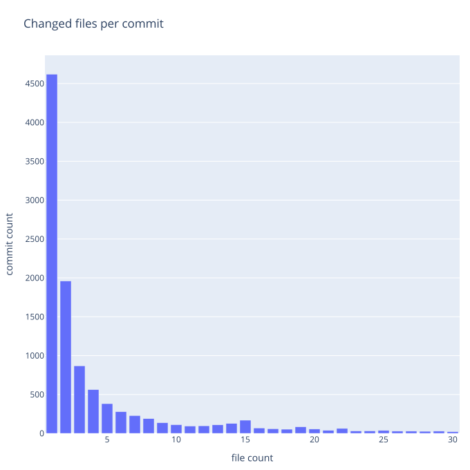
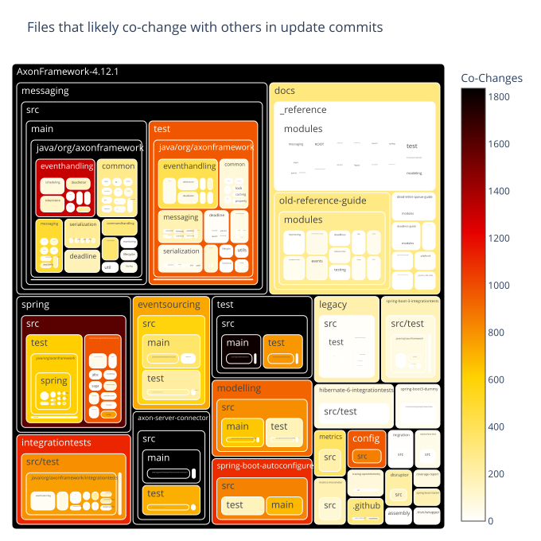
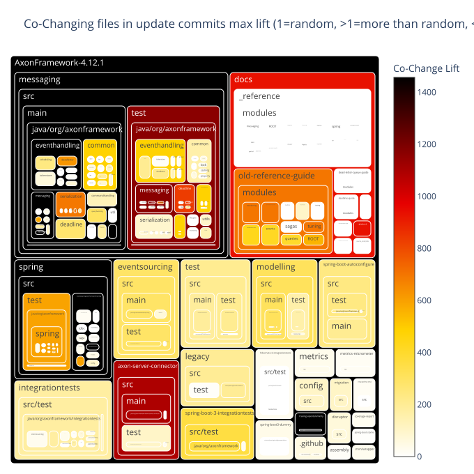
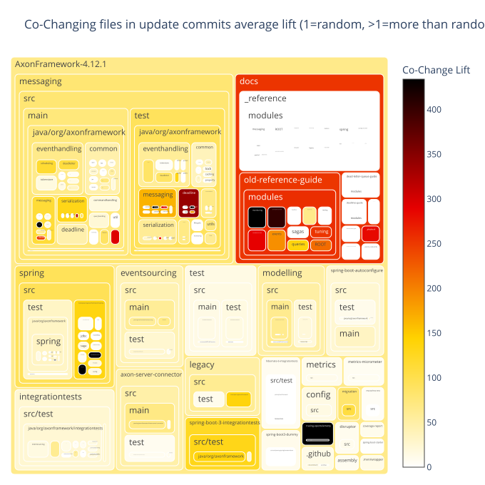
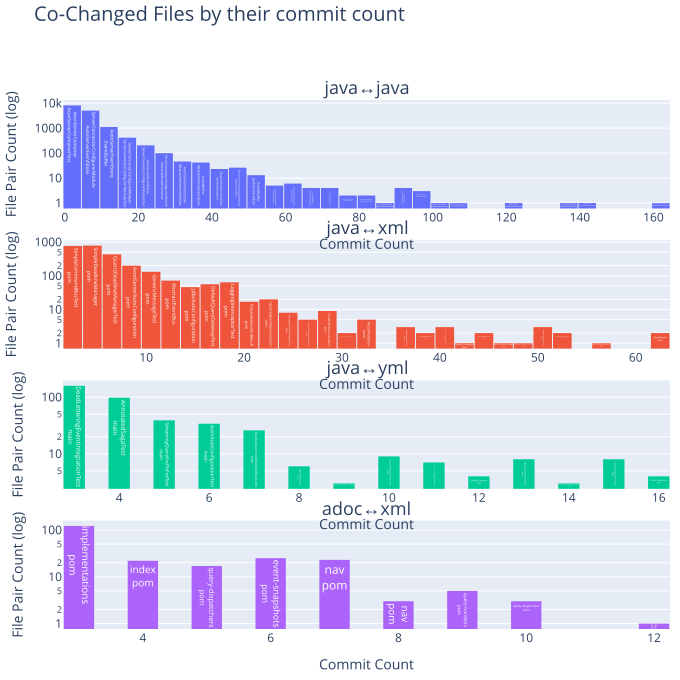
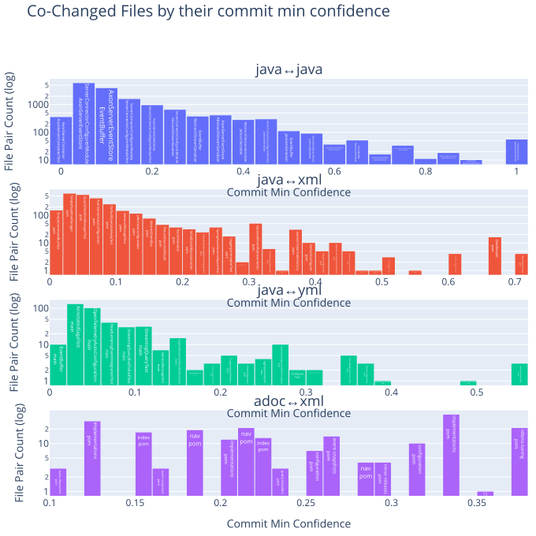
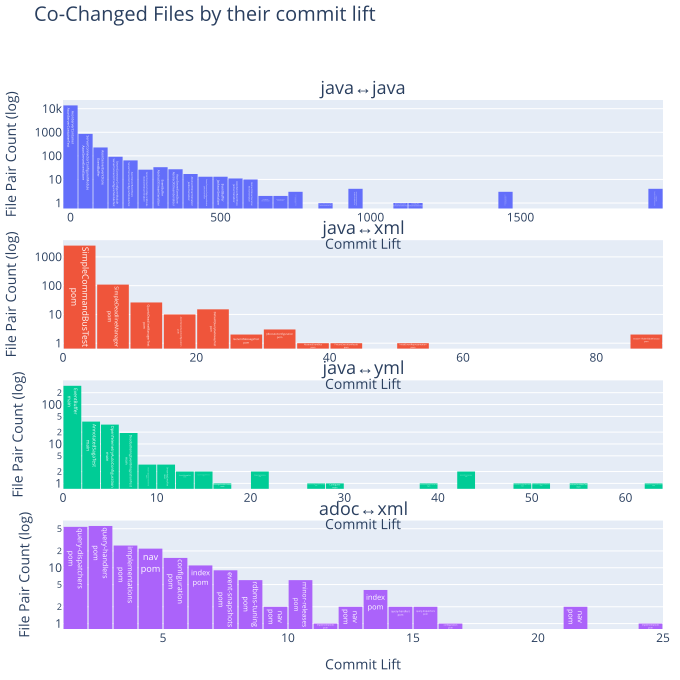
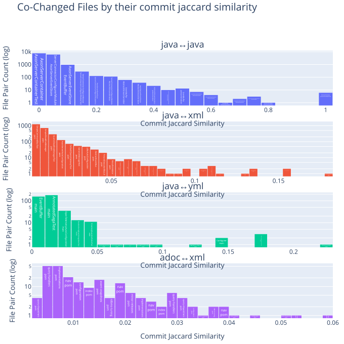

# git log/history
   

### References
- [Visualizing Code: Polyglot Notebooks Repository (YouTube)](https://youtu.be/ipOpToPS-PY?si=3doePt2cp-LgEUmt)
- [gitstractor (GitHub)](https://github.com/IntegerMan/gitstractor)
- [Neo4j Python Driver](https://neo4j.com/docs/api/python-driver/current)

    Command line execution (CLI mode): Yes

## Git History - Directory Commit Statistics

### Data Preview

<table border="1" class="dataframe">
  <thead>
    <tr style="text-align: right;">
      <th></th>
      <th>fileCount</th>
      <th>authorCount</th>
      <th>commitCount</th>
      <th>daysSinceLastCommit</th>
      <th>daysSinceLastCreation</th>
      <th>daysSinceLastModification</th>
    </tr>
  </thead>
  <tbody>
    <tr>
      <th>count</th>
      <td>564.000000</td>
      <td>564.000000</td>
      <td>564.000000</td>
      <td>564.000000</td>
      <td>564.000000</td>
      <td>564.000000</td>
    </tr>
    <tr>
      <th>mean</th>
      <td>24.898936</td>
      <td>19.664894</td>
      <td>288.570922</td>
      <td>310.186170</td>
      <td>1187.539007</td>
      <td>404.822695</td>
    </tr>
    <tr>
      <th>std</th>
      <td>120.739280</td>
      <td>21.297173</td>
      <td>639.823202</td>
      <td>170.624646</td>
      <td>980.407058</td>
      <td>392.535607</td>
    </tr>
    <tr>
      <th>min</th>
      <td>1.000000</td>
      <td>2.000000</td>
      <td>3.000000</td>
      <td>32.000000</td>
      <td>46.000000</td>
      <td>32.000000</td>
    </tr>
    <tr>
      <th>25%</th>
      <td>1.000000</td>
      <td>7.000000</td>
      <td>27.000000</td>
      <td>172.000000</td>
      <td>446.000000</td>
      <td>263.000000</td>
    </tr>
    <tr>
      <th>50%</th>
      <td>4.000000</td>
      <td>12.000000</td>
      <td>82.500000</td>
      <td>405.000000</td>
      <td>965.000000</td>
      <td>405.000000</td>
    </tr>
    <tr>
      <th>75%</th>
      <td>10.000000</td>
      <td>25.000000</td>
      <td>270.250000</td>
      <td>405.000000</td>
      <td>2012.000000</td>
      <td>405.000000</td>
    </tr>
    <tr>
      <th>max</th>
      <td>2294.000000</td>
      <td>213.000000</td>
      <td>9815.000000</td>
      <td>2555.000000</td>
      <td>5683.000000</td>
      <td>3034.000000</td>
    </tr>
  </tbody>
</table>

<table border="1" class="dataframe">
  <thead>
    <tr style="text-align: right;">
      <th></th>
      <th>directoryPath</th>
      <th>directoryParentPath</th>
      <th>directoryName</th>
      <th>fileCount</th>
      <th>firstFile</th>
      <th>mostFrequentFileExtension</th>
      <th>authorCount</th>
      <th>mainAuthor</th>
      <th>secondAuthor</th>
      <th>commitCount</th>
      <th>daysSinceLastCommit</th>
      <th>daysSinceLastCreation</th>
      <th>daysSinceLastModification</th>
      <th>lastCommitDate</th>
      <th>lastCreationDate</th>
      <th>lastModificationDate</th>
      <th>maxCommitSha</th>
    </tr>
  </thead>
  <tbody>
    <tr>
      <th>0</th>
      <td>AxonFramework-4.12.1/assembly</td>
      <td>AxonFramework-4.12.1</td>
      <td>assembly</td>
      <td>1</td>
      <td>AxonFramework-4.12.1/assembly/axon-full.xml</td>
      <td>xml</td>
      <td>6</td>
      <td>Allard Buijze</td>
      <td>Frank Versnel</td>
      <td>47</td>
      <td>405</td>
      <td>5683</td>
      <td>405</td>
      <td>2024-07-30</td>
      <td>2010-02-16</td>
      <td>2024-07-30</td>
      <td>fe95401de37055093f4e79fbe39a807a9d041240</td>
    </tr>
    <tr>
      <th>1</th>
      <td>AxonFramework-4.12.1/axon-server-connector/src/main/java/org/axonframework/axonserver/connector/heartbeat/source</td>
      <td>AxonFramework-4.12.1/axon-server-connector/src/main/java/org/axonframework/axonserver/connector/heartbeat</td>
      <td>source</td>
      <td>1</td>
      <td>AxonFramework-4.12.1/axon-server-connector/src/main/java/org/axonframework/axonserver/connector/heartbeat/source/GrpcHeartbeatSource.java</td>
      <td>java</td>
      <td>10</td>
      <td>Allard Buijze</td>
      <td>Elin Alexey</td>
      <td>31</td>
      <td>405</td>
      <td>2154</td>
      <td>405</td>
      <td>2024-07-30</td>
      <td>2019-10-16</td>
      <td>2024-07-30</td>
      <td>fe00b61e3d1268e540588c0b5e1921c535074072</td>
    </tr>
    <tr>
      <th>2</th>
      <td>AxonFramework-4.12.1/axon-server-connector/src/main/resources/META-INF/services</td>
      <td>AxonFramework-4.12.1/axon-server-connector/src/main/resources</td>
      <td>META-INF/services</td>
      <td>1</td>
      <td>AxonFramework-4.12.1/axon-server-connector/src/main/resources/META-INF/services/org.axonframework.config.ConfigurerModule</td>
      <td>ConfigurerModule</td>
      <td>7</td>
      <td>Allard Buijze</td>
      <td>Marc Gathier</td>
      <td>22</td>
      <td>405</td>
      <td>2523</td>
      <td>2523</td>
      <td>2024-07-30</td>
      <td>2018-10-12</td>
      <td>2018-10-12</td>
      <td>f87aa13a6118aae79bd02cdc5a8406e126e5bdc1</td>
    </tr>
    <tr>
      <th>3</th>
      <td>AxonFramework-4.12.1/axon-server-connector/src/test/java/org/axonframework/axonserver/connector/event/util</td>
      <td>AxonFramework-4.12.1/axon-server-connector/src/test/java/org/axonframework/axonserver/connector/event</td>
      <td>util</td>
      <td>1</td>
      <td>AxonFramework-4.12.1/axon-server-connector/src/test/java/org/axonframework/axonserver/connector/event/util/EventCipherTests.java</td>
      <td>java</td>
      <td>11</td>
      <td>Allard Buijze</td>
      <td>Elin Alexey</td>
      <td>69</td>
      <td>405</td>
      <td>2547</td>
      <td>405</td>
      <td>2024-07-30</td>
      <td>2018-09-18</td>
      <td>2024-07-30</td>
      <td>fd487ec121971cebef59ef35ec2ae82f97190cb6</td>
    </tr>
    <tr>
      <th>4</th>
      <td>AxonFramework-4.12.1/config/src/test/resources/META-INF</td>
      <td>AxonFramework-4.12.1/config/src/test/resources</td>
      <td>META-INF</td>
      <td>1</td>
      <td>AxonFramework-4.12.1/config/src/test/resources/META-INF/persistence.xml</td>
      <td>xml</td>
      <td>5</td>
      <td>Allard Buijze</td>
      <td>Marijn van Zelst</td>
      <td>34</td>
      <td>405</td>
      <td>2525</td>
      <td>405</td>
      <td>2024-07-30</td>
      <td>2018-10-10</td>
      <td>2024-07-30</td>
      <td>f526be04f89262baf7e130a523770b405af51b2b</td>
    </tr>
    <tr>
      <th>5</th>
      <td>AxonFramework-4.12.1/coverage-report</td>
      <td>AxonFramework-4.12.1</td>
      <td>coverage-report</td>
      <td>1</td>
      <td>AxonFramework-4.12.1/coverage-report/pom.xml</td>
      <td>xml</td>
      <td>10</td>
      <td>Allard Buijze</td>
      <td>Christian Vermorken</td>
      <td>178</td>
      <td>35</td>
      <td>1348</td>
      <td>35</td>
      <td>2025-08-04</td>
      <td>2021-12-30</td>
      <td>2025-08-04</td>
      <td>ff147d51c6cf46d3eb4facf4bfe6d03dd6bb4b5e</td>
    </tr>
    <tr>
      <th>6</th>
      <td>AxonFramework-4.12.1/docs/_playbook/localLinks</td>
      <td>AxonFramework-4.12.1/docs/_playbook</td>
      <td>localLinks</td>
      <td>1</td>
      <td>AxonFramework-4.12.1/docs/_playbook/localLinks/axoniq-library-ui</td>
      <td>axoniq-library-ui</td>
      <td>7</td>
      <td>Allard Buijze</td>
      <td>David Gómez G</td>
      <td>10</td>
      <td>405</td>
      <td>458</td>
      <td>458</td>
      <td>2024-07-30</td>
      <td>2024-06-07</td>
      <td>2024-06-07</td>
      <td>fcf55fb4f72d050c0949cac6a1818df2cd53d608</td>
    </tr>
    <tr>
      <th>7</th>
      <td>AxonFramework-4.12.1/docs/_reference/modules/ROOT/attachments</td>
      <td>AxonFramework-4.12.1/docs/_reference/modules/ROOT</td>
      <td>attachments</td>
      <td>1</td>
      <td>AxonFramework-4.12.1/docs/_reference/modules/ROOT/attachments/axonframework_overview.gv</td>
      <td>gv</td>
      <td>8</td>
      <td>Allard Buijze</td>
      <td>David Gómez G</td>
      <td>18</td>
      <td>405</td>
      <td>446</td>
      <td>446</td>
      <td>2024-07-30</td>
      <td>2024-06-19</td>
      <td>2024-06-19</td>
      <td>f851948ee70e6cc9742c7b1bde5941ed2655e28f</td>
    </tr>
    <tr>
      <th>8</th>
      <td>AxonFramework-4.12.1/docs/_reference/modules/ROOT/partials</td>
      <td>AxonFramework-4.12.1/docs/_reference/modules/ROOT</td>
      <td>partials</td>
      <td>1</td>
      <td>AxonFramework-4.12.1/docs/_reference/modules/ROOT/partials/nav.adoc</td>
      <td>adoc</td>
      <td>8</td>
      <td>Allard Buijze</td>
      <td>David Gómez G</td>
      <td>18</td>
      <td>405</td>
      <td>446</td>
      <td>446</td>
      <td>2024-07-30</td>
      <td>2024-06-19</td>
      <td>2024-06-19</td>
      <td>f851948ee70e6cc9742c7b1bde5941ed2655e28f</td>
    </tr>
    <tr>
      <th>9</th>
      <td>AxonFramework-4.12.1/docs/_reference/modules/axon-server-connector/pages</td>
      <td>AxonFramework-4.12.1/docs/_reference/modules/axon-server-connector</td>
      <td>pages</td>
      <td>1</td>
      <td>AxonFramework-4.12.1/docs/_reference/modules/axon-server-connector/pages/index.adoc</td>
      <td>adoc</td>
      <td>8</td>
      <td>Allard Buijze</td>
      <td>David Gómez G</td>
      <td>19</td>
      <td>405</td>
      <td>446</td>
      <td>446</td>
      <td>2024-07-30</td>
      <td>2024-06-19</td>
      <td>2024-06-19</td>
      <td>f851948ee70e6cc9742c7b1bde5941ed2655e28f</td>
    </tr>
    <tr>
      <th>10</th>
      <td>AxonFramework-4.12.1/docs/_reference/modules/axon-server-connector/partials</td>
      <td>AxonFramework-4.12.1/docs/_reference/modules/axon-server-connector</td>
      <td>partials</td>
      <td>1</td>
      <td>AxonFramework-4.12.1/docs/_reference/modules/axon-server-connector/partials/nav.adoc</td>
      <td>adoc</td>
      <td>8</td>
      <td>Allard Buijze</td>
      <td>David Gómez G</td>
      <td>18</td>
      <td>405</td>
      <td>446</td>
      <td>446</td>
      <td>2024-07-30</td>
      <td>2024-06-19</td>
      <td>2024-06-19</td>
      <td>f851948ee70e6cc9742c7b1bde5941ed2655e28f</td>
    </tr>
    <tr>
      <th>11</th>
      <td>AxonFramework-4.12.1/docs/_reference/modules/configuration/pages</td>
      <td>AxonFramework-4.12.1/docs/_reference/modules/configuration</td>
      <td>pages</td>
      <td>1</td>
      <td>AxonFramework-4.12.1/docs/_reference/modules/configuration/pages/index.adoc</td>
      <td>adoc</td>
      <td>8</td>
      <td>Allard Buijze</td>
      <td>David Gómez G</td>
      <td>19</td>
      <td>405</td>
      <td>446</td>
      <td>446</td>
      <td>2024-07-30</td>
      <td>2024-06-19</td>
      <td>2024-06-19</td>
      <td>f851948ee70e6cc9742c7b1bde5941ed2655e28f</td>
    </tr>
    <tr>
      <th>12</th>
      <td>AxonFramework-4.12.1/docs/_reference/modules/configuration/partials</td>
      <td>AxonFramework-4.12.1/docs/_reference/modules/configuration</td>
      <td>partials</td>
      <td>1</td>
      <td>AxonFramework-4.12.1/docs/_reference/modules/configuration/partials/nav.adoc</td>
      <td>adoc</td>
      <td>8</td>
      <td>Allard Buijze</td>
      <td>David Gómez G</td>
      <td>18</td>
      <td>405</td>
      <td>446</td>
      <td>446</td>
      <td>2024-07-30</td>
      <td>2024-06-19</td>
      <td>2024-06-19</td>
      <td>f851948ee70e6cc9742c7b1bde5941ed2655e28f</td>
    </tr>
    <tr>
      <th>13</th>
      <td>AxonFramework-4.12.1/docs/_reference/modules/disruptor/pages</td>
      <td>AxonFramework-4.12.1/docs/_reference/modules/disruptor</td>
      <td>pages</td>
      <td>1</td>
      <td>AxonFramework-4.12.1/docs/_reference/modules/disruptor/pages/index.adoc</td>
      <td>adoc</td>
      <td>8</td>
      <td>Allard Buijze</td>
      <td>David Gómez G</td>
      <td>19</td>
      <td>405</td>
      <td>446</td>
      <td>446</td>
      <td>2024-07-30</td>
      <td>2024-06-19</td>
      <td>2024-06-19</td>
      <td>f851948ee70e6cc9742c7b1bde5941ed2655e28f</td>
    </tr>
    <tr>
      <th>14</th>
      <td>AxonFramework-4.12.1/docs/_reference/modules/disruptor/partials</td>
      <td>AxonFramework-4.12.1/docs/_reference/modules/disruptor</td>
      <td>partials</td>
      <td>1</td>
      <td>AxonFramework-4.12.1/docs/_reference/modules/disruptor/partials/nav.adoc</td>
      <td>adoc</td>
      <td>8</td>
      <td>Allard Buijze</td>
      <td>David Gómez G</td>
      <td>18</td>
      <td>405</td>
      <td>446</td>
      <td>446</td>
      <td>2024-07-30</td>
      <td>2024-06-19</td>
      <td>2024-06-19</td>
      <td>f851948ee70e6cc9742c7b1bde5941ed2655e28f</td>
    </tr>
    <tr>
      <th>15</th>
      <td>AxonFramework-4.12.1/docs/_reference/modules/eventsourcing/pages</td>
      <td>AxonFramework-4.12.1/docs/_reference/modules/eventsourcing</td>
      <td>pages</td>
      <td>1</td>
      <td>AxonFramework-4.12.1/docs/_reference/modules/eventsourcing/pages/index.adoc</td>
      <td>adoc</td>
      <td>8</td>
      <td>Allard Buijze</td>
      <td>David Gómez G</td>
      <td>20</td>
      <td>405</td>
      <td>446</td>
      <td>446</td>
      <td>2024-07-30</td>
      <td>2024-06-19</td>
      <td>2024-06-19</td>
      <td>f851948ee70e6cc9742c7b1bde5941ed2655e28f</td>
    </tr>
    <tr>
      <th>16</th>
      <td>AxonFramework-4.12.1/docs/_reference/modules/eventsourcing/partials</td>
      <td>AxonFramework-4.12.1/docs/_reference/modules/eventsourcing</td>
      <td>partials</td>
      <td>1</td>
      <td>AxonFramework-4.12.1/docs/_reference/modules/eventsourcing/partials/nav.adoc</td>
      <td>adoc</td>
      <td>8</td>
      <td>Allard Buijze</td>
      <td>David Gómez G</td>
      <td>18</td>
      <td>405</td>
      <td>446</td>
      <td>446</td>
      <td>2024-07-30</td>
      <td>2024-06-19</td>
      <td>2024-06-19</td>
      <td>f851948ee70e6cc9742c7b1bde5941ed2655e28f</td>
    </tr>
    <tr>
      <th>17</th>
      <td>AxonFramework-4.12.1/docs/_reference/modules/legacy/pages</td>
      <td>AxonFramework-4.12.1/docs/_reference/modules/legacy</td>
      <td>pages</td>
      <td>1</td>
      <td>AxonFramework-4.12.1/docs/_reference/modules/legacy/pages/index.adoc</td>
      <td>adoc</td>
      <td>8</td>
      <td>Allard Buijze</td>
      <td>David Gómez G</td>
      <td>19</td>
      <td>405</td>
      <td>446</td>
      <td>446</td>
      <td>2024-07-30</td>
      <td>2024-06-19</td>
      <td>2024-06-19</td>
      <td>f851948ee70e6cc9742c7b1bde5941ed2655e28f</td>
    </tr>
    <tr>
      <th>18</th>
      <td>AxonFramework-4.12.1/docs/_reference/modules/legacy/partials</td>
      <td>AxonFramework-4.12.1/docs/_reference/modules/legacy</td>
      <td>partials</td>
      <td>1</td>
      <td>AxonFramework-4.12.1/docs/_reference/modules/legacy/partials/nav.adoc</td>
      <td>adoc</td>
      <td>8</td>
      <td>Allard Buijze</td>
      <td>David Gómez G</td>
      <td>18</td>
      <td>405</td>
      <td>446</td>
      <td>446</td>
      <td>2024-07-30</td>
      <td>2024-06-19</td>
      <td>2024-06-19</td>
      <td>f851948ee70e6cc9742c7b1bde5941ed2655e28f</td>
    </tr>
    <tr>
      <th>19</th>
      <td>AxonFramework-4.12.1/docs/_reference/modules/metrics/pages</td>
      <td>AxonFramework-4.12.1/docs/_reference/modules/metrics</td>
      <td>pages</td>
      <td>1</td>
      <td>AxonFramework-4.12.1/docs/_reference/modules/metrics/pages/index.adoc</td>
      <td>adoc</td>
      <td>8</td>
      <td>Allard Buijze</td>
      <td>David Gómez G</td>
      <td>19</td>
      <td>405</td>
      <td>446</td>
      <td>446</td>
      <td>2024-07-30</td>
      <td>2024-06-19</td>
      <td>2024-06-19</td>
      <td>f851948ee70e6cc9742c7b1bde5941ed2655e28f</td>
    </tr>
    <tr>
      <th>20</th>
      <td>AxonFramework-4.12.1/docs/_reference/modules/metrics/partials</td>
      <td>AxonFramework-4.12.1/docs/_reference/modules/metrics</td>
      <td>partials</td>
      <td>1</td>
      <td>AxonFramework-4.12.1/docs/_reference/modules/metrics/partials/nav.adoc</td>
      <td>adoc</td>
      <td>8</td>
      <td>Allard Buijze</td>
      <td>David Gómez G</td>
      <td>18</td>
      <td>405</td>
      <td>446</td>
      <td>446</td>
      <td>2024-07-30</td>
      <td>2024-06-19</td>
      <td>2024-06-19</td>
      <td>f851948ee70e6cc9742c7b1bde5941ed2655e28f</td>
    </tr>
    <tr>
      <th>21</th>
      <td>AxonFramework-4.12.1/docs/_reference/modules/micrometer/pages</td>
      <td>AxonFramework-4.12.1/docs/_reference/modules/micrometer</td>
      <td>pages</td>
      <td>1</td>
      <td>AxonFramework-4.12.1/docs/_reference/modules/micrometer/pages/index.adoc</td>
      <td>adoc</td>
      <td>8</td>
      <td>Allard Buijze</td>
      <td>David Gómez G</td>
      <td>19</td>
      <td>405</td>
      <td>446</td>
      <td>446</td>
      <td>2024-07-30</td>
      <td>2024-06-19</td>
      <td>2024-06-19</td>
      <td>f851948ee70e6cc9742c7b1bde5941ed2655e28f</td>
    </tr>
    <tr>
      <th>22</th>
      <td>AxonFramework-4.12.1/docs/_reference/modules/micrometer/partials</td>
      <td>AxonFramework-4.12.1/docs/_reference/modules/micrometer</td>
      <td>partials</td>
      <td>1</td>
      <td>AxonFramework-4.12.1/docs/_reference/modules/micrometer/partials/nav.adoc</td>
      <td>adoc</td>
      <td>8</td>
      <td>Allard Buijze</td>
      <td>David Gómez G</td>
      <td>18</td>
      <td>405</td>
      <td>446</td>
      <td>446</td>
      <td>2024-07-30</td>
      <td>2024-06-19</td>
      <td>2024-06-19</td>
      <td>f851948ee70e6cc9742c7b1bde5941ed2655e28f</td>
    </tr>
    <tr>
      <th>23</th>
      <td>AxonFramework-4.12.1/docs/_reference/modules/modeling/partials</td>
      <td>AxonFramework-4.12.1/docs/_reference/modules/modeling</td>
      <td>partials</td>
      <td>1</td>
      <td>AxonFramework-4.12.1/docs/_reference/modules/modeling/partials/nav.adoc</td>
      <td>adoc</td>
      <td>8</td>
      <td>Allard Buijze</td>
      <td>David Gómez G</td>
      <td>18</td>
      <td>405</td>
      <td>446</td>
      <td>446</td>
      <td>2024-07-30</td>
      <td>2024-06-19</td>
      <td>2024-06-19</td>
      <td>f851948ee70e6cc9742c7b1bde5941ed2655e28f</td>
    </tr>
    <tr>
      <th>24</th>
      <td>AxonFramework-4.12.1/docs/_reference/modules/spring/pages</td>
      <td>AxonFramework-4.12.1/docs/_reference/modules/spring</td>
      <td>pages</td>
      <td>1</td>
      <td>AxonFramework-4.12.1/docs/_reference/modules/spring/pages/index.adoc</td>
      <td>adoc</td>
      <td>8</td>
      <td>Allard Buijze</td>
      <td>David Gómez G</td>
      <td>19</td>
      <td>405</td>
      <td>446</td>
      <td>446</td>
      <td>2024-07-30</td>
      <td>2024-06-19</td>
      <td>2024-06-19</td>
      <td>f851948ee70e6cc9742c7b1bde5941ed2655e28f</td>
    </tr>
    <tr>
      <th>25</th>
      <td>AxonFramework-4.12.1/docs/_reference/modules/spring/partials</td>
      <td>AxonFramework-4.12.1/docs/_reference/modules/spring</td>
      <td>partials</td>
      <td>1</td>
      <td>AxonFramework-4.12.1/docs/_reference/modules/spring/partials/nav.adoc</td>
      <td>adoc</td>
      <td>8</td>
      <td>Allard Buijze</td>
      <td>David Gómez G</td>
      <td>18</td>
      <td>405</td>
      <td>446</td>
      <td>446</td>
      <td>2024-07-30</td>
      <td>2024-06-19</td>
      <td>2024-06-19</td>
      <td>f851948ee70e6cc9742c7b1bde5941ed2655e28f</td>
    </tr>
    <tr>
      <th>26</th>
      <td>AxonFramework-4.12.1/docs/_reference/modules/springboot-starter/pages</td>
      <td>AxonFramework-4.12.1/docs/_reference/modules/springboot-starter</td>
      <td>pages</td>
      <td>1</td>
      <td>AxonFramework-4.12.1/docs/_reference/modules/springboot-starter/pages/index.adoc</td>
      <td>adoc</td>
      <td>8</td>
      <td>Allard Buijze</td>
      <td>David Gómez G</td>
      <td>20</td>
      <td>405</td>
      <td>446</td>
      <td>446</td>
      <td>2024-07-30</td>
      <td>2024-06-19</td>
      <td>2024-06-19</td>
      <td>f851948ee70e6cc9742c7b1bde5941ed2655e28f</td>
    </tr>
    <tr>
      <th>27</th>
      <td>AxonFramework-4.12.1/docs/_reference/modules/springboot-starter/partials</td>
      <td>AxonFramework-4.12.1/docs/_reference/modules/springboot-starter</td>
      <td>partials</td>
      <td>1</td>
      <td>AxonFramework-4.12.1/docs/_reference/modules/springboot-starter/partials/nav.adoc</td>
      <td>adoc</td>
      <td>8</td>
      <td>Allard Buijze</td>
      <td>David Gómez G</td>
      <td>18</td>
      <td>405</td>
      <td>446</td>
      <td>446</td>
      <td>2024-07-30</td>
      <td>2024-06-19</td>
      <td>2024-06-19</td>
      <td>f851948ee70e6cc9742c7b1bde5941ed2655e28f</td>
    </tr>
    <tr>
      <th>28</th>
      <td>AxonFramework-4.12.1/docs/_reference/modules/test/pages</td>
      <td>AxonFramework-4.12.1/docs/_reference/modules/test</td>
      <td>pages</td>
      <td>1</td>
      <td>AxonFramework-4.12.1/docs/_reference/modules/test/pages/index.adoc</td>
      <td>adoc</td>
      <td>8</td>
      <td>Allard Buijze</td>
      <td>David Gómez G</td>
      <td>19</td>
      <td>405</td>
      <td>446</td>
      <td>446</td>
      <td>2024-07-30</td>
      <td>2024-06-19</td>
      <td>2024-06-19</td>
      <td>f851948ee70e6cc9742c7b1bde5941ed2655e28f</td>
    </tr>
    <tr>
      <th>29</th>
      <td>AxonFramework-4.12.1/docs/_reference/modules/test/partials</td>
      <td>AxonFramework-4.12.1/docs/_reference/modules/test</td>
      <td>partials</td>
      <td>1</td>
      <td>AxonFramework-4.12.1/docs/_reference/modules/test/partials/nav.adoc</td>
      <td>adoc</td>
      <td>8</td>
      <td>Allard Buijze</td>
      <td>David Gómez G</td>
      <td>18</td>
      <td>405</td>
      <td>446</td>
      <td>446</td>
      <td>2024-07-30</td>
      <td>2024-06-19</td>
      <td>2024-06-19</td>
      <td>f851948ee70e6cc9742c7b1bde5941ed2655e28f</td>
    </tr>
  </tbody>
</table>

### Number of files per directory

    

    

### Most frequent file extension per directory

    

    

### Number of commits per directory

    

    

### Number of distinct authors per directory

    

    

### Directories with very few different authors

    

    

### Main author per directory

    

    

### Second author per directory

    

    

### Days since last commit per directory

    

    

### Days since last commit per directory (ranked)

    

    

### Days since last file creation per directory

    

    

### Days since last file creation per directory (ranked)

    

    

### Days since last file modification per directory

    

    

### Days since last file modification per directory (ranked)

    

    

## Filecount per commit

Shows how many commits had changed one file, how many had changed two files, and so on.
The chart is limited to 30 lines for improved readability.
The data preview also includes overall statistics including the number of commits that are filtered out in the chart.

### Preview data

    Sum of commits that changed more than 30 files (each) = 973
    Max changed files with one commit = 2178

<table border="1" class="dataframe">
  <thead>
    <tr style="text-align: right;">
      <th></th>
      <th>filesPerCommit</th>
      <th>commitCount</th>
    </tr>
  </thead>
  <tbody>
    <tr>
      <th>count</th>
      <td>334.000000</td>
      <td>334.000000</td>
    </tr>
    <tr>
      <th>mean</th>
      <td>343.449102</td>
      <td>34.592814</td>
    </tr>
    <tr>
      <th>std</th>
      <td>439.862566</td>
      <td>281.096056</td>
    </tr>
    <tr>
      <th>min</th>
      <td>1.000000</td>
      <td>1.000000</td>
    </tr>
    <tr>
      <th>25%</th>
      <td>84.250000</td>
      <td>1.000000</td>
    </tr>
    <tr>
      <th>50%</th>
      <td>185.000000</td>
      <td>2.000000</td>
    </tr>
    <tr>
      <th>75%</th>
      <td>426.500000</td>
      <td>5.000000</td>
    </tr>
    <tr>
      <th>max</th>
      <td>2178.000000</td>
      <td>4620.000000</td>
    </tr>
  </tbody>
</table>

<table border="1" class="dataframe">
  <thead>
    <tr style="text-align: right;">
      <th></th>
      <th>filesPerCommit</th>
      <th>commitCount</th>
    </tr>
  </thead>
  <tbody>
    <tr>
      <th>0</th>
      <td>1</td>
      <td>4620</td>
    </tr>
    <tr>
      <th>1</th>
      <td>2</td>
      <td>1959</td>
    </tr>
    <tr>
      <th>2</th>
      <td>3</td>
      <td>869</td>
    </tr>
    <tr>
      <th>3</th>
      <td>4</td>
      <td>562</td>
    </tr>
    <tr>
      <th>4</th>
      <td>5</td>
      <td>382</td>
    </tr>
    <tr>
      <th>5</th>
      <td>6</td>
      <td>278</td>
    </tr>
    <tr>
      <th>6</th>
      <td>7</td>
      <td>229</td>
    </tr>
    <tr>
      <th>7</th>
      <td>8</td>
      <td>189</td>
    </tr>
    <tr>
      <th>8</th>
      <td>9</td>
      <td>136</td>
    </tr>
    <tr>
      <th>9</th>
      <td>10</td>
      <td>111</td>
    </tr>
    <tr>
      <th>10</th>
      <td>11</td>
      <td>94</td>
    </tr>
    <tr>
      <th>11</th>
      <td>12</td>
      <td>97</td>
    </tr>
    <tr>
      <th>12</th>
      <td>13</td>
      <td>109</td>
    </tr>
    <tr>
      <th>13</th>
      <td>14</td>
      <td>127</td>
    </tr>
    <tr>
      <th>14</th>
      <td>15</td>
      <td>169</td>
    </tr>
    <tr>
      <th>15</th>
      <td>16</td>
      <td>69</td>
    </tr>
    <tr>
      <th>16</th>
      <td>17</td>
      <td>59</td>
    </tr>
    <tr>
      <th>17</th>
      <td>18</td>
      <td>53</td>
    </tr>
    <tr>
      <th>18</th>
      <td>19</td>
      <td>84</td>
    </tr>
    <tr>
      <th>19</th>
      <td>20</td>
      <td>55</td>
    </tr>
    <tr>
      <th>20</th>
      <td>21</td>
      <td>38</td>
    </tr>
    <tr>
      <th>21</th>
      <td>22</td>
      <td>63</td>
    </tr>
    <tr>
      <th>22</th>
      <td>23</td>
      <td>30</td>
    </tr>
    <tr>
      <th>23</th>
      <td>24</td>
      <td>31</td>
    </tr>
    <tr>
      <th>24</th>
      <td>25</td>
      <td>37</td>
    </tr>
    <tr>
      <th>25</th>
      <td>26</td>
      <td>28</td>
    </tr>
    <tr>
      <th>26</th>
      <td>27</td>
      <td>28</td>
    </tr>
    <tr>
      <th>27</th>
      <td>28</td>
      <td>26</td>
    </tr>
    <tr>
      <th>28</th>
      <td>29</td>
      <td>28</td>
    </tr>
    <tr>
      <th>29</th>
      <td>30</td>
      <td>21</td>
    </tr>
  </tbody>
</table>

### Bar chart with the number of files per commit distribution

    

    

## Pairwise Changed Files

This section analyzes files that where changed together within the same commit and provides several metrics to quantify the strength of the co-change relationship:

- **Commit Count**: The number of commits in which two files were changed together.
- **Commit Lift**: A ratio that indicates whether the co-change pattern is stronger than random chance, given how often each file changes.
- **Jaccard Similarity**: The ratio of commits involving either file that also involved both files.

The following tables show the top pairwise changed files based on these metrics.
The following charts show how these metrics are distributed across pairs of files that were changed together.

### Treemap with files changed frequently with others

    

    

    

    

    

    

<table border="1" class="dataframe">
  <thead>
    <tr style="text-align: right;">
      <th></th>
      <th>fileExtensionPair</th>
      <th>fileExtensionPairCount</th>
    </tr>
  </thead>
  <tbody>
    <tr>
      <th>0</th>
      <td>java↔java</td>
      <td>15189</td>
    </tr>
    <tr>
      <th>1</th>
      <td>java↔xml</td>
      <td>2637</td>
    </tr>
    <tr>
      <th>2</th>
      <td>java↔yml</td>
      <td>408</td>
    </tr>
    <tr>
      <th>3</th>
      <td>adoc↔xml</td>
      <td>221</td>
    </tr>
  </tbody>
</table>

### Files changed together by commit count

<table border="1" class="dataframe">
  <thead>
    <tr style="text-align: right;">
      <th></th>
      <th>fileExtensionPair</th>
      <th>updateCommitCount</th>
      <th>GroupRank</th>
      <th>filePair</th>
      <th>filePairWithRelativePath</th>
    </tr>
  </thead>
  <tbody>
    <tr>
      <th>0</th>
      <td>java↔java</td>
      <td>163</td>
      <td>1</td>
      <td>AxonServerQueryBus↔AxonServerCommandBus</td>
      <td>axon-server-connector/src/main/java/org/axonframework/axonserver/connector/query/AxonServerQueryBus.java↔axon-server-connector/src/main/java/org/axonframework/axonserver/connector/command/AxonServerCommandBus.java</td>
    </tr>
    <tr>
      <th>1</th>
      <td>java↔java</td>
      <td>144</td>
      <td>2</td>
      <td>AxonServerQueryBus↔AxonServerQueryBusTest</td>
      <td>axon-server-connector/src/main/java/org/axonframework/axonserver/connector/query/AxonServerQueryBus.java↔axon-server-connector/src/test/java/org/axonframework/axonserver/connector/query/AxonServerQueryBusTest.java</td>
    </tr>
    <tr>
      <th>2</th>
      <td>java↔java</td>
      <td>135</td>
      <td>3</td>
      <td>SpringAxonAutoConfigurerTest↔SpringAxonAutoConfigurer</td>
      <td>spring/src/test/java/org/axonframework/spring/config/SpringAxonAutoConfigurerTest.java↔spring/src/main/java/org/axonframework/spring/config/SpringAxonAutoConfigurer.java</td>
    </tr>
    <tr>
      <th>3</th>
      <td>java↔java</td>
      <td>121</td>
      <td>4</td>
      <td>TrackingEventProcessorTest↔TrackingEventProcessor</td>
      <td>integrationtests/src/test/java/org/axonframework/integrationtests/eventhandling/TrackingEventProcessorTest.java↔messaging/src/main/java/org/axonframework/eventhandling/TrackingEventProcessor.java</td>
    </tr>
    <tr>
      <th>4</th>
      <td>java↔java</td>
      <td>107</td>
      <td>5</td>
      <td>SpringAxonAutoConfigurer↔AxonConfiguration</td>
      <td>spring/src/main/java/org/axonframework/spring/config/SpringAxonAutoConfigurer.java↔spring/src/main/java/org/axonframework/spring/config/AxonConfiguration.java</td>
    </tr>
    <tr>
      <th>5</th>
      <td>java↔java</td>
      <td>100</td>
      <td>6</td>
      <td>EventProcessingModule↔EventProcessingModuleTest</td>
      <td>config/src/main/java/org/axonframework/config/EventProcessingModule.java↔config/src/test/java/org/axonframework/config/EventProcessingModuleTest.java</td>
    </tr>
    <tr>
      <th>6</th>
      <td>java↔java</td>
      <td>96</td>
      <td>7</td>
      <td>SagaTestFixture↔AggregateTestFixture</td>
      <td>test/src/main/java/org/axonframework/test/saga/SagaTestFixture.java↔test/src/main/java/org/axonframework/test/aggregate/AggregateTestFixture.java</td>
    </tr>
    <tr>
      <th>7</th>
      <td>java↔java</td>
      <td>95</td>
      <td>8</td>
      <td>AxonServerQueryBusTest↔AxonServerCommandBusTest</td>
      <td>axon-server-connector/src/test/java/org/axonframework/axonserver/connector/query/AxonServerQueryBusTest.java↔axon-server-connector/src/test/java/org/axonframework/axonserver/connector/command/AxonServerCommandBusTest.java</td>
    </tr>
    <tr>
      <th>8</th>
      <td>java↔java</td>
      <td>94</td>
      <td>9</td>
      <td>AggregateTestFixture↔FixtureConfiguration</td>
      <td>test/src/main/java/org/axonframework/test/aggregate/AggregateTestFixture.java↔test/src/main/java/org/axonframework/test/aggregate/FixtureConfiguration.java</td>
    </tr>
    <tr>
      <th>9</th>
      <td>java↔java</td>
      <td>92</td>
      <td>10</td>
      <td>AggregateTestFixture↔SpringAxonAutoConfigurer</td>
      <td>test/src/main/java/org/axonframework/test/aggregate/AggregateTestFixture.java↔spring/src/main/java/org/axonframework/spring/config/SpringAxonAutoConfigurer.java</td>
    </tr>
    <tr>
      <th>10</th>
      <td>java↔xml</td>
      <td>62</td>
      <td>1</td>
      <td>AggregateTestFixture↔pom</td>
      <td>test/src/main/java/org/axonframework/test/aggregate/AggregateTestFixture.java↔spring-boot-autoconfigure/pom.xml</td>
    </tr>
    <tr>
      <th>11</th>
      <td>java↔xml</td>
      <td>57</td>
      <td>2</td>
      <td>AggregateTestFixture↔pom</td>
      <td>test/src/main/java/org/axonframework/test/aggregate/AggregateTestFixture.java↔integrationtests/pom.xml</td>
    </tr>
    <tr>
      <th>12</th>
      <td>java↔xml</td>
      <td>53</td>
      <td>3</td>
      <td>AggregateTestFixture↔pom</td>
      <td>test/src/main/java/org/axonframework/test/aggregate/AggregateTestFixture.java↔metrics/pom.xml</td>
    </tr>
    <tr>
      <th>13</th>
      <td>java↔xml</td>
      <td>51</td>
      <td>4</td>
      <td>SpringAxonAutoConfigurer↔pom</td>
      <td>spring/src/main/java/org/axonframework/spring/config/SpringAxonAutoConfigurer.java↔spring-boot-autoconfigure/pom.xml</td>
    </tr>
    <tr>
      <th>14</th>
      <td>java↔xml</td>
      <td>48</td>
      <td>5</td>
      <td>SagaTestFixture↔pom</td>
      <td>test/src/main/java/org/axonframework/test/saga/SagaTestFixture.java↔spring-boot-autoconfigure/pom.xml</td>
    </tr>
    <tr>
      <th>15</th>
      <td>java↔xml</td>
      <td>46</td>
      <td>6</td>
      <td>SpringAxonAutoConfigurer↔pom</td>
      <td>spring/src/main/java/org/axonframework/spring/config/SpringAxonAutoConfigurer.java↔spring/pom.xml</td>
    </tr>
    <tr>
      <th>16</th>
      <td>java↔xml</td>
      <td>45</td>
      <td>7</td>
      <td>SpringAxonAutoConfigurerTest↔pom</td>
      <td>spring/src/test/java/org/axonframework/spring/config/SpringAxonAutoConfigurerTest.java↔spring/pom.xml</td>
    </tr>
    <tr>
      <th>17</th>
      <td>java↔xml</td>
      <td>44</td>
      <td>8</td>
      <td>SpringAxonAutoConfigurerTest↔pom</td>
      <td>spring/src/test/java/org/axonframework/spring/config/SpringAxonAutoConfigurerTest.java↔spring-boot-autoconfigure/pom.xml</td>
    </tr>
    <tr>
      <th>18</th>
      <td>java↔xml</td>
      <td>42</td>
      <td>9</td>
      <td>AggregateTestFixture↔pom</td>
      <td>test/src/main/java/org/axonframework/test/aggregate/AggregateTestFixture.java↔legacy/pom.xml</td>
    </tr>
    <tr>
      <th>19</th>
      <td>java↔xml</td>
      <td>41</td>
      <td>10</td>
      <td>AxonConfiguration↔pom</td>
      <td>spring/src/main/java/org/axonframework/spring/config/AxonConfiguration.java↔spring/pom.xml</td>
    </tr>
    <tr>
      <th>20</th>
      <td>java↔yml</td>
      <td>16</td>
      <td>1</td>
      <td>JobrunrDeadlineManagerTest↔main</td>
      <td>integrationtests/src/test/java/org/axonframework/integrationtests/deadline/jobrunr/JobrunrDeadlineManagerTest.java↔.github/workflows/main.yml</td>
    </tr>
    <tr>
      <th>21</th>
      <td>java↔yml</td>
      <td>15</td>
      <td>2</td>
      <td>JobRunrEventSchedulerTest↔main</td>
      <td>messaging/src/test/java/org/axonframework/eventhandling/scheduling/jobrunr/JobRunrEventSchedulerTest.java↔.github/workflows/main.yml</td>
    </tr>
    <tr>
      <th>22</th>
      <td>java↔yml</td>
      <td>14</td>
      <td>3</td>
      <td>TrackingEventProcessor↔main</td>
      <td>messaging/src/main/java/org/axonframework/eventhandling/TrackingEventProcessor.java↔.github/workflows/main.yml</td>
    </tr>
    <tr>
      <th>23</th>
      <td>java↔yml</td>
      <td>13</td>
      <td>4</td>
      <td>SimpleQueryBus↔main</td>
      <td>messaging/src/main/java/org/axonframework/queryhandling/SimpleQueryBus.java↔.github/workflows/main.yml</td>
    </tr>
    <tr>
      <th>24</th>
      <td>java↔yml</td>
      <td>12</td>
      <td>5</td>
      <td>SimpleEventHandlerInvokerTest↔main</td>
      <td>messaging/src/test/java/org/axonframework/eventhandling/SimpleEventHandlerInvokerTest.java↔.github/workflows/main.yml</td>
    </tr>
    <tr>
      <th>25</th>
      <td>java↔yml</td>
      <td>11</td>
      <td>6</td>
      <td>AxonServerEventStore↔main</td>
      <td>axon-server-connector/src/main/java/org/axonframework/axonserver/connector/event/axon/AxonServerEventStore.java↔.github/workflows/main.yml</td>
    </tr>
    <tr>
      <th>26</th>
      <td>java↔yml</td>
      <td>10</td>
      <td>7</td>
      <td>PooledStreamingEventProcessor↔main</td>
      <td>messaging/src/main/java/org/axonframework/eventhandling/pooled/PooledStreamingEventProcessor.java↔.github/workflows/main.yml</td>
    </tr>
    <tr>
      <th>27</th>
      <td>java↔yml</td>
      <td>9</td>
      <td>8</td>
      <td>AxonServerQueryBusTest↔main</td>
      <td>axon-server-connector/src/test/java/org/axonframework/axonserver/connector/query/AxonServerQueryBusTest.java↔.github/workflows/main.yml</td>
    </tr>
    <tr>
      <th>28</th>
      <td>java↔yml</td>
      <td>8</td>
      <td>9</td>
      <td>DefaultConfigurer↔main</td>
      <td>config/src/main/java/org/axonframework/config/DefaultConfigurer.java↔.github/workflows/main.yml</td>
    </tr>
    <tr>
      <th>29</th>
      <td>java↔yml</td>
      <td>7</td>
      <td>10</td>
      <td>AggregateAnnotationCommandHandler↔main</td>
      <td>modelling/src/main/java/org/axonframework/modelling/command/AggregateAnnotationCommandHandler.java↔.github/workflows/main.yml</td>
    </tr>
    <tr>
      <th>30</th>
      <td>adoc↔xml</td>
      <td>12</td>
      <td>1</td>
      <td>minor-releases↔pom</td>
      <td>docs/old-reference-guide/modules/release-notes/pages/minor-releases.adoc↔spring-boot-3-integrationtests/pom.xml</td>
    </tr>
    <tr>
      <th>31</th>
      <td>adoc↔xml</td>
      <td>10</td>
      <td>2</td>
      <td>rdbms-tuning↔pom</td>
      <td>docs/old-reference-guide/modules/tuning/pages/rdbms-tuning.adoc↔legacy/pom.xml</td>
    </tr>
    <tr>
      <th>32</th>
      <td>adoc↔xml</td>
      <td>9</td>
      <td>3</td>
      <td>minor-releases↔pom</td>
      <td>docs/old-reference-guide/modules/release-notes/pages/minor-releases.adoc↔integrationtests/pom.xml</td>
    </tr>
    <tr>
      <th>33</th>
      <td>adoc↔xml</td>
      <td>8</td>
      <td>4</td>
      <td>minor-releases↔pom</td>
      <td>docs/old-reference-guide/modules/release-notes/pages/minor-releases.adoc↔modelling/pom.xml</td>
    </tr>
    <tr>
      <th>34</th>
      <td>adoc↔xml</td>
      <td>7</td>
      <td>5</td>
      <td>minor-releases↔pom</td>
      <td>docs/old-reference-guide/modules/release-notes/pages/minor-releases.adoc↔axon-server-connector/pom.xml</td>
    </tr>
    <tr>
      <th>35</th>
      <td>adoc↔xml</td>
      <td>6</td>
      <td>6</td>
      <td>nav↔pom</td>
      <td>docs/old-reference-guide/modules/nav.adoc↔axon-server-connector/pom.xml</td>
    </tr>
    <tr>
      <th>36</th>
      <td>adoc↔xml</td>
      <td>5</td>
      <td>7</td>
      <td>event-versioning↔pom</td>
      <td>docs/old-reference-guide/modules/events/pages/event-versioning.adoc↔integrationtests/pom.xml</td>
    </tr>
    <tr>
      <th>37</th>
      <td>adoc↔xml</td>
      <td>4</td>
      <td>8</td>
      <td>rdbms-tuning↔pom</td>
      <td>docs/old-reference-guide/modules/tuning/pages/rdbms-tuning.adoc↔axon-server-connector/pom.xml</td>
    </tr>
    <tr>
      <th>38</th>
      <td>adoc↔xml</td>
      <td>3</td>
      <td>9</td>
      <td>query-dispatchers↔pom</td>
      <td>docs/old-reference-guide/modules/queries/pages/query-dispatchers.adoc↔axon-server-connector/pom.xml</td>
    </tr>
  </tbody>
</table>

    

    

### Files changed together by commit min confidence

The commit min confidence is the commit count where both files were changed divided by the commit count of the file with the least commits.
This metric is useful to identify pairs of files that are frequently changed together and is not biased by single files that are changed very often.

<table border="1" class="dataframe">
  <thead>
    <tr style="text-align: right;">
      <th></th>
      <th>fileExtensionPair</th>
      <th>updateCommitMinConfidence</th>
      <th>GroupRank</th>
      <th>filePair</th>
      <th>filePairWithRelativePath</th>
    </tr>
  </thead>
  <tbody>
    <tr>
      <th>0</th>
      <td>java↔java</td>
      <td>1.000000</td>
      <td>1</td>
      <td>AxonTimeLimitedTask↔UnitOfWorkTimeoutInterceptor</td>
      <td>messaging/src/main/java/org/axonframework/messaging/timeout/AxonTimeLimitedTask.java↔messaging/src/main/java/org/axonframework/messaging/timeout/UnitOfWorkTimeoutInterceptor.java</td>
    </tr>
    <tr>
      <th>1</th>
      <td>java↔java</td>
      <td>0.909091</td>
      <td>2</td>
      <td>AvroUtil↔SpecificRecordBaseSerializerStrategy</td>
      <td>messaging/src/main/java/org/axonframework/serialization/avro/AvroUtil.java↔messaging/src/main/java/org/axonframework/serialization/avro/SpecificRecordBaseSerializerStrategy.java</td>
    </tr>
    <tr>
      <th>2</th>
      <td>java↔java</td>
      <td>0.900000</td>
      <td>3</td>
      <td>AxonTimeLimitedTask↔TimeoutWrappedMessageHandlingMember</td>
      <td>messaging/src/main/java/org/axonframework/messaging/timeout/AxonTimeLimitedTask.java↔messaging/src/main/java/org/axonframework/messaging/timeout/TimeoutWrappedMessageHandlingMember.java</td>
    </tr>
    <tr>
      <th>3</th>
      <td>java↔java</td>
      <td>0.875000</td>
      <td>4</td>
      <td>Decisions↔DoNotEnqueue</td>
      <td>messaging/src/main/java/org/axonframework/messaging/deadletter/Decisions.java↔messaging/src/main/java/org/axonframework/messaging/deadletter/DoNotEnqueue.java</td>
    </tr>
    <tr>
      <th>4</th>
      <td>java↔java</td>
      <td>0.857143</td>
      <td>5</td>
      <td>AvroSerializer↔AvroSerializerStrategy</td>
      <td>messaging/src/main/java/org/axonframework/serialization/avro/AvroSerializer.java↔messaging/src/main/java/org/axonframework/serialization/avro/AvroSerializerStrategy.java</td>
    </tr>
    <tr>
      <th>5</th>
      <td>java↔java</td>
      <td>0.833333</td>
      <td>6</td>
      <td>AvroSerializerStrategy↔ByteArrayToGenericRecordConverter</td>
      <td>messaging/src/main/java/org/axonframework/serialization/avro/AvroSerializerStrategy.java↔messaging/src/main/java/org/axonframework/serialization/avro/ByteArrayToGenericRecordConverter.java</td>
    </tr>
    <tr>
      <th>6</th>
      <td>java↔java</td>
      <td>0.800000</td>
      <td>7</td>
      <td>DeadLetteringEventIntegrationTest↔InMemoryDeadLetteringIntegrationTest</td>
      <td>messaging/src/test/java/org/axonframework/eventhandling/deadletter/DeadLetteringEventIntegrationTest.java↔messaging/src/test/java/org/axonframework/eventhandling/deadletter/InMemoryDeadLetteringIntegrationTest.java</td>
    </tr>
    <tr>
      <th>7</th>
      <td>java↔java</td>
      <td>0.785714</td>
      <td>8</td>
      <td>AvroSerializer↔AvroSerializerTest</td>
      <td>messaging/src/main/java/org/axonframework/serialization/avro/AvroSerializer.java↔messaging/src/test/java/org/axonframework/serialization/avro/AvroSerializerTest.java</td>
    </tr>
    <tr>
      <th>8</th>
      <td>java↔java</td>
      <td>0.777778</td>
      <td>9</td>
      <td>JobrunrDeadlineManagerTest↔JobRunrEventSchedulerTest</td>
      <td>integrationtests/src/test/java/org/axonframework/integrationtests/deadline/jobrunr/JobrunrDeadlineManagerTest.java↔messaging/src/test/java/org/axonframework/eventhandling/scheduling/jobrunr/JobRunrEventSchedulerTest.java</td>
    </tr>
    <tr>
      <th>9</th>
      <td>java↔java</td>
      <td>0.750000</td>
      <td>10</td>
      <td>AxonServerAutoConfiguration↔PersistentStreamMessageSource</td>
      <td>spring-boot-autoconfigure/src/main/java/org/axonframework/springboot/autoconfig/AxonServerAutoConfiguration.java↔axon-server-connector/src/main/java/org/axonframework/axonserver/connector/event/axon/PersistentStreamMessageSource.java</td>
    </tr>
    <tr>
      <th>10</th>
      <td>java↔xml</td>
      <td>0.703704</td>
      <td>1</td>
      <td>JobRunrEventSchedulerTest↔pom</td>
      <td>messaging/src/test/java/org/axonframework/eventhandling/scheduling/jobrunr/JobRunrEventSchedulerTest.java↔integrationtests/pom.xml</td>
    </tr>
    <tr>
      <th>11</th>
      <td>java↔xml</td>
      <td>0.666667</td>
      <td>2</td>
      <td>JobRunrEventSchedulerTest↔pom</td>
      <td>messaging/src/test/java/org/axonframework/eventhandling/scheduling/jobrunr/JobRunrEventSchedulerTest.java↔axon-server-connector/pom.xml</td>
    </tr>
    <tr>
      <th>12</th>
      <td>java↔xml</td>
      <td>0.600000</td>
      <td>3</td>
      <td>ChainingConverter↔pom</td>
      <td>messaging/src/main/java/org/axonframework/serialization/ChainingConverter.java↔integrationtests/pom.xml</td>
    </tr>
    <tr>
      <th>13</th>
      <td>java↔xml</td>
      <td>0.545455</td>
      <td>4</td>
      <td>EventStoreTestUtils↔pom</td>
      <td>eventsourcing/src/test/java/org/axonframework/eventsourcing/utils/EventStoreTestUtils.java↔eventsourcing/pom.xml</td>
    </tr>
    <tr>
      <th>14</th>
      <td>java↔xml</td>
      <td>0.512821</td>
      <td>5</td>
      <td>DefaultEventMessageConverter↔pom</td>
      <td>spring/src/main/java/org/axonframework/spring/messaging/DefaultEventMessageConverter.java↔spring-boot-starter/pom.xml</td>
    </tr>
    <tr>
      <th>15</th>
      <td>java↔xml</td>
      <td>0.500000</td>
      <td>6</td>
      <td>ChainingConverter↔pom</td>
      <td>messaging/src/main/java/org/axonframework/serialization/ChainingConverter.java↔tracing-opentelemetry/pom.xml</td>
    </tr>
    <tr>
      <th>16</th>
      <td>java↔xml</td>
      <td>0.487179</td>
      <td>7</td>
      <td>DefaultEventMessageConverter↔pom</td>
      <td>spring/src/main/java/org/axonframework/spring/messaging/DefaultEventMessageConverter.java↔spring/pom.xml</td>
    </tr>
    <tr>
      <th>17</th>
      <td>java↔xml</td>
      <td>0.461538</td>
      <td>8</td>
      <td>DefaultEventMessageConverter↔pom</td>
      <td>spring/src/main/java/org/axonframework/spring/messaging/DefaultEventMessageConverter.java↔metrics/pom.xml</td>
    </tr>
    <tr>
      <th>18</th>
      <td>java↔xml</td>
      <td>0.454545</td>
      <td>9</td>
      <td>JpaEventStoreAutoConfigurationWithoutAxonServerTest↔pom</td>
      <td>spring-boot-autoconfigure/src/test/java/org/axonframework/springboot/legacyjpa/JpaEventStoreAutoConfigurationWithoutAxonServerTest.java↔messaging/pom.xml</td>
    </tr>
    <tr>
      <th>19</th>
      <td>java↔xml</td>
      <td>0.448276</td>
      <td>10</td>
      <td>JobrunrDeadlineManagerTest↔pom</td>
      <td>integrationtests/src/test/java/org/axonframework/integrationtests/deadline/jobrunr/JobrunrDeadlineManagerTest.java↔spring-boot-3-integrationtests/pom.xml</td>
    </tr>
    <tr>
      <th>20</th>
      <td>java↔yml</td>
      <td>0.555556</td>
      <td>1</td>
      <td>JobRunrEventSchedulerTest↔main</td>
      <td>messaging/src/test/java/org/axonframework/eventhandling/scheduling/jobrunr/JobRunrEventSchedulerTest.java↔.github/workflows/main.yml</td>
    </tr>
    <tr>
      <th>21</th>
      <td>java↔yml</td>
      <td>0.481481</td>
      <td>2</td>
      <td>JobRunrEventSchedulerTest↔antora</td>
      <td>messaging/src/test/java/org/axonframework/eventhandling/scheduling/jobrunr/JobRunrEventSchedulerTest.java↔docs/old-reference-guide/antora.yml</td>
    </tr>
    <tr>
      <th>22</th>
      <td>java↔yml</td>
      <td>0.392857</td>
      <td>3</td>
      <td>AvroSerializerAutoConfiguration↔antora</td>
      <td>spring-boot-autoconfigure/src/main/java/org/axonframework/springboot/autoconfig/AvroSerializerAutoConfiguration.java↔docs/old-reference-guide/antora.yml</td>
    </tr>
    <tr>
      <th>23</th>
      <td>java↔yml</td>
      <td>0.375000</td>
      <td>4</td>
      <td>AxonTimeLimitedTaskTest↔main</td>
      <td>messaging/src/test/java/org/axonframework/messaging/timeout/AxonTimeLimitedTaskTest.java↔.github/workflows/main.yml</td>
    </tr>
    <tr>
      <th>24</th>
      <td>java↔yml</td>
      <td>0.357143</td>
      <td>5</td>
      <td>AvroSerializerAutoConfiguration↔main</td>
      <td>spring-boot-autoconfigure/src/main/java/org/axonframework/springboot/autoconfig/AvroSerializerAutoConfiguration.java↔.github/workflows/main.yml</td>
    </tr>
    <tr>
      <th>25</th>
      <td>java↔yml</td>
      <td>0.340909</td>
      <td>6</td>
      <td>AbstractDeadlineManagerTestSuite↔main</td>
      <td>spring/src/test/java/org/axonframework/integrationtests/deadline/AbstractDeadlineManagerTestSuite.java↔.github/workflows/main.yml</td>
    </tr>
    <tr>
      <th>26</th>
      <td>java↔yml</td>
      <td>0.300000</td>
      <td>7</td>
      <td>ChainingConverter↔main</td>
      <td>messaging/src/main/java/org/axonframework/serialization/ChainingConverter.java↔.github/workflows/main.yml</td>
    </tr>
    <tr>
      <th>27</th>
      <td>java↔yml</td>
      <td>0.295455</td>
      <td>8</td>
      <td>AbstractDeadlineManagerTestSuite↔antora</td>
      <td>spring/src/test/java/org/axonframework/integrationtests/deadline/AbstractDeadlineManagerTestSuite.java↔docs/old-reference-guide/antora.yml</td>
    </tr>
    <tr>
      <th>28</th>
      <td>java↔yml</td>
      <td>0.288889</td>
      <td>9</td>
      <td>JobrunrDeadlineManagerTest↔antora</td>
      <td>integrationtests/src/test/java/org/axonframework/integrationtests/deadline/jobrunr/JobrunrDeadlineManagerTest.java↔docs/old-reference-guide/antora.yml</td>
    </tr>
    <tr>
      <th>29</th>
      <td>java↔yml</td>
      <td>0.277778</td>
      <td>10</td>
      <td>SpringAxonConfiguration↔main</td>
      <td>spring/src/main/java/org/axonframework/spring/config/SpringAxonConfiguration.java↔.github/workflows/main.yml</td>
    </tr>
    <tr>
      <th>30</th>
      <td>adoc↔xml</td>
      <td>0.375000</td>
      <td>1</td>
      <td>index↔pom</td>
      <td>docs/old-reference-guide/modules/queries/pages/index.adoc↔axon-server-connector/pom.xml</td>
    </tr>
    <tr>
      <th>31</th>
      <td>adoc↔xml</td>
      <td>0.352941</td>
      <td>2</td>
      <td>minor-releases↔pom</td>
      <td>docs/old-reference-guide/modules/release-notes/pages/minor-releases.adoc↔spring-boot-3-integrationtests/pom.xml</td>
    </tr>
    <tr>
      <th>32</th>
      <td>adoc↔xml</td>
      <td>0.333333</td>
      <td>3</td>
      <td>nav↔pom</td>
      <td>docs/old-reference-guide/modules/queries/partials/nav.adoc↔axon-server-connector/pom.xml</td>
    </tr>
    <tr>
      <th>33</th>
      <td>adoc↔xml</td>
      <td>0.315789</td>
      <td>4</td>
      <td>query-dispatchers↔pom</td>
      <td>docs/old-reference-guide/modules/queries/pages/query-dispatchers.adoc↔integrationtests/pom.xml</td>
    </tr>
    <tr>
      <th>34</th>
      <td>adoc↔xml</td>
      <td>0.312500</td>
      <td>5</td>
      <td>query-handlers↔pom</td>
      <td>docs/old-reference-guide/modules/queries/pages/query-handlers.adoc↔legacy/pom.xml</td>
    </tr>
    <tr>
      <th>35</th>
      <td>adoc↔xml</td>
      <td>0.291667</td>
      <td>6</td>
      <td>event-snapshots↔pom</td>
      <td>docs/old-reference-guide/modules/tuning/pages/event-snapshots.adoc↔integrationtests/pom.xml</td>
    </tr>
    <tr>
      <th>36</th>
      <td>adoc↔xml</td>
      <td>0.285714</td>
      <td>7</td>
      <td>implementations↔pom</td>
      <td>docs/old-reference-guide/modules/queries/pages/implementations.adoc↔legacy/pom.xml</td>
    </tr>
    <tr>
      <th>37</th>
      <td>adoc↔xml</td>
      <td>0.281250</td>
      <td>8</td>
      <td>rdbms-tuning↔pom</td>
      <td>docs/old-reference-guide/modules/tuning/pages/rdbms-tuning.adoc↔integrationtests/pom.xml</td>
    </tr>
    <tr>
      <th>38</th>
      <td>adoc↔xml</td>
      <td>0.264706</td>
      <td>9</td>
      <td>minor-releases↔pom</td>
      <td>docs/old-reference-guide/modules/release-notes/pages/minor-releases.adoc↔integrationtests/pom.xml</td>
    </tr>
    <tr>
      <th>39</th>
      <td>adoc↔xml</td>
      <td>0.263158</td>
      <td>10</td>
      <td>event-versioning↔pom</td>
      <td>docs/old-reference-guide/modules/events/pages/event-versioning.adoc↔integrationtests/pom.xml</td>
    </tr>
  </tbody>
</table>

    

    

### Files changed together by commit lift

<table border="1" class="dataframe">
  <thead>
    <tr style="text-align: right;">
      <th></th>
      <th>fileExtensionPair</th>
      <th>updateCommitLift</th>
      <th>GroupRank</th>
      <th>filePair</th>
      <th>filePairWithRelativePath</th>
    </tr>
  </thead>
  <tbody>
    <tr>
      <th>0</th>
      <td>java↔java</td>
      <td>1942.666667</td>
      <td>1</td>
      <td>AvroSchemaPackages↔AvroSchemaScan</td>
      <td>spring/src/main/java/org/axonframework/spring/serialization/avro/AvroSchemaPackages.java↔spring/src/main/java/org/axonframework/spring/serialization/avro/AvroSchemaScan.java</td>
    </tr>
    <tr>
      <th>1</th>
      <td>java↔java</td>
      <td>1457.000000</td>
      <td>2</td>
      <td>DefaultEventProcessorSpanFactory↔DefaultEventProcessorSpanFactoryTest</td>
      <td>messaging/src/main/java/org/axonframework/eventhandling/DefaultEventProcessorSpanFactory.java↔messaging/src/test/java/org/axonframework/eventhandling/DefaultEventProcessorSpanFactoryTest.java</td>
    </tr>
    <tr>
      <th>2</th>
      <td>java↔java</td>
      <td>1165.600000</td>
      <td>3</td>
      <td>TimeoutWrappedMessageHandlingMemberTest↔UnitOfWorkTimeoutInterceptorTest</td>
      <td>messaging/src/test/java/org/axonframework/messaging/timeout/TimeoutWrappedMessageHandlingMemberTest.java↔messaging/src/test/java/org/axonframework/messaging/timeout/UnitOfWorkTimeoutInterceptorTest.java</td>
    </tr>
    <tr>
      <th>3</th>
      <td>java↔java</td>
      <td>1092.750000</td>
      <td>4</td>
      <td>AxonServerEventStoreFactory↔AxonServerEventStoreFactoryTest</td>
      <td>axon-server-connector/src/main/java/org/axonframework/axonserver/connector/event/axon/AxonServerEventStoreFactory.java↔axon-server-connector/src/test/java/org/axonframework/axonserver/connector/event/axon/AxonServerEventStoreFactoryTest.java</td>
    </tr>
    <tr>
      <th>4</th>
      <td>java↔java</td>
      <td>971.333333</td>
      <td>5</td>
      <td>ClasspathAvroSchemaLoader↔SpecificRecordBaseClasspathAvroSchemaLoader</td>
      <td>spring/src/main/java/org/axonframework/spring/serialization/avro/ClasspathAvroSchemaLoader.java↔spring/src/main/java/org/axonframework/spring/serialization/avro/SpecificRecordBaseClasspathAvroSchemaLoader.java</td>
    </tr>
    <tr>
      <th>5</th>
      <td>java↔java</td>
      <td>832.571429</td>
      <td>6</td>
      <td>DeadlineDetailsSerializationTest↔JobRunrDeadlineManagerBuilderTest</td>
      <td>messaging/src/test/java/org/axonframework/deadline/jobrunr/DeadlineDetailsSerializationTest.java↔messaging/src/test/java/org/axonframework/deadline/jobrunr/JobRunrDeadlineManagerBuilderTest.java</td>
    </tr>
    <tr>
      <th>6</th>
      <td>java↔java</td>
      <td>728.500000</td>
      <td>7</td>
      <td>EnqueuePolicy↔NoSuchDeadLetterException</td>
      <td>messaging/src/main/java/org/axonframework/messaging/deadletter/EnqueuePolicy.java↔messaging/src/main/java/org/axonframework/messaging/deadletter/NoSuchDeadLetterException.java</td>
    </tr>
    <tr>
      <th>7</th>
      <td>java↔java</td>
      <td>699.360000</td>
      <td>8</td>
      <td>AxonServerNonTransientRemoteCommandHandlingException↔AxonServerNonTransientRemoteQueryHandlingException</td>
      <td>axon-server-connector/src/main/java/org/axonframework/axonserver/connector/command/AxonServerNonTransientRemoteCommandHandlingException.java↔axon-server-connector/src/main/java/org/axonframework/axonserver/connector/query/AxonServerNonTransientRemoteQueryHandlingException.java</td>
    </tr>
    <tr>
      <th>8</th>
      <td>java↔java</td>
      <td>693.809524</td>
      <td>9</td>
      <td>AvroSerializerStrategy↔ByteArrayToGenericRecordConverter</td>
      <td>messaging/src/main/java/org/axonframework/serialization/avro/AvroSerializerStrategy.java↔messaging/src/main/java/org/axonframework/serialization/avro/ByteArrayToGenericRecordConverter.java</td>
    </tr>
    <tr>
      <th>9</th>
      <td>java↔java</td>
      <td>647.555556</td>
      <td>10</td>
      <td>GenericDeadLetterTest↔IgnoreTest</td>
      <td>messaging/src/test/java/org/axonframework/messaging/deadletter/GenericDeadLetterTest.java↔messaging/src/test/java/org/axonframework/messaging/deadletter/IgnoreTest.java</td>
    </tr>
    <tr>
      <th>10</th>
      <td>java↔xml</td>
      <td>86.726190</td>
      <td>1</td>
      <td>ContextAddingInterceptor↔logback</td>
      <td>axon-server-connector/src/main/java/org/axonframework/axonserver/connector/util/ContextAddingInterceptor.java↔axon-server-connector/src/test/resources/logback.xml</td>
    </tr>
    <tr>
      <th>11</th>
      <td>java↔xml</td>
      <td>50.590278</td>
      <td>2</td>
      <td>UpstreamAwareStreamObserver↔logback</td>
      <td>axon-server-connector/src/main/java/org/axonframework/axonserver/connector/util/UpstreamAwareStreamObserver.java↔axon-server-connector/src/test/resources/logback.xml</td>
    </tr>
    <tr>
      <th>12</th>
      <td>java↔xml</td>
      <td>42.695971</td>
      <td>3</td>
      <td>JobRunrEventSchedulerTest↔pom</td>
      <td>messaging/src/test/java/org/axonframework/eventhandling/scheduling/jobrunr/JobRunrEventSchedulerTest.java↔spring-boot3-dummy/pom.xml</td>
    </tr>
    <tr>
      <th>13</th>
      <td>java↔xml</td>
      <td>35.321212</td>
      <td>4</td>
      <td>EventStoreTestUtils↔persistence</td>
      <td>eventsourcing/src/test/java/org/axonframework/eventsourcing/utils/EventStoreTestUtils.java↔integrationtests/src/test/resources/META-INF/persistence.xml</td>
    </tr>
    <tr>
      <th>14</th>
      <td>java↔xml</td>
      <td>33.996667</td>
      <td>5</td>
      <td>TestAggregateRoot↔benchmark-mongo-context</td>
      <td>integrationtests/src/test/java/org/axonframework/integrationtests/cache/TestAggregateRoot.java↔integrationtests/src/test/resources/META-INF/spring/benchmark-mongo-context.xml</td>
    </tr>
    <tr>
      <th>15</th>
      <td>java↔xml</td>
      <td>33.167480</td>
      <td>6</td>
      <td>Message↔benchmark-mongo-context</td>
      <td>integrationtests/src/test/java/org/axonframework/integrationtests/loopbacktest/Message.java↔integrationtests/src/test/resources/META-INF/spring/benchmark-mongo-context.xml</td>
    </tr>
    <tr>
      <th>16</th>
      <td>java↔xml</td>
      <td>30.118863</td>
      <td>7</td>
      <td>JobRunrEventSchedulerTest↔pom</td>
      <td>messaging/src/test/java/org/axonframework/eventhandling/scheduling/jobrunr/JobRunrEventSchedulerTest.java↔hibernate-6-integrationtests/pom.xml</td>
    </tr>
    <tr>
      <th>17</th>
      <td>java↔xml</td>
      <td>27.752381</td>
      <td>8</td>
      <td>MessagingCommandHandler↔benchmark-mongo-context</td>
      <td>integrationtests/src/test/java/org/axonframework/integrationtests/loopbacktest/MessagingCommandHandler.java↔integrationtests/src/test/resources/META-INF/spring/benchmark-mongo-context.xml</td>
    </tr>
    <tr>
      <th>18</th>
      <td>java↔xml</td>
      <td>26.076063</td>
      <td>9</td>
      <td>JobRunrEventSchedulerTest↔pom</td>
      <td>messaging/src/test/java/org/axonframework/eventhandling/scheduling/jobrunr/JobRunrEventSchedulerTest.java↔coverage-report/pom.xml</td>
    </tr>
    <tr>
      <th>19</th>
      <td>java↔xml</td>
      <td>24.283333</td>
      <td>10</td>
      <td>AbstractResourceInjector↔persistence</td>
      <td>modelling/src/main/java/org/axonframework/modelling/saga/AbstractResourceInjector.java↔integrationtests/src/test/resources/META-INF/persistence.xml</td>
    </tr>
    <tr>
      <th>20</th>
      <td>java↔yml</td>
      <td>62.357202</td>
      <td>1</td>
      <td>JobRunrEventSchedulerTest↔antora</td>
      <td>messaging/src/test/java/org/axonframework/eventhandling/scheduling/jobrunr/JobRunrEventSchedulerTest.java↔docs/old-reference-guide/antora.yml</td>
    </tr>
    <tr>
      <th>21</th>
      <td>java↔yml</td>
      <td>54.637500</td>
      <td>2</td>
      <td>AbstractResourceInjector↔add-to-project</td>
      <td>modelling/src/main/java/org/axonframework/modelling/saga/AbstractResourceInjector.java↔.github/workflows/add-to-project.yml</td>
    </tr>
    <tr>
      <th>22</th>
      <td>java↔yml</td>
      <td>50.879365</td>
      <td>3</td>
      <td>AvroSerializerAutoConfiguration↔antora</td>
      <td>spring-boot-autoconfigure/src/main/java/org/axonframework/springboot/autoconfig/AvroSerializerAutoConfiguration.java↔docs/old-reference-guide/antora.yml</td>
    </tr>
    <tr>
      <th>23</th>
      <td>java↔yml</td>
      <td>48.566667</td>
      <td>4</td>
      <td>AxonTimeLimitedTaskTest↔antora</td>
      <td>messaging/src/test/java/org/axonframework/messaging/timeout/AxonTimeLimitedTaskTest.java↔docs/old-reference-guide/antora.yml</td>
    </tr>
    <tr>
      <th>24</th>
      <td>java↔yml</td>
      <td>43.753754</td>
      <td>5</td>
      <td>JobRunrEventSchedulerTest↔slack-release-notification</td>
      <td>messaging/src/test/java/org/axonframework/eventhandling/scheduling/jobrunr/JobRunrEventSchedulerTest.java↔.github/workflows/slack-release-notification.yml</td>
    </tr>
    <tr>
      <th>25</th>
      <td>java↔yml</td>
      <td>43.710000</td>
      <td>6</td>
      <td>ConfigurationScopeAwareProvider↔add-to-project</td>
      <td>config/src/main/java/org/axonframework/config/ConfigurationScopeAwareProvider.java↔.github/workflows/add-to-project.yml</td>
    </tr>
    <tr>
      <th>26</th>
      <td>java↔yml</td>
      <td>38.264646</td>
      <td>7</td>
      <td>AbstractDeadlineManagerTestSuite↔antora</td>
      <td>spring/src/test/java/org/axonframework/integrationtests/deadline/AbstractDeadlineManagerTestSuite.java↔docs/old-reference-guide/antora.yml</td>
    </tr>
    <tr>
      <th>27</th>
      <td>java↔yml</td>
      <td>29.028352</td>
      <td>8</td>
      <td>JobrunrDeadlineManagerTest↔antora</td>
      <td>integrationtests/src/test/java/org/axonframework/integrationtests/deadline/jobrunr/JobrunrDeadlineManagerTest.java↔docs/old-reference-guide/antora.yml</td>
    </tr>
    <tr>
      <th>28</th>
      <td>java↔yml</td>
      <td>26.848894</td>
      <td>9</td>
      <td>AbstractDeadlineManagerTestSuite↔slack-release-notification</td>
      <td>spring/src/test/java/org/axonframework/integrationtests/deadline/AbstractDeadlineManagerTestSuite.java↔.github/workflows/slack-release-notification.yml</td>
    </tr>
    <tr>
      <th>29</th>
      <td>java↔yml</td>
      <td>21.479115</td>
      <td>10</td>
      <td>JpaEventStoreAutoConfigurationWithoutAxonServerTest↔slack-release-notification</td>
      <td>spring-boot-autoconfigure/src/test/java/org/axonframework/springboot/legacyjpa/JpaEventStoreAutoConfigurationWithoutAxonServerTest.java↔.github/workflows/slack-release-notification.yml</td>
    </tr>
    <tr>
      <th>30</th>
      <td>adoc↔xml</td>
      <td>24.016484</td>
      <td>1</td>
      <td>index↔pom</td>
      <td>docs/old-reference-guide/modules/queries/pages/index.adoc↔spring-boot3-dummy/pom.xml</td>
    </tr>
    <tr>
      <th>31</th>
      <td>adoc↔xml</td>
      <td>21.347985</td>
      <td>2</td>
      <td>nav↔pom</td>
      <td>docs/old-reference-guide/modules/queries/partials/nav.adoc↔spring-boot3-dummy/pom.xml</td>
    </tr>
    <tr>
      <th>32</th>
      <td>adoc↔xml</td>
      <td>16.941860</td>
      <td>3</td>
      <td>index↔pom</td>
      <td>docs/old-reference-guide/modules/queries/pages/index.adoc↔hibernate-6-integrationtests/pom.xml</td>
    </tr>
    <tr>
      <th>33</th>
      <td>adoc↔xml</td>
      <td>15.059432</td>
      <td>4</td>
      <td>configuration↔pom</td>
      <td>docs/old-reference-guide/modules/queries/pages/configuration.adoc↔hibernate-6-integrationtests/pom.xml</td>
    </tr>
    <tr>
      <th>34</th>
      <td>adoc↔xml</td>
      <td>14.667785</td>
      <td>5</td>
      <td>index↔pom</td>
      <td>docs/old-reference-guide/modules/queries/pages/index.adoc↔coverage-report/pom.xml</td>
    </tr>
    <tr>
      <th>35</th>
      <td>adoc↔xml</td>
      <td>14.231990</td>
      <td>6</td>
      <td>nav↔pom</td>
      <td>docs/old-reference-guide/modules/nav.adoc↔spring-boot3-dummy/pom.xml</td>
    </tr>
    <tr>
      <th>36</th>
      <td>adoc↔xml</td>
      <td>13.723705</td>
      <td>7</td>
      <td>implementations↔pom</td>
      <td>docs/old-reference-guide/modules/queries/pages/implementations.adoc↔spring-boot3-dummy/pom.xml</td>
    </tr>
    <tr>
      <th>37</th>
      <td>adoc↔xml</td>
      <td>13.185520</td>
      <td>8</td>
      <td>minor-releases↔pom</td>
      <td>docs/old-reference-guide/modules/release-notes/pages/minor-releases.adoc↔spring-boot3-dummy/pom.xml</td>
    </tr>
    <tr>
      <th>38</th>
      <td>adoc↔xml</td>
      <td>13.038031</td>
      <td>9</td>
      <td>configuration↔pom</td>
      <td>docs/old-reference-guide/modules/queries/pages/configuration.adoc↔coverage-report/pom.xml</td>
    </tr>
    <tr>
      <th>39</th>
      <td>adoc↔xml</td>
      <td>12.008242</td>
      <td>10</td>
      <td>query-handlers↔pom</td>
      <td>docs/old-reference-guide/modules/queries/pages/query-handlers.adoc↔spring-boot3-dummy/pom.xml</td>
    </tr>
  </tbody>
</table>

    

    

### Files changed together by commit Jaccard similarity

<table border="1" class="dataframe">
  <thead>
    <tr style="text-align: right;">
      <th></th>
      <th>fileExtensionPair</th>
      <th>updateCommitJaccardSimilarity</th>
      <th>GroupRank</th>
      <th>filePair</th>
      <th>filePairWithRelativePath</th>
    </tr>
  </thead>
  <tbody>
    <tr>
      <th>0</th>
      <td>java↔java</td>
      <td>1.000000</td>
      <td>1</td>
      <td>AxonTimeLimitedTask↔UnitOfWorkTimeoutInterceptor</td>
      <td>messaging/src/main/java/org/axonframework/messaging/timeout/AxonTimeLimitedTask.java↔messaging/src/main/java/org/axonframework/messaging/timeout/UnitOfWorkTimeoutInterceptor.java</td>
    </tr>
    <tr>
      <th>1</th>
      <td>java↔java</td>
      <td>0.800000</td>
      <td>2</td>
      <td>DoNotEnqueueTest↔ShouldEnqueueTest</td>
      <td>messaging/src/test/java/org/axonframework/messaging/deadletter/DoNotEnqueueTest.java↔messaging/src/test/java/org/axonframework/messaging/deadletter/ShouldEnqueueTest.java</td>
    </tr>
    <tr>
      <th>2</th>
      <td>java↔java</td>
      <td>0.750000</td>
      <td>3</td>
      <td>DefaultEventProcessorSpanFactory↔DefaultEventProcessorSpanFactoryTest</td>
      <td>messaging/src/main/java/org/axonframework/eventhandling/DefaultEventProcessorSpanFactory.java↔messaging/src/test/java/org/axonframework/eventhandling/DefaultEventProcessorSpanFactoryTest.java</td>
    </tr>
    <tr>
      <th>3</th>
      <td>java↔java</td>
      <td>0.714286</td>
      <td>4</td>
      <td>AvroUtil↔SpecificRecordBaseSerializerStrategy</td>
      <td>messaging/src/main/java/org/axonframework/serialization/avro/AvroUtil.java↔messaging/src/main/java/org/axonframework/serialization/avro/SpecificRecordBaseSerializerStrategy.java</td>
    </tr>
    <tr>
      <th>4</th>
      <td>java↔java</td>
      <td>0.700000</td>
      <td>5</td>
      <td>DoNotEnqueue↔ShouldEnqueue</td>
      <td>messaging/src/main/java/org/axonframework/messaging/deadletter/DoNotEnqueue.java↔messaging/src/main/java/org/axonframework/messaging/deadletter/ShouldEnqueue.java</td>
    </tr>
    <tr>
      <th>5</th>
      <td>java↔java</td>
      <td>0.625000</td>
      <td>6</td>
      <td>AvroSerializerStrategy↔ByteArrayToGenericRecordConverter</td>
      <td>messaging/src/main/java/org/axonframework/serialization/avro/AvroSerializerStrategy.java↔messaging/src/main/java/org/axonframework/serialization/avro/ByteArrayToGenericRecordConverter.java</td>
    </tr>
    <tr>
      <th>6</th>
      <td>java↔java</td>
      <td>0.600000</td>
      <td>7</td>
      <td>AxonTimeLimitedTask↔TimeoutWrappedMessageHandlingMember</td>
      <td>messaging/src/main/java/org/axonframework/messaging/timeout/AxonTimeLimitedTask.java↔messaging/src/main/java/org/axonframework/messaging/timeout/TimeoutWrappedMessageHandlingMember.java</td>
    </tr>
    <tr>
      <th>7</th>
      <td>java↔java</td>
      <td>0.555556</td>
      <td>8</td>
      <td>MessageAuthorizationDispatchInterceptor↔MessageAuthorizationDispatchInterceptorTest</td>
      <td>spring/src/main/java/org/axonframework/spring/authorization/MessageAuthorizationDispatchInterceptor.java↔spring/src/test/java/org/axonframework/spring/authorization/MessageAuthorizationDispatchInterceptorTest.java</td>
    </tr>
    <tr>
      <th>8</th>
      <td>java↔java</td>
      <td>0.545455</td>
      <td>9</td>
      <td>ShouldEnqueue↔DoNotEnqueueTest</td>
      <td>messaging/src/main/java/org/axonframework/messaging/deadletter/ShouldEnqueue.java↔messaging/src/test/java/org/axonframework/messaging/deadletter/DoNotEnqueueTest.java</td>
    </tr>
    <tr>
      <th>9</th>
      <td>java↔java</td>
      <td>0.529412</td>
      <td>10</td>
      <td>AnnotatedChildEntity↔ChildEntity</td>
      <td>modelling/src/main/java/org/axonframework/modelling/command/inspection/AnnotatedChildEntity.java↔modelling/src/main/java/org/axonframework/modelling/command/inspection/ChildEntity.java</td>
    </tr>
    <tr>
      <th>10</th>
      <td>java↔xml</td>
      <td>0.180000</td>
      <td>1</td>
      <td>JobRunrEventSchedulerTest↔pom</td>
      <td>messaging/src/test/java/org/axonframework/eventhandling/scheduling/jobrunr/JobRunrEventSchedulerTest.java↔spring-boot3-dummy/pom.xml</td>
    </tr>
    <tr>
      <th>11</th>
      <td>java↔xml</td>
      <td>0.156250</td>
      <td>2</td>
      <td>ContextAddingInterceptor↔logback</td>
      <td>axon-server-connector/src/main/java/org/axonframework/axonserver/connector/util/ContextAddingInterceptor.java↔axon-server-connector/src/test/resources/logback.xml</td>
    </tr>
    <tr>
      <th>12</th>
      <td>java↔xml</td>
      <td>0.137405</td>
      <td>3</td>
      <td>JobrunrDeadlineManagerTest↔pom</td>
      <td>integrationtests/src/test/java/org/axonframework/integrationtests/deadline/jobrunr/JobrunrDeadlineManagerTest.java↔spring-boot3-dummy/pom.xml</td>
    </tr>
    <tr>
      <th>13</th>
      <td>java↔xml</td>
      <td>0.134454</td>
      <td>4</td>
      <td>AbstractDeadlineManagerTestSuite↔pom</td>
      <td>spring/src/test/java/org/axonframework/integrationtests/deadline/AbstractDeadlineManagerTestSuite.java↔spring-boot3-dummy/pom.xml</td>
    </tr>
    <tr>
      <th>14</th>
      <td>java↔xml</td>
      <td>0.130435</td>
      <td>5</td>
      <td>JobRunrEventSchedulerTest↔pom</td>
      <td>messaging/src/test/java/org/axonframework/eventhandling/scheduling/jobrunr/JobRunrEventSchedulerTest.java↔hibernate-6-integrationtests/pom.xml</td>
    </tr>
    <tr>
      <th>15</th>
      <td>java↔xml</td>
      <td>0.113924</td>
      <td>6</td>
      <td>JobRunrEventSchedulerTest↔pom</td>
      <td>messaging/src/test/java/org/axonframework/eventhandling/scheduling/jobrunr/JobRunrEventSchedulerTest.java↔coverage-report/pom.xml</td>
    </tr>
    <tr>
      <th>16</th>
      <td>java↔xml</td>
      <td>0.111111</td>
      <td>7</td>
      <td>TestAggregateRoot↔benchmark-mongo-context</td>
      <td>integrationtests/src/test/java/org/axonframework/integrationtests/cache/TestAggregateRoot.java↔integrationtests/src/test/resources/META-INF/spring/benchmark-mongo-context.xml</td>
    </tr>
    <tr>
      <th>17</th>
      <td>java↔xml</td>
      <td>0.109375</td>
      <td>8</td>
      <td>Message↔benchmark-mongo-context</td>
      <td>integrationtests/src/test/java/org/axonframework/integrationtests/loopbacktest/Message.java↔integrationtests/src/test/resources/META-INF/spring/benchmark-mongo-context.xml</td>
    </tr>
    <tr>
      <th>18</th>
      <td>java↔xml</td>
      <td>0.108974</td>
      <td>9</td>
      <td>AbstractDeadlineManagerTestSuite↔pom</td>
      <td>spring/src/test/java/org/axonframework/integrationtests/deadline/AbstractDeadlineManagerTestSuite.java↔hibernate-6-integrationtests/pom.xml</td>
    </tr>
    <tr>
      <th>19</th>
      <td>java↔xml</td>
      <td>0.106509</td>
      <td>10</td>
      <td>JobrunrDeadlineManagerTest↔pom</td>
      <td>integrationtests/src/test/java/org/axonframework/integrationtests/deadline/jobrunr/JobrunrDeadlineManagerTest.java↔hibernate-6-integrationtests/pom.xml</td>
    </tr>
    <tr>
      <th>20</th>
      <td>java↔yml</td>
      <td>0.220339</td>
      <td>1</td>
      <td>JobRunrEventSchedulerTest↔antora</td>
      <td>messaging/src/test/java/org/axonframework/eventhandling/scheduling/jobrunr/JobRunrEventSchedulerTest.java↔docs/old-reference-guide/antora.yml</td>
    </tr>
    <tr>
      <th>21</th>
      <td>java↔yml</td>
      <td>0.177419</td>
      <td>2</td>
      <td>AvroSerializerAutoConfiguration↔antora</td>
      <td>spring-boot-autoconfigure/src/main/java/org/axonframework/springboot/autoconfig/AvroSerializerAutoConfiguration.java↔docs/old-reference-guide/antora.yml</td>
    </tr>
    <tr>
      <th>22</th>
      <td>java↔yml</td>
      <td>0.174419</td>
      <td>3</td>
      <td>JobRunrEventSchedulerTest↔slack-release-notification</td>
      <td>messaging/src/test/java/org/axonframework/eventhandling/scheduling/jobrunr/JobRunrEventSchedulerTest.java↔.github/workflows/slack-release-notification.yml</td>
    </tr>
    <tr>
      <th>23</th>
      <td>java↔yml</td>
      <td>0.171053</td>
      <td>4</td>
      <td>AbstractDeadlineManagerTestSuite↔antora</td>
      <td>spring/src/test/java/org/axonframework/integrationtests/deadline/AbstractDeadlineManagerTestSuite.java↔docs/old-reference-guide/antora.yml</td>
    </tr>
    <tr>
      <th>24</th>
      <td>java↔yml</td>
      <td>0.145631</td>
      <td>5</td>
      <td>AbstractDeadlineManagerTestSuite↔slack-release-notification</td>
      <td>spring/src/test/java/org/axonframework/integrationtests/deadline/AbstractDeadlineManagerTestSuite.java↔.github/workflows/slack-release-notification.yml</td>
    </tr>
    <tr>
      <th>25</th>
      <td>java↔yml</td>
      <td>0.144444</td>
      <td>6</td>
      <td>JobrunrDeadlineManagerTest↔antora</td>
      <td>integrationtests/src/test/java/org/axonframework/integrationtests/deadline/jobrunr/JobrunrDeadlineManagerTest.java↔docs/old-reference-guide/antora.yml</td>
    </tr>
    <tr>
      <th>26</th>
      <td>java↔yml</td>
      <td>0.128205</td>
      <td>7</td>
      <td>JobrunrDeadlineManagerTest↔slack-release-notification</td>
      <td>integrationtests/src/test/java/org/axonframework/integrationtests/deadline/jobrunr/JobrunrDeadlineManagerTest.java↔.github/workflows/slack-release-notification.yml</td>
    </tr>
    <tr>
      <th>27</th>
      <td>java↔yml</td>
      <td>0.090909</td>
      <td>8</td>
      <td>AbstractResourceInjector↔add-to-project</td>
      <td>modelling/src/main/java/org/axonframework/modelling/saga/AbstractResourceInjector.java↔.github/workflows/add-to-project.yml</td>
    </tr>
    <tr>
      <th>28</th>
      <td>java↔yml</td>
      <td>0.081081</td>
      <td>9</td>
      <td>ConfigurationScopeAwareProvider↔add-to-project</td>
      <td>config/src/main/java/org/axonframework/config/ConfigurationScopeAwareProvider.java↔.github/workflows/add-to-project.yml</td>
    </tr>
    <tr>
      <th>29</th>
      <td>java↔yml</td>
      <td>0.071429</td>
      <td>10</td>
      <td>AnnotatedMessageHandlingMemberTest↔antora</td>
      <td>messaging/src/test/java/org/axonframework/messaging/annotation/AnnotatedMessageHandlingMemberTest.java↔docs/old-reference-guide/antora.yml</td>
    </tr>
    <tr>
      <th>30</th>
      <td>adoc↔xml</td>
      <td>0.059322</td>
      <td>1</td>
      <td>minor-releases↔pom</td>
      <td>docs/old-reference-guide/modules/release-notes/pages/minor-releases.adoc↔spring-boot3-dummy/pom.xml</td>
    </tr>
    <tr>
      <th>31</th>
      <td>adoc↔xml</td>
      <td>0.053571</td>
      <td>2</td>
      <td>nav↔pom</td>
      <td>docs/old-reference-guide/modules/nav.adoc↔spring-boot3-dummy/pom.xml</td>
    </tr>
    <tr>
      <th>32</th>
      <td>adoc↔xml</td>
      <td>0.051282</td>
      <td>3</td>
      <td>rdbms-tuning↔pom</td>
      <td>docs/old-reference-guide/modules/tuning/pages/rdbms-tuning.adoc↔spring-boot3-dummy/pom.xml</td>
    </tr>
    <tr>
      <th>33</th>
      <td>adoc↔xml</td>
      <td>0.044872</td>
      <td>4</td>
      <td>minor-releases↔pom</td>
      <td>docs/old-reference-guide/modules/release-notes/pages/minor-releases.adoc↔hibernate-6-integrationtests/pom.xml</td>
    </tr>
    <tr>
      <th>34</th>
      <td>adoc↔xml</td>
      <td>0.040000</td>
      <td>5</td>
      <td>nav↔pom</td>
      <td>docs/old-reference-guide/modules/nav.adoc↔hibernate-6-integrationtests/pom.xml</td>
    </tr>
    <tr>
      <th>35</th>
      <td>adoc↔xml</td>
      <td>0.039773</td>
      <td>6</td>
      <td>minor-releases↔pom</td>
      <td>docs/old-reference-guide/modules/release-notes/pages/minor-releases.adoc↔coverage-report/pom.xml</td>
    </tr>
    <tr>
      <th>36</th>
      <td>adoc↔xml</td>
      <td>0.038710</td>
      <td>7</td>
      <td>rdbms-tuning↔pom</td>
      <td>docs/old-reference-guide/modules/tuning/pages/rdbms-tuning.adoc↔hibernate-6-integrationtests/pom.xml</td>
    </tr>
    <tr>
      <th>37</th>
      <td>adoc↔xml</td>
      <td>0.036232</td>
      <td>8</td>
      <td>rdbms-tuning↔pom</td>
      <td>docs/old-reference-guide/modules/tuning/pages/rdbms-tuning.adoc↔tracing-opentelemetry/pom.xml</td>
    </tr>
    <tr>
      <th>38</th>
      <td>adoc↔xml</td>
      <td>0.036036</td>
      <td>9</td>
      <td>event-snapshots↔pom</td>
      <td>docs/old-reference-guide/modules/tuning/pages/event-snapshots.adoc↔spring-boot3-dummy/pom.xml</td>
    </tr>
    <tr>
      <th>39</th>
      <td>adoc↔xml</td>
      <td>0.035294</td>
      <td>10</td>
      <td>nav↔pom</td>
      <td>docs/old-reference-guide/modules/nav.adoc↔coverage-report/pom.xml</td>
    </tr>
  </tbody>
</table>

    

    

### Find pairwise changed files with many highly ranked metrics

Find those pairwise changed files that have a high rank in many metrics by calculating a combined (weighted) score based on the ranks of each metric.
This is useful to identify pairs of files that score high in most metrics, which indicates a strong co-change relationship.

<table border="1" class="dataframe">
  <thead>
    <tr style="text-align: right;">
      <th></th>
      <th>fileExtensionPair</th>
      <th>filePair</th>
      <th>combinedMetricsScore</th>
      <th>updateCommitCountExtensionRank</th>
      <th>updateCommitMinConfidenceExtensionRank</th>
      <th>updateCommitJaccardSimilarityExtensionRank</th>
      <th>updateCommitLiftExtensionRank</th>
      <th>updateCommitCount</th>
      <th>updateCommitMinConfidence</th>
      <th>updateCommitJaccardSimilarity</th>
      <th>updateCommitLift</th>
      <th>filePairWithRelativePath</th>
    </tr>
  </thead>
  <tbody>
    <tr>
      <th>0</th>
      <td>adoc↔xml</td>
      <td>index↔pom</td>
      <td>24</td>
      <td>9</td>
      <td>1</td>
      <td>13</td>
      <td>1</td>
      <td>3</td>
      <td>0.375000</td>
      <td>0.031250</td>
      <td>24.016484</td>
      <td>docs/old-reference-guide/modules/queries/pages/index.adoc↔spring-boot3-dummy/pom.xml</td>
    </tr>
    <tr>
      <th>1</th>
      <td>adoc↔xml</td>
      <td>nav↔pom</td>
      <td>27</td>
      <td>6</td>
      <td>13</td>
      <td>2</td>
      <td>6</td>
      <td>6</td>
      <td>0.222222</td>
      <td>0.053571</td>
      <td>14.231990</td>
      <td>docs/old-reference-guide/modules/nav.adoc↔spring-boot3-dummy/pom.xml</td>
    </tr>
    <tr>
      <th>2</th>
      <td>adoc↔xml</td>
      <td>nav↔pom</td>
      <td>28</td>
      <td>9</td>
      <td>3</td>
      <td>14</td>
      <td>2</td>
      <td>3</td>
      <td>0.333333</td>
      <td>0.030928</td>
      <td>21.347985</td>
      <td>docs/old-reference-guide/modules/queries/partials/nav.adoc↔spring-boot3-dummy/pom.xml</td>
    </tr>
    <tr>
      <th>3</th>
      <td>adoc↔xml</td>
      <td>configuration↔pom</td>
      <td>28</td>
      <td>9</td>
      <td>3</td>
      <td>14</td>
      <td>2</td>
      <td>3</td>
      <td>0.333333</td>
      <td>0.030928</td>
      <td>21.347985</td>
      <td>docs/old-reference-guide/modules/queries/pages/configuration.adoc↔spring-boot3-dummy/pom.xml</td>
    </tr>
    <tr>
      <th>4</th>
      <td>adoc↔xml</td>
      <td>minor-releases↔pom</td>
      <td>29</td>
      <td>5</td>
      <td>15</td>
      <td>1</td>
      <td>8</td>
      <td>7</td>
      <td>0.205882</td>
      <td>0.059322</td>
      <td>13.185520</td>
      <td>docs/old-reference-guide/modules/release-notes/pages/minor-releases.adoc↔spring-boot3-dummy/pom.xml</td>
    </tr>
    <tr>
      <th>5</th>
      <td>adoc↔xml</td>
      <td>rdbms-tuning↔pom</td>
      <td>35</td>
      <td>6</td>
      <td>16</td>
      <td>3</td>
      <td>10</td>
      <td>6</td>
      <td>0.187500</td>
      <td>0.051282</td>
      <td>12.008242</td>
      <td>docs/old-reference-guide/modules/tuning/pages/rdbms-tuning.adoc↔spring-boot3-dummy/pom.xml</td>
    </tr>
    <tr>
      <th>6</th>
      <td>adoc↔xml</td>
      <td>index↔pom</td>
      <td>38</td>
      <td>9</td>
      <td>1</td>
      <td>25</td>
      <td>3</td>
      <td>3</td>
      <td>0.375000</td>
      <td>0.022388</td>
      <td>16.941860</td>
      <td>docs/old-reference-guide/modules/queries/pages/index.adoc↔hibernate-6-integrationtests/pom.xml</td>
    </tr>
    <tr>
      <th>7</th>
      <td>adoc↔xml</td>
      <td>nav↔pom</td>
      <td>39</td>
      <td>6</td>
      <td>13</td>
      <td>5</td>
      <td>15</td>
      <td>6</td>
      <td>0.222222</td>
      <td>0.040000</td>
      <td>10.039621</td>
      <td>docs/old-reference-guide/modules/nav.adoc↔hibernate-6-integrationtests/pom.xml</td>
    </tr>
    <tr>
      <th>8</th>
      <td>adoc↔xml</td>
      <td>rdbms-tuning↔pom</td>
      <td>41</td>
      <td>2</td>
      <td>5</td>
      <td>8</td>
      <td>26</td>
      <td>10</td>
      <td>0.312500</td>
      <td>0.036232</td>
      <td>7.170276</td>
      <td>docs/old-reference-guide/modules/tuning/pages/rdbms-tuning.adoc↔tracing-opentelemetry/pom.xml</td>
    </tr>
    <tr>
      <th>9</th>
      <td>adoc↔xml</td>
      <td>minor-releases↔pom</td>
      <td>41</td>
      <td>5</td>
      <td>15</td>
      <td>4</td>
      <td>17</td>
      <td>7</td>
      <td>0.205882</td>
      <td>0.044872</td>
      <td>9.301414</td>
      <td>docs/old-reference-guide/modules/release-notes/pages/minor-releases.adoc↔hibernate-6-integrationtests/pom.xml</td>
    </tr>
    <tr>
      <th>10</th>
      <td>java↔java</td>
      <td>TimeoutWrappedMessageHandlingMemberTest↔UnitOfWorkTimeoutInterceptorTest</td>
      <td>83</td>
      <td>78</td>
      <td>1</td>
      <td>1</td>
      <td>3</td>
      <td>5</td>
      <td>1.000000</td>
      <td>1.000000</td>
      <td>1165.600000</td>
      <td>messaging/src/test/java/org/axonframework/messaging/timeout/TimeoutWrappedMessageHandlingMemberTest.java↔messaging/src/test/java/org/axonframework/messaging/timeout/UnitOfWorkTimeoutInterceptorTest.java</td>
    </tr>
    <tr>
      <th>11</th>
      <td>java↔java</td>
      <td>AvroSchemaPackages↔AvroSchemaScan</td>
      <td>83</td>
      <td>80</td>
      <td>1</td>
      <td>1</td>
      <td>1</td>
      <td>3</td>
      <td>1.000000</td>
      <td>1.000000</td>
      <td>1942.666667</td>
      <td>spring/src/main/java/org/axonframework/spring/serialization/avro/AvroSchemaPackages.java↔spring/src/main/java/org/axonframework/spring/serialization/avro/AvroSchemaScan.java</td>
    </tr>
    <tr>
      <th>12</th>
      <td>java↔java</td>
      <td>AvroSchemaScan↔ClasspathAvroSchemaLoader</td>
      <td>83</td>
      <td>80</td>
      <td>1</td>
      <td>1</td>
      <td>1</td>
      <td>3</td>
      <td>1.000000</td>
      <td>1.000000</td>
      <td>1942.666667</td>
      <td>spring/src/main/java/org/axonframework/spring/serialization/avro/AvroSchemaScan.java↔spring/src/main/java/org/axonframework/spring/serialization/avro/ClasspathAvroSchemaLoader.java</td>
    </tr>
    <tr>
      <th>13</th>
      <td>java↔java</td>
      <td>AvroSchemaPackages↔ClasspathAvroSchemaLoader</td>
      <td>83</td>
      <td>80</td>
      <td>1</td>
      <td>1</td>
      <td>1</td>
      <td>3</td>
      <td>1.000000</td>
      <td>1.000000</td>
      <td>1942.666667</td>
      <td>spring/src/main/java/org/axonframework/spring/serialization/avro/AvroSchemaPackages.java↔spring/src/main/java/org/axonframework/spring/serialization/avro/ClasspathAvroSchemaLoader.java</td>
    </tr>
    <tr>
      <th>14</th>
      <td>java↔java</td>
      <td>MetadataContextGetter↔MetadataContextSetter</td>
      <td>83</td>
      <td>80</td>
      <td>1</td>
      <td>1</td>
      <td>1</td>
      <td>3</td>
      <td>1.000000</td>
      <td>1.000000</td>
      <td>1942.666667</td>
      <td>tracing-opentelemetry/src/main/java/org/axonframework/tracing/opentelemetry/MetadataContextGetter.java↔tracing-opentelemetry/src/main/java/org/axonframework/tracing/opentelemetry/MetadataContextSetter.java</td>
    </tr>
    <tr>
      <th>15</th>
      <td>java↔java</td>
      <td>DefaultEventProcessorSpanFactory↔DefaultEventProcessorSpanFactoryTest</td>
      <td>86</td>
      <td>80</td>
      <td>1</td>
      <td>3</td>
      <td>2</td>
      <td>3</td>
      <td>1.000000</td>
      <td>0.750000</td>
      <td>1457.000000</td>
      <td>messaging/src/main/java/org/axonframework/eventhandling/DefaultEventProcessorSpanFactory.java↔messaging/src/test/java/org/axonframework/eventhandling/DefaultEventProcessorSpanFactoryTest.java</td>
    </tr>
    <tr>
      <th>16</th>
      <td>java↔java</td>
      <td>NoSuchDeadLetterException↔IgnoreTest</td>
      <td>86</td>
      <td>80</td>
      <td>1</td>
      <td>3</td>
      <td>2</td>
      <td>3</td>
      <td>1.000000</td>
      <td>0.750000</td>
      <td>1457.000000</td>
      <td>messaging/src/main/java/org/axonframework/messaging/deadletter/NoSuchDeadLetterException.java↔messaging/src/test/java/org/axonframework/messaging/deadletter/IgnoreTest.java</td>
    </tr>
    <tr>
      <th>17</th>
      <td>java↔java</td>
      <td>SpanUtils↔SpanUtilsTest</td>
      <td>86</td>
      <td>80</td>
      <td>1</td>
      <td>3</td>
      <td>2</td>
      <td>3</td>
      <td>1.000000</td>
      <td>0.750000</td>
      <td>1457.000000</td>
      <td>messaging/src/main/java/org/axonframework/tracing/SpanUtils.java↔messaging/src/test/java/org/axonframework/tracing/SpanUtilsTest.java</td>
    </tr>
    <tr>
      <th>18</th>
      <td>java↔java</td>
      <td>DoNotEnqueueTest↔ShouldEnqueueTest</td>
      <td>92</td>
      <td>75</td>
      <td>1</td>
      <td>2</td>
      <td>14</td>
      <td>8</td>
      <td>1.000000</td>
      <td>0.800000</td>
      <td>582.800000</td>
      <td>messaging/src/test/java/org/axonframework/messaging/deadletter/DoNotEnqueueTest.java↔messaging/src/test/java/org/axonframework/messaging/deadletter/ShouldEnqueueTest.java</td>
    </tr>
    <tr>
      <th>19</th>
      <td>java↔java</td>
      <td>AvroSerializerStrategy↔ByteArrayToGenericRecordConverter</td>
      <td>99</td>
      <td>78</td>
      <td>6</td>
      <td>6</td>
      <td>9</td>
      <td>5</td>
      <td>0.833333</td>
      <td>0.625000</td>
      <td>693.809524</td>
      <td>messaging/src/main/java/org/axonframework/serialization/avro/AvroSerializerStrategy.java↔messaging/src/main/java/org/axonframework/serialization/avro/ByteArrayToGenericRecordConverter.java</td>
    </tr>
    <tr>
      <th>20</th>
      <td>java↔xml</td>
      <td>JobRunrEventSchedulerTest↔pom</td>
      <td>36</td>
      <td>30</td>
      <td>2</td>
      <td>1</td>
      <td>3</td>
      <td>18</td>
      <td>0.666667</td>
      <td>0.180000</td>
      <td>42.695971</td>
      <td>messaging/src/test/java/org/axonframework/eventhandling/scheduling/jobrunr/JobRunrEventSchedulerTest.java↔spring-boot3-dummy/pom.xml</td>
    </tr>
    <tr>
      <th>21</th>
      <td>java↔xml</td>
      <td>JobRunrEventSchedulerTest↔pom</td>
      <td>44</td>
      <td>30</td>
      <td>2</td>
      <td>5</td>
      <td>7</td>
      <td>18</td>
      <td>0.666667</td>
      <td>0.130435</td>
      <td>30.118863</td>
      <td>messaging/src/test/java/org/axonframework/eventhandling/scheduling/jobrunr/JobRunrEventSchedulerTest.java↔hibernate-6-integrationtests/pom.xml</td>
    </tr>
    <tr>
      <th>22</th>
      <td>java↔xml</td>
      <td>JobRunrEventSchedulerTest↔pom</td>
      <td>47</td>
      <td>30</td>
      <td>2</td>
      <td>6</td>
      <td>9</td>
      <td>18</td>
      <td>0.666667</td>
      <td>0.113924</td>
      <td>26.076063</td>
      <td>messaging/src/test/java/org/axonframework/eventhandling/scheduling/jobrunr/JobRunrEventSchedulerTest.java↔coverage-report/pom.xml</td>
    </tr>
    <tr>
      <th>23</th>
      <td>java↔xml</td>
      <td>JobRunrEventSchedulerTest↔pom</td>
      <td>62</td>
      <td>30</td>
      <td>2</td>
      <td>13</td>
      <td>17</td>
      <td>18</td>
      <td>0.666667</td>
      <td>0.093750</td>
      <td>21.231330</td>
      <td>messaging/src/test/java/org/axonframework/eventhandling/scheduling/jobrunr/JobRunrEventSchedulerTest.java↔reactorless-test/pom.xml</td>
    </tr>
    <tr>
      <th>24</th>
      <td>java↔xml</td>
      <td>AbstractDeadlineManagerTestSuite↔pom</td>
      <td>72</td>
      <td>32</td>
      <td>22</td>
      <td>4</td>
      <td>14</td>
      <td>16</td>
      <td>0.363636</td>
      <td>0.134454</td>
      <td>23.288711</td>
      <td>spring/src/test/java/org/axonframework/integrationtests/deadline/AbstractDeadlineManagerTestSuite.java↔spring-boot3-dummy/pom.xml</td>
    </tr>
    <tr>
      <th>25</th>
      <td>java↔xml</td>
      <td>ContextAddingInterceptor↔logback</td>
      <td>74</td>
      <td>43</td>
      <td>28</td>
      <td>2</td>
      <td>1</td>
      <td>5</td>
      <td>0.312500</td>
      <td>0.156250</td>
      <td>86.726190</td>
      <td>axon-server-connector/src/main/java/org/axonframework/axonserver/connector/util/ContextAddingInterceptor.java↔axon-server-connector/src/test/resources/logback.xml</td>
    </tr>
    <tr>
      <th>26</th>
      <td>java↔xml</td>
      <td>TokenAddingInterceptor↔logback</td>
      <td>74</td>
      <td>43</td>
      <td>28</td>
      <td>2</td>
      <td>1</td>
      <td>5</td>
      <td>0.312500</td>
      <td>0.156250</td>
      <td>86.726190</td>
      <td>axon-server-connector/src/main/java/org/axonframework/axonserver/connector/util/TokenAddingInterceptor.java↔axon-server-connector/src/test/resources/logback.xml</td>
    </tr>
    <tr>
      <th>27</th>
      <td>java↔xml</td>
      <td>JobRunrEventSchedulerTest↔pom</td>
      <td>80</td>
      <td>29</td>
      <td>1</td>
      <td>20</td>
      <td>30</td>
      <td>19</td>
      <td>0.703704</td>
      <td>0.072519</td>
      <td>16.146398</td>
      <td>messaging/src/test/java/org/axonframework/eventhandling/scheduling/jobrunr/JobRunrEventSchedulerTest.java↔tracing-opentelemetry/pom.xml</td>
    </tr>
    <tr>
      <th>28</th>
      <td>java↔xml</td>
      <td>JobrunrDeadlineManagerTest↔pom</td>
      <td>84</td>
      <td>30</td>
      <td>29</td>
      <td>3</td>
      <td>22</td>
      <td>18</td>
      <td>0.310345</td>
      <td>0.137405</td>
      <td>19.875710</td>
      <td>integrationtests/src/test/java/org/axonframework/integrationtests/deadline/jobrunr/JobrunrDeadlineManagerTest.java↔spring-boot3-dummy/pom.xml</td>
    </tr>
    <tr>
      <th>29</th>
      <td>java↔xml</td>
      <td>UpstreamAwareStreamObserver↔logback</td>
      <td>84</td>
      <td>43</td>
      <td>28</td>
      <td>11</td>
      <td>2</td>
      <td>5</td>
      <td>0.312500</td>
      <td>0.106383</td>
      <td>50.590278</td>
      <td>axon-server-connector/src/main/java/org/axonframework/axonserver/connector/util/UpstreamAwareStreamObserver.java↔axon-server-connector/src/test/resources/logback.xml</td>
    </tr>
    <tr>
      <th>30</th>
      <td>java↔yml</td>
      <td>JobRunrEventSchedulerTest↔antora</td>
      <td>8</td>
      <td>4</td>
      <td>2</td>
      <td>1</td>
      <td>1</td>
      <td>13</td>
      <td>0.481481</td>
      <td>0.220339</td>
      <td>62.357202</td>
      <td>messaging/src/test/java/org/axonframework/eventhandling/scheduling/jobrunr/JobRunrEventSchedulerTest.java↔docs/old-reference-guide/antora.yml</td>
    </tr>
    <tr>
      <th>31</th>
      <td>java↔yml</td>
      <td>JobRunrEventSchedulerTest↔slack-release-notification</td>
      <td>11</td>
      <td>2</td>
      <td>1</td>
      <td>3</td>
      <td>5</td>
      <td>15</td>
      <td>0.555556</td>
      <td>0.174419</td>
      <td>43.753754</td>
      <td>messaging/src/test/java/org/axonframework/eventhandling/scheduling/jobrunr/JobRunrEventSchedulerTest.java↔.github/workflows/slack-release-notification.yml</td>
    </tr>
    <tr>
      <th>32</th>
      <td>java↔yml</td>
      <td>AvroSerializerAutoConfiguration↔antora</td>
      <td>14</td>
      <td>6</td>
      <td>3</td>
      <td>2</td>
      <td>3</td>
      <td>11</td>
      <td>0.392857</td>
      <td>0.177419</td>
      <td>50.879365</td>
      <td>spring-boot-autoconfigure/src/main/java/org/axonframework/springboot/autoconfig/AvroSerializerAutoConfiguration.java↔docs/old-reference-guide/antora.yml</td>
    </tr>
    <tr>
      <th>33</th>
      <td>java↔yml</td>
      <td>AbstractDeadlineManagerTestSuite↔slack-release-notification</td>
      <td>22</td>
      <td>2</td>
      <td>6</td>
      <td>5</td>
      <td>9</td>
      <td>15</td>
      <td>0.340909</td>
      <td>0.145631</td>
      <td>26.848894</td>
      <td>spring/src/test/java/org/axonframework/integrationtests/deadline/AbstractDeadlineManagerTestSuite.java↔.github/workflows/slack-release-notification.yml</td>
    </tr>
    <tr>
      <th>34</th>
      <td>java↔yml</td>
      <td>AbstractDeadlineManagerTestSuite↔antora</td>
      <td>23</td>
      <td>4</td>
      <td>8</td>
      <td>4</td>
      <td>7</td>
      <td>13</td>
      <td>0.295455</td>
      <td>0.171053</td>
      <td>38.264646</td>
      <td>spring/src/test/java/org/axonframework/integrationtests/deadline/AbstractDeadlineManagerTestSuite.java↔docs/old-reference-guide/antora.yml</td>
    </tr>
    <tr>
      <th>35</th>
      <td>java↔yml</td>
      <td>JobrunrDeadlineManagerTest↔antora</td>
      <td>27</td>
      <td>4</td>
      <td>9</td>
      <td>6</td>
      <td>8</td>
      <td>13</td>
      <td>0.288889</td>
      <td>0.144444</td>
      <td>29.028352</td>
      <td>integrationtests/src/test/java/org/axonframework/integrationtests/deadline/jobrunr/JobrunrDeadlineManagerTest.java↔docs/old-reference-guide/antora.yml</td>
    </tr>
    <tr>
      <th>36</th>
      <td>java↔yml</td>
      <td>AxonTimeLimitedTaskTest↔antora</td>
      <td>33</td>
      <td>14</td>
      <td>4</td>
      <td>11</td>
      <td>4</td>
      <td>3</td>
      <td>0.375000</td>
      <td>0.060000</td>
      <td>48.566667</td>
      <td>messaging/src/test/java/org/axonframework/messaging/timeout/AxonTimeLimitedTaskTest.java↔docs/old-reference-guide/antora.yml</td>
    </tr>
    <tr>
      <th>37</th>
      <td>java↔yml</td>
      <td>JobrunrDeadlineManagerTest↔slack-release-notification</td>
      <td>33</td>
      <td>2</td>
      <td>13</td>
      <td>7</td>
      <td>11</td>
      <td>15</td>
      <td>0.258621</td>
      <td>0.128205</td>
      <td>20.368127</td>
      <td>integrationtests/src/test/java/org/axonframework/integrationtests/deadline/jobrunr/JobrunrDeadlineManagerTest.java↔.github/workflows/slack-release-notification.yml</td>
    </tr>
    <tr>
      <th>38</th>
      <td>java↔yml</td>
      <td>JobRunrEventSchedulerTest↔pullrequest</td>
      <td>34</td>
      <td>2</td>
      <td>1</td>
      <td>13</td>
      <td>18</td>
      <td>15</td>
      <td>0.555556</td>
      <td>0.048387</td>
      <td>10.865026</td>
      <td>messaging/src/test/java/org/axonframework/eventhandling/scheduling/jobrunr/JobRunrEventSchedulerTest.java↔.github/workflows/pullrequest.yml</td>
    </tr>
    <tr>
      <th>39</th>
      <td>java↔yml</td>
      <td>JobRunrEventSchedulerTest↔main</td>
      <td>36</td>
      <td>2</td>
      <td>1</td>
      <td>14</td>
      <td>19</td>
      <td>15</td>
      <td>0.555556</td>
      <td>0.047923</td>
      <td>10.756737</td>
      <td>messaging/src/test/java/org/axonframework/eventhandling/scheduling/jobrunr/JobRunrEventSchedulerTest.java↔.github/workflows/main.yml</td>
    </tr>
  </tbody>
</table>

### Pairwise changed files with pareto-optimal metrics

A pair (count, confidence, jaccard, lift) is Pareto-optimal if there is no other pair that is better or equal in all metrics and strictly better in at least one. In other words, it is not "dominated" by any other pair.

The frontier = the “best tradeoffs.”

#### Pairwise changed files with pareto-optimal metrics - not considering file extensions

<table border="1" class="dataframe">
  <thead>
    <tr style="text-align: right;">
      <th></th>
      <th>filePair</th>
      <th>combinedMetricsScore</th>
      <th>updateCommitCount</th>
      <th>updateCommitMinConfidence</th>
      <th>updateCommitJaccardSimilarity</th>
      <th>updateCommitLift</th>
      <th>updateCommitCountExtensionRank</th>
      <th>updateCommitMinConfidenceExtensionRank</th>
      <th>updateCommitJaccardSimilarityExtensionRank</th>
      <th>updateCommitLiftExtensionRank</th>
      <th>filePairWithRelativePath</th>
    </tr>
  </thead>
  <tbody>
    <tr>
      <th>0</th>
      <td>AxonTimeLimitedTask↔UnitOfWorkTimeoutInterceptor</td>
      <td>100</td>
      <td>14</td>
      <td>1.000000</td>
      <td>1.000000</td>
      <td>416.285714</td>
      <td>69</td>
      <td>1</td>
      <td>1</td>
      <td>29</td>
      <td>messaging/src/main/java/org/axonframework/messaging/timeout/AxonTimeLimitedTask.java↔messaging/src/main/java/org/axonframework/messaging/timeout/UnitOfWorkTimeoutInterceptor.java</td>
    </tr>
    <tr>
      <th>1</th>
      <td>TimeoutWrappedMessageHandlingMemberTest↔UnitOfWorkTimeoutInterceptorTest</td>
      <td>83</td>
      <td>5</td>
      <td>1.000000</td>
      <td>1.000000</td>
      <td>1165.600000</td>
      <td>78</td>
      <td>1</td>
      <td>1</td>
      <td>3</td>
      <td>messaging/src/test/java/org/axonframework/messaging/timeout/TimeoutWrappedMessageHandlingMemberTest.java↔messaging/src/test/java/org/axonframework/messaging/timeout/UnitOfWorkTimeoutInterceptorTest.java</td>
    </tr>
    <tr>
      <th>2</th>
      <td>EventProcessingModule↔EventProcessingModuleTest</td>
      <td>2786</td>
      <td>100</td>
      <td>0.366300</td>
      <td>0.203666</td>
      <td>6.713203</td>
      <td>6</td>
      <td>106</td>
      <td>89</td>
      <td>2585</td>
      <td>config/src/main/java/org/axonframework/config/EventProcessingModule.java↔config/src/test/java/org/axonframework/config/EventProcessingModuleTest.java</td>
    </tr>
    <tr>
      <th>3</th>
      <td>AvroSchemaPackages↔AvroSchemaScan</td>
      <td>83</td>
      <td>3</td>
      <td>1.000000</td>
      <td>1.000000</td>
      <td>1942.666667</td>
      <td>80</td>
      <td>1</td>
      <td>1</td>
      <td>1</td>
      <td>spring/src/main/java/org/axonframework/spring/serialization/avro/AvroSchemaPackages.java↔spring/src/main/java/org/axonframework/spring/serialization/avro/AvroSchemaScan.java</td>
    </tr>
    <tr>
      <th>4</th>
      <td>AvroSchemaScan↔ClasspathAvroSchemaLoader</td>
      <td>83</td>
      <td>3</td>
      <td>1.000000</td>
      <td>1.000000</td>
      <td>1942.666667</td>
      <td>80</td>
      <td>1</td>
      <td>1</td>
      <td>1</td>
      <td>spring/src/main/java/org/axonframework/spring/serialization/avro/AvroSchemaScan.java↔spring/src/main/java/org/axonframework/spring/serialization/avro/ClasspathAvroSchemaLoader.java</td>
    </tr>
    <tr>
      <th>5</th>
      <td>AvroSchemaPackages↔ClasspathAvroSchemaLoader</td>
      <td>83</td>
      <td>3</td>
      <td>1.000000</td>
      <td>1.000000</td>
      <td>1942.666667</td>
      <td>80</td>
      <td>1</td>
      <td>1</td>
      <td>1</td>
      <td>spring/src/main/java/org/axonframework/spring/serialization/avro/AvroSchemaPackages.java↔spring/src/main/java/org/axonframework/spring/serialization/avro/ClasspathAvroSchemaLoader.java</td>
    </tr>
    <tr>
      <th>6</th>
      <td>JobrunrDeadlineManagerTest↔JobRunrEventSchedulerTest</td>
      <td>340</td>
      <td>21</td>
      <td>0.777778</td>
      <td>0.328125</td>
      <td>78.153257</td>
      <td>62</td>
      <td>9</td>
      <td>34</td>
      <td>235</td>
      <td>integrationtests/src/test/java/org/axonframework/integrationtests/deadline/jobrunr/JobrunrDeadlineManagerTest.java↔messaging/src/test/java/org/axonframework/eventhandling/scheduling/jobrunr/JobRunrEventSchedulerTest.java</td>
    </tr>
    <tr>
      <th>7</th>
      <td>JobRunrEventSchedulerTest↔AbstractDeadlineManagerTestSuite</td>
      <td>345</td>
      <td>17</td>
      <td>0.629630</td>
      <td>0.314815</td>
      <td>83.397306</td>
      <td>66</td>
      <td>22</td>
      <td>37</td>
      <td>220</td>
      <td>messaging/src/test/java/org/axonframework/eventhandling/scheduling/jobrunr/JobRunrEventSchedulerTest.java↔spring/src/test/java/org/axonframework/integrationtests/deadline/AbstractDeadlineManagerTestSuite.java</td>
    </tr>
    <tr>
      <th>8</th>
      <td>AxonServerQueryBus↔AxonServerCommandBus</td>
      <td>3563</td>
      <td>163</td>
      <td>0.438172</td>
      <td>0.224828</td>
      <td>4.948966</td>
      <td>1</td>
      <td>66</td>
      <td>72</td>
      <td>3424</td>
      <td>axon-server-connector/src/main/java/org/axonframework/axonserver/connector/query/AxonServerQueryBus.java↔axon-server-connector/src/main/java/org/axonframework/axonserver/connector/command/AxonServerCommandBus.java</td>
    </tr>
    <tr>
      <th>9</th>
      <td>SimpleEventHandlerInvoker↔SimpleEventHandlerInvokerTest</td>
      <td>888</td>
      <td>43</td>
      <td>0.462366</td>
      <td>0.252941</td>
      <td>22.455556</td>
      <td>40</td>
      <td>54</td>
      <td>58</td>
      <td>736</td>
      <td>messaging/src/main/java/org/axonframework/eventhandling/SimpleEventHandlerInvoker.java↔messaging/src/test/java/org/axonframework/eventhandling/SimpleEventHandlerInvokerTest.java</td>
    </tr>
    <tr>
      <th>10</th>
      <td>DeadLetteringEventHandlerInvoker↔DeadLetteringEventHandlerInvokerTest</td>
      <td>627</td>
      <td>22</td>
      <td>0.458333</td>
      <td>0.229167</td>
      <td>38.159524</td>
      <td>61</td>
      <td>57</td>
      <td>69</td>
      <td>440</td>
      <td>messaging/src/main/java/org/axonframework/eventhandling/deadletter/DeadLetteringEventHandlerInvoker.java↔messaging/src/test/java/org/axonframework/eventhandling/deadletter/DeadLetteringEventHandlerInvokerTest.java</td>
    </tr>
    <tr>
      <th>11</th>
      <td>JpaAutoConfiguration↔JpaJavaxAutoConfiguration</td>
      <td>736</td>
      <td>22</td>
      <td>0.687500</td>
      <td>0.159420</td>
      <td>31.302734</td>
      <td>61</td>
      <td>16</td>
      <td>141</td>
      <td>518</td>
      <td>spring-boot-autoconfigure/src/main/java/org/axonframework/springboot/autoconfig/JpaAutoConfiguration.java↔spring-boot-autoconfigure/src/main/java/org/axonframework/springboot/autoconfig/legacyjpa/JpaJavaxAutoConfiguration.java</td>
    </tr>
    <tr>
      <th>12</th>
      <td>JpaAutoConfigurationTest↔JpaJavaxAutoConfigurationTest</td>
      <td>301</td>
      <td>17</td>
      <td>0.548387</td>
      <td>0.369565</td>
      <td>99.875000</td>
      <td>66</td>
      <td>34</td>
      <td>27</td>
      <td>174</td>
      <td>spring-boot-3-integrationtests/src/test/java/org/axonframework/springboot/JpaAutoConfigurationTest.java↔spring-boot-autoconfigure/src/test/java/org/axonframework/springboot/legacyjpa/JpaJavaxAutoConfigurationTest.java</td>
    </tr>
    <tr>
      <th>13</th>
      <td>EventProcessingModule↔EventProcessingConfiguration</td>
      <td>2323</td>
      <td>30</td>
      <td>0.526316</td>
      <td>0.086957</td>
      <td>9.645813</td>
      <td>53</td>
      <td>40</td>
      <td>457</td>
      <td>1773</td>
      <td>config/src/main/java/org/axonframework/config/EventProcessingModule.java↔config/src/main/java/org/axonframework/config/EventProcessingConfiguration.java</td>
    </tr>
    <tr>
      <th>14</th>
      <td>EventPublicationOrderTest↔SynchronousLoopbackTest</td>
      <td>1574</td>
      <td>80</td>
      <td>0.496894</td>
      <td>0.243161</td>
      <td>11.677019</td>
      <td>13</td>
      <td>43</td>
      <td>62</td>
      <td>1456</td>
      <td>integrationtests/src/test/java/org/axonframework/integrationtests/commandhandling/EventPublicationOrderTest.java↔integrationtests/src/test/java/org/axonframework/integrationtests/loopbacktest/synchronous/SynchronousLoopbackTest.java</td>
    </tr>
    <tr>
      <th>15</th>
      <td>DoNotEnqueueTest↔ShouldEnqueueTest</td>
      <td>92</td>
      <td>8</td>
      <td>1.000000</td>
      <td>0.800000</td>
      <td>582.800000</td>
      <td>75</td>
      <td>1</td>
      <td>2</td>
      <td>14</td>
      <td>messaging/src/test/java/org/axonframework/messaging/deadletter/DoNotEnqueueTest.java↔messaging/src/test/java/org/axonframework/messaging/deadletter/ShouldEnqueueTest.java</td>
    </tr>
    <tr>
      <th>16</th>
      <td>ReflectionUtilsTest↔ReflectionUtils</td>
      <td>947</td>
      <td>28</td>
      <td>0.363636</td>
      <td>0.204380</td>
      <td>24.082645</td>
      <td>55</td>
      <td>109</td>
      <td>88</td>
      <td>695</td>
      <td>messaging/src/test/java/org/axonframework/common/ReflectionUtilsTest.java↔messaging/src/main/java/org/axonframework/common/ReflectionUtils.java</td>
    </tr>
    <tr>
      <th>17</th>
      <td>MultiSourceTrackingTokenTest↔MultiSourceTrackingToken</td>
      <td>951</td>
      <td>24</td>
      <td>0.369231</td>
      <td>0.186047</td>
      <td>24.453147</td>
      <td>59</td>
      <td>103</td>
      <td>105</td>
      <td>684</td>
      <td>messaging/src/test/java/org/axonframework/eventhandling/MultiSourceTrackingTokenTest.java↔messaging/src/main/java/org/axonframework/eventhandling/MultiSourceTrackingToken.java</td>
    </tr>
    <tr>
      <th>18</th>
      <td>SpringAxonAutoConfigurer↔AxonConfiguration</td>
      <td>2890</td>
      <td>107</td>
      <td>0.495370</td>
      <td>0.189716</td>
      <td>6.345096</td>
      <td>5</td>
      <td>44</td>
      <td>101</td>
      <td>2740</td>
      <td>spring/src/main/java/org/axonframework/spring/config/SpringAxonAutoConfigurer.java↔spring/src/main/java/org/axonframework/spring/config/AxonConfiguration.java</td>
    </tr>
    <tr>
      <th>19</th>
      <td>ResultValidatorImpl↔ResultValidator</td>
      <td>1680</td>
      <td>94</td>
      <td>0.500000</td>
      <td>0.259669</td>
      <td>10.873134</td>
      <td>9</td>
      <td>42</td>
      <td>55</td>
      <td>1574</td>
      <td>test/src/main/java/org/axonframework/test/aggregate/ResultValidatorImpl.java↔test/src/main/java/org/axonframework/test/aggregate/ResultValidator.java</td>
    </tr>
    <tr>
      <th>20</th>
      <td>FixtureExecutionResultImpl↔FixtureExecutionResult</td>
      <td>1316</td>
      <td>60</td>
      <td>0.468750</td>
      <td>0.231660</td>
      <td>14.303010</td>
      <td>24</td>
      <td>52</td>
      <td>67</td>
      <td>1173</td>
      <td>test/src/main/java/org/axonframework/test/saga/FixtureExecutionResultImpl.java↔test/src/main/java/org/axonframework/test/saga/FixtureExecutionResult.java</td>
    </tr>
    <tr>
      <th>21</th>
      <td>MetadataContextGetter↔MetadataContextSetter</td>
      <td>83</td>
      <td>3</td>
      <td>1.000000</td>
      <td>1.000000</td>
      <td>1942.666667</td>
      <td>80</td>
      <td>1</td>
      <td>1</td>
      <td>1</td>
      <td>tracing-opentelemetry/src/main/java/org/axonframework/tracing/opentelemetry/MetadataContextGetter.java↔tracing-opentelemetry/src/main/java/org/axonframework/tracing/opentelemetry/MetadataContextSetter.java</td>
    </tr>
    <tr>
      <th>22</th>
      <td>AggregateMemberAnnotatedChildEntityCollectionDefinition↔AggregateMemberAnnotatedChildEntityDefinition</td>
      <td>290</td>
      <td>20</td>
      <td>0.588235</td>
      <td>0.408163</td>
      <td>97.949580</td>
      <td>63</td>
      <td>27</td>
      <td>20</td>
      <td>180</td>
      <td>modelling/src/main/java/org/axonframework/modelling/command/inspection/AggregateMemberAnnotatedChildEntityCollectionDefinition.java↔modelling/src/main/java/org/axonframework/modelling/command/inspection/AggregateMemberAnnotatedChildEntityDefinition.java</td>
    </tr>
    <tr>
      <th>23</th>
      <td>AggregateMemberAnnotatedChildEntityDefinition↔AggregateMemberAnnotatedChildEntityMapDefinition</td>
      <td>293</td>
      <td>19</td>
      <td>0.575758</td>
      <td>0.395833</td>
      <td>98.691622</td>
      <td>64</td>
      <td>29</td>
      <td>22</td>
      <td>178</td>
      <td>modelling/src/main/java/org/axonframework/modelling/command/inspection/AggregateMemberAnnotatedChildEntityDefinition.java↔modelling/src/main/java/org/axonframework/modelling/command/inspection/AggregateMemberAnnotatedChildEntityMapDefinition.java</td>
    </tr>
    <tr>
      <th>24</th>
      <td>StubAggregate↔StubAggregate</td>
      <td>836</td>
      <td>23</td>
      <td>0.365079</td>
      <td>0.200000</td>
      <td>28.369101</td>
      <td>60</td>
      <td>107</td>
      <td>92</td>
      <td>577</td>
      <td>integrationtests/src/test/java/org/axonframework/integrationtests/commandhandling/StubAggregate.java↔spring/src/test/java/org/axonframework/spring/config/annotation/StubAggregate.java</td>
    </tr>
  </tbody>
</table>

#### Pairwise changed files with pareto-optimal metrics - using ranks grouped by file extensions

<table border="1" class="dataframe">
  <thead>
    <tr style="text-align: right;">
      <th></th>
      <th>fileExtensionPair</th>
      <th>filePair</th>
      <th>combinedMetricsScore</th>
      <th>updateCommitCount</th>
      <th>updateCommitMinConfidence</th>
      <th>updateCommitJaccardSimilarity</th>
      <th>updateCommitLift</th>
      <th>updateCommitCountExtensionRank</th>
      <th>updateCommitMinConfidenceExtensionRank</th>
      <th>updateCommitJaccardSimilarityExtensionRank</th>
      <th>updateCommitLiftExtensionRank</th>
      <th>filePairWithRelativePath</th>
    </tr>
  </thead>
  <tbody>
    <tr>
      <th>0</th>
      <td>java↔java</td>
      <td>AggregateTestFixture↔TrackingEventProcessor</td>
      <td>14781</td>
      <td>3</td>
      <td>0.007426</td>
      <td>0.00365</td>
      <td>0.102796</td>
      <td>80</td>
      <td>1455</td>
      <td>3452</td>
      <td>9794</td>
      <td>test/src/main/java/org/axonframework/test/aggregate/AggregateTestFixture.java↔messaging/src/main/java/org/axonframework/eventhandling/TrackingEventProcessor.java</td>
    </tr>
  </tbody>
</table>

## WordCloud of git authors

<table border="1" class="dataframe">
  <thead>
    <tr style="text-align: right;">
      <th></th>
      <th>word</th>
      <th>frequency</th>
    </tr>
  </thead>
  <tbody>
    <tr>
      <th>0</th>
      <td>Steven van Beelen</td>
      <td>3547</td>
    </tr>
    <tr>
      <th>1</th>
      <td>Allard Buijze</td>
      <td>2724</td>
    </tr>
    <tr>
      <th>2</th>
      <td>smcvb</td>
      <td>822</td>
    </tr>
    <tr>
      <th>3</th>
      <td>Milan Savic</td>
      <td>449</td>
    </tr>
    <tr>
      <th>4</th>
      <td>Mitchell Herrijgers</td>
      <td>327</td>
    </tr>
    <tr>
      <th>5</th>
      <td>Gerard Klijs</td>
      <td>246</td>
    </tr>
    <tr>
      <th>6</th>
      <td>Marc Gathier</td>
      <td>231</td>
    </tr>
    <tr>
      <th>7</th>
      <td>sara pellegrini</td>
      <td>163</td>
    </tr>
    <tr>
      <th>8</th>
      <td>Rene de Waele</td>
      <td>121</td>
    </tr>
    <tr>
      <th>9</th>
      <td>Jettro Coenradie</td>
      <td>117</td>
    </tr>
  </tbody>
</table>

    

    

