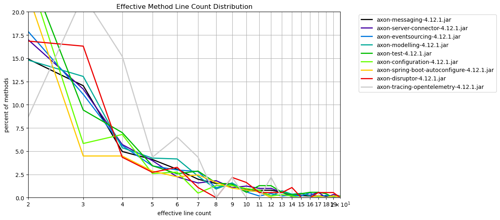
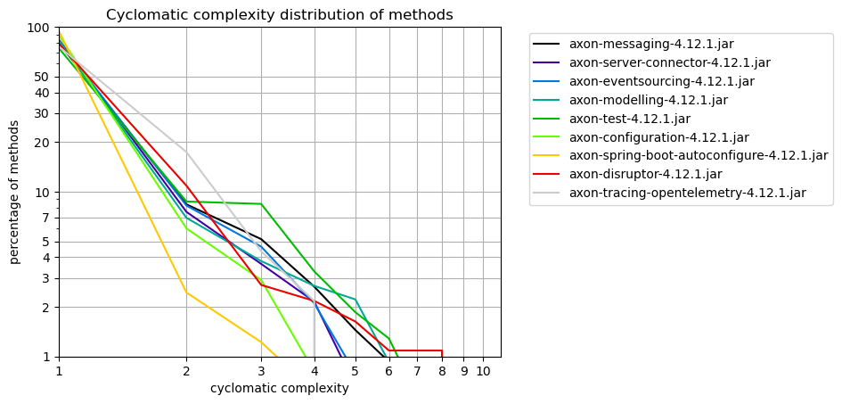

# Method Metrics
   

### References
- [jqassistant](https://jqassistant.org)
- [Neo4j Python Driver](https://neo4j.com/docs/api/python-driver/current)

## Effective Method Line Count

### Table 1a - Effective method line count distribution

This table shows the distribution of the effective method line count per artifact.
For each artifact the number of methods with effective line count = 1,2,3,... is shown to get an overview of how line counts are distributed over methods.

Only the 15 artifacts with the highest method count and their effective method line count distribution (limited by 40)is shown here. The whole table can be found in the CSV report `Effective_Method_Line_Count_Distribution`.

Have a look below to find out which packages and methods have the highest effective lines of code.

<table border="1" class="dataframe">
  <thead>
    <tr style="text-align: right;">
      <th>artifactName</th>
      <th>axon-messaging-4.12.1.jar</th>
      <th>axon-server-connector-4.12.1.jar</th>
      <th>axon-eventsourcing-4.12.1.jar</th>
      <th>axon-modelling-4.12.1.jar</th>
      <th>axon-test-4.12.1.jar</th>
      <th>axon-configuration-4.12.1.jar</th>
      <th>axon-spring-boot-autoconfigure-4.12.1.jar</th>
      <th>axon-disruptor-4.12.1.jar</th>
      <th>axon-tracing-opentelemetry-4.12.1.jar</th>
    </tr>
    <tr>
      <th>effectiveLineCount</th>
      <th></th>
      <th></th>
      <th></th>
      <th></th>
      <th></th>
      <th></th>
      <th></th>
      <th></th>
      <th></th>
    </tr>
  </thead>
  <tbody>
    <tr>
      <th>1</th>
      <td>2959</td>
      <td>585</td>
      <td>573</td>
      <td>532</td>
      <td>279</td>
      <td>316</td>
      <td>277</td>
      <td>84</td>
      <td>16</td>
    </tr>
    <tr>
      <th>2</th>
      <td>865</td>
      <td>205</td>
      <td>204</td>
      <td>160</td>
      <td>172</td>
      <td>149</td>
      <td>107</td>
      <td>31</td>
      <td>4</td>
    </tr>
    <tr>
      <th>3</th>
      <td>699</td>
      <td>141</td>
      <td>127</td>
      <td>141</td>
      <td>66</td>
      <td>36</td>
      <td>22</td>
      <td>30</td>
      <td>10</td>
    </tr>
    <tr>
      <th>4</th>
      <td>288</td>
      <td>69</td>
      <td>64</td>
      <td>58</td>
      <td>49</td>
      <td>42</td>
      <td>22</td>
      <td>8</td>
      <td>7</td>
    </tr>
    <tr>
      <th>5</th>
      <td>238</td>
      <td>48</td>
      <td>39</td>
      <td>46</td>
      <td>24</td>
      <td>16</td>
      <td>14</td>
      <td>5</td>
      <td>2</td>
    </tr>
    <tr>
      <th>6</th>
      <td>177</td>
      <td>27</td>
      <td>34</td>
      <td>45</td>
      <td>18</td>
      <td>17</td>
      <td>11</td>
      <td>6</td>
      <td>3</td>
    </tr>
    <tr>
      <th>7</th>
      <td>115</td>
      <td>19</td>
      <td>32</td>
      <td>25</td>
      <td>20</td>
      <td>3</td>
      <td>12</td>
      <td>2</td>
      <td>2</td>
    </tr>
    <tr>
      <th>8</th>
      <td>88</td>
      <td>22</td>
      <td>12</td>
      <td>10</td>
      <td>11</td>
      <td>8</td>
      <td>8</td>
      <td>0</td>
      <td>0</td>
    </tr>
    <tr>
      <th>9</th>
      <td>86</td>
      <td>13</td>
      <td>18</td>
      <td>17</td>
      <td>10</td>
      <td>8</td>
      <td>5</td>
      <td>4</td>
      <td>1</td>
    </tr>
    <tr>
      <th>10</th>
      <td>50</td>
      <td>15</td>
      <td>7</td>
      <td>8</td>
      <td>4</td>
      <td>6</td>
      <td>4</td>
      <td>3</td>
      <td>0</td>
    </tr>
    <tr>
      <th>11</th>
      <td>46</td>
      <td>12</td>
      <td>2</td>
      <td>7</td>
      <td>9</td>
      <td>5</td>
      <td>3</td>
      <td>1</td>
      <td>0</td>
    </tr>
    <tr>
      <th>12</th>
      <td>46</td>
      <td>12</td>
      <td>5</td>
      <td>2</td>
      <td>9</td>
      <td>1</td>
      <td>0</td>
      <td>1</td>
      <td>1</td>
    </tr>
    <tr>
      <th>13</th>
      <td>34</td>
      <td>7</td>
      <td>2</td>
      <td>8</td>
      <td>4</td>
      <td>2</td>
      <td>0</td>
      <td>1</td>
      <td>0</td>
    </tr>
    <tr>
      <th>14</th>
      <td>15</td>
      <td>1</td>
      <td>3</td>
      <td>4</td>
      <td>2</td>
      <td>1</td>
      <td>0</td>
      <td>2</td>
      <td>0</td>
    </tr>
    <tr>
      <th>15</th>
      <td>13</td>
      <td>5</td>
      <td>2</td>
      <td>5</td>
      <td>3</td>
      <td>0</td>
      <td>0</td>
      <td>0</td>
      <td>0</td>
    </tr>
    <tr>
      <th>16</th>
      <td>10</td>
      <td>3</td>
      <td>6</td>
      <td>2</td>
      <td>4</td>
      <td>0</td>
      <td>0</td>
      <td>0</td>
      <td>0</td>
    </tr>
    <tr>
      <th>17</th>
      <td>11</td>
      <td>7</td>
      <td>0</td>
      <td>1</td>
      <td>4</td>
      <td>1</td>
      <td>1</td>
      <td>1</td>
      <td>0</td>
    </tr>
    <tr>
      <th>18</th>
      <td>10</td>
      <td>0</td>
      <td>3</td>
      <td>0</td>
      <td>3</td>
      <td>0</td>
      <td>0</td>
      <td>1</td>
      <td>0</td>
    </tr>
    <tr>
      <th>19</th>
      <td>8</td>
      <td>4</td>
      <td>0</td>
      <td>1</td>
      <td>0</td>
      <td>1</td>
      <td>1</td>
      <td>1</td>
      <td>0</td>
    </tr>
    <tr>
      <th>20</th>
      <td>5</td>
      <td>2</td>
      <td>2</td>
      <td>2</td>
      <td>1</td>
      <td>1</td>
      <td>0</td>
      <td>0</td>
      <td>0</td>
    </tr>
    <tr>
      <th>21</th>
      <td>7</td>
      <td>1</td>
      <td>2</td>
      <td>2</td>
      <td>1</td>
      <td>1</td>
      <td>0</td>
      <td>0</td>
      <td>0</td>
    </tr>
    <tr>
      <th>22</th>
      <td>2</td>
      <td>0</td>
      <td>1</td>
      <td>2</td>
      <td>1</td>
      <td>0</td>
      <td>2</td>
      <td>1</td>
      <td>0</td>
    </tr>
    <tr>
      <th>23</th>
      <td>4</td>
      <td>1</td>
      <td>2</td>
      <td>0</td>
      <td>1</td>
      <td>1</td>
      <td>1</td>
      <td>0</td>
      <td>0</td>
    </tr>
    <tr>
      <th>24</th>
      <td>5</td>
      <td>3</td>
      <td>1</td>
      <td>1</td>
      <td>1</td>
      <td>0</td>
      <td>0</td>
      <td>1</td>
      <td>0</td>
    </tr>
    <tr>
      <th>25</th>
      <td>1</td>
      <td>0</td>
      <td>1</td>
      <td>0</td>
      <td>0</td>
      <td>0</td>
      <td>0</td>
      <td>0</td>
      <td>0</td>
    </tr>
    <tr>
      <th>26</th>
      <td>4</td>
      <td>0</td>
      <td>0</td>
      <td>1</td>
      <td>1</td>
      <td>1</td>
      <td>0</td>
      <td>0</td>
      <td>0</td>
    </tr>
    <tr>
      <th>27</th>
      <td>0</td>
      <td>1</td>
      <td>0</td>
      <td>0</td>
      <td>0</td>
      <td>0</td>
      <td>0</td>
      <td>0</td>
      <td>0</td>
    </tr>
    <tr>
      <th>28</th>
      <td>2</td>
      <td>2</td>
      <td>0</td>
      <td>0</td>
      <td>0</td>
      <td>0</td>
      <td>0</td>
      <td>0</td>
      <td>0</td>
    </tr>
    <tr>
      <th>29</th>
      <td>0</td>
      <td>0</td>
      <td>0</td>
      <td>0</td>
      <td>1</td>
      <td>0</td>
      <td>0</td>
      <td>0</td>
      <td>0</td>
    </tr>
    <tr>
      <th>30</th>
      <td>1</td>
      <td>0</td>
      <td>0</td>
      <td>0</td>
      <td>0</td>
      <td>0</td>
      <td>0</td>
      <td>0</td>
      <td>0</td>
    </tr>
    <tr>
      <th>31</th>
      <td>1</td>
      <td>0</td>
      <td>0</td>
      <td>0</td>
      <td>1</td>
      <td>0</td>
      <td>0</td>
      <td>0</td>
      <td>0</td>
    </tr>
    <tr>
      <th>32</th>
      <td>1</td>
      <td>0</td>
      <td>0</td>
      <td>0</td>
      <td>0</td>
      <td>0</td>
      <td>0</td>
      <td>1</td>
      <td>0</td>
    </tr>
    <tr>
      <th>33</th>
      <td>1</td>
      <td>0</td>
      <td>0</td>
      <td>0</td>
      <td>0</td>
      <td>0</td>
      <td>0</td>
      <td>0</td>
      <td>0</td>
    </tr>
    <tr>
      <th>34</th>
      <td>1</td>
      <td>0</td>
      <td>0</td>
      <td>0</td>
      <td>0</td>
      <td>0</td>
      <td>0</td>
      <td>0</td>
      <td>0</td>
    </tr>
    <tr>
      <th>36</th>
      <td>2</td>
      <td>0</td>
      <td>0</td>
      <td>0</td>
      <td>0</td>
      <td>0</td>
      <td>0</td>
      <td>0</td>
      <td>0</td>
    </tr>
    <tr>
      <th>38</th>
      <td>0</td>
      <td>1</td>
      <td>0</td>
      <td>1</td>
      <td>0</td>
      <td>0</td>
      <td>0</td>
      <td>0</td>
      <td>0</td>
    </tr>
    <tr>
      <th>39</th>
      <td>1</td>
      <td>0</td>
      <td>0</td>
      <td>0</td>
      <td>0</td>
      <td>0</td>
      <td>0</td>
      <td>0</td>
      <td>0</td>
    </tr>
    <tr>
      <th>41</th>
      <td>1</td>
      <td>0</td>
      <td>0</td>
      <td>0</td>
      <td>0</td>
      <td>0</td>
      <td>0</td>
      <td>0</td>
      <td>0</td>
    </tr>
    <tr>
      <th>42</th>
      <td>0</td>
      <td>1</td>
      <td>0</td>
      <td>0</td>
      <td>0</td>
      <td>0</td>
      <td>0</td>
      <td>0</td>
      <td>0</td>
    </tr>
    <tr>
      <th>43</th>
      <td>0</td>
      <td>0</td>
      <td>0</td>
      <td>0</td>
      <td>0</td>
      <td>1</td>
      <td>0</td>
      <td>0</td>
      <td>0</td>
    </tr>
  </tbody>
</table>

### Table 1b - Effective method line count distribution (normalized)

The table shown here only includes the first 40 rows which typically represents the most significant entries.
Have a look below to find out which packages and methods have the highest effective lines of code.

<table border="1" class="dataframe">
  <thead>
    <tr style="text-align: right;">
      <th>artifactName</th>
      <th>axon-messaging-4.12.1.jar</th>
      <th>axon-server-connector-4.12.1.jar</th>
      <th>axon-eventsourcing-4.12.1.jar</th>
      <th>axon-modelling-4.12.1.jar</th>
      <th>axon-test-4.12.1.jar</th>
      <th>axon-configuration-4.12.1.jar</th>
      <th>axon-spring-boot-autoconfigure-4.12.1.jar</th>
      <th>axon-disruptor-4.12.1.jar</th>
      <th>axon-tracing-opentelemetry-4.12.1.jar</th>
    </tr>
    <tr>
      <th>effectiveLineCount</th>
      <th></th>
      <th></th>
      <th></th>
      <th></th>
      <th></th>
      <th></th>
      <th></th>
      <th></th>
      <th></th>
    </tr>
  </thead>
  <tbody>
    <tr>
      <th>1</th>
      <td>50.999655</td>
      <td>48.467274</td>
      <td>50.175131</td>
      <td>49.213691</td>
      <td>39.857143</td>
      <td>51.132686</td>
      <td>56.415479</td>
      <td>45.652174</td>
      <td>34.782609</td>
    </tr>
    <tr>
      <th>2</th>
      <td>14.908652</td>
      <td>16.984258</td>
      <td>17.863398</td>
      <td>14.801110</td>
      <td>24.571429</td>
      <td>24.110032</td>
      <td>21.792261</td>
      <td>16.847826</td>
      <td>8.695652</td>
    </tr>
    <tr>
      <th>3</th>
      <td>12.047570</td>
      <td>11.681856</td>
      <td>11.120841</td>
      <td>13.043478</td>
      <td>9.428571</td>
      <td>5.825243</td>
      <td>4.480652</td>
      <td>16.304348</td>
      <td>21.739130</td>
    </tr>
    <tr>
      <th>4</th>
      <td>4.963806</td>
      <td>5.716653</td>
      <td>5.604203</td>
      <td>5.365402</td>
      <td>7.000000</td>
      <td>6.796117</td>
      <td>4.480652</td>
      <td>4.347826</td>
      <td>15.217391</td>
    </tr>
    <tr>
      <th>5</th>
      <td>4.102034</td>
      <td>3.976802</td>
      <td>3.415061</td>
      <td>4.255319</td>
      <td>3.428571</td>
      <td>2.588997</td>
      <td>2.851324</td>
      <td>2.717391</td>
      <td>4.347826</td>
    </tr>
    <tr>
      <th>6</th>
      <td>3.050672</td>
      <td>2.236951</td>
      <td>2.977233</td>
      <td>4.162812</td>
      <td>2.571429</td>
      <td>2.750809</td>
      <td>2.240326</td>
      <td>3.260870</td>
      <td>6.521739</td>
    </tr>
    <tr>
      <th>7</th>
      <td>1.982075</td>
      <td>1.574151</td>
      <td>2.802102</td>
      <td>2.312673</td>
      <td>2.857143</td>
      <td>0.485437</td>
      <td>2.443992</td>
      <td>1.086957</td>
      <td>4.347826</td>
    </tr>
    <tr>
      <th>8</th>
      <td>1.516718</td>
      <td>1.822701</td>
      <td>1.050788</td>
      <td>0.925069</td>
      <td>1.571429</td>
      <td>1.294498</td>
      <td>1.629328</td>
      <td>0.000000</td>
      <td>0.000000</td>
    </tr>
    <tr>
      <th>9</th>
      <td>1.482248</td>
      <td>1.077051</td>
      <td>1.576182</td>
      <td>1.572618</td>
      <td>1.428571</td>
      <td>1.294498</td>
      <td>1.018330</td>
      <td>2.173913</td>
      <td>2.173913</td>
    </tr>
    <tr>
      <th>10</th>
      <td>0.861772</td>
      <td>1.242751</td>
      <td>0.612960</td>
      <td>0.740056</td>
      <td>0.571429</td>
      <td>0.970874</td>
      <td>0.814664</td>
      <td>1.630435</td>
      <td>0.000000</td>
    </tr>
    <tr>
      <th>11</th>
      <td>0.792830</td>
      <td>0.994200</td>
      <td>0.175131</td>
      <td>0.647549</td>
      <td>1.285714</td>
      <td>0.809061</td>
      <td>0.610998</td>
      <td>0.543478</td>
      <td>0.000000</td>
    </tr>
    <tr>
      <th>12</th>
      <td>0.792830</td>
      <td>0.994200</td>
      <td>0.437828</td>
      <td>0.185014</td>
      <td>1.285714</td>
      <td>0.161812</td>
      <td>0.000000</td>
      <td>0.543478</td>
      <td>2.173913</td>
    </tr>
    <tr>
      <th>13</th>
      <td>0.586005</td>
      <td>0.579950</td>
      <td>0.175131</td>
      <td>0.740056</td>
      <td>0.571429</td>
      <td>0.323625</td>
      <td>0.000000</td>
      <td>0.543478</td>
      <td>0.000000</td>
    </tr>
    <tr>
      <th>14</th>
      <td>0.258532</td>
      <td>0.082850</td>
      <td>0.262697</td>
      <td>0.370028</td>
      <td>0.285714</td>
      <td>0.161812</td>
      <td>0.000000</td>
      <td>1.086957</td>
      <td>0.000000</td>
    </tr>
    <tr>
      <th>15</th>
      <td>0.224061</td>
      <td>0.414250</td>
      <td>0.175131</td>
      <td>0.462535</td>
      <td>0.428571</td>
      <td>0.000000</td>
      <td>0.000000</td>
      <td>0.000000</td>
      <td>0.000000</td>
    </tr>
    <tr>
      <th>16</th>
      <td>0.172354</td>
      <td>0.248550</td>
      <td>0.525394</td>
      <td>0.185014</td>
      <td>0.571429</td>
      <td>0.000000</td>
      <td>0.000000</td>
      <td>0.000000</td>
      <td>0.000000</td>
    </tr>
    <tr>
      <th>17</th>
      <td>0.189590</td>
      <td>0.579950</td>
      <td>0.000000</td>
      <td>0.092507</td>
      <td>0.571429</td>
      <td>0.161812</td>
      <td>0.203666</td>
      <td>0.543478</td>
      <td>0.000000</td>
    </tr>
    <tr>
      <th>18</th>
      <td>0.172354</td>
      <td>0.000000</td>
      <td>0.262697</td>
      <td>0.000000</td>
      <td>0.428571</td>
      <td>0.000000</td>
      <td>0.000000</td>
      <td>0.543478</td>
      <td>0.000000</td>
    </tr>
    <tr>
      <th>19</th>
      <td>0.137883</td>
      <td>0.331400</td>
      <td>0.000000</td>
      <td>0.092507</td>
      <td>0.000000</td>
      <td>0.161812</td>
      <td>0.203666</td>
      <td>0.543478</td>
      <td>0.000000</td>
    </tr>
    <tr>
      <th>20</th>
      <td>0.086177</td>
      <td>0.165700</td>
      <td>0.175131</td>
      <td>0.185014</td>
      <td>0.142857</td>
      <td>0.161812</td>
      <td>0.000000</td>
      <td>0.000000</td>
      <td>0.000000</td>
    </tr>
    <tr>
      <th>21</th>
      <td>0.120648</td>
      <td>0.082850</td>
      <td>0.175131</td>
      <td>0.185014</td>
      <td>0.142857</td>
      <td>0.161812</td>
      <td>0.000000</td>
      <td>0.000000</td>
      <td>0.000000</td>
    </tr>
    <tr>
      <th>22</th>
      <td>0.034471</td>
      <td>0.000000</td>
      <td>0.087566</td>
      <td>0.185014</td>
      <td>0.142857</td>
      <td>0.000000</td>
      <td>0.407332</td>
      <td>0.543478</td>
      <td>0.000000</td>
    </tr>
    <tr>
      <th>23</th>
      <td>0.068942</td>
      <td>0.082850</td>
      <td>0.175131</td>
      <td>0.000000</td>
      <td>0.142857</td>
      <td>0.161812</td>
      <td>0.203666</td>
      <td>0.000000</td>
      <td>0.000000</td>
    </tr>
    <tr>
      <th>24</th>
      <td>0.086177</td>
      <td>0.248550</td>
      <td>0.087566</td>
      <td>0.092507</td>
      <td>0.142857</td>
      <td>0.000000</td>
      <td>0.000000</td>
      <td>0.543478</td>
      <td>0.000000</td>
    </tr>
    <tr>
      <th>25</th>
      <td>0.017235</td>
      <td>0.000000</td>
      <td>0.087566</td>
      <td>0.000000</td>
      <td>0.000000</td>
      <td>0.000000</td>
      <td>0.000000</td>
      <td>0.000000</td>
      <td>0.000000</td>
    </tr>
    <tr>
      <th>26</th>
      <td>0.068942</td>
      <td>0.000000</td>
      <td>0.000000</td>
      <td>0.092507</td>
      <td>0.142857</td>
      <td>0.161812</td>
      <td>0.000000</td>
      <td>0.000000</td>
      <td>0.000000</td>
    </tr>
    <tr>
      <th>27</th>
      <td>0.000000</td>
      <td>0.082850</td>
      <td>0.000000</td>
      <td>0.000000</td>
      <td>0.000000</td>
      <td>0.000000</td>
      <td>0.000000</td>
      <td>0.000000</td>
      <td>0.000000</td>
    </tr>
    <tr>
      <th>28</th>
      <td>0.034471</td>
      <td>0.165700</td>
      <td>0.000000</td>
      <td>0.000000</td>
      <td>0.000000</td>
      <td>0.000000</td>
      <td>0.000000</td>
      <td>0.000000</td>
      <td>0.000000</td>
    </tr>
    <tr>
      <th>29</th>
      <td>0.000000</td>
      <td>0.000000</td>
      <td>0.000000</td>
      <td>0.000000</td>
      <td>0.142857</td>
      <td>0.000000</td>
      <td>0.000000</td>
      <td>0.000000</td>
      <td>0.000000</td>
    </tr>
    <tr>
      <th>30</th>
      <td>0.017235</td>
      <td>0.000000</td>
      <td>0.000000</td>
      <td>0.000000</td>
      <td>0.000000</td>
      <td>0.000000</td>
      <td>0.000000</td>
      <td>0.000000</td>
      <td>0.000000</td>
    </tr>
    <tr>
      <th>31</th>
      <td>0.017235</td>
      <td>0.000000</td>
      <td>0.000000</td>
      <td>0.000000</td>
      <td>0.142857</td>
      <td>0.000000</td>
      <td>0.000000</td>
      <td>0.000000</td>
      <td>0.000000</td>
    </tr>
    <tr>
      <th>32</th>
      <td>0.017235</td>
      <td>0.000000</td>
      <td>0.000000</td>
      <td>0.000000</td>
      <td>0.000000</td>
      <td>0.000000</td>
      <td>0.000000</td>
      <td>0.543478</td>
      <td>0.000000</td>
    </tr>
    <tr>
      <th>33</th>
      <td>0.017235</td>
      <td>0.000000</td>
      <td>0.000000</td>
      <td>0.000000</td>
      <td>0.000000</td>
      <td>0.000000</td>
      <td>0.000000</td>
      <td>0.000000</td>
      <td>0.000000</td>
    </tr>
    <tr>
      <th>34</th>
      <td>0.017235</td>
      <td>0.000000</td>
      <td>0.000000</td>
      <td>0.000000</td>
      <td>0.000000</td>
      <td>0.000000</td>
      <td>0.000000</td>
      <td>0.000000</td>
      <td>0.000000</td>
    </tr>
    <tr>
      <th>36</th>
      <td>0.034471</td>
      <td>0.000000</td>
      <td>0.000000</td>
      <td>0.000000</td>
      <td>0.000000</td>
      <td>0.000000</td>
      <td>0.000000</td>
      <td>0.000000</td>
      <td>0.000000</td>
    </tr>
    <tr>
      <th>38</th>
      <td>0.000000</td>
      <td>0.082850</td>
      <td>0.000000</td>
      <td>0.092507</td>
      <td>0.000000</td>
      <td>0.000000</td>
      <td>0.000000</td>
      <td>0.000000</td>
      <td>0.000000</td>
    </tr>
    <tr>
      <th>39</th>
      <td>0.017235</td>
      <td>0.000000</td>
      <td>0.000000</td>
      <td>0.000000</td>
      <td>0.000000</td>
      <td>0.000000</td>
      <td>0.000000</td>
      <td>0.000000</td>
      <td>0.000000</td>
    </tr>
    <tr>
      <th>41</th>
      <td>0.017235</td>
      <td>0.000000</td>
      <td>0.000000</td>
      <td>0.000000</td>
      <td>0.000000</td>
      <td>0.000000</td>
      <td>0.000000</td>
      <td>0.000000</td>
      <td>0.000000</td>
    </tr>
    <tr>
      <th>42</th>
      <td>0.000000</td>
      <td>0.082850</td>
      <td>0.000000</td>
      <td>0.000000</td>
      <td>0.000000</td>
      <td>0.000000</td>
      <td>0.000000</td>
      <td>0.000000</td>
      <td>0.000000</td>
    </tr>
    <tr>
      <th>43</th>
      <td>0.000000</td>
      <td>0.000000</td>
      <td>0.000000</td>
      <td>0.000000</td>
      <td>0.000000</td>
      <td>0.161812</td>
      <td>0.000000</td>
      <td>0.000000</td>
      <td>0.000000</td>
    </tr>
  </tbody>
</table>

### Table 1b Chart 1 - Effective method line count distribution (normalized)

    <Figure size 640x480 with 0 Axes>

    

    

### Table 1c - Top 30 packages with highest effective line counts

The following table shows the top 30 packages with the highest effective lines of code. The whole table can be found in the CSV report `Effective_lines_of_method_code_per_package`.

<table border="1" class="dataframe">
  <thead>
    <tr style="text-align: right;">
      <th></th>
      <th>artifactName</th>
      <th>fullPackageName</th>
      <th>linesInPackage</th>
      <th>methodCount</th>
      <th>maxLinesMethod</th>
      <th>maxLinesMethodName</th>
    </tr>
  </thead>
  <tbody>
    <tr>
      <th>0</th>
      <td>axon-messaging-4.12.1</td>
      <td>org.axonframework.eventhandling</td>
      <td>2331</td>
      <td>838</td>
      <td>64</td>
      <td>processBatch</td>
    </tr>
    <tr>
      <th>1</th>
      <td>axon-configuration-4.12.1</td>
      <td>org.axonframework.config</td>
      <td>1615</td>
      <td>618</td>
      <td>50</td>
      <td>&lt;init&gt;</td>
    </tr>
    <tr>
      <th>2</th>
      <td>axon-messaging-4.12.1</td>
      <td>org.axonframework.eventhandling.pooled</td>
      <td>1083</td>
      <td>350</td>
      <td>81</td>
      <td>run</td>
    </tr>
    <tr>
      <th>3</th>
      <td>axon-test-4.12.1</td>
      <td>org.axonframework.test.aggregate</td>
      <td>956</td>
      <td>251</td>
      <td>45</td>
      <td>appendEventOverview</td>
    </tr>
    <tr>
      <th>4</th>
      <td>axon-messaging-4.12.1</td>
      <td>org.axonframework.queryhandling</td>
      <td>953</td>
      <td>388</td>
      <td>36</td>
      <td>doQuery</td>
    </tr>
    <tr>
      <th>5</th>
      <td>axon-server-connector-4.12.1</td>
      <td>org.axonframework.axonserver.connector.event.axon</td>
      <td>885</td>
      <td>283</td>
      <td>28</td>
      <td>readMessages</td>
    </tr>
    <tr>
      <th>6</th>
      <td>axon-messaging-4.12.1</td>
      <td>org.axonframework.eventhandling.deadletter.jdbc</td>
      <td>848</td>
      <td>249</td>
      <td>31</td>
      <td>convertToLetter</td>
    </tr>
    <tr>
      <th>7</th>
      <td>axon-modelling-4.12.1</td>
      <td>org.axonframework.modelling.command</td>
      <td>848</td>
      <td>336</td>
      <td>21</td>
      <td>lambda$initializeHandler$8</td>
    </tr>
    <tr>
      <th>8</th>
      <td>axon-server-connector-4.12.1</td>
      <td>org.axonframework.axonserver.connector</td>
      <td>836</td>
      <td>335</td>
      <td>42</td>
      <td>build</td>
    </tr>
    <tr>
      <th>9</th>
      <td>axon-server-connector-4.12.1</td>
      <td>org.axonframework.axonserver.connector.query</td>
      <td>749</td>
      <td>219</td>
      <td>27</td>
      <td>query</td>
    </tr>
    <tr>
      <th>10</th>
      <td>axon-eventsourcing-4.12.1</td>
      <td>org.axonframework.eventsourcing.eventstore</td>
      <td>712</td>
      <td>264</td>
      <td>21</td>
      <td>peekPrivateStream</td>
    </tr>
    <tr>
      <th>11</th>
      <td>axon-spring-boot-autoconfigure-4.12.1</td>
      <td>org.axonframework.springboot.autoconfig</td>
      <td>694</td>
      <td>249</td>
      <td>48</td>
      <td>buildSerializer</td>
    </tr>
    <tr>
      <th>12</th>
      <td>axon-messaging-4.12.1</td>
      <td>org.axonframework.messaging.annotation</td>
      <td>668</td>
      <td>238</td>
      <td>23</td>
      <td>&lt;init&gt;</td>
    </tr>
    <tr>
      <th>13</th>
      <td>axon-modelling-4.12.1</td>
      <td>org.axonframework.modelling.command.inspection</td>
      <td>627</td>
      <td>215</td>
      <td>26</td>
      <td>inspectFieldsAndMethods</td>
    </tr>
    <tr>
      <th>14</th>
      <td>axon-eventsourcing-4.12.1</td>
      <td>org.axonframework.eventsourcing</td>
      <td>622</td>
      <td>251</td>
      <td>20</td>
      <td>doScheduleSnapshot</td>
    </tr>
    <tr>
      <th>15</th>
      <td>axon-disruptor-4.12.1</td>
      <td>org.axonframework.disruptor.commandhandling</td>
      <td>605</td>
      <td>184</td>
      <td>32</td>
      <td>&lt;init&gt;</td>
    </tr>
    <tr>
      <th>16</th>
      <td>axon-eventsourcing-4.12.1</td>
      <td>org.axonframework.eventsourcing.eventstore.leg...</td>
      <td>573</td>
      <td>187</td>
      <td>25</td>
      <td>fetchTrackedEvents</td>
    </tr>
    <tr>
      <th>17</th>
      <td>axon-eventsourcing-4.12.1</td>
      <td>org.axonframework.eventsourcing.eventstore.jdbc</td>
      <td>568</td>
      <td>236</td>
      <td>24</td>
      <td>&lt;init&gt;</td>
    </tr>
    <tr>
      <th>18</th>
      <td>axon-messaging-4.12.1</td>
      <td>org.axonframework.serialization</td>
      <td>548</td>
      <td>184</td>
      <td>24</td>
      <td>&lt;init&gt;</td>
    </tr>
    <tr>
      <th>19</th>
      <td>axon-messaging-4.12.1</td>
      <td>org.axonframework.eventhandling.deadletter.jpa</td>
      <td>525</td>
      <td>132</td>
      <td>28</td>
      <td>equals</td>
    </tr>
    <tr>
      <th>20</th>
      <td>axon-messaging-4.12.1</td>
      <td>org.axonframework.common</td>
      <td>498</td>
      <td>144</td>
      <td>24</td>
      <td>getExactDirectSuperTypesOfParameterizedTypeOrC...</td>
    </tr>
    <tr>
      <th>21</th>
      <td>axon-test-4.12.1</td>
      <td>org.axonframework.test.saga</td>
      <td>495</td>
      <td>169</td>
      <td>29</td>
      <td>&lt;init&gt;</td>
    </tr>
    <tr>
      <th>22</th>
      <td>axon-modelling-4.12.1</td>
      <td>org.axonframework.modelling.saga</td>
      <td>490</td>
      <td>194</td>
      <td>22</td>
      <td>handle</td>
    </tr>
    <tr>
      <th>23</th>
      <td>axon-messaging-4.12.1</td>
      <td>org.axonframework.commandhandling.gateway</td>
      <td>488</td>
      <td>174</td>
      <td>50</td>
      <td>createGateway</td>
    </tr>
    <tr>
      <th>24</th>
      <td>axon-messaging-4.12.1</td>
      <td>org.axonframework.commandhandling.distributed</td>
      <td>477</td>
      <td>175</td>
      <td>23</td>
      <td>dispatch</td>
    </tr>
    <tr>
      <th>25</th>
      <td>axon-messaging-4.12.1</td>
      <td>org.axonframework.eventhandling.tokenstore.jdbc</td>
      <td>430</td>
      <td>130</td>
      <td>26</td>
      <td>updateToken</td>
    </tr>
    <tr>
      <th>26</th>
      <td>axon-messaging-4.12.1</td>
      <td>org.axonframework.eventhandling.deadletter.leg...</td>
      <td>401</td>
      <td>97</td>
      <td>21</td>
      <td>convert</td>
    </tr>
    <tr>
      <th>27</th>
      <td>axon-messaging-4.12.1</td>
      <td>org.axonframework.commandhandling</td>
      <td>377</td>
      <td>169</td>
      <td>13</td>
      <td>&lt;init&gt;</td>
    </tr>
    <tr>
      <th>28</th>
      <td>axon-modelling-4.12.1</td>
      <td>org.axonframework.modelling.saga.repository.jdbc</td>
      <td>374</td>
      <td>84</td>
      <td>38</td>
      <td>updateSaga</td>
    </tr>
    <tr>
      <th>29</th>
      <td>axon-messaging-4.12.1</td>
      <td>org.axonframework.messaging.unitofwork</td>
      <td>363</td>
      <td>129</td>
      <td>32</td>
      <td>executeWithResult</td>
    </tr>
  </tbody>
</table>

### Table 1d - Top 30 methods with the highest effective line count

The following table shows the top 30 methods with the highest effective lines of code. The whole table can be found in the CSV report `Effective_lines_of_method_code_per_package`.

<table border="1" class="dataframe">
  <thead>
    <tr style="text-align: right;">
      <th></th>
      <th>index</th>
      <th>artifactName</th>
      <th>fullPackageName</th>
      <th>maxLinesMethodType</th>
      <th>maxLinesMethodName</th>
      <th>maxLinesMethod</th>
      <th>linesInPackage</th>
    </tr>
  </thead>
  <tbody>
    <tr>
      <th>0</th>
      <td>2</td>
      <td>axon-messaging-4.12.1</td>
      <td>org.axonframework.eventhandling.pooled</td>
      <td>Coordinator$CoordinationTask</td>
      <td>run</td>
      <td>81</td>
      <td>1083</td>
    </tr>
    <tr>
      <th>1</th>
      <td>0</td>
      <td>axon-messaging-4.12.1</td>
      <td>org.axonframework.eventhandling</td>
      <td>TrackingEventProcessor</td>
      <td>processBatch</td>
      <td>64</td>
      <td>2331</td>
    </tr>
    <tr>
      <th>2</th>
      <td>23</td>
      <td>axon-messaging-4.12.1</td>
      <td>org.axonframework.commandhandling.gateway</td>
      <td>CommandGatewayFactory</td>
      <td>createGateway</td>
      <td>50</td>
      <td>488</td>
    </tr>
    <tr>
      <th>3</th>
      <td>1</td>
      <td>axon-configuration-4.12.1</td>
      <td>org.axonframework.config</td>
      <td>DefaultConfigurer</td>
      <td>&lt;init&gt;</td>
      <td>50</td>
      <td>1615</td>
    </tr>
    <tr>
      <th>4</th>
      <td>11</td>
      <td>axon-spring-boot-autoconfigure-4.12.1</td>
      <td>org.axonframework.springboot.autoconfig</td>
      <td>AxonAutoConfiguration</td>
      <td>buildSerializer</td>
      <td>48</td>
      <td>694</td>
    </tr>
    <tr>
      <th>5</th>
      <td>3</td>
      <td>axon-test-4.12.1</td>
      <td>org.axonframework.test.aggregate</td>
      <td>Reporter</td>
      <td>appendEventOverview</td>
      <td>45</td>
      <td>956</td>
    </tr>
    <tr>
      <th>6</th>
      <td>43</td>
      <td>axon-messaging-4.12.1</td>
      <td>org.axonframework.deadline.quartz</td>
      <td>DeadlineJob</td>
      <td>execute</td>
      <td>44</td>
      <td>245</td>
    </tr>
    <tr>
      <th>7</th>
      <td>8</td>
      <td>axon-server-connector-4.12.1</td>
      <td>org.axonframework.axonserver.connector</td>
      <td>AxonServerConnectionManager$Builder</td>
      <td>build</td>
      <td>42</td>
      <td>836</td>
    </tr>
    <tr>
      <th>8</th>
      <td>61</td>
      <td>axon-messaging-4.12.1</td>
      <td>org.axonframework.updates.detection</td>
      <td>TestEnvironmentDetector</td>
      <td>isTestClass</td>
      <td>41</td>
      <td>163</td>
    </tr>
    <tr>
      <th>9</th>
      <td>56</td>
      <td>axon-messaging-4.12.1</td>
      <td>org.axonframework.updates</td>
      <td>UpdateCheckerHttpClient</td>
      <td>sendRequest</td>
      <td>39</td>
      <td>179</td>
    </tr>
    <tr>
      <th>10</th>
      <td>28</td>
      <td>axon-modelling-4.12.1</td>
      <td>org.axonframework.modelling.saga.repository.jdbc</td>
      <td>JdbcSagaStore</td>
      <td>updateSaga</td>
      <td>38</td>
      <td>374</td>
    </tr>
    <tr>
      <th>11</th>
      <td>4</td>
      <td>axon-messaging-4.12.1</td>
      <td>org.axonframework.queryhandling</td>
      <td>SimpleQueryBus</td>
      <td>doQuery</td>
      <td>36</td>
      <td>953</td>
    </tr>
    <tr>
      <th>12</th>
      <td>36</td>
      <td>axon-messaging-4.12.1</td>
      <td>org.axonframework.messaging.deadletter</td>
      <td>InMemorySequencedDeadLetterQueue</td>
      <td>process</td>
      <td>33</td>
      <td>300</td>
    </tr>
    <tr>
      <th>13</th>
      <td>29</td>
      <td>axon-messaging-4.12.1</td>
      <td>org.axonframework.messaging.unitofwork</td>
      <td>BatchingUnitOfWork</td>
      <td>executeWithResult</td>
      <td>32</td>
      <td>363</td>
    </tr>
    <tr>
      <th>14</th>
      <td>15</td>
      <td>axon-disruptor-4.12.1</td>
      <td>org.axonframework.disruptor.commandhandling</td>
      <td>DisruptorCommandBus</td>
      <td>&lt;init&gt;</td>
      <td>32</td>
      <td>605</td>
    </tr>
    <tr>
      <th>15</th>
      <td>6</td>
      <td>axon-messaging-4.12.1</td>
      <td>org.axonframework.eventhandling.deadletter.jdbc</td>
      <td>DefaultDeadLetterJdbcConverter</td>
      <td>convertToLetter</td>
      <td>31</td>
      <td>848</td>
    </tr>
    <tr>
      <th>16</th>
      <td>21</td>
      <td>axon-test-4.12.1</td>
      <td>org.axonframework.test.saga</td>
      <td>SagaTestFixture</td>
      <td>&lt;init&gt;</td>
      <td>29</td>
      <td>495</td>
    </tr>
    <tr>
      <th>17</th>
      <td>19</td>
      <td>axon-messaging-4.12.1</td>
      <td>org.axonframework.eventhandling.deadletter.jpa</td>
      <td>DeadLetterEventEntry</td>
      <td>equals</td>
      <td>28</td>
      <td>525</td>
    </tr>
    <tr>
      <th>18</th>
      <td>5</td>
      <td>axon-server-connector-4.12.1</td>
      <td>org.axonframework.axonserver.connector.event.axon</td>
      <td>PersistentStreamConnection$SegmentConnection$P...</td>
      <td>readMessages</td>
      <td>28</td>
      <td>885</td>
    </tr>
    <tr>
      <th>19</th>
      <td>9</td>
      <td>axon-server-connector-4.12.1</td>
      <td>org.axonframework.axonserver.connector.query</td>
      <td>AxonServerQueryBus</td>
      <td>query</td>
      <td>27</td>
      <td>749</td>
    </tr>
    <tr>
      <th>20</th>
      <td>13</td>
      <td>axon-modelling-4.12.1</td>
      <td>org.axonframework.modelling.command.inspection</td>
      <td>AnnotatedAggregateMetaModelFactory$AnnotatedAg...</td>
      <td>inspectFieldsAndMethods</td>
      <td>26</td>
      <td>627</td>
    </tr>
    <tr>
      <th>21</th>
      <td>25</td>
      <td>axon-messaging-4.12.1</td>
      <td>org.axonframework.eventhandling.tokenstore.jdbc</td>
      <td>JdbcTokenStore</td>
      <td>updateToken</td>
      <td>26</td>
      <td>430</td>
    </tr>
    <tr>
      <th>22</th>
      <td>16</td>
      <td>axon-eventsourcing-4.12.1</td>
      <td>org.axonframework.eventsourcing.eventstore.leg...</td>
      <td>JpaEventStorageEngine</td>
      <td>fetchTrackedEvents</td>
      <td>25</td>
      <td>573</td>
    </tr>
    <tr>
      <th>23</th>
      <td>42</td>
      <td>axon-messaging-4.12.1</td>
      <td>org.axonframework.deadline</td>
      <td>SimpleDeadlineManager$DeadlineTask</td>
      <td>run</td>
      <td>25</td>
      <td>265</td>
    </tr>
    <tr>
      <th>24</th>
      <td>17</td>
      <td>axon-eventsourcing-4.12.1</td>
      <td>org.axonframework.eventsourcing.eventstore.jdbc</td>
      <td>JdbcEventStorageEngine</td>
      <td>&lt;init&gt;</td>
      <td>24</td>
      <td>568</td>
    </tr>
    <tr>
      <th>25</th>
      <td>18</td>
      <td>axon-messaging-4.12.1</td>
      <td>org.axonframework.serialization</td>
      <td>AbstractXStreamSerializer</td>
      <td>&lt;init&gt;</td>
      <td>24</td>
      <td>548</td>
    </tr>
    <tr>
      <th>26</th>
      <td>20</td>
      <td>axon-messaging-4.12.1</td>
      <td>org.axonframework.common</td>
      <td>TypeReflectionUtils</td>
      <td>getExactDirectSuperTypesOfParameterizedTypeOrC...</td>
      <td>24</td>
      <td>498</td>
    </tr>
    <tr>
      <th>27</th>
      <td>37</td>
      <td>axon-server-connector-4.12.1</td>
      <td>org.axonframework.axonserver.connector.command</td>
      <td>AxonServerCommandBus</td>
      <td>doDispatch</td>
      <td>24</td>
      <td>300</td>
    </tr>
    <tr>
      <th>28</th>
      <td>70</td>
      <td>axon-server-connector-4.12.1</td>
      <td>org.axonframework.axonserver.connector.event.util</td>
      <td>EventCipher</td>
      <td>&lt;init&gt;</td>
      <td>24</td>
      <td>103</td>
    </tr>
    <tr>
      <th>29</th>
      <td>58</td>
      <td>axon-messaging-4.12.1</td>
      <td>org.axonframework.deadline.jobrunr</td>
      <td>JobRunrDeadlineManager</td>
      <td>execute</td>
      <td>23</td>
      <td>171</td>
    </tr>
  </tbody>
</table>

## Cyclomatic Complexity

### Table 2a - Cyclomatic method complexity distribution

This table shows the distribution of the cyclomatic complexity of methods per artifact.
For each artifact the number of methods with the cyclomatic complexity = 1,2,3,... is shown to get an overview of how cyclomatic complexity is distributed over methods.

Only the 15 artifacts with the highest method count sum and their cyclomatic method complexity distribution (limited by 40) is shown here. The whole table can be found in the CSV report `Cyclomatic_Method_Complexity_Distribution`.

Have a look below to find out which packages and methods have the highest effective lines of code.

<table border="1" class="dataframe">
  <thead>
    <tr style="text-align: right;">
      <th>artifactName</th>
      <th>axon-messaging-4.12.1.jar</th>
      <th>axon-server-connector-4.12.1.jar</th>
      <th>axon-eventsourcing-4.12.1.jar</th>
      <th>axon-modelling-4.12.1.jar</th>
      <th>axon-test-4.12.1.jar</th>
      <th>axon-configuration-4.12.1.jar</th>
      <th>axon-spring-boot-autoconfigure-4.12.1.jar</th>
      <th>axon-disruptor-4.12.1.jar</th>
      <th>axon-tracing-opentelemetry-4.12.1.jar</th>
    </tr>
    <tr>
      <th>cyclomaticComplexity</th>
      <th></th>
      <th></th>
      <th></th>
      <th></th>
      <th></th>
      <th></th>
      <th></th>
      <th></th>
      <th></th>
    </tr>
  </thead>
  <tbody>
    <tr>
      <th>1</th>
      <td>4648</td>
      <td>1012</td>
      <td>943</td>
      <td>896</td>
      <td>521</td>
      <td>553</td>
      <td>466</td>
      <td>146</td>
      <td>35</td>
    </tr>
    <tr>
      <th>2</th>
      <td>486</td>
      <td>91</td>
      <td>94</td>
      <td>75</td>
      <td>61</td>
      <td>37</td>
      <td>12</td>
      <td>20</td>
      <td>8</td>
    </tr>
    <tr>
      <th>3</th>
      <td>299</td>
      <td>44</td>
      <td>53</td>
      <td>41</td>
      <td>59</td>
      <td>18</td>
      <td>6</td>
      <td>5</td>
      <td>2</td>
    </tr>
    <tr>
      <th>4</th>
      <td>154</td>
      <td>26</td>
      <td>24</td>
      <td>29</td>
      <td>23</td>
      <td>5</td>
      <td>3</td>
      <td>4</td>
      <td>1</td>
    </tr>
    <tr>
      <th>5</th>
      <td>84</td>
      <td>8</td>
      <td>9</td>
      <td>24</td>
      <td>13</td>
      <td>3</td>
      <td>1</td>
      <td>3</td>
      <td>0</td>
    </tr>
    <tr>
      <th>6</th>
      <td>54</td>
      <td>5</td>
      <td>4</td>
      <td>10</td>
      <td>9</td>
      <td>0</td>
      <td>1</td>
      <td>2</td>
      <td>0</td>
    </tr>
    <tr>
      <th>7</th>
      <td>23</td>
      <td>7</td>
      <td>7</td>
      <td>2</td>
      <td>4</td>
      <td>2</td>
      <td>1</td>
      <td>2</td>
      <td>0</td>
    </tr>
    <tr>
      <th>8</th>
      <td>14</td>
      <td>6</td>
      <td>7</td>
      <td>1</td>
      <td>2</td>
      <td>0</td>
      <td>0</td>
      <td>2</td>
      <td>0</td>
    </tr>
    <tr>
      <th>9</th>
      <td>9</td>
      <td>4</td>
      <td>0</td>
      <td>2</td>
      <td>2</td>
      <td>0</td>
      <td>0</td>
      <td>0</td>
      <td>0</td>
    </tr>
    <tr>
      <th>10</th>
      <td>6</td>
      <td>2</td>
      <td>0</td>
      <td>0</td>
      <td>1</td>
      <td>0</td>
      <td>0</td>
      <td>0</td>
      <td>0</td>
    </tr>
    <tr>
      <th>11</th>
      <td>10</td>
      <td>0</td>
      <td>0</td>
      <td>0</td>
      <td>2</td>
      <td>0</td>
      <td>0</td>
      <td>0</td>
      <td>0</td>
    </tr>
    <tr>
      <th>12</th>
      <td>5</td>
      <td>1</td>
      <td>0</td>
      <td>0</td>
      <td>2</td>
      <td>0</td>
      <td>0</td>
      <td>0</td>
      <td>0</td>
    </tr>
    <tr>
      <th>13</th>
      <td>2</td>
      <td>0</td>
      <td>1</td>
      <td>0</td>
      <td>1</td>
      <td>0</td>
      <td>0</td>
      <td>0</td>
      <td>0</td>
    </tr>
    <tr>
      <th>14</th>
      <td>1</td>
      <td>0</td>
      <td>0</td>
      <td>0</td>
      <td>0</td>
      <td>0</td>
      <td>1</td>
      <td>0</td>
      <td>0</td>
    </tr>
    <tr>
      <th>15</th>
      <td>1</td>
      <td>1</td>
      <td>0</td>
      <td>0</td>
      <td>0</td>
      <td>0</td>
      <td>0</td>
      <td>0</td>
      <td>0</td>
    </tr>
    <tr>
      <th>16</th>
      <td>0</td>
      <td>0</td>
      <td>0</td>
      <td>1</td>
      <td>0</td>
      <td>0</td>
      <td>0</td>
      <td>0</td>
      <td>0</td>
    </tr>
    <tr>
      <th>17</th>
      <td>2</td>
      <td>0</td>
      <td>0</td>
      <td>0</td>
      <td>0</td>
      <td>0</td>
      <td>0</td>
      <td>0</td>
      <td>0</td>
    </tr>
    <tr>
      <th>21</th>
      <td>1</td>
      <td>0</td>
      <td>0</td>
      <td>0</td>
      <td>0</td>
      <td>0</td>
      <td>0</td>
      <td>0</td>
      <td>0</td>
    </tr>
    <tr>
      <th>23</th>
      <td>1</td>
      <td>0</td>
      <td>0</td>
      <td>0</td>
      <td>0</td>
      <td>0</td>
      <td>0</td>
      <td>0</td>
      <td>0</td>
    </tr>
    <tr>
      <th>40</th>
      <td>1</td>
      <td>0</td>
      <td>0</td>
      <td>0</td>
      <td>0</td>
      <td>0</td>
      <td>0</td>
      <td>0</td>
      <td>0</td>
    </tr>
    <tr>
      <th>41</th>
      <td>1</td>
      <td>0</td>
      <td>0</td>
      <td>0</td>
      <td>0</td>
      <td>0</td>
      <td>0</td>
      <td>0</td>
      <td>0</td>
    </tr>
  </tbody>
</table>

### Table 2b - Cyclomatic method complexity distribution (normalized)

The table shown here only includes the first 40 rows which typically represents the most significant entries.
Have a look below to find out which packages and methods have the highest effective lines of code.

<table border="1" class="dataframe">
  <thead>
    <tr style="text-align: right;">
      <th>artifactName</th>
      <th>axon-messaging-4.12.1.jar</th>
      <th>axon-server-connector-4.12.1.jar</th>
      <th>axon-eventsourcing-4.12.1.jar</th>
      <th>axon-modelling-4.12.1.jar</th>
      <th>axon-test-4.12.1.jar</th>
      <th>axon-configuration-4.12.1.jar</th>
      <th>axon-spring-boot-autoconfigure-4.12.1.jar</th>
      <th>axon-disruptor-4.12.1.jar</th>
      <th>axon-tracing-opentelemetry-4.12.1.jar</th>
    </tr>
    <tr>
      <th>cyclomaticComplexity</th>
      <th></th>
      <th></th>
      <th></th>
      <th></th>
      <th></th>
      <th></th>
      <th></th>
      <th></th>
      <th></th>
    </tr>
  </thead>
  <tbody>
    <tr>
      <th>1</th>
      <td>80.110307</td>
      <td>83.844242</td>
      <td>82.574431</td>
      <td>82.886216</td>
      <td>74.428571</td>
      <td>89.482201</td>
      <td>94.908350</td>
      <td>79.347826</td>
      <td>76.086957</td>
    </tr>
    <tr>
      <th>2</th>
      <td>8.376422</td>
      <td>7.539354</td>
      <td>8.231173</td>
      <td>6.938020</td>
      <td>8.714286</td>
      <td>5.987055</td>
      <td>2.443992</td>
      <td>10.869565</td>
      <td>17.391304</td>
    </tr>
    <tr>
      <th>3</th>
      <td>5.153395</td>
      <td>3.645402</td>
      <td>4.640981</td>
      <td>3.792784</td>
      <td>8.428571</td>
      <td>2.912621</td>
      <td>1.221996</td>
      <td>2.717391</td>
      <td>4.347826</td>
    </tr>
    <tr>
      <th>4</th>
      <td>2.654257</td>
      <td>2.154101</td>
      <td>2.101576</td>
      <td>2.682701</td>
      <td>3.285714</td>
      <td>0.809061</td>
      <td>0.610998</td>
      <td>2.173913</td>
      <td>2.173913</td>
    </tr>
    <tr>
      <th>5</th>
      <td>1.447777</td>
      <td>0.662800</td>
      <td>0.788091</td>
      <td>2.220167</td>
      <td>1.857143</td>
      <td>0.485437</td>
      <td>0.203666</td>
      <td>1.630435</td>
      <td>0.000000</td>
    </tr>
    <tr>
      <th>6</th>
      <td>0.930714</td>
      <td>0.414250</td>
      <td>0.350263</td>
      <td>0.925069</td>
      <td>1.285714</td>
      <td>0.000000</td>
      <td>0.203666</td>
      <td>1.086957</td>
      <td>0.000000</td>
    </tr>
    <tr>
      <th>7</th>
      <td>0.396415</td>
      <td>0.579950</td>
      <td>0.612960</td>
      <td>0.185014</td>
      <td>0.571429</td>
      <td>0.323625</td>
      <td>0.203666</td>
      <td>1.086957</td>
      <td>0.000000</td>
    </tr>
    <tr>
      <th>8</th>
      <td>0.241296</td>
      <td>0.497100</td>
      <td>0.612960</td>
      <td>0.092507</td>
      <td>0.285714</td>
      <td>0.000000</td>
      <td>0.000000</td>
      <td>1.086957</td>
      <td>0.000000</td>
    </tr>
    <tr>
      <th>9</th>
      <td>0.155119</td>
      <td>0.331400</td>
      <td>0.000000</td>
      <td>0.185014</td>
      <td>0.285714</td>
      <td>0.000000</td>
      <td>0.000000</td>
      <td>0.000000</td>
      <td>0.000000</td>
    </tr>
    <tr>
      <th>10</th>
      <td>0.103413</td>
      <td>0.165700</td>
      <td>0.000000</td>
      <td>0.000000</td>
      <td>0.142857</td>
      <td>0.000000</td>
      <td>0.000000</td>
      <td>0.000000</td>
      <td>0.000000</td>
    </tr>
    <tr>
      <th>11</th>
      <td>0.172354</td>
      <td>0.000000</td>
      <td>0.000000</td>
      <td>0.000000</td>
      <td>0.285714</td>
      <td>0.000000</td>
      <td>0.000000</td>
      <td>0.000000</td>
      <td>0.000000</td>
    </tr>
    <tr>
      <th>12</th>
      <td>0.086177</td>
      <td>0.082850</td>
      <td>0.000000</td>
      <td>0.000000</td>
      <td>0.285714</td>
      <td>0.000000</td>
      <td>0.000000</td>
      <td>0.000000</td>
      <td>0.000000</td>
    </tr>
    <tr>
      <th>13</th>
      <td>0.034471</td>
      <td>0.000000</td>
      <td>0.087566</td>
      <td>0.000000</td>
      <td>0.142857</td>
      <td>0.000000</td>
      <td>0.000000</td>
      <td>0.000000</td>
      <td>0.000000</td>
    </tr>
    <tr>
      <th>14</th>
      <td>0.017235</td>
      <td>0.000000</td>
      <td>0.000000</td>
      <td>0.000000</td>
      <td>0.000000</td>
      <td>0.000000</td>
      <td>0.203666</td>
      <td>0.000000</td>
      <td>0.000000</td>
    </tr>
    <tr>
      <th>15</th>
      <td>0.017235</td>
      <td>0.082850</td>
      <td>0.000000</td>
      <td>0.000000</td>
      <td>0.000000</td>
      <td>0.000000</td>
      <td>0.000000</td>
      <td>0.000000</td>
      <td>0.000000</td>
    </tr>
    <tr>
      <th>16</th>
      <td>0.000000</td>
      <td>0.000000</td>
      <td>0.000000</td>
      <td>0.092507</td>
      <td>0.000000</td>
      <td>0.000000</td>
      <td>0.000000</td>
      <td>0.000000</td>
      <td>0.000000</td>
    </tr>
    <tr>
      <th>17</th>
      <td>0.034471</td>
      <td>0.000000</td>
      <td>0.000000</td>
      <td>0.000000</td>
      <td>0.000000</td>
      <td>0.000000</td>
      <td>0.000000</td>
      <td>0.000000</td>
      <td>0.000000</td>
    </tr>
    <tr>
      <th>21</th>
      <td>0.017235</td>
      <td>0.000000</td>
      <td>0.000000</td>
      <td>0.000000</td>
      <td>0.000000</td>
      <td>0.000000</td>
      <td>0.000000</td>
      <td>0.000000</td>
      <td>0.000000</td>
    </tr>
    <tr>
      <th>23</th>
      <td>0.017235</td>
      <td>0.000000</td>
      <td>0.000000</td>
      <td>0.000000</td>
      <td>0.000000</td>
      <td>0.000000</td>
      <td>0.000000</td>
      <td>0.000000</td>
      <td>0.000000</td>
    </tr>
    <tr>
      <th>40</th>
      <td>0.017235</td>
      <td>0.000000</td>
      <td>0.000000</td>
      <td>0.000000</td>
      <td>0.000000</td>
      <td>0.000000</td>
      <td>0.000000</td>
      <td>0.000000</td>
      <td>0.000000</td>
    </tr>
    <tr>
      <th>41</th>
      <td>0.017235</td>
      <td>0.000000</td>
      <td>0.000000</td>
      <td>0.000000</td>
      <td>0.000000</td>
      <td>0.000000</td>
      <td>0.000000</td>
      <td>0.000000</td>
      <td>0.000000</td>
    </tr>
  </tbody>
</table>

### Table 2b Chart 1 - Cyclomatic method complexity distribution (normalized)

    <Figure size 640x480 with 0 Axes>

    

    

### Table 2c - Top 30 packages with highest cyclomatic complexity

The following table shows the top 30 packages with the highest cyclomatic complexity. The whole table can be found in the CSV report `Effective_lines_of_method_code_per_package`.

<table border="1" class="dataframe">
  <thead>
    <tr style="text-align: right;">
      <th></th>
      <th>artifactName</th>
      <th>fullPackageName</th>
      <th>complexityInPackage</th>
      <th>methodCount</th>
      <th>maxComplexity</th>
      <th>maxComplexityMethod</th>
    </tr>
  </thead>
  <tbody>
    <tr>
      <th>0</th>
      <td>axon-messaging-4.12.1</td>
      <td>org.axonframework.eventhandling</td>
      <td>1276</td>
      <td>838</td>
      <td>21</td>
      <td>processBatch</td>
    </tr>
    <tr>
      <th>1</th>
      <td>axon-configuration-4.12.1</td>
      <td>org.axonframework.config</td>
      <td>730</td>
      <td>618</td>
      <td>7</td>
      <td>getFactoryForType</td>
    </tr>
    <tr>
      <th>4</th>
      <td>axon-messaging-4.12.1</td>
      <td>org.axonframework.queryhandling</td>
      <td>484</td>
      <td>388</td>
      <td>11</td>
      <td>doQuery</td>
    </tr>
    <tr>
      <th>2</th>
      <td>axon-messaging-4.12.1</td>
      <td>org.axonframework.eventhandling.pooled</td>
      <td>472</td>
      <td>350</td>
      <td>23</td>
      <td>run</td>
    </tr>
    <tr>
      <th>7</th>
      <td>axon-modelling-4.12.1</td>
      <td>org.axonframework.modelling.command</td>
      <td>458</td>
      <td>336</td>
      <td>9</td>
      <td>resolveTarget</td>
    </tr>
    <tr>
      <th>5</th>
      <td>axon-server-connector-4.12.1</td>
      <td>org.axonframework.axonserver.connector.event.axon</td>
      <td>453</td>
      <td>283</td>
      <td>15</td>
      <td>readMessages</td>
    </tr>
    <tr>
      <th>3</th>
      <td>axon-test-4.12.1</td>
      <td>org.axonframework.test.aggregate</td>
      <td>438</td>
      <td>251</td>
      <td>13</td>
      <td>ensureValuesEqual</td>
    </tr>
    <tr>
      <th>8</th>
      <td>axon-server-connector-4.12.1</td>
      <td>org.axonframework.axonserver.connector</td>
      <td>419</td>
      <td>335</td>
      <td>12</td>
      <td>build</td>
    </tr>
    <tr>
      <th>10</th>
      <td>axon-eventsourcing-4.12.1</td>
      <td>org.axonframework.eventsourcing.eventstore</td>
      <td>397</td>
      <td>264</td>
      <td>13</td>
      <td>hasNext</td>
    </tr>
    <tr>
      <th>12</th>
      <td>axon-messaging-4.12.1</td>
      <td>org.axonframework.messaging.annotation</td>
      <td>385</td>
      <td>238</td>
      <td>14</td>
      <td>handle</td>
    </tr>
    <tr>
      <th>13</th>
      <td>axon-modelling-4.12.1</td>
      <td>org.axonframework.modelling.command.inspection</td>
      <td>336</td>
      <td>215</td>
      <td>9</td>
      <td>prepareHandlers</td>
    </tr>
    <tr>
      <th>14</th>
      <td>axon-eventsourcing-4.12.1</td>
      <td>org.axonframework.eventsourcing</td>
      <td>325</td>
      <td>251</td>
      <td>8</td>
      <td>doScheduleSnapshot</td>
    </tr>
    <tr>
      <th>6</th>
      <td>axon-messaging-4.12.1</td>
      <td>org.axonframework.eventhandling.deadletter.jdbc</td>
      <td>304</td>
      <td>249</td>
      <td>12</td>
      <td>equals</td>
    </tr>
    <tr>
      <th>20</th>
      <td>axon-messaging-4.12.1</td>
      <td>org.axonframework.common</td>
      <td>301</td>
      <td>144</td>
      <td>9</td>
      <td>getExactDirectSuperTypesOfParameterizedTypeOrC...</td>
    </tr>
    <tr>
      <th>9</th>
      <td>axon-server-connector-4.12.1</td>
      <td>org.axonframework.axonserver.connector.query</td>
      <td>295</td>
      <td>219</td>
      <td>9</td>
      <td>stream</td>
    </tr>
    <tr>
      <th>11</th>
      <td>axon-spring-boot-autoconfigure-4.12.1</td>
      <td>org.axonframework.springboot.autoconfig</td>
      <td>292</td>
      <td>249</td>
      <td>14</td>
      <td>buildSerializer</td>
    </tr>
    <tr>
      <th>16</th>
      <td>axon-eventsourcing-4.12.1</td>
      <td>org.axonframework.eventsourcing.eventstore.leg...</td>
      <td>292</td>
      <td>187</td>
      <td>8</td>
      <td>loadKeyViolationCodes</td>
    </tr>
    <tr>
      <th>18</th>
      <td>axon-messaging-4.12.1</td>
      <td>org.axonframework.serialization</td>
      <td>290</td>
      <td>184</td>
      <td>7</td>
      <td>calculateRoute</td>
    </tr>
    <tr>
      <th>22</th>
      <td>axon-modelling-4.12.1</td>
      <td>org.axonframework.modelling.saga</td>
      <td>277</td>
      <td>194</td>
      <td>6</td>
      <td>equals</td>
    </tr>
    <tr>
      <th>15</th>
      <td>axon-disruptor-4.12.1</td>
      <td>org.axonframework.disruptor.commandhandling</td>
      <td>274</td>
      <td>184</td>
      <td>8</td>
      <td>doDispatch</td>
    </tr>
    <tr>
      <th>17</th>
      <td>axon-eventsourcing-4.12.1</td>
      <td>org.axonframework.eventsourcing.eventstore.jdbc</td>
      <td>273</td>
      <td>236</td>
      <td>7</td>
      <td>lambda$cleanGaps$37</td>
    </tr>
    <tr>
      <th>23</th>
      <td>axon-messaging-4.12.1</td>
      <td>org.axonframework.commandhandling.gateway</td>
      <td>249</td>
      <td>174</td>
      <td>12</td>
      <td>createGateway</td>
    </tr>
    <tr>
      <th>24</th>
      <td>axon-messaging-4.12.1</td>
      <td>org.axonframework.commandhandling.distributed</td>
      <td>243</td>
      <td>175</td>
      <td>12</td>
      <td>equals</td>
    </tr>
    <tr>
      <th>21</th>
      <td>axon-test-4.12.1</td>
      <td>org.axonframework.test.saga</td>
      <td>236</td>
      <td>169</td>
      <td>9</td>
      <td>assertDispatchedEqualTo</td>
    </tr>
    <tr>
      <th>19</th>
      <td>axon-messaging-4.12.1</td>
      <td>org.axonframework.eventhandling.deadletter.jpa</td>
      <td>212</td>
      <td>132</td>
      <td>15</td>
      <td>equals</td>
    </tr>
    <tr>
      <th>32</th>
      <td>axon-messaging-4.12.1</td>
      <td>org.axonframework.messaging</td>
      <td>209</td>
      <td>156</td>
      <td>4</td>
      <td>equals</td>
    </tr>
    <tr>
      <th>29</th>
      <td>axon-messaging-4.12.1</td>
      <td>org.axonframework.messaging.unitofwork</td>
      <td>206</td>
      <td>129</td>
      <td>11</td>
      <td>executeWithResult</td>
    </tr>
    <tr>
      <th>27</th>
      <td>axon-messaging-4.12.1</td>
      <td>org.axonframework.commandhandling</td>
      <td>201</td>
      <td>169</td>
      <td>10</td>
      <td>&lt;init&gt;</td>
    </tr>
    <tr>
      <th>31</th>
      <td>axon-test-4.12.1</td>
      <td>org.axonframework.test.matchers</td>
      <td>191</td>
      <td>108</td>
      <td>8</td>
      <td>matchingFields</td>
    </tr>
    <tr>
      <th>33</th>
      <td>axon-spring-boot-autoconfigure-4.12.1</td>
      <td>org.axonframework.springboot</td>
      <td>191</td>
      <td>186</td>
      <td>6</td>
      <td>getThreadCount</td>
    </tr>
  </tbody>
</table>

### Table 2d - Top 30 methods with highest cyclomatic complexity

The following table shows the top 30 packages containing the methods with the highest cyclomatic complexity. The whole table can be found in the CSV report `Effective_lines_of_method_code_per_package`.

<table border="1" class="dataframe">
  <thead>
    <tr style="text-align: right;">
      <th></th>
      <th>index</th>
      <th>artifactName</th>
      <th>fullPackageName</th>
      <th>maxComplexityType</th>
      <th>maxComplexityMethod</th>
      <th>maxComplexity</th>
    </tr>
  </thead>
  <tbody>
    <tr>
      <th>0</th>
      <td>61</td>
      <td>axon-messaging-4.12.1</td>
      <td>org.axonframework.updates.detection</td>
      <td>TestEnvironmentDetector</td>
      <td>isTestClass</td>
      <td>41</td>
    </tr>
    <tr>
      <th>1</th>
      <td>66</td>
      <td>axon-messaging-4.12.1</td>
      <td>org.axonframework.eventhandling.scheduling.job...</td>
      <td>JobRunrEventScheduler</td>
      <td>$deserializeLambda$</td>
      <td>40</td>
    </tr>
    <tr>
      <th>2</th>
      <td>2</td>
      <td>axon-messaging-4.12.1</td>
      <td>org.axonframework.eventhandling.pooled</td>
      <td>Coordinator$CoordinationTask</td>
      <td>run</td>
      <td>23</td>
    </tr>
    <tr>
      <th>3</th>
      <td>0</td>
      <td>axon-messaging-4.12.1</td>
      <td>org.axonframework.eventhandling</td>
      <td>TrackingEventProcessor</td>
      <td>processBatch</td>
      <td>21</td>
    </tr>
    <tr>
      <th>4</th>
      <td>50</td>
      <td>axon-messaging-4.12.1</td>
      <td>org.axonframework.updates.api</td>
      <td>UpdateCheckResponse</td>
      <td>fromRequest</td>
      <td>17</td>
    </tr>
    <tr>
      <th>5</th>
      <td>40</td>
      <td>axon-modelling-4.12.1</td>
      <td>org.axonframework.modelling.saga.repository</td>
      <td>AssociationValueMap$AssociationValueComparator</td>
      <td>compare</td>
      <td>16</td>
    </tr>
    <tr>
      <th>6</th>
      <td>5</td>
      <td>axon-server-connector-4.12.1</td>
      <td>org.axonframework.axonserver.connector.event.axon</td>
      <td>PersistentStreamConnection$SegmentConnection$P...</td>
      <td>readMessages</td>
      <td>15</td>
    </tr>
    <tr>
      <th>7</th>
      <td>19</td>
      <td>axon-messaging-4.12.1</td>
      <td>org.axonframework.eventhandling.deadletter.jpa</td>
      <td>DeadLetterEventEntry</td>
      <td>equals</td>
      <td>15</td>
    </tr>
    <tr>
      <th>8</th>
      <td>11</td>
      <td>axon-spring-boot-autoconfigure-4.12.1</td>
      <td>org.axonframework.springboot.autoconfig</td>
      <td>AxonAutoConfiguration</td>
      <td>buildSerializer</td>
      <td>14</td>
    </tr>
    <tr>
      <th>9</th>
      <td>12</td>
      <td>axon-messaging-4.12.1</td>
      <td>org.axonframework.messaging.annotation</td>
      <td>AnnotatedMessageHandlingMember</td>
      <td>handle</td>
      <td>14</td>
    </tr>
    <tr>
      <th>10</th>
      <td>58</td>
      <td>axon-messaging-4.12.1</td>
      <td>org.axonframework.deadline.jobrunr</td>
      <td>JobRunrDeadlineManager</td>
      <td>$deserializeLambda$</td>
      <td>13</td>
    </tr>
    <tr>
      <th>11</th>
      <td>67</td>
      <td>axon-messaging-4.12.1</td>
      <td>org.axonframework.commandhandling.distributed....</td>
      <td>CommandNameFilter</td>
      <td>$deserializeLambda$</td>
      <td>13</td>
    </tr>
    <tr>
      <th>12</th>
      <td>10</td>
      <td>axon-eventsourcing-4.12.1</td>
      <td>org.axonframework.eventsourcing.eventstore</td>
      <td>ConcatenatingDomainEventStream</td>
      <td>hasNext</td>
      <td>13</td>
    </tr>
    <tr>
      <th>13</th>
      <td>3</td>
      <td>axon-test-4.12.1</td>
      <td>org.axonframework.test.aggregate</td>
      <td>AggregateTestFixture</td>
      <td>ensureValuesEqual</td>
      <td>13</td>
    </tr>
    <tr>
      <th>14</th>
      <td>23</td>
      <td>axon-messaging-4.12.1</td>
      <td>org.axonframework.commandhandling.gateway</td>
      <td>CommandGatewayFactory</td>
      <td>createGateway</td>
      <td>12</td>
    </tr>
    <tr>
      <th>15</th>
      <td>6</td>
      <td>axon-messaging-4.12.1</td>
      <td>org.axonframework.eventhandling.deadletter.jdbc</td>
      <td>JdbcDeadLetter</td>
      <td>equals</td>
      <td>12</td>
    </tr>
    <tr>
      <th>16</th>
      <td>48</td>
      <td>axon-messaging-4.12.1</td>
      <td>org.axonframework.common.jdbc</td>
      <td>ConnectionWrapperFactory</td>
      <td>lambda$wrap$0</td>
      <td>12</td>
    </tr>
    <tr>
      <th>17</th>
      <td>47</td>
      <td>axon-test-4.12.1</td>
      <td>org.axonframework.test.server</td>
      <td>AxonServerContainer</td>
      <td>equals</td>
      <td>12</td>
    </tr>
    <tr>
      <th>18</th>
      <td>24</td>
      <td>axon-messaging-4.12.1</td>
      <td>org.axonframework.commandhandling.distributed</td>
      <td>ReplyMessage</td>
      <td>equals</td>
      <td>12</td>
    </tr>
    <tr>
      <th>19</th>
      <td>8</td>
      <td>axon-server-connector-4.12.1</td>
      <td>org.axonframework.axonserver.connector</td>
      <td>AxonServerConnectionManager$Builder</td>
      <td>build</td>
      <td>12</td>
    </tr>
    <tr>
      <th>20</th>
      <td>34</td>
      <td>axon-messaging-4.12.1</td>
      <td>org.axonframework.deadline.dbscheduler</td>
      <td>DbSchedulerHumanReadableDeadlineDetails</td>
      <td>equals</td>
      <td>11</td>
    </tr>
    <tr>
      <th>21</th>
      <td>4</td>
      <td>axon-messaging-4.12.1</td>
      <td>org.axonframework.queryhandling</td>
      <td>SimpleQueryBus</td>
      <td>doQuery</td>
      <td>11</td>
    </tr>
    <tr>
      <th>22</th>
      <td>26</td>
      <td>axon-messaging-4.12.1</td>
      <td>org.axonframework.eventhandling.deadletter.leg...</td>
      <td>JpaDeadLetter</td>
      <td>equals</td>
      <td>11</td>
    </tr>
    <tr>
      <th>23</th>
      <td>29</td>
      <td>axon-messaging-4.12.1</td>
      <td>org.axonframework.messaging.unitofwork</td>
      <td>BatchingUnitOfWork</td>
      <td>executeWithResult</td>
      <td>11</td>
    </tr>
    <tr>
      <th>24</th>
      <td>43</td>
      <td>axon-messaging-4.12.1</td>
      <td>org.axonframework.deadline.quartz</td>
      <td>DeadlineJob</td>
      <td>execute</td>
      <td>11</td>
    </tr>
    <tr>
      <th>25</th>
      <td>36</td>
      <td>axon-messaging-4.12.1</td>
      <td>org.axonframework.messaging.deadletter</td>
      <td>GenericDeadLetter</td>
      <td>equals</td>
      <td>10</td>
    </tr>
    <tr>
      <th>26</th>
      <td>65</td>
      <td>axon-messaging-4.12.1</td>
      <td>org.axonframework.common.lock</td>
      <td>PessimisticLockFactory$DisposableLock</td>
      <td>lock</td>
      <td>10</td>
    </tr>
    <tr>
      <th>27</th>
      <td>56</td>
      <td>axon-messaging-4.12.1</td>
      <td>org.axonframework.updates</td>
      <td>UpdateCheckerHttpClient</td>
      <td>sendRequest</td>
      <td>10</td>
    </tr>
    <tr>
      <th>28</th>
      <td>27</td>
      <td>axon-messaging-4.12.1</td>
      <td>org.axonframework.commandhandling</td>
      <td>MethodCommandHandlerDefinition$MethodCommandMe...</td>
      <td>&lt;init&gt;</td>
      <td>10</td>
    </tr>
    <tr>
      <th>29</th>
      <td>52</td>
      <td>axon-messaging-4.12.1</td>
      <td>org.axonframework.messaging.responsetypes</td>
      <td>MultipleInstancesResponseType</td>
      <td>convert</td>
      <td>10</td>
    </tr>
  </tbody>
</table>

