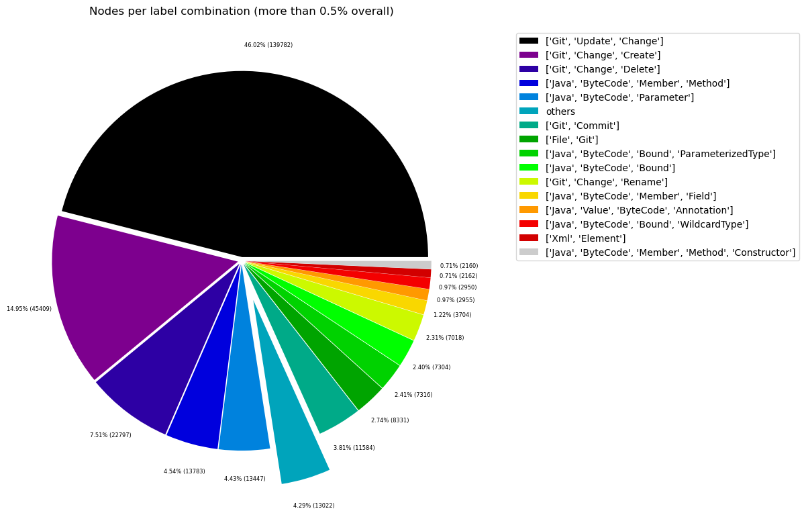
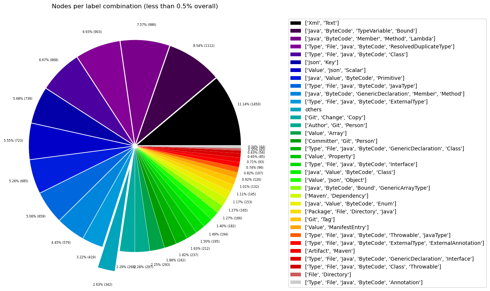
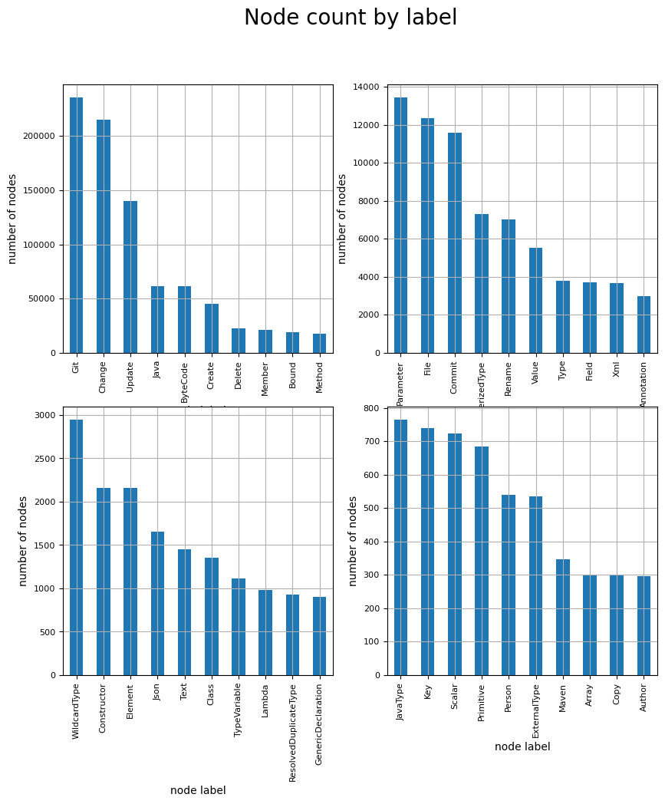
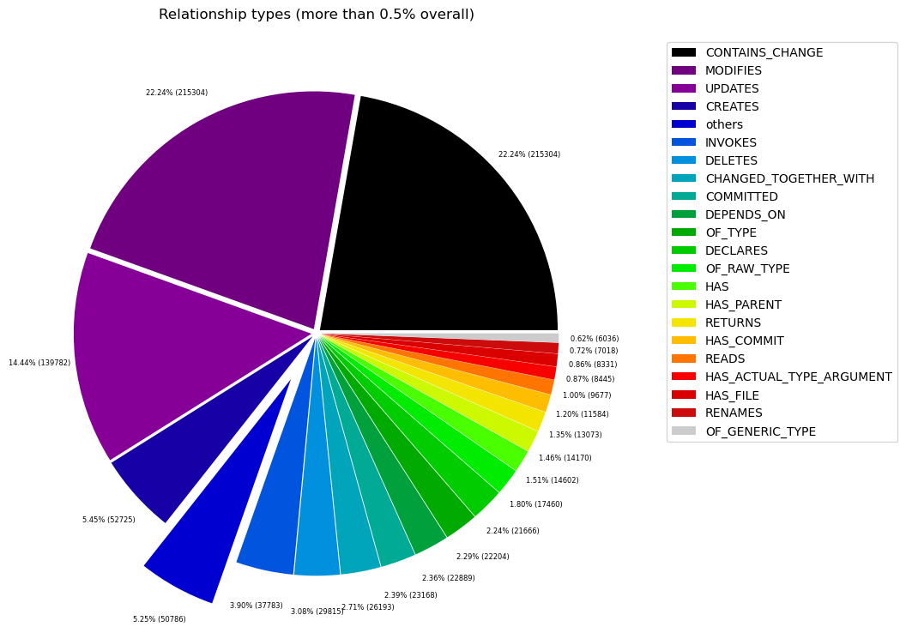
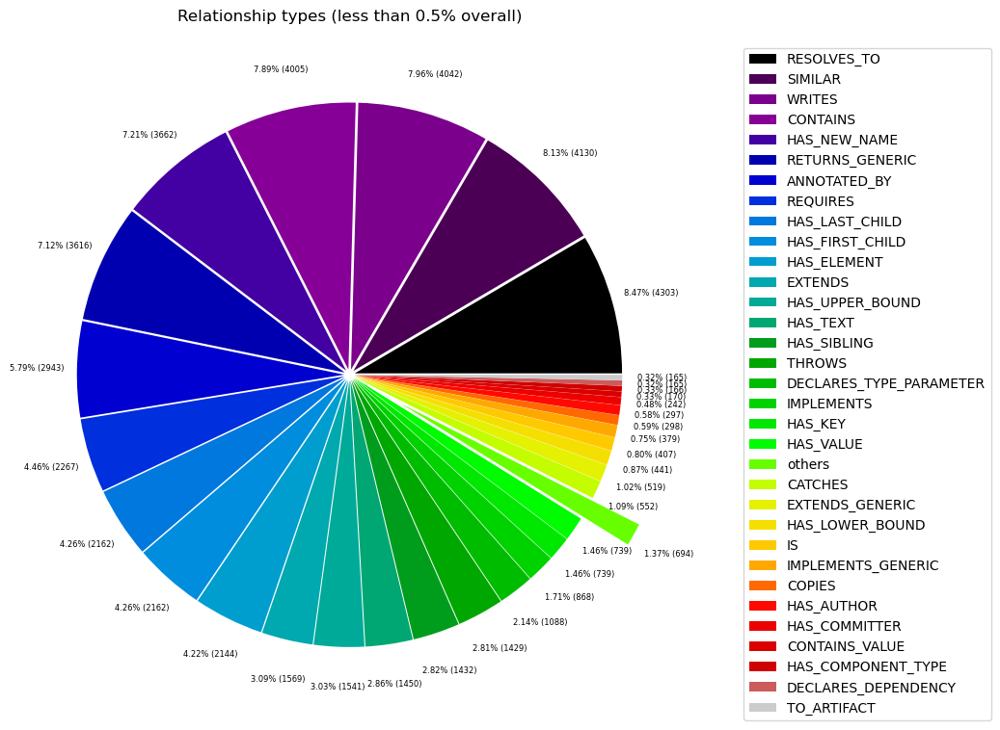

# Overview in General
   

This file contains a general overview of the data in the graph including node labels and relationships types.

### References
- [jqassistant](https://jqassistant.org)
- [Neo4j Python Driver](https://neo4j.com/docs/api/python-driver/current)

## Node Labels

### Table 1a - Highest node count by label combination

Lists the 30 label combinations with the highest number of nodes. The labels with the lowest node count are listed in table 1b.
The total list would sum up to the total number of labels (100%).

The whole table can be found in the CSV report `Node_label_combination_count`.

<table border="1" class="dataframe">
  <thead>
    <tr style="text-align: right;">
      <th></th>
      <th>nodeLabels</th>
      <th>nodesWithThatLabels</th>
      <th>nodesWithThatLabelsPercent</th>
    </tr>
  </thead>
  <tbody>
    <tr>
      <th>0</th>
      <td>[Git, Update, Change]</td>
      <td>139782</td>
      <td>46.024978</td>
    </tr>
    <tr>
      <th>1</th>
      <td>[Git, Change, Create]</td>
      <td>45409</td>
      <td>14.951483</td>
    </tr>
    <tr>
      <th>2</th>
      <td>[Git, Change, Delete]</td>
      <td>22797</td>
      <td>7.506198</td>
    </tr>
    <tr>
      <th>3</th>
      <td>[Java, ByteCode, Member, Method]</td>
      <td>13763</td>
      <td>4.531640</td>
    </tr>
    <tr>
      <th>4</th>
      <td>[Java, ByteCode, Parameter]</td>
      <td>13447</td>
      <td>4.427594</td>
    </tr>
    <tr>
      <th>5</th>
      <td>[Git, Commit]</td>
      <td>11584</td>
      <td>3.814177</td>
    </tr>
    <tr>
      <th>6</th>
      <td>[File, Git]</td>
      <td>8331</td>
      <td>2.743086</td>
    </tr>
    <tr>
      <th>7</th>
      <td>[Java, ByteCode, ParameterizedType, Bound]</td>
      <td>7316</td>
      <td>2.408885</td>
    </tr>
    <tr>
      <th>8</th>
      <td>[Java, ByteCode, Bound]</td>
      <td>7304</td>
      <td>2.404934</td>
    </tr>
    <tr>
      <th>9</th>
      <td>[Git, Change, Rename]</td>
      <td>7018</td>
      <td>2.310765</td>
    </tr>
    <tr>
      <th>10</th>
      <td>[Java, ByteCode, Member, Field]</td>
      <td>3701</td>
      <td>1.218601</td>
    </tr>
    <tr>
      <th>11</th>
      <td>[Java, Value, ByteCode, Annotation]</td>
      <td>2955</td>
      <td>0.972971</td>
    </tr>
    <tr>
      <th>12</th>
      <td>[Java, ByteCode, Bound, WildcardType]</td>
      <td>2950</td>
      <td>0.971325</td>
    </tr>
    <tr>
      <th>13</th>
      <td>[Java, ByteCode, Member, Constructor, Method]</td>
      <td>2168</td>
      <td>0.713841</td>
    </tr>
    <tr>
      <th>14</th>
      <td>[Xml, Element]</td>
      <td>2162</td>
      <td>0.711866</td>
    </tr>
    <tr>
      <th>15</th>
      <td>[Xml, Text]</td>
      <td>1450</td>
      <td>0.477431</td>
    </tr>
    <tr>
      <th>16</th>
      <td>[Java, ByteCode, Bound, TypeVariable]</td>
      <td>1112</td>
      <td>0.366140</td>
    </tr>
    <tr>
      <th>17</th>
      <td>[Java, ByteCode, Member, Method, Lambda]</td>
      <td>986</td>
      <td>0.324653</td>
    </tr>
    <tr>
      <th>18</th>
      <td>[Type, File, Java, ByteCode, ResolvedDuplicate...</td>
      <td>903</td>
      <td>0.297324</td>
    </tr>
    <tr>
      <th>19</th>
      <td>[Type, File, Java, Class, ByteCode]</td>
      <td>868</td>
      <td>0.285800</td>
    </tr>
    <tr>
      <th>20</th>
      <td>[Json, Key]</td>
      <td>739</td>
      <td>0.243325</td>
    </tr>
    <tr>
      <th>21</th>
      <td>[Value, Json, Scalar]</td>
      <td>723</td>
      <td>0.238057</td>
    </tr>
    <tr>
      <th>22</th>
      <td>[Java, Value, ByteCode, Primitive]</td>
      <td>685</td>
      <td>0.225545</td>
    </tr>
    <tr>
      <th>23</th>
      <td>[Type, File, Java, ByteCode, JavaType]</td>
      <td>659</td>
      <td>0.216984</td>
    </tr>
    <tr>
      <th>24</th>
      <td>[Java, ByteCode, Member, Method, GenericDeclar...</td>
      <td>579</td>
      <td>0.190643</td>
    </tr>
    <tr>
      <th>25</th>
      <td>[Type, File, Java, ByteCode, ExternalType]</td>
      <td>419</td>
      <td>0.137961</td>
    </tr>
    <tr>
      <th>26</th>
      <td>[Git, Change, Copy]</td>
      <td>298</td>
      <td>0.098120</td>
    </tr>
    <tr>
      <th>27</th>
      <td>[Author, Git, Person]</td>
      <td>297</td>
      <td>0.097791</td>
    </tr>
    <tr>
      <th>28</th>
      <td>[Value, Array]</td>
      <td>293</td>
      <td>0.096474</td>
    </tr>
    <tr>
      <th>29</th>
      <td>[Committer, Git, Person]</td>
      <td>242</td>
      <td>0.079682</td>
    </tr>
  </tbody>
</table>

### Chart 1a - Highest node count by label combination

Values under 0.5% will be grouped into "others" to get a cleaner plot. The group "others" is then broken down in Chart 1b.

    <Figure size 640x480 with 0 Axes>

    

    

### Table 1b - Lowest node count by label combination

Lists the 30 label combinations with the lowest number of nodes until they reach 0.5% of the total node count, which are shown above.

<table border="1" class="dataframe">
  <thead>
    <tr style="text-align: right;">
      <th></th>
      <th>nodeLabels</th>
      <th>nodesWithThatLabels</th>
      <th>nodesWithThatLabelsPercent</th>
    </tr>
  </thead>
  <tbody>
    <tr>
      <th>0</th>
      <td>[Analyze, Task, jQAssistant]</td>
      <td>1</td>
      <td>0.000329</td>
    </tr>
    <tr>
      <th>1</th>
      <td>[Repository, File, Git]</td>
      <td>1</td>
      <td>0.000329</td>
    </tr>
    <tr>
      <th>2</th>
      <td>[Git, Branch]</td>
      <td>1</td>
      <td>0.000329</td>
    </tr>
    <tr>
      <th>3</th>
      <td>[File, Json]</td>
      <td>2</td>
      <td>0.000659</td>
    </tr>
    <tr>
      <th>4</th>
      <td>[File]</td>
      <td>3</td>
      <td>0.000988</td>
    </tr>
    <tr>
      <th>5</th>
      <td>[Java, ByteCode, Member, Constructor, Method, ...</td>
      <td>4</td>
      <td>0.001317</td>
    </tr>
    <tr>
      <th>6</th>
      <td>[Maven, Exclusion]</td>
      <td>5</td>
      <td>0.001646</td>
    </tr>
    <tr>
      <th>7</th>
      <td>[Value, Json, Array]</td>
      <td>6</td>
      <td>0.001976</td>
    </tr>
    <tr>
      <th>8</th>
      <td>[Type, File, Java, ByteCode, Void]</td>
      <td>9</td>
      <td>0.002963</td>
    </tr>
    <tr>
      <th>9</th>
      <td>[File, Document, Xml, Pom, Maven]</td>
      <td>9</td>
      <td>0.002963</td>
    </tr>
    <tr>
      <th>10</th>
      <td>[File, Java, Manifest]</td>
      <td>9</td>
      <td>0.002963</td>
    </tr>
    <tr>
      <th>11</th>
      <td>[Java, ManifestSection]</td>
      <td>9</td>
      <td>0.002963</td>
    </tr>
    <tr>
      <th>12</th>
      <td>[File, Artifact, Jar, Archive, Zip, Java]</td>
      <td>9</td>
      <td>0.002963</td>
    </tr>
    <tr>
      <th>13</th>
      <td>[File, Java, ServiceLoader]</td>
      <td>11</td>
      <td>0.003622</td>
    </tr>
    <tr>
      <th>14</th>
      <td>[File, Java, Properties]</td>
      <td>12</td>
      <td>0.003951</td>
    </tr>
    <tr>
      <th>15</th>
      <td>[Maven, PluginExecution]</td>
      <td>16</td>
      <td>0.005268</td>
    </tr>
    <tr>
      <th>16</th>
      <td>[Maven, ExecutionGoal]</td>
      <td>16</td>
      <td>0.005268</td>
    </tr>
    <tr>
      <th>17</th>
      <td>[Xml, Attribute]</td>
      <td>18</td>
      <td>0.005927</td>
    </tr>
    <tr>
      <th>18</th>
      <td>[jQAssistant, Rule, Concept]</td>
      <td>19</td>
      <td>0.006256</td>
    </tr>
    <tr>
      <th>19</th>
      <td>[Type, File, Java, ByteCode, Throwable, Extern...</td>
      <td>21</td>
      <td>0.006915</td>
    </tr>
    <tr>
      <th>20</th>
      <td>[Maven, Configuration]</td>
      <td>21</td>
      <td>0.006915</td>
    </tr>
    <tr>
      <th>21</th>
      <td>[Maven, Plugin]</td>
      <td>21</td>
      <td>0.006915</td>
    </tr>
    <tr>
      <th>22</th>
      <td>[Type, File, Java, ByteCode, Throwable, Resolv...</td>
      <td>22</td>
      <td>0.007244</td>
    </tr>
    <tr>
      <th>23</th>
      <td>[Type, File, Java, ByteCode, Enum]</td>
      <td>30</td>
      <td>0.009878</td>
    </tr>
    <tr>
      <th>24</th>
      <td>[Type, File, Java, ByteCode, PrimitiveType]</td>
      <td>31</td>
      <td>0.010207</td>
    </tr>
    <tr>
      <th>25</th>
      <td>[Xml, Namespace]</td>
      <td>36</td>
      <td>0.011853</td>
    </tr>
    <tr>
      <th>26</th>
      <td>[Type, File, Java, ByteCode, Annotation]</td>
      <td>44</td>
      <td>0.014488</td>
    </tr>
    <tr>
      <th>27</th>
      <td>[File, Directory]</td>
      <td>45</td>
      <td>0.014817</td>
    </tr>
    <tr>
      <th>28</th>
      <td>[Type, File, Java, Class, ByteCode, Throwable]</td>
      <td>56</td>
      <td>0.018439</td>
    </tr>
    <tr>
      <th>29</th>
      <td>[Type, File, Java, ByteCode, Interface, Generi...</td>
      <td>85</td>
      <td>0.027987</td>
    </tr>
  </tbody>
</table>

### Chart 1b - Lowest node count by label combination

Shows the lowest (less than 0.5% overall) node count label combinations. Therefore, this plot breaks down the "others" slice of the pie chart above. Values under 0.01% will be grouped into "others" to get a cleaner plot.

    <Figure size 640x480 with 0 Axes>

    

    

### Table 1c - Highest node count by single label

Lists the 40 labels with the highest number of nodes.
Doesn't sum up to the total number of nodes or 100% because one node can have multiple labels.
Helps to identify commonly used labels.

<table border="1" class="dataframe">
  <thead>
    <tr style="text-align: right;">
      <th></th>
      <th>nodeLabel</th>
      <th>nodesWithThatLabel</th>
      <th>nodesWithThatLabelPercent</th>
    </tr>
  </thead>
  <tbody>
    <tr>
      <th>0</th>
      <td>Git</td>
      <td>235892</td>
      <td>77.670402</td>
    </tr>
    <tr>
      <th>1</th>
      <td>Change</td>
      <td>215304</td>
      <td>70.891544</td>
    </tr>
    <tr>
      <th>2</th>
      <td>Update</td>
      <td>139782</td>
      <td>46.024978</td>
    </tr>
    <tr>
      <th>3</th>
      <td>Java</td>
      <td>61460</td>
      <td>20.236476</td>
    </tr>
    <tr>
      <th>4</th>
      <td>ByteCode</td>
      <td>61265</td>
      <td>20.172270</td>
    </tr>
    <tr>
      <th>5</th>
      <td>Create</td>
      <td>45409</td>
      <td>14.951483</td>
    </tr>
    <tr>
      <th>6</th>
      <td>Delete</td>
      <td>22797</td>
      <td>7.506198</td>
    </tr>
    <tr>
      <th>7</th>
      <td>Member</td>
      <td>21201</td>
      <td>6.980695</td>
    </tr>
    <tr>
      <th>8</th>
      <td>Bound</td>
      <td>18848</td>
      <td>6.205941</td>
    </tr>
    <tr>
      <th>9</th>
      <td>Method</td>
      <td>17500</td>
      <td>5.762095</td>
    </tr>
    <tr>
      <th>10</th>
      <td>Parameter</td>
      <td>13447</td>
      <td>4.427594</td>
    </tr>
    <tr>
      <th>11</th>
      <td>File</td>
      <td>12359</td>
      <td>4.069356</td>
    </tr>
    <tr>
      <th>12</th>
      <td>Commit</td>
      <td>11584</td>
      <td>3.814177</td>
    </tr>
    <tr>
      <th>13</th>
      <td>ParameterizedType</td>
      <td>7316</td>
      <td>2.408885</td>
    </tr>
    <tr>
      <th>14</th>
      <td>Rename</td>
      <td>7018</td>
      <td>2.310765</td>
    </tr>
    <tr>
      <th>15</th>
      <td>Value</td>
      <td>5523</td>
      <td>1.818517</td>
    </tr>
    <tr>
      <th>16</th>
      <td>Type</td>
      <td>3782</td>
      <td>1.245271</td>
    </tr>
    <tr>
      <th>17</th>
      <td>Field</td>
      <td>3701</td>
      <td>1.218601</td>
    </tr>
    <tr>
      <th>18</th>
      <td>Xml</td>
      <td>3675</td>
      <td>1.210040</td>
    </tr>
    <tr>
      <th>19</th>
      <td>Annotation</td>
      <td>2999</td>
      <td>0.987458</td>
    </tr>
    <tr>
      <th>20</th>
      <td>WildcardType</td>
      <td>2950</td>
      <td>0.971325</td>
    </tr>
    <tr>
      <th>21</th>
      <td>Constructor</td>
      <td>2172</td>
      <td>0.715158</td>
    </tr>
    <tr>
      <th>22</th>
      <td>Element</td>
      <td>2162</td>
      <td>0.711866</td>
    </tr>
    <tr>
      <th>23</th>
      <td>Json</td>
      <td>1652</td>
      <td>0.543942</td>
    </tr>
    <tr>
      <th>24</th>
      <td>Text</td>
      <td>1450</td>
      <td>0.477431</td>
    </tr>
    <tr>
      <th>25</th>
      <td>Class</td>
      <td>1355</td>
      <td>0.446151</td>
    </tr>
    <tr>
      <th>26</th>
      <td>TypeVariable</td>
      <td>1112</td>
      <td>0.366140</td>
    </tr>
    <tr>
      <th>27</th>
      <td>Lambda</td>
      <td>986</td>
      <td>0.324653</td>
    </tr>
    <tr>
      <th>28</th>
      <td>ResolvedDuplicateType</td>
      <td>925</td>
      <td>0.304568</td>
    </tr>
    <tr>
      <th>29</th>
      <td>GenericDeclaration</td>
      <td>905</td>
      <td>0.297983</td>
    </tr>
    <tr>
      <th>30</th>
      <td>JavaType</td>
      <td>766</td>
      <td>0.252215</td>
    </tr>
    <tr>
      <th>31</th>
      <td>Key</td>
      <td>739</td>
      <td>0.243325</td>
    </tr>
    <tr>
      <th>32</th>
      <td>Scalar</td>
      <td>723</td>
      <td>0.238057</td>
    </tr>
    <tr>
      <th>33</th>
      <td>Primitive</td>
      <td>685</td>
      <td>0.225545</td>
    </tr>
    <tr>
      <th>34</th>
      <td>Person</td>
      <td>539</td>
      <td>0.177473</td>
    </tr>
    <tr>
      <th>35</th>
      <td>ExternalType</td>
      <td>536</td>
      <td>0.176485</td>
    </tr>
    <tr>
      <th>36</th>
      <td>Maven</td>
      <td>346</td>
      <td>0.113925</td>
    </tr>
    <tr>
      <th>37</th>
      <td>Array</td>
      <td>299</td>
      <td>0.098450</td>
    </tr>
    <tr>
      <th>38</th>
      <td>Copy</td>
      <td>298</td>
      <td>0.098120</td>
    </tr>
    <tr>
      <th>39</th>
      <td>Author</td>
      <td>297</td>
      <td>0.097791</td>
    </tr>
  </tbody>
</table>

### Chart 1c - Highest node count by label

Shows the 40 labels with the highest number of nodes.

    <Figure size 640x480 with 0 Axes>

    

    

## Relationship Types

### Table 2a - Highest relationship count by type

Lists the 30 relationship types with the highest number of occurrences.
The whole table can be found in the CSV report `Relationship_type_count`.

    Total number of relationships: 968015

<table border="1" class="dataframe">
  <thead>
    <tr style="text-align: right;">
      <th></th>
      <th>relationshipType</th>
      <th>nodesWithThatRelationshipType</th>
      <th>nodesWithThatRelationshipTypePercent</th>
    </tr>
  </thead>
  <tbody>
    <tr>
      <th>0</th>
      <td>CONTAINS_CHANGE</td>
      <td>215304</td>
      <td>22.241804</td>
    </tr>
    <tr>
      <th>1</th>
      <td>MODIFIES</td>
      <td>215304</td>
      <td>22.241804</td>
    </tr>
    <tr>
      <th>2</th>
      <td>UPDATES</td>
      <td>139782</td>
      <td>14.440065</td>
    </tr>
    <tr>
      <th>3</th>
      <td>CREATES</td>
      <td>52725</td>
      <td>5.446713</td>
    </tr>
    <tr>
      <th>4</th>
      <td>INVOKES</td>
      <td>37783</td>
      <td>3.903142</td>
    </tr>
    <tr>
      <th>5</th>
      <td>DELETES</td>
      <td>29815</td>
      <td>3.080014</td>
    </tr>
    <tr>
      <th>6</th>
      <td>CHANGED_TOGETHER_WITH</td>
      <td>26193</td>
      <td>2.705847</td>
    </tr>
    <tr>
      <th>7</th>
      <td>COMMITTED</td>
      <td>23168</td>
      <td>2.393351</td>
    </tr>
    <tr>
      <th>8</th>
      <td>DEPENDS_ON</td>
      <td>22889</td>
      <td>2.364529</td>
    </tr>
    <tr>
      <th>9</th>
      <td>OF_TYPE</td>
      <td>22204</td>
      <td>2.293766</td>
    </tr>
    <tr>
      <th>10</th>
      <td>DECLARES</td>
      <td>21666</td>
      <td>2.238188</td>
    </tr>
    <tr>
      <th>11</th>
      <td>OF_RAW_TYPE</td>
      <td>17460</td>
      <td>1.803691</td>
    </tr>
    <tr>
      <th>12</th>
      <td>HAS</td>
      <td>14602</td>
      <td>1.508448</td>
    </tr>
    <tr>
      <th>13</th>
      <td>HAS_PARENT</td>
      <td>14170</td>
      <td>1.463820</td>
    </tr>
    <tr>
      <th>14</th>
      <td>RETURNS</td>
      <td>13073</td>
      <td>1.350496</td>
    </tr>
    <tr>
      <th>15</th>
      <td>HAS_COMMIT</td>
      <td>11584</td>
      <td>1.196676</td>
    </tr>
    <tr>
      <th>16</th>
      <td>READS</td>
      <td>9677</td>
      <td>0.999675</td>
    </tr>
    <tr>
      <th>17</th>
      <td>HAS_ACTUAL_TYPE_ARGUMENT</td>
      <td>8445</td>
      <td>0.872404</td>
    </tr>
    <tr>
      <th>18</th>
      <td>HAS_FILE</td>
      <td>8331</td>
      <td>0.860627</td>
    </tr>
    <tr>
      <th>19</th>
      <td>RENAMES</td>
      <td>7018</td>
      <td>0.724989</td>
    </tr>
    <tr>
      <th>20</th>
      <td>OF_GENERIC_TYPE</td>
      <td>6036</td>
      <td>0.623544</td>
    </tr>
    <tr>
      <th>21</th>
      <td>RESOLVES_TO</td>
      <td>4303</td>
      <td>0.444518</td>
    </tr>
    <tr>
      <th>22</th>
      <td>SIMILAR</td>
      <td>4130</td>
      <td>0.426646</td>
    </tr>
    <tr>
      <th>23</th>
      <td>WRITES</td>
      <td>4042</td>
      <td>0.417556</td>
    </tr>
    <tr>
      <th>24</th>
      <td>CONTAINS</td>
      <td>4005</td>
      <td>0.413733</td>
    </tr>
    <tr>
      <th>25</th>
      <td>HAS_NEW_NAME</td>
      <td>3662</td>
      <td>0.378300</td>
    </tr>
    <tr>
      <th>26</th>
      <td>RETURNS_GENERIC</td>
      <td>3616</td>
      <td>0.373548</td>
    </tr>
    <tr>
      <th>27</th>
      <td>ANNOTATED_BY</td>
      <td>2943</td>
      <td>0.304024</td>
    </tr>
    <tr>
      <th>28</th>
      <td>REQUIRES</td>
      <td>2267</td>
      <td>0.234191</td>
    </tr>
    <tr>
      <th>29</th>
      <td>HAS_FIRST_CHILD</td>
      <td>2162</td>
      <td>0.223344</td>
    </tr>
  </tbody>
</table>

### Chart 2a - Highest relationship count by type

Values under 0.5% will be grouped into "others" to get a cleaner plot. The group "others" is then broken down in the second chart.

    <Figure size 640x480 with 0 Axes>

    

    

### Table 2b - Lowest relationship count by type

Lists the 30 relationships type with the lowest number of occurrences up to 0.5% of the total node count. This is essentially breaking down the "others" slice from the chart above.

<table border="1" class="dataframe">
  <thead>
    <tr style="text-align: right;">
      <th></th>
      <th>relationshipType</th>
      <th>nodesWithThatRelationshipType</th>
      <th>nodesWithThatRelationshipTypePercent</th>
    </tr>
  </thead>
  <tbody>
    <tr>
      <th>0</th>
      <td>HAS_PROPERTY</td>
      <td>1</td>
      <td>0.000103</td>
    </tr>
    <tr>
      <th>1</th>
      <td>HAS_BRANCH</td>
      <td>1</td>
      <td>0.000103</td>
    </tr>
    <tr>
      <th>2</th>
      <td>HAS_HEAD</td>
      <td>2</td>
      <td>0.000207</td>
    </tr>
    <tr>
      <th>3</th>
      <td>EXCLUDES</td>
      <td>5</td>
      <td>0.000517</td>
    </tr>
    <tr>
      <th>4</th>
      <td>THROWS_GENERIC</td>
      <td>5</td>
      <td>0.000517</td>
    </tr>
    <tr>
      <th>5</th>
      <td>DESCRIBES</td>
      <td>9</td>
      <td>0.000930</td>
    </tr>
    <tr>
      <th>6</th>
      <td>HAS_ROOT_ELEMENT</td>
      <td>11</td>
      <td>0.001136</td>
    </tr>
    <tr>
      <th>7</th>
      <td>HAS_EXECUTION</td>
      <td>16</td>
      <td>0.001653</td>
    </tr>
    <tr>
      <th>8</th>
      <td>HAS_GOAL</td>
      <td>16</td>
      <td>0.001653</td>
    </tr>
    <tr>
      <th>9</th>
      <td>HAS_ATTRIBUTE</td>
      <td>18</td>
      <td>0.001859</td>
    </tr>
    <tr>
      <th>10</th>
      <td>OF_NAMESPACE</td>
      <td>18</td>
      <td>0.001859</td>
    </tr>
    <tr>
      <th>11</th>
      <td>INCLUDES_CONCEPT</td>
      <td>19</td>
      <td>0.001963</td>
    </tr>
    <tr>
      <th>12</th>
      <td>IS_ARTIFACT</td>
      <td>21</td>
      <td>0.002169</td>
    </tr>
    <tr>
      <th>13</th>
      <td>HAS_CONFIGURATION</td>
      <td>21</td>
      <td>0.002169</td>
    </tr>
    <tr>
      <th>14</th>
      <td>USES_PLUGIN</td>
      <td>21</td>
      <td>0.002169</td>
    </tr>
    <tr>
      <th>15</th>
      <td>REQUIRES_TYPE_PARAMETER</td>
      <td>24</td>
      <td>0.002479</td>
    </tr>
    <tr>
      <th>16</th>
      <td>REQUIRES_CONCEPT</td>
      <td>28</td>
      <td>0.002893</td>
    </tr>
    <tr>
      <th>17</th>
      <td>DECLARES_NAMESPACE</td>
      <td>36</td>
      <td>0.003719</td>
    </tr>
    <tr>
      <th>18</th>
      <td>HAS_DEFAULT</td>
      <td>39</td>
      <td>0.004029</td>
    </tr>
    <tr>
      <th>19</th>
      <td>COPY_OF</td>
      <td>119</td>
      <td>0.012293</td>
    </tr>
    <tr>
      <th>20</th>
      <td>HAS_TAG</td>
      <td>132</td>
      <td>0.013636</td>
    </tr>
    <tr>
      <th>21</th>
      <td>ON_COMMIT</td>
      <td>132</td>
      <td>0.013636</td>
    </tr>
    <tr>
      <th>22</th>
      <td>TO_ARTIFACT</td>
      <td>165</td>
      <td>0.017045</td>
    </tr>
    <tr>
      <th>23</th>
      <td>DECLARES_DEPENDENCY</td>
      <td>165</td>
      <td>0.017045</td>
    </tr>
    <tr>
      <th>24</th>
      <td>HAS_COMPONENT_TYPE</td>
      <td>166</td>
      <td>0.017148</td>
    </tr>
    <tr>
      <th>25</th>
      <td>CONTAINS_VALUE</td>
      <td>170</td>
      <td>0.017562</td>
    </tr>
    <tr>
      <th>26</th>
      <td>HAS_COMMITTER</td>
      <td>242</td>
      <td>0.025000</td>
    </tr>
    <tr>
      <th>27</th>
      <td>HAS_AUTHOR</td>
      <td>297</td>
      <td>0.030681</td>
    </tr>
    <tr>
      <th>28</th>
      <td>COPIES</td>
      <td>298</td>
      <td>0.030785</td>
    </tr>
    <tr>
      <th>29</th>
      <td>IMPLEMENTS_GENERIC</td>
      <td>379</td>
      <td>0.039152</td>
    </tr>
  </tbody>
</table>

### Chart 2b - Lowest relationship count by type

Shows the lowest (less than 0.5% overall) relationship types. This plot breaks down the "others" slice of the pie chart above. Values under 0.01% will be grouped into "others" to get a cleaner plot.

    <Figure size 640x480 with 0 Axes>

    

    

## Node labels with their relationships

### Table 3a - Highest relationship count by node labels and relationship type

Lists the 30 node labels and their relationship types with the highest number of occurrences.

<table border="1" class="dataframe">
  <thead>
    <tr style="text-align: right;">
      <th></th>
      <th>sourceLabels</th>
      <th>relationType</th>
      <th>targetLabels</th>
      <th>numberOfRelationships</th>
      <th>numberOfNodesWithSameLabelsAsSource</th>
      <th>numberOfNodesWithSameLabelsAsTarget</th>
      <th>densityInPercent</th>
    </tr>
  </thead>
  <tbody>
    <tr>
      <th>0</th>
      <td>[Git, Commit]</td>
      <td>CONTAINS_CHANGE</td>
      <td>[Git, Update, Change]</td>
      <td>139782</td>
      <td>11584</td>
      <td>139782</td>
      <td>0.008633</td>
    </tr>
    <tr>
      <th>1</th>
      <td>[Git, Update, Change]</td>
      <td>MODIFIES</td>
      <td>[File, Git]</td>
      <td>139782</td>
      <td>139782</td>
      <td>8331</td>
      <td>0.012003</td>
    </tr>
    <tr>
      <th>2</th>
      <td>[Git, Update, Change]</td>
      <td>UPDATES</td>
      <td>[File, Git]</td>
      <td>139782</td>
      <td>139782</td>
      <td>8331</td>
      <td>0.012003</td>
    </tr>
    <tr>
      <th>3</th>
      <td>[Git, Commit]</td>
      <td>CONTAINS_CHANGE</td>
      <td>[Git, Change, Create]</td>
      <td>45409</td>
      <td>11584</td>
      <td>45409</td>
      <td>0.008633</td>
    </tr>
    <tr>
      <th>4</th>
      <td>[Git, Change, Create]</td>
      <td>MODIFIES</td>
      <td>[File, Git]</td>
      <td>45409</td>
      <td>45409</td>
      <td>8331</td>
      <td>0.012003</td>
    </tr>
    <tr>
      <th>5</th>
      <td>[Git, Change, Create]</td>
      <td>CREATES</td>
      <td>[File, Git]</td>
      <td>45409</td>
      <td>45409</td>
      <td>8331</td>
      <td>0.012003</td>
    </tr>
    <tr>
      <th>6</th>
      <td>[Java, ByteCode, Member, Method]</td>
      <td>INVOKES</td>
      <td>[Java, ByteCode, Member, Method]</td>
      <td>23045</td>
      <td>13662</td>
      <td>13662</td>
      <td>0.012347</td>
    </tr>
    <tr>
      <th>7</th>
      <td>[Git, Commit]</td>
      <td>CONTAINS_CHANGE</td>
      <td>[Git, Change, Delete]</td>
      <td>22797</td>
      <td>11584</td>
      <td>22797</td>
      <td>0.008633</td>
    </tr>
    <tr>
      <th>8</th>
      <td>[Git, Change, Delete]</td>
      <td>MODIFIES</td>
      <td>[File, Git]</td>
      <td>22797</td>
      <td>22797</td>
      <td>8331</td>
      <td>0.012003</td>
    </tr>
    <tr>
      <th>9</th>
      <td>[Git, Change, Delete]</td>
      <td>DELETES</td>
      <td>[File, Git]</td>
      <td>22797</td>
      <td>22797</td>
      <td>8331</td>
      <td>0.012003</td>
    </tr>
    <tr>
      <th>10</th>
      <td>[File, Git]</td>
      <td>CHANGED_TOGETHER_WITH</td>
      <td>[File, Git]</td>
      <td>20059</td>
      <td>8331</td>
      <td>8331</td>
      <td>0.028901</td>
    </tr>
    <tr>
      <th>11</th>
      <td>[Git, Commit]</td>
      <td>HAS_PARENT</td>
      <td>[Git, Commit]</td>
      <td>14161</td>
      <td>11584</td>
      <td>11584</td>
      <td>0.010553</td>
    </tr>
    <tr>
      <th>12</th>
      <td>[Repository, File, Git]</td>
      <td>HAS_COMMIT</td>
      <td>[Git, Commit]</td>
      <td>11584</td>
      <td>1</td>
      <td>11584</td>
      <td>100.000000</td>
    </tr>
    <tr>
      <th>13</th>
      <td>[Committer, Git, Person]</td>
      <td>COMMITTED</td>
      <td>[Git, Commit]</td>
      <td>11584</td>
      <td>242</td>
      <td>11584</td>
      <td>0.413223</td>
    </tr>
    <tr>
      <th>14</th>
      <td>[Author, Git, Person]</td>
      <td>COMMITTED</td>
      <td>[Git, Commit]</td>
      <td>11584</td>
      <td>297</td>
      <td>11584</td>
      <td>0.336700</td>
    </tr>
    <tr>
      <th>15</th>
      <td>[Java, ByteCode, Member, Method]</td>
      <td>READS</td>
      <td>[Java, ByteCode, Member, Field]</td>
      <td>8652</td>
      <td>13662</td>
      <td>3701</td>
      <td>0.017111</td>
    </tr>
    <tr>
      <th>16</th>
      <td>[Java, ByteCode, Member, Method]</td>
      <td>HAS</td>
      <td>[Java, ByteCode, Parameter]</td>
      <td>8592</td>
      <td>13662</td>
      <td>13447</td>
      <td>0.004677</td>
    </tr>
    <tr>
      <th>17</th>
      <td>[Repository, File, Git]</td>
      <td>HAS_FILE</td>
      <td>[File, Git]</td>
      <td>8331</td>
      <td>1</td>
      <td>8331</td>
      <td>100.000000</td>
    </tr>
    <tr>
      <th>18</th>
      <td>[Git, Commit]</td>
      <td>CONTAINS_CHANGE</td>
      <td>[Git, Change, Rename]</td>
      <td>7018</td>
      <td>11584</td>
      <td>7018</td>
      <td>0.008633</td>
    </tr>
    <tr>
      <th>19</th>
      <td>[Git, Change, Rename]</td>
      <td>RENAMES</td>
      <td>[File, Git]</td>
      <td>7018</td>
      <td>7018</td>
      <td>8331</td>
      <td>0.012003</td>
    </tr>
    <tr>
      <th>20</th>
      <td>[Git, Change, Rename]</td>
      <td>DELETES</td>
      <td>[File, Git]</td>
      <td>7018</td>
      <td>7018</td>
      <td>8331</td>
      <td>0.012003</td>
    </tr>
    <tr>
      <th>21</th>
      <td>[Git, Change, Rename]</td>
      <td>CREATES</td>
      <td>[File, Git]</td>
      <td>7018</td>
      <td>7018</td>
      <td>8331</td>
      <td>0.012003</td>
    </tr>
    <tr>
      <th>22</th>
      <td>[Git, Change, Rename]</td>
      <td>MODIFIES</td>
      <td>[File, Git]</td>
      <td>7018</td>
      <td>7018</td>
      <td>8331</td>
      <td>0.012003</td>
    </tr>
    <tr>
      <th>23</th>
      <td>[Java, ByteCode, Parameter]</td>
      <td>OF_TYPE</td>
      <td>[Type, File, Java, ByteCode, JavaType]</td>
      <td>6235</td>
      <td>13447</td>
      <td>659</td>
      <td>0.070360</td>
    </tr>
    <tr>
      <th>24</th>
      <td>[File, Git]</td>
      <td>HAS_NEW_NAME</td>
      <td>[File, Git]</td>
      <td>3662</td>
      <td>8331</td>
      <td>8331</td>
      <td>0.005276</td>
    </tr>
    <tr>
      <th>25</th>
      <td>[Java, ByteCode, Bound]</td>
      <td>OF_RAW_TYPE</td>
      <td>[Type, File, Java, ByteCode, JavaType]</td>
      <td>3488</td>
      <td>7304</td>
      <td>659</td>
      <td>0.072465</td>
    </tr>
    <tr>
      <th>26</th>
      <td>[Java, ByteCode, ParameterizedType, Bound]</td>
      <td>OF_RAW_TYPE</td>
      <td>[Type, File, Java, ByteCode, JavaType]</td>
      <td>3144</td>
      <td>7316</td>
      <td>659</td>
      <td>0.065211</td>
    </tr>
    <tr>
      <th>27</th>
      <td>[Java, ByteCode, ParameterizedType, Bound]</td>
      <td>HAS_ACTUAL_TYPE_ARGUMENT</td>
      <td>[Java, ByteCode, Bound, WildcardType]</td>
      <td>2950</td>
      <td>7316</td>
      <td>2950</td>
      <td>0.013669</td>
    </tr>
    <tr>
      <th>28</th>
      <td>[Java, ByteCode, Parameter]</td>
      <td>OF_GENERIC_TYPE</td>
      <td>[Java, ByteCode, ParameterizedType, Bound]</td>
      <td>2709</td>
      <td>13447</td>
      <td>7316</td>
      <td>0.002754</td>
    </tr>
    <tr>
      <th>29</th>
      <td>[Java, ByteCode, Member, Constructor, Method]</td>
      <td>WRITES</td>
      <td>[Java, ByteCode, Member, Field]</td>
      <td>2577</td>
      <td>2168</td>
      <td>3701</td>
      <td>0.032117</td>
    </tr>
  </tbody>
</table>

## Graph Density

    total_number_of_nodes (vertices): 303709
    total_number_of_relationships (edges): 968015
    -> total directed graph density: 1.049465565550615e-05
    -> total directed graph density in percent: 0.0010494655655506149

