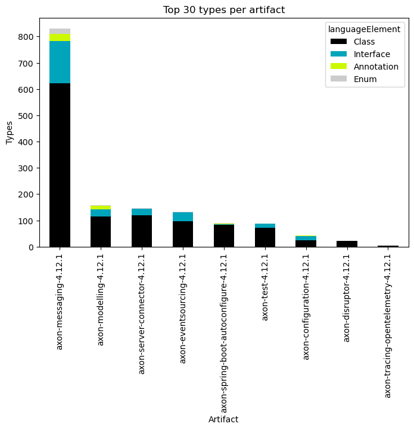
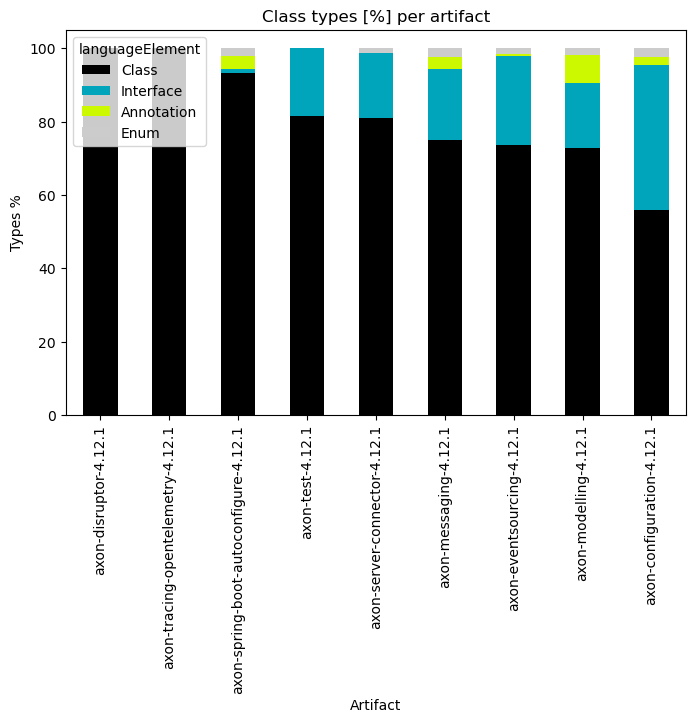
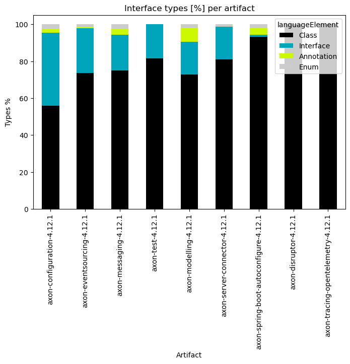
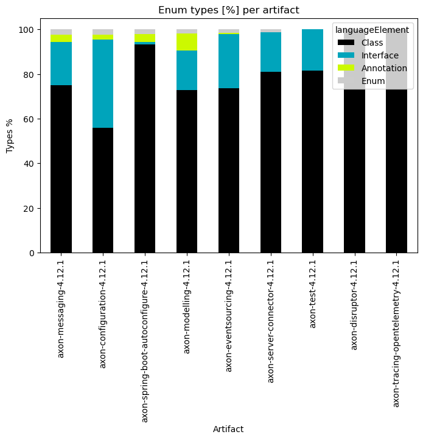
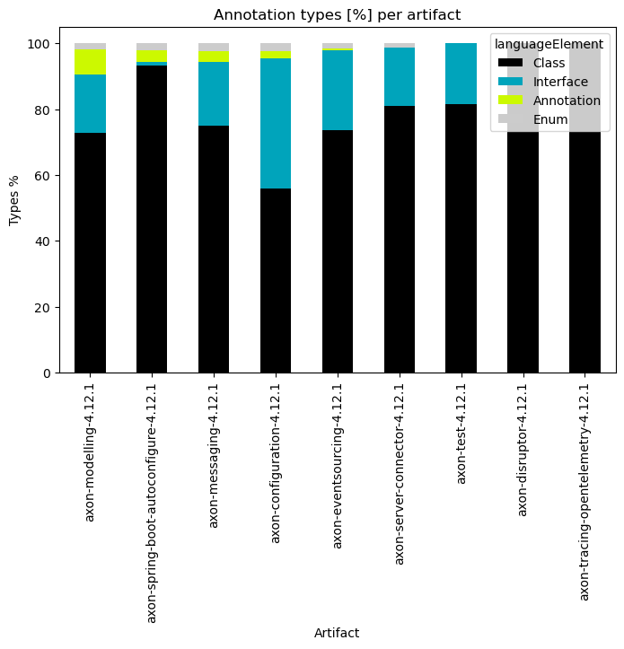
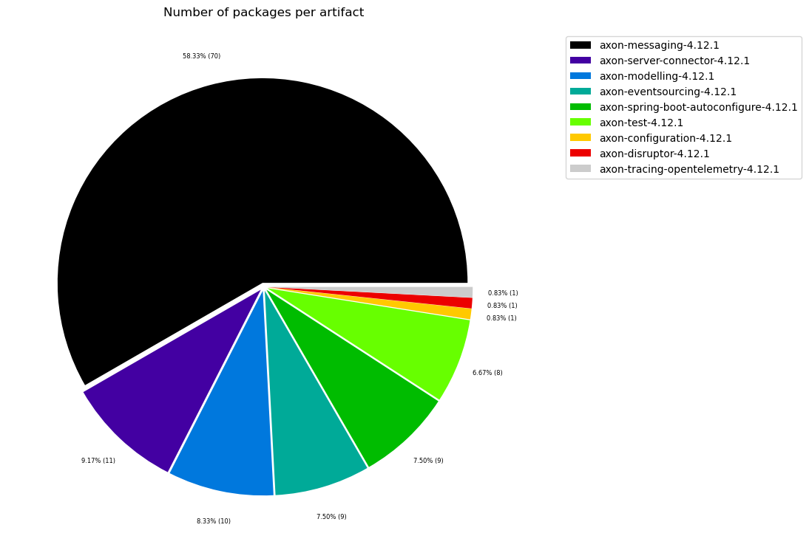

# Overview for Java
   

### References
- [jqassistant](https://jqassistant.org)
- [Neo4j Python Driver](https://neo4j.com/docs/api/python-driver/current)

## Overview

### Table 1 - Size

<table border="1" class="dataframe">
  <thead>
    <tr style="text-align: right;">
      <th></th>
      <th>nodeCount</th>
      <th>relationshipCount</th>
      <th>artifactCount</th>
      <th>packageCount</th>
      <th>typeCount</th>
      <th>methodCount</th>
      <th>memberCount</th>
    </tr>
  </thead>
  <tbody>
    <tr>
      <th>0</th>
      <td>303724</td>
      <td>967956</td>
      <td>9</td>
      <td>128</td>
      <td>2218</td>
      <td>8866</td>
      <td>10878</td>
    </tr>
  </tbody>
</table>

## Artifacts

### Table 2a - Largest 30 types per artifact

This table shows the largest (number of types) artifacts and their kind of types (Class, Interface, Enum, Annotation).
The whole table can be found in the CSV report `Number_of_types_per_artifact`.

<table border="1" class="dataframe">
  <thead>
    <tr style="text-align: right;">
      <th></th>
      <th>artifactName</th>
      <th>numberOfArtifactTypes</th>
      <th>languageElement</th>
      <th>numberOfTypes</th>
    </tr>
  </thead>
  <tbody>
    <tr>
      <th>0</th>
      <td>axon-messaging-4.12.1</td>
      <td>830</td>
      <td>Class</td>
      <td>623</td>
    </tr>
    <tr>
      <th>1</th>
      <td>axon-messaging-4.12.1</td>
      <td>830</td>
      <td>Interface</td>
      <td>160</td>
    </tr>
    <tr>
      <th>2</th>
      <td>axon-messaging-4.12.1</td>
      <td>830</td>
      <td>Annotation</td>
      <td>27</td>
    </tr>
    <tr>
      <th>3</th>
      <td>axon-messaging-4.12.1</td>
      <td>830</td>
      <td>Enum</td>
      <td>20</td>
    </tr>
    <tr>
      <th>4</th>
      <td>axon-modelling-4.12.1</td>
      <td>158</td>
      <td>Annotation</td>
      <td>12</td>
    </tr>
    <tr>
      <th>5</th>
      <td>axon-modelling-4.12.1</td>
      <td>158</td>
      <td>Class</td>
      <td>115</td>
    </tr>
    <tr>
      <th>6</th>
      <td>axon-modelling-4.12.1</td>
      <td>158</td>
      <td>Interface</td>
      <td>28</td>
    </tr>
    <tr>
      <th>7</th>
      <td>axon-modelling-4.12.1</td>
      <td>158</td>
      <td>Enum</td>
      <td>3</td>
    </tr>
    <tr>
      <th>8</th>
      <td>axon-server-connector-4.12.1</td>
      <td>147</td>
      <td>Class</td>
      <td>119</td>
    </tr>
    <tr>
      <th>9</th>
      <td>axon-server-connector-4.12.1</td>
      <td>147</td>
      <td>Interface</td>
      <td>26</td>
    </tr>
    <tr>
      <th>10</th>
      <td>axon-server-connector-4.12.1</td>
      <td>147</td>
      <td>Enum</td>
      <td>2</td>
    </tr>
    <tr>
      <th>11</th>
      <td>axon-eventsourcing-4.12.1</td>
      <td>133</td>
      <td>Class</td>
      <td>98</td>
    </tr>
    <tr>
      <th>12</th>
      <td>axon-eventsourcing-4.12.1</td>
      <td>133</td>
      <td>Interface</td>
      <td>32</td>
    </tr>
    <tr>
      <th>13</th>
      <td>axon-eventsourcing-4.12.1</td>
      <td>133</td>
      <td>Annotation</td>
      <td>1</td>
    </tr>
    <tr>
      <th>14</th>
      <td>axon-eventsourcing-4.12.1</td>
      <td>133</td>
      <td>Enum</td>
      <td>2</td>
    </tr>
    <tr>
      <th>15</th>
      <td>axon-spring-boot-autoconfigure-4.12.1</td>
      <td>90</td>
      <td>Class</td>
      <td>84</td>
    </tr>
    <tr>
      <th>16</th>
      <td>axon-spring-boot-autoconfigure-4.12.1</td>
      <td>90</td>
      <td>Annotation</td>
      <td>3</td>
    </tr>
    <tr>
      <th>17</th>
      <td>axon-spring-boot-autoconfigure-4.12.1</td>
      <td>90</td>
      <td>Enum</td>
      <td>2</td>
    </tr>
    <tr>
      <th>18</th>
      <td>axon-spring-boot-autoconfigure-4.12.1</td>
      <td>90</td>
      <td>Interface</td>
      <td>1</td>
    </tr>
    <tr>
      <th>19</th>
      <td>axon-test-4.12.1</td>
      <td>87</td>
      <td>Class</td>
      <td>71</td>
    </tr>
    <tr>
      <th>20</th>
      <td>axon-test-4.12.1</td>
      <td>87</td>
      <td>Interface</td>
      <td>16</td>
    </tr>
    <tr>
      <th>21</th>
      <td>axon-configuration-4.12.1</td>
      <td>43</td>
      <td>Interface</td>
      <td>17</td>
    </tr>
    <tr>
      <th>22</th>
      <td>axon-configuration-4.12.1</td>
      <td>43</td>
      <td>Class</td>
      <td>24</td>
    </tr>
    <tr>
      <th>23</th>
      <td>axon-configuration-4.12.1</td>
      <td>43</td>
      <td>Enum</td>
      <td>1</td>
    </tr>
    <tr>
      <th>24</th>
      <td>axon-configuration-4.12.1</td>
      <td>43</td>
      <td>Annotation</td>
      <td>1</td>
    </tr>
    <tr>
      <th>25</th>
      <td>axon-disruptor-4.12.1</td>
      <td>22</td>
      <td>Class</td>
      <td>22</td>
    </tr>
    <tr>
      <th>26</th>
      <td>axon-tracing-opentelemetry-4.12.1</td>
      <td>5</td>
      <td>Class</td>
      <td>5</td>
    </tr>
  </tbody>
</table>

### Table 2b - Largest 30 types per artifact grouped

This table shows the largest (number of types) artifacts each in one row, their kind of types in columns and the count of them as values.

The source data for this aggregated table can be found in the CSV report `Number_of_types_per_artifact`.

<table border="1" class="dataframe">
  <thead>
    <tr style="text-align: right;">
      <th>languageElement</th>
      <th>Class</th>
      <th>Interface</th>
      <th>Annotation</th>
      <th>Enum</th>
    </tr>
    <tr>
      <th>artifactName</th>
      <th></th>
      <th></th>
      <th></th>
      <th></th>
    </tr>
  </thead>
  <tbody>
    <tr>
      <th>axon-messaging-4.12.1</th>
      <td>623</td>
      <td>160</td>
      <td>27</td>
      <td>20</td>
    </tr>
    <tr>
      <th>axon-modelling-4.12.1</th>
      <td>115</td>
      <td>28</td>
      <td>12</td>
      <td>3</td>
    </tr>
    <tr>
      <th>axon-server-connector-4.12.1</th>
      <td>119</td>
      <td>26</td>
      <td>0</td>
      <td>2</td>
    </tr>
    <tr>
      <th>axon-eventsourcing-4.12.1</th>
      <td>98</td>
      <td>32</td>
      <td>1</td>
      <td>2</td>
    </tr>
    <tr>
      <th>axon-spring-boot-autoconfigure-4.12.1</th>
      <td>84</td>
      <td>1</td>
      <td>3</td>
      <td>2</td>
    </tr>
    <tr>
      <th>axon-test-4.12.1</th>
      <td>71</td>
      <td>16</td>
      <td>0</td>
      <td>0</td>
    </tr>
    <tr>
      <th>axon-configuration-4.12.1</th>
      <td>24</td>
      <td>17</td>
      <td>1</td>
      <td>1</td>
    </tr>
    <tr>
      <th>axon-disruptor-4.12.1</th>
      <td>22</td>
      <td>0</td>
      <td>0</td>
      <td>0</td>
    </tr>
    <tr>
      <th>axon-tracing-opentelemetry-4.12.1</th>
      <td>5</td>
      <td>0</td>
      <td>0</td>
      <td>0</td>
    </tr>
  </tbody>
</table>

### Table 2b Chart 1 - 30 largest artifacts and their types stacked

    <Figure size 640x480 with 0 Axes>

    

    

### Table 2c - Largest 30 types per artifact (grouped and normalized in %)

<table border="1" class="dataframe">
  <thead>
    <tr style="text-align: right;">
      <th>languageElement</th>
      <th>Class</th>
      <th>Interface</th>
      <th>Annotation</th>
      <th>Enum</th>
    </tr>
    <tr>
      <th>artifactName</th>
      <th></th>
      <th></th>
      <th></th>
      <th></th>
    </tr>
  </thead>
  <tbody>
    <tr>
      <th>axon-messaging-4.12.1</th>
      <td>75.060241</td>
      <td>19.277108</td>
      <td>3.253012</td>
      <td>2.409639</td>
    </tr>
    <tr>
      <th>axon-modelling-4.12.1</th>
      <td>72.784810</td>
      <td>17.721519</td>
      <td>7.594937</td>
      <td>1.898734</td>
    </tr>
    <tr>
      <th>axon-server-connector-4.12.1</th>
      <td>80.952381</td>
      <td>17.687075</td>
      <td>0.000000</td>
      <td>1.360544</td>
    </tr>
    <tr>
      <th>axon-eventsourcing-4.12.1</th>
      <td>73.684211</td>
      <td>24.060150</td>
      <td>0.751880</td>
      <td>1.503759</td>
    </tr>
    <tr>
      <th>axon-spring-boot-autoconfigure-4.12.1</th>
      <td>93.333333</td>
      <td>1.111111</td>
      <td>3.333333</td>
      <td>2.222222</td>
    </tr>
    <tr>
      <th>axon-test-4.12.1</th>
      <td>81.609195</td>
      <td>18.390805</td>
      <td>0.000000</td>
      <td>0.000000</td>
    </tr>
    <tr>
      <th>axon-configuration-4.12.1</th>
      <td>55.813953</td>
      <td>39.534884</td>
      <td>2.325581</td>
      <td>2.325581</td>
    </tr>
    <tr>
      <th>axon-disruptor-4.12.1</th>
      <td>100.000000</td>
      <td>0.000000</td>
      <td>0.000000</td>
      <td>0.000000</td>
    </tr>
    <tr>
      <th>axon-tracing-opentelemetry-4.12.1</th>
      <td>100.000000</td>
      <td>0.000000</td>
      <td>0.000000</td>
      <td>0.000000</td>
    </tr>
  </tbody>
</table>

### Table 2c Chart 1 - Top 30 artifacts with the highest relative amount of classes in %

    <Figure size 640x480 with 0 Axes>

    

    

### Table 2c Chart 2 - Top 30 artifacts with the highest relative amount of interfaces in %

    <Figure size 640x480 with 0 Axes>

    

    

### Table 2c Chart 3 - Top 30 artifacts with the highest relative amount of enums in %

    <Figure size 640x480 with 0 Axes>

    

    

### Table 2c Chart 4 - Top 30 artifacts with the highest relative amount of annotations in %

    <Figure size 640x480 with 0 Axes>

    

    

### Table 3 - Top 30 artifacts with the highest package count

The whole table can be found in the CSV report `Number_of_packages_per_artifact`.

<table border="1" class="dataframe">
  <thead>
    <tr style="text-align: right;">
      <th></th>
      <th>artifactName</th>
      <th>numberOfPackages</th>
    </tr>
  </thead>
  <tbody>
    <tr>
      <th>0</th>
      <td>axon-messaging-4.12.1</td>
      <td>70</td>
    </tr>
    <tr>
      <th>1</th>
      <td>axon-server-connector-4.12.1</td>
      <td>11</td>
    </tr>
    <tr>
      <th>2</th>
      <td>axon-modelling-4.12.1</td>
      <td>10</td>
    </tr>
    <tr>
      <th>3</th>
      <td>axon-spring-boot-autoconfigure-4.12.1</td>
      <td>9</td>
    </tr>
    <tr>
      <th>4</th>
      <td>axon-eventsourcing-4.12.1</td>
      <td>9</td>
    </tr>
    <tr>
      <th>5</th>
      <td>axon-test-4.12.1</td>
      <td>8</td>
    </tr>
    <tr>
      <th>6</th>
      <td>axon-configuration-4.12.1</td>
      <td>1</td>
    </tr>
    <tr>
      <th>7</th>
      <td>axon-tracing-opentelemetry-4.12.1</td>
      <td>1</td>
    </tr>
    <tr>
      <th>8</th>
      <td>axon-disruptor-4.12.1</td>
      <td>1</td>
    </tr>
  </tbody>
</table>

### Table 3 Chart 1 - Number of packages per artifact

The following chat shows artifacts with the largest package count in percentage. Artifacts with less than 0.7% package count are grouped into "others" to focus on the most significant artifacts regarding their package count.

    <Figure size 640x480 with 0 Axes>

    

    

