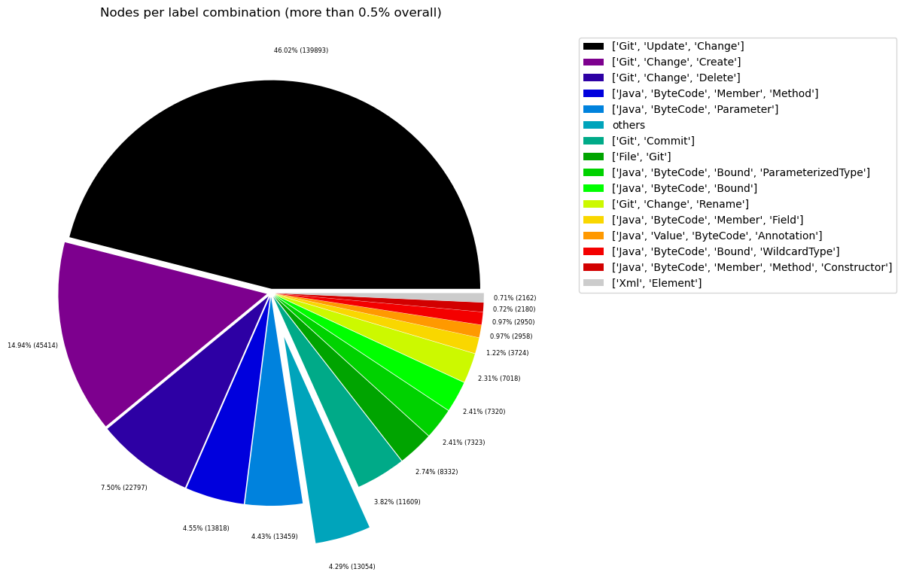
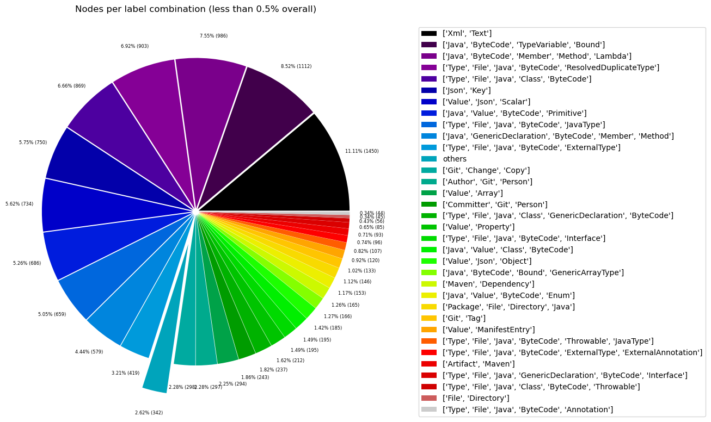
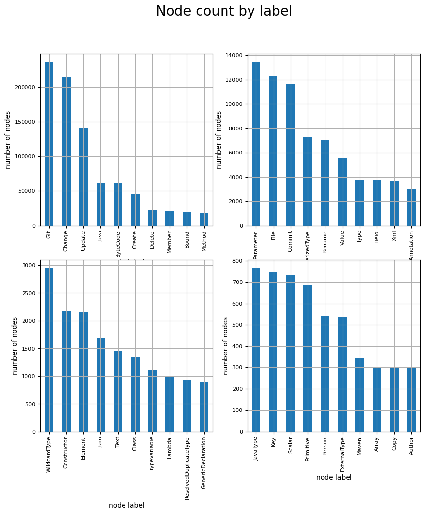
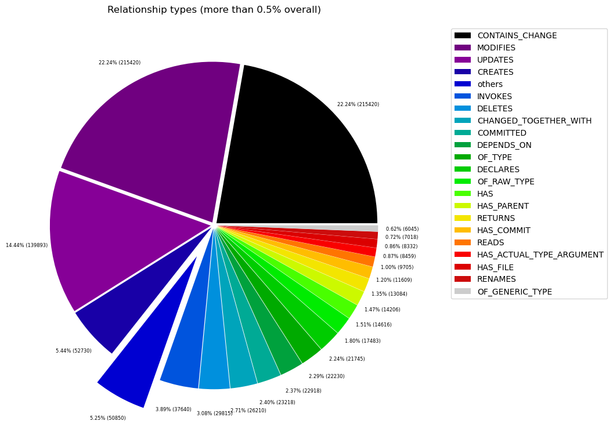
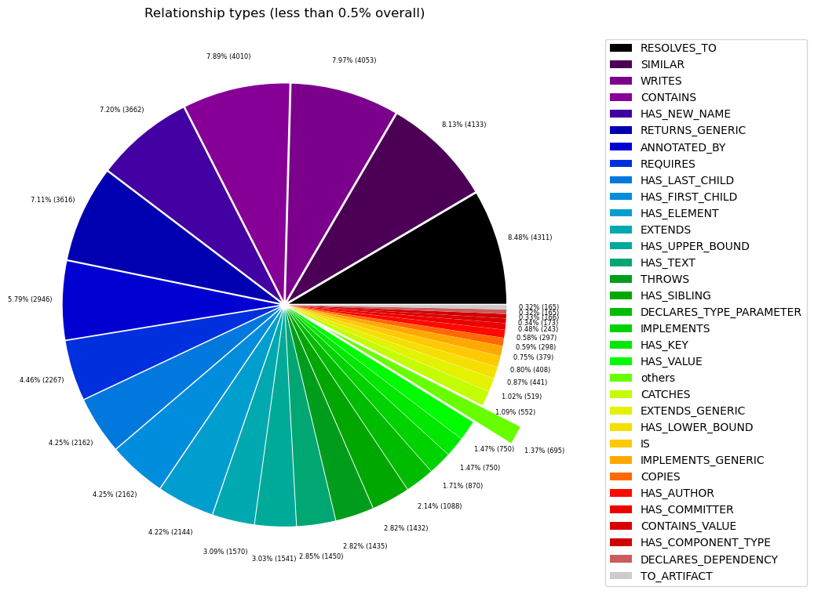

# Overview in General
   

This file contains a general overview of the data in the graph including node labels and relationships types.

### References
- [jqassistant](https://jqassistant.org)
- [Neo4j Python Driver](https://neo4j.com/docs/api/python-driver/current)

## Node Labels

### Table 1a - Highest node count by label combination

Lists the 30 label combinations with the highest number of nodes. The labels with the lowest node count are listed in table 1b.
The total list would sum up to the total number of labels (100%).

The whole table can be found in the CSV report `Node_label_combination_count`.

<table border="1" class="dataframe">
  <thead>
    <tr style="text-align: right;">
      <th></th>
      <th>nodeLabels</th>
      <th>nodesWithThatLabels</th>
      <th>nodesWithThatLabelsPercent</th>
    </tr>
  </thead>
  <tbody>
    <tr>
      <th>0</th>
      <td>[Git, Update, Change]</td>
      <td>139893</td>
      <td>46.015769</td>
    </tr>
    <tr>
      <th>1</th>
      <td>[Git, Change, Create]</td>
      <td>45414</td>
      <td>14.938275</td>
    </tr>
    <tr>
      <th>2</th>
      <td>[Git, Change, Delete]</td>
      <td>22797</td>
      <td>7.498742</td>
    </tr>
    <tr>
      <th>3</th>
      <td>[Java, ByteCode, Member, Method]</td>
      <td>13818</td>
      <td>4.545230</td>
    </tr>
    <tr>
      <th>4</th>
      <td>[Java, ByteCode, Parameter]</td>
      <td>13459</td>
      <td>4.427142</td>
    </tr>
    <tr>
      <th>5</th>
      <td>[Git, Commit]</td>
      <td>11609</td>
      <td>3.818612</td>
    </tr>
    <tr>
      <th>6</th>
      <td>[File, Git]</td>
      <td>8332</td>
      <td>2.740690</td>
    </tr>
    <tr>
      <th>7</th>
      <td>[Java, ByteCode, Bound, ParameterizedType]</td>
      <td>7323</td>
      <td>2.408794</td>
    </tr>
    <tr>
      <th>8</th>
      <td>[Java, ByteCode, Bound]</td>
      <td>7320</td>
      <td>2.407808</td>
    </tr>
    <tr>
      <th>9</th>
      <td>[Git, Change, Rename]</td>
      <td>7018</td>
      <td>2.308469</td>
    </tr>
    <tr>
      <th>10</th>
      <td>[Java, ByteCode, Member, Field]</td>
      <td>3724</td>
      <td>1.224956</td>
    </tr>
    <tr>
      <th>11</th>
      <td>[Java, Value, ByteCode, Annotation]</td>
      <td>2958</td>
      <td>0.972991</td>
    </tr>
    <tr>
      <th>12</th>
      <td>[Java, ByteCode, Bound, WildcardType]</td>
      <td>2950</td>
      <td>0.970360</td>
    </tr>
    <tr>
      <th>13</th>
      <td>[Java, ByteCode, Member, Method, Constructor]</td>
      <td>2180</td>
      <td>0.717079</td>
    </tr>
    <tr>
      <th>14</th>
      <td>[Xml, Element]</td>
      <td>2162</td>
      <td>0.711158</td>
    </tr>
    <tr>
      <th>15</th>
      <td>[Xml, Text]</td>
      <td>1450</td>
      <td>0.476956</td>
    </tr>
    <tr>
      <th>16</th>
      <td>[Java, ByteCode, TypeVariable, Bound]</td>
      <td>1112</td>
      <td>0.365776</td>
    </tr>
    <tr>
      <th>17</th>
      <td>[Java, ByteCode, Member, Method, Lambda]</td>
      <td>986</td>
      <td>0.324330</td>
    </tr>
    <tr>
      <th>18</th>
      <td>[Type, File, Java, ByteCode, ResolvedDuplicate...</td>
      <td>903</td>
      <td>0.297029</td>
    </tr>
    <tr>
      <th>19</th>
      <td>[Type, File, Java, Class, ByteCode]</td>
      <td>869</td>
      <td>0.285845</td>
    </tr>
    <tr>
      <th>20</th>
      <td>[Json, Key]</td>
      <td>750</td>
      <td>0.246702</td>
    </tr>
    <tr>
      <th>21</th>
      <td>[Value, Json, Scalar]</td>
      <td>734</td>
      <td>0.241439</td>
    </tr>
    <tr>
      <th>22</th>
      <td>[Java, Value, ByteCode, Primitive]</td>
      <td>686</td>
      <td>0.225650</td>
    </tr>
    <tr>
      <th>23</th>
      <td>[Type, File, Java, ByteCode, JavaType]</td>
      <td>659</td>
      <td>0.216768</td>
    </tr>
    <tr>
      <th>24</th>
      <td>[Java, GenericDeclaration, ByteCode, Member, M...</td>
      <td>579</td>
      <td>0.190454</td>
    </tr>
    <tr>
      <th>25</th>
      <td>[Type, File, Java, ByteCode, ExternalType]</td>
      <td>419</td>
      <td>0.137824</td>
    </tr>
    <tr>
      <th>26</th>
      <td>[Git, Change, Copy]</td>
      <td>298</td>
      <td>0.098023</td>
    </tr>
    <tr>
      <th>27</th>
      <td>[Author, Git, Person]</td>
      <td>297</td>
      <td>0.097694</td>
    </tr>
    <tr>
      <th>28</th>
      <td>[Value, Array]</td>
      <td>294</td>
      <td>0.096707</td>
    </tr>
    <tr>
      <th>29</th>
      <td>[Committer, Git, Person]</td>
      <td>243</td>
      <td>0.079931</td>
    </tr>
  </tbody>
</table>

### Chart 1a - Highest node count by label combination

Values under 0.5% will be grouped into "others" to get a cleaner plot. The group "others" is then broken down in Chart 1b.

    <Figure size 640x480 with 0 Axes>

    

    

### Table 1b - Lowest node count by label combination

Lists the 30 label combinations with the lowest number of nodes until they reach 0.5% of the total node count, which are shown above.

<table border="1" class="dataframe">
  <thead>
    <tr style="text-align: right;">
      <th></th>
      <th>nodeLabels</th>
      <th>nodesWithThatLabels</th>
      <th>nodesWithThatLabelsPercent</th>
    </tr>
  </thead>
  <tbody>
    <tr>
      <th>0</th>
      <td>[Analyze, Task, jQAssistant]</td>
      <td>1</td>
      <td>0.000329</td>
    </tr>
    <tr>
      <th>1</th>
      <td>[Repository, File, Git]</td>
      <td>1</td>
      <td>0.000329</td>
    </tr>
    <tr>
      <th>2</th>
      <td>[Git, Branch]</td>
      <td>1</td>
      <td>0.000329</td>
    </tr>
    <tr>
      <th>3</th>
      <td>[File, Json]</td>
      <td>2</td>
      <td>0.000658</td>
    </tr>
    <tr>
      <th>4</th>
      <td>[File]</td>
      <td>3</td>
      <td>0.000987</td>
    </tr>
    <tr>
      <th>5</th>
      <td>[Java, GenericDeclaration, ByteCode, Member, M...</td>
      <td>4</td>
      <td>0.001316</td>
    </tr>
    <tr>
      <th>6</th>
      <td>[Maven, Exclusion]</td>
      <td>5</td>
      <td>0.001645</td>
    </tr>
    <tr>
      <th>7</th>
      <td>[Value, Array, Json]</td>
      <td>6</td>
      <td>0.001974</td>
    </tr>
    <tr>
      <th>8</th>
      <td>[Type, File, Java, ByteCode, Void]</td>
      <td>9</td>
      <td>0.002960</td>
    </tr>
    <tr>
      <th>9</th>
      <td>[File, Maven, Xml, Pom, Document]</td>
      <td>9</td>
      <td>0.002960</td>
    </tr>
    <tr>
      <th>10</th>
      <td>[File, Java, Manifest]</td>
      <td>9</td>
      <td>0.002960</td>
    </tr>
    <tr>
      <th>11</th>
      <td>[Java, ManifestSection]</td>
      <td>9</td>
      <td>0.002960</td>
    </tr>
    <tr>
      <th>12</th>
      <td>[File, Artifact, Jar, Archive, Zip, Java]</td>
      <td>9</td>
      <td>0.002960</td>
    </tr>
    <tr>
      <th>13</th>
      <td>[File, Java, ServiceLoader]</td>
      <td>11</td>
      <td>0.003618</td>
    </tr>
    <tr>
      <th>14</th>
      <td>[File, Java, Properties]</td>
      <td>12</td>
      <td>0.003947</td>
    </tr>
    <tr>
      <th>15</th>
      <td>[Maven, PluginExecution]</td>
      <td>16</td>
      <td>0.005263</td>
    </tr>
    <tr>
      <th>16</th>
      <td>[Maven, ExecutionGoal]</td>
      <td>16</td>
      <td>0.005263</td>
    </tr>
    <tr>
      <th>17</th>
      <td>[Xml, Attribute]</td>
      <td>18</td>
      <td>0.005921</td>
    </tr>
    <tr>
      <th>18</th>
      <td>[jQAssistant, Rule, Concept]</td>
      <td>19</td>
      <td>0.006250</td>
    </tr>
    <tr>
      <th>19</th>
      <td>[Type, File, Java, ByteCode, Throwable, Extern...</td>
      <td>21</td>
      <td>0.006908</td>
    </tr>
    <tr>
      <th>20</th>
      <td>[Maven, Configuration]</td>
      <td>21</td>
      <td>0.006908</td>
    </tr>
    <tr>
      <th>21</th>
      <td>[Maven, Plugin]</td>
      <td>21</td>
      <td>0.006908</td>
    </tr>
    <tr>
      <th>22</th>
      <td>[Type, File, Java, ByteCode, Throwable, Resolv...</td>
      <td>22</td>
      <td>0.007237</td>
    </tr>
    <tr>
      <th>23</th>
      <td>[Type, File, Java, ByteCode, Enum]</td>
      <td>30</td>
      <td>0.009868</td>
    </tr>
    <tr>
      <th>24</th>
      <td>[Type, File, Java, ByteCode, PrimitiveType]</td>
      <td>31</td>
      <td>0.010197</td>
    </tr>
    <tr>
      <th>25</th>
      <td>[Xml, Namespace]</td>
      <td>36</td>
      <td>0.011842</td>
    </tr>
    <tr>
      <th>26</th>
      <td>[Type, File, Java, ByteCode, Annotation]</td>
      <td>44</td>
      <td>0.014473</td>
    </tr>
    <tr>
      <th>27</th>
      <td>[File, Directory]</td>
      <td>45</td>
      <td>0.014802</td>
    </tr>
    <tr>
      <th>28</th>
      <td>[Type, File, Java, Class, ByteCode, Throwable]</td>
      <td>56</td>
      <td>0.018420</td>
    </tr>
    <tr>
      <th>29</th>
      <td>[Type, File, Java, GenericDeclaration, ByteCod...</td>
      <td>85</td>
      <td>0.027960</td>
    </tr>
  </tbody>
</table>

### Chart 1b - Lowest node count by label combination

Shows the lowest (less than 0.5% overall) node count label combinations. Therefore, this plot breaks down the "others" slice of the pie chart above. Values under 0.01% will be grouped into "others" to get a cleaner plot.

    <Figure size 640x480 with 0 Axes>

    

    

### Table 1c - Highest node count by single label

Lists the 40 labels with the highest number of nodes.
Doesn't sum up to the total number of nodes or 100% because one node can have multiple labels.
Helps to identify commonly used labels.

<table border="1" class="dataframe">
  <thead>
    <tr style="text-align: right;">
      <th></th>
      <th>nodeLabel</th>
      <th>nodesWithThatLabel</th>
      <th>nodesWithThatLabelPercent</th>
    </tr>
  </thead>
  <tbody>
    <tr>
      <th>0</th>
      <td>Git</td>
      <td>236036</td>
      <td>77.640612</td>
    </tr>
    <tr>
      <th>1</th>
      <td>Change</td>
      <td>215420</td>
      <td>70.859278</td>
    </tr>
    <tr>
      <th>2</th>
      <td>Update</td>
      <td>139893</td>
      <td>46.015769</td>
    </tr>
    <tr>
      <th>3</th>
      <td>Java</td>
      <td>61592</td>
      <td>20.259793</td>
    </tr>
    <tr>
      <th>4</th>
      <td>ByteCode</td>
      <td>61396</td>
      <td>20.195322</td>
    </tr>
    <tr>
      <th>5</th>
      <td>Create</td>
      <td>45414</td>
      <td>14.938275</td>
    </tr>
    <tr>
      <th>6</th>
      <td>Delete</td>
      <td>22797</td>
      <td>7.498742</td>
    </tr>
    <tr>
      <th>7</th>
      <td>Member</td>
      <td>21291</td>
      <td>7.003365</td>
    </tr>
    <tr>
      <th>8</th>
      <td>Bound</td>
      <td>18871</td>
      <td>6.207341</td>
    </tr>
    <tr>
      <th>9</th>
      <td>Method</td>
      <td>17567</td>
      <td>5.778409</td>
    </tr>
    <tr>
      <th>10</th>
      <td>Parameter</td>
      <td>13459</td>
      <td>4.427142</td>
    </tr>
    <tr>
      <th>11</th>
      <td>File</td>
      <td>12362</td>
      <td>4.066300</td>
    </tr>
    <tr>
      <th>12</th>
      <td>Commit</td>
      <td>11609</td>
      <td>3.818612</td>
    </tr>
    <tr>
      <th>13</th>
      <td>ParameterizedType</td>
      <td>7323</td>
      <td>2.408794</td>
    </tr>
    <tr>
      <th>14</th>
      <td>Rename</td>
      <td>7018</td>
      <td>2.308469</td>
    </tr>
    <tr>
      <th>15</th>
      <td>Value</td>
      <td>5543</td>
      <td>1.823289</td>
    </tr>
    <tr>
      <th>16</th>
      <td>Type</td>
      <td>3783</td>
      <td>1.244363</td>
    </tr>
    <tr>
      <th>17</th>
      <td>Field</td>
      <td>3724</td>
      <td>1.224956</td>
    </tr>
    <tr>
      <th>18</th>
      <td>Xml</td>
      <td>3675</td>
      <td>1.208838</td>
    </tr>
    <tr>
      <th>19</th>
      <td>Annotation</td>
      <td>3002</td>
      <td>0.987464</td>
    </tr>
    <tr>
      <th>20</th>
      <td>WildcardType</td>
      <td>2950</td>
      <td>0.970360</td>
    </tr>
    <tr>
      <th>21</th>
      <td>Constructor</td>
      <td>2184</td>
      <td>0.718395</td>
    </tr>
    <tr>
      <th>22</th>
      <td>Element</td>
      <td>2162</td>
      <td>0.711158</td>
    </tr>
    <tr>
      <th>23</th>
      <td>Json</td>
      <td>1677</td>
      <td>0.551625</td>
    </tr>
    <tr>
      <th>24</th>
      <td>Text</td>
      <td>1450</td>
      <td>0.476956</td>
    </tr>
    <tr>
      <th>25</th>
      <td>Class</td>
      <td>1357</td>
      <td>0.446365</td>
    </tr>
    <tr>
      <th>26</th>
      <td>TypeVariable</td>
      <td>1112</td>
      <td>0.365776</td>
    </tr>
    <tr>
      <th>27</th>
      <td>Lambda</td>
      <td>986</td>
      <td>0.324330</td>
    </tr>
    <tr>
      <th>28</th>
      <td>ResolvedDuplicateType</td>
      <td>925</td>
      <td>0.304265</td>
    </tr>
    <tr>
      <th>29</th>
      <td>GenericDeclaration</td>
      <td>905</td>
      <td>0.297687</td>
    </tr>
    <tr>
      <th>30</th>
      <td>JavaType</td>
      <td>766</td>
      <td>0.251965</td>
    </tr>
    <tr>
      <th>31</th>
      <td>Key</td>
      <td>750</td>
      <td>0.246702</td>
    </tr>
    <tr>
      <th>32</th>
      <td>Scalar</td>
      <td>734</td>
      <td>0.241439</td>
    </tr>
    <tr>
      <th>33</th>
      <td>Primitive</td>
      <td>686</td>
      <td>0.225650</td>
    </tr>
    <tr>
      <th>34</th>
      <td>Person</td>
      <td>540</td>
      <td>0.177625</td>
    </tr>
    <tr>
      <th>35</th>
      <td>ExternalType</td>
      <td>536</td>
      <td>0.176309</td>
    </tr>
    <tr>
      <th>36</th>
      <td>Maven</td>
      <td>346</td>
      <td>0.113812</td>
    </tr>
    <tr>
      <th>37</th>
      <td>Array</td>
      <td>300</td>
      <td>0.098681</td>
    </tr>
    <tr>
      <th>38</th>
      <td>Copy</td>
      <td>298</td>
      <td>0.098023</td>
    </tr>
    <tr>
      <th>39</th>
      <td>Author</td>
      <td>297</td>
      <td>0.097694</td>
    </tr>
  </tbody>
</table>

### Chart 1c - Highest node count by label

Shows the 40 labels with the highest number of nodes.

    <Figure size 640x480 with 0 Axes>

    

    

## Relationship Types

### Table 2a - Highest relationship count by type

Lists the 30 relationship types with the highest number of occurrences.
The whole table can be found in the CSV report `Relationship_type_count`.

    Total number of relationships: 968664

<table border="1" class="dataframe">
  <thead>
    <tr style="text-align: right;">
      <th></th>
      <th>relationshipType</th>
      <th>nodesWithThatRelationshipType</th>
      <th>nodesWithThatRelationshipTypePercent</th>
    </tr>
  </thead>
  <tbody>
    <tr>
      <th>0</th>
      <td>CONTAINS_CHANGE</td>
      <td>215420</td>
      <td>22.238877</td>
    </tr>
    <tr>
      <th>1</th>
      <td>MODIFIES</td>
      <td>215420</td>
      <td>22.238877</td>
    </tr>
    <tr>
      <th>2</th>
      <td>UPDATES</td>
      <td>139893</td>
      <td>14.441850</td>
    </tr>
    <tr>
      <th>3</th>
      <td>CREATES</td>
      <td>52730</td>
      <td>5.443580</td>
    </tr>
    <tr>
      <th>4</th>
      <td>INVOKES</td>
      <td>37644</td>
      <td>3.886177</td>
    </tr>
    <tr>
      <th>5</th>
      <td>DELETES</td>
      <td>29815</td>
      <td>3.077951</td>
    </tr>
    <tr>
      <th>6</th>
      <td>CHANGED_TOGETHER_WITH</td>
      <td>26210</td>
      <td>2.705789</td>
    </tr>
    <tr>
      <th>7</th>
      <td>COMMITTED</td>
      <td>23218</td>
      <td>2.396910</td>
    </tr>
    <tr>
      <th>8</th>
      <td>DEPENDS_ON</td>
      <td>22918</td>
      <td>2.365939</td>
    </tr>
    <tr>
      <th>9</th>
      <td>OF_TYPE</td>
      <td>22230</td>
      <td>2.294913</td>
    </tr>
    <tr>
      <th>10</th>
      <td>DECLARES</td>
      <td>21756</td>
      <td>2.245980</td>
    </tr>
    <tr>
      <th>11</th>
      <td>OF_RAW_TYPE</td>
      <td>17483</td>
      <td>1.804857</td>
    </tr>
    <tr>
      <th>12</th>
      <td>HAS</td>
      <td>14616</td>
      <td>1.508882</td>
    </tr>
    <tr>
      <th>13</th>
      <td>HAS_PARENT</td>
      <td>14206</td>
      <td>1.466556</td>
    </tr>
    <tr>
      <th>14</th>
      <td>RETURNS</td>
      <td>13084</td>
      <td>1.350726</td>
    </tr>
    <tr>
      <th>15</th>
      <td>HAS_COMMIT</td>
      <td>11609</td>
      <td>1.198455</td>
    </tr>
    <tr>
      <th>16</th>
      <td>READS</td>
      <td>9705</td>
      <td>1.001895</td>
    </tr>
    <tr>
      <th>17</th>
      <td>HAS_ACTUAL_TYPE_ARGUMENT</td>
      <td>8459</td>
      <td>0.873265</td>
    </tr>
    <tr>
      <th>18</th>
      <td>HAS_FILE</td>
      <td>8332</td>
      <td>0.860154</td>
    </tr>
    <tr>
      <th>19</th>
      <td>RENAMES</td>
      <td>7018</td>
      <td>0.724503</td>
    </tr>
    <tr>
      <th>20</th>
      <td>OF_GENERIC_TYPE</td>
      <td>6045</td>
      <td>0.624055</td>
    </tr>
    <tr>
      <th>21</th>
      <td>RESOLVES_TO</td>
      <td>4311</td>
      <td>0.445046</td>
    </tr>
    <tr>
      <th>22</th>
      <td>SIMILAR</td>
      <td>4133</td>
      <td>0.426670</td>
    </tr>
    <tr>
      <th>23</th>
      <td>WRITES</td>
      <td>4053</td>
      <td>0.418411</td>
    </tr>
    <tr>
      <th>24</th>
      <td>CONTAINS</td>
      <td>4010</td>
      <td>0.413972</td>
    </tr>
    <tr>
      <th>25</th>
      <td>HAS_NEW_NAME</td>
      <td>3662</td>
      <td>0.378046</td>
    </tr>
    <tr>
      <th>26</th>
      <td>RETURNS_GENERIC</td>
      <td>3616</td>
      <td>0.373298</td>
    </tr>
    <tr>
      <th>27</th>
      <td>ANNOTATED_BY</td>
      <td>2946</td>
      <td>0.304130</td>
    </tr>
    <tr>
      <th>28</th>
      <td>REQUIRES</td>
      <td>2267</td>
      <td>0.234034</td>
    </tr>
    <tr>
      <th>29</th>
      <td>HAS_FIRST_CHILD</td>
      <td>2162</td>
      <td>0.223194</td>
    </tr>
  </tbody>
</table>

### Chart 2a - Highest relationship count by type

Values under 0.5% will be grouped into "others" to get a cleaner plot. The group "others" is then broken down in the second chart.

    <Figure size 640x480 with 0 Axes>

    

    

### Table 2b - Lowest relationship count by type

Lists the 30 relationships type with the lowest number of occurrences up to 0.5% of the total node count. This is essentially breaking down the "others" slice from the chart above.

<table border="1" class="dataframe">
  <thead>
    <tr style="text-align: right;">
      <th></th>
      <th>relationshipType</th>
      <th>nodesWithThatRelationshipType</th>
      <th>nodesWithThatRelationshipTypePercent</th>
    </tr>
  </thead>
  <tbody>
    <tr>
      <th>0</th>
      <td>HAS_PROPERTY</td>
      <td>1</td>
      <td>0.000103</td>
    </tr>
    <tr>
      <th>1</th>
      <td>HAS_BRANCH</td>
      <td>1</td>
      <td>0.000103</td>
    </tr>
    <tr>
      <th>2</th>
      <td>HAS_HEAD</td>
      <td>2</td>
      <td>0.000206</td>
    </tr>
    <tr>
      <th>3</th>
      <td>EXCLUDES</td>
      <td>5</td>
      <td>0.000516</td>
    </tr>
    <tr>
      <th>4</th>
      <td>THROWS_GENERIC</td>
      <td>5</td>
      <td>0.000516</td>
    </tr>
    <tr>
      <th>5</th>
      <td>DESCRIBES</td>
      <td>9</td>
      <td>0.000929</td>
    </tr>
    <tr>
      <th>6</th>
      <td>HAS_ROOT_ELEMENT</td>
      <td>10</td>
      <td>0.001032</td>
    </tr>
    <tr>
      <th>7</th>
      <td>HAS_EXECUTION</td>
      <td>16</td>
      <td>0.001652</td>
    </tr>
    <tr>
      <th>8</th>
      <td>HAS_GOAL</td>
      <td>16</td>
      <td>0.001652</td>
    </tr>
    <tr>
      <th>9</th>
      <td>HAS_ATTRIBUTE</td>
      <td>18</td>
      <td>0.001858</td>
    </tr>
    <tr>
      <th>10</th>
      <td>OF_NAMESPACE</td>
      <td>18</td>
      <td>0.001858</td>
    </tr>
    <tr>
      <th>11</th>
      <td>INCLUDES_CONCEPT</td>
      <td>19</td>
      <td>0.001961</td>
    </tr>
    <tr>
      <th>12</th>
      <td>IS_ARTIFACT</td>
      <td>21</td>
      <td>0.002168</td>
    </tr>
    <tr>
      <th>13</th>
      <td>HAS_CONFIGURATION</td>
      <td>21</td>
      <td>0.002168</td>
    </tr>
    <tr>
      <th>14</th>
      <td>USES_PLUGIN</td>
      <td>21</td>
      <td>0.002168</td>
    </tr>
    <tr>
      <th>15</th>
      <td>REQUIRES_TYPE_PARAMETER</td>
      <td>24</td>
      <td>0.002478</td>
    </tr>
    <tr>
      <th>16</th>
      <td>REQUIRES_CONCEPT</td>
      <td>28</td>
      <td>0.002891</td>
    </tr>
    <tr>
      <th>17</th>
      <td>DECLARES_NAMESPACE</td>
      <td>36</td>
      <td>0.003716</td>
    </tr>
    <tr>
      <th>18</th>
      <td>HAS_DEFAULT</td>
      <td>39</td>
      <td>0.004026</td>
    </tr>
    <tr>
      <th>19</th>
      <td>COPY_OF</td>
      <td>119</td>
      <td>0.012285</td>
    </tr>
    <tr>
      <th>20</th>
      <td>HAS_TAG</td>
      <td>133</td>
      <td>0.013730</td>
    </tr>
    <tr>
      <th>21</th>
      <td>ON_COMMIT</td>
      <td>133</td>
      <td>0.013730</td>
    </tr>
    <tr>
      <th>22</th>
      <td>TO_ARTIFACT</td>
      <td>165</td>
      <td>0.017034</td>
    </tr>
    <tr>
      <th>23</th>
      <td>DECLARES_DEPENDENCY</td>
      <td>165</td>
      <td>0.017034</td>
    </tr>
    <tr>
      <th>24</th>
      <td>HAS_COMPONENT_TYPE</td>
      <td>166</td>
      <td>0.017137</td>
    </tr>
    <tr>
      <th>25</th>
      <td>CONTAINS_VALUE</td>
      <td>173</td>
      <td>0.017860</td>
    </tr>
    <tr>
      <th>26</th>
      <td>HAS_COMMITTER</td>
      <td>243</td>
      <td>0.025086</td>
    </tr>
    <tr>
      <th>27</th>
      <td>HAS_AUTHOR</td>
      <td>297</td>
      <td>0.030661</td>
    </tr>
    <tr>
      <th>28</th>
      <td>COPIES</td>
      <td>298</td>
      <td>0.030764</td>
    </tr>
    <tr>
      <th>29</th>
      <td>IMPLEMENTS_GENERIC</td>
      <td>379</td>
      <td>0.039126</td>
    </tr>
  </tbody>
</table>

### Chart 2b - Lowest relationship count by type

Shows the lowest (less than 0.5% overall) relationship types. This plot breaks down the "others" slice of the pie chart above. Values under 0.01% will be grouped into "others" to get a cleaner plot.

    <Figure size 640x480 with 0 Axes>

    

    

## Node labels with their relationships

### Table 3a - Highest relationship count by node labels and relationship type

Lists the 30 node labels and their relationship types with the highest number of occurrences.

<table border="1" class="dataframe">
  <thead>
    <tr style="text-align: right;">
      <th></th>
      <th>sourceLabels</th>
      <th>relationType</th>
      <th>targetLabels</th>
      <th>numberOfRelationships</th>
      <th>numberOfNodesWithSameLabelsAsSource</th>
      <th>numberOfNodesWithSameLabelsAsTarget</th>
      <th>densityInPercent</th>
    </tr>
  </thead>
  <tbody>
    <tr>
      <th>0</th>
      <td>[Git, Commit]</td>
      <td>CONTAINS_CHANGE</td>
      <td>[Git, Update, Change]</td>
      <td>139893</td>
      <td>11609</td>
      <td>139893</td>
      <td>0.008614</td>
    </tr>
    <tr>
      <th>1</th>
      <td>[Git, Update, Change]</td>
      <td>MODIFIES</td>
      <td>[File, Git]</td>
      <td>139893</td>
      <td>139893</td>
      <td>8332</td>
      <td>0.012002</td>
    </tr>
    <tr>
      <th>2</th>
      <td>[Git, Update, Change]</td>
      <td>UPDATES</td>
      <td>[File, Git]</td>
      <td>139893</td>
      <td>139893</td>
      <td>8332</td>
      <td>0.012002</td>
    </tr>
    <tr>
      <th>3</th>
      <td>[Git, Commit]</td>
      <td>CONTAINS_CHANGE</td>
      <td>[Git, Change, Create]</td>
      <td>45414</td>
      <td>11609</td>
      <td>45414</td>
      <td>0.008614</td>
    </tr>
    <tr>
      <th>4</th>
      <td>[Git, Change, Create]</td>
      <td>CREATES</td>
      <td>[File, Git]</td>
      <td>45414</td>
      <td>45414</td>
      <td>8332</td>
      <td>0.012002</td>
    </tr>
    <tr>
      <th>5</th>
      <td>[Git, Change, Create]</td>
      <td>MODIFIES</td>
      <td>[File, Git]</td>
      <td>45414</td>
      <td>45414</td>
      <td>8332</td>
      <td>0.012002</td>
    </tr>
    <tr>
      <th>6</th>
      <td>[Java, ByteCode, Member, Method]</td>
      <td>INVOKES</td>
      <td>[Java, ByteCode, Member, Method]</td>
      <td>22985</td>
      <td>13717</td>
      <td>13717</td>
      <td>0.012216</td>
    </tr>
    <tr>
      <th>7</th>
      <td>[Git, Commit]</td>
      <td>CONTAINS_CHANGE</td>
      <td>[Git, Change, Delete]</td>
      <td>22797</td>
      <td>11609</td>
      <td>22797</td>
      <td>0.008614</td>
    </tr>
    <tr>
      <th>8</th>
      <td>[Git, Change, Delete]</td>
      <td>MODIFIES</td>
      <td>[File, Git]</td>
      <td>22797</td>
      <td>22797</td>
      <td>8332</td>
      <td>0.012002</td>
    </tr>
    <tr>
      <th>9</th>
      <td>[Git, Change, Delete]</td>
      <td>DELETES</td>
      <td>[File, Git]</td>
      <td>22797</td>
      <td>22797</td>
      <td>8332</td>
      <td>0.012002</td>
    </tr>
    <tr>
      <th>10</th>
      <td>[File, Git]</td>
      <td>CHANGED_TOGETHER_WITH</td>
      <td>[File, Git]</td>
      <td>20075</td>
      <td>8332</td>
      <td>8332</td>
      <td>0.028917</td>
    </tr>
    <tr>
      <th>11</th>
      <td>[Git, Commit]</td>
      <td>HAS_PARENT</td>
      <td>[Git, Commit]</td>
      <td>14197</td>
      <td>11609</td>
      <td>11609</td>
      <td>0.010534</td>
    </tr>
    <tr>
      <th>12</th>
      <td>[Repository, File, Git]</td>
      <td>HAS_COMMIT</td>
      <td>[Git, Commit]</td>
      <td>11609</td>
      <td>1</td>
      <td>11609</td>
      <td>100.000000</td>
    </tr>
    <tr>
      <th>13</th>
      <td>[Author, Git, Person]</td>
      <td>COMMITTED</td>
      <td>[Git, Commit]</td>
      <td>11609</td>
      <td>297</td>
      <td>11609</td>
      <td>0.336700</td>
    </tr>
    <tr>
      <th>14</th>
      <td>[Committer, Git, Person]</td>
      <td>COMMITTED</td>
      <td>[Git, Commit]</td>
      <td>11609</td>
      <td>243</td>
      <td>11609</td>
      <td>0.411523</td>
    </tr>
    <tr>
      <th>15</th>
      <td>[Java, ByteCode, Member, Method]</td>
      <td>READS</td>
      <td>[Java, ByteCode, Member, Field]</td>
      <td>8730</td>
      <td>13717</td>
      <td>3724</td>
      <td>0.017090</td>
    </tr>
    <tr>
      <th>16</th>
      <td>[Java, ByteCode, Member, Method]</td>
      <td>HAS</td>
      <td>[Java, ByteCode, Parameter]</td>
      <td>8602</td>
      <td>13717</td>
      <td>13459</td>
      <td>0.004659</td>
    </tr>
    <tr>
      <th>17</th>
      <td>[Repository, File, Git]</td>
      <td>HAS_FILE</td>
      <td>[File, Git]</td>
      <td>8332</td>
      <td>1</td>
      <td>8332</td>
      <td>100.000000</td>
    </tr>
    <tr>
      <th>18</th>
      <td>[Git, Commit]</td>
      <td>CONTAINS_CHANGE</td>
      <td>[Git, Change, Rename]</td>
      <td>7018</td>
      <td>11609</td>
      <td>7018</td>
      <td>0.008614</td>
    </tr>
    <tr>
      <th>19</th>
      <td>[Git, Change, Rename]</td>
      <td>MODIFIES</td>
      <td>[File, Git]</td>
      <td>7018</td>
      <td>7018</td>
      <td>8332</td>
      <td>0.012002</td>
    </tr>
    <tr>
      <th>20</th>
      <td>[Git, Change, Rename]</td>
      <td>CREATES</td>
      <td>[File, Git]</td>
      <td>7018</td>
      <td>7018</td>
      <td>8332</td>
      <td>0.012002</td>
    </tr>
    <tr>
      <th>21</th>
      <td>[Git, Change, Rename]</td>
      <td>RENAMES</td>
      <td>[File, Git]</td>
      <td>7018</td>
      <td>7018</td>
      <td>8332</td>
      <td>0.012002</td>
    </tr>
    <tr>
      <th>22</th>
      <td>[Git, Change, Rename]</td>
      <td>DELETES</td>
      <td>[File, Git]</td>
      <td>7018</td>
      <td>7018</td>
      <td>8332</td>
      <td>0.012002</td>
    </tr>
    <tr>
      <th>23</th>
      <td>[Java, ByteCode, Parameter]</td>
      <td>OF_TYPE</td>
      <td>[Type, File, Java, ByteCode, JavaType]</td>
      <td>6243</td>
      <td>13459</td>
      <td>659</td>
      <td>0.070387</td>
    </tr>
    <tr>
      <th>24</th>
      <td>[File, Git]</td>
      <td>HAS_NEW_NAME</td>
      <td>[File, Git]</td>
      <td>3662</td>
      <td>8332</td>
      <td>8332</td>
      <td>0.005275</td>
    </tr>
    <tr>
      <th>25</th>
      <td>[Java, ByteCode, Bound]</td>
      <td>OF_RAW_TYPE</td>
      <td>[Type, File, Java, ByteCode, JavaType]</td>
      <td>3501</td>
      <td>7320</td>
      <td>659</td>
      <td>0.072576</td>
    </tr>
    <tr>
      <th>26</th>
      <td>[Java, ByteCode, Bound, ParameterizedType]</td>
      <td>OF_RAW_TYPE</td>
      <td>[Type, File, Java, ByteCode, JavaType]</td>
      <td>3151</td>
      <td>7323</td>
      <td>659</td>
      <td>0.065294</td>
    </tr>
    <tr>
      <th>27</th>
      <td>[Java, ByteCode, Bound, ParameterizedType]</td>
      <td>HAS_ACTUAL_TYPE_ARGUMENT</td>
      <td>[Java, ByteCode, Bound, WildcardType]</td>
      <td>2950</td>
      <td>7323</td>
      <td>2950</td>
      <td>0.013656</td>
    </tr>
    <tr>
      <th>28</th>
      <td>[Java, ByteCode, Parameter]</td>
      <td>OF_GENERIC_TYPE</td>
      <td>[Java, ByteCode, Bound, ParameterizedType]</td>
      <td>2712</td>
      <td>13459</td>
      <td>7323</td>
      <td>0.002752</td>
    </tr>
    <tr>
      <th>29</th>
      <td>[Java, ByteCode, Member, Method, Constructor]</td>
      <td>WRITES</td>
      <td>[Java, ByteCode, Member, Field]</td>
      <td>2585</td>
      <td>2180</td>
      <td>3724</td>
      <td>0.031842</td>
    </tr>
  </tbody>
</table>

## Graph Density

    total_number_of_nodes (vertices): 304011
    total_number_of_relationships (edges): 968664
    -> total directed graph density: 1.0480837616643907e-05
    -> total directed graph density in percent: 0.0010480837616643906

