# git log/history
   

### References
- [Visualizing Code: Polyglot Notebooks Repository (YouTube)](https://youtu.be/ipOpToPS-PY?si=3doePt2cp-LgEUmt)
- [gitstractor (GitHub)](https://github.com/IntegerMan/gitstractor)
- [Neo4j Python Driver](https://neo4j.com/docs/api/python-driver/current)

    Command line execution (CLI mode): Yes

## Git History - Directory Commit Statistics

### Data Preview

<table border="1" class="dataframe">
  <thead>
    <tr style="text-align: right;">
      <th></th>
      <th>fileCount</th>
      <th>authorCount</th>
      <th>commitCount</th>
      <th>daysSinceLastCommit</th>
      <th>daysSinceLastCreation</th>
      <th>daysSinceLastModification</th>
    </tr>
  </thead>
  <tbody>
    <tr>
      <th>count</th>
      <td>653.000000</td>
      <td>653.000000</td>
      <td>653.000000</td>
      <td>653.000000</td>
      <td>653.000000</td>
      <td>653.000000</td>
    </tr>
    <tr>
      <th>mean</th>
      <td>23.142420</td>
      <td>12.049005</td>
      <td>179.160796</td>
      <td>91.356815</td>
      <td>132.728943</td>
      <td>97.390505</td>
    </tr>
    <tr>
      <th>std</th>
      <td>112.308595</td>
      <td>12.731924</td>
      <td>369.245687</td>
      <td>143.334693</td>
      <td>208.115799</td>
      <td>157.305481</td>
    </tr>
    <tr>
      <th>min</th>
      <td>1.000000</td>
      <td>2.000000</td>
      <td>6.000000</td>
      <td>27.000000</td>
      <td>27.000000</td>
      <td>26.000000</td>
    </tr>
    <tr>
      <th>25%</th>
      <td>2.000000</td>
      <td>4.000000</td>
      <td>19.000000</td>
      <td>27.000000</td>
      <td>27.000000</td>
      <td>27.000000</td>
    </tr>
    <tr>
      <th>50%</th>
      <td>5.000000</td>
      <td>8.000000</td>
      <td>48.000000</td>
      <td>38.000000</td>
      <td>38.000000</td>
      <td>37.000000</td>
    </tr>
    <tr>
      <th>75%</th>
      <td>12.000000</td>
      <td>15.000000</td>
      <td>179.000000</td>
      <td>38.000000</td>
      <td>75.000000</td>
      <td>38.000000</td>
    </tr>
    <tr>
      <th>max</th>
      <td>2472.000000</td>
      <td>114.000000</td>
      <td>5836.000000</td>
      <td>502.000000</td>
      <td>2709.000000</td>
      <td>555.000000</td>
    </tr>
  </tbody>
</table>

<table border="1" class="dataframe">
  <thead>
    <tr style="text-align: right;">
      <th></th>
      <th>directoryPath</th>
      <th>directoryParentPath</th>
      <th>directoryName</th>
      <th>fileCount</th>
      <th>firstFile</th>
      <th>mostFrequentFileExtension</th>
      <th>authorCount</th>
      <th>mainAuthor</th>
      <th>secondAuthor</th>
      <th>commitCount</th>
      <th>daysSinceLastCommit</th>
      <th>daysSinceLastCreation</th>
      <th>daysSinceLastModification</th>
      <th>lastCommitDate</th>
      <th>lastCreationDate</th>
      <th>lastModificationDate</th>
      <th>maxCommitSha</th>
    </tr>
  </thead>
  <tbody>
    <tr>
      <th>0</th>
      <td>AxonFramework-5.0.0/.idea/copyright</td>
      <td>AxonFramework-5.0.0/.idea</td>
      <td>copyright</td>
      <td>1</td>
      <td>AxonFramework-5.0.0/.idea/copyright/Axon_Framework_copyright_template.xml</td>
      <td>xml</td>
      <td>2</td>
      <td>Allard Buijze</td>
      <td>Steven van Beelen</td>
      <td>19</td>
      <td>129</td>
      <td>339</td>
      <td>339</td>
      <td>2025-08-08</td>
      <td>2025-01-09</td>
      <td>2025-01-09</td>
      <td>fe926a4970bdf1e538e8e7fb8d147ffdc676e713</td>
    </tr>
    <tr>
      <th>1</th>
      <td>AxonFramework-5.0.0/.idea/inspectionProfiles</td>
      <td>AxonFramework-5.0.0/.idea</td>
      <td>inspectionProfiles</td>
      <td>1</td>
      <td>AxonFramework-5.0.0/.idea/inspectionProfiles/Project_Default.xml</td>
      <td>xml</td>
      <td>5</td>
      <td>Allard Buijze</td>
      <td>Mateusz Nowak</td>
      <td>44</td>
      <td>115</td>
      <td>339</td>
      <td>114</td>
      <td>2025-08-22</td>
      <td>2025-01-09</td>
      <td>2025-08-22</td>
      <td>fe926a4970bdf1e538e8e7fb8d147ffdc676e713</td>
    </tr>
    <tr>
      <th>2</th>
      <td>AxonFramework-5.0.0/axon-framework-bom</td>
      <td>AxonFramework-5.0.0</td>
      <td>axon-framework-bom</td>
      <td>1</td>
      <td>AxonFramework-5.0.0/axon-framework-bom/pom.xml</td>
      <td>xml</td>
      <td>3</td>
      <td>Allard Buijze</td>
      <td>Jan Galinski</td>
      <td>7</td>
      <td>27</td>
      <td>27</td>
      <td>26</td>
      <td>2025-11-18</td>
      <td>2025-11-17</td>
      <td>2025-11-18</td>
      <td>e2a33c1abcb743d9e2add4340d9bf642b1a21641</td>
    </tr>
    <tr>
      <th>3</th>
      <td>AxonFramework-5.0.0/axon-server-connector/src/main/resources/META-INF/services</td>
      <td>AxonFramework-5.0.0/axon-server-connector/src/main</td>
      <td>resources/META-INF/services</td>
      <td>1</td>
      <td>AxonFramework-5.0.0/axon-server-connector/src/main/resources/META-INF/services/org.axonframework.common.configuration.ConfigurationEnhancer</td>
      <td>ConfigurationEnhancer</td>
      <td>11</td>
      <td>Allard Buijze</td>
      <td>Jan Galinski</td>
      <td>78</td>
      <td>38</td>
      <td>40</td>
      <td>40</td>
      <td>2025-11-07</td>
      <td>2025-11-04</td>
      <td>2025-11-04</td>
      <td>fdddb8b6ce37c30237b25549ddefec5a1871a040</td>
    </tr>
    <tr>
      <th>4</th>
      <td>AxonFramework-5.0.0/axon-server-connector/src/test/java/org/axonframework/axonserver/connector/command</td>
      <td>AxonFramework-5.0.0/axon-server-connector/src/test/java/org/axonframework/axonserver/connector</td>
      <td>command</td>
      <td>1</td>
      <td>AxonFramework-5.0.0/axon-server-connector/src/test/java/org/axonframework/axonserver/connector/command/AxonServerCommandBusConnectorTest.java</td>
      <td>java</td>
      <td>7</td>
      <td>Allard Buijze</td>
      <td>Jan Galinski</td>
      <td>61</td>
      <td>27</td>
      <td>130</td>
      <td>26</td>
      <td>2025-11-18</td>
      <td>2025-08-06</td>
      <td>2025-11-18</td>
      <td>f6644279ae27410995706c00816ea3f38464a906</td>
    </tr>
    <tr>
      <th>5</th>
      <td>AxonFramework-5.0.0/axon-server-connector/src/test/resources</td>
      <td>AxonFramework-5.0.0/axon-server-connector/src/test</td>
      <td>resources</td>
      <td>1</td>
      <td>AxonFramework-5.0.0/axon-server-connector/src/test/resources/junit-platform.properties</td>
      <td>properties</td>
      <td>3</td>
      <td>Allard Buijze</td>
      <td>Jan Galinski</td>
      <td>6</td>
      <td>38</td>
      <td>38</td>
      <td>38</td>
      <td>2025-11-07</td>
      <td>2025-11-06</td>
      <td>2025-11-06</td>
      <td>d7929be4a8b9905a880c6cd65e50b29b7f07bef3</td>
    </tr>
    <tr>
      <th>6</th>
      <td>AxonFramework-5.0.0/build/coverage-report</td>
      <td>AxonFramework-5.0.0/build</td>
      <td>coverage-report</td>
      <td>1</td>
      <td>AxonFramework-5.0.0/build/coverage-report/pom.xml</td>
      <td>xml</td>
      <td>3</td>
      <td>Allard Buijze</td>
      <td>Simon Zambrovski</td>
      <td>6</td>
      <td>27</td>
      <td>27</td>
      <td>27</td>
      <td>2025-11-18</td>
      <td>2025-11-17</td>
      <td>2025-11-17</td>
      <td>9ee3ed3b69f2efd4abd7ea071ff34f20679663d5</td>
    </tr>
    <tr>
      <th>7</th>
      <td>AxonFramework-5.0.0/build/parent</td>
      <td>AxonFramework-5.0.0/build</td>
      <td>parent</td>
      <td>1</td>
      <td>AxonFramework-5.0.0/build/parent/pom.xml</td>
      <td>xml</td>
      <td>5</td>
      <td>Allard Buijze</td>
      <td>Jan Galinski</td>
      <td>19</td>
      <td>27</td>
      <td>27</td>
      <td>26</td>
      <td>2025-11-18</td>
      <td>2025-11-17</td>
      <td>2025-11-18</td>
      <td>e2a33c1abcb743d9e2add4340d9bf642b1a21641</td>
    </tr>
    <tr>
      <th>8</th>
      <td>AxonFramework-5.0.0/common/src/main/java/org/axonframework/common/digest</td>
      <td>AxonFramework-5.0.0/common/src/main/java/org/axonframework/common</td>
      <td>digest</td>
      <td>1</td>
      <td>AxonFramework-5.0.0/common/src/main/java/org/axonframework/common/digest/Digester.java</td>
      <td>java</td>
      <td>10</td>
      <td>Allard Buijze</td>
      <td>Frank Versnel</td>
      <td>69</td>
      <td>31</td>
      <td>40</td>
      <td>30</td>
      <td>2025-11-14</td>
      <td>2025-11-04</td>
      <td>2025-11-14</td>
      <td>f4746a871e454c40b72346d541bbcfc9ffc7680d</td>
    </tr>
    <tr>
      <th>9</th>
      <td>AxonFramework-5.0.0/common/src/main/java/org/axonframework/common/io</td>
      <td>AxonFramework-5.0.0/common/src/main/java/org/axonframework/common</td>
      <td>io</td>
      <td>1</td>
      <td>AxonFramework-5.0.0/common/src/main/java/org/axonframework/common/io/IOUtils.java</td>
      <td>java</td>
      <td>14</td>
      <td>Allard Buijze</td>
      <td>Frank Versnel</td>
      <td>87</td>
      <td>31</td>
      <td>40</td>
      <td>30</td>
      <td>2025-11-14</td>
      <td>2025-11-04</td>
      <td>2025-11-14</td>
      <td>fdd51aa788071375721c67bb30bf5709136e974a</td>
    </tr>
    <tr>
      <th>10</th>
      <td>AxonFramework-5.0.0/common/src/main/resources/META-INF/services</td>
      <td>AxonFramework-5.0.0/common/src/main</td>
      <td>resources/META-INF/services</td>
      <td>1</td>
      <td>AxonFramework-5.0.0/common/src/main/resources/META-INF/services/org.axonframework.common.property.PropertyAccessStrategy</td>
      <td>PropertyAccessStrategy</td>
      <td>7</td>
      <td>Allard Buijze</td>
      <td>Jan Galinski</td>
      <td>63</td>
      <td>31</td>
      <td>40</td>
      <td>30</td>
      <td>2025-11-14</td>
      <td>2025-11-04</td>
      <td>2025-11-14</td>
      <td>f911231de7ec9233077061a31818f74064a7f85f</td>
    </tr>
    <tr>
      <th>11</th>
      <td>AxonFramework-5.0.0/common/src/test/java/org/axonframework/common/lifecycle</td>
      <td>AxonFramework-5.0.0/common/src/test/java/org/axonframework/common</td>
      <td>lifecycle</td>
      <td>1</td>
      <td>AxonFramework-5.0.0/common/src/test/java/org/axonframework/common/lifecycle/ShutdownLatchTest.java</td>
      <td>java</td>
      <td>3</td>
      <td>Allard Buijze</td>
      <td>Jan Galinski</td>
      <td>8</td>
      <td>38</td>
      <td>40</td>
      <td>40</td>
      <td>2025-11-07</td>
      <td>2025-11-04</td>
      <td>2025-11-04</td>
      <td>d7929be4a8b9905a880c6cd65e50b29b7f07bef3</td>
    </tr>
    <tr>
      <th>12</th>
      <td>AxonFramework-5.0.0/common/src/test/resources/META-INF/services</td>
      <td>AxonFramework-5.0.0/common/src/test</td>
      <td>resources/META-INF/services</td>
      <td>1</td>
      <td>AxonFramework-5.0.0/common/src/test/resources/META-INF/services/org.axonframework.common.configuration.ConfigurationEnhancer</td>
      <td>ConfigurationEnhancer</td>
      <td>5</td>
      <td>Allard Buijze</td>
      <td>Jan Galinski</td>
      <td>26</td>
      <td>38</td>
      <td>39</td>
      <td>39</td>
      <td>2025-11-07</td>
      <td>2025-11-05</td>
      <td>2025-11-05</td>
      <td>f4746a871e454c40b72346d541bbcfc9ffc7680d</td>
    </tr>
    <tr>
      <th>13</th>
      <td>AxonFramework-5.0.0/conversion/src/main/resources/META-INF/services</td>
      <td>AxonFramework-5.0.0/conversion/src/main</td>
      <td>resources/META-INF/services</td>
      <td>1</td>
      <td>AxonFramework-5.0.0/conversion/src/main/resources/META-INF/services/org.axonframework.conversion.ContentTypeConverter</td>
      <td>ContentTypeConverter</td>
      <td>11</td>
      <td>Allard Buijze</td>
      <td>Christophe Bouhier</td>
      <td>89</td>
      <td>31</td>
      <td>39</td>
      <td>30</td>
      <td>2025-11-14</td>
      <td>2025-11-05</td>
      <td>2025-11-14</td>
      <td>fdd51aa788071375721c67bb30bf5709136e974a</td>
    </tr>
    <tr>
      <th>14</th>
      <td>AxonFramework-5.0.0/docs/_playbook/localLinks</td>
      <td>AxonFramework-5.0.0/docs/_playbook</td>
      <td>localLinks</td>
      <td>1</td>
      <td>AxonFramework-5.0.0/docs/_playbook/localLinks/axoniq-library-ui</td>
      <td>axoniq-library-ui</td>
      <td>7</td>
      <td>Allard Buijze</td>
      <td>David Gómez G</td>
      <td>12</td>
      <td>502</td>
      <td>555</td>
      <td>555</td>
      <td>2024-07-31</td>
      <td>2024-06-07</td>
      <td>2024-06-07</td>
      <td>fcf55fb4f72d050c0949cac6a1818df2cd53d608</td>
    </tr>
    <tr>
      <th>15</th>
      <td>AxonFramework-5.0.0/docs/_reference/modules/ROOT/attachments</td>
      <td>AxonFramework-5.0.0/docs/_reference/modules/ROOT</td>
      <td>attachments</td>
      <td>1</td>
      <td>AxonFramework-5.0.0/docs/_reference/modules/ROOT/attachments/axonframework_overview.gv</td>
      <td>gv</td>
      <td>8</td>
      <td>Allard Buijze</td>
      <td>David Gómez G</td>
      <td>21</td>
      <td>502</td>
      <td>543</td>
      <td>543</td>
      <td>2024-07-31</td>
      <td>2024-06-19</td>
      <td>2024-06-19</td>
      <td>f851948ee70e6cc9742c7b1bde5941ed2655e28f</td>
    </tr>
    <tr>
      <th>16</th>
      <td>AxonFramework-5.0.0/docs/_reference/modules/ROOT/partials</td>
      <td>AxonFramework-5.0.0/docs/_reference/modules/ROOT</td>
      <td>partials</td>
      <td>1</td>
      <td>AxonFramework-5.0.0/docs/_reference/modules/ROOT/partials/nav.adoc</td>
      <td>adoc</td>
      <td>8</td>
      <td>Allard Buijze</td>
      <td>David Gómez G</td>
      <td>21</td>
      <td>502</td>
      <td>543</td>
      <td>543</td>
      <td>2024-07-31</td>
      <td>2024-06-19</td>
      <td>2024-06-19</td>
      <td>f851948ee70e6cc9742c7b1bde5941ed2655e28f</td>
    </tr>
    <tr>
      <th>17</th>
      <td>AxonFramework-5.0.0/docs/_reference/modules/axon-server-connector/pages</td>
      <td>AxonFramework-5.0.0/docs/_reference/modules/axon-server-connector</td>
      <td>pages</td>
      <td>1</td>
      <td>AxonFramework-5.0.0/docs/_reference/modules/axon-server-connector/pages/index.adoc</td>
      <td>adoc</td>
      <td>8</td>
      <td>Allard Buijze</td>
      <td>David Gómez G</td>
      <td>22</td>
      <td>502</td>
      <td>543</td>
      <td>543</td>
      <td>2024-07-31</td>
      <td>2024-06-19</td>
      <td>2024-06-19</td>
      <td>f851948ee70e6cc9742c7b1bde5941ed2655e28f</td>
    </tr>
    <tr>
      <th>18</th>
      <td>AxonFramework-5.0.0/docs/_reference/modules/axon-server-connector/partials</td>
      <td>AxonFramework-5.0.0/docs/_reference/modules/axon-server-connector</td>
      <td>partials</td>
      <td>1</td>
      <td>AxonFramework-5.0.0/docs/_reference/modules/axon-server-connector/partials/nav.adoc</td>
      <td>adoc</td>
      <td>8</td>
      <td>Allard Buijze</td>
      <td>David Gómez G</td>
      <td>21</td>
      <td>502</td>
      <td>543</td>
      <td>543</td>
      <td>2024-07-31</td>
      <td>2024-06-19</td>
      <td>2024-06-19</td>
      <td>f851948ee70e6cc9742c7b1bde5941ed2655e28f</td>
    </tr>
    <tr>
      <th>19</th>
      <td>AxonFramework-5.0.0/docs/_reference/modules/configuration/pages</td>
      <td>AxonFramework-5.0.0/docs/_reference/modules/configuration</td>
      <td>pages</td>
      <td>1</td>
      <td>AxonFramework-5.0.0/docs/_reference/modules/configuration/pages/index.adoc</td>
      <td>adoc</td>
      <td>8</td>
      <td>Allard Buijze</td>
      <td>David Gómez G</td>
      <td>22</td>
      <td>502</td>
      <td>543</td>
      <td>543</td>
      <td>2024-07-31</td>
      <td>2024-06-19</td>
      <td>2024-06-19</td>
      <td>f851948ee70e6cc9742c7b1bde5941ed2655e28f</td>
    </tr>
    <tr>
      <th>20</th>
      <td>AxonFramework-5.0.0/docs/_reference/modules/configuration/partials</td>
      <td>AxonFramework-5.0.0/docs/_reference/modules/configuration</td>
      <td>partials</td>
      <td>1</td>
      <td>AxonFramework-5.0.0/docs/_reference/modules/configuration/partials/nav.adoc</td>
      <td>adoc</td>
      <td>8</td>
      <td>Allard Buijze</td>
      <td>David Gómez G</td>
      <td>21</td>
      <td>502</td>
      <td>543</td>
      <td>543</td>
      <td>2024-07-31</td>
      <td>2024-06-19</td>
      <td>2024-06-19</td>
      <td>f851948ee70e6cc9742c7b1bde5941ed2655e28f</td>
    </tr>
    <tr>
      <th>21</th>
      <td>AxonFramework-5.0.0/docs/_reference/modules/disruptor/pages</td>
      <td>AxonFramework-5.0.0/docs/_reference/modules/disruptor</td>
      <td>pages</td>
      <td>1</td>
      <td>AxonFramework-5.0.0/docs/_reference/modules/disruptor/pages/index.adoc</td>
      <td>adoc</td>
      <td>8</td>
      <td>Allard Buijze</td>
      <td>David Gómez G</td>
      <td>22</td>
      <td>502</td>
      <td>543</td>
      <td>543</td>
      <td>2024-07-31</td>
      <td>2024-06-19</td>
      <td>2024-06-19</td>
      <td>f851948ee70e6cc9742c7b1bde5941ed2655e28f</td>
    </tr>
    <tr>
      <th>22</th>
      <td>AxonFramework-5.0.0/docs/_reference/modules/disruptor/partials</td>
      <td>AxonFramework-5.0.0/docs/_reference/modules/disruptor</td>
      <td>partials</td>
      <td>1</td>
      <td>AxonFramework-5.0.0/docs/_reference/modules/disruptor/partials/nav.adoc</td>
      <td>adoc</td>
      <td>8</td>
      <td>Allard Buijze</td>
      <td>David Gómez G</td>
      <td>21</td>
      <td>502</td>
      <td>543</td>
      <td>543</td>
      <td>2024-07-31</td>
      <td>2024-06-19</td>
      <td>2024-06-19</td>
      <td>f851948ee70e6cc9742c7b1bde5941ed2655e28f</td>
    </tr>
    <tr>
      <th>23</th>
      <td>AxonFramework-5.0.0/docs/_reference/modules/eventsourcing/pages</td>
      <td>AxonFramework-5.0.0/docs/_reference/modules/eventsourcing</td>
      <td>pages</td>
      <td>1</td>
      <td>AxonFramework-5.0.0/docs/_reference/modules/eventsourcing/pages/index.adoc</td>
      <td>adoc</td>
      <td>8</td>
      <td>Allard Buijze</td>
      <td>David Gómez G</td>
      <td>23</td>
      <td>502</td>
      <td>543</td>
      <td>543</td>
      <td>2024-07-31</td>
      <td>2024-06-19</td>
      <td>2024-06-19</td>
      <td>f851948ee70e6cc9742c7b1bde5941ed2655e28f</td>
    </tr>
    <tr>
      <th>24</th>
      <td>AxonFramework-5.0.0/docs/_reference/modules/eventsourcing/partials</td>
      <td>AxonFramework-5.0.0/docs/_reference/modules/eventsourcing</td>
      <td>partials</td>
      <td>1</td>
      <td>AxonFramework-5.0.0/docs/_reference/modules/eventsourcing/partials/nav.adoc</td>
      <td>adoc</td>
      <td>8</td>
      <td>Allard Buijze</td>
      <td>David Gómez G</td>
      <td>21</td>
      <td>502</td>
      <td>543</td>
      <td>543</td>
      <td>2024-07-31</td>
      <td>2024-06-19</td>
      <td>2024-06-19</td>
      <td>f851948ee70e6cc9742c7b1bde5941ed2655e28f</td>
    </tr>
    <tr>
      <th>25</th>
      <td>AxonFramework-5.0.0/docs/_reference/modules/legacy/pages</td>
      <td>AxonFramework-5.0.0/docs/_reference/modules/legacy</td>
      <td>pages</td>
      <td>1</td>
      <td>AxonFramework-5.0.0/docs/_reference/modules/legacy/pages/index.adoc</td>
      <td>adoc</td>
      <td>8</td>
      <td>Allard Buijze</td>
      <td>David Gómez G</td>
      <td>22</td>
      <td>502</td>
      <td>543</td>
      <td>543</td>
      <td>2024-07-31</td>
      <td>2024-06-19</td>
      <td>2024-06-19</td>
      <td>f851948ee70e6cc9742c7b1bde5941ed2655e28f</td>
    </tr>
    <tr>
      <th>26</th>
      <td>AxonFramework-5.0.0/docs/_reference/modules/legacy/partials</td>
      <td>AxonFramework-5.0.0/docs/_reference/modules/legacy</td>
      <td>partials</td>
      <td>1</td>
      <td>AxonFramework-5.0.0/docs/_reference/modules/legacy/partials/nav.adoc</td>
      <td>adoc</td>
      <td>8</td>
      <td>Allard Buijze</td>
      <td>David Gómez G</td>
      <td>21</td>
      <td>502</td>
      <td>543</td>
      <td>543</td>
      <td>2024-07-31</td>
      <td>2024-06-19</td>
      <td>2024-06-19</td>
      <td>f851948ee70e6cc9742c7b1bde5941ed2655e28f</td>
    </tr>
    <tr>
      <th>27</th>
      <td>AxonFramework-5.0.0/docs/_reference/modules/metrics/pages</td>
      <td>AxonFramework-5.0.0/docs/_reference/modules/metrics</td>
      <td>pages</td>
      <td>1</td>
      <td>AxonFramework-5.0.0/docs/_reference/modules/metrics/pages/index.adoc</td>
      <td>adoc</td>
      <td>8</td>
      <td>Allard Buijze</td>
      <td>David Gómez G</td>
      <td>22</td>
      <td>502</td>
      <td>543</td>
      <td>543</td>
      <td>2024-07-31</td>
      <td>2024-06-19</td>
      <td>2024-06-19</td>
      <td>f851948ee70e6cc9742c7b1bde5941ed2655e28f</td>
    </tr>
    <tr>
      <th>28</th>
      <td>AxonFramework-5.0.0/docs/_reference/modules/metrics/partials</td>
      <td>AxonFramework-5.0.0/docs/_reference/modules/metrics</td>
      <td>partials</td>
      <td>1</td>
      <td>AxonFramework-5.0.0/docs/_reference/modules/metrics/partials/nav.adoc</td>
      <td>adoc</td>
      <td>8</td>
      <td>Allard Buijze</td>
      <td>David Gómez G</td>
      <td>21</td>
      <td>502</td>
      <td>543</td>
      <td>543</td>
      <td>2024-07-31</td>
      <td>2024-06-19</td>
      <td>2024-06-19</td>
      <td>f851948ee70e6cc9742c7b1bde5941ed2655e28f</td>
    </tr>
    <tr>
      <th>29</th>
      <td>AxonFramework-5.0.0/docs/_reference/modules/micrometer/pages</td>
      <td>AxonFramework-5.0.0/docs/_reference/modules/micrometer</td>
      <td>pages</td>
      <td>1</td>
      <td>AxonFramework-5.0.0/docs/_reference/modules/micrometer/pages/index.adoc</td>
      <td>adoc</td>
      <td>8</td>
      <td>Allard Buijze</td>
      <td>David Gómez G</td>
      <td>22</td>
      <td>502</td>
      <td>543</td>
      <td>543</td>
      <td>2024-07-31</td>
      <td>2024-06-19</td>
      <td>2024-06-19</td>
      <td>f851948ee70e6cc9742c7b1bde5941ed2655e28f</td>
    </tr>
  </tbody>
</table>

### Number of files per directory

    
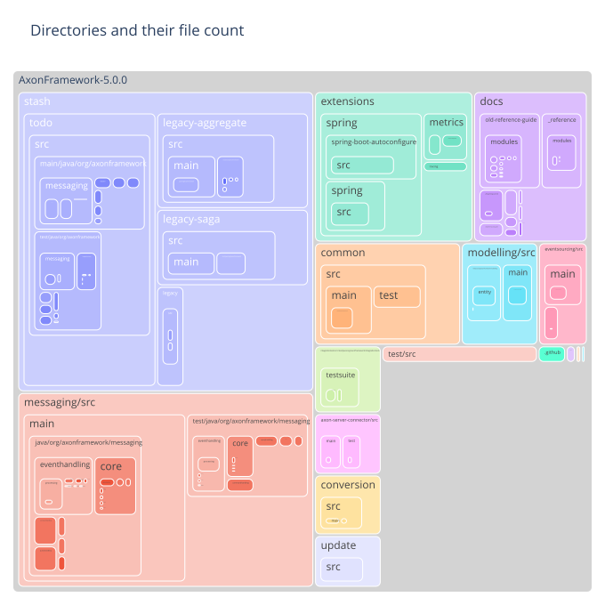
    

### Most frequent file extension per directory

    
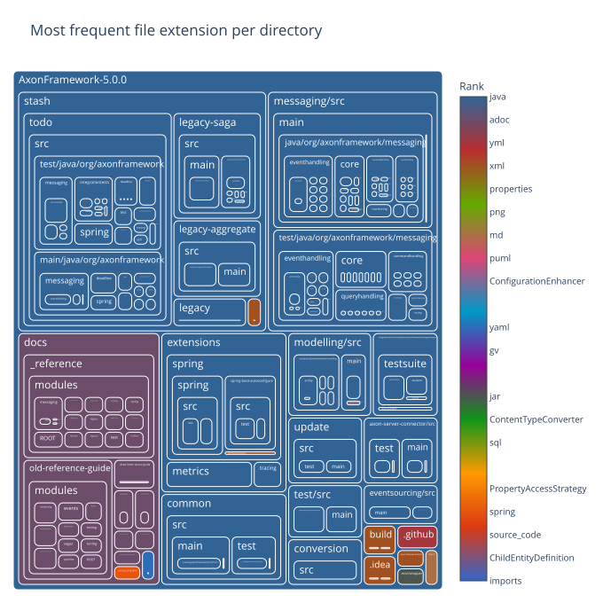
    

### Number of commits per directory

    
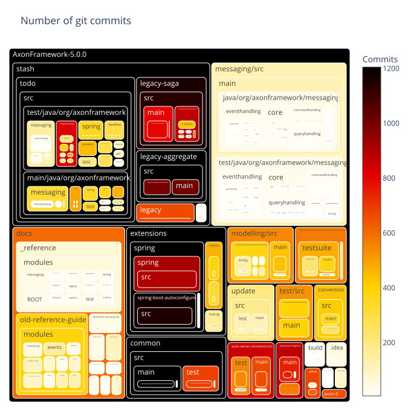
    

### Number of distinct authors per directory

    
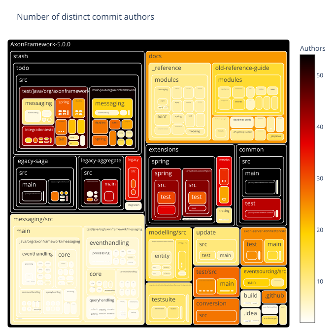
    

### Directories with very few different authors

    
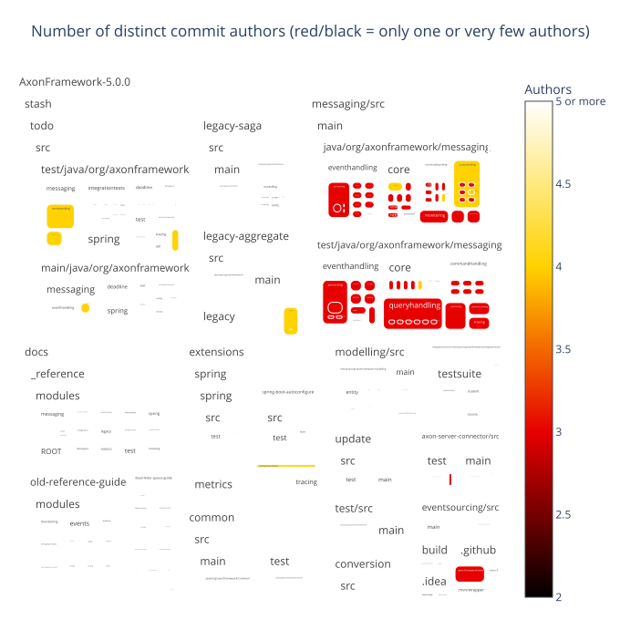
    

### Main author per directory

    
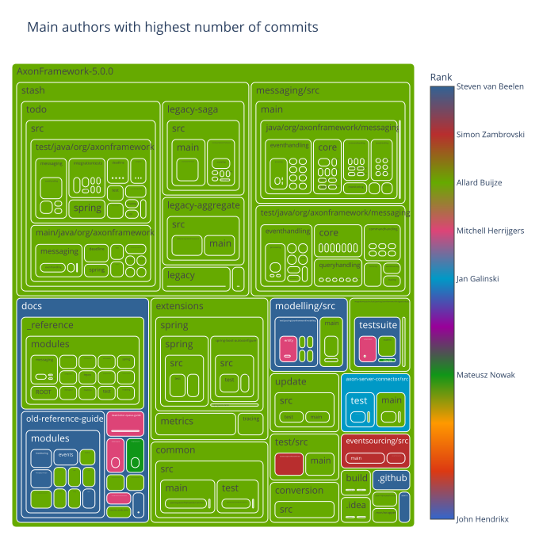
    

### Second author per directory

    
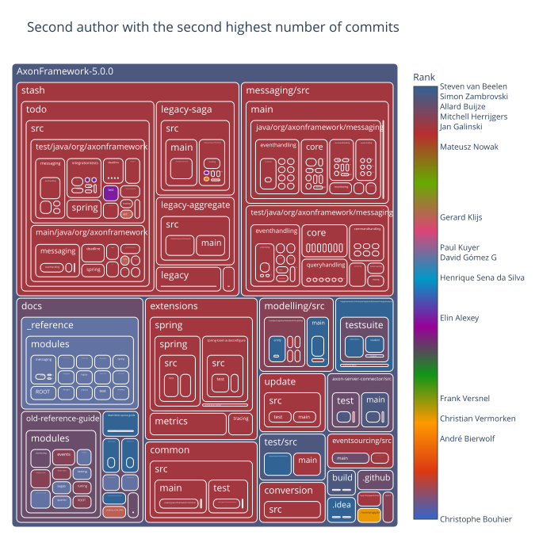
    

### Days since last commit per directory

    

    

### Days since last commit per directory (ranked)

    
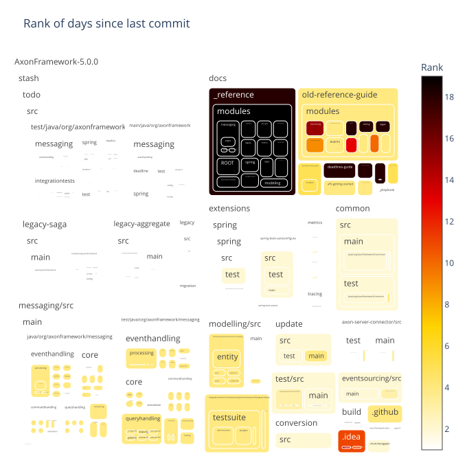
    

### Days since last file creation per directory

    
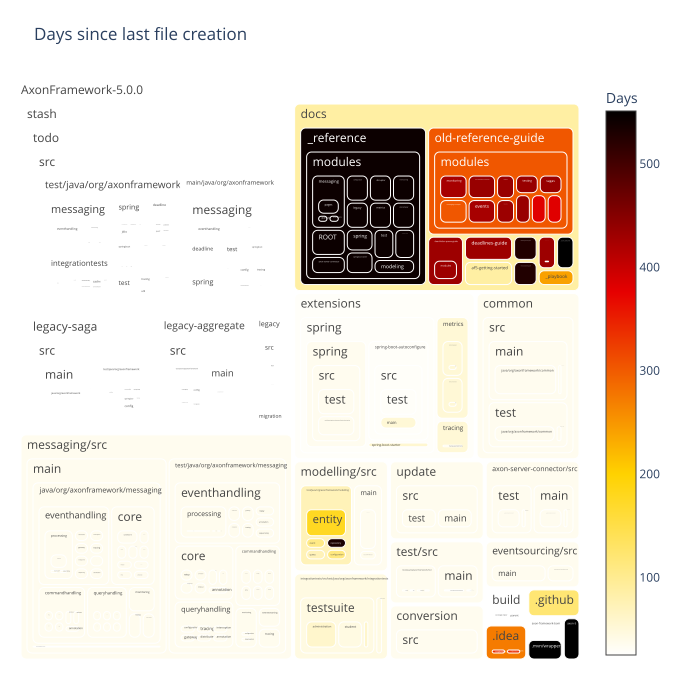
    

### Days since last file creation per directory (ranked)

    
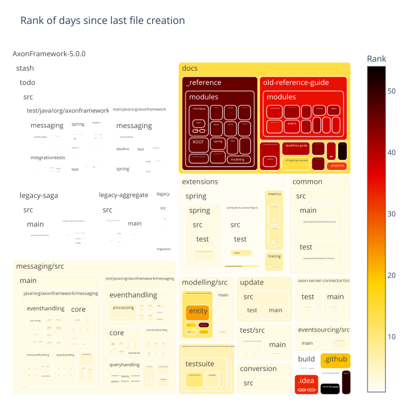
    

### Days since last file modification per directory

    
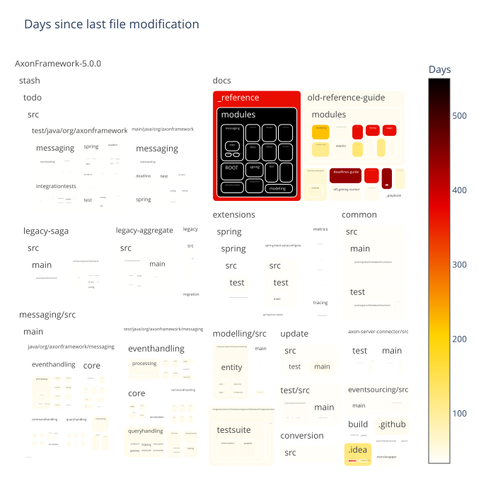
    

### Days since last file modification per directory (ranked)

    
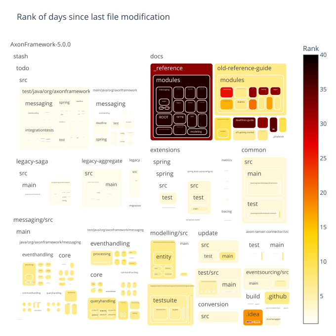
    

## Filecount per commit

Shows how many commits had changed one file, how many had changed two files, and so on.
The chart is limited to 30 lines for improved readability.
The data preview also includes overall statistics including the number of commits that are filtered out in the chart.

### Preview data

    Sum of commits that changed more than 30 files (each) = 1640
    Max changed files with one commit = 4041

<table border="1" class="dataframe">
  <thead>
    <tr style="text-align: right;">
      <th></th>
      <th>filesPerCommit</th>
      <th>commitCount</th>
    </tr>
  </thead>
  <tbody>
    <tr>
      <th>count</th>
      <td>467.000000</td>
      <td>467.000000</td>
    </tr>
    <tr>
      <th>mean</th>
      <td>518.674518</td>
      <td>33.301927</td>
    </tr>
    <tr>
      <th>std</th>
      <td>690.329094</td>
      <td>309.702600</td>
    </tr>
    <tr>
      <th>min</th>
      <td>1.000000</td>
      <td>1.000000</td>
    </tr>
    <tr>
      <th>25%</th>
      <td>117.500000</td>
      <td>1.000000</td>
    </tr>
    <tr>
      <th>50%</th>
      <td>255.000000</td>
      <td>2.000000</td>
    </tr>
    <tr>
      <th>75%</th>
      <td>569.500000</td>
      <td>5.000000</td>
    </tr>
    <tr>
      <th>max</th>
      <td>4041.000000</td>
      <td>6022.000000</td>
    </tr>
  </tbody>
</table>

<table border="1" class="dataframe">
  <thead>
    <tr style="text-align: right;">
      <th></th>
      <th>filesPerCommit</th>
      <th>commitCount</th>
    </tr>
  </thead>
  <tbody>
    <tr>
      <th>0</th>
      <td>1</td>
      <td>6022</td>
    </tr>
    <tr>
      <th>1</th>
      <td>2</td>
      <td>2491</td>
    </tr>
    <tr>
      <th>2</th>
      <td>3</td>
      <td>1157</td>
    </tr>
    <tr>
      <th>3</th>
      <td>4</td>
      <td>762</td>
    </tr>
    <tr>
      <th>4</th>
      <td>5</td>
      <td>509</td>
    </tr>
    <tr>
      <th>5</th>
      <td>6</td>
      <td>378</td>
    </tr>
    <tr>
      <th>6</th>
      <td>7</td>
      <td>313</td>
    </tr>
    <tr>
      <th>7</th>
      <td>8</td>
      <td>248</td>
    </tr>
    <tr>
      <th>8</th>
      <td>9</td>
      <td>187</td>
    </tr>
    <tr>
      <th>9</th>
      <td>10</td>
      <td>167</td>
    </tr>
    <tr>
      <th>10</th>
      <td>11</td>
      <td>140</td>
    </tr>
    <tr>
      <th>11</th>
      <td>12</td>
      <td>123</td>
    </tr>
    <tr>
      <th>12</th>
      <td>13</td>
      <td>144</td>
    </tr>
    <tr>
      <th>13</th>
      <td>14</td>
      <td>160</td>
    </tr>
    <tr>
      <th>14</th>
      <td>15</td>
      <td>196</td>
    </tr>
    <tr>
      <th>15</th>
      <td>16</td>
      <td>91</td>
    </tr>
    <tr>
      <th>16</th>
      <td>17</td>
      <td>82</td>
    </tr>
    <tr>
      <th>17</th>
      <td>18</td>
      <td>82</td>
    </tr>
    <tr>
      <th>18</th>
      <td>19</td>
      <td>100</td>
    </tr>
    <tr>
      <th>19</th>
      <td>20</td>
      <td>82</td>
    </tr>
    <tr>
      <th>20</th>
      <td>21</td>
      <td>58</td>
    </tr>
    <tr>
      <th>21</th>
      <td>22</td>
      <td>78</td>
    </tr>
    <tr>
      <th>22</th>
      <td>23</td>
      <td>47</td>
    </tr>
    <tr>
      <th>23</th>
      <td>24</td>
      <td>47</td>
    </tr>
    <tr>
      <th>24</th>
      <td>25</td>
      <td>57</td>
    </tr>
    <tr>
      <th>25</th>
      <td>26</td>
      <td>45</td>
    </tr>
    <tr>
      <th>26</th>
      <td>27</td>
      <td>38</td>
    </tr>
    <tr>
      <th>27</th>
      <td>28</td>
      <td>36</td>
    </tr>
    <tr>
      <th>28</th>
      <td>29</td>
      <td>39</td>
    </tr>
    <tr>
      <th>29</th>
      <td>30</td>
      <td>33</td>
    </tr>
  </tbody>
</table>

### Bar chart with the number of files per commit distribution

    
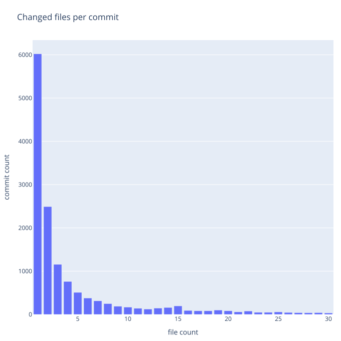
    

## Pairwise Changed Files

This section analyzes files that where changed together within the same commit and provides several metrics to quantify the strength of the co-change relationship:

- **Commit Count**: The number of commits in which two files were changed together.
- **Commit Lift**: A ratio that indicates whether the co-change pattern is stronger than random chance, given how often each file changes.
- **Jaccard Similarity**: The ratio of commits involving either file that also involved both files.

The following tables show the top pairwise changed files based on these metrics.
The following charts show how these metrics are distributed across pairs of files that were changed together.

### Treemap with files changed frequently with others

    
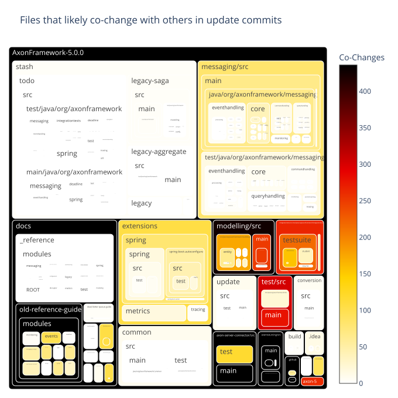
    

    
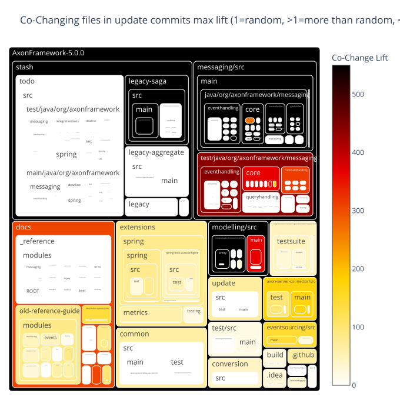
    

    
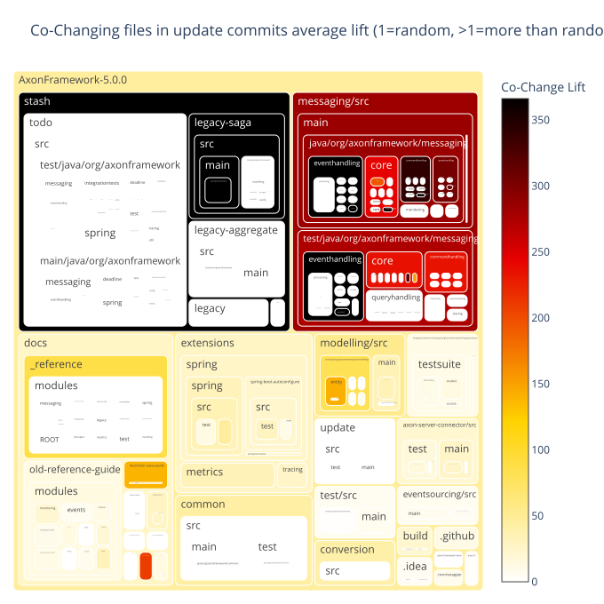
    

<table border="1" class="dataframe">
  <thead>
    <tr style="text-align: right;">
      <th></th>
      <th>fileExtensionPair</th>
      <th>fileExtensionPairCount</th>
    </tr>
  </thead>
  <tbody>
    <tr>
      <th>0</th>
      <td>java↔java</td>
      <td>2081</td>
    </tr>
    <tr>
      <th>1</th>
      <td>adoc↔adoc</td>
      <td>157</td>
    </tr>
    <tr>
      <th>2</th>
      <td>java↔md</td>
      <td>139</td>
    </tr>
    <tr>
      <th>3</th>
      <td>adoc↔java</td>
      <td>127</td>
    </tr>
  </tbody>
</table>

### Files changed together by commit count

<table border="1" class="dataframe">
  <thead>
    <tr style="text-align: right;">
      <th></th>
      <th>fileExtensionPair</th>
      <th>updateCommitCount</th>
      <th>GroupRank</th>
      <th>filePair</th>
      <th>filePairWithRelativePath</th>
    </tr>
  </thead>
  <tbody>
    <tr>
      <th>0</th>
      <td>java↔java</td>
      <td>109</td>
      <td>1</td>
      <td>AggregateBasedStorageEngineTestSuite↔StorageEngineTestSuite</td>
      <td>eventsourcing/src/test/java/org/axonframework/eventsourcing/eventstore/AggregateBasedStorageEngineTestSuite.java↔eventsourcing/src/test/java/org/axonframework/eventsourcing/eventstore/StorageEngineTestSuite.java</td>
    </tr>
    <tr>
      <th>1</th>
      <td>java↔java</td>
      <td>105</td>
      <td>2</td>
      <td>AggregateBasedAxonServerEventStorageEngine↔AggregateBasedJpaEventStorageEngine</td>
      <td>axon-server-connector/src/main/java/org/axonframework/axonserver/connector/event/AggregateBasedAxonServerEventStorageEngine.java↔eventsourcing/src/main/java/org/axonframework/eventsourcing/eventstore/jpa/AggregateBasedJpaEventStorageEngine.java</td>
    </tr>
    <tr>
      <th>2</th>
      <td>java↔java</td>
      <td>102</td>
      <td>3</td>
      <td>AggregateBasedAxonServerEventStorageEngine↔AggregateBasedStorageEngineTestSuite</td>
      <td>axon-server-connector/src/main/java/org/axonframework/axonserver/connector/event/AggregateBasedAxonServerEventStorageEngine.java↔eventsourcing/src/test/java/org/axonframework/eventsourcing/eventstore/AggregateBasedStorageEngineTestSuite.java</td>
    </tr>
    <tr>
      <th>3</th>
      <td>java↔java</td>
      <td>79</td>
      <td>4</td>
      <td>AggregateBasedJpaEventStorageEngine↔StorageEngineTestSuite</td>
      <td>eventsourcing/src/main/java/org/axonframework/eventsourcing/eventstore/jpa/AggregateBasedJpaEventStorageEngine.java↔eventsourcing/src/test/java/org/axonframework/eventsourcing/eventstore/StorageEngineTestSuite.java</td>
    </tr>
    <tr>
      <th>4</th>
      <td>java↔java</td>
      <td>71</td>
      <td>5</td>
      <td>DefaultEventStoreTransactionTest↔StorageEngineTestSuite</td>
      <td>eventsourcing/src/test/java/org/axonframework/eventsourcing/eventstore/DefaultEventStoreTransactionTest.java↔eventsourcing/src/test/java/org/axonframework/eventsourcing/eventstore/StorageEngineTestSuite.java</td>
    </tr>
    <tr>
      <th>5</th>
      <td>java↔java</td>
      <td>68</td>
      <td>6</td>
      <td>AggregateBasedStorageEngineTestSuite↔DefaultEventStoreTransactionTest</td>
      <td>eventsourcing/src/test/java/org/axonframework/eventsourcing/eventstore/AggregateBasedStorageEngineTestSuite.java↔eventsourcing/src/test/java/org/axonframework/eventsourcing/eventstore/DefaultEventStoreTransactionTest.java</td>
    </tr>
    <tr>
      <th>6</th>
      <td>java↔java</td>
      <td>61</td>
      <td>7</td>
      <td>AggregateBasedStorageEngineTestSuite↔DefaultEventStoreTransaction</td>
      <td>eventsourcing/src/test/java/org/axonframework/eventsourcing/eventstore/AggregateBasedStorageEngineTestSuite.java↔eventsourcing/src/main/java/org/axonframework/eventsourcing/eventstore/DefaultEventStoreTransaction.java</td>
    </tr>
    <tr>
      <th>7</th>
      <td>java↔java</td>
      <td>56</td>
      <td>8</td>
      <td>SimpleEventStoreTest↔DefaultEventStoreTransactionTest</td>
      <td>eventsourcing/src/test/java/org/axonframework/eventsourcing/eventstore/SimpleEventStoreTest.java↔eventsourcing/src/test/java/org/axonframework/eventsourcing/eventstore/DefaultEventStoreTransactionTest.java</td>
    </tr>
    <tr>
      <th>8</th>
      <td>java↔java</td>
      <td>55</td>
      <td>9</td>
      <td>AggregateBasedStorageEngineTestSuite↔SimpleEventStoreTest</td>
      <td>eventsourcing/src/test/java/org/axonframework/eventsourcing/eventstore/AggregateBasedStorageEngineTestSuite.java↔eventsourcing/src/test/java/org/axonframework/eventsourcing/eventstore/SimpleEventStoreTest.java</td>
    </tr>
    <tr>
      <th>9</th>
      <td>java↔java</td>
      <td>53</td>
      <td>10</td>
      <td>AggregateBasedAxonServerEventStorageEngine↔DefaultEventStoreTransactionTest</td>
      <td>axon-server-connector/src/main/java/org/axonframework/axonserver/connector/event/AggregateBasedAxonServerEventStorageEngine.java↔eventsourcing/src/test/java/org/axonframework/eventsourcing/eventstore/DefaultEventStoreTransactionTest.java</td>
    </tr>
    <tr>
      <th>10</th>
      <td>adoc↔adoc</td>
      <td>21</td>
      <td>1</td>
      <td>minor-releases↔major-releases</td>
      <td>docs/old-reference-guide/modules/release-notes/pages/minor-releases.adoc↔docs/old-reference-guide/modules/release-notes/pages/major-releases.adoc</td>
    </tr>
    <tr>
      <th>11</th>
      <td>adoc↔adoc</td>
      <td>19</td>
      <td>2</td>
      <td>query-dispatchers↔query-handlers</td>
      <td>docs/old-reference-guide/modules/queries/pages/query-dispatchers.adoc↔docs/old-reference-guide/modules/queries/pages/query-handlers.adoc</td>
    </tr>
    <tr>
      <th>12</th>
      <td>adoc↔adoc</td>
      <td>18</td>
      <td>3</td>
      <td>streaming↔subscribing</td>
      <td>docs/old-reference-guide/modules/events/pages/event-processors/streaming.adoc↔docs/old-reference-guide/modules/events/pages/event-processors/subscribing.adoc</td>
    </tr>
    <tr>
      <th>13</th>
      <td>adoc↔adoc</td>
      <td>17</td>
      <td>4</td>
      <td>index↔major-releases</td>
      <td>docs/old-reference-guide/modules/release-notes/pages/index.adoc↔docs/old-reference-guide/modules/release-notes/pages/major-releases.adoc</td>
    </tr>
    <tr>
      <th>14</th>
      <td>adoc↔adoc</td>
      <td>15</td>
      <td>5</td>
      <td>implement-command-create-course↔implement-command-subscribe-student</td>
      <td>docs/af5-getting-started/modules/ROOT/pages/implement-command-create-course.adoc↔docs/af5-getting-started/modules/ROOT/pages/implement-command-subscribe-student.adoc</td>
    </tr>
    <tr>
      <th>15</th>
      <td>adoc↔adoc</td>
      <td>14</td>
      <td>6</td>
      <td>known-issues-and-workarounds↔event-snapshots</td>
      <td>docs/old-reference-guide/modules/ROOT/pages/known-issues-and-workarounds.adoc↔docs/old-reference-guide/modules/tuning/pages/event-snapshots.adoc</td>
    </tr>
    <tr>
      <th>16</th>
      <td>adoc↔adoc</td>
      <td>13</td>
      <td>7</td>
      <td>implement-command-subscribe-student↔index</td>
      <td>docs/af5-getting-started/modules/ROOT/pages/implement-command-subscribe-student.adoc↔docs/af5-getting-started/modules/ROOT/pages/index.adoc</td>
    </tr>
    <tr>
      <th>17</th>
      <td>adoc↔adoc</td>
      <td>11</td>
      <td>8</td>
      <td>implement-command-subscribe-student↔configure-axon-server</td>
      <td>docs/af5-getting-started/modules/ROOT/pages/implement-command-subscribe-student.adoc↔docs/af5-getting-started/modules/ROOT/pages/configure-axon-server.adoc</td>
    </tr>
    <tr>
      <th>18</th>
      <td>adoc↔adoc</td>
      <td>10</td>
      <td>9</td>
      <td>subscribing↔query-dispatchers</td>
      <td>docs/old-reference-guide/modules/events/pages/event-processors/subscribing.adoc↔docs/old-reference-guide/modules/queries/pages/query-dispatchers.adoc</td>
    </tr>
    <tr>
      <th>19</th>
      <td>adoc↔adoc</td>
      <td>9</td>
      <td>10</td>
      <td>streaming↔query-dispatchers</td>
      <td>docs/old-reference-guide/modules/events/pages/event-processors/streaming.adoc↔docs/old-reference-guide/modules/queries/pages/query-dispatchers.adoc</td>
    </tr>
    <tr>
      <th>20</th>
      <td>java↔md</td>
      <td>84</td>
      <td>1</td>
      <td>AggregateBasedAxonServerEventStorageEngine↔api-changes</td>
      <td>axon-server-connector/src/main/java/org/axonframework/axonserver/connector/event/AggregateBasedAxonServerEventStorageEngine.java↔axon-5/api-changes.md</td>
    </tr>
    <tr>
      <th>21</th>
      <td>java↔md</td>
      <td>76</td>
      <td>2</td>
      <td>AggregateBasedJpaEventStorageEngine↔api-changes</td>
      <td>eventsourcing/src/main/java/org/axonframework/eventsourcing/eventstore/jpa/AggregateBasedJpaEventStorageEngine.java↔axon-5/api-changes.md</td>
    </tr>
    <tr>
      <th>22</th>
      <td>java↔md</td>
      <td>68</td>
      <td>3</td>
      <td>StorageEngineTestSuite↔api-changes</td>
      <td>eventsourcing/src/test/java/org/axonframework/eventsourcing/eventstore/StorageEngineTestSuite.java↔axon-5/api-changes.md</td>
    </tr>
    <tr>
      <th>23</th>
      <td>java↔md</td>
      <td>53</td>
      <td>4</td>
      <td>SimpleEventStoreTest↔api-changes</td>
      <td>eventsourcing/src/test/java/org/axonframework/eventsourcing/eventstore/SimpleEventStoreTest.java↔axon-5/api-changes.md</td>
    </tr>
    <tr>
      <th>24</th>
      <td>java↔md</td>
      <td>49</td>
      <td>5</td>
      <td>DefaultEventStoreTransactionTest↔api-changes</td>
      <td>eventsourcing/src/test/java/org/axonframework/eventsourcing/eventstore/DefaultEventStoreTransactionTest.java↔axon-5/api-changes.md</td>
    </tr>
    <tr>
      <th>25</th>
      <td>java↔md</td>
      <td>46</td>
      <td>6</td>
      <td>QueryThreadingIntegrationTest↔api-changes</td>
      <td>integrationtests/src/test/java/org/axonframework/integrationtests/queryhandling/QueryThreadingIntegrationTest.java↔axon-5/api-changes.md</td>
    </tr>
    <tr>
      <th>26</th>
      <td>java↔md</td>
      <td>39</td>
      <td>7</td>
      <td>DefaultEventStoreTransaction↔api-changes</td>
      <td>eventsourcing/src/main/java/org/axonframework/eventsourcing/eventstore/DefaultEventStoreTransaction.java↔axon-5/api-changes.md</td>
    </tr>
    <tr>
      <th>27</th>
      <td>java↔md</td>
      <td>37</td>
      <td>8</td>
      <td>EventSourcingConfigurationDefaults↔api-changes</td>
      <td>eventsourcing/src/main/java/org/axonframework/eventsourcing/configuration/EventSourcingConfigurationDefaults.java↔axon-5/api-changes.md</td>
    </tr>
    <tr>
      <th>28</th>
      <td>java↔md</td>
      <td>34</td>
      <td>9</td>
      <td>AxonServerEventStorageEngine↔api-changes</td>
      <td>axon-server-connector/src/main/java/org/axonframework/axonserver/connector/event/AxonServerEventStorageEngine.java↔axon-5/api-changes.md</td>
    </tr>
    <tr>
      <th>29</th>
      <td>java↔md</td>
      <td>31</td>
      <td>10</td>
      <td>EventSourcingConfigurer↔api-changes</td>
      <td>eventsourcing/src/main/java/org/axonframework/eventsourcing/configuration/EventSourcingConfigurer.java↔axon-5/api-changes.md</td>
    </tr>
    <tr>
      <th>30</th>
      <td>adoc↔java</td>
      <td>10</td>
      <td>1</td>
      <td>event-versioning↔QueryThreadingIntegrationTest</td>
      <td>docs/old-reference-guide/modules/events/pages/event-versioning.adoc↔integrationtests/src/test/java/org/axonframework/integrationtests/queryhandling/QueryThreadingIntegrationTest.java</td>
    </tr>
    <tr>
      <th>31</th>
      <td>adoc↔java</td>
      <td>9</td>
      <td>2</td>
      <td>supported-parameters-annotated-handlers↔QueryThreadingIntegrationTest</td>
      <td>docs/old-reference-guide/modules/messaging-concepts/pages/supported-parameters-annotated-handlers.adoc↔integrationtests/src/test/java/org/axonframework/integrationtests/queryhandling/QueryThreadingIntegrationTest.java</td>
    </tr>
    <tr>
      <th>32</th>
      <td>adoc↔java</td>
      <td>8</td>
      <td>3</td>
      <td>implement-command-subscribe-student↔AxonTestGiven</td>
      <td>docs/af5-getting-started/modules/ROOT/pages/implement-command-subscribe-student.adoc↔test/src/main/java/org/axonframework/test/fixture/AxonTestGiven.java</td>
    </tr>
    <tr>
      <th>33</th>
      <td>adoc↔java</td>
      <td>7</td>
      <td>4</td>
      <td>implement-command-subscribe-student↔SimpleEventStoreTest</td>
      <td>docs/af5-getting-started/modules/ROOT/pages/implement-command-subscribe-student.adoc↔eventsourcing/src/test/java/org/axonframework/eventsourcing/eventstore/SimpleEventStoreTest.java</td>
    </tr>
    <tr>
      <th>34</th>
      <td>adoc↔java</td>
      <td>6</td>
      <td>5</td>
      <td>rdbms-tuning↔AggregateBasedStorageEngineTestSuite</td>
      <td>docs/old-reference-guide/modules/tuning/pages/rdbms-tuning.adoc↔eventsourcing/src/test/java/org/axonframework/eventsourcing/eventstore/AggregateBasedStorageEngineTestSuite.java</td>
    </tr>
    <tr>
      <th>35</th>
      <td>adoc↔java</td>
      <td>5</td>
      <td>6</td>
      <td>nav↔AggregateBasedAxonServerEventStorageEngine</td>
      <td>docs/af5-getting-started/modules/ROOT/nav.adoc↔axon-server-connector/src/main/java/org/axonframework/axonserver/connector/event/AggregateBasedAxonServerEventStorageEngine.java</td>
    </tr>
    <tr>
      <th>36</th>
      <td>adoc↔java</td>
      <td>4</td>
      <td>7</td>
      <td>subscribing↔AggregateBasedAxonServerEventStorageEngine</td>
      <td>docs/old-reference-guide/modules/events/pages/event-processors/subscribing.adoc↔axon-server-connector/src/main/java/org/axonframework/axonserver/connector/event/AggregateBasedAxonServerEventStorageEngine.java</td>
    </tr>
    <tr>
      <th>37</th>
      <td>adoc↔java</td>
      <td>3</td>
      <td>8</td>
      <td>event-versioning↔AggregateBasedConsistencyMarker</td>
      <td>docs/old-reference-guide/modules/events/pages/event-versioning.adoc↔eventsourcing/src/main/java/org/axonframework/eventsourcing/eventstore/AggregateBasedConsistencyMarker.java</td>
    </tr>
  </tbody>
</table>

    
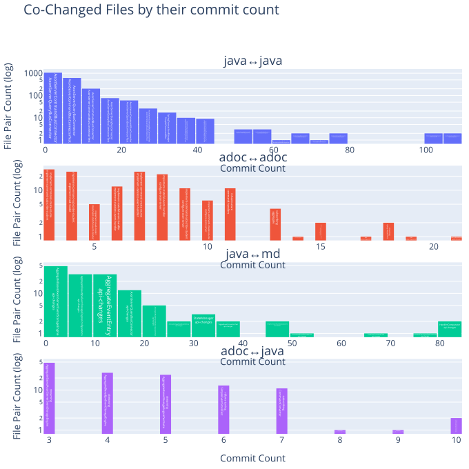
    

### Files changed together by commit min confidence

The commit min confidence is the commit count where both files were changed divided by the commit count of the file with the least commits.
This metric is useful to identify pairs of files that are frequently changed together and is not biased by single files that are changed very often.

<table border="1" class="dataframe">
  <thead>
    <tr style="text-align: right;">
      <th></th>
      <th>fileExtensionPair</th>
      <th>updateCommitMinConfidence</th>
      <th>GroupRank</th>
      <th>filePair</th>
      <th>filePairWithRelativePath</th>
    </tr>
  </thead>
  <tbody>
    <tr>
      <th>0</th>
      <td>java↔java</td>
      <td>1.000000</td>
      <td>1</td>
      <td>AnnotatedEventHandlingComponentTest↔AnnotationSagaMetaModelFactory</td>
      <td>messaging/src/test/java/org/axonframework/messaging/eventhandling/annotation/AnnotatedEventHandlingComponentTest.java↔stash/legacy-saga/src/main/java/org/axonframework/modelling/saga/metamodel/AnnotationSagaMetaModelFactory.java</td>
    </tr>
    <tr>
      <th>1</th>
      <td>java↔java</td>
      <td>0.900000</td>
      <td>2</td>
      <td>ChildEntityFieldDefinition↔GetterSetterChildEntityFieldDefinition</td>
      <td>modelling/src/main/java/org/axonframework/modelling/entity/child/ChildEntityFieldDefinition.java↔modelling/src/main/java/org/axonframework/modelling/entity/child/GetterSetterChildEntityFieldDefinition.java</td>
    </tr>
    <tr>
      <th>2</th>
      <td>java↔java</td>
      <td>0.875000</td>
      <td>3</td>
      <td>ChildEntityFieldDefinition↔FieldChildEntityFieldDefinition</td>
      <td>modelling/src/main/java/org/axonframework/modelling/entity/child/ChildEntityFieldDefinition.java↔modelling/src/main/java/org/axonframework/modelling/entity/child/FieldChildEntityFieldDefinition.java</td>
    </tr>
    <tr>
      <th>3</th>
      <td>java↔java</td>
      <td>0.800000</td>
      <td>4</td>
      <td>SimpleCommandHandlingComponent↔AnnotatedHandlerInspector</td>
      <td>messaging/src/main/java/org/axonframework/messaging/commandhandling/SimpleCommandHandlingComponent.java↔messaging/src/main/java/org/axonframework/messaging/core/annotation/AnnotatedHandlerInspector.java</td>
    </tr>
    <tr>
      <th>4</th>
      <td>java↔java</td>
      <td>0.750000</td>
      <td>5</td>
      <td>AxonServerCommandBusConnectorTest↔AnnotationSagaMetaModelFactory</td>
      <td>axon-server-connector/src/test/java/org/axonframework/axonserver/connector/command/AxonServerCommandBusConnectorTest.java↔stash/legacy-saga/src/main/java/org/axonframework/modelling/saga/metamodel/AnnotationSagaMetaModelFactory.java</td>
    </tr>
    <tr>
      <th>5</th>
      <td>java↔java</td>
      <td>0.714286</td>
      <td>6</td>
      <td>ProcessingLifecycleHandlerRegistrar↔UnitOfWorkFactory</td>
      <td>messaging/src/main/java/org/axonframework/messaging/core/unitofwork/ProcessingLifecycleHandlerRegistrar.java↔messaging/src/main/java/org/axonframework/messaging/core/unitofwork/UnitOfWorkFactory.java</td>
    </tr>
    <tr>
      <th>6</th>
      <td>java↔java</td>
      <td>0.666667</td>
      <td>7</td>
      <td>SpringTransactionManager↔SimpleCommandBus</td>
      <td>extensions/spring/spring/src/main/java/org/axonframework/extension/spring/messaging/unitofwork/SpringTransactionManager.java↔messaging/src/main/java/org/axonframework/messaging/commandhandling/SimpleCommandBus.java</td>
    </tr>
    <tr>
      <th>7</th>
      <td>java↔java</td>
      <td>0.648148</td>
      <td>8</td>
      <td>DefaultAppendConditionTest↔NoAppendConditionTest</td>
      <td>eventsourcing/src/test/java/org/axonframework/eventsourcing/eventstore/DefaultAppendConditionTest.java↔eventsourcing/src/test/java/org/axonframework/eventsourcing/eventstore/NoAppendConditionTest.java</td>
    </tr>
    <tr>
      <th>8</th>
      <td>java↔java</td>
      <td>0.646154</td>
      <td>9</td>
      <td>DefaultSourcingConditionTest↔SourcingConditionTest</td>
      <td>eventsourcing/src/test/java/org/axonframework/eventsourcing/eventstore/DefaultSourcingConditionTest.java↔eventsourcing/src/test/java/org/axonframework/eventsourcing/eventstore/SourcingConditionTest.java</td>
    </tr>
    <tr>
      <th>9</th>
      <td>java↔java</td>
      <td>0.631579</td>
      <td>10</td>
      <td>AggregateBasedConsistencyMarker↔AggregateBasedStorageEngineTestSuite</td>
      <td>eventsourcing/src/main/java/org/axonframework/eventsourcing/eventstore/AggregateBasedConsistencyMarker.java↔eventsourcing/src/test/java/org/axonframework/eventsourcing/eventstore/AggregateBasedStorageEngineTestSuite.java</td>
    </tr>
    <tr>
      <th>10</th>
      <td>adoc↔adoc</td>
      <td>1.000000</td>
      <td>1</td>
      <td>event-snapshots↔dead-letter-queue</td>
      <td>docs/old-reference-guide/modules/tuning/pages/event-snapshots.adoc↔docs/old-reference-guide/modules/events/pages/event-processors/dead-letter-queue.adoc</td>
    </tr>
    <tr>
      <th>11</th>
      <td>adoc↔adoc</td>
      <td>0.857143</td>
      <td>2</td>
      <td>upgrading-to-4-7↔spring-boot-integration</td>
      <td>docs/old-reference-guide/modules/ROOT/pages/upgrading-to-4-7.adoc↔docs/old-reference-guide/modules/ROOT/pages/spring-boot-integration.adoc</td>
    </tr>
    <tr>
      <th>12</th>
      <td>adoc↔adoc</td>
      <td>0.818182</td>
      <td>3</td>
      <td>index↔minor-releases</td>
      <td>docs/old-reference-guide/modules/release-notes/pages/index.adoc↔docs/old-reference-guide/modules/release-notes/pages/minor-releases.adoc</td>
    </tr>
    <tr>
      <th>13</th>
      <td>adoc↔adoc</td>
      <td>0.772727</td>
      <td>4</td>
      <td>index↔major-releases</td>
      <td>docs/old-reference-guide/modules/release-notes/pages/index.adoc↔docs/old-reference-guide/modules/release-notes/pages/major-releases.adoc</td>
    </tr>
    <tr>
      <th>14</th>
      <td>adoc↔adoc</td>
      <td>0.722222</td>
      <td>5</td>
      <td>index↔project-structure</td>
      <td>docs/af5-getting-started/modules/ROOT/pages/index.adoc↔docs/af5-getting-started/modules/ROOT/pages/project-structure.adoc</td>
    </tr>
    <tr>
      <th>15</th>
      <td>adoc↔adoc</td>
      <td>0.700000</td>
      <td>6</td>
      <td>minor-releases↔major-releases</td>
      <td>docs/old-reference-guide/modules/release-notes/pages/minor-releases.adoc↔docs/old-reference-guide/modules/release-notes/pages/major-releases.adoc</td>
    </tr>
    <tr>
      <th>16</th>
      <td>adoc↔adoc</td>
      <td>0.650000</td>
      <td>7</td>
      <td>implement-command-subscribe-student↔index</td>
      <td>docs/af5-getting-started/modules/ROOT/pages/implement-command-subscribe-student.adoc↔docs/af5-getting-started/modules/ROOT/pages/index.adoc</td>
    </tr>
    <tr>
      <th>17</th>
      <td>adoc↔adoc</td>
      <td>0.615385</td>
      <td>8</td>
      <td>implementations↔configuration</td>
      <td>docs/old-reference-guide/modules/queries/pages/implementations.adoc↔docs/old-reference-guide/modules/queries/pages/configuration.adoc</td>
    </tr>
    <tr>
      <th>18</th>
      <td>adoc↔adoc</td>
      <td>0.611111</td>
      <td>9</td>
      <td>implement-command-subscribe-student↔project-structure</td>
      <td>docs/af5-getting-started/modules/ROOT/pages/implement-command-subscribe-student.adoc↔docs/af5-getting-started/modules/ROOT/pages/project-structure.adoc</td>
    </tr>
    <tr>
      <th>19</th>
      <td>adoc↔adoc</td>
      <td>0.571429</td>
      <td>10</td>
      <td>implementing↔spring-boot-integration</td>
      <td>docs/dead-letter-queue-guide/modules/ROOT/pages/implementing.adoc↔docs/old-reference-guide/modules/ROOT/pages/spring-boot-integration.adoc</td>
    </tr>
    <tr>
      <th>20</th>
      <td>java↔md</td>
      <td>1.000000</td>
      <td>1</td>
      <td>AnnotationSagaMetaModelFactory↔api-changes</td>
      <td>stash/legacy-saga/src/main/java/org/axonframework/modelling/saga/metamodel/AnnotationSagaMetaModelFactory.java↔axon-5/api-changes.md</td>
    </tr>
    <tr>
      <th>21</th>
      <td>java↔md</td>
      <td>0.800000</td>
      <td>2</td>
      <td>SimpleCommandHandlingComponent↔api-changes</td>
      <td>messaging/src/main/java/org/axonframework/messaging/commandhandling/SimpleCommandHandlingComponent.java↔axon-5/api-changes.md</td>
    </tr>
    <tr>
      <th>22</th>
      <td>java↔md</td>
      <td>0.666667</td>
      <td>3</td>
      <td>AnnotationBasedEntityEvolvingComponent↔api-changes</td>
      <td>modelling/src/main/java/org/axonframework/modelling/annotation/AnnotationBasedEntityEvolvingComponent.java↔axon-5/api-changes.md</td>
    </tr>
    <tr>
      <th>23</th>
      <td>java↔md</td>
      <td>0.600000</td>
      <td>4</td>
      <td>CommandConverter↔modularity</td>
      <td>axon-server-connector/src/main/java/org/axonframework/axonserver/connector/command/CommandConverter.java↔axon-5/modularity.md</td>
    </tr>
    <tr>
      <th>24</th>
      <td>java↔md</td>
      <td>0.571429</td>
      <td>5</td>
      <td>SimpleCommandHandlingComponentTest↔api-changes</td>
      <td>messaging/src/test/java/org/axonframework/messaging/commandhandling/SimpleCommandHandlingComponentTest.java↔axon-5/api-changes.md</td>
    </tr>
    <tr>
      <th>25</th>
      <td>java↔md</td>
      <td>0.451613</td>
      <td>6</td>
      <td>AggregateBasedAxonServerEventStorageEngine↔api-changes</td>
      <td>axon-server-connector/src/main/java/org/axonframework/axonserver/connector/event/AggregateBasedAxonServerEventStorageEngine.java↔axon-5/api-changes.md</td>
    </tr>
    <tr>
      <th>26</th>
      <td>java↔md</td>
      <td>0.411765</td>
      <td>7</td>
      <td>ChildAmbiguityException↔api-changes</td>
      <td>modelling/src/main/java/org/axonframework/modelling/entity/child/ChildAmbiguityException.java↔axon-5/api-changes.md</td>
    </tr>
    <tr>
      <th>27</th>
      <td>java↔md</td>
      <td>0.409091</td>
      <td>8</td>
      <td>QueryThreadingIntegrationTest↔README</td>
      <td>integrationtests/src/test/java/org/axonframework/integrationtests/queryhandling/QueryThreadingIntegrationTest.java↔docs/README.md</td>
    </tr>
    <tr>
      <th>28</th>
      <td>java↔md</td>
      <td>0.378109</td>
      <td>9</td>
      <td>AggregateBasedJpaEventStorageEngine↔api-changes</td>
      <td>eventsourcing/src/main/java/org/axonframework/eventsourcing/eventstore/jpa/AggregateBasedJpaEventStorageEngine.java↔axon-5/api-changes.md</td>
    </tr>
    <tr>
      <th>29</th>
      <td>java↔md</td>
      <td>0.375000</td>
      <td>10</td>
      <td>GetterEvolverChildEntityFieldDefinition↔api-changes</td>
      <td>modelling/src/main/java/org/axonframework/modelling/entity/child/GetterEvolverChildEntityFieldDefinition.java↔axon-5/api-changes.md</td>
    </tr>
    <tr>
      <th>30</th>
      <td>adoc↔java</td>
      <td>0.454545</td>
      <td>1</td>
      <td>configure-axon-server↔StudentAxonTestFixtureAxonServerIntegrationIT</td>
      <td>docs/af5-getting-started/modules/ROOT/pages/configure-axon-server.adoc↔integrationtests/src/test/java/org/axonframework/integrationtests/testsuite/course/StudentAxonTestFixtureAxonServerIntegrationIT.java</td>
    </tr>
    <tr>
      <th>31</th>
      <td>adoc↔java</td>
      <td>0.315789</td>
      <td>2</td>
      <td>index↔EventSourcingConfigurer</td>
      <td>docs/old-reference-guide/modules/events/pages/event-processors/index.adoc↔eventsourcing/src/main/java/org/axonframework/eventsourcing/configuration/EventSourcingConfigurer.java</td>
    </tr>
    <tr>
      <th>32</th>
      <td>adoc↔java</td>
      <td>0.280000</td>
      <td>3</td>
      <td>nav↔StorageEngineTestSuite</td>
      <td>docs/af5-getting-started/modules/ROOT/nav.adoc↔eventsourcing/src/test/java/org/axonframework/eventsourcing/eventstore/StorageEngineTestSuite.java</td>
    </tr>
    <tr>
      <th>33</th>
      <td>adoc↔java</td>
      <td>0.263158</td>
      <td>4</td>
      <td>index↔AggregateBasedJpaEventStorageEngine</td>
      <td>docs/old-reference-guide/modules/events/pages/event-processors/index.adoc↔eventsourcing/src/main/java/org/axonframework/eventsourcing/eventstore/jpa/AggregateBasedJpaEventStorageEngine.java</td>
    </tr>
    <tr>
      <th>34</th>
      <td>adoc↔java</td>
      <td>0.250000</td>
      <td>5</td>
      <td>index↔EventSourcingConfigurationDefaults</td>
      <td>docs/af5-getting-started/modules/ROOT/pages/index.adoc↔eventsourcing/src/main/java/org/axonframework/eventsourcing/configuration/EventSourcingConfigurationDefaults.java</td>
    </tr>
    <tr>
      <th>35</th>
      <td>adoc↔java</td>
      <td>0.240000</td>
      <td>6</td>
      <td>nav↔SimpleEventStoreTest</td>
      <td>docs/af5-getting-started/modules/ROOT/nav.adoc↔eventsourcing/src/test/java/org/axonframework/eventsourcing/eventstore/SimpleEventStoreTest.java</td>
    </tr>
    <tr>
      <th>36</th>
      <td>adoc↔java</td>
      <td>0.232558</td>
      <td>7</td>
      <td>implement-command-subscribe-student↔AxonTestFixture</td>
      <td>docs/af5-getting-started/modules/ROOT/pages/implement-command-subscribe-student.adoc↔test/src/main/java/org/axonframework/test/fixture/AxonTestFixture.java</td>
    </tr>
    <tr>
      <th>37</th>
      <td>adoc↔java</td>
      <td>0.227273</td>
      <td>8</td>
      <td>configure-axon-server↔AbstractAxonServerIT</td>
      <td>docs/af5-getting-started/modules/ROOT/pages/configure-axon-server.adoc↔integrationtests/src/test/java/org/axonframework/integrationtests/testsuite/AbstractAxonServerIT.java</td>
    </tr>
    <tr>
      <th>38</th>
      <td>adoc↔java</td>
      <td>0.222222</td>
      <td>9</td>
      <td>project-structure↔EventSourcingConfigurationDefaults</td>
      <td>docs/af5-getting-started/modules/ROOT/pages/project-structure.adoc↔eventsourcing/src/main/java/org/axonframework/eventsourcing/configuration/EventSourcingConfigurationDefaults.java</td>
    </tr>
    <tr>
      <th>39</th>
      <td>adoc↔java</td>
      <td>0.218750</td>
      <td>10</td>
      <td>nav↔QueryThreadingIntegrationTest</td>
      <td>docs/old-reference-guide/modules/axon-framework-commands/partials/nav.adoc↔integrationtests/src/test/java/org/axonframework/integrationtests/queryhandling/QueryThreadingIntegrationTest.java</td>
    </tr>
  </tbody>
</table>

    
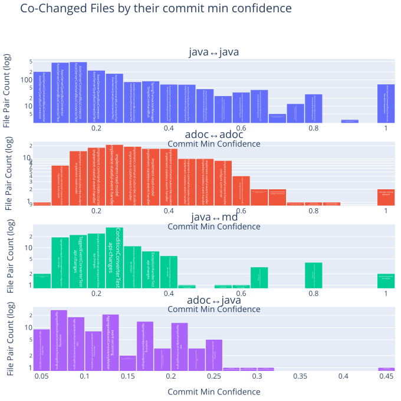
    

### Files changed together by commit lift

<table border="1" class="dataframe">
  <thead>
    <tr style="text-align: right;">
      <th></th>
      <th>fileExtensionPair</th>
      <th>updateCommitLift</th>
      <th>GroupRank</th>
      <th>filePair</th>
      <th>filePairWithRelativePath</th>
    </tr>
  </thead>
  <tbody>
    <tr>
      <th>0</th>
      <td>java↔java</td>
      <td>733.000000</td>
      <td>1</td>
      <td>GetterEvolverChildEntityFieldDefinitionTest↔FieldChildEntityFieldDefinitionTest</td>
      <td>modelling/src/test/java/org/axonframework/modelling/entity/child/GetterEvolverChildEntityFieldDefinitionTest.java↔modelling/src/test/java/org/axonframework/modelling/entity/child/FieldChildEntityFieldDefinitionTest.java</td>
    </tr>
    <tr>
      <th>1</th>
      <td>java↔java</td>
      <td>549.750000</td>
      <td>2</td>
      <td>AnnotationSagaMetaModelFactory↔AnnotationEventHandlerAdapter</td>
      <td>stash/legacy-saga/src/main/java/org/axonframework/modelling/saga/metamodel/AnnotationSagaMetaModelFactory.java↔stash/todo/src/main/java/org/axonframework/messaging/eventhandling/annotation/AnnotationEventHandlerAdapter.java</td>
    </tr>
    <tr>
      <th>2</th>
      <td>java↔java</td>
      <td>549.750000</td>
      <td>3</td>
      <td>Command↔AnnotationMessageTypeResolver</td>
      <td>messaging/src/main/java/org/axonframework/messaging/commandhandling/annotation/Command.java↔messaging/src/main/java/org/axonframework/messaging/core/annotation/AnnotationMessageTypeResolver.java</td>
    </tr>
    <tr>
      <th>3</th>
      <td>java↔java</td>
      <td>439.800000</td>
      <td>4</td>
      <td>AnnotatedEventHandlingComponentTest↔AnnotationSagaMetaModelFactory</td>
      <td>messaging/src/test/java/org/axonframework/messaging/eventhandling/annotation/AnnotatedEventHandlingComponentTest.java↔stash/legacy-saga/src/main/java/org/axonframework/modelling/saga/metamodel/AnnotationSagaMetaModelFactory.java</td>
    </tr>
    <tr>
      <th>4</th>
      <td>java↔java</td>
      <td>366.500000</td>
      <td>5</td>
      <td>AnnotationBasedEntityEvolvingComponent↔AnnotationSagaMetaModelFactory</td>
      <td>modelling/src/main/java/org/axonframework/modelling/annotation/AnnotationBasedEntityEvolvingComponent.java↔stash/legacy-saga/src/main/java/org/axonframework/modelling/saga/metamodel/AnnotationSagaMetaModelFactory.java</td>
    </tr>
    <tr>
      <th>5</th>
      <td>java↔java</td>
      <td>351.840000</td>
      <td>6</td>
      <td>SimpleCommandHandlingComponent↔HandlerComparator</td>
      <td>messaging/src/main/java/org/axonframework/messaging/commandhandling/SimpleCommandHandlingComponent.java↔messaging/src/main/java/org/axonframework/messaging/core/annotation/HandlerComparator.java</td>
    </tr>
    <tr>
      <th>6</th>
      <td>java↔java</td>
      <td>314.142857</td>
      <td>7</td>
      <td>SimpleCommandHandlingComponentTest↔AnnotationSagaMetaModelFactory</td>
      <td>messaging/src/test/java/org/axonframework/messaging/commandhandling/SimpleCommandHandlingComponentTest.java↔stash/legacy-saga/src/main/java/org/axonframework/modelling/saga/metamodel/AnnotationSagaMetaModelFactory.java</td>
    </tr>
    <tr>
      <th>7</th>
      <td>java↔java</td>
      <td>293.200000</td>
      <td>8</td>
      <td>SimpleCommandHandlingComponent↔AnnotatedHandlerInspector</td>
      <td>messaging/src/main/java/org/axonframework/messaging/commandhandling/SimpleCommandHandlingComponent.java↔messaging/src/main/java/org/axonframework/messaging/core/annotation/AnnotatedHandlerInspector.java</td>
    </tr>
    <tr>
      <th>8</th>
      <td>java↔java</td>
      <td>274.875000</td>
      <td>9</td>
      <td>FieldChildEntityFieldDefinition↔GetterEvolverChildEntityFieldDefinition</td>
      <td>modelling/src/main/java/org/axonframework/modelling/entity/child/FieldChildEntityFieldDefinition.java↔modelling/src/main/java/org/axonframework/modelling/entity/child/GetterEvolverChildEntityFieldDefinition.java</td>
    </tr>
    <tr>
      <th>9</th>
      <td>java↔java</td>
      <td>274.875000</td>
      <td>10</td>
      <td>AnnotationMessageTypeResolver↔AnnotationMessageTypeResolverTest</td>
      <td>messaging/src/main/java/org/axonframework/messaging/core/annotation/AnnotationMessageTypeResolver.java↔messaging/src/test/java/org/axonframework/messaging/core/annotation/AnnotationMessageTypeResolverTest.java</td>
    </tr>
    <tr>
      <th>10</th>
      <td>adoc↔adoc</td>
      <td>139.619048</td>
      <td>1</td>
      <td>implementing↔spring-boot-integration</td>
      <td>docs/dead-letter-queue-guide/modules/ROOT/pages/implementing.adoc↔docs/old-reference-guide/modules/ROOT/pages/spring-boot-integration.adoc</td>
    </tr>
    <tr>
      <th>11</th>
      <td>adoc↔adoc</td>
      <td>84.576923</td>
      <td>2</td>
      <td>implement-stateful-event-handler↔implement-stateless-event-handler</td>
      <td>docs/af5-getting-started/modules/ROOT/pages/implement-stateful-event-handler.adoc↔docs/af5-getting-started/modules/ROOT/pages/implement-stateless-event-handler.adoc</td>
    </tr>
    <tr>
      <th>12</th>
      <td>adoc↔adoc</td>
      <td>79.408333</td>
      <td>3</td>
      <td>index↔project-structure</td>
      <td>docs/af5-getting-started/modules/ROOT/pages/index.adoc↔docs/af5-getting-started/modules/ROOT/pages/project-structure.adoc</td>
    </tr>
    <tr>
      <th>13</th>
      <td>adoc↔adoc</td>
      <td>64.439560</td>
      <td>4</td>
      <td>implementations↔configuration</td>
      <td>docs/old-reference-guide/modules/queries/pages/implementations.adoc↔docs/old-reference-guide/modules/queries/pages/configuration.adoc</td>
    </tr>
    <tr>
      <th>14</th>
      <td>adoc↔adoc</td>
      <td>62.828571</td>
      <td>5</td>
      <td>event-snapshots↔dead-letter-queue</td>
      <td>docs/old-reference-guide/modules/tuning/pages/event-snapshots.adoc↔docs/old-reference-guide/modules/events/pages/event-processors/dead-letter-queue.adoc</td>
    </tr>
    <tr>
      <th>15</th>
      <td>adoc↔adoc</td>
      <td>61.083333</td>
      <td>6</td>
      <td>index↔nav</td>
      <td>docs/old-reference-guide/modules/queries/pages/index.adoc↔docs/old-reference-guide/modules/queries/partials/nav.adoc</td>
    </tr>
    <tr>
      <th>16</th>
      <td>adoc↔adoc</td>
      <td>60.801843</td>
      <td>7</td>
      <td>upgrading-to-4-7↔spring-boot-integration</td>
      <td>docs/old-reference-guide/modules/ROOT/pages/upgrading-to-4-7.adoc↔docs/old-reference-guide/modules/ROOT/pages/spring-boot-integration.adoc</td>
    </tr>
    <tr>
      <th>17</th>
      <td>adoc↔adoc</td>
      <td>59.972727</td>
      <td>8</td>
      <td>index↔index</td>
      <td>docs/old-reference-guide/modules/ROOT/pages/index.adoc↔docs/old-reference-guide/modules/monitoring/pages/index.adoc</td>
    </tr>
    <tr>
      <th>18</th>
      <td>adoc↔adoc</td>
      <td>56.640909</td>
      <td>9</td>
      <td>index↔major-releases</td>
      <td>docs/old-reference-guide/modules/release-notes/pages/index.adoc↔docs/old-reference-guide/modules/release-notes/pages/major-releases.adoc</td>
    </tr>
    <tr>
      <th>19</th>
      <td>adoc↔adoc</td>
      <td>56.384615</td>
      <td>10</td>
      <td>configuration↔nav</td>
      <td>docs/old-reference-guide/modules/queries/pages/configuration.adoc↔docs/old-reference-guide/modules/queries/partials/nav.adoc</td>
    </tr>
    <tr>
      <th>20</th>
      <td>java↔md</td>
      <td>22.748276</td>
      <td>1</td>
      <td>CommandConverter↔modularity</td>
      <td>axon-server-connector/src/main/java/org/axonframework/axonserver/connector/command/CommandConverter.java↔axon-5/modularity.md</td>
    </tr>
    <tr>
      <th>21</th>
      <td>java↔md</td>
      <td>7.167536</td>
      <td>2</td>
      <td>NoAppendConditionTest↔design-principles</td>
      <td>eventsourcing/src/test/java/org/axonframework/eventsourcing/eventstore/NoAppendConditionTest.java↔axon-5/design-principles.md</td>
    </tr>
    <tr>
      <th>22</th>
      <td>java↔md</td>
      <td>6.712454</td>
      <td>3</td>
      <td>NoAppendCondition↔design-principles</td>
      <td>eventsourcing/src/main/java/org/axonframework/eventsourcing/eventstore/NoAppendCondition.java↔axon-5/design-principles.md</td>
    </tr>
    <tr>
      <th>23</th>
      <td>java↔md</td>
      <td>6.663636</td>
      <td>4</td>
      <td>QueryThreadingIntegrationTest↔README</td>
      <td>integrationtests/src/test/java/org/axonframework/integrationtests/queryhandling/QueryThreadingIntegrationTest.java↔docs/README.md</td>
    </tr>
    <tr>
      <th>24</th>
      <td>java↔md</td>
      <td>6.264957</td>
      <td>5</td>
      <td>DefaultAppendConditionTest↔design-principles</td>
      <td>eventsourcing/src/test/java/org/axonframework/eventsourcing/eventstore/DefaultAppendConditionTest.java↔axon-5/design-principles.md</td>
    </tr>
    <tr>
      <th>25</th>
      <td>java↔md</td>
      <td>5.638462</td>
      <td>6</td>
      <td>AppendCondition↔design-principles</td>
      <td>eventsourcing/src/main/java/org/axonframework/eventsourcing/eventstore/AppendCondition.java↔axon-5/design-principles.md</td>
    </tr>
    <tr>
      <th>26</th>
      <td>java↔md</td>
      <td>4.787373</td>
      <td>7</td>
      <td>AxonServerMessageStream↔design-principles</td>
      <td>axon-server-connector/src/main/java/org/axonframework/axonserver/connector/event/AxonServerMessageStream.java↔axon-5/design-principles.md</td>
    </tr>
    <tr>
      <th>27</th>
      <td>java↔md</td>
      <td>4.176638</td>
      <td>8</td>
      <td>AccessSerializingRepository↔design-principles</td>
      <td>modelling/src/main/java/org/axonframework/modelling/repository/AccessSerializingRepository.java↔axon-5/design-principles.md</td>
    </tr>
    <tr>
      <th>28</th>
      <td>java↔md</td>
      <td>4.102612</td>
      <td>9</td>
      <td>AggregateBasedJpaEventStorageEngine↔3_bug_report</td>
      <td>eventsourcing/src/main/java/org/axonframework/eventsourcing/eventstore/jpa/AggregateBasedJpaEventStorageEngine.java↔.github/ISSUE_TEMPLATE/3_bug_report.md</td>
    </tr>
    <tr>
      <th>29</th>
      <td>java↔md</td>
      <td>3.903550</td>
      <td>10</td>
      <td>DefaultSourcingConditionTest↔design-principles</td>
      <td>eventsourcing/src/test/java/org/axonframework/eventsourcing/eventstore/DefaultSourcingConditionTest.java↔axon-5/design-principles.md</td>
    </tr>
    <tr>
      <th>30</th>
      <td>adoc↔java</td>
      <td>26.303828</td>
      <td>1</td>
      <td>configure-axon-server↔StudentAxonTestFixtureAxonServerIntegrationIT</td>
      <td>docs/af5-getting-started/modules/ROOT/pages/configure-axon-server.adoc↔integrationtests/src/test/java/org/axonframework/integrationtests/testsuite/course/StudentAxonTestFixtureAxonServerIntegrationIT.java</td>
    </tr>
    <tr>
      <th>31</th>
      <td>adoc↔java</td>
      <td>13.151914</td>
      <td>2</td>
      <td>configure-axon-server↔AbstractAxonServerIT</td>
      <td>docs/af5-getting-started/modules/ROOT/pages/configure-axon-server.adoc↔integrationtests/src/test/java/org/axonframework/integrationtests/testsuite/AbstractAxonServerIT.java</td>
    </tr>
    <tr>
      <th>32</th>
      <td>adoc↔java</td>
      <td>12.565714</td>
      <td>3</td>
      <td>nav↔InterceptingEventStoreTest</td>
      <td>docs/af5-getting-started/modules/ROOT/nav.adoc↔eventsourcing/src/test/java/org/axonframework/eventsourcing/eventstore/InterceptingEventStoreTest.java</td>
    </tr>
    <tr>
      <th>33</th>
      <td>adoc↔java</td>
      <td>12.273488</td>
      <td>4</td>
      <td>implement-command-subscribe-student↔SimpleRepositoryTest</td>
      <td>docs/af5-getting-started/modules/ROOT/pages/implement-command-subscribe-student.adoc↔modelling/src/test/java/org/axonframework/modelling/SimpleRepositoryTest.java</td>
    </tr>
    <tr>
      <th>34</th>
      <td>adoc↔java</td>
      <td>11.128543</td>
      <td>5</td>
      <td>configure-axon-server↔DistributedQueryBusSubscriptionQueryTest</td>
      <td>docs/af5-getting-started/modules/ROOT/pages/configure-axon-server.adoc↔integrationtests/src/test/java/org/axonframework/integrationtests/queryhandling/DistributedQueryBusSubscriptionQueryTest.java</td>
    </tr>
    <tr>
      <th>35</th>
      <td>adoc↔java</td>
      <td>10.770612</td>
      <td>6</td>
      <td>nav↔RecordingEventStore</td>
      <td>docs/af5-getting-started/modules/ROOT/nav.adoc↔test/src/main/java/org/axonframework/test/fixture/RecordingEventStore.java</td>
    </tr>
    <tr>
      <th>36</th>
      <td>adoc↔java</td>
      <td>10.333647</td>
      <td>7</td>
      <td>configure-axon-server↔AxonServerEventStorageEngineIT</td>
      <td>docs/af5-getting-started/modules/ROOT/pages/configure-axon-server.adoc↔axon-server-connector/src/test/java/org/axonframework/axonserver/connector/event/AxonServerEventStorageEngineIT.java</td>
    </tr>
    <tr>
      <th>37</th>
      <td>adoc↔java</td>
      <td>9.773333</td>
      <td>8</td>
      <td>nav↔InterceptingEventStore</td>
      <td>docs/af5-getting-started/modules/ROOT/nav.adoc↔eventsourcing/src/main/java/org/axonframework/eventsourcing/eventstore/InterceptingEventStore.java</td>
    </tr>
    <tr>
      <th>38</th>
      <td>adoc↔java</td>
      <td>9.357447</td>
      <td>9</td>
      <td>nav↔StudentMentorAssignment</td>
      <td>docs/af5-getting-started/modules/ROOT/nav.adoc↔integrationtests/src/test/java/org/axonframework/integrationtests/testsuite/student/state/StudentMentorAssignment.java</td>
    </tr>
    <tr>
      <th>39</th>
      <td>adoc↔java</td>
      <td>8.248312</td>
      <td>10</td>
      <td>implement-command-subscribe-student↔AxonTestFixture</td>
      <td>docs/af5-getting-started/modules/ROOT/pages/implement-command-subscribe-student.adoc↔test/src/main/java/org/axonframework/test/fixture/AxonTestFixture.java</td>
    </tr>
  </tbody>
</table>

    
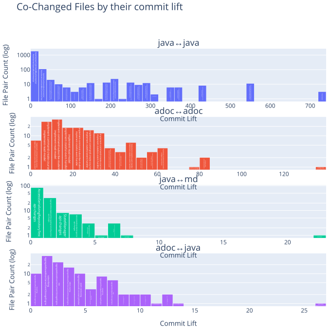
    

### Files changed together by commit Jaccard similarity

<table border="1" class="dataframe">
  <thead>
    <tr style="text-align: right;">
      <th></th>
      <th>fileExtensionPair</th>
      <th>updateCommitJaccardSimilarity</th>
      <th>GroupRank</th>
      <th>filePair</th>
      <th>filePairWithRelativePath</th>
    </tr>
  </thead>
  <tbody>
    <tr>
      <th>0</th>
      <td>java↔java</td>
      <td>1.000000</td>
      <td>1</td>
      <td>AnnotationSagaMetaModelFactory↔AnnotationEventHandlerAdapter</td>
      <td>stash/legacy-saga/src/main/java/org/axonframework/modelling/saga/metamodel/AnnotationSagaMetaModelFactory.java↔stash/todo/src/main/java/org/axonframework/messaging/eventhandling/annotation/AnnotationEventHandlerAdapter.java</td>
    </tr>
    <tr>
      <th>1</th>
      <td>java↔java</td>
      <td>0.818182</td>
      <td>2</td>
      <td>ChildEntityFieldDefinition↔GetterSetterChildEntityFieldDefinition</td>
      <td>modelling/src/main/java/org/axonframework/modelling/entity/child/ChildEntityFieldDefinition.java↔modelling/src/main/java/org/axonframework/modelling/entity/child/GetterSetterChildEntityFieldDefinition.java</td>
    </tr>
    <tr>
      <th>2</th>
      <td>java↔java</td>
      <td>0.800000</td>
      <td>3</td>
      <td>AnnotatedEventHandlingComponentTest↔AnnotationSagaMetaModelFactory</td>
      <td>messaging/src/test/java/org/axonframework/messaging/eventhandling/annotation/AnnotatedEventHandlingComponentTest.java↔stash/legacy-saga/src/main/java/org/axonframework/modelling/saga/metamodel/AnnotationSagaMetaModelFactory.java</td>
    </tr>
    <tr>
      <th>3</th>
      <td>java↔java</td>
      <td>0.750000</td>
      <td>4</td>
      <td>Command↔AnnotationMessageTypeResolver</td>
      <td>messaging/src/main/java/org/axonframework/messaging/commandhandling/annotation/Command.java↔messaging/src/main/java/org/axonframework/messaging/core/annotation/AnnotationMessageTypeResolver.java</td>
    </tr>
    <tr>
      <th>4</th>
      <td>java↔java</td>
      <td>0.666667</td>
      <td>5</td>
      <td>SimpleCommandHandlingComponent↔HandlerComparator</td>
      <td>messaging/src/main/java/org/axonframework/messaging/commandhandling/SimpleCommandHandlingComponent.java↔messaging/src/main/java/org/axonframework/messaging/core/annotation/HandlerComparator.java</td>
    </tr>
    <tr>
      <th>5</th>
      <td>java↔java</td>
      <td>0.636364</td>
      <td>6</td>
      <td>ChildEntityFieldDefinition↔FieldChildEntityFieldDefinition</td>
      <td>modelling/src/main/java/org/axonframework/modelling/entity/child/ChildEntityFieldDefinition.java↔modelling/src/main/java/org/axonframework/modelling/entity/child/FieldChildEntityFieldDefinition.java</td>
    </tr>
    <tr>
      <th>6</th>
      <td>java↔java</td>
      <td>0.571429</td>
      <td>7</td>
      <td>SimpleCommandHandlingComponent↔AnnotatedHandlerInspector</td>
      <td>messaging/src/main/java/org/axonframework/messaging/commandhandling/SimpleCommandHandlingComponent.java↔messaging/src/main/java/org/axonframework/messaging/core/annotation/AnnotatedHandlerInspector.java</td>
    </tr>
    <tr>
      <th>7</th>
      <td>java↔java</td>
      <td>0.555556</td>
      <td>8</td>
      <td>ProcessingLifecycleHandlerRegistrar↔UnitOfWorkFactory</td>
      <td>messaging/src/main/java/org/axonframework/messaging/core/unitofwork/ProcessingLifecycleHandlerRegistrar.java↔messaging/src/main/java/org/axonframework/messaging/core/unitofwork/UnitOfWorkFactory.java</td>
    </tr>
    <tr>
      <th>8</th>
      <td>java↔java</td>
      <td>0.500000</td>
      <td>9</td>
      <td>SimpleCommandBus↔SimpleUnitOfWorkFactory</td>
      <td>messaging/src/main/java/org/axonframework/messaging/commandhandling/SimpleCommandBus.java↔messaging/src/main/java/org/axonframework/messaging/core/unitofwork/SimpleUnitOfWorkFactory.java</td>
    </tr>
    <tr>
      <th>9</th>
      <td>java↔java</td>
      <td>0.471910</td>
      <td>10</td>
      <td>DefaultSourcingConditionTest↔SourcingConditionTest</td>
      <td>eventsourcing/src/test/java/org/axonframework/eventsourcing/eventstore/DefaultSourcingConditionTest.java↔eventsourcing/src/test/java/org/axonframework/eventsourcing/eventstore/SourcingConditionTest.java</td>
    </tr>
    <tr>
      <th>10</th>
      <td>adoc↔adoc</td>
      <td>0.520000</td>
      <td>1</td>
      <td>index↔project-structure</td>
      <td>docs/af5-getting-started/modules/ROOT/pages/index.adoc↔docs/af5-getting-started/modules/ROOT/pages/project-structure.adoc</td>
    </tr>
    <tr>
      <th>11</th>
      <td>adoc↔adoc</td>
      <td>0.485714</td>
      <td>2</td>
      <td>index↔major-releases</td>
      <td>docs/old-reference-guide/modules/release-notes/pages/index.adoc↔docs/old-reference-guide/modules/release-notes/pages/major-releases.adoc</td>
    </tr>
    <tr>
      <th>12</th>
      <td>adoc↔adoc</td>
      <td>0.339286</td>
      <td>3</td>
      <td>query-dispatchers↔query-handlers</td>
      <td>docs/old-reference-guide/modules/queries/pages/query-dispatchers.adoc↔docs/old-reference-guide/modules/queries/pages/query-handlers.adoc</td>
    </tr>
    <tr>
      <th>13</th>
      <td>adoc↔adoc</td>
      <td>0.333333</td>
      <td>4</td>
      <td>implementing↔spring-boot-integration</td>
      <td>docs/dead-letter-queue-guide/modules/ROOT/pages/implementing.adoc↔docs/old-reference-guide/modules/ROOT/pages/spring-boot-integration.adoc</td>
    </tr>
    <tr>
      <th>14</th>
      <td>adoc↔adoc</td>
      <td>0.323529</td>
      <td>5</td>
      <td>index↔nav</td>
      <td>docs/af5-getting-started/modules/ROOT/pages/index.adoc↔docs/af5-getting-started/modules/ROOT/nav.adoc</td>
    </tr>
    <tr>
      <th>15</th>
      <td>adoc↔adoc</td>
      <td>0.315789</td>
      <td>6</td>
      <td>index↔configuration</td>
      <td>docs/old-reference-guide/modules/queries/pages/index.adoc↔docs/old-reference-guide/modules/queries/pages/configuration.adoc</td>
    </tr>
    <tr>
      <th>16</th>
      <td>adoc↔adoc</td>
      <td>0.308824</td>
      <td>7</td>
      <td>minor-releases↔major-releases</td>
      <td>docs/old-reference-guide/modules/release-notes/pages/minor-releases.adoc↔docs/old-reference-guide/modules/release-notes/pages/major-releases.adoc</td>
    </tr>
    <tr>
      <th>17</th>
      <td>adoc↔adoc</td>
      <td>0.307692</td>
      <td>8</td>
      <td>implementations↔configuration</td>
      <td>docs/old-reference-guide/modules/queries/pages/implementations.adoc↔docs/old-reference-guide/modules/queries/pages/configuration.adoc</td>
    </tr>
    <tr>
      <th>18</th>
      <td>adoc↔adoc</td>
      <td>0.300000</td>
      <td>9</td>
      <td>index↔nav</td>
      <td>docs/old-reference-guide/modules/tuning/pages/index.adoc↔docs/old-reference-guide/modules/tuning/partials/nav.adoc</td>
    </tr>
    <tr>
      <th>19</th>
      <td>adoc↔adoc</td>
      <td>0.285714</td>
      <td>10</td>
      <td>index↔minor-releases</td>
      <td>docs/old-reference-guide/modules/release-notes/pages/index.adoc↔docs/old-reference-guide/modules/release-notes/pages/minor-releases.adoc</td>
    </tr>
    <tr>
      <th>20</th>
      <td>java↔md</td>
      <td>0.120863</td>
      <td>1</td>
      <td>AggregateBasedAxonServerEventStorageEngine↔api-changes</td>
      <td>axon-server-connector/src/main/java/org/axonframework/axonserver/connector/event/AggregateBasedAxonServerEventStorageEngine.java↔axon-5/api-changes.md</td>
    </tr>
    <tr>
      <th>21</th>
      <td>java↔md</td>
      <td>0.113055</td>
      <td>2</td>
      <td>AggregateBasedStorageEngineTestSuite↔api-changes</td>
      <td>eventsourcing/src/test/java/org/axonframework/eventsourcing/eventstore/AggregateBasedStorageEngineTestSuite.java↔axon-5/api-changes.md</td>
    </tr>
    <tr>
      <th>22</th>
      <td>java↔md</td>
      <td>0.105850</td>
      <td>3</td>
      <td>AggregateBasedJpaEventStorageEngine↔api-changes</td>
      <td>eventsourcing/src/main/java/org/axonframework/eventsourcing/eventstore/jpa/AggregateBasedJpaEventStorageEngine.java↔axon-5/api-changes.md</td>
    </tr>
    <tr>
      <th>23</th>
      <td>java↔md</td>
      <td>0.090426</td>
      <td>4</td>
      <td>StorageEngineTestSuite↔api-changes</td>
      <td>eventsourcing/src/test/java/org/axonframework/eventsourcing/eventstore/StorageEngineTestSuite.java↔axon-5/api-changes.md</td>
    </tr>
    <tr>
      <th>24</th>
      <td>java↔md</td>
      <td>0.074859</td>
      <td>5</td>
      <td>SimpleEventStoreTest↔api-changes</td>
      <td>eventsourcing/src/test/java/org/axonframework/eventsourcing/eventstore/SimpleEventStoreTest.java↔axon-5/api-changes.md</td>
    </tr>
    <tr>
      <th>25</th>
      <td>java↔md</td>
      <td>0.069111</td>
      <td>6</td>
      <td>DefaultEventStoreTransactionTest↔api-changes</td>
      <td>eventsourcing/src/test/java/org/axonframework/eventsourcing/eventstore/DefaultEventStoreTransactionTest.java↔axon-5/api-changes.md</td>
    </tr>
    <tr>
      <th>26</th>
      <td>java↔md</td>
      <td>0.067449</td>
      <td>7</td>
      <td>QueryThreadingIntegrationTest↔api-changes</td>
      <td>integrationtests/src/test/java/org/axonframework/integrationtests/queryhandling/QueryThreadingIntegrationTest.java↔axon-5/api-changes.md</td>
    </tr>
    <tr>
      <th>27</th>
      <td>java↔md</td>
      <td>0.062500</td>
      <td>8</td>
      <td>NoAppendConditionTest↔design-principles</td>
      <td>eventsourcing/src/test/java/org/axonframework/eventsourcing/eventstore/NoAppendConditionTest.java↔axon-5/design-principles.md</td>
    </tr>
    <tr>
      <th>28</th>
      <td>java↔md</td>
      <td>0.060811</td>
      <td>9</td>
      <td>QueryThreadingIntegrationTest↔README</td>
      <td>integrationtests/src/test/java/org/axonframework/integrationtests/queryhandling/QueryThreadingIntegrationTest.java↔docs/README.md</td>
    </tr>
    <tr>
      <th>29</th>
      <td>java↔md</td>
      <td>0.059524</td>
      <td>10</td>
      <td>NoAppendCondition↔design-principles</td>
      <td>eventsourcing/src/main/java/org/axonframework/eventsourcing/eventstore/NoAppendCondition.java↔axon-5/design-principles.md</td>
    </tr>
    <tr>
      <th>30</th>
      <td>adoc↔java</td>
      <td>0.113636</td>
      <td>1</td>
      <td>configure-axon-server↔StudentAxonTestFixtureAxonServerIntegrationIT</td>
      <td>docs/af5-getting-started/modules/ROOT/pages/configure-axon-server.adoc↔integrationtests/src/test/java/org/axonframework/integrationtests/testsuite/course/StudentAxonTestFixtureAxonServerIntegrationIT.java</td>
    </tr>
    <tr>
      <th>31</th>
      <td>adoc↔java</td>
      <td>0.105263</td>
      <td>2</td>
      <td>implement-command-subscribe-student↔AxonTestFixture</td>
      <td>docs/af5-getting-started/modules/ROOT/pages/implement-command-subscribe-student.adoc↔test/src/main/java/org/axonframework/test/fixture/AxonTestFixture.java</td>
    </tr>
    <tr>
      <th>32</th>
      <td>adoc↔java</td>
      <td>0.096774</td>
      <td>3</td>
      <td>implement-command-subscribe-student↔SimpleRepositoryTest</td>
      <td>docs/af5-getting-started/modules/ROOT/pages/implement-command-subscribe-student.adoc↔modelling/src/test/java/org/axonframework/modelling/SimpleRepositoryTest.java</td>
    </tr>
    <tr>
      <th>33</th>
      <td>adoc↔java</td>
      <td>0.090909</td>
      <td>4</td>
      <td>nav↔InterceptingEventStoreTest</td>
      <td>docs/af5-getting-started/modules/ROOT/nav.adoc↔eventsourcing/src/test/java/org/axonframework/eventsourcing/eventstore/InterceptingEventStoreTest.java</td>
    </tr>
    <tr>
      <th>34</th>
      <td>adoc↔java</td>
      <td>0.088235</td>
      <td>5</td>
      <td>nav↔RecordingEventStore</td>
      <td>docs/af5-getting-started/modules/ROOT/nav.adoc↔test/src/main/java/org/axonframework/test/fixture/RecordingEventStore.java</td>
    </tr>
    <tr>
      <th>35</th>
      <td>adoc↔java</td>
      <td>0.084746</td>
      <td>6</td>
      <td>configure-axon-server↔DistributedQueryBusSubscriptionQueryTest</td>
      <td>docs/af5-getting-started/modules/ROOT/pages/configure-axon-server.adoc↔integrationtests/src/test/java/org/axonframework/integrationtests/queryhandling/DistributedQueryBusSubscriptionQueryTest.java</td>
    </tr>
    <tr>
      <th>36</th>
      <td>adoc↔java</td>
      <td>0.082192</td>
      <td>7</td>
      <td>nav↔InterceptingEventStore</td>
      <td>docs/af5-getting-started/modules/ROOT/nav.adoc↔eventsourcing/src/main/java/org/axonframework/eventsourcing/eventstore/InterceptingEventStore.java</td>
    </tr>
    <tr>
      <th>37</th>
      <td>adoc↔java</td>
      <td>0.081967</td>
      <td>8</td>
      <td>configure-axon-server↔AxonServerEventStorageEngineIT</td>
      <td>docs/af5-getting-started/modules/ROOT/pages/configure-axon-server.adoc↔axon-server-connector/src/test/java/org/axonframework/axonserver/connector/event/AxonServerEventStorageEngineIT.java</td>
    </tr>
    <tr>
      <th>38</th>
      <td>adoc↔java</td>
      <td>0.074627</td>
      <td>9</td>
      <td>nav↔StudentMentorAssignment</td>
      <td>docs/af5-getting-started/modules/ROOT/nav.adoc↔integrationtests/src/test/java/org/axonframework/integrationtests/testsuite/student/state/StudentMentorAssignment.java</td>
    </tr>
    <tr>
      <th>39</th>
      <td>adoc↔java</td>
      <td>0.069767</td>
      <td>10</td>
      <td>implement-command-subscribe-student↔AccessSerializingRepositoryTest</td>
      <td>docs/af5-getting-started/modules/ROOT/pages/implement-command-subscribe-student.adoc↔modelling/src/test/java/org/axonframework/modelling/repository/AccessSerializingRepositoryTest.java</td>
    </tr>
  </tbody>
</table>

    
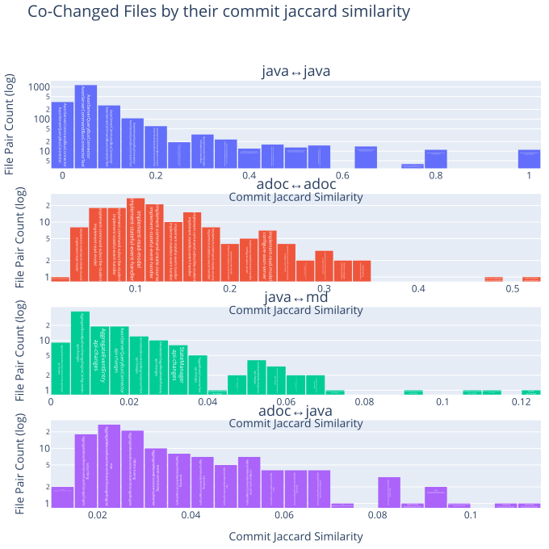
    

### Find pairwise changed files with many highly ranked metrics

Find those pairwise changed files that have a high rank in many metrics by calculating a combined (weighted) score based on the ranks of each metric.
This is useful to identify pairs of files that score high in most metrics, which indicates a strong co-change relationship.

<table border="1" class="dataframe">
  <thead>
    <tr style="text-align: right;">
      <th></th>
      <th>fileExtensionPair</th>
      <th>filePair</th>
      <th>combinedMetricsScore</th>
      <th>updateCommitCountExtensionRank</th>
      <th>updateCommitMinConfidenceExtensionRank</th>
      <th>updateCommitJaccardSimilarityExtensionRank</th>
      <th>updateCommitLiftExtensionRank</th>
      <th>updateCommitCount</th>
      <th>updateCommitMinConfidence</th>
      <th>updateCommitJaccardSimilarity</th>
      <th>updateCommitLift</th>
      <th>filePairWithRelativePath</th>
    </tr>
  </thead>
  <tbody>
    <tr>
      <th>0</th>
      <td>adoc↔adoc</td>
      <td>index↔project-structure</td>
      <td>16</td>
      <td>7</td>
      <td>5</td>
      <td>1</td>
      <td>3</td>
      <td>13</td>
      <td>0.722222</td>
      <td>0.520000</td>
      <td>79.408333</td>
      <td>docs/af5-getting-started/modules/ROOT/pages/index.adoc↔docs/af5-getting-started/modules/ROOT/pages/project-structure.adoc</td>
    </tr>
    <tr>
      <th>1</th>
      <td>adoc↔adoc</td>
      <td>index↔major-releases</td>
      <td>19</td>
      <td>4</td>
      <td>4</td>
      <td>2</td>
      <td>9</td>
      <td>17</td>
      <td>0.772727</td>
      <td>0.485714</td>
      <td>56.640909</td>
      <td>docs/old-reference-guide/modules/release-notes/pages/index.adoc↔docs/old-reference-guide/modules/release-notes/pages/major-releases.adoc</td>
    </tr>
    <tr>
      <th>2</th>
      <td>adoc↔adoc</td>
      <td>implementing↔spring-boot-integration</td>
      <td>30</td>
      <td>15</td>
      <td>10</td>
      <td>4</td>
      <td>1</td>
      <td>4</td>
      <td>0.571429</td>
      <td>0.333333</td>
      <td>139.619048</td>
      <td>docs/dead-letter-queue-guide/modules/ROOT/pages/implementing.adoc↔docs/old-reference-guide/modules/ROOT/pages/spring-boot-integration.adoc</td>
    </tr>
    <tr>
      <th>3</th>
      <td>adoc↔adoc</td>
      <td>implementations↔configuration</td>
      <td>31</td>
      <td>11</td>
      <td>8</td>
      <td>8</td>
      <td>4</td>
      <td>8</td>
      <td>0.615385</td>
      <td>0.307692</td>
      <td>64.439560</td>
      <td>docs/old-reference-guide/modules/queries/pages/implementations.adoc↔docs/old-reference-guide/modules/queries/pages/configuration.adoc</td>
    </tr>
    <tr>
      <th>4</th>
      <td>adoc↔adoc</td>
      <td>index↔configuration</td>
      <td>36</td>
      <td>13</td>
      <td>15</td>
      <td>6</td>
      <td>2</td>
      <td>6</td>
      <td>0.500000</td>
      <td>0.315789</td>
      <td>84.576923</td>
      <td>docs/old-reference-guide/modules/queries/pages/index.adoc↔docs/old-reference-guide/modules/queries/pages/configuration.adoc</td>
    </tr>
    <tr>
      <th>5</th>
      <td>adoc↔adoc</td>
      <td>index↔nav</td>
      <td>40</td>
      <td>8</td>
      <td>13</td>
      <td>5</td>
      <td>14</td>
      <td>11</td>
      <td>0.550000</td>
      <td>0.323529</td>
      <td>48.378000</td>
      <td>docs/af5-getting-started/modules/ROOT/pages/index.adoc↔docs/af5-getting-started/modules/ROOT/nav.adoc</td>
    </tr>
    <tr>
      <th>6</th>
      <td>adoc↔adoc</td>
      <td>implement-command-create-course↔index</td>
      <td>47</td>
      <td>7</td>
      <td>7</td>
      <td>11</td>
      <td>22</td>
      <td>13</td>
      <td>0.650000</td>
      <td>0.276596</td>
      <td>35.733750</td>
      <td>docs/af5-getting-started/modules/ROOT/pages/implement-command-create-course.adoc↔docs/af5-getting-started/modules/ROOT/pages/index.adoc</td>
    </tr>
    <tr>
      <th>7</th>
      <td>adoc↔adoc</td>
      <td>index↔nav</td>
      <td>47</td>
      <td>10</td>
      <td>16</td>
      <td>9</td>
      <td>12</td>
      <td>9</td>
      <td>0.473684</td>
      <td>0.300000</td>
      <td>52.081579</td>
      <td>docs/old-reference-guide/modules/tuning/pages/index.adoc↔docs/old-reference-guide/modules/tuning/partials/nav.adoc</td>
    </tr>
    <tr>
      <th>8</th>
      <td>adoc↔adoc</td>
      <td>index↔nav</td>
      <td>48</td>
      <td>13</td>
      <td>15</td>
      <td>14</td>
      <td>6</td>
      <td>6</td>
      <td>0.500000</td>
      <td>0.250000</td>
      <td>61.083333</td>
      <td>docs/old-reference-guide/modules/queries/pages/index.adoc↔docs/old-reference-guide/modules/queries/partials/nav.adoc</td>
    </tr>
    <tr>
      <th>9</th>
      <td>adoc↔adoc</td>
      <td>implement-stateful-event-handler↔implement-stateless-event-handler</td>
      <td>50</td>
      <td>15</td>
      <td>15</td>
      <td>18</td>
      <td>2</td>
      <td>4</td>
      <td>0.500000</td>
      <td>0.235294</td>
      <td>84.576923</td>
      <td>docs/af5-getting-started/modules/ROOT/pages/implement-stateful-event-handler.adoc↔docs/af5-getting-started/modules/ROOT/pages/implement-stateless-event-handler.adoc</td>
    </tr>
    <tr>
      <th>10</th>
      <td>adoc↔java</td>
      <td>configure-axon-server↔StudentAxonTestFixtureAxonServerIntegrationIT</td>
      <td>9</td>
      <td>6</td>
      <td>1</td>
      <td>1</td>
      <td>1</td>
      <td>5</td>
      <td>0.454545</td>
      <td>0.113636</td>
      <td>26.303828</td>
      <td>docs/af5-getting-started/modules/ROOT/pages/configure-axon-server.adoc↔integrationtests/src/test/java/org/axonframework/integrationtests/testsuite/course/StudentAxonTestFixtureAxonServerIntegrationIT.java</td>
    </tr>
    <tr>
      <th>11</th>
      <td>adoc↔java</td>
      <td>implement-command-subscribe-student↔SimpleRepositoryTest</td>
      <td>18</td>
      <td>5</td>
      <td>6</td>
      <td>3</td>
      <td>4</td>
      <td>6</td>
      <td>0.240000</td>
      <td>0.096774</td>
      <td>12.273488</td>
      <td>docs/af5-getting-started/modules/ROOT/pages/implement-command-subscribe-student.adoc↔modelling/src/test/java/org/axonframework/modelling/SimpleRepositoryTest.java</td>
    </tr>
    <tr>
      <th>12</th>
      <td>adoc↔java</td>
      <td>configure-axon-server↔AbstractAxonServerIT</td>
      <td>20</td>
      <td>6</td>
      <td>8</td>
      <td>4</td>
      <td>2</td>
      <td>5</td>
      <td>0.227273</td>
      <td>0.090909</td>
      <td>13.151914</td>
      <td>docs/af5-getting-started/modules/ROOT/pages/configure-axon-server.adoc↔integrationtests/src/test/java/org/axonframework/integrationtests/testsuite/AbstractAxonServerIT.java</td>
    </tr>
    <tr>
      <th>13</th>
      <td>adoc↔java</td>
      <td>implement-command-subscribe-student↔AxonTestFixture</td>
      <td>20</td>
      <td>1</td>
      <td>7</td>
      <td>2</td>
      <td>10</td>
      <td>10</td>
      <td>0.232558</td>
      <td>0.105263</td>
      <td>8.248312</td>
      <td>docs/af5-getting-started/modules/ROOT/pages/implement-command-subscribe-student.adoc↔test/src/main/java/org/axonframework/test/fixture/AxonTestFixture.java</td>
    </tr>
    <tr>
      <th>14</th>
      <td>adoc↔java</td>
      <td>nav↔RecordingEventStore</td>
      <td>22</td>
      <td>5</td>
      <td>6</td>
      <td>5</td>
      <td>6</td>
      <td>6</td>
      <td>0.240000</td>
      <td>0.088235</td>
      <td>10.770612</td>
      <td>docs/af5-getting-started/modules/ROOT/nav.adoc↔test/src/main/java/org/axonframework/test/fixture/RecordingEventStore.java</td>
    </tr>
    <tr>
      <th>15</th>
      <td>adoc↔java</td>
      <td>nav↔InterceptingEventStore</td>
      <td>26</td>
      <td>5</td>
      <td>6</td>
      <td>7</td>
      <td>8</td>
      <td>6</td>
      <td>0.240000</td>
      <td>0.082192</td>
      <td>9.773333</td>
      <td>docs/af5-getting-started/modules/ROOT/nav.adoc↔eventsourcing/src/main/java/org/axonframework/eventsourcing/eventstore/InterceptingEventStore.java</td>
    </tr>
    <tr>
      <th>16</th>
      <td>adoc↔java</td>
      <td>nav↔InterceptingEventStoreTest</td>
      <td>26</td>
      <td>6</td>
      <td>13</td>
      <td>4</td>
      <td>3</td>
      <td>5</td>
      <td>0.200000</td>
      <td>0.090909</td>
      <td>12.565714</td>
      <td>docs/af5-getting-started/modules/ROOT/nav.adoc↔eventsourcing/src/test/java/org/axonframework/eventsourcing/eventstore/InterceptingEventStoreTest.java</td>
    </tr>
    <tr>
      <th>17</th>
      <td>adoc↔java</td>
      <td>configure-axon-server↔DistributedQueryBusSubscriptionQueryTest</td>
      <td>31</td>
      <td>6</td>
      <td>14</td>
      <td>6</td>
      <td>5</td>
      <td>5</td>
      <td>0.192308</td>
      <td>0.084746</td>
      <td>11.128543</td>
      <td>docs/af5-getting-started/modules/ROOT/pages/configure-axon-server.adoc↔integrationtests/src/test/java/org/axonframework/integrationtests/queryhandling/DistributedQueryBusSubscriptionQueryTest.java</td>
    </tr>
    <tr>
      <th>18</th>
      <td>adoc↔java</td>
      <td>nav↔StudentMentorAssignment</td>
      <td>37</td>
      <td>6</td>
      <td>13</td>
      <td>9</td>
      <td>9</td>
      <td>5</td>
      <td>0.200000</td>
      <td>0.074627</td>
      <td>9.357447</td>
      <td>docs/af5-getting-started/modules/ROOT/nav.adoc↔integrationtests/src/test/java/org/axonframework/integrationtests/testsuite/student/state/StudentMentorAssignment.java</td>
    </tr>
    <tr>
      <th>19</th>
      <td>adoc↔java</td>
      <td>configure-axon-server↔AxonServerEventStorageEngineIT</td>
      <td>38</td>
      <td>6</td>
      <td>17</td>
      <td>8</td>
      <td>7</td>
      <td>5</td>
      <td>0.178571</td>
      <td>0.081967</td>
      <td>10.333647</td>
      <td>docs/af5-getting-started/modules/ROOT/pages/configure-axon-server.adoc↔axon-server-connector/src/test/java/org/axonframework/axonserver/connector/event/AxonServerEventStorageEngineIT.java</td>
    </tr>
    <tr>
      <th>20</th>
      <td>java↔java</td>
      <td>AnnotationSagaMetaModelFactory↔AnnotationEventHandlerAdapter</td>
      <td>54</td>
      <td>50</td>
      <td>1</td>
      <td>1</td>
      <td>2</td>
      <td>4</td>
      <td>1.000000</td>
      <td>1.000000</td>
      <td>549.750000</td>
      <td>stash/legacy-saga/src/main/java/org/axonframework/modelling/saga/metamodel/AnnotationSagaMetaModelFactory.java↔stash/todo/src/main/java/org/axonframework/messaging/eventhandling/annotation/AnnotationEventHandlerAdapter.java</td>
    </tr>
    <tr>
      <th>21</th>
      <td>java↔java</td>
      <td>Command↔Event</td>
      <td>54</td>
      <td>50</td>
      <td>1</td>
      <td>1</td>
      <td>2</td>
      <td>4</td>
      <td>1.000000</td>
      <td>1.000000</td>
      <td>549.750000</td>
      <td>messaging/src/main/java/org/axonframework/messaging/commandhandling/annotation/Command.java↔messaging/src/main/java/org/axonframework/messaging/eventhandling/annotation/Event.java</td>
    </tr>
    <tr>
      <th>22</th>
      <td>java↔java</td>
      <td>Command↔Query</td>
      <td>54</td>
      <td>50</td>
      <td>1</td>
      <td>1</td>
      <td>2</td>
      <td>4</td>
      <td>1.000000</td>
      <td>1.000000</td>
      <td>549.750000</td>
      <td>messaging/src/main/java/org/axonframework/messaging/commandhandling/annotation/Command.java↔messaging/src/main/java/org/axonframework/messaging/queryhandling/annotation/Query.java</td>
    </tr>
    <tr>
      <th>23</th>
      <td>java↔java</td>
      <td>Event↔Query</td>
      <td>54</td>
      <td>50</td>
      <td>1</td>
      <td>1</td>
      <td>2</td>
      <td>4</td>
      <td>1.000000</td>
      <td>1.000000</td>
      <td>549.750000</td>
      <td>messaging/src/main/java/org/axonframework/messaging/eventhandling/annotation/Event.java↔messaging/src/main/java/org/axonframework/messaging/queryhandling/annotation/Query.java</td>
    </tr>
    <tr>
      <th>24</th>
      <td>java↔java</td>
      <td>Event↔QueryResponse</td>
      <td>54</td>
      <td>50</td>
      <td>1</td>
      <td>1</td>
      <td>2</td>
      <td>4</td>
      <td>1.000000</td>
      <td>1.000000</td>
      <td>549.750000</td>
      <td>messaging/src/main/java/org/axonframework/messaging/eventhandling/annotation/Event.java↔messaging/src/main/java/org/axonframework/messaging/queryhandling/annotation/QueryResponse.java</td>
    </tr>
    <tr>
      <th>25</th>
      <td>java↔java</td>
      <td>Command↔QueryResponse</td>
      <td>54</td>
      <td>50</td>
      <td>1</td>
      <td>1</td>
      <td>2</td>
      <td>4</td>
      <td>1.000000</td>
      <td>1.000000</td>
      <td>549.750000</td>
      <td>messaging/src/main/java/org/axonframework/messaging/commandhandling/annotation/Command.java↔messaging/src/main/java/org/axonframework/messaging/queryhandling/annotation/QueryResponse.java</td>
    </tr>
    <tr>
      <th>26</th>
      <td>java↔java</td>
      <td>Query↔QueryResponse</td>
      <td>54</td>
      <td>50</td>
      <td>1</td>
      <td>1</td>
      <td>2</td>
      <td>4</td>
      <td>1.000000</td>
      <td>1.000000</td>
      <td>549.750000</td>
      <td>messaging/src/main/java/org/axonframework/messaging/queryhandling/annotation/Query.java↔messaging/src/main/java/org/axonframework/messaging/queryhandling/annotation/QueryResponse.java</td>
    </tr>
    <tr>
      <th>27</th>
      <td>java↔java</td>
      <td>GetterEvolverChildEntityFieldDefinitionTest↔FieldChildEntityFieldDefinitionTest</td>
      <td>54</td>
      <td>51</td>
      <td>1</td>
      <td>1</td>
      <td>1</td>
      <td>3</td>
      <td>1.000000</td>
      <td>1.000000</td>
      <td>733.000000</td>
      <td>modelling/src/test/java/org/axonframework/modelling/entity/child/GetterEvolverChildEntityFieldDefinitionTest.java↔modelling/src/test/java/org/axonframework/modelling/entity/child/FieldChildEntityFieldDefinitionTest.java</td>
    </tr>
    <tr>
      <th>28</th>
      <td>java↔java</td>
      <td>FieldChildEntityFieldDefinitionTest↔GetterSetterChildEntityFieldDefinitionTest</td>
      <td>54</td>
      <td>51</td>
      <td>1</td>
      <td>1</td>
      <td>1</td>
      <td>3</td>
      <td>1.000000</td>
      <td>1.000000</td>
      <td>733.000000</td>
      <td>modelling/src/test/java/org/axonframework/modelling/entity/child/FieldChildEntityFieldDefinitionTest.java↔modelling/src/test/java/org/axonframework/modelling/entity/child/GetterSetterChildEntityFieldDefinitionTest.java</td>
    </tr>
    <tr>
      <th>29</th>
      <td>java↔java</td>
      <td>GetterEvolverChildEntityFieldDefinitionTest↔GetterSetterChildEntityFieldDefinitionTest</td>
      <td>54</td>
      <td>51</td>
      <td>1</td>
      <td>1</td>
      <td>1</td>
      <td>3</td>
      <td>1.000000</td>
      <td>1.000000</td>
      <td>733.000000</td>
      <td>modelling/src/test/java/org/axonframework/modelling/entity/child/GetterEvolverChildEntityFieldDefinitionTest.java↔modelling/src/test/java/org/axonframework/modelling/entity/child/GetterSetterChildEntityFieldDefinitionTest.java</td>
    </tr>
    <tr>
      <th>30</th>
      <td>java↔md</td>
      <td>AggregateBasedAxonServerEventStorageEngine↔api-changes</td>
      <td>27</td>
      <td>1</td>
      <td>6</td>
      <td>1</td>
      <td>19</td>
      <td>84</td>
      <td>0.451613</td>
      <td>0.120863</td>
      <td>1.674699</td>
      <td>axon-server-connector/src/main/java/org/axonframework/axonserver/connector/event/AggregateBasedAxonServerEventStorageEngine.java↔axon-5/api-changes.md</td>
    </tr>
    <tr>
      <th>31</th>
      <td>java↔md</td>
      <td>AggregateBasedJpaEventStorageEngine↔api-changes</td>
      <td>35</td>
      <td>2</td>
      <td>9</td>
      <td>3</td>
      <td>21</td>
      <td>76</td>
      <td>0.378109</td>
      <td>0.105850</td>
      <td>1.402129</td>
      <td>eventsourcing/src/main/java/org/axonframework/eventsourcing/eventstore/jpa/AggregateBasedJpaEventStorageEngine.java↔axon-5/api-changes.md</td>
    </tr>
    <tr>
      <th>32</th>
      <td>java↔md</td>
      <td>AggregateBasedStorageEngineTestSuite↔api-changes</td>
      <td>39</td>
      <td>1</td>
      <td>12</td>
      <td>2</td>
      <td>24</td>
      <td>84</td>
      <td>0.358974</td>
      <td>0.113055</td>
      <td>1.331171</td>
      <td>eventsourcing/src/test/java/org/axonframework/eventsourcing/eventstore/AggregateBasedStorageEngineTestSuite.java↔axon-5/api-changes.md</td>
    </tr>
    <tr>
      <th>33</th>
      <td>java↔md</td>
      <td>QueryThreadingIntegrationTest↔README</td>
      <td>48</td>
      <td>27</td>
      <td>8</td>
      <td>9</td>
      <td>4</td>
      <td>9</td>
      <td>0.409091</td>
      <td>0.060811</td>
      <td>6.663636</td>
      <td>integrationtests/src/test/java/org/axonframework/integrationtests/queryhandling/QueryThreadingIntegrationTest.java↔docs/README.md</td>
    </tr>
    <tr>
      <th>34</th>
      <td>java↔md</td>
      <td>CommandConverter↔modularity</td>
      <td>54</td>
      <td>33</td>
      <td>4</td>
      <td>16</td>
      <td>1</td>
      <td>3</td>
      <td>0.600000</td>
      <td>0.050000</td>
      <td>22.748276</td>
      <td>axon-server-connector/src/main/java/org/axonframework/axonserver/connector/command/CommandConverter.java↔axon-5/modularity.md</td>
    </tr>
    <tr>
      <th>35</th>
      <td>java↔md</td>
      <td>QueryThreadingIntegrationTest↔api-changes</td>
      <td>55</td>
      <td>6</td>
      <td>15</td>
      <td>7</td>
      <td>27</td>
      <td>46</td>
      <td>0.340741</td>
      <td>0.067449</td>
      <td>1.263556</td>
      <td>integrationtests/src/test/java/org/axonframework/integrationtests/queryhandling/QueryThreadingIntegrationTest.java↔axon-5/api-changes.md</td>
    </tr>
    <tr>
      <th>36</th>
      <td>java↔md</td>
      <td>SimpleEventStoreTest↔api-changes</td>
      <td>59</td>
      <td>4</td>
      <td>19</td>
      <td>5</td>
      <td>31</td>
      <td>53</td>
      <td>0.315476</td>
      <td>0.074859</td>
      <td>1.169869</td>
      <td>eventsourcing/src/test/java/org/axonframework/eventsourcing/eventstore/SimpleEventStoreTest.java↔axon-5/api-changes.md</td>
    </tr>
    <tr>
      <th>37</th>
      <td>java↔md</td>
      <td>StorageEngineTestSuite↔api-changes</td>
      <td>64</td>
      <td>3</td>
      <td>22</td>
      <td>4</td>
      <td>35</td>
      <td>68</td>
      <td>0.299559</td>
      <td>0.090426</td>
      <td>1.110845</td>
      <td>eventsourcing/src/test/java/org/axonframework/eventsourcing/eventstore/StorageEngineTestSuite.java↔axon-5/api-changes.md</td>
    </tr>
    <tr>
      <th>38</th>
      <td>java↔md</td>
      <td>AxonServerEventStorageEngine↔api-changes</td>
      <td>64</td>
      <td>9</td>
      <td>14</td>
      <td>15</td>
      <td>26</td>
      <td>34</td>
      <td>0.350515</td>
      <td>0.051829</td>
      <td>1.299804</td>
      <td>axon-server-connector/src/main/java/org/axonframework/axonserver/connector/event/AxonServerEventStorageEngine.java↔axon-5/api-changes.md</td>
    </tr>
    <tr>
      <th>39</th>
      <td>java↔md</td>
      <td>DefaultEventStoreTransactionTest↔api-changes</td>
      <td>70</td>
      <td>5</td>
      <td>23</td>
      <td>6</td>
      <td>36</td>
      <td>49</td>
      <td>0.296970</td>
      <td>0.069111</td>
      <td>1.101242</td>
      <td>eventsourcing/src/test/java/org/axonframework/eventsourcing/eventstore/DefaultEventStoreTransactionTest.java↔axon-5/api-changes.md</td>
    </tr>
  </tbody>
</table>

### Pairwise changed files with pareto-optimal metrics

A pair (count, confidence, jaccard, lift) is Pareto-optimal if there is no other pair that is better or equal in all metrics and strictly better in at least one. In other words, it is not "dominated" by any other pair.

The frontier = the “best tradeoffs.”

#### Pairwise changed files with pareto-optimal metrics - not considering file extensions

<table border="1" class="dataframe">
  <thead>
    <tr style="text-align: right;">
      <th></th>
      <th>filePair</th>
      <th>combinedMetricsScore</th>
      <th>updateCommitCount</th>
      <th>updateCommitMinConfidence</th>
      <th>updateCommitJaccardSimilarity</th>
      <th>updateCommitLift</th>
      <th>updateCommitCountExtensionRank</th>
      <th>updateCommitMinConfidenceExtensionRank</th>
      <th>updateCommitJaccardSimilarityExtensionRank</th>
      <th>updateCommitLiftExtensionRank</th>
      <th>filePairWithRelativePath</th>
    </tr>
  </thead>
  <tbody>
    <tr>
      <th>0</th>
      <td>AnnotationSagaMetaModelFactory↔AnnotationEventHandlerAdapter</td>
      <td>54</td>
      <td>4</td>
      <td>1.000000</td>
      <td>1.000000</td>
      <td>549.750000</td>
      <td>50</td>
      <td>1</td>
      <td>1</td>
      <td>2</td>
      <td>stash/legacy-saga/src/main/java/org/axonframework/modelling/saga/metamodel/AnnotationSagaMetaModelFactory.java↔stash/todo/src/main/java/org/axonframework/messaging/eventhandling/annotation/AnnotationEventHandlerAdapter.java</td>
    </tr>
    <tr>
      <th>1</th>
      <td>Command↔Event</td>
      <td>54</td>
      <td>4</td>
      <td>1.000000</td>
      <td>1.000000</td>
      <td>549.750000</td>
      <td>50</td>
      <td>1</td>
      <td>1</td>
      <td>2</td>
      <td>messaging/src/main/java/org/axonframework/messaging/commandhandling/annotation/Command.java↔messaging/src/main/java/org/axonframework/messaging/eventhandling/annotation/Event.java</td>
    </tr>
    <tr>
      <th>2</th>
      <td>Command↔Query</td>
      <td>54</td>
      <td>4</td>
      <td>1.000000</td>
      <td>1.000000</td>
      <td>549.750000</td>
      <td>50</td>
      <td>1</td>
      <td>1</td>
      <td>2</td>
      <td>messaging/src/main/java/org/axonframework/messaging/commandhandling/annotation/Command.java↔messaging/src/main/java/org/axonframework/messaging/queryhandling/annotation/Query.java</td>
    </tr>
    <tr>
      <th>3</th>
      <td>Event↔Query</td>
      <td>54</td>
      <td>4</td>
      <td>1.000000</td>
      <td>1.000000</td>
      <td>549.750000</td>
      <td>50</td>
      <td>1</td>
      <td>1</td>
      <td>2</td>
      <td>messaging/src/main/java/org/axonframework/messaging/eventhandling/annotation/Event.java↔messaging/src/main/java/org/axonframework/messaging/queryhandling/annotation/Query.java</td>
    </tr>
    <tr>
      <th>4</th>
      <td>Event↔QueryResponse</td>
      <td>54</td>
      <td>4</td>
      <td>1.000000</td>
      <td>1.000000</td>
      <td>549.750000</td>
      <td>50</td>
      <td>1</td>
      <td>1</td>
      <td>2</td>
      <td>messaging/src/main/java/org/axonframework/messaging/eventhandling/annotation/Event.java↔messaging/src/main/java/org/axonframework/messaging/queryhandling/annotation/QueryResponse.java</td>
    </tr>
    <tr>
      <th>5</th>
      <td>Command↔QueryResponse</td>
      <td>54</td>
      <td>4</td>
      <td>1.000000</td>
      <td>1.000000</td>
      <td>549.750000</td>
      <td>50</td>
      <td>1</td>
      <td>1</td>
      <td>2</td>
      <td>messaging/src/main/java/org/axonframework/messaging/commandhandling/annotation/Command.java↔messaging/src/main/java/org/axonframework/messaging/queryhandling/annotation/QueryResponse.java</td>
    </tr>
    <tr>
      <th>6</th>
      <td>Query↔QueryResponse</td>
      <td>54</td>
      <td>4</td>
      <td>1.000000</td>
      <td>1.000000</td>
      <td>549.750000</td>
      <td>50</td>
      <td>1</td>
      <td>1</td>
      <td>2</td>
      <td>messaging/src/main/java/org/axonframework/messaging/queryhandling/annotation/Query.java↔messaging/src/main/java/org/axonframework/messaging/queryhandling/annotation/QueryResponse.java</td>
    </tr>
    <tr>
      <th>7</th>
      <td>AggregateBasedAxonServerEventStorageEngine↔AggregateBasedJpaEventStorageEngine</td>
      <td>524</td>
      <td>105</td>
      <td>0.564516</td>
      <td>0.372340</td>
      <td>6.175975</td>
      <td>2</td>
      <td>18</td>
      <td>19</td>
      <td>485</td>
      <td>axon-server-connector/src/main/java/org/axonframework/axonserver/connector/event/AggregateBasedAxonServerEventStorageEngine.java↔eventsourcing/src/main/java/org/axonframework/eventsourcing/eventstore/jpa/AggregateBasedJpaEventStorageEngine.java</td>
    </tr>
    <tr>
      <th>8</th>
      <td>query-dispatchers↔query-handlers</td>
      <td>52</td>
      <td>19</td>
      <td>0.558824</td>
      <td>0.339286</td>
      <td>29.972023</td>
      <td>2</td>
      <td>11</td>
      <td>3</td>
      <td>36</td>
      <td>docs/old-reference-guide/modules/queries/pages/query-dispatchers.adoc↔docs/old-reference-guide/modules/queries/pages/query-handlers.adoc</td>
    </tr>
    <tr>
      <th>9</th>
      <td>EventSourcingConfigurationDefaults↔EventSourcingConfigurationDefaultsTest</td>
      <td>591</td>
      <td>52</td>
      <td>0.440678</td>
      <td>0.238532</td>
      <td>6.375335</td>
      <td>11</td>
      <td>49</td>
      <td>53</td>
      <td>478</td>
      <td>eventsourcing/src/main/java/org/axonframework/eventsourcing/configuration/EventSourcingConfigurationDefaults.java↔eventsourcing/src/test/java/org/axonframework/eventsourcing/configuration/EventSourcingConfigurationDefaultsTest.java</td>
    </tr>
    <tr>
      <th>10</th>
      <td>NoAppendCondition↔NoAppendConditionTest</td>
      <td>152</td>
      <td>37</td>
      <td>0.627119</td>
      <td>0.435294</td>
      <td>21.889427</td>
      <td>19</td>
      <td>11</td>
      <td>14</td>
      <td>108</td>
      <td>eventsourcing/src/main/java/org/axonframework/eventsourcing/eventstore/NoAppendCondition.java↔eventsourcing/src/test/java/org/axonframework/eventsourcing/eventstore/NoAppendConditionTest.java</td>
    </tr>
    <tr>
      <th>11</th>
      <td>DefaultAppendConditionTest↔NoAppendConditionTest</td>
      <td>136</td>
      <td>35</td>
      <td>0.648148</td>
      <td>0.448718</td>
      <td>24.157250</td>
      <td>20</td>
      <td>8</td>
      <td>12</td>
      <td>96</td>
      <td>eventsourcing/src/test/java/org/axonframework/eventsourcing/eventstore/DefaultAppendConditionTest.java↔eventsourcing/src/test/java/org/axonframework/eventsourcing/eventstore/NoAppendConditionTest.java</td>
    </tr>
    <tr>
      <th>12</th>
      <td>DefaultSourcingConditionTest↔SourcingConditionTest</td>
      <td>145</td>
      <td>42</td>
      <td>0.646154</td>
      <td>0.471910</td>
      <td>21.528671</td>
      <td>14</td>
      <td>9</td>
      <td>10</td>
      <td>112</td>
      <td>eventsourcing/src/test/java/org/axonframework/eventsourcing/eventstore/DefaultSourcingConditionTest.java↔eventsourcing/src/test/java/org/axonframework/eventsourcing/eventstore/SourcingConditionTest.java</td>
    </tr>
    <tr>
      <th>13</th>
      <td>AggregateBasedStorageEngineTestSuite↔StorageEngineTestSuite</td>
      <td>687</td>
      <td>109</td>
      <td>0.480176</td>
      <td>0.309659</td>
      <td>4.512425</td>
      <td>1</td>
      <td>32</td>
      <td>30</td>
      <td>624</td>
      <td>eventsourcing/src/test/java/org/axonframework/eventsourcing/eventstore/AggregateBasedStorageEngineTestSuite.java↔eventsourcing/src/test/java/org/axonframework/eventsourcing/eventstore/StorageEngineTestSuite.java</td>
    </tr>
    <tr>
      <th>14</th>
      <td>index↔project-structure</td>
      <td>16</td>
      <td>13</td>
      <td>0.722222</td>
      <td>0.520000</td>
      <td>79.408333</td>
      <td>7</td>
      <td>5</td>
      <td>1</td>
      <td>3</td>
      <td>docs/af5-getting-started/modules/ROOT/pages/index.adoc↔docs/af5-getting-started/modules/ROOT/pages/project-structure.adoc</td>
    </tr>
    <tr>
      <th>15</th>
      <td>index↔minor-releases</td>
      <td>51</td>
      <td>18</td>
      <td>0.818182</td>
      <td>0.285714</td>
      <td>30.494607</td>
      <td>3</td>
      <td>3</td>
      <td>10</td>
      <td>35</td>
      <td>docs/old-reference-guide/modules/release-notes/pages/index.adoc↔docs/old-reference-guide/modules/release-notes/pages/minor-releases.adoc</td>
    </tr>
    <tr>
      <th>16</th>
      <td>index↔major-releases</td>
      <td>19</td>
      <td>17</td>
      <td>0.772727</td>
      <td>0.485714</td>
      <td>56.640909</td>
      <td>4</td>
      <td>4</td>
      <td>2</td>
      <td>9</td>
      <td>docs/old-reference-guide/modules/release-notes/pages/index.adoc↔docs/old-reference-guide/modules/release-notes/pages/major-releases.adoc</td>
    </tr>
    <tr>
      <th>17</th>
      <td>minor-releases↔major-releases</td>
      <td>60</td>
      <td>21</td>
      <td>0.700000</td>
      <td>0.308824</td>
      <td>26.089831</td>
      <td>1</td>
      <td>6</td>
      <td>7</td>
      <td>46</td>
      <td>docs/old-reference-guide/modules/release-notes/pages/minor-releases.adoc↔docs/old-reference-guide/modules/release-notes/pages/major-releases.adoc</td>
    </tr>
    <tr>
      <th>18</th>
      <td>ChildEntityFieldDefinition↔GetterSetterChildEntityFieldDefinition</td>
      <td>67</td>
      <td>9</td>
      <td>0.900000</td>
      <td>0.818182</td>
      <td>197.910000</td>
      <td>45</td>
      <td>2</td>
      <td>2</td>
      <td>18</td>
      <td>modelling/src/main/java/org/axonframework/modelling/entity/child/ChildEntityFieldDefinition.java↔modelling/src/main/java/org/axonframework/modelling/entity/child/GetterSetterChildEntityFieldDefinition.java</td>
    </tr>
    <tr>
      <th>19</th>
      <td>FieldChildEntityFieldDefinition↔GetterEvolverChildEntityFieldDefinition</td>
      <td>57</td>
      <td>8</td>
      <td>1.000000</td>
      <td>1.000000</td>
      <td>274.875000</td>
      <td>46</td>
      <td>1</td>
      <td>1</td>
      <td>9</td>
      <td>modelling/src/main/java/org/axonframework/modelling/entity/child/FieldChildEntityFieldDefinition.java↔modelling/src/main/java/org/axonframework/modelling/entity/child/GetterEvolverChildEntityFieldDefinition.java</td>
    </tr>
    <tr>
      <th>20</th>
      <td>GetterEvolverChildEntityFieldDefinitionTest↔FieldChildEntityFieldDefinitionTest</td>
      <td>54</td>
      <td>3</td>
      <td>1.000000</td>
      <td>1.000000</td>
      <td>733.000000</td>
      <td>51</td>
      <td>1</td>
      <td>1</td>
      <td>1</td>
      <td>modelling/src/test/java/org/axonframework/modelling/entity/child/GetterEvolverChildEntityFieldDefinitionTest.java↔modelling/src/test/java/org/axonframework/modelling/entity/child/FieldChildEntityFieldDefinitionTest.java</td>
    </tr>
    <tr>
      <th>21</th>
      <td>FieldChildEntityFieldDefinitionTest↔GetterSetterChildEntityFieldDefinitionTest</td>
      <td>54</td>
      <td>3</td>
      <td>1.000000</td>
      <td>1.000000</td>
      <td>733.000000</td>
      <td>51</td>
      <td>1</td>
      <td>1</td>
      <td>1</td>
      <td>modelling/src/test/java/org/axonframework/modelling/entity/child/FieldChildEntityFieldDefinitionTest.java↔modelling/src/test/java/org/axonframework/modelling/entity/child/GetterSetterChildEntityFieldDefinitionTest.java</td>
    </tr>
    <tr>
      <th>22</th>
      <td>GetterEvolverChildEntityFieldDefinitionTest↔GetterSetterChildEntityFieldDefinitionTest</td>
      <td>54</td>
      <td>3</td>
      <td>1.000000</td>
      <td>1.000000</td>
      <td>733.000000</td>
      <td>51</td>
      <td>1</td>
      <td>1</td>
      <td>1</td>
      <td>modelling/src/test/java/org/axonframework/modelling/entity/child/GetterEvolverChildEntityFieldDefinitionTest.java↔modelling/src/test/java/org/axonframework/modelling/entity/child/GetterSetterChildEntityFieldDefinitionTest.java</td>
    </tr>
  </tbody>
</table>

#### Pairwise changed files with pareto-optimal metrics - using ranks grouped by file extensions

<table border="1" class="dataframe">
  <thead>
    <tr style="text-align: right;">
      <th></th>
      <th>fileExtensionPair</th>
      <th>filePair</th>
      <th>combinedMetricsScore</th>
      <th>updateCommitCount</th>
      <th>updateCommitMinConfidence</th>
      <th>updateCommitJaccardSimilarity</th>
      <th>updateCommitLift</th>
      <th>updateCommitCountExtensionRank</th>
      <th>updateCommitMinConfidenceExtensionRank</th>
      <th>updateCommitJaccardSimilarityExtensionRank</th>
      <th>updateCommitLiftExtensionRank</th>
      <th>filePairWithRelativePath</th>
    </tr>
  </thead>
  <tbody>
    <tr>
      <th>0</th>
      <td>java↔java</td>
      <td>AggregateBasedJpaEventStorageEngine↔EventSourcingConfigurationDefaultsTest</td>
      <td>2957</td>
      <td>3</td>
      <td>0.025424</td>
      <td>0.009494</td>
      <td>0.278143</td>
      <td>51</td>
      <td>440</td>
      <td>960</td>
      <td>1506</td>
      <td>eventsourcing/src/main/java/org/axonframework/eventsourcing/eventstore/jpa/AggregateBasedJpaEventStorageEngine.java↔eventsourcing/src/test/java/org/axonframework/eventsourcing/configuration/EventSourcingConfigurationDefaultsTest.java</td>
    </tr>
  </tbody>
</table>

## WordCloud of git authors

<table border="1" class="dataframe">
  <thead>
    <tr style="text-align: right;">
      <th></th>
      <th>word</th>
      <th>frequency</th>
    </tr>
  </thead>
  <tbody>
    <tr>
      <th>0</th>
      <td>Steven van Beelen</td>
      <td>6081</td>
    </tr>
    <tr>
      <th>1</th>
      <td>Allard Buijze</td>
      <td>2896</td>
    </tr>
    <tr>
      <th>2</th>
      <td>smcvb</td>
      <td>822</td>
    </tr>
    <tr>
      <th>3</th>
      <td>Mitchell Herrijgers</td>
      <td>738</td>
    </tr>
    <tr>
      <th>4</th>
      <td>Mateusz Nowak</td>
      <td>567</td>
    </tr>
    <tr>
      <th>5</th>
      <td>Milan Savic</td>
      <td>449</td>
    </tr>
    <tr>
      <th>6</th>
      <td>Gerard Klijs</td>
      <td>246</td>
    </tr>
    <tr>
      <th>7</th>
      <td>Marc Gathier</td>
      <td>231</td>
    </tr>
    <tr>
      <th>8</th>
      <td>Simon Zambrovski</td>
      <td>207</td>
    </tr>
    <tr>
      <th>9</th>
      <td>sara pellegrini</td>
      <td>163</td>
    </tr>
  </tbody>
</table>

    

    

