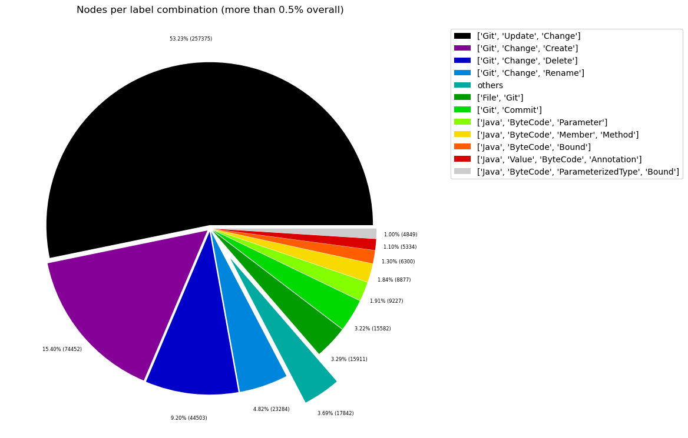
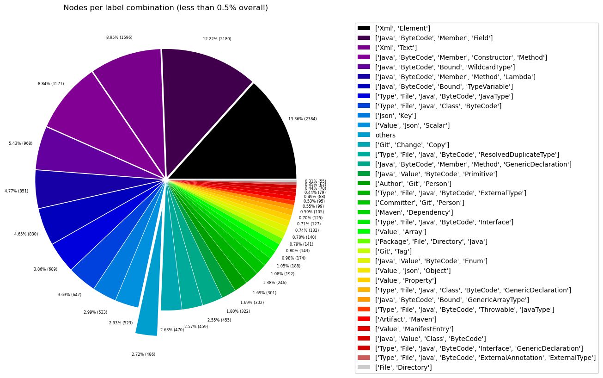
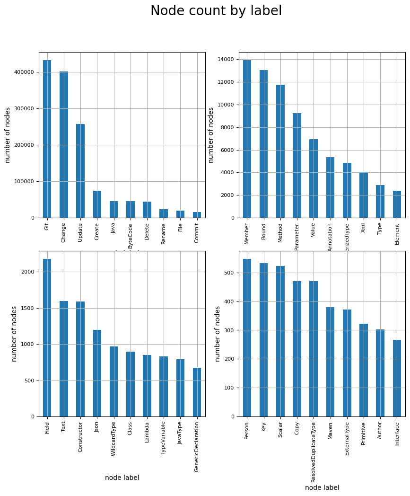
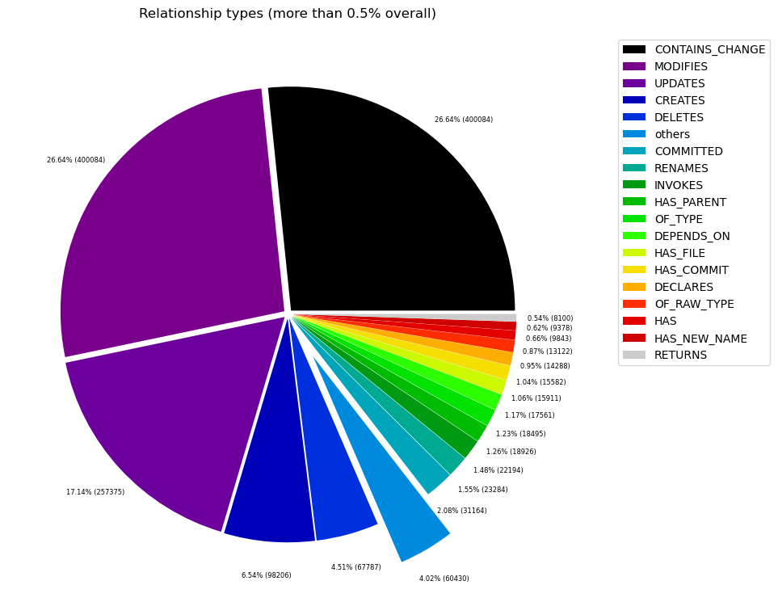
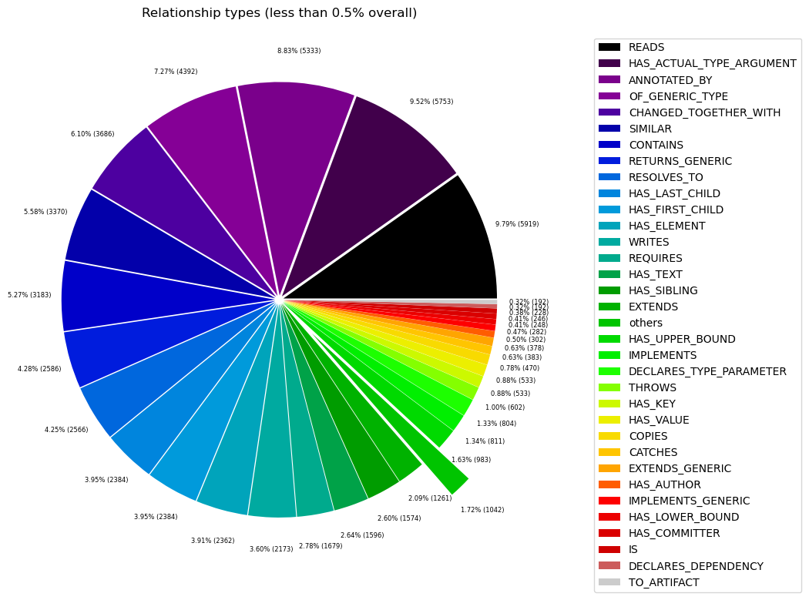

# Overview in General
   

This file contains a general overview of the data in the graph including node labels and relationships types.

### References
- [jqassistant](https://jqassistant.org)
- [Neo4j Python Driver](https://neo4j.com/docs/api/python-driver/current)

## Node Labels

### Table 1a - Highest node count by label combination

Lists the 30 label combinations with the highest number of nodes. The labels with the lowest node count are listed in table 1b.
The total list would sum up to the total number of labels (100%).

The whole table can be found in the CSV report `Node_label_combination_count`.

<table border="1" class="dataframe">
  <thead>
    <tr style="text-align: right;">
      <th></th>
      <th>nodeLabels</th>
      <th>nodesWithThatLabels</th>
      <th>nodesWithThatLabelsPercent</th>
    </tr>
  </thead>
  <tbody>
    <tr>
      <th>0</th>
      <td>[Git, Update, Change]</td>
      <td>257375</td>
      <td>53.227681</td>
    </tr>
    <tr>
      <th>1</th>
      <td>[Git, Change, Create]</td>
      <td>74452</td>
      <td>15.397406</td>
    </tr>
    <tr>
      <th>2</th>
      <td>[Git, Change, Delete]</td>
      <td>44503</td>
      <td>9.203658</td>
    </tr>
    <tr>
      <th>3</th>
      <td>[Git, Change, Rename]</td>
      <td>23284</td>
      <td>4.815360</td>
    </tr>
    <tr>
      <th>4</th>
      <td>[File, Git]</td>
      <td>15911</td>
      <td>3.290551</td>
    </tr>
    <tr>
      <th>5</th>
      <td>[Git, Commit]</td>
      <td>15582</td>
      <td>3.222511</td>
    </tr>
    <tr>
      <th>6</th>
      <td>[Java, ByteCode, Parameter]</td>
      <td>9227</td>
      <td>1.908234</td>
    </tr>
    <tr>
      <th>7</th>
      <td>[Java, ByteCode, Member, Method]</td>
      <td>8877</td>
      <td>1.835851</td>
    </tr>
    <tr>
      <th>8</th>
      <td>[Java, ByteCode, Bound]</td>
      <td>6300</td>
      <td>1.302902</td>
    </tr>
    <tr>
      <th>9</th>
      <td>[Java, Value, ByteCode, Annotation]</td>
      <td>5334</td>
      <td>1.103124</td>
    </tr>
    <tr>
      <th>10</th>
      <td>[Java, ByteCode, ParameterizedType, Bound]</td>
      <td>4849</td>
      <td>1.002821</td>
    </tr>
    <tr>
      <th>11</th>
      <td>[Xml, Element]</td>
      <td>2384</td>
      <td>0.493035</td>
    </tr>
    <tr>
      <th>12</th>
      <td>[Java, ByteCode, Member, Field]</td>
      <td>2180</td>
      <td>0.450845</td>
    </tr>
    <tr>
      <th>13</th>
      <td>[Xml, Text]</td>
      <td>1596</td>
      <td>0.330068</td>
    </tr>
    <tr>
      <th>14</th>
      <td>[Java, ByteCode, Member, Constructor, Method]</td>
      <td>1577</td>
      <td>0.326139</td>
    </tr>
    <tr>
      <th>15</th>
      <td>[Java, ByteCode, Bound, WildcardType]</td>
      <td>968</td>
      <td>0.200192</td>
    </tr>
    <tr>
      <th>16</th>
      <td>[Java, ByteCode, Member, Method, Lambda]</td>
      <td>851</td>
      <td>0.175995</td>
    </tr>
    <tr>
      <th>17</th>
      <td>[Java, ByteCode, Bound, TypeVariable]</td>
      <td>830</td>
      <td>0.171652</td>
    </tr>
    <tr>
      <th>18</th>
      <td>[Type, File, Java, ByteCode, JavaType]</td>
      <td>689</td>
      <td>0.142492</td>
    </tr>
    <tr>
      <th>19</th>
      <td>[Type, File, Java, Class, ByteCode]</td>
      <td>647</td>
      <td>0.133806</td>
    </tr>
    <tr>
      <th>20</th>
      <td>[Json, Key]</td>
      <td>533</td>
      <td>0.110230</td>
    </tr>
    <tr>
      <th>21</th>
      <td>[Value, Json, Scalar]</td>
      <td>523</td>
      <td>0.108162</td>
    </tr>
    <tr>
      <th>22</th>
      <td>[Git, Change, Copy]</td>
      <td>470</td>
      <td>0.097201</td>
    </tr>
    <tr>
      <th>23</th>
      <td>[Type, File, Java, ByteCode, ResolvedDuplicate...</td>
      <td>459</td>
      <td>0.094926</td>
    </tr>
    <tr>
      <th>24</th>
      <td>[Java, ByteCode, Member, Method, GenericDeclar...</td>
      <td>455</td>
      <td>0.094098</td>
    </tr>
    <tr>
      <th>25</th>
      <td>[Java, Value, ByteCode, Primitive]</td>
      <td>322</td>
      <td>0.066593</td>
    </tr>
    <tr>
      <th>26</th>
      <td>[Author, Git, Person]</td>
      <td>302</td>
      <td>0.062457</td>
    </tr>
    <tr>
      <th>27</th>
      <td>[Type, File, Java, ByteCode, ExternalType]</td>
      <td>301</td>
      <td>0.062250</td>
    </tr>
    <tr>
      <th>28</th>
      <td>[Committer, Git, Person]</td>
      <td>246</td>
      <td>0.050875</td>
    </tr>
    <tr>
      <th>29</th>
      <td>[Maven, Dependency]</td>
      <td>192</td>
      <td>0.039707</td>
    </tr>
  </tbody>
</table>

### Chart 1a - Highest node count by label combination

Values under 0.5% will be grouped into "others" to get a cleaner plot. The group "others" is then broken down in Chart 1b.

    <Figure size 640x480 with 0 Axes>

    

    

### Table 1b - Lowest node count by label combination

Lists the 30 label combinations with the lowest number of nodes until they reach 0.5% of the total node count, which are shown above.

<table border="1" class="dataframe">
  <thead>
    <tr style="text-align: right;">
      <th></th>
      <th>nodeLabels</th>
      <th>nodesWithThatLabels</th>
      <th>nodesWithThatLabelsPercent</th>
    </tr>
  </thead>
  <tbody>
    <tr>
      <th>0</th>
      <td>[Analyze, Task, jQAssistant]</td>
      <td>1</td>
      <td>0.000207</td>
    </tr>
    <tr>
      <th>1</th>
      <td>[Git, Branch]</td>
      <td>1</td>
      <td>0.000207</td>
    </tr>
    <tr>
      <th>2</th>
      <td>[Repository, File, Git]</td>
      <td>1</td>
      <td>0.000207</td>
    </tr>
    <tr>
      <th>3</th>
      <td>[File, Json]</td>
      <td>2</td>
      <td>0.000414</td>
    </tr>
    <tr>
      <th>4</th>
      <td>[File]</td>
      <td>3</td>
      <td>0.000620</td>
    </tr>
    <tr>
      <th>5</th>
      <td>[Type, File, Java, ByteCode, Record, GenericDe...</td>
      <td>4</td>
      <td>0.000827</td>
    </tr>
    <tr>
      <th>6</th>
      <td>[Maven, Exclusion]</td>
      <td>4</td>
      <td>0.000827</td>
    </tr>
    <tr>
      <th>7</th>
      <td>[Value, Array, Json]</td>
      <td>8</td>
      <td>0.001654</td>
    </tr>
    <tr>
      <th>8</th>
      <td>[Type, File, Java, ByteCode, Throwable, Extern...</td>
      <td>8</td>
      <td>0.001654</td>
    </tr>
    <tr>
      <th>9</th>
      <td>[Java, ByteCode, Member, Constructor, Method, ...</td>
      <td>9</td>
      <td>0.001861</td>
    </tr>
    <tr>
      <th>10</th>
      <td>[Type, File, Java, ByteCode, Throwable, Resolv...</td>
      <td>11</td>
      <td>0.002275</td>
    </tr>
    <tr>
      <th>11</th>
      <td>[Maven, Scm]</td>
      <td>11</td>
      <td>0.002275</td>
    </tr>
    <tr>
      <th>12</th>
      <td>[File, Maven, Xml, Pom, Document]</td>
      <td>11</td>
      <td>0.002275</td>
    </tr>
    <tr>
      <th>13</th>
      <td>[Type, File, Java, ByteCode, Void]</td>
      <td>11</td>
      <td>0.002275</td>
    </tr>
    <tr>
      <th>14</th>
      <td>[Java, ManifestSection]</td>
      <td>11</td>
      <td>0.002275</td>
    </tr>
    <tr>
      <th>15</th>
      <td>[File, Java, Manifest]</td>
      <td>11</td>
      <td>0.002275</td>
    </tr>
    <tr>
      <th>16</th>
      <td>[File, Artifact, Jar, Archive, Zip, Java]</td>
      <td>11</td>
      <td>0.002275</td>
    </tr>
    <tr>
      <th>17</th>
      <td>[File, Java, ServiceLoader]</td>
      <td>12</td>
      <td>0.002482</td>
    </tr>
    <tr>
      <th>18</th>
      <td>[File, Java, Properties]</td>
      <td>13</td>
      <td>0.002689</td>
    </tr>
    <tr>
      <th>19</th>
      <td>[Maven, ExecutionGoal]</td>
      <td>13</td>
      <td>0.002689</td>
    </tr>
    <tr>
      <th>20</th>
      <td>[Maven, PluginExecution]</td>
      <td>13</td>
      <td>0.002689</td>
    </tr>
    <tr>
      <th>21</th>
      <td>[Type, File, Java, ByteCode, Enum]</td>
      <td>17</td>
      <td>0.003516</td>
    </tr>
    <tr>
      <th>22</th>
      <td>[jQAssistant, Rule, Concept]</td>
      <td>19</td>
      <td>0.003929</td>
    </tr>
    <tr>
      <th>23</th>
      <td>[Maven, Configuration]</td>
      <td>20</td>
      <td>0.004136</td>
    </tr>
    <tr>
      <th>24</th>
      <td>[Maven, Plugin]</td>
      <td>20</td>
      <td>0.004136</td>
    </tr>
    <tr>
      <th>25</th>
      <td>[Xml, Attribute]</td>
      <td>22</td>
      <td>0.004550</td>
    </tr>
    <tr>
      <th>26</th>
      <td>[Type, File, Java, ByteCode, PrimitiveType]</td>
      <td>39</td>
      <td>0.008066</td>
    </tr>
    <tr>
      <th>27</th>
      <td>[Type, File, Java, Class, ByteCode, Throwable]</td>
      <td>42</td>
      <td>0.008686</td>
    </tr>
    <tr>
      <th>28</th>
      <td>[Type, File, Java, ByteCode, Annotation]</td>
      <td>42</td>
      <td>0.008686</td>
    </tr>
    <tr>
      <th>29</th>
      <td>[Xml, Namespace]</td>
      <td>44</td>
      <td>0.009100</td>
    </tr>
  </tbody>
</table>

### Chart 1b - Lowest node count by label combination

Shows the lowest (less than 0.5% overall) node count label combinations. Therefore, this plot breaks down the "others" slice of the pie chart above. Values under 0.01% will be grouped into "others" to get a cleaner plot.

    <Figure size 640x480 with 0 Axes>

    

    

### Table 1c - Highest node count by single label

Lists the 40 labels with the highest number of nodes.
Doesn't sum up to the total number of nodes or 100% because one node can have multiple labels.
Helps to identify commonly used labels.

<table border="1" class="dataframe">
  <thead>
    <tr style="text-align: right;">
      <th></th>
      <th>nodeLabel</th>
      <th>nodesWithThatLabel</th>
      <th>nodesWithThatLabelPercent</th>
    </tr>
  </thead>
  <tbody>
    <tr>
      <th>0</th>
      <td>Git</td>
      <td>432268</td>
      <td>89.397273</td>
    </tr>
    <tr>
      <th>1</th>
      <td>Change</td>
      <td>400084</td>
      <td>82.741306</td>
    </tr>
    <tr>
      <th>2</th>
      <td>Update</td>
      <td>257375</td>
      <td>53.227681</td>
    </tr>
    <tr>
      <th>3</th>
      <td>Create</td>
      <td>74452</td>
      <td>15.397406</td>
    </tr>
    <tr>
      <th>4</th>
      <td>Java</td>
      <td>45178</td>
      <td>9.343255</td>
    </tr>
    <tr>
      <th>5</th>
      <td>ByteCode</td>
      <td>44977</td>
      <td>9.301686</td>
    </tr>
    <tr>
      <th>6</th>
      <td>Delete</td>
      <td>44503</td>
      <td>9.203658</td>
    </tr>
    <tr>
      <th>7</th>
      <td>Rename</td>
      <td>23284</td>
      <td>4.815360</td>
    </tr>
    <tr>
      <th>8</th>
      <td>File</td>
      <td>19047</td>
      <td>3.939107</td>
    </tr>
    <tr>
      <th>9</th>
      <td>Commit</td>
      <td>15582</td>
      <td>3.222511</td>
    </tr>
    <tr>
      <th>10</th>
      <td>Member</td>
      <td>13949</td>
      <td>2.884790</td>
    </tr>
    <tr>
      <th>11</th>
      <td>Bound</td>
      <td>13052</td>
      <td>2.699282</td>
    </tr>
    <tr>
      <th>12</th>
      <td>Method</td>
      <td>11769</td>
      <td>2.433945</td>
    </tr>
    <tr>
      <th>13</th>
      <td>Parameter</td>
      <td>9227</td>
      <td>1.908234</td>
    </tr>
    <tr>
      <th>14</th>
      <td>Value</td>
      <td>6927</td>
      <td>1.432572</td>
    </tr>
    <tr>
      <th>15</th>
      <td>Annotation</td>
      <td>5376</td>
      <td>1.111810</td>
    </tr>
    <tr>
      <th>16</th>
      <td>ParameterizedType</td>
      <td>4849</td>
      <td>1.002821</td>
    </tr>
    <tr>
      <th>17</th>
      <td>Xml</td>
      <td>4057</td>
      <td>0.839027</td>
    </tr>
    <tr>
      <th>18</th>
      <td>Type</td>
      <td>2874</td>
      <td>0.594371</td>
    </tr>
    <tr>
      <th>19</th>
      <td>Element</td>
      <td>2384</td>
      <td>0.493035</td>
    </tr>
    <tr>
      <th>20</th>
      <td>Field</td>
      <td>2180</td>
      <td>0.450845</td>
    </tr>
    <tr>
      <th>21</th>
      <td>Text</td>
      <td>1596</td>
      <td>0.330068</td>
    </tr>
    <tr>
      <th>22</th>
      <td>Constructor</td>
      <td>1586</td>
      <td>0.328000</td>
    </tr>
    <tr>
      <th>23</th>
      <td>Json</td>
      <td>1198</td>
      <td>0.247758</td>
    </tr>
    <tr>
      <th>24</th>
      <td>WildcardType</td>
      <td>968</td>
      <td>0.200192</td>
    </tr>
    <tr>
      <th>25</th>
      <td>Class</td>
      <td>893</td>
      <td>0.184681</td>
    </tr>
    <tr>
      <th>26</th>
      <td>Lambda</td>
      <td>851</td>
      <td>0.175995</td>
    </tr>
    <tr>
      <th>27</th>
      <td>TypeVariable</td>
      <td>830</td>
      <td>0.171652</td>
    </tr>
    <tr>
      <th>28</th>
      <td>JavaType</td>
      <td>788</td>
      <td>0.162966</td>
    </tr>
    <tr>
      <th>29</th>
      <td>GenericDeclaration</td>
      <td>671</td>
      <td>0.138769</td>
    </tr>
    <tr>
      <th>30</th>
      <td>Person</td>
      <td>548</td>
      <td>0.113332</td>
    </tr>
    <tr>
      <th>31</th>
      <td>Key</td>
      <td>533</td>
      <td>0.110230</td>
    </tr>
    <tr>
      <th>32</th>
      <td>Scalar</td>
      <td>523</td>
      <td>0.108162</td>
    </tr>
    <tr>
      <th>33</th>
      <td>Copy</td>
      <td>470</td>
      <td>0.097201</td>
    </tr>
    <tr>
      <th>34</th>
      <td>ResolvedDuplicateType</td>
      <td>470</td>
      <td>0.097201</td>
    </tr>
    <tr>
      <th>35</th>
      <td>Maven</td>
      <td>379</td>
      <td>0.078381</td>
    </tr>
    <tr>
      <th>36</th>
      <td>ExternalType</td>
      <td>371</td>
      <td>0.076726</td>
    </tr>
    <tr>
      <th>37</th>
      <td>Primitive</td>
      <td>322</td>
      <td>0.066593</td>
    </tr>
    <tr>
      <th>38</th>
      <td>Author</td>
      <td>302</td>
      <td>0.062457</td>
    </tr>
    <tr>
      <th>39</th>
      <td>Interface</td>
      <td>266</td>
      <td>0.055011</td>
    </tr>
  </tbody>
</table>

### Chart 1c - Highest node count by label

Shows the 40 labels with the highest number of nodes.

    <Figure size 640x480 with 0 Axes>

    

    

## Relationship Types

### Table 2a - Highest relationship count by type

Lists the 30 relationship types with the highest number of occurrences.
The whole table can be found in the CSV report `Relationship_type_count`.

    Total number of relationships: 1501814

<table border="1" class="dataframe">
  <thead>
    <tr style="text-align: right;">
      <th></th>
      <th>relationshipType</th>
      <th>nodesWithThatRelationshipType</th>
      <th>nodesWithThatRelationshipTypePercent</th>
    </tr>
  </thead>
  <tbody>
    <tr>
      <th>0</th>
      <td>CONTAINS_CHANGE</td>
      <td>400084</td>
      <td>26.640050</td>
    </tr>
    <tr>
      <th>1</th>
      <td>MODIFIES</td>
      <td>400084</td>
      <td>26.640050</td>
    </tr>
    <tr>
      <th>2</th>
      <td>UPDATES</td>
      <td>257375</td>
      <td>17.137608</td>
    </tr>
    <tr>
      <th>3</th>
      <td>CREATES</td>
      <td>98206</td>
      <td>6.539159</td>
    </tr>
    <tr>
      <th>4</th>
      <td>DELETES</td>
      <td>67787</td>
      <td>4.513675</td>
    </tr>
    <tr>
      <th>5</th>
      <td>COMMITTED</td>
      <td>31164</td>
      <td>2.075091</td>
    </tr>
    <tr>
      <th>6</th>
      <td>RENAMES</td>
      <td>23284</td>
      <td>1.550392</td>
    </tr>
    <tr>
      <th>7</th>
      <td>INVOKES</td>
      <td>22194</td>
      <td>1.477813</td>
    </tr>
    <tr>
      <th>8</th>
      <td>HAS_PARENT</td>
      <td>18926</td>
      <td>1.260209</td>
    </tr>
    <tr>
      <th>9</th>
      <td>OF_TYPE</td>
      <td>18495</td>
      <td>1.231511</td>
    </tr>
    <tr>
      <th>10</th>
      <td>DEPENDS_ON</td>
      <td>17561</td>
      <td>1.169319</td>
    </tr>
    <tr>
      <th>11</th>
      <td>HAS_FILE</td>
      <td>15911</td>
      <td>1.059452</td>
    </tr>
    <tr>
      <th>12</th>
      <td>HAS_COMMIT</td>
      <td>15582</td>
      <td>1.037545</td>
    </tr>
    <tr>
      <th>13</th>
      <td>DECLARES</td>
      <td>14288</td>
      <td>0.951383</td>
    </tr>
    <tr>
      <th>14</th>
      <td>OF_RAW_TYPE</td>
      <td>13122</td>
      <td>0.873743</td>
    </tr>
    <tr>
      <th>15</th>
      <td>HAS</td>
      <td>9843</td>
      <td>0.655407</td>
    </tr>
    <tr>
      <th>16</th>
      <td>HAS_NEW_NAME</td>
      <td>9378</td>
      <td>0.624445</td>
    </tr>
    <tr>
      <th>17</th>
      <td>RETURNS</td>
      <td>8100</td>
      <td>0.539348</td>
    </tr>
    <tr>
      <th>18</th>
      <td>READS</td>
      <td>5919</td>
      <td>0.394123</td>
    </tr>
    <tr>
      <th>19</th>
      <td>HAS_ACTUAL_TYPE_ARGUMENT</td>
      <td>5753</td>
      <td>0.383070</td>
    </tr>
    <tr>
      <th>20</th>
      <td>ANNOTATED_BY</td>
      <td>5333</td>
      <td>0.355104</td>
    </tr>
    <tr>
      <th>21</th>
      <td>OF_GENERIC_TYPE</td>
      <td>4392</td>
      <td>0.292446</td>
    </tr>
    <tr>
      <th>22</th>
      <td>CHANGED_TOGETHER_WITH</td>
      <td>3686</td>
      <td>0.245437</td>
    </tr>
    <tr>
      <th>23</th>
      <td>SIMILAR</td>
      <td>3370</td>
      <td>0.224395</td>
    </tr>
    <tr>
      <th>24</th>
      <td>CONTAINS</td>
      <td>3183</td>
      <td>0.211944</td>
    </tr>
    <tr>
      <th>25</th>
      <td>RETURNS_GENERIC</td>
      <td>2586</td>
      <td>0.172192</td>
    </tr>
    <tr>
      <th>26</th>
      <td>RESOLVES_TO</td>
      <td>2566</td>
      <td>0.170860</td>
    </tr>
    <tr>
      <th>27</th>
      <td>HAS_FIRST_CHILD</td>
      <td>2384</td>
      <td>0.158741</td>
    </tr>
    <tr>
      <th>28</th>
      <td>HAS_LAST_CHILD</td>
      <td>2384</td>
      <td>0.158741</td>
    </tr>
    <tr>
      <th>29</th>
      <td>HAS_ELEMENT</td>
      <td>2362</td>
      <td>0.157276</td>
    </tr>
  </tbody>
</table>

### Chart 2a - Highest relationship count by type

Values under 0.5% will be grouped into "others" to get a cleaner plot. The group "others" is then broken down in the second chart.

    <Figure size 640x480 with 0 Axes>

    

    

### Table 2b - Lowest relationship count by type

Lists the 30 relationships type with the lowest number of occurrences up to 0.5% of the total node count. This is essentially breaking down the "others" slice from the chart above.

<table border="1" class="dataframe">
  <thead>
    <tr style="text-align: right;">
      <th></th>
      <th>relationshipType</th>
      <th>nodesWithThatRelationshipType</th>
      <th>nodesWithThatRelationshipTypePercent</th>
    </tr>
  </thead>
  <tbody>
    <tr>
      <th>0</th>
      <td>HAS_PROPERTY</td>
      <td>1</td>
      <td>0.000067</td>
    </tr>
    <tr>
      <th>1</th>
      <td>HAS_BRANCH</td>
      <td>1</td>
      <td>0.000067</td>
    </tr>
    <tr>
      <th>2</th>
      <td>HAS_HEAD</td>
      <td>2</td>
      <td>0.000133</td>
    </tr>
    <tr>
      <th>3</th>
      <td>THROWS_GENERIC</td>
      <td>3</td>
      <td>0.000200</td>
    </tr>
    <tr>
      <th>4</th>
      <td>EXCLUDES</td>
      <td>4</td>
      <td>0.000266</td>
    </tr>
    <tr>
      <th>5</th>
      <td>HAS_SCM</td>
      <td>11</td>
      <td>0.000732</td>
    </tr>
    <tr>
      <th>6</th>
      <td>DESCRIBES</td>
      <td>11</td>
      <td>0.000732</td>
    </tr>
    <tr>
      <th>7</th>
      <td>HAS_ROOT_ELEMENT</td>
      <td>13</td>
      <td>0.000866</td>
    </tr>
    <tr>
      <th>8</th>
      <td>HAS_GOAL</td>
      <td>13</td>
      <td>0.000866</td>
    </tr>
    <tr>
      <th>9</th>
      <td>HAS_EXECUTION</td>
      <td>13</td>
      <td>0.000866</td>
    </tr>
    <tr>
      <th>10</th>
      <td>INCLUDES_CONCEPT</td>
      <td>19</td>
      <td>0.001265</td>
    </tr>
    <tr>
      <th>11</th>
      <td>IS_ARTIFACT</td>
      <td>20</td>
      <td>0.001332</td>
    </tr>
    <tr>
      <th>12</th>
      <td>HAS_CONFIGURATION</td>
      <td>20</td>
      <td>0.001332</td>
    </tr>
    <tr>
      <th>13</th>
      <td>USES_PLUGIN</td>
      <td>20</td>
      <td>0.001332</td>
    </tr>
    <tr>
      <th>14</th>
      <td>OF_NAMESPACE</td>
      <td>22</td>
      <td>0.001465</td>
    </tr>
    <tr>
      <th>15</th>
      <td>HAS_ATTRIBUTE</td>
      <td>22</td>
      <td>0.001465</td>
    </tr>
    <tr>
      <th>16</th>
      <td>REQUIRES_TYPE_PARAMETER</td>
      <td>26</td>
      <td>0.001731</td>
    </tr>
    <tr>
      <th>17</th>
      <td>REQUIRES_CONCEPT</td>
      <td>28</td>
      <td>0.001864</td>
    </tr>
    <tr>
      <th>18</th>
      <td>DECLARES_NAMESPACE</td>
      <td>44</td>
      <td>0.002930</td>
    </tr>
    <tr>
      <th>19</th>
      <td>HAS_DEFAULT</td>
      <td>53</td>
      <td>0.003529</td>
    </tr>
    <tr>
      <th>20</th>
      <td>HAS_COMPONENT_TYPE</td>
      <td>105</td>
      <td>0.006992</td>
    </tr>
    <tr>
      <th>21</th>
      <td>CONTAINS_VALUE</td>
      <td>128</td>
      <td>0.008523</td>
    </tr>
    <tr>
      <th>22</th>
      <td>HAS_TAG</td>
      <td>141</td>
      <td>0.009389</td>
    </tr>
    <tr>
      <th>23</th>
      <td>ON_COMMIT</td>
      <td>141</td>
      <td>0.009389</td>
    </tr>
    <tr>
      <th>24</th>
      <td>COPY_OF</td>
      <td>181</td>
      <td>0.012052</td>
    </tr>
    <tr>
      <th>25</th>
      <td>TO_ARTIFACT</td>
      <td>192</td>
      <td>0.012785</td>
    </tr>
    <tr>
      <th>26</th>
      <td>DECLARES_DEPENDENCY</td>
      <td>192</td>
      <td>0.012785</td>
    </tr>
    <tr>
      <th>27</th>
      <td>IS</td>
      <td>228</td>
      <td>0.015182</td>
    </tr>
    <tr>
      <th>28</th>
      <td>HAS_COMMITTER</td>
      <td>246</td>
      <td>0.016380</td>
    </tr>
    <tr>
      <th>29</th>
      <td>HAS_LOWER_BOUND</td>
      <td>248</td>
      <td>0.016513</td>
    </tr>
  </tbody>
</table>

### Chart 2b - Lowest relationship count by type

Shows the lowest (less than 0.5% overall) relationship types. This plot breaks down the "others" slice of the pie chart above. Values under 0.01% will be grouped into "others" to get a cleaner plot.

    <Figure size 640x480 with 0 Axes>

    

    

## Node labels with their relationships

### Table 3a - Highest relationship count by node labels and relationship type

Lists the 30 node labels and their relationship types with the highest number of occurrences.

<table border="1" class="dataframe">
  <thead>
    <tr style="text-align: right;">
      <th></th>
      <th>sourceLabels</th>
      <th>relationType</th>
      <th>targetLabels</th>
      <th>numberOfRelationships</th>
      <th>numberOfNodesWithSameLabelsAsSource</th>
      <th>numberOfNodesWithSameLabelsAsTarget</th>
      <th>densityInPercent</th>
    </tr>
  </thead>
  <tbody>
    <tr>
      <th>0</th>
      <td>[Git, Commit]</td>
      <td>CONTAINS_CHANGE</td>
      <td>[Git, Update, Change]</td>
      <td>257375</td>
      <td>15582</td>
      <td>257375</td>
      <td>0.006418</td>
    </tr>
    <tr>
      <th>1</th>
      <td>[Git, Update, Change]</td>
      <td>MODIFIES</td>
      <td>[File, Git]</td>
      <td>257375</td>
      <td>257375</td>
      <td>15911</td>
      <td>0.006285</td>
    </tr>
    <tr>
      <th>2</th>
      <td>[Git, Update, Change]</td>
      <td>UPDATES</td>
      <td>[File, Git]</td>
      <td>257375</td>
      <td>257375</td>
      <td>15911</td>
      <td>0.006285</td>
    </tr>
    <tr>
      <th>3</th>
      <td>[Git, Commit]</td>
      <td>CONTAINS_CHANGE</td>
      <td>[Git, Change, Create]</td>
      <td>74452</td>
      <td>15582</td>
      <td>74452</td>
      <td>0.006418</td>
    </tr>
    <tr>
      <th>4</th>
      <td>[Git, Change, Create]</td>
      <td>MODIFIES</td>
      <td>[File, Git]</td>
      <td>74452</td>
      <td>74452</td>
      <td>15911</td>
      <td>0.006285</td>
    </tr>
    <tr>
      <th>5</th>
      <td>[Git, Change, Create]</td>
      <td>CREATES</td>
      <td>[File, Git]</td>
      <td>74452</td>
      <td>74452</td>
      <td>15911</td>
      <td>0.006285</td>
    </tr>
    <tr>
      <th>6</th>
      <td>[Git, Commit]</td>
      <td>CONTAINS_CHANGE</td>
      <td>[Git, Change, Delete]</td>
      <td>44503</td>
      <td>15582</td>
      <td>44503</td>
      <td>0.006418</td>
    </tr>
    <tr>
      <th>7</th>
      <td>[Git, Change, Delete]</td>
      <td>MODIFIES</td>
      <td>[File, Git]</td>
      <td>44503</td>
      <td>44503</td>
      <td>15911</td>
      <td>0.006285</td>
    </tr>
    <tr>
      <th>8</th>
      <td>[Git, Change, Delete]</td>
      <td>DELETES</td>
      <td>[File, Git]</td>
      <td>44503</td>
      <td>44503</td>
      <td>15911</td>
      <td>0.006285</td>
    </tr>
    <tr>
      <th>9</th>
      <td>[Git, Commit]</td>
      <td>CONTAINS_CHANGE</td>
      <td>[Git, Change, Rename]</td>
      <td>23284</td>
      <td>15582</td>
      <td>23284</td>
      <td>0.006418</td>
    </tr>
    <tr>
      <th>10</th>
      <td>[Git, Change, Rename]</td>
      <td>CREATES</td>
      <td>[File, Git]</td>
      <td>23284</td>
      <td>23284</td>
      <td>15911</td>
      <td>0.006285</td>
    </tr>
    <tr>
      <th>11</th>
      <td>[Git, Change, Rename]</td>
      <td>RENAMES</td>
      <td>[File, Git]</td>
      <td>23284</td>
      <td>23284</td>
      <td>15911</td>
      <td>0.006285</td>
    </tr>
    <tr>
      <th>12</th>
      <td>[Git, Change, Rename]</td>
      <td>DELETES</td>
      <td>[File, Git]</td>
      <td>23284</td>
      <td>23284</td>
      <td>15911</td>
      <td>0.006285</td>
    </tr>
    <tr>
      <th>13</th>
      <td>[Git, Change, Rename]</td>
      <td>MODIFIES</td>
      <td>[File, Git]</td>
      <td>23284</td>
      <td>23284</td>
      <td>15911</td>
      <td>0.006285</td>
    </tr>
    <tr>
      <th>14</th>
      <td>[Git, Commit]</td>
      <td>HAS_PARENT</td>
      <td>[Git, Commit]</td>
      <td>18915</td>
      <td>15582</td>
      <td>15582</td>
      <td>0.007790</td>
    </tr>
    <tr>
      <th>15</th>
      <td>[Repository, File, Git]</td>
      <td>HAS_FILE</td>
      <td>[File, Git]</td>
      <td>15911</td>
      <td>1</td>
      <td>15911</td>
      <td>100.000000</td>
    </tr>
    <tr>
      <th>16</th>
      <td>[Repository, File, Git]</td>
      <td>HAS_COMMIT</td>
      <td>[Git, Commit]</td>
      <td>15582</td>
      <td>1</td>
      <td>15582</td>
      <td>100.000000</td>
    </tr>
    <tr>
      <th>17</th>
      <td>[Author, Git, Person]</td>
      <td>COMMITTED</td>
      <td>[Git, Commit]</td>
      <td>15582</td>
      <td>302</td>
      <td>15582</td>
      <td>0.331126</td>
    </tr>
    <tr>
      <th>18</th>
      <td>[Committer, Git, Person]</td>
      <td>COMMITTED</td>
      <td>[Git, Commit]</td>
      <td>15582</td>
      <td>246</td>
      <td>15582</td>
      <td>0.406504</td>
    </tr>
    <tr>
      <th>19</th>
      <td>[Java, ByteCode, Member, Method]</td>
      <td>INVOKES</td>
      <td>[Java, ByteCode, Member, Method]</td>
      <td>13279</td>
      <td>8849</td>
      <td>8849</td>
      <td>0.016958</td>
    </tr>
    <tr>
      <th>20</th>
      <td>[File, Git]</td>
      <td>HAS_NEW_NAME</td>
      <td>[File, Git]</td>
      <td>9378</td>
      <td>15911</td>
      <td>15911</td>
      <td>0.003704</td>
    </tr>
    <tr>
      <th>21</th>
      <td>[Java, ByteCode, Member, Method]</td>
      <td>HAS</td>
      <td>[Java, ByteCode, Parameter]</td>
      <td>5325</td>
      <td>8849</td>
      <td>9227</td>
      <td>0.006522</td>
    </tr>
    <tr>
      <th>22</th>
      <td>[Java, ByteCode, Member, Method]</td>
      <td>READS</td>
      <td>[Java, ByteCode, Member, Field]</td>
      <td>5320</td>
      <td>8849</td>
      <td>2180</td>
      <td>0.027578</td>
    </tr>
    <tr>
      <th>23</th>
      <td>[Java, Value, ByteCode, Annotation]</td>
      <td>OF_TYPE</td>
      <td>[Type, File, Java, ByteCode, ExternalAnnotatio...</td>
      <td>4990</td>
      <td>5334</td>
      <td>62</td>
      <td>1.508884</td>
    </tr>
    <tr>
      <th>24</th>
      <td>[Java, ByteCode, Parameter]</td>
      <td>OF_TYPE</td>
      <td>[Type, File, Java, ByteCode, JavaType]</td>
      <td>4105</td>
      <td>9227</td>
      <td>689</td>
      <td>0.064570</td>
    </tr>
    <tr>
      <th>25</th>
      <td>[Java, ByteCode, Parameter]</td>
      <td>ANNOTATED_BY</td>
      <td>[Java, Value, ByteCode, Annotation]</td>
      <td>3797</td>
      <td>9227</td>
      <td>5334</td>
      <td>0.007715</td>
    </tr>
    <tr>
      <th>26</th>
      <td>[File, Git]</td>
      <td>CHANGED_TOGETHER_WITH</td>
      <td>[File, Git]</td>
      <td>3068</td>
      <td>15911</td>
      <td>15911</td>
      <td>0.001212</td>
    </tr>
    <tr>
      <th>27</th>
      <td>[Java, ByteCode, ParameterizedType, Bound]</td>
      <td>OF_RAW_TYPE</td>
      <td>[Type, File, Java, ByteCode, JavaType]</td>
      <td>2799</td>
      <td>4849</td>
      <td>689</td>
      <td>0.083778</td>
    </tr>
    <tr>
      <th>28</th>
      <td>[Xml, Element]</td>
      <td>HAS_ELEMENT</td>
      <td>[Xml, Element]</td>
      <td>2362</td>
      <td>2384</td>
      <td>2384</td>
      <td>0.041559</td>
    </tr>
    <tr>
      <th>29</th>
      <td>[Java, ByteCode, Bound]</td>
      <td>OF_RAW_TYPE</td>
      <td>[Type, File, Java, ByteCode, JavaType]</td>
      <td>2256</td>
      <td>6300</td>
      <td>689</td>
      <td>0.051973</td>
    </tr>
  </tbody>
</table>

## Graph Density

    total_number_of_nodes (vertices): 483536
    total_number_of_relationships (edges): 1501814
    -> total directed graph density: 6.423317947431575e-06
    -> total directed graph density in percent: 0.0006423317947431575

