# git log/history
   

### References
- [Visualizing Code: Polyglot Notebooks Repository (YouTube)](https://youtu.be/ipOpToPS-PY?si=3doePt2cp-LgEUmt)
- [gitstractor (GitHub)](https://github.com/IntegerMan/gitstractor)
- [Neo4j Python Driver](https://neo4j.com/docs/api/python-driver/current)

    Command line execution (CLI mode): Yes

## Git History - Directory Commit Statistics

### Data Preview

<table border="1" class="dataframe">
  <thead>
    <tr style="text-align: right;">
      <th></th>
      <th>fileCount</th>
      <th>authorCount</th>
      <th>commitCount</th>
      <th>daysSinceLastCommit</th>
      <th>daysSinceLastCreation</th>
      <th>daysSinceLastModification</th>
    </tr>
  </thead>
  <tbody>
    <tr>
      <th>count</th>
      <td>704.000000</td>
      <td>704.000000</td>
      <td>704.000000</td>
      <td>704.000000</td>
      <td>704.000000</td>
      <td>704.000000</td>
    </tr>
    <tr>
      <th>mean</th>
      <td>22.691761</td>
      <td>11.548295</td>
      <td>171.423295</td>
      <td>87.127841</td>
      <td>144.494318</td>
      <td>107.494318</td>
    </tr>
    <tr>
      <th>std</th>
      <td>112.338014</td>
      <td>12.461968</td>
      <td>362.848141</td>
      <td>145.355171</td>
      <td>200.590721</td>
      <td>154.844381</td>
    </tr>
    <tr>
      <th>min</th>
      <td>1.000000</td>
      <td>2.000000</td>
      <td>4.000000</td>
      <td>34.000000</td>
      <td>35.000000</td>
      <td>33.000000</td>
    </tr>
    <tr>
      <th>25%</th>
      <td>2.000000</td>
      <td>4.000000</td>
      <td>20.000000</td>
      <td>34.000000</td>
      <td>49.000000</td>
      <td>39.000000</td>
    </tr>
    <tr>
      <th>50%</th>
      <td>4.000000</td>
      <td>7.000000</td>
      <td>40.000000</td>
      <td>34.000000</td>
      <td>60.000000</td>
      <td>49.000000</td>
    </tr>
    <tr>
      <th>75%</th>
      <td>12.000000</td>
      <td>14.000000</td>
      <td>162.250000</td>
      <td>34.000000</td>
      <td>77.000000</td>
      <td>60.000000</td>
    </tr>
    <tr>
      <th>max</th>
      <td>2594.000000</td>
      <td>115.000000</td>
      <td>5942.000000</td>
      <td>524.000000</td>
      <td>2731.000000</td>
      <td>578.000000</td>
    </tr>
  </tbody>
</table>

<table border="1" class="dataframe">
  <thead>
    <tr style="text-align: right;">
      <th></th>
      <th>directoryPath</th>
      <th>directoryParentPath</th>
      <th>directoryName</th>
      <th>fileCount</th>
      <th>firstFile</th>
      <th>mostFrequentFileExtension</th>
      <th>authorCount</th>
      <th>mainAuthor</th>
      <th>secondAuthor</th>
      <th>commitCount</th>
      <th>daysSinceLastCommit</th>
      <th>daysSinceLastCreation</th>
      <th>daysSinceLastModification</th>
      <th>lastCommitDate</th>
      <th>lastCreationDate</th>
      <th>lastModificationDate</th>
      <th>maxCommitSha</th>
    </tr>
  </thead>
  <tbody>
    <tr>
      <th>0</th>
      <td>AxonFramework-5.0.1/.idea/copyright</td>
      <td>AxonFramework-5.0.1/.idea</td>
      <td>copyright</td>
      <td>1</td>
      <td>AxonFramework-5.0.1/.idea/copyright/Axon_Framework_copyright_template.xml</td>
      <td>xml</td>
      <td>2</td>
      <td>Allard Buijze</td>
      <td>Steven van Beelen</td>
      <td>22</td>
      <td>34</td>
      <td>361</td>
      <td>361</td>
      <td>2025-12-03</td>
      <td>2025-01-09</td>
      <td>2025-01-09</td>
      <td>fe926a4970bdf1e538e8e7fb8d147ffdc676e713</td>
    </tr>
    <tr>
      <th>1</th>
      <td>AxonFramework-5.0.1/.idea/inspectionProfiles</td>
      <td>AxonFramework-5.0.1/.idea</td>
      <td>inspectionProfiles</td>
      <td>1</td>
      <td>AxonFramework-5.0.1/.idea/inspectionProfiles/Project_Default.xml</td>
      <td>xml</td>
      <td>5</td>
      <td>Allard Buijze</td>
      <td>Mateusz Nowak</td>
      <td>47</td>
      <td>34</td>
      <td>361</td>
      <td>136</td>
      <td>2025-12-03</td>
      <td>2025-01-09</td>
      <td>2025-08-22</td>
      <td>fe926a4970bdf1e538e8e7fb8d147ffdc676e713</td>
    </tr>
    <tr>
      <th>2</th>
      <td>AxonFramework-5.0.1/axon-framework-bom</td>
      <td>AxonFramework-5.0.1</td>
      <td>axon-framework-bom</td>
      <td>1</td>
      <td>AxonFramework-5.0.1/axon-framework-bom/pom.xml</td>
      <td>xml</td>
      <td>4</td>
      <td>Allard Buijze</td>
      <td>Jan Galinski</td>
      <td>19</td>
      <td>34</td>
      <td>49</td>
      <td>33</td>
      <td>2025-12-03</td>
      <td>2025-11-17</td>
      <td>2025-12-03</td>
      <td>fbd1ff331f71beea08fe018d000965e68a62b7c5</td>
    </tr>
    <tr>
      <th>3</th>
      <td>AxonFramework-5.0.1/axon-server-connector/src/main/resources/META-INF/services</td>
      <td>AxonFramework-5.0.1/axon-server-connector/src/main</td>
      <td>resources/META-INF/services</td>
      <td>1</td>
      <td>AxonFramework-5.0.1/axon-server-connector/src/main/resources/META-INF/services/org.axonframework.common.configuration.ConfigurationEnhancer</td>
      <td>ConfigurationEnhancer</td>
      <td>11</td>
      <td>Allard Buijze</td>
      <td>Jan Galinski</td>
      <td>81</td>
      <td>34</td>
      <td>62</td>
      <td>62</td>
      <td>2025-12-03</td>
      <td>2025-11-04</td>
      <td>2025-11-04</td>
      <td>fdddb8b6ce37c30237b25549ddefec5a1871a040</td>
    </tr>
    <tr>
      <th>4</th>
      <td>AxonFramework-5.0.1/axon-server-connector/src/test/java/org/axonframework/axonserver/connector/command</td>
      <td>AxonFramework-5.0.1/axon-server-connector/src/test/java/org/axonframework/axonserver/connector</td>
      <td>command</td>
      <td>1</td>
      <td>AxonFramework-5.0.1/axon-server-connector/src/test/java/org/axonframework/axonserver/connector/command/AxonServerCommandBusConnectorTest.java</td>
      <td>java</td>
      <td>7</td>
      <td>Allard Buijze</td>
      <td>Jan Galinski</td>
      <td>70</td>
      <td>34</td>
      <td>153</td>
      <td>35</td>
      <td>2025-12-03</td>
      <td>2025-08-06</td>
      <td>2025-12-01</td>
      <td>f6644279ae27410995706c00816ea3f38464a906</td>
    </tr>
    <tr>
      <th>5</th>
      <td>AxonFramework-5.0.1/axon-server-connector/src/test/resources</td>
      <td>AxonFramework-5.0.1/axon-server-connector/src/test</td>
      <td>resources</td>
      <td>1</td>
      <td>AxonFramework-5.0.1/axon-server-connector/src/test/resources/junit-platform.properties</td>
      <td>properties</td>
      <td>4</td>
      <td>Allard Buijze</td>
      <td>Jan Galinski</td>
      <td>9</td>
      <td>34</td>
      <td>60</td>
      <td>60</td>
      <td>2025-12-03</td>
      <td>2025-11-06</td>
      <td>2025-11-06</td>
      <td>d7929be4a8b9905a880c6cd65e50b29b7f07bef3</td>
    </tr>
    <tr>
      <th>6</th>
      <td>AxonFramework-5.0.1/build/coverage-report</td>
      <td>AxonFramework-5.0.1/build</td>
      <td>coverage-report</td>
      <td>1</td>
      <td>AxonFramework-5.0.1/build/coverage-report/pom.xml</td>
      <td>xml</td>
      <td>4</td>
      <td>Allard Buijze</td>
      <td>John Hendrikx</td>
      <td>14</td>
      <td>34</td>
      <td>49</td>
      <td>39</td>
      <td>2025-12-03</td>
      <td>2025-11-17</td>
      <td>2025-11-28</td>
      <td>d6f25f0c8c238cc5fc55fee1d0a15665de45f9fc</td>
    </tr>
    <tr>
      <th>7</th>
      <td>AxonFramework-5.0.1/build/parent</td>
      <td>AxonFramework-5.0.1/build</td>
      <td>parent</td>
      <td>1</td>
      <td>AxonFramework-5.0.1/build/parent/pom.xml</td>
      <td>xml</td>
      <td>6</td>
      <td>Allard Buijze</td>
      <td>Jan Galinski</td>
      <td>40</td>
      <td>34</td>
      <td>49</td>
      <td>33</td>
      <td>2025-12-03</td>
      <td>2025-11-17</td>
      <td>2025-12-03</td>
      <td>fbd1ff331f71beea08fe018d000965e68a62b7c5</td>
    </tr>
    <tr>
      <th>8</th>
      <td>AxonFramework-5.0.1/common/src/main/java/org/axonframework/common/digest</td>
      <td>AxonFramework-5.0.1/common/src/main/java/org/axonframework/common</td>
      <td>digest</td>
      <td>1</td>
      <td>AxonFramework-5.0.1/common/src/main/java/org/axonframework/common/digest/Digester.java</td>
      <td>java</td>
      <td>10</td>
      <td>Allard Buijze</td>
      <td>Frank Versnel</td>
      <td>73</td>
      <td>34</td>
      <td>62</td>
      <td>50</td>
      <td>2025-12-03</td>
      <td>2025-11-04</td>
      <td>2025-11-17</td>
      <td>f4746a871e454c40b72346d541bbcfc9ffc7680d</td>
    </tr>
    <tr>
      <th>9</th>
      <td>AxonFramework-5.0.1/common/src/main/java/org/axonframework/common/io</td>
      <td>AxonFramework-5.0.1/common/src/main/java/org/axonframework/common</td>
      <td>io</td>
      <td>1</td>
      <td>AxonFramework-5.0.1/common/src/main/java/org/axonframework/common/io/IOUtils.java</td>
      <td>java</td>
      <td>14</td>
      <td>Allard Buijze</td>
      <td>Frank Versnel</td>
      <td>91</td>
      <td>34</td>
      <td>62</td>
      <td>50</td>
      <td>2025-12-03</td>
      <td>2025-11-04</td>
      <td>2025-11-17</td>
      <td>fdd51aa788071375721c67bb30bf5709136e974a</td>
    </tr>
    <tr>
      <th>10</th>
      <td>AxonFramework-5.0.1/common/src/main/resources/META-INF/services</td>
      <td>AxonFramework-5.0.1/common/src/main</td>
      <td>resources/META-INF/services</td>
      <td>1</td>
      <td>AxonFramework-5.0.1/common/src/main/resources/META-INF/services/org.axonframework.common.property.PropertyAccessStrategy</td>
      <td>PropertyAccessStrategy</td>
      <td>7</td>
      <td>Allard Buijze</td>
      <td>Jan Galinski</td>
      <td>67</td>
      <td>34</td>
      <td>62</td>
      <td>50</td>
      <td>2025-12-03</td>
      <td>2025-11-04</td>
      <td>2025-11-17</td>
      <td>f911231de7ec9233077061a31818f74064a7f85f</td>
    </tr>
    <tr>
      <th>11</th>
      <td>AxonFramework-5.0.1/common/src/test/java/org/axonframework/common/lifecycle</td>
      <td>AxonFramework-5.0.1/common/src/test/java/org/axonframework/common</td>
      <td>lifecycle</td>
      <td>1</td>
      <td>AxonFramework-5.0.1/common/src/test/java/org/axonframework/common/lifecycle/ShutdownLatchTest.java</td>
      <td>java</td>
      <td>4</td>
      <td>Allard Buijze</td>
      <td>Jan Galinski</td>
      <td>11</td>
      <td>34</td>
      <td>62</td>
      <td>62</td>
      <td>2025-12-03</td>
      <td>2025-11-04</td>
      <td>2025-11-04</td>
      <td>d7929be4a8b9905a880c6cd65e50b29b7f07bef3</td>
    </tr>
    <tr>
      <th>12</th>
      <td>AxonFramework-5.0.1/common/src/test/resources/META-INF/services</td>
      <td>AxonFramework-5.0.1/common/src/test</td>
      <td>resources/META-INF/services</td>
      <td>1</td>
      <td>AxonFramework-5.0.1/common/src/test/resources/META-INF/services/org.axonframework.common.configuration.ConfigurationEnhancer</td>
      <td>ConfigurationEnhancer</td>
      <td>5</td>
      <td>Allard Buijze</td>
      <td>Jan Galinski</td>
      <td>29</td>
      <td>34</td>
      <td>61</td>
      <td>61</td>
      <td>2025-12-03</td>
      <td>2025-11-05</td>
      <td>2025-11-05</td>
      <td>f4746a871e454c40b72346d541bbcfc9ffc7680d</td>
    </tr>
    <tr>
      <th>13</th>
      <td>AxonFramework-5.0.1/conversion/src/main/resources/META-INF/services</td>
      <td>AxonFramework-5.0.1/conversion/src/main</td>
      <td>resources/META-INF/services</td>
      <td>1</td>
      <td>AxonFramework-5.0.1/conversion/src/main/resources/META-INF/services/org.axonframework.conversion.ContentTypeConverter</td>
      <td>ContentTypeConverter</td>
      <td>11</td>
      <td>Allard Buijze</td>
      <td>Christophe Bouhier</td>
      <td>93</td>
      <td>34</td>
      <td>61</td>
      <td>50</td>
      <td>2025-12-03</td>
      <td>2025-11-05</td>
      <td>2025-11-17</td>
      <td>fdd51aa788071375721c67bb30bf5709136e974a</td>
    </tr>
    <tr>
      <th>14</th>
      <td>AxonFramework-5.0.1/docs/_playbook/localLinks</td>
      <td>AxonFramework-5.0.1/docs/_playbook</td>
      <td>localLinks</td>
      <td>1</td>
      <td>AxonFramework-5.0.1/docs/_playbook/localLinks/axoniq-library-ui</td>
      <td>axoniq-library-ui</td>
      <td>7</td>
      <td>Allard Buijze</td>
      <td>David Gómez G</td>
      <td>12</td>
      <td>524</td>
      <td>578</td>
      <td>578</td>
      <td>2024-07-31</td>
      <td>2024-06-07</td>
      <td>2024-06-07</td>
      <td>fcf55fb4f72d050c0949cac6a1818df2cd53d608</td>
    </tr>
    <tr>
      <th>15</th>
      <td>AxonFramework-5.0.1/docs/_reference/modules/ROOT/attachments</td>
      <td>AxonFramework-5.0.1/docs/_reference/modules/ROOT</td>
      <td>attachments</td>
      <td>1</td>
      <td>AxonFramework-5.0.1/docs/_reference/modules/ROOT/attachments/axonframework_overview.gv</td>
      <td>gv</td>
      <td>8</td>
      <td>Allard Buijze</td>
      <td>David Gómez G</td>
      <td>21</td>
      <td>524</td>
      <td>566</td>
      <td>566</td>
      <td>2024-07-31</td>
      <td>2024-06-19</td>
      <td>2024-06-19</td>
      <td>f851948ee70e6cc9742c7b1bde5941ed2655e28f</td>
    </tr>
    <tr>
      <th>16</th>
      <td>AxonFramework-5.0.1/docs/_reference/modules/ROOT/partials</td>
      <td>AxonFramework-5.0.1/docs/_reference/modules/ROOT</td>
      <td>partials</td>
      <td>1</td>
      <td>AxonFramework-5.0.1/docs/_reference/modules/ROOT/partials/nav.adoc</td>
      <td>adoc</td>
      <td>8</td>
      <td>Allard Buijze</td>
      <td>David Gómez G</td>
      <td>21</td>
      <td>524</td>
      <td>566</td>
      <td>566</td>
      <td>2024-07-31</td>
      <td>2024-06-19</td>
      <td>2024-06-19</td>
      <td>f851948ee70e6cc9742c7b1bde5941ed2655e28f</td>
    </tr>
    <tr>
      <th>17</th>
      <td>AxonFramework-5.0.1/docs/_reference/modules/axon-server-connector/pages</td>
      <td>AxonFramework-5.0.1/docs/_reference/modules/axon-server-connector</td>
      <td>pages</td>
      <td>1</td>
      <td>AxonFramework-5.0.1/docs/_reference/modules/axon-server-connector/pages/index.adoc</td>
      <td>adoc</td>
      <td>8</td>
      <td>Allard Buijze</td>
      <td>David Gómez G</td>
      <td>22</td>
      <td>524</td>
      <td>566</td>
      <td>566</td>
      <td>2024-07-31</td>
      <td>2024-06-19</td>
      <td>2024-06-19</td>
      <td>f851948ee70e6cc9742c7b1bde5941ed2655e28f</td>
    </tr>
    <tr>
      <th>18</th>
      <td>AxonFramework-5.0.1/docs/_reference/modules/axon-server-connector/partials</td>
      <td>AxonFramework-5.0.1/docs/_reference/modules/axon-server-connector</td>
      <td>partials</td>
      <td>1</td>
      <td>AxonFramework-5.0.1/docs/_reference/modules/axon-server-connector/partials/nav.adoc</td>
      <td>adoc</td>
      <td>8</td>
      <td>Allard Buijze</td>
      <td>David Gómez G</td>
      <td>21</td>
      <td>524</td>
      <td>566</td>
      <td>566</td>
      <td>2024-07-31</td>
      <td>2024-06-19</td>
      <td>2024-06-19</td>
      <td>f851948ee70e6cc9742c7b1bde5941ed2655e28f</td>
    </tr>
    <tr>
      <th>19</th>
      <td>AxonFramework-5.0.1/docs/_reference/modules/configuration/pages</td>
      <td>AxonFramework-5.0.1/docs/_reference/modules/configuration</td>
      <td>pages</td>
      <td>1</td>
      <td>AxonFramework-5.0.1/docs/_reference/modules/configuration/pages/index.adoc</td>
      <td>adoc</td>
      <td>8</td>
      <td>Allard Buijze</td>
      <td>David Gómez G</td>
      <td>22</td>
      <td>524</td>
      <td>566</td>
      <td>566</td>
      <td>2024-07-31</td>
      <td>2024-06-19</td>
      <td>2024-06-19</td>
      <td>f851948ee70e6cc9742c7b1bde5941ed2655e28f</td>
    </tr>
    <tr>
      <th>20</th>
      <td>AxonFramework-5.0.1/docs/_reference/modules/configuration/partials</td>
      <td>AxonFramework-5.0.1/docs/_reference/modules/configuration</td>
      <td>partials</td>
      <td>1</td>
      <td>AxonFramework-5.0.1/docs/_reference/modules/configuration/partials/nav.adoc</td>
      <td>adoc</td>
      <td>8</td>
      <td>Allard Buijze</td>
      <td>David Gómez G</td>
      <td>21</td>
      <td>524</td>
      <td>566</td>
      <td>566</td>
      <td>2024-07-31</td>
      <td>2024-06-19</td>
      <td>2024-06-19</td>
      <td>f851948ee70e6cc9742c7b1bde5941ed2655e28f</td>
    </tr>
    <tr>
      <th>21</th>
      <td>AxonFramework-5.0.1/docs/_reference/modules/disruptor/pages</td>
      <td>AxonFramework-5.0.1/docs/_reference/modules/disruptor</td>
      <td>pages</td>
      <td>1</td>
      <td>AxonFramework-5.0.1/docs/_reference/modules/disruptor/pages/index.adoc</td>
      <td>adoc</td>
      <td>8</td>
      <td>Allard Buijze</td>
      <td>David Gómez G</td>
      <td>22</td>
      <td>524</td>
      <td>566</td>
      <td>566</td>
      <td>2024-07-31</td>
      <td>2024-06-19</td>
      <td>2024-06-19</td>
      <td>f851948ee70e6cc9742c7b1bde5941ed2655e28f</td>
    </tr>
    <tr>
      <th>22</th>
      <td>AxonFramework-5.0.1/docs/_reference/modules/disruptor/partials</td>
      <td>AxonFramework-5.0.1/docs/_reference/modules/disruptor</td>
      <td>partials</td>
      <td>1</td>
      <td>AxonFramework-5.0.1/docs/_reference/modules/disruptor/partials/nav.adoc</td>
      <td>adoc</td>
      <td>8</td>
      <td>Allard Buijze</td>
      <td>David Gómez G</td>
      <td>21</td>
      <td>524</td>
      <td>566</td>
      <td>566</td>
      <td>2024-07-31</td>
      <td>2024-06-19</td>
      <td>2024-06-19</td>
      <td>f851948ee70e6cc9742c7b1bde5941ed2655e28f</td>
    </tr>
    <tr>
      <th>23</th>
      <td>AxonFramework-5.0.1/docs/_reference/modules/eventsourcing/pages</td>
      <td>AxonFramework-5.0.1/docs/_reference/modules/eventsourcing</td>
      <td>pages</td>
      <td>1</td>
      <td>AxonFramework-5.0.1/docs/_reference/modules/eventsourcing/pages/index.adoc</td>
      <td>adoc</td>
      <td>8</td>
      <td>Allard Buijze</td>
      <td>David Gómez G</td>
      <td>23</td>
      <td>524</td>
      <td>566</td>
      <td>566</td>
      <td>2024-07-31</td>
      <td>2024-06-19</td>
      <td>2024-06-19</td>
      <td>f851948ee70e6cc9742c7b1bde5941ed2655e28f</td>
    </tr>
    <tr>
      <th>24</th>
      <td>AxonFramework-5.0.1/docs/_reference/modules/eventsourcing/partials</td>
      <td>AxonFramework-5.0.1/docs/_reference/modules/eventsourcing</td>
      <td>partials</td>
      <td>1</td>
      <td>AxonFramework-5.0.1/docs/_reference/modules/eventsourcing/partials/nav.adoc</td>
      <td>adoc</td>
      <td>8</td>
      <td>Allard Buijze</td>
      <td>David Gómez G</td>
      <td>21</td>
      <td>524</td>
      <td>566</td>
      <td>566</td>
      <td>2024-07-31</td>
      <td>2024-06-19</td>
      <td>2024-06-19</td>
      <td>f851948ee70e6cc9742c7b1bde5941ed2655e28f</td>
    </tr>
    <tr>
      <th>25</th>
      <td>AxonFramework-5.0.1/docs/_reference/modules/legacy/pages</td>
      <td>AxonFramework-5.0.1/docs/_reference/modules/legacy</td>
      <td>pages</td>
      <td>1</td>
      <td>AxonFramework-5.0.1/docs/_reference/modules/legacy/pages/index.adoc</td>
      <td>adoc</td>
      <td>8</td>
      <td>Allard Buijze</td>
      <td>David Gómez G</td>
      <td>22</td>
      <td>524</td>
      <td>566</td>
      <td>566</td>
      <td>2024-07-31</td>
      <td>2024-06-19</td>
      <td>2024-06-19</td>
      <td>f851948ee70e6cc9742c7b1bde5941ed2655e28f</td>
    </tr>
    <tr>
      <th>26</th>
      <td>AxonFramework-5.0.1/docs/_reference/modules/legacy/partials</td>
      <td>AxonFramework-5.0.1/docs/_reference/modules/legacy</td>
      <td>partials</td>
      <td>1</td>
      <td>AxonFramework-5.0.1/docs/_reference/modules/legacy/partials/nav.adoc</td>
      <td>adoc</td>
      <td>8</td>
      <td>Allard Buijze</td>
      <td>David Gómez G</td>
      <td>21</td>
      <td>524</td>
      <td>566</td>
      <td>566</td>
      <td>2024-07-31</td>
      <td>2024-06-19</td>
      <td>2024-06-19</td>
      <td>f851948ee70e6cc9742c7b1bde5941ed2655e28f</td>
    </tr>
    <tr>
      <th>27</th>
      <td>AxonFramework-5.0.1/docs/_reference/modules/metrics/pages</td>
      <td>AxonFramework-5.0.1/docs/_reference/modules/metrics</td>
      <td>pages</td>
      <td>1</td>
      <td>AxonFramework-5.0.1/docs/_reference/modules/metrics/pages/index.adoc</td>
      <td>adoc</td>
      <td>8</td>
      <td>Allard Buijze</td>
      <td>David Gómez G</td>
      <td>22</td>
      <td>524</td>
      <td>566</td>
      <td>566</td>
      <td>2024-07-31</td>
      <td>2024-06-19</td>
      <td>2024-06-19</td>
      <td>f851948ee70e6cc9742c7b1bde5941ed2655e28f</td>
    </tr>
    <tr>
      <th>28</th>
      <td>AxonFramework-5.0.1/docs/_reference/modules/metrics/partials</td>
      <td>AxonFramework-5.0.1/docs/_reference/modules/metrics</td>
      <td>partials</td>
      <td>1</td>
      <td>AxonFramework-5.0.1/docs/_reference/modules/metrics/partials/nav.adoc</td>
      <td>adoc</td>
      <td>8</td>
      <td>Allard Buijze</td>
      <td>David Gómez G</td>
      <td>21</td>
      <td>524</td>
      <td>566</td>
      <td>566</td>
      <td>2024-07-31</td>
      <td>2024-06-19</td>
      <td>2024-06-19</td>
      <td>f851948ee70e6cc9742c7b1bde5941ed2655e28f</td>
    </tr>
    <tr>
      <th>29</th>
      <td>AxonFramework-5.0.1/docs/_reference/modules/micrometer/pages</td>
      <td>AxonFramework-5.0.1/docs/_reference/modules/micrometer</td>
      <td>pages</td>
      <td>1</td>
      <td>AxonFramework-5.0.1/docs/_reference/modules/micrometer/pages/index.adoc</td>
      <td>adoc</td>
      <td>8</td>
      <td>Allard Buijze</td>
      <td>David Gómez G</td>
      <td>22</td>
      <td>524</td>
      <td>566</td>
      <td>566</td>
      <td>2024-07-31</td>
      <td>2024-06-19</td>
      <td>2024-06-19</td>
      <td>f851948ee70e6cc9742c7b1bde5941ed2655e28f</td>
    </tr>
  </tbody>
</table>

### Number of files per directory

    
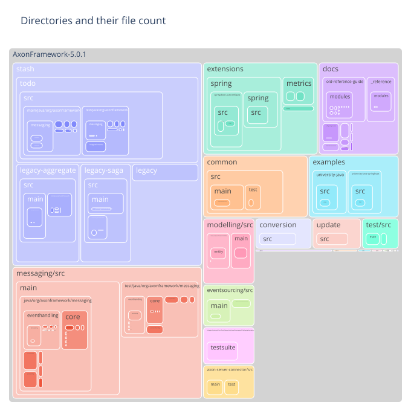
    

### Most frequent file extension per directory

    
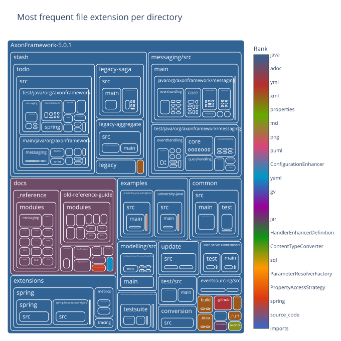
    

### Number of commits per directory

    
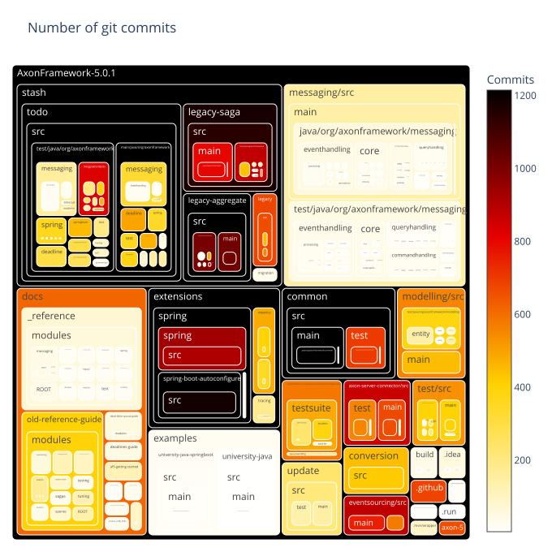
    

### Number of distinct authors per directory

    
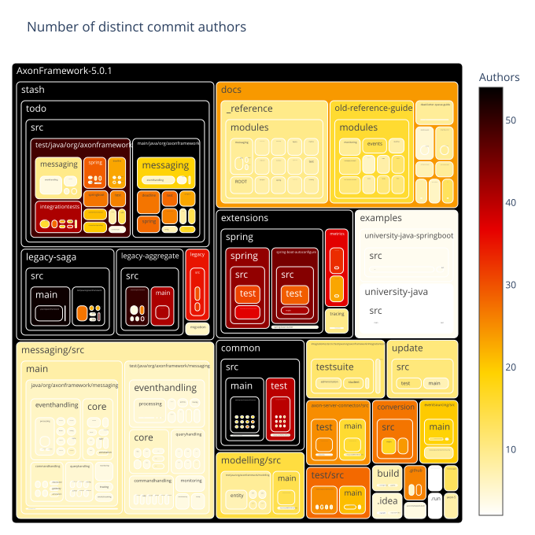
    

### Directories with very few different authors

    
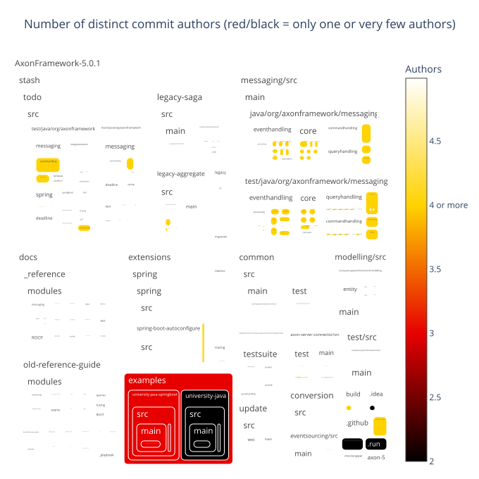
    

### Main author per directory

    
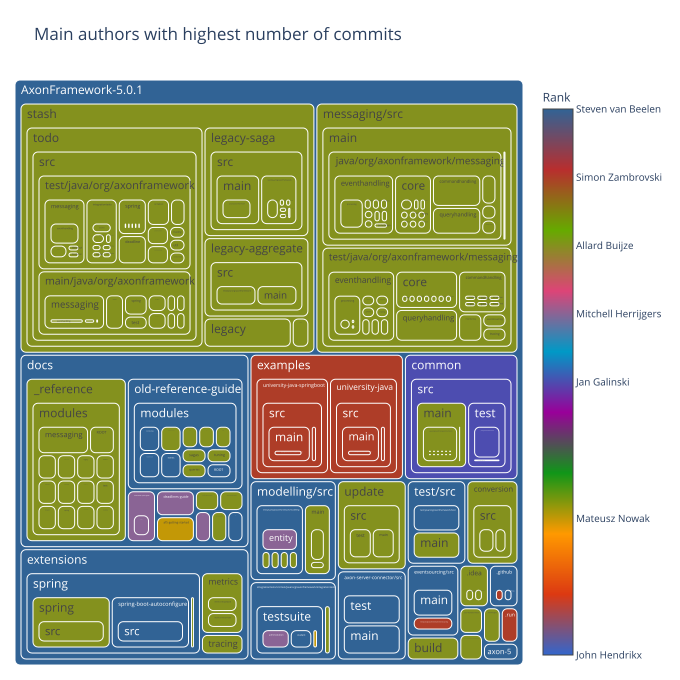
    

### Second author per directory

    
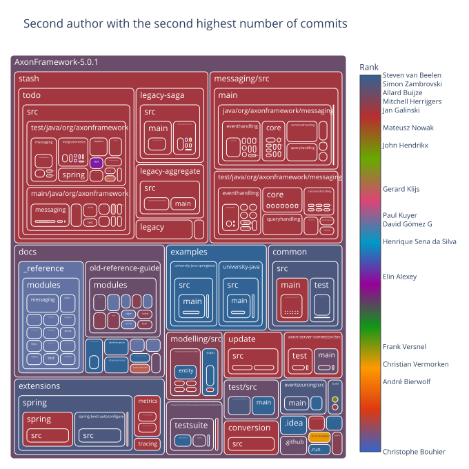
    

### Days since last commit per directory

    
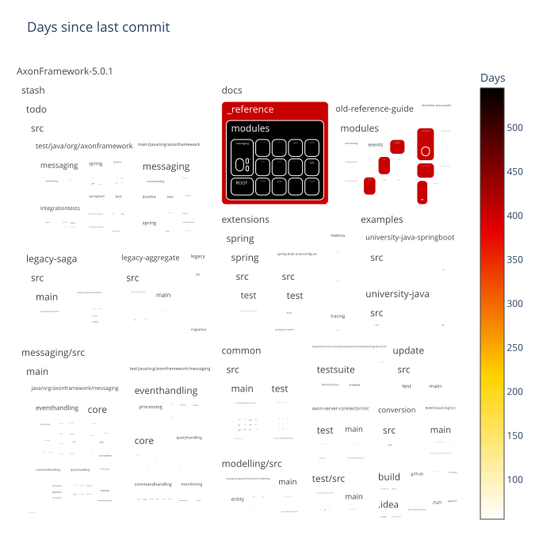
    

### Days since last commit per directory (ranked)

    
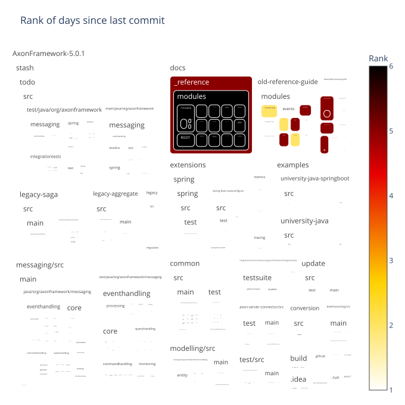
    

### Days since last file creation per directory

    
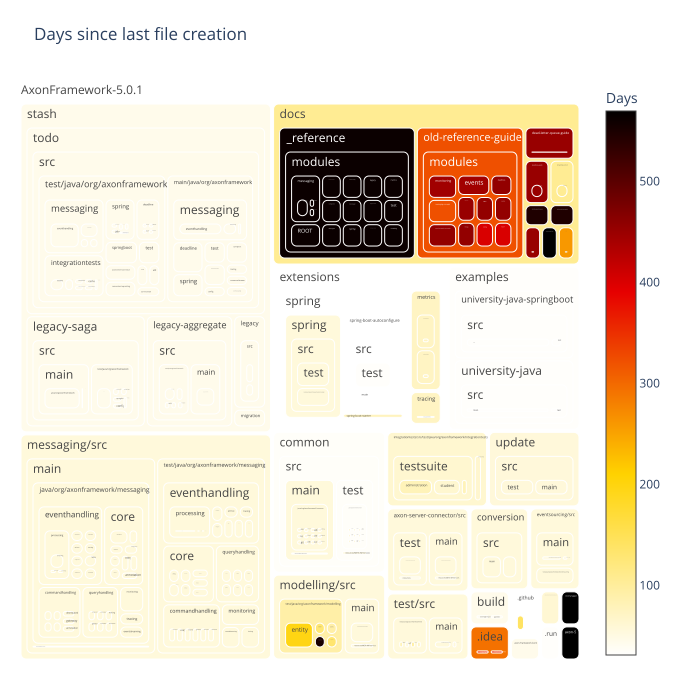
    

### Days since last file creation per directory (ranked)

    
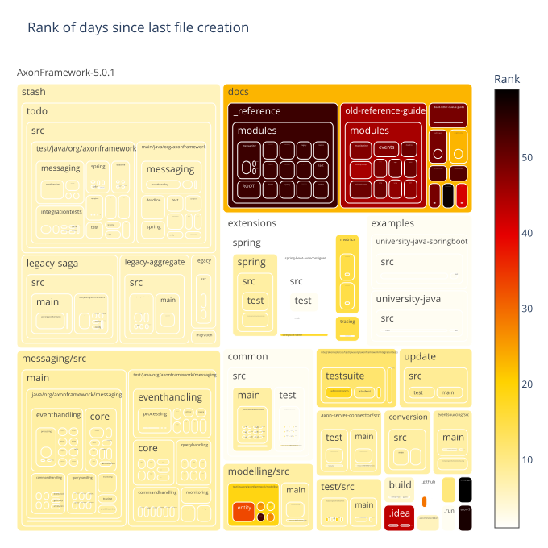
    

### Days since last file modification per directory

    
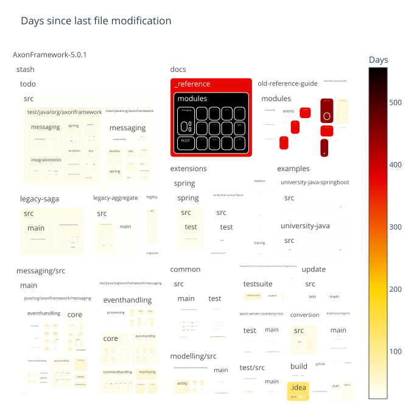
    

### Days since last file modification per directory (ranked)

    
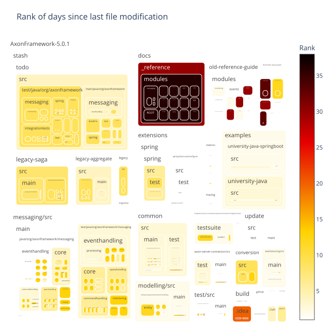
    

## Filecount per commit

Shows how many commits had changed one file, how many had changed two files, and so on.
The chart is limited to 30 lines for improved readability.
The data preview also includes overall statistics including the number of commits that are filtered out in the chart.

### Preview data

    Sum of commits that changed more than 30 files (each) = 1653
    Max changed files with one commit = 4602

<table border="1" class="dataframe">
  <thead>
    <tr style="text-align: right;">
      <th></th>
      <th>filesPerCommit</th>
      <th>commitCount</th>
    </tr>
  </thead>
  <tbody>
    <tr>
      <th>count</th>
      <td>471.000000</td>
      <td>471.000000</td>
    </tr>
    <tr>
      <th>mean</th>
      <td>546.484076</td>
      <td>33.295117</td>
    </tr>
    <tr>
      <th>std</th>
      <td>759.413474</td>
      <td>310.676325</td>
    </tr>
    <tr>
      <th>min</th>
      <td>1.000000</td>
      <td>1.000000</td>
    </tr>
    <tr>
      <th>25%</th>
      <td>118.500000</td>
      <td>1.000000</td>
    </tr>
    <tr>
      <th>50%</th>
      <td>257.000000</td>
      <td>2.000000</td>
    </tr>
    <tr>
      <th>75%</th>
      <td>584.000000</td>
      <td>5.000000</td>
    </tr>
    <tr>
      <th>max</th>
      <td>4602.000000</td>
      <td>6067.000000</td>
    </tr>
  </tbody>
</table>

<table border="1" class="dataframe">
  <thead>
    <tr style="text-align: right;">
      <th></th>
      <th>filesPerCommit</th>
      <th>commitCount</th>
    </tr>
  </thead>
  <tbody>
    <tr>
      <th>0</th>
      <td>1</td>
      <td>6067</td>
    </tr>
    <tr>
      <th>1</th>
      <td>2</td>
      <td>2508</td>
    </tr>
    <tr>
      <th>2</th>
      <td>3</td>
      <td>1163</td>
    </tr>
    <tr>
      <th>3</th>
      <td>4</td>
      <td>766</td>
    </tr>
    <tr>
      <th>4</th>
      <td>5</td>
      <td>518</td>
    </tr>
    <tr>
      <th>5</th>
      <td>6</td>
      <td>385</td>
    </tr>
    <tr>
      <th>6</th>
      <td>7</td>
      <td>316</td>
    </tr>
    <tr>
      <th>7</th>
      <td>8</td>
      <td>253</td>
    </tr>
    <tr>
      <th>8</th>
      <td>9</td>
      <td>189</td>
    </tr>
    <tr>
      <th>9</th>
      <td>10</td>
      <td>168</td>
    </tr>
    <tr>
      <th>10</th>
      <td>11</td>
      <td>143</td>
    </tr>
    <tr>
      <th>11</th>
      <td>12</td>
      <td>123</td>
    </tr>
    <tr>
      <th>12</th>
      <td>13</td>
      <td>144</td>
    </tr>
    <tr>
      <th>13</th>
      <td>14</td>
      <td>160</td>
    </tr>
    <tr>
      <th>14</th>
      <td>15</td>
      <td>196</td>
    </tr>
    <tr>
      <th>15</th>
      <td>16</td>
      <td>91</td>
    </tr>
    <tr>
      <th>16</th>
      <td>17</td>
      <td>82</td>
    </tr>
    <tr>
      <th>17</th>
      <td>18</td>
      <td>82</td>
    </tr>
    <tr>
      <th>18</th>
      <td>19</td>
      <td>102</td>
    </tr>
    <tr>
      <th>19</th>
      <td>20</td>
      <td>83</td>
    </tr>
    <tr>
      <th>20</th>
      <td>21</td>
      <td>58</td>
    </tr>
    <tr>
      <th>21</th>
      <td>22</td>
      <td>79</td>
    </tr>
    <tr>
      <th>22</th>
      <td>23</td>
      <td>47</td>
    </tr>
    <tr>
      <th>23</th>
      <td>24</td>
      <td>47</td>
    </tr>
    <tr>
      <th>24</th>
      <td>25</td>
      <td>60</td>
    </tr>
    <tr>
      <th>25</th>
      <td>26</td>
      <td>46</td>
    </tr>
    <tr>
      <th>26</th>
      <td>27</td>
      <td>43</td>
    </tr>
    <tr>
      <th>27</th>
      <td>28</td>
      <td>37</td>
    </tr>
    <tr>
      <th>28</th>
      <td>29</td>
      <td>40</td>
    </tr>
    <tr>
      <th>29</th>
      <td>30</td>
      <td>33</td>
    </tr>
  </tbody>
</table>

### Bar chart with the number of files per commit distribution

    
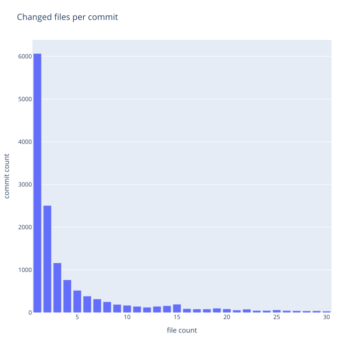
    

## Pairwise Changed Files

This section analyzes files that where changed together within the same commit and provides several metrics to quantify the strength of the co-change relationship:

- **Commit Count**: The number of commits in which two files were changed together.
- **Commit Lift**: A ratio that indicates whether the co-change pattern is stronger than random chance, given how often each file changes.
- **Jaccard Similarity**: The ratio of commits involving either file that also involved both files.

The following tables show the top pairwise changed files based on these metrics.
The following charts show how these metrics are distributed across pairs of files that were changed together.

### Treemap with files changed frequently with others

    
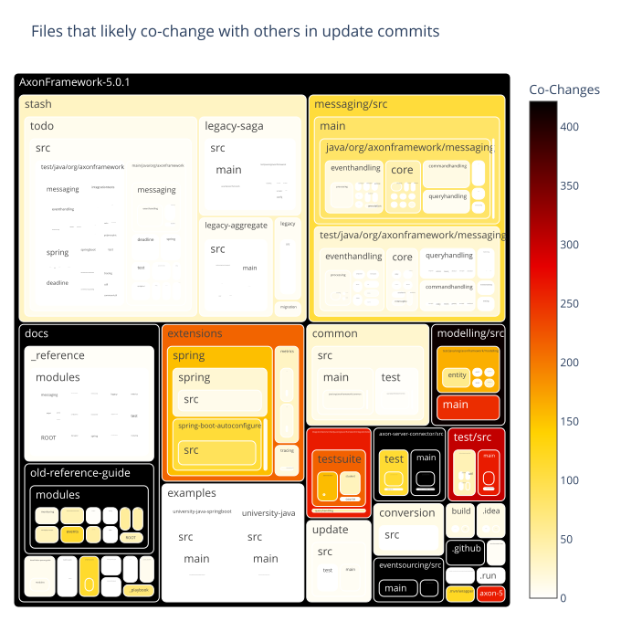
    

    
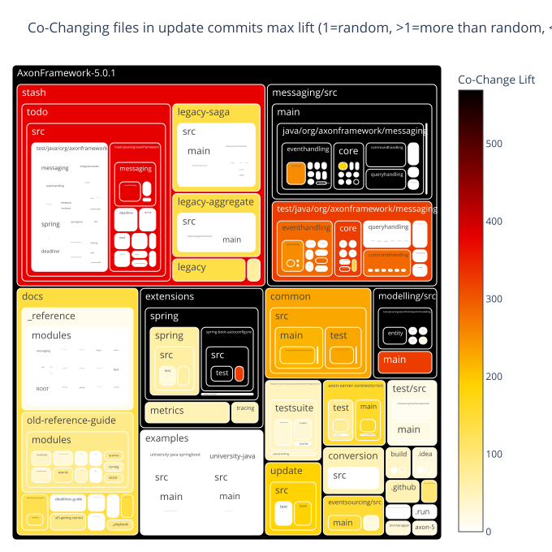
    

    
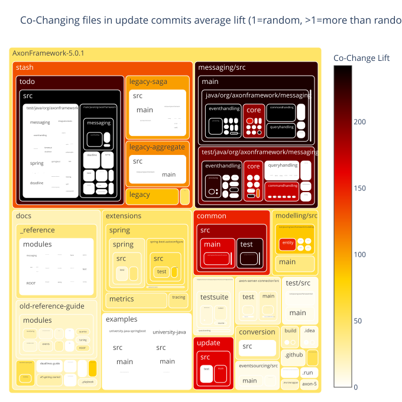
    

<table border="1" class="dataframe">
  <thead>
    <tr style="text-align: right;">
      <th></th>
      <th>fileExtensionPair</th>
      <th>fileExtensionPairCount</th>
    </tr>
  </thead>
  <tbody>
    <tr>
      <th>0</th>
      <td>java↔java</td>
      <td>2198</td>
    </tr>
    <tr>
      <th>1</th>
      <td>xml↔xml</td>
      <td>190</td>
    </tr>
    <tr>
      <th>2</th>
      <td>adoc↔adoc</td>
      <td>176</td>
    </tr>
    <tr>
      <th>3</th>
      <td>java↔md</td>
      <td>139</td>
    </tr>
  </tbody>
</table>

### Files changed together by commit count

<table border="1" class="dataframe">
  <thead>
    <tr style="text-align: right;">
      <th></th>
      <th>fileExtensionPair</th>
      <th>updateCommitCount</th>
      <th>GroupRank</th>
      <th>filePair</th>
      <th>filePairWithRelativePath</th>
    </tr>
  </thead>
  <tbody>
    <tr>
      <th>0</th>
      <td>java↔java</td>
      <td>109</td>
      <td>1</td>
      <td>AggregateBasedStorageEngineTestSuite↔StorageEngineTestSuite</td>
      <td>eventsourcing/src/test/java/org/axonframework/eventsourcing/eventstore/AggregateBasedStorageEngineTestSuite.java↔eventsourcing/src/test/java/org/axonframework/eventsourcing/eventstore/StorageEngineTestSuite.java</td>
    </tr>
    <tr>
      <th>1</th>
      <td>java↔java</td>
      <td>105</td>
      <td>2</td>
      <td>AggregateBasedAxonServerEventStorageEngine↔AggregateBasedJpaEventStorageEngine</td>
      <td>axon-server-connector/src/main/java/org/axonframework/axonserver/connector/event/AggregateBasedAxonServerEventStorageEngine.java↔eventsourcing/src/main/java/org/axonframework/eventsourcing/eventstore/jpa/AggregateBasedJpaEventStorageEngine.java</td>
    </tr>
    <tr>
      <th>2</th>
      <td>java↔java</td>
      <td>102</td>
      <td>3</td>
      <td>AggregateBasedJpaEventStorageEngine↔AggregateBasedStorageEngineTestSuite</td>
      <td>eventsourcing/src/main/java/org/axonframework/eventsourcing/eventstore/jpa/AggregateBasedJpaEventStorageEngine.java↔eventsourcing/src/test/java/org/axonframework/eventsourcing/eventstore/AggregateBasedStorageEngineTestSuite.java</td>
    </tr>
    <tr>
      <th>3</th>
      <td>java↔java</td>
      <td>79</td>
      <td>4</td>
      <td>AggregateBasedAxonServerEventStorageEngine↔StorageEngineTestSuite</td>
      <td>axon-server-connector/src/main/java/org/axonframework/axonserver/connector/event/AggregateBasedAxonServerEventStorageEngine.java↔eventsourcing/src/test/java/org/axonframework/eventsourcing/eventstore/StorageEngineTestSuite.java</td>
    </tr>
    <tr>
      <th>4</th>
      <td>java↔java</td>
      <td>71</td>
      <td>5</td>
      <td>DefaultEventStoreTransactionTest↔StorageEngineTestSuite</td>
      <td>eventsourcing/src/test/java/org/axonframework/eventsourcing/eventstore/DefaultEventStoreTransactionTest.java↔eventsourcing/src/test/java/org/axonframework/eventsourcing/eventstore/StorageEngineTestSuite.java</td>
    </tr>
    <tr>
      <th>5</th>
      <td>java↔java</td>
      <td>68</td>
      <td>6</td>
      <td>AggregateBasedStorageEngineTestSuite↔DefaultEventStoreTransactionTest</td>
      <td>eventsourcing/src/test/java/org/axonframework/eventsourcing/eventstore/AggregateBasedStorageEngineTestSuite.java↔eventsourcing/src/test/java/org/axonframework/eventsourcing/eventstore/DefaultEventStoreTransactionTest.java</td>
    </tr>
    <tr>
      <th>6</th>
      <td>java↔java</td>
      <td>61</td>
      <td>7</td>
      <td>DefaultEventStoreTransaction↔AggregateBasedStorageEngineTestSuite</td>
      <td>eventsourcing/src/main/java/org/axonframework/eventsourcing/eventstore/DefaultEventStoreTransaction.java↔eventsourcing/src/test/java/org/axonframework/eventsourcing/eventstore/AggregateBasedStorageEngineTestSuite.java</td>
    </tr>
    <tr>
      <th>7</th>
      <td>java↔java</td>
      <td>56</td>
      <td>8</td>
      <td>DefaultEventStoreTransactionTest↔SimpleEventStoreTest</td>
      <td>eventsourcing/src/test/java/org/axonframework/eventsourcing/eventstore/DefaultEventStoreTransactionTest.java↔eventsourcing/src/test/java/org/axonframework/eventsourcing/eventstore/SimpleEventStoreTest.java</td>
    </tr>
    <tr>
      <th>8</th>
      <td>java↔java</td>
      <td>55</td>
      <td>9</td>
      <td>AggregateBasedStorageEngineTestSuite↔SimpleEventStoreTest</td>
      <td>eventsourcing/src/test/java/org/axonframework/eventsourcing/eventstore/AggregateBasedStorageEngineTestSuite.java↔eventsourcing/src/test/java/org/axonframework/eventsourcing/eventstore/SimpleEventStoreTest.java</td>
    </tr>
    <tr>
      <th>9</th>
      <td>java↔java</td>
      <td>53</td>
      <td>10</td>
      <td>AggregateBasedAxonServerEventStorageEngine↔DefaultEventStoreTransactionTest</td>
      <td>axon-server-connector/src/main/java/org/axonframework/axonserver/connector/event/AggregateBasedAxonServerEventStorageEngine.java↔eventsourcing/src/test/java/org/axonframework/eventsourcing/eventstore/DefaultEventStoreTransactionTest.java</td>
    </tr>
    <tr>
      <th>10</th>
      <td>xml↔xml</td>
      <td>14</td>
      <td>1</td>
      <td>pom↔pom</td>
      <td>extensions/spring/spring-boot-autoconfigure/pom.xml↔extensions/spring/spring/pom.xml</td>
    </tr>
    <tr>
      <th>11</th>
      <td>xml↔xml</td>
      <td>13</td>
      <td>2</td>
      <td>pom↔pom</td>
      <td>common/pom.xml↔conversion/pom.xml</td>
    </tr>
    <tr>
      <th>12</th>
      <td>xml↔xml</td>
      <td>12</td>
      <td>3</td>
      <td>pom↔pom</td>
      <td>extensions/metrics/metrics-dropwizard/pom.xml↔extensions/metrics/metrics-micrometer/pom.xml</td>
    </tr>
    <tr>
      <th>13</th>
      <td>xml↔xml</td>
      <td>11</td>
      <td>4</td>
      <td>pom↔pom</td>
      <td>common/pom.xml↔extensions/spring/spring/pom.xml</td>
    </tr>
    <tr>
      <th>14</th>
      <td>xml↔xml</td>
      <td>10</td>
      <td>5</td>
      <td>pom↔pom</td>
      <td>conversion/pom.xml↔extensions/metrics/metrics-dropwizard/pom.xml</td>
    </tr>
    <tr>
      <th>15</th>
      <td>xml↔xml</td>
      <td>9</td>
      <td>6</td>
      <td>pom↔pom</td>
      <td>common/pom.xml↔extensions/metrics/metrics-dropwizard/pom.xml</td>
    </tr>
    <tr>
      <th>16</th>
      <td>xml↔xml</td>
      <td>8</td>
      <td>7</td>
      <td>pom↔pom</td>
      <td>extensions/metrics/metrics-micrometer/pom.xml↔extensions/metrics/pom.xml</td>
    </tr>
    <tr>
      <th>17</th>
      <td>xml↔xml</td>
      <td>7</td>
      <td>8</td>
      <td>pom↔pom</td>
      <td>build/parent/pom.xml↔common/pom.xml</td>
    </tr>
    <tr>
      <th>18</th>
      <td>xml↔xml</td>
      <td>6</td>
      <td>9</td>
      <td>pom↔pom</td>
      <td>build/parent/pom.xml↔conversion/pom.xml</td>
    </tr>
    <tr>
      <th>19</th>
      <td>xml↔xml</td>
      <td>5</td>
      <td>10</td>
      <td>pom↔pom</td>
      <td>axon-framework-bom/pom.xml↔build/parent/pom.xml</td>
    </tr>
    <tr>
      <th>20</th>
      <td>adoc↔adoc</td>
      <td>21</td>
      <td>1</td>
      <td>major-releases↔minor-releases</td>
      <td>docs/old-reference-guide/modules/release-notes/pages/major-releases.adoc↔docs/old-reference-guide/modules/release-notes/pages/minor-releases.adoc</td>
    </tr>
    <tr>
      <th>21</th>
      <td>adoc↔adoc</td>
      <td>19</td>
      <td>2</td>
      <td>query-dispatchers↔query-handlers</td>
      <td>docs/old-reference-guide/modules/queries/pages/query-dispatchers.adoc↔docs/old-reference-guide/modules/queries/pages/query-handlers.adoc</td>
    </tr>
    <tr>
      <th>22</th>
      <td>adoc↔adoc</td>
      <td>18</td>
      <td>3</td>
      <td>streaming↔subscribing</td>
      <td>docs/old-reference-guide/modules/events/pages/event-processors/streaming.adoc↔docs/old-reference-guide/modules/events/pages/event-processors/subscribing.adoc</td>
    </tr>
    <tr>
      <th>23</th>
      <td>adoc↔adoc</td>
      <td>16</td>
      <td>4</td>
      <td>event-versioning↔event-snapshots</td>
      <td>docs/old-reference-guide/modules/events/pages/event-versioning.adoc↔docs/old-reference-guide/modules/tuning/pages/event-snapshots.adoc</td>
    </tr>
    <tr>
      <th>24</th>
      <td>adoc↔adoc</td>
      <td>15</td>
      <td>5</td>
      <td>implement-command-create-course↔implement-command-subscribe-student</td>
      <td>docs/af5-getting-started/modules/ROOT/pages/implement-command-create-course.adoc↔docs/af5-getting-started/modules/ROOT/pages/implement-command-subscribe-student.adoc</td>
    </tr>
    <tr>
      <th>25</th>
      <td>adoc↔adoc</td>
      <td>14</td>
      <td>6</td>
      <td>event-versioning↔known-issues-and-workarounds</td>
      <td>docs/old-reference-guide/modules/events/pages/event-versioning.adoc↔docs/old-reference-guide/modules/ROOT/pages/known-issues-and-workarounds.adoc</td>
    </tr>
    <tr>
      <th>26</th>
      <td>adoc↔adoc</td>
      <td>13</td>
      <td>7</td>
      <td>implement-command-create-course↔index</td>
      <td>docs/af5-getting-started/modules/ROOT/pages/implement-command-create-course.adoc↔docs/af5-getting-started/modules/ROOT/pages/index.adoc</td>
    </tr>
    <tr>
      <th>27</th>
      <td>adoc↔adoc</td>
      <td>12</td>
      <td>8</td>
      <td>streaming↔major-releases</td>
      <td>docs/old-reference-guide/modules/events/pages/event-processors/streaming.adoc↔docs/old-reference-guide/modules/release-notes/pages/major-releases.adoc</td>
    </tr>
    <tr>
      <th>28</th>
      <td>adoc↔adoc</td>
      <td>11</td>
      <td>9</td>
      <td>configure-axon-server↔implement-command-create-course</td>
      <td>docs/af5-getting-started/modules/ROOT/pages/configure-axon-server.adoc↔docs/af5-getting-started/modules/ROOT/pages/implement-command-create-course.adoc</td>
    </tr>
    <tr>
      <th>29</th>
      <td>adoc↔adoc</td>
      <td>10</td>
      <td>10</td>
      <td>nav↔configure-axon-server</td>
      <td>docs/af5-getting-started/modules/ROOT/nav.adoc↔docs/af5-getting-started/modules/ROOT/pages/configure-axon-server.adoc</td>
    </tr>
    <tr>
      <th>30</th>
      <td>java↔md</td>
      <td>84</td>
      <td>1</td>
      <td>AggregateBasedStorageEngineTestSuite↔api-changes</td>
      <td>eventsourcing/src/test/java/org/axonframework/eventsourcing/eventstore/AggregateBasedStorageEngineTestSuite.java↔axon-5/api-changes.md</td>
    </tr>
    <tr>
      <th>31</th>
      <td>java↔md</td>
      <td>76</td>
      <td>2</td>
      <td>AggregateBasedJpaEventStorageEngine↔api-changes</td>
      <td>eventsourcing/src/main/java/org/axonframework/eventsourcing/eventstore/jpa/AggregateBasedJpaEventStorageEngine.java↔axon-5/api-changes.md</td>
    </tr>
    <tr>
      <th>32</th>
      <td>java↔md</td>
      <td>68</td>
      <td>3</td>
      <td>StorageEngineTestSuite↔api-changes</td>
      <td>eventsourcing/src/test/java/org/axonframework/eventsourcing/eventstore/StorageEngineTestSuite.java↔axon-5/api-changes.md</td>
    </tr>
    <tr>
      <th>33</th>
      <td>java↔md</td>
      <td>53</td>
      <td>4</td>
      <td>SimpleEventStoreTest↔api-changes</td>
      <td>eventsourcing/src/test/java/org/axonframework/eventsourcing/eventstore/SimpleEventStoreTest.java↔axon-5/api-changes.md</td>
    </tr>
    <tr>
      <th>34</th>
      <td>java↔md</td>
      <td>49</td>
      <td>5</td>
      <td>DefaultEventStoreTransactionTest↔api-changes</td>
      <td>eventsourcing/src/test/java/org/axonframework/eventsourcing/eventstore/DefaultEventStoreTransactionTest.java↔axon-5/api-changes.md</td>
    </tr>
    <tr>
      <th>35</th>
      <td>java↔md</td>
      <td>46</td>
      <td>6</td>
      <td>QueryThreadingIntegrationTest↔api-changes</td>
      <td>integrationtests/src/test/java/org/axonframework/integrationtests/queryhandling/QueryThreadingIntegrationTest.java↔axon-5/api-changes.md</td>
    </tr>
    <tr>
      <th>36</th>
      <td>java↔md</td>
      <td>39</td>
      <td>7</td>
      <td>DefaultEventStoreTransaction↔api-changes</td>
      <td>eventsourcing/src/main/java/org/axonframework/eventsourcing/eventstore/DefaultEventStoreTransaction.java↔axon-5/api-changes.md</td>
    </tr>
    <tr>
      <th>37</th>
      <td>java↔md</td>
      <td>37</td>
      <td>8</td>
      <td>EventSourcingConfigurationDefaults↔api-changes</td>
      <td>eventsourcing/src/main/java/org/axonframework/eventsourcing/configuration/EventSourcingConfigurationDefaults.java↔axon-5/api-changes.md</td>
    </tr>
    <tr>
      <th>38</th>
      <td>java↔md</td>
      <td>34</td>
      <td>9</td>
      <td>AxonServerEventStorageEngine↔api-changes</td>
      <td>axon-server-connector/src/main/java/org/axonframework/axonserver/connector/event/AxonServerEventStorageEngine.java↔axon-5/api-changes.md</td>
    </tr>
    <tr>
      <th>39</th>
      <td>java↔md</td>
      <td>31</td>
      <td>10</td>
      <td>EventSourcingConfigurer↔api-changes</td>
      <td>eventsourcing/src/main/java/org/axonframework/eventsourcing/configuration/EventSourcingConfigurer.java↔axon-5/api-changes.md</td>
    </tr>
  </tbody>
</table>

    
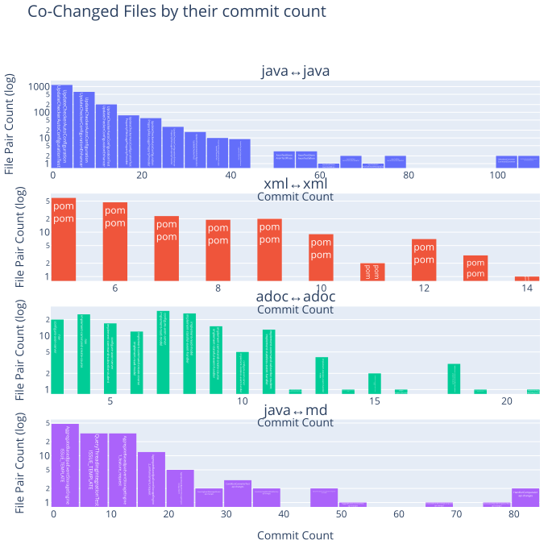
    

### Files changed together by commit min confidence

The commit min confidence is the commit count where both files were changed divided by the commit count of the file with the least commits.
This metric is useful to identify pairs of files that are frequently changed together and is not biased by single files that are changed very often.

<table border="1" class="dataframe">
  <thead>
    <tr style="text-align: right;">
      <th></th>
      <th>fileExtensionPair</th>
      <th>updateCommitMinConfidence</th>
      <th>GroupRank</th>
      <th>filePair</th>
      <th>filePairWithRelativePath</th>
    </tr>
  </thead>
  <tbody>
    <tr>
      <th>0</th>
      <td>java↔java</td>
      <td>1.000000</td>
      <td>1</td>
      <td>UpdateCheckerAutoConfiguration↔UpdateCheckerAutoConfigurationTest</td>
      <td>extensions/spring/spring-boot-autoconfigure/src/main/java/org/axonframework/extension/springboot/autoconfig/UpdateCheckerAutoConfiguration.java↔extensions/spring/spring-boot-autoconfigure/src/test/java/org/axonframework/extension/springboot/autoconfig/UpdateCheckerAutoConfigurationTest.java</td>
    </tr>
    <tr>
      <th>1</th>
      <td>java↔java</td>
      <td>0.900000</td>
      <td>2</td>
      <td>ChildEntityFieldDefinition↔GetterSetterChildEntityFieldDefinition</td>
      <td>modelling/src/main/java/org/axonframework/modelling/entity/child/ChildEntityFieldDefinition.java↔modelling/src/main/java/org/axonframework/modelling/entity/child/GetterSetterChildEntityFieldDefinition.java</td>
    </tr>
    <tr>
      <th>2</th>
      <td>java↔java</td>
      <td>0.875000</td>
      <td>3</td>
      <td>ChildEntityFieldDefinition↔FieldChildEntityFieldDefinition</td>
      <td>modelling/src/main/java/org/axonframework/modelling/entity/child/ChildEntityFieldDefinition.java↔modelling/src/main/java/org/axonframework/modelling/entity/child/FieldChildEntityFieldDefinition.java</td>
    </tr>
    <tr>
      <th>3</th>
      <td>java↔java</td>
      <td>0.833333</td>
      <td>4</td>
      <td>AnnotatedEventHandlingComponent↔AnnotationEventHandlerAdapter</td>
      <td>messaging/src/main/java/org/axonframework/messaging/eventhandling/annotation/AnnotatedEventHandlingComponent.java↔stash/todo/src/main/java/org/axonframework/messaging/eventhandling/annotation/AnnotationEventHandlerAdapter.java</td>
    </tr>
    <tr>
      <th>4</th>
      <td>java↔java</td>
      <td>0.800000</td>
      <td>5</td>
      <td>ConditionConverter↔SpringUtils</td>
      <td>axon-server-connector/src/main/java/org/axonframework/axonserver/connector/event/ConditionConverter.java↔extensions/spring/spring/src/main/java/org/axonframework/extension/spring/SpringUtils.java</td>
    </tr>
    <tr>
      <th>5</th>
      <td>java↔java</td>
      <td>0.750000</td>
      <td>6</td>
      <td>UpdateCheckerConfigurationEnhancer↔UpdateCheckerTest</td>
      <td>update/src/main/java/org/axonframework/update/UpdateCheckerConfigurationEnhancer.java↔update/src/test/java/org/axonframework/update/UpdateCheckerTest.java</td>
    </tr>
    <tr>
      <th>6</th>
      <td>java↔java</td>
      <td>0.714286</td>
      <td>7</td>
      <td>FutureUtils↔DefaultAxonApplication</td>
      <td>common/src/main/java/org/axonframework/common/FutureUtils.java↔common/src/main/java/org/axonframework/common/configuration/DefaultAxonApplication.java</td>
    </tr>
    <tr>
      <th>7</th>
      <td>java↔java</td>
      <td>0.700000</td>
      <td>8</td>
      <td>AnnotatedEventHandlingComponent↔AnnotatedHandlerInspector</td>
      <td>messaging/src/main/java/org/axonframework/messaging/eventhandling/annotation/AnnotatedEventHandlingComponent.java↔messaging/src/main/java/org/axonframework/messaging/core/annotation/AnnotatedHandlerInspector.java</td>
    </tr>
    <tr>
      <th>8</th>
      <td>java↔java</td>
      <td>0.666667</td>
      <td>9</td>
      <td>DefaultAxonApplication↔DefaultAxonApplicationTest</td>
      <td>common/src/main/java/org/axonframework/common/configuration/DefaultAxonApplication.java↔common/src/test/java/org/axonframework/common/configuration/DefaultAxonApplicationTest.java</td>
    </tr>
    <tr>
      <th>9</th>
      <td>java↔java</td>
      <td>0.648148</td>
      <td>10</td>
      <td>DefaultAppendConditionTest↔NoAppendConditionTest</td>
      <td>eventsourcing/src/test/java/org/axonframework/eventsourcing/eventstore/DefaultAppendConditionTest.java↔eventsourcing/src/test/java/org/axonframework/eventsourcing/eventstore/NoAppendConditionTest.java</td>
    </tr>
    <tr>
      <th>10</th>
      <td>xml↔xml</td>
      <td>0.600000</td>
      <td>1</td>
      <td>pom↔pom</td>
      <td>extensions/spring/spring/pom.xml↔stash/legacy-aggregate/pom.xml</td>
    </tr>
    <tr>
      <th>11</th>
      <td>xml↔xml</td>
      <td>0.562500</td>
      <td>2</td>
      <td>pom↔pom</td>
      <td>build/parent/pom.xml↔stash/migration/pom.xml</td>
    </tr>
    <tr>
      <th>12</th>
      <td>xml↔xml</td>
      <td>0.520000</td>
      <td>3</td>
      <td>pom↔pom</td>
      <td>common/pom.xml↔conversion/pom.xml</td>
    </tr>
    <tr>
      <th>13</th>
      <td>xml↔xml</td>
      <td>0.500000</td>
      <td>4</td>
      <td>pom↔pom</td>
      <td>extensions/tracing/pom.xml↔stash/legacy-aggregate/pom.xml</td>
    </tr>
    <tr>
      <th>14</th>
      <td>xml↔xml</td>
      <td>0.480000</td>
      <td>5</td>
      <td>pom↔pom</td>
      <td>extensions/metrics/metrics-dropwizard/pom.xml↔extensions/metrics/metrics-micrometer/pom.xml</td>
    </tr>
    <tr>
      <th>15</th>
      <td>xml↔xml</td>
      <td>0.454545</td>
      <td>6</td>
      <td>pom↔pom</td>
      <td>axon-framework-bom/pom.xml↔build/parent/pom.xml</td>
    </tr>
    <tr>
      <th>16</th>
      <td>xml↔xml</td>
      <td>0.440000</td>
      <td>7</td>
      <td>pom↔pom</td>
      <td>extensions/spring/spring/pom.xml↔update/pom.xml</td>
    </tr>
    <tr>
      <th>17</th>
      <td>xml↔xml</td>
      <td>0.437500</td>
      <td>8</td>
      <td>pom↔pom</td>
      <td>extensions/spring/spring-boot-autoconfigure/pom.xml↔stash/migration/pom.xml</td>
    </tr>
    <tr>
      <th>18</th>
      <td>xml↔xml</td>
      <td>0.423077</td>
      <td>9</td>
      <td>pom↔pom</td>
      <td>common/pom.xml↔extensions/spring/spring/pom.xml</td>
    </tr>
    <tr>
      <th>19</th>
      <td>xml↔xml</td>
      <td>0.416667</td>
      <td>10</td>
      <td>pom↔pom</td>
      <td>extensions/spring/spring-boot-autoconfigure/pom.xml↔extensions/spring/spring-boot-starter/pom.xml</td>
    </tr>
    <tr>
      <th>20</th>
      <td>adoc↔adoc</td>
      <td>0.750000</td>
      <td>1</td>
      <td>major-releases↔index</td>
      <td>docs/old-reference-guide/modules/release-notes/pages/major-releases.adoc↔docs/old-reference-guide/modules/release-notes/pages/index.adoc</td>
    </tr>
    <tr>
      <th>21</th>
      <td>adoc↔adoc</td>
      <td>0.727273</td>
      <td>2</td>
      <td>streaming↔dead-letter-queue</td>
      <td>docs/old-reference-guide/modules/events/pages/event-processors/streaming.adoc↔docs/old-reference-guide/modules/events/pages/event-processors/dead-letter-queue.adoc</td>
    </tr>
    <tr>
      <th>22</th>
      <td>adoc↔adoc</td>
      <td>0.722222</td>
      <td>3</td>
      <td>index↔project-structure</td>
      <td>docs/af5-getting-started/modules/ROOT/pages/index.adoc↔docs/af5-getting-started/modules/ROOT/pages/project-structure.adoc</td>
    </tr>
    <tr>
      <th>23</th>
      <td>adoc↔adoc</td>
      <td>0.650000</td>
      <td>4</td>
      <td>implement-command-create-course↔index</td>
      <td>docs/af5-getting-started/modules/ROOT/pages/implement-command-create-course.adoc↔docs/af5-getting-started/modules/ROOT/pages/index.adoc</td>
    </tr>
    <tr>
      <th>24</th>
      <td>adoc↔adoc</td>
      <td>0.636364</td>
      <td>5</td>
      <td>index↔dead-letter-queue</td>
      <td>docs/old-reference-guide/modules/ROOT/pages/index.adoc↔docs/old-reference-guide/modules/events/pages/event-processors/dead-letter-queue.adoc</td>
    </tr>
    <tr>
      <th>25</th>
      <td>adoc↔adoc</td>
      <td>0.625000</td>
      <td>6</td>
      <td>streaming↔retrying</td>
      <td>docs/old-reference-guide/modules/events/pages/event-processors/streaming.adoc↔docs/dead-letter-queue-guide/modules/ROOT/pages/retrying.adoc</td>
    </tr>
    <tr>
      <th>26</th>
      <td>adoc↔adoc</td>
      <td>0.615385</td>
      <td>7</td>
      <td>configuration↔implementations</td>
      <td>docs/old-reference-guide/modules/queries/pages/configuration.adoc↔docs/old-reference-guide/modules/queries/pages/implementations.adoc</td>
    </tr>
    <tr>
      <th>27</th>
      <td>adoc↔adoc</td>
      <td>0.611111</td>
      <td>8</td>
      <td>implement-command-create-course↔project-structure</td>
      <td>docs/af5-getting-started/modules/ROOT/pages/implement-command-create-course.adoc↔docs/af5-getting-started/modules/ROOT/pages/project-structure.adoc</td>
    </tr>
    <tr>
      <th>28</th>
      <td>adoc↔adoc</td>
      <td>0.600000</td>
      <td>9</td>
      <td>spring-boot-integration↔upgrading-to-4-7</td>
      <td>docs/old-reference-guide/modules/ROOT/pages/spring-boot-integration.adoc↔docs/old-reference-guide/modules/ROOT/pages/upgrading-to-4-7.adoc</td>
    </tr>
    <tr>
      <th>29</th>
      <td>adoc↔adoc</td>
      <td>0.552632</td>
      <td>10</td>
      <td>major-releases↔minor-releases</td>
      <td>docs/old-reference-guide/modules/release-notes/pages/major-releases.adoc↔docs/old-reference-guide/modules/release-notes/pages/minor-releases.adoc</td>
    </tr>
    <tr>
      <th>30</th>
      <td>java↔md</td>
      <td>1.000000</td>
      <td>1</td>
      <td>AnnotationSagaMetaModelFactory↔api-changes</td>
      <td>stash/legacy-saga/src/main/java/org/axonframework/modelling/saga/metamodel/AnnotationSagaMetaModelFactory.java↔axon-5/api-changes.md</td>
    </tr>
    <tr>
      <th>31</th>
      <td>java↔md</td>
      <td>0.666667</td>
      <td>2</td>
      <td>AnnotationEventHandlerAdapter↔api-changes</td>
      <td>stash/todo/src/main/java/org/axonframework/messaging/eventhandling/annotation/AnnotationEventHandlerAdapter.java↔axon-5/api-changes.md</td>
    </tr>
    <tr>
      <th>32</th>
      <td>java↔md</td>
      <td>0.600000</td>
      <td>3</td>
      <td>CommandConverter↔modularity</td>
      <td>axon-server-connector/src/main/java/org/axonframework/axonserver/connector/command/CommandConverter.java↔axon-5/modularity.md</td>
    </tr>
    <tr>
      <th>33</th>
      <td>java↔md</td>
      <td>0.571429</td>
      <td>4</td>
      <td>ExceptionHandlerTest↔api-changes</td>
      <td>messaging/src/test/java/org/axonframework/messaging/core/interception/ExceptionHandlerTest.java↔axon-5/api-changes.md</td>
    </tr>
    <tr>
      <th>34</th>
      <td>java↔md</td>
      <td>0.500000</td>
      <td>5</td>
      <td>AnnotatedEventHandlingComponentTest↔api-changes</td>
      <td>messaging/src/test/java/org/axonframework/messaging/eventhandling/annotation/AnnotatedEventHandlingComponentTest.java↔axon-5/api-changes.md</td>
    </tr>
    <tr>
      <th>35</th>
      <td>java↔md</td>
      <td>0.451613</td>
      <td>6</td>
      <td>AggregateBasedAxonServerEventStorageEngine↔api-changes</td>
      <td>axon-server-connector/src/main/java/org/axonframework/axonserver/connector/event/AggregateBasedAxonServerEventStorageEngine.java↔axon-5/api-changes.md</td>
    </tr>
    <tr>
      <th>36</th>
      <td>java↔md</td>
      <td>0.411765</td>
      <td>7</td>
      <td>ChildAmbiguityException↔api-changes</td>
      <td>modelling/src/main/java/org/axonframework/modelling/entity/child/ChildAmbiguityException.java↔axon-5/api-changes.md</td>
    </tr>
    <tr>
      <th>37</th>
      <td>java↔md</td>
      <td>0.400000</td>
      <td>8</td>
      <td>AnnotatedEventHandlingComponent↔api-changes</td>
      <td>messaging/src/main/java/org/axonframework/messaging/eventhandling/annotation/AnnotatedEventHandlingComponent.java↔axon-5/api-changes.md</td>
    </tr>
    <tr>
      <th>38</th>
      <td>java↔md</td>
      <td>0.378109</td>
      <td>9</td>
      <td>AggregateBasedJpaEventStorageEngine↔api-changes</td>
      <td>eventsourcing/src/main/java/org/axonframework/eventsourcing/eventstore/jpa/AggregateBasedJpaEventStorageEngine.java↔axon-5/api-changes.md</td>
    </tr>
    <tr>
      <th>39</th>
      <td>java↔md</td>
      <td>0.375000</td>
      <td>10</td>
      <td>FieldChildEntityFieldDefinition↔api-changes</td>
      <td>modelling/src/main/java/org/axonframework/modelling/entity/child/FieldChildEntityFieldDefinition.java↔axon-5/api-changes.md</td>
    </tr>
  </tbody>
</table>

    
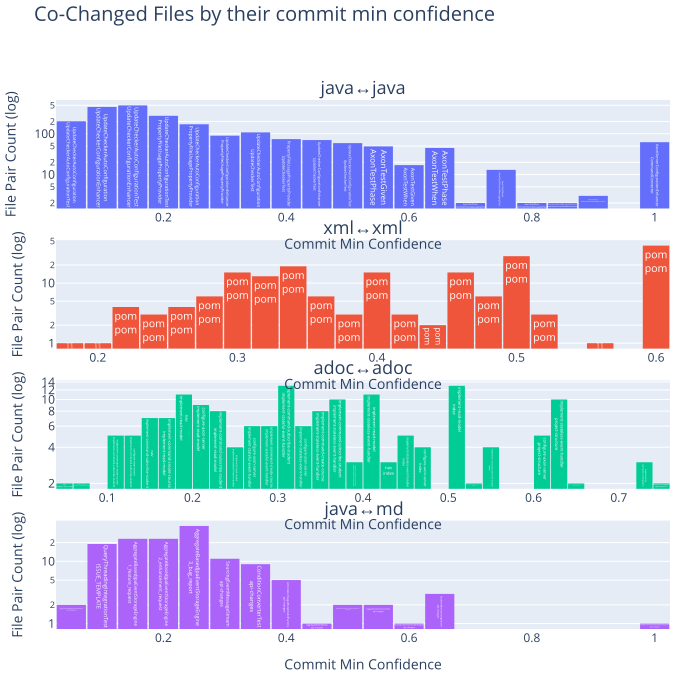
    

### Files changed together by commit lift

<table border="1" class="dataframe">
  <thead>
    <tr style="text-align: right;">
      <th></th>
      <th>fileExtensionPair</th>
      <th>updateCommitLift</th>
      <th>GroupRank</th>
      <th>filePair</th>
      <th>filePairWithRelativePath</th>
    </tr>
  </thead>
  <tbody>
    <tr>
      <th>0</th>
      <td>java↔java</td>
      <td>758.666667</td>
      <td>1</td>
      <td>FieldChildEntityFieldDefinitionTest↔GetterEvolverChildEntityFieldDefinitionTest</td>
      <td>modelling/src/test/java/org/axonframework/modelling/entity/child/FieldChildEntityFieldDefinitionTest.java↔modelling/src/test/java/org/axonframework/modelling/entity/child/GetterEvolverChildEntityFieldDefinitionTest.java</td>
    </tr>
    <tr>
      <th>1</th>
      <td>java↔java</td>
      <td>569.000000</td>
      <td>2</td>
      <td>UpdateCheckerAutoConfigurationTest↔UpdateCheckerTest</td>
      <td>extensions/spring/spring-boot-autoconfigure/src/test/java/org/axonframework/extension/springboot/autoconfig/UpdateCheckerAutoConfigurationTest.java↔update/src/test/java/org/axonframework/update/UpdateCheckerTest.java</td>
    </tr>
    <tr>
      <th>2</th>
      <td>java↔java</td>
      <td>379.333333</td>
      <td>3</td>
      <td>HandlerComparator↔AnnotationSagaMetaModelFactory</td>
      <td>messaging/src/main/java/org/axonframework/messaging/core/annotation/HandlerComparator.java↔stash/legacy-saga/src/main/java/org/axonframework/modelling/saga/metamodel/AnnotationSagaMetaModelFactory.java</td>
    </tr>
    <tr>
      <th>3</th>
      <td>java↔java</td>
      <td>325.142857</td>
      <td>4</td>
      <td>AnnotationBasedEntityEvolvingComponent↔AnnotationSagaMetaModelFactory</td>
      <td>modelling/src/main/java/org/axonframework/modelling/annotation/AnnotationBasedEntityEvolvingComponent.java↔stash/legacy-saga/src/main/java/org/axonframework/modelling/saga/metamodel/AnnotationSagaMetaModelFactory.java</td>
    </tr>
    <tr>
      <th>4</th>
      <td>java↔java</td>
      <td>325.142857</td>
      <td>5</td>
      <td>UpdateCheckerAutoConfiguration↔UpdateCheckerAutoConfigurationTest</td>
      <td>extensions/spring/spring-boot-autoconfigure/src/main/java/org/axonframework/extension/springboot/autoconfig/UpdateCheckerAutoConfiguration.java↔extensions/spring/spring-boot-autoconfigure/src/test/java/org/axonframework/extension/springboot/autoconfig/UpdateCheckerAutoConfigurationTest.java</td>
    </tr>
    <tr>
      <th>5</th>
      <td>java↔java</td>
      <td>284.500000</td>
      <td>6</td>
      <td>AnnotationMessageTypeResolver↔AnnotationMessageTypeResolverTest</td>
      <td>messaging/src/main/java/org/axonframework/messaging/core/annotation/AnnotationMessageTypeResolver.java↔messaging/src/test/java/org/axonframework/messaging/core/annotation/AnnotationMessageTypeResolverTest.java</td>
    </tr>
    <tr>
      <th>6</th>
      <td>java↔java</td>
      <td>252.888889</td>
      <td>7</td>
      <td>MergeTask↔SplitTask</td>
      <td>messaging/src/main/java/org/axonframework/messaging/eventhandling/processing/streaming/pooled/MergeTask.java↔messaging/src/main/java/org/axonframework/messaging/eventhandling/processing/streaming/pooled/SplitTask.java</td>
    </tr>
    <tr>
      <th>7</th>
      <td>java↔java</td>
      <td>252.888889</td>
      <td>8</td>
      <td>UpdateCheckerAutoConfigurationTest↔UpdateCheckerConfigurationEnhancer</td>
      <td>extensions/spring/spring-boot-autoconfigure/src/test/java/org/axonframework/extension/springboot/autoconfig/UpdateCheckerAutoConfigurationTest.java↔update/src/main/java/org/axonframework/update/UpdateCheckerConfigurationEnhancer.java</td>
    </tr>
    <tr>
      <th>8</th>
      <td>java↔java</td>
      <td>243.857143</td>
      <td>9</td>
      <td>UpdateCheckerAutoConfiguration↔UpdateCheckerTest</td>
      <td>extensions/spring/spring-boot-autoconfigure/src/main/java/org/axonframework/extension/springboot/autoconfig/UpdateCheckerAutoConfiguration.java↔update/src/test/java/org/axonframework/update/UpdateCheckerTest.java</td>
    </tr>
    <tr>
      <th>9</th>
      <td>java↔java</td>
      <td>227.600000</td>
      <td>10</td>
      <td>FieldChildEntityFieldDefinition↔GetterSetterChildEntityFieldDefinition</td>
      <td>modelling/src/main/java/org/axonframework/modelling/entity/child/FieldChildEntityFieldDefinition.java↔modelling/src/main/java/org/axonframework/modelling/entity/child/GetterSetterChildEntityFieldDefinition.java</td>
    </tr>
    <tr>
      <th>10</th>
      <td>xml↔xml</td>
      <td>136.560000</td>
      <td>1</td>
      <td>pom↔pom</td>
      <td>stash/legacy-aggregate/pom.xml↔stash/legacy-saga/pom.xml</td>
    </tr>
    <tr>
      <th>11</th>
      <td>xml↔xml</td>
      <td>103.454545</td>
      <td>2</td>
      <td>pom↔pom</td>
      <td>axon-framework-bom/pom.xml↔stash/legacy-aggregate/pom.xml</td>
    </tr>
    <tr>
      <th>12</th>
      <td>xml↔xml</td>
      <td>71.125000</td>
      <td>3</td>
      <td>pom↔pom</td>
      <td>stash/legacy-aggregate/pom.xml↔stash/migration/pom.xml</td>
    </tr>
    <tr>
      <th>13</th>
      <td>xml↔xml</td>
      <td>64.659091</td>
      <td>4</td>
      <td>pom↔pom</td>
      <td>axon-framework-bom/pom.xml↔stash/migration/pom.xml</td>
    </tr>
    <tr>
      <th>14</th>
      <td>xml↔xml</td>
      <td>56.900000</td>
      <td>5</td>
      <td>pom↔pom</td>
      <td>extensions/spring/spring-boot-starter/pom.xml↔stash/legacy-aggregate/pom.xml</td>
    </tr>
    <tr>
      <th>15</th>
      <td>xml↔xml</td>
      <td>54.624000</td>
      <td>6</td>
      <td>pom↔pom</td>
      <td>extensions/metrics/metrics-dropwizard/pom.xml↔stash/legacy-aggregate/pom.xml</td>
    </tr>
    <tr>
      <th>16</th>
      <td>xml↔xml</td>
      <td>49.478261</td>
      <td>7</td>
      <td>pom↔pom</td>
      <td>extensions/tracing/pom.xml↔stash/legacy-aggregate/pom.xml</td>
    </tr>
    <tr>
      <th>17</th>
      <td>xml↔xml</td>
      <td>47.340800</td>
      <td>8</td>
      <td>pom↔pom</td>
      <td>conversion/pom.xml↔update/pom.xml</td>
    </tr>
    <tr>
      <th>18</th>
      <td>xml↔xml</td>
      <td>45.520000</td>
      <td>9</td>
      <td>pom↔pom</td>
      <td>common/pom.xml↔conversion/pom.xml</td>
    </tr>
    <tr>
      <th>19</th>
      <td>xml↔xml</td>
      <td>44.980237</td>
      <td>10</td>
      <td>pom↔pom</td>
      <td>axon-framework-bom/pom.xml↔extensions/metrics/pom.xml</td>
    </tr>
    <tr>
      <th>20</th>
      <td>adoc↔adoc</td>
      <td>129.318182</td>
      <td>1</td>
      <td>retrying↔dead-letter-queue</td>
      <td>docs/dead-letter-queue-guide/modules/ROOT/pages/retrying.adoc↔docs/old-reference-guide/modules/events/pages/event-processors/dead-letter-queue.adoc</td>
    </tr>
    <tr>
      <th>21</th>
      <td>adoc↔adoc</td>
      <td>87.538462</td>
      <td>2</td>
      <td>implement-stateful-event-handler↔implement-stateless-event-handler</td>
      <td>docs/af5-getting-started/modules/ROOT/pages/implement-stateful-event-handler.adoc↔docs/af5-getting-started/modules/ROOT/pages/implement-stateless-event-handler.adoc</td>
    </tr>
    <tr>
      <th>22</th>
      <td>adoc↔adoc</td>
      <td>82.188889</td>
      <td>3</td>
      <td>index↔project-structure</td>
      <td>docs/af5-getting-started/modules/ROOT/pages/index.adoc↔docs/af5-getting-started/modules/ROOT/pages/project-structure.adoc</td>
    </tr>
    <tr>
      <th>23</th>
      <td>adoc↔adoc</td>
      <td>80.464646</td>
      <td>4</td>
      <td>dead-letter-queue↔index</td>
      <td>docs/old-reference-guide/modules/events/pages/event-processors/dead-letter-queue.adoc↔docs/old-reference-guide/modules/monitoring/pages/index.adoc</td>
    </tr>
    <tr>
      <th>24</th>
      <td>adoc↔adoc</td>
      <td>79.027778</td>
      <td>5</td>
      <td>retrying↔index</td>
      <td>docs/dead-letter-queue-guide/modules/ROOT/pages/retrying.adoc↔docs/old-reference-guide/modules/monitoring/pages/index.adoc</td>
    </tr>
    <tr>
      <th>25</th>
      <td>adoc↔adoc</td>
      <td>76.229665</td>
      <td>6</td>
      <td>index↔dead-letter-queue</td>
      <td>docs/old-reference-guide/modules/ROOT/pages/index.adoc↔docs/old-reference-guide/modules/events/pages/event-processors/dead-letter-queue.adoc</td>
    </tr>
    <tr>
      <th>26</th>
      <td>adoc↔adoc</td>
      <td>75.866667</td>
      <td>7</td>
      <td>implementing↔spring-boot-integration</td>
      <td>docs/dead-letter-queue-guide/modules/ROOT/pages/implementing.adoc↔docs/old-reference-guide/modules/ROOT/pages/spring-boot-integration.adoc</td>
    </tr>
    <tr>
      <th>27</th>
      <td>adoc↔adoc</td>
      <td>74.868421</td>
      <td>8</td>
      <td>retrying↔index</td>
      <td>docs/dead-letter-queue-guide/modules/ROOT/pages/retrying.adoc↔docs/old-reference-guide/modules/ROOT/pages/index.adoc</td>
    </tr>
    <tr>
      <th>28</th>
      <td>adoc↔adoc</td>
      <td>63.664336</td>
      <td>9</td>
      <td>configuration↔implementations</td>
      <td>docs/old-reference-guide/modules/queries/pages/configuration.adoc↔docs/old-reference-guide/modules/queries/pages/implementations.adoc</td>
    </tr>
    <tr>
      <th>29</th>
      <td>adoc↔adoc</td>
      <td>63.222222</td>
      <td>10</td>
      <td>index↔nav</td>
      <td>docs/old-reference-guide/modules/queries/pages/index.adoc↔docs/old-reference-guide/modules/queries/partials/nav.adoc</td>
    </tr>
    <tr>
      <th>30</th>
      <td>java↔md</td>
      <td>23.544828</td>
      <td>1</td>
      <td>CommandConverter↔modularity</td>
      <td>axon-server-connector/src/main/java/org/axonframework/axonserver/connector/command/CommandConverter.java↔axon-5/modularity.md</td>
    </tr>
    <tr>
      <th>31</th>
      <td>java↔md</td>
      <td>7.418514</td>
      <td>2</td>
      <td>NoAppendConditionTest↔design-principles</td>
      <td>eventsourcing/src/test/java/org/axonframework/eventsourcing/eventstore/NoAppendConditionTest.java↔axon-5/design-principles.md</td>
    </tr>
    <tr>
      <th>32</th>
      <td>java↔md</td>
      <td>6.947497</td>
      <td>3</td>
      <td>NoAppendCondition↔design-principles</td>
      <td>eventsourcing/src/main/java/org/axonframework/eventsourcing/eventstore/NoAppendCondition.java↔axon-5/design-principles.md</td>
    </tr>
    <tr>
      <th>33</th>
      <td>java↔md</td>
      <td>6.484330</td>
      <td>4</td>
      <td>DefaultAppendConditionTest↔design-principles</td>
      <td>eventsourcing/src/test/java/org/axonframework/eventsourcing/eventstore/DefaultAppendConditionTest.java↔axon-5/design-principles.md</td>
    </tr>
    <tr>
      <th>34</th>
      <td>java↔md</td>
      <td>5.937391</td>
      <td>5</td>
      <td>QueryThreadingIntegrationTest↔README</td>
      <td>integrationtests/src/test/java/org/axonframework/integrationtests/queryhandling/QueryThreadingIntegrationTest.java↔docs/README.md</td>
    </tr>
    <tr>
      <th>35</th>
      <td>java↔md</td>
      <td>5.835897</td>
      <td>6</td>
      <td>AppendCondition↔design-principles</td>
      <td>eventsourcing/src/main/java/org/axonframework/eventsourcing/eventstore/AppendCondition.java↔axon-5/design-principles.md</td>
    </tr>
    <tr>
      <th>36</th>
      <td>java↔md</td>
      <td>4.955007</td>
      <td>7</td>
      <td>AxonServerMessageStream↔design-principles</td>
      <td>axon-server-connector/src/main/java/org/axonframework/axonserver/connector/event/AxonServerMessageStream.java↔axon-5/design-principles.md</td>
    </tr>
    <tr>
      <th>37</th>
      <td>java↔md</td>
      <td>4.168498</td>
      <td>8</td>
      <td>AccessSerializingRepository↔design-principles</td>
      <td>modelling/src/main/java/org/axonframework/modelling/repository/AccessSerializingRepository.java↔axon-5/design-principles.md</td>
    </tr>
    <tr>
      <th>38</th>
      <td>java↔md</td>
      <td>4.040237</td>
      <td>9</td>
      <td>DefaultSourcingConditionTest↔design-principles</td>
      <td>eventsourcing/src/test/java/org/axonframework/eventsourcing/eventstore/DefaultSourcingConditionTest.java↔axon-5/design-principles.md</td>
    </tr>
    <tr>
      <th>39</th>
      <td>java↔md</td>
      <td>3.979021</td>
      <td>10</td>
      <td>SourcingConditionTest↔design-principles</td>
      <td>eventsourcing/src/test/java/org/axonframework/eventsourcing/eventstore/SourcingConditionTest.java↔axon-5/design-principles.md</td>
    </tr>
  </tbody>
</table>

    
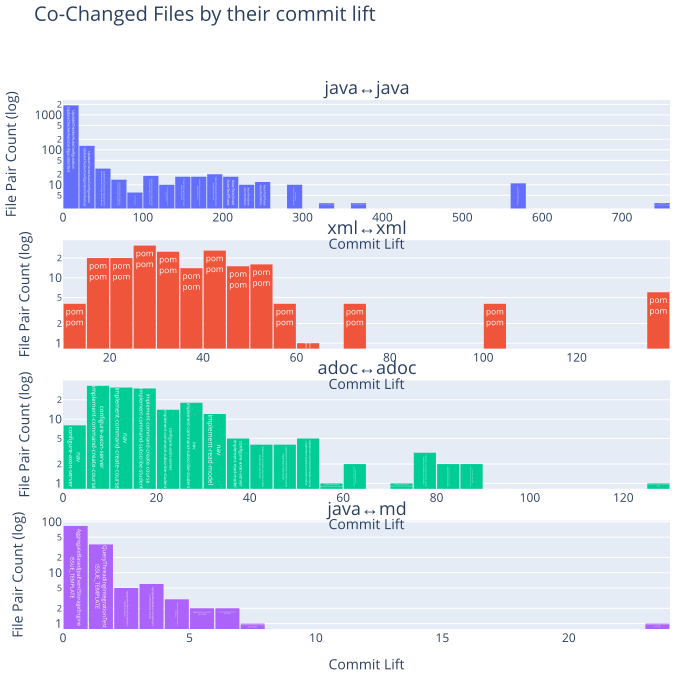
    

### Files changed together by commit Jaccard similarity

<table border="1" class="dataframe">
  <thead>
    <tr style="text-align: right;">
      <th></th>
      <th>fileExtensionPair</th>
      <th>updateCommitJaccardSimilarity</th>
      <th>GroupRank</th>
      <th>filePair</th>
      <th>filePairWithRelativePath</th>
    </tr>
  </thead>
  <tbody>
    <tr>
      <th>0</th>
      <td>java↔java</td>
      <td>1.000000</td>
      <td>1</td>
      <td>Event↔Command</td>
      <td>messaging/src/main/java/org/axonframework/messaging/eventhandling/annotation/Event.java↔messaging/src/main/java/org/axonframework/messaging/commandhandling/annotation/Command.java</td>
    </tr>
    <tr>
      <th>1</th>
      <td>java↔java</td>
      <td>0.818182</td>
      <td>2</td>
      <td>ChildEntityFieldDefinition↔GetterSetterChildEntityFieldDefinition</td>
      <td>modelling/src/main/java/org/axonframework/modelling/entity/child/ChildEntityFieldDefinition.java↔modelling/src/main/java/org/axonframework/modelling/entity/child/GetterSetterChildEntityFieldDefinition.java</td>
    </tr>
    <tr>
      <th>2</th>
      <td>java↔java</td>
      <td>0.800000</td>
      <td>3</td>
      <td>FieldChildEntityFieldDefinition↔GetterSetterChildEntityFieldDefinition</td>
      <td>modelling/src/main/java/org/axonframework/modelling/entity/child/FieldChildEntityFieldDefinition.java↔modelling/src/main/java/org/axonframework/modelling/entity/child/GetterSetterChildEntityFieldDefinition.java</td>
    </tr>
    <tr>
      <th>3</th>
      <td>java↔java</td>
      <td>0.750000</td>
      <td>4</td>
      <td>UpdateCheckerAutoConfigurationTest↔UpdateCheckerTest</td>
      <td>extensions/spring/spring-boot-autoconfigure/src/test/java/org/axonframework/extension/springboot/autoconfig/UpdateCheckerAutoConfigurationTest.java↔update/src/test/java/org/axonframework/update/UpdateCheckerTest.java</td>
    </tr>
    <tr>
      <th>4</th>
      <td>java↔java</td>
      <td>0.666667</td>
      <td>5</td>
      <td>HandlerComparator↔AnnotationSagaMetaModelFactory</td>
      <td>messaging/src/main/java/org/axonframework/messaging/core/annotation/HandlerComparator.java↔stash/legacy-saga/src/main/java/org/axonframework/modelling/saga/metamodel/AnnotationSagaMetaModelFactory.java</td>
    </tr>
    <tr>
      <th>5</th>
      <td>java↔java</td>
      <td>0.636364</td>
      <td>6</td>
      <td>ChildEntityFieldDefinition↔FieldChildEntityFieldDefinition</td>
      <td>modelling/src/main/java/org/axonframework/modelling/entity/child/ChildEntityFieldDefinition.java↔modelling/src/main/java/org/axonframework/modelling/entity/child/FieldChildEntityFieldDefinition.java</td>
    </tr>
    <tr>
      <th>6</th>
      <td>java↔java</td>
      <td>0.571429</td>
      <td>7</td>
      <td>AnnotationBasedEntityEvolvingComponent↔AnnotationSagaMetaModelFactory</td>
      <td>modelling/src/main/java/org/axonframework/modelling/annotation/AnnotationBasedEntityEvolvingComponent.java↔stash/legacy-saga/src/main/java/org/axonframework/modelling/saga/metamodel/AnnotationSagaMetaModelFactory.java</td>
    </tr>
    <tr>
      <th>7</th>
      <td>java↔java</td>
      <td>0.500000</td>
      <td>8</td>
      <td>MergeTask↔SplitTask</td>
      <td>messaging/src/main/java/org/axonframework/messaging/eventhandling/processing/streaming/pooled/MergeTask.java↔messaging/src/main/java/org/axonframework/messaging/eventhandling/processing/streaming/pooled/SplitTask.java</td>
    </tr>
    <tr>
      <th>8</th>
      <td>java↔java</td>
      <td>0.471910</td>
      <td>9</td>
      <td>DefaultSourcingConditionTest↔SourcingConditionTest</td>
      <td>eventsourcing/src/test/java/org/axonframework/eventsourcing/eventstore/DefaultSourcingConditionTest.java↔eventsourcing/src/test/java/org/axonframework/eventsourcing/eventstore/SourcingConditionTest.java</td>
    </tr>
    <tr>
      <th>9</th>
      <td>java↔java</td>
      <td>0.461538</td>
      <td>10</td>
      <td>AnnotatedHandlerInspector↔AnnotatedEventHandlingComponentTest</td>
      <td>messaging/src/main/java/org/axonframework/messaging/core/annotation/AnnotatedHandlerInspector.java↔messaging/src/test/java/org/axonframework/messaging/eventhandling/annotation/AnnotatedEventHandlingComponentTest.java</td>
    </tr>
    <tr>
      <th>10</th>
      <td>xml↔xml</td>
      <td>0.428571</td>
      <td>1</td>
      <td>pom↔pom</td>
      <td>stash/legacy-aggregate/pom.xml↔stash/legacy-saga/pom.xml</td>
    </tr>
    <tr>
      <th>11</th>
      <td>xml↔xml</td>
      <td>0.351351</td>
      <td>2</td>
      <td>pom↔pom</td>
      <td>conversion/pom.xml↔update/pom.xml</td>
    </tr>
    <tr>
      <th>12</th>
      <td>xml↔xml</td>
      <td>0.342105</td>
      <td>3</td>
      <td>pom↔pom</td>
      <td>common/pom.xml↔conversion/pom.xml</td>
    </tr>
    <tr>
      <th>13</th>
      <td>xml↔xml</td>
      <td>0.315789</td>
      <td>4</td>
      <td>pom↔pom</td>
      <td>extensions/metrics/metrics-dropwizard/pom.xml↔extensions/metrics/metrics-micrometer/pom.xml</td>
    </tr>
    <tr>
      <th>14</th>
      <td>xml↔xml</td>
      <td>0.312500</td>
      <td>5</td>
      <td>pom↔pom</td>
      <td>axon-framework-bom/pom.xml↔stash/legacy-aggregate/pom.xml</td>
    </tr>
    <tr>
      <th>15</th>
      <td>xml↔xml</td>
      <td>0.272727</td>
      <td>6</td>
      <td>pom↔pom</td>
      <td>extensions/metrics/metrics-micrometer/pom.xml↔extensions/tracing/tracing-opentelemetry/pom.xml</td>
    </tr>
    <tr>
      <th>16</th>
      <td>xml↔xml</td>
      <td>0.250000</td>
      <td>7</td>
      <td>pom↔pom</td>
      <td>conversion/pom.xml↔extensions/metrics/metrics-dropwizard/pom.xml</td>
    </tr>
    <tr>
      <th>17</th>
      <td>xml↔xml</td>
      <td>0.243243</td>
      <td>8</td>
      <td>pom↔pom</td>
      <td>extensions/metrics/pom.xml↔extensions/tracing/pom.xml</td>
    </tr>
    <tr>
      <th>18</th>
      <td>xml↔xml</td>
      <td>0.238095</td>
      <td>9</td>
      <td>pom↔pom</td>
      <td>stash/legacy-aggregate/pom.xml↔stash/migration/pom.xml</td>
    </tr>
    <tr>
      <th>19</th>
      <td>xml↔xml</td>
      <td>0.236842</td>
      <td>10</td>
      <td>pom↔pom</td>
      <td>extensions/pom.xml↔extensions/spring/spring-boot-starter/pom.xml</td>
    </tr>
    <tr>
      <th>20</th>
      <td>adoc↔adoc</td>
      <td>0.520000</td>
      <td>1</td>
      <td>index↔project-structure</td>
      <td>docs/af5-getting-started/modules/ROOT/pages/index.adoc↔docs/af5-getting-started/modules/ROOT/pages/project-structure.adoc</td>
    </tr>
    <tr>
      <th>21</th>
      <td>adoc↔adoc</td>
      <td>0.409091</td>
      <td>2</td>
      <td>major-releases↔index</td>
      <td>docs/old-reference-guide/modules/release-notes/pages/major-releases.adoc↔docs/old-reference-guide/modules/release-notes/pages/index.adoc</td>
    </tr>
    <tr>
      <th>22</th>
      <td>adoc↔adoc</td>
      <td>0.357143</td>
      <td>3</td>
      <td>retrying↔dead-letter-queue</td>
      <td>docs/dead-letter-queue-guide/modules/ROOT/pages/retrying.adoc↔docs/old-reference-guide/modules/events/pages/event-processors/dead-letter-queue.adoc</td>
    </tr>
    <tr>
      <th>23</th>
      <td>adoc↔adoc</td>
      <td>0.323529</td>
      <td>4</td>
      <td>nav↔index</td>
      <td>docs/af5-getting-started/modules/ROOT/nav.adoc↔docs/af5-getting-started/modules/ROOT/pages/index.adoc</td>
    </tr>
    <tr>
      <th>24</th>
      <td>adoc↔adoc</td>
      <td>0.318182</td>
      <td>5</td>
      <td>dead-letter-queue↔index</td>
      <td>docs/old-reference-guide/modules/events/pages/event-processors/dead-letter-queue.adoc↔docs/old-reference-guide/modules/monitoring/pages/index.adoc</td>
    </tr>
    <tr>
      <th>25</th>
      <td>adoc↔adoc</td>
      <td>0.315789</td>
      <td>6</td>
      <td>configuration↔index</td>
      <td>docs/old-reference-guide/modules/queries/pages/configuration.adoc↔docs/old-reference-guide/modules/queries/pages/index.adoc</td>
    </tr>
    <tr>
      <th>26</th>
      <td>adoc↔adoc</td>
      <td>0.304348</td>
      <td>7</td>
      <td>index↔dead-letter-queue</td>
      <td>docs/old-reference-guide/modules/ROOT/pages/index.adoc↔docs/old-reference-guide/modules/events/pages/event-processors/dead-letter-queue.adoc</td>
    </tr>
    <tr>
      <th>27</th>
      <td>adoc↔adoc</td>
      <td>0.300000</td>
      <td>8</td>
      <td>index↔nav</td>
      <td>docs/old-reference-guide/modules/tuning/pages/index.adoc↔docs/old-reference-guide/modules/tuning/partials/nav.adoc</td>
    </tr>
    <tr>
      <th>28</th>
      <td>adoc↔adoc</td>
      <td>0.296875</td>
      <td>9</td>
      <td>query-dispatchers↔query-handlers</td>
      <td>docs/old-reference-guide/modules/queries/pages/query-dispatchers.adoc↔docs/old-reference-guide/modules/queries/pages/query-handlers.adoc</td>
    </tr>
    <tr>
      <th>29</th>
      <td>adoc↔adoc</td>
      <td>0.296296</td>
      <td>10</td>
      <td>configuration↔implementations</td>
      <td>docs/old-reference-guide/modules/queries/pages/configuration.adoc↔docs/old-reference-guide/modules/queries/pages/implementations.adoc</td>
    </tr>
    <tr>
      <th>30</th>
      <td>java↔md</td>
      <td>0.120690</td>
      <td>1</td>
      <td>AggregateBasedAxonServerEventStorageEngine↔api-changes</td>
      <td>axon-server-connector/src/main/java/org/axonframework/axonserver/connector/event/AggregateBasedAxonServerEventStorageEngine.java↔axon-5/api-changes.md</td>
    </tr>
    <tr>
      <th>31</th>
      <td>java↔md</td>
      <td>0.112903</td>
      <td>2</td>
      <td>AggregateBasedStorageEngineTestSuite↔api-changes</td>
      <td>eventsourcing/src/test/java/org/axonframework/eventsourcing/eventstore/AggregateBasedStorageEngineTestSuite.java↔axon-5/api-changes.md</td>
    </tr>
    <tr>
      <th>32</th>
      <td>java↔md</td>
      <td>0.105702</td>
      <td>3</td>
      <td>AggregateBasedJpaEventStorageEngine↔api-changes</td>
      <td>eventsourcing/src/main/java/org/axonframework/eventsourcing/eventstore/jpa/AggregateBasedJpaEventStorageEngine.java↔axon-5/api-changes.md</td>
    </tr>
    <tr>
      <th>33</th>
      <td>java↔md</td>
      <td>0.090305</td>
      <td>4</td>
      <td>StorageEngineTestSuite↔api-changes</td>
      <td>eventsourcing/src/test/java/org/axonframework/eventsourcing/eventstore/StorageEngineTestSuite.java↔axon-5/api-changes.md</td>
    </tr>
    <tr>
      <th>34</th>
      <td>java↔md</td>
      <td>0.074753</td>
      <td>5</td>
      <td>SimpleEventStoreTest↔api-changes</td>
      <td>eventsourcing/src/test/java/org/axonframework/eventsourcing/eventstore/SimpleEventStoreTest.java↔axon-5/api-changes.md</td>
    </tr>
    <tr>
      <th>35</th>
      <td>java↔md</td>
      <td>0.069014</td>
      <td>6</td>
      <td>DefaultEventStoreTransactionTest↔api-changes</td>
      <td>eventsourcing/src/test/java/org/axonframework/eventsourcing/eventstore/DefaultEventStoreTransactionTest.java↔axon-5/api-changes.md</td>
    </tr>
    <tr>
      <th>36</th>
      <td>java↔md</td>
      <td>0.067055</td>
      <td>7</td>
      <td>QueryThreadingIntegrationTest↔api-changes</td>
      <td>integrationtests/src/test/java/org/axonframework/integrationtests/queryhandling/QueryThreadingIntegrationTest.java↔axon-5/api-changes.md</td>
    </tr>
    <tr>
      <th>37</th>
      <td>java↔md</td>
      <td>0.062500</td>
      <td>8</td>
      <td>NoAppendConditionTest↔design-principles</td>
      <td>eventsourcing/src/test/java/org/axonframework/eventsourcing/eventstore/NoAppendConditionTest.java↔axon-5/design-principles.md</td>
    </tr>
    <tr>
      <th>38</th>
      <td>java↔md</td>
      <td>0.059524</td>
      <td>9</td>
      <td>NoAppendCondition↔design-principles</td>
      <td>eventsourcing/src/main/java/org/axonframework/eventsourcing/eventstore/NoAppendCondition.java↔axon-5/design-principles.md</td>
    </tr>
    <tr>
      <th>39</th>
      <td>java↔md</td>
      <td>0.058442</td>
      <td>10</td>
      <td>QueryThreadingIntegrationTest↔README</td>
      <td>integrationtests/src/test/java/org/axonframework/integrationtests/queryhandling/QueryThreadingIntegrationTest.java↔docs/README.md</td>
    </tr>
  </tbody>
</table>

    
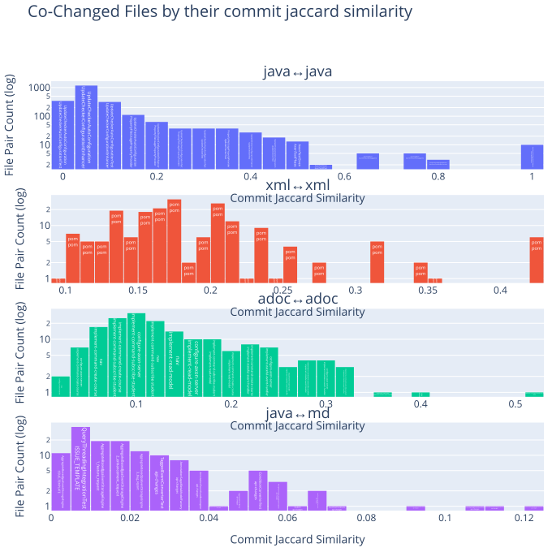
    

### Find pairwise changed files with many highly ranked metrics

Find those pairwise changed files that have a high rank in many metrics by calculating a combined (weighted) score based on the ranks of each metric.
This is useful to identify pairs of files that score high in most metrics, which indicates a strong co-change relationship.

<table border="1" class="dataframe">
  <thead>
    <tr style="text-align: right;">
      <th></th>
      <th>fileExtensionPair</th>
      <th>filePair</th>
      <th>combinedMetricsScore</th>
      <th>updateCommitCountExtensionRank</th>
      <th>updateCommitMinConfidenceExtensionRank</th>
      <th>updateCommitJaccardSimilarityExtensionRank</th>
      <th>updateCommitLiftExtensionRank</th>
      <th>updateCommitCount</th>
      <th>updateCommitMinConfidence</th>
      <th>updateCommitJaccardSimilarity</th>
      <th>updateCommitLift</th>
      <th>filePairWithRelativePath</th>
    </tr>
  </thead>
  <tbody>
    <tr>
      <th>0</th>
      <td>adoc↔adoc</td>
      <td>index↔project-structure</td>
      <td>14</td>
      <td>7</td>
      <td>3</td>
      <td>1</td>
      <td>3</td>
      <td>13</td>
      <td>0.722222</td>
      <td>0.520000</td>
      <td>82.188889</td>
      <td>docs/af5-getting-started/modules/ROOT/pages/index.adoc↔docs/af5-getting-started/modules/ROOT/pages/project-structure.adoc</td>
    </tr>
    <tr>
      <th>1</th>
      <td>adoc↔adoc</td>
      <td>retrying↔dead-letter-queue</td>
      <td>25</td>
      <td>15</td>
      <td>6</td>
      <td>3</td>
      <td>1</td>
      <td>5</td>
      <td>0.625000</td>
      <td>0.357143</td>
      <td>129.318182</td>
      <td>docs/dead-letter-queue-guide/modules/ROOT/pages/retrying.adoc↔docs/old-reference-guide/modules/events/pages/event-processors/dead-letter-queue.adoc</td>
    </tr>
    <tr>
      <th>2</th>
      <td>adoc↔adoc</td>
      <td>dead-letter-queue↔index</td>
      <td>27</td>
      <td>13</td>
      <td>5</td>
      <td>5</td>
      <td>4</td>
      <td>7</td>
      <td>0.636364</td>
      <td>0.318182</td>
      <td>80.464646</td>
      <td>docs/old-reference-guide/modules/events/pages/event-processors/dead-letter-queue.adoc↔docs/old-reference-guide/modules/monitoring/pages/index.adoc</td>
    </tr>
    <tr>
      <th>3</th>
      <td>adoc↔adoc</td>
      <td>major-releases↔index</td>
      <td>27</td>
      <td>3</td>
      <td>1</td>
      <td>2</td>
      <td>21</td>
      <td>18</td>
      <td>0.750000</td>
      <td>0.409091</td>
      <td>44.921053</td>
      <td>docs/old-reference-guide/modules/release-notes/pages/major-releases.adoc↔docs/old-reference-guide/modules/release-notes/pages/index.adoc</td>
    </tr>
    <tr>
      <th>4</th>
      <td>adoc↔adoc</td>
      <td>index↔dead-letter-queue</td>
      <td>31</td>
      <td>13</td>
      <td>5</td>
      <td>7</td>
      <td>6</td>
      <td>7</td>
      <td>0.636364</td>
      <td>0.304348</td>
      <td>76.229665</td>
      <td>docs/old-reference-guide/modules/ROOT/pages/index.adoc↔docs/old-reference-guide/modules/events/pages/event-processors/dead-letter-queue.adoc</td>
    </tr>
    <tr>
      <th>5</th>
      <td>adoc↔adoc</td>
      <td>configuration↔index</td>
      <td>35</td>
      <td>14</td>
      <td>13</td>
      <td>6</td>
      <td>2</td>
      <td>6</td>
      <td>0.500000</td>
      <td>0.315789</td>
      <td>87.538462</td>
      <td>docs/old-reference-guide/modules/queries/pages/configuration.adoc↔docs/old-reference-guide/modules/queries/pages/index.adoc</td>
    </tr>
    <tr>
      <th>6</th>
      <td>adoc↔adoc</td>
      <td>configuration↔implementations</td>
      <td>38</td>
      <td>12</td>
      <td>7</td>
      <td>10</td>
      <td>9</td>
      <td>8</td>
      <td>0.615385</td>
      <td>0.296296</td>
      <td>63.664336</td>
      <td>docs/old-reference-guide/modules/queries/pages/configuration.adoc↔docs/old-reference-guide/modules/queries/pages/implementations.adoc</td>
    </tr>
    <tr>
      <th>7</th>
      <td>adoc↔adoc</td>
      <td>nav↔index</td>
      <td>40</td>
      <td>9</td>
      <td>11</td>
      <td>4</td>
      <td>16</td>
      <td>11</td>
      <td>0.550000</td>
      <td>0.323529</td>
      <td>50.072000</td>
      <td>docs/af5-getting-started/modules/ROOT/nav.adoc↔docs/af5-getting-started/modules/ROOT/pages/index.adoc</td>
    </tr>
    <tr>
      <th>8</th>
      <td>adoc↔adoc</td>
      <td>retrying↔index</td>
      <td>45</td>
      <td>15</td>
      <td>6</td>
      <td>19</td>
      <td>5</td>
      <td>5</td>
      <td>0.625000</td>
      <td>0.238095</td>
      <td>79.027778</td>
      <td>docs/dead-letter-queue-guide/modules/ROOT/pages/retrying.adoc↔docs/old-reference-guide/modules/monitoring/pages/index.adoc</td>
    </tr>
    <tr>
      <th>9</th>
      <td>adoc↔adoc</td>
      <td>index↔nav</td>
      <td>45</td>
      <td>11</td>
      <td>14</td>
      <td>8</td>
      <td>12</td>
      <td>9</td>
      <td>0.473684</td>
      <td>0.300000</td>
      <td>53.905263</td>
      <td>docs/old-reference-guide/modules/tuning/pages/index.adoc↔docs/old-reference-guide/modules/tuning/partials/nav.adoc</td>
    </tr>
    <tr>
      <th>10</th>
      <td>java↔java</td>
      <td>Event↔Command</td>
      <td>54</td>
      <td>50</td>
      <td>1</td>
      <td>1</td>
      <td>2</td>
      <td>4</td>
      <td>1.000000</td>
      <td>1.000000</td>
      <td>569.000000</td>
      <td>messaging/src/main/java/org/axonframework/messaging/eventhandling/annotation/Event.java↔messaging/src/main/java/org/axonframework/messaging/commandhandling/annotation/Command.java</td>
    </tr>
    <tr>
      <th>11</th>
      <td>java↔java</td>
      <td>Event↔Query</td>
      <td>54</td>
      <td>50</td>
      <td>1</td>
      <td>1</td>
      <td>2</td>
      <td>4</td>
      <td>1.000000</td>
      <td>1.000000</td>
      <td>569.000000</td>
      <td>messaging/src/main/java/org/axonframework/messaging/eventhandling/annotation/Event.java↔messaging/src/main/java/org/axonframework/messaging/queryhandling/annotation/Query.java</td>
    </tr>
    <tr>
      <th>12</th>
      <td>java↔java</td>
      <td>Command↔Query</td>
      <td>54</td>
      <td>50</td>
      <td>1</td>
      <td>1</td>
      <td>2</td>
      <td>4</td>
      <td>1.000000</td>
      <td>1.000000</td>
      <td>569.000000</td>
      <td>messaging/src/main/java/org/axonframework/messaging/commandhandling/annotation/Command.java↔messaging/src/main/java/org/axonframework/messaging/queryhandling/annotation/Query.java</td>
    </tr>
    <tr>
      <th>13</th>
      <td>java↔java</td>
      <td>Event↔QueryResponse</td>
      <td>54</td>
      <td>50</td>
      <td>1</td>
      <td>1</td>
      <td>2</td>
      <td>4</td>
      <td>1.000000</td>
      <td>1.000000</td>
      <td>569.000000</td>
      <td>messaging/src/main/java/org/axonframework/messaging/eventhandling/annotation/Event.java↔messaging/src/main/java/org/axonframework/messaging/queryhandling/annotation/QueryResponse.java</td>
    </tr>
    <tr>
      <th>14</th>
      <td>java↔java</td>
      <td>Command↔QueryResponse</td>
      <td>54</td>
      <td>50</td>
      <td>1</td>
      <td>1</td>
      <td>2</td>
      <td>4</td>
      <td>1.000000</td>
      <td>1.000000</td>
      <td>569.000000</td>
      <td>messaging/src/main/java/org/axonframework/messaging/commandhandling/annotation/Command.java↔messaging/src/main/java/org/axonframework/messaging/queryhandling/annotation/QueryResponse.java</td>
    </tr>
    <tr>
      <th>15</th>
      <td>java↔java</td>
      <td>Query↔QueryResponse</td>
      <td>54</td>
      <td>50</td>
      <td>1</td>
      <td>1</td>
      <td>2</td>
      <td>4</td>
      <td>1.000000</td>
      <td>1.000000</td>
      <td>569.000000</td>
      <td>messaging/src/main/java/org/axonframework/messaging/queryhandling/annotation/Query.java↔messaging/src/main/java/org/axonframework/messaging/queryhandling/annotation/QueryResponse.java</td>
    </tr>
    <tr>
      <th>16</th>
      <td>java↔java</td>
      <td>FieldChildEntityFieldDefinition↔GetterEvolverChildEntityFieldDefinition</td>
      <td>54</td>
      <td>46</td>
      <td>1</td>
      <td>1</td>
      <td>6</td>
      <td>8</td>
      <td>1.000000</td>
      <td>1.000000</td>
      <td>284.500000</td>
      <td>modelling/src/main/java/org/axonframework/modelling/entity/child/FieldChildEntityFieldDefinition.java↔modelling/src/main/java/org/axonframework/modelling/entity/child/GetterEvolverChildEntityFieldDefinition.java</td>
    </tr>
    <tr>
      <th>17</th>
      <td>java↔java</td>
      <td>FieldChildEntityFieldDefinitionTest↔GetterEvolverChildEntityFieldDefinitionTest</td>
      <td>54</td>
      <td>51</td>
      <td>1</td>
      <td>1</td>
      <td>1</td>
      <td>3</td>
      <td>1.000000</td>
      <td>1.000000</td>
      <td>758.666667</td>
      <td>modelling/src/test/java/org/axonframework/modelling/entity/child/FieldChildEntityFieldDefinitionTest.java↔modelling/src/test/java/org/axonframework/modelling/entity/child/GetterEvolverChildEntityFieldDefinitionTest.java</td>
    </tr>
    <tr>
      <th>18</th>
      <td>java↔java</td>
      <td>GetterEvolverChildEntityFieldDefinitionTest↔GetterSetterChildEntityFieldDefinitionTest</td>
      <td>54</td>
      <td>51</td>
      <td>1</td>
      <td>1</td>
      <td>1</td>
      <td>3</td>
      <td>1.000000</td>
      <td>1.000000</td>
      <td>758.666667</td>
      <td>modelling/src/test/java/org/axonframework/modelling/entity/child/GetterEvolverChildEntityFieldDefinitionTest.java↔modelling/src/test/java/org/axonframework/modelling/entity/child/GetterSetterChildEntityFieldDefinitionTest.java</td>
    </tr>
    <tr>
      <th>19</th>
      <td>java↔java</td>
      <td>FieldChildEntityFieldDefinitionTest↔GetterSetterChildEntityFieldDefinitionTest</td>
      <td>54</td>
      <td>51</td>
      <td>1</td>
      <td>1</td>
      <td>1</td>
      <td>3</td>
      <td>1.000000</td>
      <td>1.000000</td>
      <td>758.666667</td>
      <td>modelling/src/test/java/org/axonframework/modelling/entity/child/FieldChildEntityFieldDefinitionTest.java↔modelling/src/test/java/org/axonframework/modelling/entity/child/GetterSetterChildEntityFieldDefinitionTest.java</td>
    </tr>
    <tr>
      <th>20</th>
      <td>java↔md</td>
      <td>AggregateBasedAxonServerEventStorageEngine↔api-changes</td>
      <td>27</td>
      <td>1</td>
      <td>6</td>
      <td>1</td>
      <td>19</td>
      <td>84</td>
      <td>0.451613</td>
      <td>0.120690</td>
      <td>1.730423</td>
      <td>axon-server-connector/src/main/java/org/axonframework/axonserver/connector/event/AggregateBasedAxonServerEventStorageEngine.java↔axon-5/api-changes.md</td>
    </tr>
    <tr>
      <th>21</th>
      <td>java↔md</td>
      <td>AggregateBasedJpaEventStorageEngine↔api-changes</td>
      <td>36</td>
      <td>2</td>
      <td>9</td>
      <td>3</td>
      <td>22</td>
      <td>76</td>
      <td>0.378109</td>
      <td>0.105702</td>
      <td>1.448783</td>
      <td>eventsourcing/src/main/java/org/axonframework/eventsourcing/eventstore/jpa/AggregateBasedJpaEventStorageEngine.java↔axon-5/api-changes.md</td>
    </tr>
    <tr>
      <th>22</th>
      <td>java↔md</td>
      <td>AggregateBasedStorageEngineTestSuite↔api-changes</td>
      <td>43</td>
      <td>1</td>
      <td>14</td>
      <td>2</td>
      <td>26</td>
      <td>84</td>
      <td>0.358974</td>
      <td>0.112903</td>
      <td>1.375464</td>
      <td>eventsourcing/src/test/java/org/axonframework/eventsourcing/eventstore/AggregateBasedStorageEngineTestSuite.java↔axon-5/api-changes.md</td>
    </tr>
    <tr>
      <th>23</th>
      <td>java↔md</td>
      <td>CommandConverter↔modularity</td>
      <td>53</td>
      <td>33</td>
      <td>3</td>
      <td>16</td>
      <td>1</td>
      <td>3</td>
      <td>0.600000</td>
      <td>0.050000</td>
      <td>23.544828</td>
      <td>axon-server-connector/src/main/java/org/axonframework/axonserver/connector/command/CommandConverter.java↔axon-5/modularity.md</td>
    </tr>
    <tr>
      <th>24</th>
      <td>java↔md</td>
      <td>QueryThreadingIntegrationTest↔README</td>
      <td>55</td>
      <td>27</td>
      <td>13</td>
      <td>10</td>
      <td>5</td>
      <td>9</td>
      <td>0.360000</td>
      <td>0.058442</td>
      <td>5.937391</td>
      <td>integrationtests/src/test/java/org/axonframework/integrationtests/queryhandling/QueryThreadingIntegrationTest.java↔docs/README.md</td>
    </tr>
    <tr>
      <th>25</th>
      <td>java↔md</td>
      <td>QueryThreadingIntegrationTest↔api-changes</td>
      <td>61</td>
      <td>6</td>
      <td>18</td>
      <td>7</td>
      <td>30</td>
      <td>46</td>
      <td>0.333333</td>
      <td>0.067055</td>
      <td>1.277217</td>
      <td>integrationtests/src/test/java/org/axonframework/integrationtests/queryhandling/QueryThreadingIntegrationTest.java↔axon-5/api-changes.md</td>
    </tr>
    <tr>
      <th>26</th>
      <td>java↔md</td>
      <td>SimpleEventStoreTest↔api-changes</td>
      <td>61</td>
      <td>4</td>
      <td>20</td>
      <td>5</td>
      <td>32</td>
      <td>53</td>
      <td>0.315476</td>
      <td>0.074753</td>
      <td>1.208794</td>
      <td>eventsourcing/src/test/java/org/axonframework/eventsourcing/eventstore/SimpleEventStoreTest.java↔axon-5/api-changes.md</td>
    </tr>
    <tr>
      <th>27</th>
      <td>java↔md</td>
      <td>AxonServerEventStorageEngine↔api-changes</td>
      <td>68</td>
      <td>9</td>
      <td>16</td>
      <td>15</td>
      <td>28</td>
      <td>34</td>
      <td>0.350515</td>
      <td>0.051750</td>
      <td>1.343053</td>
      <td>axon-server-connector/src/main/java/org/axonframework/axonserver/connector/event/AxonServerEventStorageEngine.java↔axon-5/api-changes.md</td>
    </tr>
    <tr>
      <th>28</th>
      <td>java↔md</td>
      <td>StorageEngineTestSuite↔api-changes</td>
      <td>68</td>
      <td>3</td>
      <td>24</td>
      <td>4</td>
      <td>37</td>
      <td>68</td>
      <td>0.299559</td>
      <td>0.090305</td>
      <td>1.147807</td>
      <td>eventsourcing/src/test/java/org/axonframework/eventsourcing/eventstore/StorageEngineTestSuite.java↔axon-5/api-changes.md</td>
    </tr>
    <tr>
      <th>29</th>
      <td>java↔md</td>
      <td>DefaultEventStoreTransactionTest↔api-changes</td>
      <td>74</td>
      <td>5</td>
      <td>25</td>
      <td>6</td>
      <td>38</td>
      <td>49</td>
      <td>0.296970</td>
      <td>0.069014</td>
      <td>1.137884</td>
      <td>eventsourcing/src/test/java/org/axonframework/eventsourcing/eventstore/DefaultEventStoreTransactionTest.java↔axon-5/api-changes.md</td>
    </tr>
    <tr>
      <th>30</th>
      <td>xml↔xml</td>
      <td>pom↔pom</td>
      <td>12</td>
      <td>9</td>
      <td>1</td>
      <td>1</td>
      <td>1</td>
      <td>6</td>
      <td>0.600000</td>
      <td>0.428571</td>
      <td>136.560000</td>
      <td>stash/legacy-aggregate/pom.xml↔stash/legacy-saga/pom.xml</td>
    </tr>
    <tr>
      <th>31</th>
      <td>xml↔xml</td>
      <td>pom↔pom</td>
      <td>12</td>
      <td>9</td>
      <td>1</td>
      <td>1</td>
      <td>1</td>
      <td>6</td>
      <td>0.600000</td>
      <td>0.428571</td>
      <td>136.560000</td>
      <td>stash/legacy-saga/pom.xml↔stash/legacy/pom.xml</td>
    </tr>
    <tr>
      <th>32</th>
      <td>xml↔xml</td>
      <td>pom↔pom</td>
      <td>12</td>
      <td>9</td>
      <td>1</td>
      <td>1</td>
      <td>1</td>
      <td>6</td>
      <td>0.600000</td>
      <td>0.428571</td>
      <td>136.560000</td>
      <td>stash/legacy-aggregate/pom.xml↔stash/legacy/pom.xml</td>
    </tr>
    <tr>
      <th>33</th>
      <td>xml↔xml</td>
      <td>pom↔pom</td>
      <td>12</td>
      <td>9</td>
      <td>1</td>
      <td>1</td>
      <td>1</td>
      <td>6</td>
      <td>0.600000</td>
      <td>0.428571</td>
      <td>136.560000</td>
      <td>stash/legacy-saga/pom.xml↔stash/todo/pom.xml</td>
    </tr>
    <tr>
      <th>34</th>
      <td>xml↔xml</td>
      <td>pom↔pom</td>
      <td>12</td>
      <td>9</td>
      <td>1</td>
      <td>1</td>
      <td>1</td>
      <td>6</td>
      <td>0.600000</td>
      <td>0.428571</td>
      <td>136.560000</td>
      <td>stash/legacy/pom.xml↔stash/todo/pom.xml</td>
    </tr>
    <tr>
      <th>35</th>
      <td>xml↔xml</td>
      <td>pom↔pom</td>
      <td>12</td>
      <td>9</td>
      <td>1</td>
      <td>1</td>
      <td>1</td>
      <td>6</td>
      <td>0.600000</td>
      <td>0.428571</td>
      <td>136.560000</td>
      <td>stash/legacy-aggregate/pom.xml↔stash/todo/pom.xml</td>
    </tr>
    <tr>
      <th>36</th>
      <td>xml↔xml</td>
      <td>pom↔pom</td>
      <td>15</td>
      <td>2</td>
      <td>3</td>
      <td>2</td>
      <td>8</td>
      <td>13</td>
      <td>0.520000</td>
      <td>0.351351</td>
      <td>47.340800</td>
      <td>conversion/pom.xml↔update/pom.xml</td>
    </tr>
    <tr>
      <th>37</th>
      <td>xml↔xml</td>
      <td>pom↔pom</td>
      <td>17</td>
      <td>2</td>
      <td>3</td>
      <td>3</td>
      <td>9</td>
      <td>13</td>
      <td>0.520000</td>
      <td>0.342105</td>
      <td>45.520000</td>
      <td>common/pom.xml↔conversion/pom.xml</td>
    </tr>
    <tr>
      <th>38</th>
      <td>xml↔xml</td>
      <td>pom↔pom</td>
      <td>17</td>
      <td>2</td>
      <td>3</td>
      <td>3</td>
      <td>9</td>
      <td>13</td>
      <td>0.520000</td>
      <td>0.342105</td>
      <td>45.520000</td>
      <td>common/pom.xml↔update/pom.xml</td>
    </tr>
    <tr>
      <th>39</th>
      <td>xml↔xml</td>
      <td>pom↔pom</td>
      <td>21</td>
      <td>10</td>
      <td>4</td>
      <td>5</td>
      <td>2</td>
      <td>5</td>
      <td>0.500000</td>
      <td>0.312500</td>
      <td>103.454545</td>
      <td>axon-framework-bom/pom.xml↔stash/legacy-aggregate/pom.xml</td>
    </tr>
  </tbody>
</table>

### Pairwise changed files with pareto-optimal metrics

A pair (count, confidence, jaccard, lift) is Pareto-optimal if there is no other pair that is better or equal in all metrics and strictly better in at least one. In other words, it is not "dominated" by any other pair.

The frontier = the “best tradeoffs.”

#### Pairwise changed files with pareto-optimal metrics - not considering file extensions

<table border="1" class="dataframe">
  <thead>
    <tr style="text-align: right;">
      <th></th>
      <th>filePair</th>
      <th>combinedMetricsScore</th>
      <th>updateCommitCount</th>
      <th>updateCommitMinConfidence</th>
      <th>updateCommitJaccardSimilarity</th>
      <th>updateCommitLift</th>
      <th>updateCommitCountExtensionRank</th>
      <th>updateCommitMinConfidenceExtensionRank</th>
      <th>updateCommitJaccardSimilarityExtensionRank</th>
      <th>updateCommitLiftExtensionRank</th>
      <th>filePairWithRelativePath</th>
    </tr>
  </thead>
  <tbody>
    <tr>
      <th>0</th>
      <td>index↔project-structure</td>
      <td>14</td>
      <td>13</td>
      <td>0.722222</td>
      <td>0.520000</td>
      <td>82.188889</td>
      <td>7</td>
      <td>3</td>
      <td>1</td>
      <td>3</td>
      <td>docs/af5-getting-started/modules/ROOT/pages/index.adoc↔docs/af5-getting-started/modules/ROOT/pages/project-structure.adoc</td>
    </tr>
    <tr>
      <th>1</th>
      <td>query-dispatchers↔query-handlers</td>
      <td>79</td>
      <td>19</td>
      <td>0.500000</td>
      <td>0.296875</td>
      <td>25.288889</td>
      <td>2</td>
      <td>13</td>
      <td>9</td>
      <td>55</td>
      <td>docs/old-reference-guide/modules/queries/pages/query-dispatchers.adoc↔docs/old-reference-guide/modules/queries/pages/query-handlers.adoc</td>
    </tr>
    <tr>
      <th>2</th>
      <td>AggregateBasedAxonServerEventStorageEngine↔AggregateBasedJpaEventStorageEngine</td>
      <td>576</td>
      <td>105</td>
      <td>0.564516</td>
      <td>0.372340</td>
      <td>6.392232</td>
      <td>2</td>
      <td>20</td>
      <td>20</td>
      <td>534</td>
      <td>axon-server-connector/src/main/java/org/axonframework/axonserver/connector/event/AggregateBasedAxonServerEventStorageEngine.java↔eventsourcing/src/main/java/org/axonframework/eventsourcing/eventstore/jpa/AggregateBasedJpaEventStorageEngine.java</td>
    </tr>
    <tr>
      <th>3</th>
      <td>EventSourcingConfigurationDefaults↔EventSourcingConfigurationDefaultsTest</td>
      <td>646</td>
      <td>52</td>
      <td>0.440678</td>
      <td>0.238532</td>
      <td>6.598573</td>
      <td>11</td>
      <td>51</td>
      <td>55</td>
      <td>529</td>
      <td>eventsourcing/src/main/java/org/axonframework/eventsourcing/configuration/EventSourcingConfigurationDefaults.java↔eventsourcing/src/test/java/org/axonframework/eventsourcing/configuration/EventSourcingConfigurationDefaultsTest.java</td>
    </tr>
    <tr>
      <th>4</th>
      <td>NoAppendCondition↔NoAppendConditionTest</td>
      <td>183</td>
      <td>37</td>
      <td>0.627119</td>
      <td>0.435294</td>
      <td>22.655905</td>
      <td>19</td>
      <td>13</td>
      <td>14</td>
      <td>137</td>
      <td>eventsourcing/src/main/java/org/axonframework/eventsourcing/eventstore/NoAppendCondition.java↔eventsourcing/src/test/java/org/axonframework/eventsourcing/eventstore/NoAppendConditionTest.java</td>
    </tr>
    <tr>
      <th>5</th>
      <td>DefaultAppendConditionTest↔NoAppendConditionTest</td>
      <td>163</td>
      <td>35</td>
      <td>0.648148</td>
      <td>0.448718</td>
      <td>25.003139</td>
      <td>20</td>
      <td>10</td>
      <td>12</td>
      <td>121</td>
      <td>eventsourcing/src/test/java/org/axonframework/eventsourcing/eventstore/DefaultAppendConditionTest.java↔eventsourcing/src/test/java/org/axonframework/eventsourcing/eventstore/NoAppendConditionTest.java</td>
    </tr>
    <tr>
      <th>6</th>
      <td>DefaultSourcingConditionTest↔SourcingConditionTest</td>
      <td>176</td>
      <td>42</td>
      <td>0.646154</td>
      <td>0.471910</td>
      <td>22.282517</td>
      <td>14</td>
      <td>11</td>
      <td>9</td>
      <td>142</td>
      <td>eventsourcing/src/test/java/org/axonframework/eventsourcing/eventstore/DefaultSourcingConditionTest.java↔eventsourcing/src/test/java/org/axonframework/eventsourcing/eventstore/SourcingConditionTest.java</td>
    </tr>
    <tr>
      <th>7</th>
      <td>AggregateBasedStorageEngineTestSuite↔StorageEngineTestSuite</td>
      <td>739</td>
      <td>109</td>
      <td>0.480176</td>
      <td>0.309659</td>
      <td>4.670432</td>
      <td>1</td>
      <td>34</td>
      <td>32</td>
      <td>672</td>
      <td>eventsourcing/src/test/java/org/axonframework/eventsourcing/eventstore/AggregateBasedStorageEngineTestSuite.java↔eventsourcing/src/test/java/org/axonframework/eventsourcing/eventstore/StorageEngineTestSuite.java</td>
    </tr>
    <tr>
      <th>8</th>
      <td>Event↔Command</td>
      <td>54</td>
      <td>4</td>
      <td>1.000000</td>
      <td>1.000000</td>
      <td>569.000000</td>
      <td>50</td>
      <td>1</td>
      <td>1</td>
      <td>2</td>
      <td>messaging/src/main/java/org/axonframework/messaging/eventhandling/annotation/Event.java↔messaging/src/main/java/org/axonframework/messaging/commandhandling/annotation/Command.java</td>
    </tr>
    <tr>
      <th>9</th>
      <td>Event↔Query</td>
      <td>54</td>
      <td>4</td>
      <td>1.000000</td>
      <td>1.000000</td>
      <td>569.000000</td>
      <td>50</td>
      <td>1</td>
      <td>1</td>
      <td>2</td>
      <td>messaging/src/main/java/org/axonframework/messaging/eventhandling/annotation/Event.java↔messaging/src/main/java/org/axonframework/messaging/queryhandling/annotation/Query.java</td>
    </tr>
    <tr>
      <th>10</th>
      <td>Command↔Query</td>
      <td>54</td>
      <td>4</td>
      <td>1.000000</td>
      <td>1.000000</td>
      <td>569.000000</td>
      <td>50</td>
      <td>1</td>
      <td>1</td>
      <td>2</td>
      <td>messaging/src/main/java/org/axonframework/messaging/commandhandling/annotation/Command.java↔messaging/src/main/java/org/axonframework/messaging/queryhandling/annotation/Query.java</td>
    </tr>
    <tr>
      <th>11</th>
      <td>Event↔QueryResponse</td>
      <td>54</td>
      <td>4</td>
      <td>1.000000</td>
      <td>1.000000</td>
      <td>569.000000</td>
      <td>50</td>
      <td>1</td>
      <td>1</td>
      <td>2</td>
      <td>messaging/src/main/java/org/axonframework/messaging/eventhandling/annotation/Event.java↔messaging/src/main/java/org/axonframework/messaging/queryhandling/annotation/QueryResponse.java</td>
    </tr>
    <tr>
      <th>12</th>
      <td>Command↔QueryResponse</td>
      <td>54</td>
      <td>4</td>
      <td>1.000000</td>
      <td>1.000000</td>
      <td>569.000000</td>
      <td>50</td>
      <td>1</td>
      <td>1</td>
      <td>2</td>
      <td>messaging/src/main/java/org/axonframework/messaging/commandhandling/annotation/Command.java↔messaging/src/main/java/org/axonframework/messaging/queryhandling/annotation/QueryResponse.java</td>
    </tr>
    <tr>
      <th>13</th>
      <td>Query↔QueryResponse</td>
      <td>54</td>
      <td>4</td>
      <td>1.000000</td>
      <td>1.000000</td>
      <td>569.000000</td>
      <td>50</td>
      <td>1</td>
      <td>1</td>
      <td>2</td>
      <td>messaging/src/main/java/org/axonframework/messaging/queryhandling/annotation/Query.java↔messaging/src/main/java/org/axonframework/messaging/queryhandling/annotation/QueryResponse.java</td>
    </tr>
    <tr>
      <th>14</th>
      <td>FieldChildEntityFieldDefinition↔GetterEvolverChildEntityFieldDefinition</td>
      <td>54</td>
      <td>8</td>
      <td>1.000000</td>
      <td>1.000000</td>
      <td>284.500000</td>
      <td>46</td>
      <td>1</td>
      <td>1</td>
      <td>6</td>
      <td>modelling/src/main/java/org/axonframework/modelling/entity/child/FieldChildEntityFieldDefinition.java↔modelling/src/main/java/org/axonframework/modelling/entity/child/GetterEvolverChildEntityFieldDefinition.java</td>
    </tr>
    <tr>
      <th>15</th>
      <td>ChildEntityFieldDefinition↔GetterSetterChildEntityFieldDefinition</td>
      <td>64</td>
      <td>9</td>
      <td>0.900000</td>
      <td>0.818182</td>
      <td>204.840000</td>
      <td>45</td>
      <td>2</td>
      <td>2</td>
      <td>15</td>
      <td>modelling/src/main/java/org/axonframework/modelling/entity/child/ChildEntityFieldDefinition.java↔modelling/src/main/java/org/axonframework/modelling/entity/child/GetterSetterChildEntityFieldDefinition.java</td>
    </tr>
    <tr>
      <th>16</th>
      <td>FieldChildEntityFieldDefinitionTest↔GetterEvolverChildEntityFieldDefinitionTest</td>
      <td>54</td>
      <td>3</td>
      <td>1.000000</td>
      <td>1.000000</td>
      <td>758.666667</td>
      <td>51</td>
      <td>1</td>
      <td>1</td>
      <td>1</td>
      <td>modelling/src/test/java/org/axonframework/modelling/entity/child/FieldChildEntityFieldDefinitionTest.java↔modelling/src/test/java/org/axonframework/modelling/entity/child/GetterEvolverChildEntityFieldDefinitionTest.java</td>
    </tr>
    <tr>
      <th>17</th>
      <td>GetterEvolverChildEntityFieldDefinitionTest↔GetterSetterChildEntityFieldDefinitionTest</td>
      <td>54</td>
      <td>3</td>
      <td>1.000000</td>
      <td>1.000000</td>
      <td>758.666667</td>
      <td>51</td>
      <td>1</td>
      <td>1</td>
      <td>1</td>
      <td>modelling/src/test/java/org/axonframework/modelling/entity/child/GetterEvolverChildEntityFieldDefinitionTest.java↔modelling/src/test/java/org/axonframework/modelling/entity/child/GetterSetterChildEntityFieldDefinitionTest.java</td>
    </tr>
    <tr>
      <th>18</th>
      <td>FieldChildEntityFieldDefinitionTest↔GetterSetterChildEntityFieldDefinitionTest</td>
      <td>54</td>
      <td>3</td>
      <td>1.000000</td>
      <td>1.000000</td>
      <td>758.666667</td>
      <td>51</td>
      <td>1</td>
      <td>1</td>
      <td>1</td>
      <td>modelling/src/test/java/org/axonframework/modelling/entity/child/FieldChildEntityFieldDefinitionTest.java↔modelling/src/test/java/org/axonframework/modelling/entity/child/GetterSetterChildEntityFieldDefinitionTest.java</td>
    </tr>
    <tr>
      <th>19</th>
      <td>major-releases↔index</td>
      <td>27</td>
      <td>18</td>
      <td>0.750000</td>
      <td>0.409091</td>
      <td>44.921053</td>
      <td>3</td>
      <td>1</td>
      <td>2</td>
      <td>21</td>
      <td>docs/old-reference-guide/modules/release-notes/pages/major-releases.adoc↔docs/old-reference-guide/modules/release-notes/pages/index.adoc</td>
    </tr>
  </tbody>
</table>

#### Pairwise changed files with pareto-optimal metrics - using ranks grouped by file extensions

<table border="1" class="dataframe">
  <thead>
    <tr style="text-align: right;">
      <th></th>
      <th>fileExtensionPair</th>
      <th>filePair</th>
      <th>combinedMetricsScore</th>
      <th>updateCommitCount</th>
      <th>updateCommitMinConfidence</th>
      <th>updateCommitJaccardSimilarity</th>
      <th>updateCommitLift</th>
      <th>updateCommitCountExtensionRank</th>
      <th>updateCommitMinConfidenceExtensionRank</th>
      <th>updateCommitJaccardSimilarityExtensionRank</th>
      <th>updateCommitLiftExtensionRank</th>
      <th>filePairWithRelativePath</th>
    </tr>
  </thead>
  <tbody>
    <tr>
      <th>0</th>
      <td>java↔java</td>
      <td>AggregateBasedJpaEventStorageEngine↔EventSourcingConfigurationDefaultsTest</td>
      <td>3035</td>
      <td>3</td>
      <td>0.025424</td>
      <td>0.009494</td>
      <td>0.287883</td>
      <td>51</td>
      <td>439</td>
      <td>977</td>
      <td>1568</td>
      <td>eventsourcing/src/main/java/org/axonframework/eventsourcing/eventstore/jpa/AggregateBasedJpaEventStorageEngine.java↔eventsourcing/src/test/java/org/axonframework/eventsourcing/configuration/EventSourcingConfigurationDefaultsTest.java</td>
    </tr>
  </tbody>
</table>

## WordCloud of git authors

<table border="1" class="dataframe">
  <thead>
    <tr style="text-align: right;">
      <th></th>
      <th>word</th>
      <th>frequency</th>
    </tr>
  </thead>
  <tbody>
    <tr>
      <th>0</th>
      <td>Steven van Beelen</td>
      <td>6138</td>
    </tr>
    <tr>
      <th>1</th>
      <td>Allard Buijze</td>
      <td>2917</td>
    </tr>
    <tr>
      <th>2</th>
      <td>smcvb</td>
      <td>822</td>
    </tr>
    <tr>
      <th>3</th>
      <td>Mitchell Herrijgers</td>
      <td>740</td>
    </tr>
    <tr>
      <th>4</th>
      <td>Mateusz Nowak</td>
      <td>575</td>
    </tr>
    <tr>
      <th>5</th>
      <td>Milan Savic</td>
      <td>449</td>
    </tr>
    <tr>
      <th>6</th>
      <td>Gerard Klijs</td>
      <td>246</td>
    </tr>
    <tr>
      <th>7</th>
      <td>Marc Gathier</td>
      <td>231</td>
    </tr>
    <tr>
      <th>8</th>
      <td>Simon Zambrovski</td>
      <td>225</td>
    </tr>
    <tr>
      <th>9</th>
      <td>sara pellegrini</td>
      <td>163</td>
    </tr>
  </tbody>
</table>

    

    

