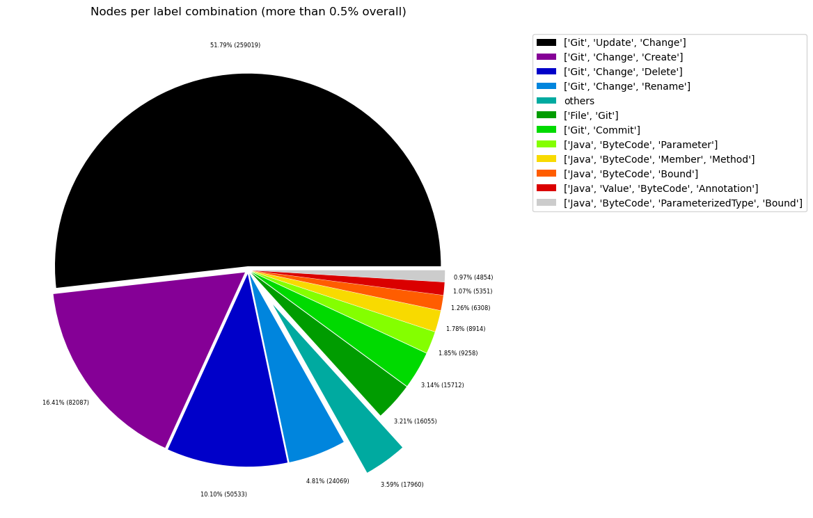
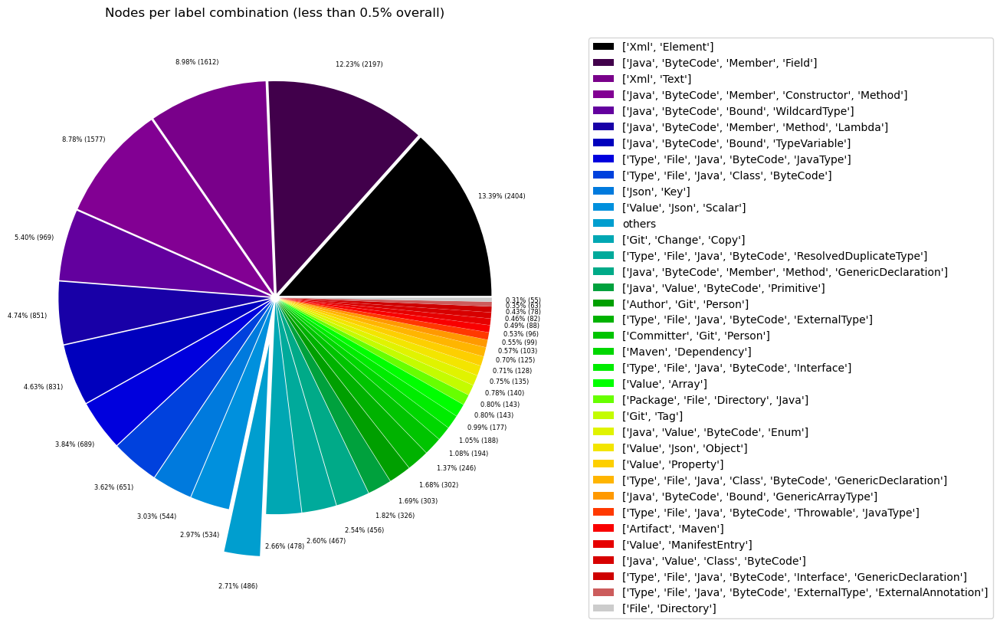
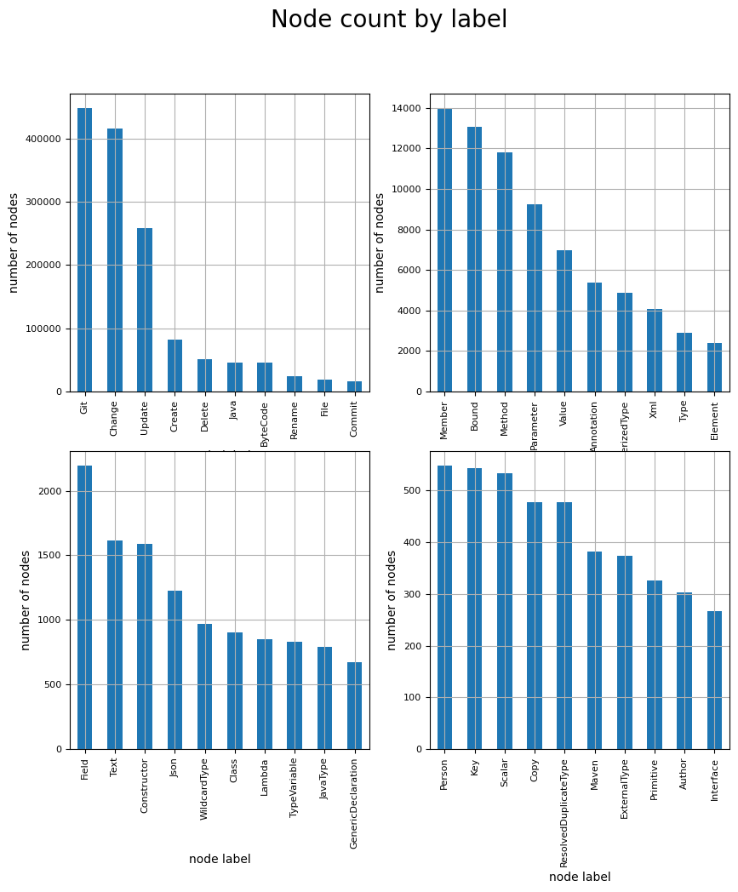
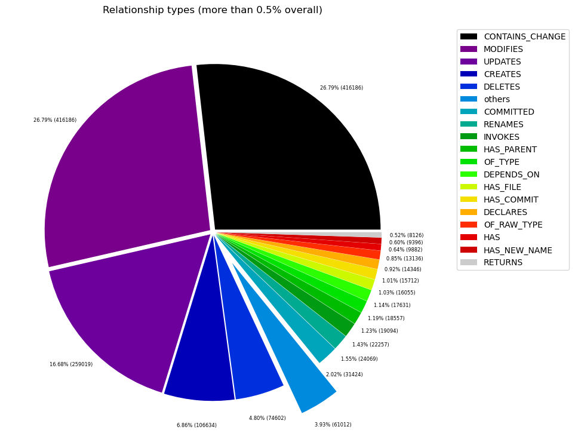
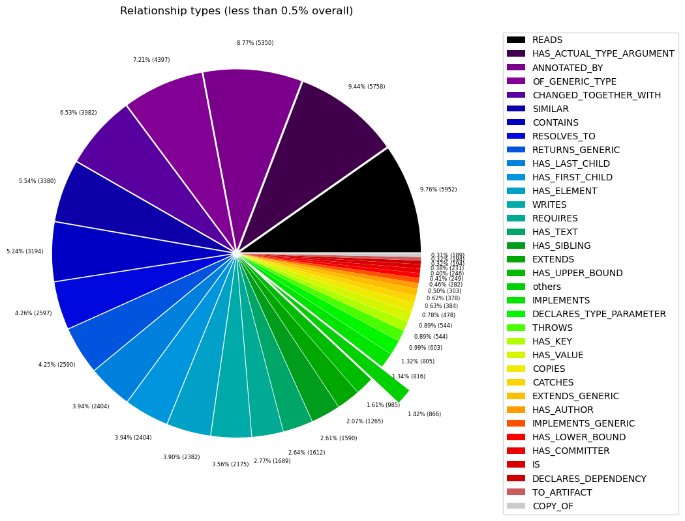

# Overview in General
   

This file contains a general overview of the data in the graph including node labels and relationships types.

### References
- [jqassistant](https://jqassistant.org)
- [Neo4j Python Driver](https://neo4j.com/docs/api/python-driver/current)

## Node Labels

### Table 1a - Highest node count by label combination

Lists the 30 label combinations with the highest number of nodes. The labels with the lowest node count are listed in table 1b.
The total list would sum up to the total number of labels (100%).

The whole table can be found in the CSV report `Node_label_combination_count`.

<table border="1" class="dataframe">
  <thead>
    <tr style="text-align: right;">
      <th></th>
      <th>nodeLabels</th>
      <th>nodesWithThatLabels</th>
      <th>nodesWithThatLabelsPercent</th>
    </tr>
  </thead>
  <tbody>
    <tr>
      <th>0</th>
      <td>[Git, Update, Change]</td>
      <td>259019</td>
      <td>51.791370</td>
    </tr>
    <tr>
      <th>1</th>
      <td>[Git, Change, Create]</td>
      <td>82087</td>
      <td>16.413461</td>
    </tr>
    <tr>
      <th>2</th>
      <td>[Git, Change, Delete]</td>
      <td>50533</td>
      <td>10.104175</td>
    </tr>
    <tr>
      <th>3</th>
      <td>[Git, Change, Rename]</td>
      <td>24069</td>
      <td>4.812645</td>
    </tr>
    <tr>
      <th>4</th>
      <td>[File, Git]</td>
      <td>16055</td>
      <td>3.210230</td>
    </tr>
    <tr>
      <th>5</th>
      <td>[Git, Commit]</td>
      <td>15712</td>
      <td>3.141646</td>
    </tr>
    <tr>
      <th>6</th>
      <td>[Java, ByteCode, Parameter]</td>
      <td>9258</td>
      <td>1.851156</td>
    </tr>
    <tr>
      <th>7</th>
      <td>[Java, ByteCode, Member, Method]</td>
      <td>8914</td>
      <td>1.782372</td>
    </tr>
    <tr>
      <th>8</th>
      <td>[Java, ByteCode, Bound]</td>
      <td>6308</td>
      <td>1.261297</td>
    </tr>
    <tr>
      <th>9</th>
      <td>[Java, Value, ByteCode, Annotation]</td>
      <td>5351</td>
      <td>1.069943</td>
    </tr>
    <tr>
      <th>10</th>
      <td>[Java, ByteCode, ParameterizedType, Bound]</td>
      <td>4854</td>
      <td>0.970567</td>
    </tr>
    <tr>
      <th>11</th>
      <td>[Xml, Element]</td>
      <td>2404</td>
      <td>0.480685</td>
    </tr>
    <tr>
      <th>12</th>
      <td>[Java, ByteCode, Member, Field]</td>
      <td>2197</td>
      <td>0.439295</td>
    </tr>
    <tr>
      <th>13</th>
      <td>[Xml, Text]</td>
      <td>1612</td>
      <td>0.322323</td>
    </tr>
    <tr>
      <th>14</th>
      <td>[Java, ByteCode, Member, Constructor, Method]</td>
      <td>1577</td>
      <td>0.315324</td>
    </tr>
    <tr>
      <th>15</th>
      <td>[Java, ByteCode, Bound, WildcardType]</td>
      <td>969</td>
      <td>0.193753</td>
    </tr>
    <tr>
      <th>16</th>
      <td>[Java, ByteCode, Member, Method, Lambda]</td>
      <td>851</td>
      <td>0.170159</td>
    </tr>
    <tr>
      <th>17</th>
      <td>[Java, ByteCode, Bound, TypeVariable]</td>
      <td>831</td>
      <td>0.166160</td>
    </tr>
    <tr>
      <th>18</th>
      <td>[Type, File, Java, ByteCode, JavaType]</td>
      <td>689</td>
      <td>0.137767</td>
    </tr>
    <tr>
      <th>19</th>
      <td>[Type, File, Java, Class, ByteCode]</td>
      <td>651</td>
      <td>0.130169</td>
    </tr>
    <tr>
      <th>20</th>
      <td>[Json, Key]</td>
      <td>544</td>
      <td>0.108774</td>
    </tr>
    <tr>
      <th>21</th>
      <td>[Value, Json, Scalar]</td>
      <td>534</td>
      <td>0.106774</td>
    </tr>
    <tr>
      <th>22</th>
      <td>[Git, Change, Copy]</td>
      <td>478</td>
      <td>0.095577</td>
    </tr>
    <tr>
      <th>23</th>
      <td>[Type, File, Java, ByteCode, ResolvedDuplicate...</td>
      <td>467</td>
      <td>0.093378</td>
    </tr>
    <tr>
      <th>24</th>
      <td>[Java, ByteCode, Member, Method, GenericDeclar...</td>
      <td>456</td>
      <td>0.091178</td>
    </tr>
    <tr>
      <th>25</th>
      <td>[Java, Value, ByteCode, Primitive]</td>
      <td>326</td>
      <td>0.065184</td>
    </tr>
    <tr>
      <th>26</th>
      <td>[Author, Git, Person]</td>
      <td>303</td>
      <td>0.060585</td>
    </tr>
    <tr>
      <th>27</th>
      <td>[Type, File, Java, ByteCode, ExternalType]</td>
      <td>302</td>
      <td>0.060386</td>
    </tr>
    <tr>
      <th>28</th>
      <td>[Committer, Git, Person]</td>
      <td>246</td>
      <td>0.049188</td>
    </tr>
    <tr>
      <th>29</th>
      <td>[Maven, Dependency]</td>
      <td>194</td>
      <td>0.038791</td>
    </tr>
  </tbody>
</table>

### Chart 1a - Highest node count by label combination

Values under 0.5% will be grouped into "others" to get a cleaner plot. The group "others" is then broken down in Chart 1b.

    <Figure size 640x480 with 0 Axes>

    

    

### Table 1b - Lowest node count by label combination

Lists the 30 label combinations with the lowest number of nodes until they reach 0.5% of the total node count, which are shown above.

<table border="1" class="dataframe">
  <thead>
    <tr style="text-align: right;">
      <th></th>
      <th>nodeLabels</th>
      <th>nodesWithThatLabels</th>
      <th>nodesWithThatLabelsPercent</th>
    </tr>
  </thead>
  <tbody>
    <tr>
      <th>0</th>
      <td>[Analyze, Task, jQAssistant]</td>
      <td>1</td>
      <td>0.000200</td>
    </tr>
    <tr>
      <th>1</th>
      <td>[Git, Branch]</td>
      <td>1</td>
      <td>0.000200</td>
    </tr>
    <tr>
      <th>2</th>
      <td>[Repository, File, Git]</td>
      <td>1</td>
      <td>0.000200</td>
    </tr>
    <tr>
      <th>3</th>
      <td>[File, Json]</td>
      <td>2</td>
      <td>0.000400</td>
    </tr>
    <tr>
      <th>4</th>
      <td>[File]</td>
      <td>3</td>
      <td>0.000600</td>
    </tr>
    <tr>
      <th>5</th>
      <td>[Type, File, Java, ByteCode, GenericDeclaratio...</td>
      <td>4</td>
      <td>0.000800</td>
    </tr>
    <tr>
      <th>6</th>
      <td>[Maven, Exclusion]</td>
      <td>4</td>
      <td>0.000800</td>
    </tr>
    <tr>
      <th>7</th>
      <td>[Type, File, Java, ByteCode, Throwable, Extern...</td>
      <td>8</td>
      <td>0.001600</td>
    </tr>
    <tr>
      <th>8</th>
      <td>[Value, Json, Array]</td>
      <td>8</td>
      <td>0.001600</td>
    </tr>
    <tr>
      <th>9</th>
      <td>[Java, ByteCode, Member, Constructor, Method, ...</td>
      <td>9</td>
      <td>0.001800</td>
    </tr>
    <tr>
      <th>10</th>
      <td>[Maven, Scm]</td>
      <td>11</td>
      <td>0.002199</td>
    </tr>
    <tr>
      <th>11</th>
      <td>[File, Maven, Xml, Pom, Document]</td>
      <td>11</td>
      <td>0.002199</td>
    </tr>
    <tr>
      <th>12</th>
      <td>[Type, File, Java, ByteCode, Throwable, Resolv...</td>
      <td>11</td>
      <td>0.002199</td>
    </tr>
    <tr>
      <th>13</th>
      <td>[Type, File, Java, ByteCode, Void]</td>
      <td>11</td>
      <td>0.002199</td>
    </tr>
    <tr>
      <th>14</th>
      <td>[Java, ManifestSection]</td>
      <td>11</td>
      <td>0.002199</td>
    </tr>
    <tr>
      <th>15</th>
      <td>[File, Java, Manifest]</td>
      <td>11</td>
      <td>0.002199</td>
    </tr>
    <tr>
      <th>16</th>
      <td>[File, Artifact, Jar, Archive, Zip, Java]</td>
      <td>11</td>
      <td>0.002199</td>
    </tr>
    <tr>
      <th>17</th>
      <td>[File, Java, ServiceLoader]</td>
      <td>12</td>
      <td>0.002399</td>
    </tr>
    <tr>
      <th>18</th>
      <td>[File, Java, Properties]</td>
      <td>13</td>
      <td>0.002599</td>
    </tr>
    <tr>
      <th>19</th>
      <td>[Maven, ExecutionGoal]</td>
      <td>13</td>
      <td>0.002599</td>
    </tr>
    <tr>
      <th>20</th>
      <td>[Maven, PluginExecution]</td>
      <td>13</td>
      <td>0.002599</td>
    </tr>
    <tr>
      <th>21</th>
      <td>[Type, File, Java, ByteCode, Enum]</td>
      <td>17</td>
      <td>0.003399</td>
    </tr>
    <tr>
      <th>22</th>
      <td>[jQAssistant, Rule, Concept]</td>
      <td>19</td>
      <td>0.003799</td>
    </tr>
    <tr>
      <th>23</th>
      <td>[Maven, Configuration]</td>
      <td>20</td>
      <td>0.003999</td>
    </tr>
    <tr>
      <th>24</th>
      <td>[Maven, Plugin]</td>
      <td>20</td>
      <td>0.003999</td>
    </tr>
    <tr>
      <th>25</th>
      <td>[Xml, Attribute]</td>
      <td>22</td>
      <td>0.004399</td>
    </tr>
    <tr>
      <th>26</th>
      <td>[Type, File, Java, ByteCode, PrimitiveType]</td>
      <td>39</td>
      <td>0.007798</td>
    </tr>
    <tr>
      <th>27</th>
      <td>[Type, File, Java, ByteCode, Annotation]</td>
      <td>42</td>
      <td>0.008398</td>
    </tr>
    <tr>
      <th>28</th>
      <td>[Type, File, Java, Class, ByteCode, Throwable]</td>
      <td>42</td>
      <td>0.008398</td>
    </tr>
    <tr>
      <th>29</th>
      <td>[Xml, Namespace]</td>
      <td>44</td>
      <td>0.008798</td>
    </tr>
  </tbody>
</table>

### Chart 1b - Lowest node count by label combination

Shows the lowest (less than 0.5% overall) node count label combinations. Therefore, this plot breaks down the "others" slice of the pie chart above. Values under 0.01% will be grouped into "others" to get a cleaner plot.

    <Figure size 640x480 with 0 Axes>

    

    

### Table 1c - Highest node count by single label

Lists the 40 labels with the highest number of nodes.
Doesn't sum up to the total number of nodes or 100% because one node can have multiple labels.
Helps to identify commonly used labels.

<table border="1" class="dataframe">
  <thead>
    <tr style="text-align: right;">
      <th></th>
      <th>nodeLabel</th>
      <th>nodesWithThatLabel</th>
      <th>nodesWithThatLabelPercent</th>
    </tr>
  </thead>
  <tbody>
    <tr>
      <th>0</th>
      <td>Git</td>
      <td>448647</td>
      <td>89.707870</td>
    </tr>
    <tr>
      <th>1</th>
      <td>Change</td>
      <td>416186</td>
      <td>83.217228</td>
    </tr>
    <tr>
      <th>2</th>
      <td>Update</td>
      <td>259019</td>
      <td>51.791370</td>
    </tr>
    <tr>
      <th>3</th>
      <td>Create</td>
      <td>82087</td>
      <td>16.413461</td>
    </tr>
    <tr>
      <th>4</th>
      <td>Delete</td>
      <td>50533</td>
      <td>10.104175</td>
    </tr>
    <tr>
      <th>5</th>
      <td>Java</td>
      <td>45315</td>
      <td>9.060825</td>
    </tr>
    <tr>
      <th>6</th>
      <td>ByteCode</td>
      <td>45114</td>
      <td>9.020635</td>
    </tr>
    <tr>
      <th>7</th>
      <td>Rename</td>
      <td>24069</td>
      <td>4.812645</td>
    </tr>
    <tr>
      <th>8</th>
      <td>File</td>
      <td>19205</td>
      <td>3.840078</td>
    </tr>
    <tr>
      <th>9</th>
      <td>Commit</td>
      <td>15712</td>
      <td>3.141646</td>
    </tr>
    <tr>
      <th>10</th>
      <td>Member</td>
      <td>14004</td>
      <td>2.800128</td>
    </tr>
    <tr>
      <th>11</th>
      <td>Bound</td>
      <td>13065</td>
      <td>2.612373</td>
    </tr>
    <tr>
      <th>12</th>
      <td>Method</td>
      <td>11807</td>
      <td>2.360833</td>
    </tr>
    <tr>
      <th>13</th>
      <td>Parameter</td>
      <td>9258</td>
      <td>1.851156</td>
    </tr>
    <tr>
      <th>14</th>
      <td>Value</td>
      <td>6969</td>
      <td>1.393466</td>
    </tr>
    <tr>
      <th>15</th>
      <td>Annotation</td>
      <td>5393</td>
      <td>1.078341</td>
    </tr>
    <tr>
      <th>16</th>
      <td>ParameterizedType</td>
      <td>4854</td>
      <td>0.970567</td>
    </tr>
    <tr>
      <th>17</th>
      <td>Xml</td>
      <td>4093</td>
      <td>0.818404</td>
    </tr>
    <tr>
      <th>18</th>
      <td>Type</td>
      <td>2888</td>
      <td>0.577461</td>
    </tr>
    <tr>
      <th>19</th>
      <td>Element</td>
      <td>2404</td>
      <td>0.480685</td>
    </tr>
    <tr>
      <th>20</th>
      <td>Field</td>
      <td>2197</td>
      <td>0.439295</td>
    </tr>
    <tr>
      <th>21</th>
      <td>Text</td>
      <td>1612</td>
      <td>0.322323</td>
    </tr>
    <tr>
      <th>22</th>
      <td>Constructor</td>
      <td>1586</td>
      <td>0.317124</td>
    </tr>
    <tr>
      <th>23</th>
      <td>Json</td>
      <td>1223</td>
      <td>0.244541</td>
    </tr>
    <tr>
      <th>24</th>
      <td>WildcardType</td>
      <td>969</td>
      <td>0.193753</td>
    </tr>
    <tr>
      <th>25</th>
      <td>Class</td>
      <td>900</td>
      <td>0.179957</td>
    </tr>
    <tr>
      <th>26</th>
      <td>Lambda</td>
      <td>851</td>
      <td>0.170159</td>
    </tr>
    <tr>
      <th>27</th>
      <td>TypeVariable</td>
      <td>831</td>
      <td>0.166160</td>
    </tr>
    <tr>
      <th>28</th>
      <td>JavaType</td>
      <td>788</td>
      <td>0.157562</td>
    </tr>
    <tr>
      <th>29</th>
      <td>GenericDeclaration</td>
      <td>672</td>
      <td>0.134368</td>
    </tr>
    <tr>
      <th>30</th>
      <td>Person</td>
      <td>549</td>
      <td>0.109774</td>
    </tr>
    <tr>
      <th>31</th>
      <td>Key</td>
      <td>544</td>
      <td>0.108774</td>
    </tr>
    <tr>
      <th>32</th>
      <td>Scalar</td>
      <td>534</td>
      <td>0.106774</td>
    </tr>
    <tr>
      <th>33</th>
      <td>Copy</td>
      <td>478</td>
      <td>0.095577</td>
    </tr>
    <tr>
      <th>34</th>
      <td>ResolvedDuplicateType</td>
      <td>478</td>
      <td>0.095577</td>
    </tr>
    <tr>
      <th>35</th>
      <td>Maven</td>
      <td>382</td>
      <td>0.076382</td>
    </tr>
    <tr>
      <th>36</th>
      <td>ExternalType</td>
      <td>373</td>
      <td>0.074582</td>
    </tr>
    <tr>
      <th>37</th>
      <td>Primitive</td>
      <td>326</td>
      <td>0.065184</td>
    </tr>
    <tr>
      <th>38</th>
      <td>Author</td>
      <td>303</td>
      <td>0.060585</td>
    </tr>
    <tr>
      <th>39</th>
      <td>Interface</td>
      <td>266</td>
      <td>0.053187</td>
    </tr>
  </tbody>
</table>

### Chart 1c - Highest node count by label

Shows the 40 labels with the highest number of nodes.

    <Figure size 640x480 with 0 Axes>

    

    

## Relationship Types

### Table 2a - Highest relationship count by type

Lists the 30 relationship types with the highest number of occurrences.
The whole table can be found in the CSV report `Relationship_type_count`.

    Total number of relationships: 1553324

<table border="1" class="dataframe">
  <thead>
    <tr style="text-align: right;">
      <th></th>
      <th>relationshipType</th>
      <th>nodesWithThatRelationshipType</th>
      <th>nodesWithThatRelationshipTypePercent</th>
    </tr>
  </thead>
  <tbody>
    <tr>
      <th>0</th>
      <td>CONTAINS_CHANGE</td>
      <td>416186</td>
      <td>26.793251</td>
    </tr>
    <tr>
      <th>1</th>
      <td>MODIFIES</td>
      <td>416186</td>
      <td>26.793251</td>
    </tr>
    <tr>
      <th>2</th>
      <td>UPDATES</td>
      <td>259019</td>
      <td>16.675143</td>
    </tr>
    <tr>
      <th>3</th>
      <td>CREATES</td>
      <td>106634</td>
      <td>6.864891</td>
    </tr>
    <tr>
      <th>4</th>
      <td>DELETES</td>
      <td>74602</td>
      <td>4.802733</td>
    </tr>
    <tr>
      <th>5</th>
      <td>COMMITTED</td>
      <td>31424</td>
      <td>2.023016</td>
    </tr>
    <tr>
      <th>6</th>
      <td>RENAMES</td>
      <td>24069</td>
      <td>1.549516</td>
    </tr>
    <tr>
      <th>7</th>
      <td>INVOKES</td>
      <td>22257</td>
      <td>1.432863</td>
    </tr>
    <tr>
      <th>8</th>
      <td>HAS_PARENT</td>
      <td>19094</td>
      <td>1.229235</td>
    </tr>
    <tr>
      <th>9</th>
      <td>OF_TYPE</td>
      <td>18557</td>
      <td>1.194664</td>
    </tr>
    <tr>
      <th>10</th>
      <td>DEPENDS_ON</td>
      <td>17631</td>
      <td>1.135050</td>
    </tr>
    <tr>
      <th>11</th>
      <td>HAS_FILE</td>
      <td>16055</td>
      <td>1.033590</td>
    </tr>
    <tr>
      <th>12</th>
      <td>HAS_COMMIT</td>
      <td>15712</td>
      <td>1.011508</td>
    </tr>
    <tr>
      <th>13</th>
      <td>DECLARES</td>
      <td>14346</td>
      <td>0.923568</td>
    </tr>
    <tr>
      <th>14</th>
      <td>OF_RAW_TYPE</td>
      <td>13136</td>
      <td>0.845670</td>
    </tr>
    <tr>
      <th>15</th>
      <td>HAS</td>
      <td>9882</td>
      <td>0.636184</td>
    </tr>
    <tr>
      <th>16</th>
      <td>HAS_NEW_NAME</td>
      <td>9396</td>
      <td>0.604896</td>
    </tr>
    <tr>
      <th>17</th>
      <td>RETURNS</td>
      <td>8126</td>
      <td>0.523136</td>
    </tr>
    <tr>
      <th>18</th>
      <td>READS</td>
      <td>5952</td>
      <td>0.383178</td>
    </tr>
    <tr>
      <th>19</th>
      <td>HAS_ACTUAL_TYPE_ARGUMENT</td>
      <td>5758</td>
      <td>0.370689</td>
    </tr>
    <tr>
      <th>20</th>
      <td>ANNOTATED_BY</td>
      <td>5350</td>
      <td>0.344423</td>
    </tr>
    <tr>
      <th>21</th>
      <td>OF_GENERIC_TYPE</td>
      <td>4397</td>
      <td>0.283070</td>
    </tr>
    <tr>
      <th>22</th>
      <td>CHANGED_TOGETHER_WITH</td>
      <td>3982</td>
      <td>0.256353</td>
    </tr>
    <tr>
      <th>23</th>
      <td>SIMILAR</td>
      <td>3380</td>
      <td>0.217598</td>
    </tr>
    <tr>
      <th>24</th>
      <td>CONTAINS</td>
      <td>3194</td>
      <td>0.205624</td>
    </tr>
    <tr>
      <th>25</th>
      <td>RESOLVES_TO</td>
      <td>2597</td>
      <td>0.167190</td>
    </tr>
    <tr>
      <th>26</th>
      <td>RETURNS_GENERIC</td>
      <td>2590</td>
      <td>0.166739</td>
    </tr>
    <tr>
      <th>27</th>
      <td>HAS_FIRST_CHILD</td>
      <td>2404</td>
      <td>0.154765</td>
    </tr>
    <tr>
      <th>28</th>
      <td>HAS_LAST_CHILD</td>
      <td>2404</td>
      <td>0.154765</td>
    </tr>
    <tr>
      <th>29</th>
      <td>HAS_ELEMENT</td>
      <td>2382</td>
      <td>0.153349</td>
    </tr>
  </tbody>
</table>

### Chart 2a - Highest relationship count by type

Values under 0.5% will be grouped into "others" to get a cleaner plot. The group "others" is then broken down in the second chart.

    <Figure size 640x480 with 0 Axes>

    

    

### Table 2b - Lowest relationship count by type

Lists the 30 relationships type with the lowest number of occurrences up to 0.5% of the total node count. This is essentially breaking down the "others" slice from the chart above.

<table border="1" class="dataframe">
  <thead>
    <tr style="text-align: right;">
      <th></th>
      <th>relationshipType</th>
      <th>nodesWithThatRelationshipType</th>
      <th>nodesWithThatRelationshipTypePercent</th>
    </tr>
  </thead>
  <tbody>
    <tr>
      <th>0</th>
      <td>HAS_PROPERTY</td>
      <td>1</td>
      <td>0.000064</td>
    </tr>
    <tr>
      <th>1</th>
      <td>HAS_BRANCH</td>
      <td>1</td>
      <td>0.000064</td>
    </tr>
    <tr>
      <th>2</th>
      <td>HAS_HEAD</td>
      <td>2</td>
      <td>0.000129</td>
    </tr>
    <tr>
      <th>3</th>
      <td>THROWS_GENERIC</td>
      <td>3</td>
      <td>0.000193</td>
    </tr>
    <tr>
      <th>4</th>
      <td>EXCLUDES</td>
      <td>4</td>
      <td>0.000258</td>
    </tr>
    <tr>
      <th>5</th>
      <td>HAS_SCM</td>
      <td>11</td>
      <td>0.000708</td>
    </tr>
    <tr>
      <th>6</th>
      <td>DESCRIBES</td>
      <td>11</td>
      <td>0.000708</td>
    </tr>
    <tr>
      <th>7</th>
      <td>HAS_ROOT_ELEMENT</td>
      <td>13</td>
      <td>0.000837</td>
    </tr>
    <tr>
      <th>8</th>
      <td>HAS_GOAL</td>
      <td>13</td>
      <td>0.000837</td>
    </tr>
    <tr>
      <th>9</th>
      <td>HAS_EXECUTION</td>
      <td>13</td>
      <td>0.000837</td>
    </tr>
    <tr>
      <th>10</th>
      <td>INCLUDES_CONCEPT</td>
      <td>19</td>
      <td>0.001223</td>
    </tr>
    <tr>
      <th>11</th>
      <td>IS_ARTIFACT</td>
      <td>20</td>
      <td>0.001288</td>
    </tr>
    <tr>
      <th>12</th>
      <td>HAS_CONFIGURATION</td>
      <td>20</td>
      <td>0.001288</td>
    </tr>
    <tr>
      <th>13</th>
      <td>USES_PLUGIN</td>
      <td>20</td>
      <td>0.001288</td>
    </tr>
    <tr>
      <th>14</th>
      <td>OF_NAMESPACE</td>
      <td>22</td>
      <td>0.001416</td>
    </tr>
    <tr>
      <th>15</th>
      <td>HAS_ATTRIBUTE</td>
      <td>22</td>
      <td>0.001416</td>
    </tr>
    <tr>
      <th>16</th>
      <td>REQUIRES_TYPE_PARAMETER</td>
      <td>26</td>
      <td>0.001674</td>
    </tr>
    <tr>
      <th>17</th>
      <td>REQUIRES_CONCEPT</td>
      <td>28</td>
      <td>0.001803</td>
    </tr>
    <tr>
      <th>18</th>
      <td>DECLARES_NAMESPACE</td>
      <td>44</td>
      <td>0.002833</td>
    </tr>
    <tr>
      <th>19</th>
      <td>HAS_DEFAULT</td>
      <td>53</td>
      <td>0.003412</td>
    </tr>
    <tr>
      <th>20</th>
      <td>HAS_COMPONENT_TYPE</td>
      <td>103</td>
      <td>0.006631</td>
    </tr>
    <tr>
      <th>21</th>
      <td>CONTAINS_VALUE</td>
      <td>131</td>
      <td>0.008434</td>
    </tr>
    <tr>
      <th>22</th>
      <td>HAS_TAG</td>
      <td>143</td>
      <td>0.009206</td>
    </tr>
    <tr>
      <th>23</th>
      <td>ON_COMMIT</td>
      <td>143</td>
      <td>0.009206</td>
    </tr>
    <tr>
      <th>24</th>
      <td>COPY_OF</td>
      <td>189</td>
      <td>0.012167</td>
    </tr>
    <tr>
      <th>25</th>
      <td>TO_ARTIFACT</td>
      <td>194</td>
      <td>0.012489</td>
    </tr>
    <tr>
      <th>26</th>
      <td>DECLARES_DEPENDENCY</td>
      <td>194</td>
      <td>0.012489</td>
    </tr>
    <tr>
      <th>27</th>
      <td>IS</td>
      <td>231</td>
      <td>0.014871</td>
    </tr>
    <tr>
      <th>28</th>
      <td>HAS_COMMITTER</td>
      <td>246</td>
      <td>0.015837</td>
    </tr>
    <tr>
      <th>29</th>
      <td>HAS_LOWER_BOUND</td>
      <td>249</td>
      <td>0.016030</td>
    </tr>
  </tbody>
</table>

### Chart 2b - Lowest relationship count by type

Shows the lowest (less than 0.5% overall) relationship types. This plot breaks down the "others" slice of the pie chart above. Values under 0.01% will be grouped into "others" to get a cleaner plot.

    <Figure size 640x480 with 0 Axes>

    

    

## Node labels with their relationships

### Table 3a - Highest relationship count by node labels and relationship type

Lists the 30 node labels and their relationship types with the highest number of occurrences.

<table border="1" class="dataframe">
  <thead>
    <tr style="text-align: right;">
      <th></th>
      <th>sourceLabels</th>
      <th>relationType</th>
      <th>targetLabels</th>
      <th>numberOfRelationships</th>
      <th>numberOfNodesWithSameLabelsAsSource</th>
      <th>numberOfNodesWithSameLabelsAsTarget</th>
      <th>densityInPercent</th>
    </tr>
  </thead>
  <tbody>
    <tr>
      <th>0</th>
      <td>[Git, Commit]</td>
      <td>CONTAINS_CHANGE</td>
      <td>[Git, Update, Change]</td>
      <td>259019</td>
      <td>15712</td>
      <td>259019</td>
      <td>0.006365</td>
    </tr>
    <tr>
      <th>1</th>
      <td>[Git, Update, Change]</td>
      <td>MODIFIES</td>
      <td>[File, Git]</td>
      <td>259019</td>
      <td>259019</td>
      <td>16055</td>
      <td>0.006229</td>
    </tr>
    <tr>
      <th>2</th>
      <td>[Git, Update, Change]</td>
      <td>UPDATES</td>
      <td>[File, Git]</td>
      <td>259019</td>
      <td>259019</td>
      <td>16055</td>
      <td>0.006229</td>
    </tr>
    <tr>
      <th>3</th>
      <td>[Git, Commit]</td>
      <td>CONTAINS_CHANGE</td>
      <td>[Git, Change, Create]</td>
      <td>82087</td>
      <td>15712</td>
      <td>82087</td>
      <td>0.006365</td>
    </tr>
    <tr>
      <th>4</th>
      <td>[Git, Change, Create]</td>
      <td>CREATES</td>
      <td>[File, Git]</td>
      <td>82087</td>
      <td>82087</td>
      <td>16055</td>
      <td>0.006229</td>
    </tr>
    <tr>
      <th>5</th>
      <td>[Git, Change, Create]</td>
      <td>MODIFIES</td>
      <td>[File, Git]</td>
      <td>82087</td>
      <td>82087</td>
      <td>16055</td>
      <td>0.006229</td>
    </tr>
    <tr>
      <th>6</th>
      <td>[Git, Commit]</td>
      <td>CONTAINS_CHANGE</td>
      <td>[Git, Change, Delete]</td>
      <td>50533</td>
      <td>15712</td>
      <td>50533</td>
      <td>0.006365</td>
    </tr>
    <tr>
      <th>7</th>
      <td>[Git, Change, Delete]</td>
      <td>MODIFIES</td>
      <td>[File, Git]</td>
      <td>50533</td>
      <td>50533</td>
      <td>16055</td>
      <td>0.006229</td>
    </tr>
    <tr>
      <th>8</th>
      <td>[Git, Change, Delete]</td>
      <td>DELETES</td>
      <td>[File, Git]</td>
      <td>50533</td>
      <td>50533</td>
      <td>16055</td>
      <td>0.006229</td>
    </tr>
    <tr>
      <th>9</th>
      <td>[Git, Commit]</td>
      <td>CONTAINS_CHANGE</td>
      <td>[Git, Change, Rename]</td>
      <td>24069</td>
      <td>15712</td>
      <td>24069</td>
      <td>0.006365</td>
    </tr>
    <tr>
      <th>10</th>
      <td>[Git, Change, Rename]</td>
      <td>DELETES</td>
      <td>[File, Git]</td>
      <td>24069</td>
      <td>24069</td>
      <td>16055</td>
      <td>0.006229</td>
    </tr>
    <tr>
      <th>11</th>
      <td>[Git, Change, Rename]</td>
      <td>RENAMES</td>
      <td>[File, Git]</td>
      <td>24069</td>
      <td>24069</td>
      <td>16055</td>
      <td>0.006229</td>
    </tr>
    <tr>
      <th>12</th>
      <td>[Git, Change, Rename]</td>
      <td>MODIFIES</td>
      <td>[File, Git]</td>
      <td>24069</td>
      <td>24069</td>
      <td>16055</td>
      <td>0.006229</td>
    </tr>
    <tr>
      <th>13</th>
      <td>[Git, Change, Rename]</td>
      <td>CREATES</td>
      <td>[File, Git]</td>
      <td>24069</td>
      <td>24069</td>
      <td>16055</td>
      <td>0.006229</td>
    </tr>
    <tr>
      <th>14</th>
      <td>[Git, Commit]</td>
      <td>HAS_PARENT</td>
      <td>[Git, Commit]</td>
      <td>19083</td>
      <td>15712</td>
      <td>15712</td>
      <td>0.007730</td>
    </tr>
    <tr>
      <th>15</th>
      <td>[Repository, File, Git]</td>
      <td>HAS_FILE</td>
      <td>[File, Git]</td>
      <td>16055</td>
      <td>1</td>
      <td>16055</td>
      <td>100.000000</td>
    </tr>
    <tr>
      <th>16</th>
      <td>[Repository, File, Git]</td>
      <td>HAS_COMMIT</td>
      <td>[Git, Commit]</td>
      <td>15712</td>
      <td>1</td>
      <td>15712</td>
      <td>100.000000</td>
    </tr>
    <tr>
      <th>17</th>
      <td>[Author, Git, Person]</td>
      <td>COMMITTED</td>
      <td>[Git, Commit]</td>
      <td>15712</td>
      <td>303</td>
      <td>15712</td>
      <td>0.330033</td>
    </tr>
    <tr>
      <th>18</th>
      <td>[Committer, Git, Person]</td>
      <td>COMMITTED</td>
      <td>[Git, Commit]</td>
      <td>15712</td>
      <td>246</td>
      <td>15712</td>
      <td>0.406504</td>
    </tr>
    <tr>
      <th>19</th>
      <td>[Java, ByteCode, Member, Method]</td>
      <td>INVOKES</td>
      <td>[Java, ByteCode, Member, Method]</td>
      <td>13251</td>
      <td>8883</td>
      <td>8883</td>
      <td>0.016793</td>
    </tr>
    <tr>
      <th>20</th>
      <td>[File, Git]</td>
      <td>HAS_NEW_NAME</td>
      <td>[File, Git]</td>
      <td>9396</td>
      <td>16055</td>
      <td>16055</td>
      <td>0.003645</td>
    </tr>
    <tr>
      <th>21</th>
      <td>[Java, ByteCode, Member, Method]</td>
      <td>HAS</td>
      <td>[Java, ByteCode, Parameter]</td>
      <td>5351</td>
      <td>8883</td>
      <td>9258</td>
      <td>0.006507</td>
    </tr>
    <tr>
      <th>22</th>
      <td>[Java, ByteCode, Member, Method]</td>
      <td>READS</td>
      <td>[Java, ByteCode, Member, Field]</td>
      <td>5311</td>
      <td>8883</td>
      <td>2197</td>
      <td>0.027214</td>
    </tr>
    <tr>
      <th>23</th>
      <td>[Java, Value, ByteCode, Annotation]</td>
      <td>OF_TYPE</td>
      <td>[Type, File, Java, ByteCode, ExternalType, Ext...</td>
      <td>5006</td>
      <td>5351</td>
      <td>63</td>
      <td>1.484962</td>
    </tr>
    <tr>
      <th>24</th>
      <td>[Java, ByteCode, Parameter]</td>
      <td>OF_TYPE</td>
      <td>[Type, File, Java, ByteCode, JavaType]</td>
      <td>4114</td>
      <td>9258</td>
      <td>689</td>
      <td>0.064495</td>
    </tr>
    <tr>
      <th>25</th>
      <td>[Java, ByteCode, Parameter]</td>
      <td>ANNOTATED_BY</td>
      <td>[Java, Value, ByteCode, Annotation]</td>
      <td>3805</td>
      <td>9258</td>
      <td>5351</td>
      <td>0.007681</td>
    </tr>
    <tr>
      <th>26</th>
      <td>[File, Git]</td>
      <td>CHANGED_TOGETHER_WITH</td>
      <td>[File, Git]</td>
      <td>3349</td>
      <td>16055</td>
      <td>16055</td>
      <td>0.001299</td>
    </tr>
    <tr>
      <th>27</th>
      <td>[Java, ByteCode, ParameterizedType, Bound]</td>
      <td>OF_RAW_TYPE</td>
      <td>[Type, File, Java, ByteCode, JavaType]</td>
      <td>2804</td>
      <td>4854</td>
      <td>689</td>
      <td>0.083841</td>
    </tr>
    <tr>
      <th>28</th>
      <td>[Xml, Element]</td>
      <td>HAS_ELEMENT</td>
      <td>[Xml, Element]</td>
      <td>2382</td>
      <td>2404</td>
      <td>2404</td>
      <td>0.041217</td>
    </tr>
    <tr>
      <th>29</th>
      <td>[Java, ByteCode, Bound]</td>
      <td>OF_RAW_TYPE</td>
      <td>[Type, File, Java, ByteCode, JavaType]</td>
      <td>2260</td>
      <td>6308</td>
      <td>689</td>
      <td>0.051999</td>
    </tr>
  </tbody>
</table>

## Graph Density

    total_number_of_nodes (vertices): 500120
    total_number_of_relationships (edges): 1553324
    -> total directed graph density: 6.210327108908058e-06
    -> total directed graph density in percent: 0.0006210327108908057

