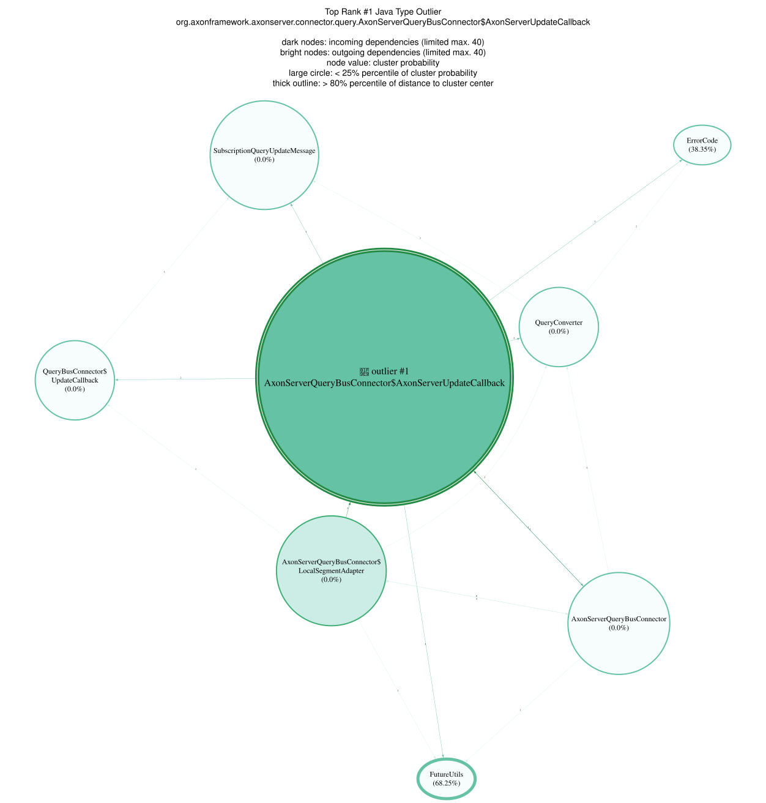

# 📊 Anomaly Detection Report

## 1. Executive Overview

This report analyzes structural and dependency anomalies across multiple abstraction levels of the codebase.
The goal is to detect potential **software quality, design, and architecture issues** using graph-based features, anomaly detection (Isolation Forest), and SHAP explainability.

## 📚 Table of Contents

1. [Executive Overview](#1-executive-overview)
1. [Deep Dives by Abstraction Level](#2-deep-dives-by-abstraction-level)
1. [Plot Interpretation Guide](#3-plot-interpretation-guide)
1. [Taxonomy of Anomaly Archetypes](#4-taxonomy-of-anomaly-archetypes)
1. [Recommendations](#5-recommendations)
1. [Appendix](#6-appendix)

---

### 1.1 Anomalies in total

| Analyzed Units | Anomalies | Authorities | Bottlenecks | Bridges | Hubs | Outliers |
| --- | --- | --- | --- | --- | --- | --- |
| 1343 | 66 | 24 | 22 | 16 | 12 | 8 |

### 1.2 Overview of Analyzed Structures

| Abstraction Level | Units | Anomalies | Authorities | Bottlenecks | Bridges | Hubs | Outliers |
| --- | --- | --- | --- | --- | --- | --- | --- |
| Type,Java,Interface | 253 | 27 | 2 | 6 | 1 | 7 | 2 |
| Type,Java,Class | 777 | 25 | 7 | 2 | 5 | 2 | 0 |
| Package,Java | 146 | 6 | 10 | 10 | 6 | 0 | 5 |
| Type,Java,Record | 56 | 6 | 1 | 2 | 4 | 0 | 0 |
| Type,Java,Class,Throwable | 42 | 1 | 0 | 0 | 0 | 0 | 1 |
| Type,Java,Annotation | 41 | 1 | 0 | 0 | 0 | 0 | 0 |
| Type,Java,Enum | 17 | 0 | 0 | 0 | 0 | 1 | 0 |
| Artifact,Jar,Archive,Zip,Java | 11 | 0 | 4 | 2 | 0 | 2 | 0 |

### 1.3 Overview Charts

#### Treemap Charts


---

## 2. Deep Dives by Abstraction Level

Each abstraction level includes anomaly statistics, SHAP feature importance, archetype distribution, and example anomalies.

### 2.1 Java Artifact

#### Anomaly Results

##### Total anomalies

| Anomalies | Authorities | Bottlenecks | Bridges | Hubs | Outliers |
| --- | --- | --- | --- | --- | --- |
| 0 | 4 | 2 | 0 | 2 | 0 |

##### Top global contributing features (via SHAP)

⚠️ _No anomaly detection and SHAP data available for this level (model skipped or insufficient samples)._

#### Archetype Distribution

| Archetype | Count | Max. Score | Model Status | Examples |
| --- | --- | --- | --- | --- |
| Authority | 4 | null | Undetermined | /axon-common-5.0.2.jar, /axon-metrics-micrometer-5.0.2.jar, /axon-spring-boot-autoconfigure-5.0.2.jar |
| Bottleneck | 2 | null | Undetermined | /axon-conversion-5.0.2.jar, /axon-eventsourcing-5.0.2.jar |
| Hub | 2 | null | Undetermined | /axon-common-5.0.2.jar, /axon-messaging-5.0.2.jar |

#### Top anomalies with their local contributing features (via SHAP)

⚠️ _No anomaly detection and SHAP data available for this level (model skipped or insufficient samples)._

#### Visualizations

See [Plot Interpretation Guide](#3-plot-interpretation-guide) on how to read the plots in detail.


⚠️ _No anomaly detection and SHAP data available for this level (model skipped or insufficient samples)._

#### Graph Visualizations

##### TopHub Graph Visualizations


---

##### TopBottleneck Graph Visualizations


---

##### TopAuthority Graph Visualizations


--

### 2.2 Java Package

#### Anomaly Results

##### Total anomalies

| Anomalies | Authorities | Bottlenecks | Bridges | Hubs | Outliers |
| --- | --- | --- | --- | --- | --- |
| 6 | 10 | 10 | 6 | 0 | 5 |

##### Top global contributing features (via SHAP)

| Feature | Mean absolute SHAP value |
| --- | --- |
| *Node embeddings aggregated* | 0.030158 |
| pageToArticleRankDifference | 0.016274 |
| pageRank | 0.015051 |
| articleRank | 0.014532 |
| incomingDependencies | 0.013154 |
| nodeEmbeddingPCA_15 | 0.005296 |
| degree | 0.005250 |
| localClusteringCoefficient | 0.004006 |
| nodeEmbeddingPCA_4 | 0.003762 |
| nodeEmbeddingPCA_10 | 0.003163 |
| nodeEmbeddingPCA_16 | 0.002733 |

#### Archetype Distribution

| Archetype | Count | Max. Score | Model Status | Examples |
| --- | --- | --- | --- | --- |
|  | 6 | 0.0555 | Anomalous | org.axonframework.messaging.core, org.axonframework.common, org.axonframework.common.annotation |
| Authority | 2 | 0.018 | Anomalous | org.axonframework.common, org.axonframework.common.function |
| Bottleneck | 2 | 0.0555 | Anomalous | org.axonframework.messaging.core, org.axonframework.messaging.core.unitofwork |
| Bridge | 6 | 0.0555 | Anomalous | org.axonframework.messaging.core, org.axonframework.common, org.axonframework.common.annotation |
| Outlier | 1 | 0.0154 | Anomalous | org.axonframework.common.annotation |
|  | 110 | -0.0014 | Typical | org.axonframework.extension.metrics.micrometer.reservoir, org.axonframework.test.server, org.axonframework.conversion |
| Authority | 8 | -0.0338 | Typical | org.axonframework.extension.springboot.actuator, org.axonframework.extension.metrics.micrometer, org.axonframework.test.fixture |
| Bottleneck | 8 | -0.0284 | Typical | org.axonframework.messaging.core.annotation, org.axonframework.axonserver.connector, org.axonframework.messaging.core.conversion |
| Outlier | 4 | -0.0436 | Typical | org.axonframework.common.io, org.axonframework.common.jpa, org.axonframework.modelling.configuration |

#### Top anomalies with their local contributing features (via SHAP)

| Name | Contained in | Anomaly Score | Archetypes | Top Feature 1 | Top Feature 1 SHAP | Top Feature 2 | Top Feature 2 SHAP | Top Feature 3 | Top Feature 3 SHAP | Model Status |
| --- | --- | --- | --- | --- | --- | --- | --- | --- | --- | --- |
| org.axonframework.messaging.core | axon-messaging-5.0.2 | 0.0555 | , Bottleneck, Bridge | pageToArticleRankDifference | -0.2015 | pageRank | -0.1777 | articleRank | -0.1608 | Anomalous |
| org.axonframework.common | axon-common-5.0.2 | 0.018 | Authority, , Bridge | pageToArticleRankDifference | -0.1977 | pageRank | -0.1839 | articleRank | -0.1744 | Anomalous |
| org.axonframework.common.annotation | axon-common-5.0.2 | 0.0154 | Bridge, , Outlier | pageToArticleRankDifference | -0.1708 | pageRank | -0.1516 | articleRank | -0.1499 | Anomalous |
| org.axonframework.common.function | axon-common-5.0.2 | 0.0143 | Bridge, , Authority | nodeEmbeddingPCA_15 | -0.1145 | nodeEmbeddingPCA_16 | -0.0972 | nodeEmbeddingPCA_11 | -0.081 | Anomalous |
| org.axonframework.messaging.core.unitofwork | axon-messaging-5.0.2 | 0.0129 | Bottleneck, , Bridge | pageToArticleRankDifference | -0.1599 | pageRank | -0.1528 | articleRank | -0.1499 | Anomalous |
| org.axonframework.common.configuration | axon-common-5.0.2 | 0.0043 | Bridge,  | pageToArticleRankDifference | -0.1585 | pageRank | -0.1172 | incomingDependencies | -0.1163 | Anomalous |

#### Visualizations

See [Plot Interpretation Guide](#3-plot-interpretation-guide) on how to read the plots in detail.

##### Anomalies


##### Global feature importance SHAP summary plots


##### Feature dependence plots for top important features


---

##### Local SHAP Force Plots – Top 6 Anomalies


---

##### Cluster Diagnostics


---


##### Cluster Membership Strength


---

##### Cluster Noise and Bridge Analysis


---

##### Feature Distributions


---

##### Feature Relationships


---

#### Graph Visualizations

##### TopBottleneck Graph Visualizations


---

##### TopAuthority Graph Visualizations


---

##### TopBridge Graph Visualizations


---

##### TopOutlier Graph Visualizations


--

### 2.3 Java Type

#### Anomaly Results

##### Total anomalies

| Anomalies | Authorities | Bottlenecks | Bridges | Hubs | Outliers |
| --- | --- | --- | --- | --- | --- |
| 60 | 10 | 10 | 10 | 10 | 3 |

##### Top global contributing features (via SHAP)

| Feature | Mean absolute SHAP value |
| --- | --- |
| *Node embeddings aggregated* | 0.050951 |
| articleRank | 0.016715 |
| pageRank | 0.010759 |
| incomingDependencies | 0.009176 |
| degree | 0.008314 |
| pageToArticleRankDifference | 0.007625 |
| nodeEmbeddingPCA_28 | 0.005804 |
| nodeEmbeddingPCA_25 | 0.005347 |
| nodeEmbeddingPCA_22 | 0.004198 |
| betweenness | 0.003096 |
| nodeEmbeddingPCA_34 | 0.003059 |

#### Archetype Distribution

| Archetype | Count | Max. Score | Model Status | Examples |
| --- | --- | --- | --- | --- |
|  | 60 | 0.0955 | Anomalous | org.axonframework.messaging.core.unitofwork.ProcessingContext, org.axonframework.messaging.core.Message, org.axonframework.common.annotation.Internal |
| Authority | 8 | 0.0687 | Anomalous | org.axonframework.common.TypeReference, org.axonframework.common.infra.ComponentDescriptor, org.axonframework.common.infra.DescribableComponent |
| Bottleneck | 8 | 0.0955 | Anomalous | org.axonframework.messaging.core.unitofwork.ProcessingContext, org.axonframework.messaging.core.Message, org.axonframework.messaging.core.MessageStream |
| Bridge | 10 | 0.04 | Anomalous | org.axonframework.messaging.core.timeout.HandlerTimeoutHandlerEnhancerDefinition, org.axonframework.extension.springboot.autoconfig.AxonTimeoutAutoConfiguration, org.axonframework.extension.springboot.autoconfig.AxonTimeoutAutoConfiguration$AxonTimeoutConfigurerModule |
| Hub | 8 | 0.0955 | Anomalous | org.axonframework.messaging.core.unitofwork.ProcessingContext, org.axonframework.messaging.core.Message, org.axonframework.messaging.core.MessageStream |
|  | 1126 | 0 | Typical | org.axonframework.messaging.core.unitofwork.ProcessingLifecycle$Phase, org.axonframework.test.fixture.AxonTestPhase$When$Nothing, org.axonframework.conversion.ChainedConverter |
| Authority | 2 | -0.0117 | Typical | org.axonframework.messaging.core.Metadata$MetadataCollector, org.axonframework.common.StringUtils |
| Bottleneck | 2 | -0.0041 | Typical | org.axonframework.modelling.entity.annotation.AnnotatedEntityMetamodel, org.axonframework.messaging.core.unitofwork.ProcessingLifecycle |
| Hub | 2 | -0.0283 | Typical | org.axonframework.common.BuilderUtils, org.axonframework.axonserver.connector.ErrorCode |
| Outlier | 3 | -0.0321 | Typical | org.axonframework.messaging.queryhandling.NoHandlerForQueryException, org.axonframework.axonserver.connector.util.Scheduler$ScheduledTask, org.axonframework.axonserver.connector.util.Scheduler |

#### Top anomalies with their local contributing features (via SHAP)

| Name | Contained in | Anomaly Score | Archetypes | Top Feature 1 | Top Feature 1 SHAP | Top Feature 2 | Top Feature 2 SHAP | Top Feature 3 | Top Feature 3 SHAP | Model Status |
| --- | --- | --- | --- | --- | --- | --- | --- | --- | --- | --- |
| org.axonframework.messaging.core.unitofwork.ProcessingContext | axon-messaging-5.0.2 | 0.0955 | , Hub, Bottleneck | articleRank | -0.2766 | pageRank | -0.1831 | incomingDependencies | -0.1293 | Anomalous |
| org.axonframework.messaging.core.Message | axon-messaging-5.0.2 | 0.0908 | Bottleneck, , Hub | articleRank | -0.2791 | pageRank | -0.1854 | incomingDependencies | -0.1273 | Anomalous |
| org.axonframework.common.annotation.Internal | axon-common-5.0.2 | 0.0768 |  | articleRank | -0.2906 | pageRank | -0.1678 | degree | -0.1542 | Anomalous |
| org.axonframework.messaging.core.MessageStream | axon-messaging-5.0.2 | 0.0752 | Bottleneck, , Hub | articleRank | -0.2907 | pageRank | -0.152 | incomingDependencies | -0.1483 | Anomalous |
| org.axonframework.common.TypeReference | axon-common-5.0.2 | 0.0687 | Authority,  | articleRank | -0.2964 | pageRank | -0.189 | pageToArticleRankDifference | -0.1279 | Anomalous |
| org.axonframework.conversion.Converter | axon-conversion-5.0.2 | 0.0671 |  | articleRank | -0.3469 | pageRank | -0.1999 | pageToArticleRankDifference | -0.1329 | Anomalous |
| org.axonframework.messaging.eventhandling.EventMessage | axon-messaging-5.0.2 | 0.0621 | Hub, , Bottleneck | articleRank | -0.2913 | incomingDependencies | -0.1504 | degree | -0.1493 | Anomalous |
| org.axonframework.messaging.eventstreaming.EventCriteria | axon-messaging-5.0.2 | 0.0489 |  | articleRank | -0.3223 | pageRank | -0.1275 | pageToArticleRankDifference | -0.0846 | Anomalous |
| org.axonframework.messaging.core.QualifiedName | axon-messaging-5.0.2 | 0.0475 | Bottleneck,  | articleRank | -0.2806 | incomingDependencies | -0.1496 | pageRank | -0.1478 | Anomalous |
| org.axonframework.common.infra.ComponentDescriptor | axon-common-5.0.2 | 0.045 | Authority,  | articleRank | -0.2989 | pageRank | -0.19 | degree | -0.1435 | Anomalous |
| org.axonframework.messaging.commandhandling.CommandMessage | axon-messaging-5.0.2 | 0.0423 | Hub,  | articleRank | -0.2916 | incomingDependencies | -0.1639 | degree | -0.1601 | Anomalous |
| org.axonframework.common.infra.DescribableComponent | axon-common-5.0.2 | 0.0407 | Authority, Hub,  | articleRank | -0.2998 | pageRank | -0.1906 | incomingDependencies | -0.1313 | Anomalous |
| org.axonframework.messaging.core.timeout.HandlerTimeoutHandlerEnhancerDefinition | axon-messaging-5.0.2 | 0.04 | Bridge,  | nodeEmbeddingPCA_25 | -0.1966 | nodeEmbeddingPCA_28 | -0.1882 | nodeEmbeddingPCA_27 | -0.1835 | Anomalous |
| org.axonframework.messaging.core.Metadata | axon-messaging-5.0.2 | 0.0399 | Authority,  | articleRank | -0.3094 | pageRank | -0.1805 | incomingDependencies | -0.1443 | Anomalous |
| org.axonframework.eventsourcing.eventstore.jpa.AggregateBasedJpaEventStorageEngine | axon-eventsourcing-5.0.2 | 0.0351 |  | degree | -0.3109 | outgoingDependencies | -0.1031 | nodeEmbeddingPCA_5 | -0.0286 | Anomalous |
| org.axonframework.messaging.core.Context$ResourceKey | axon-messaging-5.0.2 | 0.0328 |  | articleRank | -0.2961 | pageRank | -0.1849 | incomingDependencies | -0.1377 | Anomalous |
| org.axonframework.common.Assert | axon-common-5.0.2 | 0.0298 | Hub,  | articleRank | -0.3869 | pageRank | -0.1734 | pageToArticleRankDifference | -0.1037 | Anomalous |
| org.axonframework.messaging.core.MessageType | axon-messaging-5.0.2 | 0.0294 | Bottleneck,  | articleRank | -0.2882 | degree | -0.1621 | incomingDependencies | -0.1552 | Anomalous |
| org.axonframework.messaging.eventhandling.processing.streaming.token.TrackingToken | axon-messaging-5.0.2 | 0.0286 |  | articleRank | -0.2929 | incomingDependencies | -0.1628 | degree | -0.1619 | Anomalous |
| org.axonframework.messaging.monitoring.MessageMonitor | axon-messaging-5.0.2 | 0.0267 |  | incomingDependencies | -0.1054 | nodeEmbeddingPCA_22 | -0.105 | nodeEmbeddingPCA_11 | -0.0503 | Anomalous |

#### Visualizations

See [Plot Interpretation Guide](#3-plot-interpretation-guide) on how to read the plots in detail.

##### Anomalies


##### Global feature importance SHAP summary plots


##### Feature dependence plots for top important features


---

##### Local SHAP Force Plots – Top 6 Anomalies


---


##### Cluster Diagnostics


---

##### Cluster Membership Strength


---

##### Cluster Noise and Bridge Analysis


---

##### Feature Distributions


---

##### Feature Relationships


---

#### Graph Visualizations

##### TopHub Graph Visualizations


---

##### TopBottleneck Graph Visualizations


---

##### TopAuthority Graph Visualizations


---

##### TopBridge Graph Visualizations


---

##### TopOutlier Graph Visualizations



--


## 3. Plot Interpretation Guide

> **Purpose:** Understand each plot type’s diagnostic value.  
> **Applies to:** All abstraction levels.

| Plot Type | Best For | Adds | Why It Matters |
| --- | --- | --- | --- |
| **Anomalies Plot** | Seeing distribution of anomalies in clusters | Context of clusters & outliers | Reveals isolation or cluster-based anomalies |
| **SHAP Summary** | Global feature importance | Feature impact direction | Shows what drives anomalies overall |
| **Local SHAP Force** | Explaining a single anomaly | Feature contribution breakdown | Useful for debugging individual outliers |
| **Dependence Plot** | Understanding feature influence | Interaction visualization | Reveals nonlinear feature effects |
| **Cluster Metrics** | Cluster characteristics | Radius, cohesion, noise | Identifies weakly defined or noisy clusters |

## 3. Plot Interpretation Guide

> **Purpose:** Provide a direct mapping between all plots and their analytical meaning.  
> **Scope:** Applies to plots for *Java Type*, *Java Package*, and similar abstraction levels.  
> **Format:** Each entry includes `Best for`, `Adds`, and `Why`, matching the in-report descriptions.

---

### 📘 Main Plots

| Plot | Description | Best For | Adds | Why |
|------|--------------|----------|------|-----|
| **Anomalies** | 2D visualization of all code units showing clusters and anomalies. | Understanding the overall distribution of anomalies in relation to clusters. | Context of clusters and outliers. | Reveals whether anomalies are isolated or cluster-based, guiding investigation. |
| **Global Feature Importance (SHAP Summary)** | Mean absolute SHAP values ranking global feature impact. | Global understanding of which features drive anomalies. | Direction of impact (color shows feature value). | Explains which metrics consistently influence anomaly detection. |
| **Feature Dependence (Top Important Features)** | Shows how specific feature values affect anomaly score; colored by interacting feature. | Understanding how one feature affects anomaly scores. | Color shows feature interaction or threshold effect. | Helps identify nonlinear relationships and feature interactions. |

---

### 📙 Local Explanation Plots

| Plot | Description | Best For | Adds | Why |
|------|--------------|----------|------|-----|
| **Local SHAP Force Plots (Top Anomalies 1–6)** | Visualizes per-feature contributions to each anomaly’s score relative to baseline. | Explaining *why a specific data point* is anomalous. | Visual breakdown of how each feature contributes to anomaly score. | Enables debugging of individual anomalies through transparent explanation. |

---

### 📗 Cluster-Level Diagnostic Plots

| Plot | Description | Best For | Adds | Why |
|------|--------------|----------|------|-----|
| **Clusters – Overall** | Shows all clusters since they all fit into one plot. | Gaining a holistic view of cluster characteristics in the dataset. | An overall summary of how all clusters are distributed and their key metrics. | Understanding the general structure and properties of clusters can help identify patterns and potential anomalies in the data. |
| **Clusters – Largest Average Radius** | Ranks clusters by mean distance of members from their centroid. | Getting an overview of clusters that are more dispersed. | Identifies clusters with internal variability. | Large average radius suggests less cohesion and potential outliers. |
| **Clusters – Largest Max Radius** | Shows clusters with the farthest outlying member. | Identifying clusters that have members farthest from cluster center. | Highlights clusters containing extreme outliers. | Indicates clusters that may contain hidden anomalies. |
| **Clusters – Largest Size** | Displays cluster membership counts. | Understanding which clusters contain the most code units. | Provides sense of frequency of code structures. | Large clusters may represent common design patterns; small clusters are specialized. |
| **Cluster Probabilities** | Distribution of HDBSCAN membership probabilities. | Detecting code units that don’t strongly belong to any cluster. | Measures how well-defined clusters are. | Highlights noisy or weakly defined clusters. |

---

### 📒 Cluster Noise & Bridge Diagnostics

| Plot | Description | Best For | Adds | Why |
|------|--------------|----------|------|-----|
| **Cluster Noise – Highly Central and Popular** | Central nodes that don’t fit any cluster. | Detecting code units that are highly connected but anomalous. | Reveals influential but misfit nodes. | Such nodes may be key but unstable integration points. |
| **Cluster Noise – Poorly Integrated Bridges** | Nodes connecting clusters but weakly integrated. | Detecting code units that bridge modules unusually. | Identifies cross-cutting or leaking dependencies. | May reveal architectural boundary violations. |
| **Cluster Noise – Role Inverted Bridges** | Bridges with reversed structural roles compared to expected topology. | Detecting code units connecting clusters in unexpected ways. | Highlights anomalous coupling roles. | Indicates architectural inversion or misuse of interfaces. |

---

### 📙 Feature Distribution & Relationship Plots

| Plot | Description | Best For | Adds | Why |
|------|--------------|----------|------|-----|
| **Betweenness Centrality Distribution** | Histogram of betweenness values. | Identifying code units that act as structural bridges. | Insight into flow of dependency control. | Detects potential bottlenecks or single points of failure. |
| **Clustering Coefficient Distribution** | Histogram of local clustering coefficients. | Identifying modularity and local cohesion. | Insight into how tightly code units cluster. | Reveals how cohesive or isolated different regions of the graph are. |
| **PageRank – ArticleRank Difference Distribution** | Distribution of `PageRank - ArticleRank`. | Identifying influential nodes beyond local connectivity. | Shows imbalance between influence and popularity. | Highlights components with disproportionate architectural impact. |
| **Clustering Coefficient vs PageRank** | Scatterplot comparing local clustering to global influence. | Identifying relationships between cohesion and centrality. | Visualizes trade-offs between modularity and reach. | Helps spot code units that are both locally and globally critical. |

---

### 📕 Graph Visualizations (Archetype-Level Network Views)

| Plot | Description | Best For | Adds | Why |
|------|--------------|----------|------|-----|
| **Top Hub Graph Visualization** | Displays the most connected node (e.g., **#1 Hub**) at the center, surrounded by its direct dependencies. Incoming nodes show who is dependent on the hub. | Understanding highly connected code units or components that serve as central integrators. | Highlights nodes that act as major dependency aggregators. | Helps detect over-centralized modules or potential architectural bottlenecks. |
| **Top Bottleneck Graph Visualization** | Shows the node with the highest betweenness centrality (e.g., **#1 Bottleneck**) and its local neighborhood. | Identifying code units that control information or dependency flow. | Emphasizes nodes that mediate critical paths between modules. | Reveals single points of failure or routing constraints in dependency flow. |
| **Top Authority Graph Visualization** | Centers the most authoritative node (e.g., **#1 Authority**) with incoming and outgoing links from dependent nodes with high PageRank and emphasized PageRank to ArticleRank difference. | Detecting key knowledge or functionality providers. | Highlights components with high centrality. | Indicates structural or semantic “sources of truth” in the system. |
| **Top Bridge Graph Visualization** | Displays a node acting as a structural bridge between clusters (e.g., **#1 Bridge**) and its cross-cluster connections based on node embeddings encoding the Graph structure. | Understanding cross-cutting dependencies between modules. | Reveals links connecting distinct architectural domains. | Useful for spotting boundary leaks or undesired coupling between subsystems. |
| **Top Outlier Graph Visualization** | Centers an unusual or isolated node (e.g., **#1 Outlier**) that can hardly be assigned to a cluster and visualizes its sparse or unexpected dependency patterns. | Identifying structurally or behaviorally anomalous nodes. | Highlights nodes with rare or unexpected connection patterns. | Helps pinpoint code units that deviate from established dependency norms. |

> **Note:**
> - In all Graph Visualizations, the **central node** represents the selected *Top Archetype* (e.g., *Top 1 Hub*).  
> - **Darker nodes** indicate *incoming dependencies*, while **brighter nodes** indicate *outgoing dependencies*.  
> - **Emphasized nodes** (thicker borders or larger size) mark particularly influential or anomalous dependencies, depending on the archetype.  
> - These visualizations are most effective for interpreting *local dependency topology* and *role significance* of key components.

---

### 📔 Summary Categories

| Category | Included Plots | Typical Usage |
|-----------|----------------|----------------|
| **Main Diagnostic** | Anomalies, Global SHAP, Feature Dependence | High-level anomaly review |
| **Local Explanation** | Local SHAP Force Plots | Case-by-case anomaly debugging |
| **Cluster Diagnostics** | Cluster Radius / Size / Probability | Assess cluster cohesion and outliers |
| **Cluster Noise Analysis** | Cluster Noise (3 types) | Identify special structural anomalies |
| **Feature Distributions** | Betweenness, Clustering, Rank Difference | Assess feature-based structure patterns |
| **Feature Relationships** | Clustering vs PageRank | Evaluate global vs local influence balance |
| **Archetype Graphs** | Top Hub / Bottleneck / Authority / Bridge / Outlier | Visualizing key dependency roles and structural importance |

---

### 💡 Reading Guidance

- **Color Conventions:**  
  Red = anomalous, Green = typical, Light grey = noise, Pale colors = clusters.  
- **Scales:**  
  SHAP values are normalized (mean absolute); graph metrics standardized by z-score.  
- **How to Use:**  
  1. Start with *Main Diagnostic* plots to identify anomalies and drivers.  
  2. Use *Local SHAP* for detailed case analysis.  
  3. Check *Cluster Diagnostics* and *Noise Plots* to verify grouping quality.  
  4. Use *Feature Distributions* to contextualize metrics.  
  5. Cross-reference *Feature Relationships* for architectural interpretation.

---

### 📄 Structured Form (YAML Summary)

You can include this in your appendix for machine-readable mapping:

```yaml
plots:
  main:
    - name: Anomalies
      purpose: Distribution of anomalies and clusters
    - name: Global Feature Importance (SHAP)
      purpose: Global feature ranking
    - name: Feature Dependence
      purpose: Feature–score relationship
  local:
    - name: Local SHAP Force Plots
      purpose: Local explanations for top anomalies
  cluster:
    - name: Clusters Largest Average Radius
      purpose: Identify dispersed clusters
    - name: Clusters Largest Max Radius
      purpose: Identify extreme outlier clusters
    - name: Clusters Largest Size
      purpose: Identify dominant cluster types
    - name: Cluster Probabilities
      purpose: Assess cluster definition strength
  cluster_noise:
    - name: Cluster Noise – Highly Central and Popular
      purpose: Central anomalies without cluster fit
    - name: Cluster Noise – Poorly Integrated Bridges
      purpose: Weakly integrated bridges
    - name: Cluster Noise – Role Inverted Bridges
      purpose: Inverted bridge roles
  feature_distributions:
    - name: Betweenness Centrality Distribution
      purpose: Bridge and bottleneck detection
    - name: Clustering Coefficient Distribution
      purpose: Cohesion and modularity measurement
    - name: PageRank – ArticleRank Difference Distribution
      purpose: Influence vs popularity analysis
  feature_relationships:
    - name: Clustering Coefficient vs PageRank
      purpose: Local vs global influence comparison
```

## 4. Taxonomy of Anomaly Archetypes

| Archetype | Feature Profile | Architectural Risk |
|-----------|-----------------|--------------------|
| **Hub** | High degree, low clustering coefficient | Central dependency; fragile hotspot |
| **Bottleneck** | High betweenness, low redundancy | Single point of failure; slows evolution |
| **Outlier** | High cluster distance, small cluster size | Misfit or irregular dependency pattern |
| **Authority** | High PageRank, low ArticleRank | Over-relied utility; low local stability |
| **Bridge** | Cross-cluster connection | Risky coupling; weak modular boundaries |

**Structured form (for LLM parsing):**

```yaml
archetypes:
  - name: Hub
    profile: High degree, low clustering coefficient
    risk: Central dependency, fragile hotspot
  - name: Bottleneck
    profile: High betweenness, low redundancy
    risk: Single point of failure
  - name: Outlier
    profile: High cluster distance, small cluster size
    risk: Misfit component
  - name: Authority
    profile: High PageRank, low ArticleRank
    risk: Over-relied utility
  - name: Bridge
    profile: Cross-cluster connector
    risk: Risky coupling
```

---

## 5. Recommendations

* **Refactor hubs:** Decompose large or over-connected utilities.
* **Mitigate bottlenecks:** Introduce redundancy or alternative communication paths.
* **Investigate outliers:** Determine if anomalies are justified exceptions.
* **Raise cohesion:** Increase local clustering by improving modular boundaries.
* **Stabilize authorities:** Encapsulate frequently used but fragile components.
* **Validate bridges:** Confirm cross-cluster connectors are intentional and safe.

---

## 6. Appendix

### 6.1 Methodology Overview

1. Build dependency graph (types, packages, artifacts).
1. Compute graph metrics: degree, PageRank, betweenness, clustering coefficient, etc.
1. Generate embeddings via Fast Random Projection.
1. Reduce embeddings with PCA (retain 90% variance).
1. Train Isolation Forest for anomaly detection.
1. Explain results using SHAP (via Random Forest proxy).
1. Cluster anomalies via HDBSCAN, tuned with Leiden reference communities (AMI score).
1. Hyperparameter optimization for both Isolation Forest and Random Forest proxy with their F1 score

### 6.2 Feature Set

* Degree (in/out)
* PageRank
* ArticleRank
* Page-to-Article Rank Difference
* Betweenness Centrality
* Local Clustering Coefficient
* Cluster Outlier Score (1.0 - cluster probability)
* Cluster Radius (avg, max)
* Cluster Size
* Node Embedding (PCA 20–35 dims)

### 6.3 Architecture Diagram


