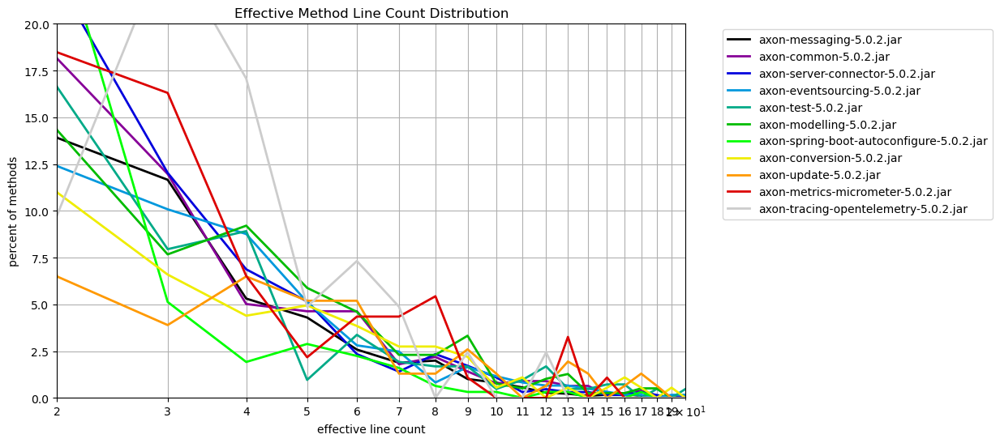
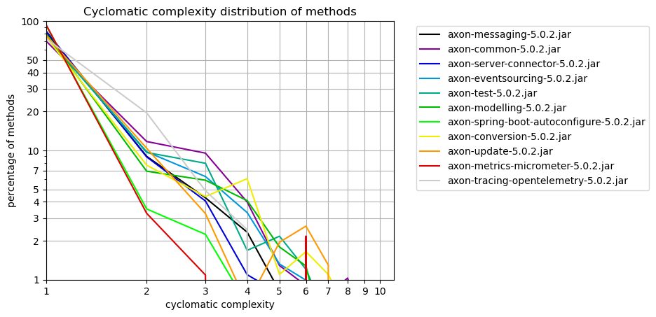

# Method Metrics
   

### References
- [jqassistant](https://jqassistant.org)
- [Neo4j Python Driver](https://neo4j.com/docs/api/python-driver/current)

## Effective Method Line Count

### Table 1a - Effective method line count distribution

This table shows the distribution of the effective method line count per artifact.
For each artifact the number of methods with effective line count = 1,2,3,... is shown to get an overview of how line counts are distributed over methods.

Only the 15 artifacts with the highest method count and their effective method line count distribution (limited by 40)is shown here. The whole table can be found in the CSV report `Effective_Method_Line_Count_Distribution`.

Have a look below to find out which packages and methods have the highest effective lines of code.

<table border="1" class="dataframe">
  <thead>
    <tr style="text-align: right;">
      <th>artifactName</th>
      <th>axon-messaging-5.0.2.jar</th>
      <th>axon-common-5.0.2.jar</th>
      <th>axon-server-connector-5.0.2.jar</th>
      <th>axon-eventsourcing-5.0.2.jar</th>
      <th>axon-test-5.0.2.jar</th>
      <th>axon-modelling-5.0.2.jar</th>
      <th>axon-spring-boot-autoconfigure-5.0.2.jar</th>
      <th>axon-conversion-5.0.2.jar</th>
      <th>axon-update-5.0.2.jar</th>
      <th>axon-metrics-micrometer-5.0.2.jar</th>
      <th>axon-tracing-opentelemetry-5.0.2.jar</th>
    </tr>
    <tr>
      <th>effectiveLineCount</th>
      <th></th>
      <th></th>
      <th></th>
      <th></th>
      <th></th>
      <th></th>
      <th></th>
      <th></th>
      <th></th>
      <th></th>
      <th></th>
    </tr>
  </thead>
  <tbody>
    <tr>
      <th>1</th>
      <td>1935</td>
      <td>351</td>
      <td>266</td>
      <td>305</td>
      <td>204</td>
      <td>175</td>
      <td>181</td>
      <td>101</td>
      <td>88</td>
      <td>34</td>
      <td>11</td>
    </tr>
    <tr>
      <th>2</th>
      <td>495</td>
      <td>141</td>
      <td>143</td>
      <td>75</td>
      <td>69</td>
      <td>56</td>
      <td>79</td>
      <td>20</td>
      <td>10</td>
      <td>17</td>
      <td>4</td>
    </tr>
    <tr>
      <th>3</th>
      <td>415</td>
      <td>93</td>
      <td>77</td>
      <td>61</td>
      <td>33</td>
      <td>30</td>
      <td>16</td>
      <td>12</td>
      <td>6</td>
      <td>15</td>
      <td>10</td>
    </tr>
    <tr>
      <th>4</th>
      <td>189</td>
      <td>39</td>
      <td>44</td>
      <td>53</td>
      <td>37</td>
      <td>36</td>
      <td>6</td>
      <td>8</td>
      <td>10</td>
      <td>6</td>
      <td>7</td>
    </tr>
    <tr>
      <th>5</th>
      <td>153</td>
      <td>36</td>
      <td>33</td>
      <td>31</td>
      <td>4</td>
      <td>23</td>
      <td>9</td>
      <td>9</td>
      <td>8</td>
      <td>2</td>
      <td>2</td>
    </tr>
    <tr>
      <th>6</th>
      <td>92</td>
      <td>36</td>
      <td>15</td>
      <td>17</td>
      <td>14</td>
      <td>18</td>
      <td>7</td>
      <td>7</td>
      <td>8</td>
      <td>4</td>
      <td>3</td>
    </tr>
    <tr>
      <th>7</th>
      <td>67</td>
      <td>14</td>
      <td>9</td>
      <td>15</td>
      <td>8</td>
      <td>9</td>
      <td>5</td>
      <td>5</td>
      <td>2</td>
      <td>4</td>
      <td>2</td>
    </tr>
    <tr>
      <th>8</th>
      <td>71</td>
      <td>17</td>
      <td>15</td>
      <td>5</td>
      <td>7</td>
      <td>9</td>
      <td>2</td>
      <td>5</td>
      <td>2</td>
      <td>5</td>
      <td>0</td>
    </tr>
    <tr>
      <th>9</th>
      <td>36</td>
      <td>11</td>
      <td>11</td>
      <td>10</td>
      <td>7</td>
      <td>13</td>
      <td>1</td>
      <td>4</td>
      <td>4</td>
      <td>1</td>
      <td>1</td>
    </tr>
    <tr>
      <th>10</th>
      <td>29</td>
      <td>6</td>
      <td>7</td>
      <td>7</td>
      <td>2</td>
      <td>3</td>
      <td>1</td>
      <td>1</td>
      <td>2</td>
      <td>0</td>
      <td>0</td>
    </tr>
    <tr>
      <th>11</th>
      <td>20</td>
      <td>7</td>
      <td>2</td>
      <td>5</td>
      <td>4</td>
      <td>2</td>
      <td>0</td>
      <td>2</td>
      <td>0</td>
      <td>0</td>
      <td>0</td>
    </tr>
    <tr>
      <th>12</th>
      <td>10</td>
      <td>7</td>
      <td>3</td>
      <td>4</td>
      <td>7</td>
      <td>4</td>
      <td>1</td>
      <td>0</td>
      <td>1</td>
      <td>0</td>
      <td>1</td>
    </tr>
    <tr>
      <th>13</th>
      <td>8</td>
      <td>5</td>
      <td>2</td>
      <td>4</td>
      <td>2</td>
      <td>5</td>
      <td>1</td>
      <td>1</td>
      <td>3</td>
      <td>3</td>
      <td>0</td>
    </tr>
    <tr>
      <th>14</th>
      <td>4</td>
      <td>5</td>
      <td>2</td>
      <td>3</td>
      <td>2</td>
      <td>1</td>
      <td>0</td>
      <td>0</td>
      <td>2</td>
      <td>0</td>
      <td>0</td>
    </tr>
    <tr>
      <th>15</th>
      <td>6</td>
      <td>1</td>
      <td>1</td>
      <td>2</td>
      <td>3</td>
      <td>1</td>
      <td>0</td>
      <td>1</td>
      <td>0</td>
      <td>1</td>
      <td>0</td>
    </tr>
    <tr>
      <th>16</th>
      <td>7</td>
      <td>2</td>
      <td>1</td>
      <td>1</td>
      <td>3</td>
      <td>1</td>
      <td>0</td>
      <td>2</td>
      <td>1</td>
      <td>0</td>
      <td>0</td>
    </tr>
    <tr>
      <th>17</th>
      <td>4</td>
      <td>3</td>
      <td>2</td>
      <td>1</td>
      <td>0</td>
      <td>2</td>
      <td>1</td>
      <td>1</td>
      <td>2</td>
      <td>0</td>
      <td>0</td>
    </tr>
    <tr>
      <th>18</th>
      <td>1</td>
      <td>1</td>
      <td>1</td>
      <td>0</td>
      <td>2</td>
      <td>2</td>
      <td>0</td>
      <td>0</td>
      <td>1</td>
      <td>0</td>
      <td>0</td>
    </tr>
    <tr>
      <th>19</th>
      <td>3</td>
      <td>0</td>
      <td>0</td>
      <td>1</td>
      <td>0</td>
      <td>0</td>
      <td>0</td>
      <td>1</td>
      <td>0</td>
      <td>0</td>
      <td>0</td>
    </tr>
    <tr>
      <th>20</th>
      <td>2</td>
      <td>0</td>
      <td>1</td>
      <td>1</td>
      <td>2</td>
      <td>0</td>
      <td>0</td>
      <td>0</td>
      <td>0</td>
      <td>0</td>
      <td>0</td>
    </tr>
    <tr>
      <th>21</th>
      <td>1</td>
      <td>0</td>
      <td>2</td>
      <td>1</td>
      <td>1</td>
      <td>1</td>
      <td>0</td>
      <td>0</td>
      <td>2</td>
      <td>0</td>
      <td>0</td>
    </tr>
    <tr>
      <th>22</th>
      <td>3</td>
      <td>0</td>
      <td>0</td>
      <td>0</td>
      <td>0</td>
      <td>0</td>
      <td>0</td>
      <td>0</td>
      <td>0</td>
      <td>0</td>
      <td>0</td>
    </tr>
    <tr>
      <th>23</th>
      <td>1</td>
      <td>0</td>
      <td>0</td>
      <td>0</td>
      <td>1</td>
      <td>0</td>
      <td>1</td>
      <td>0</td>
      <td>0</td>
      <td>0</td>
      <td>0</td>
    </tr>
    <tr>
      <th>24</th>
      <td>0</td>
      <td>1</td>
      <td>0</td>
      <td>0</td>
      <td>0</td>
      <td>0</td>
      <td>0</td>
      <td>0</td>
      <td>1</td>
      <td>0</td>
      <td>0</td>
    </tr>
    <tr>
      <th>25</th>
      <td>2</td>
      <td>0</td>
      <td>0</td>
      <td>0</td>
      <td>0</td>
      <td>0</td>
      <td>0</td>
      <td>0</td>
      <td>0</td>
      <td>0</td>
      <td>0</td>
    </tr>
    <tr>
      <th>26</th>
      <td>0</td>
      <td>1</td>
      <td>0</td>
      <td>0</td>
      <td>1</td>
      <td>0</td>
      <td>0</td>
      <td>0</td>
      <td>0</td>
      <td>0</td>
      <td>0</td>
    </tr>
    <tr>
      <th>27</th>
      <td>1</td>
      <td>0</td>
      <td>0</td>
      <td>1</td>
      <td>0</td>
      <td>0</td>
      <td>0</td>
      <td>0</td>
      <td>0</td>
      <td>0</td>
      <td>0</td>
    </tr>
    <tr>
      <th>28</th>
      <td>0</td>
      <td>0</td>
      <td>1</td>
      <td>0</td>
      <td>0</td>
      <td>0</td>
      <td>0</td>
      <td>0</td>
      <td>0</td>
      <td>0</td>
      <td>0</td>
    </tr>
    <tr>
      <th>29</th>
      <td>0</td>
      <td>0</td>
      <td>0</td>
      <td>0</td>
      <td>0</td>
      <td>0</td>
      <td>1</td>
      <td>1</td>
      <td>0</td>
      <td>0</td>
      <td>0</td>
    </tr>
    <tr>
      <th>30</th>
      <td>0</td>
      <td>0</td>
      <td>1</td>
      <td>1</td>
      <td>0</td>
      <td>0</td>
      <td>0</td>
      <td>1</td>
      <td>0</td>
      <td>0</td>
      <td>0</td>
    </tr>
    <tr>
      <th>31</th>
      <td>2</td>
      <td>0</td>
      <td>0</td>
      <td>0</td>
      <td>1</td>
      <td>0</td>
      <td>0</td>
      <td>0</td>
      <td>0</td>
      <td>0</td>
      <td>0</td>
    </tr>
    <tr>
      <th>36</th>
      <td>1</td>
      <td>0</td>
      <td>0</td>
      <td>0</td>
      <td>0</td>
      <td>0</td>
      <td>0</td>
      <td>0</td>
      <td>0</td>
      <td>0</td>
      <td>0</td>
    </tr>
    <tr>
      <th>40</th>
      <td>0</td>
      <td>0</td>
      <td>0</td>
      <td>1</td>
      <td>0</td>
      <td>0</td>
      <td>0</td>
      <td>0</td>
      <td>0</td>
      <td>0</td>
      <td>0</td>
    </tr>
    <tr>
      <th>41</th>
      <td>0</td>
      <td>0</td>
      <td>0</td>
      <td>0</td>
      <td>0</td>
      <td>0</td>
      <td>0</td>
      <td>0</td>
      <td>1</td>
      <td>0</td>
      <td>0</td>
    </tr>
    <tr>
      <th>42</th>
      <td>0</td>
      <td>0</td>
      <td>1</td>
      <td>0</td>
      <td>0</td>
      <td>0</td>
      <td>0</td>
      <td>0</td>
      <td>0</td>
      <td>0</td>
      <td>0</td>
    </tr>
    <tr>
      <th>45</th>
      <td>0</td>
      <td>0</td>
      <td>0</td>
      <td>0</td>
      <td>1</td>
      <td>0</td>
      <td>0</td>
      <td>0</td>
      <td>0</td>
      <td>0</td>
      <td>0</td>
    </tr>
    <tr>
      <th>111</th>
      <td>1</td>
      <td>0</td>
      <td>0</td>
      <td>0</td>
      <td>0</td>
      <td>0</td>
      <td>0</td>
      <td>0</td>
      <td>0</td>
      <td>0</td>
      <td>0</td>
    </tr>
  </tbody>
</table>

### Table 1b - Effective method line count distribution (normalized)

The table shown here only includes the first 40 rows which typically represents the most significant entries.
Have a look below to find out which packages and methods have the highest effective lines of code.

<table border="1" class="dataframe">
  <thead>
    <tr style="text-align: right;">
      <th>artifactName</th>
      <th>axon-messaging-5.0.2.jar</th>
      <th>axon-common-5.0.2.jar</th>
      <th>axon-server-connector-5.0.2.jar</th>
      <th>axon-eventsourcing-5.0.2.jar</th>
      <th>axon-test-5.0.2.jar</th>
      <th>axon-modelling-5.0.2.jar</th>
      <th>axon-spring-boot-autoconfigure-5.0.2.jar</th>
      <th>axon-conversion-5.0.2.jar</th>
      <th>axon-update-5.0.2.jar</th>
      <th>axon-metrics-micrometer-5.0.2.jar</th>
      <th>axon-tracing-opentelemetry-5.0.2.jar</th>
    </tr>
    <tr>
      <th>effectiveLineCount</th>
      <th></th>
      <th></th>
      <th></th>
      <th></th>
      <th></th>
      <th></th>
      <th></th>
      <th></th>
      <th></th>
      <th></th>
      <th></th>
    </tr>
  </thead>
  <tbody>
    <tr>
      <th>1</th>
      <td>54.369205</td>
      <td>45.173745</td>
      <td>41.56250</td>
      <td>50.413223</td>
      <td>49.156627</td>
      <td>44.757033</td>
      <td>58.012821</td>
      <td>55.494505</td>
      <td>57.142857</td>
      <td>36.956522</td>
      <td>26.829268</td>
    </tr>
    <tr>
      <th>2</th>
      <td>13.908401</td>
      <td>18.146718</td>
      <td>22.34375</td>
      <td>12.396694</td>
      <td>16.626506</td>
      <td>14.322251</td>
      <td>25.320513</td>
      <td>10.989011</td>
      <td>6.493506</td>
      <td>18.478261</td>
      <td>9.756098</td>
    </tr>
    <tr>
      <th>3</th>
      <td>11.660579</td>
      <td>11.969112</td>
      <td>12.03125</td>
      <td>10.082645</td>
      <td>7.951807</td>
      <td>7.672634</td>
      <td>5.128205</td>
      <td>6.593407</td>
      <td>3.896104</td>
      <td>16.304348</td>
      <td>24.390244</td>
    </tr>
    <tr>
      <th>4</th>
      <td>5.310480</td>
      <td>5.019305</td>
      <td>6.87500</td>
      <td>8.760331</td>
      <td>8.915663</td>
      <td>9.207161</td>
      <td>1.923077</td>
      <td>4.395604</td>
      <td>6.493506</td>
      <td>6.521739</td>
      <td>17.073171</td>
    </tr>
    <tr>
      <th>5</th>
      <td>4.298960</td>
      <td>4.633205</td>
      <td>5.15625</td>
      <td>5.123967</td>
      <td>0.963855</td>
      <td>5.882353</td>
      <td>2.884615</td>
      <td>4.945055</td>
      <td>5.194805</td>
      <td>2.173913</td>
      <td>4.878049</td>
    </tr>
    <tr>
      <th>6</th>
      <td>2.584996</td>
      <td>4.633205</td>
      <td>2.34375</td>
      <td>2.809917</td>
      <td>3.373494</td>
      <td>4.603581</td>
      <td>2.243590</td>
      <td>3.846154</td>
      <td>5.194805</td>
      <td>4.347826</td>
      <td>7.317073</td>
    </tr>
    <tr>
      <th>7</th>
      <td>1.882551</td>
      <td>1.801802</td>
      <td>1.40625</td>
      <td>2.479339</td>
      <td>1.927711</td>
      <td>2.301790</td>
      <td>1.602564</td>
      <td>2.747253</td>
      <td>1.298701</td>
      <td>4.347826</td>
      <td>4.878049</td>
    </tr>
    <tr>
      <th>8</th>
      <td>1.994942</td>
      <td>2.187902</td>
      <td>2.34375</td>
      <td>0.826446</td>
      <td>1.686747</td>
      <td>2.301790</td>
      <td>0.641026</td>
      <td>2.747253</td>
      <td>1.298701</td>
      <td>5.434783</td>
      <td>0.000000</td>
    </tr>
    <tr>
      <th>9</th>
      <td>1.011520</td>
      <td>1.415701</td>
      <td>1.71875</td>
      <td>1.652893</td>
      <td>1.686747</td>
      <td>3.324808</td>
      <td>0.320513</td>
      <td>2.197802</td>
      <td>2.597403</td>
      <td>1.086957</td>
      <td>2.439024</td>
    </tr>
    <tr>
      <th>10</th>
      <td>0.814836</td>
      <td>0.772201</td>
      <td>1.09375</td>
      <td>1.157025</td>
      <td>0.481928</td>
      <td>0.767263</td>
      <td>0.320513</td>
      <td>0.549451</td>
      <td>1.298701</td>
      <td>0.000000</td>
      <td>0.000000</td>
    </tr>
    <tr>
      <th>11</th>
      <td>0.561956</td>
      <td>0.900901</td>
      <td>0.31250</td>
      <td>0.826446</td>
      <td>0.963855</td>
      <td>0.511509</td>
      <td>0.000000</td>
      <td>1.098901</td>
      <td>0.000000</td>
      <td>0.000000</td>
      <td>0.000000</td>
    </tr>
    <tr>
      <th>12</th>
      <td>0.280978</td>
      <td>0.900901</td>
      <td>0.46875</td>
      <td>0.661157</td>
      <td>1.686747</td>
      <td>1.023018</td>
      <td>0.320513</td>
      <td>0.000000</td>
      <td>0.649351</td>
      <td>0.000000</td>
      <td>2.439024</td>
    </tr>
    <tr>
      <th>13</th>
      <td>0.224782</td>
      <td>0.643501</td>
      <td>0.31250</td>
      <td>0.661157</td>
      <td>0.481928</td>
      <td>1.278772</td>
      <td>0.320513</td>
      <td>0.549451</td>
      <td>1.948052</td>
      <td>3.260870</td>
      <td>0.000000</td>
    </tr>
    <tr>
      <th>14</th>
      <td>0.112391</td>
      <td>0.643501</td>
      <td>0.31250</td>
      <td>0.495868</td>
      <td>0.481928</td>
      <td>0.255754</td>
      <td>0.000000</td>
      <td>0.000000</td>
      <td>1.298701</td>
      <td>0.000000</td>
      <td>0.000000</td>
    </tr>
    <tr>
      <th>15</th>
      <td>0.168587</td>
      <td>0.128700</td>
      <td>0.15625</td>
      <td>0.330579</td>
      <td>0.722892</td>
      <td>0.255754</td>
      <td>0.000000</td>
      <td>0.549451</td>
      <td>0.000000</td>
      <td>1.086957</td>
      <td>0.000000</td>
    </tr>
    <tr>
      <th>16</th>
      <td>0.196684</td>
      <td>0.257400</td>
      <td>0.15625</td>
      <td>0.165289</td>
      <td>0.722892</td>
      <td>0.255754</td>
      <td>0.000000</td>
      <td>1.098901</td>
      <td>0.649351</td>
      <td>0.000000</td>
      <td>0.000000</td>
    </tr>
    <tr>
      <th>17</th>
      <td>0.112391</td>
      <td>0.386100</td>
      <td>0.31250</td>
      <td>0.165289</td>
      <td>0.000000</td>
      <td>0.511509</td>
      <td>0.320513</td>
      <td>0.549451</td>
      <td>1.298701</td>
      <td>0.000000</td>
      <td>0.000000</td>
    </tr>
    <tr>
      <th>18</th>
      <td>0.028098</td>
      <td>0.128700</td>
      <td>0.15625</td>
      <td>0.000000</td>
      <td>0.481928</td>
      <td>0.511509</td>
      <td>0.000000</td>
      <td>0.000000</td>
      <td>0.649351</td>
      <td>0.000000</td>
      <td>0.000000</td>
    </tr>
    <tr>
      <th>19</th>
      <td>0.084293</td>
      <td>0.000000</td>
      <td>0.00000</td>
      <td>0.165289</td>
      <td>0.000000</td>
      <td>0.000000</td>
      <td>0.000000</td>
      <td>0.549451</td>
      <td>0.000000</td>
      <td>0.000000</td>
      <td>0.000000</td>
    </tr>
    <tr>
      <th>20</th>
      <td>0.056196</td>
      <td>0.000000</td>
      <td>0.15625</td>
      <td>0.165289</td>
      <td>0.481928</td>
      <td>0.000000</td>
      <td>0.000000</td>
      <td>0.000000</td>
      <td>0.000000</td>
      <td>0.000000</td>
      <td>0.000000</td>
    </tr>
    <tr>
      <th>21</th>
      <td>0.028098</td>
      <td>0.000000</td>
      <td>0.31250</td>
      <td>0.165289</td>
      <td>0.240964</td>
      <td>0.255754</td>
      <td>0.000000</td>
      <td>0.000000</td>
      <td>1.298701</td>
      <td>0.000000</td>
      <td>0.000000</td>
    </tr>
    <tr>
      <th>22</th>
      <td>0.084293</td>
      <td>0.000000</td>
      <td>0.00000</td>
      <td>0.000000</td>
      <td>0.000000</td>
      <td>0.000000</td>
      <td>0.000000</td>
      <td>0.000000</td>
      <td>0.000000</td>
      <td>0.000000</td>
      <td>0.000000</td>
    </tr>
    <tr>
      <th>23</th>
      <td>0.028098</td>
      <td>0.000000</td>
      <td>0.00000</td>
      <td>0.000000</td>
      <td>0.240964</td>
      <td>0.000000</td>
      <td>0.320513</td>
      <td>0.000000</td>
      <td>0.000000</td>
      <td>0.000000</td>
      <td>0.000000</td>
    </tr>
    <tr>
      <th>24</th>
      <td>0.000000</td>
      <td>0.128700</td>
      <td>0.00000</td>
      <td>0.000000</td>
      <td>0.000000</td>
      <td>0.000000</td>
      <td>0.000000</td>
      <td>0.000000</td>
      <td>0.649351</td>
      <td>0.000000</td>
      <td>0.000000</td>
    </tr>
    <tr>
      <th>25</th>
      <td>0.056196</td>
      <td>0.000000</td>
      <td>0.00000</td>
      <td>0.000000</td>
      <td>0.000000</td>
      <td>0.000000</td>
      <td>0.000000</td>
      <td>0.000000</td>
      <td>0.000000</td>
      <td>0.000000</td>
      <td>0.000000</td>
    </tr>
    <tr>
      <th>26</th>
      <td>0.000000</td>
      <td>0.128700</td>
      <td>0.00000</td>
      <td>0.000000</td>
      <td>0.240964</td>
      <td>0.000000</td>
      <td>0.000000</td>
      <td>0.000000</td>
      <td>0.000000</td>
      <td>0.000000</td>
      <td>0.000000</td>
    </tr>
    <tr>
      <th>27</th>
      <td>0.028098</td>
      <td>0.000000</td>
      <td>0.00000</td>
      <td>0.165289</td>
      <td>0.000000</td>
      <td>0.000000</td>
      <td>0.000000</td>
      <td>0.000000</td>
      <td>0.000000</td>
      <td>0.000000</td>
      <td>0.000000</td>
    </tr>
    <tr>
      <th>28</th>
      <td>0.000000</td>
      <td>0.000000</td>
      <td>0.15625</td>
      <td>0.000000</td>
      <td>0.000000</td>
      <td>0.000000</td>
      <td>0.000000</td>
      <td>0.000000</td>
      <td>0.000000</td>
      <td>0.000000</td>
      <td>0.000000</td>
    </tr>
    <tr>
      <th>29</th>
      <td>0.000000</td>
      <td>0.000000</td>
      <td>0.00000</td>
      <td>0.000000</td>
      <td>0.000000</td>
      <td>0.000000</td>
      <td>0.320513</td>
      <td>0.549451</td>
      <td>0.000000</td>
      <td>0.000000</td>
      <td>0.000000</td>
    </tr>
    <tr>
      <th>30</th>
      <td>0.000000</td>
      <td>0.000000</td>
      <td>0.15625</td>
      <td>0.165289</td>
      <td>0.000000</td>
      <td>0.000000</td>
      <td>0.000000</td>
      <td>0.549451</td>
      <td>0.000000</td>
      <td>0.000000</td>
      <td>0.000000</td>
    </tr>
    <tr>
      <th>31</th>
      <td>0.056196</td>
      <td>0.000000</td>
      <td>0.00000</td>
      <td>0.000000</td>
      <td>0.240964</td>
      <td>0.000000</td>
      <td>0.000000</td>
      <td>0.000000</td>
      <td>0.000000</td>
      <td>0.000000</td>
      <td>0.000000</td>
    </tr>
    <tr>
      <th>36</th>
      <td>0.028098</td>
      <td>0.000000</td>
      <td>0.00000</td>
      <td>0.000000</td>
      <td>0.000000</td>
      <td>0.000000</td>
      <td>0.000000</td>
      <td>0.000000</td>
      <td>0.000000</td>
      <td>0.000000</td>
      <td>0.000000</td>
    </tr>
    <tr>
      <th>40</th>
      <td>0.000000</td>
      <td>0.000000</td>
      <td>0.00000</td>
      <td>0.165289</td>
      <td>0.000000</td>
      <td>0.000000</td>
      <td>0.000000</td>
      <td>0.000000</td>
      <td>0.000000</td>
      <td>0.000000</td>
      <td>0.000000</td>
    </tr>
    <tr>
      <th>41</th>
      <td>0.000000</td>
      <td>0.000000</td>
      <td>0.00000</td>
      <td>0.000000</td>
      <td>0.000000</td>
      <td>0.000000</td>
      <td>0.000000</td>
      <td>0.000000</td>
      <td>0.649351</td>
      <td>0.000000</td>
      <td>0.000000</td>
    </tr>
    <tr>
      <th>42</th>
      <td>0.000000</td>
      <td>0.000000</td>
      <td>0.15625</td>
      <td>0.000000</td>
      <td>0.000000</td>
      <td>0.000000</td>
      <td>0.000000</td>
      <td>0.000000</td>
      <td>0.000000</td>
      <td>0.000000</td>
      <td>0.000000</td>
    </tr>
    <tr>
      <th>45</th>
      <td>0.000000</td>
      <td>0.000000</td>
      <td>0.00000</td>
      <td>0.000000</td>
      <td>0.240964</td>
      <td>0.000000</td>
      <td>0.000000</td>
      <td>0.000000</td>
      <td>0.000000</td>
      <td>0.000000</td>
      <td>0.000000</td>
    </tr>
    <tr>
      <th>111</th>
      <td>0.028098</td>
      <td>0.000000</td>
      <td>0.00000</td>
      <td>0.000000</td>
      <td>0.000000</td>
      <td>0.000000</td>
      <td>0.000000</td>
      <td>0.000000</td>
      <td>0.000000</td>
      <td>0.000000</td>
      <td>0.000000</td>
    </tr>
  </tbody>
</table>

### Table 1b Chart 1 - Effective method line count distribution (normalized)

    <Figure size 640x480 with 0 Axes>

    

    

### Table 1c - Top 30 packages with highest effective line counts

The following table shows the top 30 packages with the highest effective lines of code. The whole table can be found in the CSV report `Effective_lines_of_method_code_per_package`.

<table border="1" class="dataframe">
  <thead>
    <tr style="text-align: right;">
      <th></th>
      <th>artifactName</th>
      <th>fullPackageName</th>
      <th>linesInPackage</th>
      <th>methodCount</th>
      <th>maxLinesMethod</th>
      <th>maxLinesMethodName</th>
    </tr>
  </thead>
  <tbody>
    <tr>
      <th>0</th>
      <td>axon-messaging-5.0.2</td>
      <td>org.axonframework.messaging.eventhandling.proc...</td>
      <td>1417</td>
      <td>397</td>
      <td>111</td>
      <td>run</td>
    </tr>
    <tr>
      <th>1</th>
      <td>axon-messaging-5.0.2</td>
      <td>org.axonframework.messaging.core</td>
      <td>1119</td>
      <td>531</td>
      <td>16</td>
      <td>process</td>
    </tr>
    <tr>
      <th>2</th>
      <td>axon-test-5.0.2</td>
      <td>org.axonframework.test.fixture</td>
      <td>733</td>
      <td>204</td>
      <td>45</td>
      <td>appendEventOverview</td>
    </tr>
    <tr>
      <th>3</th>
      <td>axon-messaging-5.0.2</td>
      <td>org.axonframework.messaging.core.annotation</td>
      <td>702</td>
      <td>235</td>
      <td>23</td>
      <td>&lt;init&gt;</td>
    </tr>
    <tr>
      <th>4</th>
      <td>axon-server-connector-5.0.2</td>
      <td>org.axonframework.axonserver.connector</td>
      <td>698</td>
      <td>278</td>
      <td>42</td>
      <td>build</td>
    </tr>
    <tr>
      <th>5</th>
      <td>axon-common-5.0.2</td>
      <td>org.axonframework.common.configuration</td>
      <td>668</td>
      <td>262</td>
      <td>26</td>
      <td>invokeLifecycleHandlers</td>
    </tr>
    <tr>
      <th>6</th>
      <td>axon-common-5.0.2</td>
      <td>org.axonframework.common</td>
      <td>608</td>
      <td>182</td>
      <td>24</td>
      <td>getExactDirectSuperTypesOfParameterizedTypeOrC...</td>
    </tr>
    <tr>
      <th>7</th>
      <td>axon-eventsourcing-5.0.2</td>
      <td>org.axonframework.eventsourcing.eventstore</td>
      <td>599</td>
      <td>233</td>
      <td>19</td>
      <td>createTagsForValue</td>
    </tr>
    <tr>
      <th>8</th>
      <td>axon-server-connector-5.0.2</td>
      <td>org.axonframework.axonserver.connector.event</td>
      <td>540</td>
      <td>162</td>
      <td>21</td>
      <td>lambda$appendEvents$0</td>
    </tr>
    <tr>
      <th>9</th>
      <td>axon-eventsourcing-5.0.2</td>
      <td>org.axonframework.eventsourcing.eventstore.jpa</td>
      <td>457</td>
      <td>141</td>
      <td>20</td>
      <td>withGapsCleaned</td>
    </tr>
    <tr>
      <th>10</th>
      <td>axon-messaging-5.0.2</td>
      <td>org.axonframework.messaging.eventhandling.proc...</td>
      <td>455</td>
      <td>130</td>
      <td>25</td>
      <td>updateToken</td>
    </tr>
    <tr>
      <th>11</th>
      <td>axon-messaging-5.0.2</td>
      <td>org.axonframework.messaging.queryhandling</td>
      <td>381</td>
      <td>172</td>
      <td>14</td>
      <td>handle</td>
    </tr>
    <tr>
      <th>12</th>
      <td>axon-messaging-5.0.2</td>
      <td>org.axonframework.messaging.core.unitofwork</td>
      <td>339</td>
      <td>168</td>
      <td>21</td>
      <td>runNextPhase</td>
    </tr>
    <tr>
      <th>13</th>
      <td>axon-server-connector-5.0.2</td>
      <td>org.axonframework.axonserver.connector.query</td>
      <td>325</td>
      <td>90</td>
      <td>21</td>
      <td>convertQueryMessage</td>
    </tr>
    <tr>
      <th>14</th>
      <td>axon-modelling-5.0.2</td>
      <td>org.axonframework.modelling.entity.annotation</td>
      <td>321</td>
      <td>75</td>
      <td>18</td>
      <td>createOptionalChildForMember</td>
    </tr>
    <tr>
      <th>15</th>
      <td>axon-messaging-5.0.2</td>
      <td>org.axonframework.messaging.eventhandling.proc...</td>
      <td>320</td>
      <td>121</td>
      <td>11</td>
      <td>unwrap</td>
    </tr>
    <tr>
      <th>16</th>
      <td>axon-test-5.0.2</td>
      <td>org.axonframework.test.matchers</td>
      <td>318</td>
      <td>101</td>
      <td>21</td>
      <td>matchingFields</td>
    </tr>
    <tr>
      <th>17</th>
      <td>axon-spring-boot-autoconfigure-5.0.2</td>
      <td>org.axonframework.extension.springboot.autoconfig</td>
      <td>304</td>
      <td>134</td>
      <td>29</td>
      <td>buildConverter</td>
    </tr>
    <tr>
      <th>18</th>
      <td>axon-conversion-5.0.2</td>
      <td>org.axonframework.conversion.avro</td>
      <td>292</td>
      <td>81</td>
      <td>30</td>
      <td>convert</td>
    </tr>
    <tr>
      <th>19</th>
      <td>axon-metrics-micrometer-5.0.2</td>
      <td>org.axonframework.extension.metrics.micrometer</td>
      <td>281</td>
      <td>87</td>
      <td>15</td>
      <td>registerEventProcessor</td>
    </tr>
    <tr>
      <th>20</th>
      <td>axon-modelling-5.0.2</td>
      <td>org.axonframework.modelling.entity</td>
      <td>268</td>
      <td>76</td>
      <td>18</td>
      <td>&lt;init&gt;</td>
    </tr>
    <tr>
      <th>21</th>
      <td>axon-spring-boot-autoconfigure-5.0.2</td>
      <td>org.axonframework.extension.springboot</td>
      <td>266</td>
      <td>147</td>
      <td>9</td>
      <td>&lt;init&gt;</td>
    </tr>
    <tr>
      <th>22</th>
      <td>axon-messaging-5.0.2</td>
      <td>org.axonframework.messaging.core.configuration</td>
      <td>253</td>
      <td>119</td>
      <td>19</td>
      <td>registerComponents</td>
    </tr>
    <tr>
      <th>23</th>
      <td>axon-messaging-5.0.2</td>
      <td>org.axonframework.messaging.eventhandling.proc...</td>
      <td>253</td>
      <td>94</td>
      <td>19</td>
      <td>split</td>
    </tr>
    <tr>
      <th>24</th>
      <td>axon-common-5.0.2</td>
      <td>org.axonframework.common.caching</td>
      <td>234</td>
      <td>85</td>
      <td>13</td>
      <td>computeIfAbsent</td>
    </tr>
    <tr>
      <th>25</th>
      <td>axon-common-5.0.2</td>
      <td>org.axonframework.common.infra</td>
      <td>233</td>
      <td>56</td>
      <td>14</td>
      <td>describeProperty</td>
    </tr>
    <tr>
      <th>26</th>
      <td>axon-messaging-5.0.2</td>
      <td>org.axonframework.messaging.eventhandling.proc...</td>
      <td>231</td>
      <td>50</td>
      <td>22</td>
      <td>storeToken</td>
    </tr>
    <tr>
      <th>27</th>
      <td>axon-messaging-5.0.2</td>
      <td>org.axonframework.messaging.core.timeout</td>
      <td>217</td>
      <td>56</td>
      <td>16</td>
      <td>&lt;init&gt;</td>
    </tr>
    <tr>
      <th>28</th>
      <td>axon-messaging-5.0.2</td>
      <td>org.axonframework.messaging.commandhandling</td>
      <td>216</td>
      <td>100</td>
      <td>18</td>
      <td>handle</td>
    </tr>
    <tr>
      <th>29</th>
      <td>axon-messaging-5.0.2</td>
      <td>org.axonframework.messaging.eventhandling</td>
      <td>211</td>
      <td>86</td>
      <td>11</td>
      <td>handle</td>
    </tr>
  </tbody>
</table>

### Table 1d - Top 30 methods with the highest effective line count

The following table shows the top 30 methods with the highest effective lines of code. The whole table can be found in the CSV report `Effective_lines_of_method_code_per_package`.

<table border="1" class="dataframe">
  <thead>
    <tr style="text-align: right;">
      <th></th>
      <th>index</th>
      <th>artifactName</th>
      <th>fullPackageName</th>
      <th>maxLinesMethodType</th>
      <th>maxLinesMethodName</th>
      <th>maxLinesMethod</th>
      <th>linesInPackage</th>
    </tr>
  </thead>
  <tbody>
    <tr>
      <th>0</th>
      <td>0</td>
      <td>axon-messaging-5.0.2</td>
      <td>org.axonframework.messaging.eventhandling.proc...</td>
      <td>Coordinator$CoordinationTask</td>
      <td>run</td>
      <td>111</td>
      <td>1417</td>
    </tr>
    <tr>
      <th>1</th>
      <td>2</td>
      <td>axon-test-5.0.2</td>
      <td>org.axonframework.test.fixture</td>
      <td>Reporter</td>
      <td>appendEventOverview</td>
      <td>45</td>
      <td>733</td>
    </tr>
    <tr>
      <th>2</th>
      <td>4</td>
      <td>axon-server-connector-5.0.2</td>
      <td>org.axonframework.axonserver.connector</td>
      <td>AxonServerConnectionManager$Builder</td>
      <td>build</td>
      <td>42</td>
      <td>698</td>
    </tr>
    <tr>
      <th>3</th>
      <td>42</td>
      <td>axon-update-5.0.2</td>
      <td>org.axonframework.update.detection</td>
      <td>TestEnvironmentDetector</td>
      <td>isTestClass</td>
      <td>41</td>
      <td>163</td>
    </tr>
    <tr>
      <th>4</th>
      <td>32</td>
      <td>axon-eventsourcing-5.0.2</td>
      <td>org.axonframework.eventsourcing.annotation.ref...</td>
      <td>AnnotationBasedEventSourcedEntityFactory</td>
      <td>addEntityCreatorExecutable</td>
      <td>40</td>
      <td>197</td>
    </tr>
    <tr>
      <th>5</th>
      <td>61</td>
      <td>axon-eventsourcing-5.0.2</td>
      <td>org.axonframework.eventsourcing.annotation</td>
      <td>AnnotationBasedEventCriteriaResolver$WrappedEv...</td>
      <td>&lt;init&gt;</td>
      <td>30</td>
      <td>97</td>
    </tr>
    <tr>
      <th>6</th>
      <td>18</td>
      <td>axon-conversion-5.0.2</td>
      <td>org.axonframework.conversion.avro</td>
      <td>AvroConverter</td>
      <td>convert</td>
      <td>30</td>
      <td>292</td>
    </tr>
    <tr>
      <th>7</th>
      <td>17</td>
      <td>axon-spring-boot-autoconfigure-5.0.2</td>
      <td>org.axonframework.extension.springboot.autoconfig</td>
      <td>ConverterAutoConfiguration</td>
      <td>buildConverter</td>
      <td>29</td>
      <td>304</td>
    </tr>
    <tr>
      <th>8</th>
      <td>65</td>
      <td>axon-conversion-5.0.2</td>
      <td>org.axonframework.conversion.json</td>
      <td>JacksonConverter</td>
      <td>convert</td>
      <td>29</td>
      <td>86</td>
    </tr>
    <tr>
      <th>9</th>
      <td>5</td>
      <td>axon-common-5.0.2</td>
      <td>org.axonframework.common.configuration</td>
      <td>DefaultAxonApplication$AxonConfigurationImpl</td>
      <td>invokeLifecycleHandlers</td>
      <td>26</td>
      <td>668</td>
    </tr>
    <tr>
      <th>10</th>
      <td>10</td>
      <td>axon-messaging-5.0.2</td>
      <td>org.axonframework.messaging.eventhandling.proc...</td>
      <td>JdbcTokenStore</td>
      <td>updateToken</td>
      <td>25</td>
      <td>455</td>
    </tr>
    <tr>
      <th>11</th>
      <td>6</td>
      <td>axon-common-5.0.2</td>
      <td>org.axonframework.common</td>
      <td>TypeReflectionUtils</td>
      <td>getExactDirectSuperTypesOfParameterizedTypeOrC...</td>
      <td>24</td>
      <td>608</td>
    </tr>
    <tr>
      <th>12</th>
      <td>3</td>
      <td>axon-messaging-5.0.2</td>
      <td>org.axonframework.messaging.core.annotation</td>
      <td>MethodInvokingMessageHandlingMember</td>
      <td>&lt;init&gt;</td>
      <td>23</td>
      <td>702</td>
    </tr>
    <tr>
      <th>13</th>
      <td>84</td>
      <td>axon-spring-boot-autoconfigure-5.0.2</td>
      <td>org.axonframework.extension.springboot.util</td>
      <td>AbstractQualifiedBeanCondition</td>
      <td>getMatchOutcome</td>
      <td>23</td>
      <td>46</td>
    </tr>
    <tr>
      <th>14</th>
      <td>26</td>
      <td>axon-messaging-5.0.2</td>
      <td>org.axonframework.messaging.eventhandling.proc...</td>
      <td>JpaTokenStore</td>
      <td>storeToken</td>
      <td>22</td>
      <td>231</td>
    </tr>
    <tr>
      <th>15</th>
      <td>40</td>
      <td>axon-update-5.0.2</td>
      <td>org.axonframework.update</td>
      <td>UpdateCheckerHttpClient</td>
      <td>sendRequest</td>
      <td>21</td>
      <td>169</td>
    </tr>
    <tr>
      <th>16</th>
      <td>54</td>
      <td>axon-modelling-5.0.2</td>
      <td>org.axonframework.modelling.annotation</td>
      <td>AnnotationBasedEntityEvolvingComponent</td>
      <td>evolve</td>
      <td>21</td>
      <td>120</td>
    </tr>
    <tr>
      <th>17</th>
      <td>46</td>
      <td>axon-update-5.0.2</td>
      <td>org.axonframework.update.api</td>
      <td>UpdateCheckResponse</td>
      <td>fromRequest</td>
      <td>21</td>
      <td>143</td>
    </tr>
    <tr>
      <th>18</th>
      <td>16</td>
      <td>axon-test-5.0.2</td>
      <td>org.axonframework.test.matchers</td>
      <td>DeepEqualsMatcher</td>
      <td>matchingFields</td>
      <td>21</td>
      <td>318</td>
    </tr>
    <tr>
      <th>19</th>
      <td>13</td>
      <td>axon-server-connector-5.0.2</td>
      <td>org.axonframework.axonserver.connector.query</td>
      <td>QueryConverter</td>
      <td>convertQueryMessage</td>
      <td>21</td>
      <td>325</td>
    </tr>
    <tr>
      <th>20</th>
      <td>8</td>
      <td>axon-server-connector-5.0.2</td>
      <td>org.axonframework.axonserver.connector.event</td>
      <td>AggregateBasedAxonServerEventStorageEngine</td>
      <td>lambda$appendEvents$0</td>
      <td>21</td>
      <td>540</td>
    </tr>
    <tr>
      <th>21</th>
      <td>12</td>
      <td>axon-messaging-5.0.2</td>
      <td>org.axonframework.messaging.core.unitofwork</td>
      <td>UnitOfWork$UnitOfWorkProcessingContext</td>
      <td>runNextPhase</td>
      <td>21</td>
      <td>339</td>
    </tr>
    <tr>
      <th>22</th>
      <td>34</td>
      <td>axon-server-connector-5.0.2</td>
      <td>org.axonframework.axonserver.connector.command</td>
      <td>CommandConverter</td>
      <td>convertResultMessage</td>
      <td>20</td>
      <td>186</td>
    </tr>
    <tr>
      <th>23</th>
      <td>31</td>
      <td>axon-test-5.0.2</td>
      <td>org.axonframework.test.server</td>
      <td>AxonServerContainerUtils</td>
      <td>createContext</td>
      <td>20</td>
      <td>199</td>
    </tr>
    <tr>
      <th>24</th>
      <td>9</td>
      <td>axon-eventsourcing-5.0.2</td>
      <td>org.axonframework.eventsourcing.eventstore.jpa</td>
      <td>GapAwareTrackingTokenOperations</td>
      <td>withGapsCleaned</td>
      <td>20</td>
      <td>457</td>
    </tr>
    <tr>
      <th>25</th>
      <td>7</td>
      <td>axon-eventsourcing-5.0.2</td>
      <td>org.axonframework.eventsourcing.eventstore</td>
      <td>AnnotationBasedTagResolver</td>
      <td>createTagsForValue</td>
      <td>19</td>
      <td>599</td>
    </tr>
    <tr>
      <th>26</th>
      <td>22</td>
      <td>axon-messaging-5.0.2</td>
      <td>org.axonframework.messaging.core.configuration</td>
      <td>MessagingConfigurationDefaults</td>
      <td>registerComponents</td>
      <td>19</td>
      <td>253</td>
    </tr>
    <tr>
      <th>27</th>
      <td>23</td>
      <td>axon-messaging-5.0.2</td>
      <td>org.axonframework.messaging.eventhandling.proc...</td>
      <td>TrackerStatus</td>
      <td>split</td>
      <td>19</td>
      <td>253</td>
    </tr>
    <tr>
      <th>28</th>
      <td>14</td>
      <td>axon-modelling-5.0.2</td>
      <td>org.axonframework.modelling.entity.annotation</td>
      <td>AnnotatedEntityMetamodel</td>
      <td>createOptionalChildForMember</td>
      <td>18</td>
      <td>321</td>
    </tr>
    <tr>
      <th>29</th>
      <td>20</td>
      <td>axon-modelling-5.0.2</td>
      <td>org.axonframework.modelling.entity</td>
      <td>ConcreteEntityMetamodel</td>
      <td>&lt;init&gt;</td>
      <td>18</td>
      <td>268</td>
    </tr>
  </tbody>
</table>

## Cyclomatic Complexity

### Table 2a - Cyclomatic method complexity distribution

This table shows the distribution of the cyclomatic complexity of methods per artifact.
For each artifact the number of methods with the cyclomatic complexity = 1,2,3,... is shown to get an overview of how cyclomatic complexity is distributed over methods.

Only the 15 artifacts with the highest method count sum and their cyclomatic method complexity distribution (limited by 40) is shown here. The whole table can be found in the CSV report `Cyclomatic_Method_Complexity_Distribution`.

Have a look below to find out which packages and methods have the highest effective lines of code.

<table border="1" class="dataframe">
  <thead>
    <tr style="text-align: right;">
      <th>artifactName</th>
      <th>axon-messaging-5.0.2.jar</th>
      <th>axon-common-5.0.2.jar</th>
      <th>axon-server-connector-5.0.2.jar</th>
      <th>axon-eventsourcing-5.0.2.jar</th>
      <th>axon-test-5.0.2.jar</th>
      <th>axon-modelling-5.0.2.jar</th>
      <th>axon-spring-boot-autoconfigure-5.0.2.jar</th>
      <th>axon-conversion-5.0.2.jar</th>
      <th>axon-update-5.0.2.jar</th>
      <th>axon-metrics-micrometer-5.0.2.jar</th>
      <th>axon-tracing-opentelemetry-5.0.2.jar</th>
    </tr>
    <tr>
      <th>cyclomaticComplexity</th>
      <th></th>
      <th></th>
      <th></th>
      <th></th>
      <th></th>
      <th></th>
      <th></th>
      <th></th>
      <th></th>
      <th></th>
      <th></th>
    </tr>
  </thead>
  <tbody>
    <tr>
      <th>1</th>
      <td>2926</td>
      <td>544</td>
      <td>536</td>
      <td>463</td>
      <td>314</td>
      <td>311</td>
      <td>288</td>
      <td>137</td>
      <td>119</td>
      <td>86</td>
      <td>30</td>
    </tr>
    <tr>
      <th>2</th>
      <td>320</td>
      <td>91</td>
      <td>57</td>
      <td>59</td>
      <td>40</td>
      <td>27</td>
      <td>11</td>
      <td>14</td>
      <td>16</td>
      <td>3</td>
      <td>8</td>
    </tr>
    <tr>
      <th>3</th>
      <td>153</td>
      <td>74</td>
      <td>26</td>
      <td>38</td>
      <td>33</td>
      <td>23</td>
      <td>7</td>
      <td>8</td>
      <td>5</td>
      <td>1</td>
      <td>2</td>
    </tr>
    <tr>
      <th>4</th>
      <td>83</td>
      <td>31</td>
      <td>7</td>
      <td>20</td>
      <td>7</td>
      <td>16</td>
      <td>2</td>
      <td>11</td>
      <td>1</td>
      <td>0</td>
      <td>1</td>
    </tr>
    <tr>
      <th>5</th>
      <td>29</td>
      <td>10</td>
      <td>5</td>
      <td>8</td>
      <td>9</td>
      <td>7</td>
      <td>1</td>
      <td>2</td>
      <td>3</td>
      <td>0</td>
      <td>0</td>
    </tr>
    <tr>
      <th>6</th>
      <td>32</td>
      <td>7</td>
      <td>5</td>
      <td>6</td>
      <td>5</td>
      <td>5</td>
      <td>0</td>
      <td>3</td>
      <td>4</td>
      <td>2</td>
      <td>0</td>
    </tr>
    <tr>
      <th>7</th>
      <td>8</td>
      <td>6</td>
      <td>1</td>
      <td>5</td>
      <td>2</td>
      <td>1</td>
      <td>1</td>
      <td>2</td>
      <td>2</td>
      <td>0</td>
      <td>0</td>
    </tr>
    <tr>
      <th>8</th>
      <td>3</td>
      <td>8</td>
      <td>0</td>
      <td>4</td>
      <td>2</td>
      <td>1</td>
      <td>0</td>
      <td>1</td>
      <td>0</td>
      <td>0</td>
      <td>0</td>
    </tr>
    <tr>
      <th>9</th>
      <td>1</td>
      <td>3</td>
      <td>2</td>
      <td>0</td>
      <td>1</td>
      <td>0</td>
      <td>2</td>
      <td>1</td>
      <td>1</td>
      <td>0</td>
      <td>0</td>
    </tr>
    <tr>
      <th>10</th>
      <td>0</td>
      <td>1</td>
      <td>0</td>
      <td>0</td>
      <td>0</td>
      <td>0</td>
      <td>0</td>
      <td>1</td>
      <td>0</td>
      <td>0</td>
      <td>0</td>
    </tr>
    <tr>
      <th>11</th>
      <td>1</td>
      <td>1</td>
      <td>0</td>
      <td>1</td>
      <td>1</td>
      <td>0</td>
      <td>0</td>
      <td>0</td>
      <td>1</td>
      <td>0</td>
      <td>0</td>
    </tr>
    <tr>
      <th>12</th>
      <td>0</td>
      <td>1</td>
      <td>1</td>
      <td>0</td>
      <td>0</td>
      <td>0</td>
      <td>0</td>
      <td>0</td>
      <td>0</td>
      <td>0</td>
      <td>0</td>
    </tr>
    <tr>
      <th>13</th>
      <td>1</td>
      <td>0</td>
      <td>0</td>
      <td>1</td>
      <td>1</td>
      <td>0</td>
      <td>0</td>
      <td>0</td>
      <td>0</td>
      <td>0</td>
      <td>0</td>
    </tr>
    <tr>
      <th>17</th>
      <td>0</td>
      <td>0</td>
      <td>0</td>
      <td>0</td>
      <td>0</td>
      <td>0</td>
      <td>0</td>
      <td>1</td>
      <td>1</td>
      <td>0</td>
      <td>0</td>
    </tr>
    <tr>
      <th>21</th>
      <td>0</td>
      <td>0</td>
      <td>0</td>
      <td>0</td>
      <td>0</td>
      <td>0</td>
      <td>0</td>
      <td>1</td>
      <td>0</td>
      <td>0</td>
      <td>0</td>
    </tr>
    <tr>
      <th>25</th>
      <td>1</td>
      <td>0</td>
      <td>0</td>
      <td>0</td>
      <td>0</td>
      <td>0</td>
      <td>0</td>
      <td>0</td>
      <td>0</td>
      <td>0</td>
      <td>0</td>
    </tr>
    <tr>
      <th>41</th>
      <td>0</td>
      <td>0</td>
      <td>0</td>
      <td>0</td>
      <td>0</td>
      <td>0</td>
      <td>0</td>
      <td>0</td>
      <td>1</td>
      <td>0</td>
      <td>0</td>
    </tr>
    <tr>
      <th>58</th>
      <td>1</td>
      <td>0</td>
      <td>0</td>
      <td>0</td>
      <td>0</td>
      <td>0</td>
      <td>0</td>
      <td>0</td>
      <td>0</td>
      <td>0</td>
      <td>0</td>
    </tr>
  </tbody>
</table>

### Table 2b - Cyclomatic method complexity distribution (normalized)

The table shown here only includes the first 40 rows which typically represents the most significant entries.
Have a look below to find out which packages and methods have the highest effective lines of code.

<table border="1" class="dataframe">
  <thead>
    <tr style="text-align: right;">
      <th>artifactName</th>
      <th>axon-messaging-5.0.2.jar</th>
      <th>axon-common-5.0.2.jar</th>
      <th>axon-server-connector-5.0.2.jar</th>
      <th>axon-eventsourcing-5.0.2.jar</th>
      <th>axon-test-5.0.2.jar</th>
      <th>axon-modelling-5.0.2.jar</th>
      <th>axon-spring-boot-autoconfigure-5.0.2.jar</th>
      <th>axon-conversion-5.0.2.jar</th>
      <th>axon-update-5.0.2.jar</th>
      <th>axon-metrics-micrometer-5.0.2.jar</th>
      <th>axon-tracing-opentelemetry-5.0.2.jar</th>
    </tr>
    <tr>
      <th>cyclomaticComplexity</th>
      <th></th>
      <th></th>
      <th></th>
      <th></th>
      <th></th>
      <th></th>
      <th></th>
      <th></th>
      <th></th>
      <th></th>
      <th></th>
    </tr>
  </thead>
  <tbody>
    <tr>
      <th>1</th>
      <td>82.214105</td>
      <td>70.012870</td>
      <td>83.75000</td>
      <td>76.528926</td>
      <td>75.662651</td>
      <td>79.539642</td>
      <td>92.307692</td>
      <td>75.274725</td>
      <td>77.272727</td>
      <td>93.478261</td>
      <td>73.170732</td>
    </tr>
    <tr>
      <th>2</th>
      <td>8.991290</td>
      <td>11.711712</td>
      <td>8.90625</td>
      <td>9.752066</td>
      <td>9.638554</td>
      <td>6.905371</td>
      <td>3.525641</td>
      <td>7.692308</td>
      <td>10.389610</td>
      <td>3.260870</td>
      <td>19.512195</td>
    </tr>
    <tr>
      <th>3</th>
      <td>4.298960</td>
      <td>9.523810</td>
      <td>4.06250</td>
      <td>6.280992</td>
      <td>7.951807</td>
      <td>5.882353</td>
      <td>2.243590</td>
      <td>4.395604</td>
      <td>3.246753</td>
      <td>1.086957</td>
      <td>4.878049</td>
    </tr>
    <tr>
      <th>4</th>
      <td>2.332116</td>
      <td>3.989704</td>
      <td>1.09375</td>
      <td>3.305785</td>
      <td>1.686747</td>
      <td>4.092072</td>
      <td>0.641026</td>
      <td>6.043956</td>
      <td>0.649351</td>
      <td>0.000000</td>
      <td>2.439024</td>
    </tr>
    <tr>
      <th>5</th>
      <td>0.814836</td>
      <td>1.287001</td>
      <td>0.78125</td>
      <td>1.322314</td>
      <td>2.168675</td>
      <td>1.790281</td>
      <td>0.320513</td>
      <td>1.098901</td>
      <td>1.948052</td>
      <td>0.000000</td>
      <td>0.000000</td>
    </tr>
    <tr>
      <th>6</th>
      <td>0.899129</td>
      <td>0.900901</td>
      <td>0.78125</td>
      <td>0.991736</td>
      <td>1.204819</td>
      <td>1.278772</td>
      <td>0.000000</td>
      <td>1.648352</td>
      <td>2.597403</td>
      <td>2.173913</td>
      <td>0.000000</td>
    </tr>
    <tr>
      <th>7</th>
      <td>0.224782</td>
      <td>0.772201</td>
      <td>0.15625</td>
      <td>0.826446</td>
      <td>0.481928</td>
      <td>0.255754</td>
      <td>0.320513</td>
      <td>1.098901</td>
      <td>1.298701</td>
      <td>0.000000</td>
      <td>0.000000</td>
    </tr>
    <tr>
      <th>8</th>
      <td>0.084293</td>
      <td>1.029601</td>
      <td>0.00000</td>
      <td>0.661157</td>
      <td>0.481928</td>
      <td>0.255754</td>
      <td>0.000000</td>
      <td>0.549451</td>
      <td>0.000000</td>
      <td>0.000000</td>
      <td>0.000000</td>
    </tr>
    <tr>
      <th>9</th>
      <td>0.028098</td>
      <td>0.386100</td>
      <td>0.31250</td>
      <td>0.000000</td>
      <td>0.240964</td>
      <td>0.000000</td>
      <td>0.641026</td>
      <td>0.549451</td>
      <td>0.649351</td>
      <td>0.000000</td>
      <td>0.000000</td>
    </tr>
    <tr>
      <th>10</th>
      <td>0.000000</td>
      <td>0.128700</td>
      <td>0.00000</td>
      <td>0.000000</td>
      <td>0.000000</td>
      <td>0.000000</td>
      <td>0.000000</td>
      <td>0.549451</td>
      <td>0.000000</td>
      <td>0.000000</td>
      <td>0.000000</td>
    </tr>
    <tr>
      <th>11</th>
      <td>0.028098</td>
      <td>0.128700</td>
      <td>0.00000</td>
      <td>0.165289</td>
      <td>0.240964</td>
      <td>0.000000</td>
      <td>0.000000</td>
      <td>0.000000</td>
      <td>0.649351</td>
      <td>0.000000</td>
      <td>0.000000</td>
    </tr>
    <tr>
      <th>12</th>
      <td>0.000000</td>
      <td>0.128700</td>
      <td>0.15625</td>
      <td>0.000000</td>
      <td>0.000000</td>
      <td>0.000000</td>
      <td>0.000000</td>
      <td>0.000000</td>
      <td>0.000000</td>
      <td>0.000000</td>
      <td>0.000000</td>
    </tr>
    <tr>
      <th>13</th>
      <td>0.028098</td>
      <td>0.000000</td>
      <td>0.00000</td>
      <td>0.165289</td>
      <td>0.240964</td>
      <td>0.000000</td>
      <td>0.000000</td>
      <td>0.000000</td>
      <td>0.000000</td>
      <td>0.000000</td>
      <td>0.000000</td>
    </tr>
    <tr>
      <th>17</th>
      <td>0.000000</td>
      <td>0.000000</td>
      <td>0.00000</td>
      <td>0.000000</td>
      <td>0.000000</td>
      <td>0.000000</td>
      <td>0.000000</td>
      <td>0.549451</td>
      <td>0.649351</td>
      <td>0.000000</td>
      <td>0.000000</td>
    </tr>
    <tr>
      <th>21</th>
      <td>0.000000</td>
      <td>0.000000</td>
      <td>0.00000</td>
      <td>0.000000</td>
      <td>0.000000</td>
      <td>0.000000</td>
      <td>0.000000</td>
      <td>0.549451</td>
      <td>0.000000</td>
      <td>0.000000</td>
      <td>0.000000</td>
    </tr>
    <tr>
      <th>25</th>
      <td>0.028098</td>
      <td>0.000000</td>
      <td>0.00000</td>
      <td>0.000000</td>
      <td>0.000000</td>
      <td>0.000000</td>
      <td>0.000000</td>
      <td>0.000000</td>
      <td>0.000000</td>
      <td>0.000000</td>
      <td>0.000000</td>
    </tr>
    <tr>
      <th>41</th>
      <td>0.000000</td>
      <td>0.000000</td>
      <td>0.00000</td>
      <td>0.000000</td>
      <td>0.000000</td>
      <td>0.000000</td>
      <td>0.000000</td>
      <td>0.000000</td>
      <td>0.649351</td>
      <td>0.000000</td>
      <td>0.000000</td>
    </tr>
    <tr>
      <th>58</th>
      <td>0.028098</td>
      <td>0.000000</td>
      <td>0.00000</td>
      <td>0.000000</td>
      <td>0.000000</td>
      <td>0.000000</td>
      <td>0.000000</td>
      <td>0.000000</td>
      <td>0.000000</td>
      <td>0.000000</td>
      <td>0.000000</td>
    </tr>
  </tbody>
</table>

### Table 2b Chart 1 - Cyclomatic method complexity distribution (normalized)

    <Figure size 640x480 with 0 Axes>

    

    

### Table 2c - Top 30 packages with highest cyclomatic complexity

The following table shows the top 30 packages with the highest cyclomatic complexity. The whole table can be found in the CSV report `Effective_lines_of_method_code_per_package`.

<table border="1" class="dataframe">
  <thead>
    <tr style="text-align: right;">
      <th></th>
      <th>artifactName</th>
      <th>fullPackageName</th>
      <th>complexityInPackage</th>
      <th>methodCount</th>
      <th>maxComplexity</th>
      <th>maxComplexityMethod</th>
    </tr>
  </thead>
  <tbody>
    <tr>
      <th>1</th>
      <td>axon-messaging-5.0.2</td>
      <td>org.axonframework.messaging.core</td>
      <td>731</td>
      <td>531</td>
      <td>9</td>
      <td>process</td>
    </tr>
    <tr>
      <th>0</th>
      <td>axon-messaging-5.0.2</td>
      <td>org.axonframework.messaging.eventhandling.proc...</td>
      <td>546</td>
      <td>397</td>
      <td>25</td>
      <td>run</td>
    </tr>
    <tr>
      <th>6</th>
      <td>axon-common-5.0.2</td>
      <td>org.axonframework.common</td>
      <td>383</td>
      <td>182</td>
      <td>9</td>
      <td>getExactDirectSuperTypesOfParameterizedTypeOrC...</td>
    </tr>
    <tr>
      <th>7</th>
      <td>axon-eventsourcing-5.0.2</td>
      <td>org.axonframework.eventsourcing.eventstore</td>
      <td>375</td>
      <td>233</td>
      <td>8</td>
      <td>from</td>
    </tr>
    <tr>
      <th>3</th>
      <td>axon-messaging-5.0.2</td>
      <td>org.axonframework.messaging.core.annotation</td>
      <td>371</td>
      <td>235</td>
      <td>13</td>
      <td>resolveToStream</td>
    </tr>
    <tr>
      <th>5</th>
      <td>axon-common-5.0.2</td>
      <td>org.axonframework.common.configuration</td>
      <td>358</td>
      <td>262</td>
      <td>8</td>
      <td>registerComponent</td>
    </tr>
    <tr>
      <th>4</th>
      <td>axon-server-connector-5.0.2</td>
      <td>org.axonframework.axonserver.connector</td>
      <td>357</td>
      <td>278</td>
      <td>12</td>
      <td>build</td>
    </tr>
    <tr>
      <th>2</th>
      <td>axon-test-5.0.2</td>
      <td>org.axonframework.test.fixture</td>
      <td>322</td>
      <td>204</td>
      <td>11</td>
      <td>appendEventOverview</td>
    </tr>
    <tr>
      <th>15</th>
      <td>axon-messaging-5.0.2</td>
      <td>org.axonframework.messaging.eventhandling.proc...</td>
      <td>249</td>
      <td>121</td>
      <td>7</td>
      <td>unwrap</td>
    </tr>
    <tr>
      <th>12</th>
      <td>axon-messaging-5.0.2</td>
      <td>org.axonframework.messaging.core.unitofwork</td>
      <td>224</td>
      <td>168</td>
      <td>6</td>
      <td>commit</td>
    </tr>
    <tr>
      <th>8</th>
      <td>axon-server-connector-5.0.2</td>
      <td>org.axonframework.axonserver.connector.event</td>
      <td>218</td>
      <td>162</td>
      <td>4</td>
      <td>lambda$appendEvents$0</td>
    </tr>
    <tr>
      <th>9</th>
      <td>axon-eventsourcing-5.0.2</td>
      <td>org.axonframework.eventsourcing.eventstore.jpa</td>
      <td>217</td>
      <td>141</td>
      <td>8</td>
      <td>withGapsCleaned</td>
    </tr>
    <tr>
      <th>11</th>
      <td>axon-messaging-5.0.2</td>
      <td>org.axonframework.messaging.queryhandling</td>
      <td>216</td>
      <td>172</td>
      <td>4</td>
      <td>subscribe</td>
    </tr>
    <tr>
      <th>10</th>
      <td>axon-messaging-5.0.2</td>
      <td>org.axonframework.messaging.eventhandling.proc...</td>
      <td>196</td>
      <td>130</td>
      <td>8</td>
      <td>updateToken</td>
    </tr>
    <tr>
      <th>17</th>
      <td>axon-spring-boot-autoconfigure-5.0.2</td>
      <td>org.axonframework.extension.springboot.autoconfig</td>
      <td>177</td>
      <td>134</td>
      <td>9</td>
      <td>buildConverter</td>
    </tr>
    <tr>
      <th>16</th>
      <td>axon-test-5.0.2</td>
      <td>org.axonframework.test.matchers</td>
      <td>173</td>
      <td>101</td>
      <td>8</td>
      <td>matchingFields</td>
    </tr>
    <tr>
      <th>18</th>
      <td>axon-conversion-5.0.2</td>
      <td>org.axonframework.conversion.avro</td>
      <td>159</td>
      <td>81</td>
      <td>21</td>
      <td>convert</td>
    </tr>
    <tr>
      <th>21</th>
      <td>axon-spring-boot-autoconfigure-5.0.2</td>
      <td>org.axonframework.extension.springboot</td>
      <td>150</td>
      <td>147</td>
      <td>2</td>
      <td>batchSize</td>
    </tr>
    <tr>
      <th>24</th>
      <td>axon-common-5.0.2</td>
      <td>org.axonframework.common.caching</td>
      <td>147</td>
      <td>85</td>
      <td>8</td>
      <td>onEvent</td>
    </tr>
    <tr>
      <th>23</th>
      <td>axon-messaging-5.0.2</td>
      <td>org.axonframework.messaging.eventhandling.proc...</td>
      <td>147</td>
      <td>94</td>
      <td>8</td>
      <td>equals</td>
    </tr>
    <tr>
      <th>37</th>
      <td>axon-messaging-5.0.2</td>
      <td>org.axonframework.messaging.eventhandling.anno...</td>
      <td>143</td>
      <td>60</td>
      <td>58</td>
      <td>parseParameter</td>
    </tr>
    <tr>
      <th>22</th>
      <td>axon-messaging-5.0.2</td>
      <td>org.axonframework.messaging.core.configuration</td>
      <td>131</td>
      <td>119</td>
      <td>4</td>
      <td>lambda$registerDecorators$9</td>
    </tr>
    <tr>
      <th>14</th>
      <td>axon-modelling-5.0.2</td>
      <td>org.axonframework.modelling.entity.annotation</td>
      <td>130</td>
      <td>75</td>
      <td>6</td>
      <td>createChildEntityMatcher</td>
    </tr>
    <tr>
      <th>13</th>
      <td>axon-server-connector-5.0.2</td>
      <td>org.axonframework.axonserver.connector.query</td>
      <td>127</td>
      <td>90</td>
      <td>6</td>
      <td>sendResponses</td>
    </tr>
    <tr>
      <th>20</th>
      <td>axon-modelling-5.0.2</td>
      <td>org.axonframework.modelling.entity</td>
      <td>119</td>
      <td>76</td>
      <td>7</td>
      <td>handleInstance</td>
    </tr>
    <tr>
      <th>43</th>
      <td>axon-messaging-5.0.2</td>
      <td>org.axonframework.messaging.eventstreaming</td>
      <td>119</td>
      <td>92</td>
      <td>4</td>
      <td>havingTags</td>
    </tr>
    <tr>
      <th>28</th>
      <td>axon-messaging-5.0.2</td>
      <td>org.axonframework.messaging.commandhandling</td>
      <td>117</td>
      <td>100</td>
      <td>4</td>
      <td>subscribe</td>
    </tr>
    <tr>
      <th>29</th>
      <td>axon-messaging-5.0.2</td>
      <td>org.axonframework.messaging.eventhandling</td>
      <td>106</td>
      <td>86</td>
      <td>4</td>
      <td>handle</td>
    </tr>
    <tr>
      <th>19</th>
      <td>axon-metrics-micrometer-5.0.2</td>
      <td>org.axonframework.extension.metrics.micrometer</td>
      <td>99</td>
      <td>87</td>
      <td>6</td>
      <td>registerComponentWithDefaultTags</td>
    </tr>
    <tr>
      <th>26</th>
      <td>axon-messaging-5.0.2</td>
      <td>org.axonframework.messaging.eventhandling.proc...</td>
      <td>99</td>
      <td>50</td>
      <td>6</td>
      <td>equals</td>
    </tr>
  </tbody>
</table>

### Table 2d - Top 30 methods with highest cyclomatic complexity

The following table shows the top 30 packages containing the methods with the highest cyclomatic complexity. The whole table can be found in the CSV report `Effective_lines_of_method_code_per_package`.

<table border="1" class="dataframe">
  <thead>
    <tr style="text-align: right;">
      <th></th>
      <th>index</th>
      <th>artifactName</th>
      <th>fullPackageName</th>
      <th>maxComplexityType</th>
      <th>maxComplexityMethod</th>
      <th>maxComplexity</th>
    </tr>
  </thead>
  <tbody>
    <tr>
      <th>0</th>
      <td>37</td>
      <td>axon-messaging-5.0.2</td>
      <td>org.axonframework.messaging.eventhandling.anno...</td>
      <td>MethodSequencingPolicyEventHandlerDefinition$S...</td>
      <td>parseParameter</td>
      <td>58</td>
    </tr>
    <tr>
      <th>1</th>
      <td>42</td>
      <td>axon-update-5.0.2</td>
      <td>org.axonframework.update.detection</td>
      <td>TestEnvironmentDetector</td>
      <td>isTestClass</td>
      <td>41</td>
    </tr>
    <tr>
      <th>2</th>
      <td>0</td>
      <td>axon-messaging-5.0.2</td>
      <td>org.axonframework.messaging.eventhandling.proc...</td>
      <td>Coordinator$CoordinationTask</td>
      <td>run</td>
      <td>25</td>
    </tr>
    <tr>
      <th>3</th>
      <td>18</td>
      <td>axon-conversion-5.0.2</td>
      <td>org.axonframework.conversion.avro</td>
      <td>AvroConverter</td>
      <td>convert</td>
      <td>21</td>
    </tr>
    <tr>
      <th>4</th>
      <td>65</td>
      <td>axon-conversion-5.0.2</td>
      <td>org.axonframework.conversion.json</td>
      <td>JacksonConverter</td>
      <td>convert</td>
      <td>17</td>
    </tr>
    <tr>
      <th>5</th>
      <td>46</td>
      <td>axon-update-5.0.2</td>
      <td>org.axonframework.update.api</td>
      <td>UpdateCheckResponse</td>
      <td>fromRequest</td>
      <td>17</td>
    </tr>
    <tr>
      <th>6</th>
      <td>32</td>
      <td>axon-eventsourcing-5.0.2</td>
      <td>org.axonframework.eventsourcing.annotation.ref...</td>
      <td>AnnotationBasedEventSourcedEntityFactory</td>
      <td>addEntityCreatorExecutable</td>
      <td>13</td>
    </tr>
    <tr>
      <th>7</th>
      <td>31</td>
      <td>axon-test-5.0.2</td>
      <td>org.axonframework.test.server</td>
      <td>AxonServerContainer</td>
      <td>equals</td>
      <td>13</td>
    </tr>
    <tr>
      <th>8</th>
      <td>3</td>
      <td>axon-messaging-5.0.2</td>
      <td>org.axonframework.messaging.core.annotation</td>
      <td>MessageStreamResolverUtils</td>
      <td>resolveToStream</td>
      <td>13</td>
    </tr>
    <tr>
      <th>9</th>
      <td>4</td>
      <td>axon-server-connector-5.0.2</td>
      <td>org.axonframework.axonserver.connector</td>
      <td>AxonServerConnectionManager$Builder</td>
      <td>build</td>
      <td>12</td>
    </tr>
    <tr>
      <th>10</th>
      <td>49</td>
      <td>axon-common-5.0.2</td>
      <td>org.axonframework.common.jdbc</td>
      <td>ConnectionWrapperFactory</td>
      <td>lambda$wrap$0</td>
      <td>12</td>
    </tr>
    <tr>
      <th>11</th>
      <td>61</td>
      <td>axon-eventsourcing-5.0.2</td>
      <td>org.axonframework.eventsourcing.annotation</td>
      <td>AnnotationBasedEventCriteriaResolver$WrappedEv...</td>
      <td>&lt;init&gt;</td>
      <td>11</td>
    </tr>
    <tr>
      <th>12</th>
      <td>2</td>
      <td>axon-test-5.0.2</td>
      <td>org.axonframework.test.fixture</td>
      <td>Reporter</td>
      <td>appendEventOverview</td>
      <td>11</td>
    </tr>
    <tr>
      <th>13</th>
      <td>53</td>
      <td>axon-common-5.0.2</td>
      <td>org.axonframework.common.lock</td>
      <td>PessimisticLockFactory$DisposableLock</td>
      <td>lock</td>
      <td>10</td>
    </tr>
    <tr>
      <th>14</th>
      <td>6</td>
      <td>axon-common-5.0.2</td>
      <td>org.axonframework.common</td>
      <td>TypeReflectionUtils</td>
      <td>getExactDirectSuperTypesOfParameterizedTypeOrC...</td>
      <td>9</td>
    </tr>
    <tr>
      <th>15</th>
      <td>1</td>
      <td>axon-messaging-5.0.2</td>
      <td>org.axonframework.messaging.core</td>
      <td>MessageStreamUtils$Reducer</td>
      <td>process</td>
      <td>9</td>
    </tr>
    <tr>
      <th>16</th>
      <td>17</td>
      <td>axon-spring-boot-autoconfigure-5.0.2</td>
      <td>org.axonframework.extension.springboot.autoconfig</td>
      <td>ConverterAutoConfiguration</td>
      <td>buildConverter</td>
      <td>9</td>
    </tr>
    <tr>
      <th>17</th>
      <td>9</td>
      <td>axon-eventsourcing-5.0.2</td>
      <td>org.axonframework.eventsourcing.eventstore.jpa</td>
      <td>GapAwareTrackingTokenOperations</td>
      <td>withGapsCleaned</td>
      <td>8</td>
    </tr>
    <tr>
      <th>18</th>
      <td>24</td>
      <td>axon-common-5.0.2</td>
      <td>org.axonframework.common.caching</td>
      <td>EhCacheAdapter$CacheEventListenerAdapter</td>
      <td>onEvent</td>
      <td>8</td>
    </tr>
    <tr>
      <th>19</th>
      <td>23</td>
      <td>axon-messaging-5.0.2</td>
      <td>org.axonframework.messaging.eventhandling.proc...</td>
      <td>TrackerStatus</td>
      <td>equals</td>
      <td>8</td>
    </tr>
    <tr>
      <th>20</th>
      <td>5</td>
      <td>axon-common-5.0.2</td>
      <td>org.axonframework.common.configuration</td>
      <td>DefaultComponentRegistry</td>
      <td>registerComponent</td>
      <td>8</td>
    </tr>
    <tr>
      <th>21</th>
      <td>68</td>
      <td>axon-common-5.0.2</td>
      <td>org.axonframework.common.annotation</td>
      <td>AnnotationUtils</td>
      <td>collectAttributes</td>
      <td>8</td>
    </tr>
    <tr>
      <th>22</th>
      <td>7</td>
      <td>axon-eventsourcing-5.0.2</td>
      <td>org.axonframework.eventsourcing.eventstore</td>
      <td>AggregateBasedConsistencyMarker</td>
      <td>from</td>
      <td>8</td>
    </tr>
    <tr>
      <th>23</th>
      <td>16</td>
      <td>axon-test-5.0.2</td>
      <td>org.axonframework.test.matchers</td>
      <td>DeepEqualsMatcher</td>
      <td>matchingFields</td>
      <td>8</td>
    </tr>
    <tr>
      <th>24</th>
      <td>10</td>
      <td>axon-messaging-5.0.2</td>
      <td>org.axonframework.messaging.eventhandling.proc...</td>
      <td>JdbcTokenStore</td>
      <td>updateToken</td>
      <td>8</td>
    </tr>
    <tr>
      <th>25</th>
      <td>36</td>
      <td>axon-modelling-5.0.2</td>
      <td>org.axonframework.modelling.entity.child</td>
      <td>FieldChildEntityFieldDefinition</td>
      <td>evolveParentBasedOnChildInput</td>
      <td>8</td>
    </tr>
    <tr>
      <th>26</th>
      <td>20</td>
      <td>axon-modelling-5.0.2</td>
      <td>org.axonframework.modelling.entity</td>
      <td>ConcreteEntityMetamodel</td>
      <td>handleInstance</td>
      <td>7</td>
    </tr>
    <tr>
      <th>27</th>
      <td>25</td>
      <td>axon-common-5.0.2</td>
      <td>org.axonframework.common.infra</td>
      <td>FilesystemStyleComponentDescriptor$TreeRenderer</td>
      <td>renderProperty</td>
      <td>7</td>
    </tr>
    <tr>
      <th>28</th>
      <td>72</td>
      <td>axon-common-5.0.2</td>
      <td>org.axonframework.common.util</td>
      <td>PriorityRunnable</td>
      <td>equals</td>
      <td>7</td>
    </tr>
    <tr>
      <th>29</th>
      <td>15</td>
      <td>axon-messaging-5.0.2</td>
      <td>org.axonframework.messaging.eventhandling.proc...</td>
      <td>MergedTrackingToken</td>
      <td>unwrap</td>
      <td>7</td>
    </tr>
  </tbody>
</table>

