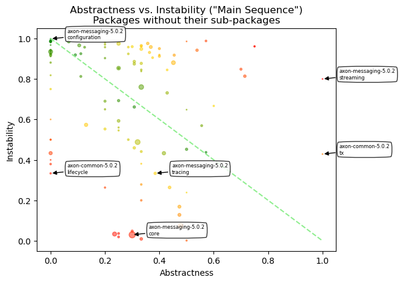
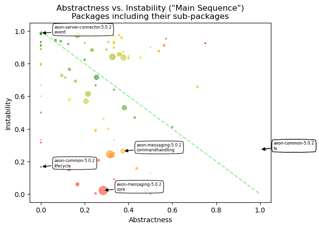

# Object Oriented Design Quality Metrics
   

### References
- [Analyze java package metrics in a graph database](https://joht.github.io/johtizen/data/2023/04/21/java-package-metrics-analysis.html)
- [Calculate metrics](https://101.jqassistant.org/calculate-metrics/index.html)
- [jqassistant](https://jqassistant.org)
- [notebook walks through examples for integrating various packages with Neo4j](https://nicolewhite.github.io/neo4j-jupyter/hello-world.html)
- [OO Design Quality Metrics](https://api.semanticscholar.org/CorpusID:18246616)
- [A Validation of Martin's Metric](https://www.researchgate.net/publication/31598248_A_Validation_of_Martin's_Metric)
- [Neo4j Python Driver](https://neo4j.com/docs/api/python-driver/current)

## Incoming Dependencies

Incoming dependencies are also denoted as "Fan-in", "Afferent Coupling" or "in-degree".
These are the ones that use the listed package. 
   
If these packages get changed, the incoming dependencies might be affected by the change. The more incoming dependencies, the harder it gets to change the code without the need to adapt the dependent code (“rigid code”). Even worse, it might affect the behavior of the dependent code in an unwanted way (“fragile code”).

Since Java Packages are organized hierarchically, incoming dependencies can be count for every package in isolation or by including all of its sub-packages. The latter one is done without top level packages like for example "org" or "org.company" by assuring that only packages are considered that have other packages or types in the same hierarchy level ("siblings").

#### Table 1a
- Show the top 20 Java Packages with the most incoming dependencies
- Set the "incomingDependencies" properties on Package nodes.

<table border="1" class="dataframe">
  <thead>
    <tr style="text-align: right;">
      <th></th>
      <th>artifactName</th>
      <th>fullQualifiedPackageName</th>
      <th>packageName</th>
      <th>incomingDependencies</th>
      <th>incomingDependenciesWeight</th>
      <th>incomingDependentTypes</th>
      <th>incomingDependentInterfaces</th>
      <th>incomingDependentPackages</th>
      <th>incomingDependentArtifacts</th>
    </tr>
  </thead>
  <tbody>
    <tr>
      <th>0</th>
      <td>axon-messaging-5.0.2</td>
      <td>org.axonframework.messaging.core.unitofwork</td>
      <td>unitofwork</td>
      <td>11526</td>
      <td>38914</td>
      <td>240</td>
      <td>54</td>
      <td>61</td>
      <td>4</td>
    </tr>
    <tr>
      <th>1</th>
      <td>axon-messaging-5.0.2</td>
      <td>org.axonframework.messaging.core</td>
      <td>core</td>
      <td>11118</td>
      <td>35970</td>
      <td>408</td>
      <td>79</td>
      <td>70</td>
      <td>7</td>
    </tr>
    <tr>
      <th>2</th>
      <td>axon-common-5.0.2</td>
      <td>org.axonframework.common.configuration</td>
      <td>configuration</td>
      <td>3366</td>
      <td>18028</td>
      <td>146</td>
      <td>50</td>
      <td>32</td>
      <td>8</td>
    </tr>
    <tr>
      <th>3</th>
      <td>axon-messaging-5.0.2</td>
      <td>org.axonframework.messaging.eventhandling</td>
      <td>eventhandling</td>
      <td>3202</td>
      <td>10798</td>
      <td>152</td>
      <td>31</td>
      <td>37</td>
      <td>6</td>
    </tr>
    <tr>
      <th>4</th>
      <td>axon-common-5.0.2</td>
      <td>org.axonframework.common.annotation</td>
      <td>annotation</td>
      <td>2196</td>
      <td>2438</td>
      <td>137</td>
      <td>18</td>
      <td>56</td>
      <td>8</td>
    </tr>
    <tr>
      <th>5</th>
      <td>axon-messaging-5.0.2</td>
      <td>org.axonframework.messaging.commandhandling</td>
      <td>commandhandling</td>
      <td>1463</td>
      <td>5131</td>
      <td>98</td>
      <td>25</td>
      <td>26</td>
      <td>6</td>
    </tr>
    <tr>
      <th>6</th>
      <td>axon-common-5.0.2</td>
      <td>org.axonframework.common.infra</td>
      <td>infra</td>
      <td>1377</td>
      <td>1666</td>
      <td>121</td>
      <td>30</td>
      <td>46</td>
      <td>6</td>
    </tr>
    <tr>
      <th>7</th>
      <td>axon-common-5.0.2</td>
      <td>org.axonframework.common</td>
      <td>common</td>
      <td>895</td>
      <td>2129</td>
      <td>284</td>
      <td>21</td>
      <td>78</td>
      <td>10</td>
    </tr>
    <tr>
      <th>8</th>
      <td>axon-messaging-5.0.2</td>
      <td>org.axonframework.messaging.queryhandling</td>
      <td>queryhandling</td>
      <td>698</td>
      <td>2468</td>
      <td>76</td>
      <td>17</td>
      <td>16</td>
      <td>3</td>
    </tr>
    <tr>
      <th>9</th>
      <td>axon-messaging-5.0.2</td>
      <td>org.axonframework.messaging.core.annotation</td>
      <td>annotation</td>
      <td>487</td>
      <td>1508</td>
      <td>117</td>
      <td>11</td>
      <td>24</td>
      <td>4</td>
    </tr>
    <tr>
      <th>10</th>
      <td>axon-messaging-5.0.2</td>
      <td>org.axonframework.messaging.eventhandling.proc...</td>
      <td>token</td>
      <td>425</td>
      <td>2147</td>
      <td>58</td>
      <td>8</td>
      <td>16</td>
      <td>3</td>
    </tr>
    <tr>
      <th>11</th>
      <td>axon-conversion-5.0.2</td>
      <td>org.axonframework.conversion</td>
      <td>conversion</td>
      <td>415</td>
      <td>1708</td>
      <td>54</td>
      <td>12</td>
      <td>18</td>
      <td>4</td>
    </tr>
    <tr>
      <th>12</th>
      <td>axon-messaging-5.0.2</td>
      <td>org.axonframework.messaging.eventstreaming</td>
      <td>eventstreaming</td>
      <td>293</td>
      <td>833</td>
      <td>53</td>
      <td>14</td>
      <td>10</td>
      <td>3</td>
    </tr>
    <tr>
      <th>13</th>
      <td>axon-eventsourcing-5.0.2</td>
      <td>org.axonframework.eventsourcing.eventstore</td>
      <td>eventstore</td>
      <td>221</td>
      <td>718</td>
      <td>65</td>
      <td>7</td>
      <td>9</td>
      <td>3</td>
    </tr>
    <tr>
      <th>14</th>
      <td>axon-messaging-5.0.2</td>
      <td>org.axonframework.messaging.tracing</td>
      <td>tracing</td>
      <td>136</td>
      <td>478</td>
      <td>36</td>
      <td>7</td>
      <td>6</td>
      <td>1</td>
    </tr>
    <tr>
      <th>15</th>
      <td>axon-test-5.0.2</td>
      <td>org.axonframework.test.fixture</td>
      <td>fixture</td>
      <td>132</td>
      <td>359</td>
      <td>26</td>
      <td>0</td>
      <td>1</td>
      <td>0</td>
    </tr>
    <tr>
      <th>16</th>
      <td>axon-modelling-5.0.2</td>
      <td>org.axonframework.modelling</td>
      <td>modelling</td>
      <td>125</td>
      <td>282</td>
      <td>36</td>
      <td>9</td>
      <td>9</td>
      <td>2</td>
    </tr>
    <tr>
      <th>17</th>
      <td>axon-modelling-5.0.2</td>
      <td>org.axonframework.modelling.entity</td>
      <td>entity</td>
      <td>115</td>
      <td>394</td>
      <td>25</td>
      <td>5</td>
      <td>5</td>
      <td>1</td>
    </tr>
    <tr>
      <th>18</th>
      <td>axon-modelling-5.0.2</td>
      <td>org.axonframework.modelling.entity.child</td>
      <td>child</td>
      <td>89</td>
      <td>230</td>
      <td>28</td>
      <td>7</td>
      <td>3</td>
      <td>0</td>
    </tr>
    <tr>
      <th>19</th>
      <td>axon-messaging-5.0.2</td>
      <td>org.axonframework.messaging.eventhandling.proc...</td>
      <td>segmenting</td>
      <td>86</td>
      <td>662</td>
      <td>31</td>
      <td>5</td>
      <td>10</td>
      <td>1</td>
    </tr>
  </tbody>
</table>

#### Table 1b
- Show the top 20 Java Packages including their sub-packages with the most incoming dependencies
- Set the property "incomingDependenciesIncludingSubpackages" on Package nodes.

<table border="1" class="dataframe">
  <thead>
    <tr style="text-align: right;">
      <th></th>
      <th>artifactName</th>
      <th>fullQualifiedPackageName</th>
      <th>packageName</th>
      <th>incomingDependencies</th>
      <th>incomingDependenciesWeight</th>
      <th>incomingDependentTypes</th>
      <th>incomingDependentInterfaces</th>
      <th>incomingDependentPackages</th>
      <th>incomingDependentArtifacts</th>
    </tr>
  </thead>
  <tbody>
    <tr>
      <th>0</th>
      <td>axon-messaging-5.0.2</td>
      <td>org.axonframework.messaging.core</td>
      <td>core</td>
      <td>18039</td>
      <td>59506</td>
      <td>373</td>
      <td>112</td>
      <td>69</td>
      <td>7</td>
    </tr>
    <tr>
      <th>1</th>
      <td>axon-messaging-5.0.2</td>
      <td>org.axonframework.messaging.core.unitofwork</td>
      <td>unitofwork</td>
      <td>11278</td>
      <td>38018</td>
      <td>226</td>
      <td>54</td>
      <td>59</td>
      <td>5</td>
    </tr>
    <tr>
      <th>2</th>
      <td>axon-common-5.0.2</td>
      <td>org.axonframework.common</td>
      <td>common</td>
      <td>7295</td>
      <td>23086</td>
      <td>462</td>
      <td>104</td>
      <td>90</td>
      <td>9</td>
    </tr>
    <tr>
      <th>3</th>
      <td>axon-common-5.0.2</td>
      <td>org.axonframework.common.configuration</td>
      <td>configuration</td>
      <td>3205</td>
      <td>17368</td>
      <td>106</td>
      <td>50</td>
      <td>31</td>
      <td>8</td>
    </tr>
    <tr>
      <th>4</th>
      <td>axon-common-5.0.2</td>
      <td>org.axonframework.common.annotation</td>
      <td>annotation</td>
      <td>2195</td>
      <td>2437</td>
      <td>136</td>
      <td>18</td>
      <td>55</td>
      <td>8</td>
    </tr>
    <tr>
      <th>5</th>
      <td>axon-messaging-5.0.2</td>
      <td>org.axonframework.messaging.eventhandling</td>
      <td>eventhandling</td>
      <td>2081</td>
      <td>7484</td>
      <td>97</td>
      <td>36</td>
      <td>25</td>
      <td>6</td>
    </tr>
    <tr>
      <th>6</th>
      <td>axon-common-5.0.2</td>
      <td>org.axonframework.common.infra</td>
      <td>infra</td>
      <td>1363</td>
      <td>1592</td>
      <td>116</td>
      <td>30</td>
      <td>45</td>
      <td>6</td>
    </tr>
    <tr>
      <th>7</th>
      <td>axon-messaging-5.0.2</td>
      <td>org.axonframework.messaging.commandhandling</td>
      <td>commandhandling</td>
      <td>883</td>
      <td>3295</td>
      <td>63</td>
      <td>26</td>
      <td>20</td>
      <td>6</td>
    </tr>
    <tr>
      <th>8</th>
      <td>axon-messaging-5.0.2</td>
      <td>org.axonframework.messaging.core.annotation</td>
      <td>annotation</td>
      <td>399</td>
      <td>1202</td>
      <td>81</td>
      <td>11</td>
      <td>23</td>
      <td>4</td>
    </tr>
    <tr>
      <th>9</th>
      <td>axon-conversion-5.0.2</td>
      <td>org.axonframework.conversion</td>
      <td>conversion</td>
      <td>363</td>
      <td>1527</td>
      <td>35</td>
      <td>12</td>
      <td>14</td>
      <td>3</td>
    </tr>
    <tr>
      <th>10</th>
      <td>axon-messaging-5.0.2</td>
      <td>org.axonframework.messaging.eventhandling.proc...</td>
      <td>token</td>
      <td>350</td>
      <td>1416</td>
      <td>45</td>
      <td>8</td>
      <td>11</td>
      <td>4</td>
    </tr>
    <tr>
      <th>11</th>
      <td>axon-messaging-5.0.2</td>
      <td>org.axonframework.messaging.queryhandling</td>
      <td>queryhandling</td>
      <td>279</td>
      <td>897</td>
      <td>34</td>
      <td>15</td>
      <td>12</td>
      <td>5</td>
    </tr>
    <tr>
      <th>12</th>
      <td>axon-messaging-5.0.2</td>
      <td>org.axonframework.messaging.eventstreaming</td>
      <td>eventstreaming</td>
      <td>241</td>
      <td>688</td>
      <td>39</td>
      <td>14</td>
      <td>9</td>
      <td>3</td>
    </tr>
    <tr>
      <th>13</th>
      <td>axon-messaging-5.0.2</td>
      <td>org.axonframework.messaging.eventhandling.proc...</td>
      <td>processing</td>
      <td>217</td>
      <td>685</td>
      <td>30</td>
      <td>13</td>
      <td>10</td>
      <td>5</td>
    </tr>
    <tr>
      <th>14</th>
      <td>axon-messaging-5.0.2</td>
      <td>org.axonframework.messaging.eventhandling.proc...</td>
      <td>streaming</td>
      <td>207</td>
      <td>655</td>
      <td>30</td>
      <td>12</td>
      <td>11</td>
      <td>4</td>
    </tr>
    <tr>
      <th>15</th>
      <td>axon-messaging-5.0.2</td>
      <td>org.axonframework.messaging.tracing</td>
      <td>tracing</td>
      <td>107</td>
      <td>356</td>
      <td>21</td>
      <td>7</td>
      <td>4</td>
      <td>1</td>
    </tr>
    <tr>
      <th>16</th>
      <td>axon-eventsourcing-5.0.2</td>
      <td>org.axonframework.eventsourcing.eventstore</td>
      <td>eventstore</td>
      <td>77</td>
      <td>208</td>
      <td>19</td>
      <td>6</td>
      <td>6</td>
      <td>3</td>
    </tr>
    <tr>
      <th>17</th>
      <td>axon-messaging-5.0.2</td>
      <td>org.axonframework.messaging.eventhandling.proc...</td>
      <td>segmenting</td>
      <td>74</td>
      <td>623</td>
      <td>23</td>
      <td>5</td>
      <td>9</td>
      <td>1</td>
    </tr>
    <tr>
      <th>18</th>
      <td>axon-modelling-5.0.2</td>
      <td>org.axonframework.modelling</td>
      <td>modelling</td>
      <td>74</td>
      <td>226</td>
      <td>13</td>
      <td>20</td>
      <td>4</td>
      <td>1</td>
    </tr>
    <tr>
      <th>19</th>
      <td>axon-messaging-5.0.2</td>
      <td>org.axonframework.messaging.core.conversion</td>
      <td>conversion</td>
      <td>66</td>
      <td>225</td>
      <td>21</td>
      <td>3</td>
      <td>16</td>
      <td>5</td>
    </tr>
  </tbody>
</table>

## Outgoing Dependencies

Outgoing dependencies are also denoted as "Fan-out", "Efferent Coupling" or "out-degree".
These are the ones that are used by the listed package. 

Code from other packages and libraries you’re depending on (outgoing) might change over time. The more outgoing changes, the more likely and frequently code changes are needed. This involves time and effort which can be reduced by automation of tests and version updates. Automated tests are crucial to reveal updates, that change the behavior of the code unexpectedly (“fragile code”). As soon as more effort is required, keeping up becomes difficult (“rigid code”). Not being able to use a newer version might not only restrict features, it can get problematic if there are security issues. This might force you to take “fast but ugly” solutions into account which further increases technical dept.

Since Java Packages are organized hierarchically, outgoing dependencies can be count for every package in isolation or by including all of its sub-packages. The latter one is done without top level packages like for example "org" or "org.company" by assuring that only packages are considered that have other packages or types in the same hierarchy level ("siblings").

#### Table 2a

- Show the top 20 Java Packages with the most outgoing dependencies
- Set the "outgoingDependencies" properties on Package nodes.

<table border="1" class="dataframe">
  <thead>
    <tr style="text-align: right;">
      <th></th>
      <th>artifactName</th>
      <th>fullQualifiedPackageName</th>
      <th>packageName</th>
      <th>outgoingDependencies</th>
      <th>outgoingDependenciesWeight</th>
      <th>outgoingDependentTypes</th>
      <th>outgoingDependentInterfaces</th>
      <th>outgoingDependentPackages</th>
      <th>outgoingDependentArtifacts</th>
    </tr>
  </thead>
  <tbody>
    <tr>
      <th>0</th>
      <td>axon-messaging-5.0.2</td>
      <td>org.axonframework.messaging.core.configuration</td>
      <td>configuration</td>
      <td>2463</td>
      <td>15546</td>
      <td>74</td>
      <td>39</td>
      <td>28</td>
      <td>2</td>
    </tr>
    <tr>
      <th>1</th>
      <td>axon-messaging-5.0.2</td>
      <td>org.axonframework.messaging.eventhandling.proc...</td>
      <td>pooled</td>
      <td>2321</td>
      <td>9770</td>
      <td>96</td>
      <td>46</td>
      <td>20</td>
      <td>1</td>
    </tr>
    <tr>
      <th>2</th>
      <td>axon-server-connector-5.0.2</td>
      <td>org.axonframework.axonserver.connector.event</td>
      <td>event</td>
      <td>1282</td>
      <td>4029</td>
      <td>72</td>
      <td>29</td>
      <td>18</td>
      <td>3</td>
    </tr>
    <tr>
      <th>3</th>
      <td>axon-eventsourcing-5.0.2</td>
      <td>org.axonframework.eventsourcing.eventstore.jpa</td>
      <td>jpa</td>
      <td>1263</td>
      <td>4885</td>
      <td>65</td>
      <td>28</td>
      <td>18</td>
      <td>3</td>
    </tr>
    <tr>
      <th>4</th>
      <td>axon-eventsourcing-5.0.2</td>
      <td>org.axonframework.eventsourcing.configuration</td>
      <td>configuration</td>
      <td>1237</td>
      <td>4801</td>
      <td>66</td>
      <td>41</td>
      <td>25</td>
      <td>3</td>
    </tr>
    <tr>
      <th>5</th>
      <td>axon-messaging-5.0.2</td>
      <td>org.axonframework.messaging.core.interception</td>
      <td>interception</td>
      <td>1084</td>
      <td>5770</td>
      <td>46</td>
      <td>25</td>
      <td>11</td>
      <td>1</td>
    </tr>
    <tr>
      <th>6</th>
      <td>axon-test-5.0.2</td>
      <td>org.axonframework.test.fixture</td>
      <td>fixture</td>
      <td>972</td>
      <td>3461</td>
      <td>73</td>
      <td>39</td>
      <td>16</td>
      <td>3</td>
    </tr>
    <tr>
      <th>7</th>
      <td>axon-modelling-5.0.2</td>
      <td>org.axonframework.modelling.entity.annotation</td>
      <td>annotation</td>
      <td>858</td>
      <td>3265</td>
      <td>64</td>
      <td>30</td>
      <td>19</td>
      <td>3</td>
    </tr>
    <tr>
      <th>8</th>
      <td>axon-modelling-5.0.2</td>
      <td>org.axonframework.modelling.entity</td>
      <td>entity</td>
      <td>800</td>
      <td>2887</td>
      <td>35</td>
      <td>21</td>
      <td>9</td>
      <td>2</td>
    </tr>
    <tr>
      <th>9</th>
      <td>axon-messaging-5.0.2</td>
      <td>org.axonframework.messaging.eventhandling.proc...</td>
      <td>subscribing</td>
      <td>749</td>
      <td>2715</td>
      <td>47</td>
      <td>29</td>
      <td>14</td>
      <td>1</td>
    </tr>
    <tr>
      <th>10</th>
      <td>axon-eventsourcing-5.0.2</td>
      <td>org.axonframework.eventsourcing.eventstore</td>
      <td>eventstore</td>
      <td>700</td>
      <td>2610</td>
      <td>64</td>
      <td>29</td>
      <td>10</td>
      <td>2</td>
    </tr>
    <tr>
      <th>11</th>
      <td>axon-spring-boot-autoconfigure-5.0.2</td>
      <td>org.axonframework.extension.springboot.autoconfig</td>
      <td>autoconfig</td>
      <td>658</td>
      <td>2833</td>
      <td>103</td>
      <td>37</td>
      <td>34</td>
      <td>6</td>
    </tr>
    <tr>
      <th>12</th>
      <td>axon-modelling-5.0.2</td>
      <td>org.axonframework.modelling.configuration</td>
      <td>configuration</td>
      <td>585</td>
      <td>2279</td>
      <td>41</td>
      <td>29</td>
      <td>10</td>
      <td>2</td>
    </tr>
    <tr>
      <th>13</th>
      <td>axon-messaging-5.0.2</td>
      <td>org.axonframework.messaging.queryhandling</td>
      <td>queryhandling</td>
      <td>533</td>
      <td>2104</td>
      <td>48</td>
      <td>23</td>
      <td>9</td>
      <td>2</td>
    </tr>
    <tr>
      <th>14</th>
      <td>axon-messaging-5.0.2</td>
      <td>org.axonframework.messaging.queryhandling.dist...</td>
      <td>distributed</td>
      <td>513</td>
      <td>1412</td>
      <td>38</td>
      <td>23</td>
      <td>10</td>
      <td>1</td>
    </tr>
    <tr>
      <th>15</th>
      <td>axon-messaging-5.0.2</td>
      <td>org.axonframework.messaging.monitoring.interce...</td>
      <td>interception</td>
      <td>500</td>
      <td>1550</td>
      <td>15</td>
      <td>15</td>
      <td>6</td>
      <td>0</td>
    </tr>
    <tr>
      <th>16</th>
      <td>axon-messaging-5.0.2</td>
      <td>org.axonframework.messaging.queryhandling.inte...</td>
      <td>interception</td>
      <td>491</td>
      <td>1561</td>
      <td>26</td>
      <td>16</td>
      <td>6</td>
      <td>1</td>
    </tr>
    <tr>
      <th>17</th>
      <td>axon-messaging-5.0.2</td>
      <td>org.axonframework.messaging.eventhandling.anno...</td>
      <td>annotation</td>
      <td>478</td>
      <td>1359</td>
      <td>49</td>
      <td>22</td>
      <td>14</td>
      <td>1</td>
    </tr>
    <tr>
      <th>18</th>
      <td>axon-messaging-5.0.2</td>
      <td>org.axonframework.messaging.eventhandling</td>
      <td>eventhandling</td>
      <td>471</td>
      <td>1197</td>
      <td>42</td>
      <td>20</td>
      <td>8</td>
      <td>2</td>
    </tr>
    <tr>
      <th>19</th>
      <td>axon-messaging-5.0.2</td>
      <td>org.axonframework.messaging.core.annotation</td>
      <td>annotation</td>
      <td>464</td>
      <td>1548</td>
      <td>74</td>
      <td>16</td>
      <td>10</td>
      <td>1</td>
    </tr>
  </tbody>
</table>

#### Table 2b

- Show the top 20 Java Packages including their sub-packages with the most outgoing dependencies
- Set the property "outgoingDependenciesIncludingSubpackages" on Package nodes.

<table border="1" class="dataframe">
  <thead>
    <tr style="text-align: right;">
      <th></th>
      <th>artifactName</th>
      <th>fullQualifiedPackageName</th>
      <th>packageName</th>
      <th>outgoingDependencies</th>
      <th>outgoingDependenciesWeight</th>
      <th>outgoingDependentTypes</th>
      <th>outgoingDependentInterfaces</th>
      <th>outgoingDependentPackages</th>
      <th>outgoingDependentArtifacts</th>
    </tr>
  </thead>
  <tbody>
    <tr>
      <th>0</th>
      <td>axon-messaging-5.0.2</td>
      <td>org.axonframework.messaging.eventhandling</td>
      <td>eventhandling</td>
      <td>671</td>
      <td>2124</td>
      <td>103</td>
      <td>47</td>
      <td>20</td>
      <td>2</td>
    </tr>
    <tr>
      <th>1</th>
      <td>axon-messaging-5.0.2</td>
      <td>org.axonframework.messaging.core</td>
      <td>core</td>
      <td>402</td>
      <td>1431</td>
      <td>85</td>
      <td>72</td>
      <td>26</td>
      <td>2</td>
    </tr>
    <tr>
      <th>2</th>
      <td>axon-modelling-5.0.2</td>
      <td>org.axonframework.modelling</td>
      <td>modelling</td>
      <td>381</td>
      <td>1124</td>
      <td>66</td>
      <td>23</td>
      <td>19</td>
      <td>2</td>
    </tr>
    <tr>
      <th>3</th>
      <td>axon-messaging-5.0.2</td>
      <td>org.axonframework.messaging.eventhandling.proc...</td>
      <td>processing</td>
      <td>345</td>
      <td>1265</td>
      <td>76</td>
      <td>13</td>
      <td>17</td>
      <td>2</td>
    </tr>
    <tr>
      <th>4</th>
      <td>axon-eventsourcing-5.0.2</td>
      <td>org.axonframework.eventsourcing</td>
      <td>eventsourcing</td>
      <td>329</td>
      <td>1064</td>
      <td>99</td>
      <td>14</td>
      <td>32</td>
      <td>3</td>
    </tr>
    <tr>
      <th>5</th>
      <td>axon-messaging-5.0.2</td>
      <td>org.axonframework.messaging.commandhandling</td>
      <td>commandhandling</td>
      <td>315</td>
      <td>1014</td>
      <td>72</td>
      <td>29</td>
      <td>14</td>
      <td>2</td>
    </tr>
    <tr>
      <th>6</th>
      <td>axon-messaging-5.0.2</td>
      <td>org.axonframework.messaging.queryhandling</td>
      <td>queryhandling</td>
      <td>314</td>
      <td>1122</td>
      <td>73</td>
      <td>19</td>
      <td>12</td>
      <td>2</td>
    </tr>
    <tr>
      <th>7</th>
      <td>axon-messaging-5.0.2</td>
      <td>org.axonframework.messaging.eventhandling.proc...</td>
      <td>streaming</td>
      <td>274</td>
      <td>1006</td>
      <td>77</td>
      <td>11</td>
      <td>19</td>
      <td>2</td>
    </tr>
    <tr>
      <th>8</th>
      <td>axon-modelling-5.0.2</td>
      <td>org.axonframework.modelling.entity</td>
      <td>entity</td>
      <td>270</td>
      <td>856</td>
      <td>47</td>
      <td>11</td>
      <td>17</td>
      <td>3</td>
    </tr>
    <tr>
      <th>9</th>
      <td>axon-server-connector-5.0.2</td>
      <td>org.axonframework.axonserver.connector</td>
      <td>connector</td>
      <td>253</td>
      <td>866</td>
      <td>107</td>
      <td>2</td>
      <td>24</td>
      <td>3</td>
    </tr>
    <tr>
      <th>10</th>
      <td>axon-messaging-5.0.2</td>
      <td>org.axonframework.messaging.eventhandling.proc...</td>
      <td>pooled</td>
      <td>231</td>
      <td>919</td>
      <td>73</td>
      <td>2</td>
      <td>19</td>
      <td>1</td>
    </tr>
    <tr>
      <th>11</th>
      <td>axon-eventsourcing-5.0.2</td>
      <td>org.axonframework.eventsourcing.eventstore</td>
      <td>eventstore</td>
      <td>194</td>
      <td>599</td>
      <td>57</td>
      <td>7</td>
      <td>17</td>
      <td>3</td>
    </tr>
    <tr>
      <th>12</th>
      <td>axon-modelling-5.0.2</td>
      <td>org.axonframework.modelling.entity.annotation</td>
      <td>annotation</td>
      <td>179</td>
      <td>681</td>
      <td>49</td>
      <td>5</td>
      <td>18</td>
      <td>3</td>
    </tr>
    <tr>
      <th>13</th>
      <td>axon-messaging-5.0.2</td>
      <td>org.axonframework.messaging.core.unitofwork</td>
      <td>unitofwork</td>
      <td>176</td>
      <td>693</td>
      <td>12</td>
      <td>54</td>
      <td>6</td>
      <td>1</td>
    </tr>
    <tr>
      <th>14</th>
      <td>axon-messaging-5.0.2</td>
      <td>org.axonframework.messaging.core.interception</td>
      <td>interception</td>
      <td>166</td>
      <td>587</td>
      <td>43</td>
      <td>0</td>
      <td>11</td>
      <td>1</td>
    </tr>
    <tr>
      <th>15</th>
      <td>axon-test-5.0.2</td>
      <td>org.axonframework.test</td>
      <td>test</td>
      <td>160</td>
      <td>479</td>
      <td>45</td>
      <td>9</td>
      <td>14</td>
      <td>2</td>
    </tr>
    <tr>
      <th>16</th>
      <td>axon-server-connector-5.0.2</td>
      <td>org.axonframework.axonserver.connector.event</td>
      <td>event</td>
      <td>142</td>
      <td>416</td>
      <td>59</td>
      <td>0</td>
      <td>17</td>
      <td>3</td>
    </tr>
    <tr>
      <th>17</th>
      <td>axon-test-5.0.2</td>
      <td>org.axonframework.test.fixture</td>
      <td>fixture</td>
      <td>132</td>
      <td>472</td>
      <td>43</td>
      <td>8</td>
      <td>15</td>
      <td>3</td>
    </tr>
    <tr>
      <th>18</th>
      <td>axon-messaging-5.0.2</td>
      <td>org.axonframework.messaging.core.annotation</td>
      <td>annotation</td>
      <td>124</td>
      <td>337</td>
      <td>36</td>
      <td>8</td>
      <td>9</td>
      <td>1</td>
    </tr>
    <tr>
      <th>19</th>
      <td>axon-spring-boot-autoconfigure-5.0.2</td>
      <td>org.axonframework.extension.springboot.autoconfig</td>
      <td>autoconfig</td>
      <td>121</td>
      <td>437</td>
      <td>79</td>
      <td>0</td>
      <td>33</td>
      <td>6</td>
    </tr>
  </tbody>
</table>

## Instability

$$ Instability = \frac{Outgoing\:Dependencies}{Outgoing\:Dependencies + Incoming\:Dependencies} $$

*Instability* is expressed as the ratio of the number of outgoing dependencies of a module (i.e., the number of packages that depend on it) to the total number of dependencies (i.e., the sum of incoming and outgoing dependencies).

Small values near zero indicate low *Instability*. With no outgoing but some incoming dependencies the Instability is zero which is denoted as maximally stable. Such code units are more rigid and difficult to change without impacting other parts of the system. If they are changed less because of that, they are considered stable.

Conversely, high values approaching one indicate high *Instability*. With some outgoing dependencies but no incoming ones the *Instability* is denoted as maximally unstable. Such code units are easier to change without affecting other modules, making them more flexible and less prone to cascading changes throughout the system. If they are changed more often because of that, they are considered unstable.

Since Java Packages are organized hierarchically, *Instability* can be calculated for every package in isolation or by including all of its sub-packages. 

#### Table 3a

- Show the top 20 Java Packages with the lowest *Instability*
- Set the property "instability" on Package nodes. 

<table border="1" class="dataframe">
  <thead>
    <tr style="text-align: right;">
      <th></th>
      <th>artifactName</th>
      <th>fullQualifiedPackageName</th>
      <th>packageName</th>
      <th>instability</th>
      <th>instabilityTypes</th>
      <th>instabilityInterfaces</th>
      <th>instabilityPackages</th>
      <th>instabilityArtifacts</th>
      <th>p.outgoingDependencies</th>
      <th>p.incomingDependencies</th>
      <th>p.outgoingDependentTypes</th>
      <th>p.incomingDependentTypes</th>
      <th>p.outgoingDependentInterfaces</th>
      <th>p.incomingDependentInterfaces</th>
      <th>p.outgoingDependentPackages</th>
      <th>p.incomingDependentPackages</th>
      <th>p.outgoingDependentArtifacts</th>
      <th>p.incomingDependentArtifacts</th>
    </tr>
  </thead>
  <tbody>
    <tr>
      <th>0</th>
      <td>axon-common-5.0.2</td>
      <td>org.axonframework.common.annotation</td>
      <td>annotation</td>
      <td>0.001364</td>
      <td>0.021429</td>
      <td>0.000000</td>
      <td>0.034483</td>
      <td>0.000000</td>
      <td>3</td>
      <td>2196</td>
      <td>3</td>
      <td>137</td>
      <td>0</td>
      <td>18</td>
      <td>2</td>
      <td>56</td>
      <td>0</td>
      <td>8</td>
    </tr>
    <tr>
      <th>1</th>
      <td>axon-messaging-5.0.2</td>
      <td>org.axonframework.messaging.core.unitofwork</td>
      <td>unitofwork</td>
      <td>0.009283</td>
      <td>0.080460</td>
      <td>0.142857</td>
      <td>0.089552</td>
      <td>0.200000</td>
      <td>108</td>
      <td>11526</td>
      <td>21</td>
      <td>240</td>
      <td>9</td>
      <td>54</td>
      <td>6</td>
      <td>61</td>
      <td>1</td>
      <td>4</td>
    </tr>
    <tr>
      <th>2</th>
      <td>axon-common-5.0.2</td>
      <td>org.axonframework.common.infra</td>
      <td>infra</td>
      <td>0.019231</td>
      <td>0.076336</td>
      <td>0.090909</td>
      <td>0.061224</td>
      <td>0.000000</td>
      <td>27</td>
      <td>1377</td>
      <td>10</td>
      <td>121</td>
      <td>3</td>
      <td>30</td>
      <td>3</td>
      <td>46</td>
      <td>0</td>
      <td>6</td>
    </tr>
    <tr>
      <th>3</th>
      <td>axon-messaging-5.0.2</td>
      <td>org.axonframework.messaging.core</td>
      <td>core</td>
      <td>0.029758</td>
      <td>0.163934</td>
      <td>0.177083</td>
      <td>0.102564</td>
      <td>0.222222</td>
      <td>341</td>
      <td>11118</td>
      <td>80</td>
      <td>408</td>
      <td>17</td>
      <td>79</td>
      <td>8</td>
      <td>70</td>
      <td>2</td>
      <td>7</td>
    </tr>
    <tr>
      <th>4</th>
      <td>axon-common-5.0.2</td>
      <td>org.axonframework.common</td>
      <td>common</td>
      <td>0.033477</td>
      <td>0.056478</td>
      <td>0.000000</td>
      <td>0.012658</td>
      <td>0.000000</td>
      <td>31</td>
      <td>895</td>
      <td>17</td>
      <td>284</td>
      <td>0</td>
      <td>21</td>
      <td>1</td>
      <td>78</td>
      <td>0</td>
      <td>10</td>
    </tr>
    <tr>
      <th>5</th>
      <td>axon-messaging-5.0.2</td>
      <td>org.axonframework.messaging.eventhandling.proc...</td>
      <td>token</td>
      <td>0.036281</td>
      <td>0.121212</td>
      <td>0.200000</td>
      <td>0.157895</td>
      <td>0.250000</td>
      <td>16</td>
      <td>425</td>
      <td>8</td>
      <td>58</td>
      <td>2</td>
      <td>8</td>
      <td>3</td>
      <td>16</td>
      <td>1</td>
      <td>3</td>
    </tr>
    <tr>
      <th>6</th>
      <td>axon-conversion-5.0.2</td>
      <td>org.axonframework.conversion</td>
      <td>conversion</td>
      <td>0.048165</td>
      <td>0.156250</td>
      <td>0.250000</td>
      <td>0.142857</td>
      <td>0.200000</td>
      <td>21</td>
      <td>415</td>
      <td>10</td>
      <td>54</td>
      <td>4</td>
      <td>12</td>
      <td>3</td>
      <td>18</td>
      <td>1</td>
      <td>4</td>
    </tr>
    <tr>
      <th>7</th>
      <td>axon-common-5.0.2</td>
      <td>org.axonframework.common.configuration</td>
      <td>configuration</td>
      <td>0.074257</td>
      <td>0.262626</td>
      <td>0.295775</td>
      <td>0.135135</td>
      <td>0.000000</td>
      <td>270</td>
      <td>3366</td>
      <td>52</td>
      <td>146</td>
      <td>21</td>
      <td>50</td>
      <td>5</td>
      <td>32</td>
      <td>0</td>
      <td>8</td>
    </tr>
    <tr>
      <th>8</th>
      <td>axon-messaging-5.0.2</td>
      <td>org.axonframework.messaging.eventhandling</td>
      <td>eventhandling</td>
      <td>0.128233</td>
      <td>0.216495</td>
      <td>0.392157</td>
      <td>0.177778</td>
      <td>0.250000</td>
      <td>471</td>
      <td>3202</td>
      <td>42</td>
      <td>152</td>
      <td>20</td>
      <td>31</td>
      <td>8</td>
      <td>37</td>
      <td>2</td>
      <td>6</td>
    </tr>
    <tr>
      <th>9</th>
      <td>axon-messaging-5.0.2</td>
      <td>org.axonframework.messaging.commandhandling</td>
      <td>commandhandling</td>
      <td>0.168750</td>
      <td>0.263158</td>
      <td>0.431818</td>
      <td>0.187500</td>
      <td>0.250000</td>
      <td>297</td>
      <td>1463</td>
      <td>35</td>
      <td>98</td>
      <td>19</td>
      <td>25</td>
      <td>6</td>
      <td>26</td>
      <td>2</td>
      <td>6</td>
    </tr>
    <tr>
      <th>10</th>
      <td>axon-common-5.0.2</td>
      <td>org.axonframework.common.util</td>
      <td>util</td>
      <td>0.200000</td>
      <td>0.153846</td>
      <td>0.000000</td>
      <td>0.250000</td>
      <td>0.000000</td>
      <td>3</td>
      <td>12</td>
      <td>2</td>
      <td>11</td>
      <td>0</td>
      <td>0</td>
      <td>2</td>
      <td>6</td>
      <td>0</td>
      <td>2</td>
    </tr>
    <tr>
      <th>11</th>
      <td>axon-messaging-5.0.2</td>
      <td>org.axonframework.messaging.core.conversion</td>
      <td>conversion</td>
      <td>0.238636</td>
      <td>0.185185</td>
      <td>0.571429</td>
      <td>0.227273</td>
      <td>0.285714</td>
      <td>21</td>
      <td>67</td>
      <td>5</td>
      <td>22</td>
      <td>4</td>
      <td>3</td>
      <td>5</td>
      <td>17</td>
      <td>2</td>
      <td>5</td>
    </tr>
    <tr>
      <th>12</th>
      <td>axon-messaging-5.0.2</td>
      <td>org.axonframework.messaging.eventhandling.proc...</td>
      <td>store</td>
      <td>0.263158</td>
      <td>0.190476</td>
      <td>1.000000</td>
      <td>0.400000</td>
      <td>0.333333</td>
      <td>10</td>
      <td>28</td>
      <td>4</td>
      <td>17</td>
      <td>2</td>
      <td>0</td>
      <td>4</td>
      <td>6</td>
      <td>1</td>
      <td>2</td>
    </tr>
    <tr>
      <th>13</th>
      <td>axon-messaging-5.0.2</td>
      <td>org.axonframework.messaging.eventstreaming</td>
      <td>eventstreaming</td>
      <td>0.263819</td>
      <td>0.320513</td>
      <td>0.461538</td>
      <td>0.375000</td>
      <td>0.250000</td>
      <td>105</td>
      <td>293</td>
      <td>25</td>
      <td>53</td>
      <td>12</td>
      <td>14</td>
      <td>6</td>
      <td>10</td>
      <td>1</td>
      <td>3</td>
    </tr>
    <tr>
      <th>14</th>
      <td>axon-messaging-5.0.2</td>
      <td>org.axonframework.messaging.monitoring</td>
      <td>monitoring</td>
      <td>0.278481</td>
      <td>0.195122</td>
      <td>0.666667</td>
      <td>0.307692</td>
      <td>0.333333</td>
      <td>22</td>
      <td>57</td>
      <td>8</td>
      <td>33</td>
      <td>4</td>
      <td>2</td>
      <td>4</td>
      <td>9</td>
      <td>1</td>
      <td>2</td>
    </tr>
    <tr>
      <th>15</th>
      <td>axon-common-5.0.2</td>
      <td>org.axonframework.common.lifecycle</td>
      <td>lifecycle</td>
      <td>0.333333</td>
      <td>0.444444</td>
      <td>0.000000</td>
      <td>0.333333</td>
      <td>0.000000</td>
      <td>4</td>
      <td>8</td>
      <td>4</td>
      <td>5</td>
      <td>0</td>
      <td>0</td>
      <td>2</td>
      <td>4</td>
      <td>0</td>
      <td>1</td>
    </tr>
    <tr>
      <th>16</th>
      <td>axon-messaging-5.0.2</td>
      <td>org.axonframework.messaging.tracing</td>
      <td>tracing</td>
      <td>0.333333</td>
      <td>0.320755</td>
      <td>0.533333</td>
      <td>0.454545</td>
      <td>0.500000</td>
      <td>68</td>
      <td>136</td>
      <td>17</td>
      <td>36</td>
      <td>8</td>
      <td>7</td>
      <td>5</td>
      <td>6</td>
      <td>1</td>
      <td>1</td>
    </tr>
    <tr>
      <th>17</th>
      <td>axon-update-5.0.2</td>
      <td>org.axonframework.update.api</td>
      <td>api</td>
      <td>0.379310</td>
      <td>0.384615</td>
      <td>0.000000</td>
      <td>0.400000</td>
      <td>1.000000</td>
      <td>11</td>
      <td>18</td>
      <td>5</td>
      <td>8</td>
      <td>0</td>
      <td>1</td>
      <td>2</td>
      <td>3</td>
      <td>1</td>
      <td>0</td>
    </tr>
    <tr>
      <th>18</th>
      <td>axon-messaging-5.0.2</td>
      <td>org.axonframework.messaging.eventhandling.proc...</td>
      <td>errorhandling</td>
      <td>0.380952</td>
      <td>0.384615</td>
      <td>0.750000</td>
      <td>0.500000</td>
      <td>0.000000</td>
      <td>8</td>
      <td>13</td>
      <td>5</td>
      <td>8</td>
      <td>3</td>
      <td>1</td>
      <td>4</td>
      <td>4</td>
      <td>0</td>
      <td>0</td>
    </tr>
    <tr>
      <th>19</th>
      <td>axon-test-5.0.2</td>
      <td>org.axonframework.test.server</td>
      <td>server</td>
      <td>0.400000</td>
      <td>0.400000</td>
      <td>0.000000</td>
      <td>0.500000</td>
      <td>0.500000</td>
      <td>2</td>
      <td>3</td>
      <td>2</td>
      <td>3</td>
      <td>0</td>
      <td>0</td>
      <td>2</td>
      <td>2</td>
      <td>1</td>
      <td>1</td>
    </tr>
  </tbody>
</table>

#### Table 3b

- Show the top 20 Java Packages including their sub-packages with the lowest *Instability*
- Set the property "instabilityIncludingSubpackages" on Package nodes. 

<table border="1" class="dataframe">
  <thead>
    <tr style="text-align: right;">
      <th></th>
      <th>artifactName</th>
      <th>fullQualifiedPackageName</th>
      <th>packageName</th>
      <th>instability</th>
      <th>instabilityTypes</th>
      <th>instabilityInterfaces</th>
      <th>instabilityPackages</th>
      <th>instabilityArtifacts</th>
      <th>p.outgoingDependenciesIncludingSubpackages</th>
      <th>p.incomingDependenciesIncludingSubpackages</th>
      <th>p.outgoingDependentTypesIncludingSubpackages</th>
      <th>p.incomingDependentTypesIncludingSubpackages</th>
      <th>p.outgoingDependentInterfacesIncludingSubpackages</th>
      <th>p.incomingDependentInterfacesIncludingSubpackages</th>
      <th>p.outgoingDependentPackagesIncludingSubpackages</th>
      <th>p.incomingDependentPackagesIncludingSubpackages</th>
      <th>p.outgoingDependentArtifactsIncludingSubpackages</th>
      <th>p.incomingDependentArtifactsIncludingSubpackages</th>
    </tr>
  </thead>
  <tbody>
    <tr>
      <th>0</th>
      <td>axon-common-5.0.2</td>
      <td>org.axonframework.common.annotation</td>
      <td>annotation</td>
      <td>0.000910</td>
      <td>0.014493</td>
      <td>0.000000</td>
      <td>0.017857</td>
      <td>0.000000</td>
      <td>2</td>
      <td>2195</td>
      <td>2</td>
      <td>136</td>
      <td>0</td>
      <td>18</td>
      <td>1</td>
      <td>55</td>
      <td>0</td>
      <td>8</td>
    </tr>
    <tr>
      <th>1</th>
      <td>axon-common-5.0.2</td>
      <td>org.axonframework.common.infra</td>
      <td>infra</td>
      <td>0.003655</td>
      <td>0.025210</td>
      <td>0.000000</td>
      <td>0.042553</td>
      <td>0.000000</td>
      <td>5</td>
      <td>1363</td>
      <td>3</td>
      <td>116</td>
      <td>0</td>
      <td>30</td>
      <td>2</td>
      <td>45</td>
      <td>0</td>
      <td>6</td>
    </tr>
    <tr>
      <th>2</th>
      <td>axon-messaging-5.0.2</td>
      <td>org.axonframework.messaging.core.unitofwork</td>
      <td>unitofwork</td>
      <td>0.015366</td>
      <td>0.050420</td>
      <td>0.500000</td>
      <td>0.092308</td>
      <td>0.166667</td>
      <td>176</td>
      <td>11278</td>
      <td>12</td>
      <td>226</td>
      <td>54</td>
      <td>54</td>
      <td>6</td>
      <td>59</td>
      <td>1</td>
      <td>5</td>
    </tr>
    <tr>
      <th>3</th>
      <td>axon-common-5.0.2</td>
      <td>org.axonframework.common.configuration</td>
      <td>configuration</td>
      <td>0.021075</td>
      <td>0.070175</td>
      <td>0.425287</td>
      <td>0.114286</td>
      <td>0.000000</td>
      <td>69</td>
      <td>3205</td>
      <td>8</td>
      <td>106</td>
      <td>37</td>
      <td>50</td>
      <td>4</td>
      <td>31</td>
      <td>0</td>
      <td>8</td>
    </tr>
    <tr>
      <th>4</th>
      <td>axon-messaging-5.0.2</td>
      <td>org.axonframework.messaging.core</td>
      <td>core</td>
      <td>0.021799</td>
      <td>0.185590</td>
      <td>0.391304</td>
      <td>0.273684</td>
      <td>0.222222</td>
      <td>402</td>
      <td>18039</td>
      <td>85</td>
      <td>373</td>
      <td>72</td>
      <td>112</td>
      <td>26</td>
      <td>69</td>
      <td>2</td>
      <td>7</td>
    </tr>
    <tr>
      <th>5</th>
      <td>axon-conversion-5.0.2</td>
      <td>org.axonframework.conversion</td>
      <td>conversion</td>
      <td>0.059585</td>
      <td>0.146341</td>
      <td>0.500000</td>
      <td>0.176471</td>
      <td>0.000000</td>
      <td>23</td>
      <td>363</td>
      <td>6</td>
      <td>35</td>
      <td>12</td>
      <td>12</td>
      <td>3</td>
      <td>14</td>
      <td>0</td>
      <td>3</td>
    </tr>
    <tr>
      <th>6</th>
      <td>axon-common-5.0.2</td>
      <td>org.axonframework.common.util</td>
      <td>util</td>
      <td>0.090909</td>
      <td>0.100000</td>
      <td>0.000000</td>
      <td>0.166667</td>
      <td>0.000000</td>
      <td>1</td>
      <td>10</td>
      <td>1</td>
      <td>9</td>
      <td>0</td>
      <td>0</td>
      <td>1</td>
      <td>5</td>
      <td>0</td>
      <td>1</td>
    </tr>
    <tr>
      <th>7</th>
      <td>axon-messaging-5.0.2</td>
      <td>org.axonframework.messaging.core.conversion</td>
      <td>conversion</td>
      <td>0.131579</td>
      <td>0.160000</td>
      <td>0.500000</td>
      <td>0.200000</td>
      <td>0.285714</td>
      <td>10</td>
      <td>66</td>
      <td>4</td>
      <td>21</td>
      <td>3</td>
      <td>3</td>
      <td>4</td>
      <td>16</td>
      <td>2</td>
      <td>5</td>
    </tr>
    <tr>
      <th>8</th>
      <td>axon-messaging-5.0.2</td>
      <td>org.axonframework.messaging.eventhandling.proc...</td>
      <td>token</td>
      <td>0.152542</td>
      <td>0.328358</td>
      <td>0.500000</td>
      <td>0.450000</td>
      <td>0.333333</td>
      <td>63</td>
      <td>350</td>
      <td>22</td>
      <td>45</td>
      <td>8</td>
      <td>8</td>
      <td>9</td>
      <td>11</td>
      <td>2</td>
      <td>4</td>
    </tr>
    <tr>
      <th>9</th>
      <td>axon-messaging-5.0.2</td>
      <td>org.axonframework.messaging.eventstreaming</td>
      <td>eventstreaming</td>
      <td>0.157343</td>
      <td>0.204082</td>
      <td>0.500000</td>
      <td>0.357143</td>
      <td>0.250000</td>
      <td>45</td>
      <td>241</td>
      <td>10</td>
      <td>39</td>
      <td>14</td>
      <td>14</td>
      <td>5</td>
      <td>9</td>
      <td>1</td>
      <td>3</td>
    </tr>
    <tr>
      <th>10</th>
      <td>axon-common-5.0.2</td>
      <td>org.axonframework.common.lifecycle</td>
      <td>lifecycle</td>
      <td>0.166667</td>
      <td>0.250000</td>
      <td>0.000000</td>
      <td>0.250000</td>
      <td>0.000000</td>
      <td>1</td>
      <td>5</td>
      <td>1</td>
      <td>3</td>
      <td>0</td>
      <td>0</td>
      <td>1</td>
      <td>3</td>
      <td>0</td>
      <td>1</td>
    </tr>
    <tr>
      <th>11</th>
      <td>axon-messaging-5.0.2</td>
      <td>org.axonframework.messaging.tracing</td>
      <td>tracing</td>
      <td>0.207407</td>
      <td>0.300000</td>
      <td>0.461538</td>
      <td>0.500000</td>
      <td>0.500000</td>
      <td>28</td>
      <td>107</td>
      <td>9</td>
      <td>21</td>
      <td>6</td>
      <td>7</td>
      <td>4</td>
      <td>4</td>
      <td>1</td>
      <td>1</td>
    </tr>
    <tr>
      <th>12</th>
      <td>axon-messaging-5.0.2</td>
      <td>org.axonframework.messaging.eventhandling.proc...</td>
      <td>errorhandling</td>
      <td>0.230769</td>
      <td>0.333333</td>
      <td>0.500000</td>
      <td>0.500000</td>
      <td>0.000000</td>
      <td>3</td>
      <td>10</td>
      <td>3</td>
      <td>6</td>
      <td>1</td>
      <td>1</td>
      <td>3</td>
      <td>3</td>
      <td>0</td>
      <td>0</td>
    </tr>
    <tr>
      <th>13</th>
      <td>axon-messaging-5.0.2</td>
      <td>org.axonframework.messaging.core.annotation</td>
      <td>annotation</td>
      <td>0.237094</td>
      <td>0.307692</td>
      <td>0.421053</td>
      <td>0.281250</td>
      <td>0.200000</td>
      <td>124</td>
      <td>399</td>
      <td>36</td>
      <td>81</td>
      <td>8</td>
      <td>11</td>
      <td>9</td>
      <td>23</td>
      <td>1</td>
      <td>4</td>
    </tr>
    <tr>
      <th>14</th>
      <td>axon-messaging-5.0.2</td>
      <td>org.axonframework.messaging.eventhandling</td>
      <td>eventhandling</td>
      <td>0.243823</td>
      <td>0.515000</td>
      <td>0.566265</td>
      <td>0.444444</td>
      <td>0.250000</td>
      <td>671</td>
      <td>2081</td>
      <td>103</td>
      <td>97</td>
      <td>47</td>
      <td>36</td>
      <td>20</td>
      <td>25</td>
      <td>2</td>
      <td>6</td>
    </tr>
    <tr>
      <th>15</th>
      <td>axon-common-5.0.2</td>
      <td>org.axonframework.common.jdbc</td>
      <td>jdbc</td>
      <td>0.250000</td>
      <td>0.266667</td>
      <td>0.000000</td>
      <td>0.500000</td>
      <td>0.000000</td>
      <td>5</td>
      <td>15</td>
      <td>4</td>
      <td>11</td>
      <td>0</td>
      <td>0</td>
      <td>4</td>
      <td>4</td>
      <td>0</td>
      <td>2</td>
    </tr>
    <tr>
      <th>16</th>
      <td>axon-common-5.0.2</td>
      <td>org.axonframework.common.property</td>
      <td>property</td>
      <td>0.250000</td>
      <td>0.400000</td>
      <td>0.000000</td>
      <td>0.250000</td>
      <td>0.000000</td>
      <td>2</td>
      <td>6</td>
      <td>2</td>
      <td>3</td>
      <td>0</td>
      <td>0</td>
      <td>1</td>
      <td>3</td>
      <td>0</td>
      <td>1</td>
    </tr>
    <tr>
      <th>17</th>
      <td>axon-spring-boot-autoconfigure-5.0.2</td>
      <td>org.axonframework.extension.springboot.util</td>
      <td>util</td>
      <td>0.250000</td>
      <td>0.333333</td>
      <td>0.000000</td>
      <td>0.500000</td>
      <td>0.000000</td>
      <td>1</td>
      <td>3</td>
      <td>1</td>
      <td>2</td>
      <td>0</td>
      <td>0</td>
      <td>1</td>
      <td>1</td>
      <td>0</td>
      <td>0</td>
    </tr>
    <tr>
      <th>18</th>
      <td>axon-messaging-5.0.2</td>
      <td>org.axonframework.messaging.commandhandling</td>
      <td>commandhandling</td>
      <td>0.262938</td>
      <td>0.533333</td>
      <td>0.527273</td>
      <td>0.411765</td>
      <td>0.250000</td>
      <td>315</td>
      <td>883</td>
      <td>72</td>
      <td>63</td>
      <td>29</td>
      <td>26</td>
      <td>14</td>
      <td>20</td>
      <td>2</td>
      <td>6</td>
    </tr>
    <tr>
      <th>19</th>
      <td>axon-modelling-5.0.2</td>
      <td>org.axonframework.modelling.repository</td>
      <td>repository</td>
      <td>0.266667</td>
      <td>0.333333</td>
      <td>0.500000</td>
      <td>0.400000</td>
      <td>0.500000</td>
      <td>24</td>
      <td>66</td>
      <td>7</td>
      <td>14</td>
      <td>5</td>
      <td>5</td>
      <td>4</td>
      <td>6</td>
      <td>1</td>
      <td>1</td>
    </tr>
  </tbody>
</table>

## Abstractness

$$ Abstractness = \frac{abstract\:classes\:in\:category}{total\:number\:of\:classes\:in\:category} $$

Package *Abstractness* is expressed as the ratio of the number of abstract classes and interfaces to the total number of classes of a package.

Zero *Abstractness* means that there are no abstract types or interfaces in the package. On the other hand, a value of one means that there are only abstract types.

Since Java Packages are organized hierarchically, *Abstractness* can be calculated for every package in isolation or by including all of its sub-packages. 

#### Table 4a

- Show the top 30 packages with the lowest *Abstractness*
- Set the property "abstractness" on Package nodes. 

<table border="1" class="dataframe">
  <thead>
    <tr style="text-align: right;">
      <th></th>
      <th>artifactName</th>
      <th>fullQualifiedPackageName</th>
      <th>packageName</th>
      <th>abstractness</th>
      <th>numberAbstractTypes</th>
      <th>numberTypes</th>
    </tr>
  </thead>
  <tbody>
    <tr>
      <th>0</th>
      <td>axon-spring-boot-autoconfigure-5.0.2</td>
      <td>org.axonframework.extension.springboot.autoconfig</td>
      <td>autoconfig</td>
      <td>0.0</td>
      <td>0</td>
      <td>35</td>
    </tr>
    <tr>
      <th>1</th>
      <td>axon-spring-boot-autoconfigure-5.0.2</td>
      <td>org.axonframework.extension.springboot</td>
      <td>springboot</td>
      <td>0.0</td>
      <td>0</td>
      <td>22</td>
    </tr>
    <tr>
      <th>2</th>
      <td>axon-server-connector-5.0.2</td>
      <td>org.axonframework.axonserver.connector.event</td>
      <td>event</td>
      <td>0.0</td>
      <td>0</td>
      <td>14</td>
    </tr>
    <tr>
      <th>3</th>
      <td>axon-metrics-micrometer-5.0.2</td>
      <td>org.axonframework.extension.metrics.micrometer</td>
      <td>micrometer</td>
      <td>0.0</td>
      <td>0</td>
      <td>12</td>
    </tr>
    <tr>
      <th>4</th>
      <td>axon-messaging-5.0.2</td>
      <td>org.axonframework.messaging.queryhandling.inte...</td>
      <td>interception</td>
      <td>0.0</td>
      <td>0</td>
      <td>8</td>
    </tr>
    <tr>
      <th>5</th>
      <td>axon-messaging-5.0.2</td>
      <td>org.axonframework.messaging.core.timeout</td>
      <td>timeout</td>
      <td>0.0</td>
      <td>0</td>
      <td>8</td>
    </tr>
    <tr>
      <th>6</th>
      <td>axon-update-5.0.2</td>
      <td>org.axonframework.update.api</td>
      <td>api</td>
      <td>0.0</td>
      <td>0</td>
      <td>6</td>
    </tr>
    <tr>
      <th>7</th>
      <td>axon-messaging-5.0.2</td>
      <td>org.axonframework.messaging.tracing.attributes</td>
      <td>attributes</td>
      <td>0.0</td>
      <td>0</td>
      <td>6</td>
    </tr>
    <tr>
      <th>8</th>
      <td>axon-server-connector-5.0.2</td>
      <td>org.axonframework.axonserver.connector.command</td>
      <td>command</td>
      <td>0.0</td>
      <td>0</td>
      <td>6</td>
    </tr>
    <tr>
      <th>9</th>
      <td>axon-messaging-5.0.2</td>
      <td>org.axonframework.messaging.monitoring.interce...</td>
      <td>interception</td>
      <td>0.0</td>
      <td>0</td>
      <td>5</td>
    </tr>
    <tr>
      <th>10</th>
      <td>axon-messaging-5.0.2</td>
      <td>org.axonframework.messaging.commandhandling.in...</td>
      <td>interception</td>
      <td>0.0</td>
      <td>0</td>
      <td>5</td>
    </tr>
    <tr>
      <th>11</th>
      <td>axon-conversion-5.0.2</td>
      <td>org.axonframework.conversion.converter</td>
      <td>converter</td>
      <td>0.0</td>
      <td>0</td>
      <td>5</td>
    </tr>
    <tr>
      <th>12</th>
      <td>axon-conversion-5.0.2</td>
      <td>org.axonframework.conversion.json</td>
      <td>json</td>
      <td>0.0</td>
      <td>0</td>
      <td>5</td>
    </tr>
    <tr>
      <th>13</th>
      <td>axon-common-5.0.2</td>
      <td>org.axonframework.common.lifecycle</td>
      <td>lifecycle</td>
      <td>0.0</td>
      <td>0</td>
      <td>5</td>
    </tr>
    <tr>
      <th>14</th>
      <td>axon-tracing-opentelemetry-5.0.2</td>
      <td>org.axonframework.extension.tracing.opentelemetry</td>
      <td>opentelemetry</td>
      <td>0.0</td>
      <td>0</td>
      <td>5</td>
    </tr>
    <tr>
      <th>15</th>
      <td>axon-update-5.0.2</td>
      <td>org.axonframework.update.detection</td>
      <td>detection</td>
      <td>0.0</td>
      <td>0</td>
      <td>4</td>
    </tr>
    <tr>
      <th>16</th>
      <td>axon-messaging-5.0.2</td>
      <td>org.axonframework.messaging.eventhandling.proc...</td>
      <td>jpa</td>
      <td>0.0</td>
      <td>0</td>
      <td>4</td>
    </tr>
    <tr>
      <th>17</th>
      <td>axon-messaging-5.0.2</td>
      <td>org.axonframework.messaging.eventhandling.inte...</td>
      <td>interception</td>
      <td>0.0</td>
      <td>0</td>
      <td>3</td>
    </tr>
    <tr>
      <th>18</th>
      <td>axon-messaging-5.0.2</td>
      <td>org.axonframework.messaging.eventhandling.proc...</td>
      <td>inmemory</td>
      <td>0.0</td>
      <td>0</td>
      <td>3</td>
    </tr>
    <tr>
      <th>19</th>
      <td>axon-messaging-5.0.2</td>
      <td>org.axonframework.messaging.core.configuration...</td>
      <td>reflection</td>
      <td>0.0</td>
      <td>0</td>
      <td>3</td>
    </tr>
    <tr>
      <th>20</th>
      <td>axon-test-5.0.2</td>
      <td>org.axonframework.test.server</td>
      <td>server</td>
      <td>0.0</td>
      <td>0</td>
      <td>2</td>
    </tr>
    <tr>
      <th>21</th>
      <td>axon-spring-boot-autoconfigure-5.0.2</td>
      <td>org.axonframework.extension.springboot.actuato...</td>
      <td>axonserver</td>
      <td>0.0</td>
      <td>0</td>
      <td>2</td>
    </tr>
    <tr>
      <th>22</th>
      <td>axon-messaging-5.0.2</td>
      <td>org.axonframework.messaging.eventhandling.proc...</td>
      <td>annotation</td>
      <td>0.0</td>
      <td>0</td>
      <td>2</td>
    </tr>
    <tr>
      <th>23</th>
      <td>axon-messaging-5.0.2</td>
      <td>org.axonframework.messaging.core.reflection</td>
      <td>reflection</td>
      <td>0.0</td>
      <td>0</td>
      <td>2</td>
    </tr>
    <tr>
      <th>24</th>
      <td>axon-messaging-5.0.2</td>
      <td>org.axonframework.messaging.core.unitofwork.an...</td>
      <td>annotation</td>
      <td>0.0</td>
      <td>0</td>
      <td>2</td>
    </tr>
    <tr>
      <th>25</th>
      <td>axon-messaging-5.0.2</td>
      <td>org.axonframework.messaging.core.configuration</td>
      <td>configuration</td>
      <td>0.0</td>
      <td>0</td>
      <td>2</td>
    </tr>
    <tr>
      <th>26</th>
      <td>axon-eventsourcing-5.0.2</td>
      <td>org.axonframework.eventsourcing.eventstore.jdbc</td>
      <td>jdbc</td>
      <td>0.0</td>
      <td>0</td>
      <td>2</td>
    </tr>
    <tr>
      <th>27</th>
      <td>axon-update-5.0.2</td>
      <td>org.axonframework.update.common</td>
      <td>common</td>
      <td>0.0</td>
      <td>0</td>
      <td>1</td>
    </tr>
    <tr>
      <th>28</th>
      <td>axon-spring-boot-autoconfigure-5.0.2</td>
      <td>org.axonframework.extension.springboot.util.jpa</td>
      <td>jpa</td>
      <td>0.0</td>
      <td>0</td>
      <td>1</td>
    </tr>
    <tr>
      <th>29</th>
      <td>axon-messaging-5.0.2</td>
      <td>org.axonframework.messaging.commandhandling.retry</td>
      <td>retry</td>
      <td>0.0</td>
      <td>0</td>
      <td>1</td>
    </tr>
  </tbody>
</table>

#### Table 4b

- Show the top 30 packages with the highest *Abstractness* and number of Java Types

<table border="1" class="dataframe">
  <thead>
    <tr style="text-align: right;">
      <th></th>
      <th>artifactName</th>
      <th>fullQualifiedPackageName</th>
      <th>packageName</th>
      <th>abstractness</th>
      <th>numberAbstractTypes</th>
      <th>numberTypes</th>
    </tr>
  </thead>
  <tbody>
    <tr>
      <th>142</th>
      <td>axon-common-5.0.2</td>
      <td>org.axonframework.common.function</td>
      <td>function</td>
      <td>1.000000</td>
      <td>2</td>
      <td>2</td>
    </tr>
    <tr>
      <th>143</th>
      <td>axon-spring-boot-autoconfigure-5.0.2</td>
      <td>org.axonframework.extension.springboot.actuator</td>
      <td>actuator</td>
      <td>1.000000</td>
      <td>1</td>
      <td>1</td>
    </tr>
    <tr>
      <th>144</th>
      <td>axon-messaging-5.0.2</td>
      <td>org.axonframework.messaging.eventhandling.proc...</td>
      <td>streaming</td>
      <td>1.000000</td>
      <td>1</td>
      <td>1</td>
    </tr>
    <tr>
      <th>145</th>
      <td>axon-common-5.0.2</td>
      <td>org.axonframework.common.tx</td>
      <td>tx</td>
      <td>1.000000</td>
      <td>1</td>
      <td>1</td>
    </tr>
    <tr>
      <th>140</th>
      <td>axon-messaging-5.0.2</td>
      <td>org.axonframework.messaging.commandhandling.co...</td>
      <td>configuration</td>
      <td>0.750000</td>
      <td>3</td>
      <td>4</td>
    </tr>
    <tr>
      <th>141</th>
      <td>axon-messaging-5.0.2</td>
      <td>org.axonframework.messaging.queryhandling.conf...</td>
      <td>configuration</td>
      <td>0.750000</td>
      <td>3</td>
      <td>4</td>
    </tr>
    <tr>
      <th>139</th>
      <td>axon-messaging-5.0.2</td>
      <td>org.axonframework.messaging.eventhandling.conf...</td>
      <td>configuration</td>
      <td>0.714286</td>
      <td>10</td>
      <td>14</td>
    </tr>
    <tr>
      <th>138</th>
      <td>axon-eventsourcing-5.0.2</td>
      <td>org.axonframework.eventsourcing.annotation</td>
      <td>annotation</td>
      <td>0.700000</td>
      <td>7</td>
      <td>10</td>
    </tr>
    <tr>
      <th>137</th>
      <td>axon-messaging-5.0.2</td>
      <td>org.axonframework.messaging.core.unitofwork.tr...</td>
      <td>transaction</td>
      <td>0.600000</td>
      <td>3</td>
      <td>5</td>
    </tr>
    <tr>
      <th>135</th>
      <td>axon-spring-boot-autoconfigure-5.0.2</td>
      <td>org.axonframework.extension.springboot.util</td>
      <td>util</td>
      <td>0.571429</td>
      <td>4</td>
      <td>7</td>
    </tr>
    <tr>
      <th>136</th>
      <td>axon-messaging-5.0.2</td>
      <td>org.axonframework.messaging.queryhandling.anno...</td>
      <td>annotation</td>
      <td>0.571429</td>
      <td>4</td>
      <td>7</td>
    </tr>
    <tr>
      <th>134</th>
      <td>axon-modelling-5.0.2</td>
      <td>org.axonframework.modelling.repository</td>
      <td>repository</td>
      <td>0.555556</td>
      <td>5</td>
      <td>9</td>
    </tr>
    <tr>
      <th>133</th>
      <td>axon-modelling-5.0.2</td>
      <td>org.axonframework.modelling.configuration</td>
      <td>configuration</td>
      <td>0.538462</td>
      <td>7</td>
      <td>13</td>
    </tr>
    <tr>
      <th>128</th>
      <td>axon-common-5.0.2</td>
      <td>org.axonframework.common.jdbc</td>
      <td>jdbc</td>
      <td>0.500000</td>
      <td>6</td>
      <td>12</td>
    </tr>
    <tr>
      <th>129</th>
      <td>axon-common-5.0.2</td>
      <td>org.axonframework.common.annotation</td>
      <td>annotation</td>
      <td>0.500000</td>
      <td>2</td>
      <td>4</td>
    </tr>
    <tr>
      <th>130</th>
      <td>axon-messaging-5.0.2</td>
      <td>org.axonframework.messaging.eventhandling.conv...</td>
      <td>conversion</td>
      <td>0.500000</td>
      <td>1</td>
      <td>2</td>
    </tr>
    <tr>
      <th>131</th>
      <td>axon-messaging-5.0.2</td>
      <td>org.axonframework.messaging.queryhandling.gateway</td>
      <td>gateway</td>
      <td>0.500000</td>
      <td>1</td>
      <td>2</td>
    </tr>
    <tr>
      <th>132</th>
      <td>axon-messaging-5.0.2</td>
      <td>org.axonframework.messaging.core.conversion</td>
      <td>conversion</td>
      <td>0.500000</td>
      <td>1</td>
      <td>2</td>
    </tr>
    <tr>
      <th>127</th>
      <td>axon-common-5.0.2</td>
      <td>org.axonframework.common.configuration</td>
      <td>configuration</td>
      <td>0.478261</td>
      <td>22</td>
      <td>46</td>
    </tr>
    <tr>
      <th>125</th>
      <td>axon-messaging-5.0.2</td>
      <td>org.axonframework.messaging.commandhandling</td>
      <td>commandhandling</td>
      <td>0.473684</td>
      <td>9</td>
      <td>19</td>
    </tr>
    <tr>
      <th>126</th>
      <td>axon-messaging-5.0.2</td>
      <td>org.axonframework.messaging.eventhandling</td>
      <td>eventhandling</td>
      <td>0.473684</td>
      <td>9</td>
      <td>19</td>
    </tr>
    <tr>
      <th>124</th>
      <td>axon-messaging-5.0.2</td>
      <td>org.axonframework.messaging.core.interception....</td>
      <td>annotation</td>
      <td>0.454545</td>
      <td>5</td>
      <td>11</td>
    </tr>
    <tr>
      <th>123</th>
      <td>axon-test-5.0.2</td>
      <td>org.axonframework.test.fixture</td>
      <td>fixture</td>
      <td>0.451613</td>
      <td>14</td>
      <td>31</td>
    </tr>
    <tr>
      <th>122</th>
      <td>axon-messaging-5.0.2</td>
      <td>org.axonframework.messaging.eventstreaming</td>
      <td>eventstreaming</td>
      <td>0.437500</td>
      <td>7</td>
      <td>16</td>
    </tr>
    <tr>
      <th>120</th>
      <td>axon-modelling-5.0.2</td>
      <td>org.axonframework.modelling.entity.child</td>
      <td>child</td>
      <td>0.428571</td>
      <td>6</td>
      <td>14</td>
    </tr>
    <tr>
      <th>121</th>
      <td>axon-eventsourcing-5.0.2</td>
      <td>org.axonframework.eventsourcing</td>
      <td>eventsourcing</td>
      <td>0.428571</td>
      <td>3</td>
      <td>7</td>
    </tr>
    <tr>
      <th>119</th>
      <td>axon-messaging-5.0.2</td>
      <td>org.axonframework.messaging.queryhandling</td>
      <td>queryhandling</td>
      <td>0.416667</td>
      <td>10</td>
      <td>24</td>
    </tr>
    <tr>
      <th>116</th>
      <td>axon-messaging-5.0.2</td>
      <td>org.axonframework.messaging.commandhandling.di...</td>
      <td>distributed</td>
      <td>0.400000</td>
      <td>4</td>
      <td>10</td>
    </tr>
    <tr>
      <th>117</th>
      <td>axon-messaging-5.0.2</td>
      <td>org.axonframework.messaging.eventhandling.repl...</td>
      <td>annotation</td>
      <td>0.400000</td>
      <td>4</td>
      <td>10</td>
    </tr>
    <tr>
      <th>118</th>
      <td>axon-messaging-5.0.2</td>
      <td>org.axonframework.messaging.eventhandling.gateway</td>
      <td>gateway</td>
      <td>0.400000</td>
      <td>2</td>
      <td>5</td>
    </tr>
  </tbody>
</table>

#### Table 4c

- Show the top 30 packages including their sub-packages with the highest package depth and lowest *Abstractness*
- Set the property "abstractnessIncludingSubpackages" on Package nodes. 

<table border="1" class="dataframe">
  <thead>
    <tr style="text-align: right;">
      <th></th>
      <th>artifactName</th>
      <th>fullQualifiedPackageName</th>
      <th>packageName</th>
      <th>abstractness</th>
      <th>numberAbstractTypes</th>
      <th>numberTypes</th>
      <th>maxSubpackageDepth</th>
    </tr>
  </thead>
  <tbody>
    <tr>
      <th>0</th>
      <td>axon-metrics-micrometer-5.0.2</td>
      <td>org.axonframework.extension.metrics.micrometer</td>
      <td>micrometer</td>
      <td>0.0</td>
      <td>0</td>
      <td>13</td>
      <td>1</td>
    </tr>
    <tr>
      <th>1</th>
      <td>axon-messaging-5.0.2</td>
      <td>org.axonframework.messaging.core.configuration</td>
      <td>configuration</td>
      <td>0.0</td>
      <td>0</td>
      <td>5</td>
      <td>1</td>
    </tr>
    <tr>
      <th>2</th>
      <td>axon-spring-boot-autoconfigure-5.0.2</td>
      <td>org.axonframework.extension.springboot.autoconfig</td>
      <td>autoconfig</td>
      <td>0.0</td>
      <td>0</td>
      <td>35</td>
      <td>0</td>
    </tr>
    <tr>
      <th>3</th>
      <td>axon-server-connector-5.0.2</td>
      <td>org.axonframework.axonserver.connector.event</td>
      <td>event</td>
      <td>0.0</td>
      <td>0</td>
      <td>14</td>
      <td>0</td>
    </tr>
    <tr>
      <th>4</th>
      <td>axon-messaging-5.0.2</td>
      <td>org.axonframework.messaging.queryhandling.inte...</td>
      <td>interception</td>
      <td>0.0</td>
      <td>0</td>
      <td>8</td>
      <td>0</td>
    </tr>
    <tr>
      <th>5</th>
      <td>axon-messaging-5.0.2</td>
      <td>org.axonframework.messaging.core.timeout</td>
      <td>timeout</td>
      <td>0.0</td>
      <td>0</td>
      <td>8</td>
      <td>0</td>
    </tr>
    <tr>
      <th>6</th>
      <td>axon-update-5.0.2</td>
      <td>org.axonframework.update.api</td>
      <td>api</td>
      <td>0.0</td>
      <td>0</td>
      <td>6</td>
      <td>0</td>
    </tr>
    <tr>
      <th>7</th>
      <td>axon-messaging-5.0.2</td>
      <td>org.axonframework.messaging.tracing.attributes</td>
      <td>attributes</td>
      <td>0.0</td>
      <td>0</td>
      <td>6</td>
      <td>0</td>
    </tr>
    <tr>
      <th>8</th>
      <td>axon-server-connector-5.0.2</td>
      <td>org.axonframework.axonserver.connector.command</td>
      <td>command</td>
      <td>0.0</td>
      <td>0</td>
      <td>6</td>
      <td>0</td>
    </tr>
    <tr>
      <th>9</th>
      <td>axon-messaging-5.0.2</td>
      <td>org.axonframework.messaging.monitoring.interce...</td>
      <td>interception</td>
      <td>0.0</td>
      <td>0</td>
      <td>5</td>
      <td>0</td>
    </tr>
    <tr>
      <th>10</th>
      <td>axon-messaging-5.0.2</td>
      <td>org.axonframework.messaging.commandhandling.in...</td>
      <td>interception</td>
      <td>0.0</td>
      <td>0</td>
      <td>5</td>
      <td>0</td>
    </tr>
    <tr>
      <th>11</th>
      <td>axon-conversion-5.0.2</td>
      <td>org.axonframework.conversion.converter</td>
      <td>converter</td>
      <td>0.0</td>
      <td>0</td>
      <td>5</td>
      <td>0</td>
    </tr>
    <tr>
      <th>12</th>
      <td>axon-conversion-5.0.2</td>
      <td>org.axonframework.conversion.json</td>
      <td>json</td>
      <td>0.0</td>
      <td>0</td>
      <td>5</td>
      <td>0</td>
    </tr>
    <tr>
      <th>13</th>
      <td>axon-common-5.0.2</td>
      <td>org.axonframework.common.lifecycle</td>
      <td>lifecycle</td>
      <td>0.0</td>
      <td>0</td>
      <td>5</td>
      <td>0</td>
    </tr>
    <tr>
      <th>14</th>
      <td>axon-tracing-opentelemetry-5.0.2</td>
      <td>org.axonframework.extension.tracing.opentelemetry</td>
      <td>opentelemetry</td>
      <td>0.0</td>
      <td>0</td>
      <td>5</td>
      <td>0</td>
    </tr>
    <tr>
      <th>15</th>
      <td>axon-update-5.0.2</td>
      <td>org.axonframework.update.detection</td>
      <td>detection</td>
      <td>0.0</td>
      <td>0</td>
      <td>4</td>
      <td>0</td>
    </tr>
    <tr>
      <th>16</th>
      <td>axon-messaging-5.0.2</td>
      <td>org.axonframework.messaging.eventhandling.proc...</td>
      <td>jpa</td>
      <td>0.0</td>
      <td>0</td>
      <td>4</td>
      <td>0</td>
    </tr>
    <tr>
      <th>17</th>
      <td>axon-messaging-5.0.2</td>
      <td>org.axonframework.messaging.eventhandling.inte...</td>
      <td>interception</td>
      <td>0.0</td>
      <td>0</td>
      <td>3</td>
      <td>0</td>
    </tr>
    <tr>
      <th>18</th>
      <td>axon-messaging-5.0.2</td>
      <td>org.axonframework.messaging.eventhandling.proc...</td>
      <td>inmemory</td>
      <td>0.0</td>
      <td>0</td>
      <td>3</td>
      <td>0</td>
    </tr>
    <tr>
      <th>19</th>
      <td>axon-messaging-5.0.2</td>
      <td>org.axonframework.messaging.core.configuration...</td>
      <td>reflection</td>
      <td>0.0</td>
      <td>0</td>
      <td>3</td>
      <td>0</td>
    </tr>
    <tr>
      <th>20</th>
      <td>axon-test-5.0.2</td>
      <td>org.axonframework.test.server</td>
      <td>server</td>
      <td>0.0</td>
      <td>0</td>
      <td>2</td>
      <td>0</td>
    </tr>
    <tr>
      <th>21</th>
      <td>axon-spring-boot-autoconfigure-5.0.2</td>
      <td>org.axonframework.extension.springboot.actuato...</td>
      <td>axonserver</td>
      <td>0.0</td>
      <td>0</td>
      <td>2</td>
      <td>0</td>
    </tr>
    <tr>
      <th>22</th>
      <td>axon-messaging-5.0.2</td>
      <td>org.axonframework.messaging.eventhandling.proc...</td>
      <td>annotation</td>
      <td>0.0</td>
      <td>0</td>
      <td>2</td>
      <td>0</td>
    </tr>
    <tr>
      <th>23</th>
      <td>axon-messaging-5.0.2</td>
      <td>org.axonframework.messaging.core.reflection</td>
      <td>reflection</td>
      <td>0.0</td>
      <td>0</td>
      <td>2</td>
      <td>0</td>
    </tr>
    <tr>
      <th>24</th>
      <td>axon-messaging-5.0.2</td>
      <td>org.axonframework.messaging.core.unitofwork.an...</td>
      <td>annotation</td>
      <td>0.0</td>
      <td>0</td>
      <td>2</td>
      <td>0</td>
    </tr>
    <tr>
      <th>25</th>
      <td>axon-eventsourcing-5.0.2</td>
      <td>org.axonframework.eventsourcing.eventstore.jdbc</td>
      <td>jdbc</td>
      <td>0.0</td>
      <td>0</td>
      <td>2</td>
      <td>0</td>
    </tr>
    <tr>
      <th>26</th>
      <td>axon-update-5.0.2</td>
      <td>org.axonframework.update.common</td>
      <td>common</td>
      <td>0.0</td>
      <td>0</td>
      <td>1</td>
      <td>0</td>
    </tr>
    <tr>
      <th>27</th>
      <td>axon-spring-boot-autoconfigure-5.0.2</td>
      <td>org.axonframework.extension.springboot.util.jpa</td>
      <td>jpa</td>
      <td>0.0</td>
      <td>0</td>
      <td>1</td>
      <td>0</td>
    </tr>
    <tr>
      <th>28</th>
      <td>axon-messaging-5.0.2</td>
      <td>org.axonframework.messaging.commandhandling.retry</td>
      <td>retry</td>
      <td>0.0</td>
      <td>0</td>
      <td>1</td>
      <td>0</td>
    </tr>
    <tr>
      <th>29</th>
      <td>axon-metrics-micrometer-5.0.2</td>
      <td>org.axonframework.extension.metrics.micrometer...</td>
      <td>reservoir</td>
      <td>0.0</td>
      <td>0</td>
      <td>1</td>
      <td>0</td>
    </tr>
  </tbody>
</table>

#### Table 4d

- Show the top 30 packages including their sub-packages with the highest package depth and highest *Abstractness*

<table border="1" class="dataframe">
  <thead>
    <tr style="text-align: right;">
      <th></th>
      <th>artifactName</th>
      <th>fullQualifiedPackageName</th>
      <th>packageName</th>
      <th>abstractness</th>
      <th>numberAbstractTypes</th>
      <th>numberTypes</th>
      <th>maxSubpackageDepth</th>
    </tr>
  </thead>
  <tbody>
    <tr>
      <th>115</th>
      <td>axon-common-5.0.2</td>
      <td>org.axonframework.common.function</td>
      <td>function</td>
      <td>1.000000</td>
      <td>2</td>
      <td>2</td>
      <td>0</td>
    </tr>
    <tr>
      <th>116</th>
      <td>axon-common-5.0.2</td>
      <td>org.axonframework.common.tx</td>
      <td>tx</td>
      <td>1.000000</td>
      <td>1</td>
      <td>1</td>
      <td>0</td>
    </tr>
    <tr>
      <th>113</th>
      <td>axon-messaging-5.0.2</td>
      <td>org.axonframework.messaging.commandhandling.co...</td>
      <td>configuration</td>
      <td>0.750000</td>
      <td>3</td>
      <td>4</td>
      <td>0</td>
    </tr>
    <tr>
      <th>114</th>
      <td>axon-messaging-5.0.2</td>
      <td>org.axonframework.messaging.queryhandling.conf...</td>
      <td>configuration</td>
      <td>0.750000</td>
      <td>3</td>
      <td>4</td>
      <td>0</td>
    </tr>
    <tr>
      <th>112</th>
      <td>axon-messaging-5.0.2</td>
      <td>org.axonframework.messaging.eventhandling.conf...</td>
      <td>configuration</td>
      <td>0.714286</td>
      <td>10</td>
      <td>14</td>
      <td>0</td>
    </tr>
    <tr>
      <th>111</th>
      <td>axon-messaging-5.0.2</td>
      <td>org.axonframework.messaging.core.unitofwork.tr...</td>
      <td>transaction</td>
      <td>0.600000</td>
      <td>3</td>
      <td>5</td>
      <td>0</td>
    </tr>
    <tr>
      <th>110</th>
      <td>axon-messaging-5.0.2</td>
      <td>org.axonframework.messaging.queryhandling.anno...</td>
      <td>annotation</td>
      <td>0.571429</td>
      <td>4</td>
      <td>7</td>
      <td>0</td>
    </tr>
    <tr>
      <th>109</th>
      <td>axon-eventsourcing-5.0.2</td>
      <td>org.axonframework.eventsourcing.annotation</td>
      <td>annotation</td>
      <td>0.562500</td>
      <td>9</td>
      <td>16</td>
      <td>1</td>
    </tr>
    <tr>
      <th>108</th>
      <td>axon-modelling-5.0.2</td>
      <td>org.axonframework.modelling.repository</td>
      <td>repository</td>
      <td>0.555556</td>
      <td>5</td>
      <td>9</td>
      <td>0</td>
    </tr>
    <tr>
      <th>107</th>
      <td>axon-modelling-5.0.2</td>
      <td>org.axonframework.modelling.configuration</td>
      <td>configuration</td>
      <td>0.538462</td>
      <td>7</td>
      <td>13</td>
      <td>0</td>
    </tr>
    <tr>
      <th>101</th>
      <td>axon-spring-boot-autoconfigure-5.0.2</td>
      <td>org.axonframework.extension.springboot.util</td>
      <td>util</td>
      <td>0.500000</td>
      <td>4</td>
      <td>8</td>
      <td>1</td>
    </tr>
    <tr>
      <th>102</th>
      <td>axon-common-5.0.2</td>
      <td>org.axonframework.common.jdbc</td>
      <td>jdbc</td>
      <td>0.500000</td>
      <td>6</td>
      <td>12</td>
      <td>0</td>
    </tr>
    <tr>
      <th>103</th>
      <td>axon-common-5.0.2</td>
      <td>org.axonframework.common.annotation</td>
      <td>annotation</td>
      <td>0.500000</td>
      <td>2</td>
      <td>4</td>
      <td>0</td>
    </tr>
    <tr>
      <th>104</th>
      <td>axon-messaging-5.0.2</td>
      <td>org.axonframework.messaging.eventhandling.conv...</td>
      <td>conversion</td>
      <td>0.500000</td>
      <td>1</td>
      <td>2</td>
      <td>0</td>
    </tr>
    <tr>
      <th>105</th>
      <td>axon-messaging-5.0.2</td>
      <td>org.axonframework.messaging.queryhandling.gateway</td>
      <td>gateway</td>
      <td>0.500000</td>
      <td>1</td>
      <td>2</td>
      <td>0</td>
    </tr>
    <tr>
      <th>106</th>
      <td>axon-messaging-5.0.2</td>
      <td>org.axonframework.messaging.core.conversion</td>
      <td>conversion</td>
      <td>0.500000</td>
      <td>1</td>
      <td>2</td>
      <td>0</td>
    </tr>
    <tr>
      <th>100</th>
      <td>axon-common-5.0.2</td>
      <td>org.axonframework.common.configuration</td>
      <td>configuration</td>
      <td>0.478261</td>
      <td>22</td>
      <td>46</td>
      <td>0</td>
    </tr>
    <tr>
      <th>99</th>
      <td>axon-messaging-5.0.2</td>
      <td>org.axonframework.messaging.core.interception....</td>
      <td>annotation</td>
      <td>0.454545</td>
      <td>5</td>
      <td>11</td>
      <td>0</td>
    </tr>
    <tr>
      <th>98</th>
      <td>axon-test-5.0.2</td>
      <td>org.axonframework.test.fixture</td>
      <td>fixture</td>
      <td>0.451613</td>
      <td>14</td>
      <td>31</td>
      <td>0</td>
    </tr>
    <tr>
      <th>97</th>
      <td>axon-messaging-5.0.2</td>
      <td>org.axonframework.messaging.eventstreaming</td>
      <td>eventstreaming</td>
      <td>0.437500</td>
      <td>7</td>
      <td>16</td>
      <td>0</td>
    </tr>
    <tr>
      <th>96</th>
      <td>axon-modelling-5.0.2</td>
      <td>org.axonframework.modelling.entity.child</td>
      <td>child</td>
      <td>0.428571</td>
      <td>6</td>
      <td>14</td>
      <td>0</td>
    </tr>
    <tr>
      <th>93</th>
      <td>axon-messaging-5.0.2</td>
      <td>org.axonframework.messaging.commandhandling.di...</td>
      <td>distributed</td>
      <td>0.400000</td>
      <td>4</td>
      <td>10</td>
      <td>0</td>
    </tr>
    <tr>
      <th>94</th>
      <td>axon-messaging-5.0.2</td>
      <td>org.axonframework.messaging.eventhandling.repl...</td>
      <td>annotation</td>
      <td>0.400000</td>
      <td>4</td>
      <td>10</td>
      <td>0</td>
    </tr>
    <tr>
      <th>95</th>
      <td>axon-messaging-5.0.2</td>
      <td>org.axonframework.messaging.eventhandling.gateway</td>
      <td>gateway</td>
      <td>0.400000</td>
      <td>2</td>
      <td>5</td>
      <td>0</td>
    </tr>
    <tr>
      <th>92</th>
      <td>axon-messaging-5.0.2</td>
      <td>org.axonframework.messaging.queryhandling</td>
      <td>queryhandling</td>
      <td>0.380952</td>
      <td>24</td>
      <td>63</td>
      <td>1</td>
    </tr>
    <tr>
      <th>91</th>
      <td>axon-modelling-5.0.2</td>
      <td>org.axonframework.modelling</td>
      <td>modelling</td>
      <td>0.376344</td>
      <td>35</td>
      <td>93</td>
      <td>2</td>
    </tr>
    <tr>
      <th>89</th>
      <td>axon-messaging-5.0.2</td>
      <td>org.axonframework.messaging.commandhandling</td>
      <td>commandhandling</td>
      <td>0.375000</td>
      <td>24</td>
      <td>64</td>
      <td>1</td>
    </tr>
    <tr>
      <th>90</th>
      <td>axon-messaging-5.0.2</td>
      <td>org.axonframework.messaging.commandhandling.ga...</td>
      <td>gateway</td>
      <td>0.375000</td>
      <td>3</td>
      <td>8</td>
      <td>0</td>
    </tr>
    <tr>
      <th>88</th>
      <td>axon-messaging-5.0.2</td>
      <td>org.axonframework.messaging.eventhandling.anno...</td>
      <td>annotation</td>
      <td>0.368421</td>
      <td>7</td>
      <td>19</td>
      <td>0</td>
    </tr>
    <tr>
      <th>86</th>
      <td>axon-messaging-5.0.2</td>
      <td>org.axonframework.messaging.core.unitofwork</td>
      <td>unitofwork</td>
      <td>0.363636</td>
      <td>8</td>
      <td>22</td>
      <td>1</td>
    </tr>
  </tbody>
</table>

## Distance from the main sequence

The *main sequence* is a imaginary line that represents a good compromise between *Abstractness* and *Instability*. A high distance to this line may indicate problems. For example is very *stable* (rigid) code with low abstractness hard to change.

Read more details on that in [OO Design Quality Metrics](https://api.semanticscholar.org/CorpusID:18246616) and [Calculate metrics](https://101.jqassistant.org/calculate-metrics/index.html).

#### Table 5a

- Show the top 30 packages with the highest distance from the "main sequence"

<table border="1" class="dataframe">
  <thead>
    <tr style="text-align: right;">
      <th></th>
      <th>artifactName</th>
      <th>fullQualifiedName</th>
      <th>name</th>
      <th>distance</th>
      <th>abstractness</th>
      <th>instability</th>
      <th>elementsCount</th>
    </tr>
  </thead>
  <tbody>
    <tr>
      <th>0</th>
      <td>axon-messaging-5.0.2</td>
      <td>org.axonframework.messaging.tracing.attributes</td>
      <td>attributes</td>
      <td>NaN</td>
      <td>0.0</td>
      <td>NaN</td>
      <td>6</td>
    </tr>
    <tr>
      <th>1</th>
      <td>axon-conversion-5.0.2</td>
      <td>org.axonframework.conversion.converter</td>
      <td>converter</td>
      <td>NaN</td>
      <td>0.0</td>
      <td>NaN</td>
      <td>5</td>
    </tr>
    <tr>
      <th>2</th>
      <td>axon-messaging-5.0.2</td>
      <td>org.axonframework.messaging.core.reflection</td>
      <td>reflection</td>
      <td>NaN</td>
      <td>0.0</td>
      <td>NaN</td>
      <td>2</td>
    </tr>
    <tr>
      <th>3</th>
      <td>axon-common-5.0.2</td>
      <td>org.axonframework.common.function</td>
      <td>function</td>
      <td>NaN</td>
      <td>1.0</td>
      <td>NaN</td>
      <td>2</td>
    </tr>
    <tr>
      <th>4</th>
      <td>axon-spring-boot-autoconfigure-5.0.2</td>
      <td>org.axonframework.extension.springboot.actuator</td>
      <td>actuator</td>
      <td>NaN</td>
      <td>1.0</td>
      <td>NaN</td>
      <td>1</td>
    </tr>
    <tr>
      <th>5</th>
      <td>axon-messaging-5.0.2</td>
      <td>org.axonframework.messaging.commandhandling.retry</td>
      <td>retry</td>
      <td>NaN</td>
      <td>0.0</td>
      <td>NaN</td>
      <td>1</td>
    </tr>
    <tr>
      <th>6</th>
      <td>axon-metrics-micrometer-5.0.2</td>
      <td>org.axonframework.extension.metrics.micrometer...</td>
      <td>reservoir</td>
      <td>NaN</td>
      <td>0.0</td>
      <td>NaN</td>
      <td>1</td>
    </tr>
    <tr>
      <th>7</th>
      <td>axon-common-5.0.2</td>
      <td>org.axonframework.common.io</td>
      <td>io</td>
      <td>NaN</td>
      <td>0.0</td>
      <td>NaN</td>
      <td>1</td>
    </tr>
    <tr>
      <th>8</th>
      <td>axon-common-5.0.2</td>
      <td>org.axonframework.common.digest</td>
      <td>digest</td>
      <td>NaN</td>
      <td>0.0</td>
      <td>NaN</td>
      <td>1</td>
    </tr>
    <tr>
      <th>9</th>
      <td>axon-test-5.0.2</td>
      <td>org</td>
      <td>org</td>
      <td>NaN</td>
      <td>0.0</td>
      <td>NaN</td>
      <td>0</td>
    </tr>
    <tr>
      <th>10</th>
      <td>axon-test-5.0.2</td>
      <td>org.axonframework</td>
      <td>axonframework</td>
      <td>NaN</td>
      <td>0.0</td>
      <td>NaN</td>
      <td>0</td>
    </tr>
    <tr>
      <th>11</th>
      <td>axon-update-5.0.2</td>
      <td>org</td>
      <td>org</td>
      <td>NaN</td>
      <td>0.0</td>
      <td>NaN</td>
      <td>0</td>
    </tr>
    <tr>
      <th>12</th>
      <td>axon-update-5.0.2</td>
      <td>org.axonframework</td>
      <td>axonframework</td>
      <td>NaN</td>
      <td>0.0</td>
      <td>NaN</td>
      <td>0</td>
    </tr>
    <tr>
      <th>13</th>
      <td>axon-spring-boot-autoconfigure-5.0.2</td>
      <td>org</td>
      <td>org</td>
      <td>NaN</td>
      <td>0.0</td>
      <td>NaN</td>
      <td>0</td>
    </tr>
    <tr>
      <th>14</th>
      <td>axon-spring-boot-autoconfigure-5.0.2</td>
      <td>org.axonframework</td>
      <td>axonframework</td>
      <td>NaN</td>
      <td>0.0</td>
      <td>NaN</td>
      <td>0</td>
    </tr>
    <tr>
      <th>15</th>
      <td>axon-spring-boot-autoconfigure-5.0.2</td>
      <td>org.axonframework.extension</td>
      <td>extension</td>
      <td>NaN</td>
      <td>0.0</td>
      <td>NaN</td>
      <td>0</td>
    </tr>
    <tr>
      <th>16</th>
      <td>axon-spring-boot-autoconfigure-5.0.2</td>
      <td>org.axonframework.extension.springboot.service</td>
      <td>service</td>
      <td>NaN</td>
      <td>0.0</td>
      <td>NaN</td>
      <td>0</td>
    </tr>
    <tr>
      <th>17</th>
      <td>axon-messaging-5.0.2</td>
      <td>org</td>
      <td>org</td>
      <td>NaN</td>
      <td>0.0</td>
      <td>NaN</td>
      <td>0</td>
    </tr>
    <tr>
      <th>18</th>
      <td>axon-messaging-5.0.2</td>
      <td>org.axonframework</td>
      <td>axonframework</td>
      <td>NaN</td>
      <td>0.0</td>
      <td>NaN</td>
      <td>0</td>
    </tr>
    <tr>
      <th>19</th>
      <td>axon-messaging-5.0.2</td>
      <td>org.axonframework.messaging</td>
      <td>messaging</td>
      <td>NaN</td>
      <td>0.0</td>
      <td>NaN</td>
      <td>0</td>
    </tr>
    <tr>
      <th>20</th>
      <td>axon-conversion-5.0.2</td>
      <td>org</td>
      <td>org</td>
      <td>NaN</td>
      <td>0.0</td>
      <td>NaN</td>
      <td>0</td>
    </tr>
    <tr>
      <th>21</th>
      <td>axon-conversion-5.0.2</td>
      <td>org.axonframework</td>
      <td>axonframework</td>
      <td>NaN</td>
      <td>0.0</td>
      <td>NaN</td>
      <td>0</td>
    </tr>
    <tr>
      <th>22</th>
      <td>axon-metrics-micrometer-5.0.2</td>
      <td>org</td>
      <td>org</td>
      <td>NaN</td>
      <td>0.0</td>
      <td>NaN</td>
      <td>0</td>
    </tr>
    <tr>
      <th>23</th>
      <td>axon-metrics-micrometer-5.0.2</td>
      <td>org.axonframework</td>
      <td>axonframework</td>
      <td>NaN</td>
      <td>0.0</td>
      <td>NaN</td>
      <td>0</td>
    </tr>
    <tr>
      <th>24</th>
      <td>axon-metrics-micrometer-5.0.2</td>
      <td>org.axonframework.extension</td>
      <td>extension</td>
      <td>NaN</td>
      <td>0.0</td>
      <td>NaN</td>
      <td>0</td>
    </tr>
    <tr>
      <th>25</th>
      <td>axon-metrics-micrometer-5.0.2</td>
      <td>org.axonframework.extension.metrics</td>
      <td>metrics</td>
      <td>NaN</td>
      <td>0.0</td>
      <td>NaN</td>
      <td>0</td>
    </tr>
    <tr>
      <th>26</th>
      <td>axon-modelling-5.0.2</td>
      <td>org</td>
      <td>org</td>
      <td>NaN</td>
      <td>0.0</td>
      <td>NaN</td>
      <td>0</td>
    </tr>
    <tr>
      <th>27</th>
      <td>axon-modelling-5.0.2</td>
      <td>org.axonframework</td>
      <td>axonframework</td>
      <td>NaN</td>
      <td>0.0</td>
      <td>NaN</td>
      <td>0</td>
    </tr>
    <tr>
      <th>28</th>
      <td>axon-eventsourcing-5.0.2</td>
      <td>org</td>
      <td>org</td>
      <td>NaN</td>
      <td>0.0</td>
      <td>NaN</td>
      <td>0</td>
    </tr>
    <tr>
      <th>29</th>
      <td>axon-eventsourcing-5.0.2</td>
      <td>org.axonframework</td>
      <td>axonframework</td>
      <td>NaN</td>
      <td>0.0</td>
      <td>NaN</td>
      <td>0</td>
    </tr>
  </tbody>
</table>

#### Table 5b

- Show the top 30 packages including their sub-packages with the highest distance from the "main sequence"

<table border="1" class="dataframe">
  <thead>
    <tr style="text-align: right;">
      <th></th>
      <th>artifactName</th>
      <th>fullQualifiedName</th>
      <th>name</th>
      <th>distance</th>
      <th>abstractness</th>
      <th>instability</th>
      <th>elementsCount</th>
    </tr>
  </thead>
  <tbody>
    <tr>
      <th>0</th>
      <td>axon-common-5.0.2</td>
      <td>org.axonframework.common.lifecycle</td>
      <td>lifecycle</td>
      <td>0.833333</td>
      <td>0.000000</td>
      <td>0.166667</td>
      <td>5</td>
    </tr>
    <tr>
      <th>1</th>
      <td>axon-conversion-5.0.2</td>
      <td>org.axonframework.conversion</td>
      <td>conversion</td>
      <td>0.773748</td>
      <td>0.166667</td>
      <td>0.059585</td>
      <td>30</td>
    </tr>
    <tr>
      <th>2</th>
      <td>axon-common-5.0.2</td>
      <td>org.axonframework.common.infra</td>
      <td>infra</td>
      <td>0.746345</td>
      <td>0.250000</td>
      <td>0.003655</td>
      <td>8</td>
    </tr>
    <tr>
      <th>3</th>
      <td>axon-messaging-5.0.2</td>
      <td>org.axonframework.messaging.eventhandling.proc...</td>
      <td>token</td>
      <td>0.718425</td>
      <td>0.129032</td>
      <td>0.152542</td>
      <td>31</td>
    </tr>
    <tr>
      <th>4</th>
      <td>axon-messaging-5.0.2</td>
      <td>org.axonframework.messaging.core</td>
      <td>core</td>
      <td>0.693797</td>
      <td>0.284404</td>
      <td>0.021799</td>
      <td>218</td>
    </tr>
    <tr>
      <th>5</th>
      <td>axon-update-5.0.2</td>
      <td>org.axonframework.update.api</td>
      <td>api</td>
      <td>0.684211</td>
      <td>0.000000</td>
      <td>0.315789</td>
      <td>6</td>
    </tr>
    <tr>
      <th>6</th>
      <td>axon-messaging-5.0.2</td>
      <td>org.axonframework.messaging.commandhandling.co...</td>
      <td>configuration</td>
      <td>0.675000</td>
      <td>0.750000</td>
      <td>0.925000</td>
      <td>4</td>
    </tr>
    <tr>
      <th>7</th>
      <td>axon-messaging-5.0.2</td>
      <td>org.axonframework.messaging.queryhandling.conf...</td>
      <td>configuration</td>
      <td>0.675000</td>
      <td>0.750000</td>
      <td>0.925000</td>
      <td>4</td>
    </tr>
    <tr>
      <th>8</th>
      <td>axon-test-5.0.2</td>
      <td>org.axonframework.test.server</td>
      <td>server</td>
      <td>0.666667</td>
      <td>0.000000</td>
      <td>0.333333</td>
      <td>2</td>
    </tr>
    <tr>
      <th>9</th>
      <td>axon-messaging-5.0.2</td>
      <td>org.axonframework.messaging.core.unitofwork</td>
      <td>unitofwork</td>
      <td>0.620998</td>
      <td>0.363636</td>
      <td>0.015366</td>
      <td>22</td>
    </tr>
    <tr>
      <th>10</th>
      <td>axon-common-5.0.2</td>
      <td>org.axonframework.common.util</td>
      <td>util</td>
      <td>0.575758</td>
      <td>0.333333</td>
      <td>0.090909</td>
      <td>6</td>
    </tr>
    <tr>
      <th>11</th>
      <td>axon-messaging-5.0.2</td>
      <td>org.axonframework.messaging.tracing</td>
      <td>tracing</td>
      <td>0.529435</td>
      <td>0.263158</td>
      <td>0.207407</td>
      <td>19</td>
    </tr>
    <tr>
      <th>12</th>
      <td>axon-messaging-5.0.2</td>
      <td>org.axonframework.messaging.queryhandling.anno...</td>
      <td>annotation</td>
      <td>0.523810</td>
      <td>0.571429</td>
      <td>0.952381</td>
      <td>7</td>
    </tr>
    <tr>
      <th>13</th>
      <td>axon-common-5.0.2</td>
      <td>org.axonframework.common.configuration</td>
      <td>configuration</td>
      <td>0.500664</td>
      <td>0.478261</td>
      <td>0.021075</td>
      <td>46</td>
    </tr>
    <tr>
      <th>14</th>
      <td>axon-update-5.0.2</td>
      <td>org.axonframework.update.detection</td>
      <td>detection</td>
      <td>0.500000</td>
      <td>0.000000</td>
      <td>0.500000</td>
      <td>4</td>
    </tr>
    <tr>
      <th>15</th>
      <td>axon-update-5.0.2</td>
      <td>org.axonframework.update.common</td>
      <td>common</td>
      <td>0.500000</td>
      <td>0.000000</td>
      <td>0.500000</td>
      <td>1</td>
    </tr>
    <tr>
      <th>16</th>
      <td>axon-spring-boot-autoconfigure-5.0.2</td>
      <td>org.axonframework.extension.springboot.util.jpa</td>
      <td>jpa</td>
      <td>0.500000</td>
      <td>0.000000</td>
      <td>0.500000</td>
      <td>1</td>
    </tr>
    <tr>
      <th>17</th>
      <td>axon-common-5.0.2</td>
      <td>org.axonframework.common.annotation</td>
      <td>annotation</td>
      <td>0.499090</td>
      <td>0.500000</td>
      <td>0.000910</td>
      <td>4</td>
    </tr>
    <tr>
      <th>18</th>
      <td>axon-eventsourcing-5.0.2</td>
      <td>org.axonframework.eventsourcing.annotation</td>
      <td>annotation</td>
      <td>0.474781</td>
      <td>0.562500</td>
      <td>0.912281</td>
      <td>16</td>
    </tr>
    <tr>
      <th>19</th>
      <td>axon-messaging-5.0.2</td>
      <td>org.axonframework.messaging.core.annotation</td>
      <td>annotation</td>
      <td>0.442906</td>
      <td>0.320000</td>
      <td>0.237094</td>
      <td>50</td>
    </tr>
    <tr>
      <th>20</th>
      <td>axon-messaging-5.0.2</td>
      <td>org.axonframework.messaging.eventhandling</td>
      <td>eventhandling</td>
      <td>0.440388</td>
      <td>0.315789</td>
      <td>0.243823</td>
      <td>171</td>
    </tr>
    <tr>
      <th>21</th>
      <td>axon-messaging-5.0.2</td>
      <td>org.axonframework.messaging.eventhandling.proc...</td>
      <td>errorhandling</td>
      <td>0.435897</td>
      <td>0.333333</td>
      <td>0.230769</td>
      <td>3</td>
    </tr>
    <tr>
      <th>22</th>
      <td>axon-common-5.0.2</td>
      <td>org.axonframework.common.property</td>
      <td>property</td>
      <td>0.416667</td>
      <td>0.333333</td>
      <td>0.250000</td>
      <td>9</td>
    </tr>
    <tr>
      <th>23</th>
      <td>axon-modelling-5.0.2</td>
      <td>org.axonframework.modelling.configuration</td>
      <td>configuration</td>
      <td>0.415174</td>
      <td>0.538462</td>
      <td>0.876712</td>
      <td>13</td>
    </tr>
    <tr>
      <th>24</th>
      <td>axon-messaging-5.0.2</td>
      <td>org.axonframework.messaging.eventstreaming</td>
      <td>eventstreaming</td>
      <td>0.405157</td>
      <td>0.437500</td>
      <td>0.157343</td>
      <td>16</td>
    </tr>
    <tr>
      <th>25</th>
      <td>axon-spring-boot-autoconfigure-5.0.2</td>
      <td>org.axonframework.extension.springboot.actuato...</td>
      <td>axonserver</td>
      <td>0.400000</td>
      <td>0.000000</td>
      <td>0.600000</td>
      <td>2</td>
    </tr>
    <tr>
      <th>26</th>
      <td>axon-messaging-5.0.2</td>
      <td>org.axonframework.messaging.queryhandling.gateway</td>
      <td>gateway</td>
      <td>0.400000</td>
      <td>0.500000</td>
      <td>0.900000</td>
      <td>2</td>
    </tr>
    <tr>
      <th>27</th>
      <td>axon-messaging-5.0.2</td>
      <td>org.axonframework.messaging.eventhandling.conf...</td>
      <td>configuration</td>
      <td>0.371589</td>
      <td>0.714286</td>
      <td>0.657303</td>
      <td>14</td>
    </tr>
    <tr>
      <th>28</th>
      <td>axon-messaging-5.0.2</td>
      <td>org.axonframework.messaging.core.conversion</td>
      <td>conversion</td>
      <td>0.368421</td>
      <td>0.500000</td>
      <td>0.131579</td>
      <td>2</td>
    </tr>
    <tr>
      <th>29</th>
      <td>axon-common-5.0.2</td>
      <td>org.axonframework.common.jpa</td>
      <td>jpa</td>
      <td>0.365385</td>
      <td>0.250000</td>
      <td>0.384615</td>
      <td>4</td>
    </tr>
  </tbody>
</table>

### *Abstractness* vs. *Instability* Plot with "Main Sequence" line as reference

- Plot *Abstractness* vs. *Instability* of all packages
- Draw the "main sequence" as dashed green diagonal line 
- Scale the packages by the number of types they contain
- Color the packages by their distance to the "main sequence" (blue=near, red=far)

#### Figure 5a - Packages without their sub-packages

    

    

#### Figure 5b - Packages including their sub-packages

    

    

