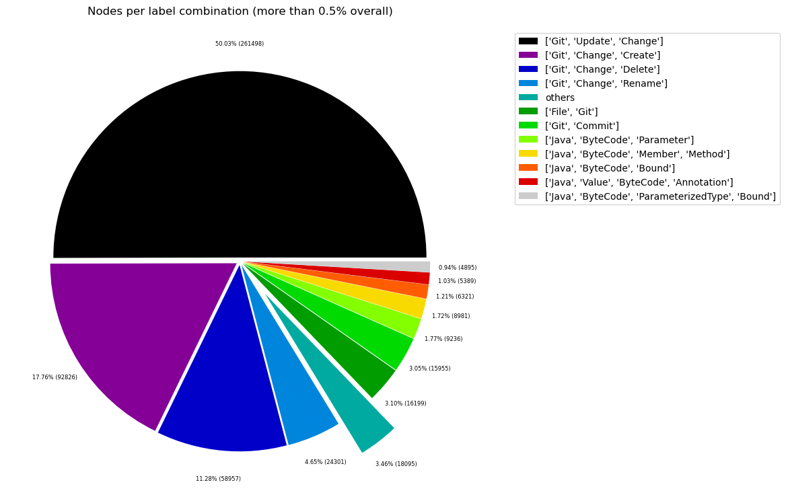
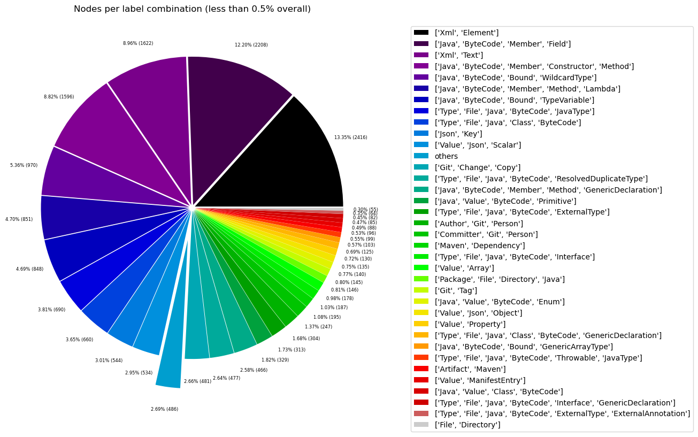
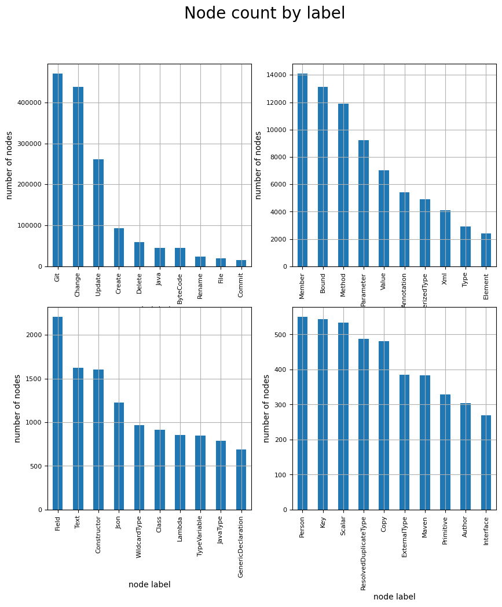
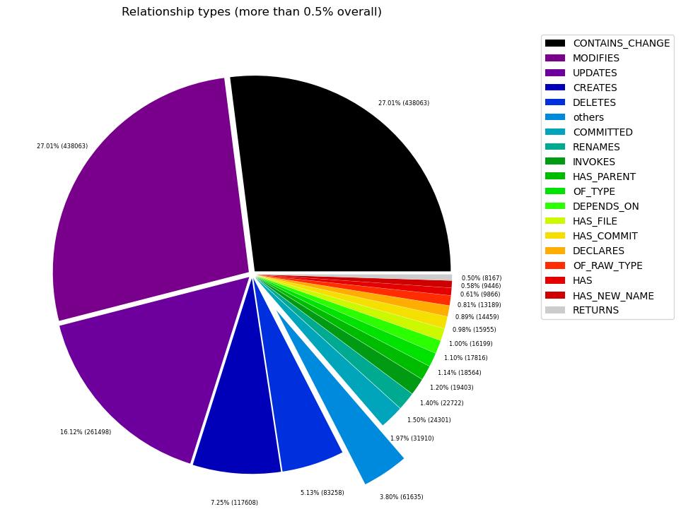
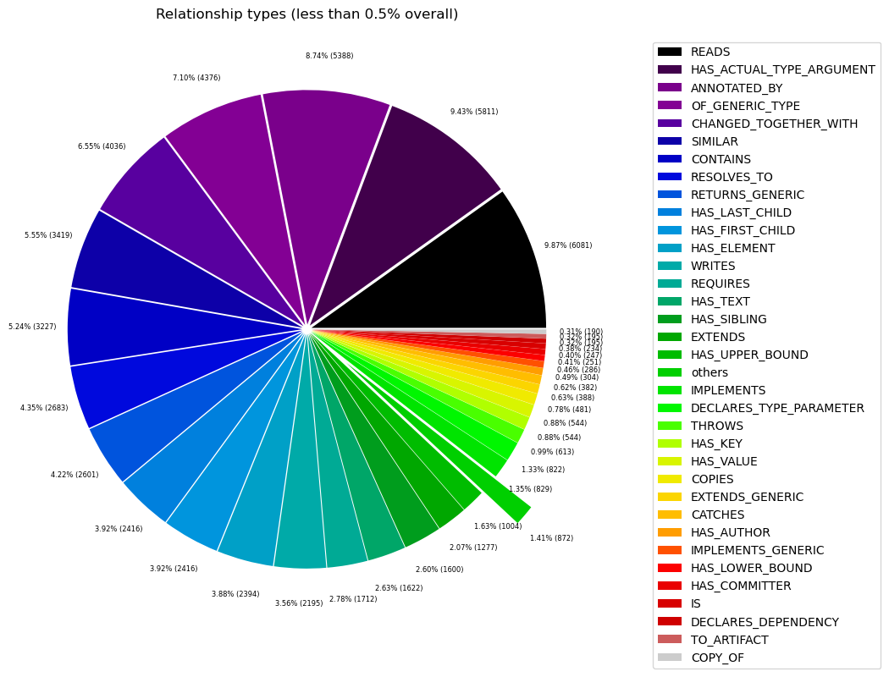

# Overview in General
   

This file contains a general overview of the data in the graph including node labels and relationships types.

### References
- [jqassistant](https://jqassistant.org)
- [Neo4j Python Driver](https://neo4j.com/docs/api/python-driver/current)

## Node Labels

### Table 1a - Highest node count by label combination

Lists the 30 label combinations with the highest number of nodes. The labels with the lowest node count are listed in table 1b.
The total list would sum up to the total number of labels (100%).

The whole table can be found in the CSV report `Node_label_combination_count`.

<table border="1" class="dataframe">
  <thead>
    <tr style="text-align: right;">
      <th></th>
      <th>nodeLabels</th>
      <th>nodesWithThatLabels</th>
      <th>nodesWithThatLabelsPercent</th>
    </tr>
  </thead>
  <tbody>
    <tr>
      <th>0</th>
      <td>[Git, Update, Change]</td>
      <td>261498</td>
      <td>50.032813</td>
    </tr>
    <tr>
      <th>1</th>
      <td>[Git, Change, Create]</td>
      <td>92826</td>
      <td>17.760541</td>
    </tr>
    <tr>
      <th>2</th>
      <td>[Git, Change, Delete]</td>
      <td>58957</td>
      <td>11.280333</td>
    </tr>
    <tr>
      <th>3</th>
      <td>[Git, Change, Rename]</td>
      <td>24301</td>
      <td>4.649548</td>
    </tr>
    <tr>
      <th>4</th>
      <td>[File, Git]</td>
      <td>16199</td>
      <td>3.099380</td>
    </tr>
    <tr>
      <th>5</th>
      <td>[Git, Commit]</td>
      <td>15955</td>
      <td>3.052695</td>
    </tr>
    <tr>
      <th>6</th>
      <td>[Java, ByteCode, Parameter]</td>
      <td>9236</td>
      <td>1.767138</td>
    </tr>
    <tr>
      <th>7</th>
      <td>[Java, ByteCode, Member, Method]</td>
      <td>8981</td>
      <td>1.718349</td>
    </tr>
    <tr>
      <th>8</th>
      <td>[Java, ByteCode, Bound]</td>
      <td>6321</td>
      <td>1.209407</td>
    </tr>
    <tr>
      <th>9</th>
      <td>[Java, Value, ByteCode, Annotation]</td>
      <td>5389</td>
      <td>1.031086</td>
    </tr>
    <tr>
      <th>10</th>
      <td>[Java, ByteCode, ParameterizedType, Bound]</td>
      <td>4895</td>
      <td>0.936568</td>
    </tr>
    <tr>
      <th>11</th>
      <td>[Xml, Element]</td>
      <td>2416</td>
      <td>0.462257</td>
    </tr>
    <tr>
      <th>12</th>
      <td>[Java, ByteCode, Member, Field]</td>
      <td>2208</td>
      <td>0.422460</td>
    </tr>
    <tr>
      <th>13</th>
      <td>[Xml, Text]</td>
      <td>1622</td>
      <td>0.310340</td>
    </tr>
    <tr>
      <th>14</th>
      <td>[Java, ByteCode, Member, Constructor, Method]</td>
      <td>1596</td>
      <td>0.305365</td>
    </tr>
    <tr>
      <th>15</th>
      <td>[Java, ByteCode, Bound, WildcardType]</td>
      <td>970</td>
      <td>0.185592</td>
    </tr>
    <tr>
      <th>16</th>
      <td>[Java, ByteCode, Member, Method, Lambda]</td>
      <td>851</td>
      <td>0.162823</td>
    </tr>
    <tr>
      <th>17</th>
      <td>[Java, ByteCode, Bound, TypeVariable]</td>
      <td>848</td>
      <td>0.162249</td>
    </tr>
    <tr>
      <th>18</th>
      <td>[Type, File, Java, ByteCode, JavaType]</td>
      <td>690</td>
      <td>0.132019</td>
    </tr>
    <tr>
      <th>19</th>
      <td>[Type, File, Java, Class, ByteCode]</td>
      <td>660</td>
      <td>0.126279</td>
    </tr>
    <tr>
      <th>20</th>
      <td>[Json, Key]</td>
      <td>544</td>
      <td>0.104084</td>
    </tr>
    <tr>
      <th>21</th>
      <td>[Value, Json, Scalar]</td>
      <td>534</td>
      <td>0.102171</td>
    </tr>
    <tr>
      <th>22</th>
      <td>[Git, Change, Copy]</td>
      <td>481</td>
      <td>0.092030</td>
    </tr>
    <tr>
      <th>23</th>
      <td>[Type, File, Java, ByteCode, ResolvedDuplicate...</td>
      <td>477</td>
      <td>0.091265</td>
    </tr>
    <tr>
      <th>24</th>
      <td>[Java, ByteCode, Member, Method, GenericDeclar...</td>
      <td>466</td>
      <td>0.089160</td>
    </tr>
    <tr>
      <th>25</th>
      <td>[Java, Value, ByteCode, Primitive]</td>
      <td>329</td>
      <td>0.062948</td>
    </tr>
    <tr>
      <th>26</th>
      <td>[Type, File, Java, ByteCode, ExternalType]</td>
      <td>313</td>
      <td>0.059887</td>
    </tr>
    <tr>
      <th>27</th>
      <td>[Author, Git, Person]</td>
      <td>304</td>
      <td>0.058165</td>
    </tr>
    <tr>
      <th>28</th>
      <td>[Committer, Git, Person]</td>
      <td>247</td>
      <td>0.047259</td>
    </tr>
    <tr>
      <th>29</th>
      <td>[Maven, Dependency]</td>
      <td>195</td>
      <td>0.037310</td>
    </tr>
  </tbody>
</table>

### Chart 1a - Highest node count by label combination

Values under 0.5% will be grouped into "others" to get a cleaner plot. The group "others" is then broken down in Chart 1b.

    <Figure size 640x480 with 0 Axes>

    

    

### Table 1b - Lowest node count by label combination

Lists the 30 label combinations with the lowest number of nodes until they reach 0.5% of the total node count, which are shown above.

<table border="1" class="dataframe">
  <thead>
    <tr style="text-align: right;">
      <th></th>
      <th>nodeLabels</th>
      <th>nodesWithThatLabels</th>
      <th>nodesWithThatLabelsPercent</th>
    </tr>
  </thead>
  <tbody>
    <tr>
      <th>0</th>
      <td>[Analyze, Task, jQAssistant]</td>
      <td>1</td>
      <td>0.000191</td>
    </tr>
    <tr>
      <th>1</th>
      <td>[Git, Branch]</td>
      <td>1</td>
      <td>0.000191</td>
    </tr>
    <tr>
      <th>2</th>
      <td>[Repository, File, Git]</td>
      <td>1</td>
      <td>0.000191</td>
    </tr>
    <tr>
      <th>3</th>
      <td>[File, Json]</td>
      <td>2</td>
      <td>0.000383</td>
    </tr>
    <tr>
      <th>4</th>
      <td>[File]</td>
      <td>3</td>
      <td>0.000574</td>
    </tr>
    <tr>
      <th>5</th>
      <td>[Maven, Exclusion]</td>
      <td>4</td>
      <td>0.000765</td>
    </tr>
    <tr>
      <th>6</th>
      <td>[Type, File, Java, ByteCode, Record, GenericDe...</td>
      <td>4</td>
      <td>0.000765</td>
    </tr>
    <tr>
      <th>7</th>
      <td>[Value, Array, Json]</td>
      <td>8</td>
      <td>0.001531</td>
    </tr>
    <tr>
      <th>8</th>
      <td>[Type, File, Java, ByteCode, Throwable, Extern...</td>
      <td>8</td>
      <td>0.001531</td>
    </tr>
    <tr>
      <th>9</th>
      <td>[Java, ByteCode, Member, Constructor, Method, ...</td>
      <td>9</td>
      <td>0.001722</td>
    </tr>
    <tr>
      <th>10</th>
      <td>[Type, File, Java, ByteCode, Throwable, Resolv...</td>
      <td>11</td>
      <td>0.002105</td>
    </tr>
    <tr>
      <th>11</th>
      <td>[Maven, Scm]</td>
      <td>11</td>
      <td>0.002105</td>
    </tr>
    <tr>
      <th>12</th>
      <td>[File, Maven, Xml, Pom, Document]</td>
      <td>11</td>
      <td>0.002105</td>
    </tr>
    <tr>
      <th>13</th>
      <td>[Type, File, Java, ByteCode, Void]</td>
      <td>11</td>
      <td>0.002105</td>
    </tr>
    <tr>
      <th>14</th>
      <td>[Java, ManifestSection]</td>
      <td>11</td>
      <td>0.002105</td>
    </tr>
    <tr>
      <th>15</th>
      <td>[File, Java, Manifest]</td>
      <td>11</td>
      <td>0.002105</td>
    </tr>
    <tr>
      <th>16</th>
      <td>[File, Artifact, Jar, Archive, Zip, Java]</td>
      <td>11</td>
      <td>0.002105</td>
    </tr>
    <tr>
      <th>17</th>
      <td>[File, Java, ServiceLoader]</td>
      <td>12</td>
      <td>0.002296</td>
    </tr>
    <tr>
      <th>18</th>
      <td>[Maven, PluginExecution]</td>
      <td>13</td>
      <td>0.002487</td>
    </tr>
    <tr>
      <th>19</th>
      <td>[File, Java, Properties]</td>
      <td>13</td>
      <td>0.002487</td>
    </tr>
    <tr>
      <th>20</th>
      <td>[Maven, ExecutionGoal]</td>
      <td>13</td>
      <td>0.002487</td>
    </tr>
    <tr>
      <th>21</th>
      <td>[Type, File, Java, ByteCode, Enum]</td>
      <td>17</td>
      <td>0.003253</td>
    </tr>
    <tr>
      <th>22</th>
      <td>[jQAssistant, Rule, Concept]</td>
      <td>19</td>
      <td>0.003635</td>
    </tr>
    <tr>
      <th>23</th>
      <td>[Maven, Configuration]</td>
      <td>20</td>
      <td>0.003827</td>
    </tr>
    <tr>
      <th>24</th>
      <td>[Maven, Plugin]</td>
      <td>20</td>
      <td>0.003827</td>
    </tr>
    <tr>
      <th>25</th>
      <td>[Xml, Attribute]</td>
      <td>22</td>
      <td>0.004209</td>
    </tr>
    <tr>
      <th>26</th>
      <td>[Type, File, Java, ByteCode, PrimitiveType]</td>
      <td>39</td>
      <td>0.007462</td>
    </tr>
    <tr>
      <th>27</th>
      <td>[Type, File, Java, ByteCode, Annotation]</td>
      <td>42</td>
      <td>0.008036</td>
    </tr>
    <tr>
      <th>28</th>
      <td>[Type, File, Java, Class, ByteCode, Throwable]</td>
      <td>42</td>
      <td>0.008036</td>
    </tr>
    <tr>
      <th>29</th>
      <td>[Xml, Namespace]</td>
      <td>44</td>
      <td>0.008419</td>
    </tr>
  </tbody>
</table>

### Chart 1b - Lowest node count by label combination

Shows the lowest (less than 0.5% overall) node count label combinations. Therefore, this plot breaks down the "others" slice of the pie chart above. Values under 0.01% will be grouped into "others" to get a cleaner plot.

    <Figure size 640x480 with 0 Axes>

    

    

### Table 1c - Highest node count by single label

Lists the 40 labels with the highest number of nodes.
Doesn't sum up to the total number of nodes or 100% because one node can have multiple labels.
Helps to identify commonly used labels.

<table border="1" class="dataframe">
  <thead>
    <tr style="text-align: right;">
      <th></th>
      <th>nodeLabel</th>
      <th>nodesWithThatLabel</th>
      <th>nodesWithThatLabelPercent</th>
    </tr>
  </thead>
  <tbody>
    <tr>
      <th>0</th>
      <td>Git</td>
      <td>470915</td>
      <td>90.100889</td>
    </tr>
    <tr>
      <th>1</th>
      <td>Change</td>
      <td>438063</td>
      <td>83.815266</td>
    </tr>
    <tr>
      <th>2</th>
      <td>Update</td>
      <td>261498</td>
      <td>50.032813</td>
    </tr>
    <tr>
      <th>3</th>
      <td>Create</td>
      <td>92826</td>
      <td>17.760541</td>
    </tr>
    <tr>
      <th>4</th>
      <td>Delete</td>
      <td>58957</td>
      <td>11.280333</td>
    </tr>
    <tr>
      <th>5</th>
      <td>Java</td>
      <td>45554</td>
      <td>8.715917</td>
    </tr>
    <tr>
      <th>6</th>
      <td>ByteCode</td>
      <td>45350</td>
      <td>8.676885</td>
    </tr>
    <tr>
      <th>7</th>
      <td>Rename</td>
      <td>24301</td>
      <td>4.649548</td>
    </tr>
    <tr>
      <th>8</th>
      <td>File</td>
      <td>19387</td>
      <td>3.709344</td>
    </tr>
    <tr>
      <th>9</th>
      <td>Commit</td>
      <td>15955</td>
      <td>3.052695</td>
    </tr>
    <tr>
      <th>10</th>
      <td>Member</td>
      <td>14111</td>
      <td>2.699879</td>
    </tr>
    <tr>
      <th>11</th>
      <td>Bound</td>
      <td>13137</td>
      <td>2.513522</td>
    </tr>
    <tr>
      <th>12</th>
      <td>Method</td>
      <td>11903</td>
      <td>2.277419</td>
    </tr>
    <tr>
      <th>13</th>
      <td>Parameter</td>
      <td>9236</td>
      <td>1.767138</td>
    </tr>
    <tr>
      <th>14</th>
      <td>Value</td>
      <td>7016</td>
      <td>1.342382</td>
    </tr>
    <tr>
      <th>15</th>
      <td>Annotation</td>
      <td>5431</td>
      <td>1.039122</td>
    </tr>
    <tr>
      <th>16</th>
      <td>ParameterizedType</td>
      <td>4895</td>
      <td>0.936568</td>
    </tr>
    <tr>
      <th>17</th>
      <td>Xml</td>
      <td>4115</td>
      <td>0.787329</td>
    </tr>
    <tr>
      <th>18</th>
      <td>Type</td>
      <td>2923</td>
      <td>0.559262</td>
    </tr>
    <tr>
      <th>19</th>
      <td>Element</td>
      <td>2416</td>
      <td>0.462257</td>
    </tr>
    <tr>
      <th>20</th>
      <td>Field</td>
      <td>2208</td>
      <td>0.422460</td>
    </tr>
    <tr>
      <th>21</th>
      <td>Text</td>
      <td>1622</td>
      <td>0.310340</td>
    </tr>
    <tr>
      <th>22</th>
      <td>Constructor</td>
      <td>1605</td>
      <td>0.307087</td>
    </tr>
    <tr>
      <th>23</th>
      <td>Json</td>
      <td>1223</td>
      <td>0.233998</td>
    </tr>
    <tr>
      <th>24</th>
      <td>WildcardType</td>
      <td>970</td>
      <td>0.185592</td>
    </tr>
    <tr>
      <th>25</th>
      <td>Class</td>
      <td>912</td>
      <td>0.174494</td>
    </tr>
    <tr>
      <th>26</th>
      <td>Lambda</td>
      <td>851</td>
      <td>0.162823</td>
    </tr>
    <tr>
      <th>27</th>
      <td>TypeVariable</td>
      <td>848</td>
      <td>0.162249</td>
    </tr>
    <tr>
      <th>28</th>
      <td>JavaType</td>
      <td>789</td>
      <td>0.150961</td>
    </tr>
    <tr>
      <th>29</th>
      <td>GenericDeclaration</td>
      <td>686</td>
      <td>0.131253</td>
    </tr>
    <tr>
      <th>30</th>
      <td>Person</td>
      <td>551</td>
      <td>0.105424</td>
    </tr>
    <tr>
      <th>31</th>
      <td>Key</td>
      <td>544</td>
      <td>0.104084</td>
    </tr>
    <tr>
      <th>32</th>
      <td>Scalar</td>
      <td>534</td>
      <td>0.102171</td>
    </tr>
    <tr>
      <th>33</th>
      <td>ResolvedDuplicateType</td>
      <td>488</td>
      <td>0.093370</td>
    </tr>
    <tr>
      <th>34</th>
      <td>Copy</td>
      <td>481</td>
      <td>0.092030</td>
    </tr>
    <tr>
      <th>35</th>
      <td>ExternalType</td>
      <td>385</td>
      <td>0.073663</td>
    </tr>
    <tr>
      <th>36</th>
      <td>Maven</td>
      <td>383</td>
      <td>0.073280</td>
    </tr>
    <tr>
      <th>37</th>
      <td>Primitive</td>
      <td>329</td>
      <td>0.062948</td>
    </tr>
    <tr>
      <th>38</th>
      <td>Author</td>
      <td>304</td>
      <td>0.058165</td>
    </tr>
    <tr>
      <th>39</th>
      <td>Interface</td>
      <td>269</td>
      <td>0.051468</td>
    </tr>
  </tbody>
</table>

### Chart 1c - Highest node count by label

Shows the 40 labels with the highest number of nodes.

    <Figure size 640x480 with 0 Axes>

    

    

## Relationship Types

### Table 2a - Highest relationship count by type

Lists the 30 relationship types with the highest number of occurrences.
The whole table can be found in the CSV report `Relationship_type_count`.

    Total number of relationships: 1622122

<table border="1" class="dataframe">
  <thead>
    <tr style="text-align: right;">
      <th></th>
      <th>relationshipType</th>
      <th>nodesWithThatRelationshipType</th>
      <th>nodesWithThatRelationshipTypePercent</th>
    </tr>
  </thead>
  <tbody>
    <tr>
      <th>0</th>
      <td>CONTAINS_CHANGE</td>
      <td>438063</td>
      <td>27.005552</td>
    </tr>
    <tr>
      <th>1</th>
      <td>MODIFIES</td>
      <td>438063</td>
      <td>27.005552</td>
    </tr>
    <tr>
      <th>2</th>
      <td>UPDATES</td>
      <td>261498</td>
      <td>16.120736</td>
    </tr>
    <tr>
      <th>3</th>
      <td>CREATES</td>
      <td>117608</td>
      <td>7.250256</td>
    </tr>
    <tr>
      <th>4</th>
      <td>DELETES</td>
      <td>83258</td>
      <td>5.132660</td>
    </tr>
    <tr>
      <th>5</th>
      <td>COMMITTED</td>
      <td>31910</td>
      <td>1.967176</td>
    </tr>
    <tr>
      <th>6</th>
      <td>RENAMES</td>
      <td>24301</td>
      <td>1.498099</td>
    </tr>
    <tr>
      <th>7</th>
      <td>INVOKES</td>
      <td>22722</td>
      <td>1.400758</td>
    </tr>
    <tr>
      <th>8</th>
      <td>HAS_PARENT</td>
      <td>19403</td>
      <td>1.196149</td>
    </tr>
    <tr>
      <th>9</th>
      <td>OF_TYPE</td>
      <td>18564</td>
      <td>1.144427</td>
    </tr>
    <tr>
      <th>10</th>
      <td>DEPENDS_ON</td>
      <td>17816</td>
      <td>1.098314</td>
    </tr>
    <tr>
      <th>11</th>
      <td>HAS_FILE</td>
      <td>16199</td>
      <td>0.998630</td>
    </tr>
    <tr>
      <th>12</th>
      <td>HAS_COMMIT</td>
      <td>15955</td>
      <td>0.983588</td>
    </tr>
    <tr>
      <th>13</th>
      <td>DECLARES</td>
      <td>14459</td>
      <td>0.891363</td>
    </tr>
    <tr>
      <th>14</th>
      <td>OF_RAW_TYPE</td>
      <td>13189</td>
      <td>0.813071</td>
    </tr>
    <tr>
      <th>15</th>
      <td>HAS</td>
      <td>9866</td>
      <td>0.608216</td>
    </tr>
    <tr>
      <th>16</th>
      <td>HAS_NEW_NAME</td>
      <td>9446</td>
      <td>0.582324</td>
    </tr>
    <tr>
      <th>17</th>
      <td>RETURNS</td>
      <td>8167</td>
      <td>0.503476</td>
    </tr>
    <tr>
      <th>18</th>
      <td>READS</td>
      <td>6081</td>
      <td>0.374879</td>
    </tr>
    <tr>
      <th>19</th>
      <td>HAS_ACTUAL_TYPE_ARGUMENT</td>
      <td>5811</td>
      <td>0.358234</td>
    </tr>
    <tr>
      <th>20</th>
      <td>ANNOTATED_BY</td>
      <td>5388</td>
      <td>0.332158</td>
    </tr>
    <tr>
      <th>21</th>
      <td>OF_GENERIC_TYPE</td>
      <td>4376</td>
      <td>0.269770</td>
    </tr>
    <tr>
      <th>22</th>
      <td>CHANGED_TOGETHER_WITH</td>
      <td>4036</td>
      <td>0.248810</td>
    </tr>
    <tr>
      <th>23</th>
      <td>SIMILAR</td>
      <td>3419</td>
      <td>0.210773</td>
    </tr>
    <tr>
      <th>24</th>
      <td>CONTAINS</td>
      <td>3227</td>
      <td>0.198937</td>
    </tr>
    <tr>
      <th>25</th>
      <td>RESOLVES_TO</td>
      <td>2683</td>
      <td>0.165401</td>
    </tr>
    <tr>
      <th>26</th>
      <td>RETURNS_GENERIC</td>
      <td>2601</td>
      <td>0.160346</td>
    </tr>
    <tr>
      <th>27</th>
      <td>HAS_FIRST_CHILD</td>
      <td>2416</td>
      <td>0.148941</td>
    </tr>
    <tr>
      <th>28</th>
      <td>HAS_LAST_CHILD</td>
      <td>2416</td>
      <td>0.148941</td>
    </tr>
    <tr>
      <th>29</th>
      <td>HAS_ELEMENT</td>
      <td>2394</td>
      <td>0.147584</td>
    </tr>
  </tbody>
</table>

### Chart 2a - Highest relationship count by type

Values under 0.5% will be grouped into "others" to get a cleaner plot. The group "others" is then broken down in the second chart.

    <Figure size 640x480 with 0 Axes>

    

    

### Table 2b - Lowest relationship count by type

Lists the 30 relationships type with the lowest number of occurrences up to 0.5% of the total node count. This is essentially breaking down the "others" slice from the chart above.

<table border="1" class="dataframe">
  <thead>
    <tr style="text-align: right;">
      <th></th>
      <th>relationshipType</th>
      <th>nodesWithThatRelationshipType</th>
      <th>nodesWithThatRelationshipTypePercent</th>
    </tr>
  </thead>
  <tbody>
    <tr>
      <th>0</th>
      <td>HAS_PROPERTY</td>
      <td>1</td>
      <td>0.000062</td>
    </tr>
    <tr>
      <th>1</th>
      <td>HAS_BRANCH</td>
      <td>1</td>
      <td>0.000062</td>
    </tr>
    <tr>
      <th>2</th>
      <td>HAS_HEAD</td>
      <td>2</td>
      <td>0.000123</td>
    </tr>
    <tr>
      <th>3</th>
      <td>EXCLUDES</td>
      <td>4</td>
      <td>0.000247</td>
    </tr>
    <tr>
      <th>4</th>
      <td>THROWS_GENERIC</td>
      <td>5</td>
      <td>0.000308</td>
    </tr>
    <tr>
      <th>5</th>
      <td>HAS_SCM</td>
      <td>11</td>
      <td>0.000678</td>
    </tr>
    <tr>
      <th>6</th>
      <td>DESCRIBES</td>
      <td>11</td>
      <td>0.000678</td>
    </tr>
    <tr>
      <th>7</th>
      <td>HAS_ROOT_ELEMENT</td>
      <td>13</td>
      <td>0.000801</td>
    </tr>
    <tr>
      <th>8</th>
      <td>HAS_GOAL</td>
      <td>13</td>
      <td>0.000801</td>
    </tr>
    <tr>
      <th>9</th>
      <td>HAS_EXECUTION</td>
      <td>13</td>
      <td>0.000801</td>
    </tr>
    <tr>
      <th>10</th>
      <td>INCLUDES_CONCEPT</td>
      <td>19</td>
      <td>0.001171</td>
    </tr>
    <tr>
      <th>11</th>
      <td>IS_ARTIFACT</td>
      <td>20</td>
      <td>0.001233</td>
    </tr>
    <tr>
      <th>12</th>
      <td>HAS_CONFIGURATION</td>
      <td>20</td>
      <td>0.001233</td>
    </tr>
    <tr>
      <th>13</th>
      <td>USES_PLUGIN</td>
      <td>20</td>
      <td>0.001233</td>
    </tr>
    <tr>
      <th>14</th>
      <td>OF_NAMESPACE</td>
      <td>22</td>
      <td>0.001356</td>
    </tr>
    <tr>
      <th>15</th>
      <td>HAS_ATTRIBUTE</td>
      <td>22</td>
      <td>0.001356</td>
    </tr>
    <tr>
      <th>16</th>
      <td>REQUIRES_TYPE_PARAMETER</td>
      <td>26</td>
      <td>0.001603</td>
    </tr>
    <tr>
      <th>17</th>
      <td>REQUIRES_CONCEPT</td>
      <td>28</td>
      <td>0.001726</td>
    </tr>
    <tr>
      <th>18</th>
      <td>DECLARES_NAMESPACE</td>
      <td>44</td>
      <td>0.002712</td>
    </tr>
    <tr>
      <th>19</th>
      <td>HAS_DEFAULT</td>
      <td>53</td>
      <td>0.003267</td>
    </tr>
    <tr>
      <th>20</th>
      <td>HAS_COMPONENT_TYPE</td>
      <td>103</td>
      <td>0.006350</td>
    </tr>
    <tr>
      <th>21</th>
      <td>CONTAINS_VALUE</td>
      <td>131</td>
      <td>0.008076</td>
    </tr>
    <tr>
      <th>22</th>
      <td>HAS_TAG</td>
      <td>145</td>
      <td>0.008939</td>
    </tr>
    <tr>
      <th>23</th>
      <td>ON_COMMIT</td>
      <td>145</td>
      <td>0.008939</td>
    </tr>
    <tr>
      <th>24</th>
      <td>COPY_OF</td>
      <td>190</td>
      <td>0.011713</td>
    </tr>
    <tr>
      <th>25</th>
      <td>TO_ARTIFACT</td>
      <td>195</td>
      <td>0.012021</td>
    </tr>
    <tr>
      <th>26</th>
      <td>DECLARES_DEPENDENCY</td>
      <td>195</td>
      <td>0.012021</td>
    </tr>
    <tr>
      <th>27</th>
      <td>IS</td>
      <td>234</td>
      <td>0.014426</td>
    </tr>
    <tr>
      <th>28</th>
      <td>HAS_COMMITTER</td>
      <td>247</td>
      <td>0.015227</td>
    </tr>
    <tr>
      <th>29</th>
      <td>HAS_LOWER_BOUND</td>
      <td>251</td>
      <td>0.015474</td>
    </tr>
  </tbody>
</table>

### Chart 2b - Lowest relationship count by type

Shows the lowest (less than 0.5% overall) relationship types. This plot breaks down the "others" slice of the pie chart above. Values under 0.01% will be grouped into "others" to get a cleaner plot.

    <Figure size 640x480 with 0 Axes>

    

    

## Node labels with their relationships

### Table 3a - Highest relationship count by node labels and relationship type

Lists the 30 node labels and their relationship types with the highest number of occurrences.

<table border="1" class="dataframe">
  <thead>
    <tr style="text-align: right;">
      <th></th>
      <th>sourceLabels</th>
      <th>relationType</th>
      <th>targetLabels</th>
      <th>numberOfRelationships</th>
      <th>numberOfNodesWithSameLabelsAsSource</th>
      <th>numberOfNodesWithSameLabelsAsTarget</th>
      <th>densityInPercent</th>
    </tr>
  </thead>
  <tbody>
    <tr>
      <th>0</th>
      <td>[Git, Commit]</td>
      <td>CONTAINS_CHANGE</td>
      <td>[Git, Update, Change]</td>
      <td>261498</td>
      <td>15955</td>
      <td>261498</td>
      <td>0.006268</td>
    </tr>
    <tr>
      <th>1</th>
      <td>[Git, Update, Change]</td>
      <td>MODIFIES</td>
      <td>[File, Git]</td>
      <td>261498</td>
      <td>261498</td>
      <td>16199</td>
      <td>0.006173</td>
    </tr>
    <tr>
      <th>2</th>
      <td>[Git, Update, Change]</td>
      <td>UPDATES</td>
      <td>[File, Git]</td>
      <td>261498</td>
      <td>261498</td>
      <td>16199</td>
      <td>0.006173</td>
    </tr>
    <tr>
      <th>3</th>
      <td>[Git, Commit]</td>
      <td>CONTAINS_CHANGE</td>
      <td>[Git, Change, Create]</td>
      <td>92826</td>
      <td>15955</td>
      <td>92826</td>
      <td>0.006268</td>
    </tr>
    <tr>
      <th>4</th>
      <td>[Git, Change, Create]</td>
      <td>CREATES</td>
      <td>[File, Git]</td>
      <td>92826</td>
      <td>92826</td>
      <td>16199</td>
      <td>0.006173</td>
    </tr>
    <tr>
      <th>5</th>
      <td>[Git, Change, Create]</td>
      <td>MODIFIES</td>
      <td>[File, Git]</td>
      <td>92826</td>
      <td>92826</td>
      <td>16199</td>
      <td>0.006173</td>
    </tr>
    <tr>
      <th>6</th>
      <td>[Git, Commit]</td>
      <td>CONTAINS_CHANGE</td>
      <td>[Git, Change, Delete]</td>
      <td>58957</td>
      <td>15955</td>
      <td>58957</td>
      <td>0.006268</td>
    </tr>
    <tr>
      <th>7</th>
      <td>[Git, Change, Delete]</td>
      <td>MODIFIES</td>
      <td>[File, Git]</td>
      <td>58957</td>
      <td>58957</td>
      <td>16199</td>
      <td>0.006173</td>
    </tr>
    <tr>
      <th>8</th>
      <td>[Git, Change, Delete]</td>
      <td>DELETES</td>
      <td>[File, Git]</td>
      <td>58957</td>
      <td>58957</td>
      <td>16199</td>
      <td>0.006173</td>
    </tr>
    <tr>
      <th>9</th>
      <td>[Git, Commit]</td>
      <td>CONTAINS_CHANGE</td>
      <td>[Git, Change, Rename]</td>
      <td>24301</td>
      <td>15955</td>
      <td>24301</td>
      <td>0.006268</td>
    </tr>
    <tr>
      <th>10</th>
      <td>[Git, Change, Rename]</td>
      <td>DELETES</td>
      <td>[File, Git]</td>
      <td>24301</td>
      <td>24301</td>
      <td>16199</td>
      <td>0.006173</td>
    </tr>
    <tr>
      <th>11</th>
      <td>[Git, Change, Rename]</td>
      <td>CREATES</td>
      <td>[File, Git]</td>
      <td>24301</td>
      <td>24301</td>
      <td>16199</td>
      <td>0.006173</td>
    </tr>
    <tr>
      <th>12</th>
      <td>[Git, Change, Rename]</td>
      <td>MODIFIES</td>
      <td>[File, Git]</td>
      <td>24301</td>
      <td>24301</td>
      <td>16199</td>
      <td>0.006173</td>
    </tr>
    <tr>
      <th>13</th>
      <td>[Git, Change, Rename]</td>
      <td>RENAMES</td>
      <td>[File, Git]</td>
      <td>24301</td>
      <td>24301</td>
      <td>16199</td>
      <td>0.006173</td>
    </tr>
    <tr>
      <th>14</th>
      <td>[Git, Commit]</td>
      <td>HAS_PARENT</td>
      <td>[Git, Commit]</td>
      <td>19392</td>
      <td>15955</td>
      <td>15955</td>
      <td>0.007618</td>
    </tr>
    <tr>
      <th>15</th>
      <td>[Repository, File, Git]</td>
      <td>HAS_FILE</td>
      <td>[File, Git]</td>
      <td>16199</td>
      <td>1</td>
      <td>16199</td>
      <td>100.000000</td>
    </tr>
    <tr>
      <th>16</th>
      <td>[Repository, File, Git]</td>
      <td>HAS_COMMIT</td>
      <td>[Git, Commit]</td>
      <td>15955</td>
      <td>1</td>
      <td>15955</td>
      <td>100.000000</td>
    </tr>
    <tr>
      <th>17</th>
      <td>[Author, Git, Person]</td>
      <td>COMMITTED</td>
      <td>[Git, Commit]</td>
      <td>15955</td>
      <td>304</td>
      <td>15955</td>
      <td>0.328947</td>
    </tr>
    <tr>
      <th>18</th>
      <td>[Committer, Git, Person]</td>
      <td>COMMITTED</td>
      <td>[Git, Commit]</td>
      <td>15955</td>
      <td>247</td>
      <td>15955</td>
      <td>0.404858</td>
    </tr>
    <tr>
      <th>19</th>
      <td>[Java, ByteCode, Member, Method]</td>
      <td>INVOKES</td>
      <td>[Java, ByteCode, Member, Method]</td>
      <td>13614</td>
      <td>8951</td>
      <td>8951</td>
      <td>0.016992</td>
    </tr>
    <tr>
      <th>20</th>
      <td>[File, Git]</td>
      <td>HAS_NEW_NAME</td>
      <td>[File, Git]</td>
      <td>9446</td>
      <td>16199</td>
      <td>16199</td>
      <td>0.003600</td>
    </tr>
    <tr>
      <th>21</th>
      <td>[Java, ByteCode, Member, Method]</td>
      <td>READS</td>
      <td>[Java, ByteCode, Member, Field]</td>
      <td>5451</td>
      <td>8951</td>
      <td>2208</td>
      <td>0.027581</td>
    </tr>
    <tr>
      <th>22</th>
      <td>[Java, ByteCode, Member, Method]</td>
      <td>HAS</td>
      <td>[Java, ByteCode, Parameter]</td>
      <td>5331</td>
      <td>8951</td>
      <td>9236</td>
      <td>0.006448</td>
    </tr>
    <tr>
      <th>23</th>
      <td>[Java, Value, ByteCode, Annotation]</td>
      <td>OF_TYPE</td>
      <td>[Type, File, Java, ByteCode, ExternalType, Ext...</td>
      <td>5035</td>
      <td>5389</td>
      <td>64</td>
      <td>1.459860</td>
    </tr>
    <tr>
      <th>24</th>
      <td>[Java, ByteCode, Parameter]</td>
      <td>OF_TYPE</td>
      <td>[Type, File, Java, ByteCode, JavaType]</td>
      <td>4123</td>
      <td>9236</td>
      <td>690</td>
      <td>0.064696</td>
    </tr>
    <tr>
      <th>25</th>
      <td>[Java, ByteCode, Parameter]</td>
      <td>ANNOTATED_BY</td>
      <td>[Java, Value, ByteCode, Annotation]</td>
      <td>3821</td>
      <td>9236</td>
      <td>5389</td>
      <td>0.007677</td>
    </tr>
    <tr>
      <th>26</th>
      <td>[File, Git]</td>
      <td>CHANGED_TOGETHER_WITH</td>
      <td>[File, Git]</td>
      <td>3341</td>
      <td>16199</td>
      <td>16199</td>
      <td>0.001273</td>
    </tr>
    <tr>
      <th>27</th>
      <td>[Java, ByteCode, ParameterizedType, Bound]</td>
      <td>OF_RAW_TYPE</td>
      <td>[Type, File, Java, ByteCode, JavaType]</td>
      <td>2826</td>
      <td>4895</td>
      <td>690</td>
      <td>0.083670</td>
    </tr>
    <tr>
      <th>28</th>
      <td>[Xml, Element]</td>
      <td>HAS_ELEMENT</td>
      <td>[Xml, Element]</td>
      <td>2394</td>
      <td>2416</td>
      <td>2416</td>
      <td>0.041014</td>
    </tr>
    <tr>
      <th>29</th>
      <td>[Java, ByteCode, Bound]</td>
      <td>OF_RAW_TYPE</td>
      <td>[Type, File, Java, ByteCode, JavaType]</td>
      <td>2297</td>
      <td>6321</td>
      <td>690</td>
      <td>0.052665</td>
    </tr>
  </tbody>
</table>

## Graph Density

    total_number_of_nodes (vertices): 522653
    total_number_of_relationships (edges): 1622122
    -> total directed graph density: 5.9382359553048965e-06
    -> total directed graph density in percent: 0.0005938235955304897

