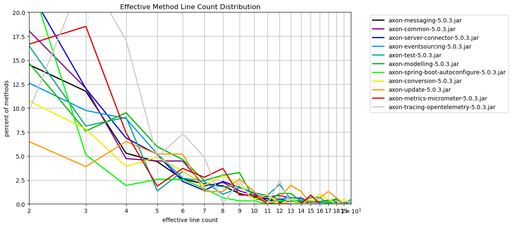
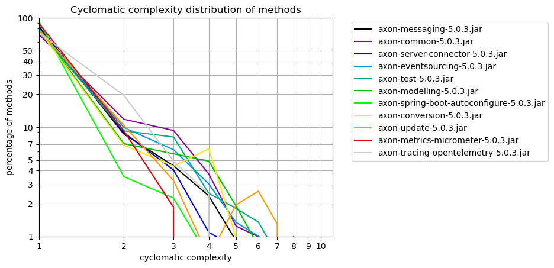

# Method Metrics
   

### References
- [jqassistant](https://jqassistant.org)
- [Neo4j Python Driver](https://neo4j.com/docs/api/python-driver/current)

## Effective Method Line Count

### Table 1a - Effective method line count distribution

This table shows the distribution of the effective method line count per artifact.
For each artifact the number of methods with effective line count = 1,2,3,... is shown to get an overview of how line counts are distributed over methods.

Only the 15 artifacts with the highest method count and their effective method line count distribution (limited by 40)is shown here. The whole table can be found in the CSV report `Effective_Method_Line_Count_Distribution`.

Have a look below to find out which packages and methods have the highest effective lines of code.

<table border="1" class="dataframe">
  <thead>
    <tr style="text-align: right;">
      <th>artifactName</th>
      <th>axon-messaging-5.0.3.jar</th>
      <th>axon-common-5.0.3.jar</th>
      <th>axon-server-connector-5.0.3.jar</th>
      <th>axon-eventsourcing-5.0.3.jar</th>
      <th>axon-test-5.0.3.jar</th>
      <th>axon-modelling-5.0.3.jar</th>
      <th>axon-spring-boot-autoconfigure-5.0.3.jar</th>
      <th>axon-conversion-5.0.3.jar</th>
      <th>axon-update-5.0.3.jar</th>
      <th>axon-metrics-micrometer-5.0.3.jar</th>
      <th>axon-tracing-opentelemetry-5.0.3.jar</th>
    </tr>
    <tr>
      <th>effectiveLineCount</th>
      <th></th>
      <th></th>
      <th></th>
      <th></th>
      <th></th>
      <th></th>
      <th></th>
      <th></th>
      <th></th>
      <th></th>
      <th></th>
    </tr>
  </thead>
  <tbody>
    <tr>
      <th>1</th>
      <td>1933</td>
      <td>369</td>
      <td>266</td>
      <td>301</td>
      <td>212</td>
      <td>162</td>
      <td>186</td>
      <td>116</td>
      <td>88</td>
      <td>46</td>
      <td>11</td>
    </tr>
    <tr>
      <th>2</th>
      <td>524</td>
      <td>145</td>
      <td>143</td>
      <td>75</td>
      <td>73</td>
      <td>54</td>
      <td>74</td>
      <td>22</td>
      <td>10</td>
      <td>18</td>
      <td>4</td>
    </tr>
    <tr>
      <th>3</th>
      <td>424</td>
      <td>97</td>
      <td>77</td>
      <td>58</td>
      <td>36</td>
      <td>28</td>
      <td>16</td>
      <td>16</td>
      <td>6</td>
      <td>20</td>
      <td>10</td>
    </tr>
    <tr>
      <th>4</th>
      <td>191</td>
      <td>38</td>
      <td>44</td>
      <td>53</td>
      <td>40</td>
      <td>35</td>
      <td>6</td>
      <td>8</td>
      <td>10</td>
      <td>8</td>
      <td>7</td>
    </tr>
    <tr>
      <th>5</th>
      <td>159</td>
      <td>36</td>
      <td>33</td>
      <td>31</td>
      <td>6</td>
      <td>22</td>
      <td>8</td>
      <td>10</td>
      <td>8</td>
      <td>2</td>
      <td>2</td>
    </tr>
    <tr>
      <th>6</th>
      <td>93</td>
      <td>36</td>
      <td>15</td>
      <td>16</td>
      <td>15</td>
      <td>17</td>
      <td>8</td>
      <td>7</td>
      <td>8</td>
      <td>4</td>
      <td>3</td>
    </tr>
    <tr>
      <th>7</th>
      <td>76</td>
      <td>15</td>
      <td>9</td>
      <td>14</td>
      <td>9</td>
      <td>9</td>
      <td>5</td>
      <td>4</td>
      <td>2</td>
      <td>3</td>
      <td>2</td>
    </tr>
    <tr>
      <th>8</th>
      <td>68</td>
      <td>18</td>
      <td>15</td>
      <td>6</td>
      <td>8</td>
      <td>11</td>
      <td>2</td>
      <td>6</td>
      <td>2</td>
      <td>4</td>
      <td>0</td>
    </tr>
    <tr>
      <th>9</th>
      <td>39</td>
      <td>11</td>
      <td>11</td>
      <td>10</td>
      <td>8</td>
      <td>12</td>
      <td>1</td>
      <td>4</td>
      <td>4</td>
      <td>1</td>
      <td>1</td>
    </tr>
    <tr>
      <th>10</th>
      <td>26</td>
      <td>7</td>
      <td>7</td>
      <td>7</td>
      <td>5</td>
      <td>2</td>
      <td>1</td>
      <td>1</td>
      <td>2</td>
      <td>1</td>
      <td>0</td>
    </tr>
    <tr>
      <th>11</th>
      <td>20</td>
      <td>6</td>
      <td>2</td>
      <td>5</td>
      <td>4</td>
      <td>1</td>
      <td>0</td>
      <td>2</td>
      <td>0</td>
      <td>0</td>
      <td>0</td>
    </tr>
    <tr>
      <th>12</th>
      <td>6</td>
      <td>7</td>
      <td>3</td>
      <td>3</td>
      <td>9</td>
      <td>4</td>
      <td>1</td>
      <td>0</td>
      <td>1</td>
      <td>0</td>
      <td>1</td>
    </tr>
    <tr>
      <th>13</th>
      <td>10</td>
      <td>5</td>
      <td>2</td>
      <td>4</td>
      <td>2</td>
      <td>4</td>
      <td>1</td>
      <td>1</td>
      <td>3</td>
      <td>0</td>
      <td>0</td>
    </tr>
    <tr>
      <th>14</th>
      <td>6</td>
      <td>5</td>
      <td>2</td>
      <td>3</td>
      <td>1</td>
      <td>1</td>
      <td>0</td>
      <td>0</td>
      <td>2</td>
      <td>0</td>
      <td>0</td>
    </tr>
    <tr>
      <th>15</th>
      <td>6</td>
      <td>1</td>
      <td>1</td>
      <td>1</td>
      <td>3</td>
      <td>1</td>
      <td>0</td>
      <td>1</td>
      <td>0</td>
      <td>1</td>
      <td>0</td>
    </tr>
    <tr>
      <th>16</th>
      <td>6</td>
      <td>2</td>
      <td>1</td>
      <td>1</td>
      <td>3</td>
      <td>1</td>
      <td>0</td>
      <td>2</td>
      <td>1</td>
      <td>0</td>
      <td>0</td>
    </tr>
    <tr>
      <th>17</th>
      <td>4</td>
      <td>3</td>
      <td>2</td>
      <td>1</td>
      <td>0</td>
      <td>1</td>
      <td>1</td>
      <td>1</td>
      <td>2</td>
      <td>0</td>
      <td>0</td>
    </tr>
    <tr>
      <th>18</th>
      <td>1</td>
      <td>1</td>
      <td>1</td>
      <td>0</td>
      <td>2</td>
      <td>2</td>
      <td>0</td>
      <td>0</td>
      <td>1</td>
      <td>0</td>
      <td>0</td>
    </tr>
    <tr>
      <th>19</th>
      <td>3</td>
      <td>0</td>
      <td>0</td>
      <td>1</td>
      <td>0</td>
      <td>0</td>
      <td>0</td>
      <td>1</td>
      <td>0</td>
      <td>0</td>
      <td>0</td>
    </tr>
    <tr>
      <th>20</th>
      <td>3</td>
      <td>0</td>
      <td>1</td>
      <td>1</td>
      <td>2</td>
      <td>0</td>
      <td>0</td>
      <td>0</td>
      <td>0</td>
      <td>0</td>
      <td>0</td>
    </tr>
    <tr>
      <th>21</th>
      <td>1</td>
      <td>0</td>
      <td>2</td>
      <td>1</td>
      <td>1</td>
      <td>1</td>
      <td>0</td>
      <td>0</td>
      <td>2</td>
      <td>0</td>
      <td>0</td>
    </tr>
    <tr>
      <th>22</th>
      <td>2</td>
      <td>0</td>
      <td>0</td>
      <td>0</td>
      <td>0</td>
      <td>0</td>
      <td>0</td>
      <td>0</td>
      <td>0</td>
      <td>0</td>
      <td>0</td>
    </tr>
    <tr>
      <th>23</th>
      <td>1</td>
      <td>0</td>
      <td>0</td>
      <td>0</td>
      <td>1</td>
      <td>0</td>
      <td>1</td>
      <td>0</td>
      <td>0</td>
      <td>0</td>
      <td>0</td>
    </tr>
    <tr>
      <th>24</th>
      <td>0</td>
      <td>1</td>
      <td>0</td>
      <td>0</td>
      <td>0</td>
      <td>0</td>
      <td>0</td>
      <td>0</td>
      <td>1</td>
      <td>0</td>
      <td>0</td>
    </tr>
    <tr>
      <th>25</th>
      <td>2</td>
      <td>0</td>
      <td>0</td>
      <td>0</td>
      <td>0</td>
      <td>0</td>
      <td>0</td>
      <td>0</td>
      <td>0</td>
      <td>0</td>
      <td>0</td>
    </tr>
    <tr>
      <th>26</th>
      <td>0</td>
      <td>1</td>
      <td>0</td>
      <td>0</td>
      <td>1</td>
      <td>0</td>
      <td>0</td>
      <td>0</td>
      <td>0</td>
      <td>0</td>
      <td>0</td>
    </tr>
    <tr>
      <th>27</th>
      <td>1</td>
      <td>0</td>
      <td>0</td>
      <td>1</td>
      <td>0</td>
      <td>0</td>
      <td>0</td>
      <td>0</td>
      <td>0</td>
      <td>0</td>
      <td>0</td>
    </tr>
    <tr>
      <th>28</th>
      <td>0</td>
      <td>0</td>
      <td>1</td>
      <td>0</td>
      <td>0</td>
      <td>0</td>
      <td>0</td>
      <td>0</td>
      <td>0</td>
      <td>0</td>
      <td>0</td>
    </tr>
    <tr>
      <th>29</th>
      <td>0</td>
      <td>0</td>
      <td>0</td>
      <td>0</td>
      <td>0</td>
      <td>0</td>
      <td>0</td>
      <td>2</td>
      <td>0</td>
      <td>0</td>
      <td>0</td>
    </tr>
    <tr>
      <th>30</th>
      <td>0</td>
      <td>0</td>
      <td>1</td>
      <td>1</td>
      <td>0</td>
      <td>0</td>
      <td>0</td>
      <td>1</td>
      <td>0</td>
      <td>0</td>
      <td>0</td>
    </tr>
    <tr>
      <th>31</th>
      <td>2</td>
      <td>0</td>
      <td>0</td>
      <td>0</td>
      <td>1</td>
      <td>0</td>
      <td>0</td>
      <td>0</td>
      <td>0</td>
      <td>0</td>
      <td>0</td>
    </tr>
    <tr>
      <th>36</th>
      <td>1</td>
      <td>0</td>
      <td>0</td>
      <td>0</td>
      <td>0</td>
      <td>0</td>
      <td>0</td>
      <td>0</td>
      <td>0</td>
      <td>0</td>
      <td>0</td>
    </tr>
    <tr>
      <th>38</th>
      <td>0</td>
      <td>0</td>
      <td>0</td>
      <td>0</td>
      <td>0</td>
      <td>0</td>
      <td>1</td>
      <td>0</td>
      <td>0</td>
      <td>0</td>
      <td>0</td>
    </tr>
    <tr>
      <th>40</th>
      <td>0</td>
      <td>0</td>
      <td>0</td>
      <td>1</td>
      <td>0</td>
      <td>0</td>
      <td>0</td>
      <td>0</td>
      <td>0</td>
      <td>0</td>
      <td>0</td>
    </tr>
    <tr>
      <th>41</th>
      <td>0</td>
      <td>0</td>
      <td>0</td>
      <td>0</td>
      <td>0</td>
      <td>0</td>
      <td>0</td>
      <td>0</td>
      <td>1</td>
      <td>0</td>
      <td>0</td>
    </tr>
    <tr>
      <th>42</th>
      <td>0</td>
      <td>0</td>
      <td>1</td>
      <td>0</td>
      <td>0</td>
      <td>0</td>
      <td>0</td>
      <td>0</td>
      <td>0</td>
      <td>0</td>
      <td>0</td>
    </tr>
    <tr>
      <th>45</th>
      <td>0</td>
      <td>0</td>
      <td>0</td>
      <td>0</td>
      <td>1</td>
      <td>0</td>
      <td>0</td>
      <td>0</td>
      <td>0</td>
      <td>0</td>
      <td>0</td>
    </tr>
    <tr>
      <th>111</th>
      <td>1</td>
      <td>0</td>
      <td>0</td>
      <td>0</td>
      <td>0</td>
      <td>0</td>
      <td>0</td>
      <td>0</td>
      <td>0</td>
      <td>0</td>
      <td>0</td>
    </tr>
  </tbody>
</table>

### Table 1b - Effective method line count distribution (normalized)

The table shown here only includes the first 40 rows which typically represents the most significant entries.
Have a look below to find out which packages and methods have the highest effective lines of code.

<table border="1" class="dataframe">
  <thead>
    <tr style="text-align: right;">
      <th>artifactName</th>
      <th>axon-messaging-5.0.3.jar</th>
      <th>axon-common-5.0.3.jar</th>
      <th>axon-server-connector-5.0.3.jar</th>
      <th>axon-eventsourcing-5.0.3.jar</th>
      <th>axon-test-5.0.3.jar</th>
      <th>axon-modelling-5.0.3.jar</th>
      <th>axon-spring-boot-autoconfigure-5.0.3.jar</th>
      <th>axon-conversion-5.0.3.jar</th>
      <th>axon-update-5.0.3.jar</th>
      <th>axon-metrics-micrometer-5.0.3.jar</th>
      <th>axon-tracing-opentelemetry-5.0.3.jar</th>
    </tr>
    <tr>
      <th>effectiveLineCount</th>
      <th></th>
      <th></th>
      <th></th>
      <th></th>
      <th></th>
      <th></th>
      <th></th>
      <th></th>
      <th></th>
      <th></th>
      <th></th>
    </tr>
  </thead>
  <tbody>
    <tr>
      <th>1</th>
      <td>53.560543</td>
      <td>45.895522</td>
      <td>41.56250</td>
      <td>50.588235</td>
      <td>47.855530</td>
      <td>44.021739</td>
      <td>59.615385</td>
      <td>56.585366</td>
      <td>57.142857</td>
      <td>42.592593</td>
      <td>26.829268</td>
    </tr>
    <tr>
      <th>2</th>
      <td>14.519257</td>
      <td>18.034826</td>
      <td>22.34375</td>
      <td>12.605042</td>
      <td>16.478555</td>
      <td>14.673913</td>
      <td>23.717949</td>
      <td>10.731707</td>
      <td>6.493506</td>
      <td>16.666667</td>
      <td>9.756098</td>
    </tr>
    <tr>
      <th>3</th>
      <td>11.748407</td>
      <td>12.064677</td>
      <td>12.03125</td>
      <td>9.747899</td>
      <td>8.126411</td>
      <td>7.608696</td>
      <td>5.128205</td>
      <td>7.804878</td>
      <td>3.896104</td>
      <td>18.518519</td>
      <td>24.390244</td>
    </tr>
    <tr>
      <th>4</th>
      <td>5.292325</td>
      <td>4.726368</td>
      <td>6.87500</td>
      <td>8.907563</td>
      <td>9.029345</td>
      <td>9.510870</td>
      <td>1.923077</td>
      <td>3.902439</td>
      <td>6.493506</td>
      <td>7.407407</td>
      <td>17.073171</td>
    </tr>
    <tr>
      <th>5</th>
      <td>4.405653</td>
      <td>4.477612</td>
      <td>5.15625</td>
      <td>5.210084</td>
      <td>1.354402</td>
      <td>5.978261</td>
      <td>2.564103</td>
      <td>4.878049</td>
      <td>5.194805</td>
      <td>1.851852</td>
      <td>4.878049</td>
    </tr>
    <tr>
      <th>6</th>
      <td>2.576891</td>
      <td>4.477612</td>
      <td>2.34375</td>
      <td>2.689076</td>
      <td>3.386005</td>
      <td>4.619565</td>
      <td>2.564103</td>
      <td>3.414634</td>
      <td>5.194805</td>
      <td>3.703704</td>
      <td>7.317073</td>
    </tr>
    <tr>
      <th>7</th>
      <td>2.105846</td>
      <td>1.865672</td>
      <td>1.40625</td>
      <td>2.352941</td>
      <td>2.031603</td>
      <td>2.445652</td>
      <td>1.602564</td>
      <td>1.951220</td>
      <td>1.298701</td>
      <td>2.777778</td>
      <td>4.878049</td>
    </tr>
    <tr>
      <th>8</th>
      <td>1.884178</td>
      <td>2.238806</td>
      <td>2.34375</td>
      <td>1.008403</td>
      <td>1.805869</td>
      <td>2.989130</td>
      <td>0.641026</td>
      <td>2.926829</td>
      <td>1.298701</td>
      <td>3.703704</td>
      <td>0.000000</td>
    </tr>
    <tr>
      <th>9</th>
      <td>1.080632</td>
      <td>1.368159</td>
      <td>1.71875</td>
      <td>1.680672</td>
      <td>1.805869</td>
      <td>3.260870</td>
      <td>0.320513</td>
      <td>1.951220</td>
      <td>2.597403</td>
      <td>0.925926</td>
      <td>2.439024</td>
    </tr>
    <tr>
      <th>10</th>
      <td>0.720421</td>
      <td>0.870647</td>
      <td>1.09375</td>
      <td>1.176471</td>
      <td>1.128668</td>
      <td>0.543478</td>
      <td>0.320513</td>
      <td>0.487805</td>
      <td>1.298701</td>
      <td>0.925926</td>
      <td>0.000000</td>
    </tr>
    <tr>
      <th>11</th>
      <td>0.554170</td>
      <td>0.746269</td>
      <td>0.31250</td>
      <td>0.840336</td>
      <td>0.902935</td>
      <td>0.271739</td>
      <td>0.000000</td>
      <td>0.975610</td>
      <td>0.000000</td>
      <td>0.000000</td>
      <td>0.000000</td>
    </tr>
    <tr>
      <th>12</th>
      <td>0.166251</td>
      <td>0.870647</td>
      <td>0.46875</td>
      <td>0.504202</td>
      <td>2.031603</td>
      <td>1.086957</td>
      <td>0.320513</td>
      <td>0.000000</td>
      <td>0.649351</td>
      <td>0.000000</td>
      <td>2.439024</td>
    </tr>
    <tr>
      <th>13</th>
      <td>0.277085</td>
      <td>0.621891</td>
      <td>0.31250</td>
      <td>0.672269</td>
      <td>0.451467</td>
      <td>1.086957</td>
      <td>0.320513</td>
      <td>0.487805</td>
      <td>1.948052</td>
      <td>0.000000</td>
      <td>0.000000</td>
    </tr>
    <tr>
      <th>14</th>
      <td>0.166251</td>
      <td>0.621891</td>
      <td>0.31250</td>
      <td>0.504202</td>
      <td>0.225734</td>
      <td>0.271739</td>
      <td>0.000000</td>
      <td>0.000000</td>
      <td>1.298701</td>
      <td>0.000000</td>
      <td>0.000000</td>
    </tr>
    <tr>
      <th>15</th>
      <td>0.166251</td>
      <td>0.124378</td>
      <td>0.15625</td>
      <td>0.168067</td>
      <td>0.677201</td>
      <td>0.271739</td>
      <td>0.000000</td>
      <td>0.487805</td>
      <td>0.000000</td>
      <td>0.925926</td>
      <td>0.000000</td>
    </tr>
    <tr>
      <th>16</th>
      <td>0.166251</td>
      <td>0.248756</td>
      <td>0.15625</td>
      <td>0.168067</td>
      <td>0.677201</td>
      <td>0.271739</td>
      <td>0.000000</td>
      <td>0.975610</td>
      <td>0.649351</td>
      <td>0.000000</td>
      <td>0.000000</td>
    </tr>
    <tr>
      <th>17</th>
      <td>0.110834</td>
      <td>0.373134</td>
      <td>0.31250</td>
      <td>0.168067</td>
      <td>0.000000</td>
      <td>0.271739</td>
      <td>0.320513</td>
      <td>0.487805</td>
      <td>1.298701</td>
      <td>0.000000</td>
      <td>0.000000</td>
    </tr>
    <tr>
      <th>18</th>
      <td>0.027709</td>
      <td>0.124378</td>
      <td>0.15625</td>
      <td>0.000000</td>
      <td>0.451467</td>
      <td>0.543478</td>
      <td>0.000000</td>
      <td>0.000000</td>
      <td>0.649351</td>
      <td>0.000000</td>
      <td>0.000000</td>
    </tr>
    <tr>
      <th>19</th>
      <td>0.083126</td>
      <td>0.000000</td>
      <td>0.00000</td>
      <td>0.168067</td>
      <td>0.000000</td>
      <td>0.000000</td>
      <td>0.000000</td>
      <td>0.487805</td>
      <td>0.000000</td>
      <td>0.000000</td>
      <td>0.000000</td>
    </tr>
    <tr>
      <th>20</th>
      <td>0.083126</td>
      <td>0.000000</td>
      <td>0.15625</td>
      <td>0.168067</td>
      <td>0.451467</td>
      <td>0.000000</td>
      <td>0.000000</td>
      <td>0.000000</td>
      <td>0.000000</td>
      <td>0.000000</td>
      <td>0.000000</td>
    </tr>
    <tr>
      <th>21</th>
      <td>0.027709</td>
      <td>0.000000</td>
      <td>0.31250</td>
      <td>0.168067</td>
      <td>0.225734</td>
      <td>0.271739</td>
      <td>0.000000</td>
      <td>0.000000</td>
      <td>1.298701</td>
      <td>0.000000</td>
      <td>0.000000</td>
    </tr>
    <tr>
      <th>22</th>
      <td>0.055417</td>
      <td>0.000000</td>
      <td>0.00000</td>
      <td>0.000000</td>
      <td>0.000000</td>
      <td>0.000000</td>
      <td>0.000000</td>
      <td>0.000000</td>
      <td>0.000000</td>
      <td>0.000000</td>
      <td>0.000000</td>
    </tr>
    <tr>
      <th>23</th>
      <td>0.027709</td>
      <td>0.000000</td>
      <td>0.00000</td>
      <td>0.000000</td>
      <td>0.225734</td>
      <td>0.000000</td>
      <td>0.320513</td>
      <td>0.000000</td>
      <td>0.000000</td>
      <td>0.000000</td>
      <td>0.000000</td>
    </tr>
    <tr>
      <th>24</th>
      <td>0.000000</td>
      <td>0.124378</td>
      <td>0.00000</td>
      <td>0.000000</td>
      <td>0.000000</td>
      <td>0.000000</td>
      <td>0.000000</td>
      <td>0.000000</td>
      <td>0.649351</td>
      <td>0.000000</td>
      <td>0.000000</td>
    </tr>
    <tr>
      <th>25</th>
      <td>0.055417</td>
      <td>0.000000</td>
      <td>0.00000</td>
      <td>0.000000</td>
      <td>0.000000</td>
      <td>0.000000</td>
      <td>0.000000</td>
      <td>0.000000</td>
      <td>0.000000</td>
      <td>0.000000</td>
      <td>0.000000</td>
    </tr>
    <tr>
      <th>26</th>
      <td>0.000000</td>
      <td>0.124378</td>
      <td>0.00000</td>
      <td>0.000000</td>
      <td>0.225734</td>
      <td>0.000000</td>
      <td>0.000000</td>
      <td>0.000000</td>
      <td>0.000000</td>
      <td>0.000000</td>
      <td>0.000000</td>
    </tr>
    <tr>
      <th>27</th>
      <td>0.027709</td>
      <td>0.000000</td>
      <td>0.00000</td>
      <td>0.168067</td>
      <td>0.000000</td>
      <td>0.000000</td>
      <td>0.000000</td>
      <td>0.000000</td>
      <td>0.000000</td>
      <td>0.000000</td>
      <td>0.000000</td>
    </tr>
    <tr>
      <th>28</th>
      <td>0.000000</td>
      <td>0.000000</td>
      <td>0.15625</td>
      <td>0.000000</td>
      <td>0.000000</td>
      <td>0.000000</td>
      <td>0.000000</td>
      <td>0.000000</td>
      <td>0.000000</td>
      <td>0.000000</td>
      <td>0.000000</td>
    </tr>
    <tr>
      <th>29</th>
      <td>0.000000</td>
      <td>0.000000</td>
      <td>0.00000</td>
      <td>0.000000</td>
      <td>0.000000</td>
      <td>0.000000</td>
      <td>0.000000</td>
      <td>0.975610</td>
      <td>0.000000</td>
      <td>0.000000</td>
      <td>0.000000</td>
    </tr>
    <tr>
      <th>30</th>
      <td>0.000000</td>
      <td>0.000000</td>
      <td>0.15625</td>
      <td>0.168067</td>
      <td>0.000000</td>
      <td>0.000000</td>
      <td>0.000000</td>
      <td>0.487805</td>
      <td>0.000000</td>
      <td>0.000000</td>
      <td>0.000000</td>
    </tr>
    <tr>
      <th>31</th>
      <td>0.055417</td>
      <td>0.000000</td>
      <td>0.00000</td>
      <td>0.000000</td>
      <td>0.225734</td>
      <td>0.000000</td>
      <td>0.000000</td>
      <td>0.000000</td>
      <td>0.000000</td>
      <td>0.000000</td>
      <td>0.000000</td>
    </tr>
    <tr>
      <th>36</th>
      <td>0.027709</td>
      <td>0.000000</td>
      <td>0.00000</td>
      <td>0.000000</td>
      <td>0.000000</td>
      <td>0.000000</td>
      <td>0.000000</td>
      <td>0.000000</td>
      <td>0.000000</td>
      <td>0.000000</td>
      <td>0.000000</td>
    </tr>
    <tr>
      <th>38</th>
      <td>0.000000</td>
      <td>0.000000</td>
      <td>0.00000</td>
      <td>0.000000</td>
      <td>0.000000</td>
      <td>0.000000</td>
      <td>0.320513</td>
      <td>0.000000</td>
      <td>0.000000</td>
      <td>0.000000</td>
      <td>0.000000</td>
    </tr>
    <tr>
      <th>40</th>
      <td>0.000000</td>
      <td>0.000000</td>
      <td>0.00000</td>
      <td>0.168067</td>
      <td>0.000000</td>
      <td>0.000000</td>
      <td>0.000000</td>
      <td>0.000000</td>
      <td>0.000000</td>
      <td>0.000000</td>
      <td>0.000000</td>
    </tr>
    <tr>
      <th>41</th>
      <td>0.000000</td>
      <td>0.000000</td>
      <td>0.00000</td>
      <td>0.000000</td>
      <td>0.000000</td>
      <td>0.000000</td>
      <td>0.000000</td>
      <td>0.000000</td>
      <td>0.649351</td>
      <td>0.000000</td>
      <td>0.000000</td>
    </tr>
    <tr>
      <th>42</th>
      <td>0.000000</td>
      <td>0.000000</td>
      <td>0.15625</td>
      <td>0.000000</td>
      <td>0.000000</td>
      <td>0.000000</td>
      <td>0.000000</td>
      <td>0.000000</td>
      <td>0.000000</td>
      <td>0.000000</td>
      <td>0.000000</td>
    </tr>
    <tr>
      <th>45</th>
      <td>0.000000</td>
      <td>0.000000</td>
      <td>0.00000</td>
      <td>0.000000</td>
      <td>0.225734</td>
      <td>0.000000</td>
      <td>0.000000</td>
      <td>0.000000</td>
      <td>0.000000</td>
      <td>0.000000</td>
      <td>0.000000</td>
    </tr>
    <tr>
      <th>111</th>
      <td>0.027709</td>
      <td>0.000000</td>
      <td>0.00000</td>
      <td>0.000000</td>
      <td>0.000000</td>
      <td>0.000000</td>
      <td>0.000000</td>
      <td>0.000000</td>
      <td>0.000000</td>
      <td>0.000000</td>
      <td>0.000000</td>
    </tr>
  </tbody>
</table>

### Table 1b Chart 1 - Effective method line count distribution (normalized)

    <Figure size 640x480 with 0 Axes>

    

    

### Table 1c - Top 30 packages with highest effective line counts

The following table shows the top 30 packages with the highest effective lines of code. The whole table can be found in the CSV report `Effective_lines_of_method_code_per_package`.

<table border="1" class="dataframe">
  <thead>
    <tr style="text-align: right;">
      <th></th>
      <th>artifactName</th>
      <th>fullPackageName</th>
      <th>linesInPackage</th>
      <th>methodCount</th>
      <th>maxLinesMethod</th>
      <th>maxLinesMethodName</th>
    </tr>
  </thead>
  <tbody>
    <tr>
      <th>0</th>
      <td>axon-messaging-5.0.3</td>
      <td>org.axonframework.messaging.eventhandling.proc...</td>
      <td>1409</td>
      <td>397</td>
      <td>111</td>
      <td>run</td>
    </tr>
    <tr>
      <th>1</th>
      <td>axon-messaging-5.0.3</td>
      <td>org.axonframework.messaging.core</td>
      <td>1119</td>
      <td>531</td>
      <td>16</td>
      <td>process</td>
    </tr>
    <tr>
      <th>2</th>
      <td>axon-test-5.0.3</td>
      <td>org.axonframework.test.fixture</td>
      <td>752</td>
      <td>211</td>
      <td>45</td>
      <td>appendEventOverview</td>
    </tr>
    <tr>
      <th>3</th>
      <td>axon-common-5.0.3</td>
      <td>org.axonframework.common.configuration</td>
      <td>710</td>
      <td>288</td>
      <td>26</td>
      <td>invokeLifecycleHandlers</td>
    </tr>
    <tr>
      <th>4</th>
      <td>axon-messaging-5.0.3</td>
      <td>org.axonframework.messaging.core.annotation</td>
      <td>702</td>
      <td>235</td>
      <td>23</td>
      <td>&lt;init&gt;</td>
    </tr>
    <tr>
      <th>5</th>
      <td>axon-server-connector-5.0.3</td>
      <td>org.axonframework.axonserver.connector</td>
      <td>698</td>
      <td>278</td>
      <td>42</td>
      <td>build</td>
    </tr>
    <tr>
      <th>6</th>
      <td>axon-common-5.0.3</td>
      <td>org.axonframework.common</td>
      <td>614</td>
      <td>183</td>
      <td>24</td>
      <td>getExactDirectSuperTypesOfParameterizedTypeOrC...</td>
    </tr>
    <tr>
      <th>7</th>
      <td>axon-eventsourcing-5.0.3</td>
      <td>org.axonframework.eventsourcing.eventstore</td>
      <td>605</td>
      <td>234</td>
      <td>19</td>
      <td>createTagsForValue</td>
    </tr>
    <tr>
      <th>8</th>
      <td>axon-server-connector-5.0.3</td>
      <td>org.axonframework.axonserver.connector.event</td>
      <td>540</td>
      <td>162</td>
      <td>21</td>
      <td>lambda$appendEvents$0</td>
    </tr>
    <tr>
      <th>9</th>
      <td>axon-messaging-5.0.3</td>
      <td>org.axonframework.messaging.eventhandling.proc...</td>
      <td>436</td>
      <td>109</td>
      <td>25</td>
      <td>updateToken</td>
    </tr>
    <tr>
      <th>10</th>
      <td>axon-eventsourcing-5.0.3</td>
      <td>org.axonframework.eventsourcing.eventstore.jpa</td>
      <td>434</td>
      <td>136</td>
      <td>20</td>
      <td>withGapsCleaned</td>
    </tr>
    <tr>
      <th>11</th>
      <td>axon-messaging-5.0.3</td>
      <td>org.axonframework.messaging.queryhandling</td>
      <td>381</td>
      <td>172</td>
      <td>14</td>
      <td>handle</td>
    </tr>
    <tr>
      <th>12</th>
      <td>axon-messaging-5.0.3</td>
      <td>org.axonframework.messaging.core.unitofwork</td>
      <td>375</td>
      <td>186</td>
      <td>21</td>
      <td>runNextPhase</td>
    </tr>
    <tr>
      <th>13</th>
      <td>axon-spring-boot-autoconfigure-5.0.3</td>
      <td>org.axonframework.extension.springboot.autoconfig</td>
      <td>327</td>
      <td>145</td>
      <td>38</td>
      <td>buildConverter</td>
    </tr>
    <tr>
      <th>14</th>
      <td>axon-server-connector-5.0.3</td>
      <td>org.axonframework.axonserver.connector.query</td>
      <td>325</td>
      <td>90</td>
      <td>21</td>
      <td>convertQueryMessage</td>
    </tr>
    <tr>
      <th>15</th>
      <td>axon-messaging-5.0.3</td>
      <td>org.axonframework.messaging.eventhandling.proc...</td>
      <td>319</td>
      <td>121</td>
      <td>11</td>
      <td>unwrap</td>
    </tr>
    <tr>
      <th>16</th>
      <td>axon-test-5.0.3</td>
      <td>org.axonframework.test.matchers</td>
      <td>318</td>
      <td>101</td>
      <td>21</td>
      <td>matchingFields</td>
    </tr>
    <tr>
      <th>17</th>
      <td>axon-modelling-5.0.3</td>
      <td>org.axonframework.modelling.entity.annotation</td>
      <td>307</td>
      <td>73</td>
      <td>18</td>
      <td>createOptionalChildForMember</td>
    </tr>
    <tr>
      <th>18</th>
      <td>axon-conversion-5.0.3</td>
      <td>org.axonframework.conversion.avro</td>
      <td>285</td>
      <td>80</td>
      <td>30</td>
      <td>convert</td>
    </tr>
    <tr>
      <th>19</th>
      <td>axon-modelling-5.0.3</td>
      <td>org.axonframework.modelling.entity</td>
      <td>268</td>
      <td>76</td>
      <td>18</td>
      <td>&lt;init&gt;</td>
    </tr>
    <tr>
      <th>20</th>
      <td>axon-messaging-5.0.3</td>
      <td>org.axonframework.messaging.core.configuration</td>
      <td>256</td>
      <td>116</td>
      <td>20</td>
      <td>registerComponents</td>
    </tr>
    <tr>
      <th>21</th>
      <td>axon-messaging-5.0.3</td>
      <td>org.axonframework.messaging.eventhandling.proc...</td>
      <td>253</td>
      <td>94</td>
      <td>19</td>
      <td>split</td>
    </tr>
    <tr>
      <th>22</th>
      <td>axon-metrics-micrometer-5.0.3</td>
      <td>org.axonframework.extension.metrics.micrometer</td>
      <td>252</td>
      <td>88</td>
      <td>15</td>
      <td>constructEventProcessorMonitors</td>
    </tr>
    <tr>
      <th>23</th>
      <td>axon-spring-boot-autoconfigure-5.0.3</td>
      <td>org.axonframework.extension.springboot</td>
      <td>248</td>
      <td>136</td>
      <td>9</td>
      <td>&lt;init&gt;</td>
    </tr>
    <tr>
      <th>24</th>
      <td>axon-common-5.0.3</td>
      <td>org.axonframework.common.caching</td>
      <td>234</td>
      <td>85</td>
      <td>13</td>
      <td>computeIfAbsent</td>
    </tr>
    <tr>
      <th>25</th>
      <td>axon-common-5.0.3</td>
      <td>org.axonframework.common.infra</td>
      <td>233</td>
      <td>56</td>
      <td>14</td>
      <td>describeProperty</td>
    </tr>
    <tr>
      <th>26</th>
      <td>axon-messaging-5.0.3</td>
      <td>org.axonframework.messaging.core.interception</td>
      <td>217</td>
      <td>93</td>
      <td>14</td>
      <td>convert</td>
    </tr>
    <tr>
      <th>27</th>
      <td>axon-messaging-5.0.3</td>
      <td>org.axonframework.messaging.core.timeout</td>
      <td>217</td>
      <td>56</td>
      <td>16</td>
      <td>&lt;init&gt;</td>
    </tr>
    <tr>
      <th>28</th>
      <td>axon-messaging-5.0.3</td>
      <td>org.axonframework.messaging.commandhandling</td>
      <td>216</td>
      <td>100</td>
      <td>18</td>
      <td>handle</td>
    </tr>
    <tr>
      <th>29</th>
      <td>axon-messaging-5.0.3</td>
      <td>org.axonframework.messaging.eventhandling.proc...</td>
      <td>215</td>
      <td>64</td>
      <td>19</td>
      <td>lambda$storeToken$1</td>
    </tr>
  </tbody>
</table>

### Table 1d - Top 30 methods with the highest effective line count

The following table shows the top 30 methods with the highest effective lines of code. The whole table can be found in the CSV report `Effective_lines_of_method_code_per_package`.

<table border="1" class="dataframe">
  <thead>
    <tr style="text-align: right;">
      <th></th>
      <th>index</th>
      <th>artifactName</th>
      <th>fullPackageName</th>
      <th>maxLinesMethodType</th>
      <th>maxLinesMethodName</th>
      <th>maxLinesMethod</th>
      <th>linesInPackage</th>
    </tr>
  </thead>
  <tbody>
    <tr>
      <th>0</th>
      <td>0</td>
      <td>axon-messaging-5.0.3</td>
      <td>org.axonframework.messaging.eventhandling.proc...</td>
      <td>Coordinator$CoordinationTask</td>
      <td>run</td>
      <td>111</td>
      <td>1409</td>
    </tr>
    <tr>
      <th>1</th>
      <td>2</td>
      <td>axon-test-5.0.3</td>
      <td>org.axonframework.test.fixture</td>
      <td>Reporter</td>
      <td>appendEventOverview</td>
      <td>45</td>
      <td>752</td>
    </tr>
    <tr>
      <th>2</th>
      <td>5</td>
      <td>axon-server-connector-5.0.3</td>
      <td>org.axonframework.axonserver.connector</td>
      <td>AxonServerConnectionManager$Builder</td>
      <td>build</td>
      <td>42</td>
      <td>698</td>
    </tr>
    <tr>
      <th>3</th>
      <td>42</td>
      <td>axon-update-5.0.3</td>
      <td>org.axonframework.update.detection</td>
      <td>TestEnvironmentDetector</td>
      <td>isTestClass</td>
      <td>41</td>
      <td>163</td>
    </tr>
    <tr>
      <th>4</th>
      <td>33</td>
      <td>axon-eventsourcing-5.0.3</td>
      <td>org.axonframework.eventsourcing.annotation.ref...</td>
      <td>AnnotationBasedEventSourcedEntityFactory</td>
      <td>addEntityCreatorExecutable</td>
      <td>40</td>
      <td>197</td>
    </tr>
    <tr>
      <th>5</th>
      <td>13</td>
      <td>axon-spring-boot-autoconfigure-5.0.3</td>
      <td>org.axonframework.extension.springboot.autoconfig</td>
      <td>ConverterAutoConfiguration</td>
      <td>buildConverter</td>
      <td>38</td>
      <td>327</td>
    </tr>
    <tr>
      <th>6</th>
      <td>61</td>
      <td>axon-eventsourcing-5.0.3</td>
      <td>org.axonframework.eventsourcing.annotation</td>
      <td>AnnotationBasedEventCriteriaResolver$WrappedEv...</td>
      <td>&lt;init&gt;</td>
      <td>30</td>
      <td>97</td>
    </tr>
    <tr>
      <th>7</th>
      <td>18</td>
      <td>axon-conversion-5.0.3</td>
      <td>org.axonframework.conversion.avro</td>
      <td>AvroConverter</td>
      <td>convert</td>
      <td>30</td>
      <td>285</td>
    </tr>
    <tr>
      <th>8</th>
      <td>67</td>
      <td>axon-conversion-5.0.3</td>
      <td>org.axonframework.conversion.jackson</td>
      <td>JacksonConverter</td>
      <td>convert</td>
      <td>29</td>
      <td>80</td>
    </tr>
    <tr>
      <th>9</th>
      <td>68</td>
      <td>axon-conversion-5.0.3</td>
      <td>org.axonframework.conversion.jackson2</td>
      <td>Jackson2Converter</td>
      <td>convert</td>
      <td>29</td>
      <td>80</td>
    </tr>
    <tr>
      <th>10</th>
      <td>3</td>
      <td>axon-common-5.0.3</td>
      <td>org.axonframework.common.configuration</td>
      <td>DefaultAxonApplication$AxonConfigurationImpl</td>
      <td>invokeLifecycleHandlers</td>
      <td>26</td>
      <td>710</td>
    </tr>
    <tr>
      <th>11</th>
      <td>9</td>
      <td>axon-messaging-5.0.3</td>
      <td>org.axonframework.messaging.eventhandling.proc...</td>
      <td>JdbcTokenStore</td>
      <td>updateToken</td>
      <td>25</td>
      <td>436</td>
    </tr>
    <tr>
      <th>12</th>
      <td>6</td>
      <td>axon-common-5.0.3</td>
      <td>org.axonframework.common</td>
      <td>TypeReflectionUtils</td>
      <td>getExactDirectSuperTypesOfParameterizedTypeOrC...</td>
      <td>24</td>
      <td>614</td>
    </tr>
    <tr>
      <th>13</th>
      <td>86</td>
      <td>axon-spring-boot-autoconfigure-5.0.3</td>
      <td>org.axonframework.extension.springboot.util</td>
      <td>AbstractQualifiedBeanCondition</td>
      <td>getMatchOutcome</td>
      <td>23</td>
      <td>46</td>
    </tr>
    <tr>
      <th>14</th>
      <td>4</td>
      <td>axon-messaging-5.0.3</td>
      <td>org.axonframework.messaging.core.annotation</td>
      <td>MethodInvokingMessageHandlingMember</td>
      <td>&lt;init&gt;</td>
      <td>23</td>
      <td>702</td>
    </tr>
    <tr>
      <th>15</th>
      <td>40</td>
      <td>axon-update-5.0.3</td>
      <td>org.axonframework.update</td>
      <td>UpdateCheckerHttpClient</td>
      <td>sendRequest</td>
      <td>21</td>
      <td>169</td>
    </tr>
    <tr>
      <th>16</th>
      <td>53</td>
      <td>axon-modelling-5.0.3</td>
      <td>org.axonframework.modelling.annotation</td>
      <td>AnnotationBasedEntityEvolvingComponent</td>
      <td>evolve</td>
      <td>21</td>
      <td>120</td>
    </tr>
    <tr>
      <th>17</th>
      <td>14</td>
      <td>axon-server-connector-5.0.3</td>
      <td>org.axonframework.axonserver.connector.query</td>
      <td>QueryConverter</td>
      <td>convertQueryMessage</td>
      <td>21</td>
      <td>325</td>
    </tr>
    <tr>
      <th>18</th>
      <td>16</td>
      <td>axon-test-5.0.3</td>
      <td>org.axonframework.test.matchers</td>
      <td>DeepEqualsMatcher</td>
      <td>matchingFields</td>
      <td>21</td>
      <td>318</td>
    </tr>
    <tr>
      <th>19</th>
      <td>12</td>
      <td>axon-messaging-5.0.3</td>
      <td>org.axonframework.messaging.core.unitofwork</td>
      <td>UnitOfWork$UnitOfWorkProcessingContext</td>
      <td>runNextPhase</td>
      <td>21</td>
      <td>375</td>
    </tr>
    <tr>
      <th>20</th>
      <td>8</td>
      <td>axon-server-connector-5.0.3</td>
      <td>org.axonframework.axonserver.connector.event</td>
      <td>AggregateBasedAxonServerEventStorageEngine</td>
      <td>lambda$appendEvents$0</td>
      <td>21</td>
      <td>540</td>
    </tr>
    <tr>
      <th>21</th>
      <td>46</td>
      <td>axon-update-5.0.3</td>
      <td>org.axonframework.update.api</td>
      <td>UpdateCheckResponse</td>
      <td>fromRequest</td>
      <td>21</td>
      <td>143</td>
    </tr>
    <tr>
      <th>22</th>
      <td>35</td>
      <td>axon-server-connector-5.0.3</td>
      <td>org.axonframework.axonserver.connector.command</td>
      <td>CommandConverter</td>
      <td>convertResultMessage</td>
      <td>20</td>
      <td>186</td>
    </tr>
    <tr>
      <th>23</th>
      <td>20</td>
      <td>axon-messaging-5.0.3</td>
      <td>org.axonframework.messaging.core.configuration</td>
      <td>MessagingConfigurationDefaults</td>
      <td>registerComponents</td>
      <td>20</td>
      <td>256</td>
    </tr>
    <tr>
      <th>24</th>
      <td>10</td>
      <td>axon-eventsourcing-5.0.3</td>
      <td>org.axonframework.eventsourcing.eventstore.jpa</td>
      <td>GapAwareTrackingTokenOperations</td>
      <td>withGapsCleaned</td>
      <td>20</td>
      <td>434</td>
    </tr>
    <tr>
      <th>25</th>
      <td>32</td>
      <td>axon-test-5.0.3</td>
      <td>org.axonframework.test.server</td>
      <td>AxonServerContainerUtils</td>
      <td>createContext</td>
      <td>20</td>
      <td>199</td>
    </tr>
    <tr>
      <th>26</th>
      <td>21</td>
      <td>axon-messaging-5.0.3</td>
      <td>org.axonframework.messaging.eventhandling.proc...</td>
      <td>TrackerStatus</td>
      <td>split</td>
      <td>19</td>
      <td>253</td>
    </tr>
    <tr>
      <th>27</th>
      <td>29</td>
      <td>axon-messaging-5.0.3</td>
      <td>org.axonframework.messaging.eventhandling.proc...</td>
      <td>JpaTokenStore</td>
      <td>lambda$storeToken$1</td>
      <td>19</td>
      <td>215</td>
    </tr>
    <tr>
      <th>28</th>
      <td>7</td>
      <td>axon-eventsourcing-5.0.3</td>
      <td>org.axonframework.eventsourcing.eventstore</td>
      <td>AnnotationBasedTagResolver</td>
      <td>createTagsForValue</td>
      <td>19</td>
      <td>605</td>
    </tr>
    <tr>
      <th>29</th>
      <td>19</td>
      <td>axon-modelling-5.0.3</td>
      <td>org.axonframework.modelling.entity</td>
      <td>ConcreteEntityMetamodel</td>
      <td>&lt;init&gt;</td>
      <td>18</td>
      <td>268</td>
    </tr>
  </tbody>
</table>

## Cyclomatic Complexity

### Table 2a - Cyclomatic method complexity distribution

This table shows the distribution of the cyclomatic complexity of methods per artifact.
For each artifact the number of methods with the cyclomatic complexity = 1,2,3,... is shown to get an overview of how cyclomatic complexity is distributed over methods.

Only the 15 artifacts with the highest method count sum and their cyclomatic method complexity distribution (limited by 40) is shown here. The whole table can be found in the CSV report `Cyclomatic_Method_Complexity_Distribution`.

Have a look below to find out which packages and methods have the highest effective lines of code.

<table border="1" class="dataframe">
  <thead>
    <tr style="text-align: right;">
      <th>artifactName</th>
      <th>axon-messaging-5.0.3.jar</th>
      <th>axon-common-5.0.3.jar</th>
      <th>axon-server-connector-5.0.3.jar</th>
      <th>axon-eventsourcing-5.0.3.jar</th>
      <th>axon-test-5.0.3.jar</th>
      <th>axon-modelling-5.0.3.jar</th>
      <th>axon-spring-boot-autoconfigure-5.0.3.jar</th>
      <th>axon-conversion-5.0.3.jar</th>
      <th>axon-update-5.0.3.jar</th>
      <th>axon-metrics-micrometer-5.0.3.jar</th>
      <th>axon-tracing-opentelemetry-5.0.3.jar</th>
    </tr>
    <tr>
      <th>cyclomaticComplexity</th>
      <th></th>
      <th></th>
      <th></th>
      <th></th>
      <th></th>
      <th></th>
      <th></th>
      <th></th>
      <th></th>
      <th></th>
      <th></th>
    </tr>
  </thead>
  <tbody>
    <tr>
      <th>1</th>
      <td>2968</td>
      <td>566</td>
      <td>536</td>
      <td>457</td>
      <td>331</td>
      <td>291</td>
      <td>288</td>
      <td>158</td>
      <td>119</td>
      <td>96</td>
      <td>30</td>
    </tr>
    <tr>
      <th>2</th>
      <td>312</td>
      <td>95</td>
      <td>57</td>
      <td>59</td>
      <td>41</td>
      <td>26</td>
      <td>11</td>
      <td>14</td>
      <td>16</td>
      <td>10</td>
      <td>8</td>
    </tr>
    <tr>
      <th>3</th>
      <td>160</td>
      <td>75</td>
      <td>26</td>
      <td>37</td>
      <td>36</td>
      <td>21</td>
      <td>7</td>
      <td>9</td>
      <td>5</td>
      <td>2</td>
      <td>2</td>
    </tr>
    <tr>
      <th>4</th>
      <td>85</td>
      <td>30</td>
      <td>7</td>
      <td>18</td>
      <td>11</td>
      <td>18</td>
      <td>2</td>
      <td>13</td>
      <td>1</td>
      <td>0</td>
      <td>1</td>
    </tr>
    <tr>
      <th>5</th>
      <td>33</td>
      <td>10</td>
      <td>5</td>
      <td>8</td>
      <td>8</td>
      <td>7</td>
      <td>0</td>
      <td>2</td>
      <td>3</td>
      <td>0</td>
      <td>0</td>
    </tr>
    <tr>
      <th>6</th>
      <td>34</td>
      <td>8</td>
      <td>5</td>
      <td>6</td>
      <td>6</td>
      <td>3</td>
      <td>1</td>
      <td>2</td>
      <td>4</td>
      <td>0</td>
      <td>0</td>
    </tr>
    <tr>
      <th>7</th>
      <td>9</td>
      <td>6</td>
      <td>1</td>
      <td>4</td>
      <td>3</td>
      <td>1</td>
      <td>1</td>
      <td>2</td>
      <td>2</td>
      <td>0</td>
      <td>0</td>
    </tr>
    <tr>
      <th>8</th>
      <td>3</td>
      <td>8</td>
      <td>0</td>
      <td>4</td>
      <td>4</td>
      <td>1</td>
      <td>0</td>
      <td>1</td>
      <td>0</td>
      <td>0</td>
      <td>0</td>
    </tr>
    <tr>
      <th>9</th>
      <td>1</td>
      <td>3</td>
      <td>2</td>
      <td>0</td>
      <td>1</td>
      <td>0</td>
      <td>1</td>
      <td>1</td>
      <td>1</td>
      <td>0</td>
      <td>0</td>
    </tr>
    <tr>
      <th>10</th>
      <td>0</td>
      <td>1</td>
      <td>0</td>
      <td>0</td>
      <td>0</td>
      <td>0</td>
      <td>0</td>
      <td>0</td>
      <td>0</td>
      <td>0</td>
      <td>0</td>
    </tr>
    <tr>
      <th>11</th>
      <td>1</td>
      <td>1</td>
      <td>0</td>
      <td>1</td>
      <td>1</td>
      <td>0</td>
      <td>1</td>
      <td>0</td>
      <td>1</td>
      <td>0</td>
      <td>0</td>
    </tr>
    <tr>
      <th>12</th>
      <td>0</td>
      <td>1</td>
      <td>1</td>
      <td>0</td>
      <td>0</td>
      <td>0</td>
      <td>0</td>
      <td>0</td>
      <td>0</td>
      <td>0</td>
      <td>0</td>
    </tr>
    <tr>
      <th>13</th>
      <td>1</td>
      <td>0</td>
      <td>0</td>
      <td>1</td>
      <td>1</td>
      <td>0</td>
      <td>0</td>
      <td>0</td>
      <td>0</td>
      <td>0</td>
      <td>0</td>
    </tr>
    <tr>
      <th>17</th>
      <td>0</td>
      <td>0</td>
      <td>0</td>
      <td>0</td>
      <td>0</td>
      <td>0</td>
      <td>0</td>
      <td>2</td>
      <td>1</td>
      <td>0</td>
      <td>0</td>
    </tr>
    <tr>
      <th>21</th>
      <td>0</td>
      <td>0</td>
      <td>0</td>
      <td>0</td>
      <td>0</td>
      <td>0</td>
      <td>0</td>
      <td>1</td>
      <td>0</td>
      <td>0</td>
      <td>0</td>
    </tr>
    <tr>
      <th>25</th>
      <td>1</td>
      <td>0</td>
      <td>0</td>
      <td>0</td>
      <td>0</td>
      <td>0</td>
      <td>0</td>
      <td>0</td>
      <td>0</td>
      <td>0</td>
      <td>0</td>
    </tr>
    <tr>
      <th>41</th>
      <td>0</td>
      <td>0</td>
      <td>0</td>
      <td>0</td>
      <td>0</td>
      <td>0</td>
      <td>0</td>
      <td>0</td>
      <td>1</td>
      <td>0</td>
      <td>0</td>
    </tr>
    <tr>
      <th>58</th>
      <td>1</td>
      <td>0</td>
      <td>0</td>
      <td>0</td>
      <td>0</td>
      <td>0</td>
      <td>0</td>
      <td>0</td>
      <td>0</td>
      <td>0</td>
      <td>0</td>
    </tr>
  </tbody>
</table>

### Table 2b - Cyclomatic method complexity distribution (normalized)

The table shown here only includes the first 40 rows which typically represents the most significant entries.
Have a look below to find out which packages and methods have the highest effective lines of code.

<table border="1" class="dataframe">
  <thead>
    <tr style="text-align: right;">
      <th>artifactName</th>
      <th>axon-messaging-5.0.3.jar</th>
      <th>axon-common-5.0.3.jar</th>
      <th>axon-server-connector-5.0.3.jar</th>
      <th>axon-eventsourcing-5.0.3.jar</th>
      <th>axon-test-5.0.3.jar</th>
      <th>axon-modelling-5.0.3.jar</th>
      <th>axon-spring-boot-autoconfigure-5.0.3.jar</th>
      <th>axon-conversion-5.0.3.jar</th>
      <th>axon-update-5.0.3.jar</th>
      <th>axon-metrics-micrometer-5.0.3.jar</th>
      <th>axon-tracing-opentelemetry-5.0.3.jar</th>
    </tr>
    <tr>
      <th>cyclomaticComplexity</th>
      <th></th>
      <th></th>
      <th></th>
      <th></th>
      <th></th>
      <th></th>
      <th></th>
      <th></th>
      <th></th>
      <th></th>
      <th></th>
    </tr>
  </thead>
  <tbody>
    <tr>
      <th>1</th>
      <td>82.238847</td>
      <td>70.398010</td>
      <td>83.75000</td>
      <td>76.806723</td>
      <td>74.717833</td>
      <td>79.076087</td>
      <td>92.307692</td>
      <td>77.073171</td>
      <td>77.272727</td>
      <td>88.888889</td>
      <td>73.170732</td>
    </tr>
    <tr>
      <th>2</th>
      <td>8.645054</td>
      <td>11.815920</td>
      <td>8.90625</td>
      <td>9.915966</td>
      <td>9.255079</td>
      <td>7.065217</td>
      <td>3.525641</td>
      <td>6.829268</td>
      <td>10.389610</td>
      <td>9.259259</td>
      <td>19.512195</td>
    </tr>
    <tr>
      <th>3</th>
      <td>4.433361</td>
      <td>9.328358</td>
      <td>4.06250</td>
      <td>6.218487</td>
      <td>8.126411</td>
      <td>5.706522</td>
      <td>2.243590</td>
      <td>4.390244</td>
      <td>3.246753</td>
      <td>1.851852</td>
      <td>4.878049</td>
    </tr>
    <tr>
      <th>4</th>
      <td>2.355223</td>
      <td>3.731343</td>
      <td>1.09375</td>
      <td>3.025210</td>
      <td>2.483070</td>
      <td>4.891304</td>
      <td>0.641026</td>
      <td>6.341463</td>
      <td>0.649351</td>
      <td>0.000000</td>
      <td>2.439024</td>
    </tr>
    <tr>
      <th>5</th>
      <td>0.914381</td>
      <td>1.243781</td>
      <td>0.78125</td>
      <td>1.344538</td>
      <td>1.805869</td>
      <td>1.902174</td>
      <td>0.000000</td>
      <td>0.975610</td>
      <td>1.948052</td>
      <td>0.000000</td>
      <td>0.000000</td>
    </tr>
    <tr>
      <th>6</th>
      <td>0.942089</td>
      <td>0.995025</td>
      <td>0.78125</td>
      <td>1.008403</td>
      <td>1.354402</td>
      <td>0.815217</td>
      <td>0.320513</td>
      <td>0.975610</td>
      <td>2.597403</td>
      <td>0.000000</td>
      <td>0.000000</td>
    </tr>
    <tr>
      <th>7</th>
      <td>0.249377</td>
      <td>0.746269</td>
      <td>0.15625</td>
      <td>0.672269</td>
      <td>0.677201</td>
      <td>0.271739</td>
      <td>0.320513</td>
      <td>0.975610</td>
      <td>1.298701</td>
      <td>0.000000</td>
      <td>0.000000</td>
    </tr>
    <tr>
      <th>8</th>
      <td>0.083126</td>
      <td>0.995025</td>
      <td>0.00000</td>
      <td>0.672269</td>
      <td>0.902935</td>
      <td>0.271739</td>
      <td>0.000000</td>
      <td>0.487805</td>
      <td>0.000000</td>
      <td>0.000000</td>
      <td>0.000000</td>
    </tr>
    <tr>
      <th>9</th>
      <td>0.027709</td>
      <td>0.373134</td>
      <td>0.31250</td>
      <td>0.000000</td>
      <td>0.225734</td>
      <td>0.000000</td>
      <td>0.320513</td>
      <td>0.487805</td>
      <td>0.649351</td>
      <td>0.000000</td>
      <td>0.000000</td>
    </tr>
    <tr>
      <th>10</th>
      <td>0.000000</td>
      <td>0.124378</td>
      <td>0.00000</td>
      <td>0.000000</td>
      <td>0.000000</td>
      <td>0.000000</td>
      <td>0.000000</td>
      <td>0.000000</td>
      <td>0.000000</td>
      <td>0.000000</td>
      <td>0.000000</td>
    </tr>
    <tr>
      <th>11</th>
      <td>0.027709</td>
      <td>0.124378</td>
      <td>0.00000</td>
      <td>0.168067</td>
      <td>0.225734</td>
      <td>0.000000</td>
      <td>0.320513</td>
      <td>0.000000</td>
      <td>0.649351</td>
      <td>0.000000</td>
      <td>0.000000</td>
    </tr>
    <tr>
      <th>12</th>
      <td>0.000000</td>
      <td>0.124378</td>
      <td>0.15625</td>
      <td>0.000000</td>
      <td>0.000000</td>
      <td>0.000000</td>
      <td>0.000000</td>
      <td>0.000000</td>
      <td>0.000000</td>
      <td>0.000000</td>
      <td>0.000000</td>
    </tr>
    <tr>
      <th>13</th>
      <td>0.027709</td>
      <td>0.000000</td>
      <td>0.00000</td>
      <td>0.168067</td>
      <td>0.225734</td>
      <td>0.000000</td>
      <td>0.000000</td>
      <td>0.000000</td>
      <td>0.000000</td>
      <td>0.000000</td>
      <td>0.000000</td>
    </tr>
    <tr>
      <th>17</th>
      <td>0.000000</td>
      <td>0.000000</td>
      <td>0.00000</td>
      <td>0.000000</td>
      <td>0.000000</td>
      <td>0.000000</td>
      <td>0.000000</td>
      <td>0.975610</td>
      <td>0.649351</td>
      <td>0.000000</td>
      <td>0.000000</td>
    </tr>
    <tr>
      <th>21</th>
      <td>0.000000</td>
      <td>0.000000</td>
      <td>0.00000</td>
      <td>0.000000</td>
      <td>0.000000</td>
      <td>0.000000</td>
      <td>0.000000</td>
      <td>0.487805</td>
      <td>0.000000</td>
      <td>0.000000</td>
      <td>0.000000</td>
    </tr>
    <tr>
      <th>25</th>
      <td>0.027709</td>
      <td>0.000000</td>
      <td>0.00000</td>
      <td>0.000000</td>
      <td>0.000000</td>
      <td>0.000000</td>
      <td>0.000000</td>
      <td>0.000000</td>
      <td>0.000000</td>
      <td>0.000000</td>
      <td>0.000000</td>
    </tr>
    <tr>
      <th>41</th>
      <td>0.000000</td>
      <td>0.000000</td>
      <td>0.00000</td>
      <td>0.000000</td>
      <td>0.000000</td>
      <td>0.000000</td>
      <td>0.000000</td>
      <td>0.000000</td>
      <td>0.649351</td>
      <td>0.000000</td>
      <td>0.000000</td>
    </tr>
    <tr>
      <th>58</th>
      <td>0.027709</td>
      <td>0.000000</td>
      <td>0.00000</td>
      <td>0.000000</td>
      <td>0.000000</td>
      <td>0.000000</td>
      <td>0.000000</td>
      <td>0.000000</td>
      <td>0.000000</td>
      <td>0.000000</td>
      <td>0.000000</td>
    </tr>
  </tbody>
</table>

### Table 2b Chart 1 - Cyclomatic method complexity distribution (normalized)

    <Figure size 640x480 with 0 Axes>

    

    

### Table 2c - Top 30 packages with highest cyclomatic complexity

The following table shows the top 30 packages with the highest cyclomatic complexity. The whole table can be found in the CSV report `Effective_lines_of_method_code_per_package`.

<table border="1" class="dataframe">
  <thead>
    <tr style="text-align: right;">
      <th></th>
      <th>artifactName</th>
      <th>fullPackageName</th>
      <th>complexityInPackage</th>
      <th>methodCount</th>
      <th>maxComplexity</th>
      <th>maxComplexityMethod</th>
    </tr>
  </thead>
  <tbody>
    <tr>
      <th>1</th>
      <td>axon-messaging-5.0.3</td>
      <td>org.axonframework.messaging.core</td>
      <td>731</td>
      <td>531</td>
      <td>9</td>
      <td>process</td>
    </tr>
    <tr>
      <th>0</th>
      <td>axon-messaging-5.0.3</td>
      <td>org.axonframework.messaging.eventhandling.proc...</td>
      <td>548</td>
      <td>397</td>
      <td>25</td>
      <td>run</td>
    </tr>
    <tr>
      <th>6</th>
      <td>axon-common-5.0.3</td>
      <td>org.axonframework.common</td>
      <td>388</td>
      <td>183</td>
      <td>9</td>
      <td>fieldNameFromMember</td>
    </tr>
    <tr>
      <th>3</th>
      <td>axon-common-5.0.3</td>
      <td>org.axonframework.common.configuration</td>
      <td>388</td>
      <td>288</td>
      <td>8</td>
      <td>hasComponent</td>
    </tr>
    <tr>
      <th>7</th>
      <td>axon-eventsourcing-5.0.3</td>
      <td>org.axonframework.eventsourcing.eventstore</td>
      <td>377</td>
      <td>234</td>
      <td>8</td>
      <td>from</td>
    </tr>
    <tr>
      <th>4</th>
      <td>axon-messaging-5.0.3</td>
      <td>org.axonframework.messaging.core.annotation</td>
      <td>371</td>
      <td>235</td>
      <td>13</td>
      <td>resolveToStream</td>
    </tr>
    <tr>
      <th>5</th>
      <td>axon-server-connector-5.0.3</td>
      <td>org.axonframework.axonserver.connector</td>
      <td>357</td>
      <td>278</td>
      <td>12</td>
      <td>build</td>
    </tr>
    <tr>
      <th>2</th>
      <td>axon-test-5.0.3</td>
      <td>org.axonframework.test.fixture</td>
      <td>325</td>
      <td>211</td>
      <td>11</td>
      <td>appendEventOverview</td>
    </tr>
    <tr>
      <th>15</th>
      <td>axon-messaging-5.0.3</td>
      <td>org.axonframework.messaging.eventhandling.proc...</td>
      <td>248</td>
      <td>121</td>
      <td>7</td>
      <td>unwrap</td>
    </tr>
    <tr>
      <th>12</th>
      <td>axon-messaging-5.0.3</td>
      <td>org.axonframework.messaging.core.unitofwork</td>
      <td>242</td>
      <td>186</td>
      <td>6</td>
      <td>runNextPhase</td>
    </tr>
    <tr>
      <th>8</th>
      <td>axon-server-connector-5.0.3</td>
      <td>org.axonframework.axonserver.connector.event</td>
      <td>218</td>
      <td>162</td>
      <td>4</td>
      <td>releaseSegment</td>
    </tr>
    <tr>
      <th>11</th>
      <td>axon-messaging-5.0.3</td>
      <td>org.axonframework.messaging.queryhandling</td>
      <td>216</td>
      <td>172</td>
      <td>4</td>
      <td>query</td>
    </tr>
    <tr>
      <th>10</th>
      <td>axon-eventsourcing-5.0.3</td>
      <td>org.axonframework.eventsourcing.eventstore.jpa</td>
      <td>207</td>
      <td>136</td>
      <td>8</td>
      <td>withGapsCleaned</td>
    </tr>
    <tr>
      <th>9</th>
      <td>axon-messaging-5.0.3</td>
      <td>org.axonframework.messaging.eventhandling.proc...</td>
      <td>194</td>
      <td>109</td>
      <td>8</td>
      <td>updateToken</td>
    </tr>
    <tr>
      <th>13</th>
      <td>axon-spring-boot-autoconfigure-5.0.3</td>
      <td>org.axonframework.extension.springboot.autoconfig</td>
      <td>191</td>
      <td>145</td>
      <td>11</td>
      <td>buildConverter</td>
    </tr>
    <tr>
      <th>16</th>
      <td>axon-test-5.0.3</td>
      <td>org.axonframework.test.matchers</td>
      <td>173</td>
      <td>101</td>
      <td>8</td>
      <td>matchingFields</td>
    </tr>
    <tr>
      <th>18</th>
      <td>axon-conversion-5.0.3</td>
      <td>org.axonframework.conversion.avro</td>
      <td>149</td>
      <td>80</td>
      <td>21</td>
      <td>convert</td>
    </tr>
    <tr>
      <th>21</th>
      <td>axon-messaging-5.0.3</td>
      <td>org.axonframework.messaging.eventhandling.proc...</td>
      <td>147</td>
      <td>94</td>
      <td>8</td>
      <td>isDifferent</td>
    </tr>
    <tr>
      <th>24</th>
      <td>axon-common-5.0.3</td>
      <td>org.axonframework.common.caching</td>
      <td>147</td>
      <td>85</td>
      <td>8</td>
      <td>onEvent</td>
    </tr>
    <tr>
      <th>34</th>
      <td>axon-messaging-5.0.3</td>
      <td>org.axonframework.messaging.eventhandling.anno...</td>
      <td>144</td>
      <td>56</td>
      <td>58</td>
      <td>parseParameter</td>
    </tr>
    <tr>
      <th>23</th>
      <td>axon-spring-boot-autoconfigure-5.0.3</td>
      <td>org.axonframework.extension.springboot</td>
      <td>139</td>
      <td>136</td>
      <td>2</td>
      <td>processorMode</td>
    </tr>
    <tr>
      <th>20</th>
      <td>axon-messaging-5.0.3</td>
      <td>org.axonframework.messaging.core.configuration</td>
      <td>129</td>
      <td>116</td>
      <td>4</td>
      <td>lambda$registerDecorators$15</td>
    </tr>
    <tr>
      <th>14</th>
      <td>axon-server-connector-5.0.3</td>
      <td>org.axonframework.axonserver.connector.query</td>
      <td>127</td>
      <td>90</td>
      <td>6</td>
      <td>responseSendingLoop</td>
    </tr>
    <tr>
      <th>17</th>
      <td>axon-modelling-5.0.3</td>
      <td>org.axonframework.modelling.entity.annotation</td>
      <td>124</td>
      <td>73</td>
      <td>6</td>
      <td>getExpectedRepresentation</td>
    </tr>
    <tr>
      <th>19</th>
      <td>axon-modelling-5.0.3</td>
      <td>org.axonframework.modelling.entity</td>
      <td>119</td>
      <td>76</td>
      <td>7</td>
      <td>handleInstance</td>
    </tr>
    <tr>
      <th>43</th>
      <td>axon-messaging-5.0.3</td>
      <td>org.axonframework.messaging.eventstreaming</td>
      <td>119</td>
      <td>92</td>
      <td>4</td>
      <td>or</td>
    </tr>
    <tr>
      <th>28</th>
      <td>axon-messaging-5.0.3</td>
      <td>org.axonframework.messaging.commandhandling</td>
      <td>117</td>
      <td>100</td>
      <td>4</td>
      <td>subscribe</td>
    </tr>
    <tr>
      <th>26</th>
      <td>axon-messaging-5.0.3</td>
      <td>org.axonframework.messaging.core.interception</td>
      <td>107</td>
      <td>93</td>
      <td>4</td>
      <td>convert</td>
    </tr>
    <tr>
      <th>29</th>
      <td>axon-messaging-5.0.3</td>
      <td>org.axonframework.messaging.eventhandling.proc...</td>
      <td>106</td>
      <td>64</td>
      <td>6</td>
      <td>validateSegment</td>
    </tr>
    <tr>
      <th>30</th>
      <td>axon-messaging-5.0.3</td>
      <td>org.axonframework.messaging.eventhandling</td>
      <td>106</td>
      <td>86</td>
      <td>4</td>
      <td>handle</td>
    </tr>
  </tbody>
</table>

### Table 2d - Top 30 methods with highest cyclomatic complexity

The following table shows the top 30 packages containing the methods with the highest cyclomatic complexity. The whole table can be found in the CSV report `Effective_lines_of_method_code_per_package`.

<table border="1" class="dataframe">
  <thead>
    <tr style="text-align: right;">
      <th></th>
      <th>index</th>
      <th>artifactName</th>
      <th>fullPackageName</th>
      <th>maxComplexityType</th>
      <th>maxComplexityMethod</th>
      <th>maxComplexity</th>
    </tr>
  </thead>
  <tbody>
    <tr>
      <th>0</th>
      <td>34</td>
      <td>axon-messaging-5.0.3</td>
      <td>org.axonframework.messaging.eventhandling.anno...</td>
      <td>MethodSequencingPolicyEventHandlerDefinition$S...</td>
      <td>parseParameter</td>
      <td>58</td>
    </tr>
    <tr>
      <th>1</th>
      <td>42</td>
      <td>axon-update-5.0.3</td>
      <td>org.axonframework.update.detection</td>
      <td>TestEnvironmentDetector</td>
      <td>isTestClass</td>
      <td>41</td>
    </tr>
    <tr>
      <th>2</th>
      <td>0</td>
      <td>axon-messaging-5.0.3</td>
      <td>org.axonframework.messaging.eventhandling.proc...</td>
      <td>Coordinator$CoordinationTask</td>
      <td>run</td>
      <td>25</td>
    </tr>
    <tr>
      <th>3</th>
      <td>18</td>
      <td>axon-conversion-5.0.3</td>
      <td>org.axonframework.conversion.avro</td>
      <td>AvroConverter</td>
      <td>convert</td>
      <td>21</td>
    </tr>
    <tr>
      <th>4</th>
      <td>67</td>
      <td>axon-conversion-5.0.3</td>
      <td>org.axonframework.conversion.jackson</td>
      <td>JacksonConverter</td>
      <td>convert</td>
      <td>17</td>
    </tr>
    <tr>
      <th>5</th>
      <td>46</td>
      <td>axon-update-5.0.3</td>
      <td>org.axonframework.update.api</td>
      <td>UpdateCheckResponse</td>
      <td>fromRequest</td>
      <td>17</td>
    </tr>
    <tr>
      <th>6</th>
      <td>68</td>
      <td>axon-conversion-5.0.3</td>
      <td>org.axonframework.conversion.jackson2</td>
      <td>Jackson2Converter</td>
      <td>convert</td>
      <td>17</td>
    </tr>
    <tr>
      <th>7</th>
      <td>4</td>
      <td>axon-messaging-5.0.3</td>
      <td>org.axonframework.messaging.core.annotation</td>
      <td>MessageStreamResolverUtils</td>
      <td>resolveToStream</td>
      <td>13</td>
    </tr>
    <tr>
      <th>8</th>
      <td>33</td>
      <td>axon-eventsourcing-5.0.3</td>
      <td>org.axonframework.eventsourcing.annotation.ref...</td>
      <td>AnnotationBasedEventSourcedEntityFactory</td>
      <td>addEntityCreatorExecutable</td>
      <td>13</td>
    </tr>
    <tr>
      <th>9</th>
      <td>32</td>
      <td>axon-test-5.0.3</td>
      <td>org.axonframework.test.server</td>
      <td>AxonServerContainer</td>
      <td>equals</td>
      <td>13</td>
    </tr>
    <tr>
      <th>10</th>
      <td>48</td>
      <td>axon-common-5.0.3</td>
      <td>org.axonframework.common.jdbc</td>
      <td>ConnectionWrapperFactory</td>
      <td>lambda$wrap$0</td>
      <td>12</td>
    </tr>
    <tr>
      <th>11</th>
      <td>5</td>
      <td>axon-server-connector-5.0.3</td>
      <td>org.axonframework.axonserver.connector</td>
      <td>AxonServerConnectionManager$Builder</td>
      <td>build</td>
      <td>12</td>
    </tr>
    <tr>
      <th>12</th>
      <td>13</td>
      <td>axon-spring-boot-autoconfigure-5.0.3</td>
      <td>org.axonframework.extension.springboot.autoconfig</td>
      <td>ConverterAutoConfiguration</td>
      <td>buildConverter</td>
      <td>11</td>
    </tr>
    <tr>
      <th>13</th>
      <td>2</td>
      <td>axon-test-5.0.3</td>
      <td>org.axonframework.test.fixture</td>
      <td>Reporter</td>
      <td>appendEventOverview</td>
      <td>11</td>
    </tr>
    <tr>
      <th>14</th>
      <td>61</td>
      <td>axon-eventsourcing-5.0.3</td>
      <td>org.axonframework.eventsourcing.annotation</td>
      <td>AnnotationBasedEventCriteriaResolver$WrappedEv...</td>
      <td>&lt;init&gt;</td>
      <td>11</td>
    </tr>
    <tr>
      <th>15</th>
      <td>52</td>
      <td>axon-common-5.0.3</td>
      <td>org.axonframework.common.lock</td>
      <td>PessimisticLockFactory$DisposableLock</td>
      <td>lock</td>
      <td>10</td>
    </tr>
    <tr>
      <th>16</th>
      <td>6</td>
      <td>axon-common-5.0.3</td>
      <td>org.axonframework.common</td>
      <td>ReflectionUtils</td>
      <td>fieldNameFromMember</td>
      <td>9</td>
    </tr>
    <tr>
      <th>17</th>
      <td>1</td>
      <td>axon-messaging-5.0.3</td>
      <td>org.axonframework.messaging.core</td>
      <td>MessageStreamUtils$Reducer</td>
      <td>process</td>
      <td>9</td>
    </tr>
    <tr>
      <th>18</th>
      <td>24</td>
      <td>axon-common-5.0.3</td>
      <td>org.axonframework.common.caching</td>
      <td>EhCacheAdapter$CacheEventListenerAdapter</td>
      <td>onEvent</td>
      <td>8</td>
    </tr>
    <tr>
      <th>19</th>
      <td>70</td>
      <td>axon-common-5.0.3</td>
      <td>org.axonframework.common.annotation</td>
      <td>AnnotationUtils</td>
      <td>collectAttributes</td>
      <td>8</td>
    </tr>
    <tr>
      <th>20</th>
      <td>37</td>
      <td>axon-modelling-5.0.3</td>
      <td>org.axonframework.modelling.entity.child</td>
      <td>FieldChildEntityFieldDefinition</td>
      <td>evolveParentBasedOnChildInput</td>
      <td>8</td>
    </tr>
    <tr>
      <th>21</th>
      <td>60</td>
      <td>axon-test-5.0.3</td>
      <td>org.axonframework.test.extension</td>
      <td>ProvidedAxonTestFixtureUtils</td>
      <td>findOnMethods</td>
      <td>8</td>
    </tr>
    <tr>
      <th>22</th>
      <td>9</td>
      <td>axon-messaging-5.0.3</td>
      <td>org.axonframework.messaging.eventhandling.proc...</td>
      <td>JdbcTokenStore</td>
      <td>updateToken</td>
      <td>8</td>
    </tr>
    <tr>
      <th>23</th>
      <td>21</td>
      <td>axon-messaging-5.0.3</td>
      <td>org.axonframework.messaging.eventhandling.proc...</td>
      <td>EventTrackerStatus</td>
      <td>isDifferent</td>
      <td>8</td>
    </tr>
    <tr>
      <th>24</th>
      <td>3</td>
      <td>axon-common-5.0.3</td>
      <td>org.axonframework.common.configuration</td>
      <td>DefaultComponentRegistry</td>
      <td>hasComponent</td>
      <td>8</td>
    </tr>
    <tr>
      <th>25</th>
      <td>7</td>
      <td>axon-eventsourcing-5.0.3</td>
      <td>org.axonframework.eventsourcing.eventstore</td>
      <td>AggregateBasedConsistencyMarker</td>
      <td>from</td>
      <td>8</td>
    </tr>
    <tr>
      <th>26</th>
      <td>10</td>
      <td>axon-eventsourcing-5.0.3</td>
      <td>org.axonframework.eventsourcing.eventstore.jpa</td>
      <td>GapAwareTrackingTokenOperations</td>
      <td>withGapsCleaned</td>
      <td>8</td>
    </tr>
    <tr>
      <th>27</th>
      <td>16</td>
      <td>axon-test-5.0.3</td>
      <td>org.axonframework.test.matchers</td>
      <td>DeepEqualsMatcher</td>
      <td>matchingFields</td>
      <td>8</td>
    </tr>
    <tr>
      <th>28</th>
      <td>77</td>
      <td>axon-common-5.0.3</td>
      <td>org.axonframework.common.util</td>
      <td>PriorityRunnable</td>
      <td>equals</td>
      <td>7</td>
    </tr>
    <tr>
      <th>29</th>
      <td>25</td>
      <td>axon-common-5.0.3</td>
      <td>org.axonframework.common.infra</td>
      <td>FilesystemStyleComponentDescriptor$TreeRenderer</td>
      <td>renderProperty</td>
      <td>7</td>
    </tr>
  </tbody>
</table>

