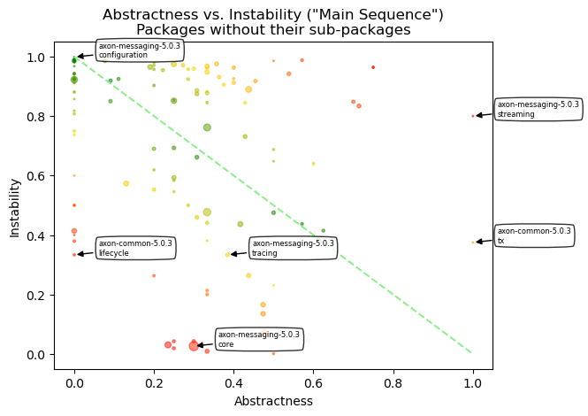
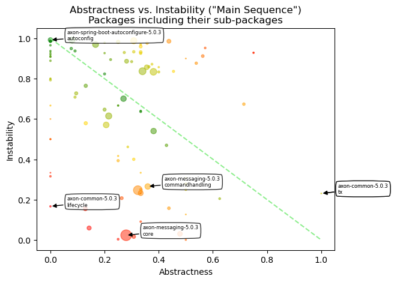

# Object Oriented Design Quality Metrics
   

### References
- [Analyze java package metrics in a graph database](https://joht.github.io/johtizen/data/2023/04/21/java-package-metrics-analysis.html)
- [Calculate metrics](https://101.jqassistant.org/calculate-metrics/index.html)
- [jqassistant](https://jqassistant.org)
- [notebook walks through examples for integrating various packages with Neo4j](https://nicolewhite.github.io/neo4j-jupyter/hello-world.html)
- [OO Design Quality Metrics](https://api.semanticscholar.org/CorpusID:18246616)
- [A Validation of Martin's Metric](https://www.researchgate.net/publication/31598248_A_Validation_of_Martin's_Metric)
- [Neo4j Python Driver](https://neo4j.com/docs/api/python-driver/current)

## Incoming Dependencies

Incoming dependencies are also denoted as "Fan-in", "Afferent Coupling" or "in-degree".
These are the ones that use the listed package. 
   
If these packages get changed, the incoming dependencies might be affected by the change. The more incoming dependencies, the harder it gets to change the code without the need to adapt the dependent code (“rigid code”). Even worse, it might affect the behavior of the dependent code in an unwanted way (“fragile code”).

Since Java Packages are organized hierarchically, incoming dependencies can be count for every package in isolation or by including all of its sub-packages. The latter one is done without top level packages like for example "org" or "org.company" by assuring that only packages are considered that have other packages or types in the same hierarchy level ("siblings").

#### Table 1a
- Show the top 20 Java Packages with the most incoming dependencies
- Set the "incomingDependencies" properties on Package nodes.

<table border="1" class="dataframe">
  <thead>
    <tr style="text-align: right;">
      <th></th>
      <th>artifactName</th>
      <th>fullQualifiedPackageName</th>
      <th>packageName</th>
      <th>incomingDependencies</th>
      <th>incomingDependenciesWeight</th>
      <th>incomingDependentTypes</th>
      <th>incomingDependentInterfaces</th>
      <th>incomingDependentPackages</th>
      <th>incomingDependentArtifacts</th>
    </tr>
  </thead>
  <tbody>
    <tr>
      <th>0</th>
      <td>axon-messaging-5.0.3</td>
      <td>org.axonframework.messaging.core</td>
      <td>core</td>
      <td>12499</td>
      <td>39679</td>
      <td>419</td>
      <td>83</td>
      <td>71</td>
      <td>7</td>
    </tr>
    <tr>
      <th>1</th>
      <td>axon-messaging-5.0.3</td>
      <td>org.axonframework.messaging.core.unitofwork</td>
      <td>unitofwork</td>
      <td>11625</td>
      <td>38453</td>
      <td>242</td>
      <td>54</td>
      <td>62</td>
      <td>4</td>
    </tr>
    <tr>
      <th>2</th>
      <td>axon-common-5.0.3</td>
      <td>org.axonframework.common.configuration</td>
      <td>configuration</td>
      <td>3727</td>
      <td>19786</td>
      <td>151</td>
      <td>53</td>
      <td>33</td>
      <td>8</td>
    </tr>
    <tr>
      <th>3</th>
      <td>axon-messaging-5.0.3</td>
      <td>org.axonframework.messaging.eventhandling</td>
      <td>eventhandling</td>
      <td>3012</td>
      <td>10890</td>
      <td>149</td>
      <td>30</td>
      <td>37</td>
      <td>6</td>
    </tr>
    <tr>
      <th>4</th>
      <td>axon-common-5.0.3</td>
      <td>org.axonframework.common.annotation</td>
      <td>annotation</td>
      <td>2579</td>
      <td>2787</td>
      <td>144</td>
      <td>20</td>
      <td>60</td>
      <td>8</td>
    </tr>
    <tr>
      <th>5</th>
      <td>axon-messaging-5.0.3</td>
      <td>org.axonframework.messaging.commandhandling</td>
      <td>commandhandling</td>
      <td>1497</td>
      <td>5379</td>
      <td>100</td>
      <td>25</td>
      <td>27</td>
      <td>6</td>
    </tr>
    <tr>
      <th>6</th>
      <td>axon-common-5.0.3</td>
      <td>org.axonframework.common.infra</td>
      <td>infra</td>
      <td>1378</td>
      <td>1669</td>
      <td>122</td>
      <td>30</td>
      <td>47</td>
      <td>6</td>
    </tr>
    <tr>
      <th>7</th>
      <td>axon-common-5.0.3</td>
      <td>org.axonframework.common</td>
      <td>common</td>
      <td>977</td>
      <td>2407</td>
      <td>288</td>
      <td>22</td>
      <td>80</td>
      <td>10</td>
    </tr>
    <tr>
      <th>8</th>
      <td>axon-messaging-5.0.3</td>
      <td>org.axonframework.messaging.queryhandling</td>
      <td>queryhandling</td>
      <td>688</td>
      <td>2544</td>
      <td>76</td>
      <td>17</td>
      <td>16</td>
      <td>3</td>
    </tr>
    <tr>
      <th>9</th>
      <td>axon-messaging-5.0.3</td>
      <td>org.axonframework.messaging.core.annotation</td>
      <td>annotation</td>
      <td>512</td>
      <td>1632</td>
      <td>119</td>
      <td>11</td>
      <td>24</td>
      <td>4</td>
    </tr>
    <tr>
      <th>10</th>
      <td>axon-conversion-5.0.3</td>
      <td>org.axonframework.conversion</td>
      <td>conversion</td>
      <td>468</td>
      <td>1807</td>
      <td>62</td>
      <td>12</td>
      <td>22</td>
      <td>4</td>
    </tr>
    <tr>
      <th>11</th>
      <td>axon-messaging-5.0.3</td>
      <td>org.axonframework.messaging.eventhandling.proc...</td>
      <td>token</td>
      <td>425</td>
      <td>2147</td>
      <td>58</td>
      <td>8</td>
      <td>16</td>
      <td>3</td>
    </tr>
    <tr>
      <th>12</th>
      <td>axon-messaging-5.0.3</td>
      <td>org.axonframework.messaging.eventstreaming</td>
      <td>eventstreaming</td>
      <td>293</td>
      <td>833</td>
      <td>53</td>
      <td>14</td>
      <td>10</td>
      <td>3</td>
    </tr>
    <tr>
      <th>13</th>
      <td>axon-eventsourcing-5.0.3</td>
      <td>org.axonframework.eventsourcing.eventstore</td>
      <td>eventstore</td>
      <td>224</td>
      <td>724</td>
      <td>65</td>
      <td>7</td>
      <td>9</td>
      <td>3</td>
    </tr>
    <tr>
      <th>14</th>
      <td>axon-messaging-5.0.3</td>
      <td>org.axonframework.messaging.tracing</td>
      <td>tracing</td>
      <td>136</td>
      <td>478</td>
      <td>36</td>
      <td>7</td>
      <td>6</td>
      <td>1</td>
    </tr>
    <tr>
      <th>15</th>
      <td>axon-test-5.0.3</td>
      <td>org.axonframework.test.fixture</td>
      <td>fixture</td>
      <td>134</td>
      <td>376</td>
      <td>29</td>
      <td>1</td>
      <td>2</td>
      <td>0</td>
    </tr>
    <tr>
      <th>16</th>
      <td>axon-modelling-5.0.3</td>
      <td>org.axonframework.modelling</td>
      <td>modelling</td>
      <td>125</td>
      <td>282</td>
      <td>36</td>
      <td>9</td>
      <td>9</td>
      <td>2</td>
    </tr>
    <tr>
      <th>17</th>
      <td>axon-modelling-5.0.3</td>
      <td>org.axonframework.modelling.entity</td>
      <td>entity</td>
      <td>115</td>
      <td>394</td>
      <td>25</td>
      <td>5</td>
      <td>5</td>
      <td>1</td>
    </tr>
    <tr>
      <th>18</th>
      <td>axon-modelling-5.0.3</td>
      <td>org.axonframework.modelling.entity.child</td>
      <td>child</td>
      <td>89</td>
      <td>230</td>
      <td>28</td>
      <td>7</td>
      <td>3</td>
      <td>0</td>
    </tr>
    <tr>
      <th>19</th>
      <td>axon-messaging-5.0.3</td>
      <td>org.axonframework.messaging.eventhandling.proc...</td>
      <td>segmenting</td>
      <td>86</td>
      <td>662</td>
      <td>31</td>
      <td>5</td>
      <td>10</td>
      <td>1</td>
    </tr>
  </tbody>
</table>

#### Table 1b
- Show the top 20 Java Packages including their sub-packages with the most incoming dependencies
- Set the property "incomingDependenciesIncludingSubpackages" on Package nodes.

<table border="1" class="dataframe">
  <thead>
    <tr style="text-align: right;">
      <th></th>
      <th>artifactName</th>
      <th>fullQualifiedPackageName</th>
      <th>packageName</th>
      <th>incomingDependencies</th>
      <th>incomingDependenciesWeight</th>
      <th>incomingDependentTypes</th>
      <th>incomingDependentInterfaces</th>
      <th>incomingDependentPackages</th>
      <th>incomingDependentArtifacts</th>
    </tr>
  </thead>
  <tbody>
    <tr>
      <th>0</th>
      <td>axon-messaging-5.0.3</td>
      <td>org.axonframework.messaging.core</td>
      <td>core</td>
      <td>18180</td>
      <td>59941</td>
      <td>367</td>
      <td>115</td>
      <td>67</td>
      <td>7</td>
    </tr>
    <tr>
      <th>1</th>
      <td>axon-messaging-5.0.3</td>
      <td>org.axonframework.messaging.core.unitofwork</td>
      <td>unitofwork</td>
      <td>11275</td>
      <td>37337</td>
      <td>228</td>
      <td>54</td>
      <td>58</td>
      <td>5</td>
    </tr>
    <tr>
      <th>2</th>
      <td>axon-common-5.0.3</td>
      <td>org.axonframework.common</td>
      <td>common</td>
      <td>8038</td>
      <td>25190</td>
      <td>470</td>
      <td>107</td>
      <td>94</td>
      <td>9</td>
    </tr>
    <tr>
      <th>3</th>
      <td>axon-common-5.0.3</td>
      <td>org.axonframework.common.configuration</td>
      <td>configuration</td>
      <td>3566</td>
      <td>19095</td>
      <td>111</td>
      <td>53</td>
      <td>32</td>
      <td>8</td>
    </tr>
    <tr>
      <th>4</th>
      <td>axon-common-5.0.3</td>
      <td>org.axonframework.common.annotation</td>
      <td>annotation</td>
      <td>2578</td>
      <td>2786</td>
      <td>143</td>
      <td>20</td>
      <td>59</td>
      <td>8</td>
    </tr>
    <tr>
      <th>5</th>
      <td>axon-messaging-5.0.3</td>
      <td>org.axonframework.messaging.eventhandling</td>
      <td>eventhandling</td>
      <td>2061</td>
      <td>7468</td>
      <td>99</td>
      <td>35</td>
      <td>26</td>
      <td>6</td>
    </tr>
    <tr>
      <th>6</th>
      <td>axon-common-5.0.3</td>
      <td>org.axonframework.common.infra</td>
      <td>infra</td>
      <td>1364</td>
      <td>1595</td>
      <td>117</td>
      <td>30</td>
      <td>46</td>
      <td>6</td>
    </tr>
    <tr>
      <th>7</th>
      <td>axon-messaging-5.0.3</td>
      <td>org.axonframework.messaging.commandhandling</td>
      <td>commandhandling</td>
      <td>900</td>
      <td>3463</td>
      <td>62</td>
      <td>26</td>
      <td>20</td>
      <td>6</td>
    </tr>
    <tr>
      <th>8</th>
      <td>axon-messaging-5.0.3</td>
      <td>org.axonframework.messaging.core.annotation</td>
      <td>annotation</td>
      <td>423</td>
      <td>1325</td>
      <td>82</td>
      <td>11</td>
      <td>23</td>
      <td>4</td>
    </tr>
    <tr>
      <th>9</th>
      <td>axon-conversion-5.0.3</td>
      <td>org.axonframework.conversion</td>
      <td>conversion</td>
      <td>397</td>
      <td>1597</td>
      <td>38</td>
      <td>12</td>
      <td>17</td>
      <td>3</td>
    </tr>
    <tr>
      <th>10</th>
      <td>axon-messaging-5.0.3</td>
      <td>org.axonframework.messaging.eventhandling.proc...</td>
      <td>token</td>
      <td>350</td>
      <td>1416</td>
      <td>45</td>
      <td>8</td>
      <td>11</td>
      <td>4</td>
    </tr>
    <tr>
      <th>11</th>
      <td>axon-messaging-5.0.3</td>
      <td>org.axonframework.messaging.queryhandling</td>
      <td>queryhandling</td>
      <td>269</td>
      <td>973</td>
      <td>34</td>
      <td>15</td>
      <td>12</td>
      <td>5</td>
    </tr>
    <tr>
      <th>12</th>
      <td>axon-messaging-5.0.3</td>
      <td>org.axonframework.messaging.eventstreaming</td>
      <td>eventstreaming</td>
      <td>241</td>
      <td>688</td>
      <td>39</td>
      <td>14</td>
      <td>9</td>
      <td>3</td>
    </tr>
    <tr>
      <th>13</th>
      <td>axon-messaging-5.0.3</td>
      <td>org.axonframework.messaging.eventhandling.proc...</td>
      <td>processing</td>
      <td>218</td>
      <td>685</td>
      <td>30</td>
      <td>13</td>
      <td>10</td>
      <td>5</td>
    </tr>
    <tr>
      <th>14</th>
      <td>axon-messaging-5.0.3</td>
      <td>org.axonframework.messaging.eventhandling.proc...</td>
      <td>streaming</td>
      <td>207</td>
      <td>655</td>
      <td>30</td>
      <td>12</td>
      <td>11</td>
      <td>4</td>
    </tr>
    <tr>
      <th>15</th>
      <td>axon-messaging-5.0.3</td>
      <td>org.axonframework.messaging.tracing</td>
      <td>tracing</td>
      <td>107</td>
      <td>356</td>
      <td>21</td>
      <td>7</td>
      <td>4</td>
      <td>1</td>
    </tr>
    <tr>
      <th>16</th>
      <td>axon-eventsourcing-5.0.3</td>
      <td>org.axonframework.eventsourcing.eventstore</td>
      <td>eventstore</td>
      <td>76</td>
      <td>207</td>
      <td>19</td>
      <td>6</td>
      <td>6</td>
      <td>3</td>
    </tr>
    <tr>
      <th>17</th>
      <td>axon-messaging-5.0.3</td>
      <td>org.axonframework.messaging.eventhandling.proc...</td>
      <td>segmenting</td>
      <td>74</td>
      <td>623</td>
      <td>23</td>
      <td>5</td>
      <td>9</td>
      <td>1</td>
    </tr>
    <tr>
      <th>18</th>
      <td>axon-modelling-5.0.3</td>
      <td>org.axonframework.modelling</td>
      <td>modelling</td>
      <td>74</td>
      <td>226</td>
      <td>13</td>
      <td>20</td>
      <td>4</td>
      <td>1</td>
    </tr>
    <tr>
      <th>19</th>
      <td>axon-messaging-5.0.3</td>
      <td>org.axonframework.messaging.core.conversion</td>
      <td>conversion</td>
      <td>69</td>
      <td>225</td>
      <td>22</td>
      <td>3</td>
      <td>17</td>
      <td>5</td>
    </tr>
  </tbody>
</table>

## Outgoing Dependencies

Outgoing dependencies are also denoted as "Fan-out", "Efferent Coupling" or "out-degree".
These are the ones that are used by the listed package. 

Code from other packages and libraries you’re depending on (outgoing) might change over time. The more outgoing changes, the more likely and frequently code changes are needed. This involves time and effort which can be reduced by automation of tests and version updates. Automated tests are crucial to reveal updates, that change the behavior of the code unexpectedly (“fragile code”). As soon as more effort is required, keeping up becomes difficult (“rigid code”). Not being able to use a newer version might not only restrict features, it can get problematic if there are security issues. This might force you to take “fast but ugly” solutions into account which further increases technical dept.

Since Java Packages are organized hierarchically, outgoing dependencies can be count for every package in isolation or by including all of its sub-packages. The latter one is done without top level packages like for example "org" or "org.company" by assuring that only packages are considered that have other packages or types in the same hierarchy level ("siblings").

#### Table 2a

- Show the top 20 Java Packages with the most outgoing dependencies
- Set the "outgoingDependencies" properties on Package nodes.

<table border="1" class="dataframe">
  <thead>
    <tr style="text-align: right;">
      <th></th>
      <th>artifactName</th>
      <th>fullQualifiedPackageName</th>
      <th>packageName</th>
      <th>outgoingDependencies</th>
      <th>outgoingDependenciesWeight</th>
      <th>outgoingDependentTypes</th>
      <th>outgoingDependentInterfaces</th>
      <th>outgoingDependentPackages</th>
      <th>outgoingDependentArtifacts</th>
    </tr>
  </thead>
  <tbody>
    <tr>
      <th>0</th>
      <td>axon-messaging-5.0.3</td>
      <td>org.axonframework.messaging.core.configuration</td>
      <td>configuration</td>
      <td>2694</td>
      <td>16653</td>
      <td>79</td>
      <td>41</td>
      <td>29</td>
      <td>2</td>
    </tr>
    <tr>
      <th>1</th>
      <td>axon-messaging-5.0.3</td>
      <td>org.axonframework.messaging.eventhandling.proc...</td>
      <td>pooled</td>
      <td>2322</td>
      <td>9835</td>
      <td>96</td>
      <td>46</td>
      <td>20</td>
      <td>1</td>
    </tr>
    <tr>
      <th>2</th>
      <td>axon-server-connector-5.0.3</td>
      <td>org.axonframework.axonserver.connector.event</td>
      <td>event</td>
      <td>1282</td>
      <td>4029</td>
      <td>72</td>
      <td>29</td>
      <td>18</td>
      <td>3</td>
    </tr>
    <tr>
      <th>3</th>
      <td>axon-eventsourcing-5.0.3</td>
      <td>org.axonframework.eventsourcing.eventstore.jpa</td>
      <td>jpa</td>
      <td>1239</td>
      <td>4839</td>
      <td>61</td>
      <td>27</td>
      <td>17</td>
      <td>3</td>
    </tr>
    <tr>
      <th>4</th>
      <td>axon-eventsourcing-5.0.3</td>
      <td>org.axonframework.eventsourcing.configuration</td>
      <td>configuration</td>
      <td>1237</td>
      <td>4808</td>
      <td>66</td>
      <td>41</td>
      <td>25</td>
      <td>3</td>
    </tr>
    <tr>
      <th>5</th>
      <td>axon-messaging-5.0.3</td>
      <td>org.axonframework.messaging.core.interception</td>
      <td>interception</td>
      <td>1160</td>
      <td>6002</td>
      <td>48</td>
      <td>27</td>
      <td>11</td>
      <td>1</td>
    </tr>
    <tr>
      <th>6</th>
      <td>axon-test-5.0.3</td>
      <td>org.axonframework.test.fixture</td>
      <td>fixture</td>
      <td>1079</td>
      <td>3869</td>
      <td>74</td>
      <td>39</td>
      <td>16</td>
      <td>3</td>
    </tr>
    <tr>
      <th>7</th>
      <td>axon-modelling-5.0.3</td>
      <td>org.axonframework.modelling.entity.annotation</td>
      <td>annotation</td>
      <td>857</td>
      <td>3255</td>
      <td>63</td>
      <td>30</td>
      <td>19</td>
      <td>3</td>
    </tr>
    <tr>
      <th>8</th>
      <td>axon-modelling-5.0.3</td>
      <td>org.axonframework.modelling.entity</td>
      <td>entity</td>
      <td>800</td>
      <td>2887</td>
      <td>35</td>
      <td>21</td>
      <td>9</td>
      <td>2</td>
    </tr>
    <tr>
      <th>9</th>
      <td>axon-messaging-5.0.3</td>
      <td>org.axonframework.messaging.eventhandling.proc...</td>
      <td>subscribing</td>
      <td>750</td>
      <td>2762</td>
      <td>47</td>
      <td>29</td>
      <td>14</td>
      <td>1</td>
    </tr>
    <tr>
      <th>10</th>
      <td>axon-eventsourcing-5.0.3</td>
      <td>org.axonframework.eventsourcing.eventstore</td>
      <td>eventstore</td>
      <td>716</td>
      <td>2684</td>
      <td>64</td>
      <td>29</td>
      <td>10</td>
      <td>2</td>
    </tr>
    <tr>
      <th>11</th>
      <td>axon-spring-boot-autoconfigure-5.0.3</td>
      <td>org.axonframework.extension.springboot.autoconfig</td>
      <td>autoconfig</td>
      <td>714</td>
      <td>2921</td>
      <td>112</td>
      <td>39</td>
      <td>36</td>
      <td>6</td>
    </tr>
    <tr>
      <th>12</th>
      <td>axon-modelling-5.0.3</td>
      <td>org.axonframework.modelling.configuration</td>
      <td>configuration</td>
      <td>585</td>
      <td>2279</td>
      <td>41</td>
      <td>29</td>
      <td>10</td>
      <td>2</td>
    </tr>
    <tr>
      <th>13</th>
      <td>axon-messaging-5.0.3</td>
      <td>org.axonframework.messaging.queryhandling</td>
      <td>queryhandling</td>
      <td>533</td>
      <td>2104</td>
      <td>48</td>
      <td>23</td>
      <td>9</td>
      <td>2</td>
    </tr>
    <tr>
      <th>14</th>
      <td>axon-messaging-5.0.3</td>
      <td>org.axonframework.messaging.queryhandling.dist...</td>
      <td>distributed</td>
      <td>513</td>
      <td>1412</td>
      <td>38</td>
      <td>23</td>
      <td>10</td>
      <td>1</td>
    </tr>
    <tr>
      <th>15</th>
      <td>axon-messaging-5.0.3</td>
      <td>org.axonframework.messaging.monitoring.interce...</td>
      <td>interception</td>
      <td>500</td>
      <td>1550</td>
      <td>15</td>
      <td>15</td>
      <td>6</td>
      <td>0</td>
    </tr>
    <tr>
      <th>16</th>
      <td>axon-messaging-5.0.3</td>
      <td>org.axonframework.messaging.commandhandling.in...</td>
      <td>interception</td>
      <td>499</td>
      <td>1240</td>
      <td>25</td>
      <td>16</td>
      <td>8</td>
      <td>1</td>
    </tr>
    <tr>
      <th>17</th>
      <td>axon-messaging-5.0.3</td>
      <td>org.axonframework.messaging.queryhandling.inte...</td>
      <td>interception</td>
      <td>491</td>
      <td>1561</td>
      <td>26</td>
      <td>16</td>
      <td>6</td>
      <td>1</td>
    </tr>
    <tr>
      <th>18</th>
      <td>axon-messaging-5.0.3</td>
      <td>org.axonframework.messaging.eventhandling.anno...</td>
      <td>annotation</td>
      <td>480</td>
      <td>1539</td>
      <td>48</td>
      <td>22</td>
      <td>14</td>
      <td>1</td>
    </tr>
    <tr>
      <th>19</th>
      <td>axon-messaging-5.0.3</td>
      <td>org.axonframework.messaging.eventhandling</td>
      <td>eventhandling</td>
      <td>471</td>
      <td>1201</td>
      <td>42</td>
      <td>20</td>
      <td>8</td>
      <td>2</td>
    </tr>
  </tbody>
</table>

#### Table 2b

- Show the top 20 Java Packages including their sub-packages with the most outgoing dependencies
- Set the property "outgoingDependenciesIncludingSubpackages" on Package nodes.

<table border="1" class="dataframe">
  <thead>
    <tr style="text-align: right;">
      <th></th>
      <th>artifactName</th>
      <th>fullQualifiedPackageName</th>
      <th>packageName</th>
      <th>outgoingDependencies</th>
      <th>outgoingDependenciesWeight</th>
      <th>outgoingDependentTypes</th>
      <th>outgoingDependentInterfaces</th>
      <th>outgoingDependentPackages</th>
      <th>outgoingDependentArtifacts</th>
    </tr>
  </thead>
  <tbody>
    <tr>
      <th>0</th>
      <td>axon-messaging-5.0.3</td>
      <td>org.axonframework.messaging.eventhandling</td>
      <td>eventhandling</td>
      <td>675</td>
      <td>2160</td>
      <td>105</td>
      <td>46</td>
      <td>21</td>
      <td>2</td>
    </tr>
    <tr>
      <th>1</th>
      <td>axon-messaging-5.0.3</td>
      <td>org.axonframework.messaging.core</td>
      <td>core</td>
      <td>434</td>
      <td>1531</td>
      <td>92</td>
      <td>76</td>
      <td>30</td>
      <td>2</td>
    </tr>
    <tr>
      <th>2</th>
      <td>axon-modelling-5.0.3</td>
      <td>org.axonframework.modelling</td>
      <td>modelling</td>
      <td>372</td>
      <td>1088</td>
      <td>63</td>
      <td>23</td>
      <td>19</td>
      <td>2</td>
    </tr>
    <tr>
      <th>3</th>
      <td>axon-messaging-5.0.3</td>
      <td>org.axonframework.messaging.eventhandling.proc...</td>
      <td>processing</td>
      <td>348</td>
      <td>1280</td>
      <td>75</td>
      <td>13</td>
      <td>18</td>
      <td>2</td>
    </tr>
    <tr>
      <th>4</th>
      <td>axon-messaging-5.0.3</td>
      <td>org.axonframework.messaging.commandhandling</td>
      <td>commandhandling</td>
      <td>325</td>
      <td>1035</td>
      <td>74</td>
      <td>29</td>
      <td>15</td>
      <td>2</td>
    </tr>
    <tr>
      <th>5</th>
      <td>axon-messaging-5.0.3</td>
      <td>org.axonframework.messaging.queryhandling</td>
      <td>queryhandling</td>
      <td>316</td>
      <td>1128</td>
      <td>73</td>
      <td>19</td>
      <td>12</td>
      <td>2</td>
    </tr>
    <tr>
      <th>6</th>
      <td>axon-eventsourcing-5.0.3</td>
      <td>org.axonframework.eventsourcing</td>
      <td>eventsourcing</td>
      <td>313</td>
      <td>1037</td>
      <td>96</td>
      <td>14</td>
      <td>31</td>
      <td>3</td>
    </tr>
    <tr>
      <th>7</th>
      <td>axon-messaging-5.0.3</td>
      <td>org.axonframework.messaging.eventhandling.proc...</td>
      <td>streaming</td>
      <td>275</td>
      <td>1008</td>
      <td>76</td>
      <td>11</td>
      <td>20</td>
      <td>2</td>
    </tr>
    <tr>
      <th>8</th>
      <td>axon-modelling-5.0.3</td>
      <td>org.axonframework.modelling.entity</td>
      <td>entity</td>
      <td>269</td>
      <td>854</td>
      <td>46</td>
      <td>11</td>
      <td>17</td>
      <td>3</td>
    </tr>
    <tr>
      <th>9</th>
      <td>axon-server-connector-5.0.3</td>
      <td>org.axonframework.axonserver.connector</td>
      <td>connector</td>
      <td>253</td>
      <td>866</td>
      <td>107</td>
      <td>2</td>
      <td>24</td>
      <td>3</td>
    </tr>
    <tr>
      <th>10</th>
      <td>axon-messaging-5.0.3</td>
      <td>org.axonframework.messaging.eventhandling.proc...</td>
      <td>pooled</td>
      <td>231</td>
      <td>927</td>
      <td>73</td>
      <td>2</td>
      <td>19</td>
      <td>1</td>
    </tr>
    <tr>
      <th>11</th>
      <td>axon-messaging-5.0.3</td>
      <td>org.axonframework.messaging.core.unitofwork</td>
      <td>unitofwork</td>
      <td>188</td>
      <td>716</td>
      <td>15</td>
      <td>54</td>
      <td>9</td>
      <td>1</td>
    </tr>
    <tr>
      <th>12</th>
      <td>axon-eventsourcing-5.0.3</td>
      <td>org.axonframework.eventsourcing.eventstore</td>
      <td>eventstore</td>
      <td>178</td>
      <td>572</td>
      <td>54</td>
      <td>7</td>
      <td>16</td>
      <td>3</td>
    </tr>
    <tr>
      <th>13</th>
      <td>axon-modelling-5.0.3</td>
      <td>org.axonframework.modelling.entity.annotation</td>
      <td>annotation</td>
      <td>178</td>
      <td>679</td>
      <td>48</td>
      <td>5</td>
      <td>18</td>
      <td>3</td>
    </tr>
    <tr>
      <th>14</th>
      <td>axon-messaging-5.0.3</td>
      <td>org.axonframework.messaging.core.interception</td>
      <td>interception</td>
      <td>172</td>
      <td>588</td>
      <td>43</td>
      <td>2</td>
      <td>11</td>
      <td>1</td>
    </tr>
    <tr>
      <th>15</th>
      <td>axon-test-5.0.3</td>
      <td>org.axonframework.test</td>
      <td>test</td>
      <td>169</td>
      <td>510</td>
      <td>46</td>
      <td>10</td>
      <td>14</td>
      <td>2</td>
    </tr>
    <tr>
      <th>16</th>
      <td>axon-server-connector-5.0.3</td>
      <td>org.axonframework.axonserver.connector.event</td>
      <td>event</td>
      <td>142</td>
      <td>416</td>
      <td>59</td>
      <td>0</td>
      <td>17</td>
      <td>3</td>
    </tr>
    <tr>
      <th>17</th>
      <td>axon-test-5.0.3</td>
      <td>org.axonframework.test.fixture</td>
      <td>fixture</td>
      <td>138</td>
      <td>490</td>
      <td>43</td>
      <td>9</td>
      <td>15</td>
      <td>3</td>
    </tr>
    <tr>
      <th>18</th>
      <td>axon-spring-boot-autoconfigure-5.0.3</td>
      <td>org.axonframework.extension.springboot.autoconfig</td>
      <td>autoconfig</td>
      <td>129</td>
      <td>452</td>
      <td>84</td>
      <td>0</td>
      <td>35</td>
      <td>6</td>
    </tr>
    <tr>
      <th>19</th>
      <td>axon-messaging-5.0.3</td>
      <td>org.axonframework.messaging.core.annotation</td>
      <td>annotation</td>
      <td>128</td>
      <td>341</td>
      <td>38</td>
      <td>11</td>
      <td>10</td>
      <td>1</td>
    </tr>
  </tbody>
</table>

## Instability

$$ Instability = \frac{Outgoing\:Dependencies}{Outgoing\:Dependencies + Incoming\:Dependencies} $$

*Instability* is expressed as the ratio of the number of outgoing dependencies of a module (i.e., the number of packages that depend on it) to the total number of dependencies (i.e., the sum of incoming and outgoing dependencies).

Small values near zero indicate low *Instability*. With no outgoing but some incoming dependencies the Instability is zero which is denoted as maximally stable. Such code units are more rigid and difficult to change without impacting other parts of the system. If they are changed less because of that, they are considered stable.

Conversely, high values approaching one indicate high *Instability*. With some outgoing dependencies but no incoming ones the *Instability* is denoted as maximally unstable. Such code units are easier to change without affecting other modules, making them more flexible and less prone to cascading changes throughout the system. If they are changed more often because of that, they are considered unstable.

Since Java Packages are organized hierarchically, *Instability* can be calculated for every package in isolation or by including all of its sub-packages. 

#### Table 3a

- Show the top 20 Java Packages with the lowest *Instability*
- Set the property "instability" on Package nodes. 

<table border="1" class="dataframe">
  <thead>
    <tr style="text-align: right;">
      <th></th>
      <th>artifactName</th>
      <th>fullQualifiedPackageName</th>
      <th>packageName</th>
      <th>instability</th>
      <th>instabilityTypes</th>
      <th>instabilityInterfaces</th>
      <th>instabilityPackages</th>
      <th>instabilityArtifacts</th>
      <th>p.outgoingDependencies</th>
      <th>p.incomingDependencies</th>
      <th>p.outgoingDependentTypes</th>
      <th>p.incomingDependentTypes</th>
      <th>p.outgoingDependentInterfaces</th>
      <th>p.incomingDependentInterfaces</th>
      <th>p.outgoingDependentPackages</th>
      <th>p.incomingDependentPackages</th>
      <th>p.outgoingDependentArtifacts</th>
      <th>p.incomingDependentArtifacts</th>
    </tr>
  </thead>
  <tbody>
    <tr>
      <th>0</th>
      <td>axon-common-5.0.3</td>
      <td>org.axonframework.common.annotation</td>
      <td>annotation</td>
      <td>0.001162</td>
      <td>0.020408</td>
      <td>0.000000</td>
      <td>0.032258</td>
      <td>0.000000</td>
      <td>3</td>
      <td>2579</td>
      <td>3</td>
      <td>144</td>
      <td>0</td>
      <td>20</td>
      <td>2</td>
      <td>60</td>
      <td>0</td>
      <td>8</td>
    </tr>
    <tr>
      <th>1</th>
      <td>axon-messaging-5.0.3</td>
      <td>org.axonframework.messaging.core.unitofwork</td>
      <td>unitofwork</td>
      <td>0.009205</td>
      <td>0.079848</td>
      <td>0.142857</td>
      <td>0.088235</td>
      <td>0.200000</td>
      <td>108</td>
      <td>11625</td>
      <td>21</td>
      <td>242</td>
      <td>9</td>
      <td>54</td>
      <td>6</td>
      <td>62</td>
      <td>1</td>
      <td>4</td>
    </tr>
    <tr>
      <th>2</th>
      <td>axon-common-5.0.3</td>
      <td>org.axonframework.common.infra</td>
      <td>infra</td>
      <td>0.019217</td>
      <td>0.075758</td>
      <td>0.090909</td>
      <td>0.060000</td>
      <td>0.000000</td>
      <td>27</td>
      <td>1378</td>
      <td>10</td>
      <td>122</td>
      <td>3</td>
      <td>30</td>
      <td>3</td>
      <td>47</td>
      <td>0</td>
      <td>6</td>
    </tr>
    <tr>
      <th>3</th>
      <td>axon-messaging-5.0.3</td>
      <td>org.axonframework.messaging.core</td>
      <td>core</td>
      <td>0.026558</td>
      <td>0.160321</td>
      <td>0.170000</td>
      <td>0.101266</td>
      <td>0.222222</td>
      <td>341</td>
      <td>12499</td>
      <td>80</td>
      <td>419</td>
      <td>17</td>
      <td>83</td>
      <td>8</td>
      <td>71</td>
      <td>2</td>
      <td>7</td>
    </tr>
    <tr>
      <th>4</th>
      <td>axon-common-5.0.3</td>
      <td>org.axonframework.common</td>
      <td>common</td>
      <td>0.030754</td>
      <td>0.055738</td>
      <td>0.000000</td>
      <td>0.012346</td>
      <td>0.000000</td>
      <td>31</td>
      <td>977</td>
      <td>17</td>
      <td>288</td>
      <td>0</td>
      <td>22</td>
      <td>1</td>
      <td>80</td>
      <td>0</td>
      <td>10</td>
    </tr>
    <tr>
      <th>5</th>
      <td>axon-messaging-5.0.3</td>
      <td>org.axonframework.messaging.eventhandling.proc...</td>
      <td>token</td>
      <td>0.042793</td>
      <td>0.134328</td>
      <td>0.333333</td>
      <td>0.200000</td>
      <td>0.400000</td>
      <td>19</td>
      <td>425</td>
      <td>9</td>
      <td>58</td>
      <td>4</td>
      <td>8</td>
      <td>4</td>
      <td>16</td>
      <td>2</td>
      <td>3</td>
    </tr>
    <tr>
      <th>6</th>
      <td>axon-conversion-5.0.3</td>
      <td>org.axonframework.conversion</td>
      <td>conversion</td>
      <td>0.042945</td>
      <td>0.138889</td>
      <td>0.250000</td>
      <td>0.120000</td>
      <td>0.200000</td>
      <td>21</td>
      <td>468</td>
      <td>10</td>
      <td>62</td>
      <td>4</td>
      <td>12</td>
      <td>3</td>
      <td>22</td>
      <td>1</td>
      <td>4</td>
    </tr>
    <tr>
      <th>7</th>
      <td>axon-common-5.0.3</td>
      <td>org.axonframework.common.configuration</td>
      <td>configuration</td>
      <td>0.070574</td>
      <td>0.256158</td>
      <td>0.283784</td>
      <td>0.131579</td>
      <td>0.000000</td>
      <td>283</td>
      <td>3727</td>
      <td>52</td>
      <td>151</td>
      <td>21</td>
      <td>53</td>
      <td>5</td>
      <td>33</td>
      <td>0</td>
      <td>8</td>
    </tr>
    <tr>
      <th>8</th>
      <td>axon-messaging-5.0.3</td>
      <td>org.axonframework.messaging.eventhandling</td>
      <td>eventhandling</td>
      <td>0.135228</td>
      <td>0.219895</td>
      <td>0.400000</td>
      <td>0.177778</td>
      <td>0.250000</td>
      <td>471</td>
      <td>3012</td>
      <td>42</td>
      <td>149</td>
      <td>20</td>
      <td>30</td>
      <td>8</td>
      <td>37</td>
      <td>2</td>
      <td>6</td>
    </tr>
    <tr>
      <th>9</th>
      <td>axon-messaging-5.0.3</td>
      <td>org.axonframework.messaging.commandhandling</td>
      <td>commandhandling</td>
      <td>0.165552</td>
      <td>0.259259</td>
      <td>0.431818</td>
      <td>0.181818</td>
      <td>0.250000</td>
      <td>297</td>
      <td>1497</td>
      <td>35</td>
      <td>100</td>
      <td>19</td>
      <td>25</td>
      <td>6</td>
      <td>27</td>
      <td>2</td>
      <td>6</td>
    </tr>
    <tr>
      <th>10</th>
      <td>axon-common-5.0.3</td>
      <td>org.axonframework.common.util</td>
      <td>util</td>
      <td>0.200000</td>
      <td>0.153846</td>
      <td>0.000000</td>
      <td>0.250000</td>
      <td>0.000000</td>
      <td>3</td>
      <td>12</td>
      <td>2</td>
      <td>11</td>
      <td>0</td>
      <td>0</td>
      <td>2</td>
      <td>6</td>
      <td>0</td>
      <td>2</td>
    </tr>
    <tr>
      <th>11</th>
      <td>axon-messaging-5.0.3</td>
      <td>org.axonframework.messaging.monitoring</td>
      <td>monitoring</td>
      <td>0.213592</td>
      <td>0.190476</td>
      <td>0.571429</td>
      <td>0.307692</td>
      <td>0.333333</td>
      <td>22</td>
      <td>81</td>
      <td>8</td>
      <td>34</td>
      <td>4</td>
      <td>3</td>
      <td>4</td>
      <td>9</td>
      <td>1</td>
      <td>2</td>
    </tr>
    <tr>
      <th>12</th>
      <td>axon-messaging-5.0.3</td>
      <td>org.axonframework.messaging.core.conversion</td>
      <td>conversion</td>
      <td>0.230769</td>
      <td>0.178571</td>
      <td>0.571429</td>
      <td>0.217391</td>
      <td>0.285714</td>
      <td>21</td>
      <td>70</td>
      <td>5</td>
      <td>23</td>
      <td>4</td>
      <td>3</td>
      <td>5</td>
      <td>18</td>
      <td>2</td>
      <td>5</td>
    </tr>
    <tr>
      <th>13</th>
      <td>axon-messaging-5.0.3</td>
      <td>org.axonframework.messaging.eventhandling.proc...</td>
      <td>store</td>
      <td>0.263158</td>
      <td>0.190476</td>
      <td>1.000000</td>
      <td>0.400000</td>
      <td>0.333333</td>
      <td>10</td>
      <td>28</td>
      <td>4</td>
      <td>17</td>
      <td>2</td>
      <td>0</td>
      <td>4</td>
      <td>6</td>
      <td>1</td>
      <td>2</td>
    </tr>
    <tr>
      <th>14</th>
      <td>axon-messaging-5.0.3</td>
      <td>org.axonframework.messaging.eventstreaming</td>
      <td>eventstreaming</td>
      <td>0.263819</td>
      <td>0.320513</td>
      <td>0.461538</td>
      <td>0.375000</td>
      <td>0.250000</td>
      <td>105</td>
      <td>293</td>
      <td>25</td>
      <td>53</td>
      <td>12</td>
      <td>14</td>
      <td>6</td>
      <td>10</td>
      <td>1</td>
      <td>3</td>
    </tr>
    <tr>
      <th>15</th>
      <td>axon-common-5.0.3</td>
      <td>org.axonframework.common.lifecycle</td>
      <td>lifecycle</td>
      <td>0.333333</td>
      <td>0.444444</td>
      <td>0.000000</td>
      <td>0.333333</td>
      <td>0.000000</td>
      <td>4</td>
      <td>8</td>
      <td>4</td>
      <td>5</td>
      <td>0</td>
      <td>0</td>
      <td>2</td>
      <td>4</td>
      <td>0</td>
      <td>1</td>
    </tr>
    <tr>
      <th>16</th>
      <td>axon-messaging-5.0.3</td>
      <td>org.axonframework.messaging.tracing</td>
      <td>tracing</td>
      <td>0.333333</td>
      <td>0.320755</td>
      <td>0.533333</td>
      <td>0.454545</td>
      <td>0.500000</td>
      <td>68</td>
      <td>136</td>
      <td>17</td>
      <td>36</td>
      <td>8</td>
      <td>7</td>
      <td>5</td>
      <td>6</td>
      <td>1</td>
      <td>1</td>
    </tr>
    <tr>
      <th>17</th>
      <td>axon-common-5.0.3</td>
      <td>org.axonframework.common.tx</td>
      <td>tx</td>
      <td>0.375000</td>
      <td>0.230769</td>
      <td>0.666667</td>
      <td>0.200000</td>
      <td>0.000000</td>
      <td>6</td>
      <td>10</td>
      <td>3</td>
      <td>10</td>
      <td>2</td>
      <td>1</td>
      <td>2</td>
      <td>8</td>
      <td>0</td>
      <td>2</td>
    </tr>
    <tr>
      <th>18</th>
      <td>axon-update-5.0.3</td>
      <td>org.axonframework.update.api</td>
      <td>api</td>
      <td>0.379310</td>
      <td>0.384615</td>
      <td>0.000000</td>
      <td>0.400000</td>
      <td>1.000000</td>
      <td>11</td>
      <td>18</td>
      <td>5</td>
      <td>8</td>
      <td>0</td>
      <td>1</td>
      <td>2</td>
      <td>3</td>
      <td>1</td>
      <td>0</td>
    </tr>
    <tr>
      <th>19</th>
      <td>axon-messaging-5.0.3</td>
      <td>org.axonframework.messaging.eventhandling.proc...</td>
      <td>errorhandling</td>
      <td>0.380952</td>
      <td>0.384615</td>
      <td>0.750000</td>
      <td>0.500000</td>
      <td>0.000000</td>
      <td>8</td>
      <td>13</td>
      <td>5</td>
      <td>8</td>
      <td>3</td>
      <td>1</td>
      <td>4</td>
      <td>4</td>
      <td>0</td>
      <td>0</td>
    </tr>
  </tbody>
</table>

#### Table 3b

- Show the top 20 Java Packages including their sub-packages with the lowest *Instability*
- Set the property "instabilityIncludingSubpackages" on Package nodes. 

<table border="1" class="dataframe">
  <thead>
    <tr style="text-align: right;">
      <th></th>
      <th>artifactName</th>
      <th>fullQualifiedPackageName</th>
      <th>packageName</th>
      <th>instability</th>
      <th>instabilityTypes</th>
      <th>instabilityInterfaces</th>
      <th>instabilityPackages</th>
      <th>instabilityArtifacts</th>
      <th>p.outgoingDependenciesIncludingSubpackages</th>
      <th>p.incomingDependenciesIncludingSubpackages</th>
      <th>p.outgoingDependentTypesIncludingSubpackages</th>
      <th>p.incomingDependentTypesIncludingSubpackages</th>
      <th>p.outgoingDependentInterfacesIncludingSubpackages</th>
      <th>p.incomingDependentInterfacesIncludingSubpackages</th>
      <th>p.outgoingDependentPackagesIncludingSubpackages</th>
      <th>p.incomingDependentPackagesIncludingSubpackages</th>
      <th>p.outgoingDependentArtifactsIncludingSubpackages</th>
      <th>p.incomingDependentArtifactsIncludingSubpackages</th>
    </tr>
  </thead>
  <tbody>
    <tr>
      <th>0</th>
      <td>axon-common-5.0.3</td>
      <td>org.axonframework.common.annotation</td>
      <td>annotation</td>
      <td>0.000775</td>
      <td>0.013793</td>
      <td>0.000000</td>
      <td>0.016667</td>
      <td>0.000000</td>
      <td>2</td>
      <td>2578</td>
      <td>2</td>
      <td>143</td>
      <td>0</td>
      <td>20</td>
      <td>1</td>
      <td>59</td>
      <td>0</td>
      <td>8</td>
    </tr>
    <tr>
      <th>1</th>
      <td>axon-common-5.0.3</td>
      <td>org.axonframework.common.infra</td>
      <td>infra</td>
      <td>0.003652</td>
      <td>0.025000</td>
      <td>0.000000</td>
      <td>0.041667</td>
      <td>0.000000</td>
      <td>5</td>
      <td>1364</td>
      <td>3</td>
      <td>117</td>
      <td>0</td>
      <td>30</td>
      <td>2</td>
      <td>46</td>
      <td>0</td>
      <td>6</td>
    </tr>
    <tr>
      <th>2</th>
      <td>axon-messaging-5.0.3</td>
      <td>org.axonframework.messaging.core.unitofwork</td>
      <td>unitofwork</td>
      <td>0.016401</td>
      <td>0.061728</td>
      <td>0.500000</td>
      <td>0.134328</td>
      <td>0.166667</td>
      <td>188</td>
      <td>11275</td>
      <td>15</td>
      <td>228</td>
      <td>54</td>
      <td>54</td>
      <td>9</td>
      <td>58</td>
      <td>1</td>
      <td>5</td>
    </tr>
    <tr>
      <th>3</th>
      <td>axon-messaging-5.0.3</td>
      <td>org.axonframework.messaging.core</td>
      <td>core</td>
      <td>0.023316</td>
      <td>0.200436</td>
      <td>0.397906</td>
      <td>0.309278</td>
      <td>0.222222</td>
      <td>434</td>
      <td>18180</td>
      <td>92</td>
      <td>367</td>
      <td>76</td>
      <td>115</td>
      <td>30</td>
      <td>67</td>
      <td>2</td>
      <td>7</td>
    </tr>
    <tr>
      <th>4</th>
      <td>axon-common-5.0.3</td>
      <td>org.axonframework.common.configuration</td>
      <td>configuration</td>
      <td>0.030188</td>
      <td>0.067227</td>
      <td>0.436170</td>
      <td>0.111111</td>
      <td>0.000000</td>
      <td>111</td>
      <td>3566</td>
      <td>8</td>
      <td>111</td>
      <td>41</td>
      <td>53</td>
      <td>4</td>
      <td>32</td>
      <td>0</td>
      <td>8</td>
    </tr>
    <tr>
      <th>5</th>
      <td>axon-conversion-5.0.3</td>
      <td>org.axonframework.conversion</td>
      <td>conversion</td>
      <td>0.059242</td>
      <td>0.136364</td>
      <td>0.500000</td>
      <td>0.150000</td>
      <td>0.000000</td>
      <td>25</td>
      <td>397</td>
      <td>6</td>
      <td>38</td>
      <td>12</td>
      <td>12</td>
      <td>3</td>
      <td>17</td>
      <td>0</td>
      <td>3</td>
    </tr>
    <tr>
      <th>6</th>
      <td>axon-common-5.0.3</td>
      <td>org.axonframework.common.util</td>
      <td>util</td>
      <td>0.090909</td>
      <td>0.100000</td>
      <td>0.000000</td>
      <td>0.166667</td>
      <td>0.000000</td>
      <td>1</td>
      <td>10</td>
      <td>1</td>
      <td>9</td>
      <td>0</td>
      <td>0</td>
      <td>1</td>
      <td>5</td>
      <td>0</td>
      <td>1</td>
    </tr>
    <tr>
      <th>7</th>
      <td>axon-messaging-5.0.3</td>
      <td>org.axonframework.messaging.core.conversion</td>
      <td>conversion</td>
      <td>0.126582</td>
      <td>0.153846</td>
      <td>0.500000</td>
      <td>0.190476</td>
      <td>0.285714</td>
      <td>10</td>
      <td>69</td>
      <td>4</td>
      <td>22</td>
      <td>3</td>
      <td>3</td>
      <td>4</td>
      <td>17</td>
      <td>2</td>
      <td>5</td>
    </tr>
    <tr>
      <th>8</th>
      <td>axon-messaging-5.0.3</td>
      <td>org.axonframework.messaging.eventhandling.proc...</td>
      <td>token</td>
      <td>0.154589</td>
      <td>0.318182</td>
      <td>0.500000</td>
      <td>0.476190</td>
      <td>0.333333</td>
      <td>64</td>
      <td>350</td>
      <td>21</td>
      <td>45</td>
      <td>8</td>
      <td>8</td>
      <td>10</td>
      <td>11</td>
      <td>2</td>
      <td>4</td>
    </tr>
    <tr>
      <th>9</th>
      <td>axon-messaging-5.0.3</td>
      <td>org.axonframework.messaging.eventstreaming</td>
      <td>eventstreaming</td>
      <td>0.157343</td>
      <td>0.204082</td>
      <td>0.500000</td>
      <td>0.357143</td>
      <td>0.250000</td>
      <td>45</td>
      <td>241</td>
      <td>10</td>
      <td>39</td>
      <td>14</td>
      <td>14</td>
      <td>5</td>
      <td>9</td>
      <td>1</td>
      <td>3</td>
    </tr>
    <tr>
      <th>10</th>
      <td>axon-common-5.0.3</td>
      <td>org.axonframework.common.lifecycle</td>
      <td>lifecycle</td>
      <td>0.166667</td>
      <td>0.250000</td>
      <td>0.000000</td>
      <td>0.250000</td>
      <td>0.000000</td>
      <td>1</td>
      <td>5</td>
      <td>1</td>
      <td>3</td>
      <td>0</td>
      <td>0</td>
      <td>1</td>
      <td>3</td>
      <td>0</td>
      <td>1</td>
    </tr>
    <tr>
      <th>11</th>
      <td>axon-modelling-5.0.3</td>
      <td>org.axonframework.modelling.repository</td>
      <td>repository</td>
      <td>0.204819</td>
      <td>0.263158</td>
      <td>0.500000</td>
      <td>0.400000</td>
      <td>0.500000</td>
      <td>17</td>
      <td>66</td>
      <td>5</td>
      <td>14</td>
      <td>5</td>
      <td>5</td>
      <td>4</td>
      <td>6</td>
      <td>1</td>
      <td>1</td>
    </tr>
    <tr>
      <th>12</th>
      <td>axon-messaging-5.0.3</td>
      <td>org.axonframework.messaging.tracing</td>
      <td>tracing</td>
      <td>0.207407</td>
      <td>0.300000</td>
      <td>0.461538</td>
      <td>0.500000</td>
      <td>0.500000</td>
      <td>28</td>
      <td>107</td>
      <td>9</td>
      <td>21</td>
      <td>6</td>
      <td>7</td>
      <td>4</td>
      <td>4</td>
      <td>1</td>
      <td>1</td>
    </tr>
    <tr>
      <th>13</th>
      <td>axon-common-5.0.3</td>
      <td>org.axonframework.common.tx</td>
      <td>tx</td>
      <td>0.230769</td>
      <td>0.230769</td>
      <td>0.500000</td>
      <td>0.200000</td>
      <td>0.000000</td>
      <td>3</td>
      <td>10</td>
      <td>3</td>
      <td>10</td>
      <td>1</td>
      <td>1</td>
      <td>2</td>
      <td>8</td>
      <td>0</td>
      <td>2</td>
    </tr>
    <tr>
      <th>14</th>
      <td>axon-messaging-5.0.3</td>
      <td>org.axonframework.messaging.eventhandling.proc...</td>
      <td>errorhandling</td>
      <td>0.230769</td>
      <td>0.333333</td>
      <td>0.500000</td>
      <td>0.500000</td>
      <td>0.000000</td>
      <td>3</td>
      <td>10</td>
      <td>3</td>
      <td>6</td>
      <td>1</td>
      <td>1</td>
      <td>3</td>
      <td>3</td>
      <td>0</td>
      <td>0</td>
    </tr>
    <tr>
      <th>15</th>
      <td>axon-messaging-5.0.3</td>
      <td>org.axonframework.messaging.core.annotation</td>
      <td>annotation</td>
      <td>0.232305</td>
      <td>0.316667</td>
      <td>0.500000</td>
      <td>0.303030</td>
      <td>0.200000</td>
      <td>128</td>
      <td>423</td>
      <td>38</td>
      <td>82</td>
      <td>11</td>
      <td>11</td>
      <td>10</td>
      <td>23</td>
      <td>1</td>
      <td>4</td>
    </tr>
    <tr>
      <th>16</th>
      <td>axon-messaging-5.0.3</td>
      <td>org.axonframework.messaging.eventhandling</td>
      <td>eventhandling</td>
      <td>0.246711</td>
      <td>0.514706</td>
      <td>0.567901</td>
      <td>0.446809</td>
      <td>0.250000</td>
      <td>675</td>
      <td>2061</td>
      <td>105</td>
      <td>99</td>
      <td>46</td>
      <td>35</td>
      <td>21</td>
      <td>26</td>
      <td>2</td>
      <td>6</td>
    </tr>
    <tr>
      <th>17</th>
      <td>axon-common-5.0.3</td>
      <td>org.axonframework.common.property</td>
      <td>property</td>
      <td>0.250000</td>
      <td>0.400000</td>
      <td>0.000000</td>
      <td>0.250000</td>
      <td>0.000000</td>
      <td>2</td>
      <td>6</td>
      <td>2</td>
      <td>3</td>
      <td>0</td>
      <td>0</td>
      <td>1</td>
      <td>3</td>
      <td>0</td>
      <td>1</td>
    </tr>
    <tr>
      <th>18</th>
      <td>axon-spring-boot-autoconfigure-5.0.3</td>
      <td>org.axonframework.extension.springboot.util</td>
      <td>util</td>
      <td>0.250000</td>
      <td>0.333333</td>
      <td>0.000000</td>
      <td>0.500000</td>
      <td>0.000000</td>
      <td>1</td>
      <td>3</td>
      <td>1</td>
      <td>2</td>
      <td>0</td>
      <td>0</td>
      <td>1</td>
      <td>1</td>
      <td>0</td>
      <td>0</td>
    </tr>
    <tr>
      <th>19</th>
      <td>axon-messaging-5.0.3</td>
      <td>org.axonframework.messaging.commandhandling</td>
      <td>commandhandling</td>
      <td>0.265306</td>
      <td>0.544118</td>
      <td>0.527273</td>
      <td>0.428571</td>
      <td>0.250000</td>
      <td>325</td>
      <td>900</td>
      <td>74</td>
      <td>62</td>
      <td>29</td>
      <td>26</td>
      <td>15</td>
      <td>20</td>
      <td>2</td>
      <td>6</td>
    </tr>
  </tbody>
</table>

## Abstractness

$$ Abstractness = \frac{abstract\:classes\:in\:category}{total\:number\:of\:classes\:in\:category} $$

Package *Abstractness* is expressed as the ratio of the number of abstract classes and interfaces to the total number of classes of a package.

Zero *Abstractness* means that there are no abstract types or interfaces in the package. On the other hand, a value of one means that there are only abstract types.

Since Java Packages are organized hierarchically, *Abstractness* can be calculated for every package in isolation or by including all of its sub-packages. 

#### Table 4a

- Show the top 30 packages with the lowest *Abstractness*
- Set the property "abstractness" on Package nodes. 

<table border="1" class="dataframe">
  <thead>
    <tr style="text-align: right;">
      <th></th>
      <th>artifactName</th>
      <th>fullQualifiedPackageName</th>
      <th>packageName</th>
      <th>abstractness</th>
      <th>numberAbstractTypes</th>
      <th>numberTypes</th>
    </tr>
  </thead>
  <tbody>
    <tr>
      <th>0</th>
      <td>axon-spring-boot-autoconfigure-5.0.3</td>
      <td>org.axonframework.extension.springboot.autoconfig</td>
      <td>autoconfig</td>
      <td>0.0</td>
      <td>0</td>
      <td>41</td>
    </tr>
    <tr>
      <th>1</th>
      <td>axon-spring-boot-autoconfigure-5.0.3</td>
      <td>org.axonframework.extension.springboot</td>
      <td>springboot</td>
      <td>0.0</td>
      <td>0</td>
      <td>19</td>
    </tr>
    <tr>
      <th>2</th>
      <td>axon-server-connector-5.0.3</td>
      <td>org.axonframework.axonserver.connector.event</td>
      <td>event</td>
      <td>0.0</td>
      <td>0</td>
      <td>14</td>
    </tr>
    <tr>
      <th>3</th>
      <td>axon-metrics-micrometer-5.0.3</td>
      <td>org.axonframework.extension.metrics.micrometer</td>
      <td>micrometer</td>
      <td>0.0</td>
      <td>0</td>
      <td>11</td>
    </tr>
    <tr>
      <th>4</th>
      <td>axon-messaging-5.0.3</td>
      <td>org.axonframework.messaging.queryhandling.inte...</td>
      <td>interception</td>
      <td>0.0</td>
      <td>0</td>
      <td>8</td>
    </tr>
    <tr>
      <th>5</th>
      <td>axon-messaging-5.0.3</td>
      <td>org.axonframework.messaging.core.timeout</td>
      <td>timeout</td>
      <td>0.0</td>
      <td>0</td>
      <td>8</td>
    </tr>
    <tr>
      <th>6</th>
      <td>axon-messaging-5.0.3</td>
      <td>org.axonframework.messaging.commandhandling.in...</td>
      <td>interception</td>
      <td>0.0</td>
      <td>0</td>
      <td>6</td>
    </tr>
    <tr>
      <th>7</th>
      <td>axon-messaging-5.0.3</td>
      <td>org.axonframework.messaging.tracing.attributes</td>
      <td>attributes</td>
      <td>0.0</td>
      <td>0</td>
      <td>6</td>
    </tr>
    <tr>
      <th>8</th>
      <td>axon-update-5.0.3</td>
      <td>org.axonframework.update.api</td>
      <td>api</td>
      <td>0.0</td>
      <td>0</td>
      <td>6</td>
    </tr>
    <tr>
      <th>9</th>
      <td>axon-server-connector-5.0.3</td>
      <td>org.axonframework.axonserver.connector.command</td>
      <td>command</td>
      <td>0.0</td>
      <td>0</td>
      <td>6</td>
    </tr>
    <tr>
      <th>10</th>
      <td>axon-common-5.0.3</td>
      <td>org.axonframework.common.lifecycle</td>
      <td>lifecycle</td>
      <td>0.0</td>
      <td>0</td>
      <td>5</td>
    </tr>
    <tr>
      <th>11</th>
      <td>axon-tracing-opentelemetry-5.0.3</td>
      <td>org.axonframework.extension.tracing.opentelemetry</td>
      <td>opentelemetry</td>
      <td>0.0</td>
      <td>0</td>
      <td>5</td>
    </tr>
    <tr>
      <th>12</th>
      <td>axon-conversion-5.0.3</td>
      <td>org.axonframework.conversion.jackson</td>
      <td>jackson</td>
      <td>0.0</td>
      <td>0</td>
      <td>5</td>
    </tr>
    <tr>
      <th>13</th>
      <td>axon-conversion-5.0.3</td>
      <td>org.axonframework.conversion.converter</td>
      <td>converter</td>
      <td>0.0</td>
      <td>0</td>
      <td>5</td>
    </tr>
    <tr>
      <th>14</th>
      <td>axon-conversion-5.0.3</td>
      <td>org.axonframework.conversion.jackson2</td>
      <td>jackson2</td>
      <td>0.0</td>
      <td>0</td>
      <td>5</td>
    </tr>
    <tr>
      <th>15</th>
      <td>axon-messaging-5.0.3</td>
      <td>org.axonframework.messaging.monitoring.interce...</td>
      <td>interception</td>
      <td>0.0</td>
      <td>0</td>
      <td>5</td>
    </tr>
    <tr>
      <th>16</th>
      <td>axon-messaging-5.0.3</td>
      <td>org.axonframework.messaging.eventhandling.proc...</td>
      <td>jpa</td>
      <td>0.0</td>
      <td>0</td>
      <td>4</td>
    </tr>
    <tr>
      <th>17</th>
      <td>axon-update-5.0.3</td>
      <td>org.axonframework.update.detection</td>
      <td>detection</td>
      <td>0.0</td>
      <td>0</td>
      <td>4</td>
    </tr>
    <tr>
      <th>18</th>
      <td>axon-metrics-micrometer-5.0.3</td>
      <td>org.axonframework.extension.metrics.micrometer...</td>
      <td>springboot</td>
      <td>0.0</td>
      <td>0</td>
      <td>4</td>
    </tr>
    <tr>
      <th>19</th>
      <td>axon-messaging-5.0.3</td>
      <td>org.axonframework.messaging.eventhandling.inte...</td>
      <td>interception</td>
      <td>0.0</td>
      <td>0</td>
      <td>3</td>
    </tr>
    <tr>
      <th>20</th>
      <td>axon-messaging-5.0.3</td>
      <td>org.axonframework.messaging.eventhandling.proc...</td>
      <td>inmemory</td>
      <td>0.0</td>
      <td>0</td>
      <td>3</td>
    </tr>
    <tr>
      <th>21</th>
      <td>axon-messaging-5.0.3</td>
      <td>org.axonframework.messaging.core.configuration...</td>
      <td>reflection</td>
      <td>0.0</td>
      <td>0</td>
      <td>3</td>
    </tr>
    <tr>
      <th>22</th>
      <td>axon-test-5.0.3</td>
      <td>org.axonframework.test.server</td>
      <td>server</td>
      <td>0.0</td>
      <td>0</td>
      <td>2</td>
    </tr>
    <tr>
      <th>23</th>
      <td>axon-messaging-5.0.3</td>
      <td>org.axonframework.messaging.eventhandling.proc...</td>
      <td>annotation</td>
      <td>0.0</td>
      <td>0</td>
      <td>2</td>
    </tr>
    <tr>
      <th>24</th>
      <td>axon-messaging-5.0.3</td>
      <td>org.axonframework.messaging.core.reflection</td>
      <td>reflection</td>
      <td>0.0</td>
      <td>0</td>
      <td>2</td>
    </tr>
    <tr>
      <th>25</th>
      <td>axon-messaging-5.0.3</td>
      <td>org.axonframework.messaging.core.unitofwork.an...</td>
      <td>annotation</td>
      <td>0.0</td>
      <td>0</td>
      <td>2</td>
    </tr>
    <tr>
      <th>26</th>
      <td>axon-messaging-5.0.3</td>
      <td>org.axonframework.messaging.core.unitofwork.tr...</td>
      <td>jdbc</td>
      <td>0.0</td>
      <td>0</td>
      <td>2</td>
    </tr>
    <tr>
      <th>27</th>
      <td>axon-messaging-5.0.3</td>
      <td>org.axonframework.messaging.core.unitofwork.tr...</td>
      <td>jpa</td>
      <td>0.0</td>
      <td>0</td>
      <td>2</td>
    </tr>
    <tr>
      <th>28</th>
      <td>axon-messaging-5.0.3</td>
      <td>org.axonframework.messaging.core.configuration</td>
      <td>configuration</td>
      <td>0.0</td>
      <td>0</td>
      <td>2</td>
    </tr>
    <tr>
      <th>29</th>
      <td>axon-spring-boot-autoconfigure-5.0.3</td>
      <td>org.axonframework.extension.springboot.actuato...</td>
      <td>axonserver</td>
      <td>0.0</td>
      <td>0</td>
      <td>2</td>
    </tr>
  </tbody>
</table>

#### Table 4b

- Show the top 30 packages with the highest *Abstractness* and number of Java Types

<table border="1" class="dataframe">
  <thead>
    <tr style="text-align: right;">
      <th></th>
      <th>artifactName</th>
      <th>fullQualifiedPackageName</th>
      <th>packageName</th>
      <th>abstractness</th>
      <th>numberAbstractTypes</th>
      <th>numberTypes</th>
    </tr>
  </thead>
  <tbody>
    <tr>
      <th>146</th>
      <td>axon-common-5.0.3</td>
      <td>org.axonframework.common.function</td>
      <td>function</td>
      <td>1.000000</td>
      <td>2</td>
      <td>2</td>
    </tr>
    <tr>
      <th>147</th>
      <td>axon-common-5.0.3</td>
      <td>org.axonframework.common.tx</td>
      <td>tx</td>
      <td>1.000000</td>
      <td>1</td>
      <td>1</td>
    </tr>
    <tr>
      <th>148</th>
      <td>axon-messaging-5.0.3</td>
      <td>org.axonframework.messaging.eventhandling.proc...</td>
      <td>streaming</td>
      <td>1.000000</td>
      <td>1</td>
      <td>1</td>
    </tr>
    <tr>
      <th>149</th>
      <td>axon-spring-boot-autoconfigure-5.0.3</td>
      <td>org.axonframework.extension.springboot.actuator</td>
      <td>actuator</td>
      <td>1.000000</td>
      <td>1</td>
      <td>1</td>
    </tr>
    <tr>
      <th>144</th>
      <td>axon-messaging-5.0.3</td>
      <td>org.axonframework.messaging.commandhandling.co...</td>
      <td>configuration</td>
      <td>0.750000</td>
      <td>3</td>
      <td>4</td>
    </tr>
    <tr>
      <th>145</th>
      <td>axon-messaging-5.0.3</td>
      <td>org.axonframework.messaging.queryhandling.conf...</td>
      <td>configuration</td>
      <td>0.750000</td>
      <td>3</td>
      <td>4</td>
    </tr>
    <tr>
      <th>143</th>
      <td>axon-messaging-5.0.3</td>
      <td>org.axonframework.messaging.eventhandling.conf...</td>
      <td>configuration</td>
      <td>0.714286</td>
      <td>10</td>
      <td>14</td>
    </tr>
    <tr>
      <th>142</th>
      <td>axon-eventsourcing-5.0.3</td>
      <td>org.axonframework.eventsourcing.annotation</td>
      <td>annotation</td>
      <td>0.700000</td>
      <td>7</td>
      <td>10</td>
    </tr>
    <tr>
      <th>141</th>
      <td>axon-modelling-5.0.3</td>
      <td>org.axonframework.modelling.repository</td>
      <td>repository</td>
      <td>0.625000</td>
      <td>5</td>
      <td>8</td>
    </tr>
    <tr>
      <th>140</th>
      <td>axon-messaging-5.0.3</td>
      <td>org.axonframework.messaging.core.unitofwork.tr...</td>
      <td>transaction</td>
      <td>0.600000</td>
      <td>3</td>
      <td>5</td>
    </tr>
    <tr>
      <th>138</th>
      <td>axon-messaging-5.0.3</td>
      <td>org.axonframework.messaging.queryhandling.anno...</td>
      <td>annotation</td>
      <td>0.571429</td>
      <td>4</td>
      <td>7</td>
    </tr>
    <tr>
      <th>139</th>
      <td>axon-spring-boot-autoconfigure-5.0.3</td>
      <td>org.axonframework.extension.springboot.util</td>
      <td>util</td>
      <td>0.571429</td>
      <td>4</td>
      <td>7</td>
    </tr>
    <tr>
      <th>137</th>
      <td>axon-modelling-5.0.3</td>
      <td>org.axonframework.modelling.configuration</td>
      <td>configuration</td>
      <td>0.538462</td>
      <td>7</td>
      <td>13</td>
    </tr>
    <tr>
      <th>131</th>
      <td>axon-common-5.0.3</td>
      <td>org.axonframework.common.jdbc</td>
      <td>jdbc</td>
      <td>0.500000</td>
      <td>6</td>
      <td>12</td>
    </tr>
    <tr>
      <th>132</th>
      <td>axon-test-5.0.3</td>
      <td>org.axonframework.test.extension</td>
      <td>extension</td>
      <td>0.500000</td>
      <td>2</td>
      <td>4</td>
    </tr>
    <tr>
      <th>133</th>
      <td>axon-common-5.0.3</td>
      <td>org.axonframework.common.annotation</td>
      <td>annotation</td>
      <td>0.500000</td>
      <td>2</td>
      <td>4</td>
    </tr>
    <tr>
      <th>134</th>
      <td>axon-messaging-5.0.3</td>
      <td>org.axonframework.messaging.eventhandling.conv...</td>
      <td>conversion</td>
      <td>0.500000</td>
      <td>1</td>
      <td>2</td>
    </tr>
    <tr>
      <th>135</th>
      <td>axon-messaging-5.0.3</td>
      <td>org.axonframework.messaging.queryhandling.gateway</td>
      <td>gateway</td>
      <td>0.500000</td>
      <td>1</td>
      <td>2</td>
    </tr>
    <tr>
      <th>136</th>
      <td>axon-messaging-5.0.3</td>
      <td>org.axonframework.messaging.core.conversion</td>
      <td>conversion</td>
      <td>0.500000</td>
      <td>1</td>
      <td>2</td>
    </tr>
    <tr>
      <th>130</th>
      <td>axon-common-5.0.3</td>
      <td>org.axonframework.common.configuration</td>
      <td>configuration</td>
      <td>0.478261</td>
      <td>22</td>
      <td>46</td>
    </tr>
    <tr>
      <th>128</th>
      <td>axon-messaging-5.0.3</td>
      <td>org.axonframework.messaging.commandhandling</td>
      <td>commandhandling</td>
      <td>0.473684</td>
      <td>9</td>
      <td>19</td>
    </tr>
    <tr>
      <th>129</th>
      <td>axon-messaging-5.0.3</td>
      <td>org.axonframework.messaging.eventhandling</td>
      <td>eventhandling</td>
      <td>0.473684</td>
      <td>9</td>
      <td>19</td>
    </tr>
    <tr>
      <th>127</th>
      <td>axon-messaging-5.0.3</td>
      <td>org.axonframework.messaging.core.interception....</td>
      <td>annotation</td>
      <td>0.454545</td>
      <td>5</td>
      <td>11</td>
    </tr>
    <tr>
      <th>125</th>
      <td>axon-test-5.0.3</td>
      <td>org.axonframework.test.fixture</td>
      <td>fixture</td>
      <td>0.437500</td>
      <td>14</td>
      <td>32</td>
    </tr>
    <tr>
      <th>126</th>
      <td>axon-messaging-5.0.3</td>
      <td>org.axonframework.messaging.eventstreaming</td>
      <td>eventstreaming</td>
      <td>0.437500</td>
      <td>7</td>
      <td>16</td>
    </tr>
    <tr>
      <th>123</th>
      <td>axon-modelling-5.0.3</td>
      <td>org.axonframework.modelling.entity.child</td>
      <td>child</td>
      <td>0.428571</td>
      <td>6</td>
      <td>14</td>
    </tr>
    <tr>
      <th>124</th>
      <td>axon-eventsourcing-5.0.3</td>
      <td>org.axonframework.eventsourcing</td>
      <td>eventsourcing</td>
      <td>0.428571</td>
      <td>3</td>
      <td>7</td>
    </tr>
    <tr>
      <th>122</th>
      <td>axon-messaging-5.0.3</td>
      <td>org.axonframework.messaging.queryhandling</td>
      <td>queryhandling</td>
      <td>0.416667</td>
      <td>10</td>
      <td>24</td>
    </tr>
    <tr>
      <th>119</th>
      <td>axon-messaging-5.0.3</td>
      <td>org.axonframework.messaging.commandhandling.di...</td>
      <td>distributed</td>
      <td>0.400000</td>
      <td>4</td>
      <td>10</td>
    </tr>
    <tr>
      <th>120</th>
      <td>axon-messaging-5.0.3</td>
      <td>org.axonframework.messaging.eventhandling.repl...</td>
      <td>annotation</td>
      <td>0.400000</td>
      <td>4</td>
      <td>10</td>
    </tr>
  </tbody>
</table>

#### Table 4c

- Show the top 30 packages including their sub-packages with the highest package depth and lowest *Abstractness*
- Set the property "abstractnessIncludingSubpackages" on Package nodes. 

<table border="1" class="dataframe">
  <thead>
    <tr style="text-align: right;">
      <th></th>
      <th>artifactName</th>
      <th>fullQualifiedPackageName</th>
      <th>packageName</th>
      <th>abstractness</th>
      <th>numberAbstractTypes</th>
      <th>numberTypes</th>
      <th>maxSubpackageDepth</th>
    </tr>
  </thead>
  <tbody>
    <tr>
      <th>0</th>
      <td>axon-metrics-micrometer-5.0.3</td>
      <td>org.axonframework.extension.metrics.micrometer</td>
      <td>micrometer</td>
      <td>0.0</td>
      <td>0</td>
      <td>16</td>
      <td>1</td>
    </tr>
    <tr>
      <th>1</th>
      <td>axon-messaging-5.0.3</td>
      <td>org.axonframework.messaging.core.configuration</td>
      <td>configuration</td>
      <td>0.0</td>
      <td>0</td>
      <td>5</td>
      <td>1</td>
    </tr>
    <tr>
      <th>2</th>
      <td>axon-spring-boot-autoconfigure-5.0.3</td>
      <td>org.axonframework.extension.springboot.autoconfig</td>
      <td>autoconfig</td>
      <td>0.0</td>
      <td>0</td>
      <td>41</td>
      <td>0</td>
    </tr>
    <tr>
      <th>3</th>
      <td>axon-server-connector-5.0.3</td>
      <td>org.axonframework.axonserver.connector.event</td>
      <td>event</td>
      <td>0.0</td>
      <td>0</td>
      <td>14</td>
      <td>0</td>
    </tr>
    <tr>
      <th>4</th>
      <td>axon-messaging-5.0.3</td>
      <td>org.axonframework.messaging.queryhandling.inte...</td>
      <td>interception</td>
      <td>0.0</td>
      <td>0</td>
      <td>8</td>
      <td>0</td>
    </tr>
    <tr>
      <th>5</th>
      <td>axon-messaging-5.0.3</td>
      <td>org.axonframework.messaging.core.timeout</td>
      <td>timeout</td>
      <td>0.0</td>
      <td>0</td>
      <td>8</td>
      <td>0</td>
    </tr>
    <tr>
      <th>6</th>
      <td>axon-messaging-5.0.3</td>
      <td>org.axonframework.messaging.commandhandling.in...</td>
      <td>interception</td>
      <td>0.0</td>
      <td>0</td>
      <td>6</td>
      <td>0</td>
    </tr>
    <tr>
      <th>7</th>
      <td>axon-messaging-5.0.3</td>
      <td>org.axonframework.messaging.tracing.attributes</td>
      <td>attributes</td>
      <td>0.0</td>
      <td>0</td>
      <td>6</td>
      <td>0</td>
    </tr>
    <tr>
      <th>8</th>
      <td>axon-update-5.0.3</td>
      <td>org.axonframework.update.api</td>
      <td>api</td>
      <td>0.0</td>
      <td>0</td>
      <td>6</td>
      <td>0</td>
    </tr>
    <tr>
      <th>9</th>
      <td>axon-server-connector-5.0.3</td>
      <td>org.axonframework.axonserver.connector.command</td>
      <td>command</td>
      <td>0.0</td>
      <td>0</td>
      <td>6</td>
      <td>0</td>
    </tr>
    <tr>
      <th>10</th>
      <td>axon-common-5.0.3</td>
      <td>org.axonframework.common.lifecycle</td>
      <td>lifecycle</td>
      <td>0.0</td>
      <td>0</td>
      <td>5</td>
      <td>0</td>
    </tr>
    <tr>
      <th>11</th>
      <td>axon-tracing-opentelemetry-5.0.3</td>
      <td>org.axonframework.extension.tracing.opentelemetry</td>
      <td>opentelemetry</td>
      <td>0.0</td>
      <td>0</td>
      <td>5</td>
      <td>0</td>
    </tr>
    <tr>
      <th>12</th>
      <td>axon-conversion-5.0.3</td>
      <td>org.axonframework.conversion.jackson</td>
      <td>jackson</td>
      <td>0.0</td>
      <td>0</td>
      <td>5</td>
      <td>0</td>
    </tr>
    <tr>
      <th>13</th>
      <td>axon-conversion-5.0.3</td>
      <td>org.axonframework.conversion.converter</td>
      <td>converter</td>
      <td>0.0</td>
      <td>0</td>
      <td>5</td>
      <td>0</td>
    </tr>
    <tr>
      <th>14</th>
      <td>axon-conversion-5.0.3</td>
      <td>org.axonframework.conversion.jackson2</td>
      <td>jackson2</td>
      <td>0.0</td>
      <td>0</td>
      <td>5</td>
      <td>0</td>
    </tr>
    <tr>
      <th>15</th>
      <td>axon-messaging-5.0.3</td>
      <td>org.axonframework.messaging.monitoring.interce...</td>
      <td>interception</td>
      <td>0.0</td>
      <td>0</td>
      <td>5</td>
      <td>0</td>
    </tr>
    <tr>
      <th>16</th>
      <td>axon-messaging-5.0.3</td>
      <td>org.axonframework.messaging.eventhandling.proc...</td>
      <td>jpa</td>
      <td>0.0</td>
      <td>0</td>
      <td>4</td>
      <td>0</td>
    </tr>
    <tr>
      <th>17</th>
      <td>axon-update-5.0.3</td>
      <td>org.axonframework.update.detection</td>
      <td>detection</td>
      <td>0.0</td>
      <td>0</td>
      <td>4</td>
      <td>0</td>
    </tr>
    <tr>
      <th>18</th>
      <td>axon-metrics-micrometer-5.0.3</td>
      <td>org.axonframework.extension.metrics.micrometer...</td>
      <td>springboot</td>
      <td>0.0</td>
      <td>0</td>
      <td>4</td>
      <td>0</td>
    </tr>
    <tr>
      <th>19</th>
      <td>axon-messaging-5.0.3</td>
      <td>org.axonframework.messaging.eventhandling.inte...</td>
      <td>interception</td>
      <td>0.0</td>
      <td>0</td>
      <td>3</td>
      <td>0</td>
    </tr>
    <tr>
      <th>20</th>
      <td>axon-messaging-5.0.3</td>
      <td>org.axonframework.messaging.eventhandling.proc...</td>
      <td>inmemory</td>
      <td>0.0</td>
      <td>0</td>
      <td>3</td>
      <td>0</td>
    </tr>
    <tr>
      <th>21</th>
      <td>axon-messaging-5.0.3</td>
      <td>org.axonframework.messaging.core.configuration...</td>
      <td>reflection</td>
      <td>0.0</td>
      <td>0</td>
      <td>3</td>
      <td>0</td>
    </tr>
    <tr>
      <th>22</th>
      <td>axon-test-5.0.3</td>
      <td>org.axonframework.test.server</td>
      <td>server</td>
      <td>0.0</td>
      <td>0</td>
      <td>2</td>
      <td>0</td>
    </tr>
    <tr>
      <th>23</th>
      <td>axon-messaging-5.0.3</td>
      <td>org.axonframework.messaging.eventhandling.proc...</td>
      <td>annotation</td>
      <td>0.0</td>
      <td>0</td>
      <td>2</td>
      <td>0</td>
    </tr>
    <tr>
      <th>24</th>
      <td>axon-messaging-5.0.3</td>
      <td>org.axonframework.messaging.core.reflection</td>
      <td>reflection</td>
      <td>0.0</td>
      <td>0</td>
      <td>2</td>
      <td>0</td>
    </tr>
    <tr>
      <th>25</th>
      <td>axon-messaging-5.0.3</td>
      <td>org.axonframework.messaging.core.unitofwork.an...</td>
      <td>annotation</td>
      <td>0.0</td>
      <td>0</td>
      <td>2</td>
      <td>0</td>
    </tr>
    <tr>
      <th>26</th>
      <td>axon-messaging-5.0.3</td>
      <td>org.axonframework.messaging.core.unitofwork.tr...</td>
      <td>jdbc</td>
      <td>0.0</td>
      <td>0</td>
      <td>2</td>
      <td>0</td>
    </tr>
    <tr>
      <th>27</th>
      <td>axon-messaging-5.0.3</td>
      <td>org.axonframework.messaging.core.unitofwork.tr...</td>
      <td>jpa</td>
      <td>0.0</td>
      <td>0</td>
      <td>2</td>
      <td>0</td>
    </tr>
    <tr>
      <th>28</th>
      <td>axon-spring-boot-autoconfigure-5.0.3</td>
      <td>org.axonframework.extension.springboot.actuato...</td>
      <td>axonserver</td>
      <td>0.0</td>
      <td>0</td>
      <td>2</td>
      <td>0</td>
    </tr>
    <tr>
      <th>29</th>
      <td>axon-common-5.0.3</td>
      <td>org.axonframework.common.io</td>
      <td>io</td>
      <td>0.0</td>
      <td>0</td>
      <td>1</td>
      <td>0</td>
    </tr>
  </tbody>
</table>

#### Table 4d

- Show the top 30 packages including their sub-packages with the highest package depth and highest *Abstractness*

<table border="1" class="dataframe">
  <thead>
    <tr style="text-align: right;">
      <th></th>
      <th>artifactName</th>
      <th>fullQualifiedPackageName</th>
      <th>packageName</th>
      <th>abstractness</th>
      <th>numberAbstractTypes</th>
      <th>numberTypes</th>
      <th>maxSubpackageDepth</th>
    </tr>
  </thead>
  <tbody>
    <tr>
      <th>119</th>
      <td>axon-common-5.0.3</td>
      <td>org.axonframework.common.function</td>
      <td>function</td>
      <td>1.000000</td>
      <td>2</td>
      <td>2</td>
      <td>0</td>
    </tr>
    <tr>
      <th>120</th>
      <td>axon-common-5.0.3</td>
      <td>org.axonframework.common.tx</td>
      <td>tx</td>
      <td>1.000000</td>
      <td>1</td>
      <td>1</td>
      <td>0</td>
    </tr>
    <tr>
      <th>117</th>
      <td>axon-messaging-5.0.3</td>
      <td>org.axonframework.messaging.commandhandling.co...</td>
      <td>configuration</td>
      <td>0.750000</td>
      <td>3</td>
      <td>4</td>
      <td>0</td>
    </tr>
    <tr>
      <th>118</th>
      <td>axon-messaging-5.0.3</td>
      <td>org.axonframework.messaging.queryhandling.conf...</td>
      <td>configuration</td>
      <td>0.750000</td>
      <td>3</td>
      <td>4</td>
      <td>0</td>
    </tr>
    <tr>
      <th>116</th>
      <td>axon-messaging-5.0.3</td>
      <td>org.axonframework.messaging.eventhandling.conf...</td>
      <td>configuration</td>
      <td>0.714286</td>
      <td>10</td>
      <td>14</td>
      <td>0</td>
    </tr>
    <tr>
      <th>115</th>
      <td>axon-modelling-5.0.3</td>
      <td>org.axonframework.modelling.repository</td>
      <td>repository</td>
      <td>0.625000</td>
      <td>5</td>
      <td>8</td>
      <td>0</td>
    </tr>
    <tr>
      <th>114</th>
      <td>axon-messaging-5.0.3</td>
      <td>org.axonframework.messaging.queryhandling.anno...</td>
      <td>annotation</td>
      <td>0.571429</td>
      <td>4</td>
      <td>7</td>
      <td>0</td>
    </tr>
    <tr>
      <th>113</th>
      <td>axon-eventsourcing-5.0.3</td>
      <td>org.axonframework.eventsourcing.annotation</td>
      <td>annotation</td>
      <td>0.562500</td>
      <td>9</td>
      <td>16</td>
      <td>1</td>
    </tr>
    <tr>
      <th>112</th>
      <td>axon-modelling-5.0.3</td>
      <td>org.axonframework.modelling.configuration</td>
      <td>configuration</td>
      <td>0.538462</td>
      <td>7</td>
      <td>13</td>
      <td>0</td>
    </tr>
    <tr>
      <th>105</th>
      <td>axon-spring-boot-autoconfigure-5.0.3</td>
      <td>org.axonframework.extension.springboot.util</td>
      <td>util</td>
      <td>0.500000</td>
      <td>4</td>
      <td>8</td>
      <td>1</td>
    </tr>
    <tr>
      <th>106</th>
      <td>axon-common-5.0.3</td>
      <td>org.axonframework.common.jdbc</td>
      <td>jdbc</td>
      <td>0.500000</td>
      <td>6</td>
      <td>12</td>
      <td>0</td>
    </tr>
    <tr>
      <th>107</th>
      <td>axon-test-5.0.3</td>
      <td>org.axonframework.test.extension</td>
      <td>extension</td>
      <td>0.500000</td>
      <td>2</td>
      <td>4</td>
      <td>0</td>
    </tr>
    <tr>
      <th>108</th>
      <td>axon-common-5.0.3</td>
      <td>org.axonframework.common.annotation</td>
      <td>annotation</td>
      <td>0.500000</td>
      <td>2</td>
      <td>4</td>
      <td>0</td>
    </tr>
    <tr>
      <th>109</th>
      <td>axon-messaging-5.0.3</td>
      <td>org.axonframework.messaging.eventhandling.conv...</td>
      <td>conversion</td>
      <td>0.500000</td>
      <td>1</td>
      <td>2</td>
      <td>0</td>
    </tr>
    <tr>
      <th>110</th>
      <td>axon-messaging-5.0.3</td>
      <td>org.axonframework.messaging.queryhandling.gateway</td>
      <td>gateway</td>
      <td>0.500000</td>
      <td>1</td>
      <td>2</td>
      <td>0</td>
    </tr>
    <tr>
      <th>111</th>
      <td>axon-messaging-5.0.3</td>
      <td>org.axonframework.messaging.core.conversion</td>
      <td>conversion</td>
      <td>0.500000</td>
      <td>1</td>
      <td>2</td>
      <td>0</td>
    </tr>
    <tr>
      <th>104</th>
      <td>axon-common-5.0.3</td>
      <td>org.axonframework.common.configuration</td>
      <td>configuration</td>
      <td>0.478261</td>
      <td>22</td>
      <td>46</td>
      <td>0</td>
    </tr>
    <tr>
      <th>103</th>
      <td>axon-messaging-5.0.3</td>
      <td>org.axonframework.messaging.core.interception....</td>
      <td>annotation</td>
      <td>0.454545</td>
      <td>5</td>
      <td>11</td>
      <td>0</td>
    </tr>
    <tr>
      <th>101</th>
      <td>axon-test-5.0.3</td>
      <td>org.axonframework.test.fixture</td>
      <td>fixture</td>
      <td>0.437500</td>
      <td>14</td>
      <td>32</td>
      <td>0</td>
    </tr>
    <tr>
      <th>102</th>
      <td>axon-messaging-5.0.3</td>
      <td>org.axonframework.messaging.eventstreaming</td>
      <td>eventstreaming</td>
      <td>0.437500</td>
      <td>7</td>
      <td>16</td>
      <td>0</td>
    </tr>
    <tr>
      <th>100</th>
      <td>axon-modelling-5.0.3</td>
      <td>org.axonframework.modelling.entity.child</td>
      <td>child</td>
      <td>0.428571</td>
      <td>6</td>
      <td>14</td>
      <td>0</td>
    </tr>
    <tr>
      <th>97</th>
      <td>axon-messaging-5.0.3</td>
      <td>org.axonframework.messaging.commandhandling.di...</td>
      <td>distributed</td>
      <td>0.400000</td>
      <td>4</td>
      <td>10</td>
      <td>0</td>
    </tr>
    <tr>
      <th>98</th>
      <td>axon-messaging-5.0.3</td>
      <td>org.axonframework.messaging.eventhandling.repl...</td>
      <td>annotation</td>
      <td>0.400000</td>
      <td>4</td>
      <td>10</td>
      <td>0</td>
    </tr>
    <tr>
      <th>99</th>
      <td>axon-messaging-5.0.3</td>
      <td>org.axonframework.messaging.eventhandling.gateway</td>
      <td>gateway</td>
      <td>0.400000</td>
      <td>2</td>
      <td>5</td>
      <td>0</td>
    </tr>
    <tr>
      <th>96</th>
      <td>axon-messaging-5.0.3</td>
      <td>org.axonframework.messaging.queryhandling</td>
      <td>queryhandling</td>
      <td>0.380952</td>
      <td>24</td>
      <td>63</td>
      <td>1</td>
    </tr>
    <tr>
      <th>95</th>
      <td>axon-modelling-5.0.3</td>
      <td>org.axonframework.modelling</td>
      <td>modelling</td>
      <td>0.380435</td>
      <td>35</td>
      <td>92</td>
      <td>2</td>
    </tr>
    <tr>
      <th>94</th>
      <td>axon-messaging-5.0.3</td>
      <td>org.axonframework.messaging.commandhandling.ga...</td>
      <td>gateway</td>
      <td>0.375000</td>
      <td>3</td>
      <td>8</td>
      <td>0</td>
    </tr>
    <tr>
      <th>93</th>
      <td>axon-messaging-5.0.3</td>
      <td>org.axonframework.messaging.queryhandling.dist...</td>
      <td>distributed</td>
      <td>0.363636</td>
      <td>4</td>
      <td>11</td>
      <td>0</td>
    </tr>
    <tr>
      <th>92</th>
      <td>axon-messaging-5.0.3</td>
      <td>org.axonframework.messaging.commandhandling</td>
      <td>commandhandling</td>
      <td>0.359375</td>
      <td>23</td>
      <td>64</td>
      <td>1</td>
    </tr>
    <tr>
      <th>90</th>
      <td>axon-messaging-5.0.3</td>
      <td>org.axonframework.messaging.eventhandling.replay</td>
      <td>replay</td>
      <td>0.357143</td>
      <td>5</td>
      <td>14</td>
      <td>1</td>
    </tr>
  </tbody>
</table>

## Distance from the main sequence

The *main sequence* is a imaginary line that represents a good compromise between *Abstractness* and *Instability*. A high distance to this line may indicate problems. For example is very *stable* (rigid) code with low abstractness hard to change.

Read more details on that in [OO Design Quality Metrics](https://api.semanticscholar.org/CorpusID:18246616) and [Calculate metrics](https://101.jqassistant.org/calculate-metrics/index.html).

#### Table 5a

- Show the top 30 packages with the highest distance from the "main sequence"

<table border="1" class="dataframe">
  <thead>
    <tr style="text-align: right;">
      <th></th>
      <th>artifactName</th>
      <th>fullQualifiedName</th>
      <th>name</th>
      <th>distance</th>
      <th>abstractness</th>
      <th>instability</th>
      <th>elementsCount</th>
    </tr>
  </thead>
  <tbody>
    <tr>
      <th>0</th>
      <td>axon-messaging-5.0.3</td>
      <td>org.axonframework.messaging.tracing.attributes</td>
      <td>attributes</td>
      <td>NaN</td>
      <td>0.0</td>
      <td>NaN</td>
      <td>6</td>
    </tr>
    <tr>
      <th>1</th>
      <td>axon-conversion-5.0.3</td>
      <td>org.axonframework.conversion.converter</td>
      <td>converter</td>
      <td>NaN</td>
      <td>0.0</td>
      <td>NaN</td>
      <td>5</td>
    </tr>
    <tr>
      <th>2</th>
      <td>axon-common-5.0.3</td>
      <td>org.axonframework.common.function</td>
      <td>function</td>
      <td>NaN</td>
      <td>1.0</td>
      <td>NaN</td>
      <td>2</td>
    </tr>
    <tr>
      <th>3</th>
      <td>axon-messaging-5.0.3</td>
      <td>org.axonframework.messaging.core.reflection</td>
      <td>reflection</td>
      <td>NaN</td>
      <td>0.0</td>
      <td>NaN</td>
      <td>2</td>
    </tr>
    <tr>
      <th>4</th>
      <td>axon-common-5.0.3</td>
      <td>org.axonframework.common.io</td>
      <td>io</td>
      <td>NaN</td>
      <td>0.0</td>
      <td>NaN</td>
      <td>1</td>
    </tr>
    <tr>
      <th>5</th>
      <td>axon-common-5.0.3</td>
      <td>org.axonframework.common.digest</td>
      <td>digest</td>
      <td>NaN</td>
      <td>0.0</td>
      <td>NaN</td>
      <td>1</td>
    </tr>
    <tr>
      <th>6</th>
      <td>axon-messaging-5.0.3</td>
      <td>org.axonframework.messaging.commandhandling.retry</td>
      <td>retry</td>
      <td>NaN</td>
      <td>0.0</td>
      <td>NaN</td>
      <td>1</td>
    </tr>
    <tr>
      <th>7</th>
      <td>axon-metrics-micrometer-5.0.3</td>
      <td>org.axonframework.extension.metrics.micrometer...</td>
      <td>reservoir</td>
      <td>NaN</td>
      <td>0.0</td>
      <td>NaN</td>
      <td>1</td>
    </tr>
    <tr>
      <th>8</th>
      <td>axon-spring-boot-autoconfigure-5.0.3</td>
      <td>org.axonframework.extension.springboot.actuator</td>
      <td>actuator</td>
      <td>NaN</td>
      <td>1.0</td>
      <td>NaN</td>
      <td>1</td>
    </tr>
    <tr>
      <th>9</th>
      <td>axon-test-5.0.3</td>
      <td>org</td>
      <td>org</td>
      <td>NaN</td>
      <td>0.0</td>
      <td>NaN</td>
      <td>0</td>
    </tr>
    <tr>
      <th>10</th>
      <td>axon-test-5.0.3</td>
      <td>org.axonframework</td>
      <td>axonframework</td>
      <td>NaN</td>
      <td>0.0</td>
      <td>NaN</td>
      <td>0</td>
    </tr>
    <tr>
      <th>11</th>
      <td>axon-common-5.0.3</td>
      <td>org</td>
      <td>org</td>
      <td>NaN</td>
      <td>0.0</td>
      <td>NaN</td>
      <td>0</td>
    </tr>
    <tr>
      <th>12</th>
      <td>axon-common-5.0.3</td>
      <td>org.axonframework</td>
      <td>axonframework</td>
      <td>NaN</td>
      <td>0.0</td>
      <td>NaN</td>
      <td>0</td>
    </tr>
    <tr>
      <th>13</th>
      <td>axon-tracing-opentelemetry-5.0.3</td>
      <td>org</td>
      <td>org</td>
      <td>NaN</td>
      <td>0.0</td>
      <td>NaN</td>
      <td>0</td>
    </tr>
    <tr>
      <th>14</th>
      <td>axon-tracing-opentelemetry-5.0.3</td>
      <td>org.axonframework</td>
      <td>axonframework</td>
      <td>NaN</td>
      <td>0.0</td>
      <td>NaN</td>
      <td>0</td>
    </tr>
    <tr>
      <th>15</th>
      <td>axon-tracing-opentelemetry-5.0.3</td>
      <td>org.axonframework.extension</td>
      <td>extension</td>
      <td>NaN</td>
      <td>0.0</td>
      <td>NaN</td>
      <td>0</td>
    </tr>
    <tr>
      <th>16</th>
      <td>axon-tracing-opentelemetry-5.0.3</td>
      <td>org.axonframework.extension.tracing</td>
      <td>tracing</td>
      <td>NaN</td>
      <td>0.0</td>
      <td>NaN</td>
      <td>0</td>
    </tr>
    <tr>
      <th>17</th>
      <td>axon-eventsourcing-5.0.3</td>
      <td>org</td>
      <td>org</td>
      <td>NaN</td>
      <td>0.0</td>
      <td>NaN</td>
      <td>0</td>
    </tr>
    <tr>
      <th>18</th>
      <td>axon-eventsourcing-5.0.3</td>
      <td>org.axonframework</td>
      <td>axonframework</td>
      <td>NaN</td>
      <td>0.0</td>
      <td>NaN</td>
      <td>0</td>
    </tr>
    <tr>
      <th>19</th>
      <td>axon-conversion-5.0.3</td>
      <td>org</td>
      <td>org</td>
      <td>NaN</td>
      <td>0.0</td>
      <td>NaN</td>
      <td>0</td>
    </tr>
    <tr>
      <th>20</th>
      <td>axon-conversion-5.0.3</td>
      <td>org.axonframework</td>
      <td>axonframework</td>
      <td>NaN</td>
      <td>0.0</td>
      <td>NaN</td>
      <td>0</td>
    </tr>
    <tr>
      <th>21</th>
      <td>axon-messaging-5.0.3</td>
      <td>org</td>
      <td>org</td>
      <td>NaN</td>
      <td>0.0</td>
      <td>NaN</td>
      <td>0</td>
    </tr>
    <tr>
      <th>22</th>
      <td>axon-messaging-5.0.3</td>
      <td>org.axonframework</td>
      <td>axonframework</td>
      <td>NaN</td>
      <td>0.0</td>
      <td>NaN</td>
      <td>0</td>
    </tr>
    <tr>
      <th>23</th>
      <td>axon-messaging-5.0.3</td>
      <td>org.axonframework.messaging</td>
      <td>messaging</td>
      <td>NaN</td>
      <td>0.0</td>
      <td>NaN</td>
      <td>0</td>
    </tr>
    <tr>
      <th>24</th>
      <td>axon-update-5.0.3</td>
      <td>org</td>
      <td>org</td>
      <td>NaN</td>
      <td>0.0</td>
      <td>NaN</td>
      <td>0</td>
    </tr>
    <tr>
      <th>25</th>
      <td>axon-update-5.0.3</td>
      <td>org.axonframework</td>
      <td>axonframework</td>
      <td>NaN</td>
      <td>0.0</td>
      <td>NaN</td>
      <td>0</td>
    </tr>
    <tr>
      <th>26</th>
      <td>axon-metrics-micrometer-5.0.3</td>
      <td>org</td>
      <td>org</td>
      <td>NaN</td>
      <td>0.0</td>
      <td>NaN</td>
      <td>0</td>
    </tr>
    <tr>
      <th>27</th>
      <td>axon-metrics-micrometer-5.0.3</td>
      <td>org.axonframework</td>
      <td>axonframework</td>
      <td>NaN</td>
      <td>0.0</td>
      <td>NaN</td>
      <td>0</td>
    </tr>
    <tr>
      <th>28</th>
      <td>axon-metrics-micrometer-5.0.3</td>
      <td>org.axonframework.extension</td>
      <td>extension</td>
      <td>NaN</td>
      <td>0.0</td>
      <td>NaN</td>
      <td>0</td>
    </tr>
    <tr>
      <th>29</th>
      <td>axon-metrics-micrometer-5.0.3</td>
      <td>org.axonframework.extension.metrics</td>
      <td>metrics</td>
      <td>NaN</td>
      <td>0.0</td>
      <td>NaN</td>
      <td>0</td>
    </tr>
  </tbody>
</table>

#### Table 5b

- Show the top 30 packages including their sub-packages with the highest distance from the "main sequence"

<table border="1" class="dataframe">
  <thead>
    <tr style="text-align: right;">
      <th></th>
      <th>artifactName</th>
      <th>fullQualifiedName</th>
      <th>name</th>
      <th>distance</th>
      <th>abstractness</th>
      <th>instability</th>
      <th>elementsCount</th>
    </tr>
  </thead>
  <tbody>
    <tr>
      <th>0</th>
      <td>axon-common-5.0.3</td>
      <td>org.axonframework.common.lifecycle</td>
      <td>lifecycle</td>
      <td>0.833333</td>
      <td>0.000000</td>
      <td>0.166667</td>
      <td>5</td>
    </tr>
    <tr>
      <th>1</th>
      <td>axon-conversion-5.0.3</td>
      <td>org.axonframework.conversion</td>
      <td>conversion</td>
      <td>0.797901</td>
      <td>0.142857</td>
      <td>0.059242</td>
      <td>35</td>
    </tr>
    <tr>
      <th>2</th>
      <td>axon-common-5.0.3</td>
      <td>org.axonframework.common.infra</td>
      <td>infra</td>
      <td>0.746348</td>
      <td>0.250000</td>
      <td>0.003652</td>
      <td>8</td>
    </tr>
    <tr>
      <th>3</th>
      <td>axon-messaging-5.0.3</td>
      <td>org.axonframework.messaging.eventhandling.proc...</td>
      <td>token</td>
      <td>0.716378</td>
      <td>0.129032</td>
      <td>0.154589</td>
      <td>31</td>
    </tr>
    <tr>
      <th>4</th>
      <td>axon-messaging-5.0.3</td>
      <td>org.axonframework.messaging.core</td>
      <td>core</td>
      <td>0.697023</td>
      <td>0.279661</td>
      <td>0.023316</td>
      <td>236</td>
    </tr>
    <tr>
      <th>5</th>
      <td>axon-update-5.0.3</td>
      <td>org.axonframework.update.api</td>
      <td>api</td>
      <td>0.684211</td>
      <td>0.000000</td>
      <td>0.315789</td>
      <td>6</td>
    </tr>
    <tr>
      <th>6</th>
      <td>axon-messaging-5.0.3</td>
      <td>org.axonframework.messaging.commandhandling.co...</td>
      <td>configuration</td>
      <td>0.678571</td>
      <td>0.750000</td>
      <td>0.928571</td>
      <td>4</td>
    </tr>
    <tr>
      <th>7</th>
      <td>axon-messaging-5.0.3</td>
      <td>org.axonframework.messaging.queryhandling.conf...</td>
      <td>configuration</td>
      <td>0.678571</td>
      <td>0.750000</td>
      <td>0.928571</td>
      <td>4</td>
    </tr>
    <tr>
      <th>8</th>
      <td>axon-messaging-5.0.3</td>
      <td>org.axonframework.messaging.core.unitofwork</td>
      <td>unitofwork</td>
      <td>0.675907</td>
      <td>0.307692</td>
      <td>0.016401</td>
      <td>26</td>
    </tr>
    <tr>
      <th>9</th>
      <td>axon-test-5.0.3</td>
      <td>org.axonframework.test.server</td>
      <td>server</td>
      <td>0.666667</td>
      <td>0.000000</td>
      <td>0.333333</td>
      <td>2</td>
    </tr>
    <tr>
      <th>10</th>
      <td>axon-common-5.0.3</td>
      <td>org.axonframework.common.util</td>
      <td>util</td>
      <td>0.575758</td>
      <td>0.333333</td>
      <td>0.090909</td>
      <td>6</td>
    </tr>
    <tr>
      <th>11</th>
      <td>axon-messaging-5.0.3</td>
      <td>org.axonframework.messaging.tracing</td>
      <td>tracing</td>
      <td>0.529435</td>
      <td>0.263158</td>
      <td>0.207407</td>
      <td>19</td>
    </tr>
    <tr>
      <th>12</th>
      <td>axon-messaging-5.0.3</td>
      <td>org.axonframework.messaging.queryhandling.anno...</td>
      <td>annotation</td>
      <td>0.523810</td>
      <td>0.571429</td>
      <td>0.952381</td>
      <td>7</td>
    </tr>
    <tr>
      <th>13</th>
      <td>axon-update-5.0.3</td>
      <td>org.axonframework.update.detection</td>
      <td>detection</td>
      <td>0.500000</td>
      <td>0.000000</td>
      <td>0.500000</td>
      <td>4</td>
    </tr>
    <tr>
      <th>14</th>
      <td>axon-update-5.0.3</td>
      <td>org.axonframework.update.common</td>
      <td>common</td>
      <td>0.500000</td>
      <td>0.000000</td>
      <td>0.500000</td>
      <td>1</td>
    </tr>
    <tr>
      <th>15</th>
      <td>axon-spring-boot-autoconfigure-5.0.3</td>
      <td>org.axonframework.extension.springboot.util.jpa</td>
      <td>jpa</td>
      <td>0.500000</td>
      <td>0.000000</td>
      <td>0.500000</td>
      <td>1</td>
    </tr>
    <tr>
      <th>16</th>
      <td>axon-common-5.0.3</td>
      <td>org.axonframework.common.annotation</td>
      <td>annotation</td>
      <td>0.499225</td>
      <td>0.500000</td>
      <td>0.000775</td>
      <td>4</td>
    </tr>
    <tr>
      <th>17</th>
      <td>axon-common-5.0.3</td>
      <td>org.axonframework.common.configuration</td>
      <td>configuration</td>
      <td>0.491551</td>
      <td>0.478261</td>
      <td>0.030188</td>
      <td>46</td>
    </tr>
    <tr>
      <th>18</th>
      <td>axon-eventsourcing-5.0.3</td>
      <td>org.axonframework.eventsourcing.annotation</td>
      <td>annotation</td>
      <td>0.474781</td>
      <td>0.562500</td>
      <td>0.912281</td>
      <td>16</td>
    </tr>
    <tr>
      <th>19</th>
      <td>axon-messaging-5.0.3</td>
      <td>org.axonframework.messaging.eventhandling.proc...</td>
      <td>errorhandling</td>
      <td>0.435897</td>
      <td>0.333333</td>
      <td>0.230769</td>
      <td>3</td>
    </tr>
    <tr>
      <th>20</th>
      <td>axon-messaging-5.0.3</td>
      <td>org.axonframework.messaging.core.annotation</td>
      <td>annotation</td>
      <td>0.434362</td>
      <td>0.333333</td>
      <td>0.232305</td>
      <td>51</td>
    </tr>
    <tr>
      <th>21</th>
      <td>axon-messaging-5.0.3</td>
      <td>org.axonframework.messaging.eventhandling</td>
      <td>eventhandling</td>
      <td>0.430308</td>
      <td>0.322981</td>
      <td>0.246711</td>
      <td>161</td>
    </tr>
    <tr>
      <th>22</th>
      <td>axon-test-5.0.3</td>
      <td>org.axonframework.test.fixture</td>
      <td>fixture</td>
      <td>0.423214</td>
      <td>0.437500</td>
      <td>0.985714</td>
      <td>32</td>
    </tr>
    <tr>
      <th>23</th>
      <td>axon-common-5.0.3</td>
      <td>org.axonframework.common.property</td>
      <td>property</td>
      <td>0.416667</td>
      <td>0.333333</td>
      <td>0.250000</td>
      <td>9</td>
    </tr>
    <tr>
      <th>24</th>
      <td>axon-modelling-5.0.3</td>
      <td>org.axonframework.modelling.configuration</td>
      <td>configuration</td>
      <td>0.415174</td>
      <td>0.538462</td>
      <td>0.876712</td>
      <td>13</td>
    </tr>
    <tr>
      <th>25</th>
      <td>axon-messaging-5.0.3</td>
      <td>org.axonframework.messaging.eventstreaming</td>
      <td>eventstreaming</td>
      <td>0.405157</td>
      <td>0.437500</td>
      <td>0.157343</td>
      <td>16</td>
    </tr>
    <tr>
      <th>26</th>
      <td>axon-spring-boot-autoconfigure-5.0.3</td>
      <td>org.axonframework.extension.springboot.actuato...</td>
      <td>axonserver</td>
      <td>0.400000</td>
      <td>0.000000</td>
      <td>0.600000</td>
      <td>2</td>
    </tr>
    <tr>
      <th>27</th>
      <td>axon-messaging-5.0.3</td>
      <td>org.axonframework.messaging.queryhandling.gateway</td>
      <td>gateway</td>
      <td>0.400000</td>
      <td>0.500000</td>
      <td>0.900000</td>
      <td>2</td>
    </tr>
    <tr>
      <th>28</th>
      <td>axon-messaging-5.0.3</td>
      <td>org.axonframework.messaging.eventhandling.conf...</td>
      <td>configuration</td>
      <td>0.388083</td>
      <td>0.714286</td>
      <td>0.673797</td>
      <td>14</td>
    </tr>
    <tr>
      <th>29</th>
      <td>axon-messaging-5.0.3</td>
      <td>org.axonframework.messaging.commandhandling</td>
      <td>commandhandling</td>
      <td>0.375319</td>
      <td>0.359375</td>
      <td>0.265306</td>
      <td>64</td>
    </tr>
  </tbody>
</table>

### *Abstractness* vs. *Instability* Plot with "Main Sequence" line as reference

- Plot *Abstractness* vs. *Instability* of all packages
- Draw the "main sequence" as dashed green diagonal line 
- Scale the packages by the number of types they contain
- Color the packages by their distance to the "main sequence" (blue=near, red=far)

#### Figure 5a - Packages without their sub-packages

    

    

#### Figure 5b - Packages including their sub-packages

    

    

