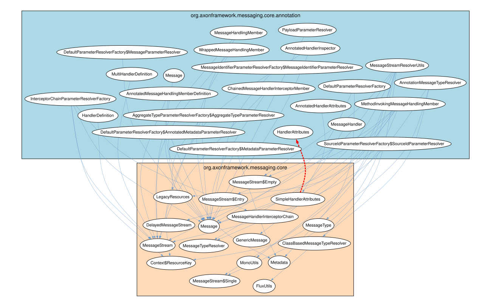
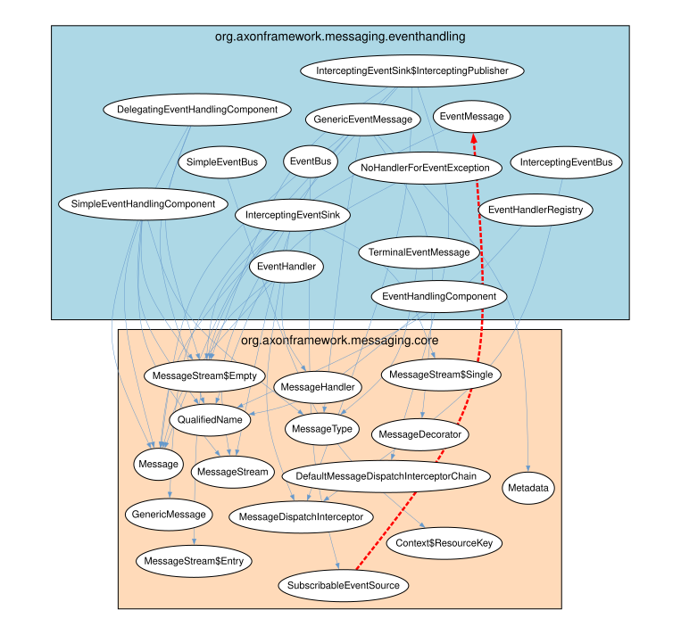
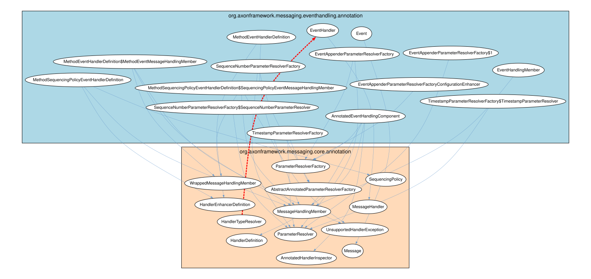
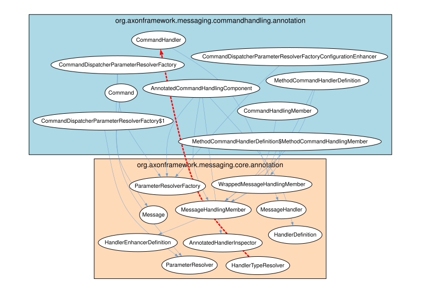
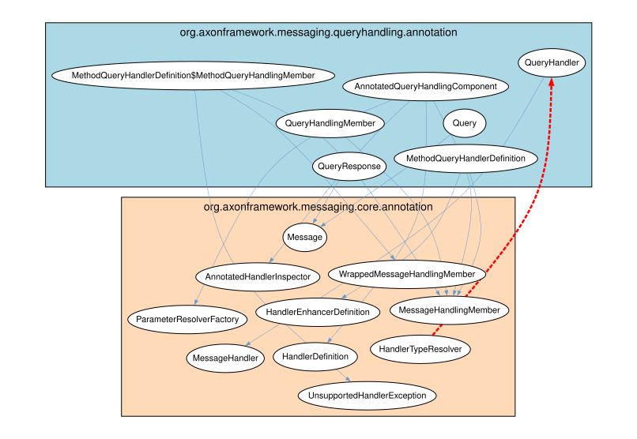

# ♻️ Cyclic Dependencies Report

## 1. Executive Overview

Analyzes **cyclic dependencies**: mutual cycles between Java packages, artifacts, and TypeScript modules.

**Cycle group**: Set of code units that depend on each other (A → B → A, directly or transitively). Prevents modular decomposition.

**Key metric**: `forwardToBackwardBalance` = ratio of forward to backward dependencies. Near 1.0 = easy fix (few backward deps to remove); near 0.0 = hard (many backward deps). Backward dependencies are removal candidates.

**Priority**: Rows sorted by `forwardToBackwardBalance` descending — highest priority first.

## 📚 Table of Contents

1. [Executive Overview](#1-executive-overview)
1. [Java Cyclic Dependencies](#2-java-cyclic-dependencies)
1. [TypeScript Cyclic Dependencies](#3-typescript-cyclic-dependencies)
1. [Glossary](#4-glossary)

---

## 2. Java Cyclic Dependencies

### 2.1 Java Package Cyclic Dependencies (Overview)

`numberForward`: dependencies in cycle majority direction. `numberBackward`: against majority (removal candidates).

| artifactName | packageName | dependentArtifactName | dependentPackageName | forwardToBackwardBalance | numberForward | numberBackward | someForwardDependencies | backwardDependencies |
| --- | --- | --- | --- | --- | --- | --- | --- | --- |
| axon-messaging-5.0.3 | org.axonframework.messaging.core.annotation | axon-messaging-5.0.3 | org.axonframework.messaging.core | 0.9591836734693877 | 48 | 1 | ["DefaultParameterResolverFactory$MessageParameterResolver->Message","ChainedMessageHandlerInterceptorMember->Message","ChainedMessageHandlerInterceptorMember->MessageStream","AnnotatedHandlerInspector->MessageStream","AnnotatedHandlerInspector->Message","InterceptorChainParameterResolverFactory->MessageHandlerInterceptorChain","InterceptorChainParameterResolverFactory->Context$ResourceKey","InterceptorChainParameterResolverFactory->MessageStream","InterceptorChainParameterResolverFactory->Message"] | ["SimpleHandlerAttributes->HandlerAttributes"] |
| axon-messaging-5.0.3 | org.axonframework.messaging.eventhandling | axon-messaging-5.0.3 | org.axonframework.messaging.core | 0.9428571428571428 | 34 | 1 | ["InterceptingEventSink->MessageStream$Empty","InterceptingEventSink->Message","InterceptingEventSink->MessageDispatchInterceptor","InterceptingEventSink->MessageStream","InterceptingEventSink->MessageStream$Single","SimpleEventHandlingComponent->MessageStream","SimpleEventHandlingComponent->QualifiedName","SimpleEventHandlingComponent->Message","SimpleEventHandlingComponent->MessageStream$Empty"] | ["SubscribableEventSource->EventMessage"] |
| axon-messaging-5.0.3 | org.axonframework.messaging.eventhandling.annotation | axon-messaging-5.0.3 | org.axonframework.messaging.core.annotation | 0.9310344827586207 | 28 | 1 | ["TimestampParameterResolverFactory$TimestampParameterResolver->ParameterResolver","AnnotatedEventHandlingComponent->AnnotatedHandlerInspector","AnnotatedEventHandlingComponent->HandlerDefinition","AnnotatedEventHandlingComponent->ParameterResolverFactory","AnnotatedEventHandlingComponent->MessageHandlingMember","TimestampParameterResolverFactory->ParameterResolver","TimestampParameterResolverFactory->AbstractAnnotatedParameterResolverFactory","SequenceNumberParameterResolverFactory$SequenceNumberParameterResolver->ParameterResolver","EventAppenderParameterResolverFactoryConfigurationEnhancer->ParameterResolverFactory"] | ["HandlerTypeResolver->EventHandler"] |
| axon-messaging-5.0.3 | org.axonframework.messaging.commandhandling.annotation | axon-messaging-5.0.3 | org.axonframework.messaging.core.annotation | 0.875 | 15 | 1 | ["MethodCommandHandlerDefinition$MethodCommandHandlingMember->MessageHandlingMember","MethodCommandHandlerDefinition$MethodCommandHandlingMember->WrappedMessageHandlingMember","CommandHandler->MessageHandler","CommandHandlingMember->MessageHandlingMember","CommandDispatcherParameterResolverFactory->ParameterResolver","CommandDispatcherParameterResolverFactory->ParameterResolverFactory","CommandDispatcherParameterResolverFactoryConfigurationEnhancer->ParameterResolverFactory","CommandDispatcherParameterResolverFactory$1->ParameterResolver","AnnotatedCommandHandlingComponent->HandlerDefinition"] | ["HandlerTypeResolver->CommandHandler"] |
| axon-messaging-5.0.3 | org.axonframework.messaging.queryhandling.annotation | axon-messaging-5.0.3 | org.axonframework.messaging.core.annotation | 0.8571428571428571 | 13 | 1 | ["QueryHandlingMember->MessageHandlingMember","QueryResponse->Message","QueryHandler->MessageHandler","Query->Message","AnnotatedQueryHandlingComponent->AnnotatedHandlerInspector","AnnotatedQueryHandlingComponent->MessageHandlingMember","AnnotatedQueryHandlingComponent->ParameterResolverFactory","AnnotatedQueryHandlingComponent->HandlerDefinition","MethodQueryHandlerDefinition->MessageHandlingMember"] | ["HandlerTypeResolver->QueryHandler"] |
| axon-modelling-5.0.3 | org.axonframework.modelling.annotation | axon-modelling-5.0.3 | org.axonframework.modelling | 0.8461538461538461 | 12 | 1 | ["InjectEntityParameterResolver->EntityIdResolver","InjectEntityParameterResolver->EntityIdResolutionException","InjectEntityParameterResolver->StateManager","AnnotationBasedEntityEvolvingComponent->StateEvolvingException","AnnotationBasedEntityEvolvingComponent->EntityEvolvingComponent","AnnotationBasedEntityIdResolverDefinition->EntityIdResolver","AnnotationBasedEntityIdResolver->EntityIdResolutionException","AnnotationBasedEntityIdResolver->EntityIdResolver","EntityIdResolverDefinition->EntityIdResolver"] | ["PropertyBasedEntityIdResolver->TargetEntityIdMemberMismatchException"] |
| axon-messaging-5.0.3 | org.axonframework.messaging.core.unitofwork.transaction | axon-messaging-5.0.3 | org.axonframework.messaging.core.unitofwork | 0.6666666666666666 | 5 | 1 | ["TransactionManager->ProcessingLifecycle$Phase","TransactionManager->ProcessingLifecycle$ErrorHandler","TransactionManager->ProcessingLifecycle","TransactionManager->ProcessingContext","TransactionalExecutorProvider->ProcessingContext"] | ["TransactionalUnitOfWorkFactory->TransactionManager"] |
| axon-messaging-5.0.3 | org.axonframework.messaging.eventhandling.processing.streaming.pooled | axon-messaging-5.0.3 | org.axonframework.messaging.eventhandling.configuration | 0.6666666666666666 | 15 | 3 | ["PooledStreamingEventProcessorModule->EventHandlingComponentsConfigurer$RequiredComponentPhase","PooledStreamingEventProcessorModule->EventProcessorModule$EventHandlingPhase","PooledStreamingEventProcessorModule->EventProcessorCustomization","PooledStreamingEventProcessorModule->EventProcessorConfiguration","PooledStreamingEventProcessorModule->EventProcessorModule$CustomizationPhase","PooledStreamingEventProcessorModule->EventProcessorModule","PooledStreamingEventProcessorModule->EventHandlingComponentsConfigurer$CompletePhase","PooledStreamingEventProcessorModule->DefaultEventHandlingComponentsConfigurer","PooledStreamingEventProcessorsConfigurer->EventProcessorModule"] | ["EventProcessorModule->PooledStreamingEventProcessorConfiguration","EventProcessorModule->PooledStreamingEventProcessorModule","EventProcessingConfigurer->PooledStreamingEventProcessorsConfigurer"] |
| axon-messaging-5.0.3 | org.axonframework.messaging.eventhandling.processing.subscribing | axon-messaging-5.0.3 | org.axonframework.messaging.eventhandling.configuration | 0.6666666666666666 | 15 | 3 | ["SubscribingEventProcessorConfiguration->EventProcessorConfiguration","SubscribingEventProcessorsConfigurer->EventProcessorModule","SubscribingEventProcessorsConfigurer->EventHandlingComponentsConfigurer$CompletePhase","SubscribingEventProcessorsConfigurer->EventProcessingConfigurer","SubscribingEventProcessorsConfigurer->EventHandlingComponentsConfigurer$RequiredComponentPhase","SubscribingEventProcessorsConfigurer->EventProcessorModule$EventHandlingPhase","SubscribingEventProcessorsConfigurer->EventProcessorModule$CustomizationPhase","SubscribingEventProcessorModule->EventProcessorModule","SubscribingEventProcessorModule->EventProcessorModule$CustomizationPhase"] | ["EventProcessorModule->SubscribingEventProcessorModule","EventProcessorModule->SubscribingEventProcessorConfiguration","EventProcessingConfigurer->SubscribingEventProcessorsConfigurer"] |
| axon-common-5.0.3 | org.axonframework.common.configuration | axon-common-5.0.3 | org.axonframework.common.infra | 0.5294117647058824 | 13 | 4 | ["LazyInitializedComponentDefinition->ComponentDescriptor","ComponentRegistry->DescribableComponent","AbstractComponent->ComponentDescriptor","DefaultComponentRegistry$LocalConfiguration->ComponentDescriptor","DecoratedComponent->ComponentDescriptor","Components->DescribableComponent","Components->ComponentDescriptor","InstantiatedComponentDefinition->ComponentDescriptor","DefaultAxonApplication$AxonConfigurationImpl->ComponentDescriptor"] | ["FilesystemStyleComponentDescriptor->Component$Identifier","FilesystemStyleComponentDescriptor->Component","JacksonComponentDescriptor->Component$Identifier","JacksonComponentDescriptor->Component"] |

[Full data](./Java_Package/Cyclic_Dependencies.csv)

### 2.2 Java Package Cyclic Dependencies (Breakdown)

Individual dependency pairs per cycle group: concrete types involved.

| artifactName | packageName | dependentArtifactName | dependentPackageName | dependency | forwardToBackwardBalance | numberForward | numberBackward |
| --- | --- | --- | --- | --- | --- | --- | --- |
| axon-messaging-5.0.3 | org.axonframework.messaging.core.annotation | axon-messaging-5.0.3 | org.axonframework.messaging.core | HandlerAttributes<-SimpleHandlerAttributes | 0.9591836734693877 | 48 | 1 |
| axon-messaging-5.0.3 | org.axonframework.messaging.core.annotation | axon-messaging-5.0.3 | org.axonframework.messaging.core | DefaultParameterResolverFactory$MessageParameterResolver->Message | 0.9591836734693877 | 48 | 1 |
| axon-messaging-5.0.3 | org.axonframework.messaging.core.annotation | axon-messaging-5.0.3 | org.axonframework.messaging.core | ChainedMessageHandlerInterceptorMember->Message | 0.9591836734693877 | 48 | 1 |
| axon-messaging-5.0.3 | org.axonframework.messaging.core.annotation | axon-messaging-5.0.3 | org.axonframework.messaging.core | ChainedMessageHandlerInterceptorMember->MessageStream | 0.9591836734693877 | 48 | 1 |
| axon-messaging-5.0.3 | org.axonframework.messaging.core.annotation | axon-messaging-5.0.3 | org.axonframework.messaging.core | AnnotatedHandlerInspector->MessageStream | 0.9591836734693877 | 48 | 1 |
| axon-messaging-5.0.3 | org.axonframework.messaging.core.annotation | axon-messaging-5.0.3 | org.axonframework.messaging.core | AnnotatedHandlerInspector->Message | 0.9591836734693877 | 48 | 1 |
| axon-messaging-5.0.3 | org.axonframework.messaging.core.annotation | axon-messaging-5.0.3 | org.axonframework.messaging.core | InterceptorChainParameterResolverFactory->MessageHandlerInterceptorChain | 0.9591836734693877 | 48 | 1 |
| axon-messaging-5.0.3 | org.axonframework.messaging.core.annotation | axon-messaging-5.0.3 | org.axonframework.messaging.core | InterceptorChainParameterResolverFactory->Context$ResourceKey | 0.9591836734693877 | 48 | 1 |
| axon-messaging-5.0.3 | org.axonframework.messaging.core.annotation | axon-messaging-5.0.3 | org.axonframework.messaging.core | InterceptorChainParameterResolverFactory->MessageStream | 0.9591836734693877 | 48 | 1 |
| axon-messaging-5.0.3 | org.axonframework.messaging.core.annotation | axon-messaging-5.0.3 | org.axonframework.messaging.core | InterceptorChainParameterResolverFactory->Message | 0.9591836734693877 | 48 | 1 |

[Full data](./Java_Package/Cyclic_Dependencies_Breakdown.csv)

### 2.3 Java Package Cyclic Dependencies (Backward Only)

Backward dependencies only — primary candidates for removal/reversal to break cycles.

| artifactName | packageName | dependentArtifactName | dependentPackageName | dependency | forwardToBackwardBalance | numberForward | numberBackward |
| --- | --- | --- | --- | --- | --- | --- | --- |
| axon-messaging-5.0.3 | org.axonframework.messaging.core.annotation | axon-messaging-5.0.3 | org.axonframework.messaging.core | HandlerAttributes<-SimpleHandlerAttributes | 0.9591836734693877 | 48 | 1 |
| axon-messaging-5.0.3 | org.axonframework.messaging.eventhandling | axon-messaging-5.0.3 | org.axonframework.messaging.core | EventMessage<-SubscribableEventSource | 0.9428571428571428 | 34 | 1 |
| axon-messaging-5.0.3 | org.axonframework.messaging.eventhandling.annotation | axon-messaging-5.0.3 | org.axonframework.messaging.core.annotation | EventHandler<-HandlerTypeResolver | 0.9310344827586207 | 28 | 1 |
| axon-messaging-5.0.3 | org.axonframework.messaging.commandhandling.annotation | axon-messaging-5.0.3 | org.axonframework.messaging.core.annotation | CommandHandler<-HandlerTypeResolver | 0.875 | 15 | 1 |
| axon-messaging-5.0.3 | org.axonframework.messaging.queryhandling.annotation | axon-messaging-5.0.3 | org.axonframework.messaging.core.annotation | QueryHandler<-HandlerTypeResolver | 0.8571428571428571 | 13 | 1 |
| axon-modelling-5.0.3 | org.axonframework.modelling.annotation | axon-modelling-5.0.3 | org.axonframework.modelling | TargetEntityIdMemberMismatchException<-PropertyBasedEntityIdResolver | 0.8461538461538461 | 12 | 1 |
| axon-messaging-5.0.3 | org.axonframework.messaging.core.unitofwork.transaction | axon-messaging-5.0.3 | org.axonframework.messaging.core.unitofwork | TransactionManager<-TransactionalUnitOfWorkFactory | 0.6666666666666666 | 5 | 1 |
| axon-messaging-5.0.3 | org.axonframework.messaging.eventhandling.processing.streaming.pooled | axon-messaging-5.0.3 | org.axonframework.messaging.eventhandling.configuration | PooledStreamingEventProcessorConfiguration<-EventProcessorModule | 0.6666666666666666 | 15 | 3 |
| axon-messaging-5.0.3 | org.axonframework.messaging.eventhandling.processing.streaming.pooled | axon-messaging-5.0.3 | org.axonframework.messaging.eventhandling.configuration | PooledStreamingEventProcessorModule<-EventProcessorModule | 0.6666666666666666 | 15 | 3 |
| axon-messaging-5.0.3 | org.axonframework.messaging.eventhandling.processing.streaming.pooled | axon-messaging-5.0.3 | org.axonframework.messaging.eventhandling.configuration | PooledStreamingEventProcessorsConfigurer<-EventProcessingConfigurer | 0.6666666666666666 | 15 | 3 |

[Full data](./Java_Package/Cyclic_Dependencies_Breakdown_Backward_Only.csv)

### 2.4 Java Artifact Cyclic Dependencies

Artifact (JAR) level cycles — coarsest and most critical abstraction.

✅ _No cyclic dependencies detected — the dependency graph is acyclic for this abstraction level._

### 2.5 Java Package Cyclic Dependencies (Graph Visualizations)

Top cycle pairs visualized as graphs. Blue solid arrows: forward dependencies. Red dashed arrows: backward dependencies (removal candidates). Nodes are grouped by package.

#### Graph Visualizations

##### Cycle 1: `org.axonframework.messaging.core.annotation` ↔ `org.axonframework.messaging.core`

##### Cycle 2: `org.axonframework.messaging.eventhandling` ↔ `org.axonframework.messaging.core`

##### Cycle 3: `org.axonframework.messaging.eventhandling.annotation` ↔ `org.axonframework.messaging.core.annotation`

##### Cycle 4: `org.axonframework.messaging.commandhandling.annotation` ↔ `org.axonframework.messaging.core.annotation`

##### Cycle 5: `org.axonframework.messaging.queryhandling.annotation` ↔ `org.axonframework.messaging.core.annotation`

---

## 3. TypeScript Cyclic Dependencies

### 3.1 TypeScript Module Cyclic Dependencies (Overview)

TypeScript module cycles. Sorted by `forwardToBackwardBalance` descending (easiest fixes first).

⚠️ _No data available — TypeScript not detected in this codebase._

### 3.2 TypeScript Module Cyclic Dependencies (Breakdown)

Individual TypeScript module dependency pairs per cycle group.

⚠️ _No data available — TypeScript not detected in this codebase._

### 3.3 TypeScript Module Cyclic Dependencies (Backward Only)

Backward TypeScript dependencies — highest-value cycle breakers.

⚠️ _No data available — TypeScript not detected in this codebase._

### 3.4 TypeScript Module Cyclic Dependencies (Graph Visualizations)

Top TypeScript cycle pairs visualized as graphs. Blue solid arrows: forward dependencies. Red dashed arrows: backward dependencies (removal candidates). Nodes are grouped by module.

---

## 4. Glossary

| Term | Definition |
|------|-----------|
| **cycle group** | Set of code units that mutually depend on each other (directly or transitively). |
| **forwardToBackwardBalance** | Ratio of forward:backward dependencies. ~1.0 = easy fix; ~0.0 = hard. |
| **numberForward** | Forward dependencies in cycle majority direction. |
| **numberBackward** | Backward dependencies — removal candidates. |
| **forward dependency** | Dependency in cycle group majority direction. |
| **backward dependency** | Dependency against majority flow — highest-value removal candidate. |
