# 📦 External Dependencies Report

## 1. Executive Overview

Analyzes which external packages, modules, and namespaces the codebase depends on, their spread, and per-artifact usage.

> **Who imports whom?**
> High spread (many internal modules referencing the same external package) = candidate for a **facade** or **anti-corruption layer**.

## 📚 Table of Contents

1. [Executive Overview](#1-executive-overview)
1. [Java External Dependencies](#2-java-external-dependencies)
1. [TypeScript External Dependencies](#3-typescript-external-dependencies)
1. [Package Management](#4-package-management)
1. [Glossary](#5-glossary)

---

## 2. Java External Dependencies

### 2.1 Most Used External Packages

External Java packages by internal caller type count. High `numberOfExternalCallerTypes` = deeply embedded.

| externalPackageName | numberOfExternalCallerPackages | numberOfExternalCallerTypes | numberOfExternalTypeCalls | numberOfExternalTypeCallsWeighted | allPackages | allTypes | tenExternalTypeNames |
| --- | --- | --- | --- | --- | --- | --- | --- |
| jakarta.annotation | 106 | 695 | 899 | 4946 | 120 | 1231 | ["Nonnull","Nullable"] |
| org.slf4j | 38 | 74 | 133 | 469 | 120 | 1231 | ["Logger","LoggerFactory"] |
| jakarta.persistence | 6 | 18 | 42 | 179 | 120 | 1231 | ["LockModeType","TypedQuery","EntityManager","Query","Column","Lob","IdClass","Id","Basic"] |
| io.axoniq.axonserver.connector | 5 | 16 | 23 | 124 | 120 | 1231 | ["AxonServerConnection","AxonServerConnectionFactory","AxonServerConnectionFactory$Builder","FlowControl","ReplyChannel","Registration","ResultStream"] |
| io.axoniq.axonserver.grpc | 5 | 18 | 40 | 271 | 120 | 1231 | ["ErrorMessage","MetaDataValue$DataCase","ErrorMessage$Builder","MetaDataValue$Builder","MetaDataValue","InstructionAck","InstructionAck$Builder","ProcessingInstruction$Builder","ProcessingInstruction"] |
| reactor.core.publisher | 5 | 8 | 14 | 49 | 120 | 1231 | ["MonoSink","Flux","Mono","FluxSink"] |
| com.google.protobuf | 4 | 8 | 8 | 29 | 120 | 1231 | ["MessageLite","ByteString"] |
| org.springframework.boot.context.properties | 4 | 23 | 23 | 30 | 120 | 1231 | ["ConfigurationProperties","NestedConfigurationProperty","EnableConfigurationProperties"] |
| com.fasterxml.jackson.annotation | 3 | 6 | 19 | 33 | 120 | 1231 | ["JsonProperty","JsonCreator","JsonIgnore","JsonGetter","JsonTypeInfo","JsonTypeInfo$Id"] |
| com.fasterxml.jackson.databind | 3 | 8 | 13 | 64 | 120 | 1231 | ["ObjectMapper","JsonNode","SerializationFeature","JavaType"] |
| io.axoniq.axonserver.connector.control | 3 | 5 | 5 | 6 | 120 | 1231 | ["ControlChannel","ProcessorInstructionHandler"] |
| io.grpc | 3 | 7 | 23 | 51 | 120 | 1231 | ["ManagedChannelBuilder","ClientInterceptor","MethodDescriptor","CallOptions","Channel","ClientCall","ForwardingClientCallListener$SimpleForwardingClientCallListener","ClientCall$Listener","Metadata"] |
| io.micrometer.core.instrument | 3 | 13 | 37 | 141 | 120 | 1231 | ["Tags","Tag","Clock","Counter","MeterRegistry","Timer","Timer$Builder","Gauge","Gauge$Builder"] |
| org.hamcrest | 3 | 22 | 44 | 196 | 120 | 1231 | ["StringDescription","Matcher","CoreMatchers","Description","TypeSafeMatcher","BaseMatcher"] |
| org.reactivestreams | 3 | 6 | 8 | 27 | 120 | 1231 | ["Publisher","Subscriber","Subscription"] |
| org.springframework.boot.actuate.health | 3 | 4 | 7 | 24 | 120 | 1231 | ["Status","SimpleStatusAggregator","AbstractHealthIndicator","Health$Builder"] |
| org.springframework.boot.autoconfigure | 3 | 22 | 36 | 37 | 120 | 1231 | ["AutoConfiguration","AutoConfigureBefore","AutoConfigureAfter","AutoConfigurationPackages"] |
| org.springframework.boot.autoconfigure.condition | 3 | 37 | 55 | 90 | 120 | 1231 | ["ConditionalOnMissingBean","ConditionalOnBean","ConditionalOnExpression","ConditionalOnClass","ConditionalOnProperty","AnyNestedCondition","SearchStrategy","AllNestedConditions","SpringBootCondition"] |
| org.springframework.context.annotation | 3 | 31 | 41 | 77 | 120 | 1231 | ["Bean","Primary","ConfigurationCondition$ConfigurationPhase","Role","ConditionContext","Condition","Conditional","ConfigurationCondition","Import"] |
| com.fasterxml.jackson.databind.node | 2 | 3 | 5 | 28 | 120 | 1231 | ["ObjectNode","ArrayNode","JsonNodeType"] |
| io.axoniq.axonserver.grpc.control | 2 | 6 | 13 | 86 | 120 | 1231 | ["QuerySubscription","TopologyChange","UpdateType","CommandSubscription","NodeInfo$Builder","NodeInfo","EventProcessorInfo$SegmentStatus$Builder","EventProcessorInfo$Builder","EventProcessorInfo$SegmentStatus"] |
| io.grpc.stub | 2 | 3 | 4 | 11 | 120 | 1231 | ["StreamObserver","ClientCallStreamObserver","ClientResponseObserver"] |
| io.micrometer.core.instrument.simple | 2 | 2 | 2 | 4 | 120 | 1231 | ["SimpleMeterRegistry"] |
| javax.annotation | 2 | 2 | 2 | 2 | 120 | 1231 | ["Nonnull"] |
| org.apache.avro | 2 | 5 | 17 | 56 | 120 | 1231 | ["Schema","InvalidNumberEncodingException","SchemaCompatibility$SchemaIncompatibilityType","SchemaNormalization","AvroRuntimeException","SchemaCompatibility$SchemaPairCompatibility","InvalidAvroMagicException","SchemaCompatibility$SchemaCompatibilityResult","SchemaCompatibility"] |
| org.apache.avro.message | 2 | 9 | 12 | 38 | 120 | 1231 | ["SchemaStore","SchemaStore$Cache","BadHeaderException","BinaryMessageEncoder","BinaryMessageDecoder"] |
| org.axonframework.extension.spring.config | 2 | 5 | 13 | 42 | 120 | 1231 | ["EventProcessorSettings","EventProcessorSettings$ProcessorMode","EventProcessorSettings$SubscribingEventProcessorSettings","EventProcessorSettings$PooledEventProcessorSettings","SpringEventSourcedEntityLookup","MessageHandlerLookup","EventProcessorSettings$MapWrapper","EventProcessorDefinition","ProcessorModuleFactory"] |
| org.jetbrains.annotations | 2 | 3 | 3 | 4 | 120 | 1231 | ["NotNull"] |
| org.springframework.core.env | 2 | 2 | 2 | 2 | 120 | 1231 | ["Environment"] |
| org.springframework.core.type | 2 | 3 | 3 | 5 | 120 | 1231 | ["AnnotatedTypeMetadata","AnnotationMetadata"] |
| tools.jackson.databind | 2 | 8 | 11 | 47 | 120 | 1231 | ["ObjectMapper","JsonNode","JavaType"] |
| tools.jackson.databind.json | 2 | 2 | 4 | 10 | 120 | 1231 | ["JsonMapper$Builder","JsonMapper"] |
| IdTypeParameterResolver | 1 | 1 | 1 | 1 | 120 | 1231 | ["IdTypeParameterResolver"] |
| ScannedEntityCreator | 1 | 1 | 1 | 4 | 120 | 1231 | ["ScannedEntityCreator"] |
| WrappedEventCriteriaBuilderMethod | 1 | 1 | 1 | 1 | 120 | 1231 | ["WrappedEventCriteriaBuilderMethod"] |
| com.fasterxml.jackson.core | 1 | 1 | 1 | 1 | 120 | 1231 | ["JsonProcessingException"] |
| com.google.gson | 1 | 1 | 4 | 7 | 120 | 1231 | ["JsonElement","JsonParser","JsonArray","JsonObject"] |
| io.axoniq.axonserver.connector.admin | 1 | 1 | 1 | 3 | 120 | 1231 | ["AdminChannel"] |
| io.axoniq.axonserver.connector.command | 1 | 1 | 1 | 3 | 120 | 1231 | ["CommandChannel"] |
| io.axoniq.axonserver.connector.event | 1 | 5 | 8 | 38 | 120 | 1231 | ["AppendEventsTransaction","AggregateEventStream","EventChannel","DcbEventChannel$AppendEventsTransaction","EventStream","DcbEventChannel"] |
| io.axoniq.axonserver.connector.impl | 1 | 1 | 1 | 3 | 120 | 1231 | ["ServerAddress"] |
| io.axoniq.axonserver.connector.query | 1 | 3 | 6 | 19 | 120 | 1231 | ["QueryHandler$UpdateHandler","QueryHandler","QueryDefinition","SubscriptionQueryResult","QueryChannel"] |
| io.axoniq.axonserver.grpc.command | 1 | 3 | 8 | 63 | 120 | 1231 | ["CommandResponse","Command","Command$Builder","CommandResponse$Builder"] |
| io.axoniq.axonserver.grpc.event | 1 | 3 | 5 | 31 | 120 | 1231 | ["Confirmation","Event","Event$Builder","EventWithToken"] |
| io.axoniq.axonserver.grpc.event.dcb | 1 | 6 | 28 | 104 | 120 | 1231 | ["Tag$Builder","ConsistencyCondition","Criterion$Builder","TagsAndNamesCriterion$Builder","StreamEventsRequest","Tag","TagsAndNamesCriterion","SourceEventsRequest$Builder","Criterion"] |
| io.axoniq.axonserver.grpc.query | 1 | 5 | 14 | 98 | 120 | 1231 | ["QueryResponse$Builder","QueryResponse","SubscriptionQuery","QueryRequest","QueryUpdate","QueryRequest$Builder","QueryUpdate$Builder"] |
| io.grpc.netty.shaded.io.grpc.netty | 1 | 1 | 1 | 1 | 120 | 1231 | ["GrpcSslContexts"] |
| io.grpc.netty.shaded.io.netty.handler.ssl | 1 | 1 | 1 | 2 | 120 | 1231 | ["SslContextBuilder"] |
| io.opentelemetry.api | 1 | 1 | 1 | 2 | 120 | 1231 | ["GlobalOpenTelemetry"] |
| io.opentelemetry.api.trace | 1 | 3 | 9 | 46 | 120 | 1231 | ["Tracer","SpanKind","Span","SpanBuilder","SpanContext","StatusCode"] |
| io.opentelemetry.context | 1 | 2 | 2 | 7 | 120 | 1231 | ["Context","Scope"] |
| io.opentelemetry.context.propagation | 1 | 4 | 9 | 15 | 120 | 1231 | ["TextMapGetter","TextMapPropagator","ContextPropagators","TextMapSetter"] |
| jakarta.validation | 1 | 2 | 5 | 16 | 120 | 1231 | ["ConstraintViolation","Validation","ValidatorFactory","Validator"] |
| javax.cache | 1 | 1 | 1 | 13 | 120 | 1231 | ["Cache"] |
| javax.cache.configuration | 1 | 2 | 3 | 9 | 120 | 1231 | ["CacheEntryListenerConfiguration","Factory"] |
| javax.cache.event | 1 | 1 | 8 | 26 | 120 | 1231 | ["CacheEntryListener","CacheEntryEvent","CacheEntryListenerException","CacheEntryCreatedListener","CacheEntryEventFilter","CacheEntryRemovedListener","CacheEntryExpiredListener","CacheEntryUpdatedListener"] |
| org.apache.avro.generic | 1 | 6 | 7 | 29 | 120 | 1231 | ["GenericRecord","GenericData","GenericDatumReader"] |
| org.apache.avro.io | 1 | 1 | 1 | 3 | 120 | 1231 | ["DecoderFactory"] |
| org.apache.avro.specific | 1 | 2 | 4 | 14 | 120 | 1231 | ["SpecificData","SpecificRecordBase"] |
| org.apache.commons.lang3.tuple | 1 | 1 | 1 | 4 | 120 | 1231 | ["Pair"] |
| org.awaitility | 1 | 1 | 1 | 1 | 120 | 1231 | ["Awaitility"] |
| org.awaitility.core | 1 | 1 | 1 | 2 | 120 | 1231 | ["ConditionFactory"] |
| org.axonframework.extension.spring | 1 | 1 | 1 | 1 | 120 | 1231 | ["SpringUtils"] |
| org.axonframework.extension.spring.authorization | 1 | 1 | 1 | 2 | 120 | 1231 | ["SecuredMessageHandlerDefinition"] |
| org.axonframework.extension.spring.config.annotation | 1 | 1 | 2 | 7 | 120 | 1231 | ["HandlerDefinitionFactoryBean","SpringParameterResolverFactoryBean"] |
| org.axonframework.extension.spring.conversion.avro | 1 | 1 | 3 | 8 | 120 | 1231 | ["AvroSchemaPackages","SpecificRecordBaseClasspathAvroSchemaLoader","ClasspathAvroSchemaLoader"] |
| org.axonframework.extension.spring.messaging.unitofwork | 1 | 2 | 2 | 4 | 120 | 1231 | ["SpringTransactionManager"] |
| org.ehcache.config | 1 | 1 | 1 | 2 | 120 | 1231 | ["CacheRuntimeConfiguration"] |
| org.ehcache.core | 1 | 1 | 1 | 13 | 120 | 1231 | ["Ehcache"] |
| org.ehcache.event | 1 | 3 | 8 | 30 | 120 | 1231 | ["EventType","CacheEventListener","EventOrdering","EventFiring","CacheEvent"] |
| org.junit.jupiter.api | 1 | 1 | 1 | 2 | 120 | 1231 | ["Assertions"] |
| org.junit.jupiter.api.extension | 1 | 1 | 8 | 28 | 120 | 1231 | ["ParameterResolutionException","BeforeEachCallback","AfterEachCallback","ParameterResolver","ExtensionContext$Store","ExtensionContext","ExtensionContext$Namespace","ParameterContext"] |
| org.springframework.beans | 1 | 2 | 2 | 2 | 120 | 1231 | ["BeansException"] |
| org.springframework.beans.factory | 1 | 2 | 4 | 19 | 120 | 1231 | ["BeanClassLoaderAware","BeanFactoryUtils","NoSuchBeanDefinitionException","BeanFactory"] |
| org.springframework.beans.factory.config | 1 | 1 | 1 | 3 | 120 | 1231 | ["ConfigurableListableBeanFactory"] |
| org.springframework.beans.factory.support | 1 | 1 | 1 | 1 | 120 | 1231 | ["BeanDefinitionRegistry"] |
| org.springframework.boot.autoconfigure.service.connection | 1 | 3 | 3 | 3 | 120 | 1231 | ["ConnectionDetails"] |
| org.springframework.boot.context.properties.bind | 1 | 2 | 5 | 11 | 120 | 1231 | ["DefaultValue","ConstructorBinding","Binder","BindResult","Bindable"] |
| org.springframework.boot.docker.compose.core | 1 | 1 | 2 | 5 | 120 | 1231 | ["RunningService","ConnectionPorts"] |
| org.springframework.boot.docker.compose.service.connection | 1 | 1 | 2 | 5 | 120 | 1231 | ["DockerComposeConnectionSource","DockerComposeConnectionDetailsFactory"] |
| org.springframework.boot.testcontainers.service.connection | 1 | 2 | 4 | 9 | 120 | 1231 | ["ContainerConnectionDetailsFactory","ContainerConnectionSource","ContainerConnectionDetailsFactory$ContainerConnectionDetails"] |
| org.springframework.context | 1 | 3 | 5 | 9 | 120 | 1231 | ["ApplicationContext","ApplicationContextAware"] |
| org.springframework.core.annotation | 1 | 3 | 3 | 3 | 120 | 1231 | ["Order"] |
| org.springframework.core.io | 1 | 1 | 1 | 1 | 120 | 1231 | ["ResourceLoader"] |
| org.springframework.lang | 1 | 1 | 1 | 1 | 120 | 1231 | ["Nullable"] |
| org.springframework.transaction | 1 | 3 | 3 | 5 | 120 | 1231 | ["PlatformTransactionManager"] |
| org.springframework.util | 1 | 1 | 1 | 2 | 120 | 1231 | ["MultiValueMap"] |
| org.testcontainers.containers | 1 | 1 | 2 | 7 | 120 | 1231 | ["GenericContainer","ContainerLaunchException"] |
| org.testcontainers.containers.wait.strategy | 1 | 1 | 2 | 3 | 120 | 1231 | ["HttpWaitStrategy","Wait"] |
| org.testcontainers.utility | 1 | 1 | 2 | 9 | 120 | 1231 | ["DockerImageName","MountableFile"] |
| reactor.core.scheduler | 1 | 1 | 2 | 2 | 120 | 1231 | ["Schedulers","Scheduler"] |
| reactor.util.concurrent | 1 | 2 | 2 | 4 | 120 | 1231 | ["Queues"] |
| tools.jackson.core | 1 | 3 | 3 | 6 | 120 | 1231 | ["JacksonException"] |
| tools.jackson.databind.node | 1 | 2 | 3 | 12 | 120 | 1231 | ["JsonNodeType","ObjectNode"] |
| tools.jackson.dataformat.cbor | 1 | 2 | 3 | 9 | 120 | 1231 | ["CBORMapper","CBORMapper$Builder"] |

### 2.2 Most Used External Packages — Second-Level Grouping

Second-level package names (e.g. `javax.xml` from `javax.xml.stream`) reveal **framework-level** coupling that is hidden when viewing full package names.

| externalSecondLevelPackageName | numberOfExternalCallerPackages | numberOfExternalCallerTypes | numberOfExternalTypeCalls | numberOfExternalTypeCallsWeighted | allPackages | allTypes | tenExternalTypeNames |
| --- | --- | --- | --- | --- | --- | --- | --- |
| jakarta.annotation | 106 | 695 | 899 | 4946 | 120 | 1231 | ["Nonnull","Nullable"] |
| org.slf4j | 38 | 74 | 133 | 469 | 120 | 1231 | ["Logger","LoggerFactory"] |
| org.springframework | 8 | 63 | 205 | 344 | 120 | 1231 | ["ConfigurationProperties","NestedConfigurationProperty","DefaultValue","ConstructorBinding","Binder","Environment","BindResult","Bindable","ConnectionDetails"] |
| com.fasterxml | 6 | 14 | 38 | 126 | 120 | 1231 | ["JsonProperty","JsonCreator","JsonIgnore","JsonGetter","JsonTypeInfo","JsonTypeInfo$Id","ObjectMapper","JsonNode","ObjectNode"] |
| io.axoniq | 6 | 45 | 153 | 849 | 120 | 1231 | ["AxonServerConnection","ControlChannel","QuerySubscription","TopologyChange","UpdateType","CommandSubscription","ErrorMessage","MetaDataValue$DataCase","ErrorMessage$Builder"] |
| jakarta.persistence | 6 | 18 | 42 | 179 | 120 | 1231 | ["LockModeType","TypedQuery","EntityManager","Query","Column","Lob","IdClass","Id","Basic"] |
| reactor.core | 6 | 9 | 16 | 51 | 120 | 1231 | ["MonoSink","Flux","Mono","FluxSink","Schedulers","Scheduler"] |
| com.google | 5 | 9 | 12 | 36 | 120 | 1231 | ["JsonElement","JsonParser","JsonArray","JsonObject","MessageLite","ByteString"] |
| io.grpc | 3 | 10 | 29 | 65 | 120 | 1231 | ["StreamObserver","ManagedChannelBuilder","GrpcSslContexts","SslContextBuilder","ClientInterceptor","MethodDescriptor","CallOptions","Channel","ClientCall"] |
| io.micrometer | 3 | 13 | 39 | 145 | 120 | 1231 | ["Tags","Tag","Clock","Counter","MeterRegistry","Timer","Timer$Builder","SimpleMeterRegistry","Gauge"] |
| org.axonframework | 3 | 10 | 22 | 64 | 120 | 1231 | ["EventProcessorSettings","EventProcessorSettings$ProcessorMode","EventProcessorSettings$SubscribingEventProcessorSettings","EventProcessorSettings$PooledEventProcessorSettings","SpringEventSourcedEntityLookup","MessageHandlerLookup","EventProcessorSettings$MapWrapper","EventProcessorDefinition","ProcessorModuleFactory"] |
| org.hamcrest | 3 | 22 | 44 | 196 | 120 | 1231 | ["StringDescription","Matcher","CoreMatchers","Description","TypeSafeMatcher","BaseMatcher"] |
| org.reactivestreams | 3 | 6 | 8 | 27 | 120 | 1231 | ["Publisher","Subscriber","Subscription"] |
| javax.annotation | 2 | 2 | 2 | 2 | 120 | 1231 | ["Nonnull"] |
| org.apache | 2 | 12 | 42 | 144 | 120 | 1231 | ["SchemaStore","Schema","SchemaStore$Cache","GenericRecord","InvalidNumberEncodingException","SchemaCompatibility$SchemaIncompatibilityType","SchemaNormalization","AvroRuntimeException","SchemaCompatibility$SchemaPairCompatibility"] |
| org.jetbrains | 2 | 3 | 3 | 4 | 120 | 1231 | ["NotNull"] |
| org.junit | 2 | 2 | 9 | 30 | 120 | 1231 | ["ParameterResolutionException","BeforeEachCallback","AfterEachCallback","ParameterResolver","ExtensionContext$Store","ExtensionContext","ExtensionContext$Namespace","ParameterContext","Assertions"] |
| tools.jackson | 2 | 9 | 24 | 84 | 120 | 1231 | ["CBORMapper","ObjectMapper","CBORMapper$Builder","JsonMapper$Builder","JsonMapper","JsonNodeType","ObjectNode","JsonNode","JacksonException"] |
| IdTypeParameterResolver | 1 | 1 | 1 | 1 | 120 | 1231 | ["IdTypeParameterResolver"] |
| ScannedEntityCreator | 1 | 1 | 1 | 4 | 120 | 1231 | ["ScannedEntityCreator"] |
| WrappedEventCriteriaBuilderMethod | 1 | 1 | 1 | 1 | 120 | 1231 | ["WrappedEventCriteriaBuilderMethod"] |
| io.opentelemetry | 1 | 5 | 21 | 70 | 120 | 1231 | ["TextMapGetter","TextMapPropagator","GlobalOpenTelemetry","Tracer","ContextPropagators","TextMapSetter","SpanKind","Context","Span"] |
| jakarta.validation | 1 | 2 | 5 | 16 | 120 | 1231 | ["ConstraintViolation","Validation","ValidatorFactory","Validator"] |
| javax.cache | 1 | 2 | 12 | 48 | 120 | 1231 | ["CacheEntryListener","CacheEntryEvent","CacheEntryListenerException","CacheEntryCreatedListener","CacheEntryEventFilter","CacheEntryListenerConfiguration","CacheEntryRemovedListener","Factory","CacheEntryExpiredListener"] |
| org.awaitility | 1 | 1 | 2 | 3 | 120 | 1231 | ["ConditionFactory","Awaitility"] |
| org.ehcache | 1 | 3 | 10 | 45 | 120 | 1231 | ["EventType","CacheEventListener","EventOrdering","EventFiring","Ehcache","CacheRuntimeConfiguration","CacheEvent"] |
| org.testcontainers | 1 | 1 | 6 | 19 | 120 | 1231 | ["GenericContainer","HttpWaitStrategy","ContainerLaunchException","DockerImageName","MountableFile","Wait"] |
| reactor.util | 1 | 2 | 2 | 4 | 120 | 1231 | ["Queues"] |

### 2.3 Most Spread External Packages

Packages referenced from the highest number of **different internal packages**.  
High spread indicates a pervasive cross-cutting dependency that is hard to replace.

| externalPackageName | numberOfArtifacts | sumNumberOfPackages | minNumberOfPackages | maxNumberOfPackages | medNumberOfPackages | avgNumberOfPackages | stdNumberOfPackages | minNumberOfPackagesPercentage | maxNumberOfPackagesPercentage | medNumberOfPackagesPercentage | avgNumberOfPackagesPercentage | stdNumberOfPackagesPercentage | sumNumberOfTypes | minNumberOfTypes | maxNumberOfTypes | medNumberOfTypes | avgNumberOfTypes | stdNumberOfTypes | minNumberOfTypesPercentage | maxNumberOfTypesPercentage | medNumberOfTypesPercentage | avgNumberOfTypesPercentage | stdNumberOfTypesPercentage | someArtifactNames |
| --- | --- | --- | --- | --- | --- | --- | --- | --- | --- | --- | --- | --- | --- | --- | --- | --- | --- | --- | --- | --- | --- | --- | --- | --- |
| org.slf4j | 10 | 38 | 1 | 15 | 2.5 | 3.8 | 4.1041983924323695 | 16.666666666666668 | 100 | 28.571428571428573 | 47.44713478611783 | 29.76188553127547 | 74 | 1 | 31 | 5 | 7.4 | 9.020963240019205 | 1.2820512820512822 | 30.43478260869565 | 5.677029360967184 | 10.113491554626945 | 9.523561413763883 | ["axon-test-5.0.3","axon-messaging-5.0.3","axon-spring-boot-autoconfigure-5.0.3","axon-tracing-opentelemetry-5.0.3"] |
| jakarta.persistence | 4 | 6 | 1 | 2 | 1.5 | 1.5 | 0.5773502691896257 | 3.389830508474576 | 28.571428571428573 | 10.476190476190476 | 13.228410008071025 | 11.200896291806309 | 17 | 4 | 5 | 4 | 4.25 | 0.4999999999999999 | 0.690846286701209 | 6.666666666666666 | 3.282051282051282 | 3.4804038793676098 | 2.519490050351605 | ["axon-messaging-5.0.3","axon-spring-boot-autoconfigure-5.0.3","axon-eventsourcing-5.0.3","axon-common-5.0.3"] |
| com.fasterxml.jackson.databind | 3 | 3 | 1 | 1 | 1 | 1 | 0 | 6.666666666666667 | 20 | 14.285714285714286 | 13.65079365079365 | 6.6893039700652315 | 8 | 1 | 5 | 2 | 2.666666666666667 | 2.0816659994661326 | 0.6410256410256411 | 14.285714285714286 | 2.6666666666666665 | 5.864468864468865 | 7.363004565041722 | ["axon-spring-boot-autoconfigure-5.0.3","axon-common-5.0.3","axon-conversion-5.0.3"] |
| com.fasterxml.jackson.databind.node | 2 | 2 | 1 | 1 | 1 | 1 | 0 | 6.666666666666667 | 20 | 13.333333333333334 | 13.333333333333332 | 9.428090415820634 | 3 | 1 | 2 | 1.5 | 1.5 | 0.7071067811865476 | 0.6410256410256411 | 5.714285714285714 | 3.177655677655678 | 3.1776556776556775 | 3.5873366005251586 | ["axon-common-5.0.3","axon-conversion-5.0.3"] |
| io.axoniq.axonserver.connector | 2 | 5 | 1 | 4 | 2.5 | 2.5 | 2.1213203435596424 | 14.285714285714286 | 80 | 47.142857142857146 | 47.14285714285714 | 46.4670170494017 | 16 | 1 | 15 | 8 | 8 | 9.899494936611665 | 1.3333333333333333 | 20.833333333333332 | 11.083333333333332 | 11.083333333333334 | 13.788582233137676 | ["axon-spring-boot-autoconfigure-5.0.3","axon-server-connector-5.0.3"] |
| io.axoniq.axonserver.connector.control | 2 | 3 | 1 | 2 | 1.5 | 1.5 | 0.7071067811865476 | 14.285714285714286 | 40 | 27.142857142857142 | 27.142857142857146 | 18.18274580193979 | 5 | 1 | 4 | 2.5 | 2.5 | 2.1213203435596424 | 1.3333333333333333 | 5.555555555555555 | 3.444444444444444 | 3.4444444444444446 | 2.9855619650098673 | ["axon-spring-boot-autoconfigure-5.0.3","axon-server-connector-5.0.3"] |
| org.apache.avro | 2 | 2 | 1 | 1 | 1 | 1 | 0 | 14.285714285714286 | 20 | 17.142857142857142 | 17.142857142857142 | 4.040610178208843 | 5 | 1 | 4 | 2.5 | 2.5 | 2.1213203435596424 | 1.3333333333333333 | 11.428571428571429 | 6.380952380952381 | 6.3809523809523805 | 7.138411314835623 | ["axon-spring-boot-autoconfigure-5.0.3","axon-conversion-5.0.3"] |
| org.apache.avro.message | 2 | 2 | 1 | 1 | 1 | 1 | 0 | 14.285714285714286 | 20 | 17.142857142857142 | 17.142857142857142 | 4.040610178208843 | 9 | 3 | 6 | 4.5 | 4.5 | 2.1213203435596424 | 4 | 17.142857142857142 | 10.571428571428571 | 10.571428571428571 | 9.293403409880339 | ["axon-spring-boot-autoconfigure-5.0.3","axon-conversion-5.0.3"] |
| tools.jackson.databind | 2 | 2 | 1 | 1 | 1 | 1 | 0 | 14.285714285714286 | 20 | 17.142857142857142 | 17.142857142857142 | 4.040610178208843 | 8 | 3 | 5 | 4 | 4 | 1.4142135623730951 | 4 | 14.285714285714286 | 9.142857142857142 | 9.142857142857142 | 7.273098320775919 | ["axon-spring-boot-autoconfigure-5.0.3","axon-conversion-5.0.3"] |
| tools.jackson.databind.json | 2 | 2 | 1 | 1 | 1 | 1 | 0 | 14.285714285714286 | 20 | 17.142857142857142 | 17.142857142857142 | 4.040610178208843 | 2 | 1 | 1 | 1 | 1 | 0 | 1.3333333333333333 | 2.857142857142857 | 2.0952380952380953 | 2.0952380952380953 | 1.077496047522358 | ["axon-spring-boot-autoconfigure-5.0.3","axon-conversion-5.0.3"] |
| IdTypeParameterResolver | 1 | 1 | 1 | 1 | 1 | 1 | 0 | 14.285714285714286 | 14.285714285714286 | 14.285714285714286 | 14.285714285714286 | 0 | 1 | 1 | 1 | 1 | 1 | 0 | 1 | 1 | 1 | 1 | 0 | ["axon-eventsourcing-5.0.3"] |
| ScannedEntityCreator | 1 | 1 | 1 | 1 | 1 | 1 | 0 | 14.285714285714286 | 14.285714285714286 | 14.285714285714286 | 14.285714285714286 | 0 | 1 | 1 | 1 | 1 | 1 | 0 | 1 | 1 | 1 | 1 | 0 | ["axon-eventsourcing-5.0.3"] |
| WrappedEventCriteriaBuilderMethod | 1 | 1 | 1 | 1 | 1 | 1 | 0 | 14.285714285714286 | 14.285714285714286 | 14.285714285714286 | 14.285714285714286 | 0 | 1 | 1 | 1 | 1 | 1 | 0 | 1 | 1 | 1 | 1 | 0 | ["axon-eventsourcing-5.0.3"] |
| com.fasterxml.jackson.annotation | 1 | 1 | 1 | 1 | 1 | 1 | 0 | 1.694915254237288 | 1.694915254237288 | 1.694915254237288 | 1.694915254237288 | 0 | 2 | 2 | 2 | 2 | 2 | 0 | 0.3454231433506045 | 0.3454231433506045 | 0.3454231433506045 | 0.3454231433506045 | 0 | ["axon-messaging-5.0.3"] |
| com.fasterxml.jackson.core | 1 | 1 | 1 | 1 | 1 | 1 | 0 | 20 | 20 | 20 | 20 | 0 | 1 | 1 | 1 | 1 | 1 | 0 | 2.857142857142857 | 2.857142857142857 | 2.857142857142857 | 2.857142857142857 | 0 | ["axon-conversion-5.0.3"] |
| com.google.gson | 1 | 1 | 1 | 1 | 1 | 1 | 0 | 16.666666666666668 | 16.666666666666668 | 16.666666666666668 | 16.666666666666668 | 0 | 1 | 1 | 1 | 1 | 1 | 0 | 1.2820512820512822 | 1.2820512820512822 | 1.2820512820512822 | 1.2820512820512822 | 0 | ["axon-test-5.0.3"] |
| com.google.protobuf | 1 | 4 | 4 | 4 | 4 | 4 | 0 | 80 | 80 | 80 | 80 | 0 | 8 | 8 | 8 | 8 | 8 | 0 | 11.11111111111111 | 11.11111111111111 | 11.11111111111111 | 11.11111111111111 | 0 | ["axon-server-connector-5.0.3"] |
| io.axoniq.axonserver.connector.admin | 1 | 1 | 1 | 1 | 1 | 1 | 0 | 20 | 20 | 20 | 20 | 0 | 1 | 1 | 1 | 1 | 1 | 0 | 1.3888888888888888 | 1.3888888888888888 | 1.3888888888888888 | 1.3888888888888888 | 0 | ["axon-server-connector-5.0.3"] |
| io.axoniq.axonserver.connector.command | 1 | 1 | 1 | 1 | 1 | 1 | 0 | 20 | 20 | 20 | 20 | 0 | 1 | 1 | 1 | 1 | 1 | 0 | 1.3888888888888888 | 1.3888888888888888 | 1.3888888888888888 | 1.3888888888888888 | 0 | ["axon-server-connector-5.0.3"] |
| io.axoniq.axonserver.connector.event | 1 | 1 | 1 | 1 | 1 | 1 | 0 | 20 | 20 | 20 | 20 | 0 | 5 | 5 | 5 | 5 | 5 | 0 | 6.944444444444445 | 6.944444444444445 | 6.944444444444445 | 6.944444444444445 | 0 | ["axon-server-connector-5.0.3"] |
| io.axoniq.axonserver.connector.impl | 1 | 1 | 1 | 1 | 1 | 1 | 0 | 20 | 20 | 20 | 20 | 0 | 1 | 1 | 1 | 1 | 1 | 0 | 1.3888888888888888 | 1.3888888888888888 | 1.3888888888888888 | 1.3888888888888888 | 0 | ["axon-server-connector-5.0.3"] |
| io.axoniq.axonserver.connector.query | 1 | 1 | 1 | 1 | 1 | 1 | 0 | 20 | 20 | 20 | 20 | 0 | 3 | 3 | 3 | 3 | 3 | 0 | 4.166666666666666 | 4.166666666666666 | 4.166666666666666 | 4.166666666666666 | 0 | ["axon-server-connector-5.0.3"] |
| io.axoniq.axonserver.grpc | 1 | 5 | 5 | 5 | 5 | 5 | 0 | 100 | 100 | 100 | 100 | 0 | 18 | 18 | 18 | 18 | 18 | 0 | 25 | 25 | 25 | 25 | 0 | ["axon-server-connector-5.0.3"] |
| io.axoniq.axonserver.grpc.command | 1 | 1 | 1 | 1 | 1 | 1 | 0 | 20 | 20 | 20 | 20 | 0 | 3 | 3 | 3 | 3 | 3 | 0 | 4.166666666666666 | 4.166666666666666 | 4.166666666666666 | 4.166666666666666 | 0 | ["axon-server-connector-5.0.3"] |
| io.axoniq.axonserver.grpc.control | 1 | 2 | 2 | 2 | 2 | 2 | 0 | 40 | 40 | 40 | 40 | 0 | 6 | 6 | 6 | 6 | 6 | 0 | 8.333333333333332 | 8.333333333333332 | 8.333333333333332 | 8.333333333333332 | 0 | ["axon-server-connector-5.0.3"] |
| io.axoniq.axonserver.grpc.event | 1 | 1 | 1 | 1 | 1 | 1 | 0 | 20 | 20 | 20 | 20 | 0 | 3 | 3 | 3 | 3 | 3 | 0 | 4.166666666666666 | 4.166666666666666 | 4.166666666666666 | 4.166666666666666 | 0 | ["axon-server-connector-5.0.3"] |
| io.axoniq.axonserver.grpc.event.dcb | 1 | 1 | 1 | 1 | 1 | 1 | 0 | 20 | 20 | 20 | 20 | 0 | 6 | 6 | 6 | 6 | 6 | 0 | 8.333333333333332 | 8.333333333333332 | 8.333333333333332 | 8.333333333333332 | 0 | ["axon-server-connector-5.0.3"] |
| io.axoniq.axonserver.grpc.query | 1 | 1 | 1 | 1 | 1 | 1 | 0 | 20 | 20 | 20 | 20 | 0 | 5 | 5 | 5 | 5 | 5 | 0 | 6.944444444444445 | 6.944444444444445 | 6.944444444444445 | 6.944444444444445 | 0 | ["axon-server-connector-5.0.3"] |
| io.grpc | 1 | 3 | 3 | 3 | 3 | 3 | 0 | 60 | 60 | 60 | 60 | 0 | 7 | 7 | 7 | 7 | 7 | 0 | 9.722222222222221 | 9.722222222222221 | 9.722222222222221 | 9.722222222222221 | 0 | ["axon-server-connector-5.0.3"] |
| io.grpc.netty.shaded.io.grpc.netty | 1 | 1 | 1 | 1 | 1 | 1 | 0 | 20 | 20 | 20 | 20 | 0 | 1 | 1 | 1 | 1 | 1 | 0 | 1.3888888888888888 | 1.3888888888888888 | 1.3888888888888888 | 1.3888888888888888 | 0 | ["axon-server-connector-5.0.3"] |
| io.grpc.netty.shaded.io.netty.handler.ssl | 1 | 1 | 1 | 1 | 1 | 1 | 0 | 20 | 20 | 20 | 20 | 0 | 1 | 1 | 1 | 1 | 1 | 0 | 1.3888888888888888 | 1.3888888888888888 | 1.3888888888888888 | 1.3888888888888888 | 0 | ["axon-server-connector-5.0.3"] |
| io.grpc.stub | 1 | 2 | 2 | 2 | 2 | 2 | 0 | 40 | 40 | 40 | 40 | 0 | 3 | 3 | 3 | 3 | 3 | 0 | 4.166666666666666 | 4.166666666666666 | 4.166666666666666 | 4.166666666666666 | 0 | ["axon-server-connector-5.0.3"] |
| io.micrometer.core.instrument | 1 | 3 | 3 | 3 | 3 | 3 | 0 | 100 | 100 | 100 | 100 | 0 | 13 | 13 | 13 | 13 | 13 | 0 | 81.25 | 81.25 | 81.25 | 81.25 | 0 | ["axon-metrics-micrometer-5.0.3"] |
| io.micrometer.core.instrument.simple | 1 | 2 | 2 | 2 | 2 | 2 | 0 | 66.66666666666667 | 66.66666666666667 | 66.66666666666667 | 66.66666666666667 | 0 | 2 | 2 | 2 | 2 | 2 | 0 | 12.5 | 12.5 | 12.5 | 12.5 | 0 | ["axon-metrics-micrometer-5.0.3"] |
| io.opentelemetry.api | 1 | 1 | 1 | 1 | 1 | 1 | 0 | 100 | 100 | 100 | 100 | 0 | 1 | 1 | 1 | 1 | 1 | 0 | 20 | 20 | 20 | 20 | 0 | ["axon-tracing-opentelemetry-5.0.3"] |
| io.opentelemetry.api.trace | 1 | 1 | 1 | 1 | 1 | 1 | 0 | 100 | 100 | 100 | 100 | 0 | 3 | 3 | 3 | 3 | 3 | 0 | 60 | 60 | 60 | 60 | 0 | ["axon-tracing-opentelemetry-5.0.3"] |
| io.opentelemetry.context | 1 | 1 | 1 | 1 | 1 | 1 | 0 | 100 | 100 | 100 | 100 | 0 | 2 | 2 | 2 | 2 | 2 | 0 | 40 | 40 | 40 | 40 | 0 | ["axon-tracing-opentelemetry-5.0.3"] |
| io.opentelemetry.context.propagation | 1 | 1 | 1 | 1 | 1 | 1 | 0 | 100 | 100 | 100 | 100 | 0 | 4 | 4 | 4 | 4 | 4 | 0 | 80 | 80 | 80 | 80 | 0 | ["axon-tracing-opentelemetry-5.0.3"] |
| jakarta.validation | 1 | 1 | 1 | 1 | 1 | 1 | 0 | 1.694915254237288 | 1.694915254237288 | 1.694915254237288 | 1.694915254237288 | 0 | 2 | 2 | 2 | 2 | 2 | 0 | 0.3454231433506045 | 0.3454231433506045 | 0.3454231433506045 | 0.3454231433506045 | 0 | ["axon-messaging-5.0.3"] |
| javax.cache | 1 | 1 | 1 | 1 | 1 | 1 | 0 | 6.666666666666667 | 6.666666666666667 | 6.666666666666667 | 6.666666666666667 | 0 | 1 | 1 | 1 | 1 | 1 | 0 | 0.6410256410256411 | 0.6410256410256411 | 0.6410256410256411 | 0.6410256410256411 | 0 | ["axon-common-5.0.3"] |
| javax.cache.configuration | 1 | 1 | 1 | 1 | 1 | 1 | 0 | 6.666666666666667 | 6.666666666666667 | 6.666666666666667 | 6.666666666666667 | 0 | 2 | 2 | 2 | 2 | 2 | 0 | 1.2820512820512822 | 1.2820512820512822 | 1.2820512820512822 | 1.2820512820512822 | 0 | ["axon-common-5.0.3"] |
| javax.cache.event | 1 | 1 | 1 | 1 | 1 | 1 | 0 | 6.666666666666667 | 6.666666666666667 | 6.666666666666667 | 6.666666666666667 | 0 | 1 | 1 | 1 | 1 | 1 | 0 | 0.6410256410256411 | 0.6410256410256411 | 0.6410256410256411 | 0.6410256410256411 | 0 | ["axon-common-5.0.3"] |
| org.apache.avro.generic | 1 | 1 | 1 | 1 | 1 | 1 | 0 | 20 | 20 | 20 | 20 | 0 | 6 | 6 | 6 | 6 | 6 | 0 | 17.142857142857142 | 17.142857142857142 | 17.142857142857142 | 17.142857142857142 | 0 | ["axon-conversion-5.0.3"] |
| org.apache.avro.io | 1 | 1 | 1 | 1 | 1 | 1 | 0 | 20 | 20 | 20 | 20 | 0 | 1 | 1 | 1 | 1 | 1 | 0 | 2.857142857142857 | 2.857142857142857 | 2.857142857142857 | 2.857142857142857 | 0 | ["axon-conversion-5.0.3"] |
| org.apache.avro.specific | 1 | 1 | 1 | 1 | 1 | 1 | 0 | 20 | 20 | 20 | 20 | 0 | 2 | 2 | 2 | 2 | 2 | 0 | 5.714285714285714 | 5.714285714285714 | 5.714285714285714 | 5.714285714285714 | 0 | ["axon-conversion-5.0.3"] |
| org.apache.commons.lang3.tuple | 1 | 1 | 1 | 1 | 1 | 1 | 0 | 20 | 20 | 20 | 20 | 0 | 1 | 1 | 1 | 1 | 1 | 0 | 2.857142857142857 | 2.857142857142857 | 2.857142857142857 | 2.857142857142857 | 0 | ["axon-conversion-5.0.3"] |
| org.awaitility | 1 | 1 | 1 | 1 | 1 | 1 | 0 | 16.666666666666668 | 16.666666666666668 | 16.666666666666668 | 16.666666666666668 | 0 | 1 | 1 | 1 | 1 | 1 | 0 | 1.2820512820512822 | 1.2820512820512822 | 1.2820512820512822 | 1.2820512820512822 | 0 | ["axon-test-5.0.3"] |
| org.awaitility.core | 1 | 1 | 1 | 1 | 1 | 1 | 0 | 16.666666666666668 | 16.666666666666668 | 16.666666666666668 | 16.666666666666668 | 0 | 1 | 1 | 1 | 1 | 1 | 0 | 1.2820512820512822 | 1.2820512820512822 | 1.2820512820512822 | 1.2820512820512822 | 0 | ["axon-test-5.0.3"] |
| org.axonframework.extension.spring | 1 | 1 | 1 | 1 | 1 | 1 | 0 | 14.285714285714286 | 14.285714285714286 | 14.285714285714286 | 14.285714285714286 | 0 | 1 | 1 | 1 | 1 | 1 | 0 | 1.3333333333333333 | 1.3333333333333333 | 1.3333333333333333 | 1.3333333333333333 | 0 | ["axon-spring-boot-autoconfigure-5.0.3"] |
| org.axonframework.extension.spring.authorization | 1 | 1 | 1 | 1 | 1 | 1 | 0 | 14.285714285714286 | 14.285714285714286 | 14.285714285714286 | 14.285714285714286 | 0 | 1 | 1 | 1 | 1 | 1 | 0 | 1.3333333333333333 | 1.3333333333333333 | 1.3333333333333333 | 1.3333333333333333 | 0 | ["axon-spring-boot-autoconfigure-5.0.3"] |
| org.axonframework.extension.spring.config | 1 | 2 | 2 | 2 | 2 | 2 | 0 | 28.571428571428573 | 28.571428571428573 | 28.571428571428573 | 28.571428571428573 | 0 | 5 | 5 | 5 | 5 | 5 | 0 | 6.666666666666666 | 6.666666666666666 | 6.666666666666666 | 6.666666666666666 | 0 | ["axon-spring-boot-autoconfigure-5.0.3"] |
| org.axonframework.extension.spring.config.annotation | 1 | 1 | 1 | 1 | 1 | 1 | 0 | 14.285714285714286 | 14.285714285714286 | 14.285714285714286 | 14.285714285714286 | 0 | 1 | 1 | 1 | 1 | 1 | 0 | 1.3333333333333333 | 1.3333333333333333 | 1.3333333333333333 | 1.3333333333333333 | 0 | ["axon-spring-boot-autoconfigure-5.0.3"] |
| org.axonframework.extension.spring.conversion.avro | 1 | 1 | 1 | 1 | 1 | 1 | 0 | 14.285714285714286 | 14.285714285714286 | 14.285714285714286 | 14.285714285714286 | 0 | 1 | 1 | 1 | 1 | 1 | 0 | 1.3333333333333333 | 1.3333333333333333 | 1.3333333333333333 | 1.3333333333333333 | 0 | ["axon-spring-boot-autoconfigure-5.0.3"] |
| org.axonframework.extension.spring.messaging.unitofwork | 1 | 1 | 1 | 1 | 1 | 1 | 0 | 14.285714285714286 | 14.285714285714286 | 14.285714285714286 | 14.285714285714286 | 0 | 2 | 2 | 2 | 2 | 2 | 0 | 2.6666666666666665 | 2.6666666666666665 | 2.6666666666666665 | 2.6666666666666665 | 0 | ["axon-spring-boot-autoconfigure-5.0.3"] |
| org.ehcache.config | 1 | 1 | 1 | 1 | 1 | 1 | 0 | 6.666666666666667 | 6.666666666666667 | 6.666666666666667 | 6.666666666666667 | 0 | 1 | 1 | 1 | 1 | 1 | 0 | 0.6410256410256411 | 0.6410256410256411 | 0.6410256410256411 | 0.6410256410256411 | 0 | ["axon-common-5.0.3"] |
| org.ehcache.core | 1 | 1 | 1 | 1 | 1 | 1 | 0 | 6.666666666666667 | 6.666666666666667 | 6.666666666666667 | 6.666666666666667 | 0 | 1 | 1 | 1 | 1 | 1 | 0 | 0.6410256410256411 | 0.6410256410256411 | 0.6410256410256411 | 0.6410256410256411 | 0 | ["axon-common-5.0.3"] |
| org.ehcache.event | 1 | 1 | 1 | 1 | 1 | 1 | 0 | 6.666666666666667 | 6.666666666666667 | 6.666666666666667 | 6.666666666666667 | 0 | 3 | 3 | 3 | 3 | 3 | 0 | 1.9230769230769234 | 1.9230769230769234 | 1.9230769230769234 | 1.9230769230769234 | 0 | ["axon-common-5.0.3"] |
| org.hamcrest | 1 | 3 | 3 | 3 | 3 | 3 | 0 | 50 | 50 | 50 | 50 | 0 | 22 | 22 | 22 | 22 | 22 | 0 | 28.205128205128208 | 28.205128205128208 | 28.205128205128208 | 28.205128205128208 | 0 | ["axon-test-5.0.3"] |
| org.junit.jupiter.api | 1 | 1 | 1 | 1 | 1 | 1 | 0 | 16.666666666666668 | 16.666666666666668 | 16.666666666666668 | 16.666666666666668 | 0 | 1 | 1 | 1 | 1 | 1 | 0 | 1.2820512820512822 | 1.2820512820512822 | 1.2820512820512822 | 1.2820512820512822 | 0 | ["axon-test-5.0.3"] |
| org.junit.jupiter.api.extension | 1 | 1 | 1 | 1 | 1 | 1 | 0 | 16.666666666666668 | 16.666666666666668 | 16.666666666666668 | 16.666666666666668 | 0 | 1 | 1 | 1 | 1 | 1 | 0 | 1.2820512820512822 | 1.2820512820512822 | 1.2820512820512822 | 1.2820512820512822 | 0 | ["axon-test-5.0.3"] |
| org.reactivestreams | 1 | 3 | 3 | 3 | 3 | 3 | 0 | 5.084745762711864 | 5.084745762711864 | 5.084745762711864 | 5.084745762711864 | 0 | 6 | 6 | 6 | 6 | 6 | 0 | 1.0362694300518134 | 1.0362694300518134 | 1.0362694300518134 | 1.0362694300518134 | 0 | ["axon-messaging-5.0.3"] |
| org.springframework.beans | 1 | 1 | 1 | 1 | 1 | 1 | 0 | 14.285714285714286 | 14.285714285714286 | 14.285714285714286 | 14.285714285714286 | 0 | 2 | 2 | 2 | 2 | 2 | 0 | 2.6666666666666665 | 2.6666666666666665 | 2.6666666666666665 | 2.6666666666666665 | 0 | ["axon-spring-boot-autoconfigure-5.0.3"] |
| org.springframework.beans.factory | 1 | 1 | 1 | 1 | 1 | 1 | 0 | 14.285714285714286 | 14.285714285714286 | 14.285714285714286 | 14.285714285714286 | 0 | 2 | 2 | 2 | 2 | 2 | 0 | 2.6666666666666665 | 2.6666666666666665 | 2.6666666666666665 | 2.6666666666666665 | 0 | ["axon-spring-boot-autoconfigure-5.0.3"] |
| org.springframework.beans.factory.config | 1 | 1 | 1 | 1 | 1 | 1 | 0 | 14.285714285714286 | 14.285714285714286 | 14.285714285714286 | 14.285714285714286 | 0 | 1 | 1 | 1 | 1 | 1 | 0 | 1.3333333333333333 | 1.3333333333333333 | 1.3333333333333333 | 1.3333333333333333 | 0 | ["axon-spring-boot-autoconfigure-5.0.3"] |
| org.springframework.beans.factory.support | 1 | 1 | 1 | 1 | 1 | 1 | 0 | 14.285714285714286 | 14.285714285714286 | 14.285714285714286 | 14.285714285714286 | 0 | 1 | 1 | 1 | 1 | 1 | 0 | 1.3333333333333333 | 1.3333333333333333 | 1.3333333333333333 | 1.3333333333333333 | 0 | ["axon-spring-boot-autoconfigure-5.0.3"] |
| org.springframework.boot.actuate.health | 1 | 3 | 3 | 3 | 3 | 3 | 0 | 42.85714285714286 | 42.85714285714286 | 42.85714285714286 | 42.85714285714286 | 0 | 4 | 4 | 4 | 4 | 4 | 0 | 5.333333333333333 | 5.333333333333333 | 5.333333333333333 | 5.333333333333333 | 0 | ["axon-spring-boot-autoconfigure-5.0.3"] |
| org.springframework.boot.autoconfigure | 1 | 2 | 2 | 2 | 2 | 2 | 0 | 28.571428571428573 | 28.571428571428573 | 28.571428571428573 | 28.571428571428573 | 0 | 2 | 2 | 2 | 2 | 2 | 0 | 2.6666666666666665 | 2.6666666666666665 | 2.6666666666666665 | 2.6666666666666665 | 0 | ["axon-spring-boot-autoconfigure-5.0.3"] |
| org.springframework.boot.autoconfigure.condition | 1 | 2 | 2 | 2 | 2 | 2 | 0 | 28.571428571428573 | 28.571428571428573 | 28.571428571428573 | 28.571428571428573 | 0 | 8 | 8 | 8 | 8 | 8 | 0 | 10.666666666666666 | 10.666666666666666 | 10.666666666666666 | 10.666666666666666 | 0 | ["axon-spring-boot-autoconfigure-5.0.3"] |
| org.springframework.boot.autoconfigure.service.connection | 1 | 1 | 1 | 1 | 1 | 1 | 0 | 14.285714285714286 | 14.285714285714286 | 14.285714285714286 | 14.285714285714286 | 0 | 3 | 3 | 3 | 3 | 3 | 0 | 4 | 4 | 4 | 4 | 0 | ["axon-spring-boot-autoconfigure-5.0.3"] |
| org.springframework.boot.context.properties.bind | 1 | 1 | 1 | 1 | 1 | 1 | 0 | 14.285714285714286 | 14.285714285714286 | 14.285714285714286 | 14.285714285714286 | 0 | 1 | 1 | 1 | 1 | 1 | 0 | 1.3333333333333333 | 1.3333333333333333 | 1.3333333333333333 | 1.3333333333333333 | 0 | ["axon-spring-boot-autoconfigure-5.0.3"] |
| org.springframework.boot.docker.compose.core | 1 | 1 | 1 | 1 | 1 | 1 | 0 | 14.285714285714286 | 14.285714285714286 | 14.285714285714286 | 14.285714285714286 | 0 | 1 | 1 | 1 | 1 | 1 | 0 | 1.3333333333333333 | 1.3333333333333333 | 1.3333333333333333 | 1.3333333333333333 | 0 | ["axon-spring-boot-autoconfigure-5.0.3"] |
| org.springframework.boot.docker.compose.service.connection | 1 | 1 | 1 | 1 | 1 | 1 | 0 | 14.285714285714286 | 14.285714285714286 | 14.285714285714286 | 14.285714285714286 | 0 | 1 | 1 | 1 | 1 | 1 | 0 | 1.3333333333333333 | 1.3333333333333333 | 1.3333333333333333 | 1.3333333333333333 | 0 | ["axon-spring-boot-autoconfigure-5.0.3"] |
| org.springframework.boot.testcontainers.service.connection | 1 | 1 | 1 | 1 | 1 | 1 | 0 | 14.285714285714286 | 14.285714285714286 | 14.285714285714286 | 14.285714285714286 | 0 | 2 | 2 | 2 | 2 | 2 | 0 | 2.6666666666666665 | 2.6666666666666665 | 2.6666666666666665 | 2.6666666666666665 | 0 | ["axon-spring-boot-autoconfigure-5.0.3"] |
| org.springframework.context | 1 | 1 | 1 | 1 | 1 | 1 | 0 | 14.285714285714286 | 14.285714285714286 | 14.285714285714286 | 14.285714285714286 | 0 | 3 | 3 | 3 | 3 | 3 | 0 | 4 | 4 | 4 | 4 | 0 | ["axon-spring-boot-autoconfigure-5.0.3"] |
| org.springframework.context.annotation | 1 | 2 | 2 | 2 | 2 | 2 | 0 | 28.571428571428573 | 28.571428571428573 | 28.571428571428573 | 28.571428571428573 | 0 | 7 | 7 | 7 | 7 | 7 | 0 | 9.333333333333332 | 9.333333333333332 | 9.333333333333332 | 9.333333333333332 | 0 | ["axon-spring-boot-autoconfigure-5.0.3"] |
| org.springframework.core.env | 1 | 2 | 2 | 2 | 2 | 2 | 0 | 28.571428571428573 | 28.571428571428573 | 28.571428571428573 | 28.571428571428573 | 0 | 2 | 2 | 2 | 2 | 2 | 0 | 2.6666666666666665 | 2.6666666666666665 | 2.6666666666666665 | 2.6666666666666665 | 0 | ["axon-spring-boot-autoconfigure-5.0.3"] |
| org.springframework.core.io | 1 | 1 | 1 | 1 | 1 | 1 | 0 | 14.285714285714286 | 14.285714285714286 | 14.285714285714286 | 14.285714285714286 | 0 | 1 | 1 | 1 | 1 | 1 | 0 | 1.3333333333333333 | 1.3333333333333333 | 1.3333333333333333 | 1.3333333333333333 | 0 | ["axon-spring-boot-autoconfigure-5.0.3"] |
| org.springframework.core.type | 1 | 2 | 2 | 2 | 2 | 2 | 0 | 28.571428571428573 | 28.571428571428573 | 28.571428571428573 | 28.571428571428573 | 0 | 3 | 3 | 3 | 3 | 3 | 0 | 4 | 4 | 4 | 4 | 0 | ["axon-spring-boot-autoconfigure-5.0.3"] |
| org.springframework.transaction | 1 | 1 | 1 | 1 | 1 | 1 | 0 | 14.285714285714286 | 14.285714285714286 | 14.285714285714286 | 14.285714285714286 | 0 | 3 | 3 | 3 | 3 | 3 | 0 | 4 | 4 | 4 | 4 | 0 | ["axon-spring-boot-autoconfigure-5.0.3"] |
| org.springframework.util | 1 | 1 | 1 | 1 | 1 | 1 | 0 | 14.285714285714286 | 14.285714285714286 | 14.285714285714286 | 14.285714285714286 | 0 | 1 | 1 | 1 | 1 | 1 | 0 | 1.3333333333333333 | 1.3333333333333333 | 1.3333333333333333 | 1.3333333333333333 | 0 | ["axon-spring-boot-autoconfigure-5.0.3"] |
| org.testcontainers.containers | 1 | 1 | 1 | 1 | 1 | 1 | 0 | 16.666666666666668 | 16.666666666666668 | 16.666666666666668 | 16.666666666666668 | 0 | 1 | 1 | 1 | 1 | 1 | 0 | 1.2820512820512822 | 1.2820512820512822 | 1.2820512820512822 | 1.2820512820512822 | 0 | ["axon-test-5.0.3"] |
| org.testcontainers.containers.wait.strategy | 1 | 1 | 1 | 1 | 1 | 1 | 0 | 16.666666666666668 | 16.666666666666668 | 16.666666666666668 | 16.666666666666668 | 0 | 1 | 1 | 1 | 1 | 1 | 0 | 1.2820512820512822 | 1.2820512820512822 | 1.2820512820512822 | 1.2820512820512822 | 0 | ["axon-test-5.0.3"] |
| org.testcontainers.utility | 1 | 1 | 1 | 1 | 1 | 1 | 0 | 16.666666666666668 | 16.666666666666668 | 16.666666666666668 | 16.666666666666668 | 0 | 1 | 1 | 1 | 1 | 1 | 0 | 1.2820512820512822 | 1.2820512820512822 | 1.2820512820512822 | 1.2820512820512822 | 0 | ["axon-test-5.0.3"] |
| reactor.core.publisher | 1 | 5 | 5 | 5 | 5 | 5 | 0 | 8.47457627118644 | 8.47457627118644 | 8.47457627118644 | 8.47457627118644 | 0 | 8 | 8 | 8 | 8 | 8 | 0 | 1.381692573402418 | 1.381692573402418 | 1.381692573402418 | 1.381692573402418 | 0 | ["axon-messaging-5.0.3"] |
| reactor.core.scheduler | 1 | 1 | 1 | 1 | 1 | 1 | 0 | 20 | 20 | 20 | 20 | 0 | 1 | 1 | 1 | 1 | 1 | 0 | 1.3888888888888888 | 1.3888888888888888 | 1.3888888888888888 | 1.3888888888888888 | 0 | ["axon-server-connector-5.0.3"] |
| reactor.util.concurrent | 1 | 1 | 1 | 1 | 1 | 1 | 0 | 1.694915254237288 | 1.694915254237288 | 1.694915254237288 | 1.694915254237288 | 0 | 2 | 2 | 2 | 2 | 2 | 0 | 0.3454231433506045 | 0.3454231433506045 | 0.3454231433506045 | 0.3454231433506045 | 0 | ["axon-messaging-5.0.3"] |
| tools.jackson.core | 1 | 1 | 1 | 1 | 1 | 1 | 0 | 20 | 20 | 20 | 20 | 0 | 3 | 3 | 3 | 3 | 3 | 0 | 8.571428571428571 | 8.571428571428571 | 8.571428571428571 | 8.571428571428571 | 0 | ["axon-conversion-5.0.3"] |
| tools.jackson.databind.node | 1 | 1 | 1 | 1 | 1 | 1 | 0 | 20 | 20 | 20 | 20 | 0 | 2 | 2 | 2 | 2 | 2 | 0 | 5.714285714285714 | 5.714285714285714 | 5.714285714285714 | 5.714285714285714 | 0 | ["axon-conversion-5.0.3"] |
| tools.jackson.dataformat.cbor | 1 | 1 | 1 | 1 | 1 | 1 | 0 | 14.285714285714286 | 14.285714285714286 | 14.285714285714286 | 14.285714285714286 | 0 | 2 | 2 | 2 | 2 | 2 | 0 | 2.6666666666666665 | 2.6666666666666665 | 2.6666666666666665 | 2.6666666666666665 | 0 | ["axon-spring-boot-autoconfigure-5.0.3"] |

### 2.4 External Package Usage per Artifact (Top)

Artifacts ranked by number of internal packages with external dependencies.

| artifactName | numberOfTypesInArtifact | numberOfExternalTypesInArtifact | numberOfExternalPackagesInArtifact | externalTypeRate | numberOfExternalTypeCaller | numberOfExternalTypeCalls | numberOfExternalPackages | top5ExternalPackages | someExternalTypes |
| --- | --- | --- | --- | --- | --- | --- | --- | --- | --- |
| axon-tracing-opentelemetry-5.0.3 | 5 | 16 | 6 | 320 | 26 | 85 | 6 | ["io.opentelemetry.context.propagation","io.opentelemetry.api.trace","jakarta.annotation","io.opentelemetry.context"] | ["TextMapSetter","TextMapPropagator","TextMapGetter","ContextPropagators","Tracer","SpanKind","Span","SpanBuilder","SpanContext"] |
| axon-server-connector-5.0.3 | 72 | 113 | 23 | 156.94444444444443 | 242 | 1197 | 23 | ["io.axoniq.axonserver.grpc","jakarta.annotation","io.axoniq.axonserver.grpc.event.dcb","io.grpc"] | ["MetaDataValue$Builder","MetaDataValue","MetaDataValue$DataCase","ErrorMessage","SerializedObject","SerializedObject$Builder","ProcessingKey","ProcessingInstruction$Builder","ProcessingInstruction"] |
| axon-spring-boot-autoconfigure-5.0.3 | 75 | 100 | 39 | 133.33333333333331 | 259 | 485 | 39 | ["org.springframework.boot.autoconfigure.condition","org.springframework.context.annotation","org.springframework.boot.autoconfigure","org.springframework.boot.context.properties"] | ["ConditionalOnProperty","ConditionalOnMissingBean","ConditionalOnBean","SearchStrategy","AnyNestedCondition","ConditionalOnClass","SpringBootCondition","ConditionOutcome","AllNestedConditions"] |
| axon-metrics-micrometer-5.0.3 | 16 | 20 | 7 | 125 | 55 | 170 | 7 | ["io.micrometer.core.instrument","jakarta.annotation","org.springframework.boot.autoconfigure.condition","org.springframework.boot.autoconfigure"] | ["MeterRegistry","Tags","Tag","Clock","Timer","Timer$Builder","Counter","Gauge","Gauge$Builder"] |
| axon-conversion-5.0.3 | 35 | 40 | 15 | 114.28571428571429 | 127 | 517 | 15 | ["jakarta.annotation","org.apache.avro","org.slf4j","org.apache.avro.message"] | ["Nullable","Nonnull","InvalidNumberEncodingException","SchemaCompatibility$SchemaIncompatibilityType","SchemaNormalization","AvroRuntimeException","SchemaCompatibility$SchemaPairCompatibility","InvalidAvroMagicException","SchemaCompatibility$SchemaCompatibilityResult"] |
| axon-test-5.0.3 | 78 | 32 | 12 | 41.02564102564103 | 105 | 496 | 12 | ["org.hamcrest","jakarta.annotation","org.junit.jupiter.api.extension","com.google.gson"] | ["Description","CoreMatchers","StringDescription","Matcher","BaseMatcher","TypeSafeMatcher","Nonnull","Nullable","ParameterResolutionException"] |
| axon-eventsourcing-5.0.3 | 100 | 20 | 6 | 20 | 101 | 389 | 6 | ["jakarta.annotation","jakarta.persistence","org.slf4j","IdTypeParameterResolver"] | ["Nonnull","Nullable","EntityManager","TypedQuery","EntityExistsException","GeneratedValue","Column","Index","SequenceGenerator"] |
| axon-common-5.0.3 | 156 | 29 | 11 | 18.58974358974359 | 116 | 560 | 11 | ["jakarta.annotation","org.slf4j","org.ehcache.event","javax.cache.event"] | ["Nonnull","Nullable","LoggerFactory","Logger","CacheEventListener","EventOrdering","EventFiring","EventType","CacheEvent"] |
| axon-update-5.0.3 | 23 | 4 | 2 | 17.391304347826086 | 28 | 129 | 2 | ["jakarta.annotation","org.slf4j"] | ["Nullable","Nonnull","Logger","LoggerFactory"] |
| axon-messaging-5.0.3 | 579 | 35 | 9 | 6.0449050086355784 | 633 | 3386 | 9 | ["jakarta.annotation","org.slf4j","com.fasterxml.jackson.annotation","jakarta.persistence"] | ["Nonnull","Nullable","Logger","LoggerFactory","JsonCreator","JsonProperty","JsonGetter","JsonTypeInfo","JsonTypeInfo$Id"] |
| axon-modelling-5.0.3 | 92 | 4 | 2 | 4.3478260869565215 | 89 | 558 | 2 | ["jakarta.annotation","org.slf4j"] | ["Nonnull","Nullable","LoggerFactory","Logger"] |

### 2.5 Aggregated External Package Usage per Artifact

Per-artifact: how many internal packages use external ones and their percentage.

| artifactName | leidenCommunityId | artifactPackages | artifactTypes | numberOfExternalPackages | minNumberOfPackages | maxNumberOfPackages | medNumberOfPackages | avgNumberOfPackages | stdNumberOfPackages | minNumberOfPackagesPercentage | maxNumberOfPackagesPercentage | medNumberOfPackagesPercentage | avgNumberOfPackagesPercentage | stdNumberOfPackagesPercentage | minNumberOfTypes | maxNumberOfTypes | medNumberOfTypes | avgNumberOfTypes | stdNumberOfTypes | minNumberOfTypesPercentage | maxNumberOfTypesPercentage | medNumberOfTypesPercentage | avgNumberOfTypesPercentage | stdNumberOfTypesPercentage | top10ExternalPackageNamesByUsageDescending | somePackageNames | someTypeNames |
| --- | --- | --- | --- | --- | --- | --- | --- | --- | --- | --- | --- | --- | --- | --- | --- | --- | --- | --- | --- | --- | --- | --- | --- | --- | --- | --- | --- |
| axon-messaging-5.0.3 | 0 | 59 | 579 | 7 | 1 | 15 | 2 | 4 | 5.066228051190221 | 1.694915254237288 | 25.423728813559322 | 3.389830508474576 | 6.779661016949151 | 8.586827205407152 | 2 | 31 | 4 | 7.857142857142856 | 10.46308704332476 | 0.3454231433506045 | 5.354058721934369 | 0.690846286701209 | 1.3570194917345175 | 1.8070962078281105 | ["org.slf4j","reactor.core.publisher","org.reactivestreams","jakarta.persistence","com.fasterxml.jackson.annotation","reactor.util.concurrent","jakarta.validation"] | ["org.axonframework.messaging.commandhandling","org.axonframework.messaging.commandhandling.distributed","org.axonframework.messaging.commandhandling.interception","org.axonframework.messaging.eventhandling","org.axonframework.messaging.eventhandling.processing.streaming.token.store.inmemory","org.axonframework.messaging.eventhandling.processing.streaming.token.store.jdbc","org.axonframework.messaging.eventhandling.processing.streaming.token.store.jpa","org.axonframework.messaging.eventhandling.processing.streaming.pooled","org.axonframework.messaging.eventhandling.processing.streaming.segmenting"] | ["org.axonframework.messaging.commandhandling.SimpleCommandBus","org.axonframework.messaging.commandhandling.distributed.DistributedCommandBus","org.axonframework.messaging.commandhandling.distributed.DistributedCommandBus$DistributedHandler","org.axonframework.messaging.commandhandling.interception.CommandSequencingInterceptor","org.axonframework.messaging.eventhandling.EventSubscribers","org.axonframework.messaging.eventhandling.processing.streaming.token.store.inmemory.InMemoryTokenStore","org.axonframework.messaging.eventhandling.processing.streaming.token.store.jdbc.JdbcTokenStore","org.axonframework.messaging.eventhandling.processing.streaming.token.store.jpa.JpaTokenStore","org.axonframework.messaging.eventhandling.processing.streaming.pooled.Coordinator$CoordinationTask"] |
| axon-server-connector-5.0.3 | 0 | 5 | 72 | 20 | 1 | 5 | 1 | 1.9 | 1.3337718577107003 | 20 | 100 | 20 | 38 | 26.675437154214006 | 1 | 18 | 3.5 | 5.2 | 4.8406176204456 | 1.3888888888888888 | 25 | 4.861111111111111 | 7.222222222222223 | 6.723080028396668 | ["io.axoniq.axonserver.grpc","io.axoniq.axonserver.connector","org.slf4j","com.google.protobuf","io.grpc","io.axoniq.axonserver.grpc.control","io.grpc.stub","io.axoniq.axonserver.connector.control","io.grpc.netty.shaded.io.grpc.netty"] | ["org.axonframework.axonserver.connector","org.axonframework.axonserver.connector.util","org.axonframework.axonserver.connector.query","org.axonframework.axonserver.connector.event","org.axonframework.axonserver.connector.command"] | ["org.axonframework.axonserver.connector.AxonServerException","org.axonframework.axonserver.connector.MetadataConverter$1","org.axonframework.axonserver.connector.ErrorCode","org.axonframework.axonserver.connector.InstructionAckSource","org.axonframework.axonserver.connector.ErrorCode$ExceptionBuilder","org.axonframework.axonserver.connector.MetadataConverter","org.axonframework.axonserver.connector.DefaultInstructionAckSource","org.axonframework.axonserver.connector.util.ProcessingInstructionUtils","org.axonframework.axonserver.connector.util.ExceptionConverter"] |
| axon-common-5.0.3 | 0 | 15 | 156 | 10 | 1 | 4 | 1 | 1.2999999999999998 | 0.9486832980505138 | 6.666666666666667 | 26.666666666666668 | 6.666666666666667 | 8.666666666666668 | 6.324555320336759 | 1 | 8 | 1 | 2.3 | 2.263232692902394 | 0.6410256410256411 | 5.128205128205129 | 0.6410256410256411 | 1.4743589743589742 | 1.450790187757945 | ["org.slf4j","javax.cache.event","javax.cache.configuration","org.ehcache.event","javax.cache","org.ehcache.core","org.ehcache.config","com.fasterxml.jackson.databind","com.fasterxml.jackson.databind.node"] | ["org.axonframework.common","org.axonframework.common.property","org.axonframework.common.lifecycle","org.axonframework.common.configuration"] | ["org.axonframework.common.TypeReflectionUtils","org.axonframework.common.IdentifierFactory","org.axonframework.common.TypeReflectionUtils$VarMap","org.axonframework.common.property.AbstractMethodPropertyAccessStrategy","org.axonframework.common.lifecycle.ShutdownLatch","org.axonframework.common.configuration.DefaultAxonApplication","org.axonframework.common.configuration.DefaultAxonApplication$AxonConfigurationImpl","org.axonframework.common.configuration.DefaultComponentRegistry"] |
| axon-conversion-5.0.3 | 0 | 5 | 35 | 14 | 1 | 4 | 1 | 1.2142857142857142 | 0.8017837257372732 | 20 | 80 | 20 | 24.28571428571429 | 16.035674514745462 | 1 | 6 | 2.5 | 3.0714285714285716 | 1.8999710813299528 | 2.857142857142857 | 17.142857142857142 | 7.142857142857142 | 8.775510204081632 | 5.428488803799865 | ["org.slf4j","tools.jackson.databind.node","tools.jackson.databind","tools.jackson.core","tools.jackson.databind.json","com.fasterxml.jackson.databind","com.fasterxml.jackson.databind.node","com.fasterxml.jackson.core","org.apache.avro.generic"] | ["org.axonframework.conversion","org.axonframework.conversion.jackson","org.axonframework.conversion.jackson2","org.axonframework.conversion.avro"] | ["org.axonframework.conversion.ChainingContentTypeConverter","org.axonframework.conversion.jackson.JacksonConverter","org.axonframework.conversion.jackson2.Jackson2Converter","org.axonframework.conversion.avro.AvroConverter"] |
| axon-metrics-micrometer-5.0.3 | 0 | 3 | 16 | 2 | 2 | 3 | 2.5 | 2.5 | 0.7071067811865476 | 66.66666666666667 | 100 | 83.33333333333334 | 83.33333333333334 | 23.570226039551585 | 2 | 13 | 7.5 | 7.5 | 7.7781745930520225 | 12.5 | 81.25 | 46.875 | 46.875 | 48.613591206575144 | ["io.micrometer.core.instrument","io.micrometer.core.instrument.simple"] | ["org.axonframework.extension.metrics.micrometer","org.axonframework.extension.metrics.micrometer.springboot","org.axonframework.extension.metrics.micrometer.reservoir"] | ["org.axonframework.extension.metrics.micrometer.TagsUtil","org.axonframework.extension.metrics.micrometer.CapacityMonitor$1","org.axonframework.extension.metrics.micrometer.MessageCountingMonitor","org.axonframework.extension.metrics.micrometer.EventProcessorLatencyMonitor$Builder","org.axonframework.extension.metrics.micrometer.MessageTimerMonitor$1","org.axonframework.extension.metrics.micrometer.MessageTimerMonitor","org.axonframework.extension.metrics.micrometer.MetricsConfigurationEnhancer","org.axonframework.extension.metrics.micrometer.EventProcessorLatencyMonitor","org.axonframework.extension.metrics.micrometer.CapacityMonitor"] |
| axon-spring-boot-autoconfigure-5.0.3 | 0 | 7 | 75 | 35 | 1 | 3 | 1 | 1.2857142857142856 | 0.5185629788417316 | 14.285714285714286 | 42.85714285714286 | 14.285714285714286 | 18.367346938775512 | 7.408042554881878 | 1 | 8 | 2 | 2.285714285714287 | 1.7247579296719837 | 1.3333333333333333 | 10.666666666666666 | 2.6666666666666665 | 3.047619047619048 | 2.299677239562645 | ["org.springframework.boot.actuate.health","org.axonframework.extension.spring.config","org.springframework.core.env","org.slf4j","jakarta.persistence","org.springframework.boot.autoconfigure.condition","org.springframework.context.annotation","org.springframework.core.type","org.springframework.boot.autoconfigure"] | ["org.axonframework.extension.springboot.actuator","org.axonframework.extension.springboot.actuator.axonserver","org.axonframework.extension.springboot.autoconfig"] | ["org.axonframework.extension.springboot.actuator.HealthStatus","org.axonframework.extension.springboot.actuator.axonserver.AxonServerStatusAggregator","org.axonframework.extension.springboot.actuator.axonserver.AxonServerHealthIndicator","org.axonframework.extension.springboot.autoconfig.AxonServerActuatorAutoConfiguration"] |
| axon-test-5.0.3 | 0 | 6 | 78 | 10 | 1 | 3 | 1 | 1.2000000000000002 | 0.6324555320336759 | 16.666666666666668 | 50 | 16.666666666666668 | 20 | 10.540925533894596 | 1 | 22 | 1 | 3.1 | 6.640783086353596 | 1.2820512820512822 | 28.205128205128208 | 1.2820512820512822 | 3.9743589743589745 | 8.5138244696841 | ["org.hamcrest","org.awaitility.core","org.awaitility","org.junit.jupiter.api.extension","com.google.gson","org.junit.jupiter.api","org.testcontainers.containers","org.testcontainers.containers.wait.strategy","org.testcontainers.utility"] | ["org.axonframework.test.fixture","org.axonframework.test.util","org.axonframework.test.matchers"] | ["org.axonframework.test.fixture.CommandValidator","org.axonframework.test.fixture.AxonTestThenCommand","org.axonframework.test.fixture.AxonTestThenEvent","org.axonframework.test.fixture.AxonTestThenMessage","org.axonframework.test.fixture.Reporter","org.axonframework.test.util.DescriptionUtils","org.axonframework.test.matchers.ExactClassMatcher","org.axonframework.test.matchers.Matchers","org.axonframework.test.matchers.ListMatcher"] |
| axon-update-5.0.3 | 0 | 5 | 23 | 1 | 3 | 3 | 3 | 3 | 0 | 60 | 60 | 60 | 60 | 0 | 7 | 7 | 7 | 7 | 0 | 30.43478260869565 | 30.43478260869565 | 30.43478260869565 | 30.43478260869565 | 0 | ["org.slf4j"] | ["org.axonframework.update","org.axonframework.update.detection","org.axonframework.update.configuration"] | ["org.axonframework.update.UpdateCheckerConfigurationEnhancer","org.axonframework.update.UpdateCheckerHttpClient","org.axonframework.update.UpdateChecker","org.axonframework.update.LoggingUpdateCheckerReporter","org.axonframework.update.detection.AxonVersionDetector","org.axonframework.update.detection.MachineId","org.axonframework.update.configuration.PropertyFileUsagePropertyProvider"] |
| axon-eventsourcing-5.0.3 | 0 | 7 | 100 | 5 | 1 | 2 | 1 | 1.2 | 0.4472135954999579 | 14.285714285714286 | 28.571428571428573 | 14.285714285714286 | 17.142857142857146 | 6.3887656499994 | 1 | 6 | 1 | 2.6 | 2.3021728866442674 | 1 | 6 | 1 | 2.6 | 2.3021728866442674 | ["org.slf4j","WrappedEventCriteriaBuilderMethod","IdTypeParameterResolver","ScannedEntityCreator","jakarta.persistence"] | ["org.axonframework.eventsourcing.eventstore.inmemory","org.axonframework.eventsourcing.eventstore.jpa"] | ["org.axonframework.eventsourcing.eventstore.inmemory.InMemoryEventStorageEngine$1","org.axonframework.eventsourcing.eventstore.inmemory.InMemoryEventStorageEngine","org.axonframework.eventsourcing.eventstore.jpa.AggregateBasedJpaEventStorageEngine","org.axonframework.eventsourcing.eventstore.jpa.SQLErrorCodesResolver","org.axonframework.eventsourcing.eventstore.jpa.GapAwareTrackingTokenOperations","org.axonframework.eventsourcing.eventstore.jpa.JpaPollingEventCoordinator"] |
| axon-modelling-5.0.3 | 0 | 7 | 92 | 1 | 2 | 2 | 2 | 2 | 0 | 28.571428571428573 | 28.571428571428573 | 28.571428571428573 | 28.571428571428573 | 0 | 2 | 2 | 2 | 2 | 0 | 2.1739130434782608 | 2.1739130434782608 | 2.1739130434782608 | 2.1739130434782608 | 0 | ["org.slf4j"] | ["org.axonframework.modelling","org.axonframework.modelling.entity.annotation"] | ["org.axonframework.modelling.SimpleEntityEvolvingComponent","org.axonframework.modelling.entity.annotation.AnnotatedEntityMetamodel"] |
| axon-tracing-opentelemetry-5.0.3 | 0 | 1 | 5 | 5 | 1 | 1 | 1 | 1 | 0 | 100 | 100 | 100 | 100 | 0 | 1 | 4 | 2 | 2.2 | 1.3038404810405297 | 20 | 80 | 40 | 44 | 26.076809620810597 | ["io.opentelemetry.context.propagation","io.opentelemetry.api","io.opentelemetry.api.trace","io.opentelemetry.context","org.slf4j"] | ["org.axonframework.extension.tracing.opentelemetry"] | ["org.axonframework.extension.tracing.opentelemetry.OpenTelemetrySpanFactory$Builder","org.axonframework.extension.tracing.opentelemetry.MetadataContextSetter","org.axonframework.extension.tracing.opentelemetry.OpenTelemetrySpanFactory","org.axonframework.extension.tracing.opentelemetry.MetadataContextGetter"] |

### 2.6 Java Charts

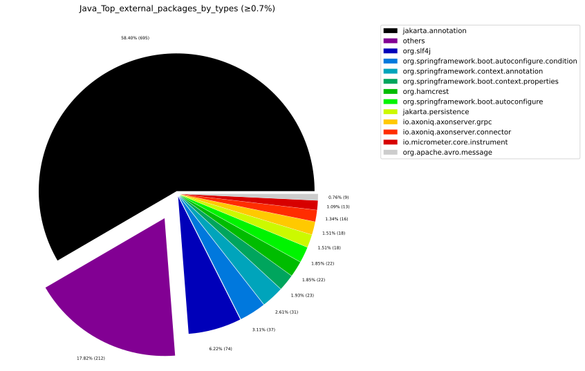

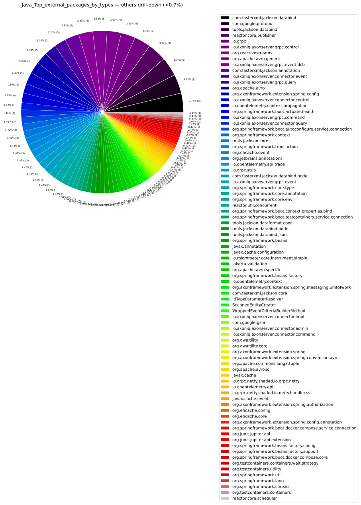

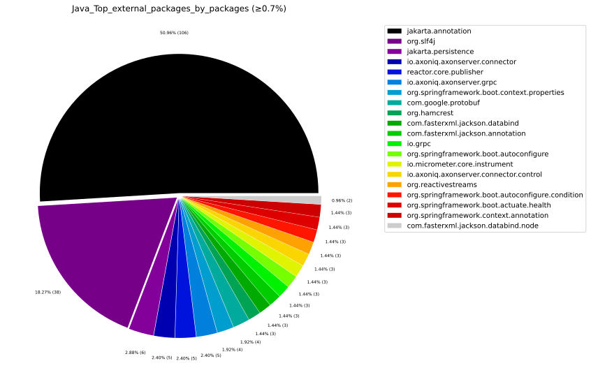

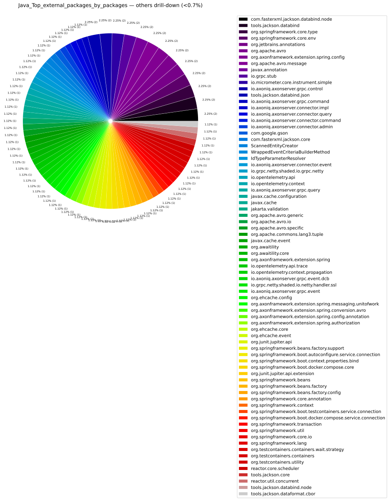

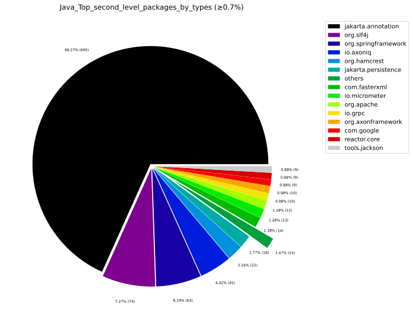

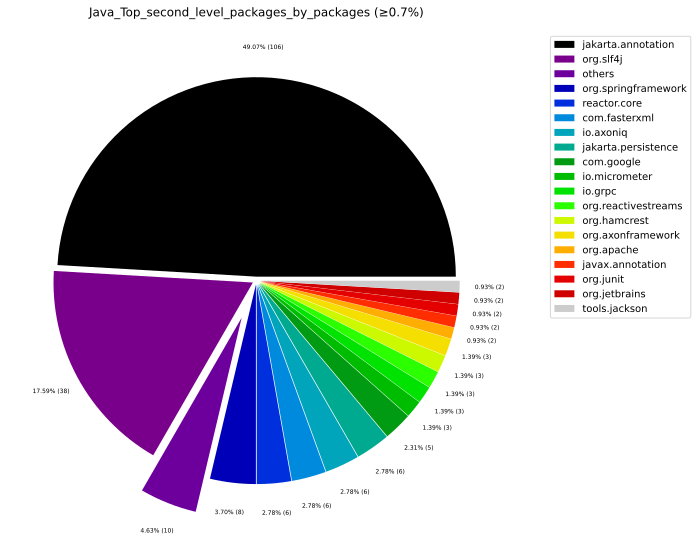

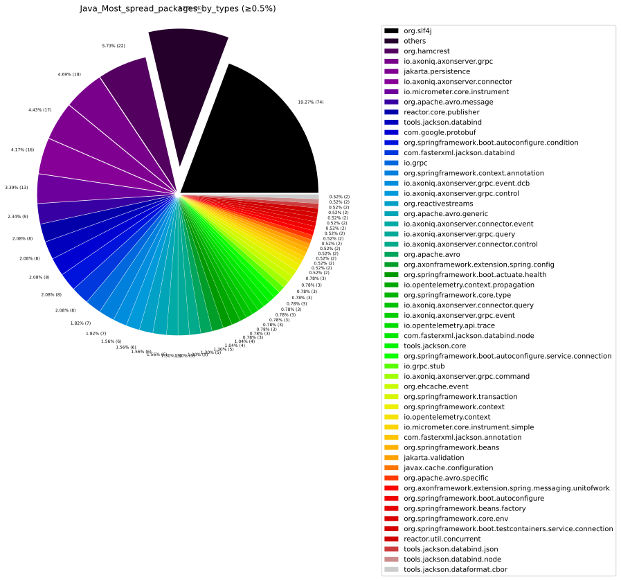

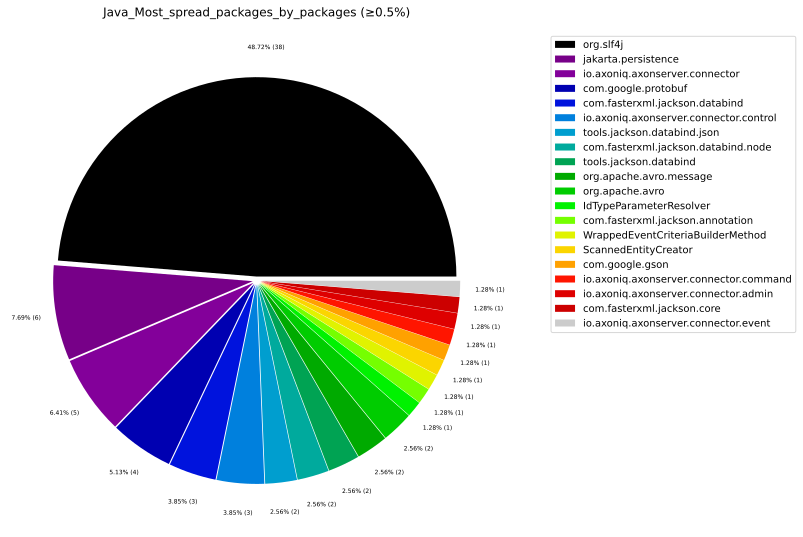

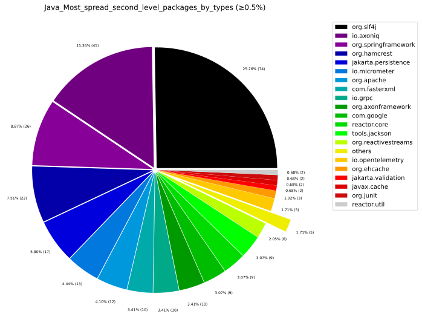

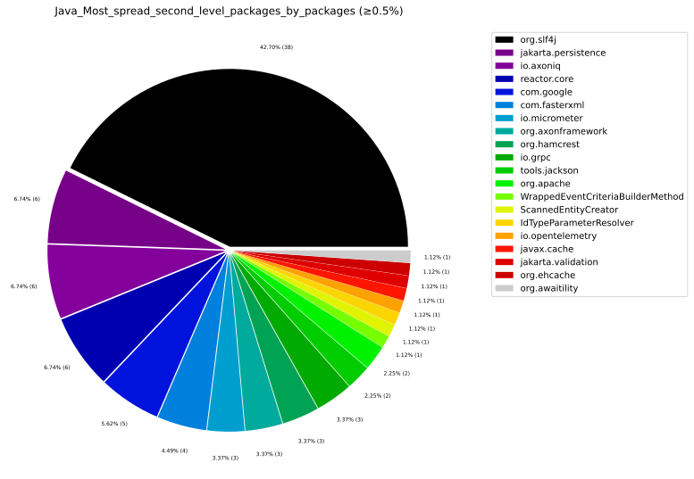

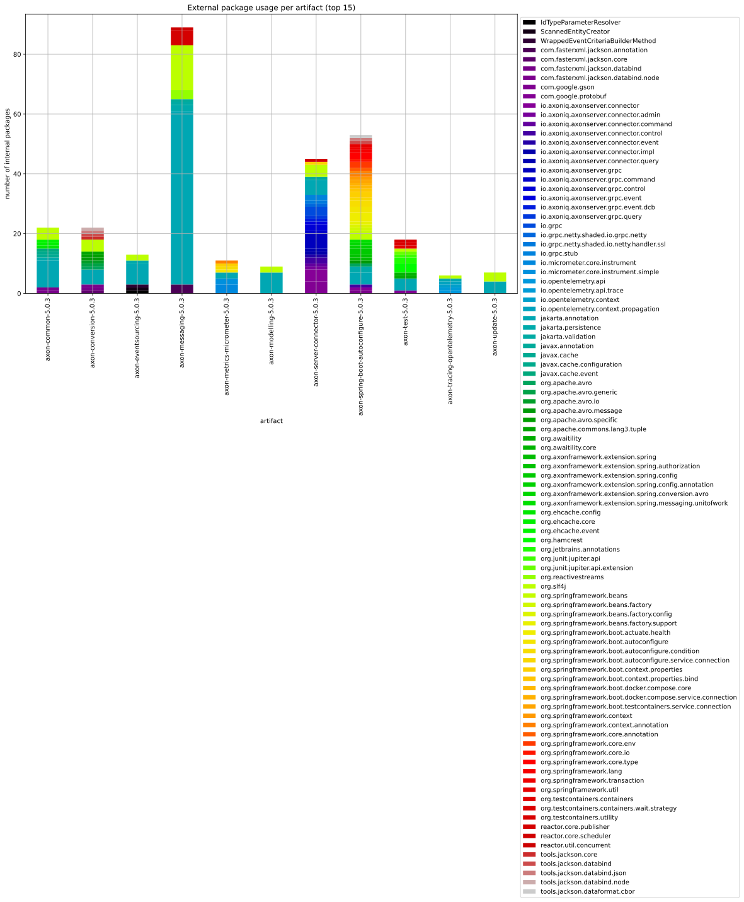

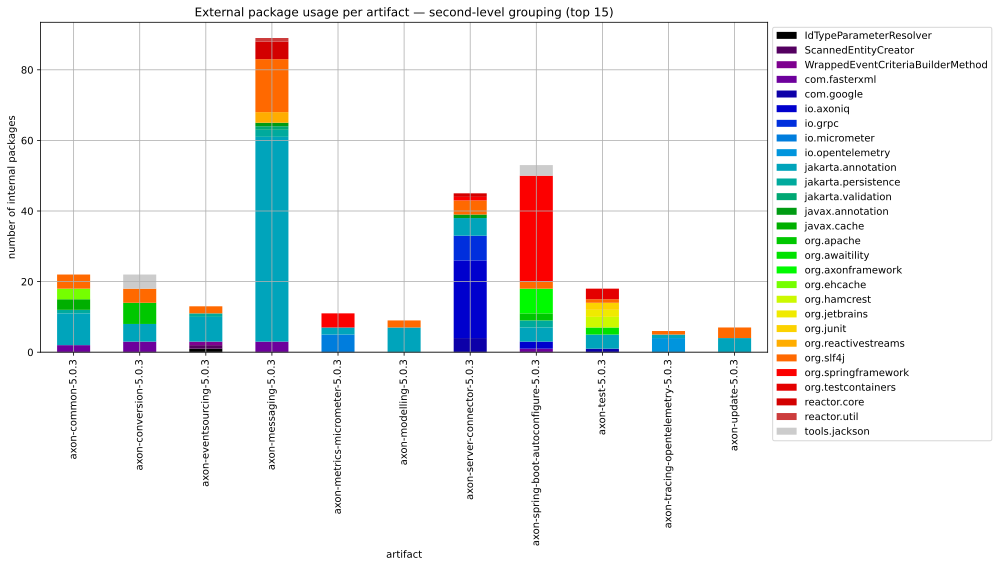

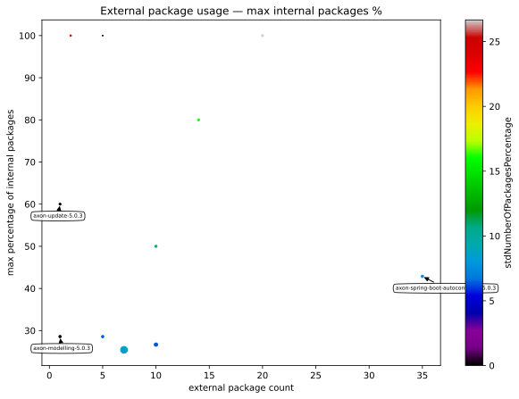

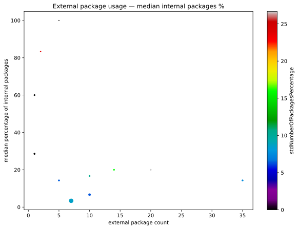

---

## 3. TypeScript External Dependencies

### 3.1 Most Used External Modules

External npm modules ranked by how many internal TypeScript elements import them.

### 3.2 Most Used External Namespaces

Groups by namespace to reveal declaration-level coupling within npm packages.

### 3.3 Most Spread External Modules

External modules referenced from the highest number of **different internal TypeScript modules**.

### 3.4 External Module Usage per Internal Module (Sorted)

Which internal TypeScript modules depend on the most external modules?

### 3.5 TypeScript Charts

---

## 4. Package Management

### 4.1 Maven POM Declared Dependencies

Java dependencies declared in Maven `pom.xml` files.

| pom.artifactId | pom.name | scope | dependency.optional | dependentArtifact.group | dependentArtifact.name |
| --- | --- | --- | --- | --- | --- |
| axon-common | Axon Framework - Common | default | true | io.projectreactor | reactor-core |
| axon-common | Axon Framework - Common | test | false | org.springframework | spring-context-support |
| axon-common | Axon Framework - Common | default | false | com.fasterxml.jackson.core | jackson-databind |
| axon-common | Axon Framework - Common | default | false | com.fasterxml.jackson.core | jackson-core |
| axon-common | Axon Framework - Common | default | true | javax.cache | cache-api |
| axon-common | Axon Framework - Common | default | true | jakarta.validation | jakarta.validation-api |
| axon-common | Axon Framework - Common | test | false | org.springframework | spring-tx |
| axon-common | Axon Framework - Common | test | false | com.tngtech.archunit | archunit-junit5 |
| axon-common | Axon Framework - Common | default | false | org.slf4j | slf4j-api |
| axon-common | Axon Framework - Common | default | true | org.ehcache | ehcache |
| axon-common | Axon Framework - Common | default | true | com.fasterxml.jackson.datatype | jackson-datatype-jsr310 |
| axon-common | Axon Framework - Common | provided | false | com.google.code.findbugs | jsr305 |
| axon-common | Axon Framework - Common | test | false | org.glassfish.expressly | expressly |
| axon-common | Axon Framework - Common | default | true | jakarta.persistence | jakarta.persistence-api |
| axon-common | Axon Framework - Common | test | false | org.springframework | spring-orm |
| axon-common | Axon Framework - Common | test | false | io.projectreactor | reactor-test |
| axon-common | Axon Framework - Common | test | false | org.springframework.security | spring-security-config |
| axon-common | Axon Framework - Common | default | false | org.reactivestreams | reactive-streams |
| axon-common | Axon Framework - Common | test | false | org.springframework | spring-test |
| axon-common | Axon Framework - Common | default | true | org.hibernate.orm | hibernate-core |
| axon-common | Axon Framework - Common | default | true | jakarta.annotation | jakarta.annotation-api |
| axon-common | Axon Framework - Common | test | false | org.hibernate.validator | hibernate-validator |
| axon-conversion | Axon Framework - Conversion | default | true | org.apache.avro | avro |
| axon-conversion | Axon Framework - Conversion | test | false | org.axonframework | axon-common |
| axon-conversion | Axon Framework - Conversion | default | false | com.fasterxml.jackson.core | jackson-databind |
| axon-conversion | Axon Framework - Conversion | default | false | tools.jackson.core | jackson-databind |
| axon-conversion | Axon Framework - Conversion | test | false | com.fasterxml.jackson.dataformat | jackson-dataformat-cbor |
| axon-conversion | Axon Framework - Conversion | default | false | tools.jackson.core | jackson-core |
| axon-conversion | Axon Framework - Conversion | test | false | tools.jackson.dataformat | jackson-dataformat-cbor |
| axon-conversion | Axon Framework - Conversion | test | false | com.fasterxml.jackson.module | jackson-module-parameter-names |
| axon-conversion | Axon Framework - Conversion | default | false | org.axonframework | axon-common |
| axon-conversion | Axon Framework - Conversion | default | true | com.fasterxml.jackson.datatype | jackson-datatype-jsr310 |
| axon-conversion | Axon Framework - Conversion | default | false | com.fasterxml.jackson.core | jackson-core |
| axon-conversion | Axon Framework - Conversion | default | true | jakarta.annotation | jakarta.annotation-api |
| axon-eventsourcing | Axon Framework - Event Sourcing | test | false | com.mysql | mysql-connector-j |
| axon-eventsourcing | Axon Framework - Event Sourcing | test | false | org.springframework | spring-context-support |
| axon-eventsourcing | Axon Framework - Event Sourcing | default | false | org.axonframework | axon-messaging |
| axon-eventsourcing | Axon Framework - Event Sourcing | test | false | org.testcontainers | testcontainers-mysql |
| axon-eventsourcing | Axon Framework - Event Sourcing | test | false | org.glassfish.expressly | expressly |
| axon-eventsourcing | Axon Framework - Event Sourcing | test | false | com.fasterxml.jackson.datatype | jackson-datatype-jsr310 |
| axon-eventsourcing | Axon Framework - Event Sourcing | test | false | com.fasterxml.jackson.core | jackson-core |
| axon-eventsourcing | Axon Framework - Event Sourcing | default | true | jakarta.annotation | jakarta.annotation-api |
| axon-eventsourcing | Axon Framework - Event Sourcing | test | false | org.springframework | spring-orm |
| axon-eventsourcing | Axon Framework - Event Sourcing | test | false | io.projectreactor | reactor-test |
| axon-eventsourcing | Axon Framework - Event Sourcing | test | false | com.fasterxml.jackson.core | jackson-databind |
| axon-eventsourcing | Axon Framework - Event Sourcing | default | true | jakarta.validation | jakarta.validation-api |
| axon-eventsourcing | Axon Framework - Event Sourcing | test | false | org.springframework.security | spring-security-config |
| axon-eventsourcing | Axon Framework - Event Sourcing | test | false | org.axonframework | axon-common |
| axon-eventsourcing | Axon Framework - Event Sourcing | test | false | org.springframework | spring-tx |
| axon-eventsourcing | Axon Framework - Event Sourcing | test | false | org.hibernate.orm | hibernate-core |
| axon-eventsourcing | Axon Framework - Event Sourcing | test | false | nl.jqno.equalsverifier | equalsverifier |
| axon-eventsourcing | Axon Framework - Event Sourcing | test | false | com.fasterxml.jackson.dataformat | jackson-dataformat-cbor |
| axon-eventsourcing | Axon Framework - Event Sourcing | default | false | org.axonframework | axon-modelling |
| axon-eventsourcing | Axon Framework - Event Sourcing | default | true | io.projectreactor | reactor-core |
| axon-eventsourcing | Axon Framework - Event Sourcing | test | false | jakarta.el | jakarta.el-api |
| axon-eventsourcing | Axon Framework - Event Sourcing | test | false | org.axonframework | axon-messaging |
| axon-eventsourcing | Axon Framework - Event Sourcing | test | false | org.testcontainers | testcontainers-junit-jupiter |
| axon-eventsourcing | Axon Framework - Event Sourcing | test | false | org.hibernate.validator | hibernate-validator |
| axon-eventsourcing | Axon Framework - Event Sourcing | test | false | org.hsqldb | hsqldb |
| axon-eventsourcing | Axon Framework - Event Sourcing | test | false | org.ehcache | ehcache |
| axon-eventsourcing | Axon Framework - Event Sourcing | default | true | jakarta.persistence | jakarta.persistence-api |
| axon-eventsourcing | Axon Framework - Event Sourcing | test | false | org.springframework | spring-test |
| axon-eventsourcing | Axon Framework - Event Sourcing | default | false | org.reactivestreams | reactive-streams |
| axon-eventsourcing | Axon Framework - Event Sourcing | test | false | tools.jackson.core | jackson-databind |
| axon-eventsourcing | Axon Framework - Event Sourcing | provided | false | com.google.code.findbugs | jsr305 |
| axon-messaging | Axon Framework - Messaging | test | false | org.axonframework | axon-conversion |
| axon-messaging | Axon Framework - Messaging | default | false | org.axonframework | axon-update |
| axon-messaging | Axon Framework - Messaging | test | false | org.hibernate.validator | hibernate-validator |
| axon-messaging | Axon Framework - Messaging | test | false | com.fasterxml.jackson.module | jackson-module-parameter-names |
| axon-messaging | Axon Framework - Messaging | provided | false | com.google.code.findbugs | jsr305 |
| axon-messaging | Axon Framework - Messaging | default | true | com.github.kagkarlsson | db-scheduler |
| axon-messaging | Axon Framework - Messaging | default | true | org.hibernate.orm | hibernate-core |
| axon-messaging | Axon Framework - Messaging | default | false | org.axonframework | axon-common |
| axon-messaging | Axon Framework - Messaging | default | true | jakarta.validation | jakarta.validation-api |
| axon-messaging | Axon Framework - Messaging | default | true | javax.cache | cache-api |
| axon-messaging | Axon Framework - Messaging | test | false | org.axonframework | axon-common |
| axon-messaging | Axon Framework - Messaging | default | true | io.projectreactor | reactor-core |
| axon-messaging | Axon Framework - Messaging | test | false | org.springframework | spring-tx |
| axon-messaging | Axon Framework - Messaging | default | true | org.quartz-scheduler | quartz |
| axon-messaging | Axon Framework - Messaging | test | false | org.springframework | spring-orm |
| axon-messaging | Axon Framework - Messaging | test | false | org.glassfish.expressly | expressly |
| axon-messaging | Axon Framework - Messaging | default | true | org.ehcache | ehcache |
| axon-messaging | Axon Framework - Messaging | test | false | org.springframework.security | spring-security-config |
| axon-messaging | Axon Framework - Messaging | test | false | com.google.code.gson | gson |
| axon-messaging | Axon Framework - Messaging | test | false | com.fasterxml.jackson.dataformat | jackson-dataformat-cbor |
| axon-messaging | Axon Framework - Messaging | default | false | org.reactivestreams | reactive-streams |
| axon-messaging | Axon Framework - Messaging | test | false | org.springframework | spring-context-support |
| axon-messaging | Axon Framework - Messaging | test | false | org.hsqldb | hsqldb |
| axon-messaging | Axon Framework - Messaging | default | false | org.slf4j | slf4j-api |
| axon-messaging | Axon Framework - Messaging | test | false | org.springframework | spring-test |
| axon-messaging | Axon Framework - Messaging | default | true | org.jobrunr | jobrunr |
| axon-messaging | Axon Framework - Messaging | default | true | jakarta.annotation | jakarta.annotation-api |
| axon-messaging | Axon Framework - Messaging | default | false | org.axonframework | axon-conversion |
| axon-messaging | Axon Framework - Messaging | default | true | jakarta.persistence | jakarta.persistence-api |
| axon-messaging | Axon Framework - Messaging | test | false | tools.jackson.dataformat | jackson-dataformat-cbor |
| axon-messaging | Axon Framework - Messaging | default | true | tools.jackson.core | jackson-databind |
| axon-messaging | Axon Framework - Messaging | test | false | io.projectreactor | reactor-test |
| axon-messaging | Axon Framework - Messaging | default | true | com.fasterxml.jackson.datatype | jackson-datatype-jsr310 |
| axon-metrics-micrometer | Axon Extension - Metrics - Micrometer | provided | false | com.google.code.findbugs | jsr305 |
| axon-metrics-micrometer | Axon Extension - Metrics - Micrometer | default | true | org.axonframework.extensions.spring | axon-spring-boot-autoconfigure |
| axon-metrics-micrometer | Axon Extension - Metrics - Micrometer | default | false | io.micrometer | micrometer-core |
| axon-metrics-micrometer | Axon Extension - Metrics - Micrometer | test | false | org.springframework.boot | spring-boot-starter-test |
| axon-metrics-micrometer | Axon Extension - Metrics - Micrometer | default | true | org.springframework.boot | spring-boot-starter |
| axon-metrics-micrometer | Axon Extension - Metrics - Micrometer | test | false | org.axonframework | axon-common |
| axon-metrics-micrometer | Axon Extension - Metrics - Micrometer | default | false | org.axonframework | axon-messaging |
| axon-metrics-micrometer | Axon Extension - Metrics - Micrometer | test | false | org.axonframework | axon-messaging |
| axon-metrics-micrometer | Axon Extension - Metrics - Micrometer | default | false | jakarta.annotation | jakarta.annotation-api |
| axon-modelling | Axon Framework - Modelling | test | false | org.springframework | spring-context-support |
| axon-modelling | Axon Framework - Modelling | test | false | org.springframework | spring-tx |
| axon-modelling | Axon Framework - Modelling | default | false | org.slf4j | slf4j-api |
| axon-modelling | Axon Framework - Modelling | test | false | org.springframework.security | spring-security-config |
| axon-modelling | Axon Framework - Modelling | test | false | org.springframework | spring-orm |
| axon-modelling | Axon Framework - Modelling | test | false | org.axonframework | axon-common |
| axon-modelling | Axon Framework - Modelling | test | false | org.springframework | spring-test |
| axon-modelling | Axon Framework - Modelling | test | true | com.fasterxml.jackson.datatype | jackson-datatype-jsr310 |
| axon-modelling | Axon Framework - Modelling | test | false | org.glassfish.expressly | expressly |
| axon-modelling | Axon Framework - Modelling | default | false | org.axonframework | axon-messaging |
| axon-modelling | Axon Framework - Modelling | test | false | org.hibernate.validator | hibernate-validator |
| axon-modelling | Axon Framework - Modelling | default | true | org.quartz-scheduler | quartz |
| axon-modelling | Axon Framework - Modelling | provided | false | com.google.code.findbugs | jsr305 |
| axon-modelling | Axon Framework - Modelling | test | false | com.mysql | mysql-connector-j |
| axon-modelling | Axon Framework - Modelling | test | false | org.postgresql | postgresql |
| axon-modelling | Axon Framework - Modelling | default | true | jakarta.persistence | jakarta.persistence-api |
| axon-modelling | Axon Framework - Modelling | default | true | org.ehcache | ehcache |
| axon-modelling | Axon Framework - Modelling | default | false | jakarta.annotation | jakarta.annotation-api |
| axon-modelling | Axon Framework - Modelling | test | false | org.axonframework | axon-messaging |
| axon-modelling | Axon Framework - Modelling | test | false | org.hibernate.orm | hibernate-core |
| axon-modelling | Axon Framework - Modelling | default | true | com.fasterxml.jackson.core | jackson-databind |
| axon-modelling | Axon Framework - Modelling | default | true | javax.cache | cache-api |
| axon-modelling | Axon Framework - Modelling | test | false | org.hsqldb | hsqldb |
| axon-server-connector | Axon Framework - Axon Server Connector | test | false | com.fasterxml.jackson.core | jackson-databind |
| axon-server-connector | Axon Framework - Axon Server Connector | default | true | org.springframework | spring-context |
| axon-server-connector | Axon Framework - Axon Server Connector | default | true | org.springframework.boot | spring-boot-configuration-processor |
| axon-server-connector | Axon Framework - Axon Server Connector | test | false | tools.jackson.core | jackson-databind |
| axon-server-connector | Axon Framework - Axon Server Connector | test | false | io.projectreactor | reactor-test |
| axon-server-connector | Axon Framework - Axon Server Connector | test | false | org.testcontainers | testcontainers-junit-jupiter |
| axon-server-connector | Axon Framework - Axon Server Connector | test | false | com.fasterxml.jackson.datatype | jackson-datatype-jsr310 |
| axon-server-connector | Axon Framework - Axon Server Connector | test | false | org.axonframework | axon-test |
| axon-server-connector | Axon Framework - Axon Server Connector | test | false | org.testcontainers | testcontainers |
| axon-server-connector | Axon Framework - Axon Server Connector | default | true | org.springframework.boot | spring-boot-starter |
| axon-server-connector | Axon Framework - Axon Server Connector | test | false | com.fasterxml.jackson.dataformat | jackson-dataformat-cbor |
| axon-server-connector | Axon Framework - Axon Server Connector | test | false | org.axonframework | axon-messaging |
| axon-server-connector | Axon Framework - Axon Server Connector | default | false | io.axoniq | axonserver-connector-java |
| axon-server-connector | Axon Framework - Axon Server Connector | default | true | org.axonframework | axon-messaging |
| axon-server-connector | Axon Framework - Axon Server Connector | default | true | org.axonframework | axon-eventsourcing |
| axon-server-connector | Axon Framework - Axon Server Connector | test | false | org.axonframework | axon-common |
| axon-server-connector | Axon Framework - Axon Server Connector | test | false | org.axonframework | axon-eventsourcing |
| axon-server-connector | Axon Framework - Axon Server Connector | default | true | io.projectreactor | reactor-core |
| axon-spring-boot-autoconfigure | Axon Extension - Spring - SpringBoot Autoconfigure | default | true | org.jobrunr | jobrunr |
| axon-spring-boot-autoconfigure | Axon Extension - Spring - SpringBoot Autoconfigure | test | false | com.tngtech.archunit | archunit-junit5 |
| axon-spring-boot-autoconfigure | Axon Extension - Spring - SpringBoot Autoconfigure | test | true | io.projectreactor | reactor-core |
| axon-spring-boot-autoconfigure | Axon Extension - Spring - SpringBoot Autoconfigure | default | true | jakarta.persistence | jakarta.persistence-api |
| axon-spring-boot-autoconfigure | Axon Extension - Spring - SpringBoot Autoconfigure | default | false | org.axonframework.extensions.spring | axon-spring |
| axon-spring-boot-autoconfigure | Axon Extension - Spring - SpringBoot Autoconfigure | test | true | org.springframework.security | spring-security-core |
| axon-spring-boot-autoconfigure | Axon Extension - Spring - SpringBoot Autoconfigure | default | true | org.springframework.boot | spring-boot-testcontainers |
| axon-spring-boot-autoconfigure | Axon Extension - Spring - SpringBoot Autoconfigure | test | false | io.projectreactor | reactor-test |
| axon-spring-boot-autoconfigure | Axon Extension - Spring - SpringBoot Autoconfigure | test | false | com.fasterxml.jackson.datatype | jackson-datatype-jsr310 |
| axon-spring-boot-autoconfigure | Axon Extension - Spring - SpringBoot Autoconfigure | test | false | org.springframework.boot | spring-boot-starter-web |
| axon-spring-boot-autoconfigure | Axon Extension - Spring - SpringBoot Autoconfigure | default | true | org.springframework.boot | spring-boot-actuator |
| axon-spring-boot-autoconfigure | Axon Extension - Spring - SpringBoot Autoconfigure | default | true | org.springframework.boot | spring-boot-configuration-processor |
| axon-spring-boot-autoconfigure | Axon Extension - Spring - SpringBoot Autoconfigure | default | true | jakarta.annotation | jakarta.annotation-api |
| axon-spring-boot-autoconfigure | Axon Extension - Spring - SpringBoot Autoconfigure | test | false | org.hsqldb | hsqldb |
| axon-spring-boot-autoconfigure | Axon Extension - Spring - SpringBoot Autoconfigure | default | true | org.springframework.boot | spring-boot-autoconfigure-processor |
| axon-spring-boot-autoconfigure | Axon Extension - Spring - SpringBoot Autoconfigure | default | true | com.fasterxml.jackson.core | jackson-databind |
| axon-spring-boot-autoconfigure | Axon Extension - Spring - SpringBoot Autoconfigure | default | true | tools.jackson.core | jackson-databind |
| axon-spring-boot-autoconfigure | Axon Extension - Spring - SpringBoot Autoconfigure | default | true | org.springframework.boot | spring-boot-starter |
| axon-spring-boot-autoconfigure | Axon Extension - Spring - SpringBoot Autoconfigure | compile | true | org.axonframework | axon-test |
| axon-spring-boot-autoconfigure | Axon Extension - Spring - SpringBoot Autoconfigure | test | false | org.springframework.boot | spring-boot-starter-test |
| axon-spring-boot-autoconfigure | Axon Extension - Spring - SpringBoot Autoconfigure | default | true | org.testcontainers | testcontainers |
| axon-spring-boot-autoconfigure | Axon Extension - Spring - SpringBoot Autoconfigure | default | true | org.axonframework.extensions.tracing | axon-tracing-opentelemetry |
| axon-spring-boot-autoconfigure | Axon Extension - Spring - SpringBoot Autoconfigure | default | true | org.springframework.boot | spring-boot-docker-compose |
| axon-spring-boot-autoconfigure | Axon Extension - Spring - SpringBoot Autoconfigure | test | false | com.lmax | disruptor |
| axon-spring-boot-autoconfigure | Axon Extension - Spring - SpringBoot Autoconfigure | default | true | com.github.kagkarlsson | db-scheduler |
| axon-spring-boot-autoconfigure | Axon Extension - Spring - SpringBoot Autoconfigure | test | false | org.testcontainers | testcontainers-junit-jupiter |
| axon-spring-boot-autoconfigure | Axon Extension - Spring - SpringBoot Autoconfigure | test | false | org.axonframework | axon-eventsourcing |
| axon-spring-boot-autoconfigure | Axon Extension - Spring - SpringBoot Autoconfigure | test | false | org.springframework.boot | spring-boot-starter-validation |
| axon-spring-boot-autoconfigure | Axon Extension - Spring - SpringBoot Autoconfigure | test | false | org.springframework | spring-orm |
| axon-spring-boot-autoconfigure | Axon Extension - Spring - SpringBoot Autoconfigure | test | false | org.axonframework | axon-messaging |
| axon-spring-boot-autoconfigure | Axon Extension - Spring - SpringBoot Autoconfigure | default | true | org.apache.commons | commons-lang3 |
| axon-spring-boot-autoconfigure | Axon Extension - Spring - SpringBoot Autoconfigure | default | true | org.apache.avro | avro |
| axon-spring-boot-autoconfigure | Axon Extension - Spring - SpringBoot Autoconfigure | default | true | tools.jackson.dataformat | jackson-dataformat-cbor |
| axon-spring-boot-autoconfigure | Axon Extension - Spring - SpringBoot Autoconfigure | default | true | org.springframework.boot | spring-boot-starter-data-jpa |
| axon-spring-boot-autoconfigure | Axon Extension - Spring - SpringBoot Autoconfigure | default | true | com.fasterxml.jackson.dataformat | jackson-dataformat-cbor |
| axon-spring-boot-autoconfigure | Axon Extension - Spring - SpringBoot Autoconfigure | default | false | org.axonframework | axon-server-connector |
| axon-test | Axon Framework - Test Fixtures | test | false | jakarta.inject | jakarta.inject-api |
| axon-test | Axon Framework - Test Fixtures | compile | false | org.junit.jupiter | junit-jupiter |
| axon-test | Axon Framework - Test Fixtures | test | false | com.fasterxml.jackson.core | jackson-core |
| axon-test | Axon Framework - Test Fixtures | compile | false | org.awaitility | awaitility |
| axon-test | Axon Framework - Test Fixtures | default | true | jakarta.annotation | jakarta.annotation-api |
| axon-test | Axon Framework - Test Fixtures | test | false | com.fasterxml.jackson.datatype | jackson-datatype-jsr310 |
| axon-test | Axon Framework - Test Fixtures | test | false | com.fasterxml.jackson.module | jackson-module-parameter-names |
| axon-test | Axon Framework - Test Fixtures | compile | false | org.testcontainers | testcontainers |
| axon-test | Axon Framework - Test Fixtures | test | false | com.fasterxml.jackson.core | jackson-databind |
| axon-test | Axon Framework - Test Fixtures | test | false | jakarta.persistence | jakarta.persistence-api |
| axon-test | Axon Framework - Test Fixtures | default | false | org.axonframework | axon-eventsourcing |
| axon-test | Axon Framework - Test Fixtures | compile | false | org.hamcrest | hamcrest-library |
| axon-test | Axon Framework - Test Fixtures | compile | false | org.hamcrest | hamcrest |
| axon-test | Axon Framework - Test Fixtures | default | false | com.google.code.gson | gson |
| axon-tracing-opentelemetry | Axon Extension - Tracing - OpenTelemetry | default | false | org.axonframework | axon-messaging |
| axon-tracing-opentelemetry | Axon Extension - Tracing - OpenTelemetry | default | false | io.opentelemetry | opentelemetry-api |
| axon-tracing-opentelemetry | Axon Extension - Tracing - OpenTelemetry | default | false | jakarta.annotation | jakarta.annotation-api |
| axon-tracing-opentelemetry | Axon Extension - Tracing - OpenTelemetry | provided | false | com.google.code.findbugs | jsr305 |
| axon-update | Axon Framework - Update | default | false | jakarta.annotation | jakarta.annotation-api |
| axon-update | Axon Framework - Update | test | false | org.axonframework | axon-common |
| axon-update | Axon Framework - Update | default | false | org.axonframework | axon-common |

### 4.2 package.json Declared Dependencies

Node.js dependencies declared in `package.json` files, ranked by occurrence across repository packages.

---

## 5. Glossary

| Term | Definition |
|------|-----------|
| **Second-level package** | First two dot-separated segments of a package name (e.g. `org.springframework`). Used to group variant packages under one framework name. |
| **numberOfExternalCallerTypes** | Count of *internal Java types* that directly reference the external package. |
| **numberOfExternalCallerPackages** | Count of *internal Java packages* containing at least one type referencing the external package. |
| **numberOfExternalCallerElements** | Count of *internal TypeScript elements* that import from the external module. |
| **numberOfExternalCallerModules** | Count of *internal TypeScript modules* that import from the external module. |
| **sumNumberOfTypes / sumNumberOfPackages** | Sum across all artifacts of internal types/packages dependent on the external package. Measures total spread. |
| **sumNumberOfUsedExternalDeclarations** | Total distinct external declarations imported from the module across all internal modules. |
| **packagesCallingExternalRate** | Ratio of internal packages with external references to total artifact packages. |
| **typesCallingExternalRate** | Ratio of internal types with external references to total artifact types. |
| **Anti-Corruption Layer (ACL)** | Isolates the internal domain from external library APIs by wrapping them behind an internal interface. |
| **Façade** | Simplified interface hiding external library complexity. Useful when many internal modules call the same external package. |
| **Hexagonal Architecture** | Ports & Adapters style that pushes all external dependencies to the outer ring, preventing them from leaking into the core domain. |
