# git log/history
   

### References
- [Visualizing Code: Polyglot Notebooks Repository (YouTube)](https://youtu.be/ipOpToPS-PY?si=3doePt2cp-LgEUmt)
- [gitstractor (GitHub)](https://github.com/IntegerMan/gitstractor)
- [Neo4j Python Driver](https://neo4j.com/docs/api/python-driver/current)

    Command line execution (CLI mode): Yes

## Git History - Directory Commit Statistics

### Data Preview

<table border="1" class="dataframe">
  <thead>
    <tr style="text-align: right;">
      <th></th>
      <th>fileCount</th>
      <th>authorCount</th>
      <th>commitCount</th>
      <th>daysSinceLastCommit</th>
      <th>daysSinceLastCreation</th>
      <th>daysSinceLastModification</th>
    </tr>
  </thead>
  <tbody>
    <tr>
      <th>count</th>
      <td>790.000000</td>
      <td>790.000000</td>
      <td>790.000000</td>
      <td>790.000000</td>
      <td>790.000000</td>
      <td>790.000000</td>
    </tr>
    <tr>
      <th>mean</th>
      <td>21.870886</td>
      <td>11.225316</td>
      <td>166.854430</td>
      <td>16.267089</td>
      <td>153.117722</td>
      <td>111.767089</td>
    </tr>
    <tr>
      <th>std</th>
      <td>112.153100</td>
      <td>12.024368</td>
      <td>359.925155</td>
      <td>6.964935</td>
      <td>185.136910</td>
      <td>159.974662</td>
    </tr>
    <tr>
      <th>min</th>
      <td>1.000000</td>
      <td>2.000000</td>
      <td>4.000000</td>
      <td>5.000000</td>
      <td>9.000000</td>
      <td>5.000000</td>
    </tr>
    <tr>
      <th>25%</th>
      <td>2.000000</td>
      <td>4.000000</td>
      <td>23.000000</td>
      <td>14.000000</td>
      <td>61.000000</td>
      <td>14.000000</td>
    </tr>
    <tr>
      <th>50%</th>
      <td>4.000000</td>
      <td>7.000000</td>
      <td>46.000000</td>
      <td>16.000000</td>
      <td>114.000000</td>
      <td>65.000000</td>
    </tr>
    <tr>
      <th>75%</th>
      <td>11.000000</td>
      <td>12.000000</td>
      <td>155.000000</td>
      <td>16.000000</td>
      <td>126.000000</td>
      <td>114.000000</td>
    </tr>
    <tr>
      <th>max</th>
      <td>2771.000000</td>
      <td>117.000000</td>
      <td>6350.000000</td>
      <td>35.000000</td>
      <td>2796.000000</td>
      <td>642.000000</td>
    </tr>
  </tbody>
</table>

<table border="1" class="dataframe">
  <thead>
    <tr style="text-align: right;">
      <th></th>
      <th>directoryPath</th>
      <th>directoryParentPath</th>
      <th>directoryName</th>
      <th>fileCount</th>
      <th>firstFile</th>
      <th>mostFrequentFileExtension</th>
      <th>authorCount</th>
      <th>mainAuthor</th>
      <th>secondAuthor</th>
      <th>commitCount</th>
      <th>daysSinceLastCommit</th>
      <th>daysSinceLastCreation</th>
      <th>daysSinceLastModification</th>
      <th>lastCommitDate</th>
      <th>lastCreationDate</th>
      <th>lastModificationDate</th>
      <th>maxCommitSha</th>
    </tr>
  </thead>
  <tbody>
    <tr>
      <th>0</th>
      <td>AxonFramework-5.0.3/.idea/copyright</td>
      <td>AxonFramework-5.0.3/.idea</td>
      <td>copyright</td>
      <td>1</td>
      <td>AxonFramework-5.0.3/.idea/copyright/Axon_Framework_copyright_template.xml</td>
      <td>xml</td>
      <td>3</td>
      <td>Allard Buijze</td>
      <td>Jan Galinski</td>
      <td>28</td>
      <td>16</td>
      <td>426</td>
      <td>426</td>
      <td>2026-02-23</td>
      <td>2025-01-09</td>
      <td>2025-01-09</td>
      <td>fe926a4970bdf1e538e8e7fb8d147ffdc676e713</td>
    </tr>
    <tr>
      <th>1</th>
      <td>AxonFramework-5.0.3/.idea/inspectionProfiles</td>
      <td>AxonFramework-5.0.3/.idea</td>
      <td>inspectionProfiles</td>
      <td>1</td>
      <td>AxonFramework-5.0.3/.idea/inspectionProfiles/Project_Default.xml</td>
      <td>xml</td>
      <td>6</td>
      <td>Allard Buijze</td>
      <td>Jan Galinski</td>
      <td>53</td>
      <td>16</td>
      <td>426</td>
      <td>201</td>
      <td>2026-02-23</td>
      <td>2025-01-09</td>
      <td>2025-08-22</td>
      <td>fe926a4970bdf1e538e8e7fb8d147ffdc676e713</td>
    </tr>
    <tr>
      <th>2</th>
      <td>AxonFramework-5.0.3/axon-framework-bom</td>
      <td>AxonFramework-5.0.3</td>
      <td>axon-framework-bom</td>
      <td>1</td>
      <td>AxonFramework-5.0.3/axon-framework-bom/pom.xml</td>
      <td>xml</td>
      <td>4</td>
      <td>Allard Buijze</td>
      <td>Jan Galinski</td>
      <td>29</td>
      <td>5</td>
      <td>114</td>
      <td>5</td>
      <td>2026-03-06</td>
      <td>2025-11-17</td>
      <td>2026-03-06</td>
      <td>fbd1ff331f71beea08fe018d000965e68a62b7c5</td>
    </tr>
    <tr>
      <th>3</th>
      <td>AxonFramework-5.0.3/axon-server-connector/src/main/resources/META-INF/services</td>
      <td>AxonFramework-5.0.3/axon-server-connector/src/main</td>
      <td>resources/META-INF/services</td>
      <td>1</td>
      <td>AxonFramework-5.0.3/axon-server-connector/src/main/resources/META-INF/services/org.axonframework.common.configuration.ConfigurationEnhancer</td>
      <td>ConfigurationEnhancer</td>
      <td>11</td>
      <td>Allard Buijze</td>
      <td>Jan Galinski</td>
      <td>87</td>
      <td>16</td>
      <td>127</td>
      <td>127</td>
      <td>2026-02-23</td>
      <td>2025-11-04</td>
      <td>2025-11-04</td>
      <td>fdddb8b6ce37c30237b25549ddefec5a1871a040</td>
    </tr>
    <tr>
      <th>4</th>
      <td>AxonFramework-5.0.3/axon-server-connector/src/test/java/org/axonframework/axonserver/connector/command</td>
      <td>AxonFramework-5.0.3/axon-server-connector/src/test/java/org/axonframework/axonserver/connector</td>
      <td>command</td>
      <td>1</td>
      <td>AxonFramework-5.0.3/axon-server-connector/src/test/java/org/axonframework/axonserver/connector/command/AxonServerCommandBusConnectorTest.java</td>
      <td>java</td>
      <td>7</td>
      <td>Allard Buijze</td>
      <td>Jan Galinski</td>
      <td>76</td>
      <td>16</td>
      <td>217</td>
      <td>100</td>
      <td>2026-02-23</td>
      <td>2025-08-06</td>
      <td>2025-12-01</td>
      <td>f6644279ae27410995706c00816ea3f38464a906</td>
    </tr>
    <tr>
      <th>5</th>
      <td>AxonFramework-5.0.3/axon-server-connector/src/test/resources</td>
      <td>AxonFramework-5.0.3/axon-server-connector/src/test</td>
      <td>resources</td>
      <td>1</td>
      <td>AxonFramework-5.0.3/axon-server-connector/src/test/resources/junit-platform.properties</td>
      <td>properties</td>
      <td>4</td>
      <td>Allard Buijze</td>
      <td>Jan Galinski</td>
      <td>15</td>
      <td>16</td>
      <td>125</td>
      <td>125</td>
      <td>2026-02-23</td>
      <td>2025-11-06</td>
      <td>2025-11-06</td>
      <td>e5ef80fb51d51f626a32d37be0a02c4596864da5</td>
    </tr>
    <tr>
      <th>6</th>
      <td>AxonFramework-5.0.3/build/coverage-report</td>
      <td>AxonFramework-5.0.3/build</td>
      <td>coverage-report</td>
      <td>1</td>
      <td>AxonFramework-5.0.3/build/coverage-report/pom.xml</td>
      <td>xml</td>
      <td>5</td>
      <td>Allard Buijze</td>
      <td>Jan Galinski</td>
      <td>22</td>
      <td>16</td>
      <td>113</td>
      <td>51</td>
      <td>2026-02-23</td>
      <td>2025-11-17</td>
      <td>2026-01-19</td>
      <td>e5ef80fb51d51f626a32d37be0a02c4596864da5</td>
    </tr>
    <tr>
      <th>7</th>
      <td>AxonFramework-5.0.3/build/parent</td>
      <td>AxonFramework-5.0.3/build</td>
      <td>parent</td>
      <td>1</td>
      <td>AxonFramework-5.0.3/build/parent/pom.xml</td>
      <td>xml</td>
      <td>7</td>
      <td>Allard Buijze</td>
      <td>Jakob Hatzl</td>
      <td>67</td>
      <td>5</td>
      <td>114</td>
      <td>5</td>
      <td>2026-03-06</td>
      <td>2025-11-17</td>
      <td>2026-03-06</td>
      <td>fbd1ff331f71beea08fe018d000965e68a62b7c5</td>
    </tr>
    <tr>
      <th>8</th>
      <td>AxonFramework-5.0.3/common/src/main/java/org/axonframework/common/digest</td>
      <td>AxonFramework-5.0.3/common/src/main/java/org/axonframework/common</td>
      <td>digest</td>
      <td>1</td>
      <td>AxonFramework-5.0.3/common/src/main/java/org/axonframework/common/digest/Digester.java</td>
      <td>java</td>
      <td>10</td>
      <td>Allard Buijze</td>
      <td>Frank Versnel</td>
      <td>79</td>
      <td>16</td>
      <td>126</td>
      <td>114</td>
      <td>2026-02-23</td>
      <td>2025-11-04</td>
      <td>2025-11-17</td>
      <td>f4746a871e454c40b72346d541bbcfc9ffc7680d</td>
    </tr>
    <tr>
      <th>9</th>
      <td>AxonFramework-5.0.3/common/src/main/java/org/axonframework/common/io</td>
      <td>AxonFramework-5.0.3/common/src/main/java/org/axonframework/common</td>
      <td>io</td>
      <td>1</td>
      <td>AxonFramework-5.0.3/common/src/main/java/org/axonframework/common/io/IOUtils.java</td>
      <td>java</td>
      <td>14</td>
      <td>Allard Buijze</td>
      <td>Frank Versnel</td>
      <td>97</td>
      <td>16</td>
      <td>126</td>
      <td>114</td>
      <td>2026-02-23</td>
      <td>2025-11-04</td>
      <td>2025-11-17</td>
      <td>fdd51aa788071375721c67bb30bf5709136e974a</td>
    </tr>
    <tr>
      <th>10</th>
      <td>AxonFramework-5.0.3/common/src/main/java/org/axonframework/common/tx</td>
      <td>AxonFramework-5.0.3/common/src/main/java/org/axonframework/common</td>
      <td>tx</td>
      <td>1</td>
      <td>AxonFramework-5.0.3/common/src/main/java/org/axonframework/common/tx/TransactionalExecutor.java</td>
      <td>java</td>
      <td>3</td>
      <td>Jan Galinski</td>
      <td>John Hendrikx</td>
      <td>7</td>
      <td>16</td>
      <td>65</td>
      <td>65</td>
      <td>2026-02-23</td>
      <td>2026-01-05</td>
      <td>2026-01-05</td>
      <td>e5ef80fb51d51f626a32d37be0a02c4596864da5</td>
    </tr>
    <tr>
      <th>11</th>
      <td>AxonFramework-5.0.3/common/src/main/resources/META-INF/services</td>
      <td>AxonFramework-5.0.3/common/src/main</td>
      <td>resources/META-INF/services</td>
      <td>1</td>
      <td>AxonFramework-5.0.3/common/src/main/resources/META-INF/services/org.axonframework.common.property.PropertyAccessStrategy</td>
      <td>PropertyAccessStrategy</td>
      <td>7</td>
      <td>Allard Buijze</td>
      <td>Jan Galinski</td>
      <td>73</td>
      <td>16</td>
      <td>126</td>
      <td>114</td>
      <td>2026-02-23</td>
      <td>2025-11-04</td>
      <td>2025-11-17</td>
      <td>f911231de7ec9233077061a31818f74064a7f85f</td>
    </tr>
    <tr>
      <th>12</th>
      <td>AxonFramework-5.0.3/common/src/test/java/org/axonframework/common/lifecycle</td>
      <td>AxonFramework-5.0.3/common/src/test/java/org/axonframework/common</td>
      <td>lifecycle</td>
      <td>1</td>
      <td>AxonFramework-5.0.3/common/src/test/java/org/axonframework/common/lifecycle/ShutdownLatchTest.java</td>
      <td>java</td>
      <td>4</td>
      <td>Allard Buijze</td>
      <td>Jan Galinski</td>
      <td>17</td>
      <td>16</td>
      <td>126</td>
      <td>126</td>
      <td>2026-02-23</td>
      <td>2025-11-04</td>
      <td>2025-11-04</td>
      <td>e5ef80fb51d51f626a32d37be0a02c4596864da5</td>
    </tr>
    <tr>
      <th>13</th>
      <td>AxonFramework-5.0.3/common/src/test/resources/META-INF/services</td>
      <td>AxonFramework-5.0.3/common/src/test</td>
      <td>resources/META-INF/services</td>
      <td>1</td>
      <td>AxonFramework-5.0.3/common/src/test/resources/META-INF/services/org.axonframework.common.configuration.ConfigurationEnhancer</td>
      <td>ConfigurationEnhancer</td>
      <td>5</td>
      <td>Allard Buijze</td>
      <td>Jan Galinski</td>
      <td>35</td>
      <td>16</td>
      <td>126</td>
      <td>126</td>
      <td>2026-02-23</td>
      <td>2025-11-05</td>
      <td>2025-11-05</td>
      <td>f4746a871e454c40b72346d541bbcfc9ffc7680d</td>
    </tr>
    <tr>
      <th>14</th>
      <td>AxonFramework-5.0.3/conversion/src/main/resources/META-INF/services</td>
      <td>AxonFramework-5.0.3/conversion/src/main</td>
      <td>resources/META-INF/services</td>
      <td>1</td>
      <td>AxonFramework-5.0.3/conversion/src/main/resources/META-INF/services/org.axonframework.conversion.ContentTypeConverter</td>
      <td>ContentTypeConverter</td>
      <td>11</td>
      <td>Allard Buijze</td>
      <td>Christophe Bouhier</td>
      <td>99</td>
      <td>16</td>
      <td>126</td>
      <td>114</td>
      <td>2026-02-23</td>
      <td>2025-11-05</td>
      <td>2025-11-17</td>
      <td>fdd51aa788071375721c67bb30bf5709136e974a</td>
    </tr>
    <tr>
      <th>15</th>
      <td>AxonFramework-5.0.3/docs/_playbook/localLinks</td>
      <td>AxonFramework-5.0.3/docs/_playbook</td>
      <td>localLinks</td>
      <td>1</td>
      <td>AxonFramework-5.0.3/docs/_playbook/localLinks/axoniq-library-ui</td>
      <td>axoniq-library-ui</td>
      <td>8</td>
      <td>Allard Buijze</td>
      <td>David Gómez G</td>
      <td>13</td>
      <td>35</td>
      <td>642</td>
      <td>642</td>
      <td>2026-02-04</td>
      <td>2024-06-07</td>
      <td>2024-06-07</td>
      <td>fcf55fb4f72d050c0949cac6a1818df2cd53d608</td>
    </tr>
    <tr>
      <th>16</th>
      <td>AxonFramework-5.0.3/docs/_reference/modules/ROOT/attachments</td>
      <td>AxonFramework-5.0.3/docs/_reference/modules/ROOT</td>
      <td>attachments</td>
      <td>1</td>
      <td>AxonFramework-5.0.3/docs/_reference/modules/ROOT/attachments/axonframework_overview.gv</td>
      <td>gv</td>
      <td>9</td>
      <td>Allard Buijze</td>
      <td>David Gómez G</td>
      <td>22</td>
      <td>35</td>
      <td>630</td>
      <td>630</td>
      <td>2026-02-04</td>
      <td>2024-06-19</td>
      <td>2024-06-19</td>
      <td>f851948ee70e6cc9742c7b1bde5941ed2655e28f</td>
    </tr>
    <tr>
      <th>17</th>
      <td>AxonFramework-5.0.3/docs/_reference/modules/ROOT/partials</td>
      <td>AxonFramework-5.0.3/docs/_reference/modules/ROOT</td>
      <td>partials</td>
      <td>1</td>
      <td>AxonFramework-5.0.3/docs/_reference/modules/ROOT/partials/nav.adoc</td>
      <td>adoc</td>
      <td>9</td>
      <td>Allard Buijze</td>
      <td>David Gómez G</td>
      <td>22</td>
      <td>35</td>
      <td>630</td>
      <td>630</td>
      <td>2026-02-04</td>
      <td>2024-06-19</td>
      <td>2024-06-19</td>
      <td>f851948ee70e6cc9742c7b1bde5941ed2655e28f</td>
    </tr>
    <tr>
      <th>18</th>
      <td>AxonFramework-5.0.3/docs/_reference/modules/axon-server-connector/pages</td>
      <td>AxonFramework-5.0.3/docs/_reference/modules/axon-server-connector</td>
      <td>pages</td>
      <td>1</td>
      <td>AxonFramework-5.0.3/docs/_reference/modules/axon-server-connector/pages/index.adoc</td>
      <td>adoc</td>
      <td>9</td>
      <td>Allard Buijze</td>
      <td>David Gómez G</td>
      <td>23</td>
      <td>35</td>
      <td>630</td>
      <td>630</td>
      <td>2026-02-04</td>
      <td>2024-06-19</td>
      <td>2024-06-19</td>
      <td>f851948ee70e6cc9742c7b1bde5941ed2655e28f</td>
    </tr>
    <tr>
      <th>19</th>
      <td>AxonFramework-5.0.3/docs/_reference/modules/axon-server-connector/partials</td>
      <td>AxonFramework-5.0.3/docs/_reference/modules/axon-server-connector</td>
      <td>partials</td>
      <td>1</td>
      <td>AxonFramework-5.0.3/docs/_reference/modules/axon-server-connector/partials/nav.adoc</td>
      <td>adoc</td>
      <td>9</td>
      <td>Allard Buijze</td>
      <td>David Gómez G</td>
      <td>22</td>
      <td>35</td>
      <td>630</td>
      <td>630</td>
      <td>2026-02-04</td>
      <td>2024-06-19</td>
      <td>2024-06-19</td>
      <td>f851948ee70e6cc9742c7b1bde5941ed2655e28f</td>
    </tr>
    <tr>
      <th>20</th>
      <td>AxonFramework-5.0.3/docs/_reference/modules/configuration/pages</td>
      <td>AxonFramework-5.0.3/docs/_reference/modules/configuration</td>
      <td>pages</td>
      <td>1</td>
      <td>AxonFramework-5.0.3/docs/_reference/modules/configuration/pages/index.adoc</td>
      <td>adoc</td>
      <td>9</td>
      <td>Allard Buijze</td>
      <td>David Gómez G</td>
      <td>23</td>
      <td>35</td>
      <td>630</td>
      <td>630</td>
      <td>2026-02-04</td>
      <td>2024-06-19</td>
      <td>2024-06-19</td>
      <td>f851948ee70e6cc9742c7b1bde5941ed2655e28f</td>
    </tr>
    <tr>
      <th>21</th>
      <td>AxonFramework-5.0.3/docs/_reference/modules/configuration/partials</td>
      <td>AxonFramework-5.0.3/docs/_reference/modules/configuration</td>
      <td>partials</td>
      <td>1</td>
      <td>AxonFramework-5.0.3/docs/_reference/modules/configuration/partials/nav.adoc</td>
      <td>adoc</td>
      <td>9</td>
      <td>Allard Buijze</td>
      <td>David Gómez G</td>
      <td>22</td>
      <td>35</td>
      <td>630</td>
      <td>630</td>
      <td>2026-02-04</td>
      <td>2024-06-19</td>
      <td>2024-06-19</td>
      <td>f851948ee70e6cc9742c7b1bde5941ed2655e28f</td>
    </tr>
    <tr>
      <th>22</th>
      <td>AxonFramework-5.0.3/docs/_reference/modules/disruptor/pages</td>
      <td>AxonFramework-5.0.3/docs/_reference/modules/disruptor</td>
      <td>pages</td>
      <td>1</td>
      <td>AxonFramework-5.0.3/docs/_reference/modules/disruptor/pages/index.adoc</td>
      <td>adoc</td>
      <td>9</td>
      <td>Allard Buijze</td>
      <td>David Gómez G</td>
      <td>23</td>
      <td>35</td>
      <td>630</td>
      <td>630</td>
      <td>2026-02-04</td>
      <td>2024-06-19</td>
      <td>2024-06-19</td>
      <td>f851948ee70e6cc9742c7b1bde5941ed2655e28f</td>
    </tr>
    <tr>
      <th>23</th>
      <td>AxonFramework-5.0.3/docs/_reference/modules/disruptor/partials</td>
      <td>AxonFramework-5.0.3/docs/_reference/modules/disruptor</td>
      <td>partials</td>
      <td>1</td>
      <td>AxonFramework-5.0.3/docs/_reference/modules/disruptor/partials/nav.adoc</td>
      <td>adoc</td>
      <td>9</td>
      <td>Allard Buijze</td>
      <td>David Gómez G</td>
      <td>22</td>
      <td>35</td>
      <td>630</td>
      <td>630</td>
      <td>2026-02-04</td>
      <td>2024-06-19</td>
      <td>2024-06-19</td>
      <td>f851948ee70e6cc9742c7b1bde5941ed2655e28f</td>
    </tr>
    <tr>
      <th>24</th>
      <td>AxonFramework-5.0.3/docs/_reference/modules/eventsourcing/pages</td>
      <td>AxonFramework-5.0.3/docs/_reference/modules/eventsourcing</td>
      <td>pages</td>
      <td>1</td>
      <td>AxonFramework-5.0.3/docs/_reference/modules/eventsourcing/pages/index.adoc</td>
      <td>adoc</td>
      <td>9</td>
      <td>Allard Buijze</td>
      <td>David Gómez G</td>
      <td>24</td>
      <td>35</td>
      <td>630</td>
      <td>630</td>
      <td>2026-02-04</td>
      <td>2024-06-19</td>
      <td>2024-06-19</td>
      <td>f851948ee70e6cc9742c7b1bde5941ed2655e28f</td>
    </tr>
    <tr>
      <th>25</th>
      <td>AxonFramework-5.0.3/docs/_reference/modules/eventsourcing/partials</td>
      <td>AxonFramework-5.0.3/docs/_reference/modules/eventsourcing</td>
      <td>partials</td>
      <td>1</td>
      <td>AxonFramework-5.0.3/docs/_reference/modules/eventsourcing/partials/nav.adoc</td>
      <td>adoc</td>
      <td>9</td>
      <td>Allard Buijze</td>
      <td>David Gómez G</td>
      <td>22</td>
      <td>35</td>
      <td>630</td>
      <td>630</td>
      <td>2026-02-04</td>
      <td>2024-06-19</td>
      <td>2024-06-19</td>
      <td>f851948ee70e6cc9742c7b1bde5941ed2655e28f</td>
    </tr>
    <tr>
      <th>26</th>
      <td>AxonFramework-5.0.3/docs/_reference/modules/legacy/pages</td>
      <td>AxonFramework-5.0.3/docs/_reference/modules/legacy</td>
      <td>pages</td>
      <td>1</td>
      <td>AxonFramework-5.0.3/docs/_reference/modules/legacy/pages/index.adoc</td>
      <td>adoc</td>
      <td>9</td>
      <td>Allard Buijze</td>
      <td>David Gómez G</td>
      <td>23</td>
      <td>35</td>
      <td>630</td>
      <td>630</td>
      <td>2026-02-04</td>
      <td>2024-06-19</td>
      <td>2024-06-19</td>
      <td>f851948ee70e6cc9742c7b1bde5941ed2655e28f</td>
    </tr>
    <tr>
      <th>27</th>
      <td>AxonFramework-5.0.3/docs/_reference/modules/legacy/partials</td>
      <td>AxonFramework-5.0.3/docs/_reference/modules/legacy</td>
      <td>partials</td>
      <td>1</td>
      <td>AxonFramework-5.0.3/docs/_reference/modules/legacy/partials/nav.adoc</td>
      <td>adoc</td>
      <td>9</td>
      <td>Allard Buijze</td>
      <td>David Gómez G</td>
      <td>22</td>
      <td>35</td>
      <td>630</td>
      <td>630</td>
      <td>2026-02-04</td>
      <td>2024-06-19</td>
      <td>2024-06-19</td>
      <td>f851948ee70e6cc9742c7b1bde5941ed2655e28f</td>
    </tr>
    <tr>
      <th>28</th>
      <td>AxonFramework-5.0.3/docs/_reference/modules/metrics/pages</td>
      <td>AxonFramework-5.0.3/docs/_reference/modules/metrics</td>
      <td>pages</td>
      <td>1</td>
      <td>AxonFramework-5.0.3/docs/_reference/modules/metrics/pages/index.adoc</td>
      <td>adoc</td>
      <td>9</td>
      <td>Allard Buijze</td>
      <td>David Gómez G</td>
      <td>23</td>
      <td>35</td>
      <td>630</td>
      <td>630</td>
      <td>2026-02-04</td>
      <td>2024-06-19</td>
      <td>2024-06-19</td>
      <td>f851948ee70e6cc9742c7b1bde5941ed2655e28f</td>
    </tr>
    <tr>
      <th>29</th>
      <td>AxonFramework-5.0.3/docs/_reference/modules/metrics/partials</td>
      <td>AxonFramework-5.0.3/docs/_reference/modules/metrics</td>
      <td>partials</td>
      <td>1</td>
      <td>AxonFramework-5.0.3/docs/_reference/modules/metrics/partials/nav.adoc</td>
      <td>adoc</td>
      <td>9</td>
      <td>Allard Buijze</td>
      <td>David Gómez G</td>
      <td>22</td>
      <td>35</td>
      <td>630</td>
      <td>630</td>
      <td>2026-02-04</td>
      <td>2024-06-19</td>
      <td>2024-06-19</td>
      <td>f851948ee70e6cc9742c7b1bde5941ed2655e28f</td>
    </tr>
  </tbody>
</table>

### Number of files per directory

    
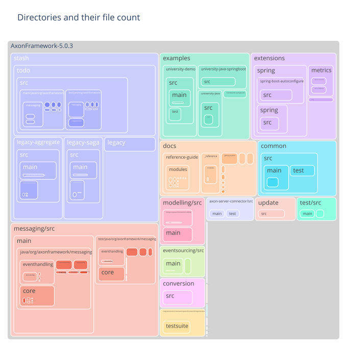
    

### Most frequent file extension per directory

    
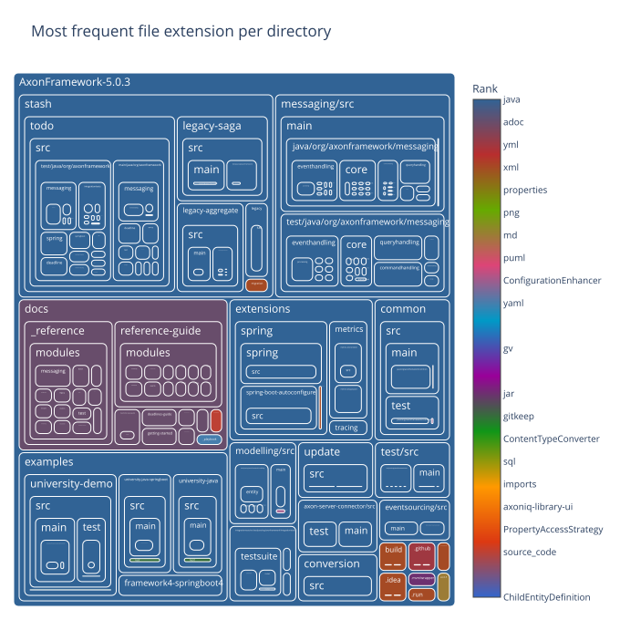
    

### Number of commits per directory

    
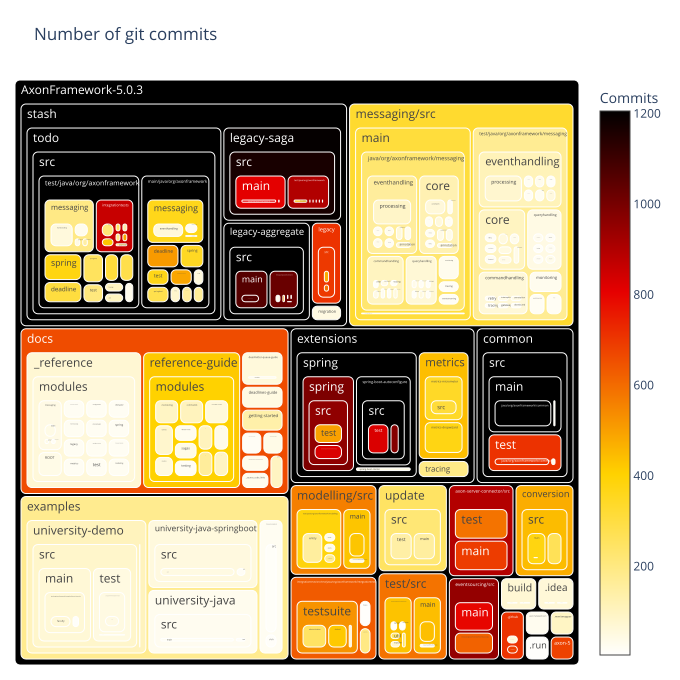
    

### Number of distinct authors per directory

    
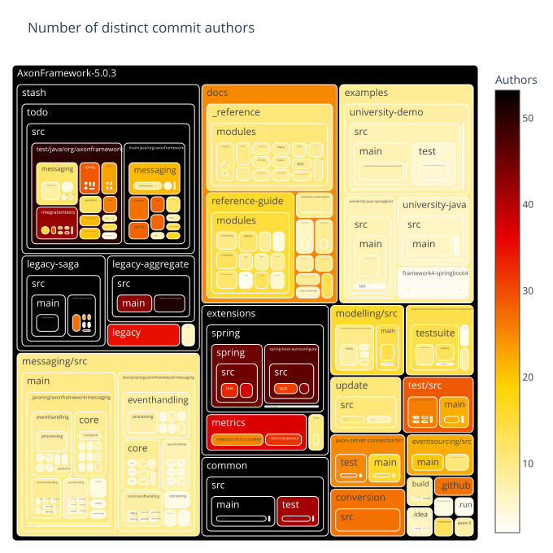
    

### Directories with very few different authors

    
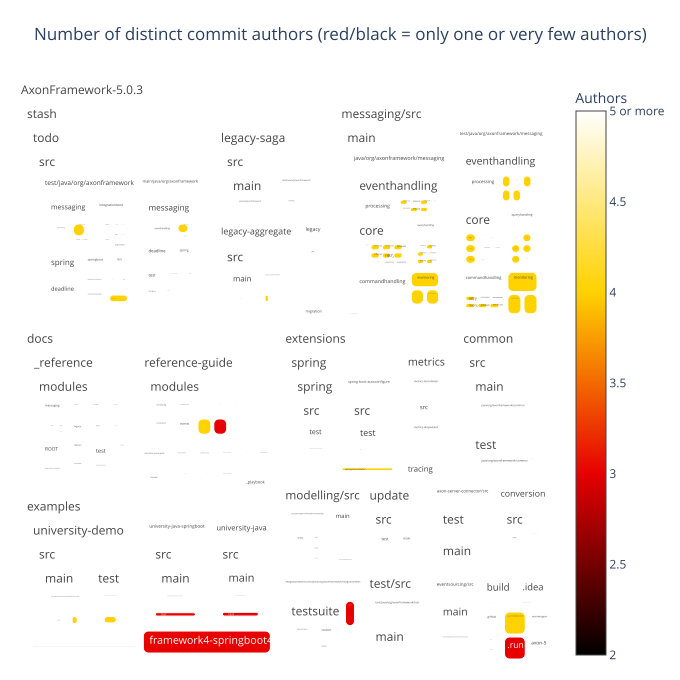
    

### Main author per directory

    
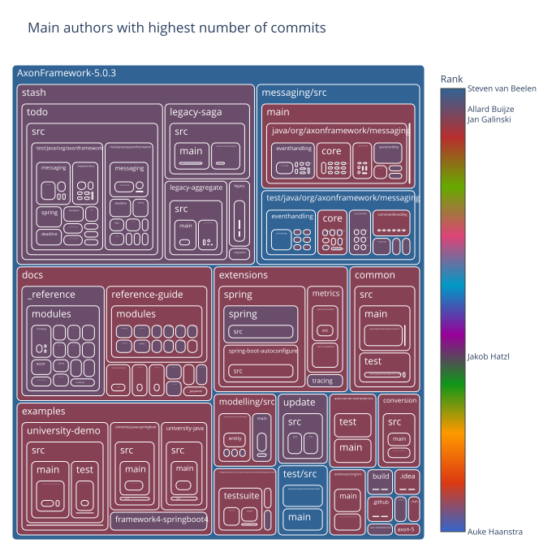
    

### Second author per directory

    
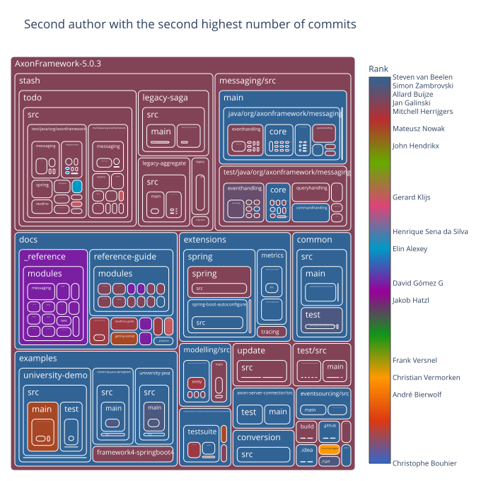
    

### Days since last commit per directory

    
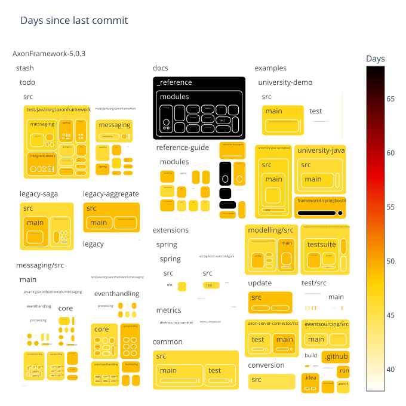
    

### Days since last commit per directory (ranked)

    
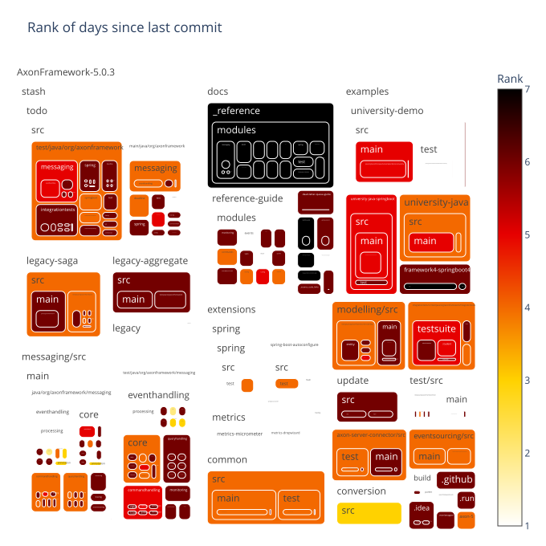
    

### Days since last file creation per directory

    
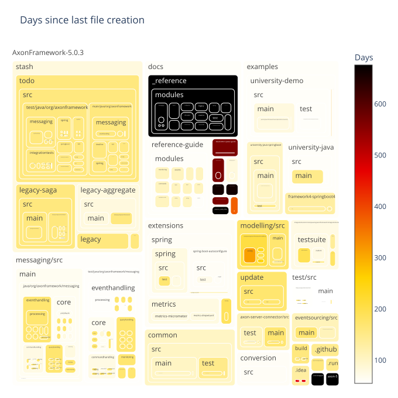
    

### Days since last file creation per directory (ranked)

    
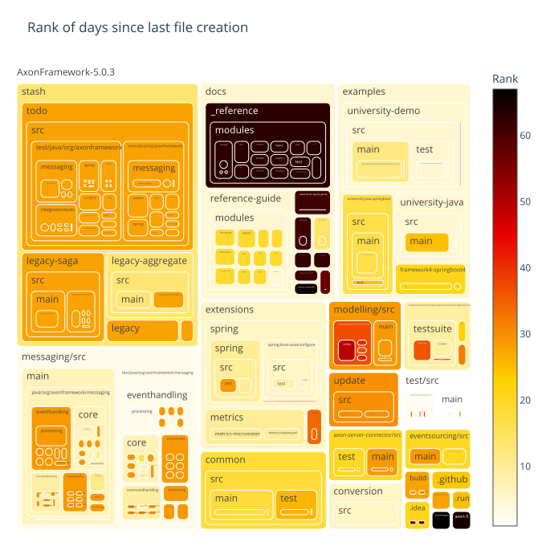
    

### Days since last file modification per directory

    
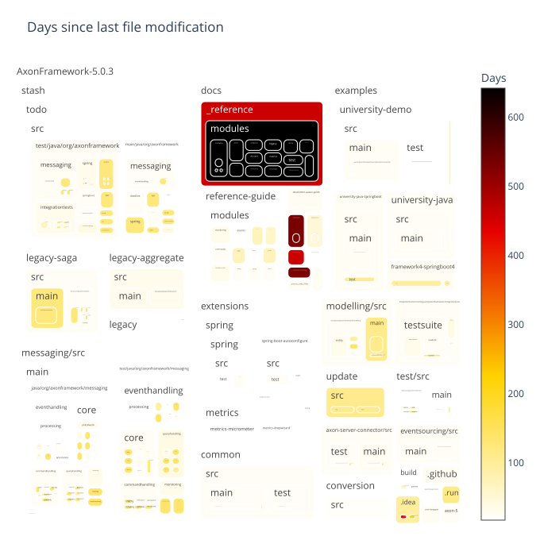
    

### Days since last file modification per directory (ranked)

    
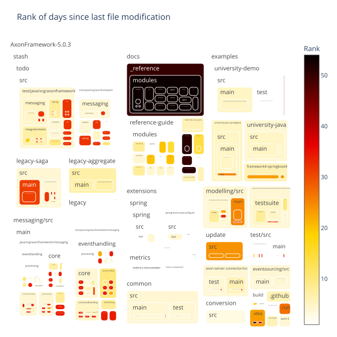
    

## Filecount per commit

Shows how many commits had changed one file, how many had changed two files, and so on.
The chart is limited to 30 lines for improved readability.
The data preview also includes overall statistics including the number of commits that are filtered out in the chart.

### Preview data

    Sum of commits that changed more than 30 files (each) = 1723
    Max changed files with one commit = 4949

<table border="1" class="dataframe">
  <thead>
    <tr style="text-align: right;">
      <th></th>
      <th>filesPerCommit</th>
      <th>commitCount</th>
    </tr>
  </thead>
  <tbody>
    <tr>
      <th>count</th>
      <td>478.000000</td>
      <td>478.000000</td>
    </tr>
    <tr>
      <th>mean</th>
      <td>585.619247</td>
      <td>34.223849</td>
    </tr>
    <tr>
      <th>std</th>
      <td>854.225728</td>
      <td>321.562143</td>
    </tr>
    <tr>
      <th>min</th>
      <td>1.000000</td>
      <td>1.000000</td>
    </tr>
    <tr>
      <th>25%</th>
      <td>120.250000</td>
      <td>1.000000</td>
    </tr>
    <tr>
      <th>50%</th>
      <td>260.500000</td>
      <td>2.000000</td>
    </tr>
    <tr>
      <th>75%</th>
      <td>615.250000</td>
      <td>5.000000</td>
    </tr>
    <tr>
      <th>max</th>
      <td>4949.000000</td>
      <td>6327.000000</td>
    </tr>
  </tbody>
</table>

<table border="1" class="dataframe">
  <thead>
    <tr style="text-align: right;">
      <th></th>
      <th>filesPerCommit</th>
      <th>commitCount</th>
    </tr>
  </thead>
  <tbody>
    <tr>
      <th>0</th>
      <td>1</td>
      <td>6327</td>
    </tr>
    <tr>
      <th>1</th>
      <td>2</td>
      <td>2609</td>
    </tr>
    <tr>
      <th>2</th>
      <td>3</td>
      <td>1214</td>
    </tr>
    <tr>
      <th>3</th>
      <td>4</td>
      <td>799</td>
    </tr>
    <tr>
      <th>4</th>
      <td>5</td>
      <td>552</td>
    </tr>
    <tr>
      <th>5</th>
      <td>6</td>
      <td>401</td>
    </tr>
    <tr>
      <th>6</th>
      <td>7</td>
      <td>323</td>
    </tr>
    <tr>
      <th>7</th>
      <td>8</td>
      <td>264</td>
    </tr>
    <tr>
      <th>8</th>
      <td>9</td>
      <td>195</td>
    </tr>
    <tr>
      <th>9</th>
      <td>10</td>
      <td>180</td>
    </tr>
    <tr>
      <th>10</th>
      <td>11</td>
      <td>149</td>
    </tr>
    <tr>
      <th>11</th>
      <td>12</td>
      <td>130</td>
    </tr>
    <tr>
      <th>12</th>
      <td>13</td>
      <td>148</td>
    </tr>
    <tr>
      <th>13</th>
      <td>14</td>
      <td>166</td>
    </tr>
    <tr>
      <th>14</th>
      <td>15</td>
      <td>207</td>
    </tr>
    <tr>
      <th>15</th>
      <td>16</td>
      <td>96</td>
    </tr>
    <tr>
      <th>16</th>
      <td>17</td>
      <td>88</td>
    </tr>
    <tr>
      <th>17</th>
      <td>18</td>
      <td>85</td>
    </tr>
    <tr>
      <th>18</th>
      <td>19</td>
      <td>104</td>
    </tr>
    <tr>
      <th>19</th>
      <td>20</td>
      <td>84</td>
    </tr>
    <tr>
      <th>20</th>
      <td>21</td>
      <td>59</td>
    </tr>
    <tr>
      <th>21</th>
      <td>22</td>
      <td>84</td>
    </tr>
    <tr>
      <th>22</th>
      <td>23</td>
      <td>50</td>
    </tr>
    <tr>
      <th>23</th>
      <td>24</td>
      <td>53</td>
    </tr>
    <tr>
      <th>24</th>
      <td>25</td>
      <td>62</td>
    </tr>
    <tr>
      <th>25</th>
      <td>26</td>
      <td>46</td>
    </tr>
    <tr>
      <th>26</th>
      <td>27</td>
      <td>48</td>
    </tr>
    <tr>
      <th>27</th>
      <td>28</td>
      <td>37</td>
    </tr>
    <tr>
      <th>28</th>
      <td>29</td>
      <td>42</td>
    </tr>
    <tr>
      <th>29</th>
      <td>30</td>
      <td>34</td>
    </tr>
  </tbody>
</table>

### Bar chart with the number of files per commit distribution

    
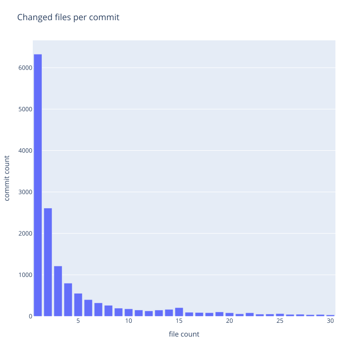
    

## Pairwise Changed Files

This section analyzes files that where changed together within the same commit and provides several metrics to quantify the strength of the co-change relationship:

- **Commit Count**: The number of commits in which two files were changed together.
- **Commit Lift**: A ratio that indicates whether the co-change pattern is stronger than random chance, given how often each file changes.
- **Jaccard Similarity**: The ratio of commits involving either file that also involved both files.

The following tables show the top pairwise changed files based on these metrics.
The following charts show how these metrics are distributed across pairs of files that were changed together.

### Treemap with files changed frequently with others

    
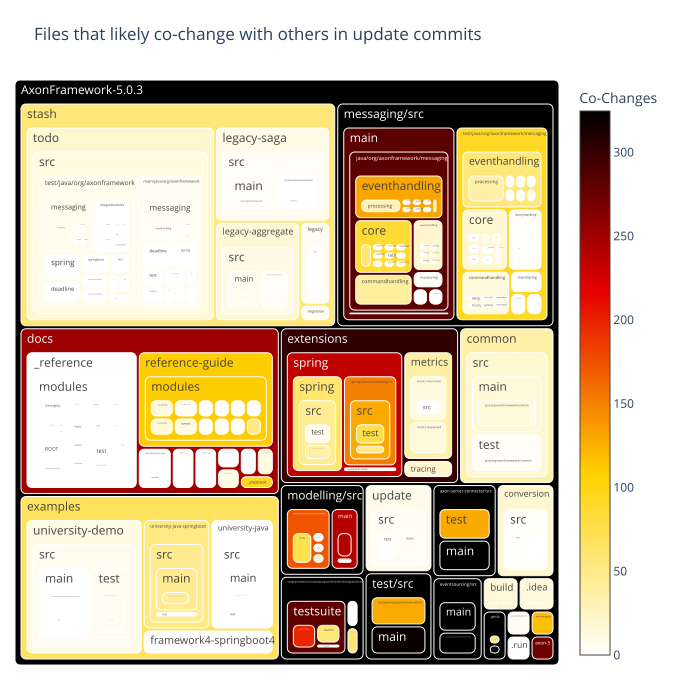
    

    
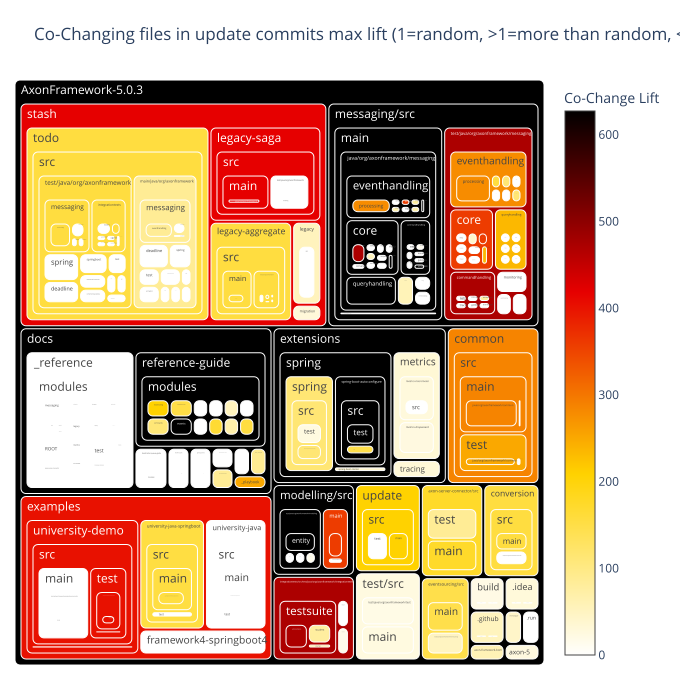
    

    
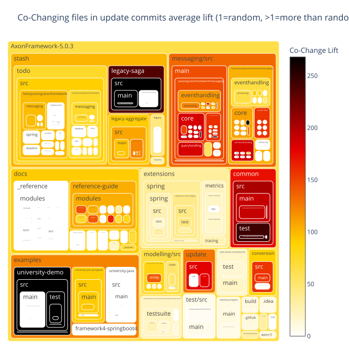
    

<table border="1" class="dataframe">
  <thead>
    <tr style="text-align: right;">
      <th></th>
      <th>fileExtensionPair</th>
      <th>fileExtensionPairCount</th>
    </tr>
  </thead>
  <tbody>
    <tr>
      <th>0</th>
      <td>java↔java</td>
      <td>3005</td>
    </tr>
    <tr>
      <th>1</th>
      <td>xml↔xml</td>
      <td>191</td>
    </tr>
    <tr>
      <th>2</th>
      <td>java↔md</td>
      <td>162</td>
    </tr>
    <tr>
      <th>3</th>
      <td>java↔yml</td>
      <td>117</td>
    </tr>
  </tbody>
</table>

### Files changed together by commit count

<table border="1" class="dataframe">
  <thead>
    <tr style="text-align: right;">
      <th></th>
      <th>fileExtensionPair</th>
      <th>updateCommitCount</th>
      <th>GroupRank</th>
      <th>filePair</th>
      <th>filePairWithRelativePath</th>
    </tr>
  </thead>
  <tbody>
    <tr>
      <th>0</th>
      <td>java↔java</td>
      <td>119</td>
      <td>1</td>
      <td>StorageEngineTestSuite↔AggregateBasedStorageEngineTestSuite</td>
      <td>eventsourcing/src/test/java/org/axonframework/eventsourcing/eventstore/StorageEngineTestSuite.java↔eventsourcing/src/test/java/org/axonframework/eventsourcing/eventstore/AggregateBasedStorageEngineTestSuite.java</td>
    </tr>
    <tr>
      <th>1</th>
      <td>java↔java</td>
      <td>117</td>
      <td>2</td>
      <td>AggregateBasedAxonServerEventStorageEngine↔AggregateBasedJpaEventStorageEngine</td>
      <td>axon-server-connector/src/main/java/org/axonframework/axonserver/connector/event/AggregateBasedAxonServerEventStorageEngine.java↔eventsourcing/src/main/java/org/axonframework/eventsourcing/eventstore/jpa/AggregateBasedJpaEventStorageEngine.java</td>
    </tr>
    <tr>
      <th>2</th>
      <td>java↔java</td>
      <td>116</td>
      <td>3</td>
      <td>AggregateBasedStorageEngineTestSuite↔AggregateBasedJpaEventStorageEngine</td>
      <td>eventsourcing/src/test/java/org/axonframework/eventsourcing/eventstore/AggregateBasedStorageEngineTestSuite.java↔eventsourcing/src/main/java/org/axonframework/eventsourcing/eventstore/jpa/AggregateBasedJpaEventStorageEngine.java</td>
    </tr>
    <tr>
      <th>3</th>
      <td>java↔java</td>
      <td>115</td>
      <td>4</td>
      <td>AggregateBasedStorageEngineTestSuite↔AggregateBasedAxonServerEventStorageEngine</td>
      <td>eventsourcing/src/test/java/org/axonframework/eventsourcing/eventstore/AggregateBasedStorageEngineTestSuite.java↔axon-server-connector/src/main/java/org/axonframework/axonserver/connector/event/AggregateBasedAxonServerEventStorageEngine.java</td>
    </tr>
    <tr>
      <th>4</th>
      <td>java↔java</td>
      <td>90</td>
      <td>5</td>
      <td>StorageEngineTestSuite↔AggregateBasedJpaEventStorageEngine</td>
      <td>eventsourcing/src/test/java/org/axonframework/eventsourcing/eventstore/StorageEngineTestSuite.java↔eventsourcing/src/main/java/org/axonframework/eventsourcing/eventstore/jpa/AggregateBasedJpaEventStorageEngine.java</td>
    </tr>
    <tr>
      <th>5</th>
      <td>java↔java</td>
      <td>88</td>
      <td>6</td>
      <td>StorageEngineTestSuite↔AggregateBasedAxonServerEventStorageEngine</td>
      <td>eventsourcing/src/test/java/org/axonframework/eventsourcing/eventstore/StorageEngineTestSuite.java↔axon-server-connector/src/main/java/org/axonframework/axonserver/connector/event/AggregateBasedAxonServerEventStorageEngine.java</td>
    </tr>
    <tr>
      <th>6</th>
      <td>java↔java</td>
      <td>80</td>
      <td>7</td>
      <td>StorageEngineTestSuite↔DefaultEventStoreTransactionTest</td>
      <td>eventsourcing/src/test/java/org/axonframework/eventsourcing/eventstore/StorageEngineTestSuite.java↔eventsourcing/src/test/java/org/axonframework/eventsourcing/eventstore/DefaultEventStoreTransactionTest.java</td>
    </tr>
    <tr>
      <th>7</th>
      <td>java↔java</td>
      <td>77</td>
      <td>8</td>
      <td>AggregateBasedStorageEngineTestSuite↔DefaultEventStoreTransactionTest</td>
      <td>eventsourcing/src/test/java/org/axonframework/eventsourcing/eventstore/AggregateBasedStorageEngineTestSuite.java↔eventsourcing/src/test/java/org/axonframework/eventsourcing/eventstore/DefaultEventStoreTransactionTest.java</td>
    </tr>
    <tr>
      <th>8</th>
      <td>java↔java</td>
      <td>74</td>
      <td>9</td>
      <td>StorageEngineTestSuite↔DefaultEventStoreTransaction</td>
      <td>eventsourcing/src/test/java/org/axonframework/eventsourcing/eventstore/StorageEngineTestSuite.java↔eventsourcing/src/main/java/org/axonframework/eventsourcing/eventstore/DefaultEventStoreTransaction.java</td>
    </tr>
    <tr>
      <th>9</th>
      <td>java↔java</td>
      <td>69</td>
      <td>10</td>
      <td>DefaultEventStoreTransaction↔AggregateBasedStorageEngineTestSuite</td>
      <td>eventsourcing/src/main/java/org/axonframework/eventsourcing/eventstore/DefaultEventStoreTransaction.java↔eventsourcing/src/test/java/org/axonframework/eventsourcing/eventstore/AggregateBasedStorageEngineTestSuite.java</td>
    </tr>
    <tr>
      <th>10</th>
      <td>xml↔xml</td>
      <td>16</td>
      <td>1</td>
      <td>pom↔pom</td>
      <td>extensions/spring/spring-boot-autoconfigure/pom.xml↔extensions/spring/spring/pom.xml</td>
    </tr>
    <tr>
      <th>11</th>
      <td>xml↔xml</td>
      <td>15</td>
      <td>2</td>
      <td>pom↔pom</td>
      <td>common/pom.xml↔conversion/pom.xml</td>
    </tr>
    <tr>
      <th>12</th>
      <td>xml↔xml</td>
      <td>14</td>
      <td>3</td>
      <td>pom↔pom</td>
      <td>extensions/metrics/metrics-dropwizard/pom.xml↔extensions/metrics/metrics-micrometer/pom.xml</td>
    </tr>
    <tr>
      <th>13</th>
      <td>xml↔xml</td>
      <td>13</td>
      <td>4</td>
      <td>pom↔pom</td>
      <td>conversion/pom.xml↔extensions/spring/spring/pom.xml</td>
    </tr>
    <tr>
      <th>14</th>
      <td>xml↔xml</td>
      <td>12</td>
      <td>5</td>
      <td>pom↔pom</td>
      <td>common/pom.xml↔extensions/spring/spring/pom.xml</td>
    </tr>
    <tr>
      <th>15</th>
      <td>xml↔xml</td>
      <td>11</td>
      <td>6</td>
      <td>pom↔pom</td>
      <td>extensions/spring/pom.xml↔extensions/spring/spring-boot-autoconfigure/pom.xml</td>
    </tr>
    <tr>
      <th>16</th>
      <td>xml↔xml</td>
      <td>10</td>
      <td>7</td>
      <td>pom↔pom</td>
      <td>conversion/pom.xml↔extensions/metrics/metrics-dropwizard/pom.xml</td>
    </tr>
    <tr>
      <th>17</th>
      <td>xml↔xml</td>
      <td>9</td>
      <td>8</td>
      <td>pom↔pom</td>
      <td>common/pom.xml↔extensions/metrics/metrics-dropwizard/pom.xml</td>
    </tr>
    <tr>
      <th>18</th>
      <td>xml↔xml</td>
      <td>8</td>
      <td>9</td>
      <td>pom↔pom</td>
      <td>extensions/metrics/metrics-micrometer/pom.xml↔extensions/metrics/pom.xml</td>
    </tr>
    <tr>
      <th>19</th>
      <td>xml↔xml</td>
      <td>7</td>
      <td>10</td>
      <td>pom↔pom</td>
      <td>build/parent/pom.xml↔common/pom.xml</td>
    </tr>
    <tr>
      <th>20</th>
      <td>java↔md</td>
      <td>92</td>
      <td>1</td>
      <td>AggregateBasedStorageEngineTestSuite↔api-changes</td>
      <td>eventsourcing/src/test/java/org/axonframework/eventsourcing/eventstore/AggregateBasedStorageEngineTestSuite.java↔axon-5/api-changes.md</td>
    </tr>
    <tr>
      <th>21</th>
      <td>java↔md</td>
      <td>91</td>
      <td>2</td>
      <td>AggregateBasedAxonServerEventStorageEngine↔api-changes</td>
      <td>axon-server-connector/src/main/java/org/axonframework/axonserver/connector/event/AggregateBasedAxonServerEventStorageEngine.java↔axon-5/api-changes.md</td>
    </tr>
    <tr>
      <th>22</th>
      <td>java↔md</td>
      <td>82</td>
      <td>3</td>
      <td>AggregateBasedJpaEventStorageEngine↔api-changes</td>
      <td>eventsourcing/src/main/java/org/axonframework/eventsourcing/eventstore/jpa/AggregateBasedJpaEventStorageEngine.java↔axon-5/api-changes.md</td>
    </tr>
    <tr>
      <th>23</th>
      <td>java↔md</td>
      <td>74</td>
      <td>4</td>
      <td>StorageEngineTestSuite↔api-changes</td>
      <td>eventsourcing/src/test/java/org/axonframework/eventsourcing/eventstore/StorageEngineTestSuite.java↔axon-5/api-changes.md</td>
    </tr>
    <tr>
      <th>24</th>
      <td>java↔md</td>
      <td>58</td>
      <td>5</td>
      <td>SimpleEventStoreTest↔api-changes</td>
      <td>eventsourcing/src/test/java/org/axonframework/eventsourcing/eventstore/SimpleEventStoreTest.java↔axon-5/api-changes.md</td>
    </tr>
    <tr>
      <th>25</th>
      <td>java↔md</td>
      <td>54</td>
      <td>6</td>
      <td>DefaultEventStoreTransactionTest↔api-changes</td>
      <td>eventsourcing/src/test/java/org/axonframework/eventsourcing/eventstore/DefaultEventStoreTransactionTest.java↔axon-5/api-changes.md</td>
    </tr>
    <tr>
      <th>26</th>
      <td>java↔md</td>
      <td>48</td>
      <td>7</td>
      <td>QueryThreadingIntegrationTest↔api-changes</td>
      <td>integrationtests/src/test/java/org/axonframework/integrationtests/queryhandling/QueryThreadingIntegrationTest.java↔axon-5/api-changes.md</td>
    </tr>
    <tr>
      <th>27</th>
      <td>java↔md</td>
      <td>42</td>
      <td>8</td>
      <td>DefaultEventStoreTransaction↔api-changes</td>
      <td>eventsourcing/src/main/java/org/axonframework/eventsourcing/eventstore/DefaultEventStoreTransaction.java↔axon-5/api-changes.md</td>
    </tr>
    <tr>
      <th>28</th>
      <td>java↔md</td>
      <td>38</td>
      <td>9</td>
      <td>AxonTestFixtureStatefulCommandHandlerTest↔api-changes</td>
      <td>test/src/test/java/org/axonframework/test/fixture/AxonTestFixtureStatefulCommandHandlerTest.java↔axon-5/api-changes.md</td>
    </tr>
    <tr>
      <th>29</th>
      <td>java↔md</td>
      <td>36</td>
      <td>10</td>
      <td>AxonServerEventStorageEngine↔api-changes</td>
      <td>axon-server-connector/src/main/java/org/axonframework/axonserver/connector/event/AxonServerEventStorageEngine.java↔axon-5/api-changes.md</td>
    </tr>
    <tr>
      <th>30</th>
      <td>java↔yml</td>
      <td>20</td>
      <td>1</td>
      <td>DefaultEventStoreTransaction↔pullrequest</td>
      <td>eventsourcing/src/main/java/org/axonframework/eventsourcing/eventstore/DefaultEventStoreTransaction.java↔.github/workflows/pullrequest.yml</td>
    </tr>
    <tr>
      <th>31</th>
      <td>java↔yml</td>
      <td>19</td>
      <td>2</td>
      <td>StorageEngineTestSuite↔pullrequest</td>
      <td>eventsourcing/src/test/java/org/axonframework/eventsourcing/eventstore/StorageEngineTestSuite.java↔.github/workflows/pullrequest.yml</td>
    </tr>
    <tr>
      <th>32</th>
      <td>java↔yml</td>
      <td>17</td>
      <td>3</td>
      <td>AggregateBasedStorageEngineTestSuite↔pullrequest</td>
      <td>eventsourcing/src/test/java/org/axonframework/eventsourcing/eventstore/AggregateBasedStorageEngineTestSuite.java↔.github/workflows/pullrequest.yml</td>
    </tr>
    <tr>
      <th>33</th>
      <td>java↔yml</td>
      <td>16</td>
      <td>4</td>
      <td>AggregateBasedStorageEngineTestSuite↔main</td>
      <td>eventsourcing/src/test/java/org/axonframework/eventsourcing/eventstore/AggregateBasedStorageEngineTestSuite.java↔.github/workflows/main.yml</td>
    </tr>
    <tr>
      <th>34</th>
      <td>java↔yml</td>
      <td>15</td>
      <td>5</td>
      <td>StorageEngineTestSuite↔main</td>
      <td>eventsourcing/src/test/java/org/axonframework/eventsourcing/eventstore/StorageEngineTestSuite.java↔.github/workflows/main.yml</td>
    </tr>
    <tr>
      <th>35</th>
      <td>java↔yml</td>
      <td>14</td>
      <td>6</td>
      <td>DefaultEventStoreTransaction↔main</td>
      <td>eventsourcing/src/main/java/org/axonframework/eventsourcing/eventstore/DefaultEventStoreTransaction.java↔.github/workflows/main.yml</td>
    </tr>
    <tr>
      <th>36</th>
      <td>java↔yml</td>
      <td>12</td>
      <td>7</td>
      <td>NoAppendConditionTest↔pullrequest</td>
      <td>eventsourcing/src/test/java/org/axonframework/eventsourcing/eventstore/NoAppendConditionTest.java↔.github/workflows/pullrequest.yml</td>
    </tr>
    <tr>
      <th>37</th>
      <td>java↔yml</td>
      <td>11</td>
      <td>8</td>
      <td>AppendCondition↔pullrequest</td>
      <td>eventsourcing/src/main/java/org/axonframework/eventsourcing/eventstore/AppendCondition.java↔.github/workflows/pullrequest.yml</td>
    </tr>
    <tr>
      <th>38</th>
      <td>java↔yml</td>
      <td>10</td>
      <td>9</td>
      <td>NoAppendCondition↔main</td>
      <td>eventsourcing/src/main/java/org/axonframework/eventsourcing/eventstore/NoAppendCondition.java↔.github/workflows/main.yml</td>
    </tr>
    <tr>
      <th>39</th>
      <td>java↔yml</td>
      <td>9</td>
      <td>10</td>
      <td>SimpleEventStoreTest↔main</td>
      <td>eventsourcing/src/test/java/org/axonframework/eventsourcing/eventstore/SimpleEventStoreTest.java↔.github/workflows/main.yml</td>
    </tr>
  </tbody>
</table>

    
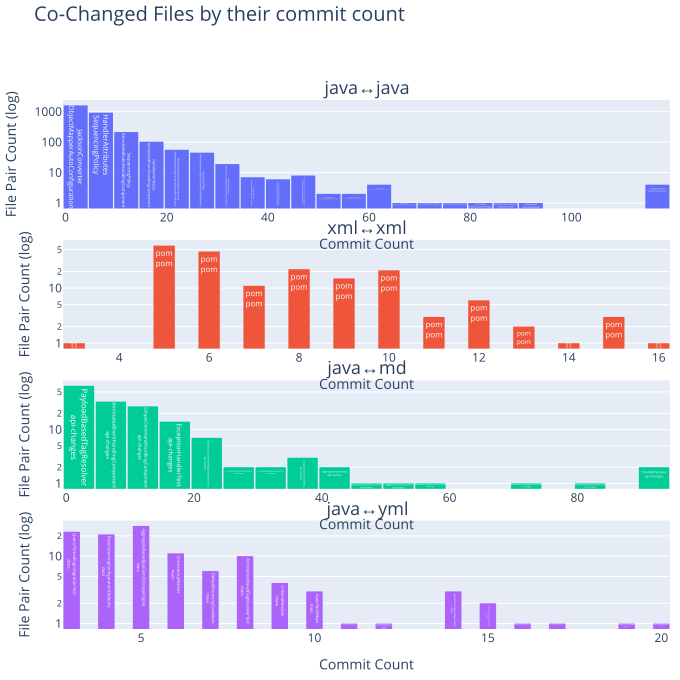
    

### Files changed together by commit min confidence

The commit min confidence is the commit count where both files were changed divided by the commit count of the file with the least commits.
This metric is useful to identify pairs of files that are frequently changed together and is not biased by single files that are changed very often.

<table border="1" class="dataframe">
  <thead>
    <tr style="text-align: right;">
      <th></th>
      <th>fileExtensionPair</th>
      <th>updateCommitMinConfidence</th>
      <th>GroupRank</th>
      <th>filePair</th>
      <th>filePairWithRelativePath</th>
    </tr>
  </thead>
  <tbody>
    <tr>
      <th>0</th>
      <td>java↔java</td>
      <td>1.000000</td>
      <td>1</td>
      <td>EventAppender↔EventPublishingUtils</td>
      <td>messaging/src/main/java/org/axonframework/messaging/eventhandling/gateway/EventAppender.java↔messaging/src/main/java/org/axonframework/messaging/eventhandling/gateway/EventPublishingUtils.java</td>
    </tr>
    <tr>
      <th>1</th>
      <td>java↔java</td>
      <td>0.900000</td>
      <td>2</td>
      <td>ChildEntityFieldDefinition↔GetterSetterChildEntityFieldDefinition</td>
      <td>modelling/src/main/java/org/axonframework/modelling/entity/child/ChildEntityFieldDefinition.java↔modelling/src/main/java/org/axonframework/modelling/entity/child/GetterSetterChildEntityFieldDefinition.java</td>
    </tr>
    <tr>
      <th>2</th>
      <td>java↔java</td>
      <td>0.875000</td>
      <td>3</td>
      <td>ChildEntityFieldDefinition↔FieldChildEntityFieldDefinition</td>
      <td>modelling/src/main/java/org/axonframework/modelling/entity/child/ChildEntityFieldDefinition.java↔modelling/src/main/java/org/axonframework/modelling/entity/child/FieldChildEntityFieldDefinition.java</td>
    </tr>
    <tr>
      <th>3</th>
      <td>java↔java</td>
      <td>0.833333</td>
      <td>4</td>
      <td>AnnotatedHandlerInspector↔AnnotationEventHandlerAdapter</td>
      <td>messaging/src/main/java/org/axonframework/messaging/core/annotation/AnnotatedHandlerInspector.java↔stash/todo/src/main/java/org/axonframework/messaging/eventhandling/annotation/AnnotationEventHandlerAdapter.java</td>
    </tr>
    <tr>
      <th>4</th>
      <td>java↔java</td>
      <td>0.800000</td>
      <td>5</td>
      <td>CreateCourseAxonFixtureTest↔CreateCourseAxonFixtureTest</td>
      <td>examples/university-demo/src/test/java/org/axonframework/examples/demo/university/faculty/write/createcourse/CreateCourseAxonFixtureTest.java↔examples/university-demo/src/test/java/org/axonframework/examples/demo/university/faculty/write/createcourseplain/CreateCourseAxonFixtureTest.java</td>
    </tr>
    <tr>
      <th>5</th>
      <td>java↔java</td>
      <td>0.750000</td>
      <td>6</td>
      <td>FacultyAxonTestFixture↔CreateCourseAxonFixtureTest</td>
      <td>examples/university-demo/src/test/java/org/axonframework/examples/demo/university/faculty/FacultyAxonTestFixture.java↔examples/university-demo/src/test/java/org/axonframework/examples/demo/university/faculty/write/createcourse/CreateCourseAxonFixtureTest.java</td>
    </tr>
    <tr>
      <th>6</th>
      <td>java↔java</td>
      <td>0.727273</td>
      <td>7</td>
      <td>SimpleCommandBus↔TransactionalUnitOfWorkFactory</td>
      <td>messaging/src/main/java/org/axonframework/messaging/commandhandling/SimpleCommandBus.java↔messaging/src/main/java/org/axonframework/messaging/core/unitofwork/TransactionalUnitOfWorkFactory.java</td>
    </tr>
    <tr>
      <th>7</th>
      <td>java↔java</td>
      <td>0.714286</td>
      <td>8</td>
      <td>DefaultAxonApplication↔FutureUtils</td>
      <td>common/src/main/java/org/axonframework/common/configuration/DefaultAxonApplication.java↔common/src/main/java/org/axonframework/common/FutureUtils.java</td>
    </tr>
    <tr>
      <th>8</th>
      <td>java↔java</td>
      <td>0.700000</td>
      <td>9</td>
      <td>NoTransactionManager↔TransactionManager</td>
      <td>messaging/src/main/java/org/axonframework/messaging/core/unitofwork/transaction/NoTransactionManager.java↔messaging/src/main/java/org/axonframework/messaging/core/unitofwork/transaction/TransactionManager.java</td>
    </tr>
    <tr>
      <th>9</th>
      <td>java↔java</td>
      <td>0.675000</td>
      <td>10</td>
      <td>AggregateBasedConsistencyMarker↔AggregateBasedStorageEngineTestSuite</td>
      <td>eventsourcing/src/main/java/org/axonframework/eventsourcing/eventstore/AggregateBasedConsistencyMarker.java↔eventsourcing/src/test/java/org/axonframework/eventsourcing/eventstore/AggregateBasedStorageEngineTestSuite.java</td>
    </tr>
    <tr>
      <th>10</th>
      <td>xml↔xml</td>
      <td>0.517241</td>
      <td>1</td>
      <td>pom↔pom</td>
      <td>common/pom.xml↔update/pom.xml</td>
    </tr>
    <tr>
      <th>11</th>
      <td>xml↔xml</td>
      <td>0.500000</td>
      <td>2</td>
      <td>pom↔pom</td>
      <td>common/pom.xml↔conversion/pom.xml</td>
    </tr>
    <tr>
      <th>12</th>
      <td>xml↔xml</td>
      <td>0.450000</td>
      <td>3</td>
      <td>pom↔pom</td>
      <td>build/parent/pom.xml↔stash/migration/pom.xml</td>
    </tr>
    <tr>
      <th>13</th>
      <td>xml↔xml</td>
      <td>0.428571</td>
      <td>4</td>
      <td>pom↔pom</td>
      <td>extensions/tracing/tracing-opentelemetry/pom.xml↔stash/legacy-aggregate/pom.xml</td>
    </tr>
    <tr>
      <th>14</th>
      <td>xml↔xml</td>
      <td>0.413793</td>
      <td>5</td>
      <td>pom↔pom</td>
      <td>extensions/spring/spring/pom.xml↔update/pom.xml</td>
    </tr>
    <tr>
      <th>15</th>
      <td>xml↔xml</td>
      <td>0.400000</td>
      <td>6</td>
      <td>pom↔pom</td>
      <td>common/pom.xml↔extensions/spring/spring/pom.xml</td>
    </tr>
    <tr>
      <th>16</th>
      <td>xml↔xml</td>
      <td>0.392857</td>
      <td>7</td>
      <td>pom↔pom</td>
      <td>extensions/spring/spring-boot-autoconfigure/pom.xml↔extensions/spring/spring-boot-starter/pom.xml</td>
    </tr>
    <tr>
      <th>17</th>
      <td>xml↔xml</td>
      <td>0.378378</td>
      <td>8</td>
      <td>pom↔pom</td>
      <td>extensions/metrics/metrics-dropwizard/pom.xml↔extensions/metrics/metrics-micrometer/pom.xml</td>
    </tr>
    <tr>
      <th>18</th>
      <td>xml↔xml</td>
      <td>0.371429</td>
      <td>9</td>
      <td>pom↔pom</td>
      <td>extensions/spring/spring/pom.xml↔extensions/tracing/tracing-opentelemetry/pom.xml</td>
    </tr>
    <tr>
      <th>19</th>
      <td>xml↔xml</td>
      <td>0.370370</td>
      <td>10</td>
      <td>pom↔pom</td>
      <td>extensions/pom.xml↔extensions/spring/pom.xml</td>
    </tr>
    <tr>
      <th>20</th>
      <td>java↔md</td>
      <td>1.000000</td>
      <td>1</td>
      <td>AnnotationSagaMetaModelFactory↔api-changes</td>
      <td>stash/legacy-saga/src/main/java/org/axonframework/modelling/saga/metamodel/AnnotationSagaMetaModelFactory.java↔axon-5/api-changes.md</td>
    </tr>
    <tr>
      <th>21</th>
      <td>java↔md</td>
      <td>0.750000</td>
      <td>2</td>
      <td>ImmutableReflectionEntityModelAdministrationIT↔api-changes</td>
      <td>integrationtests/src/test/java/org/axonframework/integrationtests/testsuite/administration/ImmutableReflectionEntityModelAdministrationIT.java↔axon-5/api-changes.md</td>
    </tr>
    <tr>
      <th>22</th>
      <td>java↔md</td>
      <td>0.666667</td>
      <td>3</td>
      <td>HandlerComparator↔api-changes</td>
      <td>messaging/src/main/java/org/axonframework/messaging/core/annotation/HandlerComparator.java↔axon-5/api-changes.md</td>
    </tr>
    <tr>
      <th>23</th>
      <td>java↔md</td>
      <td>0.600000</td>
      <td>4</td>
      <td>CommandConverter↔modularity</td>
      <td>axon-server-connector/src/main/java/org/axonframework/axonserver/connector/command/CommandConverter.java↔axon-5/modularity.md</td>
    </tr>
    <tr>
      <th>24</th>
      <td>java↔md</td>
      <td>0.571429</td>
      <td>5</td>
      <td>AnnotationBasedEntityEvolvingComponent↔api-changes</td>
      <td>modelling/src/main/java/org/axonframework/modelling/annotation/AnnotationBasedEntityEvolvingComponent.java↔axon-5/api-changes.md</td>
    </tr>
    <tr>
      <th>25</th>
      <td>java↔md</td>
      <td>0.500000</td>
      <td>6</td>
      <td>SimpleCommandHandlingComponentTest↔api-changes</td>
      <td>messaging/src/test/java/org/axonframework/messaging/commandhandling/SimpleCommandHandlingComponentTest.java↔axon-5/api-changes.md</td>
    </tr>
    <tr>
      <th>26</th>
      <td>java↔md</td>
      <td>0.471503</td>
      <td>7</td>
      <td>AggregateBasedAxonServerEventStorageEngine↔api-changes</td>
      <td>axon-server-connector/src/main/java/org/axonframework/axonserver/connector/event/AggregateBasedAxonServerEventStorageEngine.java↔axon-5/api-changes.md</td>
    </tr>
    <tr>
      <th>27</th>
      <td>java↔md</td>
      <td>0.470588</td>
      <td>8</td>
      <td>ChildAmbiguityException↔api-changes</td>
      <td>modelling/src/main/java/org/axonframework/modelling/entity/child/ChildAmbiguityException.java↔axon-5/api-changes.md</td>
    </tr>
    <tr>
      <th>28</th>
      <td>java↔md</td>
      <td>0.434783</td>
      <td>9</td>
      <td>Repository↔api-changes</td>
      <td>modelling/src/main/java/org/axonframework/modelling/repository/Repository.java↔axon-5/api-changes.md</td>
    </tr>
    <tr>
      <th>29</th>
      <td>java↔md</td>
      <td>0.386792</td>
      <td>10</td>
      <td>AggregateBasedJpaEventStorageEngine↔api-changes</td>
      <td>eventsourcing/src/main/java/org/axonframework/eventsourcing/eventstore/jpa/AggregateBasedJpaEventStorageEngine.java↔axon-5/api-changes.md</td>
    </tr>
    <tr>
      <th>30</th>
      <td>java↔yml</td>
      <td>0.600000</td>
      <td>1</td>
      <td>SpringUtils↔slack-release-notification</td>
      <td>extensions/spring/spring/src/main/java/org/axonframework/extension/spring/SpringUtils.java↔.github/workflows/slack-release-notification.yml</td>
    </tr>
    <tr>
      <th>31</th>
      <td>java↔yml</td>
      <td>0.555556</td>
      <td>2</td>
      <td>ChangeCourseCapacityController↔application</td>
      <td>examples/university-java-springboot/src/main/java/org/axonframework/examples/university/write/changecoursecapacity/ChangeCourseCapacityController.java↔examples/university-java-springboot/src/main/resources/application.yml</td>
    </tr>
    <tr>
      <th>32</th>
      <td>java↔yml</td>
      <td>0.500000</td>
      <td>3</td>
      <td>EnrollStudentInFacultyController↔application</td>
      <td>examples/university-java-springboot/src/main/java/org/axonframework/examples/university/write/enrollstudent/EnrollStudentInFacultyController.java↔examples/university-java-springboot/src/main/resources/application.yml</td>
    </tr>
    <tr>
      <th>33</th>
      <td>java↔yml</td>
      <td>0.428571</td>
      <td>4</td>
      <td>EventProcessingAutoConfiguration↔test-docker-compose</td>
      <td>extensions/spring/spring-boot-autoconfigure/src/main/java/org/axonframework/extension/springboot/autoconfig/EventProcessingAutoConfiguration.java↔extensions/spring/spring-boot-autoconfigure/test-docker-compose.yml</td>
    </tr>
    <tr>
      <th>34</th>
      <td>java↔yml</td>
      <td>0.333333</td>
      <td>5</td>
      <td>UpdateCheckerProperties↔application</td>
      <td>extensions/spring/spring-boot-autoconfigure/src/main/java/org/axonframework/extension/springboot/UpdateCheckerProperties.java↔examples/university-java-springboot/src/main/resources/application.yml</td>
    </tr>
    <tr>
      <th>35</th>
      <td>java↔yml</td>
      <td>0.222222</td>
      <td>6</td>
      <td>NoAppendCondition↔pullrequest</td>
      <td>eventsourcing/src/main/java/org/axonframework/eventsourcing/eventstore/NoAppendCondition.java↔.github/workflows/pullrequest.yml</td>
    </tr>
    <tr>
      <th>36</th>
      <td>java↔yml</td>
      <td>0.214286</td>
      <td>7</td>
      <td>GrpcMessageSizeInterceptor↔main</td>
      <td>axon-server-connector/src/main/java/org/axonframework/axonserver/connector/util/GrpcMessageSizeInterceptor.java↔.github/workflows/main.yml</td>
    </tr>
    <tr>
      <th>37</th>
      <td>java↔yml</td>
      <td>0.203390</td>
      <td>8</td>
      <td>NoAppendConditionTest↔pullrequest</td>
      <td>eventsourcing/src/test/java/org/axonframework/eventsourcing/eventstore/NoAppendConditionTest.java↔.github/workflows/pullrequest.yml</td>
    </tr>
    <tr>
      <th>38</th>
      <td>java↔yml</td>
      <td>0.200000</td>
      <td>9</td>
      <td>TopologyChange↔main</td>
      <td>axon-server-connector/src/main/java/org/axonframework/axonserver/connector/TopologyChange.java↔.github/workflows/main.yml</td>
    </tr>
    <tr>
      <th>39</th>
      <td>java↔yml</td>
      <td>0.193548</td>
      <td>10</td>
      <td>DefaultEventStoreTransaction↔add-to-project</td>
      <td>eventsourcing/src/main/java/org/axonframework/eventsourcing/eventstore/DefaultEventStoreTransaction.java↔.github/workflows/add-to-project.yml</td>
    </tr>
  </tbody>
</table>

    
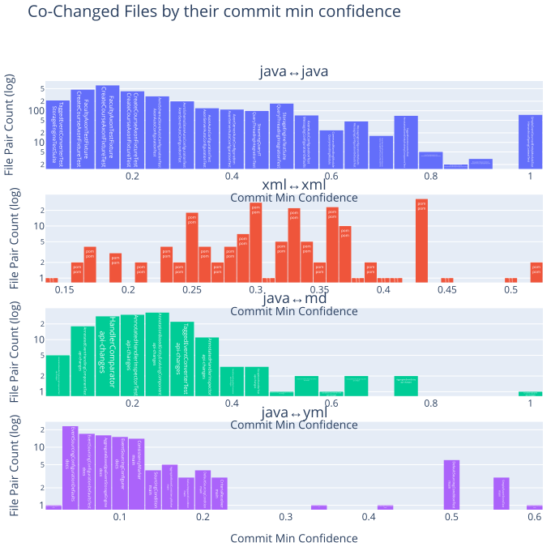
    

### Files changed together by commit lift

<table border="1" class="dataframe">
  <thead>
    <tr style="text-align: right;">
      <th></th>
      <th>fileExtensionPair</th>
      <th>updateCommitLift</th>
      <th>GroupRank</th>
      <th>filePair</th>
      <th>filePairWithRelativePath</th>
    </tr>
  </thead>
  <tbody>
    <tr>
      <th>0</th>
      <td>java↔java</td>
      <td>836.333333</td>
      <td>1</td>
      <td>HandlerAttributes↔SequencingPolicy</td>
      <td>messaging/src/main/java/org/axonframework/messaging/core/annotation/HandlerAttributes.java↔messaging/src/main/java/org/axonframework/messaging/core/annotation/SequencingPolicy.java</td>
    </tr>
    <tr>
      <th>1</th>
      <td>java↔java</td>
      <td>627.250000</td>
      <td>2</td>
      <td>Command↔AnnotationMessageTypeResolver</td>
      <td>messaging/src/main/java/org/axonframework/messaging/commandhandling/annotation/Command.java↔messaging/src/main/java/org/axonframework/messaging/core/annotation/AnnotationMessageTypeResolver.java</td>
    </tr>
    <tr>
      <th>2</th>
      <td>java↔java</td>
      <td>470.437500</td>
      <td>3</td>
      <td>ImmutableReflectionEntityModelAdministrationIT↔MutableReflectionEntityModelAdministrationIT</td>
      <td>integrationtests/src/test/java/org/axonframework/integrationtests/testsuite/administration/ImmutableReflectionEntityModelAdministrationIT.java↔integrationtests/src/test/java/org/axonframework/integrationtests/testsuite/administration/MutableReflectionEntityModelAdministrationIT.java</td>
    </tr>
    <tr>
      <th>3</th>
      <td>java↔java</td>
      <td>418.166667</td>
      <td>4</td>
      <td>HandlerComparator↔AnnotationSagaMetaModelFactory</td>
      <td>messaging/src/main/java/org/axonframework/messaging/core/annotation/HandlerComparator.java↔stash/legacy-saga/src/main/java/org/axonframework/modelling/saga/metamodel/AnnotationSagaMetaModelFactory.java</td>
    </tr>
    <tr>
      <th>4</th>
      <td>java↔java</td>
      <td>401.440000</td>
      <td>5</td>
      <td>CreateCourseAxonFixtureTest↔CreateCourseAxonFixtureTest</td>
      <td>examples/university-demo/src/test/java/org/axonframework/examples/demo/university/faculty/write/createcourse/CreateCourseAxonFixtureTest.java↔examples/university-demo/src/test/java/org/axonframework/examples/demo/university/faculty/write/createcourseplain/CreateCourseAxonFixtureTest.java</td>
    </tr>
    <tr>
      <th>5</th>
      <td>java↔java</td>
      <td>376.350000</td>
      <td>6</td>
      <td>FacultyAxonTestFixture↔CreateCourseAxonFixtureTest</td>
      <td>examples/university-demo/src/test/java/org/axonframework/examples/demo/university/faculty/FacultyAxonTestFixture.java↔examples/university-demo/src/test/java/org/axonframework/examples/demo/university/faculty/write/createcourse/CreateCourseAxonFixtureTest.java</td>
    </tr>
    <tr>
      <th>6</th>
      <td>java↔java</td>
      <td>358.428571</td>
      <td>7</td>
      <td>EventPublishingUtils↔ProcessingContextEventAppender</td>
      <td>messaging/src/main/java/org/axonframework/messaging/eventhandling/gateway/EventPublishingUtils.java↔messaging/src/main/java/org/axonframework/messaging/eventhandling/gateway/ProcessingContextEventAppender.java</td>
    </tr>
    <tr>
      <th>7</th>
      <td>java↔java</td>
      <td>313.625000</td>
      <td>8</td>
      <td>EventAppender↔EventPublishingUtils</td>
      <td>messaging/src/main/java/org/axonframework/messaging/eventhandling/gateway/EventAppender.java↔messaging/src/main/java/org/axonframework/messaging/eventhandling/gateway/EventPublishingUtils.java</td>
    </tr>
    <tr>
      <th>8</th>
      <td>java↔java</td>
      <td>286.742857</td>
      <td>9</td>
      <td>DefaultComponentRegistry↔ComponentsTest</td>
      <td>common/src/main/java/org/axonframework/common/configuration/DefaultComponentRegistry.java↔common/src/test/java/org/axonframework/common/configuration/ComponentsTest.java</td>
    </tr>
    <tr>
      <th>9</th>
      <td>java↔java</td>
      <td>278.777778</td>
      <td>10</td>
      <td>MergeTask↔SplitTask</td>
      <td>messaging/src/main/java/org/axonframework/messaging/eventhandling/processing/streaming/pooled/MergeTask.java↔messaging/src/main/java/org/axonframework/messaging/eventhandling/processing/streaming/pooled/SplitTask.java</td>
    </tr>
    <tr>
      <th>10</th>
      <td>xml↔xml</td>
      <td>76.806122</td>
      <td>1</td>
      <td>pom↔pom</td>
      <td>stash/legacy-aggregate/pom.xml↔stash/legacy-saga/pom.xml</td>
    </tr>
    <tr>
      <th>11</th>
      <td>xml↔xml</td>
      <td>59.738095</td>
      <td>2</td>
      <td>pom↔pom</td>
      <td>axon-framework-bom/pom.xml↔stash/legacy-aggregate/pom.xml</td>
    </tr>
    <tr>
      <th>12</th>
      <td>xml↔xml</td>
      <td>53.764286</td>
      <td>3</td>
      <td>pom↔pom</td>
      <td>stash/legacy-saga/pom.xml↔stash/todo/pom.xml</td>
    </tr>
    <tr>
      <th>13</th>
      <td>xml↔xml</td>
      <td>44.803571</td>
      <td>4</td>
      <td>pom↔pom</td>
      <td>stash/legacy-saga/pom.xml↔stash/migration/pom.xml</td>
    </tr>
    <tr>
      <th>14</th>
      <td>xml↔xml</td>
      <td>43.258621</td>
      <td>5</td>
      <td>pom↔pom</td>
      <td>common/pom.xml↔update/pom.xml</td>
    </tr>
    <tr>
      <th>15</th>
      <td>xml↔xml</td>
      <td>41.816667</td>
      <td>6</td>
      <td>pom↔pom</td>
      <td>axon-framework-bom/pom.xml↔stash/migration/pom.xml</td>
    </tr>
    <tr>
      <th>16</th>
      <td>xml↔xml</td>
      <td>38.403061</td>
      <td>7</td>
      <td>pom↔pom</td>
      <td>extensions/spring/spring-boot-starter/pom.xml↔stash/legacy-aggregate/pom.xml</td>
    </tr>
    <tr>
      <th>17</th>
      <td>xml↔xml</td>
      <td>37.078818</td>
      <td>8</td>
      <td>pom↔pom</td>
      <td>stash/legacy-saga/pom.xml↔update/pom.xml</td>
    </tr>
    <tr>
      <th>18</th>
      <td>xml↔xml</td>
      <td>36.048851</td>
      <td>9</td>
      <td>pom↔pom</td>
      <td>conversion/pom.xml↔update/pom.xml</td>
    </tr>
    <tr>
      <th>19</th>
      <td>xml↔xml</td>
      <td>35.842857</td>
      <td>10</td>
      <td>pom↔pom</td>
      <td>examples/pom.xml↔examples/university-java-springboot/pom.xml</td>
    </tr>
    <tr>
      <th>20</th>
      <td>java↔md</td>
      <td>25.955172</td>
      <td>1</td>
      <td>CommandConverter↔modularity</td>
      <td>axon-server-connector/src/main/java/org/axonframework/axonserver/connector/command/CommandConverter.java↔axon-5/modularity.md</td>
    </tr>
    <tr>
      <th>21</th>
      <td>java↔md</td>
      <td>8.177966</td>
      <td>2</td>
      <td>NoAppendConditionTest↔design-principles</td>
      <td>eventsourcing/src/test/java/org/axonframework/eventsourcing/eventstore/NoAppendConditionTest.java↔axon-5/design-principles.md</td>
    </tr>
    <tr>
      <th>22</th>
      <td>java↔md</td>
      <td>7.658730</td>
      <td>3</td>
      <td>NoAppendCondition↔design-principles</td>
      <td>eventsourcing/src/main/java/org/axonframework/eventsourcing/eventstore/NoAppendCondition.java↔axon-5/design-principles.md</td>
    </tr>
    <tr>
      <th>23</th>
      <td>java↔md</td>
      <td>7.148148</td>
      <td>4</td>
      <td>DefaultAppendConditionTest↔design-principles</td>
      <td>eventsourcing/src/test/java/org/axonframework/eventsourcing/eventstore/DefaultAppendConditionTest.java↔axon-5/design-principles.md</td>
    </tr>
    <tr>
      <th>24</th>
      <td>java↔md</td>
      <td>6.433333</td>
      <td>5</td>
      <td>AppendCondition↔design-principles</td>
      <td>eventsourcing/src/main/java/org/axonframework/eventsourcing/eventstore/AppendCondition.java↔axon-5/design-principles.md</td>
    </tr>
    <tr>
      <th>25</th>
      <td>java↔md</td>
      <td>6.174273</td>
      <td>6</td>
      <td>QueryThreadingIntegrationTest↔README</td>
      <td>integrationtests/src/test/java/org/axonframework/integrationtests/queryhandling/QueryThreadingIntegrationTest.java↔docs/README.md</td>
    </tr>
    <tr>
      <th>26</th>
      <td>java↔md</td>
      <td>5.462264</td>
      <td>7</td>
      <td>AxonServerMessageStream↔design-principles</td>
      <td>axon-server-connector/src/main/java/org/axonframework/axonserver/connector/event/AxonServerMessageStream.java↔axon-5/design-principles.md</td>
    </tr>
    <tr>
      <th>27</th>
      <td>java↔md</td>
      <td>4.453846</td>
      <td>8</td>
      <td>DefaultSourcingConditionTest↔design-principles</td>
      <td>eventsourcing/src/test/java/org/axonframework/eventsourcing/eventstore/DefaultSourcingConditionTest.java↔axon-5/design-principles.md</td>
    </tr>
    <tr>
      <th>28</th>
      <td>java↔md</td>
      <td>4.386364</td>
      <td>9</td>
      <td>SourcingConditionTest↔design-principles</td>
      <td>eventsourcing/src/test/java/org/axonframework/eventsourcing/eventstore/SourcingConditionTest.java↔axon-5/design-principles.md</td>
    </tr>
    <tr>
      <th>29</th>
      <td>java↔md</td>
      <td>4.147107</td>
      <td>10</td>
      <td>AnnotationSagaMetaModelFactory↔api-changes</td>
      <td>stash/legacy-saga/src/main/java/org/axonframework/modelling/saga/metamodel/AnnotationSagaMetaModelFactory.java↔axon-5/api-changes.md</td>
    </tr>
    <tr>
      <th>30</th>
      <td>java↔yml</td>
      <td>139.388889</td>
      <td>1</td>
      <td>ChangeCourseCapacityController↔application</td>
      <td>examples/university-java-springboot/src/main/java/org/axonframework/examples/university/write/changecoursecapacity/ChangeCourseCapacityController.java↔examples/university-java-springboot/src/main/resources/application.yml</td>
    </tr>
    <tr>
      <th>31</th>
      <td>java↔yml</td>
      <td>125.450000</td>
      <td>2</td>
      <td>EnrollStudentInFacultyController↔application</td>
      <td>examples/university-java-springboot/src/main/java/org/axonframework/examples/university/write/enrollstudent/EnrollStudentInFacultyController.java↔examples/university-java-springboot/src/main/resources/application.yml</td>
    </tr>
    <tr>
      <th>32</th>
      <td>java↔yml</td>
      <td>83.633333</td>
      <td>3</td>
      <td>UpdateCheckerProperties↔application</td>
      <td>extensions/spring/spring-boot-autoconfigure/src/main/java/org/axonframework/extension/springboot/UpdateCheckerProperties.java↔examples/university-java-springboot/src/main/resources/application.yml</td>
    </tr>
    <tr>
      <th>33</th>
      <td>java↔yml</td>
      <td>73.794118</td>
      <td>4</td>
      <td>UpdateCheckerAutoConfiguration↔application</td>
      <td>extensions/spring/spring-boot-autoconfigure/src/main/java/org/axonframework/extension/springboot/autoconfig/UpdateCheckerAutoConfiguration.java↔examples/university-java-springboot/src/main/resources/application.yml</td>
    </tr>
    <tr>
      <th>34</th>
      <td>java↔yml</td>
      <td>40.467742</td>
      <td>5</td>
      <td>EventProcessingAutoConfiguration↔application</td>
      <td>extensions/spring/spring-boot-autoconfigure/src/main/java/org/axonframework/extension/springboot/autoconfig/EventProcessingAutoConfiguration.java↔examples/university-java-springboot/src/main/resources/application.yml</td>
    </tr>
    <tr>
      <th>35</th>
      <td>java↔yml</td>
      <td>34.686636</td>
      <td>6</td>
      <td>EventProcessingAutoConfiguration↔test-docker-compose</td>
      <td>extensions/spring/spring-boot-autoconfigure/src/main/java/org/axonframework/extension/springboot/autoconfig/EventProcessingAutoConfiguration.java↔extensions/spring/spring-boot-autoconfigure/test-docker-compose.yml</td>
    </tr>
    <tr>
      <th>36</th>
      <td>java↔yml</td>
      <td>12.866667</td>
      <td>7</td>
      <td>SpringUtils↔slack-release-notification</td>
      <td>extensions/spring/spring/src/main/java/org/axonframework/extension/spring/SpringUtils.java↔.github/workflows/slack-release-notification.yml</td>
    </tr>
    <tr>
      <th>37</th>
      <td>java↔yml</td>
      <td>6.858939</td>
      <td>8</td>
      <td>NoAppendConditionTest↔add-to-project</td>
      <td>eventsourcing/src/test/java/org/axonframework/eventsourcing/eventstore/NoAppendConditionTest.java↔.github/workflows/add-to-project.yml</td>
    </tr>
    <tr>
      <th>38</th>
      <td>java↔yml</td>
      <td>6.744624</td>
      <td>9</td>
      <td>AppendCondition↔add-to-project</td>
      <td>eventsourcing/src/main/java/org/axonframework/eventsourcing/eventstore/AppendCondition.java↔.github/workflows/add-to-project.yml</td>
    </tr>
    <tr>
      <th>39</th>
      <td>java↔yml</td>
      <td>6.423451</td>
      <td>10</td>
      <td>NoAppendCondition↔add-to-project</td>
      <td>eventsourcing/src/main/java/org/axonframework/eventsourcing/eventstore/NoAppendCondition.java↔.github/workflows/add-to-project.yml</td>
    </tr>
  </tbody>
</table>

    
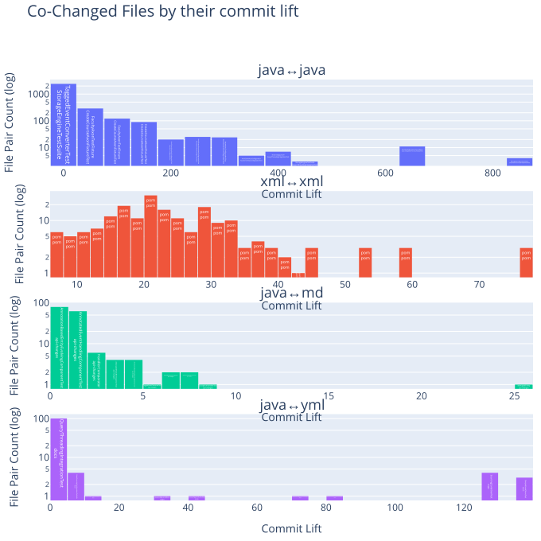
    

### Files changed together by commit Jaccard similarity

<table border="1" class="dataframe">
  <thead>
    <tr style="text-align: right;">
      <th></th>
      <th>fileExtensionPair</th>
      <th>updateCommitJaccardSimilarity</th>
      <th>GroupRank</th>
      <th>filePair</th>
      <th>filePairWithRelativePath</th>
    </tr>
  </thead>
  <tbody>
    <tr>
      <th>0</th>
      <td>java↔java</td>
      <td>1.000000</td>
      <td>1</td>
      <td>HandlerAttributes↔SequencingPolicy</td>
      <td>messaging/src/main/java/org/axonframework/messaging/core/annotation/HandlerAttributes.java↔messaging/src/main/java/org/axonframework/messaging/core/annotation/SequencingPolicy.java</td>
    </tr>
    <tr>
      <th>1</th>
      <td>java↔java</td>
      <td>0.818182</td>
      <td>2</td>
      <td>ChildEntityFieldDefinition↔GetterSetterChildEntityFieldDefinition</td>
      <td>modelling/src/main/java/org/axonframework/modelling/entity/child/ChildEntityFieldDefinition.java↔modelling/src/main/java/org/axonframework/modelling/entity/child/GetterSetterChildEntityFieldDefinition.java</td>
    </tr>
    <tr>
      <th>2</th>
      <td>java↔java</td>
      <td>0.800000</td>
      <td>3</td>
      <td>FieldChildEntityFieldDefinition↔GetterSetterChildEntityFieldDefinition</td>
      <td>modelling/src/main/java/org/axonframework/modelling/entity/child/FieldChildEntityFieldDefinition.java↔modelling/src/main/java/org/axonframework/modelling/entity/child/GetterSetterChildEntityFieldDefinition.java</td>
    </tr>
    <tr>
      <th>3</th>
      <td>java↔java</td>
      <td>0.750000</td>
      <td>4</td>
      <td>Command↔AnnotationMessageTypeResolver</td>
      <td>messaging/src/main/java/org/axonframework/messaging/commandhandling/annotation/Command.java↔messaging/src/main/java/org/axonframework/messaging/core/annotation/AnnotationMessageTypeResolver.java</td>
    </tr>
    <tr>
      <th>4</th>
      <td>java↔java</td>
      <td>0.666667</td>
      <td>5</td>
      <td>CreateCourseAxonFixtureTest↔CreateCourseAxonFixtureTest</td>
      <td>examples/university-demo/src/test/java/org/axonframework/examples/demo/university/faculty/write/createcourse/CreateCourseAxonFixtureTest.java↔examples/university-demo/src/test/java/org/axonframework/examples/demo/university/faculty/write/createcourseplain/CreateCourseAxonFixtureTest.java</td>
    </tr>
    <tr>
      <th>5</th>
      <td>java↔java</td>
      <td>0.636364</td>
      <td>6</td>
      <td>ChildEntityFieldDefinition↔FieldChildEntityFieldDefinition</td>
      <td>modelling/src/main/java/org/axonframework/modelling/entity/child/ChildEntityFieldDefinition.java↔modelling/src/main/java/org/axonframework/modelling/entity/child/FieldChildEntityFieldDefinition.java</td>
    </tr>
    <tr>
      <th>6</th>
      <td>java↔java</td>
      <td>0.600000</td>
      <td>7</td>
      <td>ImmutableReflectionEntityModelAdministrationIT↔MutableReflectionEntityModelAdministrationIT</td>
      <td>integrationtests/src/test/java/org/axonframework/integrationtests/testsuite/administration/ImmutableReflectionEntityModelAdministrationIT.java↔integrationtests/src/test/java/org/axonframework/integrationtests/testsuite/administration/MutableReflectionEntityModelAdministrationIT.java</td>
    </tr>
    <tr>
      <th>7</th>
      <td>java↔java</td>
      <td>0.571429</td>
      <td>8</td>
      <td>AnnotationBasedEntityEvolvingComponent↔AnnotationSagaMetaModelFactory</td>
      <td>modelling/src/main/java/org/axonframework/modelling/annotation/AnnotationBasedEntityEvolvingComponent.java↔stash/legacy-saga/src/main/java/org/axonframework/modelling/saga/metamodel/AnnotationSagaMetaModelFactory.java</td>
    </tr>
    <tr>
      <th>8</th>
      <td>java↔java</td>
      <td>0.555556</td>
      <td>9</td>
      <td>SimpleUnitOfWorkFactory↔UnitOfWorkConfiguration</td>
      <td>messaging/src/main/java/org/axonframework/messaging/core/unitofwork/SimpleUnitOfWorkFactory.java↔messaging/src/main/java/org/axonframework/messaging/core/unitofwork/UnitOfWorkConfiguration.java</td>
    </tr>
    <tr>
      <th>9</th>
      <td>java↔java</td>
      <td>0.500000</td>
      <td>10</td>
      <td>FacultyAxonTestFixture↔CreateCourseAxonFixtureTest</td>
      <td>examples/university-demo/src/test/java/org/axonframework/examples/demo/university/faculty/FacultyAxonTestFixture.java↔examples/university-demo/src/test/java/org/axonframework/examples/demo/university/faculty/write/createcourse/CreateCourseAxonFixtureTest.java</td>
    </tr>
    <tr>
      <th>10</th>
      <td>xml↔xml</td>
      <td>0.340909</td>
      <td>1</td>
      <td>pom↔pom</td>
      <td>common/pom.xml↔update/pom.xml</td>
    </tr>
    <tr>
      <th>11</th>
      <td>xml↔xml</td>
      <td>0.300000</td>
      <td>2</td>
      <td>pom↔pom</td>
      <td>conversion/pom.xml↔update/pom.xml</td>
    </tr>
    <tr>
      <th>12</th>
      <td>xml↔xml</td>
      <td>0.294118</td>
      <td>3</td>
      <td>pom↔pom</td>
      <td>common/pom.xml↔conversion/pom.xml</td>
    </tr>
    <tr>
      <th>13</th>
      <td>xml↔xml</td>
      <td>0.272727</td>
      <td>4</td>
      <td>pom↔pom</td>
      <td>stash/legacy-aggregate/pom.xml↔stash/legacy-saga/pom.xml</td>
    </tr>
    <tr>
      <th>14</th>
      <td>xml↔xml</td>
      <td>0.227273</td>
      <td>5</td>
      <td>pom↔pom</td>
      <td>extensions/metrics/pom.xml↔extensions/tracing/pom.xml</td>
    </tr>
    <tr>
      <th>15</th>
      <td>xml↔xml</td>
      <td>0.222222</td>
      <td>6</td>
      <td>pom↔pom</td>
      <td>extensions/pom.xml↔extensions/spring/spring-boot-starter/pom.xml</td>
    </tr>
    <tr>
      <th>16</th>
      <td>xml↔xml</td>
      <td>0.215385</td>
      <td>7</td>
      <td>pom↔pom</td>
      <td>extensions/metrics/metrics-dropwizard/pom.xml↔extensions/metrics/metrics-micrometer/pom.xml</td>
    </tr>
    <tr>
      <th>17</th>
      <td>xml↔xml</td>
      <td>0.214286</td>
      <td>8</td>
      <td>pom↔pom</td>
      <td>stash/legacy-saga/pom.xml↔stash/todo/pom.xml</td>
    </tr>
    <tr>
      <th>18</th>
      <td>xml↔xml</td>
      <td>0.208333</td>
      <td>9</td>
      <td>pom↔pom</td>
      <td>extensions/pom.xml↔extensions/spring/pom.xml</td>
    </tr>
    <tr>
      <th>19</th>
      <td>xml↔xml</td>
      <td>0.204082</td>
      <td>10</td>
      <td>pom↔pom</td>
      <td>extensions/spring/pom.xml↔extensions/spring/spring-boot-starter/pom.xml</td>
    </tr>
    <tr>
      <th>20</th>
      <td>java↔md</td>
      <td>0.128713</td>
      <td>1</td>
      <td>AggregateBasedAxonServerEventStorageEngine↔api-changes</td>
      <td>axon-server-connector/src/main/java/org/axonframework/axonserver/connector/event/AggregateBasedAxonServerEventStorageEngine.java↔axon-5/api-changes.md</td>
    </tr>
    <tr>
      <th>21</th>
      <td>java↔md</td>
      <td>0.120419</td>
      <td>2</td>
      <td>AggregateBasedStorageEngineTestSuite↔api-changes</td>
      <td>eventsourcing/src/test/java/org/axonframework/eventsourcing/eventstore/AggregateBasedStorageEngineTestSuite.java↔axon-5/api-changes.md</td>
    </tr>
    <tr>
      <th>22</th>
      <td>java↔md</td>
      <td>0.111565</td>
      <td>3</td>
      <td>AggregateBasedJpaEventStorageEngine↔api-changes</td>
      <td>eventsourcing/src/main/java/org/axonframework/eventsourcing/eventstore/jpa/AggregateBasedJpaEventStorageEngine.java↔axon-5/api-changes.md</td>
    </tr>
    <tr>
      <th>23</th>
      <td>java↔md</td>
      <td>0.095484</td>
      <td>4</td>
      <td>StorageEngineTestSuite↔api-changes</td>
      <td>eventsourcing/src/test/java/org/axonframework/eventsourcing/eventstore/StorageEngineTestSuite.java↔axon-5/api-changes.md</td>
    </tr>
    <tr>
      <th>24</th>
      <td>java↔md</td>
      <td>0.080556</td>
      <td>5</td>
      <td>SimpleEventStoreTest↔api-changes</td>
      <td>eventsourcing/src/test/java/org/axonframework/eventsourcing/eventstore/SimpleEventStoreTest.java↔axon-5/api-changes.md</td>
    </tr>
    <tr>
      <th>25</th>
      <td>java↔md</td>
      <td>0.074896</td>
      <td>6</td>
      <td>DefaultEventStoreTransactionTest↔api-changes</td>
      <td>eventsourcing/src/test/java/org/axonframework/eventsourcing/eventstore/DefaultEventStoreTransactionTest.java↔axon-5/api-changes.md</td>
    </tr>
    <tr>
      <th>26</th>
      <td>java↔md</td>
      <td>0.067989</td>
      <td>7</td>
      <td>QueryThreadingIntegrationTest↔api-changes</td>
      <td>integrationtests/src/test/java/org/axonframework/integrationtests/queryhandling/QueryThreadingIntegrationTest.java↔axon-5/api-changes.md</td>
    </tr>
    <tr>
      <th>27</th>
      <td>java↔md</td>
      <td>0.065476</td>
      <td>8</td>
      <td>QueryThreadingIntegrationTest↔README</td>
      <td>integrationtests/src/test/java/org/axonframework/integrationtests/queryhandling/QueryThreadingIntegrationTest.java↔docs/README.md</td>
    </tr>
    <tr>
      <th>28</th>
      <td>java↔md</td>
      <td>0.062500</td>
      <td>9</td>
      <td>NoAppendConditionTest↔design-principles</td>
      <td>eventsourcing/src/test/java/org/axonframework/eventsourcing/eventstore/NoAppendConditionTest.java↔axon-5/design-principles.md</td>
    </tr>
    <tr>
      <th>29</th>
      <td>java↔md</td>
      <td>0.061224</td>
      <td>10</td>
      <td>QueryThreadingIntegrationTest↔ISSUE_TEMPLATE</td>
      <td>integrationtests/src/test/java/org/axonframework/integrationtests/queryhandling/QueryThreadingIntegrationTest.java↔.github/ISSUE_TEMPLATE.md</td>
    </tr>
    <tr>
      <th>30</th>
      <td>java↔yml</td>
      <td>0.357143</td>
      <td>1</td>
      <td>ChangeCourseCapacityController↔application</td>
      <td>examples/university-java-springboot/src/main/java/org/axonframework/examples/university/write/changecoursecapacity/ChangeCourseCapacityController.java↔examples/university-java-springboot/src/main/resources/application.yml</td>
    </tr>
    <tr>
      <th>31</th>
      <td>java↔yml</td>
      <td>0.333333</td>
      <td>2</td>
      <td>EnrollStudentInFacultyController↔application</td>
      <td>examples/university-java-springboot/src/main/java/org/axonframework/examples/university/write/enrollstudent/EnrollStudentInFacultyController.java↔examples/university-java-springboot/src/main/resources/application.yml</td>
    </tr>
    <tr>
      <th>32</th>
      <td>java↔yml</td>
      <td>0.227273</td>
      <td>3</td>
      <td>UpdateCheckerAutoConfiguration↔application</td>
      <td>extensions/spring/spring-boot-autoconfigure/src/main/java/org/axonframework/extension/springboot/autoconfig/UpdateCheckerAutoConfiguration.java↔examples/university-java-springboot/src/main/resources/application.yml</td>
    </tr>
    <tr>
      <th>33</th>
      <td>java↔yml</td>
      <td>0.187500</td>
      <td>4</td>
      <td>UpdateCheckerProperties↔application</td>
      <td>extensions/spring/spring-boot-autoconfigure/src/main/java/org/axonframework/extension/springboot/UpdateCheckerProperties.java↔examples/university-java-springboot/src/main/resources/application.yml</td>
    </tr>
    <tr>
      <th>34</th>
      <td>java↔yml</td>
      <td>0.138889</td>
      <td>5</td>
      <td>EventProcessingAutoConfiguration↔application</td>
      <td>extensions/spring/spring-boot-autoconfigure/src/main/java/org/axonframework/extension/springboot/autoconfig/EventProcessingAutoConfiguration.java↔examples/university-java-springboot/src/main/resources/application.yml</td>
    </tr>
    <tr>
      <th>35</th>
      <td>java↔yml</td>
      <td>0.085714</td>
      <td>6</td>
      <td>EventProcessingAutoConfiguration↔test-docker-compose</td>
      <td>extensions/spring/spring-boot-autoconfigure/src/main/java/org/axonframework/extension/springboot/autoconfig/EventProcessingAutoConfiguration.java↔extensions/spring/spring-boot-autoconfigure/test-docker-compose.yml</td>
    </tr>
    <tr>
      <th>36</th>
      <td>java↔yml</td>
      <td>0.058824</td>
      <td>7</td>
      <td>NoAppendConditionTest↔add-to-project</td>
      <td>eventsourcing/src/test/java/org/axonframework/eventsourcing/eventstore/NoAppendConditionTest.java↔.github/workflows/add-to-project.yml</td>
    </tr>
    <tr>
      <th>37</th>
      <td>java↔yml</td>
      <td>0.058140</td>
      <td>8</td>
      <td>AppendCondition↔add-to-project</td>
      <td>eventsourcing/src/main/java/org/axonframework/eventsourcing/eventstore/AppendCondition.java↔.github/workflows/add-to-project.yml</td>
    </tr>
    <tr>
      <th>38</th>
      <td>java↔yml</td>
      <td>0.056180</td>
      <td>9</td>
      <td>NoAppendCondition↔add-to-project</td>
      <td>eventsourcing/src/main/java/org/axonframework/eventsourcing/eventstore/NoAppendCondition.java↔.github/workflows/add-to-project.yml</td>
    </tr>
    <tr>
      <th>39</th>
      <td>java↔yml</td>
      <td>0.049383</td>
      <td>10</td>
      <td>DefaultAppendConditionTest↔add-to-project</td>
      <td>eventsourcing/src/test/java/org/axonframework/eventsourcing/eventstore/DefaultAppendConditionTest.java↔.github/workflows/add-to-project.yml</td>
    </tr>
  </tbody>
</table>

    
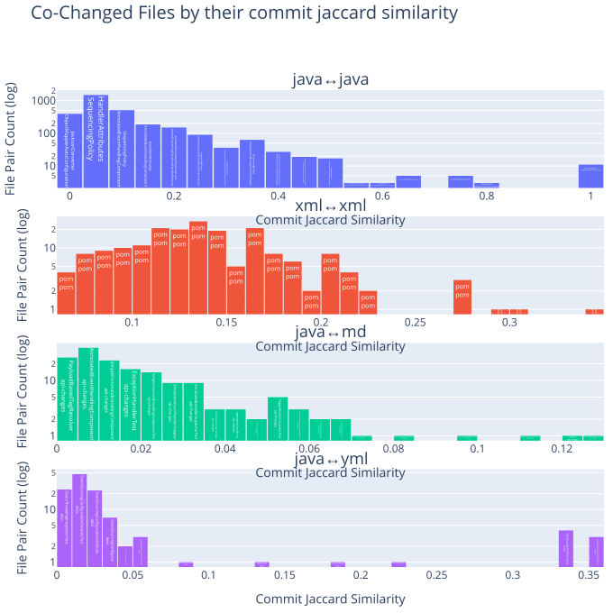
    

### Find pairwise changed files with many highly ranked metrics

Find those pairwise changed files that have a high rank in many metrics by calculating a combined (weighted) score based on the ranks of each metric.
This is useful to identify pairs of files that score high in most metrics, which indicates a strong co-change relationship.

<table border="1" class="dataframe">
  <thead>
    <tr style="text-align: right;">
      <th></th>
      <th>fileExtensionPair</th>
      <th>filePair</th>
      <th>combinedMetricsScore</th>
      <th>updateCommitCountExtensionRank</th>
      <th>updateCommitMinConfidenceExtensionRank</th>
      <th>updateCommitJaccardSimilarityExtensionRank</th>
      <th>updateCommitLiftExtensionRank</th>
      <th>updateCommitCount</th>
      <th>updateCommitMinConfidence</th>
      <th>updateCommitJaccardSimilarity</th>
      <th>updateCommitLift</th>
      <th>filePairWithRelativePath</th>
    </tr>
  </thead>
  <tbody>
    <tr>
      <th>0</th>
      <td>java↔java</td>
      <td>HandlerAttributes↔SequencingPolicy</td>
      <td>62</td>
      <td>59</td>
      <td>1</td>
      <td>1</td>
      <td>1</td>
      <td>3</td>
      <td>1.000000</td>
      <td>1.000000</td>
      <td>836.333333</td>
      <td>messaging/src/main/java/org/axonframework/messaging/core/annotation/HandlerAttributes.java↔messaging/src/main/java/org/axonframework/messaging/core/annotation/SequencingPolicy.java</td>
    </tr>
    <tr>
      <th>1</th>
      <td>java↔java</td>
      <td>Command↔Event</td>
      <td>62</td>
      <td>58</td>
      <td>1</td>
      <td>1</td>
      <td>2</td>
      <td>4</td>
      <td>1.000000</td>
      <td>1.000000</td>
      <td>627.250000</td>
      <td>messaging/src/main/java/org/axonframework/messaging/commandhandling/annotation/Command.java↔messaging/src/main/java/org/axonframework/messaging/eventhandling/annotation/Event.java</td>
    </tr>
    <tr>
      <th>2</th>
      <td>java↔java</td>
      <td>Event↔Query</td>
      <td>62</td>
      <td>58</td>
      <td>1</td>
      <td>1</td>
      <td>2</td>
      <td>4</td>
      <td>1.000000</td>
      <td>1.000000</td>
      <td>627.250000</td>
      <td>messaging/src/main/java/org/axonframework/messaging/eventhandling/annotation/Event.java↔messaging/src/main/java/org/axonframework/messaging/queryhandling/annotation/Query.java</td>
    </tr>
    <tr>
      <th>3</th>
      <td>java↔java</td>
      <td>Command↔Query</td>
      <td>62</td>
      <td>58</td>
      <td>1</td>
      <td>1</td>
      <td>2</td>
      <td>4</td>
      <td>1.000000</td>
      <td>1.000000</td>
      <td>627.250000</td>
      <td>messaging/src/main/java/org/axonframework/messaging/commandhandling/annotation/Command.java↔messaging/src/main/java/org/axonframework/messaging/queryhandling/annotation/Query.java</td>
    </tr>
    <tr>
      <th>4</th>
      <td>java↔java</td>
      <td>Query↔QueryResponse</td>
      <td>62</td>
      <td>58</td>
      <td>1</td>
      <td>1</td>
      <td>2</td>
      <td>4</td>
      <td>1.000000</td>
      <td>1.000000</td>
      <td>627.250000</td>
      <td>messaging/src/main/java/org/axonframework/messaging/queryhandling/annotation/Query.java↔messaging/src/main/java/org/axonframework/messaging/queryhandling/annotation/QueryResponse.java</td>
    </tr>
    <tr>
      <th>5</th>
      <td>java↔java</td>
      <td>Event↔QueryResponse</td>
      <td>62</td>
      <td>58</td>
      <td>1</td>
      <td>1</td>
      <td>2</td>
      <td>4</td>
      <td>1.000000</td>
      <td>1.000000</td>
      <td>627.250000</td>
      <td>messaging/src/main/java/org/axonframework/messaging/eventhandling/annotation/Event.java↔messaging/src/main/java/org/axonframework/messaging/queryhandling/annotation/QueryResponse.java</td>
    </tr>
    <tr>
      <th>6</th>
      <td>java↔java</td>
      <td>Command↔QueryResponse</td>
      <td>62</td>
      <td>58</td>
      <td>1</td>
      <td>1</td>
      <td>2</td>
      <td>4</td>
      <td>1.000000</td>
      <td>1.000000</td>
      <td>627.250000</td>
      <td>messaging/src/main/java/org/axonframework/messaging/commandhandling/annotation/Command.java↔messaging/src/main/java/org/axonframework/messaging/queryhandling/annotation/QueryResponse.java</td>
    </tr>
    <tr>
      <th>7</th>
      <td>java↔java</td>
      <td>FieldChildEntityFieldDefinitionTest↔GetterEvolverChildEntityFieldDefinitionTest</td>
      <td>62</td>
      <td>59</td>
      <td>1</td>
      <td>1</td>
      <td>1</td>
      <td>3</td>
      <td>1.000000</td>
      <td>1.000000</td>
      <td>836.333333</td>
      <td>modelling/src/test/java/org/axonframework/modelling/entity/child/FieldChildEntityFieldDefinitionTest.java↔modelling/src/test/java/org/axonframework/modelling/entity/child/GetterEvolverChildEntityFieldDefinitionTest.java</td>
    </tr>
    <tr>
      <th>8</th>
      <td>java↔java</td>
      <td>GetterEvolverChildEntityFieldDefinitionTest↔GetterSetterChildEntityFieldDefinitionTest</td>
      <td>62</td>
      <td>59</td>
      <td>1</td>
      <td>1</td>
      <td>1</td>
      <td>3</td>
      <td>1.000000</td>
      <td>1.000000</td>
      <td>836.333333</td>
      <td>modelling/src/test/java/org/axonframework/modelling/entity/child/GetterEvolverChildEntityFieldDefinitionTest.java↔modelling/src/test/java/org/axonframework/modelling/entity/child/GetterSetterChildEntityFieldDefinitionTest.java</td>
    </tr>
    <tr>
      <th>9</th>
      <td>java↔java</td>
      <td>FieldChildEntityFieldDefinitionTest↔GetterSetterChildEntityFieldDefinitionTest</td>
      <td>62</td>
      <td>59</td>
      <td>1</td>
      <td>1</td>
      <td>1</td>
      <td>3</td>
      <td>1.000000</td>
      <td>1.000000</td>
      <td>836.333333</td>
      <td>modelling/src/test/java/org/axonframework/modelling/entity/child/FieldChildEntityFieldDefinitionTest.java↔modelling/src/test/java/org/axonframework/modelling/entity/child/GetterSetterChildEntityFieldDefinitionTest.java</td>
    </tr>
    <tr>
      <th>10</th>
      <td>java↔md</td>
      <td>AggregateBasedAxonServerEventStorageEngine↔api-changes</td>
      <td>29</td>
      <td>2</td>
      <td>7</td>
      <td>1</td>
      <td>19</td>
      <td>91</td>
      <td>0.471503</td>
      <td>0.128713</td>
      <td>1.955372</td>
      <td>axon-server-connector/src/main/java/org/axonframework/axonserver/connector/event/AggregateBasedAxonServerEventStorageEngine.java↔axon-5/api-changes.md</td>
    </tr>
    <tr>
      <th>11</th>
      <td>java↔md</td>
      <td>AggregateBasedJpaEventStorageEngine↔api-changes</td>
      <td>38</td>
      <td>3</td>
      <td>10</td>
      <td>3</td>
      <td>22</td>
      <td>82</td>
      <td>0.386792</td>
      <td>0.111565</td>
      <td>1.604070</td>
      <td>eventsourcing/src/main/java/org/axonframework/eventsourcing/eventstore/jpa/AggregateBasedJpaEventStorageEngine.java↔axon-5/api-changes.md</td>
    </tr>
    <tr>
      <th>12</th>
      <td>java↔md</td>
      <td>AggregateBasedStorageEngineTestSuite↔api-changes</td>
      <td>42</td>
      <td>1</td>
      <td>14</td>
      <td>2</td>
      <td>25</td>
      <td>92</td>
      <td>0.366534</td>
      <td>0.120419</td>
      <td>1.520055</td>
      <td>eventsourcing/src/test/java/org/axonframework/eventsourcing/eventstore/AggregateBasedStorageEngineTestSuite.java↔axon-5/api-changes.md</td>
    </tr>
    <tr>
      <th>13</th>
      <td>java↔md</td>
      <td>QueryThreadingIntegrationTest↔README</td>
      <td>55</td>
      <td>28</td>
      <td>13</td>
      <td>8</td>
      <td>6</td>
      <td>11</td>
      <td>0.366667</td>
      <td>0.065476</td>
      <td>6.174273</td>
      <td>integrationtests/src/test/java/org/axonframework/integrationtests/queryhandling/QueryThreadingIntegrationTest.java↔docs/README.md</td>
    </tr>
    <tr>
      <th>14</th>
      <td>java↔md</td>
      <td>SimpleEventStoreTest↔api-changes</td>
      <td>59</td>
      <td>5</td>
      <td>19</td>
      <td>5</td>
      <td>30</td>
      <td>58</td>
      <td>0.335260</td>
      <td>0.080556</td>
      <td>1.390360</td>
      <td>eventsourcing/src/test/java/org/axonframework/eventsourcing/eventstore/SimpleEventStoreTest.java↔axon-5/api-changes.md</td>
    </tr>
    <tr>
      <th>15</th>
      <td>java↔md</td>
      <td>CommandConverter↔modularity</td>
      <td>59</td>
      <td>36</td>
      <td>4</td>
      <td>18</td>
      <td>1</td>
      <td>3</td>
      <td>0.600000</td>
      <td>0.050000</td>
      <td>25.955172</td>
      <td>axon-server-connector/src/main/java/org/axonframework/axonserver/connector/command/CommandConverter.java↔axon-5/modularity.md</td>
    </tr>
    <tr>
      <th>16</th>
      <td>java↔md</td>
      <td>AxonServerEventStorageEngine↔api-changes</td>
      <td>67</td>
      <td>10</td>
      <td>16</td>
      <td>14</td>
      <td>27</td>
      <td>36</td>
      <td>0.352941</td>
      <td>0.053651</td>
      <td>1.463685</td>
      <td>axon-server-connector/src/main/java/org/axonframework/axonserver/connector/event/AxonServerEventStorageEngine.java↔axon-5/api-changes.md</td>
    </tr>
    <tr>
      <th>17</th>
      <td>java↔md</td>
      <td>QueryThreadingIntegrationTest↔api-changes</td>
      <td>70</td>
      <td>7</td>
      <td>22</td>
      <td>7</td>
      <td>34</td>
      <td>48</td>
      <td>0.322148</td>
      <td>0.067989</td>
      <td>1.335981</td>
      <td>integrationtests/src/test/java/org/axonframework/integrationtests/queryhandling/QueryThreadingIntegrationTest.java↔axon-5/api-changes.md</td>
    </tr>
    <tr>
      <th>18</th>
      <td>java↔md</td>
      <td>DefaultEventStoreTransactionTest↔api-changes</td>
      <td>72</td>
      <td>6</td>
      <td>24</td>
      <td>6</td>
      <td>36</td>
      <td>54</td>
      <td>0.317647</td>
      <td>0.074896</td>
      <td>1.317316</td>
      <td>eventsourcing/src/test/java/org/axonframework/eventsourcing/eventstore/DefaultEventStoreTransactionTest.java↔axon-5/api-changes.md</td>
    </tr>
    <tr>
      <th>19</th>
      <td>java↔md</td>
      <td>StorageEngineTestSuite↔api-changes</td>
      <td>74</td>
      <td>4</td>
      <td>27</td>
      <td>4</td>
      <td>39</td>
      <td>74</td>
      <td>0.303279</td>
      <td>0.095484</td>
      <td>1.257729</td>
      <td>eventsourcing/src/test/java/org/axonframework/eventsourcing/eventstore/StorageEngineTestSuite.java↔axon-5/api-changes.md</td>
    </tr>
    <tr>
      <th>20</th>
      <td>java↔yml</td>
      <td>ChangeCourseCapacityController↔application</td>
      <td>18</td>
      <td>14</td>
      <td>2</td>
      <td>1</td>
      <td>1</td>
      <td>5</td>
      <td>0.555556</td>
      <td>0.357143</td>
      <td>139.388889</td>
      <td>examples/university-java-springboot/src/main/java/org/axonframework/examples/university/write/changecoursecapacity/ChangeCourseCapacityController.java↔examples/university-java-springboot/src/main/resources/application.yml</td>
    </tr>
    <tr>
      <th>21</th>
      <td>java↔yml</td>
      <td>RenameCourseController↔application</td>
      <td>18</td>
      <td>14</td>
      <td>2</td>
      <td>1</td>
      <td>1</td>
      <td>5</td>
      <td>0.555556</td>
      <td>0.357143</td>
      <td>139.388889</td>
      <td>examples/university-java-springboot/src/main/java/org/axonframework/examples/university/write/renamecourse/RenameCourseController.java↔examples/university-java-springboot/src/main/resources/application.yml</td>
    </tr>
    <tr>
      <th>22</th>
      <td>java↔yml</td>
      <td>CreateCourseController↔application</td>
      <td>18</td>
      <td>14</td>
      <td>2</td>
      <td>1</td>
      <td>1</td>
      <td>5</td>
      <td>0.555556</td>
      <td>0.357143</td>
      <td>139.388889</td>
      <td>examples/university-java-springboot/src/main/java/org/axonframework/examples/university/write/createcourse/CreateCourseController.java↔examples/university-java-springboot/src/main/resources/application.yml</td>
    </tr>
    <tr>
      <th>23</th>
      <td>java↔yml</td>
      <td>EnrollStudentInFacultyController↔application</td>
      <td>21</td>
      <td>14</td>
      <td>3</td>
      <td>2</td>
      <td>2</td>
      <td>5</td>
      <td>0.500000</td>
      <td>0.333333</td>
      <td>125.450000</td>
      <td>examples/university-java-springboot/src/main/java/org/axonframework/examples/university/write/enrollstudent/EnrollStudentInFacultyController.java↔examples/university-java-springboot/src/main/resources/application.yml</td>
    </tr>
    <tr>
      <th>24</th>
      <td>java↔yml</td>
      <td>SubscribeStudentToCourseController↔application</td>
      <td>21</td>
      <td>14</td>
      <td>3</td>
      <td>2</td>
      <td>2</td>
      <td>5</td>
      <td>0.500000</td>
      <td>0.333333</td>
      <td>125.450000</td>
      <td>examples/university-java-springboot/src/main/java/org/axonframework/examples/university/write/subscribestudent/SubscribeStudentToCourseController.java↔examples/university-java-springboot/src/main/resources/application.yml</td>
    </tr>
    <tr>
      <th>25</th>
      <td>java↔yml</td>
      <td>CourseStatsController↔application</td>
      <td>21</td>
      <td>14</td>
      <td>3</td>
      <td>2</td>
      <td>2</td>
      <td>5</td>
      <td>0.500000</td>
      <td>0.333333</td>
      <td>125.450000</td>
      <td>examples/university-java-springboot/src/main/java/org/axonframework/examples/university/read/coursestats/controller/CourseStatsController.java↔examples/university-java-springboot/src/main/resources/application.yml</td>
    </tr>
    <tr>
      <th>26</th>
      <td>java↔yml</td>
      <td>UnsubscribeStudentToCourseController↔application</td>
      <td>21</td>
      <td>14</td>
      <td>3</td>
      <td>2</td>
      <td>2</td>
      <td>5</td>
      <td>0.500000</td>
      <td>0.333333</td>
      <td>125.450000</td>
      <td>examples/university-java-springboot/src/main/java/org/axonframework/examples/university/write/unsubscribestudent/UnsubscribeStudentToCourseController.java↔examples/university-java-springboot/src/main/resources/application.yml</td>
    </tr>
    <tr>
      <th>27</th>
      <td>java↔yml</td>
      <td>UpdateCheckerAutoConfiguration↔application</td>
      <td>24</td>
      <td>14</td>
      <td>3</td>
      <td>3</td>
      <td>4</td>
      <td>5</td>
      <td>0.500000</td>
      <td>0.227273</td>
      <td>73.794118</td>
      <td>extensions/spring/spring-boot-autoconfigure/src/main/java/org/axonframework/extension/springboot/autoconfig/UpdateCheckerAutoConfiguration.java↔examples/university-java-springboot/src/main/resources/application.yml</td>
    </tr>
    <tr>
      <th>28</th>
      <td>java↔yml</td>
      <td>EventProcessingAutoConfiguration↔application</td>
      <td>27</td>
      <td>14</td>
      <td>3</td>
      <td>5</td>
      <td>5</td>
      <td>5</td>
      <td>0.500000</td>
      <td>0.138889</td>
      <td>40.467742</td>
      <td>extensions/spring/spring-boot-autoconfigure/src/main/java/org/axonframework/extension/springboot/autoconfig/EventProcessingAutoConfiguration.java↔examples/university-java-springboot/src/main/resources/application.yml</td>
    </tr>
    <tr>
      <th>29</th>
      <td>java↔yml</td>
      <td>UpdateCheckerProperties↔application</td>
      <td>28</td>
      <td>16</td>
      <td>5</td>
      <td>4</td>
      <td>3</td>
      <td>3</td>
      <td>0.333333</td>
      <td>0.187500</td>
      <td>83.633333</td>
      <td>extensions/spring/spring-boot-autoconfigure/src/main/java/org/axonframework/extension/springboot/UpdateCheckerProperties.java↔examples/university-java-springboot/src/main/resources/application.yml</td>
    </tr>
    <tr>
      <th>30</th>
      <td>xml↔xml</td>
      <td>pom↔pom</td>
      <td>9</td>
      <td>2</td>
      <td>1</td>
      <td>1</td>
      <td>5</td>
      <td>15</td>
      <td>0.517241</td>
      <td>0.340909</td>
      <td>43.258621</td>
      <td>common/pom.xml↔update/pom.xml</td>
    </tr>
    <tr>
      <th>31</th>
      <td>xml↔xml</td>
      <td>pom↔pom</td>
      <td>14</td>
      <td>2</td>
      <td>1</td>
      <td>2</td>
      <td>9</td>
      <td>15</td>
      <td>0.517241</td>
      <td>0.300000</td>
      <td>36.048851</td>
      <td>conversion/pom.xml↔update/pom.xml</td>
    </tr>
    <tr>
      <th>32</th>
      <td>xml↔xml</td>
      <td>pom↔pom</td>
      <td>18</td>
      <td>2</td>
      <td>2</td>
      <td>3</td>
      <td>11</td>
      <td>15</td>
      <td>0.500000</td>
      <td>0.294118</td>
      <td>34.847222</td>
      <td>common/pom.xml↔conversion/pom.xml</td>
    </tr>
    <tr>
      <th>33</th>
      <td>xml↔xml</td>
      <td>pom↔pom</td>
      <td>20</td>
      <td>11</td>
      <td>4</td>
      <td>4</td>
      <td>1</td>
      <td>6</td>
      <td>0.428571</td>
      <td>0.272727</td>
      <td>76.806122</td>
      <td>stash/legacy-aggregate/pom.xml↔stash/legacy-saga/pom.xml</td>
    </tr>
    <tr>
      <th>34</th>
      <td>xml↔xml</td>
      <td>pom↔pom</td>
      <td>20</td>
      <td>11</td>
      <td>4</td>
      <td>4</td>
      <td>1</td>
      <td>6</td>
      <td>0.428571</td>
      <td>0.272727</td>
      <td>76.806122</td>
      <td>stash/legacy-aggregate/pom.xml↔stash/legacy/pom.xml</td>
    </tr>
    <tr>
      <th>35</th>
      <td>xml↔xml</td>
      <td>pom↔pom</td>
      <td>20</td>
      <td>11</td>
      <td>4</td>
      <td>4</td>
      <td>1</td>
      <td>6</td>
      <td>0.428571</td>
      <td>0.272727</td>
      <td>76.806122</td>
      <td>stash/legacy-saga/pom.xml↔stash/legacy/pom.xml</td>
    </tr>
    <tr>
      <th>36</th>
      <td>xml↔xml</td>
      <td>pom↔pom</td>
      <td>26</td>
      <td>11</td>
      <td>4</td>
      <td>8</td>
      <td>3</td>
      <td>6</td>
      <td>0.428571</td>
      <td>0.214286</td>
      <td>53.764286</td>
      <td>stash/legacy-saga/pom.xml↔stash/todo/pom.xml</td>
    </tr>
    <tr>
      <th>37</th>
      <td>xml↔xml</td>
      <td>pom↔pom</td>
      <td>26</td>
      <td>11</td>
      <td>4</td>
      <td>8</td>
      <td>3</td>
      <td>6</td>
      <td>0.428571</td>
      <td>0.214286</td>
      <td>53.764286</td>
      <td>stash/legacy/pom.xml↔stash/todo/pom.xml</td>
    </tr>
    <tr>
      <th>38</th>
      <td>xml↔xml</td>
      <td>pom↔pom</td>
      <td>26</td>
      <td>11</td>
      <td>4</td>
      <td>8</td>
      <td>3</td>
      <td>6</td>
      <td>0.428571</td>
      <td>0.214286</td>
      <td>53.764286</td>
      <td>stash/legacy-aggregate/pom.xml↔stash/todo/pom.xml</td>
    </tr>
    <tr>
      <th>39</th>
      <td>xml↔xml</td>
      <td>pom↔pom</td>
      <td>34</td>
      <td>7</td>
      <td>10</td>
      <td>5</td>
      <td>12</td>
      <td>10</td>
      <td>0.370370</td>
      <td>0.227273</td>
      <td>34.417010</td>
      <td>extensions/metrics/pom.xml↔extensions/tracing/pom.xml</td>
    </tr>
  </tbody>
</table>

### Pairwise changed files with pareto-optimal metrics

A pair (count, confidence, jaccard, lift) is Pareto-optimal if there is no other pair that is better or equal in all metrics and strictly better in at least one. In other words, it is not "dominated" by any other pair.

The frontier = the “best tradeoffs.”

#### Pairwise changed files with pareto-optimal metrics - not considering file extensions

<table border="1" class="dataframe">
  <thead>
    <tr style="text-align: right;">
      <th></th>
      <th>filePair</th>
      <th>combinedMetricsScore</th>
      <th>updateCommitCount</th>
      <th>updateCommitMinConfidence</th>
      <th>updateCommitJaccardSimilarity</th>
      <th>updateCommitLift</th>
      <th>updateCommitCountExtensionRank</th>
      <th>updateCommitMinConfidenceExtensionRank</th>
      <th>updateCommitJaccardSimilarityExtensionRank</th>
      <th>updateCommitLiftExtensionRank</th>
      <th>filePairWithRelativePath</th>
    </tr>
  </thead>
  <tbody>
    <tr>
      <th>0</th>
      <td>pom↔pom</td>
      <td>9</td>
      <td>15</td>
      <td>0.517241</td>
      <td>0.340909</td>
      <td>43.258621</td>
      <td>2</td>
      <td>1</td>
      <td>1</td>
      <td>5</td>
      <td>common/pom.xml↔update/pom.xml</td>
    </tr>
    <tr>
      <th>1</th>
      <td>AxonTestGiven↔AxonTestWhen</td>
      <td>442</td>
      <td>48</td>
      <td>0.571429</td>
      <td>0.377953</td>
      <td>15.755102</td>
      <td>18</td>
      <td>24</td>
      <td>25</td>
      <td>375</td>
      <td>test/src/main/java/org/axonframework/test/fixture/AxonTestGiven.java↔test/src/main/java/org/axonframework/test/fixture/AxonTestWhen.java</td>
    </tr>
    <tr>
      <th>2</th>
      <td>HandlerAttributes↔SequencingPolicy</td>
      <td>62</td>
      <td>3</td>
      <td>1.000000</td>
      <td>1.000000</td>
      <td>836.333333</td>
      <td>59</td>
      <td>1</td>
      <td>1</td>
      <td>1</td>
      <td>messaging/src/main/java/org/axonframework/messaging/core/annotation/HandlerAttributes.java↔messaging/src/main/java/org/axonframework/messaging/core/annotation/SequencingPolicy.java</td>
    </tr>
    <tr>
      <th>3</th>
      <td>AggregateBasedConsistencyMarker↔AggregateBasedStorageEngineTestSuite</td>
      <td>1106</td>
      <td>27</td>
      <td>0.675000</td>
      <td>0.102273</td>
      <td>6.747311</td>
      <td>35</td>
      <td>10</td>
      <td>272</td>
      <td>789</td>
      <td>eventsourcing/src/main/java/org/axonframework/eventsourcing/eventstore/AggregateBasedConsistencyMarker.java↔eventsourcing/src/test/java/org/axonframework/eventsourcing/eventstore/AggregateBasedStorageEngineTestSuite.java</td>
    </tr>
    <tr>
      <th>4</th>
      <td>StorageEngineTestSuite↔AggregateBasedStorageEngineTestSuite</td>
      <td>1062</td>
      <td>119</td>
      <td>0.487705</td>
      <td>0.316489</td>
      <td>4.875106</td>
      <td>1</td>
      <td>38</td>
      <td>39</td>
      <td>984</td>
      <td>eventsourcing/src/test/java/org/axonframework/eventsourcing/eventstore/StorageEngineTestSuite.java↔eventsourcing/src/test/java/org/axonframework/eventsourcing/eventstore/AggregateBasedStorageEngineTestSuite.java</td>
    </tr>
    <tr>
      <th>5</th>
      <td>ConsistencyMarker↔AbstractConsistencyMarker</td>
      <td>413</td>
      <td>10</td>
      <td>0.555556</td>
      <td>0.178571</td>
      <td>29.039352</td>
      <td>52</td>
      <td>25</td>
      <td>133</td>
      <td>203</td>
      <td>eventsourcing/src/main/java/org/axonframework/eventsourcing/eventstore/ConsistencyMarker.java↔eventsourcing/src/main/java/org/axonframework/eventsourcing/eventstore/AbstractConsistencyMarker.java</td>
    </tr>
    <tr>
      <th>6</th>
      <td>ConsistencyMarker↔ConsistencyMarkers</td>
      <td>341</td>
      <td>17</td>
      <td>0.531250</td>
      <td>0.269841</td>
      <td>27.768880</td>
      <td>45</td>
      <td>31</td>
      <td>55</td>
      <td>210</td>
      <td>eventsourcing/src/main/java/org/axonframework/eventsourcing/eventstore/ConsistencyMarker.java↔eventsourcing/src/main/java/org/axonframework/eventsourcing/eventstore/ConsistencyMarkers.java</td>
    </tr>
    <tr>
      <th>7</th>
      <td>AggregateBasedAxonServerEventStorageEngine↔AggregateBasedJpaEventStorageEngine</td>
      <td>789</td>
      <td>117</td>
      <td>0.606218</td>
      <td>0.406250</td>
      <td>7.174528</td>
      <td>2</td>
      <td>17</td>
      <td>21</td>
      <td>749</td>
      <td>axon-server-connector/src/main/java/org/axonframework/axonserver/connector/event/AggregateBasedAxonServerEventStorageEngine.java↔eventsourcing/src/main/java/org/axonframework/eventsourcing/eventstore/jpa/AggregateBasedJpaEventStorageEngine.java</td>
    </tr>
    <tr>
      <th>8</th>
      <td>EventSourcingConfigurationDefaults↔EventSourcingConfigurationDefaultsTest</td>
      <td>861</td>
      <td>55</td>
      <td>0.466102</td>
      <td>0.250000</td>
      <td>7.448721</td>
      <td>15</td>
      <td>49</td>
      <td>67</td>
      <td>730</td>
      <td>eventsourcing/src/main/java/org/axonframework/eventsourcing/configuration/EventSourcingConfigurationDefaults.java↔eventsourcing/src/test/java/org/axonframework/eventsourcing/configuration/EventSourcingConfigurationDefaultsTest.java</td>
    </tr>
    <tr>
      <th>9</th>
      <td>DefaultAppendConditionTest↔NoAppendConditionTest</td>
      <td>269</td>
      <td>35</td>
      <td>0.648148</td>
      <td>0.448718</td>
      <td>27.562775</td>
      <td>28</td>
      <td>13</td>
      <td>15</td>
      <td>213</td>
      <td>eventsourcing/src/test/java/org/axonframework/eventsourcing/eventstore/DefaultAppendConditionTest.java↔eventsourcing/src/test/java/org/axonframework/eventsourcing/eventstore/NoAppendConditionTest.java</td>
    </tr>
    <tr>
      <th>10</th>
      <td>DefaultSourcingConditionTest↔SourcingConditionTest</td>
      <td>279</td>
      <td>43</td>
      <td>0.661538</td>
      <td>0.488636</td>
      <td>25.148485</td>
      <td>23</td>
      <td>12</td>
      <td>11</td>
      <td>233</td>
      <td>eventsourcing/src/test/java/org/axonframework/eventsourcing/eventstore/DefaultSourcingConditionTest.java↔eventsourcing/src/test/java/org/axonframework/eventsourcing/eventstore/SourcingConditionTest.java</td>
    </tr>
    <tr>
      <th>11</th>
      <td>Command↔Event</td>
      <td>62</td>
      <td>4</td>
      <td>1.000000</td>
      <td>1.000000</td>
      <td>627.250000</td>
      <td>58</td>
      <td>1</td>
      <td>1</td>
      <td>2</td>
      <td>messaging/src/main/java/org/axonframework/messaging/commandhandling/annotation/Command.java↔messaging/src/main/java/org/axonframework/messaging/eventhandling/annotation/Event.java</td>
    </tr>
    <tr>
      <th>12</th>
      <td>AnnotatedCommandHandlingComponent↔AnnotatedQueryHandlingComponent</td>
      <td>241</td>
      <td>10</td>
      <td>0.500000</td>
      <td>0.312500</td>
      <td>57.022727</td>
      <td>52</td>
      <td>35</td>
      <td>41</td>
      <td>113</td>
      <td>messaging/src/main/java/org/axonframework/messaging/commandhandling/annotation/AnnotatedCommandHandlingComponent.java↔messaging/src/main/java/org/axonframework/messaging/queryhandling/annotation/AnnotatedQueryHandlingComponent.java</td>
    </tr>
    <tr>
      <th>13</th>
      <td>Event↔Query</td>
      <td>62</td>
      <td>4</td>
      <td>1.000000</td>
      <td>1.000000</td>
      <td>627.250000</td>
      <td>58</td>
      <td>1</td>
      <td>1</td>
      <td>2</td>
      <td>messaging/src/main/java/org/axonframework/messaging/eventhandling/annotation/Event.java↔messaging/src/main/java/org/axonframework/messaging/queryhandling/annotation/Query.java</td>
    </tr>
    <tr>
      <th>14</th>
      <td>Command↔Query</td>
      <td>62</td>
      <td>4</td>
      <td>1.000000</td>
      <td>1.000000</td>
      <td>627.250000</td>
      <td>58</td>
      <td>1</td>
      <td>1</td>
      <td>2</td>
      <td>messaging/src/main/java/org/axonframework/messaging/commandhandling/annotation/Command.java↔messaging/src/main/java/org/axonframework/messaging/queryhandling/annotation/Query.java</td>
    </tr>
    <tr>
      <th>15</th>
      <td>Query↔QueryResponse</td>
      <td>62</td>
      <td>4</td>
      <td>1.000000</td>
      <td>1.000000</td>
      <td>627.250000</td>
      <td>58</td>
      <td>1</td>
      <td>1</td>
      <td>2</td>
      <td>messaging/src/main/java/org/axonframework/messaging/queryhandling/annotation/Query.java↔messaging/src/main/java/org/axonframework/messaging/queryhandling/annotation/QueryResponse.java</td>
    </tr>
    <tr>
      <th>16</th>
      <td>Event↔QueryResponse</td>
      <td>62</td>
      <td>4</td>
      <td>1.000000</td>
      <td>1.000000</td>
      <td>627.250000</td>
      <td>58</td>
      <td>1</td>
      <td>1</td>
      <td>2</td>
      <td>messaging/src/main/java/org/axonframework/messaging/eventhandling/annotation/Event.java↔messaging/src/main/java/org/axonframework/messaging/queryhandling/annotation/QueryResponse.java</td>
    </tr>
    <tr>
      <th>17</th>
      <td>Command↔QueryResponse</td>
      <td>62</td>
      <td>4</td>
      <td>1.000000</td>
      <td>1.000000</td>
      <td>627.250000</td>
      <td>58</td>
      <td>1</td>
      <td>1</td>
      <td>2</td>
      <td>messaging/src/main/java/org/axonframework/messaging/commandhandling/annotation/Command.java↔messaging/src/main/java/org/axonframework/messaging/queryhandling/annotation/QueryResponse.java</td>
    </tr>
    <tr>
      <th>18</th>
      <td>FieldChildEntityFieldDefinition↔GetterEvolverChildEntityFieldDefinition</td>
      <td>64</td>
      <td>8</td>
      <td>1.000000</td>
      <td>1.000000</td>
      <td>313.625000</td>
      <td>54</td>
      <td>1</td>
      <td>1</td>
      <td>8</td>
      <td>modelling/src/main/java/org/axonframework/modelling/entity/child/FieldChildEntityFieldDefinition.java↔modelling/src/main/java/org/axonframework/modelling/entity/child/GetterEvolverChildEntityFieldDefinition.java</td>
    </tr>
    <tr>
      <th>19</th>
      <td>ChildEntityFieldDefinition↔GetterSetterChildEntityFieldDefinition</td>
      <td>75</td>
      <td>9</td>
      <td>0.900000</td>
      <td>0.818182</td>
      <td>225.810000</td>
      <td>53</td>
      <td>2</td>
      <td>2</td>
      <td>18</td>
      <td>modelling/src/main/java/org/axonframework/modelling/entity/child/ChildEntityFieldDefinition.java↔modelling/src/main/java/org/axonframework/modelling/entity/child/GetterSetterChildEntityFieldDefinition.java</td>
    </tr>
    <tr>
      <th>20</th>
      <td>FieldChildEntityFieldDefinitionTest↔GetterEvolverChildEntityFieldDefinitionTest</td>
      <td>62</td>
      <td>3</td>
      <td>1.000000</td>
      <td>1.000000</td>
      <td>836.333333</td>
      <td>59</td>
      <td>1</td>
      <td>1</td>
      <td>1</td>
      <td>modelling/src/test/java/org/axonframework/modelling/entity/child/FieldChildEntityFieldDefinitionTest.java↔modelling/src/test/java/org/axonframework/modelling/entity/child/GetterEvolverChildEntityFieldDefinitionTest.java</td>
    </tr>
    <tr>
      <th>21</th>
      <td>GetterEvolverChildEntityFieldDefinitionTest↔GetterSetterChildEntityFieldDefinitionTest</td>
      <td>62</td>
      <td>3</td>
      <td>1.000000</td>
      <td>1.000000</td>
      <td>836.333333</td>
      <td>59</td>
      <td>1</td>
      <td>1</td>
      <td>1</td>
      <td>modelling/src/test/java/org/axonframework/modelling/entity/child/GetterEvolverChildEntityFieldDefinitionTest.java↔modelling/src/test/java/org/axonframework/modelling/entity/child/GetterSetterChildEntityFieldDefinitionTest.java</td>
    </tr>
    <tr>
      <th>22</th>
      <td>FieldChildEntityFieldDefinitionTest↔GetterSetterChildEntityFieldDefinitionTest</td>
      <td>62</td>
      <td>3</td>
      <td>1.000000</td>
      <td>1.000000</td>
      <td>836.333333</td>
      <td>59</td>
      <td>1</td>
      <td>1</td>
      <td>1</td>
      <td>modelling/src/test/java/org/axonframework/modelling/entity/child/FieldChildEntityFieldDefinitionTest.java↔modelling/src/test/java/org/axonframework/modelling/entity/child/GetterSetterChildEntityFieldDefinitionTest.java</td>
    </tr>
  </tbody>
</table>

#### Pairwise changed files with pareto-optimal metrics - using ranks grouped by file extensions

<table border="1" class="dataframe">
  <thead>
    <tr style="text-align: right;">
      <th></th>
      <th>fileExtensionPair</th>
      <th>filePair</th>
      <th>combinedMetricsScore</th>
      <th>updateCommitCount</th>
      <th>updateCommitMinConfidence</th>
      <th>updateCommitJaccardSimilarity</th>
      <th>updateCommitLift</th>
      <th>updateCommitCountExtensionRank</th>
      <th>updateCommitMinConfidenceExtensionRank</th>
      <th>updateCommitJaccardSimilarityExtensionRank</th>
      <th>updateCommitLiftExtensionRank</th>
      <th>filePairWithRelativePath</th>
    </tr>
  </thead>
  <tbody>
    <tr>
      <th>0</th>
      <td>java↔java</td>
      <td>AxonTestGiven↔DefaultEventStoreTransaction</td>
      <td>3587</td>
      <td>3</td>
      <td>0.032967</td>
      <td>0.012097</td>
      <td>0.516964</td>
      <td>59</td>
      <td>480</td>
      <td>1090</td>
      <td>1958</td>
      <td>test/src/main/java/org/axonframework/test/fixture/AxonTestGiven.java↔eventsourcing/src/main/java/org/axonframework/eventsourcing/eventstore/DefaultEventStoreTransaction.java</td>
    </tr>
    <tr>
      <th>1</th>
      <td>java↔java</td>
      <td>QueryThreadingIntegrationTest↔EventSourcingConfigurationDefaults</td>
      <td>3580</td>
      <td>4</td>
      <td>0.026846</td>
      <td>0.013245</td>
      <td>0.429017</td>
      <td>58</td>
      <td>481</td>
      <td>1078</td>
      <td>1963</td>
      <td>integrationtests/src/test/java/org/axonframework/integrationtests/queryhandling/QueryThreadingIntegrationTest.java↔eventsourcing/src/main/java/org/axonframework/eventsourcing/configuration/EventSourcingConfigurationDefaults.java</td>
    </tr>
    <tr>
      <th>2</th>
      <td>java↔java</td>
      <td>AggregateBasedJpaEventStorageEngine↔EventSourcingConfigurationDefaultsTest</td>
      <td>3589</td>
      <td>4</td>
      <td>0.033898</td>
      <td>0.012270</td>
      <td>0.401183</td>
      <td>58</td>
      <td>479</td>
      <td>1087</td>
      <td>1965</td>
      <td>eventsourcing/src/main/java/org/axonframework/eventsourcing/eventstore/jpa/AggregateBasedJpaEventStorageEngine.java↔eventsourcing/src/test/java/org/axonframework/eventsourcing/configuration/EventSourcingConfigurationDefaultsTest.java</td>
    </tr>
    <tr>
      <th>3</th>
      <td>java↔java</td>
      <td>AggregateBasedAxonServerEventStorageEngine↔ModellingConfigurer</td>
      <td>3589</td>
      <td>3</td>
      <td>0.040541</td>
      <td>0.011364</td>
      <td>0.527027</td>
      <td>59</td>
      <td>477</td>
      <td>1096</td>
      <td>1957</td>
      <td>axon-server-connector/src/main/java/org/axonframework/axonserver/connector/event/AggregateBasedAxonServerEventStorageEngine.java↔modelling/src/main/java/org/axonframework/modelling/configuration/ModellingConfigurer.java</td>
    </tr>
    <tr>
      <th>4</th>
      <td>java↔java</td>
      <td>AggregateBasedJpaEventStorageEngine↔ModellingConfigurerTest</td>
      <td>3600</td>
      <td>3</td>
      <td>0.041667</td>
      <td>0.010676</td>
      <td>0.493121</td>
      <td>59</td>
      <td>476</td>
      <td>1104</td>
      <td>1961</td>
      <td>eventsourcing/src/main/java/org/axonframework/eventsourcing/eventstore/jpa/AggregateBasedJpaEventStorageEngine.java↔modelling/src/test/java/org/axonframework/modelling/configuration/ModellingConfigurerTest.java</td>
    </tr>
    <tr>
      <th>5</th>
      <td>java↔java</td>
      <td>AggregateBasedStorageEngineTestSuite↔RecordingEventSink</td>
      <td>3608</td>
      <td>3</td>
      <td>0.042254</td>
      <td>0.009404</td>
      <td>0.422367</td>
      <td>59</td>
      <td>475</td>
      <td>1110</td>
      <td>1964</td>
      <td>eventsourcing/src/test/java/org/axonframework/eventsourcing/eventstore/AggregateBasedStorageEngineTestSuite.java↔test/src/main/java/org/axonframework/test/fixture/RecordingEventSink.java</td>
    </tr>
  </tbody>
</table>

## WordCloud of git authors

<table border="1" class="dataframe">
  <thead>
    <tr style="text-align: right;">
      <th></th>
      <th>word</th>
      <th>frequency</th>
    </tr>
  </thead>
  <tbody>
    <tr>
      <th>0</th>
      <td>Steven van Beelen</td>
      <td>6483</td>
    </tr>
    <tr>
      <th>1</th>
      <td>Allard Buijze</td>
      <td>2930</td>
    </tr>
    <tr>
      <th>2</th>
      <td>smcvb</td>
      <td>822</td>
    </tr>
    <tr>
      <th>3</th>
      <td>Mitchell Herrijgers</td>
      <td>741</td>
    </tr>
    <tr>
      <th>4</th>
      <td>Mateusz Nowak</td>
      <td>733</td>
    </tr>
    <tr>
      <th>5</th>
      <td>Milan Savic</td>
      <td>449</td>
    </tr>
    <tr>
      <th>6</th>
      <td>Gerard Klijs</td>
      <td>246</td>
    </tr>
    <tr>
      <th>7</th>
      <td>Marc Gathier</td>
      <td>231</td>
    </tr>
    <tr>
      <th>8</th>
      <td>Simon Zambrovski</td>
      <td>227</td>
    </tr>
    <tr>
      <th>9</th>
      <td>Jan Galinski</td>
      <td>174</td>
    </tr>
  </tbody>
</table>

    

    

