# ☕ Java Report

## 1. Overview

Analyzes the Java codebase:

- **Artifact dependencies** — which artifacts depend on which, and spread across modules
- **Method metrics** — effective LOC per type and package
- **Java code quality** — annotation usage, deprecated element usages, and reflection
- **Web framework annotations** — Spring Web and Jakarta EE REST endpoints

> High dependency counts may indicate coupling hotspots.  
> Deprecated element usages should be migrated to their replacements.

## 📚 Table of Contents

1. [Overview](#1-overview)
1. [Artifact Dependencies](#2-artifact-dependencies)
1. [Method Metrics](#3-method-metrics)
1. [Java Code Quality](#4-java-code-quality)
1. [Web Framework Annotations](#5-web-framework-annotations)
1. [Duplicate Package Names](#6-duplicate-package-names)
1. [Dependency Spread](#7-dependency-spread)
1. [Glossary and Column Definitions](#8-glossary-and-column-definitions)

---

## 2. Artifact Dependencies

Maven artifact dependencies. High incoming = central/shared; high outgoing = depends on many others.

### 2.1 Incoming Artifact Dependencies

| a.fileName | incomingDependencies | incomingDependenciesWeight |
| --- | --- | --- |
| /axon-test-5.0.3.jar | 1 | 4 |
| /axon-messaging-5.0.3.jar | 7 | 1322 |
| /axon-spring-boot-autoconfigure-5.0.3.jar | 1 | 2 |
| /axon-tracing-opentelemetry-5.0.3.jar | 0 | 0 |
| /axon-eventsourcing-5.0.3.jar | 3 | 94 |
| /axon-server-connector-5.0.3.jar | 1 | 16 |
| /axon-update-5.0.3.jar | 1 | 16 |
| /axon-common-5.0.3.jar | 10 | 1780 |
| /axon-modelling-5.0.3.jar | 2 | 56 |
| /axon-conversion-5.0.3.jar | 4 | 94 |

[Full data](./IncomingDependencies.csv)

### 2.2 Outgoing Artifact Dependencies

| a.fileName | outgoingDependencies | outgoingDependenciesWeight |
| --- | --- | --- |
| /axon-test-5.0.3.jar | 3 | 292 |
| /axon-messaging-5.0.3.jar | 2 | 1082 |
| /axon-spring-boot-autoconfigure-5.0.3.jar | 7 | 234 |
| /axon-tracing-opentelemetry-5.0.3.jar | 2 | 24 |
| /axon-eventsourcing-5.0.3.jar | 4 | 592 |
| /axon-server-connector-5.0.3.jar | 4 | 506 |
| /axon-update-5.0.3.jar | 1 | 52 |
| /axon-common-5.0.3.jar | 0 | 0 |
| /axon-modelling-5.0.3.jar | 3 | 488 |
| /axon-conversion-5.0.3.jar | 1 | 30 |

[Full data](./OutgoingDependencies.csv)

### 2.3 Most Used Internal Dependencies

| dependency | usedByPackages | usedByTypes | providesPackages | providesTypes | interfaceRate | someProvidedPackages | someProvidedTypes |
| --- | --- | --- | --- | --- | --- | --- | --- |
| axon-common-5.0.3 | 94 | 470 | 12 | 71 | 39.44 | ["org.axonframework.common","org.axonframework.common.io","org.axonframework.common.annotation","org.axonframework.common.jdbc","org.axonframework.common.util"] | ["StringUtils","ReflectionUtils","ExceptionUtils","AxonThreadFactory","ProcessUtils"] |
| axon-messaging-5.0.3 | 26 | 187 | 34 | 128 | 52.34 | ["org.axonframework.messaging.monitoring","org.axonframework.messaging.monitoring.configuration","org.axonframework.messaging.commandhandling","org.axonframework.messaging.commandhandling.distributed","org.axonframework.messaging.commandhandling.annotation"] | ["NoOpMessageMonitor","MessageMonitor","MessageMonitor$MonitorCallback","MultiMessageMonitor","NoOpMessageMonitorCallback"] |
| axon-conversion-5.0.3 | 17 | 38 | 4 | 9 | 22.22 | ["org.axonframework.conversion","org.axonframework.conversion.jackson","org.axonframework.conversion.jackson2","org.axonframework.conversion.avro"] | ["Converter","ConversionException","ChainingContentTypeConverter","CachingSupplier","JacksonConverter"] |
| axon-eventsourcing-5.0.3 | 4 | 15 | 2 | 22 | 40.91 | ["org.axonframework.eventsourcing.eventstore","org.axonframework.eventsourcing.eventstore.jpa"] | ["GlobalIndexConsistencyMarker","EventStorageEngine","ConsistencyMarker","EventStorageEngine$AppendTransaction","AggregateBasedConsistencyMarker"] |
| axon-modelling-5.0.3 | 4 | 13 | 6 | 16 | 68.75 | ["org.axonframework.modelling","org.axonframework.modelling.annotation","org.axonframework.modelling.entity","org.axonframework.modelling.entity.annotation","org.axonframework.modelling.configuration"] | ["EntityIdResolver","EntityEvolver","StateManager","ConcurrencyException","EntityIdResolverDefinition"] |
| axon-server-connector-5.0.3 | 3 | 5 | 1 | 5 | 20 | ["org.axonframework.axonserver.connector"] | ["TagsConfiguration","TopologyChangeListener","AxonServerConfiguration","AxonServerConnectionManager","AxonServerConfigurationEnhancer"] |
| axon-update-5.0.3 | 2 | 5 | 3 | 5 | 40 | ["org.axonframework.update","org.axonframework.update.detection","org.axonframework.update.configuration"] | ["UpdateCheckerHttpClient","UpdateChecker","UpdateCheckerReporter","TestEnvironmentDetector","UsagePropertyProvider"] |
| axon-test-5.0.3 | 1 | 2 | 1 | 1 | 0 | ["org.axonframework.test.server"] | ["AxonServerContainer"] |
| axon-spring-boot-autoconfigure-5.0.3 | 1 | 1 | 1 | 1 | 0 | ["org.axonframework.extension.springboot.autoconfig"] | ["AxonAutoConfiguration"] |

[Full data](./MostUsedDependenciesAcrossArtifacts.csv)

### 2.4 All Artifact Dependencies

| artifactName | packagesInArtifactCount | packagesCount | packageSpread | typesInArtifactCount | typesCount | typesSpread | dependencyArtifactName | dependencyTypeIsInterface | dependencyPackagesCount | dependencyTypesCount | someDependencyPackages | someDependencyTypes | someCallingPackages | someCallingTypes |
| --- | --- | --- | --- | --- | --- | --- | --- | --- | --- | --- | --- | --- | --- | --- |
| axon-messaging-5.0.3 | 59 | 52 | 88.14 | 579 | 214 | 36.96 | axon-common-5.0.3 | false | 7 | 36 | ["org.axonframework.common","org.axonframework.common.annotation"] | ["StringUtils","ReflectionUtils","ExceptionUtils","AxonThreadFactory"] | ["org.axonframework.messaging.core","org.axonframework.messaging.commandhandling.annotation"] | ["MessageType","AnnotatedCommandHandlingComponent","AnnotatedQueryHandlingComponent","AnnotatedEventHandlingComponent"] |
| axon-messaging-5.0.3 | 59 | 39 | 66.1 | 579 | 121 | 20.9 | axon-common-5.0.3 | true | 8 | 24 | ["org.axonframework.common","org.axonframework.common.jdbc"] | ["Registration","JdbcUtils$SqlResultConverter","ExecutorServiceFactory","Property"] | ["org.axonframework.messaging.queryhandling.distributed","org.axonframework.messaging.eventhandling.processing.subscribing"] | ["QueryBusConnector$Handler","DistributedQueryBus$DistributedHandler","SubscribingEventProcessor","SubscribableEventSource"] |
| axon-messaging-5.0.3 | 59 | 13 | 22.03 | 579 | 33 | 5.7 | axon-conversion-5.0.3 | true | 1 | 1 | ["org.axonframework.conversion"] | ["Converter"] | ["org.axonframework.messaging.core.sequencing","org.axonframework.messaging.core"] | ["ExtractionSequencingPolicy","Message","ConversionCache","CommandResultMessage"] |
| axon-modelling-5.0.3 | 7 | 7 | 100 | 92 | 19 | 20.65 | axon-messaging-5.0.3 | false | 5 | 12 | ["org.axonframework.messaging.commandhandling","org.axonframework.messaging.core"] | ["DuplicateCommandHandlerSubscriptionException","GenericCommandResultMessage","NoHandlerForCommandException","Context$ResourceKey"] | ["org.axonframework.modelling.entity","org.axonframework.modelling.entity.annotation"] | ["ConcreteEntityMetamodel$Builder","AnnotatedEntityMetamodel","ConcreteEntityMetamodel","PolymorphicEntityMetamodel"] |
| axon-modelling-5.0.3 | 7 | 7 | 100 | 92 | 43 | 46.74 | axon-messaging-5.0.3 | true | 11 | 23 | ["org.axonframework.messaging.commandhandling","org.axonframework.messaging.commandhandling.annotation"] | ["CommandMessage","CommandHandlingComponent","CommandResultMessage","CommandBus"] | ["org.axonframework.modelling.entity.annotation","org.axonframework.modelling.entity"] | ["AnnotatedEntityMetamodel","ConcreteEntityMetamodel","EntityMissingForInstanceCommandHandlerException","EntityMetamodel"] |
| axon-eventsourcing-5.0.3 | 7 | 7 | 100 | 100 | 46 | 46 | axon-messaging-5.0.3 | true | 13 | 29 | ["org.axonframework.messaging.commandhandling","org.axonframework.messaging.commandhandling.configuration"] | ["CommandHandlingComponent","CommandBus","CommandHandlingModule","EventMessage"] | ["org.axonframework.eventsourcing.configuration","org.axonframework.eventsourcing.eventstore"] | ["SimpleEventSourcedEntityModule","EventSourcingConfigurer","EventStorageEngine","PayloadBasedTagResolver"] |
| axon-eventsourcing-5.0.3 | 7 | 7 | 100 | 100 | 28 | 28 | axon-messaging-5.0.3 | false | 8 | 18 | ["org.axonframework.messaging.eventhandling","org.axonframework.messaging.eventhandling.annotation"] | ["SimpleEventBus","InterceptingEventBus","TerminalEventMessage","GenericEventMessage"] | ["org.axonframework.eventsourcing.configuration","org.axonframework.eventsourcing.eventstore"] | ["EventSourcingConfigurationDefaults","InterceptingEventStore","AggregateBasedJpaEventStorageEngine","InMemoryEventStorageEngine$MapBackedSourcingEventMessageStream"] |
| axon-eventsourcing-5.0.3 | 7 | 7 | 100 | 100 | 25 | 25 | axon-common-5.0.3 | true | 6 | 17 | ["org.axonframework.common","org.axonframework.common.jdbc"] | ["Registration","PersistenceExceptionResolver","TransactionalExecutor","DescribableComponent"] | ["org.axonframework.eventsourcing.eventstore","org.axonframework.eventsourcing.eventstore.jpa"] | ["InterceptingEventStore","ContinuousMessageStream","AggregateBasedJpaEventStorageEngine","StorageEngineBackedEventStore"] |
| axon-modelling-5.0.3 | 7 | 7 | 100 | 92 | 30 | 32.61 | axon-common-5.0.3 | true | 3 | 14 | ["org.axonframework.common.property","org.axonframework.common.infra"] | ["Property","DescribableComponent","ComponentDescriptor","ApplicationConfigurer"] | ["org.axonframework.modelling.entity.annotation","org.axonframework.modelling"] | ["AnnotatedEntityModelRoutingKeyMatcher","PropertyBasedEntityIdResolver","SimpleStateManager","AnnotatedEntityMetamodel"] |
| axon-modelling-5.0.3 | 7 | 6 | 85.71 | 92 | 22 | 23.91 | axon-common-5.0.3 | false | 4 | 13 | ["org.axonframework.common","org.axonframework.common.annotation"] | ["StringUtils","ReflectionUtils","ConstructorUtils","AxonTransientException"] | ["org.axonframework.modelling.entity.child","org.axonframework.modelling.annotation"] | ["FieldChildEntityFieldDefinition","AnnotationBasedEntityIdResolver","RoutingKeyCommandTargetResolverDefinition","SingleEntityChildModelDefinition"] |

[Full data](./DependenciesAcrossArtifacts.csv)

### 2.5 Artifact Dependency Charts

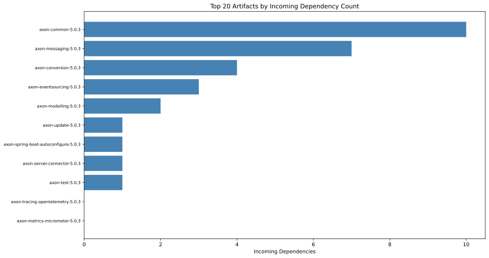

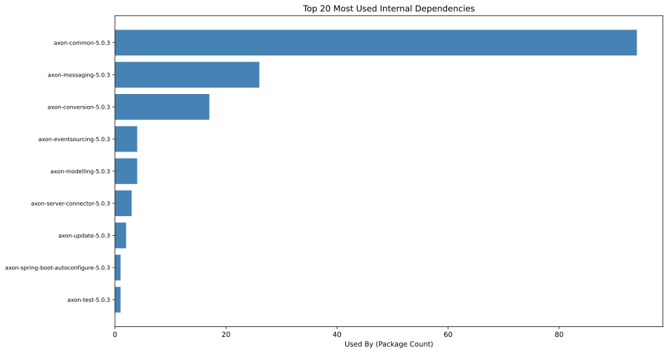

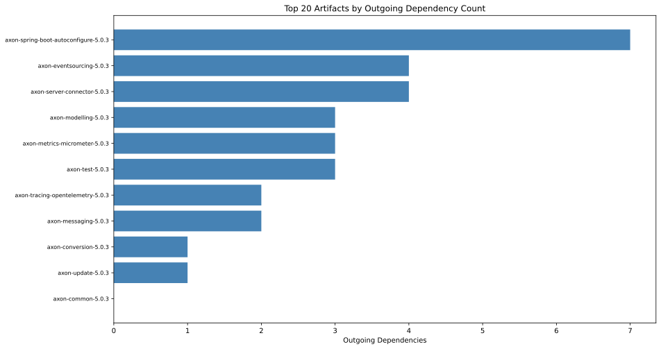

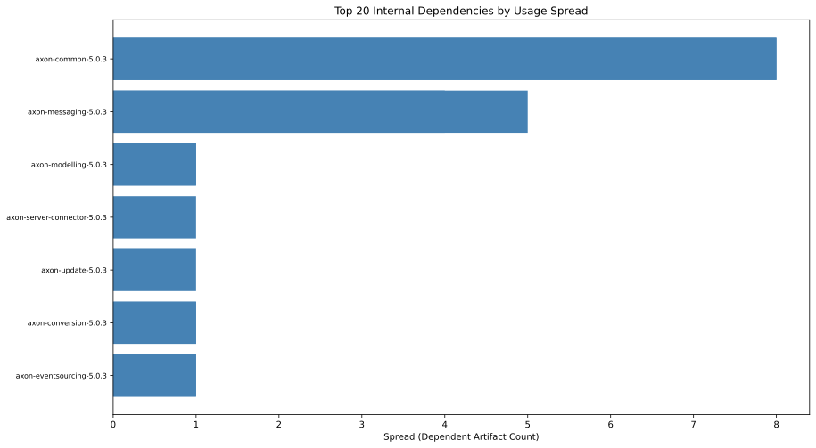

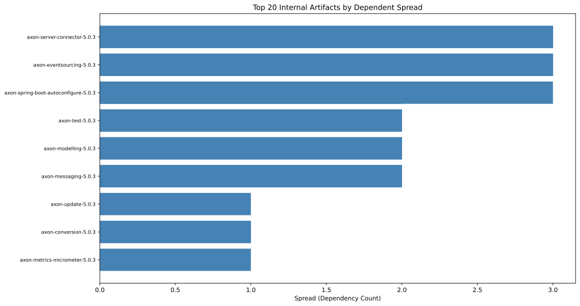

---

## 3. Method Metrics

Effective Lines Of Code (LOC) per type and package. High values = complex or large.

### 3.1 Effective Method Line Count Distribution

| artifactName | effectiveLineCount | methods |
| --- | --- | --- |
| axon-common-5.0.3.jar | 1 | 369 |
| axon-common-5.0.3.jar | 2 | 145 |
| axon-common-5.0.3.jar | 3 | 97 |
| axon-common-5.0.3.jar | 4 | 38 |
| axon-common-5.0.3.jar | 5 | 36 |
| axon-common-5.0.3.jar | 6 | 36 |
| axon-common-5.0.3.jar | 7 | 15 |
| axon-common-5.0.3.jar | 8 | 18 |
| axon-common-5.0.3.jar | 9 | 11 |
| axon-common-5.0.3.jar | 10 | 7 |

[Full data](./EffectiveMethodLineCountDistribution.csv)

### 3.2 Top Types by Effective LOC

| artifactName | packageName | typeName | sumEffectiveLinesOfMethodCode | maxEffectiveLinesOfMethodCode | methodWithMaxEffectiveLinesOfMethodCode | maxCyclomaticComplexity | methodWithMaxCyclomaticComplexity |
| --- | --- | --- | --- | --- | --- | --- | --- |
| axon-messaging-5.0.3 | org.axonframework.messaging.eventhandling.processing.streaming.pooled | Coordinator$CoordinationTask | 393 | 111 | run | 25 | run |
| axon-messaging-5.0.3 | org.axonframework.messaging.eventhandling.processing.streaming.token.store.jdbc | JdbcTokenStore | 298 | 25 | updateToken | 8 | updateToken |
| axon-test-5.0.3 | org.axonframework.test.fixture | Reporter | 224 | 45 | appendEventOverview | 11 | appendEventOverview |
| axon-eventsourcing-5.0.3 | org.axonframework.eventsourcing.eventstore.jpa | AggregateBasedJpaEventStorageEngine | 192 | 17 | <init> | 5 | lambda$queryTokensAndEventsBy$17 |
| axon-messaging-5.0.3 | org.axonframework.messaging.eventhandling.processing.streaming.pooled | WorkPackage | 190 | 25 | processEvents | 7 | processEvents |
| axon-modelling-5.0.3 | org.axonframework.modelling.entity.annotation | AnnotatedEntityMetamodel | 170 | 18 | createOptionalChildForMember | 6 | getExpectedRepresentation |
| axon-common-5.0.3 | org.axonframework.common.configuration | DefaultComponentRegistry | 153 | 18 | invokeEnhancers | 8 | registerComponent |
| axon-server-connector-5.0.3 | org.axonframework.axonserver.connector | AxonServerConfiguration | 149 | 30 | <init> | 3 | getNewPermitsThreshold |
| axon-messaging-5.0.3 | org.axonframework.messaging.eventhandling.processing.streaming.token.store.jpa | JpaTokenStore | 146 | 19 | lambda$storeToken$1 | 6 | validateSegment |
| axon-messaging-5.0.3 | org.axonframework.messaging.eventhandling.processing.streaming.pooled | PooledStreamingEventProcessorConfiguration | 146 | 15 | describeTo | 2 | ignoredMessageHandler |

[Full data](./EffectiveLinesOfMethodCodePerType.csv)

### 3.3 Top Packages by Effective LOC

| artifactName | fullPackageName | linesInPackage | complexityInPackage | methodCount | maxLinesMethod | maxLinesMethodType | maxLinesMethodName | maxComplexity | maxComplexityType | maxComplexityMethod | packageName |
| --- | --- | --- | --- | --- | --- | --- | --- | --- | --- | --- | --- |
| axon-messaging-5.0.3 | org.axonframework.messaging.eventhandling.processing.streaming.pooled | 1409 | 548 | 397 | 111 | Coordinator$CoordinationTask | run | 25 | Coordinator$CoordinationTask | run | pooled |
| axon-messaging-5.0.3 | org.axonframework.messaging.core | 1119 | 731 | 531 | 16 | MessageStreamUtils$Reducer | process | 9 | MessageStreamUtils$Reducer | process | core |
| axon-test-5.0.3 | org.axonframework.test.fixture | 752 | 325 | 211 | 45 | Reporter | appendEventOverview | 11 | Reporter | appendEventOverview | fixture |
| axon-common-5.0.3 | org.axonframework.common.configuration | 710 | 388 | 288 | 26 | DefaultAxonApplication$AxonConfigurationImpl | invokeLifecycleHandlers | 8 | DefaultComponentRegistry | registerComponent | configuration |
| axon-messaging-5.0.3 | org.axonframework.messaging.core.annotation | 702 | 371 | 235 | 23 | MethodInvokingMessageHandlingMember | <init> | 13 | MessageStreamResolverUtils | resolveToStream | annotation |
| axon-server-connector-5.0.3 | org.axonframework.axonserver.connector | 698 | 357 | 278 | 42 | AxonServerConnectionManager$Builder | build | 12 | AxonServerConnectionManager$Builder | build | connector |
| axon-common-5.0.3 | org.axonframework.common | 614 | 388 | 183 | 24 | TypeReflectionUtils | getExactDirectSuperTypesOfParameterizedTypeOrClass | 9 | ReflectionUtils | fieldNameFromMember | common |
| axon-eventsourcing-5.0.3 | org.axonframework.eventsourcing.eventstore | 605 | 377 | 234 | 19 | AnnotationBasedTagResolver | createTagsForValue | 8 | AggregateBasedConsistencyMarker | from | eventstore |
| axon-server-connector-5.0.3 | org.axonframework.axonserver.connector.event | 540 | 218 | 162 | 21 | AggregateBasedAxonServerEventStorageEngine | lambda$appendEvents$0 | 4 | AggregateBasedAxonServerEventStorageEngine | lambda$appendEvents$0 | event |
| axon-messaging-5.0.3 | org.axonframework.messaging.eventhandling.processing.streaming.token.store.jdbc | 436 | 194 | 109 | 25 | JdbcTokenStore | updateToken | 8 | JdbcTokenStore | updateToken | jdbc |

[Full data](./EffectiveLinesOfMethodCodePerPackage.csv)

### 3.4 Method Metrics Charts

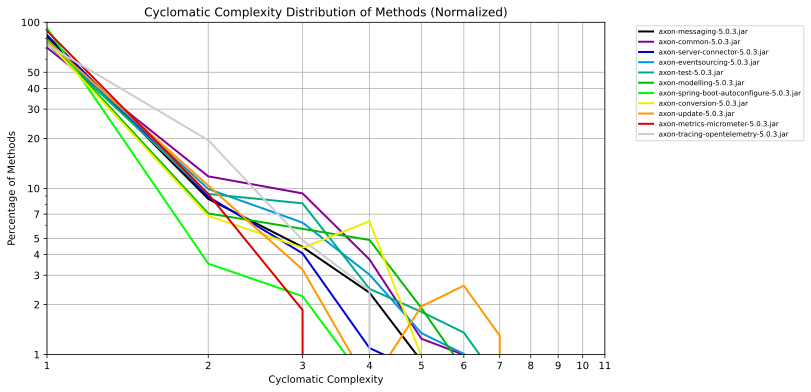

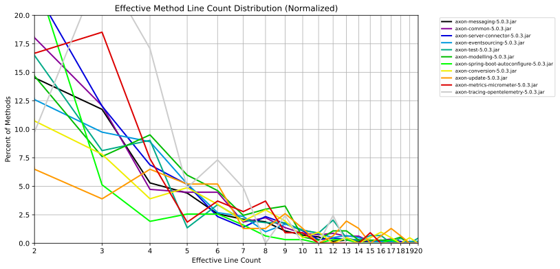

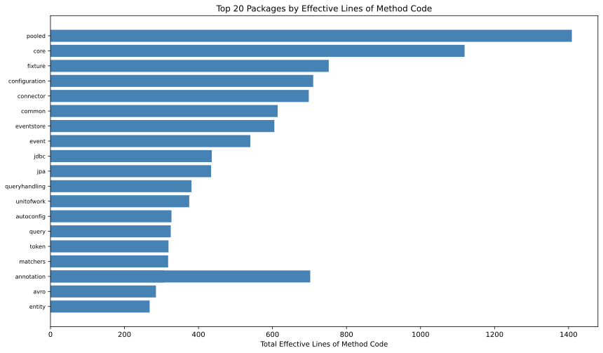

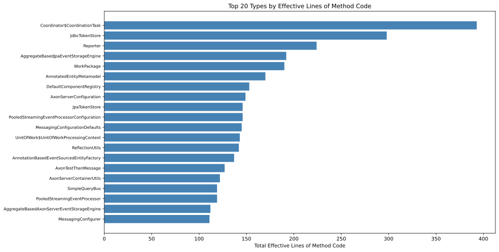

---

## 4. Java Code Quality

Annotations, deprecated API usages, and reflection calls.

### 4.1 Annotated Code Elements

| annotationName | languageElement | numberOfAnnotatedElements | examples |
| --- | --- | --- | --- |
| jakarta.annotation.Nonnull | Parameter | 3497 | ["org.axonframework.test.fixture.RecordingCommandBus.<init>(0)","org.axonframework.test.fixture.RecordingCommandBus.dispatch(0)","org.axonframework.test.fixture.RecordingCommandBus.subscribe(0)","org.axonframework.test.fixture.RecordingCommandBus.subscribe(1)","org.axonframework.test.fixture.RecordingCommandBus.describeTo(0)","org.axonframework.test.fixture.RecordingCommandBus.resultOf(0)","org.axonframework.test.fixture.AxonTestFixture$Customization.<init>(1)","org.axonframework.test.fixture.AxonTestFixture$Customization.registerFieldFilter(0)","org.axonframework.test.fixture.AxonTestFixture$Customization.registerIgnoredField(0)"] |
| jakarta.annotation.Nonnull | Method | 865 | ["org.axonframework.test.extension.ProvidedAxonTestFixtureUtils.getAxonTestFixtureProvider","org.axonframework.test.FixtureResourceParameterResolverFactory$FailingParameterResolver.resolveParameterValue","org.axonframework.messaging.commandhandling.distributed.DistributedCommandBusConfiguration.executorServiceFactory","org.axonframework.messaging.monitoring.interception.MonitoringEventHandlerInterceptor.interceptOnHandle","org.axonframework.messaging.monitoring.interception.MonitoringQueryHandlerInterceptor.interceptOnHandle","org.axonframework.messaging.monitoring.interception.MonitoringSubscriptionQueryUpdateDispatchInterceptor.interceptOnDispatch","org.axonframework.messaging.monitoring.interception.MonitoringCommandHandlerInterceptor.interceptOnHandle","org.axonframework.messaging.monitoring.interception.MonitoringEventDispatchInterceptor.interceptOnDispatch","org.axonframework.messaging.monitoring.configuration.MessageMonitorRegistry.registerMonitor"] |
| jakarta.annotation.Nullable | Parameter | 395 | ["org.axonframework.test.fixture.RecordingCommandBus.dispatch(1)","org.axonframework.test.fixture.AxonTestThenCommand.<init>(4)","org.axonframework.test.fixture.AxonTestThenNothing.<init>(3)","org.axonframework.test.fixture.RecordingEventSink.publish(0)","org.axonframework.test.fixture.AxonTestThenMessage.<init>(3)","org.axonframework.test.fixture.AxonTestThenEvent.<init>(3)","org.axonframework.test.fixture.RecordingEventStore.open(1)","org.axonframework.test.fixture.RecordingEventStore.firstToken(0)","org.axonframework.test.fixture.RecordingEventStore.latestToken(0)"] |
| jakarta.annotation.Nullable | Method | 112 | ["org.axonframework.test.fixture.RecordingCommandBus.resultOf","org.axonframework.test.extension.AxonFrameworkExtension.resolveParameter","org.axonframework.messaging.monitoring.configuration.MessageMonitorFactory.build","org.axonframework.messaging.commandhandling.annotation.CommandDispatcherParameterResolverFactory.createInstance","org.axonframework.messaging.commandhandling.gateway.CommandGateway.sendAndWait","org.axonframework.messaging.eventhandling.annotation.EventAppenderParameterResolverFactory.createInstance","org.axonframework.messaging.eventhandling.replay.annotation.ReplayParameterResolverFactory.createInstance","org.axonframework.messaging.eventhandling.replay.annotation.ReplayContextParameterResolverFactory.createInstance","org.axonframework.messaging.eventhandling.processing.streaming.token.annotation.TrackingTokenParameterResolverFactory.createInstance"] |
| org.axonframework.common.annotation.Internal | Class | 83 | ["org.axonframework.test.fixture.RecordingComponentsRegistry","org.axonframework.test.fixture.RecordingCommandBus","org.axonframework.test.fixture.RecordingEventSink","org.axonframework.test.fixture.MessagesRecordingConfigurationEnhancer","org.axonframework.test.util.RecordingCommandBus","org.axonframework.test.fixture.RecordingEventBus","org.axonframework.test.fixture.RecordingEventStore","org.axonframework.test.extension.ProvidedAxonTestFixtureUtils","org.axonframework.messaging.monitoring.configuration.DefaultMessageMonitorRegistry"] |
| jakarta.annotation.Nonnull | Field | 72 | ["org.axonframework.test.fixture.AxonTestFixture$Customization.fieldFilters","org.axonframework.messaging.commandhandling.distributed.DistributedCommandBusConfiguration.executorServiceFactory","org.axonframework.messaging.commandhandling.gateway.ConvertingCommandGateway$ConvertingCommandResult.commandConverter","org.axonframework.messaging.commandhandling.gateway.ConvertingCommandGateway$ConvertingCommandResult.delegate","org.axonframework.messaging.eventhandling.processing.streaming.token.store.jdbc.JdbcTokenStoreConfiguration.schema","org.axonframework.messaging.eventhandling.processing.streaming.token.store.jdbc.JdbcTokenStoreConfiguration.claimTimeout","org.axonframework.messaging.eventhandling.processing.streaming.token.store.jdbc.JdbcTokenStoreConfiguration.nodeId","org.axonframework.messaging.eventhandling.processing.streaming.token.store.jpa.JpaTokenStoreConfiguration.loadingLockMode","org.axonframework.messaging.eventhandling.processing.streaming.token.store.jpa.JpaTokenStoreConfiguration.claimTimeout"] |
| java.lang.FunctionalInterface | Interface | 59 | ["org.axonframework.test.extension.AxonTestFixtureProvider","org.axonframework.test.matchers.FieldFilter","org.axonframework.messaging.monitoring.configuration.MessageMonitorFactory","org.axonframework.messaging.commandhandling.distributed.CommandBusConnector$Handler","org.axonframework.messaging.commandhandling.CommandHandler","org.axonframework.messaging.commandhandling.CommandPriorityCalculator","org.axonframework.messaging.eventhandling.EventHandler","org.axonframework.messaging.eventhandling.processing.streaming.pooled.PooledStreamingEventProcessorModule$Customization","org.axonframework.messaging.eventhandling.processing.streaming.pooled.WorkPackage$EventFilter"] |
| org.springframework.context.annotation.Bean | Method | 45 | ["org.axonframework.extension.springboot.autoconfig.JdbcTransactionAutoConfiguration.axonTransactionManager","org.axonframework.extension.springboot.autoconfig.AxonTimeoutAutoConfiguration.messageTimeoutHandlerEnhancerDefinition","org.axonframework.extension.springboot.autoconfig.AxonTimeoutAutoConfiguration.axonTimeoutConfigurationEnhancer","org.axonframework.extension.springboot.autoconfig.CorrelationDataProviderAutoConfiguration.providerDecorator","org.axonframework.extension.springboot.autoconfig.Jackson2MapperAutoConfiguration.defaultAxonJackson2Mapper","org.axonframework.extension.springboot.autoconfig.AvroSchemaStoreAutoConfiguration.defaultAxonSchemaStore","org.axonframework.extension.springboot.autoconfig.AvroSchemaStoreAutoConfiguration.collectAvroSchemasFromClassPath","org.axonframework.extension.springboot.autoconfig.AvroSchemaStoreAutoConfiguration.specificRecordBaseClasspathAvroSchemaLoader","org.axonframework.extension.springboot.autoconfig.InfrastructureAutoConfiguration.messageHandlerLookup"] |
| java.lang.annotation.Retention | Annotation | 42 | ["org.axonframework.test.extension.ProvidedAxonTestFixture","org.axonframework.messaging.commandhandling.annotation.CommandHandler","org.axonframework.messaging.commandhandling.annotation.Command","org.axonframework.messaging.eventhandling.annotation.SequenceNumber","org.axonframework.messaging.eventhandling.annotation.EventHandler","org.axonframework.messaging.eventhandling.annotation.Timestamp","org.axonframework.messaging.eventhandling.annotation.ConcludesBatch","org.axonframework.messaging.eventhandling.annotation.Event","org.axonframework.messaging.eventhandling.replay.annotation.AllowReplay"] |
| java.lang.annotation.Target | Annotation | 42 | ["org.axonframework.test.extension.ProvidedAxonTestFixture","org.axonframework.messaging.commandhandling.annotation.CommandHandler","org.axonframework.messaging.commandhandling.annotation.Command","org.axonframework.messaging.eventhandling.annotation.SequenceNumber","org.axonframework.messaging.eventhandling.annotation.EventHandler","org.axonframework.messaging.eventhandling.annotation.Timestamp","org.axonframework.messaging.eventhandling.annotation.ConcludesBatch","org.axonframework.messaging.eventhandling.annotation.Event","org.axonframework.messaging.eventhandling.replay.annotation.AllowReplay"] |

[Full data](./AnnotatedCodeElements.csv)

### 4.2 Annotated Code Elements per Artifact

| artifactName | annotationName | languageElement | numberOfAnnotatedElements | examples |
| --- | --- | --- | --- | --- |
| axon-common-5.0.3 | jakarta.annotation.Nonnull | Parameter | 288 | ["org.axonframework.common.AxonThreadFactory.newThread(0)","org.axonframework.common.util.ExecutorServiceFactory.createExecutorService(0)","org.axonframework.common.util.ExecutorServiceFactory.createExecutorService(1)","org.axonframework.common.ReflectionUtils.getFieldValue(0)","org.axonframework.common.ReflectionUtils.getFieldValue(1)","org.axonframework.common.ReflectionUtils.setFieldValue(0)","org.axonframework.common.ReflectionUtils.setFieldValue(1)","org.axonframework.common.ReflectionUtils.setFieldValue(2)","org.axonframework.common.ReflectionUtils.declaringClass(0)"] |
| axon-common-5.0.3 | jakarta.annotation.Nonnull | Method | 43 | ["org.axonframework.common.util.ExecutorServiceFactory.createExecutorService","org.axonframework.common.ReflectionUtils.ensureAccessible","org.axonframework.common.ReflectionUtils.fieldsOf","org.axonframework.common.ReflectionUtils.methodOf","org.axonframework.common.ReflectionUtils.methodsOf","org.axonframework.common.ReflectionUtils.resolvePrimitiveWrapperType","org.axonframework.common.ReflectionUtils.resolvePrimitiveWrapperTypeIfPrimitive","org.axonframework.common.ReflectionUtils.unwrapIfType","org.axonframework.common.ReflectionUtils.resolveGenericType"] |
| axon-common-5.0.3 | jakarta.annotation.Nullable | Parameter | 36 | ["org.axonframework.common.StringUtils.capitalize(0)","org.axonframework.common.ReflectionUtils.explicitlyUnequal(0)","org.axonframework.common.ReflectionUtils.explicitlyUnequal(1)","org.axonframework.common.lifecycle.LifecycleHandlerInvocationException.<init>(1)","org.axonframework.common.configuration.DefaultComponentRegistry$LocalConfiguration.<init>(0)","org.axonframework.common.configuration.DefaultComponentRegistry$LocalConfiguration.getOptionalComponent(1)","org.axonframework.common.configuration.DefaultComponentRegistry$LocalConfiguration.getComponent(1)","org.axonframework.common.configuration.ComponentDefinition.ofTypeAndName(1)","org.axonframework.common.configuration.ComponentRegistry.registerComponent(1)"] |
| axon-common-5.0.3 | java.lang.FunctionalInterface | Interface | 12 | ["org.axonframework.common.jdbc.JdbcUtils$SqlResultConverter","org.axonframework.common.util.ExecutorServiceFactory","org.axonframework.common.property.Property","org.axonframework.common.Registration","org.axonframework.common.jdbc.ConnectionProvider","org.axonframework.common.jdbc.JdbcUtils$SqlFunction","org.axonframework.common.infra.DescribableComponent","org.axonframework.common.lock.LockFactory","org.axonframework.common.configuration.LifecycleHandler"] |
| axon-common-5.0.3 | jakarta.annotation.Nullable | Method | 7 | ["org.axonframework.common.ReflectionUtils.declaringClass","org.axonframework.common.FutureUtils.joinAndUnwrap","org.axonframework.common.configuration.AbstractComponent.name","org.axonframework.common.configuration.ComponentDefinition.name","org.axonframework.common.configuration.Component$Identifier.name","org.axonframework.common.configuration.Configuration.getParent","org.axonframework.common.configuration.Components.put"] |
| axon-common-5.0.3 | org.axonframework.common.annotation.Internal | Class | 5 | ["org.axonframework.common.jdbc.ConnectionExecutor","org.axonframework.common.jpa.EntityManagerExecutor","org.axonframework.common.configuration.LazyInitializedComponentDefinition","org.axonframework.common.configuration.InstantiatedComponentDefinition","org.axonframework.common.configuration.Components"] |
| axon-common-5.0.3 | org.axonframework.common.annotation.Internal | Interface | 4 | ["org.axonframework.common.jdbc.ConnectionProvider","org.axonframework.common.tx.TransactionalExecutor","org.axonframework.common.jpa.EntityManagerProvider","org.axonframework.common.configuration.Component"] |
| axon-common-5.0.3 | java.lang.annotation.Target | Annotation | 2 | ["org.axonframework.common.annotation.Internal","org.axonframework.common.Priority"] |
| axon-common-5.0.3 | java.lang.annotation.Retention | Annotation | 2 | ["org.axonframework.common.annotation.Internal","org.axonframework.common.Priority"] |
| axon-common-5.0.3 | jakarta.annotation.Nonnull | Field | 2 | ["org.axonframework.common.configuration.AbstractComponent$HandlerRegistration.handler","org.axonframework.common.configuration.Component$Identifier.type"] |

[Full data](./AnnotatedCodeElementsPerArtifact.csv)

### 4.3 Deprecated Element Usages

| artifactName | deprecatedElement | numberOfElementsUsingDeprecatedElements | someElementsUsingDeprecatedElements |
| --- | --- | --- | --- |
| axon-eventsourcing-5.0.3 | Field | 1 | ["org.axonframework.eventsourcing.eventstore.jpa.GapAwareTrackingTokenOperations.gapTimeoutThreshold"] |
| axon-messaging-5.0.3 | Class | 1 | ["org.axonframework.messaging.core.interception.annotation.MessageHandlerInterceptorMemberChain"] |
| axon-messaging-5.0.3 | Method | 3 | ["org.axonframework.messaging.core.interception.annotation.MessageHandlerInterceptorMemberChain.handle","org.axonframework.messaging.core.annotation.WrappedMessageHandlingMember.handleSync","org.axonframework.messaging.core.annotation.ChainedMessageHandlerInterceptorMember.doHandleSync"] |
| axon-messaging-5.0.3 | Field | 8 | ["org.axonframework.messaging.eventhandling.processing.streaming.pooled.PooledStreamingEventProcessor.releaseSegment","org.axonframework.messaging.eventhandling.processing.streaming.pooled.WorkPackage$Builder.<init>","org.axonframework.messaging.eventhandling.processing.streaming.pooled.Coordinator$Builder.<init>","org.axonframework.messaging.eventhandling.processing.streaming.pooled.PooledStreamingEventProcessorConfiguration.<init>","org.axonframework.messaging.eventhandling.processing.streaming.pooled.Coordinator$CoordinationTask.lambda$releaseSegmentsIfTooManyClaimed$13","org.axonframework.messaging.eventhandling.GenericEventMessage.<init>","org.axonframework.messaging.eventhandling.gateway.EventPublishingUtils.lambda$asEventMessage$0","org.axonframework.messaging.eventhandling.gateway.EventPublishingUtils.lambda$asEventMessage$1"] |

[Full data](./DeprecatedElementUsage.csv)

### 4.4 Reflection Usages

| dependentArtifactName | numberOfReflectionCaller | someReflectionCaller | someReflectionTypes |
| --- | --- | --- | --- |
| axon-test-5.0.3 | 78 | ["org.axonframework.test.util.package-info","org.axonframework.test.matchers.AllFieldsFilter","org.axonframework.test.util.RecordingMessageMonitor","org.axonframework.test.util.CallbackBehavior","org.axonframework.test.fixture.Reporter","org.axonframework.test.fixture.AxonTestThenNothing","org.axonframework.test.fixture.AxonTestThenCommand","org.axonframework.test.matchers.MapStringEntryMatcher$Matching","org.axonframework.test.fixture.AxonTestPhase$When$Nothing","org.axonframework.test.AxonAssertionError","org.axonframework.test.fixture.AxonTestWhen","org.axonframework.test.matchers.EmptyCollectionMatcher","org.axonframework.test.fixture.AxonTestPhase$Then","org.axonframework.test.fixture.AxonTestFixture","org.axonframework.test.matchers.PayloadsMatcher","org.axonframework.test.fixture.AxonTestPhase$Then$Command","org.axonframework.test.matchers.DeepEqualsMatcher","org.axonframework.test.matchers.NullOrVoidMatcher","org.axonframework.test.fixture.AxonTestFixture$Customization"] | ["java.lang.reflect.Field","java.lang.reflect.Parameter","java.lang.reflect.AnnotatedElement","java.lang.reflect.Constructor","java.lang.reflect.Method","java.lang.reflect.Modifier","java.lang.reflect.Executable"] |
| axon-messaging-5.0.3 | 579 | ["org.axonframework.messaging.core.package-info","org.axonframework.messaging.queryhandling.annotation.MethodQueryHandlerDefinition","org.axonframework.messaging.core.MessageDispatchInterceptor","org.axonframework.messaging.eventhandling.processing.streaming.pooled.WorkPackage$BatchProcessingEntry","org.axonframework.messaging.queryhandling.distributed.DistributedQueryBusConfigurationEnhancer","org.axonframework.messaging.eventhandling.processing.streaming.token.store.UnableToInitializeTokenException","org.axonframework.messaging.core.GenericResultMessage","org.axonframework.messaging.core.unitofwork.annotation.ProcessingContextParameterResolverFactory$ProcessingContextParameterResolver","org.axonframework.messaging.core.annotation.AggregateType","org.axonframework.messaging.core.unitofwork.annotation.ProcessingContextParameterResolverFactory","org.axonframework.messaging.eventhandling.processing.streaming.segmenting.WrappedTrackerStatus","org.axonframework.messaging.eventstreaming.EventTypeRestrictableOrEventCriteria","org.axonframework.messaging.core.MappedMessageStream","org.axonframework.messaging.core.MessageTypeResolver","org.axonframework.messaging.core.timeout.HandlerTimeoutHandlerEnhancerDefinition","org.axonframework.messaging.queryhandling.configuration.QueryHandlingModule$QueryHandlerPhase","org.axonframework.messaging.core.annotation.AnnotatedHandlerAttributes","org.axonframework.messaging.eventhandling.processing.streaming.pooled.MaxSegmentProvider","org.axonframework.messaging.monitoring.MessageMonitor"] | ["java.lang.reflect.Type","java.lang.reflect.Executable","java.lang.reflect.Parameter","java.lang.reflect.AnnotatedElement","java.lang.reflect.Field","java.lang.reflect.InvocationTargetException","java.lang.reflect.Method","java.lang.reflect.Member","java.lang.reflect.Constructor","java.lang.reflect.Modifier","java.lang.reflect.WildcardType"] |
| axon-spring-boot-autoconfigure-5.0.3 | 75 | ["org.axonframework.extension.springboot.TokenStoreProperties","org.axonframework.extension.springboot.autoconfig.ObjectMapperAutoConfiguration$JacksonConfiguredCondition$EventsJacksonCondition","org.axonframework.extension.springboot.actuator.axonserver.AxonServerStatusAggregator","org.axonframework.extension.springboot.autoconfig.UpdateCheckerAutoConfiguration","org.axonframework.extension.springboot.util.RegisterDefaultEntities","org.axonframework.extension.springboot.service.connection.AxonServerTestContainerConnectionDetailsFactory$AxonServerContainerConnectionDetails","org.axonframework.extension.springboot.autoconfig.AxonAutoConfiguration","org.axonframework.extension.springboot.EventProcessorProperties$ProcessorSettings","org.axonframework.extension.springboot.actuator.axonserver.AxonServerHealthIndicator","org.axonframework.extension.springboot.service.connection.AxonServerDockerComposeConnectionDetailsFactory","org.axonframework.extension.springboot.service.connection.AxonServerConnectionDetails","org.axonframework.extension.springboot.autoconfig.AvroSchemaStoreAutoConfiguration$AvroConfiguredCondition$MessagesAvroCondition","org.axonframework.extension.springboot.util.DefaultEntityRegistrar","org.axonframework.extension.springboot.autoconfig.AvroSchemaStoreAutoConfiguration$AvroConfiguredCondition","org.axonframework.extension.springboot.util.jpa.ContainerManagedEntityManagerProvider","org.axonframework.extension.springboot.TimeoutProperties$TransactionTimeoutProperties","org.axonframework.extension.springboot.autoconfig.UpdateCheckerAutoConfiguration$1","org.axonframework.extension.springboot.util.ConditionalOnMissingQualifiedBean","org.axonframework.extension.springboot.autoconfig.ObjectMapperAutoConfiguration"] | [] |
| axon-tracing-opentelemetry-5.0.3 | 5 | ["org.axonframework.extension.tracing.opentelemetry.OpenTelemetrySpanFactory","org.axonframework.extension.tracing.opentelemetry.MetadataContextGetter","org.axonframework.extension.tracing.opentelemetry.MetadataContextSetter","org.axonframework.extension.tracing.opentelemetry.OpenTelemetrySpanFactory$Builder","org.axonframework.extension.tracing.opentelemetry.OpenTelemetrySpan"] | [] |
| axon-eventsourcing-5.0.3 | 100 | ["org.axonframework.eventsourcing.eventstore.jpa.AggregateBasedJpaEventStorageEngine$AggregateSource","org.axonframework.eventsourcing.eventstore.EventStore","org.axonframework.eventsourcing.annotation.EventSourcedEntityFactoryDefinition","org.axonframework.eventsourcing.configuration.SimpleEventSourcedEntityModule","org.axonframework.eventsourcing.eventstore.InterceptingEventStore$InterceptingEventStoreTransaction","org.axonframework.eventsourcing.eventstore.PayloadBasedTagResolver","org.axonframework.eventsourcing.configuration.EventSourcedEntityModule","org.axonframework.eventsourcing.annotation.reflection.AnnotationBasedEventSourcedEntityFactory$IdTypeParameterResolver","org.axonframework.eventsourcing.eventstore.EventStoreException","org.axonframework.eventsourcing.eventstore.EventCoordinator$Handle","org.axonframework.eventsourcing.eventstore.jpa.AggregateBasedJpaEventStorageEngine","org.axonframework.eventsourcing.eventstore.jpa.SQLErrorCodesResolver","org.axonframework.eventsourcing.configuration.EventSourcedEntityModule$EntityFactoryPhase","org.axonframework.eventsourcing.configuration.SimpleEventSourcedEntityModule$5","org.axonframework.eventsourcing.eventstore.InterceptingEventStore","org.axonframework.eventsourcing.annotation.CriteriaResolverDefinition","org.axonframework.eventsourcing.configuration.SimpleEventSourcedEntityModule$3","org.axonframework.eventsourcing.eventstore.TaggedEventMessage","org.axonframework.eventsourcing.eventstore.StorageEngineBackedEventStore"] | ["java.lang.reflect.Constructor","java.lang.reflect.Executable","java.lang.reflect.Method","java.lang.reflect.Modifier","java.lang.reflect.AnnotatedElement","java.lang.reflect.Field","java.lang.reflect.Member","java.lang.reflect.InvocationTargetException"] |
| axon-server-connector-5.0.3 | 72 | ["org.axonframework.axonserver.connector.AxonServerConfiguration$HeartbeatConfiguration","org.axonframework.axonserver.connector.AxonServerConfiguration$EventStoreConfiguration","org.axonframework.axonserver.connector.query.AxonServerQueryBusConnector","org.axonframework.axonserver.connector.MetadataConverter","org.axonframework.axonserver.connector.TagsConfiguration","org.axonframework.axonserver.connector.util.GrpcMessageSizeInterceptor$1$1","org.axonframework.axonserver.connector.MetadataConverter$1","org.axonframework.axonserver.connector.query.FlowControlledResponseSender","org.axonframework.axonserver.connector.command.AxonServerCommandBusConnector$FutureResultCallback","org.axonframework.axonserver.connector.ErrorCode","org.axonframework.axonserver.connector.AxonServerConfiguration$FlowControlConfiguration","org.axonframework.axonserver.connector.query.QueryResponseMessageStream","org.axonframework.axonserver.connector.query.QueryConverter","org.axonframework.axonserver.connector.AxonServerConfigurationEnhancer","org.axonframework.axonserver.connector.AxonServerException","org.axonframework.axonserver.connector.event.AggregateBasedAxonServerEventStorageEngine$1","org.axonframework.axonserver.connector.util.PriorityTaskSchedulers","org.axonframework.axonserver.connector.util.ProcessingInstructionUtils","org.axonframework.axonserver.connector.TargetContextResolver"] | [] |
| axon-update-5.0.3 | 23 | ["org.axonframework.update.api.UpdateCheckResponse","org.axonframework.update.configuration.UsagePropertyProvider","org.axonframework.update.configuration.EnvironmentVariableUsagePropertyProvider$EnvironmentVariableSupplier","org.axonframework.update.detection.KotlinVersion","org.axonframework.update.common.DelayedTask","org.axonframework.update.configuration.CommandLineUsagePropertyProvider","org.axonframework.update.api.UpdateCheckRequest","org.axonframework.update.api.ArtifactAvailableUpgrade","org.axonframework.update.LoggingUpdateCheckerReporter","org.axonframework.update.detection.MachineId","org.axonframework.update.detection.TestEnvironmentDetector","org.axonframework.update.UpdateCheckerReporter","org.axonframework.update.configuration.HierarchicalUsagePropertyProvider","org.axonframework.update.configuration.DefaultUsagePropertyProvider","org.axonframework.update.configuration.PropertyFileUsagePropertyProvider","org.axonframework.update.api.DetectedVulnerability","org.axonframework.update.UpdateChecker","org.axonframework.update.UpdateCheckerConfigurationEnhancer","org.axonframework.update.detection.AxonVersionDetector"] | ["java.lang.reflect.Method"] |
| axon-common-5.0.3 | 156 | ["org.axonframework.common.TypeReflectionUtils","org.axonframework.common.util.MavenArtifactVersionResolver","org.axonframework.common.infra.FilesystemStyleComponentDescriptor$TreeRenderer$RenderContext","org.axonframework.common.jpa.SimpleEntityManagerProvider","org.axonframework.common.util.ExecutorServiceFactory","org.axonframework.common.infra.FilesystemStyleComponentDescriptor$SymbolicLink","org.axonframework.common.lock.PessimisticLockFactory","org.axonframework.common.jdbc.PersistenceExceptionResolver","org.axonframework.common.configuration.DefaultComponentRegistry$LocalConfiguration","org.axonframework.common.IdentifierValidator","org.axonframework.common.jdbc.ConnectionWrapperFactory","org.axonframework.common.infra.DescribableComponent","org.axonframework.common.configuration.ComponentRegistry","org.axonframework.common.property.BeanPropertyAccessStrategy","org.axonframework.common.configuration.Components","org.axonframework.common.package-info","org.axonframework.common.configuration.AbstractComponent$HandlerRegistration","org.axonframework.common.caching.WeakReferenceCache","org.axonframework.common.caching.EhCacheAdapter"] | ["java.lang.reflect.Array","java.lang.reflect.GenericArrayType","java.lang.reflect.ParameterizedType","java.lang.reflect.Type","java.lang.reflect.TypeVariable","java.lang.reflect.WildcardType","java.lang.reflect.InvocationTargetException","java.lang.reflect.Method","java.lang.reflect.Proxy","java.lang.reflect.AccessibleObject","java.lang.reflect.Executable","java.lang.reflect.Field","java.lang.reflect.Member","java.lang.reflect.Modifier","java.lang.reflect.AnnotatedElement","java.lang.reflect.Constructor"] |
| axon-modelling-5.0.3 | 92 | ["org.axonframework.modelling.RepositoryAlreadyRegisteredException","org.axonframework.modelling.entity.annotation.UnknownRoutingKeyException","org.axonframework.modelling.annotation.TargetEntityIdMemberMismatchException","org.axonframework.modelling.entity.child.ListEntityChildMetamodel","org.axonframework.modelling.EntityIdResolver","org.axonframework.modelling.configuration.StateBasedEntityModule$EntityIdResolverPhase","org.axonframework.modelling.entity.child.GetterSetterChildEntityFieldDefinition","org.axonframework.modelling.ConcurrencyException","org.axonframework.modelling.annotation.AnnotationBasedEntityEvolvingComponent","org.axonframework.modelling.entity.ConcreteEntityMetamodel$Builder","org.axonframework.modelling.HierarchicalStateManagerConfigurationEnhancer","org.axonframework.modelling.annotation.InjectEntityParameterResolver","org.axonframework.modelling.EntityIdResolutionException","org.axonframework.modelling.configuration.StateBasedEntityModule$MessagingMetamodelPhase","org.axonframework.modelling.entity.EntityAlreadyExistsForCreationalCommandHandlerException","org.axonframework.modelling.entity.annotation.AnnotatedEntityMetamodel","org.axonframework.modelling.PropertyBasedEntityIdResolver","org.axonframework.modelling.annotation.AnnotationBasedEntityIdResolver","org.axonframework.modelling.HierarchicalStateManager"] | ["java.lang.reflect.Field","java.lang.reflect.Member","java.lang.reflect.Method","java.lang.reflect.Modifier","java.lang.reflect.AnnotatedElement","java.lang.reflect.Executable","java.lang.reflect.Parameter","java.lang.reflect.ParameterizedType"] |
| axon-conversion-5.0.3 | 35 | ["org.axonframework.conversion.ChainingContentTypeConverter","org.axonframework.conversion.avro.AvroConverterStrategy","org.axonframework.conversion.PassThroughConverter","org.axonframework.conversion.avro.AvroUtil","org.axonframework.conversion.jackson2.JsonNodeToByteArrayConverter","org.axonframework.conversion.ChainedConverter$Route","org.axonframework.conversion.avro.SchemaIncompatibilityChecker","org.axonframework.conversion.jackson2.ByteArrayToJsonNodeConverter","org.axonframework.conversion.converter.BlobToInputStreamConverter","org.axonframework.conversion.converter.InputStreamToByteArrayConverter","org.axonframework.conversion.jackson.ByteArrayToJsonNodeConverter","org.axonframework.conversion.avro.SpecificRecordBaseConverterStrategy","org.axonframework.conversion.avro.GenericRecordToByteArrayConverter","org.axonframework.conversion.avro.AvroConverterStrategyConfiguration","org.axonframework.conversion.jackson2.JsonNodeToObjectNodeConverter","org.axonframework.conversion.avro.ByteArrayToGenericRecordConverter","org.axonframework.conversion.ConversionException","org.axonframework.conversion.Converter","org.axonframework.conversion.jackson.ObjectNodeToJsonNodeConverter"] | ["java.lang.reflect.Constructor","java.lang.reflect.Type","java.lang.reflect.InvocationTargetException","java.lang.reflect.Method"] |

[Full data](./ReflectionUsage.csv)

### 4.5 Java Code Quality Charts

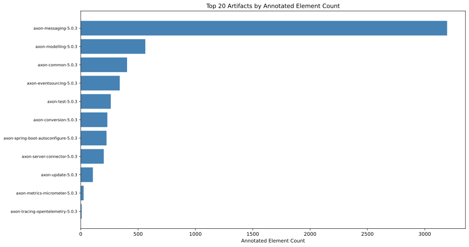

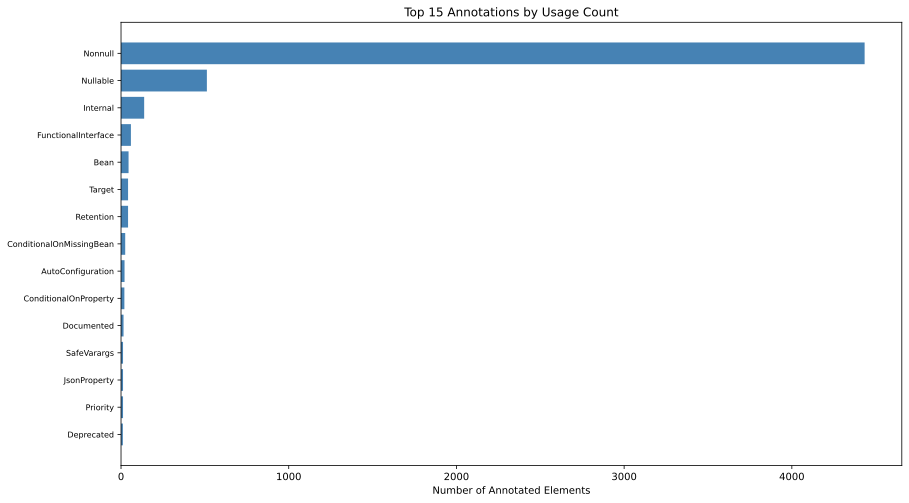

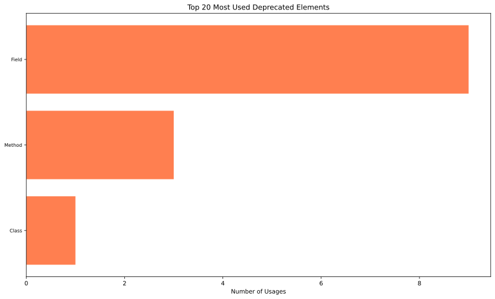

---

## 5. Web Framework Annotations

HTTP mapping annotations from Spring Web and Jakarta EE REST — declared REST endpoints.

### 5.1 Spring Web Request Annotations

### 5.2 Jakarta EE REST Annotations

### 5.3 Web Framework Charts

---

## 6. Duplicate Package Names

Package names in multiple artifacts. Can cause split-package issues on the module path.

---

## 7. Dependency Spread

How many distinct artifacts each internal module is depended on by (spread) and vice versa. Highly spread = critical infrastructure.

### 7.1 Spread per Dependency (most used by others)

| dependencyArtifactName | dependencyTypeIsInterface | usedInArtifacts | usedInPackages | minPackageSpread | maxPackageSpread | avgPackageSpread | stdPackageSpread | per5PackageSpread | minPackageCount | maxPackageCount | avgPackageCount | stdPackageCount | per5PackageCount | minTypeSpread | maxTypeSpread | avgTypeSpread | stdTypeSpread | per5TypeSpread |
| --- | --- | --- | --- | --- | --- | --- | --- | --- | --- | --- | --- | --- | --- | --- | --- | --- | --- | --- |
| axon-common-5.0.3 | false | 8 | 85 | 28.571428571428573 | 100 | 81.73123486682809 | 23.884337043035192 | 85.71428571428572 | 2 | 52 | 10.625 | 16.766782637107216 | 5 | 4 | 86.95652173913044 | 32.778943869701926 | 24.53504939899947 | 23.913043478260867 |
| axon-common-5.0.3 | true | 8 | 67 | 28.571428571428573 | 100 | 69.33414043583535 | 26.94844791986581 | 66.66666666666667 | 2 | 39 | 8.375 | 12.546342665721923 | 4 | 13.88888888888889 | 32.608695652173914 | 21.820866266877474 | 5.447178776304203 | 20.898100172711572 |
| axon-conversion-5.0.3 | true | 1 | 13 | 22.033898305084744 | 22.033898305084744 | 22.033898305084744 | 0 | 22.033898305084744 | 13 | 13 | 13 | 0 | 13 | 5.699481865284974 | 5.699481865284974 | 5.699481865284974 | 0 | 5.699481865284974 |
| axon-conversion-5.0.3 | false | 1 | 4 | 6.779661016949152 | 6.779661016949152 | 6.779661016949152 | 0 | 6.779661016949152 | 4 | 4 | 4 | 0 | 4 | 0.690846286701209 | 0.690846286701209 | 0.690846286701209 | 0 | 0.690846286701209 |
| axon-eventsourcing-5.0.3 | false | 1 | 2 | 40 | 40 | 40 | 0 | 40 | 2 | 2 | 2 | 0 | 2 | 11.11111111111111 | 11.11111111111111 | 11.11111111111111 | 0 | 11.11111111111111 |
| axon-eventsourcing-5.0.3 | true | 1 | 2 | 40 | 40 | 40 | 0 | 40 | 2 | 2 | 2 | 0 | 2 | 11.11111111111111 | 11.11111111111111 | 11.11111111111111 | 0 | 11.11111111111111 |
| axon-messaging-5.0.3 | true | 4 | 22 | 66.66666666666667 | 100 | 86.66666666666667 | 16.329931618554514 | 80 | 4 | 7 | 5.5 | 1.7320508075688772 | 4 | 34.72222222222222 | 46.73913043478261 | 41.480722779635826 | 5.85569584232349 | 38.46153846153847 |
| axon-messaging-5.0.3 | false | 5 | 22 | 28.571428571428573 | 100 | 68.38095238095238 | 35.169818023032796 | 80 | 2 | 7 | 4.4 | 2.5099800796022267 | 4 | 11.53846153846154 | 29.166666666666664 | 20.271460423634334 | 8.421435268389947 | 20.652173913043477 |
| axon-modelling-5.0.3 | true | 1 | 3 | 42.85714285714286 | 42.85714285714286 | 42.85714285714286 | 0 | 42.85714285714286 | 3 | 3 | 3 | 0 | 3 | 12 | 12 | 12 | 0 | 12 |
| axon-modelling-5.0.3 | false | 1 | 2 | 28.571428571428573 | 28.571428571428573 | 28.571428571428573 | 0 | 28.571428571428573 | 2 | 2 | 2 | 0 | 2 | 4 | 4 | 4 | 0 | 4 |

[Full data](./InternalArtifactUsageSpreadPerDependency.csv)

### 7.2 Spread per Dependent (depends on most others)

| artifactName | dependencyTypeIsInterface | artifactDependencies | artifactDependencyPackages | dependentPackagesRate | minPackageSpread | maxPackageSpread | avgPackageSpread | stdPackageSpread | per5PackageSpread | minPackageCount | maxPackageCount | avgPackageCount | stdPackageCount | per5PackageCount | minTypeSpread | maxTypeSpread | avgTypeSpread | stdTypeSpread | per5TypeSpread |
| --- | --- | --- | --- | --- | --- | --- | --- | --- | --- | --- | --- | --- | --- | --- | --- | --- | --- | --- | --- |
| axon-conversion-5.0.3 | false | 1 | 2 | 80 | 80 | 80 | 80 | 0 | 80 | 4 | 4 | 4 | 0 | 4 | 20 | 20 | 20 | 0 | 20 |
| axon-conversion-5.0.3 | true | 1 | 1 | 80 | 80 | 80 | 80 | 0 | 80 | 4 | 4 | 4 | 0 | 4 | 22.857142857142858 | 22.857142857142858 | 22.857142857142858 | 0 | 22.857142857142858 |
| axon-eventsourcing-5.0.3 | true | 3 | 24 | 80.95238095238095 | 42.85714285714286 | 100 | 80.95238095238095 | 32.991443953692894 | 100 | 3 | 7 | 5.666666666666667 | 2.3094010767585034 | 7 | 12 | 46 | 27.666666666666668 | 17.15614564327703 | 25 |
| axon-eventsourcing-5.0.3 | false | 3 | 15 | 66.66666666666667 | 28.571428571428573 | 100 | 66.66666666666667 | 35.95159254890834 | 71.42857142857143 | 2 | 7 | 4.666666666666667 | 2.5166114784235836 | 5 | 4 | 31 | 21 | 14.798648586948742 | 28 |
| axon-messaging-5.0.3 | false | 2 | 9 | 47.45762711864407 | 6.779661016949152 | 88.13559322033898 | 47.45762711864406 | 57.52733135076996 | 6.779661016949152 | 4 | 52 | 28 | 33.94112549695428 | 4 | 0.690846286701209 | 36.96027633851468 | 18.825561312607945 | 25.646359939408462 | 0.690846286701209 |
| axon-messaging-5.0.3 | true | 2 | 9 | 44.06779661016949 | 22.033898305084744 | 66.10169491525423 | 44.06779661016949 | 31.160637815000396 | 22.033898305084744 | 13 | 39 | 26 | 18.384776310850235 | 13 | 5.699481865284974 | 20.898100172711572 | 13.298791018998273 | 10.747046069847356 | 5.699481865284974 |
| axon-metrics-micrometer-5.0.3 | true | 1 | 1 | 66.66666666666667 | 66.66666666666667 | 66.66666666666667 | 66.66666666666667 | 0 | 66.66666666666667 | 2 | 2 | 2 | 0 | 2 | 18.75 | 18.75 | 18.75 | 0 | 18.75 |
| axon-modelling-5.0.3 | false | 2 | 9 | 92.85714285714286 | 85.71428571428572 | 100 | 92.85714285714286 | 10.101525445522102 | 85.71428571428572 | 6 | 7 | 6.5 | 0.7071067811865476 | 6 | 20.652173913043477 | 23.913043478260867 | 22.282608695652172 | 2.305782982130046 | 20.652173913043477 |
| axon-modelling-5.0.3 | true | 2 | 14 | 100 | 100 | 100 | 100 | 0 | 100 | 7 | 7 | 7 | 0 | 7 | 32.608695652173914 | 46.73913043478261 | 39.673913043478265 | 9.99172625589687 | 32.608695652173914 |
| axon-server-connector-5.0.3 | true | 3 | 19 | 66.66666666666667 | 40 | 80 | 66.66666666666667 | 23.09401076758503 | 80 | 2 | 4 | 3.3333333333333335 | 1.1547005383792515 | 4 | 11.11111111111111 | 34.72222222222222 | 19.907407407407405 | 12.904962837746622 | 13.88888888888889 |

[Full data](./InternalArtifactUsageSpreadPerDependent.csv)

---

## 8. Glossary and Column Definitions

| Term | Definition |
|------|-----------|
| `a.fileName` | File path of the artifact (JAR/WAR/EAR) |
| `incomingDependencies` | Number of other artifacts that depend on this artifact |
| `outgoingDependencies` | Number of artifacts this artifact depends on |
| `dependency` | Name of an internal artifact that others depend upon |
| `usedByPackages` | Number of distinct packages depending on this artifact |
| `dependencyArtifactName` | Name of the dependency artifact in a spread analysis |
| `usedInArtifacts` | Number of distinct artifacts using this dependency (spread) |
| `artifactDependencies` | Number of distinct dependency artifacts used by this artifact (spread) |
| `typeName` | Simple name of a Java type (class, interface, enum, annotation type) |
| `packageName` | Simple name of a Java package |
| `fullPackageName` | Fully qualified name of a Java package |
| `artifactName` | Name of the artifact (JAR/module) containing the element |
| `methods` | Number of methods with a given effective line count |
| `effectiveLineCount` | Non-blank, non-comment lines in a method |
| `sumEffectiveLinesOfMethodCode` | Sum of effective lines of method code in a type |
| `linesInPackage` | Sum of effective lines across all methods in a package |
| `annotationName` | Fully qualified name of a Java annotation type |
| `languageElement` | Kind of code element annotated (Class, Method, Field, Type, Parameter, etc.) |
| `numberOfAnnotatedElements` | Count of distinct elements annotated with a particular annotation |
| `deprecatedElement` | Kind of deprecated code element (Class, Method, Field, etc.) |
| `numberOfElementsUsingDeprecatedElements` | Count of distinct non-deprecated elements using a deprecated element |
