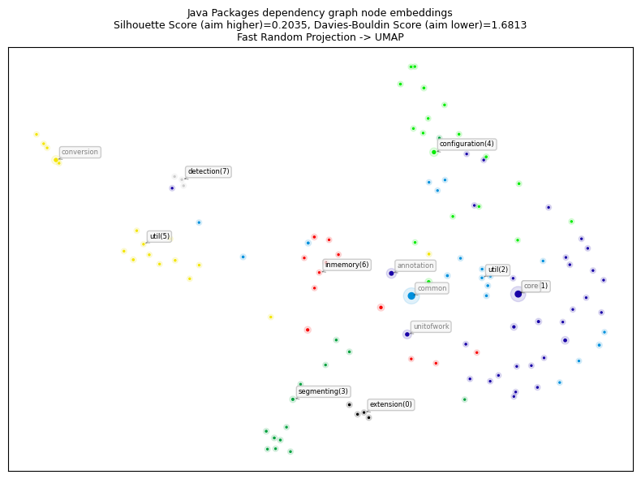
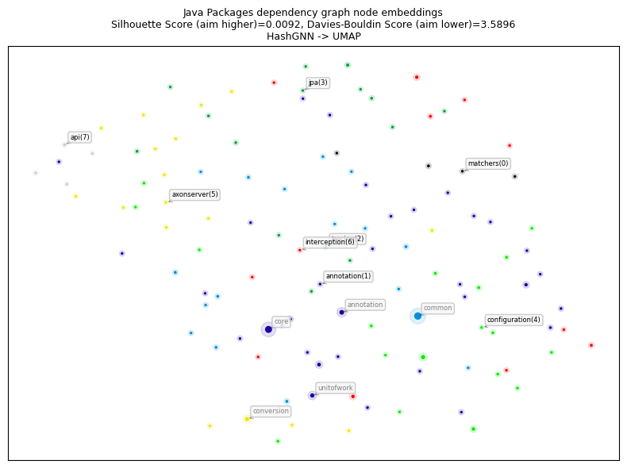
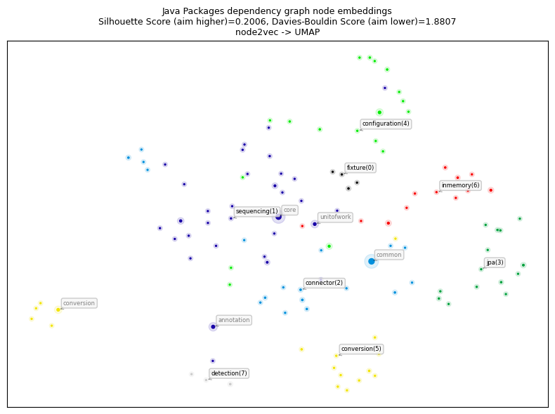
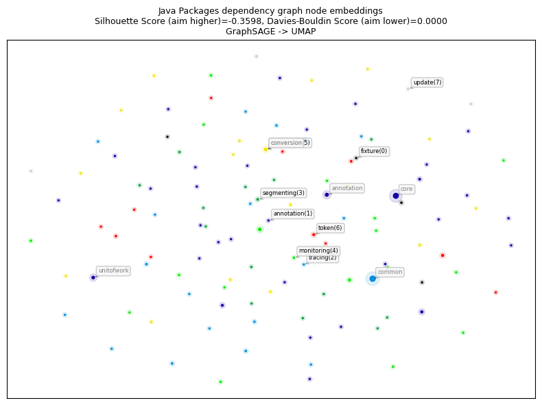
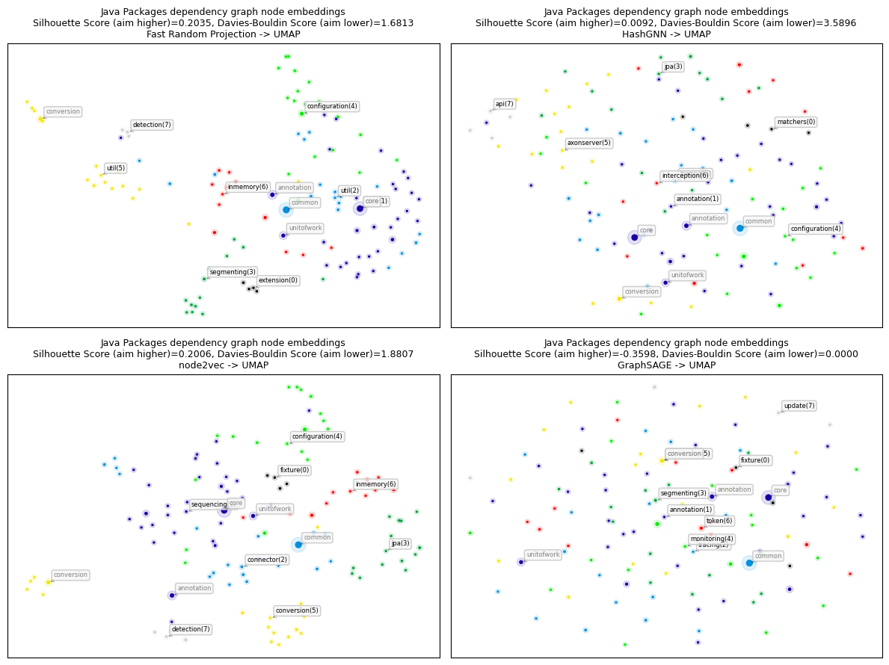

# Node Embeddings for Java

This notebook demonstrates different methods for node embeddings and how to further reduce their dimensionality to be able to visualize them in a 2D plot. 

Node embeddings are essentially an array of floating point numbers (length = embedding dimension) that can be used as "features" in machine learning. These numbers approximate the relationship and similarity information of each node and can also be seen as a way to encode the topology of the graph.

## Considerations

Due to dimensionality reduction some information gets lost, especially when visualizing node embeddings in two dimensions. Nevertheless, it helps to get an intuition on what node embeddings are and how much of the similarity and neighborhood information is retained. The latter can be observed by how well nodes of the same color and therefore same community are placed together and how much bigger nodes with a high centrality score influence them. 

If the visualization doesn't show a somehow clear separation between the communities (colors) here are some ideas for tuning: 
- Clean the data, e.g. filter out very few nodes with extremely high degree that aren't actually that important
- Try directed vs. undirected projections
- Tune the embedding algorithm, e.g. use a higher dimensionality
- Tune UMAP that is used to reduce the node embeddings dimension to two dimensions for visualization. 

It could also be the case that the node embeddings are good enough and well suited the way they are despite their visualization for the down stream task like node classification or link prediction. In that case it makes sense to see how the whole pipeline performs before tuning the node embeddings in detail. 

## Note about data dependencies

PageRank centrality and Leiden community are also fetched from the Graph and need to be calculated first.
This makes it easier to see if the embeddings approximate the structural information of the graph in the plot.
If these properties are missing you will only see black dots all of the same size.

   

### References
- [jqassistant](https://jqassistant.org)
- [Neo4j Python Driver](https://neo4j.com/docs/api/python-driver/current)
- [Tutorial: Applied Graph Embeddings](https://neo4j.com/developer/graph-data-science/applied-graph-embeddings)
- [Visualizing the embeddings in 2D](https://github.com/openai/openai-cookbook/blob/main/examples/Visualizing_embeddings_in_2D.ipynb)
- [UMAP](https://umap-learn.readthedocs.io/en/latest)
- [AttributeError: 'list' object has no attribute 'shape'](https://bobbyhadz.com/blog/python-attributeerror-list-object-has-no-attribute-shape)
- [Fast Random Projection (neo4j)](https://neo4j.com/docs/graph-data-science/current/machine-learning/node-embeddings/fastrp)
- [HashGNN (neo4j)](https://neo4j.com/docs/graph-data-science/2.6/machine-learning/node-embeddings/hashgnn)
- [node2vec (neo4j)](https://neo4j.com/docs/graph-data-science/current/machine-learning/node-embeddings/node2vec) computes a vector representation of a node based on second order random walks in the graph. 
- [Complete guide to understanding Node2Vec algorithm](https://towardsdatascience.com/complete-guide-to-understanding-node2vec-algorithm-4e9a35e5d147)

    The numpy version is: 1.26.4
    The pandas version is: 2.2.3
    The UMAP version is: 0.5.9.post2
    The matplotlib version is: 3.10.8
    The sklearn version is: 1.6.1

## 1. Java Packages

### 1.1 Create Dependency Graph Projection for Java Packages

The projection and related common parameters are shared across all embedding algorithms below.

<table border="1" class="dataframe">
  <thead>
    <tr style="text-align: right;">
      <th></th>
      <th>nodeCount</th>
      <th>relationshipCount</th>
      <th>density</th>
      <th>sizeInBytes</th>
      <th>degreeDistribution.min</th>
      <th>degreeDistribution.mean</th>
      <th>degreeDistribution.max</th>
      <th>degreeDistribution.p50</th>
      <th>degreeDistribution.p75</th>
      <th>degreeDistribution.p90</th>
      <th>degreeDistribution.p95</th>
      <th>degreeDistribution.p99</th>
      <th>degreeDistribution.p999</th>
    </tr>
  </thead>
  <tbody>
    <tr>
      <th>0</th>
      <td>120</td>
      <td>1528</td>
      <td>0.107003</td>
      <td>2729007</td>
      <td>1</td>
      <td>12.733333</td>
      <td>79</td>
      <td>9</td>
      <td>16</td>
      <td>23</td>
      <td>36</td>
      <td>77</td>
      <td>79</td>
    </tr>
  </tbody>
</table>

### 1.2 Generate Node Embeddings using Fast Random Projection (Fast RP) for Java Packages

[Fast Random Projection](https://neo4j.com/docs/graph-data-science/current/machine-learning/node-embeddings/fastrp) is used to reduce the dimensionality of the node feature space while preserving most of the distance information. Nodes with similar neighborhood result in node embedding with similar vectors.

**👉Hint:** To skip existing node embeddings and always calculate them based on the parameters below edit `Node_Embeddings_0a_Query_Calculated` so that it won't return any results.

    Received notification from DBMS server: {severity: WARNING} {code: Neo.ClientNotification.Statement.UnknownRelationshipTypeWarning} {category: UNRECOGNIZED} {title: The provided relationship type is not in the database.} {description: One of the relationship types in your query is not available in the database, make sure you didn't misspell it or that the label is available when you run this statement in your application (the missing relationship type is: HAS_ROOT)} {position: line: 9, column: 44, offset: 696} for query: '// Query already calculated and written node embeddings on nodes with label in parameter $dependencies_projection_node including a communityId and centrality. Variables: dependencies_projection_node, dependencies_projection_write_property. Requires "Add_file_name and_extension.cypher".\n \n  MATCH (codeUnit)\n  WHERE $dependencies_projection_node IN LABELS(codeUnit)\n    AND codeUnit[$dependencies_projection_write_property] IS NOT NULL\n    // AND codeUnit.notExistingToForceRecalculation IS NOT NULL // uncomment this line to force recalculation\n OPTIONAL MATCH (artifact:Java:Artifact)-[:CONTAINS]->(codeUnit)\n    WITH *, artifact.name AS artifactName\n OPTIONAL MATCH (projectRoot:Directory)<-[:HAS_ROOT]-(proj:TS:Project)-[:CONTAINS]->(codeUnit)\n    WITH *, last(split(projectRoot.absoluteFileName, \'/\')) AS projectName   \n  RETURN DISTINCT \n         coalesce(codeUnit.fqn, codeUnit.globalFqn, codeUnit.fileName, codeUnit.signature, codeUnit.name) AS codeUnitName\n        ,codeUnit.name                AS shortCodeUnitName\n        ,coalesce(artifactName, projectName)                                                              AS projectName\n        ,coalesce(codeUnit.communityLeidenId, 0)           AS communityId\n        ,coalesce(codeUnit.centralityPageRank, 0.01)       AS centrality\n        ,codeUnit[$dependencies_projection_write_property] AS embedding\n   ORDER BY communityId'

    The results have been provided by the query filename: ../cypher/Node_Embeddings/Node_Embeddings_0a_Query_Calculated.cypher

<table border="1" class="dataframe">
  <thead>
    <tr style="text-align: right;">
      <th></th>
      <th>codeUnitName</th>
      <th>shortCodeUnitName</th>
      <th>projectName</th>
      <th>communityId</th>
      <th>centrality</th>
      <th>embedding</th>
    </tr>
  </thead>
  <tbody>
    <tr>
      <th>0</th>
      <td>org.axonframework.test</td>
      <td>test</td>
      <td>axon-test-5.0.3</td>
      <td>0</td>
      <td>0.274179</td>
      <td>[-0.2347867786884308, 0.10764363408088684, 0.7...</td>
    </tr>
    <tr>
      <th>1</th>
      <td>org.axonframework.test.fixture</td>
      <td>fixture</td>
      <td>axon-test-5.0.3</td>
      <td>0</td>
      <td>0.173906</td>
      <td>[-0.3143078088760376, 0.14301589131355286, 0.7...</td>
    </tr>
    <tr>
      <th>2</th>
      <td>org.axonframework.test.extension</td>
      <td>extension</td>
      <td>axon-test-5.0.3</td>
      <td>0</td>
      <td>0.150000</td>
      <td>[-0.21420463919639587, 0.09585154056549072, 0....</td>
    </tr>
    <tr>
      <th>3</th>
      <td>org.axonframework.test.matchers</td>
      <td>matchers</td>
      <td>axon-test-5.0.3</td>
      <td>0</td>
      <td>0.165941</td>
      <td>[-0.3043825328350067, 0.14379963278770447, 0.7...</td>
    </tr>
    <tr>
      <th>4</th>
      <td>org.axonframework.test.util</td>
      <td>util</td>
      <td>axon-test-5.0.3</td>
      <td>1</td>
      <td>0.152898</td>
      <td>[-0.5350203514099121, 0.2641459107398987, 0.67...</td>
    </tr>
  </tbody>
</table>

### 1.3 Dimensionality reduction with Uniform Manifold Approximation and Projection (UMAP)

This step takes the original node embeddings in their high dimensionality, e.g. 32 floating point numbers, and reduces them into a two dimensional array for visualization. For more details look up the function  "prepare_node_embeddings_for_2d_visualization".

**About UMAP:**

> The embedding is found by searching for a low dimensional projection of the data that has the closest possible equivalent fuzzy topological structure.

(see https://umap-learn.readthedocs.io)

### 1.4 Visualization of the node embeddings reduced to two dimensions

    

    

### 1.5 Node Embeddings for Java Packages using HashGNN

[HashGNN](https://neo4j.com/docs/graph-data-science/2.6/machine-learning/node-embeddings/hashgnn) resembles Graph Neural Networks (GNN) but does not include a model or require training. It combines ideas of GNNs and fast randomized algorithms. For more details see [HashGNN](https://neo4j.com/docs/graph-data-science/2.6/machine-learning/node-embeddings/hashgnn). Here, the latter 3 steps are combined into one for HashGNN.

    Received notification from DBMS server: {severity: WARNING} {code: Neo.ClientNotification.Statement.UnknownRelationshipTypeWarning} {category: UNRECOGNIZED} {title: The provided relationship type is not in the database.} {description: One of the relationship types in your query is not available in the database, make sure you didn't misspell it or that the label is available when you run this statement in your application (the missing relationship type is: HAS_ROOT)} {position: line: 9, column: 44, offset: 696} for query: '// Query already calculated and written node embeddings on nodes with label in parameter $dependencies_projection_node including a communityId and centrality. Variables: dependencies_projection_node, dependencies_projection_write_property. Requires "Add_file_name and_extension.cypher".\n \n  MATCH (codeUnit)\n  WHERE $dependencies_projection_node IN LABELS(codeUnit)\n    AND codeUnit[$dependencies_projection_write_property] IS NOT NULL\n    // AND codeUnit.notExistingToForceRecalculation IS NOT NULL // uncomment this line to force recalculation\n OPTIONAL MATCH (artifact:Java:Artifact)-[:CONTAINS]->(codeUnit)\n    WITH *, artifact.name AS artifactName\n OPTIONAL MATCH (projectRoot:Directory)<-[:HAS_ROOT]-(proj:TS:Project)-[:CONTAINS]->(codeUnit)\n    WITH *, last(split(projectRoot.absoluteFileName, \'/\')) AS projectName   \n  RETURN DISTINCT \n         coalesce(codeUnit.fqn, codeUnit.globalFqn, codeUnit.fileName, codeUnit.signature, codeUnit.name) AS codeUnitName\n        ,codeUnit.name                AS shortCodeUnitName\n        ,coalesce(artifactName, projectName)                                                              AS projectName\n        ,coalesce(codeUnit.communityLeidenId, 0)           AS communityId\n        ,coalesce(codeUnit.centralityPageRank, 0.01)       AS centrality\n        ,codeUnit[$dependencies_projection_write_property] AS embedding\n   ORDER BY communityId'

    The results have been provided by the query filename: ../cypher/Node_Embeddings/Node_Embeddings_0a_Query_Calculated.cypher

<table border="1" class="dataframe">
  <thead>
    <tr style="text-align: right;">
      <th></th>
      <th>codeUnitName</th>
      <th>shortCodeUnitName</th>
      <th>projectName</th>
      <th>communityId</th>
      <th>centrality</th>
      <th>embedding</th>
    </tr>
  </thead>
  <tbody>
    <tr>
      <th>0</th>
      <td>org.axonframework.test</td>
      <td>test</td>
      <td>axon-test-5.0.3</td>
      <td>0</td>
      <td>0.274179</td>
      <td>[-1.7320507764816284, -0.4330126941204071, -0....</td>
    </tr>
    <tr>
      <th>1</th>
      <td>org.axonframework.test.fixture</td>
      <td>fixture</td>
      <td>axon-test-5.0.3</td>
      <td>0</td>
      <td>0.173906</td>
      <td>[-0.6495190411806107, -1.5155444294214249, 0.2...</td>
    </tr>
    <tr>
      <th>2</th>
      <td>org.axonframework.test.extension</td>
      <td>extension</td>
      <td>axon-test-5.0.3</td>
      <td>0</td>
      <td>0.150000</td>
      <td>[-0.8660253882408142, -0.8660253882408142, -0....</td>
    </tr>
    <tr>
      <th>3</th>
      <td>org.axonframework.test.matchers</td>
      <td>matchers</td>
      <td>axon-test-5.0.3</td>
      <td>0</td>
      <td>0.165941</td>
      <td>[-0.6495190411806107, -0.4330126941204071, -1....</td>
    </tr>
    <tr>
      <th>4</th>
      <td>org.axonframework.test.util</td>
      <td>util</td>
      <td>axon-test-5.0.3</td>
      <td>1</td>
      <td>0.152898</td>
      <td>[-0.4330126941204071, -1.2990380823612213, 0.6...</td>
    </tr>
  </tbody>
</table>

    

    

### 1.6 Node Embeddings for Java Packages using node2vec

    Received notification from DBMS server: {severity: WARNING} {code: Neo.ClientNotification.Statement.UnknownRelationshipTypeWarning} {category: UNRECOGNIZED} {title: The provided relationship type is not in the database.} {description: One of the relationship types in your query is not available in the database, make sure you didn't misspell it or that the label is available when you run this statement in your application (the missing relationship type is: HAS_ROOT)} {position: line: 9, column: 44, offset: 696} for query: '// Query already calculated and written node embeddings on nodes with label in parameter $dependencies_projection_node including a communityId and centrality. Variables: dependencies_projection_node, dependencies_projection_write_property. Requires "Add_file_name and_extension.cypher".\n \n  MATCH (codeUnit)\n  WHERE $dependencies_projection_node IN LABELS(codeUnit)\n    AND codeUnit[$dependencies_projection_write_property] IS NOT NULL\n    // AND codeUnit.notExistingToForceRecalculation IS NOT NULL // uncomment this line to force recalculation\n OPTIONAL MATCH (artifact:Java:Artifact)-[:CONTAINS]->(codeUnit)\n    WITH *, artifact.name AS artifactName\n OPTIONAL MATCH (projectRoot:Directory)<-[:HAS_ROOT]-(proj:TS:Project)-[:CONTAINS]->(codeUnit)\n    WITH *, last(split(projectRoot.absoluteFileName, \'/\')) AS projectName   \n  RETURN DISTINCT \n         coalesce(codeUnit.fqn, codeUnit.globalFqn, codeUnit.fileName, codeUnit.signature, codeUnit.name) AS codeUnitName\n        ,codeUnit.name                AS shortCodeUnitName\n        ,coalesce(artifactName, projectName)                                                              AS projectName\n        ,coalesce(codeUnit.communityLeidenId, 0)           AS communityId\n        ,coalesce(codeUnit.centralityPageRank, 0.01)       AS centrality\n        ,codeUnit[$dependencies_projection_write_property] AS embedding\n   ORDER BY communityId'

    The results have been provided by the query filename: ../cypher/Node_Embeddings/Node_Embeddings_0a_Query_Calculated.cypher

<table border="1" class="dataframe">
  <thead>
    <tr style="text-align: right;">
      <th></th>
      <th>codeUnitName</th>
      <th>shortCodeUnitName</th>
      <th>projectName</th>
      <th>communityId</th>
      <th>centrality</th>
      <th>embedding</th>
    </tr>
  </thead>
  <tbody>
    <tr>
      <th>0</th>
      <td>org.axonframework.test</td>
      <td>test</td>
      <td>axon-test-5.0.3</td>
      <td>0</td>
      <td>0.274179</td>
      <td>[0.29487869143486023, -0.8697183728218079, 0.5...</td>
    </tr>
    <tr>
      <th>1</th>
      <td>org.axonframework.test.fixture</td>
      <td>fixture</td>
      <td>axon-test-5.0.3</td>
      <td>0</td>
      <td>0.173906</td>
      <td>[0.25901129841804504, -0.9068914651870728, 0.3...</td>
    </tr>
    <tr>
      <th>2</th>
      <td>org.axonframework.test.extension</td>
      <td>extension</td>
      <td>axon-test-5.0.3</td>
      <td>0</td>
      <td>0.150000</td>
      <td>[0.3625311851501465, -0.8427491784095764, 0.55...</td>
    </tr>
    <tr>
      <th>3</th>
      <td>org.axonframework.test.matchers</td>
      <td>matchers</td>
      <td>axon-test-5.0.3</td>
      <td>0</td>
      <td>0.165941</td>
      <td>[0.3336143493652344, -0.7906655073165894, 0.42...</td>
    </tr>
    <tr>
      <th>4</th>
      <td>org.axonframework.test.util</td>
      <td>util</td>
      <td>axon-test-5.0.3</td>
      <td>1</td>
      <td>0.152898</td>
      <td>[0.14681464433670044, -0.47154664993286133, 0....</td>
    </tr>
  </tbody>
</table>

    

    

### 1.7 Node Embeddings for Java Packages using GraphSAGE

<table border="1" class="dataframe">
  <thead>
    <tr style="text-align: right;">
      <th></th>
      <th>modelName</th>
      <th>didConverge</th>
      <th>ranEpochs</th>
      <th>epochLosses</th>
      <th>trainingTimeMilliseconds</th>
    </tr>
  </thead>
  <tbody>
    <tr>
      <th>0</th>
      <td>java-package-embeddings-notebook-graphSAGE</td>
      <td>True</td>
      <td>1</td>
      <td>[27.344867780561188]</td>
      <td>131</td>
    </tr>
  </tbody>
</table>

    Received notification from DBMS server: {severity: WARNING} {code: Neo.ClientNotification.Statement.UnknownRelationshipTypeWarning} {category: UNRECOGNIZED} {title: The provided relationship type is not in the database.} {description: One of the relationship types in your query is not available in the database, make sure you didn't misspell it or that the label is available when you run this statement in your application (the missing relationship type is: HAS_ROOT)} {position: line: 13, column: 44, offset: 473} for query: '// Node Embeddings 4d using GraphSAGE: Stream. Requires "Add_file_name and_extension.cypher".\n \n CALL gds.beta.graphSage.stream(\n  $dependencies_projection + \'-cleaned\', {\n       modelName: $dependencies_projection + \'-graphSAGE\'\n   }\n )\n YIELD nodeId, embedding\n  WITH gds.util.asNode(nodeId) AS codeUnit\n      ,embedding\n OPTIONAL MATCH (artifact:Java:Artifact)-[:CONTAINS]->(codeUnit)\n    WITH *, artifact.name AS artifactName\n OPTIONAL MATCH (projectRoot:Directory)<-[:HAS_ROOT]-(proj:TS:Project)-[:CONTAINS]->(codeUnit)\n    WITH *, last(split(projectRoot.absoluteFileName, \'/\')) AS projectName   \n  RETURN DISTINCT \n         coalesce(codeUnit.fqn, codeUnit.globalFqn, codeUnit.fileName, codeUnit.signature, codeUnit.name) AS codeUnitName\n        ,codeUnit.name                               AS shortCodeUnitName\n        ,elementId(codeUnit)                         AS nodeElementId\n        ,coalesce(artifactName, projectName)         AS projectName\n        ,coalesce(codeUnit.communityLeidenId, 0)     AS communityId\n        ,coalesce(codeUnit.centralityPageRank, 0.01) AS centrality\n        ,embedding'

<table border="1" class="dataframe">
  <thead>
    <tr style="text-align: right;">
      <th></th>
      <th>codeUnitName</th>
      <th>shortCodeUnitName</th>
      <th>nodeElementId</th>
      <th>projectName</th>
      <th>communityId</th>
      <th>centrality</th>
      <th>embedding</th>
    </tr>
  </thead>
  <tbody>
    <tr>
      <th>0</th>
      <td>org.axonframework.test</td>
      <td>test</td>
      <td>4:a3d70f63-d261-4777-b1db-b63697a78681:19</td>
      <td>axon-test-5.0.3</td>
      <td>0</td>
      <td>0.274179</td>
      <td>[-0.004854696932375823, 0.038051402592092824, ...</td>
    </tr>
    <tr>
      <th>1</th>
      <td>org.axonframework.test.fixture</td>
      <td>fixture</td>
      <td>4:a3d70f63-d261-4777-b1db-b63697a78681:20</td>
      <td>axon-test-5.0.3</td>
      <td>0</td>
      <td>0.173906</td>
      <td>[-0.004854696932375824, 0.03805140259209287, 0...</td>
    </tr>
    <tr>
      <th>2</th>
      <td>org.axonframework.test.extension</td>
      <td>extension</td>
      <td>4:a3d70f63-d261-4777-b1db-b63697a78681:21</td>
      <td>axon-test-5.0.3</td>
      <td>0</td>
      <td>0.150000</td>
      <td>[-0.004854696932375822, 0.038051402592092935, ...</td>
    </tr>
    <tr>
      <th>3</th>
      <td>org.axonframework.test.util</td>
      <td>util</td>
      <td>4:a3d70f63-d261-4777-b1db-b63697a78681:22</td>
      <td>axon-test-5.0.3</td>
      <td>1</td>
      <td>0.152898</td>
      <td>[-0.004854696932375823, 0.03805140259209285, 0...</td>
    </tr>
    <tr>
      <th>4</th>
      <td>org.axonframework.test.server</td>
      <td>server</td>
      <td>4:a3d70f63-d261-4777-b1db-b63697a78681:23</td>
      <td>axon-test-5.0.3</td>
      <td>2</td>
      <td>0.277950</td>
      <td>[-0.004854696932375825, 0.038051402592092894, ...</td>
    </tr>
  </tbody>
</table>

    

    

### 2. Compare Node Embeddings

In this section we will compare all node embedding methods from above in a grid plot. This helps to see how well the different algorithms were able to capture the structure of the graph and how well the communities are separated.

    

    

#### Interpreting Node Embedding Results

##### Summary of Observations

- **FastRP** and **node2vec** show clear, well-separated clusters
- **HashGNN** and **GraphSAGE** produce more diffuse embeddings
- Silhouette scores are high for FastRP / node2vec and low for HashGNN / GraphSAGE

These differences are expected and stem from the **fundamentally different objectives** of the algorithms.

##### Key Takeaways

- **FastRP and node2vec** are well-suited for **community discovery and visualization**
- **HashGNN** is best viewed as a **fast structural fingerprint**, not a clustering embedding
- **GraphSAGE** requires meaningful node features or labels and performs poorly in dense, feature-poor settings
- Poor silhouette scores for HashGNN and GraphSAGE are **expected and theoretically consistent**
