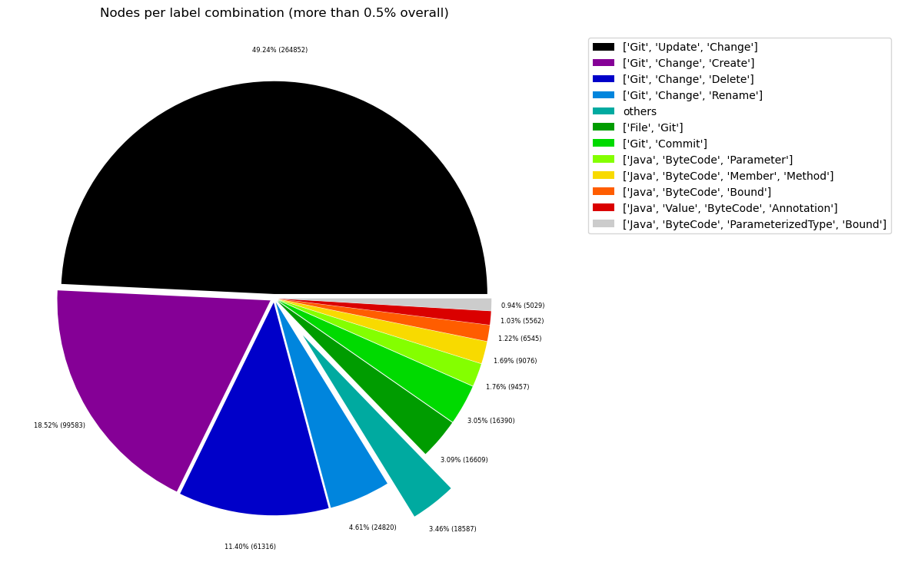
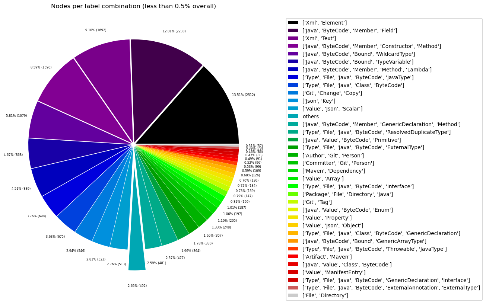
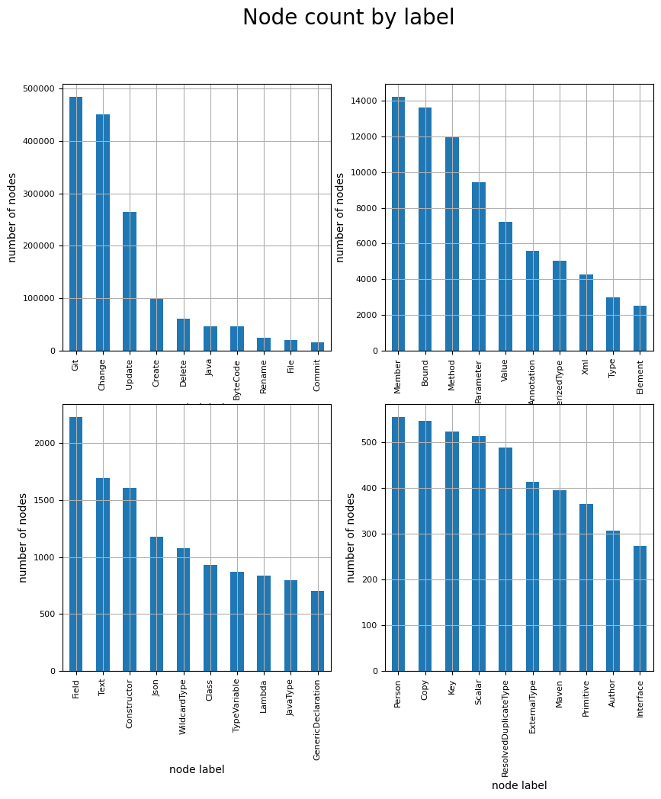
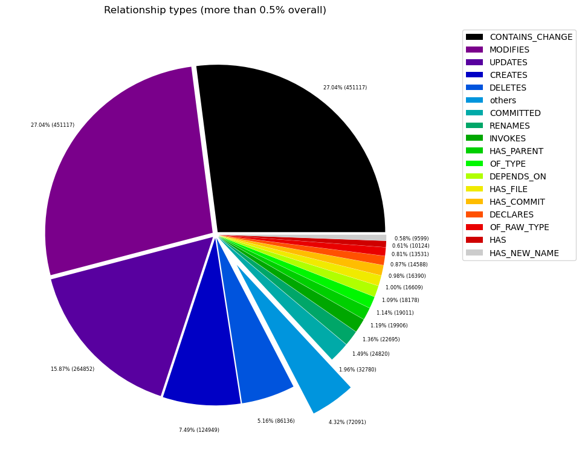
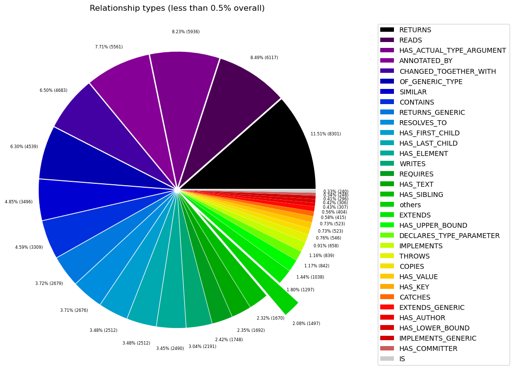

# Overview in General
   

This file contains a general overview of the data in the graph including node labels and relationships types.

### References
- [jqassistant](https://jqassistant.org)
- [Neo4j Python Driver](https://neo4j.com/docs/api/python-driver/current)

## Node Labels

### Table 1a - Highest node count by label combination

Lists the 30 label combinations with the highest number of nodes. The labels with the lowest node count are listed in table 1b.
The total list would sum up to the total number of labels (100%).

The whole table can be found in the CSV report `Node_label_combination_count`.

<table border="1" class="dataframe">
  <thead>
    <tr style="text-align: right;">
      <th></th>
      <th>nodeLabels</th>
      <th>nodesWithThatLabels</th>
      <th>nodesWithThatLabelsPercent</th>
    </tr>
  </thead>
  <tbody>
    <tr>
      <th>0</th>
      <td>[Git, Update, Change]</td>
      <td>264852</td>
      <td>49.244923</td>
    </tr>
    <tr>
      <th>1</th>
      <td>[Git, Change, Create]</td>
      <td>99583</td>
      <td>18.515840</td>
    </tr>
    <tr>
      <th>2</th>
      <td>[Git, Change, Delete]</td>
      <td>61316</td>
      <td>11.400713</td>
    </tr>
    <tr>
      <th>3</th>
      <td>[Git, Change, Rename]</td>
      <td>24820</td>
      <td>4.614875</td>
    </tr>
    <tr>
      <th>4</th>
      <td>[File, Git]</td>
      <td>16609</td>
      <td>3.088173</td>
    </tr>
    <tr>
      <th>5</th>
      <td>[Git, Commit]</td>
      <td>16390</td>
      <td>3.047454</td>
    </tr>
    <tr>
      <th>6</th>
      <td>[Java, ByteCode, Parameter]</td>
      <td>9457</td>
      <td>1.758375</td>
    </tr>
    <tr>
      <th>7</th>
      <td>[Java, ByteCode, Member, Method]</td>
      <td>9076</td>
      <td>1.687535</td>
    </tr>
    <tr>
      <th>8</th>
      <td>[Java, ByteCode, Bound]</td>
      <td>6545</td>
      <td>1.216936</td>
    </tr>
    <tr>
      <th>9</th>
      <td>[Java, Value, ByteCode, Annotation]</td>
      <td>5562</td>
      <td>1.034163</td>
    </tr>
    <tr>
      <th>10</th>
      <td>[Java, ByteCode, ParameterizedType, Bound]</td>
      <td>5029</td>
      <td>0.935061</td>
    </tr>
    <tr>
      <th>11</th>
      <td>[Xml, Element]</td>
      <td>2512</td>
      <td>0.467066</td>
    </tr>
    <tr>
      <th>12</th>
      <td>[Java, ByteCode, Member, Field]</td>
      <td>2233</td>
      <td>0.415190</td>
    </tr>
    <tr>
      <th>13</th>
      <td>[Xml, Text]</td>
      <td>1692</td>
      <td>0.314600</td>
    </tr>
    <tr>
      <th>14</th>
      <td>[Java, ByteCode, Member, Constructor, Method]</td>
      <td>1596</td>
      <td>0.296750</td>
    </tr>
    <tr>
      <th>15</th>
      <td>[Java, ByteCode, Bound, WildcardType]</td>
      <td>1079</td>
      <td>0.200623</td>
    </tr>
    <tr>
      <th>16</th>
      <td>[Java, ByteCode, Bound, TypeVariable]</td>
      <td>868</td>
      <td>0.161390</td>
    </tr>
    <tr>
      <th>17</th>
      <td>[Java, ByteCode, Member, Method, Lambda]</td>
      <td>839</td>
      <td>0.155998</td>
    </tr>
    <tr>
      <th>18</th>
      <td>[Type, File, Java, ByteCode, JavaType]</td>
      <td>698</td>
      <td>0.129782</td>
    </tr>
    <tr>
      <th>19</th>
      <td>[Type, File, Java, Class, ByteCode]</td>
      <td>675</td>
      <td>0.125505</td>
    </tr>
    <tr>
      <th>20</th>
      <td>[Git, Change, Copy]</td>
      <td>546</td>
      <td>0.101520</td>
    </tr>
    <tr>
      <th>21</th>
      <td>[Json, Key]</td>
      <td>523</td>
      <td>0.097243</td>
    </tr>
    <tr>
      <th>22</th>
      <td>[Value, Json, Scalar]</td>
      <td>513</td>
      <td>0.095384</td>
    </tr>
    <tr>
      <th>23</th>
      <td>[Java, ByteCode, Member, GenericDeclaration, M...</td>
      <td>481</td>
      <td>0.089434</td>
    </tr>
    <tr>
      <th>24</th>
      <td>[Type, File, Java, ByteCode, ResolvedDuplicate...</td>
      <td>477</td>
      <td>0.088690</td>
    </tr>
    <tr>
      <th>25</th>
      <td>[Java, Value, ByteCode, Primitive]</td>
      <td>364</td>
      <td>0.067680</td>
    </tr>
    <tr>
      <th>26</th>
      <td>[Type, File, Java, ByteCode, ExternalType]</td>
      <td>330</td>
      <td>0.061358</td>
    </tr>
    <tr>
      <th>27</th>
      <td>[Author, Git, Person]</td>
      <td>307</td>
      <td>0.057082</td>
    </tr>
    <tr>
      <th>28</th>
      <td>[Committer, Git, Person]</td>
      <td>248</td>
      <td>0.046112</td>
    </tr>
    <tr>
      <th>29</th>
      <td>[Maven, Dependency]</td>
      <td>205</td>
      <td>0.038116</td>
    </tr>
  </tbody>
</table>

### Chart 1a - Highest node count by label combination

Values under 0.5% will be grouped into "others" to get a cleaner plot. The group "others" is then broken down in Chart 1b.

    <Figure size 640x480 with 0 Axes>

    

    

### Table 1b - Lowest node count by label combination

Lists the 30 label combinations with the lowest number of nodes until they reach 0.5% of the total node count, which are shown above.

<table border="1" class="dataframe">
  <thead>
    <tr style="text-align: right;">
      <th></th>
      <th>nodeLabels</th>
      <th>nodesWithThatLabels</th>
      <th>nodesWithThatLabelsPercent</th>
    </tr>
  </thead>
  <tbody>
    <tr>
      <th>0</th>
      <td>[Analyze, Task, jQAssistant]</td>
      <td>1</td>
      <td>0.000186</td>
    </tr>
    <tr>
      <th>1</th>
      <td>[Git, Branch]</td>
      <td>1</td>
      <td>0.000186</td>
    </tr>
    <tr>
      <th>2</th>
      <td>[Repository, File, Git]</td>
      <td>1</td>
      <td>0.000186</td>
    </tr>
    <tr>
      <th>3</th>
      <td>[File, Json]</td>
      <td>2</td>
      <td>0.000372</td>
    </tr>
    <tr>
      <th>4</th>
      <td>[File]</td>
      <td>4</td>
      <td>0.000744</td>
    </tr>
    <tr>
      <th>5</th>
      <td>[Type, File, Java, ByteCode, GenericDeclaratio...</td>
      <td>4</td>
      <td>0.000744</td>
    </tr>
    <tr>
      <th>6</th>
      <td>[Maven, Exclusion]</td>
      <td>6</td>
      <td>0.001116</td>
    </tr>
    <tr>
      <th>7</th>
      <td>[Value, Array, Json]</td>
      <td>8</td>
      <td>0.001487</td>
    </tr>
    <tr>
      <th>8</th>
      <td>[Java, ByteCode, Member, GenericDeclaration, C...</td>
      <td>9</td>
      <td>0.001673</td>
    </tr>
    <tr>
      <th>9</th>
      <td>[Type, File, Java, ByteCode, Throwable, Extern...</td>
      <td>10</td>
      <td>0.001859</td>
    </tr>
    <tr>
      <th>10</th>
      <td>[Type, File, Java, ByteCode, Throwable, Resolv...</td>
      <td>11</td>
      <td>0.002045</td>
    </tr>
    <tr>
      <th>11</th>
      <td>[Maven, Scm]</td>
      <td>11</td>
      <td>0.002045</td>
    </tr>
    <tr>
      <th>12</th>
      <td>[File, Maven, Xml, Pom, Document]</td>
      <td>11</td>
      <td>0.002045</td>
    </tr>
    <tr>
      <th>13</th>
      <td>[Type, File, Java, ByteCode, Void]</td>
      <td>11</td>
      <td>0.002045</td>
    </tr>
    <tr>
      <th>14</th>
      <td>[Java, ManifestSection]</td>
      <td>11</td>
      <td>0.002045</td>
    </tr>
    <tr>
      <th>15</th>
      <td>[File, Java, Manifest]</td>
      <td>11</td>
      <td>0.002045</td>
    </tr>
    <tr>
      <th>16</th>
      <td>[File, Artifact, Jar, Archive, Zip, Java]</td>
      <td>11</td>
      <td>0.002045</td>
    </tr>
    <tr>
      <th>17</th>
      <td>[File, Java, ServiceLoader]</td>
      <td>13</td>
      <td>0.002417</td>
    </tr>
    <tr>
      <th>18</th>
      <td>[Maven, PluginExecution]</td>
      <td>13</td>
      <td>0.002417</td>
    </tr>
    <tr>
      <th>19</th>
      <td>[File, Java, Properties]</td>
      <td>13</td>
      <td>0.002417</td>
    </tr>
    <tr>
      <th>20</th>
      <td>[Maven, ExecutionGoal]</td>
      <td>13</td>
      <td>0.002417</td>
    </tr>
    <tr>
      <th>21</th>
      <td>[Type, File, Java, ByteCode, Enum]</td>
      <td>17</td>
      <td>0.003161</td>
    </tr>
    <tr>
      <th>22</th>
      <td>[jQAssistant, Rule, Concept]</td>
      <td>19</td>
      <td>0.003533</td>
    </tr>
    <tr>
      <th>23</th>
      <td>[Maven, Configuration]</td>
      <td>20</td>
      <td>0.003719</td>
    </tr>
    <tr>
      <th>24</th>
      <td>[Maven, Plugin]</td>
      <td>20</td>
      <td>0.003719</td>
    </tr>
    <tr>
      <th>25</th>
      <td>[Xml, Attribute]</td>
      <td>22</td>
      <td>0.004091</td>
    </tr>
    <tr>
      <th>26</th>
      <td>[Type, File, Java, ByteCode, PrimitiveType]</td>
      <td>39</td>
      <td>0.007251</td>
    </tr>
    <tr>
      <th>27</th>
      <td>[Type, File, Java, Class, ByteCode, Throwable]</td>
      <td>42</td>
      <td>0.007809</td>
    </tr>
    <tr>
      <th>28</th>
      <td>[Type, File, Java, ByteCode, Annotation]</td>
      <td>42</td>
      <td>0.007809</td>
    </tr>
    <tr>
      <th>29</th>
      <td>[Xml, Namespace]</td>
      <td>44</td>
      <td>0.008181</td>
    </tr>
  </tbody>
</table>

### Chart 1b - Lowest node count by label combination

Shows the lowest (less than 0.5% overall) node count label combinations. Therefore, this plot breaks down the "others" slice of the pie chart above. Values under 0.01% will be grouped into "others" to get a cleaner plot.

    <Figure size 640x480 with 0 Axes>

    

    

### Table 1c - Highest node count by single label

Lists the 40 labels with the highest number of nodes.
Doesn't sum up to the total number of nodes or 100% because one node can have multiple labels.
Helps to identify commonly used labels.

<table border="1" class="dataframe">
  <thead>
    <tr style="text-align: right;">
      <th></th>
      <th>nodeLabel</th>
      <th>nodesWithThatLabel</th>
      <th>nodesWithThatLabelPercent</th>
    </tr>
  </thead>
  <tbody>
    <tr>
      <th>0</th>
      <td>Git</td>
      <td>484820</td>
      <td>90.144396</td>
    </tr>
    <tr>
      <th>1</th>
      <td>Change</td>
      <td>451117</td>
      <td>83.877871</td>
    </tr>
    <tr>
      <th>2</th>
      <td>Update</td>
      <td>264852</td>
      <td>49.244923</td>
    </tr>
    <tr>
      <th>3</th>
      <td>Create</td>
      <td>99583</td>
      <td>18.515840</td>
    </tr>
    <tr>
      <th>4</th>
      <td>Delete</td>
      <td>61316</td>
      <td>11.400713</td>
    </tr>
    <tr>
      <th>5</th>
      <td>Java</td>
      <td>46665</td>
      <td>8.676598</td>
    </tr>
    <tr>
      <th>6</th>
      <td>ByteCode</td>
      <td>46456</td>
      <td>8.637738</td>
    </tr>
    <tr>
      <th>7</th>
      <td>Rename</td>
      <td>24820</td>
      <td>4.614875</td>
    </tr>
    <tr>
      <th>8</th>
      <td>File</td>
      <td>19861</td>
      <td>3.692830</td>
    </tr>
    <tr>
      <th>9</th>
      <td>Commit</td>
      <td>16390</td>
      <td>3.047454</td>
    </tr>
    <tr>
      <th>10</th>
      <td>Member</td>
      <td>14234</td>
      <td>2.646581</td>
    </tr>
    <tr>
      <th>11</th>
      <td>Bound</td>
      <td>13630</td>
      <td>2.534277</td>
    </tr>
    <tr>
      <th>12</th>
      <td>Method</td>
      <td>12001</td>
      <td>2.231391</td>
    </tr>
    <tr>
      <th>13</th>
      <td>Parameter</td>
      <td>9457</td>
      <td>1.758375</td>
    </tr>
    <tr>
      <th>14</th>
      <td>Value</td>
      <td>7226</td>
      <td>1.343557</td>
    </tr>
    <tr>
      <th>15</th>
      <td>Annotation</td>
      <td>5604</td>
      <td>1.041973</td>
    </tr>
    <tr>
      <th>16</th>
      <td>ParameterizedType</td>
      <td>5029</td>
      <td>0.935061</td>
    </tr>
    <tr>
      <th>17</th>
      <td>Xml</td>
      <td>4281</td>
      <td>0.795982</td>
    </tr>
    <tr>
      <th>18</th>
      <td>Type</td>
      <td>2979</td>
      <td>0.553897</td>
    </tr>
    <tr>
      <th>19</th>
      <td>Element</td>
      <td>2512</td>
      <td>0.467066</td>
    </tr>
    <tr>
      <th>20</th>
      <td>Field</td>
      <td>2233</td>
      <td>0.415190</td>
    </tr>
    <tr>
      <th>21</th>
      <td>Text</td>
      <td>1692</td>
      <td>0.314600</td>
    </tr>
    <tr>
      <th>22</th>
      <td>Constructor</td>
      <td>1605</td>
      <td>0.298424</td>
    </tr>
    <tr>
      <th>23</th>
      <td>Json</td>
      <td>1176</td>
      <td>0.218658</td>
    </tr>
    <tr>
      <th>24</th>
      <td>WildcardType</td>
      <td>1079</td>
      <td>0.200623</td>
    </tr>
    <tr>
      <th>25</th>
      <td>Class</td>
      <td>934</td>
      <td>0.173662</td>
    </tr>
    <tr>
      <th>26</th>
      <td>TypeVariable</td>
      <td>868</td>
      <td>0.161390</td>
    </tr>
    <tr>
      <th>27</th>
      <td>Lambda</td>
      <td>839</td>
      <td>0.155998</td>
    </tr>
    <tr>
      <th>28</th>
      <td>JavaType</td>
      <td>797</td>
      <td>0.148189</td>
    </tr>
    <tr>
      <th>29</th>
      <td>GenericDeclaration</td>
      <td>706</td>
      <td>0.131269</td>
    </tr>
    <tr>
      <th>30</th>
      <td>Person</td>
      <td>555</td>
      <td>0.103193</td>
    </tr>
    <tr>
      <th>31</th>
      <td>Copy</td>
      <td>546</td>
      <td>0.101520</td>
    </tr>
    <tr>
      <th>32</th>
      <td>Key</td>
      <td>523</td>
      <td>0.097243</td>
    </tr>
    <tr>
      <th>33</th>
      <td>Scalar</td>
      <td>513</td>
      <td>0.095384</td>
    </tr>
    <tr>
      <th>34</th>
      <td>ResolvedDuplicateType</td>
      <td>488</td>
      <td>0.090736</td>
    </tr>
    <tr>
      <th>35</th>
      <td>ExternalType</td>
      <td>413</td>
      <td>0.076791</td>
    </tr>
    <tr>
      <th>36</th>
      <td>Maven</td>
      <td>395</td>
      <td>0.073444</td>
    </tr>
    <tr>
      <th>37</th>
      <td>Primitive</td>
      <td>364</td>
      <td>0.067680</td>
    </tr>
    <tr>
      <th>38</th>
      <td>Author</td>
      <td>307</td>
      <td>0.057082</td>
    </tr>
    <tr>
      <th>39</th>
      <td>Interface</td>
      <td>273</td>
      <td>0.050760</td>
    </tr>
  </tbody>
</table>

### Chart 1c - Highest node count by label

Shows the 40 labels with the highest number of nodes.

    <Figure size 640x480 with 0 Axes>

    

    

## Relationship Types

### Table 2a - Highest relationship count by type

Lists the 30 relationship types with the highest number of occurrences.
The whole table can be found in the CSV report `Relationship_type_count`.

    Total number of relationships: 1668493

<table border="1" class="dataframe">
  <thead>
    <tr style="text-align: right;">
      <th></th>
      <th>relationshipType</th>
      <th>nodesWithThatRelationshipType</th>
      <th>nodesWithThatRelationshipTypePercent</th>
    </tr>
  </thead>
  <tbody>
    <tr>
      <th>0</th>
      <td>CONTAINS_CHANGE</td>
      <td>451117</td>
      <td>27.037392</td>
    </tr>
    <tr>
      <th>1</th>
      <td>MODIFIES</td>
      <td>451117</td>
      <td>27.037392</td>
    </tr>
    <tr>
      <th>2</th>
      <td>UPDATES</td>
      <td>264852</td>
      <td>15.873726</td>
    </tr>
    <tr>
      <th>3</th>
      <td>CREATES</td>
      <td>124949</td>
      <td>7.488734</td>
    </tr>
    <tr>
      <th>4</th>
      <td>DELETES</td>
      <td>86136</td>
      <td>5.162503</td>
    </tr>
    <tr>
      <th>5</th>
      <td>COMMITTED</td>
      <td>32780</td>
      <td>1.964647</td>
    </tr>
    <tr>
      <th>6</th>
      <td>RENAMES</td>
      <td>24820</td>
      <td>1.487570</td>
    </tr>
    <tr>
      <th>7</th>
      <td>INVOKES</td>
      <td>22695</td>
      <td>1.360209</td>
    </tr>
    <tr>
      <th>8</th>
      <td>HAS_PARENT</td>
      <td>19906</td>
      <td>1.193053</td>
    </tr>
    <tr>
      <th>9</th>
      <td>OF_TYPE</td>
      <td>19011</td>
      <td>1.139411</td>
    </tr>
    <tr>
      <th>10</th>
      <td>DEPENDS_ON</td>
      <td>18178</td>
      <td>1.089486</td>
    </tr>
    <tr>
      <th>11</th>
      <td>HAS_FILE</td>
      <td>16609</td>
      <td>0.995449</td>
    </tr>
    <tr>
      <th>12</th>
      <td>HAS_COMMIT</td>
      <td>16390</td>
      <td>0.982324</td>
    </tr>
    <tr>
      <th>13</th>
      <td>DECLARES</td>
      <td>14588</td>
      <td>0.874322</td>
    </tr>
    <tr>
      <th>14</th>
      <td>OF_RAW_TYPE</td>
      <td>13531</td>
      <td>0.810971</td>
    </tr>
    <tr>
      <th>15</th>
      <td>HAS</td>
      <td>10124</td>
      <td>0.606775</td>
    </tr>
    <tr>
      <th>16</th>
      <td>HAS_NEW_NAME</td>
      <td>9599</td>
      <td>0.575310</td>
    </tr>
    <tr>
      <th>17</th>
      <td>RETURNS</td>
      <td>8301</td>
      <td>0.497515</td>
    </tr>
    <tr>
      <th>18</th>
      <td>READS</td>
      <td>6117</td>
      <td>0.366618</td>
    </tr>
    <tr>
      <th>19</th>
      <td>HAS_ACTUAL_TYPE_ARGUMENT</td>
      <td>5936</td>
      <td>0.355770</td>
    </tr>
    <tr>
      <th>20</th>
      <td>ANNOTATED_BY</td>
      <td>5561</td>
      <td>0.333295</td>
    </tr>
    <tr>
      <th>21</th>
      <td>CHANGED_TOGETHER_WITH</td>
      <td>4683</td>
      <td>0.280672</td>
    </tr>
    <tr>
      <th>22</th>
      <td>OF_GENERIC_TYPE</td>
      <td>4539</td>
      <td>0.272042</td>
    </tr>
    <tr>
      <th>23</th>
      <td>SIMILAR</td>
      <td>3496</td>
      <td>0.209530</td>
    </tr>
    <tr>
      <th>24</th>
      <td>CONTAINS</td>
      <td>3309</td>
      <td>0.198323</td>
    </tr>
    <tr>
      <th>25</th>
      <td>RETURNS_GENERIC</td>
      <td>2679</td>
      <td>0.160564</td>
    </tr>
    <tr>
      <th>26</th>
      <td>RESOLVES_TO</td>
      <td>2676</td>
      <td>0.160384</td>
    </tr>
    <tr>
      <th>27</th>
      <td>HAS_FIRST_CHILD</td>
      <td>2512</td>
      <td>0.150555</td>
    </tr>
    <tr>
      <th>28</th>
      <td>HAS_LAST_CHILD</td>
      <td>2512</td>
      <td>0.150555</td>
    </tr>
    <tr>
      <th>29</th>
      <td>HAS_ELEMENT</td>
      <td>2490</td>
      <td>0.149236</td>
    </tr>
  </tbody>
</table>

### Chart 2a - Highest relationship count by type

Values under 0.5% will be grouped into "others" to get a cleaner plot. The group "others" is then broken down in the second chart.

    <Figure size 640x480 with 0 Axes>

    

    

### Table 2b - Lowest relationship count by type

Lists the 30 relationships type with the lowest number of occurrences up to 0.5% of the total node count. This is essentially breaking down the "others" slice from the chart above.

<table border="1" class="dataframe">
  <thead>
    <tr style="text-align: right;">
      <th></th>
      <th>relationshipType</th>
      <th>nodesWithThatRelationshipType</th>
      <th>nodesWithThatRelationshipTypePercent</th>
    </tr>
  </thead>
  <tbody>
    <tr>
      <th>0</th>
      <td>HAS_PROPERTY</td>
      <td>1</td>
      <td>0.000060</td>
    </tr>
    <tr>
      <th>1</th>
      <td>HAS_BRANCH</td>
      <td>1</td>
      <td>0.000060</td>
    </tr>
    <tr>
      <th>2</th>
      <td>HAS_HEAD</td>
      <td>2</td>
      <td>0.000120</td>
    </tr>
    <tr>
      <th>3</th>
      <td>THROWS_GENERIC</td>
      <td>5</td>
      <td>0.000300</td>
    </tr>
    <tr>
      <th>4</th>
      <td>EXCLUDES</td>
      <td>6</td>
      <td>0.000360</td>
    </tr>
    <tr>
      <th>5</th>
      <td>HAS_SCM</td>
      <td>11</td>
      <td>0.000659</td>
    </tr>
    <tr>
      <th>6</th>
      <td>DESCRIBES</td>
      <td>11</td>
      <td>0.000659</td>
    </tr>
    <tr>
      <th>7</th>
      <td>HAS_GOAL</td>
      <td>13</td>
      <td>0.000779</td>
    </tr>
    <tr>
      <th>8</th>
      <td>HAS_EXECUTION</td>
      <td>13</td>
      <td>0.000779</td>
    </tr>
    <tr>
      <th>9</th>
      <td>HAS_ROOT_ELEMENT</td>
      <td>14</td>
      <td>0.000839</td>
    </tr>
    <tr>
      <th>10</th>
      <td>INCLUDES_CONCEPT</td>
      <td>19</td>
      <td>0.001139</td>
    </tr>
    <tr>
      <th>11</th>
      <td>IS_ARTIFACT</td>
      <td>20</td>
      <td>0.001199</td>
    </tr>
    <tr>
      <th>12</th>
      <td>HAS_CONFIGURATION</td>
      <td>20</td>
      <td>0.001199</td>
    </tr>
    <tr>
      <th>13</th>
      <td>USES_PLUGIN</td>
      <td>20</td>
      <td>0.001199</td>
    </tr>
    <tr>
      <th>14</th>
      <td>OF_NAMESPACE</td>
      <td>22</td>
      <td>0.001319</td>
    </tr>
    <tr>
      <th>15</th>
      <td>HAS_ATTRIBUTE</td>
      <td>22</td>
      <td>0.001319</td>
    </tr>
    <tr>
      <th>16</th>
      <td>REQUIRES_TYPE_PARAMETER</td>
      <td>26</td>
      <td>0.001558</td>
    </tr>
    <tr>
      <th>17</th>
      <td>REQUIRES_CONCEPT</td>
      <td>28</td>
      <td>0.001678</td>
    </tr>
    <tr>
      <th>18</th>
      <td>DECLARES_NAMESPACE</td>
      <td>44</td>
      <td>0.002637</td>
    </tr>
    <tr>
      <th>19</th>
      <td>HAS_DEFAULT</td>
      <td>54</td>
      <td>0.003236</td>
    </tr>
    <tr>
      <th>20</th>
      <td>HAS_COMPONENT_TYPE</td>
      <td>109</td>
      <td>0.006533</td>
    </tr>
    <tr>
      <th>21</th>
      <td>CONTAINS_VALUE</td>
      <td>126</td>
      <td>0.007552</td>
    </tr>
    <tr>
      <th>22</th>
      <td>HAS_TAG</td>
      <td>147</td>
      <td>0.008810</td>
    </tr>
    <tr>
      <th>23</th>
      <td>ON_COMMIT</td>
      <td>147</td>
      <td>0.008810</td>
    </tr>
    <tr>
      <th>24</th>
      <td>TO_ARTIFACT</td>
      <td>205</td>
      <td>0.012287</td>
    </tr>
    <tr>
      <th>25</th>
      <td>DECLARES_DEPENDENCY</td>
      <td>205</td>
      <td>0.012287</td>
    </tr>
    <tr>
      <th>26</th>
      <td>COPY_OF</td>
      <td>206</td>
      <td>0.012346</td>
    </tr>
    <tr>
      <th>27</th>
      <td>IS</td>
      <td>240</td>
      <td>0.014384</td>
    </tr>
    <tr>
      <th>28</th>
      <td>HAS_COMMITTER</td>
      <td>248</td>
      <td>0.014864</td>
    </tr>
    <tr>
      <th>29</th>
      <td>IMPLEMENTS_GENERIC</td>
      <td>296</td>
      <td>0.017741</td>
    </tr>
  </tbody>
</table>

### Chart 2b - Lowest relationship count by type

Shows the lowest (less than 0.5% overall) relationship types. This plot breaks down the "others" slice of the pie chart above. Values under 0.01% will be grouped into "others" to get a cleaner plot.

    <Figure size 640x480 with 0 Axes>

    

    

## Node labels with their relationships

### Table 3a - Highest relationship count by node labels and relationship type

Lists the 30 node labels and their relationship types with the highest number of occurrences.

<table border="1" class="dataframe">
  <thead>
    <tr style="text-align: right;">
      <th></th>
      <th>sourceLabels</th>
      <th>relationType</th>
      <th>targetLabels</th>
      <th>numberOfRelationships</th>
      <th>numberOfNodesWithSameLabelsAsSource</th>
      <th>numberOfNodesWithSameLabelsAsTarget</th>
      <th>densityInPercent</th>
    </tr>
  </thead>
  <tbody>
    <tr>
      <th>0</th>
      <td>[Git, Update, Change]</td>
      <td>MODIFIES</td>
      <td>[File, Git]</td>
      <td>264852</td>
      <td>264852</td>
      <td>16609</td>
      <td>0.006021</td>
    </tr>
    <tr>
      <th>1</th>
      <td>[Git, Update, Change]</td>
      <td>UPDATES</td>
      <td>[File, Git]</td>
      <td>264852</td>
      <td>264852</td>
      <td>16609</td>
      <td>0.006021</td>
    </tr>
    <tr>
      <th>2</th>
      <td>[Git, Commit]</td>
      <td>CONTAINS_CHANGE</td>
      <td>[Git, Update, Change]</td>
      <td>264852</td>
      <td>16390</td>
      <td>264852</td>
      <td>0.006101</td>
    </tr>
    <tr>
      <th>3</th>
      <td>[Git, Commit]</td>
      <td>CONTAINS_CHANGE</td>
      <td>[Git, Change, Create]</td>
      <td>99583</td>
      <td>16390</td>
      <td>99583</td>
      <td>0.006101</td>
    </tr>
    <tr>
      <th>4</th>
      <td>[Git, Change, Create]</td>
      <td>MODIFIES</td>
      <td>[File, Git]</td>
      <td>99583</td>
      <td>99583</td>
      <td>16609</td>
      <td>0.006021</td>
    </tr>
    <tr>
      <th>5</th>
      <td>[Git, Change, Create]</td>
      <td>CREATES</td>
      <td>[File, Git]</td>
      <td>99583</td>
      <td>99583</td>
      <td>16609</td>
      <td>0.006021</td>
    </tr>
    <tr>
      <th>6</th>
      <td>[Git, Commit]</td>
      <td>CONTAINS_CHANGE</td>
      <td>[Git, Change, Delete]</td>
      <td>61316</td>
      <td>16390</td>
      <td>61316</td>
      <td>0.006101</td>
    </tr>
    <tr>
      <th>7</th>
      <td>[Git, Change, Delete]</td>
      <td>MODIFIES</td>
      <td>[File, Git]</td>
      <td>61316</td>
      <td>61316</td>
      <td>16609</td>
      <td>0.006021</td>
    </tr>
    <tr>
      <th>8</th>
      <td>[Git, Change, Delete]</td>
      <td>DELETES</td>
      <td>[File, Git]</td>
      <td>61316</td>
      <td>61316</td>
      <td>16609</td>
      <td>0.006021</td>
    </tr>
    <tr>
      <th>9</th>
      <td>[Git, Commit]</td>
      <td>CONTAINS_CHANGE</td>
      <td>[Git, Change, Rename]</td>
      <td>24820</td>
      <td>16390</td>
      <td>24820</td>
      <td>0.006101</td>
    </tr>
    <tr>
      <th>10</th>
      <td>[Git, Change, Rename]</td>
      <td>RENAMES</td>
      <td>[File, Git]</td>
      <td>24820</td>
      <td>24820</td>
      <td>16609</td>
      <td>0.006021</td>
    </tr>
    <tr>
      <th>11</th>
      <td>[Git, Change, Rename]</td>
      <td>DELETES</td>
      <td>[File, Git]</td>
      <td>24820</td>
      <td>24820</td>
      <td>16609</td>
      <td>0.006021</td>
    </tr>
    <tr>
      <th>12</th>
      <td>[Git, Change, Rename]</td>
      <td>CREATES</td>
      <td>[File, Git]</td>
      <td>24820</td>
      <td>24820</td>
      <td>16609</td>
      <td>0.006021</td>
    </tr>
    <tr>
      <th>13</th>
      <td>[Git, Change, Rename]</td>
      <td>MODIFIES</td>
      <td>[File, Git]</td>
      <td>24820</td>
      <td>24820</td>
      <td>16609</td>
      <td>0.006021</td>
    </tr>
    <tr>
      <th>14</th>
      <td>[Git, Commit]</td>
      <td>HAS_PARENT</td>
      <td>[Git, Commit]</td>
      <td>19895</td>
      <td>16390</td>
      <td>16390</td>
      <td>0.007406</td>
    </tr>
    <tr>
      <th>15</th>
      <td>[Repository, File, Git]</td>
      <td>HAS_FILE</td>
      <td>[File, Git]</td>
      <td>16609</td>
      <td>1</td>
      <td>16609</td>
      <td>100.000000</td>
    </tr>
    <tr>
      <th>16</th>
      <td>[Repository, File, Git]</td>
      <td>HAS_COMMIT</td>
      <td>[Git, Commit]</td>
      <td>16390</td>
      <td>1</td>
      <td>16390</td>
      <td>100.000000</td>
    </tr>
    <tr>
      <th>17</th>
      <td>[Author, Git, Person]</td>
      <td>COMMITTED</td>
      <td>[Git, Commit]</td>
      <td>16390</td>
      <td>307</td>
      <td>16390</td>
      <td>0.325733</td>
    </tr>
    <tr>
      <th>18</th>
      <td>[Committer, Git, Person]</td>
      <td>COMMITTED</td>
      <td>[Git, Commit]</td>
      <td>16390</td>
      <td>248</td>
      <td>16390</td>
      <td>0.403226</td>
    </tr>
    <tr>
      <th>19</th>
      <td>[Java, ByteCode, Member, Method]</td>
      <td>INVOKES</td>
      <td>[Java, ByteCode, Member, Method]</td>
      <td>13552</td>
      <td>9046</td>
      <td>9046</td>
      <td>0.016561</td>
    </tr>
    <tr>
      <th>20</th>
      <td>[File, Git]</td>
      <td>HAS_NEW_NAME</td>
      <td>[File, Git]</td>
      <td>9599</td>
      <td>16609</td>
      <td>16609</td>
      <td>0.003480</td>
    </tr>
    <tr>
      <th>21</th>
      <td>[Java, ByteCode, Member, Method]</td>
      <td>HAS</td>
      <td>[Java, ByteCode, Parameter]</td>
      <td>5531</td>
      <td>9046</td>
      <td>9457</td>
      <td>0.006465</td>
    </tr>
    <tr>
      <th>22</th>
      <td>[Java, ByteCode, Member, Method]</td>
      <td>READS</td>
      <td>[Java, ByteCode, Member, Field]</td>
      <td>5443</td>
      <td>9046</td>
      <td>2233</td>
      <td>0.026946</td>
    </tr>
    <tr>
      <th>23</th>
      <td>[Java, Value, ByteCode, Annotation]</td>
      <td>OF_TYPE</td>
      <td>[Type, File, Java, ByteCode, ExternalAnnotatio...</td>
      <td>5201</td>
      <td>5562</td>
      <td>73</td>
      <td>1.280952</td>
    </tr>
    <tr>
      <th>24</th>
      <td>[Java, ByteCode, Parameter]</td>
      <td>OF_TYPE</td>
      <td>[Type, File, Java, ByteCode, JavaType]</td>
      <td>4218</td>
      <td>9457</td>
      <td>698</td>
      <td>0.063900</td>
    </tr>
    <tr>
      <th>25</th>
      <td>[Java, ByteCode, Parameter]</td>
      <td>ANNOTATED_BY</td>
      <td>[Java, Value, ByteCode, Annotation]</td>
      <td>3915</td>
      <td>9457</td>
      <td>5562</td>
      <td>0.007443</td>
    </tr>
    <tr>
      <th>26</th>
      <td>[File, Git]</td>
      <td>CHANGED_TOGETHER_WITH</td>
      <td>[File, Git]</td>
      <td>3885</td>
      <td>16609</td>
      <td>16609</td>
      <td>0.001408</td>
    </tr>
    <tr>
      <th>27</th>
      <td>[Java, ByteCode, ParameterizedType, Bound]</td>
      <td>OF_RAW_TYPE</td>
      <td>[Type, File, Java, ByteCode, JavaType]</td>
      <td>2884</td>
      <td>5029</td>
      <td>698</td>
      <td>0.082160</td>
    </tr>
    <tr>
      <th>28</th>
      <td>[Xml, Element]</td>
      <td>HAS_ELEMENT</td>
      <td>[Xml, Element]</td>
      <td>2490</td>
      <td>2512</td>
      <td>2512</td>
      <td>0.039460</td>
    </tr>
    <tr>
      <th>29</th>
      <td>[Java, ByteCode, Bound]</td>
      <td>OF_RAW_TYPE</td>
      <td>[Type, File, Java, ByteCode, JavaType]</td>
      <td>2376</td>
      <td>6545</td>
      <td>698</td>
      <td>0.052009</td>
    </tr>
  </tbody>
</table>

## Graph Density

    total_number_of_nodes (vertices): 537826
    total_number_of_relationships (edges): 1668493
    -> total directed graph density: 5.768217259182443e-06
    -> total directed graph density in percent: 0.0005768217259182444

