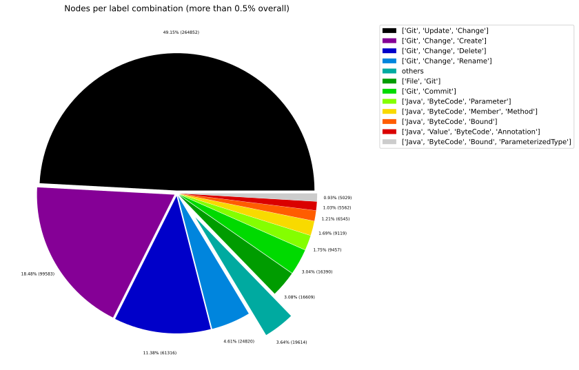
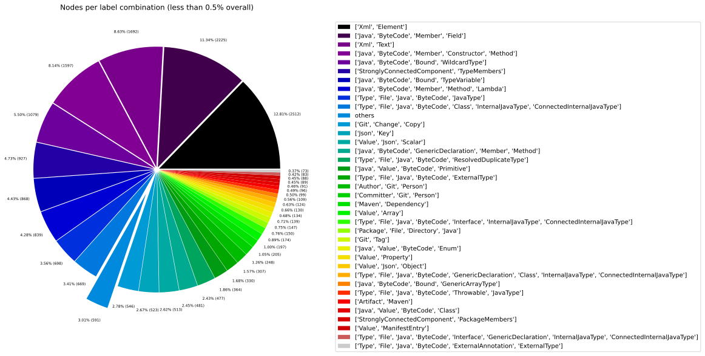
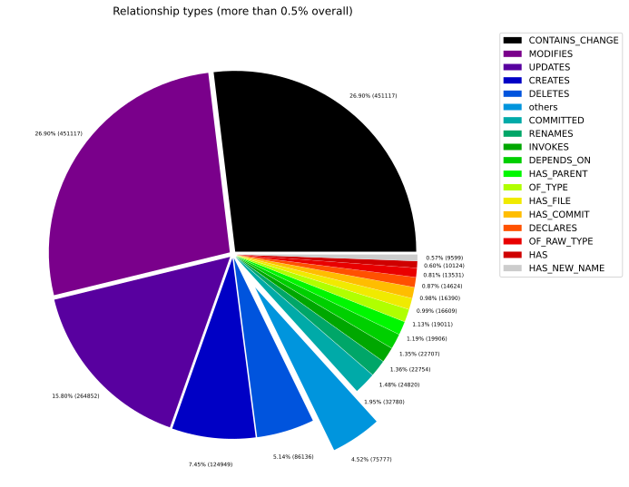
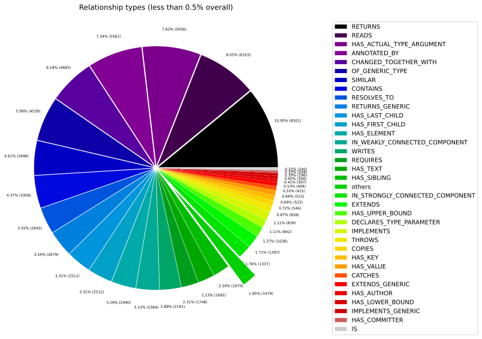
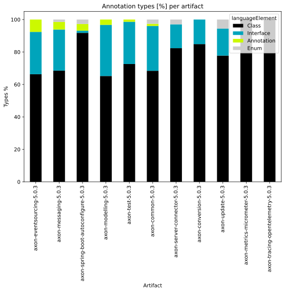
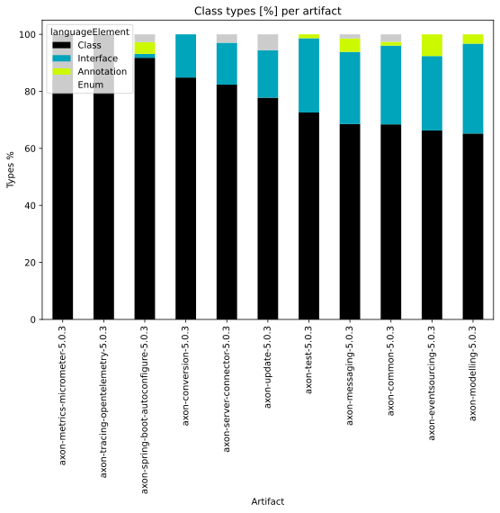
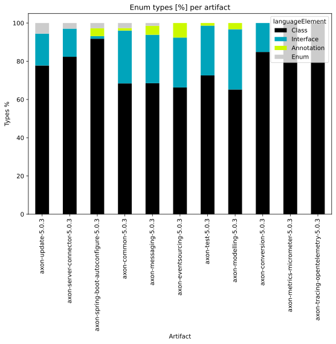
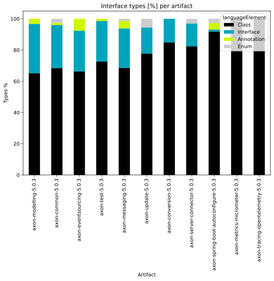
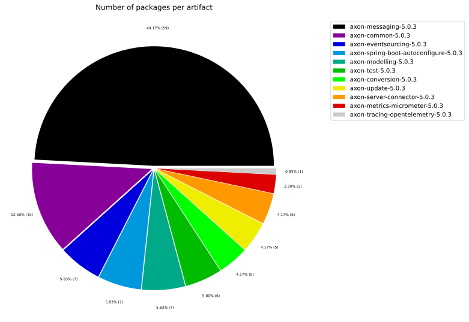
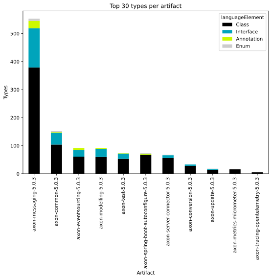

# Overview Report

## 1. Overview

High-level summary of graph database contents: general graph structure (node labels, relationships), Java artifacts, and TypeScript modules.

## 📚 Table of Contents

1. [Overview](#1-overview)
1. [General](#2-general)
1. [Java](#3-java)
1. [TypeScript](#4-typescript)

---

## 2. General

### 2.1 Node label combinations

Shows how many nodes carry each combination of labels and their share of the total node count.

| nodeLabels | nodesWithThatLabels | nodesWithThatLabelsPercent |
| --- | --- | --- |
| ["Git","Update","Change"] | 264852 | 49.1473276748303 |
| ["Git","Change","Create"] | 99583 | 18.479144321517776 |
| ["Git","Change","Delete"] | 61316 | 11.378118887944568 |
| ["Git","Change","Rename"] | 24820 | 4.60572951266854 |
| ["File","Git"] | 16609 | 3.082053242381619 |
| ["Git","Commit"] | 16390 | 3.041414452563955 |
| ["Java","ByteCode","Parameter"] | 9457 | 1.7548905721718928 |
| ["Java","ByteCode","Member","Method"] | 9117 | 1.6917983870668445 |
| ["Java","ByteCode","Bound"] | 6545 | 1.2145245632721835 |
| ["Java","Value","ByteCode","Annotation"] | 5562 | 1.0321139222184696 |

[Full data](./Node_label_combination_count.csv)

---

### 2.2 Node labels

Shows the number of nodes carrying each individual label, sorted by count descending.

| nodeLabel | nodesWithThatLabel | nodesWithThatLabelPercent |
| --- | --- | --- |
| Git | 484820 | 89.96574465479297 |
| Change | 451117 | 83.71163902362989 |
| Update | 264852 | 49.1473276748303 |
| Create | 99583 | 18.479144321517776 |
| Delete | 61316 | 11.378118887944568 |
| Java | 46699 | 8.66571162417841 |
| ByteCode | 46490 | 8.626928486863836 |
| Rename | 24820 | 4.60572951266854 |
| File | 19861 | 3.685511436386377 |
| Commit | 16390 | 3.041414452563955 |

[Full data](./Node_label_count.csv)

---

### 2.3 Relationship types

Shows the number of relationships for each type and their share of the total relationship count.

| relationshipType | nodesWithThatRelationshipType | nodesWithThatRelationshipTypePercent |
| --- | --- | --- |
| CONTAINS_CHANGE | 451117 | 26.903639577573312 |
| MODIFIES | 451117 | 26.903639577573312 |
| UPDATES | 264852 | 15.795198916022777 |
| CREATES | 124949 | 7.451687392800999 |
| DELETES | 86136 | 5.1369642435418195 |
| COMMITTED | 32780 | 1.9549281125580575 |
| RENAMES | 24820 | 1.4802109747922816 |
| INVOKES | 22746 | 1.3565221125151181 |
| DEPENDS_ON | 22707 | 1.3541962370913914 |
| HAS_PARENT | 19906 | 1.1871506714027056 |

[Full data](./Relationship_type_count.csv)

---

### 2.4 Node labels and their relationships

Shows which node labels are connected by each relationship type, with count and percentage share.
| sourceLabels | relationshipType | targetLabels | relationshipCount |
| --- | --- | --- | --- |
| ["Git","Update","Change"] | MODIFIES | ["Git"] | 264852 |
| ["Git","Update","Change"] | UPDATES | ["Git"] | 264852 |
| ["Git","Commit"] | CONTAINS_CHANGE | ["Git","Update","Change"] | 264852 |
| ["Git","Change","Create"] | MODIFIES | ["Git"] | 99583 |
| ["Git","Commit"] | CONTAINS_CHANGE | ["Git","Change","Create"] | 99583 |
| ["Git","Change","Create"] | CREATES | ["Git"] | 99583 |
| ["Git","Change","Delete"] | MODIFIES | ["Git"] | 61316 |
| ["Git","Commit"] | CONTAINS_CHANGE | ["Git","Change","Delete"] | 61316 |
| ["Git","Change","Delete"] | DELETES | ["Git"] | 61316 |
| ["Git","Change","Rename"] | MODIFIES | ["Git"] | 24820 |

[Full data](./Node_labels_and_their_relationships.csv)

---

### 2.5 Graph density

Statistical measures of the graph structure: node count, relationship count, and density metric.

---

### 2.6 Dependency node labels

Shows node labels present on dependency nodes — nodes that represent external dependencies not scanned as artifacts.

| sourceLabels | targetLabels | numberOfNodes | percentageOfTotalNodes |
| --- | --- | --- | --- |
| StronglyConnectedComponent,TypeMembers | StronglyConnectedComponent,TypeMembers | 4134 | 0.77 |
| StronglyConnectedComponent,PackageMembers | StronglyConnectedComponent,PackageMembers | 365 | 0.07 |
| Type,File,Java,ByteCode,Class,InternalJavaType,ConnectedInternalJavaType | Type,File,Java,ByteCode,JavaType | 33 | 0.01 |
| Type,File,Java,ByteCode,Class,InternalJavaType,ConnectedInternalJavaType | Type,File,Java,ByteCode,ResolvedDuplicateType | 32 | 0.01 |
| StronglyConnectedComponent,ArtifactMembers | StronglyConnectedComponent,ArtifactMembers | 30 | 0.01 |
| Type,File,Java,ByteCode,Class,InternalJavaType,ConnectedInternalJavaType | Type,File,Java,ByteCode,ResolvedDuplicateType | 30 | 0.01 |
| Type,File,Java,ByteCode,Class,InternalJavaType,ConnectedInternalJavaType | Type,File,Java,ByteCode,JavaType | 29 | 0.01 |
| Type,File,Java,ByteCode,Class,InternalJavaType,ConnectedInternalJavaType | Type,File,Java,ByteCode,JavaType | 27 | 0.01 |
| Type,File,Java,ByteCode,Class,InternalJavaType,ConnectedInternalJavaType,GenericDeclaration | Type,File,Java,ByteCode,JavaType | 24 | 0 |
| Type,File,Java,ByteCode,Class,InternalJavaType,ConnectedInternalJavaType | Type,File,Java,ByteCode,JavaType | 23 | 0 |

[Full data](./Dependency_node_labels.csv)

---

## 3. Java

### 3.1 Artifact size

Overview of scanned Java artifacts: number of packages, types, methods, and lines of code.

| nodeCount | relationshipCount | artifactCount | packageCount | typeCount | methodCount | memberCount |
| --- | --- | --- | --- | --- | --- | --- |
| 538894 | 1676788 | 11 | 128 | 1822 | 5709 | 7176 |

[Full data](./Overview_size.csv)

### 3.2 Java overview charts

---

## 4. TypeScript

### 4.1 Module size

Overview of scanned TypeScript modules: number of exported language elements per module.

> No overview data available.
> Please run the analysis pipeline first to scan and import code artifacts into the graph database (e.g., `analyze.sh`), then start Neo4j and re-run the overview reports.

### 4.2 TypeScript overview charts

