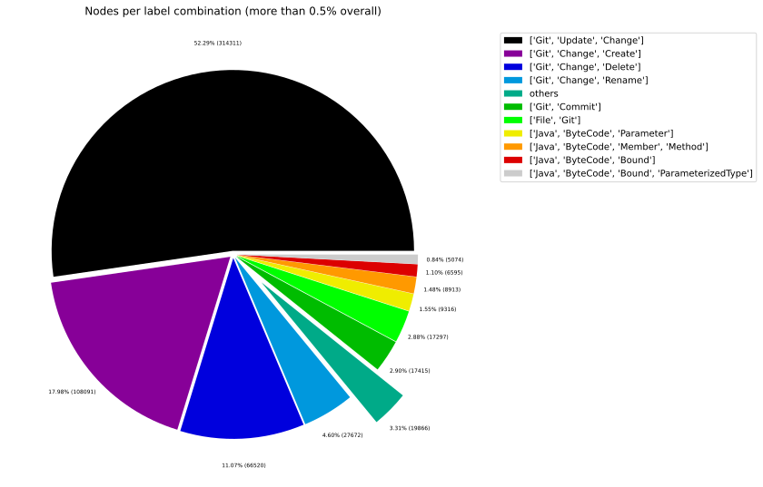
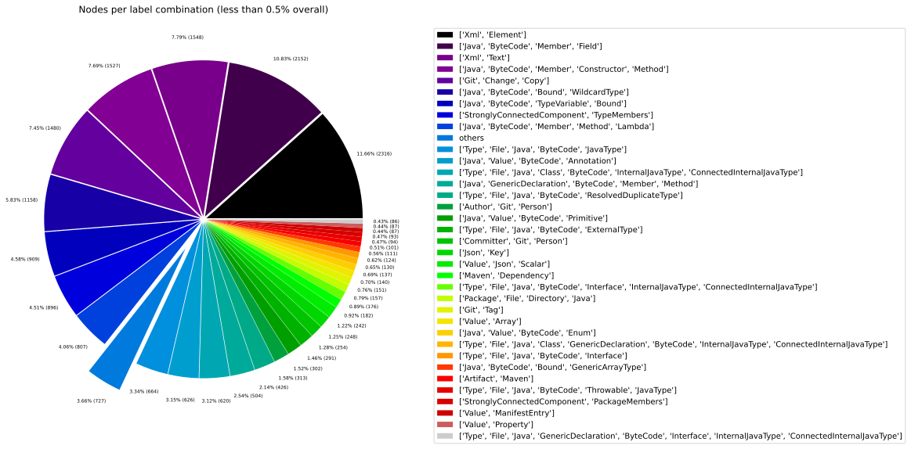
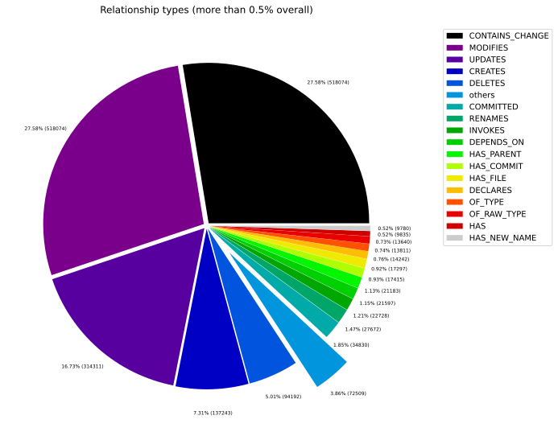
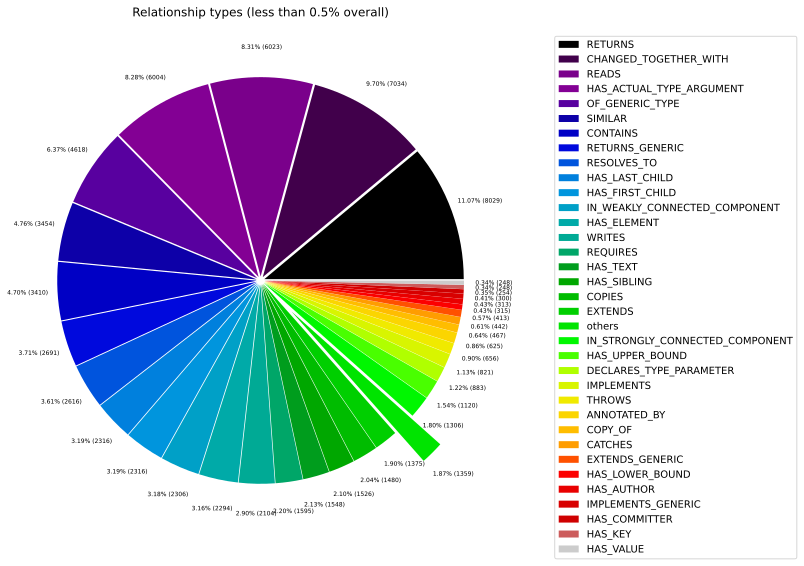
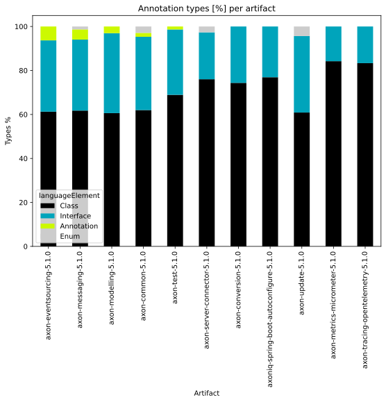
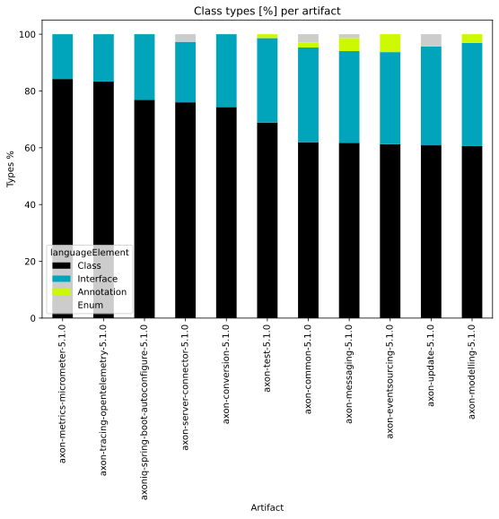
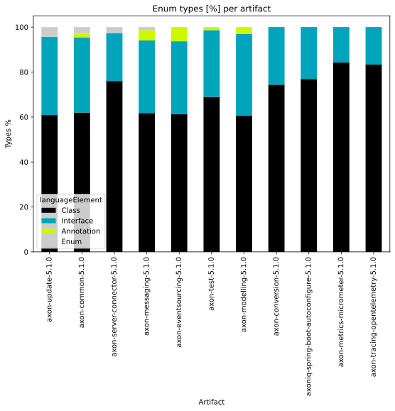
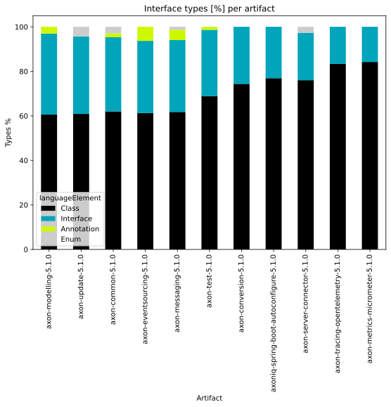
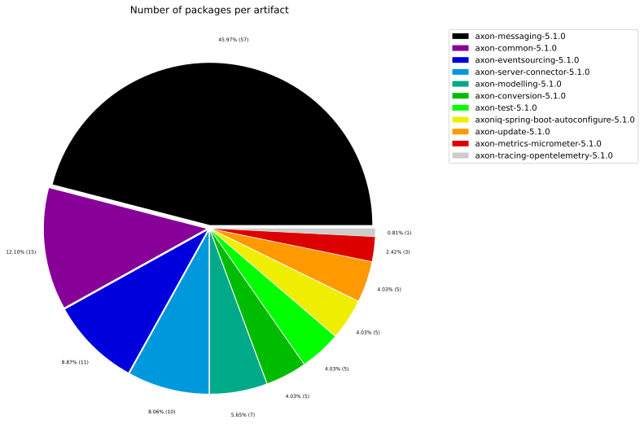
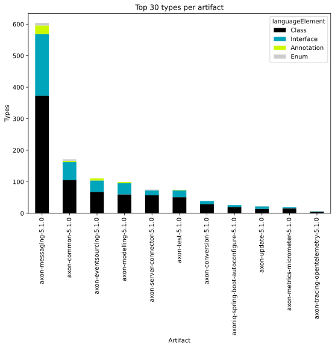

# Overview Report

## 1. Overview

High-level summary of graph database contents: general graph structure (node labels, relationships), Java artifacts, and TypeScript modules.

## 📚 Table of Contents

1. [Overview](#1-overview)
1. [General](#2-general)
1. [Java](#3-java)
1. [TypeScript](#4-typescript)

---

## 2. General

### 2.1 Node label combinations

Shows how many nodes carry each combination of labels and their share of the total node count.

| nodeLabels | nodesWithThatLabels | nodesWithThatLabelsPercent |
| --- | --- | --- |
| ["Git","Update","Change"] | 314311 | 52.29199975377203 |
| ["Git","Change","Create"] | 108091 | 17.983126729210788 |
| ["Git","Change","Delete"] | 66520 | 11.06694905243824 |
| ["Git","Change","Rename"] | 27672 | 4.603797567334199 |
| ["Git","Commit"] | 17415 | 2.8973379096243526 |
| ["File","Git"] | 17297 | 2.877706220084549 |
| ["Java","ByteCode","Parameter"] | 9316 | 1.5499052521424328 |
| ["Java","ByteCode","Member","Method"] | 8912 | 1.4826916710061573 |
| ["Java","ByteCode","Bound"] | 6595 | 1.0972118009745968 |
| ["Java","ByteCode","Bound","ParameterizedType"] | 5074 | 0.8441626502115398 |

[Full data](./Node_label_combination_count.csv)

---

### 2.2 Node labels

Shows the number of nodes carrying each individual label, sorted by count descending.

| nodeLabel | nodesWithThatLabel | nodesWithThatLabelPercent |
| --- | --- | --- |
| Git | 553506 | 92.08693178320625 |
| Change | 518074 | 86.19210107325449 |
| Update | 314311 | 52.29199975377203 |
| Create | 108091 | 17.983126729210788 |
| Delete | 66520 | 11.06694905243824 |
| Java | 41311 | 6.872921411684849 |
| ByteCode | 41096 | 6.837151807862325 |
| Rename | 27672 | 4.603797567334199 |
| File | 20477 | 3.406763616157213 |
| Commit | 17415 | 2.8973379096243526 |

[Full data](./Node_label_count.csv)

---

### 2.3 Relationship types

Shows the number of relationships for each type and their share of the total relationship count.

| relationshipType | nodesWithThatRelationshipType | nodesWithThatRelationshipTypePercent |
| --- | --- | --- |
| CONTAINS_CHANGE | 518074 | 27.5801306621693 |
| MODIFIES | 518074 | 27.5801306621693 |
| UPDATES | 314311 | 16.732625934822234 |
| CREATES | 137243 | 7.306253300625203 |
| DELETES | 94192 | 5.014394984753241 |
| COMMITTED | 34830 | 1.8542060612255329 |
| RENAMES | 27672 | 1.4731435580313792 |
| INVOKES | 22728 | 1.2099453160934226 |
| DEPENDS_ON | 21597 | 1.1497355240966936 |
| HAS_PARENT | 21183 | 1.127695865487811 |

[Full data](./Relationship_type_count.csv)

---

### 2.4 Node labels and their relationships

Shows which node labels are connected by each relationship type, with count and percentage share.
| sourceLabels | relationshipType | targetLabels | relationshipCount |
| --- | --- | --- | --- |
| ["Git","Update","Change"] | MODIFIES | ["Git"] | 314311 |
| ["Git","Update","Change"] | UPDATES | ["Git"] | 314311 |
| ["Git","Commit"] | CONTAINS_CHANGE | ["Git","Update","Change"] | 314311 |
| ["Git","Change","Create"] | MODIFIES | ["Git"] | 108091 |
| ["Git","Change","Create"] | CREATES | ["Git"] | 108091 |
| ["Git","Commit"] | CONTAINS_CHANGE | ["Git","Change","Create"] | 108091 |
| ["Git","Change","Delete"] | MODIFIES | ["Git"] | 66520 |
| ["Git","Change","Delete"] | DELETES | ["Git"] | 66520 |
| ["Git","Commit"] | CONTAINS_CHANGE | ["Git","Change","Delete"] | 66520 |
| ["Git","Change","Rename"] | MODIFIES | ["Git"] | 27672 |

[Full data](./Node_labels_and_their_relationships.csv)

---

### 2.5 Graph density

Statistical measures of the graph structure: node count, relationship count, and density metric.

---

### 2.6 Dependency node labels

Shows node labels present on dependency nodes — nodes that represent external dependencies not scanned as artifacts.

| sourceLabels | targetLabels | numberOfNodes | percentageOfTotalNodes |
| --- | --- | --- | --- |
| StronglyConnectedComponent,TypeMembers | StronglyConnectedComponent,TypeMembers | 4067 | 0.68 |
| StronglyConnectedComponent,PackageMembers | StronglyConnectedComponent,PackageMembers | 364 | 0.06 |
| Type,File,Java,ByteCode,Interface | Type,File,Java,ByteCode,JavaType,ExternalAnnotation,ExternalType | 124 | 0.02 |
| Type,File,Java,Class,ByteCode,InternalJavaType,ConnectedInternalJavaType | Type,File,Java,ByteCode,JavaType | 38 | 0.01 |
| Type,File,Java,Class,ByteCode,InternalJavaType,ConnectedInternalJavaType | Type,File,Java,ByteCode,JavaType | 34 | 0.01 |
| Type,File,Java,Class,ByteCode,InternalJavaType,ConnectedInternalJavaType | Type,File,Java,ByteCode,ResolvedDuplicateType | 32 | 0.01 |
| Type,File,Java,Class,ByteCode,InternalJavaType,ConnectedInternalJavaType | Type,File,Java,ByteCode,ResolvedDuplicateType | 29 | 0 |
| Type,File,Java,Class,ByteCode,InternalJavaType,ConnectedInternalJavaType | Type,File,Java,ByteCode,JavaType | 28 | 0 |
| StronglyConnectedComponent,ArtifactMembers | StronglyConnectedComponent,ArtifactMembers | 27 | 0 |
| Type,File,Java,Class,ByteCode,InternalJavaType,ConnectedInternalJavaType | Type,File,Java,ByteCode,JavaType | 27 | 0 |

[Full data](./Dependency_node_labels.csv)

---

## 3. Java

### 3.1 Artifact size

Overview of scanned Java artifacts: number of packages, types, methods, and lines of code.

| nodeCount | relationshipCount | artifactCount | packageCount | typeCount | methodCount | memberCount |
| --- | --- | --- | --- | --- | --- | --- |
| 601069 | 1878432 | 11 | 137 | 1848 | 5594 | 7004 |

[Full data](./Overview_size.csv)

### 3.2 Java overview charts

---

## 4. TypeScript

### 4.1 Module size

Overview of scanned TypeScript modules: number of exported language elements per module.

> No overview data available.
> Please run the analysis pipeline first to scan and import code artifacts into the graph database (e.g., `analyze.sh`), then start Neo4j and re-run the overview reports.

### 4.2 TypeScript overview charts

