# 📦 External Dependencies Report

## 1. Executive Overview

Analyzes which external packages, modules, and namespaces the codebase depends on, their spread, and per-artifact usage.

> **Who imports whom?**
> High spread (many internal modules referencing the same external package) = candidate for a **facade** or **anti-corruption layer**.

## 📚 Table of Contents

1. [Executive Overview](#1-executive-overview)
1. [Java External Dependencies](#2-java-external-dependencies)
1. [TypeScript External Dependencies](#3-typescript-external-dependencies)
1. [Package Management](#4-package-management)
1. [Glossary](#5-glossary)

---

## 2. Java External Dependencies

### 2.1 Most Used External Packages

External Java packages by internal caller type count. High `numberOfExternalCallerTypes` = deeply embedded.

| externalPackageName | numberOfExternalCallerPackages | numberOfExternalCallerTypes | numberOfExternalTypeCalls | numberOfExternalTypeCallsWeighted | allPackages | allTypes | tenExternalTypeNames |
| --- | --- | --- | --- | --- | --- | --- | --- |
| org.jspecify.annotations | 124 | 124 | 124 | 124 | 124 | 1313 | ["NullMarked"] |
| org.slf4j | 37 | 74 | 135 | 476 | 124 | 1313 | ["LoggerFactory","Logger"] |
| io.axoniq.axonserver.grpc | 8 | 15 | 34 | 220 | 124 | 1313 | ["ErrorMessage","SerializedObject","MetaDataValue$Builder","MetaDataValue","SerializedObject$Builder","MetaDataValue$DataCase","ErrorMessage$Builder","ProcessingKey","ProcessingInstruction$Builder"] |
| io.axoniq.axonserver.connector | 7 | 17 | 24 | 129 | 124 | 1313 | ["AxonServerConnection","AxonServerConnectionFactory","AxonServerConnectionFactory$Builder","ResultStream","Registration","FlowControl","ReplyChannel"] |
| com.google.protobuf | 6 | 9 | 9 | 39 | 124 | 1313 | ["ByteString","MessageLite"] |
| io.grpc | 6 | 8 | 26 | 60 | 124 | 1313 | ["Status","StatusRuntimeException","Status$Code","ManagedChannelBuilder","ClientInterceptor","Metadata$AsciiMarshaller","Metadata$Key","Metadata","ClientCall$Listener"] |
| jakarta.persistence | 5 | 16 | 40 | 181 | 124 | 1313 | ["Basic","Id","Column","Entity","Lob","IdClass","LockModeType","Query","EntityManager"] |
| reactor.core.publisher | 5 | 8 | 13 | 45 | 124 | 1313 | ["FluxSink","Flux","Mono","MonoSink"] |
| io.axoniq.axonserver.connector.control | 4 | 5 | 5 | 6 | 124 | 1313 | ["ControlChannel","ProcessorInstructionHandler"] |
| org.springframework.boot.context.properties | 4 | 9 | 9 | 9 | 124 | 1313 | ["ConfigurationProperties","EnableConfigurationProperties"] |
| com.fasterxml.jackson.annotation | 3 | 6 | 19 | 33 | 124 | 1313 | ["JsonGetter","JsonCreator","JsonTypeInfo","JsonProperty","JsonTypeInfo$Id","JsonIgnore"] |
| io.axoniq.axonserver.grpc.control | 3 | 6 | 13 | 86 | 124 | 1313 | ["NodeInfo$Builder","NodeInfo","EventProcessorInfo","EventProcessorInfo$SegmentStatus","EventProcessorInfo$SegmentStatus$Builder","EventProcessorInfo$Builder","UpdateType","TopologyChange","QuerySubscription"] |
| io.axoniq.framework.messaging.commandhandling.distributed | 3 | 4 | 7 | 26 | 124 | 1313 | ["CommandBusConnector$ResultCallback","CommandBusConnector","CommandBusConnector$Handler","PayloadConvertingCommandBusConnector","DistributedCommandBusConfiguration"] |
| io.axoniq.framework.messaging.queryhandling.distributed | 3 | 5 | 8 | 28 | 124 | 1313 | ["QueryBusConnector$UpdateCallback","QueryBusConnector$Handler","QueryBusConnector","PayloadConvertingQueryBusConnector","DistributedQueryBusConfiguration"] |
| io.micrometer.core.instrument | 3 | 13 | 37 | 141 | 124 | 1313 | ["Clock","MeterRegistry","Timer$Builder","Tag","Tags","Gauge$Builder","Gauge","Timer","Counter"] |
| org.hamcrest | 3 | 22 | 44 | 196 | 124 | 1313 | ["Matcher","Description","TypeSafeMatcher","BaseMatcher","StringDescription","CoreMatchers"] |
| org.reactivestreams | 3 | 6 | 7 | 26 | 124 | 1313 | ["Subscriber","Subscription","Publisher"] |
| org.springframework.boot.actuate.health | 3 | 4 | 7 | 24 | 124 | 1313 | ["Status","Health$Builder","AbstractHealthIndicator","SimpleStatusAggregator"] |
| com.fasterxml.jackson.databind | 2 | 6 | 11 | 56 | 124 | 1313 | ["JsonNode","ObjectMapper","JavaType","SerializationFeature"] |
| com.fasterxml.jackson.databind.node | 2 | 3 | 5 | 28 | 124 | 1313 | ["ObjectNode","JsonNodeType","ArrayNode"] |
| io.axoniq.axonserver.connector.event | 2 | 6 | 9 | 40 | 124 | 1313 | ["SnapshotChannel","DcbEventChannel","DcbEventChannel$AppendEventsTransaction","AppendEventsTransaction","EventChannel","AggregateEventStream","EventStream"] |
| io.axoniq.axonserver.grpc.event.dcb | 2 | 7 | 36 | 132 | 124 | 1313 | ["AddSnapshotRequest$Builder","GetLastSnapshotRequest$Builder","Snapshot","AddSnapshotRequest","GetLastSnapshotRequest","AddSnapshotResponse","GetLastSnapshotResponse","Snapshot$Builder","TaggedEvent"] |
| io.micrometer.core.instrument.simple | 2 | 2 | 2 | 4 | 124 | 1313 | ["SimpleMeterRegistry"] |
| org.springframework.boot.autoconfigure | 2 | 7 | 10 | 10 | 124 | 1313 | ["AutoConfigureAfter","AutoConfigureBefore","AutoConfiguration"] |
| org.springframework.boot.autoconfigure.condition | 2 | 7 | 18 | 29 | 124 | 1313 | ["ConditionalOnMissingBean","ConditionalOnProperty","ConditionalOnClass","ConditionalOnBean"] |
| org.springframework.context.annotation | 2 | 7 | 7 | 15 | 124 | 1313 | ["Bean"] |
| IdTypeParameterResolver | 1 | 1 | 1 | 1 | 124 | 1313 | ["IdTypeParameterResolver"] |
| ScannedEntityCreator | 1 | 1 | 1 | 4 | 124 | 1313 | ["ScannedEntityCreator"] |
| WrappedEventCriteriaBuilderMethod | 1 | 1 | 1 | 1 | 124 | 1313 | ["WrappedEventCriteriaBuilderMethod"] |
| com.fasterxml.jackson.core | 1 | 1 | 1 | 1 | 124 | 1313 | ["JsonProcessingException"] |
| io.axoniq.axonserver.connector.admin | 1 | 1 | 1 | 3 | 124 | 1313 | ["AdminChannel"] |
| io.axoniq.axonserver.connector.command | 1 | 1 | 1 | 3 | 124 | 1313 | ["CommandChannel"] |
| io.axoniq.axonserver.connector.impl | 1 | 1 | 1 | 3 | 124 | 1313 | ["ServerAddress"] |
| io.axoniq.axonserver.connector.query | 1 | 3 | 6 | 19 | 124 | 1313 | ["QueryHandler$UpdateHandler","SubscriptionQueryResult","QueryDefinition","QueryChannel","QueryHandler"] |
| io.axoniq.axonserver.grpc.command | 1 | 3 | 8 | 64 | 124 | 1313 | ["CommandResponse","Command","CommandResponse$Builder","Command$Builder"] |
| io.axoniq.axonserver.grpc.event | 1 | 3 | 5 | 31 | 124 | 1313 | ["ConfirmationWithConsistencyMarker","Event","Event$Builder","EventWithToken"] |
| io.axoniq.axonserver.grpc.query | 1 | 5 | 14 | 98 | 124 | 1313 | ["QueryResponse","QueryResponse$Builder","QueryUpdate","QueryRequest","SubscriptionQuery","QueryUpdate$Builder","QueryRequest$Builder"] |
| io.axoniq.framework.messaging.deadletter | 1 | 2 | 2 | 2 | 124 | 1313 | ["SequencedDeadLetterQueue"] |
| io.axoniq.framework.messaging.eventhandling.deadletter | 1 | 3 | 4 | 15 | 124 | 1313 | ["DeadLetterQueueConfiguration","SequencedDeadLetterQueueFactory"] |
| io.axoniq.framework.messaging.eventhandling.deadletter.jdbc | 1 | 1 | 3 | 12 | 124 | 1313 | ["DeadLetterSchema","JdbcSequencedDeadLetterQueue","JdbcSequencedDeadLetterQueue$Builder"] |
| io.axoniq.framework.messaging.eventhandling.deadletter.jpa | 1 | 1 | 2 | 7 | 124 | 1313 | ["JpaSequencedDeadLetterQueue$Builder","JpaSequencedDeadLetterQueue"] |
| io.axoniq.framework.postgresql | 1 | 2 | 2 | 2 | 124 | 1313 | ["PostgresqlConfigurationEnhancer","PostgresqlEventStorageEngine"] |
| io.axoniq.framework.testcontainer | 1 | 2 | 2 | 6 | 124 | 1313 | ["AxonServerContainer"] |
| io.grpc.netty.shaded.io.grpc.netty | 1 | 1 | 1 | 1 | 124 | 1313 | ["GrpcSslContexts"] |
| io.grpc.netty.shaded.io.netty.handler.ssl | 1 | 1 | 1 | 2 | 124 | 1313 | ["SslContextBuilder"] |
| io.grpc.stub | 1 | 1 | 2 | 5 | 124 | 1313 | ["ClientResponseObserver","ClientCallStreamObserver"] |
| io.opentelemetry.api | 1 | 1 | 1 | 2 | 124 | 1313 | ["GlobalOpenTelemetry"] |
| io.opentelemetry.api.trace | 1 | 3 | 9 | 47 | 124 | 1313 | ["SpanBuilder","Span","StatusCode","SpanContext","Tracer","SpanKind"] |
| io.opentelemetry.context | 1 | 2 | 2 | 7 | 124 | 1313 | ["Scope","Context"] |
| io.opentelemetry.context.propagation | 1 | 4 | 9 | 16 | 124 | 1313 | ["TextMapGetter","TextMapSetter","TextMapPropagator","ContextPropagators"] |
| jakarta.validation | 1 | 2 | 5 | 16 | 124 | 1313 | ["Validator","ConstraintViolation","ValidatorFactory","Validation"] |
| javax.cache | 1 | 1 | 1 | 13 | 124 | 1313 | ["Cache"] |
| javax.cache.configuration | 1 | 2 | 3 | 9 | 124 | 1313 | ["CacheEntryListenerConfiguration","Factory"] |
| javax.cache.event | 1 | 1 | 8 | 26 | 124 | 1313 | ["CacheEntryEventFilter","CacheEntryListenerException","CacheEntryEvent","CacheEntryUpdatedListener","CacheEntryListener","CacheEntryRemovedListener","CacheEntryExpiredListener","CacheEntryCreatedListener"] |
| org.apache.avro | 1 | 4 | 16 | 54 | 124 | 1313 | ["Schema","SchemaCompatibility$Incompatibility","AvroRuntimeException","SchemaCompatibility$SchemaIncompatibilityType","SchemaCompatibility$SchemaCompatibilityResult","SchemaCompatibility$SchemaPairCompatibility","InvalidAvroMagicException","SchemaNormalization","SchemaCompatibility"] |
| org.apache.avro.generic | 1 | 6 | 7 | 29 | 124 | 1313 | ["GenericRecord","GenericDatumReader","GenericData"] |
| org.apache.avro.io | 1 | 1 | 1 | 3 | 124 | 1313 | ["DecoderFactory"] |
| org.apache.avro.message | 1 | 6 | 8 | 28 | 124 | 1313 | ["SchemaStore","BinaryMessageEncoder","BinaryMessageDecoder","BadHeaderException"] |
| org.apache.avro.specific | 1 | 2 | 4 | 14 | 124 | 1313 | ["SpecificData","SpecificRecordBase"] |
| org.apache.commons.lang3.tuple | 1 | 1 | 1 | 4 | 124 | 1313 | ["Pair"] |
| org.awaitility | 1 | 1 | 1 | 1 | 124 | 1313 | ["Awaitility"] |
| org.awaitility.core | 1 | 1 | 1 | 2 | 124 | 1313 | ["ConditionFactory"] |
| org.axonframework.extension.springboot.autoconfig | 1 | 1 | 1 | 1 | 124 | 1313 | ["AxonAutoConfiguration"] |
| org.axonframework.extension.springboot.util | 1 | 1 | 1 | 1 | 124 | 1313 | ["RegisterDefaultEntities"] |
| org.ehcache.config | 1 | 1 | 1 | 2 | 124 | 1313 | ["CacheRuntimeConfiguration"] |
| org.ehcache.core | 1 | 1 | 1 | 13 | 124 | 1313 | ["Ehcache"] |
| org.ehcache.event | 1 | 3 | 8 | 30 | 124 | 1313 | ["EventType","CacheEvent","CacheEventListener","EventOrdering","EventFiring"] |
| org.junit.jupiter.api.extension | 1 | 1 | 8 | 28 | 124 | 1313 | ["ParameterResolver","BeforeEachCallback","ParameterResolutionException","ExtensionContext","ExtensionContext$Namespace","AfterEachCallback","ExtensionContext$Store","ParameterContext"] |
| org.springframework.beans | 1 | 1 | 1 | 1 | 124 | 1313 | ["BeansException"] |
| org.springframework.boot.autoconfigure.service.connection | 1 | 3 | 3 | 3 | 124 | 1313 | ["ConnectionDetails"] |
| org.springframework.boot.docker.compose.core | 1 | 1 | 2 | 5 | 124 | 1313 | ["ConnectionPorts","RunningService"] |
| org.springframework.boot.docker.compose.service.connection | 1 | 1 | 2 | 5 | 124 | 1313 | ["DockerComposeConnectionSource","DockerComposeConnectionDetailsFactory"] |
| org.springframework.boot.testcontainers.service.connection | 1 | 2 | 4 | 9 | 124 | 1313 | ["ContainerConnectionSource","ContainerConnectionDetailsFactory$ContainerConnectionDetails","ContainerConnectionDetailsFactory"] |
| org.springframework.context | 1 | 1 | 2 | 4 | 124 | 1313 | ["ApplicationContextAware","ApplicationContext"] |
| org.springframework.lang | 1 | 1 | 1 | 1 | 124 | 1313 | ["Nullable"] |
| reactor.core.scheduler | 1 | 1 | 2 | 2 | 124 | 1313 | ["Scheduler","Schedulers"] |
| reactor.util.concurrent | 1 | 2 | 2 | 4 | 124 | 1313 | ["Queues"] |
| tools.jackson.core | 1 | 3 | 3 | 6 | 124 | 1313 | ["JacksonException"] |
| tools.jackson.databind | 1 | 5 | 8 | 39 | 124 | 1313 | ["ObjectMapper","JsonNode","JavaType"] |
| tools.jackson.databind.json | 1 | 1 | 2 | 5 | 124 | 1313 | ["JsonMapper$Builder","JsonMapper"] |
| tools.jackson.databind.node | 1 | 2 | 3 | 12 | 124 | 1313 | ["ObjectNode","JsonNodeType"] |

### 2.2 Most Used External Packages — Second-Level Grouping

Second-level package names (e.g. `javax.xml` from `javax.xml.stream`) reveal **framework-level** coupling that is hidden when viewing full package names.

| externalSecondLevelPackageName | numberOfExternalCallerPackages | numberOfExternalCallerTypes | numberOfExternalTypeCalls | numberOfExternalTypeCallsWeighted | allPackages | allTypes | tenExternalTypeNames |
| --- | --- | --- | --- | --- | --- | --- | --- |
| org.jspecify | 124 | 124 | 124 | 124 | 124 | 1313 | ["NullMarked"] |
| org.slf4j | 37 | 74 | 135 | 476 | 124 | 1313 | ["LoggerFactory","Logger"] |
| io.axoniq | 12 | 50 | 187 | 932 | 124 | 1313 | ["AxonServerConnection","AddSnapshotRequest$Builder","GetLastSnapshotRequest$Builder","Snapshot","AddSnapshotRequest","GetLastSnapshotRequest","AddSnapshotResponse","GetLastSnapshotResponse","Snapshot$Builder"] |
| org.springframework | 7 | 19 | 66 | 115 | 124 | 1313 | ["ConfigurationProperties","EnableConfigurationProperties","AutoConfigureAfter","Bean","AutoConfigureBefore","ConditionalOnMissingBean","ConditionalOnProperty","AutoConfiguration","ConditionalOnClass"] |
| com.google | 6 | 9 | 9 | 39 | 124 | 1313 | ["ByteString","MessageLite"] |
| io.grpc | 6 | 9 | 30 | 68 | 124 | 1313 | ["Status","StatusRuntimeException","Status$Code","GrpcSslContexts","ManagedChannelBuilder","ClientInterceptor","SslContextBuilder","Metadata$AsciiMarshaller","Metadata$Key"] |
| reactor.core | 6 | 9 | 15 | 47 | 124 | 1313 | ["FluxSink","Flux","Mono","MonoSink","Scheduler","Schedulers"] |
| com.fasterxml | 5 | 12 | 36 | 118 | 124 | 1313 | ["JsonGetter","JsonCreator","JsonTypeInfo","JsonProperty","JsonTypeInfo$Id","JsonIgnore","ObjectNode","JsonNode","JsonNodeType"] |
| jakarta.persistence | 5 | 16 | 40 | 181 | 124 | 1313 | ["Basic","Id","Column","Entity","Lob","IdClass","LockModeType","Query","EntityManager"] |
| io.micrometer | 3 | 13 | 39 | 145 | 124 | 1313 | ["Clock","MeterRegistry","SimpleMeterRegistry","Timer$Builder","Tag","Tags","Gauge$Builder","Gauge","Timer"] |
| org.hamcrest | 3 | 22 | 44 | 196 | 124 | 1313 | ["Matcher","Description","TypeSafeMatcher","BaseMatcher","StringDescription","CoreMatchers"] |
| org.reactivestreams | 3 | 6 | 7 | 26 | 124 | 1313 | ["Subscriber","Subscription","Publisher"] |
| org.axonframework | 2 | 2 | 2 | 2 | 124 | 1313 | ["AxonAutoConfiguration","RegisterDefaultEntities"] |
| IdTypeParameterResolver | 1 | 1 | 1 | 1 | 124 | 1313 | ["IdTypeParameterResolver"] |
| ScannedEntityCreator | 1 | 1 | 1 | 4 | 124 | 1313 | ["ScannedEntityCreator"] |
| WrappedEventCriteriaBuilderMethod | 1 | 1 | 1 | 1 | 124 | 1313 | ["WrappedEventCriteriaBuilderMethod"] |
| io.opentelemetry | 1 | 5 | 21 | 72 | 124 | 1313 | ["TextMapGetter","SpanBuilder","Span","Scope","StatusCode","SpanContext","Tracer","GlobalOpenTelemetry","TextMapSetter"] |
| jakarta.validation | 1 | 2 | 5 | 16 | 124 | 1313 | ["Validator","ConstraintViolation","ValidatorFactory","Validation"] |
| javax.cache | 1 | 2 | 12 | 48 | 124 | 1313 | ["CacheEntryListenerConfiguration","Cache","Factory","CacheEntryEventFilter","CacheEntryListenerException","CacheEntryEvent","CacheEntryUpdatedListener","CacheEntryListener","CacheEntryRemovedListener"] |
| org.apache | 1 | 9 | 37 | 132 | 124 | 1313 | ["SchemaStore","GenericRecord","GenericDatumReader","DecoderFactory","Schema","SchemaCompatibility$Incompatibility","SpecificData","BinaryMessageEncoder","SpecificRecordBase"] |
| org.awaitility | 1 | 1 | 2 | 3 | 124 | 1313 | ["Awaitility","ConditionFactory"] |
| org.ehcache | 1 | 3 | 10 | 45 | 124 | 1313 | ["EventType","CacheEvent","CacheEventListener","Ehcache","CacheRuntimeConfiguration","EventOrdering","EventFiring"] |
| org.junit | 1 | 1 | 8 | 28 | 124 | 1313 | ["ParameterResolver","BeforeEachCallback","ParameterResolutionException","ExtensionContext","ExtensionContext$Namespace","AfterEachCallback","ExtensionContext$Store","ParameterContext"] |
| reactor.util | 1 | 2 | 2 | 4 | 124 | 1313 | ["Queues"] |
| tools.jackson | 1 | 5 | 16 | 62 | 124 | 1313 | ["JacksonException","ObjectMapper","JsonNode","ObjectNode","JsonMapper$Builder","JavaType","JsonMapper","JsonNodeType"] |

### 2.3 Most Spread External Packages

Packages referenced from the highest number of **different internal packages**.  
High spread indicates a pervasive cross-cutting dependency that is hard to replace.

| externalPackageName | numberOfArtifacts | sumNumberOfPackages | minNumberOfPackages | maxNumberOfPackages | medNumberOfPackages | avgNumberOfPackages | stdNumberOfPackages | minNumberOfPackagesPercentage | maxNumberOfPackagesPercentage | medNumberOfPackagesPercentage | avgNumberOfPackagesPercentage | stdNumberOfPackagesPercentage | sumNumberOfTypes | minNumberOfTypes | maxNumberOfTypes | medNumberOfTypes | avgNumberOfTypes | stdNumberOfTypes | minNumberOfTypesPercentage | maxNumberOfTypesPercentage | medNumberOfTypesPercentage | avgNumberOfTypesPercentage | stdNumberOfTypesPercentage | someArtifactNames |
| --- | --- | --- | --- | --- | --- | --- | --- | --- | --- | --- | --- | --- | --- | --- | --- | --- | --- | --- | --- | --- | --- | --- | --- | --- |
| org.slf4j | 10 | 37 | 1 | 13 | 3.5 | 3.7 | 3.529242915351047 | 20 | 100 | 32.46753246753247 | 43.44087491455912 | 27.686369705310735 | 74 | 1 | 29 | 5.5 | 7.3999999999999995 | 8.527081042837057 | 1.2658227848101267 | 25 | 5.806304304897314 | 8.992885347775301 | 7.686736834401535 | ["axon-messaging-5.1.1","axon-update-5.1.1","axon-server-connector-5.1.1","axon-conversion-5.1.1"] |
| jakarta.persistence | 4 | 5 | 1 | 2 | 1 | 1.25 | 0.5 | 3.508771929824561 | 20 | 7.878787878787879 | 9.81658692185008 | 7.16331017110085 | 15 | 1 | 6 | 4 | 3.75 | 2.0615528128088303 | 0.9478672985781991 | 3.8461538461538463 | 2.705357142857143 | 2.5511838576115826 | 1.2446298403628095 | ["axon-messaging-5.1.1","axon-common-5.1.1","axon-eventsourcing-5.1.1","axoniq-spring-boot-autoconfigure-5.1.1"] |
| com.fasterxml.jackson.databind | 2 | 2 | 1 | 1 | 1 | 1 | 0 | 6.666666666666667 | 20 | 13.333333333333334 | 13.333333333333334 | 9.428090415820634 | 6 | 1 | 5 | 3 | 3 | 2.8284271247461903 | 0.5714285714285714 | 12.195121951219512 | 6.383275261324042 | 6.383275261324042 | 8.219192411283354 | ["axon-conversion-5.1.1","axon-common-5.1.1"] |
| com.fasterxml.jackson.databind.node | 2 | 2 | 1 | 1 | 1 | 1 | 0 | 6.666666666666667 | 20 | 13.333333333333334 | 13.333333333333334 | 9.428090415820634 | 3 | 1 | 2 | 1.5 | 1.5 | 0.7071067811865476 | 0.5714285714285714 | 4.878048780487805 | 2.724738675958188 | 2.724738675958188 | 3.0452403538208106 | ["axon-conversion-5.1.1","axon-common-5.1.1"] |
| io.axoniq.axonserver.connector | 2 | 7 | 1 | 6 | 3.5 | 3.5 | 3.5355339059327378 | 20 | 60 | 40 | 40 | 28.284271247461902 | 17 | 1 | 16 | 8.5 | 8.5 | 10.606601717798213 | 3.8461538461538463 | 20.253164556962027 | 12.049659201557937 | 12.049659201557937 | 11.601508532612781 | ["axon-server-connector-5.1.1","axoniq-spring-boot-autoconfigure-5.1.1"] |
| io.axoniq.axonserver.connector.control | 2 | 4 | 1 | 3 | 2 | 2 | 1.4142135623730951 | 20 | 30 | 25 | 25 | 7.0710678118654755 | 5 | 1 | 4 | 2.5 | 2.5 | 2.1213203435596424 | 3.8461538461538463 | 5.063291139240507 | 4.454722492697177 | 4.454722492697177 | 0.8606460335766161 | ["axon-server-connector-5.1.1","axoniq-spring-boot-autoconfigure-5.1.1"] |
| io.axoniq.framework.messaging.commandhandling.distributed | 2 | 3 | 1 | 2 | 1.5 | 1.5 | 0.7071067811865476 | 20 | 20 | 20 | 20 | 0 | 4 | 1 | 3 | 2 | 2 | 1.4142135623730951 | 3.79746835443038 | 3.8461538461538463 | 3.821811100292113 | 3.821811100292113 | 0.03442584134306453 | ["axon-server-connector-5.1.1","axoniq-spring-boot-autoconfigure-5.1.1"] |
| io.axoniq.framework.messaging.queryhandling.distributed | 2 | 3 | 1 | 2 | 1.5 | 1.5 | 0.7071067811865476 | 20 | 20 | 20 | 20 | 0 | 5 | 1 | 4 | 2.5 | 2.5 | 2.1213203435596424 | 3.8461538461538463 | 5.063291139240507 | 4.454722492697177 | 4.454722492697177 | 0.8606460335766161 | ["axon-server-connector-5.1.1","axoniq-spring-boot-autoconfigure-5.1.1"] |
| IdTypeParameterResolver | 1 | 1 | 1 | 1 | 1 | 1 | 0 | 9.090909090909092 | 9.090909090909092 | 9.090909090909092 | 9.090909090909092 | 0 | 1 | 1 | 1 | 1 | 1 | 0 | 0.78125 | 0.78125 | 0.78125 | 0.78125 | 0 | ["axon-eventsourcing-5.1.1"] |
| ScannedEntityCreator | 1 | 1 | 1 | 1 | 1 | 1 | 0 | 9.090909090909092 | 9.090909090909092 | 9.090909090909092 | 9.090909090909092 | 0 | 1 | 1 | 1 | 1 | 1 | 0 | 0.78125 | 0.78125 | 0.78125 | 0.78125 | 0 | ["axon-eventsourcing-5.1.1"] |
| WrappedEventCriteriaBuilderMethod | 1 | 1 | 1 | 1 | 1 | 1 | 0 | 9.090909090909092 | 9.090909090909092 | 9.090909090909092 | 9.090909090909092 | 0 | 1 | 1 | 1 | 1 | 1 | 0 | 0.78125 | 0.78125 | 0.78125 | 0.78125 | 0 | ["axon-eventsourcing-5.1.1"] |
| com.fasterxml.jackson.annotation | 1 | 1 | 1 | 1 | 1 | 1 | 0 | 1.7543859649122806 | 1.7543859649122806 | 1.7543859649122806 | 1.7543859649122806 | 0 | 2 | 2 | 2 | 2 | 2 | 0 | 0.315955766192733 | 0.315955766192733 | 0.315955766192733 | 0.315955766192733 | 0 | ["axon-messaging-5.1.1"] |
| com.fasterxml.jackson.core | 1 | 1 | 1 | 1 | 1 | 1 | 0 | 20 | 20 | 20 | 20 | 0 | 1 | 1 | 1 | 1 | 1 | 0 | 2.4390243902439024 | 2.4390243902439024 | 2.4390243902439024 | 2.4390243902439024 | 0 | ["axon-conversion-5.1.1"] |
| com.google.protobuf | 1 | 6 | 6 | 6 | 6 | 6 | 0 | 60 | 60 | 60 | 60 | 0 | 9 | 9 | 9 | 9 | 9 | 0 | 11.39240506329114 | 11.39240506329114 | 11.39240506329114 | 11.39240506329114 | 0 | ["axon-server-connector-5.1.1"] |
| io.axoniq.axonserver.connector.admin | 1 | 1 | 1 | 1 | 1 | 1 | 0 | 10 | 10 | 10 | 10 | 0 | 1 | 1 | 1 | 1 | 1 | 0 | 1.2658227848101267 | 1.2658227848101267 | 1.2658227848101267 | 1.2658227848101267 | 0 | ["axon-server-connector-5.1.1"] |
| io.axoniq.axonserver.connector.command | 1 | 1 | 1 | 1 | 1 | 1 | 0 | 10 | 10 | 10 | 10 | 0 | 1 | 1 | 1 | 1 | 1 | 0 | 1.2658227848101267 | 1.2658227848101267 | 1.2658227848101267 | 1.2658227848101267 | 0 | ["axon-server-connector-5.1.1"] |
| io.axoniq.axonserver.connector.event | 1 | 2 | 2 | 2 | 2 | 2 | 0 | 20 | 20 | 20 | 20 | 0 | 6 | 6 | 6 | 6 | 6 | 0 | 7.59493670886076 | 7.59493670886076 | 7.59493670886076 | 7.59493670886076 | 0 | ["axon-server-connector-5.1.1"] |
| io.axoniq.axonserver.connector.impl | 1 | 1 | 1 | 1 | 1 | 1 | 0 | 10 | 10 | 10 | 10 | 0 | 1 | 1 | 1 | 1 | 1 | 0 | 1.2658227848101267 | 1.2658227848101267 | 1.2658227848101267 | 1.2658227848101267 | 0 | ["axon-server-connector-5.1.1"] |
| io.axoniq.axonserver.connector.query | 1 | 1 | 1 | 1 | 1 | 1 | 0 | 10 | 10 | 10 | 10 | 0 | 3 | 3 | 3 | 3 | 3 | 0 | 3.79746835443038 | 3.79746835443038 | 3.79746835443038 | 3.79746835443038 | 0 | ["axon-server-connector-5.1.1"] |
| io.axoniq.axonserver.grpc | 1 | 8 | 8 | 8 | 8 | 8 | 0 | 80 | 80 | 80 | 80 | 0 | 15 | 15 | 15 | 15 | 15 | 0 | 18.9873417721519 | 18.9873417721519 | 18.9873417721519 | 18.9873417721519 | 0 | ["axon-server-connector-5.1.1"] |
| io.axoniq.axonserver.grpc.command | 1 | 1 | 1 | 1 | 1 | 1 | 0 | 10 | 10 | 10 | 10 | 0 | 3 | 3 | 3 | 3 | 3 | 0 | 3.79746835443038 | 3.79746835443038 | 3.79746835443038 | 3.79746835443038 | 0 | ["axon-server-connector-5.1.1"] |
| io.axoniq.axonserver.grpc.control | 1 | 3 | 3 | 3 | 3 | 3 | 0 | 30 | 30 | 30 | 30 | 0 | 6 | 6 | 6 | 6 | 6 | 0 | 7.59493670886076 | 7.59493670886076 | 7.59493670886076 | 7.59493670886076 | 0 | ["axon-server-connector-5.1.1"] |
| io.axoniq.axonserver.grpc.event | 1 | 1 | 1 | 1 | 1 | 1 | 0 | 10 | 10 | 10 | 10 | 0 | 3 | 3 | 3 | 3 | 3 | 0 | 3.79746835443038 | 3.79746835443038 | 3.79746835443038 | 3.79746835443038 | 0 | ["axon-server-connector-5.1.1"] |
| io.axoniq.axonserver.grpc.event.dcb | 1 | 2 | 2 | 2 | 2 | 2 | 0 | 20 | 20 | 20 | 20 | 0 | 7 | 7 | 7 | 7 | 7 | 0 | 8.860759493670887 | 8.860759493670887 | 8.860759493670887 | 8.860759493670887 | 0 | ["axon-server-connector-5.1.1"] |
| io.axoniq.axonserver.grpc.query | 1 | 1 | 1 | 1 | 1 | 1 | 0 | 10 | 10 | 10 | 10 | 0 | 5 | 5 | 5 | 5 | 5 | 0 | 6.329113924050633 | 6.329113924050633 | 6.329113924050633 | 6.329113924050633 | 0 | ["axon-server-connector-5.1.1"] |
| io.axoniq.framework.messaging.deadletter | 1 | 1 | 1 | 1 | 1 | 1 | 0 | 20 | 20 | 20 | 20 | 0 | 2 | 2 | 2 | 2 | 2 | 0 | 7.6923076923076925 | 7.6923076923076925 | 7.6923076923076925 | 7.6923076923076925 | 0 | ["axoniq-spring-boot-autoconfigure-5.1.1"] |
| io.axoniq.framework.messaging.eventhandling.deadletter | 1 | 1 | 1 | 1 | 1 | 1 | 0 | 20 | 20 | 20 | 20 | 0 | 3 | 3 | 3 | 3 | 3 | 0 | 11.538461538461538 | 11.538461538461538 | 11.538461538461538 | 11.538461538461538 | 0 | ["axoniq-spring-boot-autoconfigure-5.1.1"] |
| io.axoniq.framework.messaging.eventhandling.deadletter.jdbc | 1 | 1 | 1 | 1 | 1 | 1 | 0 | 20 | 20 | 20 | 20 | 0 | 1 | 1 | 1 | 1 | 1 | 0 | 3.8461538461538463 | 3.8461538461538463 | 3.8461538461538463 | 3.8461538461538463 | 0 | ["axoniq-spring-boot-autoconfigure-5.1.1"] |
| io.axoniq.framework.messaging.eventhandling.deadletter.jpa | 1 | 1 | 1 | 1 | 1 | 1 | 0 | 20 | 20 | 20 | 20 | 0 | 1 | 1 | 1 | 1 | 1 | 0 | 3.8461538461538463 | 3.8461538461538463 | 3.8461538461538463 | 3.8461538461538463 | 0 | ["axoniq-spring-boot-autoconfigure-5.1.1"] |
| io.axoniq.framework.postgresql | 1 | 1 | 1 | 1 | 1 | 1 | 0 | 20 | 20 | 20 | 20 | 0 | 2 | 2 | 2 | 2 | 2 | 0 | 7.6923076923076925 | 7.6923076923076925 | 7.6923076923076925 | 7.6923076923076925 | 0 | ["axoniq-spring-boot-autoconfigure-5.1.1"] |
| io.axoniq.framework.testcontainer | 1 | 1 | 1 | 1 | 1 | 1 | 0 | 20 | 20 | 20 | 20 | 0 | 2 | 2 | 2 | 2 | 2 | 0 | 7.6923076923076925 | 7.6923076923076925 | 7.6923076923076925 | 7.6923076923076925 | 0 | ["axoniq-spring-boot-autoconfigure-5.1.1"] |
| io.grpc | 1 | 6 | 6 | 6 | 6 | 6 | 0 | 60 | 60 | 60 | 60 | 0 | 8 | 8 | 8 | 8 | 8 | 0 | 10.126582278481013 | 10.126582278481013 | 10.126582278481013 | 10.126582278481013 | 0 | ["axon-server-connector-5.1.1"] |
| io.grpc.netty.shaded.io.grpc.netty | 1 | 1 | 1 | 1 | 1 | 1 | 0 | 10 | 10 | 10 | 10 | 0 | 1 | 1 | 1 | 1 | 1 | 0 | 1.2658227848101267 | 1.2658227848101267 | 1.2658227848101267 | 1.2658227848101267 | 0 | ["axon-server-connector-5.1.1"] |
| io.grpc.netty.shaded.io.netty.handler.ssl | 1 | 1 | 1 | 1 | 1 | 1 | 0 | 10 | 10 | 10 | 10 | 0 | 1 | 1 | 1 | 1 | 1 | 0 | 1.2658227848101267 | 1.2658227848101267 | 1.2658227848101267 | 1.2658227848101267 | 0 | ["axon-server-connector-5.1.1"] |
| io.grpc.stub | 1 | 1 | 1 | 1 | 1 | 1 | 0 | 10 | 10 | 10 | 10 | 0 | 1 | 1 | 1 | 1 | 1 | 0 | 1.2658227848101267 | 1.2658227848101267 | 1.2658227848101267 | 1.2658227848101267 | 0 | ["axon-server-connector-5.1.1"] |
| io.micrometer.core.instrument | 1 | 3 | 3 | 3 | 3 | 3 | 0 | 100 | 100 | 100 | 100 | 0 | 13 | 13 | 13 | 13 | 13 | 0 | 68.42105263157896 | 68.42105263157896 | 68.42105263157896 | 68.42105263157896 | 0 | ["axon-metrics-micrometer-5.1.1"] |
| io.micrometer.core.instrument.simple | 1 | 2 | 2 | 2 | 2 | 2 | 0 | 66.66666666666667 | 66.66666666666667 | 66.66666666666667 | 66.66666666666667 | 0 | 2 | 2 | 2 | 2 | 2 | 0 | 10.526315789473685 | 10.526315789473685 | 10.526315789473685 | 10.526315789473685 | 0 | ["axon-metrics-micrometer-5.1.1"] |
| io.opentelemetry.api | 1 | 1 | 1 | 1 | 1 | 1 | 0 | 100 | 100 | 100 | 100 | 0 | 1 | 1 | 1 | 1 | 1 | 0 | 16.666666666666668 | 16.666666666666668 | 16.666666666666668 | 16.666666666666668 | 0 | ["axon-tracing-opentelemetry-5.1.1"] |
| io.opentelemetry.api.trace | 1 | 1 | 1 | 1 | 1 | 1 | 0 | 100 | 100 | 100 | 100 | 0 | 3 | 3 | 3 | 3 | 3 | 0 | 50 | 50 | 50 | 50 | 0 | ["axon-tracing-opentelemetry-5.1.1"] |
| io.opentelemetry.context | 1 | 1 | 1 | 1 | 1 | 1 | 0 | 100 | 100 | 100 | 100 | 0 | 2 | 2 | 2 | 2 | 2 | 0 | 33.333333333333336 | 33.333333333333336 | 33.333333333333336 | 33.333333333333336 | 0 | ["axon-tracing-opentelemetry-5.1.1"] |
| io.opentelemetry.context.propagation | 1 | 1 | 1 | 1 | 1 | 1 | 0 | 100 | 100 | 100 | 100 | 0 | 4 | 4 | 4 | 4 | 4 | 0 | 66.66666666666667 | 66.66666666666667 | 66.66666666666667 | 66.66666666666667 | 0 | ["axon-tracing-opentelemetry-5.1.1"] |
| jakarta.validation | 1 | 1 | 1 | 1 | 1 | 1 | 0 | 1.7543859649122806 | 1.7543859649122806 | 1.7543859649122806 | 1.7543859649122806 | 0 | 2 | 2 | 2 | 2 | 2 | 0 | 0.315955766192733 | 0.315955766192733 | 0.315955766192733 | 0.315955766192733 | 0 | ["axon-messaging-5.1.1"] |
| javax.cache | 1 | 1 | 1 | 1 | 1 | 1 | 0 | 6.666666666666667 | 6.666666666666667 | 6.666666666666667 | 6.666666666666667 | 0 | 1 | 1 | 1 | 1 | 1 | 0 | 0.5714285714285714 | 0.5714285714285714 | 0.5714285714285714 | 0.5714285714285714 | 0 | ["axon-common-5.1.1"] |
| javax.cache.configuration | 1 | 1 | 1 | 1 | 1 | 1 | 0 | 6.666666666666667 | 6.666666666666667 | 6.666666666666667 | 6.666666666666667 | 0 | 2 | 2 | 2 | 2 | 2 | 0 | 1.1428571428571428 | 1.1428571428571428 | 1.1428571428571428 | 1.1428571428571428 | 0 | ["axon-common-5.1.1"] |
| javax.cache.event | 1 | 1 | 1 | 1 | 1 | 1 | 0 | 6.666666666666667 | 6.666666666666667 | 6.666666666666667 | 6.666666666666667 | 0 | 1 | 1 | 1 | 1 | 1 | 0 | 0.5714285714285714 | 0.5714285714285714 | 0.5714285714285714 | 0.5714285714285714 | 0 | ["axon-common-5.1.1"] |
| org.apache.avro | 1 | 1 | 1 | 1 | 1 | 1 | 0 | 20 | 20 | 20 | 20 | 0 | 4 | 4 | 4 | 4 | 4 | 0 | 9.75609756097561 | 9.75609756097561 | 9.75609756097561 | 9.75609756097561 | 0 | ["axon-conversion-5.1.1"] |
| org.apache.avro.generic | 1 | 1 | 1 | 1 | 1 | 1 | 0 | 20 | 20 | 20 | 20 | 0 | 6 | 6 | 6 | 6 | 6 | 0 | 14.634146341463413 | 14.634146341463413 | 14.634146341463413 | 14.634146341463413 | 0 | ["axon-conversion-5.1.1"] |
| org.apache.avro.io | 1 | 1 | 1 | 1 | 1 | 1 | 0 | 20 | 20 | 20 | 20 | 0 | 1 | 1 | 1 | 1 | 1 | 0 | 2.4390243902439024 | 2.4390243902439024 | 2.4390243902439024 | 2.4390243902439024 | 0 | ["axon-conversion-5.1.1"] |
| org.apache.avro.message | 1 | 1 | 1 | 1 | 1 | 1 | 0 | 20 | 20 | 20 | 20 | 0 | 6 | 6 | 6 | 6 | 6 | 0 | 14.634146341463413 | 14.634146341463413 | 14.634146341463413 | 14.634146341463413 | 0 | ["axon-conversion-5.1.1"] |
| org.apache.avro.specific | 1 | 1 | 1 | 1 | 1 | 1 | 0 | 20 | 20 | 20 | 20 | 0 | 2 | 2 | 2 | 2 | 2 | 0 | 4.878048780487805 | 4.878048780487805 | 4.878048780487805 | 4.878048780487805 | 0 | ["axon-conversion-5.1.1"] |
| org.apache.commons.lang3.tuple | 1 | 1 | 1 | 1 | 1 | 1 | 0 | 20 | 20 | 20 | 20 | 0 | 1 | 1 | 1 | 1 | 1 | 0 | 2.4390243902439024 | 2.4390243902439024 | 2.4390243902439024 | 2.4390243902439024 | 0 | ["axon-conversion-5.1.1"] |
| org.awaitility | 1 | 1 | 1 | 1 | 1 | 1 | 0 | 20 | 20 | 20 | 20 | 0 | 1 | 1 | 1 | 1 | 1 | 0 | 1.2658227848101267 | 1.2658227848101267 | 1.2658227848101267 | 1.2658227848101267 | 0 | ["axon-test-5.1.1"] |
| org.awaitility.core | 1 | 1 | 1 | 1 | 1 | 1 | 0 | 20 | 20 | 20 | 20 | 0 | 1 | 1 | 1 | 1 | 1 | 0 | 1.2658227848101267 | 1.2658227848101267 | 1.2658227848101267 | 1.2658227848101267 | 0 | ["axon-test-5.1.1"] |
| org.axonframework.extension.springboot.autoconfig | 1 | 1 | 1 | 1 | 1 | 1 | 0 | 33.333333333333336 | 33.333333333333336 | 33.333333333333336 | 33.333333333333336 | 0 | 1 | 1 | 1 | 1 | 1 | 0 | 5.2631578947368425 | 5.2631578947368425 | 5.2631578947368425 | 5.2631578947368425 | 0 | ["axon-metrics-micrometer-5.1.1"] |
| org.ehcache.config | 1 | 1 | 1 | 1 | 1 | 1 | 0 | 6.666666666666667 | 6.666666666666667 | 6.666666666666667 | 6.666666666666667 | 0 | 1 | 1 | 1 | 1 | 1 | 0 | 0.5714285714285714 | 0.5714285714285714 | 0.5714285714285714 | 0.5714285714285714 | 0 | ["axon-common-5.1.1"] |
| org.ehcache.core | 1 | 1 | 1 | 1 | 1 | 1 | 0 | 6.666666666666667 | 6.666666666666667 | 6.666666666666667 | 6.666666666666667 | 0 | 1 | 1 | 1 | 1 | 1 | 0 | 0.5714285714285714 | 0.5714285714285714 | 0.5714285714285714 | 0.5714285714285714 | 0 | ["axon-common-5.1.1"] |
| org.ehcache.event | 1 | 1 | 1 | 1 | 1 | 1 | 0 | 6.666666666666667 | 6.666666666666667 | 6.666666666666667 | 6.666666666666667 | 0 | 3 | 3 | 3 | 3 | 3 | 0 | 1.7142857142857142 | 1.7142857142857142 | 1.7142857142857142 | 1.7142857142857142 | 0 | ["axon-common-5.1.1"] |
| org.hamcrest | 1 | 3 | 3 | 3 | 3 | 3 | 0 | 60 | 60 | 60 | 60 | 0 | 22 | 22 | 22 | 22 | 22 | 0 | 27.848101265822788 | 27.848101265822788 | 27.848101265822788 | 27.848101265822788 | 0 | ["axon-test-5.1.1"] |
| org.junit.jupiter.api.extension | 1 | 1 | 1 | 1 | 1 | 1 | 0 | 20 | 20 | 20 | 20 | 0 | 1 | 1 | 1 | 1 | 1 | 0 | 1.2658227848101267 | 1.2658227848101267 | 1.2658227848101267 | 1.2658227848101267 | 0 | ["axon-test-5.1.1"] |
| org.reactivestreams | 1 | 3 | 3 | 3 | 3 | 3 | 0 | 5.263157894736842 | 5.263157894736842 | 5.263157894736842 | 5.263157894736842 | 0 | 6 | 6 | 6 | 6 | 6 | 0 | 0.9478672985781991 | 0.9478672985781991 | 0.9478672985781991 | 0.9478672985781991 | 0 | ["axon-messaging-5.1.1"] |
| org.springframework.beans | 1 | 1 | 1 | 1 | 1 | 1 | 0 | 20 | 20 | 20 | 20 | 0 | 1 | 1 | 1 | 1 | 1 | 0 | 3.8461538461538463 | 3.8461538461538463 | 3.8461538461538463 | 3.8461538461538463 | 0 | ["axoniq-spring-boot-autoconfigure-5.1.1"] |
| org.springframework.boot.actuate.health | 1 | 3 | 3 | 3 | 3 | 3 | 0 | 60 | 60 | 60 | 60 | 0 | 4 | 4 | 4 | 4 | 4 | 0 | 15.384615384615385 | 15.384615384615385 | 15.384615384615385 | 15.384615384615385 | 0 | ["axoniq-spring-boot-autoconfigure-5.1.1"] |
| org.springframework.boot.autoconfigure.service.connection | 1 | 1 | 1 | 1 | 1 | 1 | 0 | 20 | 20 | 20 | 20 | 0 | 3 | 3 | 3 | 3 | 3 | 0 | 11.538461538461538 | 11.538461538461538 | 11.538461538461538 | 11.538461538461538 | 0 | ["axoniq-spring-boot-autoconfigure-5.1.1"] |
| org.springframework.boot.docker.compose.core | 1 | 1 | 1 | 1 | 1 | 1 | 0 | 20 | 20 | 20 | 20 | 0 | 1 | 1 | 1 | 1 | 1 | 0 | 3.8461538461538463 | 3.8461538461538463 | 3.8461538461538463 | 3.8461538461538463 | 0 | ["axoniq-spring-boot-autoconfigure-5.1.1"] |
| org.springframework.boot.docker.compose.service.connection | 1 | 1 | 1 | 1 | 1 | 1 | 0 | 20 | 20 | 20 | 20 | 0 | 1 | 1 | 1 | 1 | 1 | 0 | 3.8461538461538463 | 3.8461538461538463 | 3.8461538461538463 | 3.8461538461538463 | 0 | ["axoniq-spring-boot-autoconfigure-5.1.1"] |
| org.springframework.boot.testcontainers.service.connection | 1 | 1 | 1 | 1 | 1 | 1 | 0 | 20 | 20 | 20 | 20 | 0 | 2 | 2 | 2 | 2 | 2 | 0 | 7.6923076923076925 | 7.6923076923076925 | 7.6923076923076925 | 7.6923076923076925 | 0 | ["axoniq-spring-boot-autoconfigure-5.1.1"] |
| org.springframework.context | 1 | 1 | 1 | 1 | 1 | 1 | 0 | 20 | 20 | 20 | 20 | 0 | 1 | 1 | 1 | 1 | 1 | 0 | 3.8461538461538463 | 3.8461538461538463 | 3.8461538461538463 | 3.8461538461538463 | 0 | ["axoniq-spring-boot-autoconfigure-5.1.1"] |
| reactor.core.publisher | 1 | 5 | 5 | 5 | 5 | 5 | 0 | 8.771929824561402 | 8.771929824561402 | 8.771929824561402 | 8.771929824561402 | 0 | 8 | 8 | 8 | 8 | 8 | 0 | 1.263823064770932 | 1.263823064770932 | 1.263823064770932 | 1.263823064770932 | 0 | ["axon-messaging-5.1.1"] |
| reactor.core.scheduler | 1 | 1 | 1 | 1 | 1 | 1 | 0 | 10 | 10 | 10 | 10 | 0 | 1 | 1 | 1 | 1 | 1 | 0 | 1.2658227848101267 | 1.2658227848101267 | 1.2658227848101267 | 1.2658227848101267 | 0 | ["axon-server-connector-5.1.1"] |
| reactor.util.concurrent | 1 | 1 | 1 | 1 | 1 | 1 | 0 | 1.7543859649122806 | 1.7543859649122806 | 1.7543859649122806 | 1.7543859649122806 | 0 | 2 | 2 | 2 | 2 | 2 | 0 | 0.315955766192733 | 0.315955766192733 | 0.315955766192733 | 0.315955766192733 | 0 | ["axon-messaging-5.1.1"] |
| tools.jackson.core | 1 | 1 | 1 | 1 | 1 | 1 | 0 | 20 | 20 | 20 | 20 | 0 | 3 | 3 | 3 | 3 | 3 | 0 | 7.317073170731707 | 7.317073170731707 | 7.317073170731707 | 7.317073170731707 | 0 | ["axon-conversion-5.1.1"] |
| tools.jackson.databind | 1 | 1 | 1 | 1 | 1 | 1 | 0 | 20 | 20 | 20 | 20 | 0 | 5 | 5 | 5 | 5 | 5 | 0 | 12.195121951219512 | 12.195121951219512 | 12.195121951219512 | 12.195121951219512 | 0 | ["axon-conversion-5.1.1"] |
| tools.jackson.databind.json | 1 | 1 | 1 | 1 | 1 | 1 | 0 | 20 | 20 | 20 | 20 | 0 | 1 | 1 | 1 | 1 | 1 | 0 | 2.4390243902439024 | 2.4390243902439024 | 2.4390243902439024 | 2.4390243902439024 | 0 | ["axon-conversion-5.1.1"] |
| tools.jackson.databind.node | 1 | 1 | 1 | 1 | 1 | 1 | 0 | 20 | 20 | 20 | 20 | 0 | 2 | 2 | 2 | 2 | 2 | 0 | 4.878048780487805 | 4.878048780487805 | 4.878048780487805 | 4.878048780487805 | 0 | ["axon-conversion-5.1.1"] |

### 2.4 External Package Usage per Artifact (Top)

Artifacts ranked by number of internal packages with external dependencies.

| artifactName | numberOfTypesInArtifact | numberOfExternalTypesInArtifact | numberOfExternalPackagesInArtifact | externalTypeRate | numberOfExternalTypeCaller | numberOfExternalTypeCalls | numberOfExternalPackages | top5ExternalPackages | someExternalTypes |
| --- | --- | --- | --- | --- | --- | --- | --- | --- | --- |
| axon-tracing-opentelemetry-5.1.1 | 6 | 16 | 6 | 266.6666666666667 | 24 | 80 | 6 | ["io.opentelemetry.api.trace","io.opentelemetry.context.propagation","io.opentelemetry.context","org.slf4j"] | ["SpanBuilder","Span","SpanKind","Tracer","StatusCode","SpanContext","TextMapPropagator","TextMapSetter","TextMapGetter"] |
| axoniq-spring-boot-autoconfigure-5.1.1 | 26 | 45 | 26 | 173.0769230769231 | 84 | 166 | 26 | ["org.springframework.boot.autoconfigure.condition","org.springframework.boot.autoconfigure","org.springframework.boot.actuate.health","org.springframework.context.annotation"] | ["ConditionalOnClass","ConditionalOnBean","ConditionalOnMissingBean","ConditionalOnProperty","AutoConfiguration","AutoConfigureBefore","Status","SimpleStatusAggregator","Health$Builder"] |
| axon-server-connector-5.1.1 | 79 | 125 | 24 | 158.22784810126583 | 239 | 1068 | 24 | ["io.axoniq.axonserver.grpc.event.dcb","io.axoniq.axonserver.grpc","io.grpc","io.axoniq.axonserver.connector"] | ["Tag","TagsAndNamesCriterion","SourceEventsRequest$Builder","Tag$Builder","ConsistencyCondition$Builder","StreamEventsRequest","Criterion$Builder","TagsAndNamesCriterion$Builder","StreamEventsRequest$Builder"] |
| axon-metrics-micrometer-5.1.1 | 19 | 21 | 8 | 110.5263157894737 | 52 | 163 | 8 | ["io.micrometer.core.instrument","org.springframework.boot.autoconfigure","org.springframework.boot.autoconfigure.condition","org.jspecify.annotations"] | ["MeterRegistry","Clock","Timer","Timer$Builder","Tag","Tags","Gauge$Builder","Gauge","Counter"] |
| axon-conversion-5.1.1 | 41 | 39 | 15 | 95.1219512195122 | 78 | 293 | 15 | ["org.apache.avro","com.fasterxml.jackson.databind","org.apache.avro.message","org.slf4j"] | ["Schema","SchemaCompatibility$Incompatibility","AvroRuntimeException","SchemaCompatibility$SchemaIncompatibilityType","SchemaCompatibility$SchemaCompatibilityResult","SchemaCompatibility$SchemaPairCompatibility","InvalidAvroMagicException","SchemaNormalization","SchemaCompatibility"] |
| axon-test-5.1.1 | 79 | 19 | 6 | 24.050632911392405 | 61 | 235 | 6 | ["org.hamcrest","org.junit.jupiter.api.extension","org.jspecify.annotations","org.slf4j"] | ["Matcher","Description","BaseMatcher","TypeSafeMatcher","CoreMatchers","StringDescription","ParameterResolver","BeforeEachCallback","ParameterResolutionException"] |
| axon-common-5.1.1 | 175 | 28 | 11 | 16 | 61 | 198 | 11 | ["org.jspecify.annotations","org.slf4j","javax.cache.event","org.ehcache.event"] | ["NullMarked","LoggerFactory","Logger","CacheEntryEventFilter","CacheEntryListenerException","CacheEntryEvent","CacheEntryUpdatedListener","CacheEntryListener","CacheEntryRemovedListener"] |
| axon-eventsourcing-5.1.1 | 128 | 19 | 6 | 14.84375 | 45 | 110 | 6 | ["org.slf4j","jakarta.persistence","org.jspecify.annotations","ScannedEntityCreator"] | ["LoggerFactory","Logger","TypedQuery","EntityManager","SequenceGenerator","Index","Column","GeneratedValue","GenerationType"] |
| axon-update-5.1.1 | 28 | 3 | 2 | 10.714285714285715 | 19 | 50 | 2 | ["org.slf4j","org.jspecify.annotations"] | ["Logger","LoggerFactory","NullMarked"] |
| axon-messaging-5.1.1 | 633 | 33 | 8 | 5.213270142180095 | 176 | 498 | 8 | ["org.jspecify.annotations","org.slf4j","jakarta.persistence","com.fasterxml.jackson.annotation"] | ["NullMarked","Logger","LoggerFactory","EntityManager","EntityTransaction","EntityManagerFactory","LockModeType","Basic","Id"] |
| axon-modelling-5.1.1 | 99 | 3 | 2 | 3.0303030303030303 | 11 | 24 | 2 | ["org.jspecify.annotations","org.slf4j"] | ["NullMarked","LoggerFactory","Logger"] |

### 2.5 Aggregated External Package Usage per Artifact

Per-artifact: how many internal packages use external ones and their percentage.

| artifactName | leidenCommunityId | artifactPackages | artifactTypes | numberOfExternalPackages | minNumberOfPackages | maxNumberOfPackages | medNumberOfPackages | avgNumberOfPackages | stdNumberOfPackages | minNumberOfPackagesPercentage | maxNumberOfPackagesPercentage | medNumberOfPackagesPercentage | avgNumberOfPackagesPercentage | stdNumberOfPackagesPercentage | minNumberOfTypes | maxNumberOfTypes | medNumberOfTypes | avgNumberOfTypes | stdNumberOfTypes | minNumberOfTypesPercentage | maxNumberOfTypesPercentage | medNumberOfTypesPercentage | avgNumberOfTypesPercentage | stdNumberOfTypesPercentage | top10ExternalPackageNamesByUsageDescending | somePackageNames | someTypeNames |
| --- | --- | --- | --- | --- | --- | --- | --- | --- | --- | --- | --- | --- | --- | --- | --- | --- | --- | --- | --- | --- | --- | --- | --- | --- | --- | --- | --- |
| axon-messaging-5.1.1 | 0 | 57 | 633 | 7 | 1 | 13 | 2 | 3.714285714285714 | 4.347960660443227 | 1.7543859649122806 | 22.807017543859647 | 3.508771929824561 | 6.516290726817043 | 7.628001158672327 | 2 | 29 | 6 | 7.857142857142856 | 9.633769968684316 | 0.315955766192733 | 4.581358609794629 | 0.9478672985781991 | 1.2412547957571654 | 1.5219225858900973 | ["org.slf4j","reactor.core.publisher","org.reactivestreams","jakarta.persistence","com.fasterxml.jackson.annotation","jakarta.validation","reactor.util.concurrent"] | ["org.axonframework.messaging.commandhandling","org.axonframework.messaging.commandhandling.interception","org.axonframework.messaging.eventhandling","org.axonframework.messaging.eventhandling.processing.streaming.segmenting","org.axonframework.messaging.eventhandling.processing.streaming.pooled","org.axonframework.messaging.eventhandling.processing.streaming.token.store.inmemory","org.axonframework.messaging.eventhandling.processing.streaming.token.store.jdbc","org.axonframework.messaging.eventhandling.processing.streaming.token.store.jpa","org.axonframework.messaging.core.unitofwork"] | ["org.axonframework.messaging.commandhandling.SimpleCommandBus","org.axonframework.messaging.commandhandling.interception.CommandSequencingInterceptor","org.axonframework.messaging.eventhandling.EventSubscribers","org.axonframework.messaging.eventhandling.processing.streaming.segmenting.SequencingEventHandlingComponent","org.axonframework.messaging.eventhandling.processing.streaming.pooled.MergeTask","org.axonframework.messaging.eventhandling.processing.streaming.pooled.Coordinator$CoordinationTask","org.axonframework.messaging.eventhandling.processing.streaming.pooled.WorkPackage","org.axonframework.messaging.eventhandling.processing.streaming.pooled.PooledStreamingEventProcessor","org.axonframework.messaging.eventhandling.processing.streaming.pooled.DefaultWorkPackageEventFilter"] |
| axon-server-connector-5.1.1 | 0 | 10 | 79 | 22 | 1 | 8 | 1.5 | 2.4999999999999996 | 2.132514723892674 | 10 | 80 | 15 | 25.000000000000007 | 21.325147238926743 | 1 | 16 | 3.5 | 5.045454545454546 | 4.530082231223294 | 1.2658227848101267 | 20.253164556962027 | 4.4303797468354436 | 6.386651323360185 | 5.734281305345944 | ["io.axoniq.axonserver.grpc","io.axoniq.axonserver.connector","io.grpc","com.google.protobuf","org.slf4j","io.axoniq.axonserver.grpc.control","io.axoniq.axonserver.connector.control","io.axoniq.axonserver.grpc.event.dcb","io.axoniq.axonserver.connector.event"] | ["io.axoniq.framework.axonserver.connector.api","io.axoniq.framework.axonserver.connector.api.command","io.axoniq.framework.axonserver.connector.api.query","io.axoniq.framework.axonserver.connector.event","io.axoniq.framework.axonserver.connector.shared","io.axoniq.framework.axonserver.connector.command","io.axoniq.framework.axonserver.connector.query","io.axoniq.framework.axonserver.connector.util"] | ["io.axoniq.framework.axonserver.connector.api.AxonServerException","io.axoniq.framework.axonserver.connector.api.command.AxonServerRemoteCommandHandlingException","io.axoniq.framework.axonserver.connector.api.command.AxonServerNonTransientRemoteCommandHandlingException","io.axoniq.framework.axonserver.connector.api.command.AxonServerCommandDispatchException","io.axoniq.framework.axonserver.connector.api.query.AxonServerQueryDispatchException","io.axoniq.framework.axonserver.connector.api.query.AxonServerNonTransientRemoteQueryHandlingException","io.axoniq.framework.axonserver.connector.api.query.AxonServerRemoteQueryHandlingException","io.axoniq.framework.axonserver.connector.event.AggregateBasedAxonServerEventStorageEngine","io.axoniq.framework.axonserver.connector.shared.MetadataConverter$1"] |
| axon-common-5.1.1 | 0 | 15 | 175 | 10 | 1 | 4 | 1 | 1.2999999999999998 | 0.9486832980505138 | 6.666666666666667 | 26.666666666666668 | 6.666666666666667 | 8.666666666666668 | 6.324555320336759 | 1 | 8 | 1 | 2.3 | 2.263232692902394 | 0.5714285714285714 | 4.571428571428571 | 0.5714285714285714 | 1.3142857142857145 | 1.2932758245156537 | ["org.slf4j","org.ehcache.event","javax.cache.configuration","javax.cache","javax.cache.event","org.ehcache.core","org.ehcache.config","com.fasterxml.jackson.databind","com.fasterxml.jackson.databind.node"] | ["org.axonframework.common","org.axonframework.common.lifecycle","org.axonframework.common.property","org.axonframework.common.configuration"] | ["org.axonframework.common.TypeReflectionUtils$VarMap","org.axonframework.common.TypeReflectionUtils","org.axonframework.common.IdentifierFactory","org.axonframework.common.lifecycle.ShutdownLatch","org.axonframework.common.property.AbstractMethodPropertyAccessStrategy","org.axonframework.common.configuration.DefaultComponentRegistry","org.axonframework.common.configuration.DefaultAxonApplication","org.axonframework.common.configuration.DefaultAxonApplication$AxonConfigurationImpl"] |
| axon-conversion-5.1.1 | 0 | 5 | 41 | 14 | 1 | 4 | 1 | 1.2142857142857142 | 0.8017837257372732 | 20 | 80 | 20 | 24.28571428571429 | 16.035674514745462 | 1 | 6 | 2.5 | 3.071428571428571 | 1.8999710813299526 | 2.4390243902439024 | 14.634146341463413 | 6.097560975609756 | 7.491289198606272 | 4.634075808121835 | ["org.slf4j","tools.jackson.core","tools.jackson.databind","tools.jackson.databind.node","tools.jackson.databind.json","org.apache.avro.message","org.apache.avro.generic","org.apache.avro.io","org.apache.avro"] | ["org.axonframework.conversion","org.axonframework.conversion.jackson","org.axonframework.conversion.avro","org.axonframework.conversion.jackson2"] | ["org.axonframework.conversion.ChainingContentTypeConverter","org.axonframework.conversion.jackson.JacksonConverter","org.axonframework.conversion.avro.AvroConverter","org.axonframework.conversion.jackson2.Jackson2Converter"] |
| axon-eventsourcing-5.1.1 | 0 | 11 | 128 | 5 | 1 | 4 | 1 | 1.6 | 1.3416407864998738 | 9.090909090909092 | 36.36363636363637 | 9.090909090909092 | 14.545454545454547 | 12.196734422726127 | 1 | 9 | 1 | 3.2 | 3.4928498393145966 | 0.78125 | 7.03125 | 0.78125 | 2.5 | 2.728788936964528 | ["org.slf4j","jakarta.persistence","WrappedEventCriteriaBuilderMethod","ScannedEntityCreator","IdTypeParameterResolver"] | ["org.axonframework.eventsourcing.handler","org.axonframework.eventsourcing.eventstore","org.axonframework.eventsourcing.eventstore.inmemory","org.axonframework.eventsourcing.eventstore.jpa"] | ["org.axonframework.eventsourcing.handler.SnapshottingEntityLifecycleHandler","org.axonframework.eventsourcing.eventstore.DefaultEventStoreTransaction","org.axonframework.eventsourcing.eventstore.SnapshotCapableEventStorageEngine","org.axonframework.eventsourcing.eventstore.inmemory.InMemoryEventStorageEngine","org.axonframework.eventsourcing.eventstore.inmemory.InMemoryEventStorageEngine$1","org.axonframework.eventsourcing.eventstore.jpa.JpaPollingEventCoordinator","org.axonframework.eventsourcing.eventstore.jpa.SQLErrorCodesResolver","org.axonframework.eventsourcing.eventstore.jpa.AggregateBasedJpaEventStorageEngine","org.axonframework.eventsourcing.eventstore.jpa.GapAwareTrackingTokenOperations"] |
| axon-metrics-micrometer-5.1.1 | 0 | 3 | 19 | 3 | 1 | 3 | 2 | 2 | 1 | 33.333333333333336 | 100 | 66.66666666666667 | 66.66666666666667 | 33.333333333333336 | 1 | 13 | 2 | 5.333333333333334 | 6.658328118479393 | 5.2631578947368425 | 68.42105263157896 | 10.526315789473685 | 28.070175438596493 | 35.04383220252313 | ["io.micrometer.core.instrument","io.micrometer.core.instrument.simple","org.axonframework.extension.springboot.autoconfig"] | ["org.axonframework.extension.metrics.micrometer","org.axonframework.extension.metrics.micrometer.reservoir","org.axonframework.extension.metrics.micrometer.springboot"] | ["org.axonframework.extension.metrics.micrometer.CapacityMonitor$1","org.axonframework.extension.metrics.micrometer.MetricsConfigurationEnhancer","org.axonframework.extension.metrics.micrometer.MessageTimerMonitor$Builder","org.axonframework.extension.metrics.micrometer.CapacityMonitor","org.axonframework.extension.metrics.micrometer.EventProcessorLatencyMonitor","org.axonframework.extension.metrics.micrometer.TagsUtil","org.axonframework.extension.metrics.micrometer.MessageTimerMonitor","org.axonframework.extension.metrics.micrometer.MessageCountingMonitor","org.axonframework.extension.metrics.micrometer.MessageCountingMonitor$1"] |
| axon-test-5.1.1 | 0 | 5 | 79 | 5 | 1 | 3 | 1 | 1.4 | 0.8944271909999159 | 20 | 60 | 20 | 28 | 17.88854381999832 | 1 | 22 | 1 | 5.2 | 9.391485505499118 | 1.2658227848101267 | 27.848101265822788 | 1.2658227848101267 | 6.582278481012659 | 11.887956336074833 | ["org.hamcrest","org.slf4j","org.awaitility","org.awaitility.core","org.junit.jupiter.api.extension"] | ["org.axonframework.test.matchers","org.axonframework.test.fixture","org.axonframework.test.util"] | ["org.axonframework.test.matchers.MapStringEntryMatcher","org.axonframework.test.matchers.SequenceMatcher","org.axonframework.test.matchers.PayloadMatcher","org.axonframework.test.matchers.ExactClassMatcher","org.axonframework.test.matchers.ExactSequenceMatcher","org.axonframework.test.matchers.NullOrVoidMatcher","org.axonframework.test.matchers.Matchers","org.axonframework.test.matchers.PayloadsMatcher","org.axonframework.test.matchers.ListWithAllOfMatcher"] |
| axon-update-5.1.1 | 0 | 5 | 28 | 1 | 3 | 3 | 3 | 3 | 0 | 60 | 60 | 60 | 60 | 0 | 7 | 7 | 7 | 7 | 0 | 25 | 25 | 25 | 25 | 0 | ["org.slf4j"] | ["org.axonframework.update","org.axonframework.update.detection","org.axonframework.update.configuration"] | ["org.axonframework.update.UpdateCheckerHttpClient","org.axonframework.update.LoggingUpdateCheckerReporter","org.axonframework.update.UpdateCheckerConfigurationEnhancer","org.axonframework.update.UpdateChecker","org.axonframework.update.detection.AxonVersionDetector","org.axonframework.update.detection.MachineId","org.axonframework.update.configuration.PropertyFileUsagePropertyProvider"] |
| axoniq-spring-boot-autoconfigure-5.1.1 | 0 | 5 | 26 | 19 | 1 | 3 | 1 | 1.1052631578947372 | 0.4588314677411235 | 20 | 60 | 20 | 22.105263157894736 | 9.17662935482247 | 1 | 4 | 1 | 1.5789473684210524 | 0.901590537370498 | 3.8461538461538463 | 15.384615384615385 | 3.8461538461538463 | 6.0728744939271255 | 3.4676559129634534 | ["org.springframework.boot.actuate.health","io.axoniq.framework.postgresql","io.axoniq.framework.messaging.eventhandling.deadletter","org.springframework.beans","io.axoniq.framework.messaging.commandhandling.distributed","io.axoniq.axonserver.connector.control","io.axoniq.framework.messaging.queryhandling.distributed","io.axoniq.axonserver.connector","org.springframework.context"] | ["io.axoniq.framework.springboot.actuator","io.axoniq.framework.springboot.actuator.axonserver","io.axoniq.framework.springboot.autoconfig"] | ["io.axoniq.framework.springboot.actuator.HealthStatus","io.axoniq.framework.springboot.actuator.axonserver.AxonServerHealthIndicator","io.axoniq.framework.springboot.actuator.axonserver.AxonServerStatusAggregator","io.axoniq.framework.springboot.autoconfig.AxonServerActuatorAutoConfiguration"] |
| axon-modelling-5.1.1 | 0 | 7 | 99 | 1 | 2 | 2 | 2 | 2 | 0 | 28.571428571428573 | 28.571428571428573 | 28.571428571428573 | 28.571428571428573 | 0 | 2 | 2 | 2 | 2 | 0 | 2.0202020202020203 | 2.0202020202020203 | 2.0202020202020203 | 2.0202020202020203 | 0 | ["org.slf4j"] | ["org.axonframework.modelling","org.axonframework.modelling.entity.annotation"] | ["org.axonframework.modelling.SimpleEntityEvolvingComponent","org.axonframework.modelling.entity.annotation.AnnotatedEntityMetamodel"] |
| axon-tracing-opentelemetry-5.1.1 | 0 | 1 | 6 | 5 | 1 | 1 | 1 | 1 | 0 | 100 | 100 | 100 | 100 | 0 | 1 | 4 | 2 | 2.2 | 1.3038404810405297 | 16.666666666666668 | 66.66666666666667 | 33.333333333333336 | 36.666666666666664 | 21.73067468400883 | ["io.opentelemetry.context.propagation","io.opentelemetry.api.trace","org.slf4j","io.opentelemetry.context","io.opentelemetry.api"] | ["org.axonframework.extension.tracing.opentelemetry"] | ["org.axonframework.extension.tracing.opentelemetry.MetadataContextGetter","org.axonframework.extension.tracing.opentelemetry.OpenTelemetrySpanFactory$Builder","org.axonframework.extension.tracing.opentelemetry.OpenTelemetrySpanFactory","org.axonframework.extension.tracing.opentelemetry.MetadataContextSetter"] |

### 2.6 Java Charts

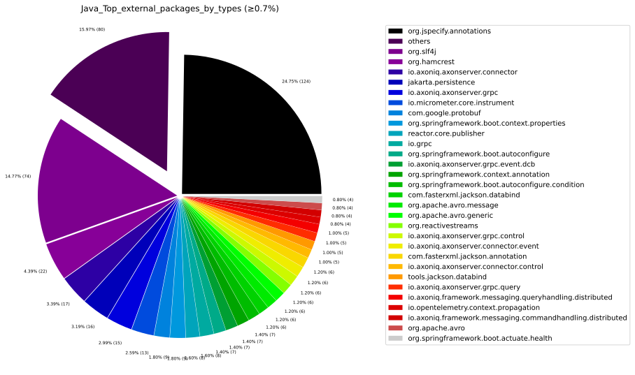

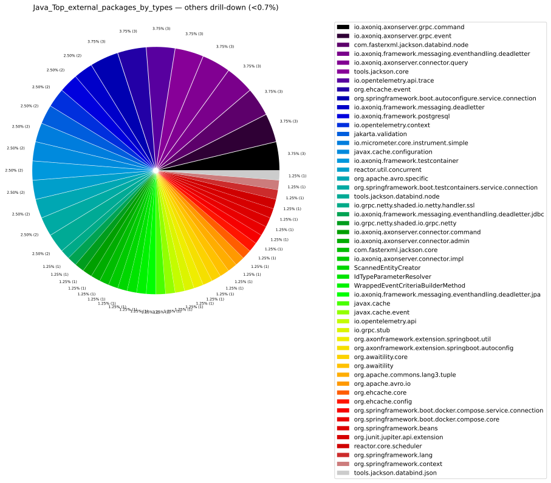

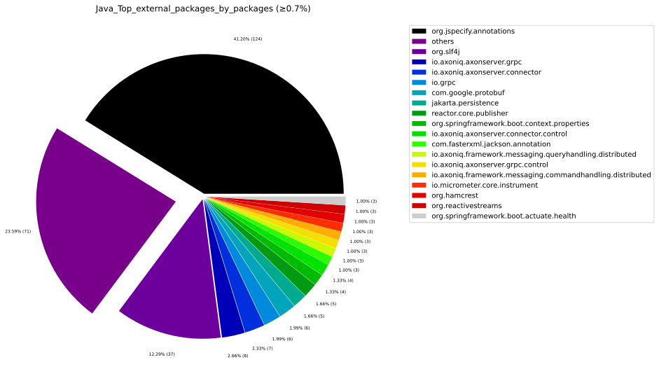

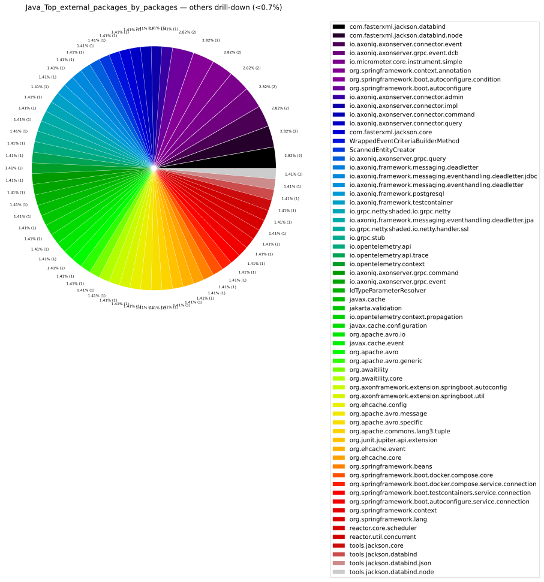

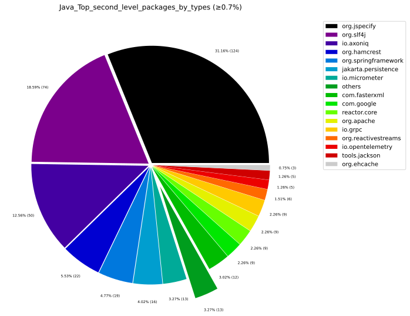

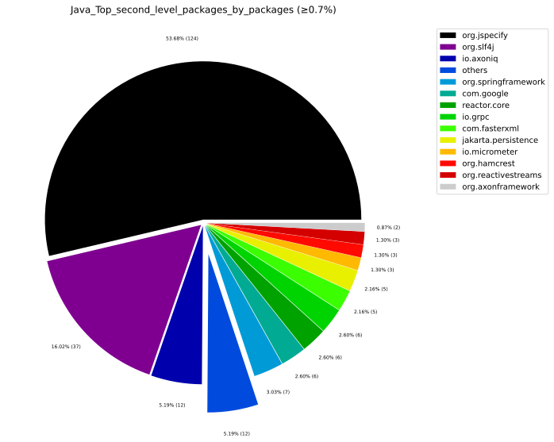

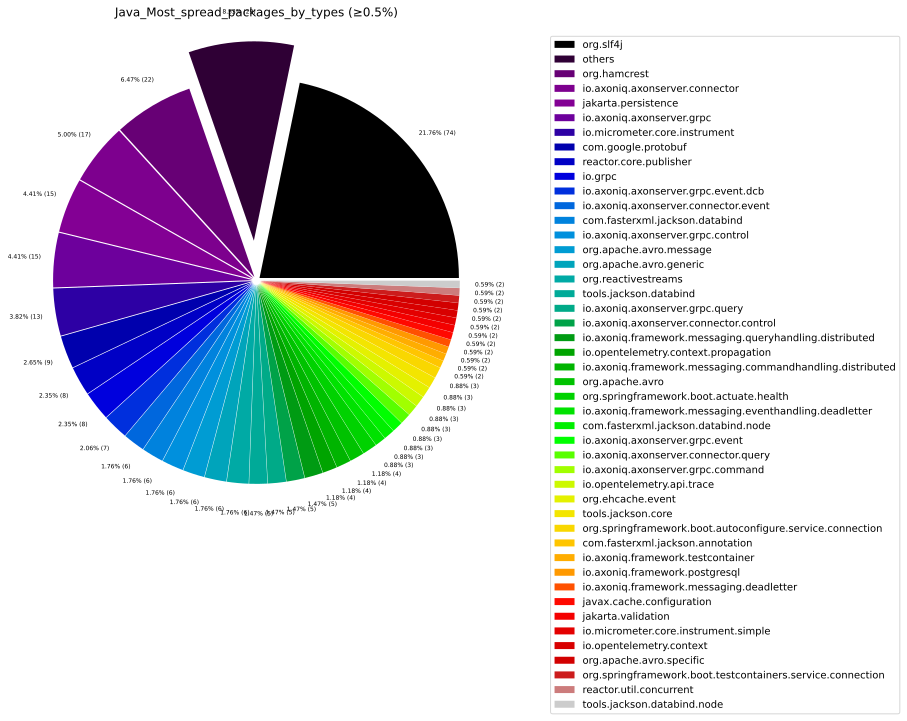

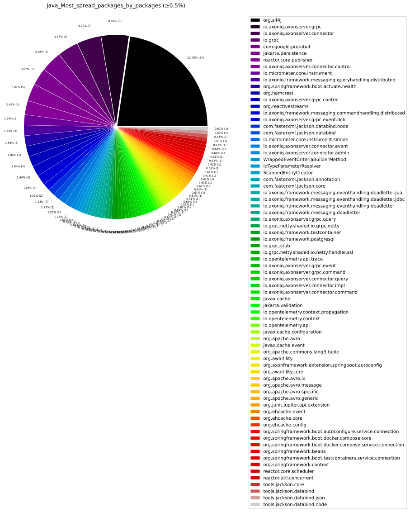

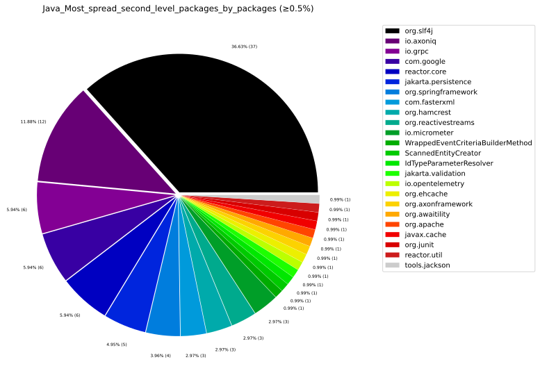

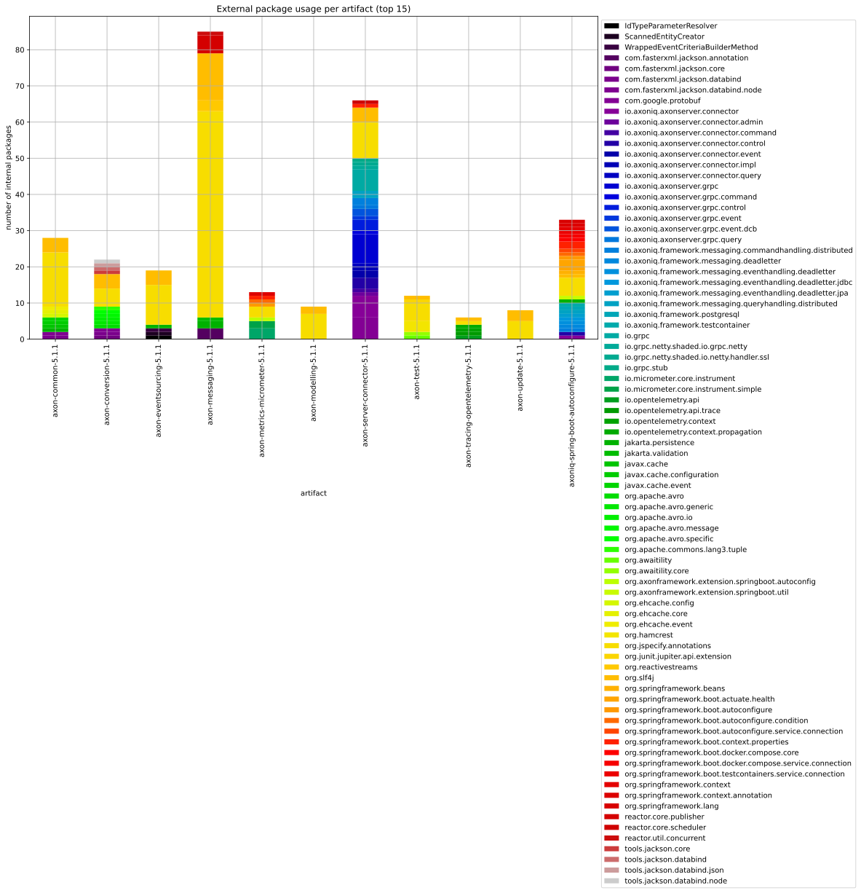

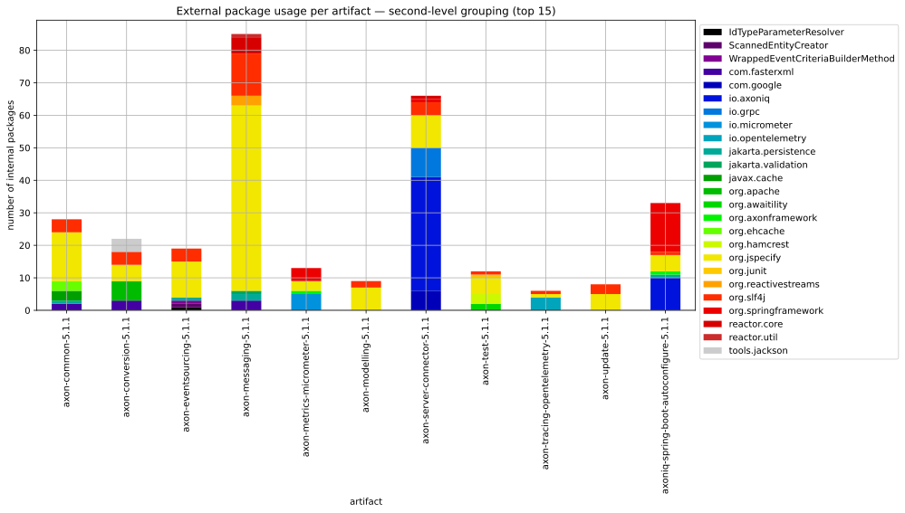

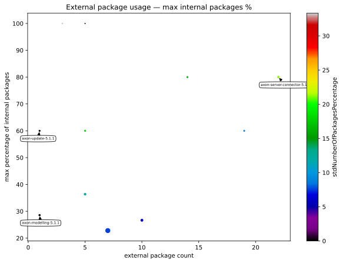

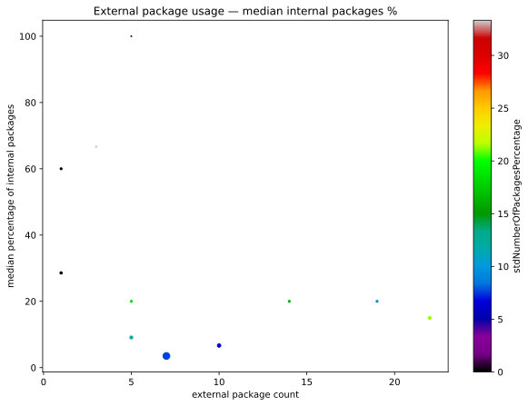

---

## 3. TypeScript External Dependencies

### 3.1 Most Used External Modules

External npm modules ranked by how many internal TypeScript elements import them.

### 3.2 Most Used External Namespaces

Groups by namespace to reveal declaration-level coupling within npm packages.

### 3.3 Most Spread External Modules

External modules referenced from the highest number of **different internal TypeScript modules**.

### 3.4 External Module Usage per Internal Module (Sorted)

Which internal TypeScript modules depend on the most external modules?

### 3.5 TypeScript Charts

---

## 4. Package Management

### 4.1 Maven POM Declared Dependencies

Java dependencies declared in Maven `pom.xml` files.

| pom.artifactId | pom.name | scope | dependency.optional | dependentArtifact.group | dependentArtifact.name |
| --- | --- | --- | --- | --- | --- |
| axon-common | Axon Framework - Common | test | false | org.glassfish.expressly | expressly |
| axon-common | Axon Framework - Common | test | false | org.springframework | spring-tx |
| axon-common | Axon Framework - Common | test | false | org.springframework | spring-context-support |
| axon-common | Axon Framework - Common | default | false | org.reactivestreams | reactive-streams |
| axon-common | Axon Framework - Common | default | true | javax.cache | cache-api |
| axon-common | Axon Framework - Common | default | true | jakarta.annotation | jakarta.annotation-api |
| axon-common | Axon Framework - Common | default | true | org.ehcache | ehcache |
| axon-common | Axon Framework - Common | default | true | jakarta.persistence | jakarta.persistence-api |
| axon-common | Axon Framework - Common | test | false | org.springframework | spring-test |
| axon-common | Axon Framework - Common | default | false | com.fasterxml.jackson.core | jackson-databind |
| axon-common | Axon Framework - Common | default | true | jakarta.validation | jakarta.validation-api |
| axon-common | Axon Framework - Common | test | false | io.projectreactor | reactor-test |
| axon-common | Axon Framework - Common | default | true | io.projectreactor | reactor-core |
| axon-common | Axon Framework - Common | test | false | org.springframework.security | spring-security-config |
| axon-common | Axon Framework - Common | test | false | org.springframework | spring-orm |
| axon-common | Axon Framework - Common | default | false | org.slf4j | slf4j-api |
| axon-common | Axon Framework - Common | default | true | com.fasterxml.jackson.datatype | jackson-datatype-jsr310 |
| axon-common | Axon Framework - Common | default | true | org.hibernate.orm | hibernate-core |
| axon-common | Axon Framework - Common | provided | false | com.google.code.findbugs | jsr305 |
| axon-common | Axon Framework - Common | test | false | org.hibernate.validator | hibernate-validator |
| axon-common | Axon Framework - Common | default | false | com.fasterxml.jackson.core | jackson-core |
| axon-conversion | Axon Framework - Conversion | test | false | tools.jackson.dataformat | jackson-dataformat-cbor |
| axon-conversion | Axon Framework - Conversion | default | false | com.fasterxml.jackson.core | jackson-core |
| axon-conversion | Axon Framework - Conversion | default | true | org.apache.avro | avro |
| axon-conversion | Axon Framework - Conversion | test | false | com.fasterxml.jackson.module | jackson-module-parameter-names |
| axon-conversion | Axon Framework - Conversion | default | false | org.axonframework | axon-common |
| axon-conversion | Axon Framework - Conversion | default | false | tools.jackson.core | jackson-core |
| axon-conversion | Axon Framework - Conversion | default | false | tools.jackson.core | jackson-databind |
| axon-conversion | Axon Framework - Conversion | test | false | org.axonframework | axon-common |
| axon-conversion | Axon Framework - Conversion | default | true | jakarta.annotation | jakarta.annotation-api |
| axon-conversion | Axon Framework - Conversion | default | false | com.fasterxml.jackson.core | jackson-databind |
| axon-conversion | Axon Framework - Conversion | default | true | com.fasterxml.jackson.datatype | jackson-datatype-jsr310 |
| axon-conversion | Axon Framework - Conversion | test | false | com.fasterxml.jackson.dataformat | jackson-dataformat-cbor |
| axon-eventsourcing | Axon Framework - Event Sourcing | test | false | com.fasterxml.jackson.core | jackson-databind |
| axon-eventsourcing | Axon Framework - Event Sourcing | test | false | jakarta.el | jakarta.el-api |
| axon-eventsourcing | Axon Framework - Event Sourcing | test | false | tools.jackson.core | jackson-databind |
| axon-eventsourcing | Axon Framework - Event Sourcing | test | false | com.fasterxml.jackson.core | jackson-core |
| axon-eventsourcing | Axon Framework - Event Sourcing | test | false | io.projectreactor | reactor-test |
| axon-eventsourcing | Axon Framework - Event Sourcing | default | false | org.axonframework | axon-messaging |
| axon-eventsourcing | Axon Framework - Event Sourcing | test | false | org.testcontainers | testcontainers-junit-jupiter |
| axon-eventsourcing | Axon Framework - Event Sourcing | test | false | org.springframework.security | spring-security-config |
| axon-eventsourcing | Axon Framework - Event Sourcing | test | false | org.ehcache | ehcache |
| axon-eventsourcing | Axon Framework - Event Sourcing | test | false | com.fasterxml.jackson.datatype | jackson-datatype-jsr310 |
| axon-eventsourcing | Axon Framework - Event Sourcing | default | true | jakarta.validation | jakarta.validation-api |
| axon-eventsourcing | Axon Framework - Event Sourcing | test | false | org.hibernate.validator | hibernate-validator |
| axon-eventsourcing | Axon Framework - Event Sourcing | default | false | org.reactivestreams | reactive-streams |
| axon-eventsourcing | Axon Framework - Event Sourcing | test | false | org.springframework | spring-orm |
| axon-eventsourcing | Axon Framework - Event Sourcing | test | false | org.springframework | spring-context-support |
| axon-eventsourcing | Axon Framework - Event Sourcing | test | false | org.axonframework | axon-messaging |
| axon-eventsourcing | Axon Framework - Event Sourcing | test | false | org.springframework | spring-test |
| axon-eventsourcing | Axon Framework - Event Sourcing | provided | false | com.google.code.findbugs | jsr305 |
| axon-eventsourcing | Axon Framework - Event Sourcing | test | false | com.mysql | mysql-connector-j |
| axon-eventsourcing | Axon Framework - Event Sourcing | test | false | com.tngtech.archunit | archunit-junit5 |
| axon-eventsourcing | Axon Framework - Event Sourcing | test | false | org.hibernate.orm | hibernate-core |
| axon-eventsourcing | Axon Framework - Event Sourcing | default | true | io.projectreactor | reactor-core |
| axon-eventsourcing | Axon Framework - Event Sourcing | default | false | org.axonframework | axon-modelling |
| axon-eventsourcing | Axon Framework - Event Sourcing | default | true | jakarta.persistence | jakarta.persistence-api |
| axon-eventsourcing | Axon Framework - Event Sourcing | test | false | nl.jqno.equalsverifier | equalsverifier |
| axon-eventsourcing | Axon Framework - Event Sourcing | test | false | org.glassfish.expressly | expressly |
| axon-eventsourcing | Axon Framework - Event Sourcing | test | false | com.fasterxml.jackson.dataformat | jackson-dataformat-cbor |
| axon-eventsourcing | Axon Framework - Event Sourcing | test | false | org.hsqldb | hsqldb |
| axon-eventsourcing | Axon Framework - Event Sourcing | test | false | org.axonframework | axon-common |
| axon-eventsourcing | Axon Framework - Event Sourcing | test | false | org.springframework | spring-tx |
| axon-eventsourcing | Axon Framework - Event Sourcing | test | false | org.testcontainers | testcontainers-mysql |
| axon-messaging | Axon Framework - Messaging | test | false | com.fasterxml.jackson.dataformat | jackson-dataformat-cbor |
| axon-messaging | Axon Framework - Messaging | default | false | org.slf4j | slf4j-api |
| axon-messaging | Axon Framework - Messaging | default | false | org.reactivestreams | reactive-streams |
| axon-messaging | Axon Framework - Messaging | default | true | javax.cache | cache-api |
| axon-messaging | Axon Framework - Messaging | test | false | com.google.code.gson | gson |
| axon-messaging | Axon Framework - Messaging | test | false | org.springframework | spring-tx |
| axon-messaging | Axon Framework - Messaging | default | true | com.github.kagkarlsson | db-scheduler |
| axon-messaging | Axon Framework - Messaging | test | false | io.projectreactor | reactor-test |
| axon-messaging | Axon Framework - Messaging | test | false | org.hibernate.validator | hibernate-validator |
| axon-messaging | Axon Framework - Messaging | test | false | org.glassfish.expressly | expressly |
| axon-messaging | Axon Framework - Messaging | test | false | tools.jackson.dataformat | jackson-dataformat-cbor |
| axon-messaging | Axon Framework - Messaging | default | true | org.ehcache | ehcache |
| axon-messaging | Axon Framework - Messaging | default | true | org.jobrunr | jobrunr |
| axon-messaging | Axon Framework - Messaging | default | true | jakarta.persistence | jakarta.persistence-api |
| axon-messaging | Axon Framework - Messaging | test | false | org.hsqldb | hsqldb |
| axon-messaging | Axon Framework - Messaging | default | true | jakarta.validation | jakarta.validation-api |
| axon-messaging | Axon Framework - Messaging | test | false | org.springframework | spring-orm |
| axon-messaging | Axon Framework - Messaging | test | false | org.axonframework | axon-conversion |
| axon-messaging | Axon Framework - Messaging | test | false | org.axonframework | axon-common |
| axon-messaging | Axon Framework - Messaging | default | true | org.hibernate.orm | hibernate-core |
| axon-messaging | Axon Framework - Messaging | test | false | org.springframework | spring-test |
| axon-messaging | Axon Framework - Messaging | test | false | org.springframework | spring-context-support |
| axon-messaging | Axon Framework - Messaging | provided | false | com.google.code.findbugs | jsr305 |
| axon-messaging | Axon Framework - Messaging | default | true | io.projectreactor | reactor-core |
| axon-messaging | Axon Framework - Messaging | default | false | org.axonframework | axon-update |
| axon-messaging | Axon Framework - Messaging | default | true | org.quartz-scheduler | quartz |
| axon-messaging | Axon Framework - Messaging | default | false | org.axonframework | axon-conversion |
| axon-messaging | Axon Framework - Messaging | test | false | com.fasterxml.jackson.module | jackson-module-parameter-names |
| axon-messaging | Axon Framework - Messaging | default | true | com.fasterxml.jackson.datatype | jackson-datatype-jsr310 |
| axon-messaging | Axon Framework - Messaging | default | false | org.axonframework | axon-common |
| axon-messaging | Axon Framework - Messaging | default | true | tools.jackson.core | jackson-databind |
| axon-messaging | Axon Framework - Messaging | test | false | org.springframework.security | spring-security-config |
| axon-metrics-micrometer | Axon Extension - Metrics - Micrometer | default | false | jakarta.annotation | jakarta.annotation-api |
| axon-metrics-micrometer | Axon Extension - Metrics - Micrometer | default | false | org.axonframework | axon-messaging |
| axon-metrics-micrometer | Axon Extension - Metrics - Micrometer | default | false | io.micrometer | micrometer-core |
| axon-metrics-micrometer | Axon Extension - Metrics - Micrometer | default | true | org.axonframework.extensions.spring | axon-spring-boot-autoconfigure |
| axon-metrics-micrometer | Axon Extension - Metrics - Micrometer | test | false | org.springframework.boot | spring-boot-starter-test |
| axon-metrics-micrometer | Axon Extension - Metrics - Micrometer | default | true | org.springframework.boot | spring-boot-starter |
| axon-metrics-micrometer | Axon Extension - Metrics - Micrometer | test | false | org.axonframework | axon-messaging |
| axon-metrics-micrometer | Axon Extension - Metrics - Micrometer | provided | false | com.google.code.findbugs | jsr305 |
| axon-metrics-micrometer | Axon Extension - Metrics - Micrometer | test | false | org.axonframework | axon-common |
| axon-modelling | Axon Framework - Modelling | default | true | org.quartz-scheduler | quartz |
| axon-modelling | Axon Framework - Modelling | provided | false | com.google.code.findbugs | jsr305 |
| axon-modelling | Axon Framework - Modelling | test | true | com.fasterxml.jackson.datatype | jackson-datatype-jsr310 |
| axon-modelling | Axon Framework - Modelling | test | false | org.axonframework | axon-messaging |
| axon-modelling | Axon Framework - Modelling | test | false | org.hsqldb | hsqldb |
| axon-modelling | Axon Framework - Modelling | default | false | org.axonframework | axon-messaging |
| axon-modelling | Axon Framework - Modelling | test | false | org.glassfish.expressly | expressly |
| axon-modelling | Axon Framework - Modelling | default | true | jakarta.persistence | jakarta.persistence-api |
| axon-modelling | Axon Framework - Modelling | test | false | org.springframework | spring-orm |
| axon-modelling | Axon Framework - Modelling | default | true | com.fasterxml.jackson.core | jackson-databind |
| axon-modelling | Axon Framework - Modelling | test | false | org.springframework | spring-context-support |
| axon-modelling | Axon Framework - Modelling | default | true | javax.cache | cache-api |
| axon-modelling | Axon Framework - Modelling | test | false | org.hibernate.validator | hibernate-validator |
| axon-modelling | Axon Framework - Modelling | test | false | com.mysql | mysql-connector-j |
| axon-modelling | Axon Framework - Modelling | default | false | org.slf4j | slf4j-api |
| axon-modelling | Axon Framework - Modelling | test | false | org.springframework | spring-tx |
| axon-modelling | Axon Framework - Modelling | default | true | org.ehcache | ehcache |
| axon-modelling | Axon Framework - Modelling | test | false | org.postgresql | postgresql |
| axon-modelling | Axon Framework - Modelling | test | false | org.springframework.security | spring-security-config |
| axon-modelling | Axon Framework - Modelling | test | false | org.hibernate.orm | hibernate-core |
| axon-modelling | Axon Framework - Modelling | test | false | org.axonframework | axon-common |
| axon-modelling | Axon Framework - Modelling | test | false | org.springframework | spring-test |
| axon-server-connector | Axoniq Framework - Axon Server Connector | test | false | org.testcontainers | testcontainers |
| axon-server-connector | Axoniq Framework - Axon Server Connector | default | true | org.springframework.boot | spring-boot-configuration-processor |
| axon-server-connector | Axoniq Framework - Axon Server Connector | default | true | org.axonframework | axon-messaging |
| axon-server-connector | Axoniq Framework - Axon Server Connector | test | false | org.axonframework | axon-messaging |
| axon-server-connector | Axoniq Framework - Axon Server Connector | default | false | io.axoniq | axonserver-connector-java |
| axon-server-connector | Axoniq Framework - Axon Server Connector | default | false | io.axoniq.framework | axoniq-distributed-messaging |
| axon-server-connector | Axoniq Framework - Axon Server Connector | test | false | io.projectreactor | reactor-test |
| axon-server-connector | Axoniq Framework - Axon Server Connector | default | true | io.projectreactor | reactor-core |
| axon-server-connector | Axoniq Framework - Axon Server Connector | test | false | org.axonframework | axon-common |
| axon-server-connector | Axoniq Framework - Axon Server Connector | default | true | org.springframework.boot | spring-boot-starter |
| axon-server-connector | Axoniq Framework - Axon Server Connector | test | false | io.axoniq.framework | axoniq-testcontainer |
| axon-server-connector | Axoniq Framework - Axon Server Connector | test | false | org.axonframework | axon-test |
| axon-server-connector | Axoniq Framework - Axon Server Connector | test | false | org.testcontainers | testcontainers-junit-jupiter |
| axon-server-connector | Axoniq Framework - Axon Server Connector | test | false | org.axonframework | axon-eventsourcing |
| axon-server-connector | Axoniq Framework - Axon Server Connector | default | true | org.axonframework | axon-eventsourcing |
| axon-server-connector | Axoniq Framework - Axon Server Connector | default | true | org.springframework | spring-context |
| axon-test | Axon Framework - Test Fixtures | test | false | com.fasterxml.jackson.core | jackson-databind |
| axon-test | Axon Framework - Test Fixtures | compile | false | org.junit.jupiter | junit-jupiter |
| axon-test | Axon Framework - Test Fixtures | default | false | org.axonframework | axon-eventsourcing |
| axon-test | Axon Framework - Test Fixtures | compile | false | org.hamcrest | hamcrest |
| axon-test | Axon Framework - Test Fixtures | test | false | jakarta.persistence | jakarta.persistence-api |
| axon-test | Axon Framework - Test Fixtures | compile | false | org.hamcrest | hamcrest-library |
| axon-test | Axon Framework - Test Fixtures | test | false | com.fasterxml.jackson.datatype | jackson-datatype-jsr310 |
| axon-test | Axon Framework - Test Fixtures | test | false | jakarta.inject | jakarta.inject-api |
| axon-test | Axon Framework - Test Fixtures | test | false | org.axonframework | axon-common |
| axon-test | Axon Framework - Test Fixtures | compile | false | org.awaitility | awaitility |
| axon-test | Axon Framework - Test Fixtures | test | false | com.fasterxml.jackson.core | jackson-core |
| axon-test | Axon Framework - Test Fixtures | test | false | com.fasterxml.jackson.module | jackson-module-parameter-names |
| axon-tracing-opentelemetry | Axon Extension - Tracing - OpenTelemetry | default | false | org.axonframework | axon-messaging |
| axon-tracing-opentelemetry | Axon Extension - Tracing - OpenTelemetry | default | false | jakarta.annotation | jakarta.annotation-api |
| axon-tracing-opentelemetry | Axon Extension - Tracing - OpenTelemetry | provided | false | com.google.code.findbugs | jsr305 |
| axon-tracing-opentelemetry | Axon Extension - Tracing - OpenTelemetry | test | false | org.axonframework | axon-common |
| axon-tracing-opentelemetry | Axon Extension - Tracing - OpenTelemetry | default | false | io.opentelemetry | opentelemetry-api |
| axon-update | Axon Framework - Update | default | false | jakarta.annotation | jakarta.annotation-api |
| axon-update | Axon Framework - Update | default | false | org.axonframework | axon-common |
| axon-update | Axon Framework - Update | test | false | org.axonframework | axon-common |
| axoniq-spring-boot-autoconfigure | Axoniq Framework - Spring Boot Autoconfigure | test | false | org.springframework.boot | spring-boot-starter-test |
| axoniq-spring-boot-autoconfigure | Axoniq Framework - Spring Boot Autoconfigure | default | true | org.testcontainers | testcontainers |
| axoniq-spring-boot-autoconfigure | Axoniq Framework - Spring Boot Autoconfigure | default | true | io.axoniq.framework | axoniq-dead-letter |
| axoniq-spring-boot-autoconfigure | Axoniq Framework - Spring Boot Autoconfigure | default | true | org.springframework.boot | spring-boot-testcontainers |
| axoniq-spring-boot-autoconfigure | Axoniq Framework - Spring Boot Autoconfigure | default | true | jakarta.persistence | jakarta.persistence-api |
| axoniq-spring-boot-autoconfigure | Axoniq Framework - Spring Boot Autoconfigure | test | false | io.axoniq.framework | axoniq-dead-letter |
| axoniq-spring-boot-autoconfigure | Axoniq Framework - Spring Boot Autoconfigure | test | false | org.axonframework | axon-messaging |
| axoniq-spring-boot-autoconfigure | Axoniq Framework - Spring Boot Autoconfigure | default | true | org.springframework.boot | spring-boot-autoconfigure |
| axoniq-spring-boot-autoconfigure | Axoniq Framework - Spring Boot Autoconfigure | default | true | io.axoniq.framework | axoniq-postgresql |
| axoniq-spring-boot-autoconfigure | Axoniq Framework - Spring Boot Autoconfigure | test | false | org.hsqldb | hsqldb |
| axoniq-spring-boot-autoconfigure | Axoniq Framework - Spring Boot Autoconfigure | compile | false | io.axoniq.framework | axoniq-testcontainer |
| axoniq-spring-boot-autoconfigure | Axoniq Framework - Spring Boot Autoconfigure | test | false | org.testcontainers | testcontainers-junit-jupiter |
| axoniq-spring-boot-autoconfigure | Axoniq Framework - Spring Boot Autoconfigure | default | false | io.axoniq.framework | axon-server-connector |
| axoniq-spring-boot-autoconfigure | Axoniq Framework - Spring Boot Autoconfigure | default | true | org.springframework.boot | spring-boot-actuator |
| axoniq-spring-boot-autoconfigure | Axoniq Framework - Spring Boot Autoconfigure | test | false | org.hibernate.orm | hibernate-core |
| axoniq-spring-boot-autoconfigure | Axoniq Framework - Spring Boot Autoconfigure | default | true | org.springframework.boot | spring-boot-docker-compose |
| axoniq-spring-boot-autoconfigure | Axoniq Framework - Spring Boot Autoconfigure | test | false | org.springframework.boot | spring-boot-starter-data-jpa |
| axoniq-spring-boot-autoconfigure | Axoniq Framework - Spring Boot Autoconfigure | default | false | org.axonframework.extensions.spring | axon-spring-boot-starter |
| axoniq-spring-boot-autoconfigure | Axoniq Framework - Spring Boot Autoconfigure | test | false | org.axonframework | axon-common |

### 4.2 package.json Declared Dependencies

Node.js dependencies declared in `package.json` files, ranked by occurrence across repository packages.

---

## 5. Glossary

| Term | Definition |
|------|-----------|
| **Second-level package** | First two dot-separated segments of a package name (e.g. `org.springframework`). Used to group variant packages under one framework name. |
| **numberOfExternalCallerTypes** | Count of *internal Java types* that directly reference the external package. |
| **numberOfExternalCallerPackages** | Count of *internal Java packages* containing at least one type referencing the external package. |
| **numberOfExternalCallerElements** | Count of *internal TypeScript elements* that import from the external module. |
| **numberOfExternalCallerModules** | Count of *internal TypeScript modules* that import from the external module. |
| **sumNumberOfTypes / sumNumberOfPackages** | Sum across all artifacts of internal types/packages dependent on the external package. Measures total spread. |
| **sumNumberOfUsedExternalDeclarations** | Total distinct external declarations imported from the module across all internal modules. |
| **packagesCallingExternalRate** | Ratio of internal packages with external references to total artifact packages. |
| **typesCallingExternalRate** | Ratio of internal types with external references to total artifact types. |
| **Anti-Corruption Layer (ACL)** | Isolates the internal domain from external library APIs by wrapping them behind an internal interface. |
| **Façade** | Simplified interface hiding external library complexity. Useful when many internal modules call the same external package. |
| **Hexagonal Architecture** | Ports & Adapters style that pushes all external dependencies to the outer ring, preventing them from leaking into the core domain. |
