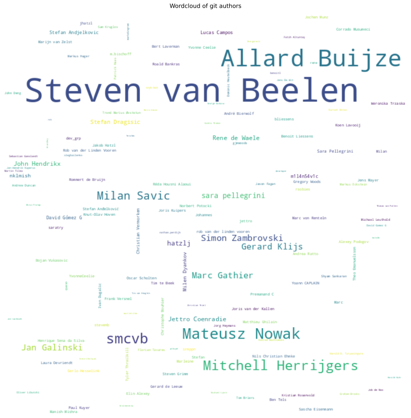

# 📜 Git History Report

## 1. Overview

This report analyses the **git commit history** of the codebase. It covers:

- **Directory commit statistics** — which directories change most frequently and by how many authors
- **Co-changed files** — files that are frequently committed together (coupling signals)
- **File change distribution** — how many files are changed per commit
- **Pairwise changed files** — direct co-change relationships between specific file pairs
- **Data quality** — ambiguous or unresolved file references in the git log
- **Git author wordcloud** — visual overview of contributor activity

> High commit frequency in a directory = refactoring hotspot. Files that always change together = co-location or module consolidation candidates.

## 📚 Table of Contents

1. [Overview](#1-overview)
1. [Directory Commit Statistics](#2-directory-commit-statistics)
1. [Co-Changed Files](#3-co-changed-files)
1. [File Change Distribution](#4-file-change-distribution)
1. [Pairwise Changed Files](#5-pairwise-changed-files)
1. [Files by Author](#6-files-by-author)
1. [Data Quality](#7-data-quality)
1. [Git Author Wordcloud](#8-git-author-wordcloud)
1. [Glossary and Column Definitions](#9-glossary-and-column-definitions)

---

## 2. Directory Commit Statistics

Commit frequency and author count per directory. High values = active, potentially complex.

### 2.1 Directory Commit Statistics (Table)

| directoryPath | directoryName | directoryParentPath | directoryParentName | mainAuthor | secondAuthor | thirdAuthor | authorCount | fileCount | commitCount | lastCreationDate | lastModificationDate | lastCommitDate | daysSinceLastCommit | daysSinceLastCreation | daysSinceLastModification | maxCommitSha | maxFileRelativePath | directoryPathLength | combinedDirectoriesCount |
| --- | --- | --- | --- | --- | --- | --- | --- | --- | --- | --- | --- | --- | --- | --- | --- | --- | --- | --- | --- |
| AxonFramework-5.1.1 | AxonFramework-5.1.1 |  |  | Steven van Beelen | Allard Buijze | Mateusz Nowak | 117 | 3067 | 6693 | 2026-05-21 | 2026-05-22 | 2026-05-22 | 24 | 24 | 24 | fff5f9f26176f13bcd2824e006f71d61da2ac8b1 | AxonFramework-5.1.1/update/src/test/resources/META-INF/maven/org.axonframework/axon-modelling/pom.properties | 1 | 1 |
| AxonFramework-5.1.1/.claude | .claude | AxonFramework-5.1.1 | AxonFramework-5.1.1 | Mateusz Nowak | Steven van Beelen | Jan Galinski | 5 | 5 | 14 | 2026-02-19 | 2026-02-24 | 2026-03-23 | 84 | 116 | 111 | f86e96cf1f82bb61b9c269c928ea1afba539c052 | AxonFramework-5.1.1/.claude/skills/issue-from-notes/references/examples.md | 2 | 1 |
| AxonFramework-5.1.1/.claude/rules | rules | AxonFramework-5.1.1/.claude | .claude | Mateusz Nowak | Steven van Beelen | Jan Galinski | 5 | 2 | 9 | 2026-02-19 | 2026-02-19 | 2026-03-23 | 84 | 116 | 116 | f86e96cf1f82bb61b9c269c928ea1afba539c052 | AxonFramework-5.1.1/.claude/rules/type-safety.md | 3 | 1 |
| AxonFramework-5.1.1/.claude/skills/issue-from-notes | skills/issue-from-notes | AxonFramework-5.1.1/.claude | .claude | Steven van Beelen | Mateusz Nowak | Jan Galinski | 5 | 2 | 11 | 2026-02-16 | 2026-02-24 | 2026-03-23 | 84 | 119 | 111 | f86e96cf1f82bb61b9c269c928ea1afba539c052 | AxonFramework-5.1.1/.claude/skills/issue-from-notes/references/examples.md | 4 | 2 |
| AxonFramework-5.1.1/.claude/skills/issue-from-notes/references | references | AxonFramework-5.1.1/.claude/skills/issue-from-notes | issue-from-notes | Steven van Beelen | Mateusz Nowak | Jan Galinski | 5 | 1 | 8 | 2026-02-16 | 2026-02-16 | 2026-03-23 | 84 | 119 | 119 | f86e96cf1f82bb61b9c269c928ea1afba539c052 | AxonFramework-5.1.1/.claude/skills/issue-from-notes/references/examples.md | 5 | 1 |
| AxonFramework-5.1.1/.github | .github | AxonFramework-5.1.1 | AxonFramework-5.1.1 | Steven van Beelen | dependabot[bot] | Mitchell Herrijgers | 31 | 16 | 790 | 2025-12-01 | 2026-04-28 | 2026-04-28 | 48 | 196 | 48 | ffe75820f3cb4bb5d167941acb0f05e2c801c30c | AxonFramework-5.1.1/.github/workflows/slack-release-notification.yml | 2 | 1 |
| AxonFramework-5.1.1/.github/ISSUE_TEMPLATE | ISSUE_TEMPLATE | AxonFramework-5.1.1/.github | .github | Steven van Beelen | Mitchell Herrijgers | Allard Buijze | 7 | 4 | 61 | 2025-08-13 | 2026-02-23 | 2026-02-23 | 112 | 306 | 112 | fa509a0b37d60e0d49b0a95686836dc59e5dc146 | AxonFramework-5.1.1/.github/ISSUE_TEMPLATE/4_documentation_change.md | 3 | 1 |
| AxonFramework-5.1.1/.github/workflows | workflows | AxonFramework-5.1.1/.github | .github | Steven van Beelen | dependabot[bot] | Mitchell Herrijgers | 31 | 8 | 759 | 2025-12-01 | 2026-04-28 | 2026-04-28 | 48 | 196 | 48 | ffe75820f3cb4bb5d167941acb0f05e2c801c30c | AxonFramework-5.1.1/.github/workflows/slack-release-notification.yml | 3 | 1 |
| AxonFramework-5.1.1/.idea | .idea | AxonFramework-5.1.1 | AxonFramework-5.1.1 | Steven van Beelen | Mitchell Herrijgers | Allard Buijze | 6 | 4 | 68 | 2025-12-16 | 2025-12-16 | 2026-02-23 | 112 | 181 | 181 | fe926a4970bdf1e538e8e7fb8d147ffdc676e713 | AxonFramework-5.1.1/.idea/inspectionProfiles/Project_Default.xml | 2 | 1 |
| AxonFramework-5.1.1/.idea/copyright | copyright | AxonFramework-5.1.1/.idea | .idea | Steven van Beelen | Allard Buijze | Jan Galinski | 3 | 1 | 28 | 2025-01-09 | 2025-01-09 | 2026-02-23 | 112 | 522 | 522 | fe926a4970bdf1e538e8e7fb8d147ffdc676e713 | AxonFramework-5.1.1/.idea/copyright/Axon_Framework_copyright_template.xml | 3 | 1 |

[Full data](./List_git_file_directories_with_commit_statistics.csv)

### 2.2 Directory Commit Statistics (Charts)

---

## 3. Co-Changed Files

Files committed together = logical coupling signal. May belong to the same conceptual unit or share a concern.

### 3.1 Co-Changed File Pairs

| firstFile | secondFile | commitCount |
| --- | --- | --- |
| AxonFramework-5.1.1/.github/workflows/pullrequest.yml | AxonFramework-5.1.1/.github/workflows/main.yml | 362 |
| AxonFramework-5.1.1/eventsourcing/src/test/java/org/axonframework/eventsourcing/eventstore/AggregateBasedStorageEngineTestSuite.java | AxonFramework-5.1.1/eventsourcing/src/test/java/org/axonframework/eventsourcing/eventstore/StorageEngineTestSuite.java | 146 |
| AxonFramework-5.1.1/eventsourcing/src/main/java/org/axonframework/eventsourcing/eventstore/jpa/AggregateBasedJpaEventStorageEngine.java | AxonFramework-5.1.1/eventsourcing/src/test/java/org/axonframework/eventsourcing/eventstore/AggregateBasedStorageEngineTestSuite.java | 146 |
| AxonFramework-5.1.1/eventsourcing/src/main/java/org/axonframework/eventsourcing/eventstore/jpa/AggregateBasedJpaEventStorageEngine.java | AxonFramework-5.1.1/eventsourcing/src/test/java/org/axonframework/eventsourcing/eventstore/StorageEngineTestSuite.java | 115 |
| AxonFramework-5.1.1/eventsourcing/src/test/java/org/axonframework/eventsourcing/eventstore/DefaultEventStoreTransactionTest.java | AxonFramework-5.1.1/eventsourcing/src/test/java/org/axonframework/eventsourcing/eventstore/StorageEngineTestSuite.java | 96 |
| AxonFramework-5.1.1/eventsourcing/src/test/java/org/axonframework/eventsourcing/eventstore/AggregateBasedStorageEngineTestSuite.java | AxonFramework-5.1.1/eventsourcing/src/test/java/org/axonframework/eventsourcing/eventstore/DefaultEventStoreTransactionTest.java | 94 |
| AxonFramework-5.1.1/eventsourcing/src/main/java/org/axonframework/eventsourcing/eventstore/DefaultEventStoreTransaction.java | AxonFramework-5.1.1/eventsourcing/src/test/java/org/axonframework/eventsourcing/eventstore/StorageEngineTestSuite.java | 82 |
| AxonFramework-5.1.1/.github/workflows/slack-release-notification.yml | AxonFramework-5.1.1/.github/workflows/main.yml | 80 |
| AxonFramework-5.1.1/eventsourcing/src/main/java/org/axonframework/eventsourcing/eventstore/DefaultEventStoreTransaction.java | AxonFramework-5.1.1/eventsourcing/src/test/java/org/axonframework/eventsourcing/eventstore/AggregateBasedStorageEngineTestSuite.java | 78 |
| AxonFramework-5.1.1/eventsourcing/src/test/java/org/axonframework/eventsourcing/eventstore/DefaultEventStoreTransactionTest.java | AxonFramework-5.1.1/eventsourcing/src/test/java/org/axonframework/eventsourcing/eventstore/SimpleEventStoreTest.java | 77 |

### 3.2 Co-Changed File Pairs (All in One Commit)

Files changed together in a single large commit.

| firstFile | secondFile | commitCount |
| --- | --- | --- |
| AxonFramework-5.1.1/.github/workflows/main.yml | AxonFramework-5.1.1/.github/workflows/pullrequest.yml | 425 |
| AxonFramework-5.1.1/eventsourcing/src/main/java/org/axonframework/eventsourcing/eventstore/jpa/AggregateBasedJpaEventStorageEngine.java | AxonFramework-5.1.1/eventsourcing/src/test/java/org/axonframework/eventsourcing/eventstore/AggregateBasedStorageEngineTestSuite.java | 165 |
| AxonFramework-5.1.1/eventsourcing/src/test/java/org/axonframework/eventsourcing/eventstore/AggregateBasedStorageEngineTestSuite.java | AxonFramework-5.1.1/eventsourcing/src/test/java/org/axonframework/eventsourcing/eventstore/StorageEngineTestSuite.java | 160 |
| AxonFramework-5.1.1/eventsourcing/src/main/java/org/axonframework/eventsourcing/eventstore/jpa/AggregateBasedJpaEventStorageEngine.java | AxonFramework-5.1.1/eventsourcing/src/test/java/org/axonframework/eventsourcing/eventstore/StorageEngineTestSuite.java | 126 |
| AxonFramework-5.1.1/eventsourcing/src/test/java/org/axonframework/eventsourcing/eventstore/AggregateBasedStorageEngineTestSuite.java | AxonFramework-5.1.1/eventsourcing/src/test/java/org/axonframework/eventsourcing/eventstore/DefaultEventStoreTransactionTest.java | 104 |
| AxonFramework-5.1.1/eventsourcing/src/test/java/org/axonframework/eventsourcing/eventstore/DefaultEventStoreTransactionTest.java | AxonFramework-5.1.1/eventsourcing/src/test/java/org/axonframework/eventsourcing/eventstore/StorageEngineTestSuite.java | 103 |
| AxonFramework-5.1.1/build/parent/pom.xml | AxonFramework-5.1.1/stash/migration/pom.xml | 90 |
| AxonFramework-5.1.1/eventsourcing/src/test/java/org/axonframework/eventsourcing/eventstore/DefaultEventStoreTransactionTest.java | AxonFramework-5.1.1/eventsourcing/src/test/java/org/axonframework/eventsourcing/eventstore/SimpleEventStoreTest.java | 88 |
| AxonFramework-5.1.1/eventsourcing/src/test/java/org/axonframework/eventsourcing/eventstore/AggregateBasedStorageEngineTestSuite.java | AxonFramework-5.1.1/eventsourcing/src/test/java/org/axonframework/eventsourcing/eventstore/SimpleEventStoreTest.java | 87 |
| AxonFramework-5.1.1/eventsourcing/src/main/java/org/axonframework/eventsourcing/eventstore/DefaultEventStoreTransaction.java | AxonFramework-5.1.1/eventsourcing/src/test/java/org/axonframework/eventsourcing/eventstore/StorageEngineTestSuite.java | 85 |

### 3.3 Co-Changed With a Specific File

Shows all files that were changed together with another particular file.

| filePath | commitCount | coChangeRate | maxLift | avgLift |
| --- | --- | --- | --- | --- |
| AxonFramework-5.1.1/.github/workflows/pullrequest.yml | 373 | 0.0007376206296472078 | 4.81469387755102 | 2.865620988880519 |
| AxonFramework-5.1.1/eventsourcing/src/test/java/org/axonframework/eventsourcing/eventstore/AggregateBasedStorageEngineTestSuite.java | 197 | 0.0004468619854282163 | 4.886606362573631 | 2.6572612810684793 |
| AxonFramework-5.1.1/eventsourcing/src/main/java/org/axonframework/eventsourcing/eventstore/jpa/AggregateBasedJpaEventStorageEngine.java | 174 | 0.000484390920175717 | 5.118452649849021 | 2.5846315389045147 |
| AxonFramework-5.1.1/eventsourcing/src/test/java/org/axonframework/eventsourcing/eventstore/StorageEngineTestSuite.java | 163 | 0.0005891537872106641 | 4.693637888759841 | 2.090622094789824 |
| AxonFramework-5.1.1/.github/workflows/main.yml | 157 | 0.0005410416257439323 | 4.804887983706721 | 2.0312592257686752 |
| AxonFramework-5.1.1/eventsourcing/src/main/java/org/axonframework/eventsourcing/eventstore/DefaultEventStoreTransaction.java | 129 | 0.0006734428591564736 | 5.831037122081899 | 3.4534029809654707 |
| AxonFramework-5.1.1/eventsourcing/src/test/java/org/axonframework/eventsourcing/eventstore/DefaultEventStoreTransactionTest.java | 127 | 0.000699917332598512 | 6.1599164473862675 | 3.3793510292303646 |
| AxonFramework-5.1.1/eventsourcing/src/main/java/org/axonframework/eventsourcing/configuration/EventSourcingConfigurationDefaults.java | 105 | 0.0006838742452959221 | 6.875628415300547 | 2.747382281563868 |
| AxonFramework-5.1.1/eventsourcing/src/test/java/org/axonframework/eventsourcing/configuration/EventSourcingConfigurerTest.java | 101 | 0.0010816252222150828 | 10.417427141595526 | 4.273989170161403 |
| AxonFramework-5.1.1/.github/workflows/slack-release-notification.yml | 88 | 0.0014433327866163687 | 18.147692307692306 | 5.05086710632956 |

[Full data](./List_git_files_that_were_changed_together_with_another_file.csv)

### 3.4 Co-Changed With a Specific File (All in One)

| filePath | commitCount |
| --- | --- |
| AxonFramework-5.1.1/.github/workflows/pullrequest.yml | 439 |
| AxonFramework-5.1.1/.github/workflows/main.yml | 436 |
| AxonFramework-5.1.1/eventsourcing/src/test/java/org/axonframework/eventsourcing/eventstore/AggregateBasedStorageEngineTestSuite.java | 234 |
| AxonFramework-5.1.1/eventsourcing/src/test/java/org/axonframework/eventsourcing/eventstore/StorageEngineTestSuite.java | 200 |
| AxonFramework-5.1.1/eventsourcing/src/main/java/org/axonframework/eventsourcing/eventstore/jpa/AggregateBasedJpaEventStorageEngine.java | 195 |
| AxonFramework-5.1.1/eventsourcing/src/test/java/org/axonframework/eventsourcing/eventstore/DefaultEventStoreTransactionTest.java | 142 |
| AxonFramework-5.1.1/build/parent/pom.xml | 137 |
| AxonFramework-5.1.1/eventsourcing/src/main/java/org/axonframework/eventsourcing/eventstore/DefaultEventStoreTransaction.java | 135 |
| AxonFramework-5.1.1/eventsourcing/src/test/java/org/axonframework/eventsourcing/eventstore/SimpleEventStoreTest.java | 130 |
| AxonFramework-5.1.1/eventsourcing/src/test/java/org/axonframework/eventsourcing/configuration/EventSourcingConfigurerTest.java | 121 |

### 3.5 Co-Changed Files (Charts)

---

## 4. File Change Distribution

Files changed per commit. High proportion of large commits = low commit granularity.

### 4.1 Files per Commit Distribution

| filesPerCommit | commitCount |
| --- | --- |
| 1 | 6785 |
| 2 | 2774 |
| 3 | 1320 |
| 4 | 864 |
| 5 | 601 |
| 6 | 437 |
| 7 | 345 |
| 8 | 281 |
| 9 | 208 |
| 10 | 194 |

[Full data](./List_git_files_per_commit_distribution.csv)

### 4.2 Files per Commit Chart

---

## 5. Pairwise Changed Files

Commit overlap counts and dependency info between file pairs.

### 5.1 Pairwise Changed Files

| firstFileName | secondFileName | filePairLineBreak | filePairWithRelativePathLineBreak | filePair | filePairWithRelativePath | firstFileExtension | secondFileExtension | fileExtensionPair | updateCommitCount | updateCommitMinConfidence | updateCommitSupport | updateCommitLift | updateCommitJaccardSimilarity |
| --- | --- | --- | --- | --- | --- | --- | --- | --- | --- | --- | --- | --- | --- |
| eventsourcing/src/main/java/org/axonframework/eventsourcing/eventstore/jpa/AggregateBasedJpaEventStorageEngine.java | CLAUDE.md | AggregateBasedJpaEventStorageEngine CLAUDE | eventsourcing/src/main/java/org/axonframework/eventsourcing/eventstore/jpa/AggregateBasedJpaEventStorageEngine.java CLAUDE.md | AggregateBasedJpaEventStorageEngine↔CLAUDE | eventsourcing/src/main/java/org/axonframework/eventsourcing/eventstore/jpa/AggregateBasedJpaEventStorageEngine.java↔CLAUDE.md | java | md | java↔md | 4 | 0.16666666666666666 | 0.0013563919972872161 | 1.7937956204379562 | 0.013605442176870748 |
| extensions/spring/spring-boot-autoconfigure/src/test/java/org/axonframework/extension/springboot/eventsourcing/eventstore/jpa/AggregateBasedJpaEventStorageEngineIT.java | CLAUDE.md | AggregateBasedJpaEventStorageEngineIT CLAUDE | extensions/spring/spring-boot-autoconfigure/src/test/java/org/axonframework/extension/springboot/eventsourcing/eventstore/jpa/AggregateBasedJpaEventStorageEngineIT.java CLAUDE.md | AggregateBasedJpaEventStorageEngineIT↔CLAUDE | extensions/spring/spring-boot-autoconfigure/src/test/java/org/axonframework/extension/springboot/eventsourcing/eventstore/jpa/AggregateBasedJpaEventStorageEngineIT.java↔CLAUDE.md | java | md | java↔md | 3 | 0.125 | 0.001017293997965412 | 6.143750000000001 | 0.037037037037037035 |
| eventsourcing/src/test/java/org/axonframework/eventsourcing/eventstore/ContinuousMessageStreamTest.java | CLAUDE.md | ContinuousMessageStreamTest CLAUDE | eventsourcing/src/test/java/org/axonframework/eventsourcing/eventstore/ContinuousMessageStreamTest.java CLAUDE.md | ContinuousMessageStreamTest↔CLAUDE | eventsourcing/src/test/java/org/axonframework/eventsourcing/eventstore/ContinuousMessageStreamTest.java↔CLAUDE.md | java | md | java↔md | 4 | 0.16666666666666666 | 0.0013563919972872161 | 13.283783783783782 | 0.07017543859649122 |
| eventsourcing/src/main/java/org/axonframework/eventsourcing/eventstore/ContinuousMessageStream.java | CLAUDE.md | ContinuousMessageStream CLAUDE | eventsourcing/src/main/java/org/axonframework/eventsourcing/eventstore/ContinuousMessageStream.java CLAUDE.md | ContinuousMessageStream↔CLAUDE | eventsourcing/src/main/java/org/axonframework/eventsourcing/eventstore/ContinuousMessageStream.java↔CLAUDE.md | java | md | java↔md | 4 | 0.16666666666666666 | 0.0013563919972872161 | 9.273584905660378 | 0.0547945205479452 |
| docs/_playbook/package-lock.json | CLAUDE.md | package-lock CLAUDE | docs/_playbook/package-lock.json CLAUDE.md | package-lock↔CLAUDE | docs/_playbook/package-lock.json↔CLAUDE.md | json | md | json↔md | 4 | 0.16666666666666666 | 0.0013563919972872161 | 4.095833333333333 | 0.02857142857142857 |
| extensions/spring/spring-boot-autoconfigure/src/main/java/org/axonframework/extension/springboot/autoconfig/JpaAutoConfiguration.java | CLAUDE.md | JpaAutoConfiguration CLAUDE | extensions/spring/spring-boot-autoconfigure/src/main/java/org/axonframework/extension/springboot/autoconfig/JpaAutoConfiguration.java CLAUDE.md | JpaAutoConfiguration↔CLAUDE | extensions/spring/spring-boot-autoconfigure/src/main/java/org/axonframework/extension/springboot/autoconfig/JpaAutoConfiguration.java↔CLAUDE.md | java | md | java↔md | 4 | 0.16666666666666666 | 0.0013563919972872161 | 5.4010989010989015 | 0.036036036036036036 |
| docs/reference-guide/modules/migration/pages/paths/index.adoc | CLAUDE.md | index CLAUDE | docs/reference-guide/modules/migration/pages/paths/index.adoc CLAUDE.md | index↔CLAUDE | docs/reference-guide/modules/migration/pages/paths/index.adoc↔CLAUDE.md | adoc | md | adoc↔md | 5 | 0.20833333333333334 | 0.00169548999660902 | 6.90308988764045 | 0.046296296296296294 |
| docs/reference-guide/modules/migration/partials/nav.adoc | CLAUDE.md | nav CLAUDE | docs/reference-guide/modules/migration/partials/nav.adoc CLAUDE.md | nav↔CLAUDE | docs/reference-guide/modules/migration/partials/nav.adoc↔CLAUDE.md | adoc | md | adoc↔md | 4 | 0.16666666666666666 | 0.0013563919972872161 | 5.522471910112359 | 0.03669724770642202 |
| extensions/spring/spring/src/main/java/org/axonframework/extension/spring/config/DefaultProcessorModuleFactory.java | CLAUDE.md | DefaultProcessorModuleFactory CLAUDE | extensions/spring/spring/src/main/java/org/axonframework/extension/spring/config/DefaultProcessorModuleFactory.java CLAUDE.md | DefaultProcessorModuleFactory↔CLAUDE | extensions/spring/spring/src/main/java/org/axonframework/extension/spring/config/DefaultProcessorModuleFactory.java↔CLAUDE.md | java | md | java↔md | 4 | 0.16666666666666666 | 0.0013563919972872161 | 11.430232558139537 | 0.06349206349206349 |
| integrationtests/src/test/java/org/axonframework/integrationtests/testsuite/infrastructure/TestInfrastructure.java | CLAUDE.md | TestInfrastructure CLAUDE | integrationtests/src/test/java/org/axonframework/integrationtests/testsuite/infrastructure/TestInfrastructure.java CLAUDE.md | TestInfrastructure↔CLAUDE | integrationtests/src/test/java/org/axonframework/integrationtests/testsuite/infrastructure/TestInfrastructure.java↔CLAUDE.md | java | md | java↔md | 5 | 0.5555555555555556 | 0.00169548999660902 | 68.26388888888889 | 0.17857142857142858 |

[Full data](./List_pairwise_changed_files.csv)

### 5.2 Pairwise Changed Files (Top by Lift)

File pairs that co-change more often than random chance (lift > 1).

| fileExtensionPair | firstFileNameShort | secondFileNameShort | updateCommitCount | updateCommitMinConfidence | updateCommitLift | updateCommitJaccardSimilarity | updateCommitSupport | firstFileName | secondFileName |
| --- | --- | --- | --- | --- | --- | --- | --- | --- | --- |
| java↔java | NoOpSequencingPolicy | RoutingKeySequencingPolicy | 3 | 1 | 983.0000000000001 | 1 | 0.001017293997965412 | messaging/src/main/java/org/axonframework/messaging/core/sequencing/NoOpSequencingPolicy.java | messaging/src/main/java/org/axonframework/messaging/core/sequencing/RoutingKeySequencingPolicy.java |
| java↔java | NoOpSequencingPolicy | FullConcurrencyPolicyTest | 3 | 1 | 983.0000000000001 | 1 | 0.001017293997965412 | messaging/src/main/java/org/axonframework/messaging/core/sequencing/NoOpSequencingPolicy.java | messaging/src/test/java/org/axonframework/messaging/core/sequencing/FullConcurrencyPolicyTest.java |
| java↔java | NoOpSequencingPolicy | RoutingKeySequencingPolicyTest | 3 | 1 | 983.0000000000001 | 1 | 0.001017293997965412 | messaging/src/main/java/org/axonframework/messaging/core/sequencing/NoOpSequencingPolicy.java | messaging/src/test/java/org/axonframework/messaging/core/sequencing/RoutingKeySequencingPolicyTest.java |
| java↔java | NoOpSequencingPolicy | SequentialPolicyTest | 3 | 1 | 983.0000000000001 | 1 | 0.001017293997965412 | messaging/src/main/java/org/axonframework/messaging/core/sequencing/NoOpSequencingPolicy.java | messaging/src/test/java/org/axonframework/messaging/core/sequencing/SequentialPolicyTest.java |
| java↔java | RoutingKeySequencingPolicy | FullConcurrencyPolicyTest | 3 | 1 | 983.0000000000001 | 1 | 0.001017293997965412 | messaging/src/main/java/org/axonframework/messaging/core/sequencing/RoutingKeySequencingPolicy.java | messaging/src/test/java/org/axonframework/messaging/core/sequencing/FullConcurrencyPolicyTest.java |
| java↔java | RoutingKeySequencingPolicy | RoutingKeySequencingPolicyTest | 3 | 1 | 983.0000000000001 | 1 | 0.001017293997965412 | messaging/src/main/java/org/axonframework/messaging/core/sequencing/RoutingKeySequencingPolicy.java | messaging/src/test/java/org/axonframework/messaging/core/sequencing/RoutingKeySequencingPolicyTest.java |
| java↔java | RoutingKeySequencingPolicy | SequentialPolicyTest | 3 | 1 | 983.0000000000001 | 1 | 0.001017293997965412 | messaging/src/main/java/org/axonframework/messaging/core/sequencing/RoutingKeySequencingPolicy.java | messaging/src/test/java/org/axonframework/messaging/core/sequencing/SequentialPolicyTest.java |
| java↔java | FullConcurrencyPolicyTest | RoutingKeySequencingPolicyTest | 3 | 1 | 983.0000000000001 | 1 | 0.001017293997965412 | messaging/src/test/java/org/axonframework/messaging/core/sequencing/FullConcurrencyPolicyTest.java | messaging/src/test/java/org/axonframework/messaging/core/sequencing/RoutingKeySequencingPolicyTest.java |
| java↔java | FullConcurrencyPolicyTest | SequentialPolicyTest | 3 | 1 | 983.0000000000001 | 1 | 0.001017293997965412 | messaging/src/test/java/org/axonframework/messaging/core/sequencing/FullConcurrencyPolicyTest.java | messaging/src/test/java/org/axonframework/messaging/core/sequencing/SequentialPolicyTest.java |
| java↔java | RoutingKeySequencingPolicyTest | SequentialPolicyTest | 3 | 1 | 983.0000000000001 | 1 | 0.001017293997965412 | messaging/src/test/java/org/axonframework/messaging/core/sequencing/RoutingKeySequencingPolicyTest.java | messaging/src/test/java/org/axonframework/messaging/core/sequencing/SequentialPolicyTest.java |

[Full data](./List_pairwise_changed_files_top_lift.csv)

### 5.3 Pairwise Changed Files With Dependencies

Files that are co-changed and also have a structural dependency relationship between them.

| dependencyWeight | fileDistance | commitCount | updateCommitMinConfidence | updateCommitSupport | updateCommitLift | updateCommitJaccardSimilarity |
| --- | --- | --- | --- | --- | --- | --- |
| 1 | 0 | 3 | 0.1 | 0.001017293997965412 | 9.829999999999998 | 0.05263157894736842 |
| 1 | 2 | 3 | 0.12 | 0.001017293997965412 | 6.676981132075473 | 0.04 |
| 1 | 0 | 3 | 0.09090909090909091 | 0.001017293997965412 | 5.828063241106719 | 0.039473684210526314 |
| 1 | 4 | 3 | 0.10344827586206896 | 0.001017293997965412 | 4.842364532019705 | 0.033707865168539325 |
| 1 | 2 | 4 | 0.2 | 0.0013563919972872161 | 9.215625 | 0.05 |
| 1 | 0 | 5 | 0.11363636363636363 | 0.00169548999660902 | 7.285079051383399 | 0.058823529411764705 |
| 1 | 0 | 6 | 0.1875 | 0.002034587995930824 | 11.058749999999998 | 0.07894736842105263 |
| 1 | 0 | 6 | 0.2 | 0.002034587995930824 | 15.94054054054054 | 0.09836065573770492 |
| 1 | 0 | 6 | 0.1875 | 0.002034587995930824 | 14.550986842105264 | 0.09375 |
| 1 | 0 | 7 | 0.2 | 0.002373685995252628 | 11.796000000000001 | 0.08974358974358974 |

[Full data](./List_pairwise_changed_files_with_dependencies.csv)

### 5.4 Pairwise Changed Files (Charts)

---

## 6. Files by Author

Per-author file commit stats. Useful for knowledge boundaries and bus-factor risk.

### 6.1 Files with Commit Statistics by Author

| filePath | author | commitCount | commitHashes | lastCommitDate | lastCreationDate | lastModificationDate | daysSinceLastCommit | daysSinceLastCreation | daysSinceLastModification | maxCommitSha |
| --- | --- | --- | --- | --- | --- | --- | --- | --- | --- | --- |
| AxonFramework-5.1.1/.claude/.mcp.json | Steven van Beelen | 3 | ["0d8494935f3df632c2f51767b80f3624b5d8ac14","5066f797b0ded94ff826b40752e4affd0f88f7dd","f86e96cf1f82bb61b9c269c928ea1afba539c052"] | 2026-03-23 | 2026-02-16 | 2026-02-16 | 84 | 119 | 119 | f86e96cf1f82bb61b9c269c928ea1afba539c052 |
| AxonFramework-5.1.1/.claude/.mcp.json | Mateusz Nowak | 2 | ["99bdfbc6fd46aea88993c080da524a14afcff9da","56bd673b907885495d8442ffbea9a5d2e4b6c5f5"] | 2026-02-16 | 2026-02-16 | 2026-02-16 | 119 | 119 | 119 | 99bdfbc6fd46aea88993c080da524a14afcff9da |
| AxonFramework-5.1.1/.claude/.mcp.json | Jan Galinski | 1 | ["be2d983a48bccdd3830d0d967e21cf5173a9c83b"] | 2026-02-19 | 2026-02-16 | 2026-02-16 | 116 | 119 | 119 | be2d983a48bccdd3830d0d967e21cf5173a9c83b |
| AxonFramework-5.1.1/.claude/.mcp.json | John Hendrikx | 1 | ["346c595d30b9744f3c62e68e2ae0410ef66ba4a2"] | 2026-03-11 | 2026-02-16 | 2026-02-16 | 96 | 119 | 119 | 346c595d30b9744f3c62e68e2ae0410ef66ba4a2 |
| AxonFramework-5.1.1/.claude/.mcp.json | hatzlj | 1 | ["28ead9298f9202653d199ccc5c96d9d6e176646f"] | 2026-03-20 | 2026-02-16 | 2026-02-16 | 87 | 119 | 119 | 28ead9298f9202653d199ccc5c96d9d6e176646f |
| AxonFramework-5.1.1/.claude/rules/completablefuture-blocking.md | Steven van Beelen | 3 | ["0d8494935f3df632c2f51767b80f3624b5d8ac14","5066f797b0ded94ff826b40752e4affd0f88f7dd","f86e96cf1f82bb61b9c269c928ea1afba539c052"] | 2026-03-23 | 2026-02-19 | 2026-02-19 | 84 | 116 | 116 | f86e96cf1f82bb61b9c269c928ea1afba539c052 |
| AxonFramework-5.1.1/.claude/rules/completablefuture-blocking.md | Mateusz Nowak | 2 | ["b5e771cf5a3bc0c91adcff8aa469393626f60f6f","534620c2aea7e5a5864d7d9bb59ecc9c866379a7"] | 2026-02-19 | 2026-02-19 | 2026-02-19 | 116 | 116 | 116 | b5e771cf5a3bc0c91adcff8aa469393626f60f6f |
| AxonFramework-5.1.1/.claude/rules/completablefuture-blocking.md | Jan Galinski | 1 | ["8a7cfbddb3ca69a62e0fd88926fce6d014c42ac4"] | 2026-02-24 | 2026-02-19 | 2026-02-19 | 111 | 116 | 116 | 8a7cfbddb3ca69a62e0fd88926fce6d014c42ac4 |
| AxonFramework-5.1.1/.claude/rules/completablefuture-blocking.md | John Hendrikx | 1 | ["346c595d30b9744f3c62e68e2ae0410ef66ba4a2"] | 2026-03-11 | 2026-02-19 | 2026-02-19 | 96 | 116 | 116 | 346c595d30b9744f3c62e68e2ae0410ef66ba4a2 |
| AxonFramework-5.1.1/.claude/rules/completablefuture-blocking.md | hatzlj | 1 | ["28ead9298f9202653d199ccc5c96d9d6e176646f"] | 2026-03-20 | 2026-02-19 | 2026-02-19 | 87 | 116 | 116 | 28ead9298f9202653d199ccc5c96d9d6e176646f |

[Full data](./List_git_files_with_commit_statistics_by_author.csv)

---

## 7. Data Quality

Files in git log that are unresolved (not found in codebase) or ambiguous (multiple matches). Affects reliability of co-change metrics.

### 7.1 File Resolution Summary

Resolved vs. ambiguous vs. unresolved files by extension.

| resolved | extension | gitFileCount | fileLabels | gitFileExamples |
| --- | --- | --- | --- | --- |
| false | java | 13974 | ["File","Git"] | ["eventsourcing/src/test/java/org/axonframework/eventsourcing/eventstore/AggregateBasedStorageEngineBackedEventStoreTestSuite.java","eventsourcing/src/test/java/org/axonframework/eventsourcing/eventstore/DcbBasedStorageEngineBackedEventStoreTestSuite.java","migration/src/test/java/org/axonframework/migration/Axon4ToAxon5TestTest.java","examples/university-java-springboot-3/src/test/java/org/axonframework/examples/university/CreateCourseCommandIT.java","examples/university-java-springboot-3/src/test/java/org/axonframework/examples/university/CreateCourseCommandTest.java","examples/university-java-springboot-3/src/test/java/org/axonframework/examples/university/UniversityTestApplicationIT.java","examples/university-java-springboot-3/src/test/java/org/axonframework/examples/university/UniversityTestApplicationITest.java","examples/university-java-springboot-4/src/test/java/org/axonframework/examples/university/CreateCourseCommandIT.java","examples/university-java-springboot-4/src/test/java/org/axonframework/examples/university/CreateCourseCommandTest.java"] |
| false | xml | 521 | ["File","Git"] | ["build/parent/pom.xml","extensions/spring/spring-boot-autoconfigure/pom.xml","migration/pom.xml","pom.xml","examples/pom.xml","extensions/kotlin/kotlin-test/pom.xml","extensions/kotlin/kotlin/pom.xml","extensions/kotlin/pom.xml","extensions/pom.xml"] |
| false | adoc | 497 | ["File","Git"] | ["docs/reference-guide/modules/migration/pages/paths/index.adoc","docs/reference-guide/modules/release-notes/pages/major-releases.adoc","docs/reference-guide/modules/tuning/pages/command-processing.adoc","docs/reference-guide/modules/tuning/pages/event-processing.adoc","docs/reference-guide/modules/tuning/pages/index.adoc","docs/reference-guide/modules/tuning/pages/rdbms-tuning.adoc","docs/reference-guide/modules/tuning/partials/nav.adoc","docs/reference-guide/modules/migration/pages/index.adoc","docs/reference-guide/modules/migration/pages/openrewrite-code-conversion.adoc"] |
| false | png | 199 | ["File","Git"] | ["examples/university-demo-kotlin/docs/images/AxonServer_DCBContext_Creation.png","examples/university-demo-kotlin/docs/images/EventModeling_GWT_SubscribeStudent.png","examples/university-demo-kotlin/docs/images/FacultyContext_EventModeling.png","docs/reference-guide/modules/commands/images/distributed-command-bus.png","docs/af5-getting-started/modules/ROOT/images/AxonServer_DCBContext_Creation.png","docs/getting-started/modules/ROOT/images/AxonServer_DCBContext_Creation.png","docs/getting-started/modules/ROOT/images/AxonServer_DCBEvents_Search.png","docs/af5-getting-started/modules/ROOT/images/AxonServer_DCBEvents_Search.png","docs/af5-getting-started/modules/ROOT/images/EventModeling_CreateCourse_Done.png"] |
| false | properties | 160 | ["File","Git"] | ["migration/src/test/resources/migration-versions.properties","axon-server-connector/src/test/resources/junit-platform.properties","axon-server-connector/src/test/resources/log4j2.properties","examples/university-demo-kotlin/src/test/resources/application.properties","extensions/spring/spring-boot-autoconfigure/src/test/resources/application-custom.properties","extensions/spring/spring-boot-autoconfigure/src/test/resources/log4j2.properties","extensions/spring/spring-boot-autoconfigure/src/test/resources/test.jgroups.application.properties","extensions/spring/spring-boot-autoconfigure/src/test/resources/test.metrics.application.properties","extensions/spring/spring-boot-autoconfigure/src/test/resources/test.springcloud.application.properties"] |
| false | xsl | 160 | ["File","Git"] | ["documentation/src/main/docbook/styles/docbook/VERSION.xsl","documentation/src/main/docbook/styles/docbook/common/autoidx-kosek.xsl","documentation/src/main/docbook/styles/docbook/common/autoidx-kimber.xsl","documentation/src/main/docbook/styles/docbook/common/charmap.xsl","documentation/src/main/docbook/styles/docbook/common/common.xsl","documentation/src/main/docbook/styles/docbook/common/gentext.xsl","documentation/src/main/docbook/styles/docbook/common/insertfile.xsl","documentation/src/main/docbook/styles/docbook/common/l10n.xsl","documentation/src/main/docbook/styles/docbook/common/labels.xsl"] |
| false | as | 97 | ["File","Git"] | ["sample/addressbook/flex-ui/swf/src/main/flex/org/axonframework/examples/addressbook/commands/ChangeContactNameCommand.as","sample/addressbook/flex-ui/swf/src/main/flex/org/axonframework/examples/addressbook/commands/CreateContactCommand.as","sample/addressbook/flex-ui/swf/src/main/flex/org/axonframework/examples/addressbook/commands/RegisterAddressCommand.as","sample/addressbook/flex-ui/swf/src/main/flex/org/axonframework/examples/addressbook/commands/RemoveAddressCommand.as","sample/addressbook/flex-ui/swf/src/main/flex/org/axonframework/examples/addressbook/NotificationImagesCollection.as","sample/addressbook/flex-ui/swf/src/main/flex/org/axonframework/examples/addressbook/controllers/NewAddressController.as","sample/addressbook/flex-ui/swf/src/main/flex/org/axonframework/examples/addressbook/controllers/NewContactController.as","sample/addressbook/flex-ui/swf/src/main/flex/org/axonframework/examples/addressbook/controllers/RemoveAddressController.as","sample/addressbook/flex-ui/swf/src/main/flex/org/axonframework/examples/addressbook/controllers/RemoveContactController.as"] |
| false | yml | 93 | ["File","Git"] | ["migration/src/main/resources/META-INF/rewrite/axon4-to-axoniq5-postgresql.yml","migration/src/main/resources/META-INF/rewrite/axon4-to-axon5-extension-spring.yml","migration/src/main/resources/META-INF/rewrite/axon4-to-axon5-bom.yml","migration/src/main/resources/META-INF/rewrite/axon4-to-axon5-common.yml","migration/src/main/resources/META-INF/rewrite/axon4-to-axon5-conversion.yml","migration/src/main/resources/META-INF/rewrite/axon4-to-axon5-eventsourcing.yml","migration/src/main/resources/META-INF/rewrite/axon4-to-axon5-extension-amqp.yml","migration/src/main/resources/META-INF/rewrite/axon4-to-axon5-extension-cdi.yml","migration/src/main/resources/META-INF/rewrite/axon4-to-axon5-extension-jgroups.yml"] |
| false | md | 71 | ["File","Git"] | ["CLAUDE.md","axon-5/api-changes.md","axon-5/api-changes/01-overview-and-dependencies.md","axon-5/api-changes/02-processing-context.md","axon-5/api-changes/03-messages-and-stream.md","axon-5/api-changes/04-commands.md","axon-5/api-changes/05-event-store-and-processors.md","axon-5/api-changes/06-configuration.md","axon-5/api-changes/07-entities-and-test-fixtures.md"] |
| false | svg | 65 | ["File","Git"] | [".idea/icon.svg","documentation/src/main/resources/images/callouts/10.svg","documentation/src/main/resources/images/callouts/11.svg","documentation/src/main/resources/images/callouts/1.svg","documentation/src/main/resources/images/callouts/14.svg","documentation/src/main/resources/images/callouts/15.svg","documentation/src/main/resources/images/callouts/12.svg","documentation/src/main/resources/images/callouts/13.svg","documentation/src/main/resources/images/callouts/2.svg"] |

[Full data](./List_git_files_by_resolved_label_and_extension.csv)

### 7.2 Ambiguous Git Files

Match multiple codebase files — excluded from co-change analysis.

⚠️ _No data available — git history not imported for this codebase._

### 7.3 Unresolved Git Files

Not found in scanned codebase. May indicate deleted files, renames, or out-of-scope paths.

| codeFileExtension | firstThreeCodeFileLabels | codeFileCount | codeFileExamples |
| --- | --- | --- | --- |
| jar | ["File","Artifact"] | 11 | ["/axon-messaging-5.1.1.jar","/axon-update-5.1.1.jar","/axon-server-connector-5.1.1.jar","/axon-conversion-5.1.1.jar","/axon-common-5.1.1.jar","/axon-eventsourcing-5.1.1.jar"] |
| MF | ["File","Java"] | 1 | ["/META-INF/MANIFEST.MF"] |
| class | ["Type","File"] | 1094 | ["/java/lang/RuntimeException.class","/java/lang/IllegalArgumentException.class","/java/lang/Exception.class","/java/lang/InterruptedException.class","/java/util/concurrent/ExecutionException.class","/java/lang/Error.class"] |
| xml | ["File","Xml"] | 11 | ["/META-INF/maven/org.axonframework/axon-messaging/pom.xml","/META-INF/maven/org.axonframework/axon-update/pom.xml","/META-INF/maven/io.axoniq.framework/axon-server-connector/pom.xml","/META-INF/maven/org.axonframework/axon-conversion/pom.xml","/META-INF/maven/org.axonframework/axon-common/pom.xml","/META-INF/maven/org.axonframework/axon-eventsourcing/pom.xml"] |
| properties | ["File","Java"] | 10 | ["/META-INF/maven/org.axonframework/axon-messaging/pom.properties","/META-INF/maven/org.axonframework/axon-update/pom.properties","/META-INF/maven/io.axoniq.framework/axon-server-connector/pom.properties","/META-INF/maven/org.axonframework/axon-conversion/pom.properties","/META-INF/maven/org.axonframework/axon-common/pom.properties","/META-INF/maven/org.axonframework/axon-eventsourcing/pom.properties"] |

[Full data](./List_unresolved_git_files.csv)

---

## 8. Git Author Wordcloud

Visual overview of contributor names by commit frequency. Larger text = more commits.

---

## 9. Glossary and Column Definitions

| Term | Definition |
|------|------------|
| `commits` | Number of git commits touching this file or directory. |
| `authors` | Number of distinct author identities contributing to this file or directory. |
| `coChanges` | Number of commits in which two files were changed together. |
| `coupling` | Ratio of co-changes to total commits (0–1). Higher = tighter logical coupling. |
| `coChangedWith` | The other file in a co-change pair. |
| `ambiguous` | A git file path that matches more than one node in the scanned codebase. |
| `unresolved` | A git file path that matches no node in the scanned codebase. |
| `filesPerCommit` | How many files were changed in a single commit. |
| `frequency` | Relative share of commits at a specific `filesPerCommit` count. |
