# ☕ Java Report

## 1. Overview

Analyzes the Java codebase:

- **Artifact dependencies** — which artifacts depend on which, and spread across modules
- **Method metrics** — effective LOC per type and package
- **Java code quality** — annotation usage, deprecated element usages, and reflection
- **Web framework annotations** — Spring Web and Jakarta EE REST endpoints

> High dependency counts may indicate coupling hotspots.  
> Deprecated element usages should be migrated to their replacements.

## 📚 Table of Contents

1. [Overview](#1-overview)
1. [Artifact Dependencies](#2-artifact-dependencies)
1. [Method Metrics](#3-method-metrics)
1. [Java Code Quality](#4-java-code-quality)
1. [Web Framework Annotations](#5-web-framework-annotations)
1. [Duplicate Package Names](#6-duplicate-package-names)
1. [Dependency Spread](#7-dependency-spread)
1. [Glossary and Column Definitions](#8-glossary-and-column-definitions)

---

## 2. Artifact Dependencies

Maven artifact dependencies. High incoming = central/shared; high outgoing = depends on many others.

### 2.1 Incoming Artifact Dependencies

| a.fileName | incomingDependencies | incomingDependenciesWeight |
| --- | --- | --- |
| /axon-messaging-5.1.1.jar | 7 | 1304 |
| /axon-update-5.1.1.jar | 0 | 0 |
| /axon-server-connector-5.1.1.jar | 1 | 16 |
| /axon-conversion-5.1.1.jar | 5 | 112 |
| /axon-common-5.1.1.jar | 10 | 1728 |
| /axon-eventsourcing-5.1.1.jar | 2 | 92 |
| /axon-tracing-opentelemetry-5.1.1.jar | 0 | 0 |
| /axon-test-5.1.1.jar | 0 | 0 |
| /axon-modelling-5.1.1.jar | 2 | 64 |
| /axon-metrics-micrometer-5.1.1.jar | 0 | 0 |

[Full data](./IncomingDependencies.csv)

### 2.2 Outgoing Artifact Dependencies

| a.fileName | outgoingDependencies | outgoingDependenciesWeight |
| --- | --- | --- |
| /axon-messaging-5.1.1.jar | 2 | 1068 |
| /axon-update-5.1.1.jar | 1 | 54 |
| /axon-server-connector-5.1.1.jar | 5 | 504 |
| /axon-conversion-5.1.1.jar | 1 | 34 |
| /axon-common-5.1.1.jar | 0 | 0 |
| /axon-eventsourcing-5.1.1.jar | 4 | 702 |
| /axon-tracing-opentelemetry-5.1.1.jar | 2 | 24 |
| /axon-test-5.1.1.jar | 3 | 290 |
| /axon-modelling-5.1.1.jar | 3 | 500 |
| /axon-metrics-micrometer-5.1.1.jar | 2 | 82 |

[Full data](./OutgoingDependencies.csv)

### 2.3 Most Used Internal Dependencies

| dependency | usedByPackages | usedByTypes | providesPackages | providesTypes | interfaceRate | someProvidedPackages | someProvidedTypes |
| --- | --- | --- | --- | --- | --- | --- | --- |
| axon-common-5.1.1 | 94 | 459 | 12 | 73 | 39.73 | ["org.axonframework.common","org.axonframework.common.lifecycle","org.axonframework.common.property","org.axonframework.common.function","org.axonframework.common.io"] | ["Registration","IdentifierFactory","DateTimeUtils","Assert","AxonNonTransientException"] |
| axon-messaging-5.1.1 | 33 | 188 | 31 | 107 | 52.34 | ["org.axonframework.messaging.commandhandling","org.axonframework.messaging.commandhandling.annotation","org.axonframework.messaging.commandhandling.configuration","org.axonframework.messaging.eventhandling","org.axonframework.messaging.eventhandling.conversion"] | ["CommandResultMessage","DuplicateCommandHandlerSubscriptionException","NoHandlerForCommandException","CommandBus","CommandMessage"] |
| axon-conversion-5.1.1 | 25 | 48 | 2 | 6 | 33.33 | ["org.axonframework.conversion","org.axonframework.conversion.jackson"] | ["CachingSupplier","Converter","GeneralConverter","ConversionException","DelegatingGeneralConverter"] |
| axon-modelling-5.1.1 | 6 | 18 | 6 | 16 | 68.75 | ["org.axonframework.modelling","org.axonframework.modelling.entity","org.axonframework.modelling.entity.annotation","org.axonframework.modelling.repository","org.axonframework.modelling.annotation"] | ["ConcurrencyException","EntityIdResolver","EntityEvolver","StateManager","EntityMetamodelBuilder"] |
| axon-eventsourcing-5.1.1 | 5 | 13 | 3 | 20 | 45 | ["org.axonframework.eventsourcing.snapshot.api","org.axonframework.eventsourcing.snapshot.store","org.axonframework.eventsourcing.eventstore"] | ["Snapshot","SnapshotStore","AppendEventsTransactionRejectedException","TerminalEventMessage","EventStore"] |
| axon-server-connector-5.1.1 | 3 | 5 | 2 | 5 | 20 | ["io.axoniq.framework.axonserver.connector.api","io.axoniq.framework.axonserver.connector.configuration"] | ["AxonServerConfiguration","TagsConfiguration","AxonServerConnectionManager","TopologyChangeListener","AxonServerConfigurationEnhancer"] |

[Full data](./MostUsedDependenciesAcrossArtifacts.csv)

### 2.4 All Artifact Dependencies

| artifactName | packagesInArtifactCount | packagesCount | packageSpread | typesInArtifactCount | typesCount | typesSpread | dependencyArtifactName | dependencyTypeIsInterface | dependencyPackagesCount | dependencyTypesCount | someDependencyPackages | someDependencyTypes | someCallingPackages | someCallingTypes |
| --- | --- | --- | --- | --- | --- | --- | --- | --- | --- | --- | --- | --- | --- | --- |
| axon-messaging-5.1.1 | 57 | 50 | 87.72 | 633 | 214 | 33.81 | axon-common-5.1.1 | false | 7 | 36 | ["org.axonframework.common","org.axonframework.common.property"] | ["IdentifierFactory","DateTimeUtils","Assert","AxonNonTransientException"] | ["org.axonframework.messaging.core","org.axonframework.messaging.eventhandling.processing.streaming.token.store.jpa"] | ["GenericMessage","JpaTokenStore","TokenEntry","JdbcTokenEntry"] |
| axon-messaging-5.1.1 | 57 | 37 | 64.91 | 633 | 108 | 17.06 | axon-common-5.1.1 | true | 8 | 24 | ["org.axonframework.common","org.axonframework.common.property"] | ["Registration","Property","ThrowingFunction","DescribableComponent"] | ["org.axonframework.messaging.eventhandling","org.axonframework.messaging.eventhandling.processing.subscribing"] | ["DelegatingEventBus","InterceptingEventBus","SubscribingEventProcessor","SimpleEventBus"] |
| axon-messaging-5.1.1 | 57 | 14 | 24.56 | 633 | 36 | 5.69 | axon-conversion-5.1.1 | true | 1 | 2 | ["org.axonframework.conversion"] | ["Converter","GeneralConverter"] | ["org.axonframework.messaging.core.conversion","org.axonframework.messaging.eventhandling"] | ["DelegatingMessageConverter","GenericEventMessage","ReplayContextParameterResolverFactory$ReplayContextParameterResolver","GenericSubscriptionQueryUpdateMessage"] |
| axon-eventsourcing-5.1.1 | 11 | 10 | 90.91 | 128 | 37 | 28.91 | axon-messaging-5.1.1 | false | 8 | 20 | ["org.axonframework.messaging.eventhandling","org.axonframework.messaging.eventhandling.processing.streaming.token"] | ["GenericEventMessage","SimpleEventBus","InterceptingEventBus","GlobalSequenceTrackingToken"] | ["org.axonframework.eventsourcing.eventstore.jpa","org.axonframework.eventsourcing.handler"] | ["AggregateBasedJpaEventStorageEngine","SnapshottingEntityLifecycleHandler","GapAwareTrackingTokenOperations","SnapshotEventMessage"] |
| axon-eventsourcing-5.1.1 | 11 | 9 | 81.82 | 128 | 54 | 42.19 | axon-messaging-5.1.1 | true | 13 | 30 | ["org.axonframework.messaging.commandhandling","org.axonframework.messaging.commandhandling.configuration"] | ["CommandBus","CommandHandlingComponent","CommandHandlingModule","EventBus"] | ["org.axonframework.eventsourcing.configuration","org.axonframework.eventsourcing.eventstore"] | ["SimpleEventSourcedEntityModule","EventSourcingConfigurer","StorageEngineBackedEventStore","EventStore"] |
| axon-eventsourcing-5.1.1 | 11 | 8 | 72.73 | 128 | 29 | 22.66 | axon-common-5.1.1 | true | 6 | 17 | ["org.axonframework.common","org.axonframework.common.infra"] | ["Registration","DescribableComponent","ComponentDescriptor","PersistenceExceptionResolver"] | ["org.axonframework.eventsourcing.eventstore","org.axonframework.eventsourcing.eventstore.jpa"] | ["ContinuousMessageStream","AggregateBasedJpaEventStorageEngine","StorageEngineBackedEventStore","InterceptingEventStore"] |
| axon-server-connector-5.1.1 | 10 | 8 | 80 | 79 | 27 | 34.18 | axon-common-5.1.1 | false | 5 | 16 | ["org.axonframework.common","org.axonframework.common.lifecycle"] | ["Assert","FutureUtils","BuilderUtils","StringUtils"] | ["io.axoniq.framework.axonserver.connector.command","io.axoniq.framework.axonserver.connector.query"] | ["AxonServerCommandBusConnector","AxonServerQueryBusConnector$LocalSegmentAdapter","AxonServerQueryBusConnector$AxonServerUpdateCallback","CommandConverter"] |
| axon-modelling-5.1.1 | 7 | 7 | 100 | 99 | 43 | 43.43 | axon-messaging-5.1.1 | true | 11 | 23 | ["org.axonframework.messaging.commandhandling","org.axonframework.messaging.commandhandling.annotation"] | ["CommandResultMessage","CommandBus","CommandMessage","CommandHandlingComponent"] | ["org.axonframework.modelling.entity","org.axonframework.modelling.entity.child"] | ["ConcreteEntityMetamodel","EntityChildMetamodel","EntityCommandHandler","AbstractEntityChildMetamodel"] |
| axon-modelling-5.1.1 | 7 | 7 | 100 | 99 | 20 | 20.2 | axon-messaging-5.1.1 | false | 5 | 13 | ["org.axonframework.messaging.commandhandling","org.axonframework.messaging.core"] | ["DuplicateCommandHandlerSubscriptionException","NoHandlerForCommandException","GenericCommandResultMessage","DelayedMessageStream"] | ["org.axonframework.modelling.entity","org.axonframework.modelling.entity.annotation"] | ["ConcreteEntityMetamodel$Builder","EntityCommandHandlingComponent","ConcreteEntityMetamodel","PolymorphicEntityMetamodel"] |
| axon-server-connector-5.1.1 | 10 | 7 | 70 | 79 | 21 | 26.58 | axon-messaging-5.1.1 | false | 9 | 29 | ["org.axonframework.messaging.commandhandling","org.axonframework.messaging.eventhandling"] | ["NoHandlerForCommandException","GenericCommandResultMessage","CommandExecutionException","GenericCommandMessage"] | ["io.axoniq.framework.axonserver.connector.shared","io.axoniq.framework.axonserver.connector.command"] | ["ExceptionFactory","CommandConverter","AxonServerCommandDispatchException","AggregateBasedAxonServerEventStorageEngine"] |

[Full data](./DependenciesAcrossArtifacts.csv)

### 2.5 Artifact Dependency Charts

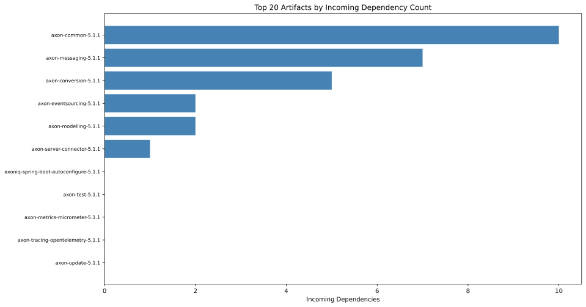

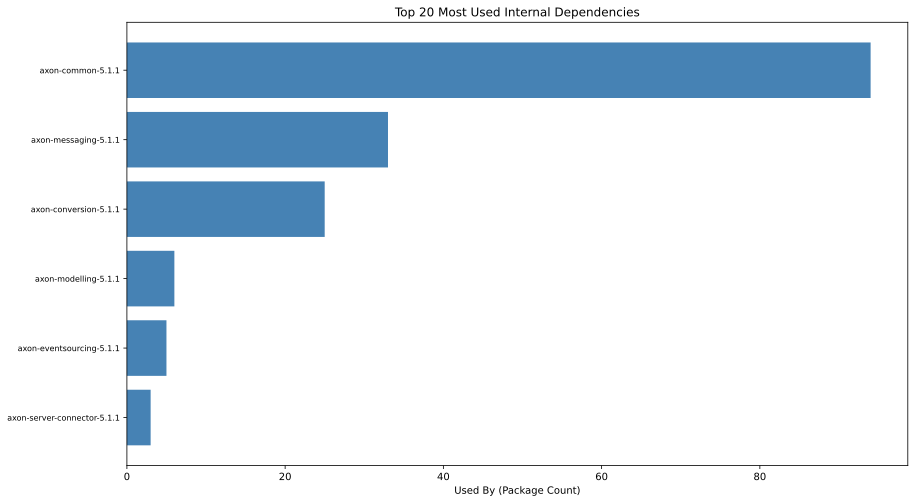

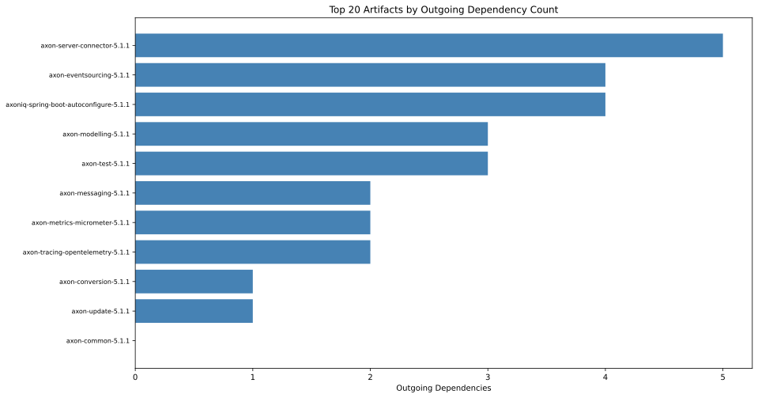

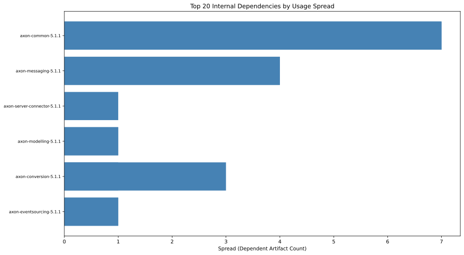

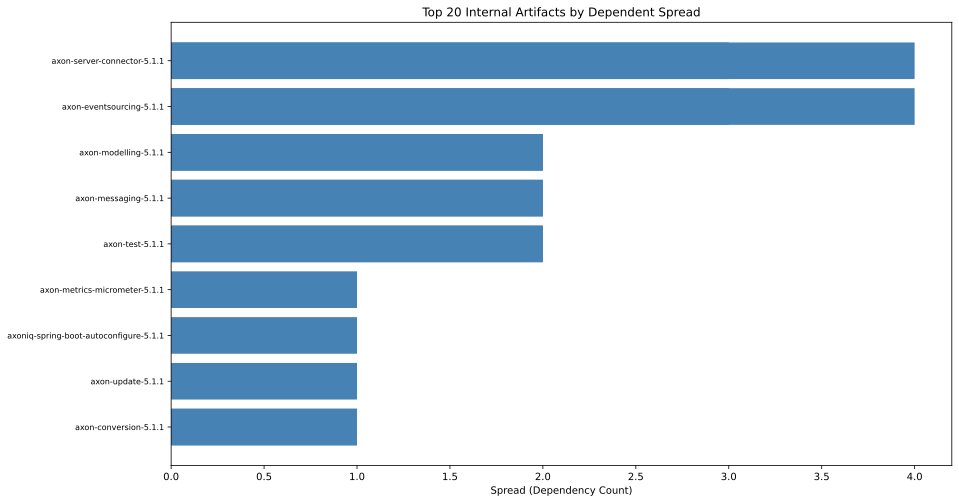

---

## 3. Method Metrics

Effective Lines Of Code (LOC) per type and package. High values = complex or large.

### 3.1 Effective Method Line Count Distribution

| artifactName | effectiveLineCount | methods |
| --- | --- | --- |
| axon-common-5.1.1.jar | 1 | 392 |
| axon-common-5.1.1.jar | 2 | 152 |
| axon-common-5.1.1.jar | 3 | 101 |
| axon-common-5.1.1.jar | 4 | 37 |
| axon-common-5.1.1.jar | 5 | 38 |
| axon-common-5.1.1.jar | 6 | 38 |
| axon-common-5.1.1.jar | 7 | 19 |
| axon-common-5.1.1.jar | 8 | 18 |
| axon-common-5.1.1.jar | 9 | 12 |
| axon-common-5.1.1.jar | 10 | 6 |

[Full data](./EffectiveMethodLineCountDistribution.csv)

### 3.2 Top Types by Effective LOC

| artifactName | packageName | typeName | sumEffectiveLinesOfMethodCode | maxEffectiveLinesOfMethodCode | methodWithMaxEffectiveLinesOfMethodCode | maxCyclomaticComplexity | methodWithMaxCyclomaticComplexity |
| --- | --- | --- | --- | --- | --- | --- | --- |
| axon-messaging-5.1.1 | org.axonframework.messaging.eventhandling.processing.streaming.pooled | Coordinator$CoordinationTask | 398 | 111 | run | 25 | run |
| axon-messaging-5.1.1 | org.axonframework.messaging.eventhandling.processing.streaming.token.store.jdbc | JdbcTokenStore | 305 | 25 | updateToken | 8 | updateToken |
| axon-test-5.1.1 | org.axonframework.test.fixture | Reporter | 224 | 45 | appendEventOverview | 11 | appendEventOverview |
| axon-eventsourcing-5.1.1 | org.axonframework.eventsourcing.eventstore.jpa | AggregateBasedJpaEventStorageEngine | 193 | 17 | <init> | 5 | lambda$queryTokensAndEventsBy$16 |
| axon-messaging-5.1.1 | org.axonframework.messaging.eventhandling.processing.streaming.pooled | WorkPackage | 190 | 25 | processEvents | 7 | processEvents |
| axon-common-5.1.1 | org.axonframework.common.configuration | DefaultComponentRegistry | 185 | 18 | invokeEnhancers | 8 | hasComponent |
| axon-common-5.1.1 | org.axonframework.common | ReflectionUtils | 177 | 17 | fieldNameFromMember | 9 | fieldNameFromMember |
| axon-messaging-5.1.1 | org.axonframework.messaging.eventhandling.processing.streaming.pooled | PooledStreamingEventProcessor | 175 | 37 | <init> | 3 | lambda$processWithErrorHandling$20 |
| axon-modelling-5.1.1 | org.axonframework.modelling.entity.annotation | AnnotatedEntityMetamodel | 166 | 18 | createOptionalChildForMember | 6 | getExpectedRepresentation |
| axon-messaging-5.1.1 | org.axonframework.messaging.eventhandling.processing.streaming.pooled | PooledStreamingEventProcessorConfiguration | 160 | 18 | describeTo | 2 | ignoredMessageHandler |

[Full data](./EffectiveLinesOfMethodCodePerType.csv)

### 3.3 Top Packages by Effective LOC

| artifactName | fullPackageName | linesInPackage | complexityInPackage | methodCount | maxLinesMethod | maxLinesMethodType | maxLinesMethodName | maxComplexity | maxComplexityType | maxComplexityMethod | packageName |
| --- | --- | --- | --- | --- | --- | --- | --- | --- | --- | --- | --- |
| axon-messaging-5.1.1 | org.axonframework.messaging.eventhandling.processing.streaming.pooled | 1496 | 586 | 428 | 111 | Coordinator$CoordinationTask | run | 25 | Coordinator$CoordinationTask | run | pooled |
| axon-messaging-5.1.1 | org.axonframework.messaging.core | 1183 | 738 | 519 | 23 | AbstractMessageStream | next | 11 | QueueMessageStream | fetchNext | core |
| axon-common-5.1.1 | org.axonframework.common.configuration | 766 | 411 | 303 | 26 | DefaultAxonApplication$AxonConfigurationImpl | invokeLifecycleHandlers | 8 | DefaultComponentRegistry | hasComponent | configuration |
| axon-test-5.1.1 | org.axonframework.test.fixture | 752 | 324 | 211 | 45 | Reporter | appendEventOverview | 11 | Reporter | appendEventOverview | fixture |
| axon-messaging-5.1.1 | org.axonframework.messaging.core.annotation | 713 | 379 | 239 | 23 | MethodInvokingMessageHandlingMember | <init> | 13 | MessageStreamResolverUtils | resolveToStream | annotation |
| axon-eventsourcing-5.1.1 | org.axonframework.eventsourcing.eventstore | 679 | 434 | 278 | 19 | AnnotationBasedTagResolver | createTagsForValue | 8 | AggregateBasedConsistencyMarker | from | eventstore |
| axon-common-5.1.1 | org.axonframework.common | 654 | 408 | 194 | 24 | TypeReflectionUtils | getExactDirectSuperTypesOfParameterizedTypeOrClass | 9 | TypeReflectionUtils | getExactDirectSuperTypesOfParameterizedTypeOrClass | common |
| axon-server-connector-5.1.1 | io.axoniq.framework.axonserver.connector.event | 541 | 217 | 161 | 21 | AggregateBasedAxonServerEventStorageEngine | lambda$appendEvents$0 | 4 | AggregateBasedAxonServerEventStorageEngine | lambda$appendEvents$0 | event |
| axon-messaging-5.1.1 | org.axonframework.messaging.eventhandling.processing.streaming.token.store.jdbc | 443 | 194 | 109 | 25 | JdbcTokenStore | updateToken | 8 | JdbcTokenStore | updateToken | jdbc |
| axon-eventsourcing-5.1.1 | org.axonframework.eventsourcing.eventstore.jpa | 439 | 207 | 135 | 20 | GapAwareTrackingTokenOperations | withGapsCleaned | 8 | SQLErrorCodesResolver | loadKeyViolationCodes | jpa |

[Full data](./EffectiveLinesOfMethodCodePerPackage.csv)

### 3.4 Method Metrics Charts

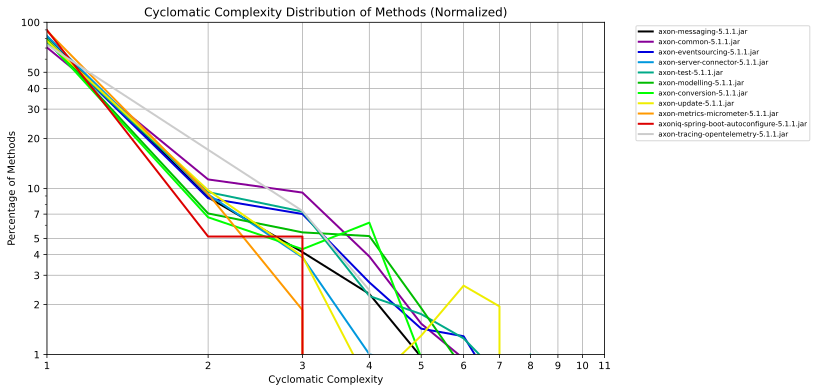

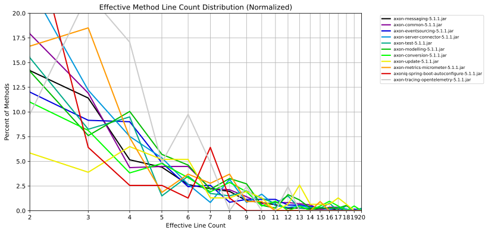

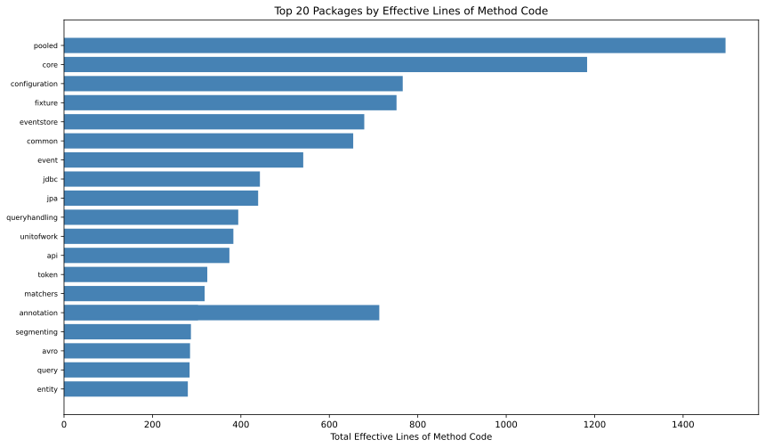

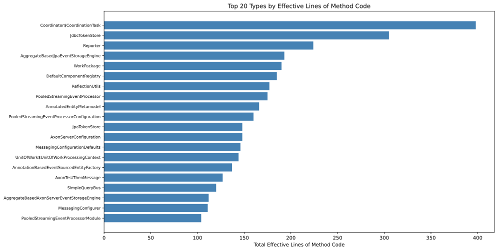

---

## 4. Java Code Quality

Annotations, deprecated API usages, and reflection calls.

### 4.1 Annotated Code Elements

| annotationName | languageElement | numberOfAnnotatedElements | examples |
| --- | --- | --- | --- |
| org.jspecify.annotations.NullMarked | Interface | 124 | ["org.axonframework.messaging.commandhandling.package-info","org.axonframework.messaging.commandhandling.interception.package-info","org.axonframework.messaging.commandhandling.retry.package-info","org.axonframework.messaging.commandhandling.tracing.package-info","org.axonframework.messaging.eventhandling.tracing.package-info","org.axonframework.messaging.commandhandling.gateway.package-info","org.axonframework.messaging.commandhandling.annotation.package-info","org.axonframework.messaging.commandhandling.configuration.package-info","org.axonframework.messaging.eventhandling.conversion.package-info"] |
| org.axonframework.common.annotation.Internal | Class | 91 | ["org.axonframework.messaging.commandhandling.interception.CommandMessageHandlerInterceptorChain","org.axonframework.messaging.commandhandling.gateway.ContextAwareCommandDispatcher","org.axonframework.messaging.commandhandling.annotation.CommandDispatcherParameterResolverFactory","org.axonframework.messaging.eventhandling.interception.InterceptingEventHandlingComponent","org.axonframework.messaging.eventhandling.interception.EventMessageHandlerInterceptorChain","org.axonframework.messaging.eventhandling.DelegatingEventBus","org.axonframework.messaging.eventhandling.InterceptingEventBus","org.axonframework.messaging.eventhandling.InterceptingEventSink","org.axonframework.messaging.eventhandling.EventSubscribers"] |
| java.lang.FunctionalInterface | Interface | 57 | ["org.axonframework.messaging.commandhandling.CommandHandler","org.axonframework.messaging.commandhandling.CommandPriorityCalculator","org.axonframework.messaging.eventhandling.replay.ResetHandler","org.axonframework.messaging.eventhandling.replay.ReplayStatusChangedHandler","org.axonframework.messaging.eventhandling.processing.subscribing.SubscribingEventProcessorModule$Customization","org.axonframework.messaging.eventhandling.processing.errorhandling.ErrorHandler","org.axonframework.messaging.eventhandling.processing.streaming.pooled.WorkPackage$BatchProcessor","org.axonframework.messaging.eventhandling.processing.streaming.pooled.PooledStreamingEventProcessorModule$Customization","org.axonframework.messaging.eventhandling.processing.streaming.pooled.WorkPackage$EventFilter"] |
| java.lang.annotation.Retention | Annotation | 43 | ["org.axonframework.messaging.commandhandling.annotation.Command","org.axonframework.messaging.commandhandling.annotation.CommandHandler","org.axonframework.messaging.eventhandling.replay.annotation.AllowReplay","org.axonframework.messaging.eventhandling.replay.annotation.ReplayContext","org.axonframework.messaging.eventhandling.replay.annotation.ResetHandler","org.axonframework.messaging.eventhandling.replay.annotation.ReplayStatusChangedHandler","org.axonframework.messaging.eventhandling.replay.annotation.DisallowReplay","org.axonframework.messaging.eventhandling.annotation.EventHandler","org.axonframework.messaging.eventhandling.annotation.Event"] |
| java.lang.annotation.Target | Annotation | 43 | ["org.axonframework.messaging.commandhandling.annotation.Command","org.axonframework.messaging.commandhandling.annotation.CommandHandler","org.axonframework.messaging.eventhandling.replay.annotation.AllowReplay","org.axonframework.messaging.eventhandling.replay.annotation.ReplayContext","org.axonframework.messaging.eventhandling.replay.annotation.ResetHandler","org.axonframework.messaging.eventhandling.replay.annotation.ReplayStatusChangedHandler","org.axonframework.messaging.eventhandling.replay.annotation.DisallowReplay","org.axonframework.messaging.eventhandling.annotation.EventHandler","org.axonframework.messaging.eventhandling.annotation.Event"] |
| org.axonframework.common.annotation.Internal | Interface | 26 | ["org.axonframework.messaging.commandhandling.annotation.CommandHandlingMember","org.axonframework.messaging.eventhandling.replay.ReplayStatusChangedHandler","org.axonframework.messaging.eventhandling.replay.ReplayStatusChanged","org.axonframework.messaging.eventhandling.replay.ReplayStatusChangedHandlerRegistry","org.axonframework.messaging.eventhandling.annotation.EventHandlingMember","org.axonframework.messaging.core.unitofwork.transaction.TransactionalExecutorProvider","org.axonframework.messaging.core.interception.DispatchInterceptorRegistry","org.axonframework.messaging.core.correlation.CorrelationDataProviderRegistry","org.axonframework.messaging.core.interception.HandlerInterceptorRegistry"] |
| org.axonframework.common.annotation.Internal | Constructor | 19 | ["org.axonframework.messaging.eventhandling.InterceptingEventBus.<init>","org.axonframework.messaging.eventhandling.processing.subscribing.SubscribingEventProcessorConfiguration.<init>","org.axonframework.messaging.eventhandling.processing.subscribing.SubscribingEventProcessorsConfigurer.<init>","org.axonframework.messaging.eventhandling.processing.streaming.segmenting.Segment.<init>","org.axonframework.messaging.eventhandling.processing.streaming.segmenting.SequenceCachingEventHandlingComponent.<init>","org.axonframework.messaging.eventhandling.processing.streaming.pooled.PooledStreamingEventProcessorsConfigurer.<init>","org.axonframework.messaging.eventhandling.processing.streaming.pooled.PooledStreamingEventProcessorConfiguration.<init>","org.axonframework.messaging.eventhandling.configuration.EventProcessingConfigurer.<init>","org.axonframework.messaging.eventhandling.configuration.EventProcessorConfiguration.<init>"] |
| java.lang.annotation.Documented | Annotation | 15 | ["org.axonframework.messaging.commandhandling.annotation.CommandHandler","org.axonframework.messaging.eventhandling.replay.annotation.AllowReplay","org.axonframework.messaging.eventhandling.replay.annotation.DisallowReplay","org.axonframework.messaging.eventhandling.annotation.EventHandler","org.axonframework.messaging.core.annotation.MetadataValue","org.axonframework.messaging.core.annotation.SequencingPolicy","org.axonframework.messaging.core.annotation.HasHandlerAttributes","org.axonframework.messaging.core.annotation.MessageHandlerTimeout","org.axonframework.messaging.core.annotation.MessageHandler"] |
| org.springframework.context.annotation.Bean | Method | 15 | ["org.axonframework.extension.metrics.micrometer.springboot.MicrometerMetricsAutoConfiguration.disableMetricsConfigurationEnhancer","org.axonframework.extension.metrics.micrometer.springboot.MicrometerMetricsAutoConfiguration.meterRegistry","org.axonframework.extension.metrics.micrometer.springboot.MicrometerMetricsAutoConfiguration.metricsConfigurationEnhancer","io.axoniq.framework.springboot.autoconfig.AxonServerActuatorAutoConfiguration.axonServerHealthIndicator","io.axoniq.framework.springboot.autoconfig.AxonServerActuatorAutoConfiguration.axonServerStatusAggregator","io.axoniq.framework.springboot.autoconfig.PostgresqlAutoConfiguration.disablePostgresqlConfigurationEnhancer","io.axoniq.framework.springboot.autoconfig.JpaDeadLetterQueueAutoConfiguration.jpaDeadLetterQueueFactory","io.axoniq.framework.springboot.autoconfig.AxonServerAutoConfiguration.disableAxonServerConfigurationEnhancer","io.axoniq.framework.springboot.autoconfig.AxonServerAutoConfiguration.axonServerConfigurationEnhancer"] |
| org.axonframework.common.annotation.Internal | Method | 13 | ["org.axonframework.messaging.eventhandling.conversion.DelegatingEventConverter.delegate","org.axonframework.messaging.eventhandling.processing.subscribing.SubscribingEventProcessorsConfigurer.build","org.axonframework.messaging.eventhandling.processing.streaming.pooled.PooledStreamingEventProcessorsConfigurer.build","org.axonframework.messaging.eventhandling.processing.streaming.token.store.jdbc.JdbcTokenStore.converter","org.axonframework.messaging.eventhandling.processing.streaming.token.store.jpa.JpaTokenStore.converter","org.axonframework.messaging.core.conversion.DelegatingMessageConverter.delegate","org.axonframework.messaging.core.interception.annotation.MessageHandlerInterceptorMemberChain.handleSync","org.axonframework.messaging.core.Context.resources","org.axonframework.messaging.core.annotation.MessageHandlingMember.handleSync"] |

[Full data](./AnnotatedCodeElements.csv)

### 4.2 Annotated Code Elements per Artifact

| artifactName | annotationName | languageElement | numberOfAnnotatedElements | examples |
| --- | --- | --- | --- | --- |
| axon-common-5.1.1 | org.jspecify.annotations.NullMarked | Interface | 15 | ["org.axonframework.common.lifecycle.package-info","org.axonframework.common.property.package-info","org.axonframework.common.package-info","org.axonframework.common.digest.package-info","org.axonframework.common.function.package-info","org.axonframework.common.io.package-info","org.axonframework.common.caching.package-info","org.axonframework.common.infra.package-info","org.axonframework.common.jdbc.package-info"] |
| axon-common-5.1.1 | java.lang.FunctionalInterface | Interface | 12 | ["org.axonframework.common.Registration","org.axonframework.common.property.Property","org.axonframework.common.infra.DescribableComponent","org.axonframework.common.jdbc.JdbcUtils$SqlFunction","org.axonframework.common.jdbc.ConnectionProvider","org.axonframework.common.jdbc.JdbcUtils$SqlResultConverter","org.axonframework.common.util.ExecutorServiceFactory","org.axonframework.common.lock.LockFactory","org.axonframework.common.configuration.ComponentLifecycleHandler"] |
| axon-common-5.1.1 | org.axonframework.common.annotation.Internal | Interface | 7 | ["org.axonframework.common.jdbc.ConnectionProvider","org.axonframework.common.tx.TransactionalExecutor","org.axonframework.common.jpa.EntityManagerProvider","org.axonframework.common.configuration.ExtensibleConfigurer","org.axonframework.common.configuration.ConfigurationExtension","org.axonframework.common.configuration.ExtendedConfiguration","org.axonframework.common.configuration.Component"] |
| axon-common-5.1.1 | org.axonframework.common.annotation.Internal | Class | 7 | ["org.axonframework.common.jdbc.JdbcUtils","org.axonframework.common.jdbc.ConnectionExecutor","org.axonframework.common.jpa.EntityManagerExecutor","org.axonframework.common.configuration.Components","org.axonframework.common.configuration.InstantiatedComponentDefinition","org.axonframework.common.configuration.LazyInitializedComponentDefinition","org.axonframework.common.configuration.ConfigurationExtensions"] |
| axon-common-5.1.1 | java.lang.annotation.Retention | Annotation | 3 | ["org.axonframework.common.Priority","org.axonframework.common.annotation.Internal","org.axonframework.common.annotation.RegistrationScope"] |
| axon-common-5.1.1 | java.lang.annotation.Target | Annotation | 3 | ["org.axonframework.common.Priority","org.axonframework.common.annotation.Internal","org.axonframework.common.annotation.RegistrationScope"] |
| axon-common-5.1.1 | java.lang.annotation.Documented | Annotation | 2 | ["org.axonframework.common.annotation.Internal","org.axonframework.common.annotation.RegistrationScope"] |
| axon-common-5.1.1 | org.axonframework.common.annotation.Internal | Method | 2 | ["org.axonframework.common.configuration.DefaultComponentRegistry.create","org.axonframework.common.configuration.DefaultComponentRegistry.createLocalConfiguration"] |
| axon-common-5.1.1 | java.lang.annotation.Inherited | Annotation | 1 | ["org.axonframework.common.Priority"] |
| axon-conversion-5.1.1 | org.jspecify.annotations.NullMarked | Interface | 5 | ["org.axonframework.conversion.jackson.package-info","org.axonframework.conversion.package-info","org.axonframework.conversion.converter.package-info","org.axonframework.conversion.jackson2.package-info","org.axonframework.conversion.avro.package-info"] |

[Full data](./AnnotatedCodeElementsPerArtifact.csv)

### 4.3 Deprecated Element Usages

| artifactName | deprecatedElement | numberOfElementsUsingDeprecatedElements | someElementsUsingDeprecatedElements |
| --- | --- | --- | --- |
| axon-eventsourcing-5.1.1 | Field | 2 | ["org.axonframework.eventsourcing.handler.SnapshottingEntityLifecycleHandler.storeSnapshot","org.axonframework.eventsourcing.eventstore.jpa.GapAwareTrackingTokenOperations.gapTimeoutThreshold"] |
| axon-messaging-5.1.1 | Method | 3 | ["org.axonframework.messaging.core.annotation.ChainedMessageHandlerInterceptorMember.doHandleSync","org.axonframework.messaging.core.annotation.WrappedMessageHandlingMember.handleSync","org.axonframework.messaging.core.interception.annotation.MessageHandlerInterceptorMemberChain.handle"] |
| axon-messaging-5.1.1 | Class | 1 | ["org.axonframework.messaging.core.interception.annotation.MessageHandlerInterceptorMemberChain"] |
| axon-messaging-5.1.1 | Field | 1 | ["org.axonframework.messaging.eventhandling.GenericEventMessage.<init>"] |
| axon-server-connector-5.1.1 | Method | 2 | ["io.axoniq.framework.axonserver.connector.event.AggregateBasedAxonServerEventStorageEngine.aggregateSourceForCriterion","io.axoniq.framework.axonserver.connector.event.ConditionConverter.convertSourcingCondition"] |

[Full data](./DeprecatedElementUsage.csv)

### 4.4 Reflection Usages

| dependentArtifactName | numberOfReflectionCaller | someReflectionCaller | someReflectionTypes |
| --- | --- | --- | --- |
| axon-messaging-5.1.1 | 633 | ["org.axonframework.messaging.commandhandling.CommandBus","org.axonframework.messaging.eventstreaming.TagAndTypeFilteredEventCriteria","org.axonframework.messaging.eventhandling.processing.EventProcessor","org.axonframework.messaging.core.annotation.AggregateTypeParameterResolverFactory$AggregateTypeParameterResolver","org.axonframework.messaging.queryhandling.interception.InterceptingQueryBus","org.axonframework.messaging.commandhandling.CommandExecutionException","org.axonframework.messaging.eventstreaming.Tag","org.axonframework.messaging.commandhandling.annotation.AnnotationRoutingStrategy","org.axonframework.messaging.core.MessageTypeResolver","org.axonframework.messaging.queryhandling.tracing.DefaultQueryUpdateEmitterSpanFactory$Builder","org.axonframework.messaging.queryhandling.annotation.QueryHandlingMember","org.axonframework.messaging.eventhandling.processing.streaming.pooled.PooledStreamingEventProcessorModule$Customization","org.axonframework.messaging.commandhandling.gateway.DefaultCommandGateway","org.axonframework.messaging.commandhandling.annotation.Command","org.axonframework.messaging.core.AbstractMessageStream","org.axonframework.messaging.queryhandling.annotation.package-info","org.axonframework.messaging.core.CompletionCallbackMessageStream","org.axonframework.messaging.eventhandling.replay.ReplayStatusChangedHandlerRegistry","org.axonframework.messaging.commandhandling.package-info"] | ["java.lang.reflect.Field","java.lang.reflect.InvocationTargetException","java.lang.reflect.Method","java.lang.reflect.Type","java.lang.reflect.Executable","java.lang.reflect.Parameter","java.lang.reflect.Constructor","java.lang.reflect.Member","java.lang.reflect.Modifier","java.lang.reflect.AnnotatedElement","java.lang.reflect.WildcardType"] |
| axon-update-5.1.1 | 28 | ["org.axonframework.update.api.ArtifactAvailableUpgrade","org.axonframework.update.api.package-info","org.axonframework.update.common.DelayedTask","org.axonframework.update.configuration.CommandLineUsagePropertyProvider","org.axonframework.update.api.UpdateCheckRequest","org.axonframework.update.detection.AxonVersionDetector","org.axonframework.update.detection.package-info","org.axonframework.update.api.Artifact","org.axonframework.update.UpdateCheckerHttpClient","org.axonframework.update.configuration.DefaultUsagePropertyProvider","org.axonframework.update.detection.TestEnvironmentDetector","org.axonframework.update.api.UpdateCheckResponse","org.axonframework.update.UpdateChecker","org.axonframework.update.LoggingUpdateCheckerReporter","org.axonframework.update.detection.MachineId","org.axonframework.update.api.DetectedVulnerabilitySeverity","org.axonframework.update.configuration.EnvironmentVariableUsagePropertyProvider$EnvironmentVariableSupplier","org.axonframework.update.common.package-info","org.axonframework.update.configuration.package-info"] | ["java.lang.reflect.Method"] |
| axon-server-connector-5.1.1 | 79 | ["io.axoniq.framework.axonserver.connector.event.EventProcessorControlService","io.axoniq.framework.axonserver.connector.query.QueryUpdateMessageStream","io.axoniq.framework.axonserver.connector.util.GrpcMessageSizeInterceptor$1","io.axoniq.framework.axonserver.connector.configuration.AxonServerConfigurationEnhancer","io.axoniq.framework.axonserver.connector.event.AxonServerMessageStream","io.axoniq.framework.axonserver.connector.api.command.AxonServerRemoteCommandHandlingException","io.axoniq.framework.axonserver.connector.api.AxonServerConnectionManager","io.axoniq.framework.axonserver.connector.api.ConnectionManager","io.axoniq.framework.axonserver.connector.event.TaggedEventConverter","io.axoniq.framework.axonserver.connector.shared.GrpcExceptionParser","io.axoniq.framework.axonserver.connector.api.command.AxonServerNonTransientRemoteCommandHandlingException","io.axoniq.framework.axonserver.connector.shared.ExceptionFactory$1","io.axoniq.framework.axonserver.connector.event.StreamingEventMessageStream","io.axoniq.framework.axonserver.connector.api.AxonServerConfiguration$Eventhandling","io.axoniq.framework.axonserver.connector.api.AxonServerConfiguration$FlowControlConfiguration","io.axoniq.framework.axonserver.connector.query.FlowControlledResponseSender","io.axoniq.framework.axonserver.connector.configuration.TopologyChange$HandlerSubscription","io.axoniq.framework.axonserver.connector.command.CommandConverter","io.axoniq.framework.axonserver.connector.util.GrpcMessageSizeWarningThresholdReachedException"] | [] |
| axon-conversion-5.1.1 | 41 | ["org.axonframework.conversion.jackson2.ObjectNodeToJsonNodeConverter","org.axonframework.conversion.converter.BlobToInputStreamConverter","org.axonframework.conversion.jackson2.JsonNodeToByteArrayConverter","org.axonframework.conversion.avro.ByteArrayToGenericRecordConverter","org.axonframework.conversion.converter.package-info","org.axonframework.conversion.ChainingContentTypeConverter","org.axonframework.conversion.package-info","org.axonframework.conversion.converter.StringToByteArrayConverter","org.axonframework.conversion.CachingSupplier","org.axonframework.conversion.converter.ByteArrayToInputStreamConverter","org.axonframework.conversion.avro.package-info","org.axonframework.conversion.avro.AvroConverter","org.axonframework.conversion.ConversionException","org.axonframework.conversion.jackson2.JsonNodeToObjectNodeConverter","org.axonframework.conversion.converter.InputStreamToByteArrayConverter","org.axonframework.conversion.jackson.ObjectNodeToJsonNodeConverter","org.axonframework.conversion.ChainedConverter$RouteCalculator","org.axonframework.conversion.jackson.JsonNodeToObjectNodeConverter","org.axonframework.conversion.jackson.package-info"] | ["java.lang.reflect.Constructor","java.lang.reflect.Type","java.lang.reflect.InvocationTargetException","java.lang.reflect.Method"] |
| axon-common-5.1.1 | 175 | ["org.axonframework.common.IdentifierValidator","org.axonframework.common.configuration.InstantiatedComponentDefinition","org.axonframework.common.infra.FilesystemStyleComponentDescriptor$SymbolicLink","org.axonframework.common.jpa.EntityManagerExecutor","org.axonframework.common.AxonTransientException","org.axonframework.common.configuration.ComponentNotFoundException","org.axonframework.common.jdbc.ConnectionWrapperFactory$NoOpCloseHandler","org.axonframework.common.tx.package-info","org.axonframework.common.AxonThreadFactory","org.axonframework.common.configuration.ComponentDefinition$2","org.axonframework.common.configuration.ComponentLifecycleHandler","org.axonframework.common.configuration.ConfigurationExtension","org.axonframework.common.property.PropertyAccessStrategy","org.axonframework.common.configuration.DuplicateModuleRegistrationException","org.axonframework.common.configuration.AbstractComponent","org.axonframework.common.configuration.ComponentRegistry","org.axonframework.common.util.MavenArtifactVersionResolver","org.axonframework.common.configuration.ComponentOverrideException","org.axonframework.common.jdbc.JdbcUtils$SqlResultConverter"] | ["java.lang.reflect.InvocationTargetException","java.lang.reflect.Method","java.lang.reflect.Array","java.lang.reflect.GenericArrayType","java.lang.reflect.ParameterizedType","java.lang.reflect.Type","java.lang.reflect.TypeVariable","java.lang.reflect.WildcardType","java.lang.reflect.Proxy","java.lang.reflect.AccessibleObject","java.lang.reflect.Executable","java.lang.reflect.Field","java.lang.reflect.Member","java.lang.reflect.Modifier","java.lang.reflect.AnnotatedElement","java.lang.reflect.Constructor"] |
| axon-eventsourcing-5.1.1 | 128 | ["org.axonframework.eventsourcing.CriteriaResolver","org.axonframework.eventsourcing.eventstore.ConsistencyMarker","org.axonframework.eventsourcing.eventstore.jpa.AggregateBasedJpaEventStorageEngineConfiguration","org.axonframework.eventsourcing.EventSourcedEntityFactory","org.axonframework.eventsourcing.eventstore.SourcingStrategy$Absolute","org.axonframework.eventsourcing.snapshot.api.SnapshotPolicy$1","org.axonframework.eventsourcing.annotation.AnnotationBasedEventCriteriaResolverDefinition","org.axonframework.eventsourcing.eventstore.PayloadBasedTagResolver","org.axonframework.eventsourcing.annotation.EventTags","org.axonframework.eventsourcing.eventstore.SourcingStrategy","org.axonframework.eventsourcing.eventstore.jpa.AggregateBasedJpaEventStorageEngine$AggregateSource","org.axonframework.eventsourcing.eventstore.EventStoreException","org.axonframework.eventsourcing.eventstore.EmptyAppendTransaction","org.axonframework.eventsourcing.eventstore.EventStoreTransaction","org.axonframework.eventsourcing.eventstore.inmemory.InMemoryEventStorageEngine$1","org.axonframework.eventsourcing.package-info","org.axonframework.eventsourcing.eventstore.EventStorageEngine$AppendTransaction","org.axonframework.eventsourcing.snapshot.store.SnapshotStore","org.axonframework.eventsourcing.configuration.SimpleEventSourcedEntityModule$2"] | ["java.lang.reflect.AnnotatedElement","java.lang.reflect.Field","java.lang.reflect.Member","java.lang.reflect.Method","java.lang.reflect.Constructor","java.lang.reflect.Executable","java.lang.reflect.Modifier","java.lang.reflect.InvocationTargetException"] |
| axon-tracing-opentelemetry-5.1.1 | 6 | ["org.axonframework.extension.tracing.opentelemetry.OpenTelemetrySpanFactory$Builder","org.axonframework.extension.tracing.opentelemetry.package-info","org.axonframework.extension.tracing.opentelemetry.MetadataContextGetter","org.axonframework.extension.tracing.opentelemetry.OpenTelemetrySpan","org.axonframework.extension.tracing.opentelemetry.MetadataContextSetter","org.axonframework.extension.tracing.opentelemetry.OpenTelemetrySpanFactory"] | [] |
| axon-test-5.1.1 | 79 | ["org.axonframework.test.matchers.PredicateMatcher","org.axonframework.test.matchers.package-info","org.axonframework.test.matchers.EmptyCollectionMatcher","org.axonframework.test.fixture.AxonTestWhen$Nothing","org.axonframework.test.fixture.AxonTestWhen$Event","org.axonframework.test.matchers.DeepEqualsMatcher","org.axonframework.test.package-info","org.axonframework.test.fixture.AxonTestFixture$Customization","org.axonframework.test.matchers.FieldFilter","org.axonframework.test.util.MessageMonitorReport$Report","org.axonframework.test.util.DescriptionUtils","org.axonframework.test.fixture.AxonTestWhen$Command","org.axonframework.test.util.DefaultCallbackBehavior","org.axonframework.test.util.CallbackBehavior","org.axonframework.test.FixtureResourceParameterResolverFactory$FailingParameterResolver","org.axonframework.test.fixture.AxonTestPhase$Then$Message","org.axonframework.test.fixture.AxonTestPhase$Given","org.axonframework.test.FixtureResourceParameterResolverFactory","org.axonframework.test.matchers.MapStringEntryMatcher"] | ["java.lang.reflect.Field","java.lang.reflect.Executable","java.lang.reflect.Parameter","java.lang.reflect.Modifier","java.lang.reflect.AnnotatedElement","java.lang.reflect.Constructor","java.lang.reflect.Method"] |
| axon-modelling-5.1.1 | 99 | ["org.axonframework.modelling.entity.annotation.AnnotatedEntityIdResolverDefinition","org.axonframework.modelling.configuration.StateBasedEntityModule$PersisterPhase","org.axonframework.modelling.entity.annotation.package-info","org.axonframework.modelling.entity.WrongPolymorphicEntityTypeException","org.axonframework.modelling.annotation.InjectEntityParameterResolver","org.axonframework.modelling.entity.EntityMissingForInstanceCommandHandlerException","org.axonframework.modelling.entity.annotation.RoutingKeyEventTargetMatcher","org.axonframework.modelling.HierarchicalStateManagerConfigurationEnhancer","org.axonframework.modelling.configuration.EntityModule","org.axonframework.modelling.repository.Repository","org.axonframework.modelling.configuration.StateBasedEntityModule$EntityIdResolverPhase","org.axonframework.modelling.entity.PolymorphicEntityMetamodelBuilder","org.axonframework.modelling.configuration.package-info","org.axonframework.modelling.repository.SimpleRepositoryEntityLoader","org.axonframework.modelling.entity.EntityMetamodelBuilder","org.axonframework.modelling.annotation.InjectEntityParameterResolverFactory","org.axonframework.modelling.entity.EntityMetamodel","org.axonframework.modelling.entity.annotation.CommandTargetResolverDefinition","org.axonframework.modelling.ConcurrencyException"] | ["java.lang.reflect.Executable","java.lang.reflect.Parameter","java.lang.reflect.ParameterizedType","java.lang.reflect.Member","java.lang.reflect.AnnotatedElement","java.lang.reflect.Method","java.lang.reflect.Modifier","java.lang.reflect.Field"] |
| axon-metrics-micrometer-5.1.1 | 19 | ["org.axonframework.extension.metrics.micrometer.package-info","org.axonframework.extension.metrics.micrometer.springboot.MicrometerMetricsAutoConfiguration","org.axonframework.extension.metrics.micrometer.MessageTimerMonitor","org.axonframework.extension.metrics.micrometer.springboot.MetricsProperties$Micrometer","org.axonframework.extension.metrics.micrometer.MessageTimerMonitor$1","org.axonframework.extension.metrics.micrometer.MetricsConfigurationEnhancer","org.axonframework.extension.metrics.micrometer.CapacityMonitor","org.axonframework.extension.metrics.micrometer.MessageCountingMonitor","org.axonframework.extension.metrics.micrometer.MessageCountingMonitor$1","org.axonframework.extension.metrics.micrometer.TagsUtil","org.axonframework.extension.metrics.micrometer.springboot.MetricsProperties","org.axonframework.extension.metrics.micrometer.EventProcessorLatencyMonitor$Builder","org.axonframework.extension.metrics.micrometer.reservoir.package-info","org.axonframework.extension.metrics.micrometer.reservoir.SlidingTimeWindowReservoir","org.axonframework.extension.metrics.micrometer.MessageTimerMonitor$Builder","org.axonframework.extension.metrics.micrometer.springboot.MicrometerMetricsAutoConfiguration$1","org.axonframework.extension.metrics.micrometer.springboot.package-info","org.axonframework.extension.metrics.micrometer.EventProcessorLatencyMonitor","org.axonframework.extension.metrics.micrometer.CapacityMonitor$1"] | [] |

[Full data](./ReflectionUsage.csv)

### 4.5 Java Code Quality Charts

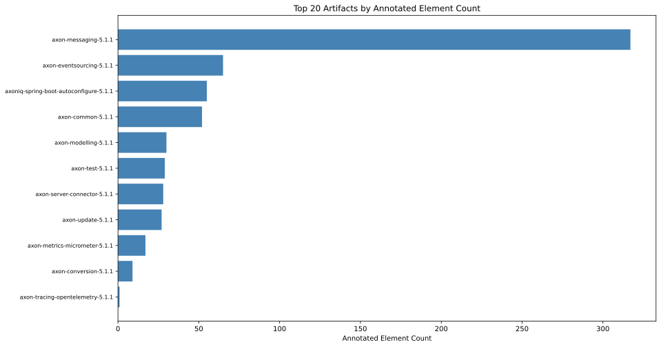

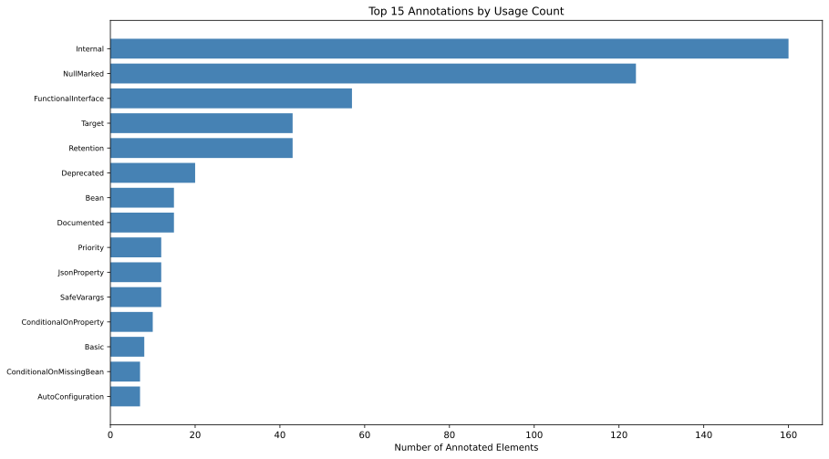

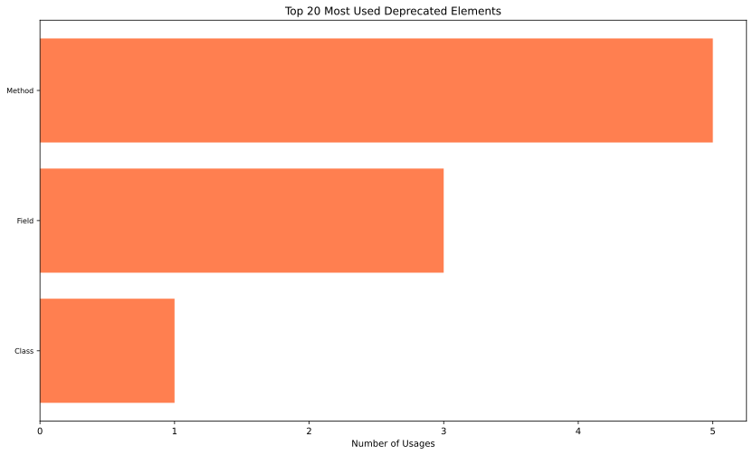

---

## 5. Web Framework Annotations

HTTP mapping annotations from Spring Web and Jakarta EE REST — declared REST endpoints.

### 5.1 Spring Web Request Annotations

### 5.2 Jakarta EE REST Annotations

### 5.3 Web Framework Charts

---

## 6. Duplicate Package Names

Package names in multiple artifacts. Can cause split-package issues on the module path.

---

## 7. Dependency Spread

How many distinct artifacts each internal module is depended on by (spread) and vice versa. Highly spread = critical infrastructure.

### 7.1 Spread per Dependency (most used by others)

| dependencyArtifactName | dependencyTypeIsInterface | usedInArtifacts | usedInPackages | minPackageSpread | maxPackageSpread | avgPackageSpread | stdPackageSpread | per5PackageSpread | minPackageCount | maxPackageCount | avgPackageCount | stdPackageCount | per5PackageCount | minTypeSpread | maxTypeSpread | avgTypeSpread | stdTypeSpread | per5TypeSpread |
| --- | --- | --- | --- | --- | --- | --- | --- | --- | --- | --- | --- | --- | --- | --- | --- | --- | --- | --- |
| axon-common-5.1.1 | true | 7 | 64 | 40 | 100 | 66.32946001367054 | 21.40920350674398 | 66.66666666666667 | 2 | 37 | 9.142857142857142 | 12.495713550768405 | 4 | 11.39240506329114 | 30.303030303030305 | 19.73447595846951 | 6.027722909024434 | 18.9873417721519 |
| axon-common-5.1.1 | false | 7 | 86 | 63.63636363636364 | 100 | 87.3365231259968 | 13.847888884820797 | 87.71929824561403 | 4 | 50 | 12.285714285714286 | 16.690459207925603 | 7 | 18.9873417721519 | 71.42857142857143 | 33.31088053249909 | 18.04040625801803 | 32.03125 |
| axon-conversion-5.1.1 | false | 1 | 5 | 8.771929824561402 | 8.771929824561402 | 8.771929824561402 | 0 | 8.771929824561402 | 5 | 5 | 5 | 0 | 5 | 0.7898894154818326 | 0.7898894154818326 | 0.7898894154818326 | 0 | 0.7898894154818326 |
| axon-conversion-5.1.1 | true | 3 | 21 | 24.561403508771928 | 40 | 30.6113769271664 | 8.243027449975816 | 27.272727272727273 | 3 | 14 | 7 | 6.082762530298219 | 4 | 2.34375 | 5.687203791469194 | 4.364748310236567 | 1.777819556897452 | 5.063291139240507 |
| axon-eventsourcing-5.1.1 | false | 1 | 3 | 30 | 30 | 30 | 0 | 30 | 3 | 3 | 3 | 0 | 3 | 11.39240506329114 | 11.39240506329114 | 11.39240506329114 | 0 | 11.39240506329114 |
| axon-eventsourcing-5.1.1 | true | 1 | 3 | 30 | 30 | 30 | 0 | 30 | 3 | 3 | 3 | 0 | 3 | 11.39240506329114 | 11.39240506329114 | 11.39240506329114 | 0 | 11.39240506329114 |
| axon-messaging-5.1.1 | true | 4 | 24 | 40 | 100 | 75.45454545454545 | 25.302576660785583 | 80 | 4 | 9 | 6 | 2.449489742783178 | 4 | 30.37974683544304 | 43.43434343434344 | 38.494068453522566 | 5.892360293357162 | 37.9746835443038 |
| axon-messaging-5.1.1 | false | 4 | 26 | 40 | 100 | 75.22727272727273 | 26.632640136891368 | 70 | 2 | 10 | 6.5 | 3.3166247903554 | 7 | 11.39240506329114 | 28.90625 | 21.770738436581002 | 7.836604778802304 | 20.202020202020204 |
| axon-modelling-5.1.1 | true | 1 | 5 | 45.45454545454546 | 45.45454545454546 | 45.45454545454546 | 0 | 45.45454545454546 | 5 | 5 | 5 | 0 | 5 | 13.28125 | 13.28125 | 13.28125 | 0 | 13.28125 |
| axon-modelling-5.1.1 | false | 1 | 2 | 18.181818181818183 | 18.181818181818183 | 18.181818181818183 | 0 | 18.181818181818183 | 2 | 2 | 2 | 0 | 2 | 3.125 | 3.125 | 3.125 | 0 | 3.125 |

[Full data](./InternalArtifactUsageSpreadPerDependency.csv)

### 7.2 Spread per Dependent (depends on most others)

| artifactName | dependencyTypeIsInterface | artifactDependencies | artifactDependencyPackages | dependentPackagesRate | minPackageSpread | maxPackageSpread | avgPackageSpread | stdPackageSpread | per5PackageSpread | minPackageCount | maxPackageCount | avgPackageCount | stdPackageCount | per5PackageCount | minTypeSpread | maxTypeSpread | avgTypeSpread | stdTypeSpread | per5TypeSpread |
| --- | --- | --- | --- | --- | --- | --- | --- | --- | --- | --- | --- | --- | --- | --- | --- | --- | --- | --- | --- |
| axon-conversion-5.1.1 | false | 1 | 2 | 80 | 80 | 80 | 80 | 0 | 80 | 4 | 4 | 4 | 0 | 4 | 19.51219512195122 | 19.51219512195122 | 19.51219512195122 | 0 | 19.51219512195122 |
| axon-conversion-5.1.1 | true | 1 | 1 | 80 | 80 | 80 | 80 | 0 | 80 | 4 | 4 | 4 | 0 | 4 | 21.95121951219512 | 21.95121951219512 | 21.95121951219512 | 0 | 21.95121951219512 |
| axon-eventsourcing-5.1.1 | true | 4 | 25 | 56.81818181818182 | 27.272727272727273 | 81.81818181818183 | 56.81818181818182 | 25.03441157857319 | 45.45454545454546 | 3 | 9 | 6.25 | 2.753785273643051 | 5 | 2.34375 | 42.1875 | 20.1171875 | 16.89349632547858 | 13.28125 |
| axon-eventsourcing-5.1.1 | false | 3 | 15 | 57.57575757575758 | 18.181818181818183 | 90.90909090909092 | 57.57575757575758 | 36.74047167570346 | 63.63636363636364 | 2 | 10 | 6.333333333333334 | 4.041451884327381 | 7 | 3.125 | 32.03125 | 21.354166666666664 | 15.86405667762295 | 28.90625 |
| axon-messaging-5.1.1 | false | 2 | 9 | 48.24561403508772 | 8.771929824561402 | 87.71929824561403 | 48.24561403508772 | 55.82421956735901 | 8.771929824561402 | 5 | 50 | 27.5 | 31.81980515339464 | 5 | 0.7898894154818326 | 33.80726698262244 | 17.298578199052137 | 23.346811574721713 | 0.7898894154818326 |
| axon-messaging-5.1.1 | true | 2 | 9 | 44.73684210526316 | 24.561403508771928 | 64.91228070175438 | 44.73684210526315 | 28.532378889983498 | 24.561403508771928 | 14 | 37 | 25.5 | 16.263455967290593 | 14 | 5.687203791469194 | 17.061611374407583 | 11.374407582938389 | 8.042920733875421 | 5.687203791469194 |
| axon-metrics-micrometer-5.1.1 | true | 1 | 1 | 66.66666666666667 | 66.66666666666667 | 66.66666666666667 | 66.66666666666667 | 0 | 66.66666666666667 | 2 | 2 | 2 | 0 | 2 | 15.789473684210527 | 15.789473684210527 | 15.789473684210527 | 0 | 15.789473684210527 |
| axon-modelling-5.1.1 | true | 2 | 14 | 100 | 100 | 100 | 100 | 0 | 100 | 7 | 7 | 7 | 0 | 7 | 30.303030303030305 | 43.43434343434344 | 36.86868686868687 | 9.285240561035476 | 30.303030303030305 |
| axon-modelling-5.1.1 | false | 2 | 9 | 100 | 100 | 100 | 100 | 0 | 100 | 7 | 7 | 7 | 0 | 7 | 20.202020202020204 | 23.232323232323235 | 21.71717171717172 | 2.142747821777417 | 20.202020202020204 |
| axon-server-connector-5.1.1 | true | 4 | 19 | 37.5 | 30 | 40 | 37.5 | 5 | 40 | 3 | 4 | 3.75 | 0.5 | 4 | 5.063291139240507 | 30.37974683544304 | 14.556962025316457 | 10.962346883347326 | 11.39240506329114 |

[Full data](./InternalArtifactUsageSpreadPerDependent.csv)

---

## 8. Glossary and Column Definitions

| Term | Definition |
|------|-----------|
| `a.fileName` | File path of the artifact (JAR/WAR/EAR) |
| `incomingDependencies` | Number of other artifacts that depend on this artifact |
| `outgoingDependencies` | Number of artifacts this artifact depends on |
| `dependency` | Name of an internal artifact that others depend upon |
| `usedByPackages` | Number of distinct packages depending on this artifact |
| `dependencyArtifactName` | Name of the dependency artifact in a spread analysis |
| `usedInArtifacts` | Number of distinct artifacts using this dependency (spread) |
| `artifactDependencies` | Number of distinct dependency artifacts used by this artifact (spread) |
| `typeName` | Simple name of a Java type (class, interface, enum, annotation type) |
| `packageName` | Simple name of a Java package |
| `fullPackageName` | Fully qualified name of a Java package |
| `artifactName` | Name of the artifact (JAR/module) containing the element |
| `methods` | Number of methods with a given effective line count |
| `effectiveLineCount` | Non-blank, non-comment lines in a method |
| `sumEffectiveLinesOfMethodCode` | Sum of effective lines of method code in a type |
| `linesInPackage` | Sum of effective lines across all methods in a package |
| `annotationName` | Fully qualified name of a Java annotation type |
| `languageElement` | Kind of code element annotated (Class, Method, Field, Type, Parameter, etc.) |
| `numberOfAnnotatedElements` | Count of distinct elements annotated with a particular annotation |
| `deprecatedElement` | Kind of deprecated code element (Class, Method, Field, etc.) |
| `numberOfElementsUsingDeprecatedElements` | Count of distinct non-deprecated elements using a deprecated element |
