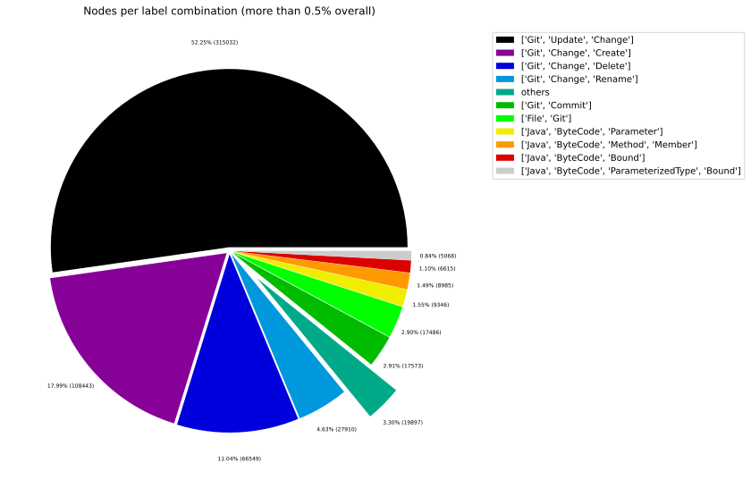
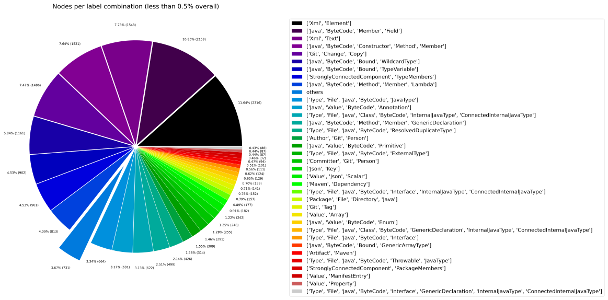
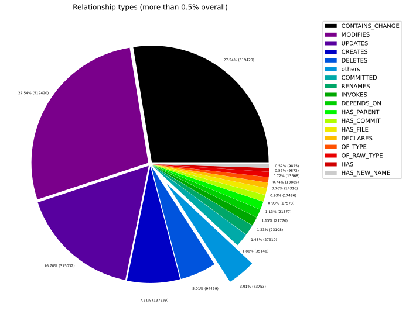
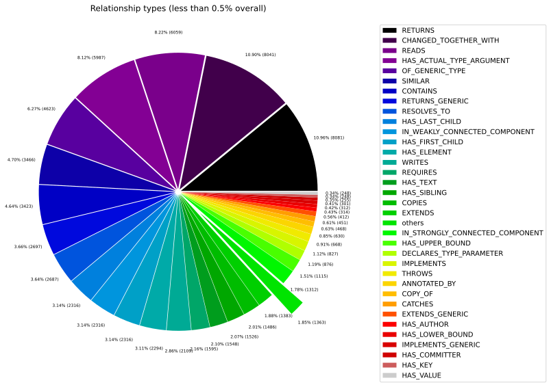
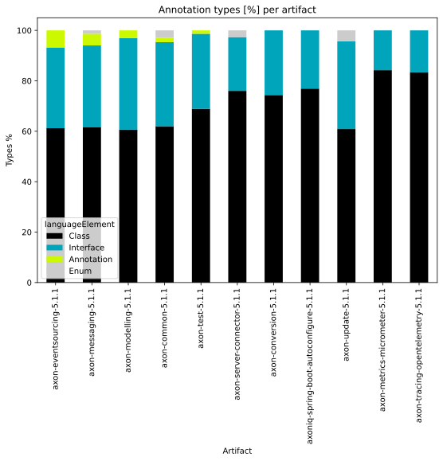
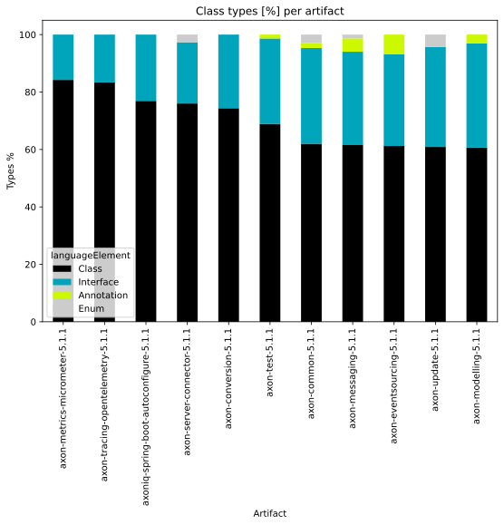
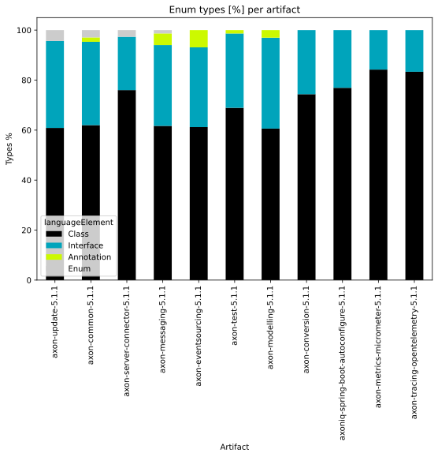
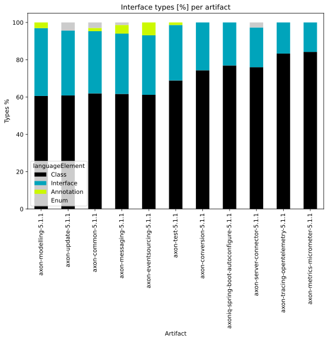
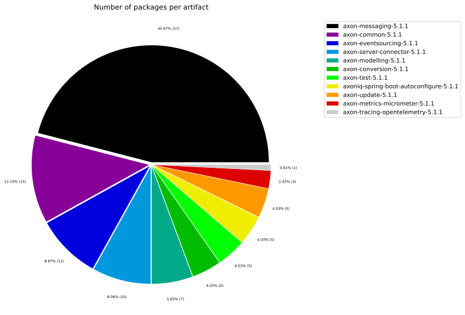
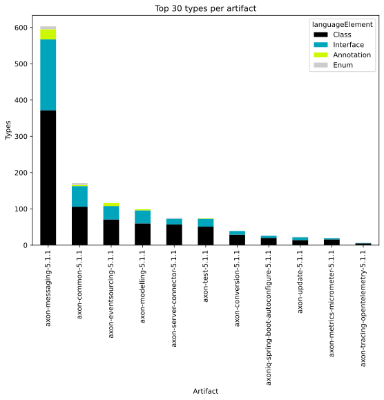

# Overview Report

## 1. Overview

High-level summary of graph database contents: general graph structure (node labels, relationships), Java artifacts, and TypeScript modules.

## 📚 Table of Contents

1. [Overview](#1-overview)
1. [General](#2-general)
1. [Java](#3-java)
1. [TypeScript](#4-typescript)

---

## 2. General

### 2.1 Node label combinations

Shows how many nodes carry each combination of labels and their share of the total node count.

| nodeLabels | nodesWithThatLabels | nodesWithThatLabelsPercent |
| --- | --- | --- |
| ["Git","Update","Change"] | 315032 | 52.248618454659436 |
| ["Git","Change","Create"] | 108443 | 17.98546474986234 |
| ["Git","Change","Delete"] | 66549 | 11.037270212356622 |
| ["Git","Change","Rename"] | 27910 | 4.628923223893271 |
| ["Git","Commit"] | 17573 | 2.9145133577024884 |
| ["File","Git"] | 17486 | 2.9000842527050428 |
| ["Java","ByteCode","Parameter"] | 9346 | 1.5500507506451635 |
| ["Java","ByteCode","Member","Method"] | 9004 | 1.493329441344859 |
| ["Java","ByteCode","Bound"] | 6615 | 1.0971095351506266 |
| ["Java","ByteCode","Bound","ParameterizedType"] | 5068 | 0.8405368290466178 |

[Full data](./Node_label_combination_count.csv)

---

### 2.2 Node labels

Shows the number of nodes carrying each individual label, sorted by count descending.

| nodeLabel | nodesWithThatLabel | nodesWithThatLabelPercent |
| --- | --- | --- |
| Git | 555202 | 92.08124083668908 |
| Change | 519420 | 86.14673238819931 |
| Update | 315032 | 52.248618454659436 |
| Create | 108443 | 17.98546474986234 |
| Delete | 66549 | 11.037270212356622 |
| Java | 41489 | 6.8810245659658875 |
| ByteCode | 41274 | 6.845366432926222 |
| Rename | 27910 | 4.628923223893271 |
| File | 20672 | 3.4284880288184056 |
| Commit | 17573 | 2.9145133577024884 |

[Full data](./Node_label_count.csv)

---

### 2.3 Relationship types

Shows the number of relationships for each type and their share of the total relationship count.

| relationshipType | nodesWithThatRelationshipType | nodesWithThatRelationshipTypePercent |
| --- | --- | --- |
| CONTAINS_CHANGE | 519420 | 27.542506568534137 |
| MODIFIES | 519420 | 27.542506568534137 |
| UPDATES | 315032 | 16.704730139960812 |
| CREATES | 137839 | 7.30898225501555 |
| DELETES | 94459 | 5.008735951555901 |
| COMMITTED | 35146 | 1.8636343149237626 |
| RENAMES | 27910 | 1.479941777998128 |
| INVOKES | 23086 | 1.2241467533810386 |
| DEPENDS_ON | 21776 | 1.154683344954756 |
| HAS_PARENT | 21377 | 1.1335261694111782 |

[Full data](./Relationship_type_count.csv)

---

### 2.4 Node labels and their relationships

Shows which node labels are connected by each relationship type, with count and percentage share.
| sourceLabels | relationshipType | targetLabels | relationshipCount |
| --- | --- | --- | --- |
| ["Git","Update","Change"] | MODIFIES | ["Git"] | 315032 |
| ["Git","Update","Change"] | UPDATES | ["Git"] | 315032 |
| ["Git","Commit"] | CONTAINS_CHANGE | ["Git","Update","Change"] | 315032 |
| ["Git","Change","Create"] | MODIFIES | ["Git"] | 108443 |
| ["Git","Change","Create"] | CREATES | ["Git"] | 108443 |
| ["Git","Commit"] | CONTAINS_CHANGE | ["Git","Change","Create"] | 108443 |
| ["Git","Change","Delete"] | MODIFIES | ["Git"] | 66549 |
| ["Git","Change","Delete"] | DELETES | ["Git"] | 66549 |
| ["Git","Commit"] | CONTAINS_CHANGE | ["Git","Change","Delete"] | 66549 |
| ["Git","Change","Rename"] | MODIFIES | ["Git"] | 27910 |

[Full data](./Node_labels_and_their_relationships.csv)

---

### 2.5 Graph density

Statistical measures of the graph structure: node count, relationship count, and density metric.

---

### 2.6 Dependency node labels

Shows node labels present on dependency nodes — nodes that represent external dependencies not scanned as artifacts.

| sourceLabels | targetLabels | numberOfNodes | percentageOfTotalNodes |
| --- | --- | --- | --- |
| StronglyConnectedComponent,TypeMembers | StronglyConnectedComponent,TypeMembers | 4117 | 0.68 |
| StronglyConnectedComponent,PackageMembers | StronglyConnectedComponent,PackageMembers | 357 | 0.06 |
| Type,File,Java,ByteCode,Interface | Type,File,Java,ByteCode,JavaType,ExternalAnnotation,ExternalType | 124 | 0.02 |
| Type,File,Java,Class,ByteCode,InternalJavaType,ConnectedInternalJavaType | Type,File,Java,ByteCode,JavaType | 38 | 0.01 |
| Type,File,Java,Class,ByteCode,InternalJavaType,ConnectedInternalJavaType | Type,File,Java,ByteCode,JavaType | 34 | 0.01 |
| Type,File,Java,Class,ByteCode,InternalJavaType,ConnectedInternalJavaType | Type,File,Java,ByteCode,ResolvedDuplicateType | 32 | 0.01 |
| Type,File,Java,Class,ByteCode,InternalJavaType,ConnectedInternalJavaType | Type,File,Java,ByteCode,ResolvedDuplicateType,JavaType | 28 | 0 |
| StronglyConnectedComponent,ArtifactMembers | StronglyConnectedComponent,ArtifactMembers | 27 | 0 |
| Type,File,Java,Class,ByteCode,InternalJavaType,ConnectedInternalJavaType | Type,File,Java,ByteCode,JavaType | 27 | 0 |
| Type,File,Java,Class,ByteCode,InternalJavaType,ConnectedInternalJavaType | Type,File,Java,ByteCode,JavaType | 25 | 0 |

[Full data](./Dependency_node_labels.csv)

---

## 3. Java

### 3.1 Artifact size

Overview of scanned Java artifacts: number of packages, types, methods, and lines of code.

| nodeCount | relationshipCount | artifactCount | packageCount | typeCount | methodCount | memberCount |
| --- | --- | --- | --- | --- | --- | --- |
| 602948 | 1885885 | 11 | 137 | 1854 | 5615 | 7029 |

[Full data](./Overview_size.csv)

### 3.2 Java overview charts

---

## 4. TypeScript

### 4.1 Module size

Overview of scanned TypeScript modules: number of exported language elements per module.

> No overview data available.
> Please run the analysis pipeline first to scan and import code artifacts into the graph database (e.g., `analyze.sh`), then start Neo4j and re-run the overview reports.

### 4.2 TypeScript overview charts

