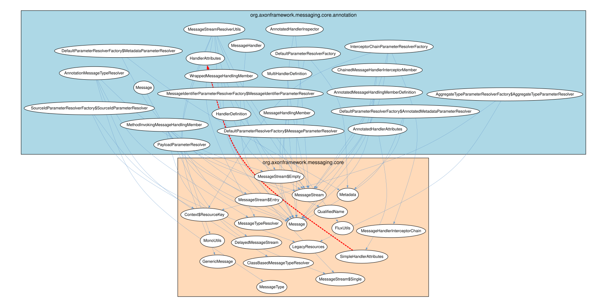
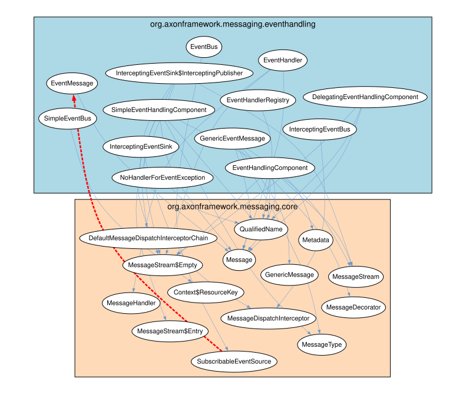
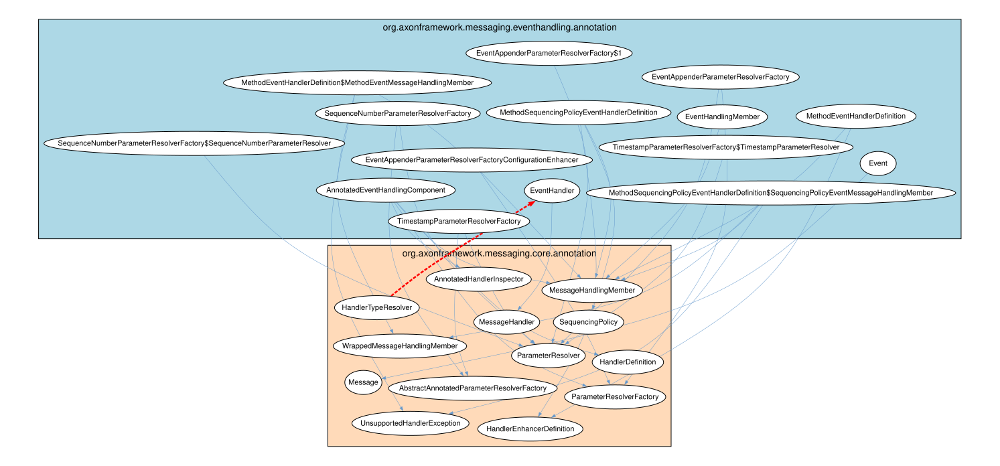
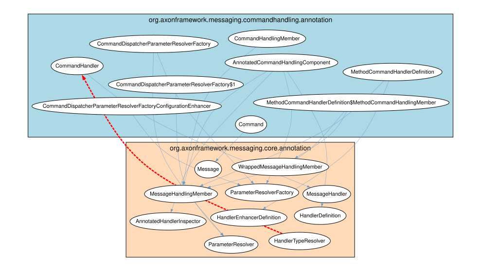
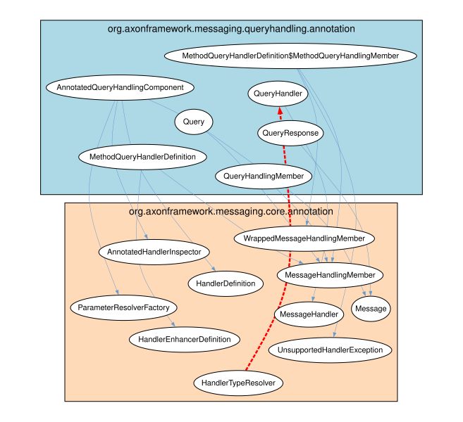

# ♻️ Cyclic Dependencies Report

## 1. Executive Overview

Analyzes **cyclic dependencies**: mutual cycles between Java packages, artifacts, and TypeScript modules.

**Cycle group**: Set of code units that depend on each other (A → B → A, directly or transitively). Prevents modular decomposition.

**Key metric**: `forwardToBackwardBalance` = ratio of forward to backward dependencies. Near 1.0 = easy fix (few backward deps to remove); near 0.0 = hard (many backward deps). Backward dependencies are removal candidates.

**Priority**: Rows sorted by `forwardToBackwardBalance` descending — highest priority first.

## 📚 Table of Contents

1. [Executive Overview](#1-executive-overview)
1. [Java Cyclic Dependencies](#2-java-cyclic-dependencies)
1. [TypeScript Cyclic Dependencies](#3-typescript-cyclic-dependencies)
1. [Glossary](#4-glossary)

---

## 2. Java Cyclic Dependencies

### 2.1 Java Package Cyclic Dependencies (Overview)

`numberForward`: dependencies in cycle majority direction. `numberBackward`: against majority (removal candidates).

| artifactName | packageName | dependentArtifactName | dependentPackageName | forwardToBackwardBalance | numberForward | numberBackward | someForwardDependencies | backwardDependencies |
| --- | --- | --- | --- | --- | --- | --- | --- | --- |
| axon-messaging-5.1.2 | org.axonframework.messaging.core.annotation | axon-messaging-5.1.2 | org.axonframework.messaging.core | 0.96 | 49 | 1 | ["AnnotatedMessageHandlingMemberDefinition->MessageStream","AnnotatedMessageHandlingMemberDefinition->Message","MethodInvokingMessageHandlingMember->MessageStream$Entry","MethodInvokingMessageHandlingMember->Message","MethodInvokingMessageHandlingMember->MessageStream$Single","MethodInvokingMessageHandlingMember->MessageStream$Empty","MethodInvokingMessageHandlingMember->DelayedMessageStream","MethodInvokingMessageHandlingMember->MessageStream","ChainedMessageHandlerInterceptorMember->Message"] | ["SimpleHandlerAttributes->HandlerAttributes"] |
| axon-messaging-5.1.2 | org.axonframework.messaging.eventhandling | axon-messaging-5.1.2 | org.axonframework.messaging.core | 0.9375 | 31 | 1 | ["EventMessage->Message","InterceptingEventSink->MessageDispatchInterceptor","InterceptingEventBus->MessageDispatchInterceptor","EventHandlerRegistry->QualifiedName","EventHandlingComponent->QualifiedName","EventHandlingComponent->MessageStream$Empty","EventHandlingComponent->Message","EventHandlingComponent->MessageStream","DelegatingEventHandlingComponent->Message"] | ["SubscribableEventSource->EventMessage"] |
| axon-messaging-5.1.2 | org.axonframework.messaging.eventhandling.annotation | axon-messaging-5.1.2 | org.axonframework.messaging.core.annotation | 0.9310344827586207 | 28 | 1 | ["MethodSequencingPolicyEventHandlerDefinition$SequencingPolicyEventMessageHandlingMember->WrappedMessageHandlingMember","MethodSequencingPolicyEventHandlerDefinition$SequencingPolicyEventMessageHandlingMember->MessageHandlingMember","MethodSequencingPolicyEventHandlerDefinition$SequencingPolicyEventMessageHandlingMember->UnsupportedHandlerException","EventHandler->MessageHandler","SequenceNumberParameterResolverFactory->ParameterResolver","SequenceNumberParameterResolverFactory->AbstractAnnotatedParameterResolverFactory","Event->Message","EventHandlingMember->MessageHandlingMember","EventAppenderParameterResolverFactoryConfigurationEnhancer->ParameterResolverFactory"] | ["HandlerTypeResolver->EventHandler"] |
| axon-messaging-5.1.2 | org.axonframework.messaging.commandhandling.annotation | axon-messaging-5.1.2 | org.axonframework.messaging.core.annotation | 0.875 | 15 | 1 | ["CommandDispatcherParameterResolverFactoryConfigurationEnhancer->ParameterResolverFactory","MethodCommandHandlerDefinition$MethodCommandHandlingMember->WrappedMessageHandlingMember","MethodCommandHandlerDefinition$MethodCommandHandlingMember->MessageHandlingMember","Command->Message","AnnotatedCommandHandlingComponent->HandlerDefinition","AnnotatedCommandHandlingComponent->ParameterResolverFactory","AnnotatedCommandHandlingComponent->AnnotatedHandlerInspector","AnnotatedCommandHandlingComponent->MessageHandlingMember","CommandHandler->MessageHandler"] | ["HandlerTypeResolver->CommandHandler"] |
| axon-messaging-5.1.2 | org.axonframework.messaging.queryhandling.annotation | axon-messaging-5.1.2 | org.axonframework.messaging.core.annotation | 0.8571428571428571 | 13 | 1 | ["AnnotatedQueryHandlingComponent->AnnotatedHandlerInspector","AnnotatedQueryHandlingComponent->HandlerDefinition","AnnotatedQueryHandlingComponent->MessageHandlingMember","AnnotatedQueryHandlingComponent->ParameterResolverFactory","MethodQueryHandlerDefinition->HandlerEnhancerDefinition","MethodQueryHandlerDefinition->MessageHandlingMember","QueryHandlingMember->MessageHandlingMember","QueryHandler->MessageHandler","QueryResponse->Message"] | ["HandlerTypeResolver->QueryHandler"] |
| axon-modelling-5.1.2 | org.axonframework.modelling.annotation | axon-modelling-5.1.2 | org.axonframework.modelling | 0.8461538461538461 | 12 | 1 | ["AnnotationBasedEntityEvolvingComponent->EntityEvolvingComponent","AnnotationBasedEntityEvolvingComponent->StateEvolvingException","EntityIdResolverDefinition->EntityIdResolver","InjectEntityParameterResolver->EntityIdResolver","InjectEntityParameterResolver->StateManager","InjectEntityParameterResolver->EntityIdResolutionException","AnnotationBasedEntityIdResolverDefinition->EntityIdResolver","AnnotationBasedEntityIdResolver->EntityIdResolutionException","AnnotationBasedEntityIdResolver->EntityIdResolver"] | ["PropertyBasedEntityIdResolver->TargetEntityIdMemberMismatchException"] |
| axon-messaging-5.1.2 | org.axonframework.messaging.core.unitofwork.transaction | axon-messaging-5.1.2 | org.axonframework.messaging.core.unitofwork | 0.6666666666666666 | 5 | 1 | ["TransactionalExecutorProvider->ProcessingContext","TransactionManager->ProcessingLifecycle","TransactionManager->ProcessingLifecycle$Phase","TransactionManager->ProcessingLifecycle$ErrorHandler","TransactionManager->ProcessingContext"] | ["TransactionalUnitOfWorkFactory->TransactionManager"] |
| axon-messaging-5.1.2 | org.axonframework.messaging.eventhandling.processing.streaming.pooled | axon-messaging-5.1.2 | org.axonframework.messaging.eventhandling.configuration | 0.6666666666666666 | 15 | 3 | ["PooledStreamingEventProcessorConfiguration->EventProcessorConfiguration","PooledStreamingEventProcessorModule->EventProcessorModule","PooledStreamingEventProcessorModule->EventHandlingComponentsConfigurer$RequiredComponentPhase","PooledStreamingEventProcessorModule->EventProcessorCustomization","PooledStreamingEventProcessorModule->EventHandlingComponentsConfigurer$CompletePhase","PooledStreamingEventProcessorModule->EventProcessorModule$EventHandlingPhase","PooledStreamingEventProcessorModule->EventProcessorModule$CustomizationPhase","PooledStreamingEventProcessorModule->DefaultEventHandlingComponentsConfigurer","PooledStreamingEventProcessorModule->EventProcessorConfiguration"] | ["EventProcessorModule->PooledStreamingEventProcessorModule","EventProcessorModule->PooledStreamingEventProcessorConfiguration","EventProcessingConfigurer->PooledStreamingEventProcessorsConfigurer"] |
| axon-messaging-5.1.2 | org.axonframework.messaging.eventhandling.processing.subscribing | axon-messaging-5.1.2 | org.axonframework.messaging.eventhandling.configuration | 0.6666666666666666 | 15 | 3 | ["SubscribingEventProcessorsConfigurer->EventHandlingComponentsConfigurer$RequiredComponentPhase","SubscribingEventProcessorsConfigurer->EventHandlingComponentsConfigurer$CompletePhase","SubscribingEventProcessorsConfigurer->EventProcessingConfigurer","SubscribingEventProcessorsConfigurer->EventProcessorModule$CustomizationPhase","SubscribingEventProcessorsConfigurer->EventProcessorModule","SubscribingEventProcessorsConfigurer->EventProcessorModule$EventHandlingPhase","SubscribingEventProcessorConfiguration->EventProcessorConfiguration","SubscribingEventProcessorModule->EventHandlingComponentsConfigurer$RequiredComponentPhase","SubscribingEventProcessorModule->EventProcessorModule"] | ["EventProcessorModule->SubscribingEventProcessorModule","EventProcessorModule->SubscribingEventProcessorConfiguration","EventProcessingConfigurer->SubscribingEventProcessorsConfigurer"] |
| axon-common-5.1.2 | org.axonframework.common.configuration | axon-common-5.1.2 | org.axonframework.common.infra | 0.6 | 16 | 4 | ["Configuration->DescribableComponent","LazyInitializedComponentDefinition->ComponentDescriptor","ComponentRegistry->DescribableComponent","Component->DescribableComponent","InstantiatedComponentDefinition->ComponentDescriptor","DefaultComponentRegistry$LocalConfiguration->ComponentDescriptor","DecoratedComponent->ComponentDescriptor","ConfigurationExtension->DescribableComponent","AbstractComponent->ComponentDescriptor"] | ["JacksonComponentDescriptor->Component","JacksonComponentDescriptor->Component$Identifier","FilesystemStyleComponentDescriptor->Component","FilesystemStyleComponentDescriptor->Component$Identifier"] |

[Full data](./Java_Package/Cyclic_Dependencies.csv)

### 2.2 Java Package Cyclic Dependencies (Breakdown)

Individual dependency pairs per cycle group: concrete types involved.

| artifactName | packageName | dependentArtifactName | dependentPackageName | dependency | forwardToBackwardBalance | numberForward | numberBackward |
| --- | --- | --- | --- | --- | --- | --- | --- |
| axon-messaging-5.1.2 | org.axonframework.messaging.core.annotation | axon-messaging-5.1.2 | org.axonframework.messaging.core | HandlerAttributes<-SimpleHandlerAttributes | 0.96 | 49 | 1 |
| axon-messaging-5.1.2 | org.axonframework.messaging.core.annotation | axon-messaging-5.1.2 | org.axonframework.messaging.core | AnnotatedMessageHandlingMemberDefinition->MessageStream | 0.96 | 49 | 1 |
| axon-messaging-5.1.2 | org.axonframework.messaging.core.annotation | axon-messaging-5.1.2 | org.axonframework.messaging.core | AnnotatedMessageHandlingMemberDefinition->Message | 0.96 | 49 | 1 |
| axon-messaging-5.1.2 | org.axonframework.messaging.core.annotation | axon-messaging-5.1.2 | org.axonframework.messaging.core | MethodInvokingMessageHandlingMember->MessageStream$Entry | 0.96 | 49 | 1 |
| axon-messaging-5.1.2 | org.axonframework.messaging.core.annotation | axon-messaging-5.1.2 | org.axonframework.messaging.core | MethodInvokingMessageHandlingMember->Message | 0.96 | 49 | 1 |
| axon-messaging-5.1.2 | org.axonframework.messaging.core.annotation | axon-messaging-5.1.2 | org.axonframework.messaging.core | MethodInvokingMessageHandlingMember->MessageStream$Single | 0.96 | 49 | 1 |
| axon-messaging-5.1.2 | org.axonframework.messaging.core.annotation | axon-messaging-5.1.2 | org.axonframework.messaging.core | MethodInvokingMessageHandlingMember->MessageStream$Empty | 0.96 | 49 | 1 |
| axon-messaging-5.1.2 | org.axonframework.messaging.core.annotation | axon-messaging-5.1.2 | org.axonframework.messaging.core | MethodInvokingMessageHandlingMember->DelayedMessageStream | 0.96 | 49 | 1 |
| axon-messaging-5.1.2 | org.axonframework.messaging.core.annotation | axon-messaging-5.1.2 | org.axonframework.messaging.core | MethodInvokingMessageHandlingMember->MessageStream | 0.96 | 49 | 1 |
| axon-messaging-5.1.2 | org.axonframework.messaging.core.annotation | axon-messaging-5.1.2 | org.axonframework.messaging.core | ChainedMessageHandlerInterceptorMember->Message | 0.96 | 49 | 1 |

[Full data](./Java_Package/Cyclic_Dependencies_Breakdown.csv)

### 2.3 Java Package Cyclic Dependencies (Backward Only)

Backward dependencies only — primary candidates for removal/reversal to break cycles.

| artifactName | packageName | dependentArtifactName | dependentPackageName | dependency | forwardToBackwardBalance | numberForward | numberBackward |
| --- | --- | --- | --- | --- | --- | --- | --- |
| axon-messaging-5.1.2 | org.axonframework.messaging.core.annotation | axon-messaging-5.1.2 | org.axonframework.messaging.core | HandlerAttributes<-SimpleHandlerAttributes | 0.96 | 49 | 1 |
| axon-messaging-5.1.2 | org.axonframework.messaging.eventhandling | axon-messaging-5.1.2 | org.axonframework.messaging.core | EventMessage<-SubscribableEventSource | 0.9375 | 31 | 1 |
| axon-messaging-5.1.2 | org.axonframework.messaging.eventhandling.annotation | axon-messaging-5.1.2 | org.axonframework.messaging.core.annotation | EventHandler<-HandlerTypeResolver | 0.9310344827586207 | 28 | 1 |
| axon-messaging-5.1.2 | org.axonframework.messaging.commandhandling.annotation | axon-messaging-5.1.2 | org.axonframework.messaging.core.annotation | CommandHandler<-HandlerTypeResolver | 0.875 | 15 | 1 |
| axon-messaging-5.1.2 | org.axonframework.messaging.queryhandling.annotation | axon-messaging-5.1.2 | org.axonframework.messaging.core.annotation | QueryHandler<-HandlerTypeResolver | 0.8571428571428571 | 13 | 1 |
| axon-modelling-5.1.2 | org.axonframework.modelling.annotation | axon-modelling-5.1.2 | org.axonframework.modelling | TargetEntityIdMemberMismatchException<-PropertyBasedEntityIdResolver | 0.8461538461538461 | 12 | 1 |
| axon-messaging-5.1.2 | org.axonframework.messaging.core.unitofwork.transaction | axon-messaging-5.1.2 | org.axonframework.messaging.core.unitofwork | TransactionManager<-TransactionalUnitOfWorkFactory | 0.6666666666666666 | 5 | 1 |
| axon-messaging-5.1.2 | org.axonframework.messaging.eventhandling.processing.streaming.pooled | axon-messaging-5.1.2 | org.axonframework.messaging.eventhandling.configuration | PooledStreamingEventProcessorModule<-EventProcessorModule | 0.6666666666666666 | 15 | 3 |
| axon-messaging-5.1.2 | org.axonframework.messaging.eventhandling.processing.streaming.pooled | axon-messaging-5.1.2 | org.axonframework.messaging.eventhandling.configuration | PooledStreamingEventProcessorConfiguration<-EventProcessorModule | 0.6666666666666666 | 15 | 3 |
| axon-messaging-5.1.2 | org.axonframework.messaging.eventhandling.processing.streaming.pooled | axon-messaging-5.1.2 | org.axonframework.messaging.eventhandling.configuration | PooledStreamingEventProcessorsConfigurer<-EventProcessingConfigurer | 0.6666666666666666 | 15 | 3 |

[Full data](./Java_Package/Cyclic_Dependencies_Breakdown_Backward_Only.csv)

### 2.4 Java Artifact Cyclic Dependencies

Artifact (JAR) level cycles — coarsest and most critical abstraction.

✅ _No cyclic dependencies detected — the dependency graph is acyclic for this abstraction level._

### 2.5 Java Package Cyclic Dependencies (Graph Visualizations)

Top cycle pairs visualized as graphs. Blue solid arrows: forward dependencies. Red dashed arrows: backward dependencies (removal candidates). Nodes are grouped by package.

#### Graph Visualizations

##### Cycle 1: `org.axonframework.messaging.core.annotation` ↔ `org.axonframework.messaging.core`

##### Cycle 2: `org.axonframework.messaging.eventhandling` ↔ `org.axonframework.messaging.core`

##### Cycle 3: `org.axonframework.messaging.eventhandling.annotation` ↔ `org.axonframework.messaging.core.annotation`

##### Cycle 4: `org.axonframework.messaging.commandhandling.annotation` ↔ `org.axonframework.messaging.core.annotation`

##### Cycle 5: `org.axonframework.messaging.queryhandling.annotation` ↔ `org.axonframework.messaging.core.annotation`

---

## 3. TypeScript Cyclic Dependencies

### 3.1 TypeScript Module Cyclic Dependencies (Overview)

TypeScript module cycles. Sorted by `forwardToBackwardBalance` descending (easiest fixes first).

⚠️ _No data available — TypeScript not detected in this codebase._

### 3.2 TypeScript Module Cyclic Dependencies (Breakdown)

Individual TypeScript module dependency pairs per cycle group.

⚠️ _No data available — TypeScript not detected in this codebase._

### 3.3 TypeScript Module Cyclic Dependencies (Backward Only)

Backward TypeScript dependencies — highest-value cycle breakers.

⚠️ _No data available — TypeScript not detected in this codebase._

### 3.4 TypeScript Module Cyclic Dependencies (Graph Visualizations)

Top TypeScript cycle pairs visualized as graphs. Blue solid arrows: forward dependencies. Red dashed arrows: backward dependencies (removal candidates). Nodes are grouped by module.

---

## 4. Glossary

| Term | Definition |
|------|-----------|
| **cycle group** | Set of code units that mutually depend on each other (directly or transitively). |
| **forwardToBackwardBalance** | Ratio of forward:backward dependencies. ~1.0 = easy fix; ~0.0 = hard. |
| **numberForward** | Forward dependencies in cycle majority direction. |
| **numberBackward** | Backward dependencies — removal candidates. |
| **forward dependency** | Dependency in cycle group majority direction. |
| **backward dependency** | Dependency against majority flow — highest-value removal candidate. |
