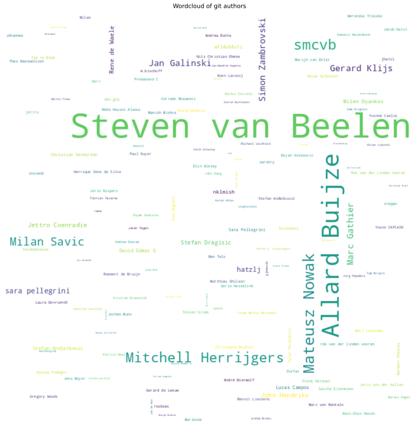

# 📜 Git History Report

## 1. Overview

This report analyses the **git commit history** of the codebase. It covers:

- **Directory commit statistics** — which directories change most frequently and by how many authors
- **Co-changed files** — files that are frequently committed together (coupling signals)
- **File change distribution** — how many files are changed per commit
- **Pairwise changed files** — direct co-change relationships between specific file pairs
- **Data quality** — ambiguous or unresolved file references in the git log
- **Git author wordcloud** — visual overview of contributor activity

> High commit frequency in a directory = refactoring hotspot. Files that always change together = co-location or module consolidation candidates.

## 📚 Table of Contents

1. [Overview](#1-overview)
1. [Directory Commit Statistics](#2-directory-commit-statistics)
1. [Co-Changed Files](#3-co-changed-files)
1. [File Change Distribution](#4-file-change-distribution)
1. [Pairwise Changed Files](#5-pairwise-changed-files)
1. [Files by Author](#6-files-by-author)
1. [Data Quality](#7-data-quality)
1. [Git Author Wordcloud](#8-git-author-wordcloud)
1. [Glossary and Column Definitions](#9-glossary-and-column-definitions)

---

## 2. Directory Commit Statistics

Commit frequency and author count per directory. High values = active, potentially complex.

### 2.1 Directory Commit Statistics (Table)

| directoryPath | directoryName | directoryParentPath | directoryParentName | mainAuthor | secondAuthor | thirdAuthor | authorCount | fileCount | commitCount | lastCreationDate | lastModificationDate | lastCommitDate | daysSinceLastCommit | daysSinceLastCreation | daysSinceLastModification | maxCommitSha | maxFileRelativePath | directoryPathLength | combinedDirectoriesCount |
| --- | --- | --- | --- | --- | --- | --- | --- | --- | --- | --- | --- | --- | --- | --- | --- | --- | --- | --- | --- |
| AxonFramework-5.1.2 | AxonFramework-5.1.2 |  |  | Steven van Beelen | Allard Buijze | Mateusz Nowak | 117 | 3130 | 6726 | 2026-06-23 | 2026-06-23 | 2026-06-23 | 20 | 19 | 19 | fff5f9f26176f13bcd2824e006f71d61da2ac8b1 | AxonFramework-5.1.2/update/src/test/resources/META-INF/maven/org.axonframework/axon-modelling/pom.properties | 1 | 1 |
| AxonFramework-5.1.2/.claude | .claude | AxonFramework-5.1.2 | AxonFramework-5.1.2 | Mateusz Nowak | Steven van Beelen | Jan Galinski | 5 | 5 | 14 | 2026-02-19 | 2026-02-24 | 2026-03-23 | 112 | 144 | 138 | f86e96cf1f82bb61b9c269c928ea1afba539c052 | AxonFramework-5.1.2/.claude/skills/issue-from-notes/references/examples.md | 2 | 1 |
| AxonFramework-5.1.2/.claude/rules | rules | AxonFramework-5.1.2/.claude | .claude | Mateusz Nowak | Steven van Beelen | Jan Galinski | 5 | 2 | 9 | 2026-02-19 | 2026-02-19 | 2026-03-23 | 112 | 144 | 144 | f86e96cf1f82bb61b9c269c928ea1afba539c052 | AxonFramework-5.1.2/.claude/rules/type-safety.md | 3 | 1 |
| AxonFramework-5.1.2/.claude/skills/issue-from-notes | skills/issue-from-notes | AxonFramework-5.1.2/.claude | .claude | Steven van Beelen | Mateusz Nowak | Jan Galinski | 5 | 2 | 11 | 2026-02-16 | 2026-02-24 | 2026-03-23 | 112 | 146 | 138 | f86e96cf1f82bb61b9c269c928ea1afba539c052 | AxonFramework-5.1.2/.claude/skills/issue-from-notes/references/examples.md | 4 | 2 |
| AxonFramework-5.1.2/.claude/skills/issue-from-notes/references | references | AxonFramework-5.1.2/.claude/skills/issue-from-notes | issue-from-notes | Steven van Beelen | Mateusz Nowak | Jan Galinski | 5 | 1 | 8 | 2026-02-16 | 2026-02-16 | 2026-03-23 | 112 | 146 | 146 | f86e96cf1f82bb61b9c269c928ea1afba539c052 | AxonFramework-5.1.2/.claude/skills/issue-from-notes/references/examples.md | 5 | 1 |
| AxonFramework-5.1.2/.github | .github | AxonFramework-5.1.2 | AxonFramework-5.1.2 | Steven van Beelen | dependabot[bot] | Mitchell Herrijgers | 31 | 16 | 790 | 2025-12-01 | 2026-04-28 | 2026-04-28 | 76 | 223 | 75 | ffe75820f3cb4bb5d167941acb0f05e2c801c30c | AxonFramework-5.1.2/.github/workflows/slack-release-notification.yml | 2 | 1 |
| AxonFramework-5.1.2/.github/ISSUE_TEMPLATE | ISSUE_TEMPLATE | AxonFramework-5.1.2/.github | .github | Steven van Beelen | Mitchell Herrijgers | Allard Buijze | 7 | 4 | 61 | 2025-08-13 | 2026-02-23 | 2026-02-23 | 140 | 333 | 139 | fa509a0b37d60e0d49b0a95686836dc59e5dc146 | AxonFramework-5.1.2/.github/ISSUE_TEMPLATE/4_documentation_change.md | 3 | 1 |
| AxonFramework-5.1.2/.github/workflows | workflows | AxonFramework-5.1.2/.github | .github | Steven van Beelen | dependabot[bot] | Mitchell Herrijgers | 31 | 8 | 759 | 2025-12-01 | 2026-04-28 | 2026-04-28 | 76 | 223 | 75 | ffe75820f3cb4bb5d167941acb0f05e2c801c30c | AxonFramework-5.1.2/.github/workflows/slack-release-notification.yml | 3 | 1 |
| AxonFramework-5.1.2/.idea | .idea | AxonFramework-5.1.2 | AxonFramework-5.1.2 | Steven van Beelen | Mitchell Herrijgers | Allard Buijze | 6 | 4 | 68 | 2025-12-16 | 2025-12-16 | 2026-02-23 | 140 | 208 | 208 | fe926a4970bdf1e538e8e7fb8d147ffdc676e713 | AxonFramework-5.1.2/.idea/inspectionProfiles/Project_Default.xml | 2 | 1 |
| AxonFramework-5.1.2/.idea/copyright | copyright | AxonFramework-5.1.2/.idea | .idea | Steven van Beelen | Allard Buijze | Jan Galinski | 3 | 1 | 28 | 2025-01-09 | 2025-01-09 | 2026-02-23 | 140 | 549 | 549 | fe926a4970bdf1e538e8e7fb8d147ffdc676e713 | AxonFramework-5.1.2/.idea/copyright/Axon_Framework_copyright_template.xml | 3 | 1 |

[Full data](./List_git_file_directories_with_commit_statistics.csv)

### 2.2 Directory Commit Statistics (Charts)

---

## 3. Co-Changed Files

Files committed together = logical coupling signal. May belong to the same conceptual unit or share a concern.

### 3.1 Co-Changed File Pairs

| firstFile | secondFile | commitCount |
| --- | --- | --- |
| AxonFramework-5.1.2/.github/workflows/main.yml | AxonFramework-5.1.2/.github/workflows/pullrequest.yml | 362 |
| AxonFramework-5.1.2/eventsourcing/src/test/java/org/axonframework/eventsourcing/eventstore/AggregateBasedStorageEngineTestSuite.java | AxonFramework-5.1.2/eventsourcing/src/test/java/org/axonframework/eventsourcing/eventstore/StorageEngineTestSuite.java | 146 |
| AxonFramework-5.1.2/eventsourcing/src/test/java/org/axonframework/eventsourcing/eventstore/AggregateBasedStorageEngineTestSuite.java | AxonFramework-5.1.2/eventsourcing/src/main/java/org/axonframework/eventsourcing/eventstore/jpa/AggregateBasedJpaEventStorageEngine.java | 146 |
| AxonFramework-5.1.2/eventsourcing/src/main/java/org/axonframework/eventsourcing/eventstore/jpa/AggregateBasedJpaEventStorageEngine.java | AxonFramework-5.1.2/eventsourcing/src/test/java/org/axonframework/eventsourcing/eventstore/StorageEngineTestSuite.java | 115 |
| AxonFramework-5.1.2/eventsourcing/src/test/java/org/axonframework/eventsourcing/eventstore/DefaultEventStoreTransactionTest.java | AxonFramework-5.1.2/eventsourcing/src/test/java/org/axonframework/eventsourcing/eventstore/StorageEngineTestSuite.java | 96 |
| AxonFramework-5.1.2/eventsourcing/src/test/java/org/axonframework/eventsourcing/eventstore/AggregateBasedStorageEngineTestSuite.java | AxonFramework-5.1.2/eventsourcing/src/test/java/org/axonframework/eventsourcing/eventstore/DefaultEventStoreTransactionTest.java | 94 |
| AxonFramework-5.1.2/eventsourcing/src/main/java/org/axonframework/eventsourcing/eventstore/DefaultEventStoreTransaction.java | AxonFramework-5.1.2/eventsourcing/src/test/java/org/axonframework/eventsourcing/eventstore/StorageEngineTestSuite.java | 82 |
| AxonFramework-5.1.2/.github/workflows/slack-release-notification.yml | AxonFramework-5.1.2/.github/workflows/main.yml | 80 |
| AxonFramework-5.1.2/eventsourcing/src/test/java/org/axonframework/eventsourcing/eventstore/AggregateBasedStorageEngineTestSuite.java | AxonFramework-5.1.2/eventsourcing/src/main/java/org/axonframework/eventsourcing/eventstore/DefaultEventStoreTransaction.java | 78 |
| AxonFramework-5.1.2/eventsourcing/src/test/java/org/axonframework/eventsourcing/eventstore/DefaultEventStoreTransactionTest.java | AxonFramework-5.1.2/eventsourcing/src/test/java/org/axonframework/eventsourcing/eventstore/SimpleEventStoreTest.java | 77 |

### 3.2 Co-Changed File Pairs (All in One Commit)

Files changed together in a single large commit.

| firstFile | secondFile | commitCount |
| --- | --- | --- |
| AxonFramework-5.1.2/.github/workflows/main.yml | AxonFramework-5.1.2/.github/workflows/pullrequest.yml | 425 |
| AxonFramework-5.1.2/eventsourcing/src/main/java/org/axonframework/eventsourcing/eventstore/jpa/AggregateBasedJpaEventStorageEngine.java | AxonFramework-5.1.2/eventsourcing/src/test/java/org/axonframework/eventsourcing/eventstore/AggregateBasedStorageEngineTestSuite.java | 165 |
| AxonFramework-5.1.2/eventsourcing/src/test/java/org/axonframework/eventsourcing/eventstore/AggregateBasedStorageEngineTestSuite.java | AxonFramework-5.1.2/eventsourcing/src/test/java/org/axonframework/eventsourcing/eventstore/StorageEngineTestSuite.java | 160 |
| AxonFramework-5.1.2/eventsourcing/src/main/java/org/axonframework/eventsourcing/eventstore/jpa/AggregateBasedJpaEventStorageEngine.java | AxonFramework-5.1.2/eventsourcing/src/test/java/org/axonframework/eventsourcing/eventstore/StorageEngineTestSuite.java | 126 |
| AxonFramework-5.1.2/eventsourcing/src/test/java/org/axonframework/eventsourcing/eventstore/AggregateBasedStorageEngineTestSuite.java | AxonFramework-5.1.2/eventsourcing/src/test/java/org/axonframework/eventsourcing/eventstore/DefaultEventStoreTransactionTest.java | 104 |
| AxonFramework-5.1.2/eventsourcing/src/test/java/org/axonframework/eventsourcing/eventstore/DefaultEventStoreTransactionTest.java | AxonFramework-5.1.2/eventsourcing/src/test/java/org/axonframework/eventsourcing/eventstore/StorageEngineTestSuite.java | 103 |
| AxonFramework-5.1.2/build/parent/pom.xml | AxonFramework-5.1.2/stash/migration/pom.xml | 90 |
| AxonFramework-5.1.2/eventsourcing/src/test/java/org/axonframework/eventsourcing/eventstore/DefaultEventStoreTransactionTest.java | AxonFramework-5.1.2/eventsourcing/src/test/java/org/axonframework/eventsourcing/eventstore/SimpleEventStoreTest.java | 88 |
| AxonFramework-5.1.2/eventsourcing/src/test/java/org/axonframework/eventsourcing/eventstore/AggregateBasedStorageEngineTestSuite.java | AxonFramework-5.1.2/eventsourcing/src/test/java/org/axonframework/eventsourcing/eventstore/SimpleEventStoreTest.java | 87 |
| AxonFramework-5.1.2/eventsourcing/src/main/java/org/axonframework/eventsourcing/eventstore/DefaultEventStoreTransaction.java | AxonFramework-5.1.2/eventsourcing/src/test/java/org/axonframework/eventsourcing/eventstore/StorageEngineTestSuite.java | 85 |

### 3.3 Co-Changed With a Specific File

Shows all files that were changed together with another particular file.

| filePath | commitCount | coChangeRate | maxLift | avgLift |
| --- | --- | --- | --- | --- |
| AxonFramework-5.1.2/.github/workflows/main.yml | 363 | 0.0008062241391947087 | 4.863543788187372 | 3.0386164531816164 |
| AxonFramework-5.1.2/eventsourcing/src/test/java/org/axonframework/eventsourcing/eventstore/AggregateBasedStorageEngineTestSuite.java | 211 | 0.00035532413644446837 | 4.999885273736864 | 2.8741318007337875 |
| AxonFramework-5.1.2/eventsourcing/src/main/java/org/axonframework/eventsourcing/eventstore/jpa/AggregateBasedJpaEventStorageEngine.java | 166 | 0.00044136376084465324 | 4.557649522313834 | 2.1874183331843313 |
| AxonFramework-5.1.2/.github/workflows/pullrequest.yml | 164 | 0.0005830903790087463 | 4.873469387755102 | 2.0668713380168726 |
| AxonFramework-5.1.2/eventsourcing/src/test/java/org/axonframework/eventsourcing/eventstore/StorageEngineTestSuite.java | 163 | 0.0005928436856691859 | 4.750935604594141 | 2.121441093794808 |
| AxonFramework-5.1.2/eventsourcing/src/main/java/org/axonframework/eventsourcing/eventstore/DefaultEventStoreTransaction.java | 129 | 0.0007865086333040679 | 5.902219670876388 | 3.515020234270677 |
| AxonFramework-5.1.2/eventsourcing/src/test/java/org/axonframework/eventsourcing/eventstore/DefaultEventStoreTransactionTest.java | 127 | 0.0007043659597124856 | 6.235113799745002 | 3.431100522963585 |
| AxonFramework-5.1.2/eventsourcing/src/main/java/org/axonframework/eventsourcing/configuration/EventSourcingConfigurationDefaults.java | 105 | 0.0007346613211309586 | 6.959562841530054 | 2.8754378491408286 |
| AxonFramework-5.1.2/eventsourcing/src/test/java/org/axonframework/eventsourcing/configuration/EventSourcingConfigurerTest.java | 101 | 0.0010816252222150828 | 10.54459817486017 | 4.326164012523497 |
| AxonFramework-5.1.2/.github/workflows/slack-release-notification.yml | 88 | 0.0015042735042735042 | 18.36923076923077 | 5.175146382464961 |

[Full data](./List_git_files_that_were_changed_together_with_another_file.csv)

### 3.4 Co-Changed With a Specific File (All in One)

| filePath | commitCount |
| --- | --- |
| AxonFramework-5.1.2/.github/workflows/pullrequest.yml | 439 |
| AxonFramework-5.1.2/.github/workflows/main.yml | 436 |
| AxonFramework-5.1.2/eventsourcing/src/test/java/org/axonframework/eventsourcing/eventstore/AggregateBasedStorageEngineTestSuite.java | 234 |
| AxonFramework-5.1.2/eventsourcing/src/main/java/org/axonframework/eventsourcing/eventstore/jpa/AggregateBasedJpaEventStorageEngine.java | 203 |
| AxonFramework-5.1.2/eventsourcing/src/test/java/org/axonframework/eventsourcing/eventstore/StorageEngineTestSuite.java | 200 |
| AxonFramework-5.1.2/eventsourcing/src/test/java/org/axonframework/eventsourcing/eventstore/DefaultEventStoreTransactionTest.java | 142 |
| AxonFramework-5.1.2/build/parent/pom.xml | 137 |
| AxonFramework-5.1.2/eventsourcing/src/main/java/org/axonframework/eventsourcing/eventstore/DefaultEventStoreTransaction.java | 135 |
| AxonFramework-5.1.2/eventsourcing/src/test/java/org/axonframework/eventsourcing/eventstore/SimpleEventStoreTest.java | 130 |
| AxonFramework-5.1.2/eventsourcing/src/test/java/org/axonframework/eventsourcing/configuration/EventSourcingConfigurerTest.java | 121 |

### 3.5 Co-Changed Files (Charts)

---

## 4. File Change Distribution

Files changed per commit. High proportion of large commits = low commit granularity.

### 4.1 Files per Commit Distribution

| filesPerCommit | commitCount |
| --- | --- |
| 1 | 6795 |
| 2 | 2786 |
| 3 | 1326 |
| 4 | 865 |
| 5 | 601 |
| 6 | 440 |
| 7 | 345 |
| 8 | 282 |
| 9 | 208 |
| 10 | 195 |

[Full data](./List_git_files_per_commit_distribution.csv)

### 4.2 Files per Commit Chart

---

## 5. Pairwise Changed Files

Commit overlap counts and dependency info between file pairs.

### 5.1 Pairwise Changed Files

| firstFileName | secondFileName | filePairLineBreak | filePairWithRelativePathLineBreak | filePair | filePairWithRelativePath | firstFileExtension | secondFileExtension | fileExtensionPair | updateCommitCount | updateCommitMinConfidence | updateCommitSupport | updateCommitLift | updateCommitJaccardSimilarity |
| --- | --- | --- | --- | --- | --- | --- | --- | --- | --- | --- | --- | --- | --- |
| .gitignore | eventsourcing/src/test/java/org/axonframework/eventsourcing/eventstore/AggregateBasedStorageEngineTestSuite.java |  AggregateBasedStorageEngineTestSuite | .gitignore eventsourcing/src/test/java/org/axonframework/eventsourcing/eventstore/AggregateBasedStorageEngineTestSuite.java | ↔AggregateBasedStorageEngineTestSuite | .gitignore↔eventsourcing/src/test/java/org/axonframework/eventsourcing/eventstore/AggregateBasedStorageEngineTestSuite.java | gitignore | java | gitignore↔java | 4 | 0.031496062992125984 | 0.001340033500837521 | 0.305245935167195 | 0.009280742459396751 |
| docs/reference-guide/modules/ROOT/pages/conversion.adoc | eventsourcing/src/test/java/org/axonframework/eventsourcing/eventstore/AggregateBasedStorageEngineTestSuite.java | conversion AggregateBasedStorageEngineTestSuite | docs/reference-guide/modules/ROOT/pages/conversion.adoc eventsourcing/src/test/java/org/axonframework/eventsourcing/eventstore/AggregateBasedStorageEngineTestSuite.java | conversion↔AggregateBasedStorageEngineTestSuite | docs/reference-guide/modules/ROOT/pages/conversion.adoc↔eventsourcing/src/test/java/org/axonframework/eventsourcing/eventstore/AggregateBasedStorageEngineTestSuite.java | adoc | java | adoc↔java | 4 | 0.09523809523809523 | 0.001340033500837521 | 0.9230055658627088 | 0.011560693641618497 |
| migration/src/main/java/org/axonframework/migration/ConfigureEventSourcedAnnotation.java | migration/src/main/java/org/axonframework/migration/ReplaceAggregateLifecycleApply.java | ConfigureEventSourcedAnnotation ReplaceAggregateLifecycleApply | migration/src/main/java/org/axonframework/migration/ConfigureEventSourcedAnnotation.java migration/src/main/java/org/axonframework/migration/ReplaceAggregateLifecycleApply.java | ConfigureEventSourcedAnnotation↔ReplaceAggregateLifecycleApply | migration/src/main/java/org/axonframework/migration/ConfigureEventSourcedAnnotation.java↔migration/src/main/java/org/axonframework/migration/ReplaceAggregateLifecycleApply.java | java | java | java↔java | 3 | 1 | 0.0010050251256281408 | 746.2499999999999 | 0.75 |
| migration/src/test/java/org/axonframework/migration/Axon4ToAxon5SpringExtensionTest.java | migration/src/main/resources/META-INF/rewrite/axon4-to-axon5-extension-spring.yml | Axon4ToAxon5SpringExtensionTest axon4-to-axon5-extension-spring | migration/src/test/java/org/axonframework/migration/Axon4ToAxon5SpringExtensionTest.java migration/src/main/resources/META-INF/rewrite/axon4-to-axon5-extension-spring.yml | Axon4ToAxon5SpringExtensionTest↔axon4-to-axon5-extension-spring | migration/src/test/java/org/axonframework/migration/Axon4ToAxon5SpringExtensionTest.java↔migration/src/main/resources/META-INF/rewrite/axon4-to-axon5-extension-spring.yml | java | yml | java↔yml | 3 | 0.75 | 0.0010050251256281408 | 373.12499999999994 | 0.42857142857142855 |
| messaging/src/main/java/org/axonframework/messaging/queryhandling/SimpleQueryBus.java | messaging/src/test/java/org/axonframework/messaging/queryhandling/SimpleQueryBusTest.java | SimpleQueryBus SimpleQueryBusTest | messaging/src/main/java/org/axonframework/messaging/queryhandling/SimpleQueryBus.java messaging/src/test/java/org/axonframework/messaging/queryhandling/SimpleQueryBusTest.java | SimpleQueryBus↔SimpleQueryBusTest | messaging/src/main/java/org/axonframework/messaging/queryhandling/SimpleQueryBus.java↔messaging/src/test/java/org/axonframework/messaging/queryhandling/SimpleQueryBusTest.java | java | java | java↔java | 3 | 0.12 | 0.0010050251256281408 | 8.955 | 0.04838709677419355 |
| docs/reference-guide/modules/migration/pages/index.adoc | docs/reference-guide/modules/migration/partials/nav.adoc | index nav | docs/reference-guide/modules/migration/pages/index.adoc docs/reference-guide/modules/migration/partials/nav.adoc | index↔nav | docs/reference-guide/modules/migration/pages/index.adoc↔docs/reference-guide/modules/migration/partials/nav.adoc | adoc | adoc | adoc↔adoc | 7 | 0.28 | 0.0023450586264656616 | 9.391011235955057 | 0.06542056074766354 |
| eventsourcing/src/test/java/org/axonframework/eventsourcing/eventstore/AggregateBasedStorageEngineTestSuite.java | eventsourcing/src/main/java/org/axonframework/eventsourcing/configuration/AnnotatedEventSourcedEntityModule.java | AggregateBasedStorageEngineTestSuite AnnotatedEventSourcedEntityModule | eventsourcing/src/test/java/org/axonframework/eventsourcing/eventstore/AggregateBasedStorageEngineTestSuite.java eventsourcing/src/main/java/org/axonframework/eventsourcing/configuration/AnnotatedEventSourcedEntityModule.java | AggregateBasedStorageEngineTestSuite↔AnnotatedEventSourcedEntityModule | eventsourcing/src/test/java/org/axonframework/eventsourcing/eventstore/AggregateBasedStorageEngineTestSuite.java↔eventsourcing/src/main/java/org/axonframework/eventsourcing/configuration/AnnotatedEventSourcedEntityModule.java | java | java | java↔java | 9 | 0.09375 | 0.003015075376884422 | 0.9085836038961038 | 0.02278481012658228 |
| eventsourcing/src/main/java/org/axonframework/eventsourcing/configuration/AnnotatedEventSourcedEntityModule.java | eventsourcing/src/test/java/org/axonframework/eventsourcing/configuration/AnnotatedEventSourcedEntityModuleTest.java | AnnotatedEventSourcedEntityModule AnnotatedEventSourcedEntityModuleTest | eventsourcing/src/main/java/org/axonframework/eventsourcing/configuration/AnnotatedEventSourcedEntityModule.java eventsourcing/src/test/java/org/axonframework/eventsourcing/configuration/AnnotatedEventSourcedEntityModuleTest.java | AnnotatedEventSourcedEntityModule↔AnnotatedEventSourcedEntityModuleTest | eventsourcing/src/main/java/org/axonframework/eventsourcing/configuration/AnnotatedEventSourcedEntityModule.java↔eventsourcing/src/test/java/org/axonframework/eventsourcing/configuration/AnnotatedEventSourcedEntityModuleTest.java | java | java | java↔java | 12 | 0.13043478260869565 | 0.004020100502512563 | 4.055706521739131 | 0.06818181818181818 |
| docs/reference-guide/modules/migration/pages/index.adoc | docs/reference-guide/modules/migration/pages/paths/messages.adoc | index messages | docs/reference-guide/modules/migration/pages/index.adoc docs/reference-guide/modules/migration/pages/paths/messages.adoc | index↔messages | docs/reference-guide/modules/migration/pages/index.adoc↔docs/reference-guide/modules/migration/pages/paths/messages.adoc | adoc | adoc | adoc↔adoc | 4 | 0.16 | 0.001340033500837521 | 15.920000000000002 | 0.0784313725490196 |
| docs/reference-guide/modules/migration/partials/nav.adoc | docs/reference-guide/modules/migration/pages/paths/messages.adoc | nav messages | docs/reference-guide/modules/migration/partials/nav.adoc docs/reference-guide/modules/migration/pages/paths/messages.adoc | nav↔messages | docs/reference-guide/modules/migration/partials/nav.adoc↔docs/reference-guide/modules/migration/pages/paths/messages.adoc | adoc | adoc | adoc↔adoc | 7 | 0.23333333333333334 | 0.0023450586264656616 | 7.825842696629214 | 0.0625 |

[Full data](./List_pairwise_changed_files.csv)

### 5.2 Pairwise Changed Files (Top by Lift)

File pairs that co-change more often than random chance (lift > 1).

| fileExtensionPair | firstFileNameShort | secondFileNameShort | updateCommitCount | updateCommitMinConfidence | updateCommitLift | updateCommitJaccardSimilarity | updateCommitSupport | firstFileName | secondFileName |
| --- | --- | --- | --- | --- | --- | --- | --- | --- | --- |
| java↔java | NoOpSequencingPolicy | RoutingKeySequencingPolicy | 3 | 1 | 994.9999999999999 | 1 | 0.0010050251256281408 | messaging/src/main/java/org/axonframework/messaging/core/sequencing/NoOpSequencingPolicy.java | messaging/src/main/java/org/axonframework/messaging/core/sequencing/RoutingKeySequencingPolicy.java |
| java↔java | NoOpSequencingPolicy | FullConcurrencyPolicyTest | 3 | 1 | 994.9999999999999 | 1 | 0.0010050251256281408 | messaging/src/main/java/org/axonframework/messaging/core/sequencing/NoOpSequencingPolicy.java | messaging/src/test/java/org/axonframework/messaging/core/sequencing/FullConcurrencyPolicyTest.java |
| java↔java | NoOpSequencingPolicy | RoutingKeySequencingPolicyTest | 3 | 1 | 994.9999999999999 | 1 | 0.0010050251256281408 | messaging/src/main/java/org/axonframework/messaging/core/sequencing/NoOpSequencingPolicy.java | messaging/src/test/java/org/axonframework/messaging/core/sequencing/RoutingKeySequencingPolicyTest.java |
| java↔java | NoOpSequencingPolicy | SequentialPolicyTest | 3 | 1 | 994.9999999999999 | 1 | 0.0010050251256281408 | messaging/src/main/java/org/axonframework/messaging/core/sequencing/NoOpSequencingPolicy.java | messaging/src/test/java/org/axonframework/messaging/core/sequencing/SequentialPolicyTest.java |
| java↔java | RoutingKeySequencingPolicy | FullConcurrencyPolicyTest | 3 | 1 | 994.9999999999999 | 1 | 0.0010050251256281408 | messaging/src/main/java/org/axonframework/messaging/core/sequencing/RoutingKeySequencingPolicy.java | messaging/src/test/java/org/axonframework/messaging/core/sequencing/FullConcurrencyPolicyTest.java |
| java↔java | RoutingKeySequencingPolicy | RoutingKeySequencingPolicyTest | 3 | 1 | 994.9999999999999 | 1 | 0.0010050251256281408 | messaging/src/main/java/org/axonframework/messaging/core/sequencing/RoutingKeySequencingPolicy.java | messaging/src/test/java/org/axonframework/messaging/core/sequencing/RoutingKeySequencingPolicyTest.java |
| java↔java | RoutingKeySequencingPolicy | SequentialPolicyTest | 3 | 1 | 994.9999999999999 | 1 | 0.0010050251256281408 | messaging/src/main/java/org/axonframework/messaging/core/sequencing/RoutingKeySequencingPolicy.java | messaging/src/test/java/org/axonframework/messaging/core/sequencing/SequentialPolicyTest.java |
| java↔java | FullConcurrencyPolicyTest | RoutingKeySequencingPolicyTest | 3 | 1 | 994.9999999999999 | 1 | 0.0010050251256281408 | messaging/src/test/java/org/axonframework/messaging/core/sequencing/FullConcurrencyPolicyTest.java | messaging/src/test/java/org/axonframework/messaging/core/sequencing/RoutingKeySequencingPolicyTest.java |
| java↔java | FullConcurrencyPolicyTest | SequentialPolicyTest | 3 | 1 | 994.9999999999999 | 1 | 0.0010050251256281408 | messaging/src/test/java/org/axonframework/messaging/core/sequencing/FullConcurrencyPolicyTest.java | messaging/src/test/java/org/axonframework/messaging/core/sequencing/SequentialPolicyTest.java |
| java↔java | RoutingKeySequencingPolicyTest | SequentialPolicyTest | 3 | 1 | 994.9999999999999 | 1 | 0.0010050251256281408 | messaging/src/test/java/org/axonframework/messaging/core/sequencing/RoutingKeySequencingPolicyTest.java | messaging/src/test/java/org/axonframework/messaging/core/sequencing/SequentialPolicyTest.java |

[Full data](./List_pairwise_changed_files_top_lift.csv)

### 5.3 Pairwise Changed Files With Dependencies

Files that are co-changed and also have a structural dependency relationship between them.

| dependencyWeight | fileDistance | commitCount | updateCommitMinConfidence | updateCommitSupport | updateCommitLift | updateCommitJaccardSimilarity |
| --- | --- | --- | --- | --- | --- | --- |
| 1 | 2 | 3 | 0.12 | 0.0010050251256281408 | 6.758490566037737 | 0.04 |
| 1 | 2 | 3 | 0.21428571428571427 | 0.0010050251256281408 | 8.200549450549453 | 0.033707865168539325 |
| 1 | 2 | 3 | 0.25 | 0.0010050251256281408 | 9.567307692307692 | 0.034482758620689655 |
| 1 | 0 | 4 | 0.12121212121212122 | 0.001340033500837521 | 9.778869778869778 | 0.06060606060606061 |
| 1 | 0 | 4 | 0.09090909090909091 | 0.001340033500837521 | 6.167355371900827 | 0.047619047619047616 |
| 1 | 0 | 5 | 0.11363636363636363 | 0.0016750418760469012 | 7.374011857707511 | 0.058823529411764705 |
| 1 | 2 | 5 | 0.13157894736842105 | 0.0016750418760469012 | 9.819078947368421 | 0.0684931506849315 |
| 1 | 0 | 6 | 0.2 | 0.0020100502512562816 | 16.135135135135137 | 0.09836065573770492 |
| 1 | 0 | 6 | 0.1875 | 0.0020100502512562816 | 14.728618421052632 | 0.09375 |
| 1 | 0 | 6 | 0.08955223880597014 | 0.0020100502512562816 | 2.2847301951779566 | 0.033707865168539325 |

[Full data](./List_pairwise_changed_files_with_dependencies.csv)

### 5.4 Pairwise Changed Files (Charts)

---

## 6. Files by Author

Per-author file commit stats. Useful for knowledge boundaries and bus-factor risk.

### 6.1 Files with Commit Statistics by Author

| filePath | author | commitCount | commitHashes | lastCommitDate | lastCreationDate | lastModificationDate | daysSinceLastCommit | daysSinceLastCreation | daysSinceLastModification | maxCommitSha |
| --- | --- | --- | --- | --- | --- | --- | --- | --- | --- | --- |
| AxonFramework-5.1.2/.claude/.mcp.json | Steven van Beelen | 3 | ["0d8494935f3df632c2f51767b80f3624b5d8ac14","5066f797b0ded94ff826b40752e4affd0f88f7dd","f86e96cf1f82bb61b9c269c928ea1afba539c052"] | 2026-03-23 | 2026-02-16 | 2026-02-16 | 112 | 146 | 146 | f86e96cf1f82bb61b9c269c928ea1afba539c052 |
| AxonFramework-5.1.2/.claude/.mcp.json | Mateusz Nowak | 2 | ["56bd673b907885495d8442ffbea9a5d2e4b6c5f5","99bdfbc6fd46aea88993c080da524a14afcff9da"] | 2026-02-16 | 2026-02-16 | 2026-02-16 | 147 | 146 | 146 | 99bdfbc6fd46aea88993c080da524a14afcff9da |
| AxonFramework-5.1.2/.claude/.mcp.json | Jan Galinski | 1 | ["be2d983a48bccdd3830d0d967e21cf5173a9c83b"] | 2026-02-19 | 2026-02-16 | 2026-02-16 | 144 | 146 | 146 | be2d983a48bccdd3830d0d967e21cf5173a9c83b |
| AxonFramework-5.1.2/.claude/.mcp.json | John Hendrikx | 1 | ["346c595d30b9744f3c62e68e2ae0410ef66ba4a2"] | 2026-03-11 | 2026-02-16 | 2026-02-16 | 124 | 146 | 146 | 346c595d30b9744f3c62e68e2ae0410ef66ba4a2 |
| AxonFramework-5.1.2/.claude/.mcp.json | hatzlj | 1 | ["28ead9298f9202653d199ccc5c96d9d6e176646f"] | 2026-03-20 | 2026-02-16 | 2026-02-16 | 115 | 146 | 146 | 28ead9298f9202653d199ccc5c96d9d6e176646f |
| AxonFramework-5.1.2/.claude/rules/completablefuture-blocking.md | Steven van Beelen | 3 | ["0d8494935f3df632c2f51767b80f3624b5d8ac14","5066f797b0ded94ff826b40752e4affd0f88f7dd","f86e96cf1f82bb61b9c269c928ea1afba539c052"] | 2026-03-23 | 2026-02-19 | 2026-02-19 | 112 | 144 | 144 | f86e96cf1f82bb61b9c269c928ea1afba539c052 |
| AxonFramework-5.1.2/.claude/rules/completablefuture-blocking.md | Mateusz Nowak | 2 | ["b5e771cf5a3bc0c91adcff8aa469393626f60f6f","534620c2aea7e5a5864d7d9bb59ecc9c866379a7"] | 2026-02-19 | 2026-02-19 | 2026-02-19 | 144 | 144 | 144 | b5e771cf5a3bc0c91adcff8aa469393626f60f6f |
| AxonFramework-5.1.2/.claude/rules/completablefuture-blocking.md | Jan Galinski | 1 | ["8a7cfbddb3ca69a62e0fd88926fce6d014c42ac4"] | 2026-02-24 | 2026-02-19 | 2026-02-19 | 139 | 144 | 144 | 8a7cfbddb3ca69a62e0fd88926fce6d014c42ac4 |
| AxonFramework-5.1.2/.claude/rules/completablefuture-blocking.md | John Hendrikx | 1 | ["346c595d30b9744f3c62e68e2ae0410ef66ba4a2"] | 2026-03-11 | 2026-02-19 | 2026-02-19 | 124 | 144 | 144 | 346c595d30b9744f3c62e68e2ae0410ef66ba4a2 |
| AxonFramework-5.1.2/.claude/rules/completablefuture-blocking.md | hatzlj | 1 | ["28ead9298f9202653d199ccc5c96d9d6e176646f"] | 2026-03-20 | 2026-02-19 | 2026-02-19 | 115 | 144 | 144 | 28ead9298f9202653d199ccc5c96d9d6e176646f |

[Full data](./List_git_files_with_commit_statistics_by_author.csv)

---

## 7. Data Quality

Files in git log that are unresolved (not found in codebase) or ambiguous (multiple matches). Affects reliability of co-change metrics.

### 7.1 File Resolution Summary

Resolved vs. ambiguous vs. unresolved files by extension.

| resolved | extension | gitFileCount | fileLabels | gitFileExamples |
| --- | --- | --- | --- | --- |
| false | java | 14035 | ["File","Git"] | ["eventsourcing/src/test/java/org/axonframework/eventsourcing/eventstore/AggregateBasedStorageEngineTestSuite.java","migration/src/main/java/org/axonframework/migration/AddCommandAnnotation.java","migration/src/main/java/org/axonframework/migration/AnnotateProgrammaticSequencingPolicyRegistration.java","migration/src/main/java/org/axonframework/migration/ConfigureEventSourcedAnnotation.java","migration/src/main/java/org/axonframework/migration/MigrateMessageInterceptorLambda.java","migration/src/main/java/org/axonframework/migration/ReplaceAggregateLifecycleApply.java","migration/src/test/java/org/axonframework/migration/AddCommandAnnotationJavaRecordTest.java","migration/src/test/java/org/axonframework/migration/AddCommandAnnotationKotlinTest.java","migration/src/test/java/org/axonframework/migration/AnnotateProgrammaticSequencingPolicyRegistrationTest.java"] |
| false | xml | 521 | ["File","Git"] | ["pom.xml","migration/pom.xml","build/parent/pom.xml","extensions/spring/spring-boot-autoconfigure/pom.xml","examples/pom.xml","extensions/kotlin/kotlin-test/pom.xml","extensions/kotlin/kotlin/pom.xml","extensions/kotlin/pom.xml","extensions/pom.xml"] |
| false | adoc | 503 | ["File","Git"] | ["docs/reference-guide/modules/release-notes/pages/minor-releases.adoc","docs/reference-guide/modules/migration/pages/index.adoc","docs/reference-guide/modules/migration/pages/openrewrite-code-conversion.adoc","docs/reference-guide/modules/migration/partials/nav.adoc","docs/reference-guide/modules/ROOT/pages/index.adoc","docs/reference-guide/modules/ROOT/partials/nav.adoc","docs/reference-guide/modules/migration/pages/paths/snapshotting.adoc","docs/reference-guide/modules/tuning/pages/snapshotting.adoc","docs/reference-guide/modules/migration/pages/paths/aggregates/event-tagging.adoc"] |
| false | png | 199 | ["File","Git"] | ["examples/university-demo-kotlin/docs/images/AxonServer_DCBContext_Creation.png","examples/university-demo-kotlin/docs/images/EventModeling_GWT_SubscribeStudent.png","examples/university-demo-kotlin/docs/images/FacultyContext_EventModeling.png","docs/reference-guide/modules/commands/images/distributed-command-bus.png","docs/getting-started/modules/ROOT/images/AxonServer_DCBContext_Creation.png","docs/af5-getting-started/modules/ROOT/images/AxonServer_DCBContext_Creation.png","docs/af5-getting-started/modules/ROOT/images/AxonServer_DCBEvents_Search.png","docs/getting-started/modules/ROOT/images/AxonServer_DCBEvents_Search.png","docs/getting-started/modules/ROOT/images/EventModeling_CreateCourse_Done.png"] |
| false | properties | 160 | ["File","Git"] | ["migration/src/test/resources/migration-versions.properties","examples/university-demo-kotlin/src/test/resources/application.properties","extensions/spring/spring-boot-autoconfigure/src/test/resources/application-custom.properties","extensions/spring/spring-boot-autoconfigure/src/test/resources/log4j2.properties","extensions/spring/spring-boot-autoconfigure/src/test/resources/test.jgroups.application.properties","extensions/spring/spring-boot-autoconfigure/src/test/resources/test.metrics.application.properties","extensions/spring/spring-boot-autoconfigure/src/test/resources/test.springcloud.application.properties","integrationtests/src/test/resources/log4j2.properties","axon-server-connector/src/test/resources/junit-platform.properties"] |
| false | xsl | 160 | ["File","Git"] | ["documentation/src/main/docbook/styles/docbook/VERSION.xsl","documentation/src/main/docbook/styles/docbook/common/autoidx-kimber.xsl","documentation/src/main/docbook/styles/docbook/common/autoidx-kosek.xsl","documentation/src/main/docbook/styles/docbook/common/common.xsl","documentation/src/main/docbook/styles/docbook/common/charmap.xsl","documentation/src/main/docbook/styles/docbook/common/gentext.xsl","documentation/src/main/docbook/styles/docbook/common/insertfile.xsl","documentation/src/main/docbook/styles/docbook/common/l10n.xsl","documentation/src/main/docbook/styles/docbook/common/labels.xsl"] |
| false | as | 97 | ["File","Git"] | ["sample/addressbook/flex-ui/swf/src/main/flex/org/axonframework/examples/addressbook/commands/RegisterAddressCommand.as","sample/addressbook/flex-ui/swf/src/main/flex/org/axonframework/examples/addressbook/commands/RemoveAddressCommand.as","sample/addressbook/flex-ui/swf/src/main/flex/org/axonframework/examples/addressbook/commands/RemoveContactCommand.as","sample/addressbook/flex-ui/swf/src/main/flex/org/axonframework/examples/addressbook/NotificationImagesCollection.as","sample/addressbook/flex-ui/swf/src/main/flex/org/axonframework/examples/addressbook/commands/ChangeContactNameCommand.as","sample/addressbook/flex-ui/swf/src/main/flex/org/axonframework/examples/addressbook/commands/CreateContactCommand.as","sample/addressbook/flex-ui/swf/src/main/flex/org/axonframework/examples/addressbook/controllers/RemoveAddressController.as","sample/addressbook/flex-ui/swf/src/main/flex/org/axonframework/examples/addressbook/controllers/RemoveContactController.as","sample/addressbook/flex-ui/swf/src/main/flex/org/axonframework/examples/addressbook/controllers/RemovedItemController.as"] |
| false | yml | 93 | ["File","Git"] | ["migration/src/main/resources/META-INF/rewrite/axon4-to-axon5-messaging.yml","migration/src/main/resources/META-INF/rewrite/axon4-to-axon5-extension-spring.yml","migration/src/main/resources/META-INF/rewrite/axon4-to-axon5-bom.yml","migration/src/main/resources/META-INF/rewrite/axon4-to-axon5-common.yml","migration/src/main/resources/META-INF/rewrite/axon4-to-axon5-conversion.yml","migration/src/main/resources/META-INF/rewrite/axon4-to-axon5-eventsourcing.yml","migration/src/main/resources/META-INF/rewrite/axon4-to-axon5-extension-amqp.yml","migration/src/main/resources/META-INF/rewrite/axon4-to-axon5-extension-cdi.yml","migration/src/main/resources/META-INF/rewrite/axon4-to-axon5-extension-jgroups.yml"] |
| false | md | 71 | ["File","Git"] | ["migration/README.md","docs/changes-to-process.md","CLAUDE.md","axon-5/api-changes.md","axon-5/api-changes/01-overview-and-dependencies.md","axon-5/api-changes/02-processing-context.md","axon-5/api-changes/03-messages-and-stream.md","axon-5/api-changes/04-commands.md","axon-5/api-changes/05-event-store-and-processors.md"] |
| false | svg | 65 | ["File","Git"] | [".idea/icon.svg","documentation/src/main/resources/images/callouts/11.svg","documentation/src/main/resources/images/callouts/12.svg","documentation/src/main/resources/images/callouts/1.svg","documentation/src/main/resources/images/callouts/10.svg","documentation/src/main/resources/images/callouts/15.svg","documentation/src/main/resources/images/callouts/16.svg","documentation/src/main/resources/images/callouts/17.svg","documentation/src/main/resources/images/callouts/13.svg"] |

[Full data](./List_git_files_by_resolved_label_and_extension.csv)

### 7.2 Ambiguous Git Files

Match multiple codebase files — excluded from co-change analysis.

⚠️ _No data available — git history not imported for this codebase._

### 7.3 Unresolved Git Files

Not found in scanned codebase. May indicate deleted files, renames, or out-of-scope paths.

| codeFileExtension | firstThreeCodeFileLabels | codeFileCount | codeFileExamples |
| --- | --- | --- | --- |
| jar | ["File","Artifact"] | 11 | ["/axon-server-connector-5.1.2.jar","/axon-eventsourcing-5.1.2.jar","/axon-conversion-5.1.2.jar","/axon-update-5.1.2.jar","/axon-modelling-5.1.2.jar","/axoniq-spring-boot-autoconfigure-5.1.2.jar"] |
| MF | ["File","Java"] | 1 | ["/META-INF/MANIFEST.MF"] |
| class | ["Type","File"] | 1095 | ["/io/axoniq/framework/axonserver/connector/shared/ExceptionFactory.class","/io/axoniq/framework/axonserver/connector/shared/ExceptionFactory$1.class","/io/axoniq/framework/axonserver/connector/shared/ExceptionConverter.class","/io/axoniq/framework/axonserver/connector/shared/MetadataConverter.class","/io/axoniq/framework/axonserver/connector/shared/MetadataConverter$1.class","/io/axoniq/framework/axonserver/connector/shared/GrpcExceptionParser.class"] |
| xml | ["File","Xml"] | 11 | ["/META-INF/maven/io.axoniq.framework/axon-server-connector/pom.xml","/META-INF/maven/org.axonframework/axon-eventsourcing/pom.xml","/META-INF/maven/org.axonframework/axon-conversion/pom.xml","/META-INF/maven/org.axonframework/axon-update/pom.xml","/META-INF/maven/org.axonframework/axon-modelling/pom.xml","/META-INF/maven/io.axoniq.framework/axoniq-spring-boot-autoconfigure/pom.xml"] |
| properties | ["File","Java"] | 10 | ["/META-INF/maven/io.axoniq.framework/axon-server-connector/pom.properties","/META-INF/maven/org.axonframework/axon-eventsourcing/pom.properties","/META-INF/maven/org.axonframework/axon-conversion/pom.properties","/META-INF/maven/org.axonframework/axon-update/pom.properties","/META-INF/maven/io.axoniq.framework/axoniq-spring-boot-autoconfigure/pom.properties","/META-INF/maven/org.axonframework.extensions.tracing/axon-tracing-opentelemetry/pom.properties"] |

[Full data](./List_unresolved_git_files.csv)

---

## 8. Git Author Wordcloud

Visual overview of contributor names by commit frequency. Larger text = more commits.

---

## 9. Glossary and Column Definitions

| Term | Definition |
|------|------------|
| `commits` | Number of git commits touching this file or directory. |
| `authors` | Number of distinct author identities contributing to this file or directory. |
| `coChanges` | Number of commits in which two files were changed together. |
| `coupling` | Ratio of co-changes to total commits (0–1). Higher = tighter logical coupling. |
| `coChangedWith` | The other file in a co-change pair. |
| `ambiguous` | A git file path that matches more than one node in the scanned codebase. |
| `unresolved` | A git file path that matches no node in the scanned codebase. |
| `filesPerCommit` | How many files were changed in a single commit. |
| `frequency` | Relative share of commits at a specific `filesPerCommit` count. |
