# 🔗 Internal Dependencies Report

## 1. Executive Overview

Analyzes internal dependencies: packages, artifacts, modules, NPM packages within codebase.

**Topics**:

- **Internal structure** — interface segregation, widely used types, and usage ratios between modules
- **Path finding** — shortest and longest path distributions revealing dependency chain depth and complexity
- **Topological sort** — build ordering derived from the acyclic view of the dependency graph

> Cyclic analysis is in `cyclic-dependencies` domain. Rows sorted by priority (highest first).

## 📚 Table of Contents

1. [Executive Overview](#1-executive-overview)
1. [Java Internal Structure](#2-java-internal-structure)
1. [TypeScript Internal Structure](#3-typescript-internal-structure)
1. [Path Finding](#4-path-finding)
1. [Topological Sort](#5-topological-sort)
1. [Graph Visualizations](#6-graph-visualizations)
1. [Glossary and Column Definitions](#7-glossary-and-column-definitions)
1. [Object Oriented Design Metrics](#8-object-oriented-design-metrics)
1. [Visibility Metrics](#9-visibility-metrics)
1. [Code Vocabulary](#10-code-vocabulary)

---

## 2. Java Internal Structure

### 2.1 Java Artifact Listing

Artifacts by size and connectivity. High incoming = shared library; high outgoing = aggregator/app-level.

| artifactName | packages | types | incomingDependencies | outgoingDependencies |
| --- | --- | --- | --- | --- |
| axon-messaging-5.1.2.jar | 57 | 633 | 7 | 2 |
| axon-common-5.1.2.jar | 15 | 175 | 10 | 0 |
| axon-eventsourcing-5.1.2.jar | 11 | 130 | 2 | 4 |
| axon-server-connector-5.1.2.jar | 10 | 79 | 1 | 5 |
| axon-modelling-5.1.2.jar | 7 | 99 | 2 | 3 |
| axon-test-5.1.2.jar | 5 | 79 | 0 | 3 |
| axon-conversion-5.1.2.jar | 5 | 41 | 5 | 1 |
| axon-update-5.1.2.jar | 5 | 28 | 0 | 1 |
| axoniq-spring-boot-autoconfigure-5.1.2.jar | 5 | 26 | 0 | 4 |
| axon-metrics-micrometer-5.1.2.jar | 3 | 19 | 0 | 2 |

[Full data](./Java_Artifact/List_all_Java_artifacts.csv)

### 2.2 Interface Segregation Principle Candidates

ISP (Robert C. Martin): Interfaces declaring many methods but callers use only a subset — extract focused sub-interfaces.

`usageRatio` (lower = stronger candidate), `callerCount` (high + low ratio = higher priority). `exampleCalledMethods` shows methods to extract.

| fullQualifiedTypeName | declaredMethodCount | distinctCalledMethodCount | usageRatio | callerCount | exampleCalledMethods |
| --- | --- | --- | --- | --- | --- |
| org.axonframework.messaging.core.unitofwork.ProcessingContext | 32 | 1 | 0.03 | 7 | ["computeResourceIfAbsent"] |
| org.axonframework.messaging.core.MessageStream$Entry | 7 | 1 | 0.14 | 7 | ["message"] |
| org.axonframework.messaging.commandhandling.CommandBus | 6 | 1 | 0.17 | 7 | ["dispatch"] |
| org.axonframework.messaging.core.unitofwork.ProcessingContext | 32 | 1 | 0.03 | 5 | ["withResource"] |
| org.axonframework.common.configuration.ComponentDefinition$ComponentCreator | 17 | 1 | 0.06 | 5 | ["createComponent"] |
| org.axonframework.messaging.eventhandling.EventMessage | 19 | 2 | 0.11 | 4 | ["timestamp","identifier"] |
| org.axonframework.messaging.eventhandling.EventMessage | 19 | 1 | 0.05 | 4 | ["timestamp"] |
| org.axonframework.messaging.core.MessageStream$Empty | 45 | 1 | 0.02 | 3 | ["cast"] |
| org.axonframework.messaging.eventhandling.EventMessage | 19 | 1 | 0.05 | 3 | ["andMetadata"] |
| org.axonframework.messaging.eventhandling.EventMessage | 19 | 1 | 0.05 | 3 | ["identifier"] |

[Full data](./Java_Package/InterfaceSegregationCandidates.csv)

### 2.3 Widely Used Java Types

Types used by most packages (high ripple risk on changes). Sorted by usage count descending.

| fullQualifiedDependentTypeName | dependentTypeName | dependentTypeLabel | numberOfUsingPackages |
| --- | --- | --- | --- |
| org.axonframework.messaging.core.unitofwork.ProcessingContext | ProcessingContext | Interface InternalJavaType | 59 |
| org.axonframework.common.annotation.Internal | Internal | Annotation InternalJavaType | 58 |
| org.axonframework.common.infra.ComponentDescriptor | ComponentDescriptor | Interface InternalJavaType | 45 |
| org.axonframework.messaging.core.Message | Message | Interface InternalJavaType | 45 |
| org.axonframework.messaging.eventhandling.EventMessage | EventMessage | Interface InternalJavaType | 37 |
| org.axonframework.messaging.core.MessageStream | MessageStream | GenericDeclaration Interface | 36 |
| org.axonframework.messaging.core.MessageType | MessageType | Record InternalJavaType | 34 |
| org.axonframework.messaging.core.QualifiedName | QualifiedName | Record InternalJavaType | 33 |
| org.axonframework.common.configuration.Configuration | Configuration | Interface InternalJavaType | 27 |
| org.axonframework.messaging.core.Context$ResourceKey | Context$ResourceKey | Class GenericDeclaration | 27 |

[Full data](./Java_Package/WidelyUsedTypes.csv)

### 2.4 Overly Broad Artifact Dependencies

Artifact dependencies where dependents use only a small `usedPackagesPercent`. Low % = optimization/removal candidate.

| artifactName | dependentArtifactName | dependentPackages | dependentArtifactPackages | packageUsagePercentage | dependentFullQualifiedPackageNames | dependentPackageNames |
| --- | --- | --- | --- | --- | --- | --- |
| axon-tracing-opentelemetry-5.1.2 | axon-messaging-5.1.2 | 2 | 57 | 0.03508771929824561 | ["org.axonframework.messaging.core","org.axonframework.messaging.tracing"] | ["core","tracing"] |
| axon-tracing-opentelemetry-5.1.2 | axon-common-5.1.2 | 1 | 15 | 0.06666666666666667 | ["org.axonframework.common"] | ["common"] |
| axoniq-spring-boot-autoconfigure-5.1.2 | axon-common-5.1.2 | 1 | 15 | 0.06666666666666667 | ["org.axonframework.common.configuration"] | ["configuration"] |
| axoniq-spring-boot-autoconfigure-5.1.2 | axon-messaging-5.1.2 | 4 | 57 | 0.07017543859649122 | ["org.axonframework.messaging.eventhandling.conversion","org.axonframework.messaging.eventhandling.processing.streaming.pooled","org.axonframework.messaging.core.unitofwork.transaction.jdbc","org.axonframework.messaging.core.unitofwork.transaction.jpa"] | ["conversion","pooled","jdbc","jpa"] |
| axon-test-5.1.2 | axon-eventsourcing-5.1.2 | 1 | 11 | 0.09090909090909091 | ["org.axonframework.eventsourcing.eventstore"] | ["eventstore"] |
| axon-metrics-micrometer-5.1.2 | axon-messaging-5.1.2 | 7 | 57 | 0.12280701754385964 | ["org.axonframework.messaging.monitoring.configuration","org.axonframework.messaging.queryhandling","org.axonframework.messaging.eventhandling","org.axonframework.messaging.monitoring","org.axonframework.messaging.commandhandling","org.axonframework.messaging.core","org.axonframework.messaging.eventhandling.processing"] | ["configuration","queryhandling","eventhandling","monitoring","commandhandling","core","processing"] |
| axon-metrics-micrometer-5.1.2 | axon-common-5.1.2 | 2 | 15 | 0.13333333333333333 | ["org.axonframework.common.configuration","org.axonframework.common"] | ["configuration","common"] |
| axon-server-connector-5.1.2 | axon-modelling-5.1.2 | 1 | 7 | 0.14285714285714285 | ["org.axonframework.modelling"] | ["modelling"] |
| axon-test-5.1.2 | axon-messaging-5.1.2 | 9 | 57 | 0.15789473684210525 | ["org.axonframework.messaging.core","org.axonframework.messaging.eventhandling","org.axonframework.messaging.commandhandling","org.axonframework.messaging.core.unitofwork","org.axonframework.messaging.core.annotation","org.axonframework.messaging.core.conversion","org.axonframework.messaging.eventstreaming","org.axonframework.messaging.eventhandling.processing.streaming.token","org.axonframework.messaging.monitoring"] | ["core","eventhandling","commandhandling","unitofwork","annotation","conversion","eventstreaming","token","monitoring"] |
| axon-modelling-5.1.2 | axon-conversion-5.1.2 | 1 | 5 | 0.2 | ["org.axonframework.conversion"] | ["conversion"] |

[Full data](./Java_Artifact/ArtifactPackageUsage.csv)

### 2.5 Class Usage Across Artifacts

Classes used across artifacts — extraction candidates. High reuse = type grown beyond original boundary.

> Rows are sorted by priority — most reused classes across artifacts first.

| artifactName | dependentArtifactName | fullPackageName | fullDependentPackageName | dependentTypes | dependentPackageTypes | typeUsagePercentage | dependentTypeNameExamples |
| --- | --- | --- | --- | --- | --- | --- | --- |
| axon-eventsourcing-5.1.2 | axon-messaging-5.1.2 | org.axonframework.eventsourcing.snapshot.inmemory | org.axonframework.messaging.core | 1 | 87 | 0.0115 | ["org.axonframework.messaging.core.QualifiedName"] |
| axon-eventsourcing-5.1.2 | axon-messaging-5.1.2 | org.axonframework.eventsourcing.snapshot.store | org.axonframework.messaging.core | 1 | 87 | 0.0115 | ["org.axonframework.messaging.core.QualifiedName"] |
| axon-server-connector-5.1.2 | axon-messaging-5.1.2 | io.axoniq.framework.axonserver.connector.snapshot | org.axonframework.messaging.core | 1 | 87 | 0.0115 | ["org.axonframework.messaging.core.QualifiedName"] |
| axon-test-5.1.2 | axon-messaging-5.1.2 | org.axonframework.test.matchers | org.axonframework.messaging.core | 1 | 87 | 0.0115 | ["org.axonframework.messaging.core.Message"] |
| axon-modelling-5.1.2 | axon-messaging-5.1.2 | org.axonframework.modelling.repository | org.axonframework.messaging.core | 1 | 87 | 0.0115 | ["org.axonframework.messaging.core.Context$ResourceKey"] |
| axon-eventsourcing-5.1.2 | axon-messaging-5.1.2 | org.axonframework.eventsourcing | org.axonframework.messaging.core | 1 | 87 | 0.0115 | ["org.axonframework.messaging.core.Context$ResourceKey"] |
| axon-eventsourcing-5.1.2 | axon-messaging-5.1.2 | org.axonframework.eventsourcing.configuration | org.axonframework.messaging.core.annotation | 1 | 53 | 0.0189 | ["org.axonframework.messaging.core.annotation.ParameterResolverFactory"] |
| axon-server-connector-5.1.2 | axon-eventsourcing-5.1.2 | io.axoniq.framework.axonserver.connector.shared | org.axonframework.eventsourcing.eventstore | 1 | 52 | 0.0192 | ["org.axonframework.eventsourcing.eventstore.EventStoreException"] |
| axon-server-connector-5.1.2 | axon-eventsourcing-5.1.2 | io.axoniq.framework.axonserver.connector.configuration | org.axonframework.eventsourcing.eventstore | 1 | 52 | 0.0192 | ["org.axonframework.eventsourcing.eventstore.EventStorageEngine"] |
| axon-messaging-5.1.2 | axon-common-5.1.2 | org.axonframework.messaging.core | org.axonframework.common.configuration | 1 | 51 | 0.0196 | ["org.axonframework.common.configuration.Configuration"] |

[Full data](./Java_Artifact/ClassesPerPackageUsageAcrossArtifacts.csv)

### 2.6 File Distance Distribution

**File distance** = min directory changes to reach dependency. High distance = misalignment between architecture and folder structure. Distance 0 = same directory.

| directoryDistance | numberOfDependencies | percentageOfDependencies | numberOfDependencyUsers | numberOfDependencyProviders | examples |
| --- | --- | --- | --- | --- | --- |
| 0 | 2131 | 32.81 | 869 | 901 | ["/axon-eventsourcing-5.1.2.jar uses /axon-modelling-5.1.2.jar","/axon-server-connector-5.1.2.jar uses /axon-modelling-5.1.2.jar","/org/axonframework/modelling/configuration uses /org/axonframework/modelling/entity","/org/axonframework/modelling/entity/annotation uses /org/axonframework/modelling/entity/child"] |
| 1 | 94 | 1.45 | 82 | 37 | ["/org/axonframework/modelling/entity uses /org/axonframework/modelling","/org/axonframework/modelling/configuration uses /org/axonframework/modelling","/org/axonframework/modelling/annotation uses /org/axonframework/modelling","/org/axonframework/modelling uses /org/axonframework/modelling/annotation"] |
| 2 | 2202 | 33.91 | 623 | 451 | ["/org/axonframework/modelling/entity/annotation uses /org/axonframework/modelling","/org/axonframework/modelling/entity/child uses /org/axonframework/modelling","/org/axonframework/modelling/entity/annotation uses /org/axonframework/modelling/annotation","/org/axonframework/modelling/annotation uses /org/axonframework/modelling/entity/annotation"] |
| 4 | 2067 | 31.83 | 671 | 283 | ["/org/axonframework/eventsourcing/configuration uses /org/axonframework/modelling","/io/axoniq/framework/axonserver/connector/shared uses /org/axonframework/modelling","/org/axonframework/eventsourcing/handler uses /org/axonframework/modelling","/org/axonframework/eventsourcing uses /org/axonframework/modelling"] |

[Full data](./Distance_distribution_between_dependent_files.csv)

---

## 3. TypeScript Internal Structure

### 3.1 TypeScript Module Listing

Modules by element count and dependency connectivity. Reveals central and complex modules.

⚠️ _No data available — TypeScript not detected in this codebase._

### 3.2 Widely Used TypeScript Elements

Elements imported by most modules (high ripple risk). Shared utilities or core domain concepts.

⚠️ _No data available — TypeScript not detected in this codebase._

### 3.3 Module Element Usage by Dependent Modules

Low `usedElementsPercent` = public API wider than needed. Candidates for narrower interface.

⚠️ _No data available — TypeScript not detected in this codebase._

---

## 4. Path Finding

Reveals dependency chain **depth and complexity**.

**All Pairs Shortest Path (APSP)**: Graph diameter = longest shortest path. Metric of structural depth.

**Longest Path**: Max directed path in DAG. Critical for build ordering. Requires acyclic graph — run after cyclic-dependencies domain.

### 4.1 Java Package Path Finding

Intra-artifact pairs highlighted; intermediate paths may cross artifact boundaries.

#### 4.1.1 All Pairs Shortest Path

Graph diameter = longest shortest path. Higher = deeper transitive dependencies.

| distance | pairCount | sourceNodeCount | targetNodeCount | examples |
| --- | --- | --- | --- | --- |
| 6 | 1 | 1 | 1 | ["/org/axonframework/extension/metrics/micrometer/springboot ->/org/axonframework/common/function"] |
| 5 | 90 | 35 | 22 | ["/org/axonframework/eventsourcing/snapshot/api ->/org/axonframework/common/io","/org/axonframework/extension/metrics/micrometer/springboot ->/org/axonframework/common/io"] |
| 4 | 597 | 94 | 49 | ["/org/axonframework/test/extension ->/org/axonframework/modelling","/org/axonframework/eventsourcing/snapshot/inmemory ->/org/axonframework/modelling"] |
| 3 | 976 | 100 | 65 | ["/io/axoniq/framework/axonserver/connector/snapshot ->/org/axonframework/modelling","/io/axoniq/framework/axonserver/connector/configuration ->/org/axonframework/modelling"] |
| 2 | 990 | 108 | 80 | ["/io/axoniq/framework/axonserver/connector/query ->/org/axonframework/modelling","/io/axoniq/framework/axonserver/connector/event ->/org/axonframework/modelling"] |
| 1 | 777 | 118 | 98 | ["/org/axonframework/modelling/annotation ->/org/axonframework/modelling","/io/axoniq/framework/springboot ->/io/axoniq/framework/axonserver/connector/api"] |

[Full data per project](./Java_Package/Package_all_pairs_shortest_paths_distribution_per_project.csv)

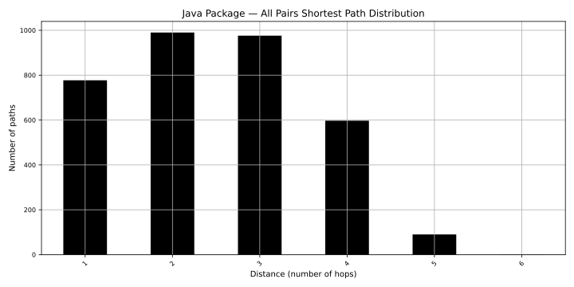

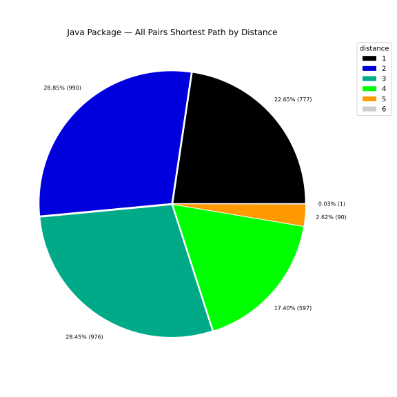

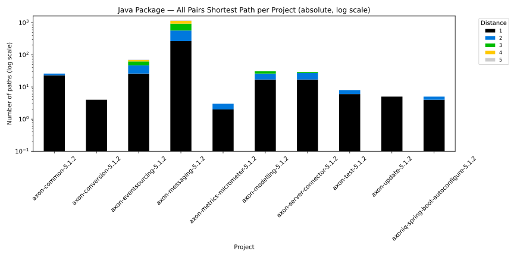

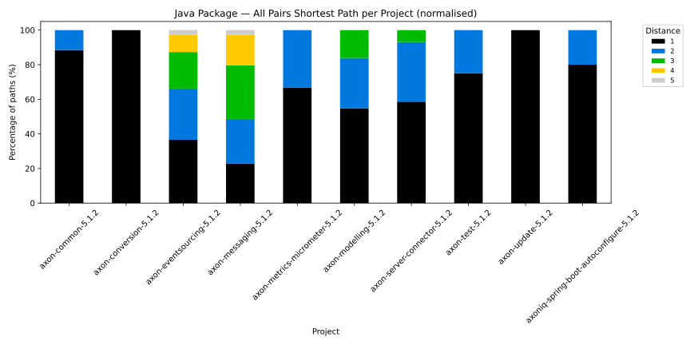

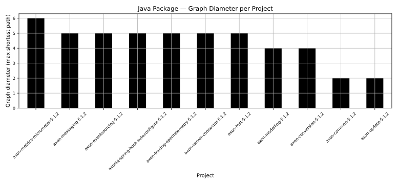

#### 4.1.2 Longest Path

Deepest sequential dependency chain. Worst-case build depth if non-parallelized.

| distance | pathsCount |
| --- | --- |
| 6 | 1 |
| 5 | 4 |
| 4 | 9 |
| 3 | 21 |
| 2 | 18 |
| 1 | 26 |
| 0 | 26 |

[Full data per project](./Java_Package/Package_longest_paths_distribution.csv)

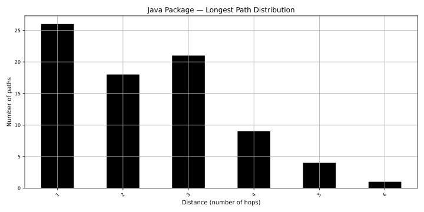

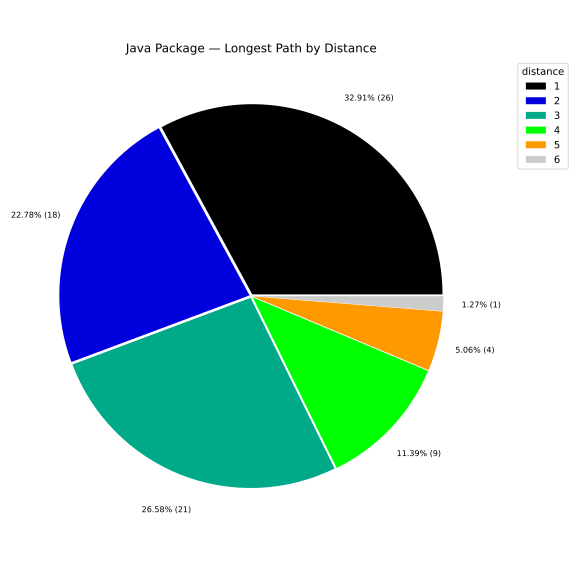

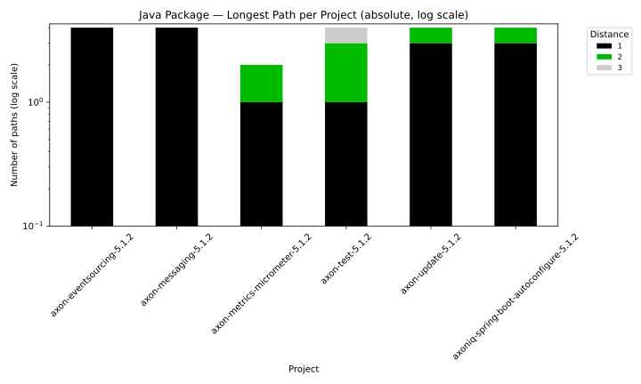

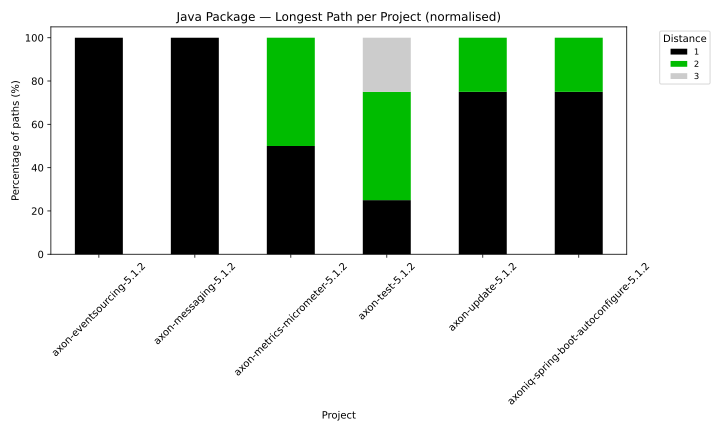

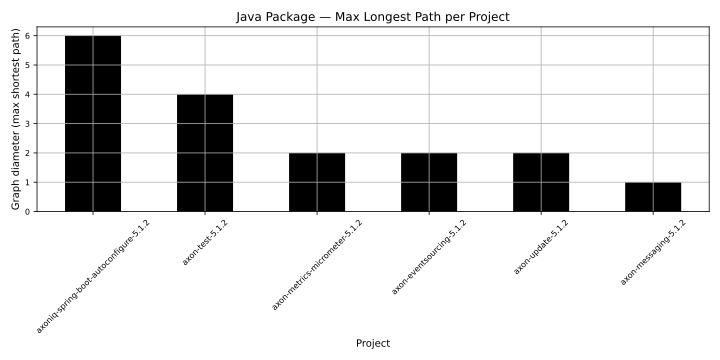

### 4.2 Java Artifact Path Finding

Coarsest view — artifact (JAR) level. Build parallelism and max sequential depth.

#### 4.2.1 All Pairs Shortest Path

Artifact-level graph diameter. Cycles rare at this level.

| distance | pairCount | sourceNodeCount | targetNodeCount | examples |
| --- | --- | --- | --- | --- |
| 2 | 6 | 4 | 3 | ["/axon-test-5.1.2.jar ->/axon-modelling-5.1.2.jar","/axoniq-spring-boot-autoconfigure-5.1.2.jar ->/axon-modelling-5.1.2.jar"] |
| 1 | 27 | 10 | 6 | ["/axon-server-connector-5.1.2.jar ->/axon-modelling-5.1.2.jar","/axon-eventsourcing-5.1.2.jar ->/axon-modelling-5.1.2.jar"] |

[Full data per project](./Java_Artifact/Artifact_all_pairs_shortest_paths_distribution_per_project.csv)

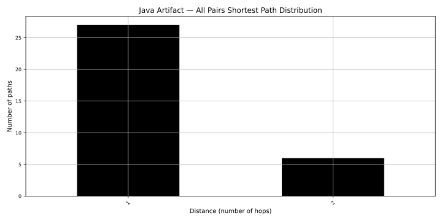

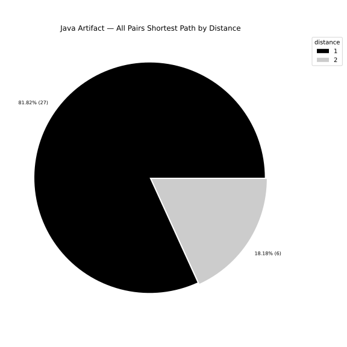

#### 4.2.2 Longest Path

Critical path for sequential artifact building.

| distance | pathsCount |
| --- | --- |
| 6 | 1 |
| 5 | 1 |
| 4 | 1 |
| 3 | 1 |
| 2 | 1 |
| 1 | 1 |
| 0 | 5 |

[Full data per project](./Java_Artifact/Artifact_longest_paths_distribution.csv)

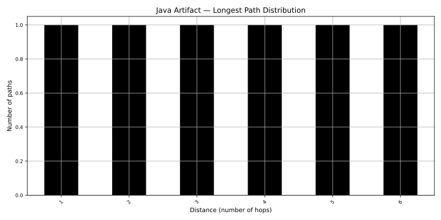

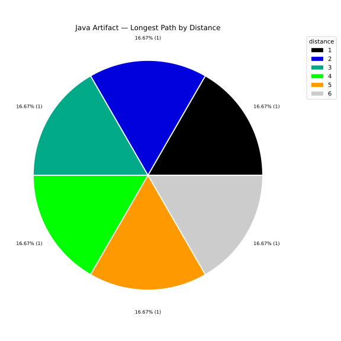

### 4.3 TypeScript Module Path Finding

TypeScript module dependency chains. Comparable to Java Package view.

#### 4.3.1 All Pairs Shortest Path

Graph diameter = longest shortest path among module pairs. Higher = deeper transitive imports.

⚠️ _No data available — TypeScript not detected in this codebase._

#### 4.3.2 Longest Path

Deepest sequential TypeScript import chain.

⚠️ _No data available — TypeScript not detected in this codebase._

---

## 5. Topological Sort

Assigns **build level** to each node: Level 0 (no dependencies) → Level N (depends on level N−1).

**Critical path** = max level = min sequential build steps with full parallelism. Highest-level node = most central.

### 5.1 Critical Path Lengths

Max build level per abstraction. Higher = deeper sequential chain.

| abstractionLevel | nodeCount | maxBuildLevel |
| --- | --- | --- |
| Java Artifact | 11 | 6 |
| Java Package | 59 | 5 |

Full topological sort results (node-level build order and level assignments) are in the abstraction-level CSV files under each subdirectory of `reports/internal-dependencies/`.

---

## 6. Graph Visualizations

Directed graphs: node color = build level (darker = higher level = more transitive deps above).

### 6.1 Java Artifact Graphs

**Build levels**: Full artifact hierarchy. **Longest paths**: Isolated chain + contributor view.

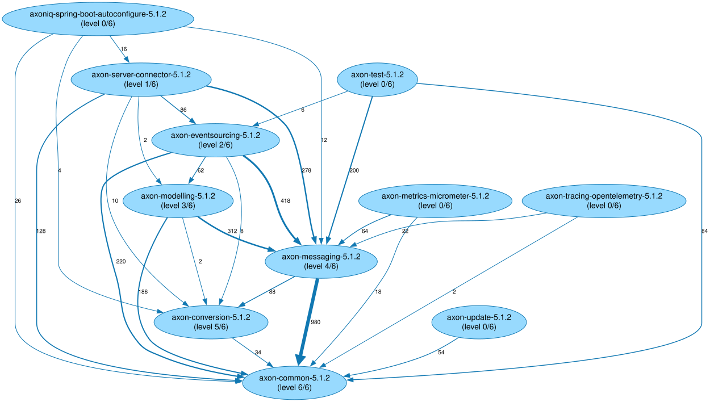

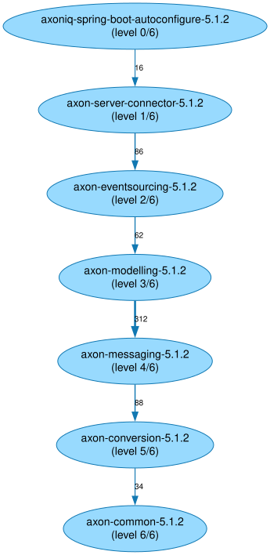

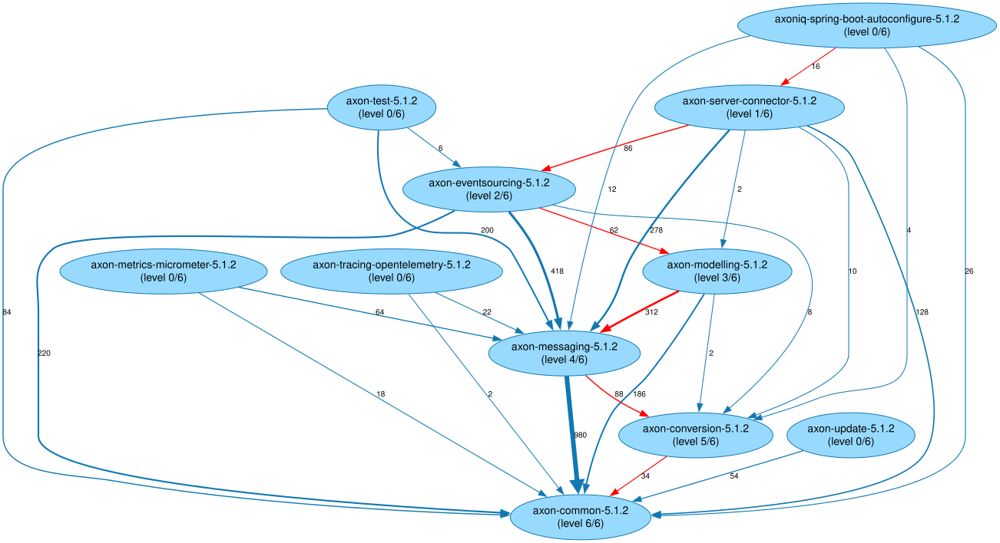

### 6.2 TypeScript Module Graphs

**Build levels**: Module layering view. **Longest paths**: Isolated chain + contributor view.

⚠️ _No data available — TypeScript not detected in this codebase._

### 6.3 NPM Package Graphs

Build levels and longest paths for NPM packages (prod + dev dependencies).

⚠️ _No data available — TypeScript not detected in this codebase._

---

## 7. Glossary and Column Definitions

| Term | Definition |
|------|-----------|
| `Graph Diameter` | Longest shortest path. Structural depth metric. |
| `Longest Path` | Max directed path in DAG; critical build path. |
| `File Distance` | Min directory changes to dependency. |
| `Build Level` | Topological sort level (0 = no deps). |
| `usedTypesPercent` | % of package types actually used by dependents. Low = ISP violation. |
| `usedPackagesPercent` | % of artifact packages used by dependents. Low = wide API. |
| `usedElementsPercent` | % of module elements imported by dependents. |
| `Instability` | Outgoing / (incoming + outgoing) deps. 0 = stable; 1 = unstable. |
| `Abstractness` | (Abstract types) / (total types). 0 = concrete; 1 = abstract. |
| `Distance from Main Sequence` | Gap from ideal balance `A + I = 1`. High = pain or uselessness. |
| `Zone of Pain` | Concrete + stable = hard to change/remove. |
| `Zone of Uselessness` | Abstract + unstable = unused abstractions. |

---

## 8. Object-Oriented Design Metrics

Measures conformance to Stable Abstractions Principle(Robert C. Martin): stable components should be abstract; concrete ones unstable.

**Scatter chart**: Abstractness vs. Instability. Green diagonal = Main Sequence (`A + I = 1`). Far off = problem zone.

**Problem zones**: Zone of Pain (concrete + stable) | Zone of Uselessness (abstract + unstable).

**Bar charts**: Top connected packages/modules.

### 8.1 Java Packages (without sub-packages)

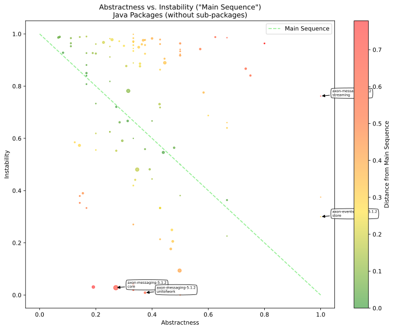

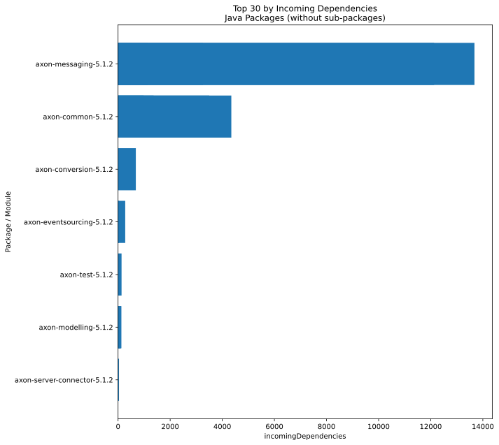

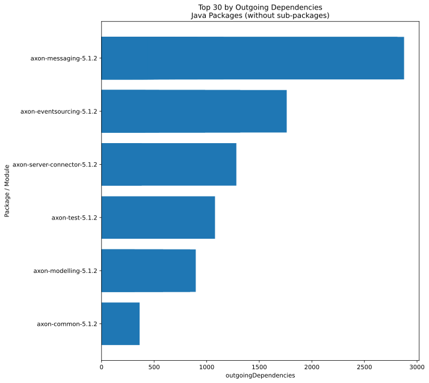

### 8.2 Java Packages (including sub-packages)

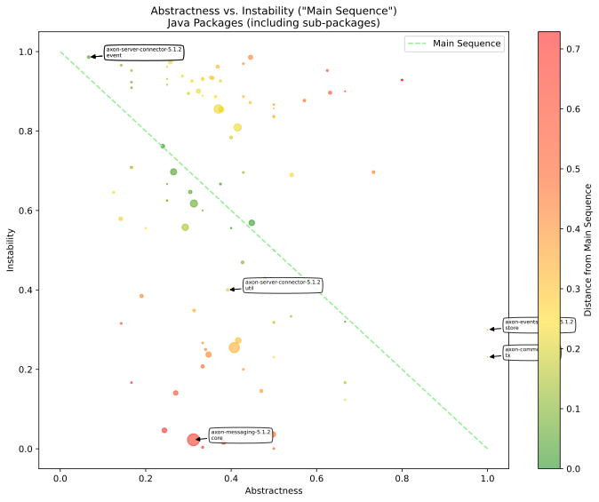

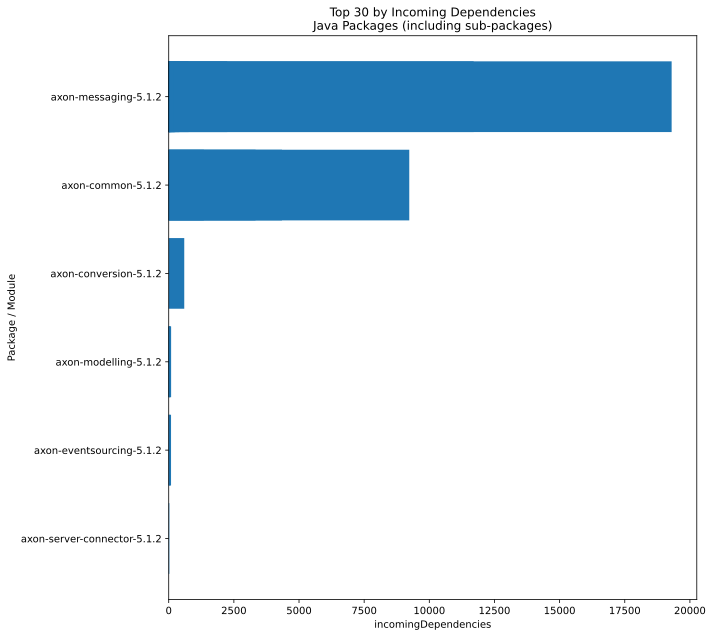

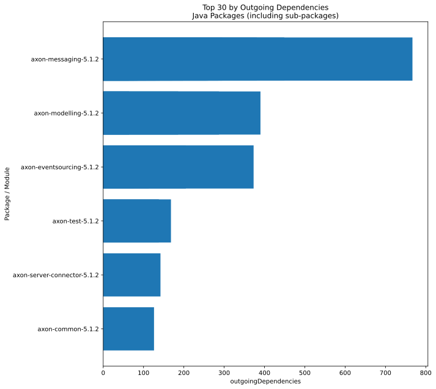

### 8.3 TypeScript Modules

⚠️ _No data available — TypeScript not detected in this codebase._

⚠️ _No data available — TypeScript not detected in this codebase._

⚠️ _No data available — TypeScript not detected in this codebase._

---

## 9. Visibility Metrics

Measures public vs. internal API exposure. High visibility = exposed more than necessary; low = tightly encapsulated.

**Percentile plots** (p25, p50, p75) vs. size (log scale): large artifacts vs. small visibility patterns.

**Scatter charts**: Artifact/project median visibility vs. size • Package/module individual visibility vs. size.

### 9.1 Java Visibility

#### 9.1.1 Artifact-Level Visibility Percentiles

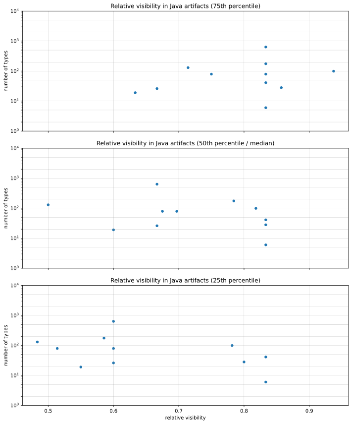

#### 9.1.2 Artifact-Level Relative Visibility

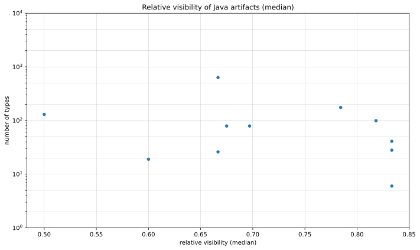

#### 9.1.3 Package-Level Relative Visibility

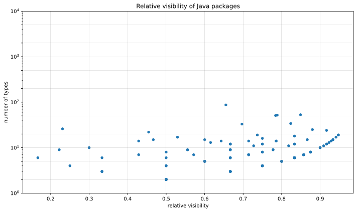

### 9.2 TypeScript Visibility

#### 9.2.1 Project-Level Visibility Percentiles

⚠️ _No data available — TypeScript not detected in this codebase._

#### 9.2.2 Project-Level Relative Visibility

⚠️ _No data available — TypeScript not detected in this codebase._

#### 9.2.3 Module-Level Relative Visibility

⚠️ _No data available — TypeScript not detected in this codebase._

---

## 10. Code Vocabulary

**Word cloud**: Vocabulary from all code element names (filtered for generic words). Reveals domain concepts and naming patterns.

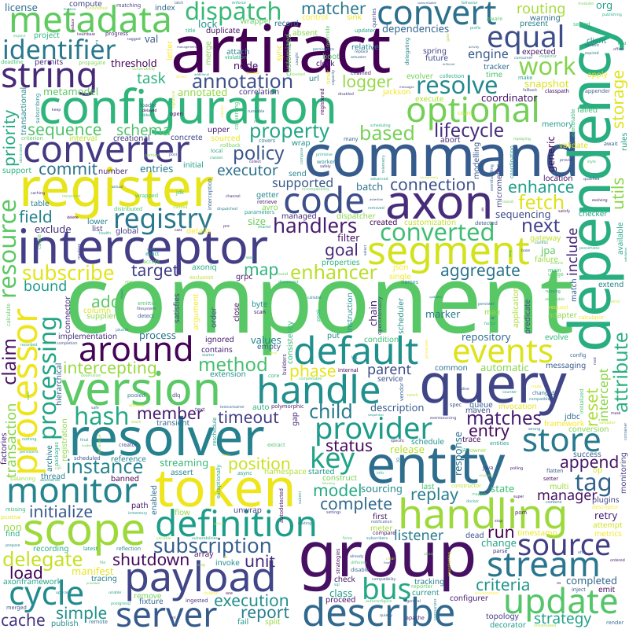

