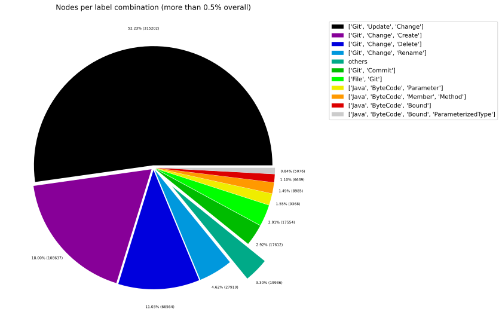
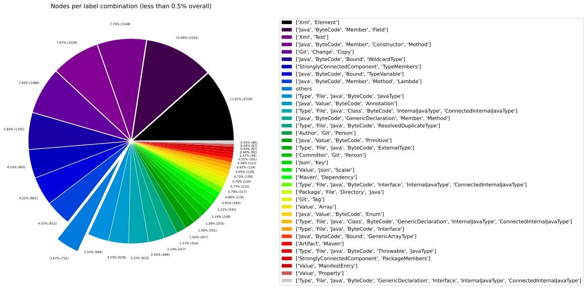
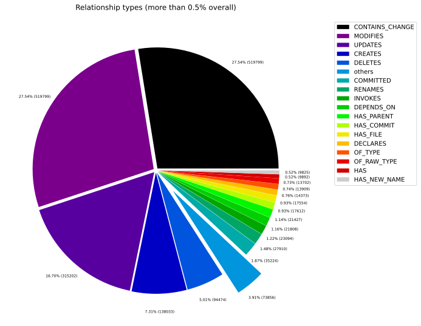
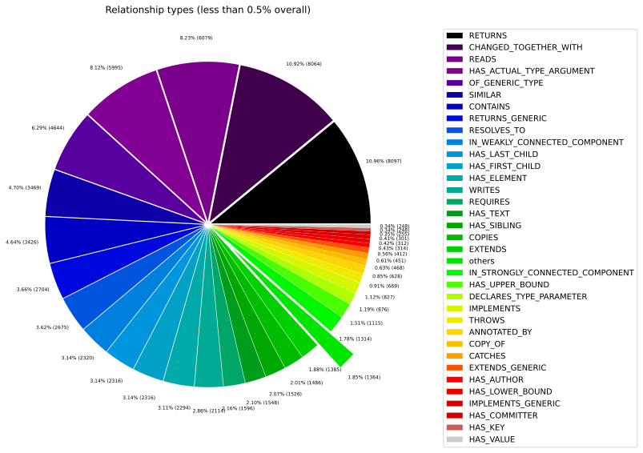
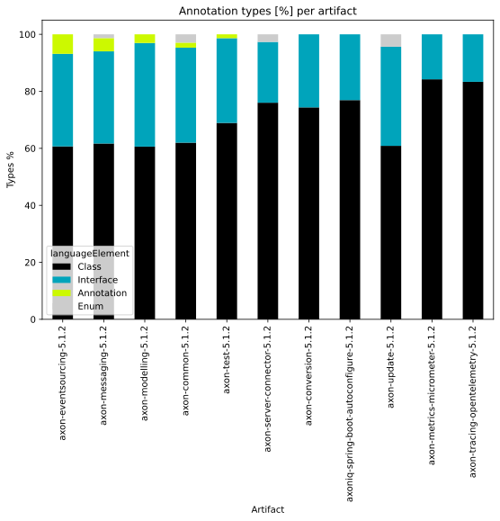
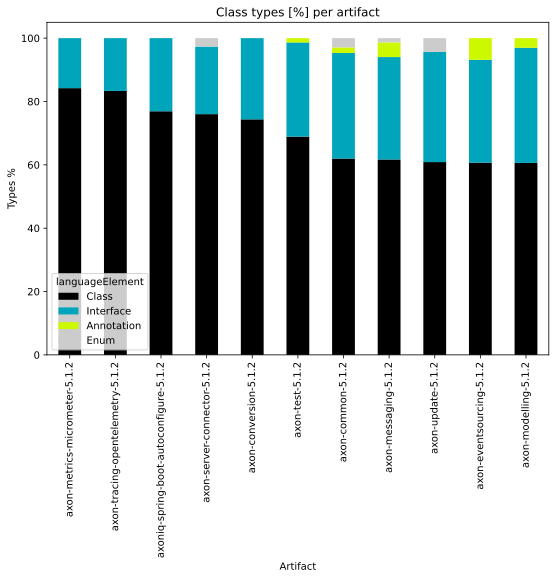
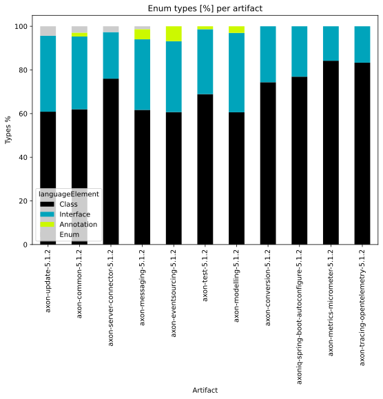
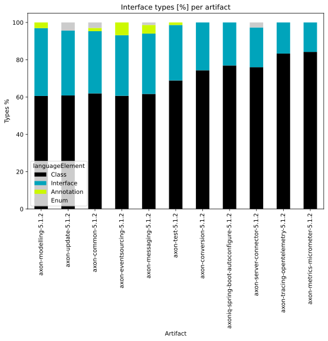
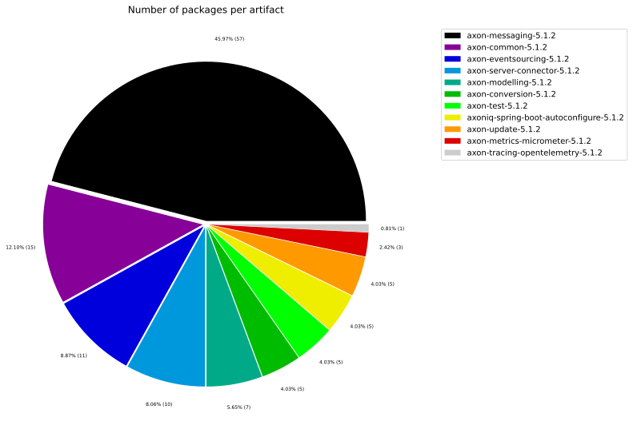
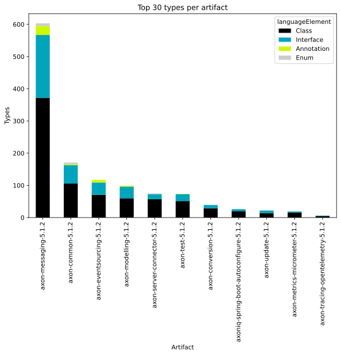

# Overview Report

## 1. Overview

High-level summary of graph database contents: general graph structure (node labels, relationships), Java artifacts, and TypeScript modules.

## 📚 Table of Contents

1. [Overview](#1-overview)
1. [General](#2-general)
1. [Java](#3-java)
1. [TypeScript](#4-typescript)

---

## 2. General

### 2.1 Node label combinations

Shows how many nodes carry each combination of labels and their share of the total node count.

| nodeLabels | nodesWithThatLabels | nodesWithThatLabelsPercent |
| --- | --- | --- |
| ["Git","Update","Change"] | 315202 | 52.23046879530989 |
| ["Git","Change","Create"] | 108637 | 18.00166698979093 |
| ["Git","Change","Delete"] | 66564 | 11.029971018239122 |
| ["Git","Change","Rename"] | 27910 | 4.624819588952795 |
| ["Git","Commit"] | 17612 | 2.9183920673821797 |
| ["File","Git"] | 17554 | 2.908781191847989 |
| ["Java","ByteCode","Parameter"] | 9368 | 1.552322103522386 |
| ["Java","ByteCode","Member","Method"] | 8985 | 1.4888571840466094 |
| ["Java","ByteCode","Bound"] | 6639 | 1.100113839163655 |
| ["Java","ByteCode","Bound","ParameterizedType"] | 5076 | 0.8411173139922747 |

[Full data](./Node_label_combination_count.csv)

---

### 2.2 Node labels

Shows the number of nodes carrying each individual label, sorted by count descending.

| nodeLabel | nodesWithThatLabel | nodesWithThatLabelPercent |
| --- | --- | --- |
| Git | 555689 | 92.0803071503257 |
| Change | 519799 | 86.13316365166874 |
| Update | 315202 | 52.23046879530989 |
| Create | 108637 | 18.00166698979093 |
| Delete | 66564 | 11.029971018239122 |
| Java | 41536 | 6.88271252048525 |
| ByteCode | 41321 | 6.847085999108509 |
| Rename | 27910 | 4.624819588952795 |
| File | 20743 | 3.4372136414778875 |
| Commit | 17612 | 2.9183920673821797 |

[Full data](./Node_label_count.csv)

---

### 2.3 Relationship types

Shows the number of relationships for each type and their share of the total relationship count.

| relationshipType | nodesWithThatRelationshipType | nodesWithThatRelationshipTypePercent |
| --- | --- | --- |
| CONTAINS_CHANGE | 519799 | 27.53941380883329 |
| MODIFIES | 519799 | 27.53941380883329 |
| UPDATES | 315202 | 16.699682591486077 |
| CREATES | 138033 | 7.313111233909041 |
| DELETES | 94474 | 5.00531663234388 |
| COMMITTED | 35224 | 1.8661988807257108 |
| RENAMES | 27910 | 1.4786966489057063 |
| INVOKES | 23094 | 1.2235406811117298 |
| DEPENDS_ON | 21808 | 1.1554072561567768 |
| HAS_PARENT | 21427 | 1.1352215369438396 |

[Full data](./Relationship_type_count.csv)

---

### 2.4 Node labels and their relationships

Shows which node labels are connected by each relationship type, with count and percentage share.
| sourceLabels | relationshipType | targetLabels | relationshipCount |
| --- | --- | --- | --- |
| ["Git","Update","Change"] | MODIFIES | ["Git"] | 315202 |
| ["Git","Update","Change"] | UPDATES | ["Git"] | 315202 |
| ["Git","Commit"] | CONTAINS_CHANGE | ["Git","Update","Change"] | 315202 |
| ["Git","Change","Create"] | MODIFIES | ["Git"] | 108637 |
| ["Git","Change","Create"] | CREATES | ["Git"] | 108637 |
| ["Git","Commit"] | CONTAINS_CHANGE | ["Git","Change","Create"] | 108637 |
| ["Git","Change","Delete"] | MODIFIES | ["Git"] | 66564 |
| ["Git","Commit"] | CONTAINS_CHANGE | ["Git","Change","Delete"] | 66564 |
| ["Git","Change","Delete"] | DELETES | ["Git"] | 66564 |
| ["Git","Change","Rename"] | MODIFIES | ["Git"] | 27910 |

[Full data](./Node_labels_and_their_relationships.csv)

---

### 2.5 Graph density

Statistical measures of the graph structure: node count, relationship count, and density metric.

---

### 2.6 Dependency node labels

Shows node labels present on dependency nodes — nodes that represent external dependencies not scanned as artifacts.

| sourceLabels | targetLabels | numberOfNodes | percentageOfTotalNodes |
| --- | --- | --- | --- |
| StronglyConnectedComponent,TypeMembers | StronglyConnectedComponent,TypeMembers | 4124 | 0.68 |
| StronglyConnectedComponent,PackageMembers | StronglyConnectedComponent,PackageMembers | 357 | 0.06 |
| Type,File,Java,ByteCode,Interface | Type,File,Java,ByteCode,ExternalType,ExternalAnnotation,JavaType | 124 | 0.02 |
| Type,File,Java,Class,ByteCode,InternalJavaType,ConnectedInternalJavaType | Type,File,Java,ByteCode,JavaType | 38 | 0.01 |
| Type,File,Java,Class,ByteCode,InternalJavaType,ConnectedInternalJavaType | Type,File,Java,ByteCode,JavaType | 34 | 0.01 |
| Type,File,Java,Class,ByteCode,InternalJavaType,ConnectedInternalJavaType | Type,File,Java,ByteCode,ResolvedDuplicateType | 32 | 0.01 |
| Type,File,Java,Class,ByteCode,InternalJavaType,ConnectedInternalJavaType | Type,File,Java,ByteCode,ResolvedDuplicateType,JavaType | 28 | 0 |
| StronglyConnectedComponent,ArtifactMembers | StronglyConnectedComponent,ArtifactMembers | 27 | 0 |
| Type,File,Java,Class,ByteCode,InternalJavaType,ConnectedInternalJavaType | Type,File,Java,ByteCode,JavaType | 27 | 0 |
| Type,File,Java,Class,ByteCode,InternalJavaType,ConnectedInternalJavaType | Type,File,Java,ByteCode,JavaType | 25 | 0 |

[Full data](./Dependency_node_labels.csv)

---

## 3. Java

### 3.1 Artifact size

Overview of scanned Java artifacts: number of packages, types, methods, and lines of code.

| nodeCount | relationshipCount | artifactCount | packageCount | typeCount | methodCount | memberCount |
| --- | --- | --- | --- | --- | --- | --- |
| 603483 | 1887473 | 11 | 137 | 1856 | 5623 | 7042 |

[Full data](./Overview_size.csv)

### 3.2 Java overview charts

---

## 4. TypeScript

### 4.1 Module size

Overview of scanned TypeScript modules: number of exported language elements per module.

> No overview data available.
> Please run the analysis pipeline first to scan and import code artifacts into the graph database (e.g., `analyze.sh`), then start Neo4j and re-run the overview reports.

### 4.2 TypeScript overview charts

