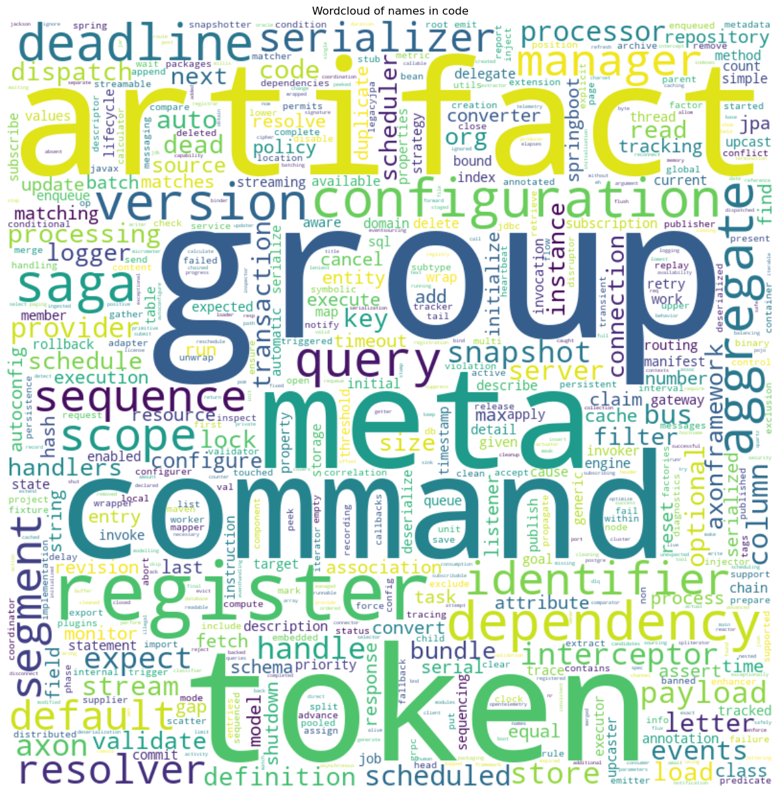

# Wordcloud
   

### References
- [jqassistant](https://jqassistant.org)
- [py2neo](https://py2neo.org/2021.1/)

## Word Cloud

## WordCloud of names in code

<table border="1" class="dataframe">
  <thead>
    <tr style="text-align: right;">
      <th></th>
      <th>word</th>
    </tr>
  </thead>
  <tbody>
    <tr>
      <th>0</th>
      <td>artifacts</td>
    </tr>
    <tr>
      <th>1</th>
      <td>axon</td>
    </tr>
    <tr>
      <th>2</th>
      <td>configuration</td>
    </tr>
    <tr>
      <th>3</th>
      <td>maven</td>
    </tr>
    <tr>
      <th>4</th>
      <td>org</td>
    </tr>
    <tr>
      <th>5</th>
      <td>axonframework</td>
    </tr>
    <tr>
      <th>6</th>
      <td>axon</td>
    </tr>
    <tr>
      <th>7</th>
      <td>configuration</td>
    </tr>
    <tr>
      <th>8</th>
      <td>main</td>
    </tr>
    <tr>
      <th>9</th>
      <td>manifest</td>
    </tr>
  </tbody>
</table>

    There are 41357 words in the dataset for the plot titled 'Wordcloud of names in code'.

    

    

## WordCloud of git authors

<table border="1" class="dataframe">
  <thead>
    <tr style="text-align: right;">
      <th></th>
      <th>word</th>
      <th>frequency</th>
    </tr>
  </thead>
  <tbody>
    <tr>
      <th>0</th>
      <td>Allard Buijze</td>
      <td>3137</td>
    </tr>
    <tr>
      <th>1</th>
      <td>Mateusz Nowak</td>
      <td>330</td>
    </tr>
    <tr>
      <th>2</th>
      <td>Mitchell Herrijgers</td>
      <td>314</td>
    </tr>
    <tr>
      <th>3</th>
      <td>Steven van Beelen</td>
      <td>4100</td>
    </tr>
    <tr>
      <th>4</th>
      <td>Simon Zambrovski</td>
      <td>52</td>
    </tr>
    <tr>
      <th>5</th>
      <td>Jan Galinski</td>
      <td>12</td>
    </tr>
    <tr>
      <th>6</th>
      <td>Christian Thiel</td>
      <td>3</td>
    </tr>
    <tr>
      <th>7</th>
      <td>Lucas Campos</td>
      <td>61</td>
    </tr>
    <tr>
      <th>8</th>
      <td>Marc</td>
      <td>25</td>
    </tr>
    <tr>
      <th>9</th>
      <td>Paul Kuyer</td>
      <td>11</td>
    </tr>
  </tbody>
</table>

    

    

