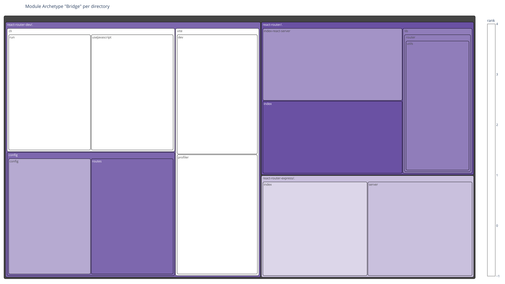
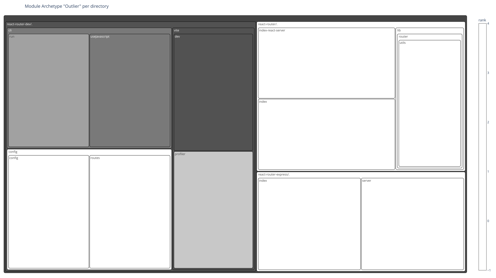

# 📊 Anomaly Detection Report

## 1. Executive Overview

This report analyzes structural and dependency anomalies across multiple abstraction levels of the codebase.
The goal is to detect potential **software quality, design, and architecture issues** using graph-based features, anomaly detection (Isolation Forest), and SHAP explainability.

## 📚 Table of Contents

1. [Executive Overview](#1-executive-overview)
1. [Deep Dives by Abstraction Level](#2-deep-dives-by-abstraction-level)
1. [Plot Interpretation Guide](#3-plot-interpretation-guide)
1. [Taxonomy of Anomaly Archetypes](#4-taxonomy-of-anomaly-archetypes)
1. [Recommendations](#5-recommendations)
1. [Appendix](#6-appendix)

---

### 1.1 Anomalies in total

| Analyzed Units | Anomalies | Bridges | Outliers |
| --- | --- | --- | --- |
| 224 | 7 | 7 | 7 |

### 1.2 Overview of Analyzed Structures

| Abstraction Level | Units | Anomalies | Bridges | Outliers |
| --- | --- | --- | --- | --- |
| TS,Local,Module | 157 | 7 | 7 | 7 |
| Package,Json,NPM | 56 | 0 | 0 | 0 |
| Package,Json,NPM,NpmNonDevPackage | 7 | 0 | 0 | 0 |
| Package,Json,NPM,NpmDevPackage | 2 | 0 | 0 | 0 |
| TS,Local,Module,TestRelated,TestEnvironment | 2 | 0 | 0 | 0 |

### 1.3 Overview Charts

#### Treemap Charts

---

## 2. Deep Dives by Abstraction Level

Each abstraction level includes anomaly statistics, SHAP feature importance, archetype distribution, and example anomalies.

### 2.1 Typescript Module

#### Anomaly Results

##### Total anomalies

| Anomalies | Bridges | Outliers | CodeUnits | Dependencies | GraphDensity |
| --- | --- | --- | --- | --- | --- |
| 7 | 7 | 7 | 130 | 696 | 0.041503 |

##### Top global contributing features (via SHAP)

| Feature | Mean absolute SHAP value |
| --- | --- |
| *Node embeddings aggregated* | 0.035740 |
| pageToArticleRankDifference | 0.023593 |
| pageRank | 0.014460 |
| articleRank | 0.010175 |
| degree | 0.007952 |
| nodeEmbeddingPCA_8 | 0.006290 |
| incomingDependencies | 0.006130 |
| nodeEmbeddingPCA_12 | 0.004556 |
| nodeEmbeddingPCA_14 | 0.003813 |
| localClusteringCoefficient | 0.002984 |
| nodeEmbeddingPCA_3 | 0.002491 |

#### Archetype Distribution

| Archetype | Count | Max. Score | Model Status | Examples |
| --- | --- | --- | --- | --- |
| Bridge | 7 | 0.0773 | Anomalous | /home/runner/work/code-graph-analysis-examples/code-graph-analysis-examples/temp/react-router-7.16.0/source/react-router-7.16.0/packages/react-router/index.ts, /home/runner/work/code-graph-analysis-examples/code-graph-analysis-examples/temp/react-router-7.16.0/source/react-router-7.16.0/packages/react-router-dev/config/config.ts, /home/runner/work/code-graph-analysis-examples/code-graph-analysis-examples/temp/react-router-7.16.0/source/react-router-7.16.0/packages/react-router-express/index.ts |
| Outlier | 7 | -0.0281 | Typical | /home/runner/work/code-graph-analysis-examples/code-graph-analysis-examples/temp/react-router-7.16.0/source/react-router-7.16.0/packages/react-router/lib/types/route-module.ts, /home/runner/work/code-graph-analysis-examples/code-graph-analysis-examples/temp/react-router-7.16.0/source/react-router-7.16.0/packages/react-router-dev/vite/profiler.ts, /home/runner/work/code-graph-analysis-examples/code-graph-analysis-examples/temp/react-router-7.16.0/source/react-router-7.16.0/packages/react-router-dev/vite/vite-node.ts |

#### Top anomalies with their local contributing features (via SHAP)

| Name | Contained in | Anomaly Score | Archetypes | Top Feature 1 | Top Feature 1 SHAP | Top Feature 2 | Top Feature 2 SHAP | Top Feature 3 | Top Feature 3 SHAP | Model Status |
| --- | --- | --- | --- | --- | --- | --- | --- | --- | --- | --- |
| /home/runner/work/code-graph-analysis-examples/code-graph-analysis-examples/temp/react-router-7.16.0/source/react-router-7.16.0/packages/react-router/index.ts | react-router | 0.0773 | Bridge, Outlier | pageToArticleRankDifference | -0.1925 | pageRank | -0.1566 | articleRank | -0.1548 | Anomalous |
| /home/runner/work/code-graph-analysis-examples/code-graph-analysis-examples/temp/react-router-7.16.0/source/react-router-7.16.0/packages/react-router-dev/config/config.ts | react-router-dev | 0.0156 | Bridge, Outlier | pageToArticleRankDifference | -0.2083 | pageRank | -0.0654 | degree | -0.0545 | Anomalous |
| /home/runner/work/code-graph-analysis-examples/code-graph-analysis-examples/temp/react-router-7.16.0/source/react-router-7.16.0/packages/react-router-express/index.ts | react-router-express | 0.0089 | Bridge, Outlier | pageToArticleRankDifference | -0.1555 | nodeEmbeddingPCA_12 | -0.1181 | nodeEmbeddingPCA_14 | -0.1132 | Anomalous |
| /home/runner/work/code-graph-analysis-examples/code-graph-analysis-examples/temp/react-router-7.16.0/source/react-router-7.16.0/packages/react-router-express/server.ts | react-router-express | 0.0072 | Bridge, Outlier | pageToArticleRankDifference | -0.1941 | nodeEmbeddingPCA_12 | -0.1139 | nodeEmbeddingPCA_14 | -0.1078 | Anomalous |
| /home/runner/work/code-graph-analysis-examples/code-graph-analysis-examples/temp/react-router-7.16.0/source/react-router-7.16.0/packages/react-router/index-react-server.ts | react-router | 0.0061 | Bridge, Outlier | pageToArticleRankDifference | -0.2021 | articleRank | -0.1614 | pageRank | -0.1572 | Anomalous |
| /home/runner/work/code-graph-analysis-examples/code-graph-analysis-examples/temp/react-router-7.16.0/source/react-router-7.16.0/packages/react-router/lib/router/utils.ts | react-router | 0.0015 | Bridge, Outlier | pageToArticleRankDifference | -0.1767 | articleRank | -0.154 | pageRank | -0.1262 | Anomalous |
| /home/runner/work/code-graph-analysis-examples/code-graph-analysis-examples/temp/react-router-7.16.0/source/react-router-7.16.0/packages/react-router-dev/config/routes.ts | react-router-dev | 0.0008 | Bridge, Outlier | pageToArticleRankDifference | -0.2039 | pageRank | -0.1553 | articleRank | -0.1116 | Anomalous |

#### Visualizations

##### Anomalies

##### Global feature importance SHAP summary plots

##### Feature dependence plots for top important features

---

##### Local SHAP Force Plots – Top 6 Anomalies

---

##### Cluster Diagnostics

---

##### Cluster Membership Strength

---

##### Cluster Noise and Bridge Analysis

---

##### Feature Distributions

---

##### Feature Relationships

---

#### Graph Visualizations

##### TopBridge Graph Visualizations

--

## 3. Plot Interpretation Guide

> **Applies to:** All abstraction levels.

| Plot | Purpose |
|------|----------|
| **Anomalies Plot** | 2D visualization showing clusters & anomalies. Guides investigation. |
| **SHAP Summary** | Global feature importance ranked by impact magnitude & direction. |
| **Local SHAP Force** | Per-sample feature contributions. Explains individual anomalies. |
| **Dependence Plot** | Feature–anomaly relationships revealing nonlinear effects. |
| **Cluster Metrics** | Cluster cohesion, size, noise; identifies weak groupings. |

> **Scope:** Applies to plots for *Java Type*, *Java Package*, and similar abstraction levels.

---

### 📘 Main Plots

| Plot | Purpose |
|------|----------|
| **Anomalies** | 2D visualization of all code units showing clusters and anomalies. Reveals isolated vs cluster-based anomalies. |
| **Global Feature Importance (SHAP Summary)** | Mean absolute SHAP values ranking global feature impact. Shows what drives anomalies consistently. |
| **Feature Dependence (Top Important Features)** | Shows how specific feature values affect anomaly score. Identifies nonlinear relationships & interactions. |

---

### 📙 Local Explanation Plots

| Plot | Purpose |
|------|----------|
| **Local SHAP Force Plots (Top Anomalies 1–6)** | Per-feature contributions to each anomaly's score relative to baseline. Enables case-by-case debugging. |

---

### 📗 Cluster-Level Diagnostic Plots

| Plot | Purpose |
|------|----------|
| **Clusters – Overall** | All clusters in one view. Holistic summary of distribution & key metrics. |
| **Clusters – Largest Radius (Avg)** | Ranks by mean member distance from centroid. Identifies dispersed clusters. |
| **Clusters – Largest Radius (Max)** | Shows farthest outlying member per cluster. Highlights extreme members. |
| **Clusters – Largest Size** | Membership counts per cluster. Reveals common design patterns vs. specialized groups. |
| **Cluster Probabilities** | HDBSCAN membership strength distribution. Detects weakly-defined or noisy clusters. |

---

### 📒 Cluster Noise & Bridge Diagnostics

| Plot | Purpose |
|------|----------|
| **Cluster Noise – Highly Central and Popular** | Central nodes that don't fit any cluster. May be key but unstable integration points. |
| **Cluster Noise – Poorly Integrated Bridges** | Nodes connecting clusters but weakly integrated. May reveal boundary violations. |
| **Cluster Noise – Role Inverted Bridges** | Bridges with reversed structural roles. Indicates architectural inversion. |

---

### 📙 Feature Distribution & Relationship Plots

| Plot | Purpose |
|------|----------|
| **Betweenness Centrality Distribution** | Histogram of betweenness values. Detects bottlenecks & single points of failure. |
| **Clustering Coefficient Distribution** | Histogram of local clustering coefficients. Reveals cohesion in different graph regions. |
| **PageRank – ArticleRank Difference Distribution** | Distribution of influence vs popularity. Highlights disproportionate architectural impact. |
| **Clustering Coefficient vs PageRank** | Scatterplot: local vs global influence trade-offs. Finds units both locally & globally critical. |

---

### 📕 Graph Visualizations (Archetype-Level Network Views)

| Plot | Purpose |
|------|----------|
| **Top Hub** | Most-connected node with dependencies. Detects over-centralization & bottlenecks. |
| **Top Bottleneck** | Highest betweenness: controls information flow. Reveals single points of failure. |
| **Top Authority** | Most authoritative (high PageRank). Indicates "sources of truth" in system. |
| **Top Bridge** | Cross-cluster connector. Identifies boundary leaks & undesired coupling. |
| **Top Outlier** | Anomalous isolated node. Highlights deviations from dependency norms. |

> **Note:**
> - In all Graph Visualizations, the **central node** represents the selected *Top Archetype* (e.g., *Top 1 Hub*).  
> - **Darker nodes** indicate *incoming dependencies*, while **brighter nodes** indicate *outgoing dependencies*.  
> - **Emphasized nodes** (thicker borders or larger size) mark particularly influential or anomalous dependencies, depending on the archetype.  
> - These visualizations are most effective for interpreting *local dependency topology* and *role significance* of key components.

---

### 📔 Summary Categories

| Category | Included Plots | Typical Usage |
|-----------|----------------|----------------|
| **Main Diagnostic** | Anomalies, Global SHAP, Feature Dependence | High-level anomaly review |
| **Local Explanation** | Local SHAP Force Plots | Case-by-case anomaly debugging |
| **Cluster Diagnostics** | Cluster Radius / Size / Probability | Assess cluster cohesion and outliers |
| **Cluster Noise Analysis** | Cluster Noise (3 types) | Identify special structural anomalies |
| **Feature Distributions** | Betweenness, Clustering, Rank Difference | Assess feature-based structure patterns |
| **Feature Relationships** | Clustering vs PageRank | Evaluate global vs local influence balance |
| **Archetype Graphs** | Top Hub / Bottleneck / Authority / Bridge / Outlier | Visualizing key dependency roles and structural importance |

---

### 💡 Reading Guidance

- **Color Conventions:**  
  Red = anomalous, Green = typical, Light grey = noise, Pale colors = clusters.  
- **Scales:**  
  SHAP values are normalized (mean absolute); graph metrics standardized by z-score.  
- **How to Use:**  
  1. Start with *Main Diagnostic* plots to identify anomalies and drivers.  
  2. Use *Local SHAP* for detailed case analysis.  
  3. Check *Cluster Diagnostics* and *Noise Plots* to verify grouping quality.  
  4. Use *Feature Distributions* to contextualize metrics.  
  5. Cross-reference *Feature Relationships* for architectural interpretation.

---

## 4. Taxonomy of Anomaly Archetypes

| Archetype | Feature Profile | Architectural Risk |
|-----------|-----------------|--------------------|
| **Hub** | High degree, low clustering coefficient | Central dependency; fragile hotspot |
| **Bottleneck** | High betweenness, low redundancy | Single point of failure; slows evolution |
| **Outlier** | High cluster distance, small cluster size | Misfit or irregular dependency pattern |
| **Authority** | High PageRank, low ArticleRank | Over-relied utility; low local stability |
| **Bridge** | Cross-cluster connection | Risky coupling; weak modular boundaries |

---

## 5. Recommendations

* **Refactor hubs:** Decompose large or over-connected utilities.
* **Mitigate bottlenecks:** Introduce redundancy or alternative communication paths.
* **Investigate outliers:** Determine if anomalies are justified exceptions.
* **Raise cohesion:** Increase local clustering by improving modular boundaries.
* **Stabilize authorities:** Encapsulate frequently used but fragile components.
* **Validate bridges:** Confirm cross-cluster connectors are intentional and safe.

---

## 6. Appendix

### 6.1 Methodology Overview

1. Build dependency graph (types, packages, artifacts).
1. Compute graph metrics: degree, PageRank, betweenness, clustering coefficient, etc.
1. Generate embeddings via Fast Random Projection.
1. Reduce embeddings with PCA (retain 90% variance).
1. Train Isolation Forest for anomaly detection.
1. Explain results using SHAP (via Random Forest proxy).
1. Cluster anomalies via HDBSCAN, tuned with Leiden reference communities (AMI score).
1. Hyperparameter optimization for both Isolation Forest and Random Forest proxy with their F1 score

### 6.2 Feature Set

* Degree (in/out)
* PageRank
* ArticleRank
* Page-to-Article Rank Difference
* Betweenness Centrality
* Local Clustering Coefficient
* Cluster Outlier Score (1.0 - cluster probability)
* Cluster Radius (avg, max)
* Cluster Size
* Node Embedding (PCA 20–35 dims)

### 6.3 Architecture Diagram

