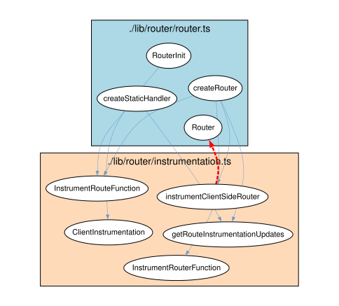
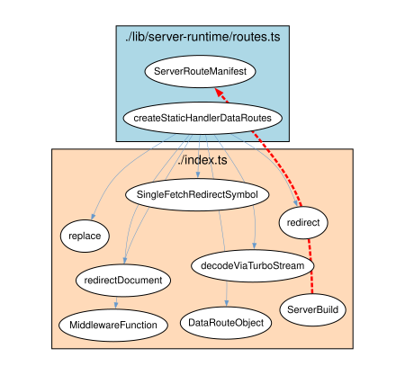
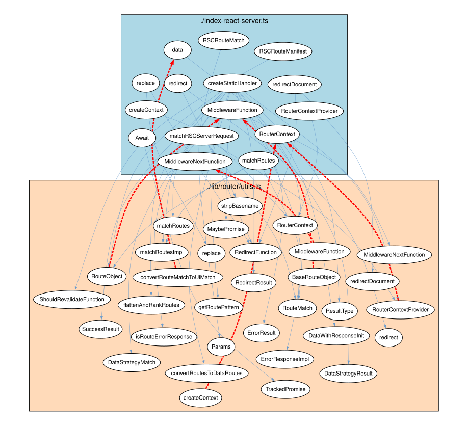
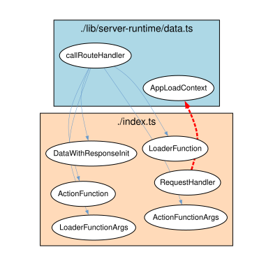
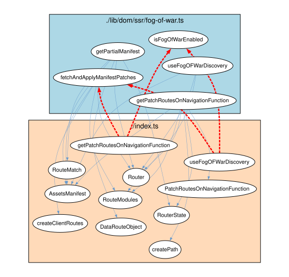

# ♻️ Cyclic Dependencies Report

## 1. Executive Overview

Analyzes **cyclic dependencies**: mutual cycles between Java packages, artifacts, and TypeScript modules.

**Cycle group**: Set of code units that depend on each other (A → B → A, directly or transitively). Prevents modular decomposition.

**Key metric**: `forwardToBackwardBalance` = ratio of forward to backward dependencies. Near 1.0 = easy fix (few backward deps to remove); near 0.0 = hard (many backward deps). Backward dependencies are removal candidates.

**Priority**: Rows sorted by `forwardToBackwardBalance` descending — highest priority first.

## 📚 Table of Contents

1. [Executive Overview](#1-executive-overview)
1. [Java Cyclic Dependencies](#2-java-cyclic-dependencies)
1. [TypeScript Cyclic Dependencies](#3-typescript-cyclic-dependencies)
1. [Glossary](#4-glossary)

---

## 2. Java Cyclic Dependencies

### 2.1 Java Package Cyclic Dependencies (Overview)

`numberForward`: dependencies in cycle majority direction. `numberBackward`: against majority (removal candidates).

✅ _No cyclic dependencies detected — the dependency graph is acyclic for this abstraction level._

### 2.2 Java Package Cyclic Dependencies (Breakdown)

Individual dependency pairs per cycle group: concrete types involved.

✅ _No cyclic dependencies detected — the dependency graph is acyclic for this abstraction level._

### 2.3 Java Package Cyclic Dependencies (Backward Only)

Backward dependencies only — primary candidates for removal/reversal to break cycles.

✅ _No cyclic dependencies detected — the dependency graph is acyclic for this abstraction level._

### 2.4 Java Artifact Cyclic Dependencies

Artifact (JAR) level cycles — coarsest and most critical abstraction.

✅ _No cyclic dependencies detected — the dependency graph is acyclic for this abstraction level._

### 2.5 Java Package Cyclic Dependencies (Graph Visualizations)

Top cycle pairs visualized as graphs. Blue solid arrows: forward dependencies. Red dashed arrows: backward dependencies (removal candidates). Nodes are grouped by package.

---

## 3. TypeScript Cyclic Dependencies

### 3.1 TypeScript Module Cyclic Dependencies (Overview)

TypeScript module cycles. Sorted by `forwardToBackwardBalance` descending (easiest fixes first).

| projectFileName | moduleName | dependentProjectFileName | dependentModulePathName | forwardToBackwardBalance | numberForward | numberBackward | forwardDependencyExamples | backwardDependencyExamples |
| --- | --- | --- | --- | --- | --- | --- | --- | --- |
| react-router | ./lib/router/router.ts | react-router | ./lib/router/instrumentation.ts | 0.75 | 7 | 1 | ["createStaticHandler->getRouteInstrumentationUpdates","createRouter->getRouteInstrumentationUpdates","createRouter->instrumentClientSideRouter","createStaticHandler->InstrumentRouteFunction","createRouter->InstrumentRouteFunction","RouterInit->ClientInstrumentation","createRouter->InstrumentRouterFunction"] | ["Router<-instrumentClientSideRouter"] |
| react-router | ./lib/server-runtime/routes.ts | react-router | ./index.ts | 0.75 | 7 | 1 | ["createStaticHandlerDataRoutes->decodeViaTurboStream","createStaticHandlerDataRoutes->SingleFetchRedirectSymbol","createStaticHandlerDataRoutes->redirectDocument","createStaticHandlerDataRoutes->DataRouteObject","createStaticHandlerDataRoutes->MiddlewareFunction","createStaticHandlerDataRoutes->redirect","createStaticHandlerDataRoutes->replace"] | ["ServerRouteManifest<-ServerBuild"] |
| react-router | ./index-react-server.ts | react-router | ./lib/router/utils.ts | 0.7142857142857143 | 36 | 6 | ["RSCRouteMatch->Params","createStaticHandler->DataStrategyMatch","MiddlewareFunction->MiddlewareNextFunction","redirect->redirect","createStaticHandler->SuccessResult","replace->replace","createStaticHandler->DataStrategyResult","redirect->RedirectFunction","redirectDocument->RedirectFunction"] | ["data<-convertRouteMatchToUiMatch","RouterContext<-createContext","RouterContext<-RouterContextProvider","MiddlewareFunction<-RouteObject","MiddlewareNextFunction<-MiddlewareFunction","MiddlewareFunction<-BaseRouteObject"] |
| react-router | ./lib/server-runtime/data.ts | react-router | ./index.ts | 0.6666666666666666 | 5 | 1 | ["callRouteHandler->LoaderFunctionArgs","callRouteHandler->LoaderFunction","callRouteHandler->ActionFunction","callRouteHandler->DataWithResponseInit","callRouteHandler->ActionFunctionArgs"] | ["AppLoadContext<-RequestHandler"] |
| react-router | ./lib/dom/ssr/fog-of-war.ts | react-router | ./index.ts | 0.6363636363636364 | 18 | 4 | ["getPatchRoutesOnNavigationFunction->createPath","getPatchRoutesOnNavigationFunction->PatchRoutesOnNavigationFunction","getPatchRoutesOnNavigationFunction->AssetsManifest","useFogOFWarDiscovery->AssetsManifest","getPartialManifest->AssetsManifest","fetchAndApplyManifestPatches->AssetsManifest","fetchAndApplyManifestPatches->RouteModules","getPatchRoutesOnNavigationFunction->RouteModules","useFogOFWarDiscovery->RouteModules"] | ["fetchAndApplyManifestPatches<-getPatchRoutesOnNavigationFunction","isFogOfWarEnabled<-getPatchRoutesOnNavigationFunction","fetchAndApplyManifestPatches<-useFogOFWarDiscovery","isFogOfWarEnabled<-useFogOFWarDiscovery"] |
| react-router | ./lib/server-runtime/sessions.ts | react-router | ./index-react-server.ts | 0.6 | 12 | 3 | ["SessionStorage->Session","CreateSessionFunction->Session","createSession->Session","SessionIdStorageStrategy->CookieSignatureOptions","isSession->IsSessionFunction","createSessionStorage->SessionIdStorageStrategy","SessionIdStorageStrategy->Cookie","warnOnceAboutSigningSessionCookie->Cookie","createSessionStorage->Cookie"] | ["warnOnceAboutSigningSessionCookie<-createCookieSessionStorage","createSession<-createCookieSessionStorage","createSessionStorage<-createMemorySessionStorage"] |
| react-router | ./lib/server-runtime/sessions.ts | react-router | ./index.ts | 0.6 | 12 | 3 | ["SessionIdStorageStrategy->Cookie","warnOnceAboutSigningSessionCookie->Cookie","createSessionStorage->Cookie","createSessionStorage->isCookie","createSessionStorage->SessionIdStorageStrategy","createSessionStorage->createCookie","SessionStorage->Session","CreateSessionFunction->Session","createSession->Session"] | ["warnOnceAboutSigningSessionCookie<-createCookieSessionStorage","createSession<-createCookieSessionStorage","createSessionStorage<-createMemorySessionStorage"] |
| react-router-dev | ./vite/plugin.ts | react-router-dev | ./vite/styles.ts | 0.5 | 3 | 1 | ["reactRouterVitePlugin->isCssModulesFile","reactRouterVitePlugin->getCssStringFromViteDevModuleCode","reactRouterVitePlugin->getStylesForPathname"] | ["LoadCssContents<-getStylesForPathname"] |
| react-router | ./lib/router/router.ts | react-router | ./index.ts | 0.4666666666666667 | 77 | 28 | ["Router->RouterSubscriber","createRouter->RouterSubscriber","RouterInit->PatchRoutesOnNavigationFunction","createStaticHandler->ErrorResponseImpl","createStaticHandler->StaticHandlerContext","getStaticContextFromError->StaticHandlerContext","StaticHandler->StaticHandlerContext","createStaticHandler->InstrumentRouteFunction","createRouter->InstrumentRouteFunction"] | ["StaticHandlerContext<-EntryContext","RouterState<-getPatchRoutesOnNavigationFunction","Router<-getPatchRoutesOnNavigationFunction","RouterSubscriber<-Router","GetScrollPositionFunction<-Router","Fetcher<-Router","FutureConfig<-Router","Blocker<-Router","RouterState<-Router"] |
| react-router | ./lib/server-runtime/server.ts | react-router | ./index.ts | 0.42857142857142855 | 5 | 2 | ["CreateRequestHandlerFunction->RequestHandler","RequestHandler->AppLoadContext","CreateRequestHandlerFunction->ServerBuild","createRequestHandler->ServerBuild","createRequestHandler->CreateRequestHandlerFunction"] | ["CreateRequestHandlerFunction<-createRequestHandler","RequestHandler<-CreateRequestHandlerFunction"] |

[Full data](./Typescript_Module/Cyclic_Dependencies_for_Typescript.csv)

### 3.2 TypeScript Module Cyclic Dependencies (Breakdown)

Individual TypeScript module dependency pairs per cycle group.

| projectFileName | moduleName | dependentProjectFileName | dependentModulePathName | dependency | forwardToBackwardBalance | numberForward | numberBackward |
| --- | --- | --- | --- | --- | --- | --- | --- |
| react-router | ./lib/router/router.ts | react-router | ./lib/router/instrumentation.ts | Router<-instrumentClientSideRouter | 0.75 | 7 | 1 |
| react-router | ./lib/router/router.ts | react-router | ./lib/router/instrumentation.ts | createStaticHandler->getRouteInstrumentationUpdates | 0.75 | 7 | 1 |
| react-router | ./lib/router/router.ts | react-router | ./lib/router/instrumentation.ts | createRouter->getRouteInstrumentationUpdates | 0.75 | 7 | 1 |
| react-router | ./lib/router/router.ts | react-router | ./lib/router/instrumentation.ts | createRouter->instrumentClientSideRouter | 0.75 | 7 | 1 |
| react-router | ./lib/router/router.ts | react-router | ./lib/router/instrumentation.ts | createStaticHandler->InstrumentRouteFunction | 0.75 | 7 | 1 |
| react-router | ./lib/router/router.ts | react-router | ./lib/router/instrumentation.ts | createRouter->InstrumentRouteFunction | 0.75 | 7 | 1 |
| react-router | ./lib/router/router.ts | react-router | ./lib/router/instrumentation.ts | RouterInit->ClientInstrumentation | 0.75 | 7 | 1 |
| react-router | ./lib/router/router.ts | react-router | ./lib/router/instrumentation.ts | createRouter->InstrumentRouterFunction | 0.75 | 7 | 1 |
| react-router | ./lib/server-runtime/routes.ts | react-router | ./index.ts | ServerRouteManifest<-ServerBuild | 0.75 | 7 | 1 |
| react-router | ./lib/server-runtime/routes.ts | react-router | ./index.ts | createStaticHandlerDataRoutes->decodeViaTurboStream | 0.75 | 7 | 1 |

[Full data](./Typescript_Module/Cyclic_Dependencies_Breakdown_for_Typescript.csv)

### 3.3 TypeScript Module Cyclic Dependencies (Backward Only)

Backward TypeScript dependencies — highest-value cycle breakers.

| projectFileName | moduleName | dependentProjectFileName | dependentModulePathName | dependency | forwardToBackwardBalance | numberForward | numberBackward |
| --- | --- | --- | --- | --- | --- | --- | --- |
| react-router | ./lib/router/router.ts | react-router | ./lib/router/instrumentation.ts | Router<-instrumentClientSideRouter | 0.75 | 7 | 1 |
| react-router | ./lib/server-runtime/routes.ts | react-router | ./index.ts | ServerRouteManifest<-ServerBuild | 0.75 | 7 | 1 |
| react-router | ./index-react-server.ts | react-router | ./lib/router/utils.ts | data<-convertRouteMatchToUiMatch | 0.7142857142857143 | 36 | 6 |
| react-router | ./index-react-server.ts | react-router | ./lib/router/utils.ts | RouterContext<-createContext | 0.7142857142857143 | 36 | 6 |
| react-router | ./index-react-server.ts | react-router | ./lib/router/utils.ts | RouterContext<-RouterContextProvider | 0.7142857142857143 | 36 | 6 |
| react-router | ./index-react-server.ts | react-router | ./lib/router/utils.ts | MiddlewareFunction<-RouteObject | 0.7142857142857143 | 36 | 6 |
| react-router | ./index-react-server.ts | react-router | ./lib/router/utils.ts | MiddlewareNextFunction<-MiddlewareFunction | 0.7142857142857143 | 36 | 6 |
| react-router | ./index-react-server.ts | react-router | ./lib/router/utils.ts | MiddlewareFunction<-BaseRouteObject | 0.7142857142857143 | 36 | 6 |
| react-router | ./lib/server-runtime/data.ts | react-router | ./index.ts | AppLoadContext<-RequestHandler | 0.6666666666666666 | 5 | 1 |
| react-router | ./lib/dom/ssr/fog-of-war.ts | react-router | ./index.ts | fetchAndApplyManifestPatches<-getPatchRoutesOnNavigationFunction | 0.6363636363636364 | 18 | 4 |

[Full data](./Typescript_Module/Cyclic_Dependencies_Breakdown_Backward_Only_for_Typescript.csv)

### 3.4 TypeScript Module Cyclic Dependencies (Graph Visualizations)

Top TypeScript cycle pairs visualized as graphs. Blue solid arrows: forward dependencies. Red dashed arrows: backward dependencies (removal candidates). Nodes are grouped by module.

#### Graph Visualizations

##### Cycle 1: `./lib/router/router.ts` ↔ `./lib/router/instrumentation.ts`

##### Cycle 2: `./lib/server-runtime/routes.ts` ↔ `./index.ts`

##### Cycle 3: `./index-react-server.ts` ↔ `./lib/router/utils.ts`

##### Cycle 4: `./lib/server-runtime/data.ts` ↔ `./index.ts`

##### Cycle 5: `./lib/dom/ssr/fog-of-war.ts` ↔ `./index.ts`

---

## 4. Glossary

| Term | Definition |
|------|-----------|
| **cycle group** | Set of code units that mutually depend on each other (directly or transitively). |
| **forwardToBackwardBalance** | Ratio of forward:backward dependencies. ~1.0 = easy fix; ~0.0 = hard. |
| **numberForward** | Forward dependencies in cycle majority direction. |
| **numberBackward** | Backward dependencies — removal candidates. |
| **forward dependency** | Dependency in cycle group majority direction. |
| **backward dependency** | Dependency against majority flow — highest-value removal candidate. |
