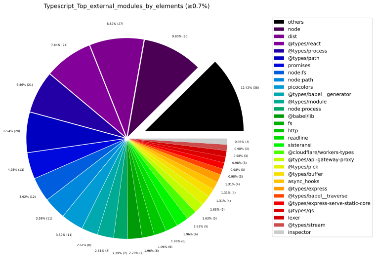
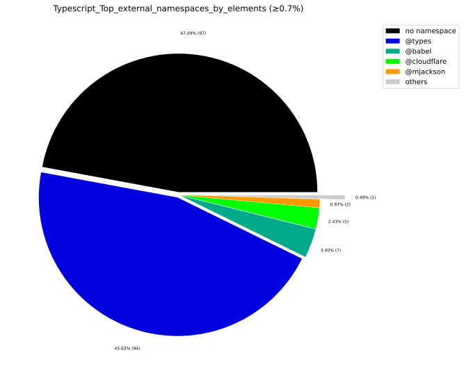
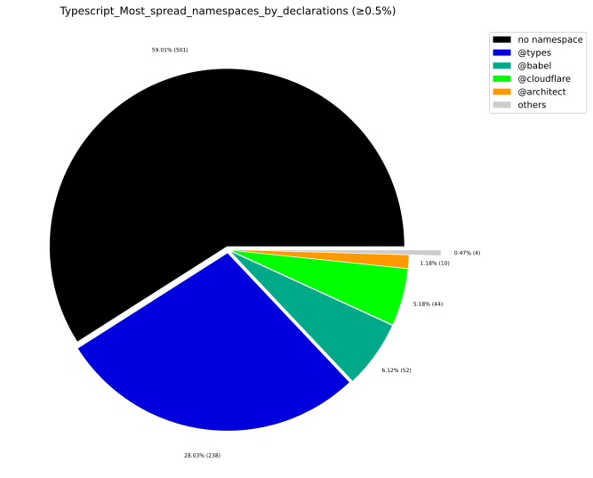
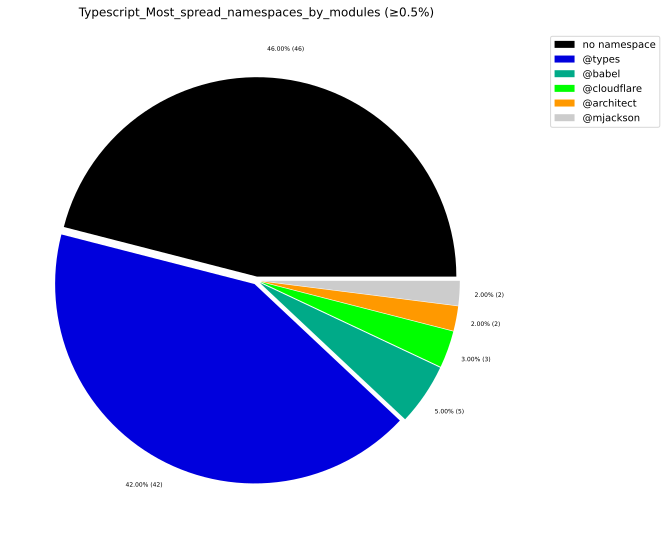

# 📦 External Dependencies Report

## 1. Executive Overview

Analyzes which external packages, modules, and namespaces the codebase depends on, their spread, and per-artifact usage.

> **Who imports whom?**
> High spread (many internal modules referencing the same external package) = candidate for a **facade** or **anti-corruption layer**.

## 📚 Table of Contents

1. [Executive Overview](#1-executive-overview)
1. [Java External Dependencies](#2-java-external-dependencies)
1. [TypeScript External Dependencies](#3-typescript-external-dependencies)
1. [Package Management](#4-package-management)
1. [Glossary](#5-glossary)

---

## 2. Java External Dependencies

### 2.1 Most Used External Packages

External Java packages by internal caller type count. High `numberOfExternalCallerTypes` = deeply embedded.

### 2.2 Most Used External Packages — Second-Level Grouping

Second-level package names (e.g. `javax.xml` from `javax.xml.stream`) reveal **framework-level** coupling that is hidden when viewing full package names.

### 2.3 Most Spread External Packages

Packages referenced from the highest number of **different internal packages**.  
High spread indicates a pervasive cross-cutting dependency that is hard to replace.

### 2.4 External Package Usage per Artifact (Top)

Artifacts ranked by number of internal packages with external dependencies.

### 2.5 Aggregated External Package Usage per Artifact

Per-artifact: how many internal packages use external ones and their percentage.

### 2.6 Java Charts

---

## 3. TypeScript External Dependencies

### 3.1 Most Used External Modules

External npm modules ranked by how many internal TypeScript elements import them.

| externalModuleName | numberOfExternalCallerModules | numberOfExternalCallerElements | numberOfExternalDeclarationCalls | numberOfExternalDeclarationCallsWeighted | allModules | allInternalElements | exampleStories |
| --- | --- | --- | --- | --- | --- | --- | --- |
| node | 22 | 30 | 263 | 422 | 139 | 645 | ["<reactRouterRSCVitePlugin> of module <vite> imports <transformWithEsbuild> from external module <node>","<reactRouterRSCVitePlugin> of module <vite> imports <ResolvedBuildEnvironmentOptions.outDir> from external module <node>","<reactRouterRSCVitePlugin> of module <vite> imports <createLogger> from external module <node>","<reactRouterRSCVitePlugin> of module <vite> imports <ResolvedConfig.environments> from external module <node>"] |
| @types/process | 19 | 21 | 48 | 97 | 139 | 645 | ["<getBuildTimeHeader> of module <dev> imports <global.NodeJS.ProcessEnv.hasOwnProperty> from external module <process>","<getBuildTimeHeader> of module <dev> imports <global.NodeJS.Process.env> from external module <process>","<getBuildTimeHeader> of module <dev> imports <global.NodeJS.ProcessEnv.IS_RR_BUILD_REQUEST> from external module <process>","<Context> of module <create-react-router> imports <global.NodeJS.ReadStream> from external module <process>"] |
| dist | 17 | 27 | 104 | 373 | 139 | 645 | ["<createCookie> of module <react-router> imports <parse> from external module <dist>","<createCookie> of module <react-router> imports <serialize> from external module <dist>","<createCookie> of module <react-router> imports <Cookies.name> from external module <dist>","<createCookie> of module <cookies> imports <parse> from external module <dist>"] |
| @types/path | 14 | 20 | 55 | 122 | 139 | 645 | ["<normalizeSlashes> of module <normalizeSlashes> imports <path.PlatformPath.sep> from external module <path>","<normalizeSlashes> of module <normalizeSlashes> imports <path.PlatformPath.win32> from external module <path>","<flatRoutesUniversal> of module <flatRoutes> imports <path.PlatformPath.posix> from external module <path>","<flatRoutesUniversal> of module <flatRoutes> imports <path.PlatformPath.extname> from external module <path>"] |
| node:fs | 10 | 12 | 26 | 49 | 139 | 645 | ["<flatRoutes> of module <flatRoutes> imports <.existsSync> from external module <node:fs>","<flatRoutes> of module <flatRoutes> imports <node:fs> from external module <node:fs>","<flatRoutes> of module <flatRoutes> imports <.readdirSync> from external module <node:fs>","<flatRoutes> of module <react-router-fs-routes> imports <.existsSync> from external module <node:fs>"] |
| picocolors | 10 | 11 | 14 | 85 | 139 | 645 | ["<color> of module <utils> imports <picocolors> from external module <picocolors>","<reactRouterRSCVitePlugin> of module <vite> imports <picocolors> from external module <picocolors>","<reactRouterRSCVitePlugin> of module <plugin> imports <picocolors> from external module <picocolors>","<reactRouterVitePlugin> of module <plugin> imports <picocolors> from external module <picocolors>"] |
| promises | 9 | 13 | 37 | 59 | 139 | 645 | ["<getDirectoryFilesRecursive> of module <utils> imports <readdir> from external module <promises>","<ensureDirectory> of module <utils> imports <.mkdir> from external module <promises>","<fileExists> of module <utils> imports <.stat> from external module <promises>","<directoryExists> of module <utils> imports <.stat> from external module <promises>"] |
| @types/react | 8 | 24 | 91 | 390 | 139 | 645 | ["<AwaitContextProvider> of module <react-router> imports <React.FunctionComponentElement> from external module <react>","<AwaitContextProvider> of module <react-router> imports <React.Context.Provider> from external module <react>","<AwaitContextProvider> of module <react-router> imports <React.createElement> from external module <react>","<AwaitContextProvider> of module <react-router> imports <React.ProviderProps> from external module <react>"] |
| @types/module | 7 | 8 | 9 | 11 | 139 | 645 | ["<reactRouterVitePlugin> of module <plugin> imports <global.NodeJS.Require.resolve> from external module <module>","<reactRouterVitePlugin> of module <vite> imports <global.NodeJS.Require.resolve> from external module <module>","<generateEntry> of module <commands> imports <global.NodeJS.Require.resolve> from external module <module>","<run> of module <run> imports <global.NodeJS.Require.main> from external module <module>"] |
| http | 7 | 6 | 16 | 22 | 139 | 645 | ["<createRemixHeaders> of module <server> imports <IncomingHttpHeaders> from external module <http>","<reactRouterRSCVitePlugin> of module <vite> imports <ServerResponse.setHeader> from external module <http>","<reactRouterRSCVitePlugin> of module <vite> imports <ServerResponse.end> from external module <http>","<reactRouterRSCVitePlugin> of module <vite> imports <ServerResponse.statusCode> from external module <http>"] |
| node:path | 7 | 11 | 11 | 28 | 139 | 645 | ["<normalizeSlashes> of module <normalizeSlashes> imports <node:path> from external module <node:path>","<flatRoutesUniversal> of module <flatRoutes> imports <node:path> from external module <node:path>","<flatRoutes> of module <flatRoutes> imports <node:path> from external module <node:path>","<isSegmentSeparator> of module <flatRoutes> imports <node:path> from external module <node:path>"] |
| @types/babel__generator | 6 | 8 | 13 | 15 | 139 | 645 | ["<reactRouterVitePlugin> of module <plugin> imports <GeneratorResult> from external module <babel__generator>","<reactRouterVitePlugin> of module <plugin> imports <GeneratorResult.code> from external module <babel__generator>","<reactRouterVitePlugin> of module <vite> imports <GeneratorResult> from external module <babel__generator>","<reactRouterVitePlugin> of module <vite> imports <GeneratorResult.code> from external module <babel__generator>"] |
| @types/buffer | 6 | 4 | 12 | 13 | 139 | 645 | ["<reactRouterVitePlugin> of module <plugin> imports <global.NonSharedBuffer.toString> from external module <buffer>","<reactRouterVitePlugin> of module <vite> imports <global.NonSharedBuffer.toString> from external module <buffer>","<createReactRouterRequest> of module <server> imports <global.BufferConstructor.from> from external module <buffer>","<createReactRouterRequest> of module <server> imports <global.Buffer.toString> from external module <buffer>"] |
| fs | 6 | 6 | 17 | 27 | 139 | 645 | ["<flatRoutes> of module <flatRoutes> imports <Dirent.isFile> from external module <fs>","<flatRoutes> of module <flatRoutes> imports <Dirent.name> from external module <fs>","<flatRoutes> of module <flatRoutes> imports <Dirent.isDirectory> from external module <fs>","<fileExists> of module <utils> imports <Stats.isFile> from external module <fs>"] |
| readline | 6 | 6 | 10 | 56 | 139 | 645 | ["<ConfirmPrompt> of module <prompts-confirm> imports <Key> from external module <readline>","<MultiSelectPrompt> of module <prompts-multi-select> imports <Key> from external module <readline>","<Prompt> of module <prompts-prompt-base> imports <Key> from external module <readline>","<Prompt> of module <prompts-prompt-base> imports <Interface.close> from external module <readline>"] |
| sisteransi | 6 | 6 | 27 | 116 | 139 | 645 | ["<ConfirmPrompt> of module <prompts-confirm> imports <cursor.to> from external module <sisteransi>","<ConfirmPrompt> of module <prompts-confirm> imports <erase.line> from external module <sisteransi>","<ConfirmPrompt> of module <prompts-confirm> imports <erase> from external module <sisteransi>","<ConfirmPrompt> of module <prompts-confirm> imports <cursor.hide> from external module <sisteransi>"] |
| @babel/lib | 5 | 7 | 65 | 143 | 139 | 645 | ["<transpile> of module <useJavascript> imports <lib> from external module <lib>","<transpile> of module <useJavascript> imports <lib> from external module <lib>","<removeExports> of module <remove-exports> imports <Expression.type> from external module <lib>","<removeExports> of module <remove-exports> imports <ExportDefaultDeclaration.declaration> from external module <lib>"] |
| @types/pick | 5 | 5 | 9 | 9 | 139 | 645 | ["<index> of module <routes> imports <pick> from external module <pick>","<index> of module <routes> imports <pick> from external module <pick>","<route> of module <routes> imports <pick> from external module <pick>","<route> of module <routes> imports <pick> from external module <pick>"] |
| lexer | 4 | 3 | 6 | 6 | 139 | 645 | ["<reactRouterRSCVitePlugin> of module <vite> imports <init> from external module <lexer>","<reactRouterRSCVitePlugin> of module <plugin> imports <init> from external module <lexer>","<reactRouterVitePlugin> of module <plugin> imports <init> from external module <lexer>","<reactRouterVitePlugin> of module <vite> imports <init> from external module <lexer>"] |
| @cloudflare/workers-types | 3 | 5 | 52 | 68 | 139 | 645 | ["<createWorkersKVSessionStorage> of module <react-router-cloudflare> imports <KVNamespace.get> from external module <workers-types>","<createWorkersKVSessionStorage> of module <react-router-cloudflare> imports <Crypto.getRandomValues> from external module <workers-types>","<createWorkersKVSessionStorage> of module <react-router-cloudflare> imports <KVNamespace.delete> from external module <workers-types>","<createWorkersKVSessionStorage> of module <react-router-cloudflare> imports <KVNamespace.put> from external module <workers-types>"] |
| @types/babel__core | 3 | 2 | 8 | 9 | 139 | 645 | ["<reactRouterVitePlugin> of module <plugin> imports <transformAsync> from external module <babel__core>","<reactRouterVitePlugin> of module <plugin> imports <BabelFileResult.map> from external module <babel__core>","<reactRouterVitePlugin> of module <plugin> imports <BabelFileResult.code> from external module <babel__core>","<reactRouterVitePlugin> of module <vite> imports <transformAsync> from external module <babel__core>"] |
| @types/babel__traverse | 3 | 3 | 17 | 49 | 139 | 645 | ["<removeExports> of module <remove-exports> imports <NodePath.parentPath> from external module <babel__traverse>","<removeExports> of module <remove-exports> imports <NodePath.isProgram> from external module <babel__traverse>","<removeExports> of module <remove-exports> imports <NodePath.remove> from external module <babel__traverse>","<removeExports> of module <remove-exports> imports <NodePath.node> from external module <babel__traverse>"] |
| node:process | 3 | 7 | 7 | 58 | 139 | 645 | ["<Context> of module <create-react-router> imports <node:process> from external module <node:process>","<PromptOptions> of module <prompts-prompt-base> imports <node:process> from external module <node:process>","<Prompt> of module <prompts-prompt-base> imports <node:process> from external module <node:process>","<setStderr> of module <utils> imports <node:process> from external module <node:process>"] |
| node:url | 3 | 2 | 4 | 6 | 139 | 645 | ["<copyTemplate> of module <copy-template> imports <node:url> from external module <node:url>","<copyTemplate> of module <copy-template> imports <.fileURLToPath> from external module <node:url>","<reactRouterVitePlugin> of module <plugin> imports <.pathToFileURL> from external module <node:url>","<reactRouterVitePlugin> of module <vite> imports <.pathToFileURL> from external module <node:url>"] |
| @architect/functions | 2 | 1 | 4 | 4 | 139 | 645 | ["<createArcTableSessionStorage> of module <react-router-architect> imports <functions> from external module <functions>","<createArcTableSessionStorage> of module <react-router-architect> imports <tables> from external module <functions>","<createArcTableSessionStorage> of module <arcTableSessionStorage> imports <functions> from external module <functions>","<createArcTableSessionStorage> of module <arcTableSessionStorage> imports <tables> from external module <functions>"] |
| @architect/tables | 2 | 1 | 6 | 10 | 139 | 645 | ["<createArcTableSessionStorage> of module <react-router-architect> imports <ArcTable.get> from external module <tables>","<createArcTableSessionStorage> of module <react-router-architect> imports <ArcTable.put> from external module <tables>","<createArcTableSessionStorage> of module <react-router-architect> imports <ArcTable.delete> from external module <tables>","<createArcTableSessionStorage> of module <arcTableSessionStorage> imports <ArcTable.get> from external module <tables>"] |
| @babel/babel-parser | 2 | 2 | 3 | 5 | 139 | 645 | ["<removeExports> of module <remove-exports> imports <ParseResult> from external module <babel-parser>","<decorateComponentExportsWithProps> of module <with-props> imports <ParseResult.program> from external module <babel-parser>","<decorateComponentExportsWithProps> of module <with-props> imports <ParseResult> from external module <babel-parser>"] |
| @mjackson/node-fetch-server | 2 | 2 | 4 | 4 | 139 | 645 | ["<RequestListenerOptions> of module <server> imports <ClientAddress> from external module <node-fetch-server>","<RequestListenerOptions> of module <react-router-node> imports <ClientAddress> from external module <node-fetch-server>","<createRequestListener> of module <server> imports <createRequestListener> from external module <node-fetch-server>","<createRequestListener> of module <react-router-node> imports <createRequestListener> from external module <node-fetch-server>"] |
| @types/api-gateway-proxy | 2 | 5 | 24 | 34 | 139 | 645 | ["<RequestHandler> of module <react-router-architect> imports <APIGatewayProxyEventV2> from external module <api-gateway-proxy>","<RequestHandler> of module <react-router-architect> imports <APIGatewayProxyResultV2> from external module <api-gateway-proxy>","<RequestHandler> of module <react-router-architect> imports <APIGatewayEventRequestContextV2> from external module <api-gateway-proxy>","<RequestHandler> of module <server> imports <APIGatewayProxyEventV2> from external module <api-gateway-proxy>"] |
| @types/express | 2 | 4 | 26 | 30 | 139 | 645 | ["<GetLoadContextFunction> of module <react-router-express> imports <e.Response> from external module <express>","<GetLoadContextFunction> of module <react-router-express> imports <e.Request> from external module <express>","<GetLoadContextFunction> of module <server> imports <e.Response> from external module <express>","<GetLoadContextFunction> of module <server> imports <e.Request> from external module <express>"] |
| @types/express-serve-static-core | 2 | 3 | 6 | 6 | 139 | 645 | ["<GetLoadContextFunction> of module <react-router-express> imports <ParamsDictionary> from external module <express-serve-static-core>","<GetLoadContextFunction> of module <server> imports <ParamsDictionary> from external module <express-serve-static-core>","<RequestHandler> of module <server> imports <ParamsDictionary> from external module <express-serve-static-core>","<RequestHandler> of module <react-router-express> imports <ParamsDictionary> from external module <express-serve-static-core>"] |
| @types/handler | 2 | 1 | 4 | 4 | 139 | 645 | ["<RequestHandler> of module <react-router-architect> imports <Callback> from external module <handler>","<RequestHandler> of module <react-router-architect> imports <Context> from external module <handler>","<RequestHandler> of module <server> imports <Callback> from external module <handler>","<RequestHandler> of module <server> imports <Context> from external module <handler>"] |
| @types/jsesc | 2 | 1 | 2 | 4 | 139 | 645 | ["<reactRouterVitePlugin> of module <plugin> imports <jsesc> from external module <jsesc>","<reactRouterVitePlugin> of module <vite> imports <jsesc> from external module <jsesc>"] |
| @types/qs | 2 | 3 | 5 | 5 | 139 | 645 | ["<GetLoadContextFunction> of module <react-router-express> imports <QueryString.ParsedQs> from external module <qs>","<GetLoadContextFunction> of module <server> imports <QueryString.ParsedQs> from external module <qs>","<RequestHandler> of module <server> imports <QueryString.ParsedQs> from external module <qs>","<RequestHandler> of module <react-router-express> imports <QueryString.ParsedQs> from external module <qs>"] |
| @types/stream | 2 | 3 | 18 | 20 | 139 | 645 | ["<writeAsyncIterableToWritable> of module <react-router-node> imports <Stream.Writable.end> from external module <stream>","<writeAsyncIterableToWritable> of module <react-router-node> imports <Stream.Writable> from external module <stream>","<writeAsyncIterableToWritable> of module <react-router-node> imports <Stream.Writable.destroy> from external module <stream>","<writeAsyncIterableToWritable> of module <react-router-node> imports <Stream.Writable.write> from external module <stream>"] |
| async_hooks | 2 | 4 | 8 | 8 | 139 | 645 | ["<redirect> of module <react-router> imports <AsyncLocalStorage.getStore> from external module <async_hooks>","<redirect> of module <server> imports <AsyncLocalStorage.getStore> from external module <async_hooks>","<getRequest> of module <react-router> imports <AsyncLocalStorage.getStore> from external module <async_hooks>","<getRequest> of module <server> imports <AsyncLocalStorage.getStore> from external module <async_hooks>"] |
| cli | 2 | 1 | 2 | 4 | 139 | 645 | ["<cloudflareDevProxyVitePlugin> of module <cloudflare> imports <GetPlatformProxyOptions> from external module <cli>","<cloudflareDevProxyVitePlugin> of module <cloudflare-dev-proxy> imports <GetPlatformProxyOptions> from external module <cli>"] |
| crypto | 2 | 1 | 4 | 4 | 139 | 645 | ["<reactRouterVitePlugin> of module <plugin> imports <Hash.digest> from external module <crypto>","<reactRouterVitePlugin> of module <plugin> imports <Hash.update> from external module <crypto>","<reactRouterVitePlugin> of module <vite> imports <Hash.digest> from external module <crypto>","<reactRouterVitePlugin> of module <vite> imports <Hash.update> from external module <crypto>"] |
| esm | 2 | 2 | 6 | 7 | 139 | 645 | ["<flatRoutes> of module <flatRoutes> imports <makeRe> from external module <esm>","<createConfigLoader> of module <config> imports <FSWatcher.unwatch> from external module <esm>","<createConfigLoader> of module <config> imports <FSWatcher.add> from external module <esm>","<createConfigLoader> of module <config> imports <esm> from external module <esm>"] |
| module-runner | 2 | 1 | 2 | 2 | 139 | 645 | ["<reactRouterVitePlugin> of module <plugin> imports <ModuleRunner.import> from external module <module-runner>","<reactRouterVitePlugin> of module <vite> imports <ModuleRunner.import> from external module <module-runner>"] |
| node:crypto | 2 | 1 | 2 | 2 | 139 | 645 | ["<reactRouterVitePlugin> of module <plugin> imports <createHash> from external module <node:crypto>","<reactRouterVitePlugin> of module <vite> imports <createHash> from external module <node:crypto>"] |
| rollup | 2 | 1 | 6 | 10 | 139 | 645 | ["<reactRouterVitePlugin> of module <plugin> imports <ResolvedId.id> from external module <rollup>","<reactRouterVitePlugin> of module <plugin> imports <PluginContext.environment> from external module <rollup>","<reactRouterVitePlugin> of module <plugin> imports <PluginContext.resolve> from external module <rollup>","<reactRouterVitePlugin> of module <vite> imports <ResolvedId.id> from external module <rollup>"] |
| url | 2 | 1 | 2 | 4 | 139 | 645 | ["<reactRouterVitePlugin> of module <plugin> imports <URL.href> from external module <url>","<reactRouterVitePlugin> of module <vite> imports <URL.href> from external module <url>"] |
| @types/APIGatewayProxyEventHeaders."content-type | 1 | 1 | 1 | 1 | 139 | 645 | ["<createReactRouterRequest> of module <server> imports <APIGatewayProxyEventHeaders.\"content-type\"> from external module <APIGatewayProxyEventHeaders.\"content-type>"] |
| @types/APIGatewayProxyEventHeaders."x-forwarded-host | 1 | 1 | 1 | 1 | 139 | 645 | ["<createReactRouterRequest> of module <server> imports <APIGatewayProxyEventHeaders.\"x-forwarded-host\"> from external module <APIGatewayProxyEventHeaders.\"x-forwarded-host>"] |
| @types/events | 1 | 1 | 1 | 1 | 139 | 645 | ["<Prompt> of module <prompts-prompt-base> imports <EventEmitter> from external module <events>"] |
| @types/isEqual | 1 | 1 | 1 | 2 | 139 | 645 | ["<createConfigLoader> of module <config> imports <isEqual> from external module <isEqual>"] |
| @types/kebabCase | 1 | 1 | 1 | 1 | 139 | 645 | ["<getEnvironmentOptionsResolvers> of module <plugin> imports <kebabCase> from external module <kebabCase>"] |
| @types/semver | 1 | 1 | 2 | 2 | 139 | 645 | ["<run> of module <run> imports <semver> from external module <semver>","<run> of module <run> imports <major> from external module <semver>"] |
| @types/timers | 1 | 1 | 1 | 5 | 139 | 645 | ["<SelectPrompt> of module <prompts-select> imports <global.NodeJS.Timeout> from external module <timers>"] |
| arg | 1 | 1 | 2 | 3 | 139 | 645 | ["<run> of module <run> imports <arg> from external module <arg>","<run> of module <run> imports <arg.Result._> from external module <arg>"] |
| arg.Result."--no-typescript | 1 | 1 | 1 | 1 | 139 | 645 | ["<run> of module <run> imports <arg.Result.\"--no-typescript\"> from external module <arg.Result.\"--no-typescript>"] |
| exit-hook | 1 | 1 | 1 | 1 | 139 | 645 | ["<dev> of module <commands> imports <exit-hook> from external module <exit-hook>"] |
| inspector | 1 | 3 | 4 | 6 | 139 | 645 | ["<start> of module <profiler> imports <Session.connect> from external module <inspector>","<start> of module <profiler> imports <Session.post> from external module <inspector>","<stop> of module <profiler> imports <Session.post> from external module <inspector>","<getSession> of module <profiler> imports <Session> from external module <inspector>"] |
| node:child_process | 1 | 1 | 1 | 1 | 139 | 645 | ["<resolveEntryFiles> of module <config> imports <execSync> from external module <node:child_process>"] |
| node:inspector | 1 | 1 | 1 | 1 | 139 | 645 | ["<start> of module <profiler> imports <.Session> from external module <node:inspector>"] |
| node:readline | 1 | 1 | 3 | 20 | 139 | 645 | ["<Prompt> of module <prompts-prompt-base> imports <node:readline> from external module <node:readline>","<Prompt> of module <prompts-prompt-base> imports <.emitKeypressEvents> from external module <node:readline>","<Prompt> of module <prompts-prompt-base> imports <.createInterface> from external module <node:readline>"] |
| p-map | 1 | 1 | 1 | 1 | 139 | 645 | ["<prerender> of module <prerender> imports <p-map> from external module <p-map>"] |
| prettier | 1 | 1 | 2 | 2 | 139 | 645 | ["<transpile> of module <useJavascript> imports <prettier> from external module <prettier>","<transpile> of module <useJavascript> imports <format> from external module <prettier>"] |
| server | 1 | 2 | 4 | 4 | 139 | 645 | ["<Context> of module <vite-node> imports <ViteNodeServer> from external module <server>","<createContext> of module <vite-node> imports <ViteNodeServer.fetchModule> from external module <server>","<createContext> of module <vite-node> imports <ViteNodeServer.getSourceMap> from external module <server>","<createContext> of module <vite-node> imports <ViteNodeServer.resolveId> from external module <server>"] |
| types | 1 | 1 | 1 | 2 | 139 | 645 | ["<color> of module <utils> imports <Formatter> from external module <types>"] |

### 3.2 Most Used External Namespaces

Groups by namespace to reveal declaration-level coupling within npm packages.

| externalNamespaceName | numberOfExternalCallerModules | numberOfExternalCallerElements | numberOfExternalDeclarationCalls | numberOfExternalDeclarationCallsWeighted | allModules | allInternalElements | exampleStories |
| --- | --- | --- | --- | --- | --- | --- | --- |
| no namespace | 53 | 97 | 595 | 1390 | 139 | 645 | ["<redirect> of module <react-router> imports <AsyncLocalStorage.getStore> from external namespace <>","<redirect> of module <server> imports <AsyncLocalStorage.getStore> from external namespace <>","<createCookie> of module <react-router> imports <parse> from external namespace <>","<createCookie> of module <react-router> imports <serialize> from external namespace <>"] |
| @types | 51 | 94 | 355 | 831 | 139 | 645 | ["<AwaitContextProvider> of module <react-router> imports <React.FunctionComponentElement> from external namespace <@types>","<AwaitContextProvider> of module <react-router> imports <React.Context.Provider> from external namespace <@types>","<AwaitContextProvider> of module <react-router> imports <React.createElement> from external namespace <@types>","<AwaitContextProvider> of module <react-router> imports <React.ProviderProps> from external namespace <@types>"] |
| @babel | 5 | 7 | 68 | 148 | 139 | 645 | ["<transpile> of module <useJavascript> imports <lib> from external namespace <@babel>","<transpile> of module <useJavascript> imports <lib> from external namespace <@babel>","<removeExports> of module <remove-exports> imports <Expression.type> from external namespace <@babel>","<removeExports> of module <remove-exports> imports <ExportDefaultDeclaration.declaration> from external namespace <@babel>"] |
| @cloudflare | 3 | 5 | 52 | 68 | 139 | 645 | ["<createWorkersKVSessionStorage> of module <react-router-cloudflare> imports <KVNamespace.get> from external namespace <@cloudflare>","<createWorkersKVSessionStorage> of module <react-router-cloudflare> imports <Crypto.getRandomValues> from external namespace <@cloudflare>","<createWorkersKVSessionStorage> of module <react-router-cloudflare> imports <KVNamespace.delete> from external namespace <@cloudflare>","<createWorkersKVSessionStorage> of module <react-router-cloudflare> imports <KVNamespace.put> from external namespace <@cloudflare>"] |
| @architect | 2 | 1 | 10 | 14 | 139 | 645 | ["<createArcTableSessionStorage> of module <react-router-architect> imports <functions> from external namespace <@architect>","<createArcTableSessionStorage> of module <react-router-architect> imports <ArcTable.get> from external namespace <@architect>","<createArcTableSessionStorage> of module <react-router-architect> imports <tables> from external namespace <@architect>","<createArcTableSessionStorage> of module <react-router-architect> imports <ArcTable.put> from external namespace <@architect>"] |
| @mjackson | 2 | 2 | 4 | 4 | 139 | 645 | ["<RequestListenerOptions> of module <server> imports <ClientAddress> from external namespace <@mjackson>","<RequestListenerOptions> of module <react-router-node> imports <ClientAddress> from external namespace <@mjackson>","<createRequestListener> of module <server> imports <createRequestListener> from external namespace <@mjackson>","<createRequestListener> of module <react-router-node> imports <createRequestListener> from external namespace <@mjackson>"] |

### 3.3 Most Spread External Modules

External modules referenced from the highest number of **different internal TypeScript modules**.

| externalModuleName | numberOfInternalModules | sumNumberOfUsedExternalDeclarations | minNumberOfUsedExternalDeclarations | maxNumberOfUsedExternalDeclarations | medNumberOfUsedExternalDeclarations | avgNumberOfUsedExternalDeclarations | stdNumberOfUsedExternalDeclarations | sumNumberOfInternalElements | minNumberOfInternalElements | maxNumberOfInternalElements | medNumberOfInternalElements | avgNumberOfInternalElements | stdNumberOfInternalElements | minNumberOfInternalElementsPercentage | maxNumberOfInternalElementsPercentage | medNumberOfInternalElementsPercentage | avgNumberOfInternalElementsPercentage | stdNumberOfInternalElementsPercentage | internalModuleExamples |
| --- | --- | --- | --- | --- | --- | --- | --- | --- | --- | --- | --- | --- | --- | --- | --- | --- | --- | --- | --- |
| node | 20 | 231 | 1 | 76 | 3 | 11.55 | 21.91004335915381 | 33 | 1 | 8 | 1 | 1.65 | 1.7554426642213128 | 0.15503875968992248 | 1.2403100775193798 | 0.15503875968992248 | 0.2558139534883721 | 0.27216165336764536 | ["vite","plugin","commands","config"] |
| @types/process | 17 | 42 | 1 | 5 | 2 | 2.4705882352941178 | 1.5458673560021057 | 24 | 1 | 4 | 1 | 1.411764705882353 | 0.7952062255644572 | 0.15503875968992248 | 0.6201550387596899 | 0.15503875968992248 | 0.21887824897400823 | 0.12328778690921821 | ["dev","create-react-router","loading-indicator","prompts-prompt-base"] |
| dist | 15 | 80 | 1 | 26 | 4 | 5.333333333333334 | 6.309478885734052 | 31 | 1 | 5 | 1 | 2.0666666666666664 | 1.4375905768565218 | 0.15503875968992248 | 0.7751937984496124 | 0.15503875968992248 | 0.3204134366925064 | 0.2228822599777552 | ["react-router","cookies","sessions","routes"] |
| @types/path | 13 | 41 | 1 | 7 | 2 | 3.1538461538461533 | 2.192645048267573 | 22 | 1 | 5 | 1 | 1.6923076923076923 | 1.1821319289469756 | 0.15503875968992248 | 0.7751937984496124 | 0.15503875968992248 | 0.2623732856290996 | 0.18327626805379468 | ["normalizeSlashes","flatRoutes","react-router-fs-routes","utils"] |
| node:fs | 10 | 21 | 1 | 4 | 2 | 2.1 | 0.9944289260117533 | 14 | 1 | 3 | 1 | 1.4 | 0.8432740427115678 | 0.15503875968992248 | 0.46511627906976744 | 0.15503875968992248 | 0.21705426356589144 | 0.1307401616607082 | ["flatRoutes","react-router-fs-routes","utils","plugin"] |
| picocolors | 9 | 10 | 1 | 2 | 1 | 1.1111111111111114 | 0.33333333333333337 | 13 | 1 | 3 | 1 | 1.4444444444444444 | 0.7264831572567788 | 0.15503875968992248 | 0.46511627906976744 | 0.15503875968992248 | 0.22394487510766578 | 0.11263304763670991 | ["utils","vite","plugin","commands"] |
| promises | 8 | 31 | 2 | 7 | 3.5 | 3.875 | 2.1001700611413083 | 16 | 1 | 4 | 1.5 | 2 | 1.3093073414159542 | 0.15503875968992248 | 0.6201550387596899 | 0.23255813953488372 | 0.31007751937984496 | 0.20299338626603944 | ["utils","vite","plugin","commands"] |
| @types/module | 7 | 7 | 1 | 1 | 1 | 1 | 0 | 9 | 1 | 2 | 1 | 1.2857142857142856 | 0.4879500364742666 | 0.15503875968992248 | 0.31007751937984496 | 0.15503875968992248 | 0.19933554817275748 | 0.07565116844562272 | ["plugin","vite","commands","run"] |
| @types/babel__generator | 6 | 10 | 1 | 2 | 2 | 1.6666666666666667 | 0.5163977794943222 | 9 | 1 | 3 | 1 | 1.5 | 0.8366600265340756 | 0.15503875968992248 | 0.46511627906976744 | 0.15503875968992248 | 0.23255813953488372 | 0.1297147327959807 | ["plugin","vite","generate","babel"] |
| @types/buffer | 6 | 11 | 1 | 3 | 2 | 1.8333333333333335 | 0.752772652709081 | 7 | 1 | 2 | 1 | 1.1666666666666665 | 0.408248290463863 | 0.15503875968992248 | 0.31007751937984496 | 0.15503875968992248 | 0.18087855297157623 | 0.06329430859904853 | ["plugin","vite","server","react-router-node"] |
| @types/react | 6 | 34 | 1 | 12 | 4.5 | 5.666666666666667 | 4.179314138308661 | 38 | 1 | 14 | 4 | 6.333333333333333 | 5.715476066494082 | 0.15503875968992248 | 2.1705426356589146 | 0.6201550387596899 | 0.9819121447028424 | 0.8861203203866795 | ["react-router","context","server","utils"] |
| node:path | 6 | 6 | 1 | 1 | 1 | 1 | 0 | 11 | 1 | 3 | 1.5 | 1.8333333333333333 | 0.983192080250175 | 0.15503875968992248 | 0.46511627906976744 | 0.23255813953488372 | 0.2842377260981912 | 0.15243288065894187 | ["normalizeSlashes","flatRoutes","react-router-fs-routes","utils"] |
| readline | 6 | 10 | 1 | 4 | 1 | 1.6666666666666665 | 1.2110601416389966 | 6 | 1 | 1 | 1 | 1 | 0 | 0.15503875968992248 | 0.15503875968992248 | 0.15503875968992248 | 0.15503875968992248 | 0 | ["prompts-confirm","prompts-multi-select","prompts-prompt-base","prompts-select"] |
| sisteransi | 6 | 27 | 3 | 7 | 4 | 4.5 | 1.378404875209022 | 6 | 1 | 1 | 1 | 1 | 0 | 0.15503875968992248 | 0.15503875968992248 | 0.15503875968992248 | 0.15503875968992248 | 0 | ["prompts-confirm","prompts-multi-select","prompts-prompt-base","prompts-select"] |
| @babel/lib | 5 | 49 | 2 | 17 | 8 | 9.8 | 6.496152707564686 | 7 | 1 | 3 | 1 | 1.4 | 0.8944271909999159 | 0.15503875968992248 | 0.46511627906976744 | 0.15503875968992248 | 0.21705426356589144 | 0.13867088232556835 | ["useJavascript","remove-exports","route-chunks","styles"] |
| fs | 5 | 17 | 2 | 5 | 3 | 3.4 | 1.51657508881031 | 8 | 1 | 2 | 2 | 1.6 | 0.5477225575051662 | 0.15503875968992248 | 0.31007751937984496 | 0.31007751937984496 | 0.24806201550387597 | 0.08491822596979319 | ["flatRoutes","utils","vite","plugin"] |
| http | 5 | 11 | 1 | 3 | 2 | 2.2 | 0.8366600265340756 | 9 | 1 | 2 | 2 | 1.8 | 0.4472135954999579 | 0.15503875968992248 | 0.31007751937984496 | 0.31007751937984496 | 0.27906976744186046 | 0.06933544116278417 | ["server","vite","plugin","node-adapter"] |
| @types/pick | 4 | 4 | 1 | 1 | 1 | 1 | 0 | 6 | 1 | 3 | 1 | 1.5 | 1 | 0.15503875968992248 | 0.46511627906976744 | 0.15503875968992248 | 0.2325581395348837 | 0.15503875968992248 | ["routes","plugin","vite","config"] |
| @cloudflare/workers-types | 3 | 44 | 4 | 22 | 18 | 14.666666666666666 | 9.451631252505218 | 10 | 1 | 5 | 4 | 3.3333333333333335 | 2.0816659994661326 | 0.15503875968992248 | 0.7751937984496124 | 0.6201550387596899 | 0.516795865633075 | 0.32273891464591203 | ["react-router-cloudflare","workersKVStorage","worker"] |
| @types/babel__core | 3 | 8 | 2 | 3 | 3 | 2.6666666666666665 | 0.5773502691896257 | 3 | 1 | 1 | 1 | 1 | 0 | 0.15503875968992248 | 0.15503875968992248 | 0.15503875968992248 | 0.15503875968992248 | 0 | ["plugin","vite","useJavascript"] |
| @types/babel__traverse | 3 | 17 | 2 | 11 | 4 | 5.666666666666666 | 4.725815626252609 | 3 | 1 | 1 | 1 | 1 | 0 | 0.15503875968992248 | 0.15503875968992248 | 0.15503875968992248 | 0.15503875968992248 | 0 | ["remove-exports","styles","with-props"] |
| lexer | 3 | 4 | 1 | 2 | 1 | 1.3333333333333333 | 0.5773502691896258 | 5 | 1 | 2 | 2 | 1.6666666666666667 | 0.5773502691896258 | 0.15503875968992248 | 0.31007751937984496 | 0.31007751937984496 | 0.25839793281653745 | 0.08951166964180243 | ["vite","plugin","virtual-route-modules"] |
| node:process | 3 | 3 | 1 | 1 | 1 | 1 | 0 | 7 | 1 | 4 | 2 | 2.3333333333333335 | 1.5275252316519465 | 0.15503875968992248 | 0.6201550387596899 | 0.31007751937984496 | 0.36175710594315247 | 0.23682561731037932 | ["create-react-router","prompts-prompt-base","utils"] |
| node:url | 3 | 4 | 1 | 2 | 1 | 1.3333333333333333 | 0.5773502691896257 | 3 | 1 | 1 | 1 | 1 | 0 | 0.15503875968992248 | 0.15503875968992248 | 0.15503875968992248 | 0.15503875968992248 | 0 | ["copy-template","plugin","vite"] |
| @architect/functions | 2 | 4 | 2 | 2 | 2 | 2 | 0 | 2 | 1 | 1 | 1 | 1 | 0 | 0.15503875968992248 | 0.15503875968992248 | 0.15503875968992248 | 0.15503875968992248 | 0 | ["react-router-architect","arcTableSessionStorage"] |
| @architect/tables | 2 | 6 | 3 | 3 | 3 | 3 | 0 | 2 | 1 | 1 | 1 | 1 | 0 | 0.15503875968992248 | 0.15503875968992248 | 0.15503875968992248 | 0.15503875968992248 | 0 | ["react-router-architect","arcTableSessionStorage"] |
| @babel/babel-parser | 2 | 3 | 1 | 2 | 1.5 | 1.5 | 0.7071067811865476 | 2 | 1 | 1 | 1 | 1 | 0 | 0.15503875968992248 | 0.15503875968992248 | 0.15503875968992248 | 0.15503875968992248 | 0 | ["remove-exports","with-props"] |
| @mjackson/node-fetch-server | 2 | 4 | 2 | 2 | 2 | 2 | 0 | 4 | 2 | 2 | 2 | 2 | 0 | 0.31007751937984496 | 0.31007751937984496 | 0.31007751937984496 | 0.31007751937984496 | 0 | ["server","react-router-node"] |
| @types/api-gateway-proxy | 2 | 18 | 3 | 15 | 9 | 9 | 8.48528137423857 | 7 | 2 | 5 | 3.5 | 3.5 | 2.1213203435596424 | 0.31007751937984496 | 0.7751937984496124 | 0.5426356589147288 | 0.5426356589147288 | 0.3288868749704872 | ["react-router-architect","server"] |
| @types/express | 2 | 19 | 3 | 16 | 9.5 | 9.5 | 9.192388155425117 | 6 | 2 | 4 | 3 | 3 | 1.4142135623730951 | 0.31007751937984496 | 0.6201550387596899 | 0.46511627906976744 | 0.46511627906976744 | 0.21925791664699149 | ["react-router-express","server"] |
| @types/express-serve-static-core | 2 | 3 | 1 | 2 | 1.5 | 1.5 | 0.7071067811865476 | 5 | 2 | 3 | 2.5 | 2.5 | 0.7071067811865476 | 0.31007751937984496 | 0.46511627906976744 | 0.3875968992248062 | 0.3875968992248062 | 0.10962895832349571 | ["react-router-express","server"] |
| @types/handler | 2 | 4 | 2 | 2 | 2 | 2 | 0 | 2 | 1 | 1 | 1 | 1 | 0 | 0.15503875968992248 | 0.15503875968992248 | 0.15503875968992248 | 0.15503875968992248 | 0 | ["react-router-architect","server"] |
| @types/jsesc | 2 | 2 | 1 | 1 | 1 | 1 | 0 | 2 | 1 | 1 | 1 | 1 | 0 | 0.15503875968992248 | 0.15503875968992248 | 0.15503875968992248 | 0.15503875968992248 | 0 | ["plugin","vite"] |
| @types/qs | 2 | 2 | 1 | 1 | 1 | 1 | 0 | 5 | 2 | 3 | 2.5 | 2.5 | 0.7071067811865476 | 0.31007751937984496 | 0.46511627906976744 | 0.3875968992248062 | 0.3875968992248062 | 0.10962895832349571 | ["react-router-express","server"] |
| @types/stream | 2 | 10 | 5 | 5 | 5 | 5 | 0 | 6 | 3 | 3 | 3 | 3 | 0 | 0.46511627906976744 | 0.46511627906976744 | 0.46511627906976744 | 0.46511627906976744 | 0 | ["react-router-node","stream"] |
| async_hooks | 2 | 2 | 1 | 1 | 1 | 1 | 0 | 8 | 4 | 4 | 4 | 4 | 0 | 0.6201550387596899 | 0.6201550387596899 | 0.6201550387596899 | 0.6201550387596899 | 0 | ["react-router","server"] |
| cli | 2 | 2 | 1 | 1 | 1 | 1 | 0 | 2 | 1 | 1 | 1 | 1 | 0 | 0.15503875968992248 | 0.15503875968992248 | 0.15503875968992248 | 0.15503875968992248 | 0 | ["cloudflare","cloudflare-dev-proxy"] |
| crypto | 2 | 4 | 2 | 2 | 2 | 2 | 0 | 2 | 1 | 1 | 1 | 1 | 0 | 0.15503875968992248 | 0.15503875968992248 | 0.15503875968992248 | 0.15503875968992248 | 0 | ["plugin","vite"] |
| esm | 2 | 6 | 1 | 5 | 3 | 3 | 2.8284271247461903 | 2 | 1 | 1 | 1 | 1 | 0 | 0.15503875968992248 | 0.15503875968992248 | 0.15503875968992248 | 0.15503875968992248 | 0 | ["flatRoutes","config"] |
| module-runner | 2 | 2 | 1 | 1 | 1 | 1 | 0 | 2 | 1 | 1 | 1 | 1 | 0 | 0.15503875968992248 | 0.15503875968992248 | 0.15503875968992248 | 0.15503875968992248 | 0 | ["plugin","vite"] |
| node:crypto | 2 | 2 | 1 | 1 | 1 | 1 | 0 | 2 | 1 | 1 | 1 | 1 | 0 | 0.15503875968992248 | 0.15503875968992248 | 0.15503875968992248 | 0.15503875968992248 | 0 | ["plugin","vite"] |
| rollup | 2 | 6 | 3 | 3 | 3 | 3 | 0 | 2 | 1 | 1 | 1 | 1 | 0 | 0.15503875968992248 | 0.15503875968992248 | 0.15503875968992248 | 0.15503875968992248 | 0 | ["plugin","vite"] |
| url | 2 | 2 | 1 | 1 | 1 | 1 | 0 | 2 | 1 | 1 | 1 | 1 | 0 | 0.15503875968992248 | 0.15503875968992248 | 0.15503875968992248 | 0.15503875968992248 | 0 | ["plugin","vite"] |
| @types/APIGatewayProxyEventHeaders."content-type | 1 | 1 | 1 | 1 | 1 | 1 | 0 | 1 | 1 | 1 | 1 | 1 | 0 | 0.15503875968992248 | 0.15503875968992248 | 0.15503875968992248 | 0.15503875968992248 | 0 | ["server"] |
| @types/APIGatewayProxyEventHeaders."x-forwarded-host | 1 | 1 | 1 | 1 | 1 | 1 | 0 | 1 | 1 | 1 | 1 | 1 | 0 | 0.15503875968992248 | 0.15503875968992248 | 0.15503875968992248 | 0.15503875968992248 | 0 | ["server"] |
| @types/events | 1 | 1 | 1 | 1 | 1 | 1 | 0 | 1 | 1 | 1 | 1 | 1 | 0 | 0.15503875968992248 | 0.15503875968992248 | 0.15503875968992248 | 0.15503875968992248 | 0 | ["prompts-prompt-base"] |
| @types/isEqual | 1 | 1 | 1 | 1 | 1 | 1 | 0 | 1 | 1 | 1 | 1 | 1 | 0 | 0.15503875968992248 | 0.15503875968992248 | 0.15503875968992248 | 0.15503875968992248 | 0 | ["config"] |
| @types/kebabCase | 1 | 1 | 1 | 1 | 1 | 1 | 0 | 1 | 1 | 1 | 1 | 1 | 0 | 0.15503875968992248 | 0.15503875968992248 | 0.15503875968992248 | 0.15503875968992248 | 0 | ["plugin"] |
| @types/semver | 1 | 2 | 2 | 2 | 2 | 2 | 0 | 1 | 1 | 1 | 1 | 1 | 0 | 0.15503875968992248 | 0.15503875968992248 | 0.15503875968992248 | 0.15503875968992248 | 0 | ["run"] |
| @types/timers | 1 | 1 | 1 | 1 | 1 | 1 | 0 | 1 | 1 | 1 | 1 | 1 | 0 | 0.15503875968992248 | 0.15503875968992248 | 0.15503875968992248 | 0.15503875968992248 | 0 | ["prompts-select"] |
| arg | 1 | 2 | 2 | 2 | 2 | 2 | 0 | 1 | 1 | 1 | 1 | 1 | 0 | 0.15503875968992248 | 0.15503875968992248 | 0.15503875968992248 | 0.15503875968992248 | 0 | ["run"] |
| arg.Result."--no-typescript | 1 | 1 | 1 | 1 | 1 | 1 | 0 | 1 | 1 | 1 | 1 | 1 | 0 | 0.15503875968992248 | 0.15503875968992248 | 0.15503875968992248 | 0.15503875968992248 | 0 | ["run"] |
| exit-hook | 1 | 1 | 1 | 1 | 1 | 1 | 0 | 1 | 1 | 1 | 1 | 1 | 0 | 0.15503875968992248 | 0.15503875968992248 | 0.15503875968992248 | 0.15503875968992248 | 0 | ["commands"] |
| inspector | 1 | 3 | 3 | 3 | 3 | 3 | 0 | 3 | 3 | 3 | 3 | 3 | 0 | 0.46511627906976744 | 0.46511627906976744 | 0.46511627906976744 | 0.46511627906976744 | 0 | ["profiler"] |
| node:child_process | 1 | 1 | 1 | 1 | 1 | 1 | 0 | 1 | 1 | 1 | 1 | 1 | 0 | 0.15503875968992248 | 0.15503875968992248 | 0.15503875968992248 | 0.15503875968992248 | 0 | ["config"] |
| node:inspector | 1 | 1 | 1 | 1 | 1 | 1 | 0 | 1 | 1 | 1 | 1 | 1 | 0 | 0.15503875968992248 | 0.15503875968992248 | 0.15503875968992248 | 0.15503875968992248 | 0 | ["profiler"] |
| node:readline | 1 | 3 | 3 | 3 | 3 | 3 | 0 | 1 | 1 | 1 | 1 | 1 | 0 | 0.15503875968992248 | 0.15503875968992248 | 0.15503875968992248 | 0.15503875968992248 | 0 | ["prompts-prompt-base"] |
| p-map | 1 | 1 | 1 | 1 | 1 | 1 | 0 | 1 | 1 | 1 | 1 | 1 | 0 | 0.15503875968992248 | 0.15503875968992248 | 0.15503875968992248 | 0.15503875968992248 | 0 | ["prerender"] |
| prettier | 1 | 2 | 2 | 2 | 2 | 2 | 0 | 1 | 1 | 1 | 1 | 1 | 0 | 0.15503875968992248 | 0.15503875968992248 | 0.15503875968992248 | 0.15503875968992248 | 0 | ["useJavascript"] |
| server | 1 | 4 | 4 | 4 | 4 | 4 | 0 | 2 | 2 | 2 | 2 | 2 | 0 | 0.31007751937984496 | 0.31007751937984496 | 0.31007751937984496 | 0.31007751937984496 | 0 | ["vite-node"] |
| types | 1 | 1 | 1 | 1 | 1 | 1 | 0 | 1 | 1 | 1 | 1 | 1 | 0 | 0.15503875968992248 | 0.15503875968992248 | 0.15503875968992248 | 0.15503875968992248 | 0 | ["utils"] |

### 3.4 External Module Usage per Internal Module (Sorted)

Which internal TypeScript modules depend on the most external modules?

| internalModuleName | externalModuleName | numberOfExternalDeclarationCaller | numberOfExternalDeclarationCalls | numberOfAllElementsInInternalModule | numberOfAllExternalDeclarationsUsedInInternalModule | numberOfAllExternalModulesUsedInInternalModule | externalDeclarationRate | externalDeclarationNames |
| --- | --- | --- | --- | --- | --- | --- | --- | --- |
| remove-exports | @babel/lib | 16 | 56 | 1 | 23 | 4 | 2300 | ["Expression.type","ExportDefaultDeclaration.declaration","VariableDeclaration.declarations","ExportNamedDeclaration.declaration","ExportSpecifier.exported","Identifier.name","ExpressionStatement.expression","ExportDeclaration.type","MemberExpression.object","LVal.type","ExportSpecifier.local","FunctionDeclaration.id","AssignmentExpression.left","ClassDeclaration.id","VariableDeclarator.id","ExportNamedDeclaration.specifiers"] |
| remove-exports | @types/babel__traverse | 4 | 24 | 1 | 23 | 4 | 2300 | ["NodePath.parentPath","NodePath.isProgram","NodePath.remove","NodePath.node"] |
| remove-exports | dist | 2 | 2 | 1 | 23 | 4 | 2300 | ["deadCodeElimination","findReferencedIdentifiers"] |
| remove-exports | @babel/babel-parser | 1 | 2 | 1 | 23 | 4 | 2300 | ["ParseResult"] |
| vite | node | 84 | 148 | 6 | 129 | 25 | 2150 | ["transformWithEsbuild","ResolvedBuildEnvironmentOptions.outDir","createLogger","ResolvedConfig.environments","normalizePath","UserConfig.server","UserConfig.logLevel","Connect.IncomingMessage.url","PreviewServer.middlewares","PluginOption","ResolvedConfig.base","UserConfig.base","Connect.Server.use","Logger.info","Logger.error","ResolvedEnvironmentOptions.build","ViteBuilder.build","Plugin","PreviewServer","DevEnvironment.name","ViteDevServer.hot","ViteBuilder.environments","ResolvedConfig.root","ViteDevServer.transformRequest","Environment.name","EnvironmentOptions.optimizeDeps","ModuleNode.file","UserConfig.build","ViteDevServer.ssrLoadModule","HotBroadcaster.send","ViteDevServer.middlewares","RunnableDevEnvironment.runner","UserConfig.plugins","ResolvedConfig.configFile","ResolvedConfig.server","Logger.warn","createServer","ManifestChunk.file","UserConfig.environments","ResolvedBuildOptions.assetsDir","PluginContainer.buildStart","isRunnableDevEnvironment","ViteDevServer.pluginContainer","ResolvedConfig.mode","ResolvedServerOptions.watch","EnvironmentOptions.resolve","ResolvedServerOptions.middlewareMode","ViteDevServer","ManifestChunk.css","DevEnvironment.reloadModule","HotUpdatePluginContext.environment","ModuleNode.url","ConfigEnv.command","ResolvedConfig.build","ConfigEnv.isSsrBuild","defaultClientConditions","DevEnvironment.moduleGraph","Environment.config","loadConfigFromFile","ResolvedConfig.command","ResolvedConfig","ResolvedConfig.logger","EnvironmentOptions","Plugin.name","ManifestChunk.assets","ViteDevServer.ssrFixStacktrace","ViteDevServer.environments","UserConfig.root","ViteDevServer.config","ConfigEnv.mode","version","ESBuildOptions","node"] |
| vite | @types/process | 7 | 15 | 6 | 129 | 25 | 2150 | ["global.NodeJS.ProcessEnv.IS_RR_BUILD_REQUEST","global.NodeJS.Process.env","global.NodeJS.ProcessEnv.REACT_ROUTER_ROOT","global.NodeJS.Process.exit","global.NodeJS.Process.cwd"] |
| vite | dist | 7 | 23 | 6 | 129 | 25 | 2150 | ["path.normalize","resolve","path.extname","dist","relative","join","path.join"] |
| vite | promises | 7 | 14 | 6 | 129 | 25 | 2150 | ["readFile","rm","rename","cp","mkdir","readdir"] |
| vite | @types/path | 6 | 25 | 6 | 129 | 25 | 2150 | ["path.PlatformPath.resolve","path.PlatformPath.dirname","path.PlatformPath.posix","path.PlatformPath.join","path.PlatformPath.relative","path.PlatformPath.basename"] |
| vite | fs | 5 | 10 | 6 | 129 | 25 | 2150 | ["existsSync","Dirent.parentPath","Dirent.path","Dirent.name","Dirent.isFile"] |
| vite | http | 5 | 8 | 6 | 129 | 25 | 2150 | ["ServerResponse.setHeader","ServerResponse.end","ServerResponse.statusCode"] |
| vite | @types/babel__core | 3 | 3 | 6 | 129 | 25 | 2150 | ["transformAsync","BabelFileResult.map","BabelFileResult.code"] |
| vite | node:fs | 3 | 8 | 6 | 129 | 25 | 2150 | ["rmSync","readdirSync","existsSync"] |
| vite | rollup | 3 | 5 | 6 | 129 | 25 | 2150 | ["ResolvedId.id","PluginContext.environment","PluginContext.resolve"] |
| vite | @types/babel__generator | 2 | 2 | 6 | 129 | 25 | 2150 | ["GeneratorResult","GeneratorResult.code"] |
| vite | crypto | 2 | 2 | 6 | 129 | 25 | 2150 | ["Hash.digest","Hash.update"] |
| vite | lexer | 2 | 2 | 6 | 129 | 25 | 2150 | ["init"] |
| vite | picocolors | 2 | 14 | 6 | 129 | 25 | 2150 | ["picocolors"] |
| vite | @types/buffer | 1 | 1 | 6 | 129 | 25 | 2150 | ["global.NonSharedBuffer.toString"] |
| vite | @types/jsesc | 1 | 2 | 6 | 129 | 25 | 2150 | ["jsesc"] |
| vite | @types/module | 1 | 2 | 6 | 129 | 25 | 2150 | ["global.NodeJS.Require.resolve"] |
| vite | @types/pick | 1 | 1 | 6 | 129 | 25 | 2150 | ["pick"] |
| vite | module-runner | 1 | 1 | 6 | 129 | 25 | 2150 | ["ModuleRunner.import"] |
| vite | node:crypto | 1 | 1 | 6 | 129 | 25 | 2150 | ["createHash"] |
| vite | node:url | 1 | 2 | 6 | 129 | 25 | 2150 | [".pathToFileURL"] |
| vite | url | 1 | 2 | 6 | 129 | 25 | 2150 | ["URL.href"] |
| with-props | @types/babel__traverse | 11 | 23 | 1 | 21 | 4 | 2100 | ["NodePath.scope","NodePath.isIdentifier","NodePath.isFunctionDeclaration","NodePath.isExpression","NodePath.get","NodePath.replaceWith","Scope.generateUidIdentifier","NodePath.isExportNamedDeclaration","NodePath.node","NodePath.isExportDefaultDeclaration","NodePath.isVariableDeclaration"] |
| with-props | @babel/lib | 8 | 11 | 1 | 21 | 4 | 2100 | ["stringLiteral","importDeclaration","callExpression","importSpecifier","variableDeclaration","variableDeclarator","Program.body","identifier"] |
| with-props | @babel/babel-parser | 2 | 3 | 1 | 21 | 4 | 2100 | ["ParseResult.program","ParseResult"] |
| cloudflare | node | 13 | 18 | 1 | 15 | 4 | 1500 | ["ResolvedServerOptions.middlewareMode","ConfigEnv.mode","Connect.Server.use","UserConfig.root","Plugin","ResolvedConfig.server","ViteDevServer.middlewares","EnvironmentResolveOptions.externalConditions","ViteDevServer.ssrLoadModule","EnvironmentOptions.resolve","ViteDevServer.config","ResolvedConfig.plugins","Plugin.name"] |
| cloudflare | @types/process | 1 | 1 | 1 | 15 | 4 | 1500 | ["global.NodeJS.Process.cwd"] |
| cloudflare | cli | 1 | 2 | 1 | 15 | 4 | 1500 | ["GetPlatformProxyOptions"] |
| cloudflare-dev-proxy | node | 13 | 18 | 1 | 15 | 4 | 1500 | ["ResolvedServerOptions.middlewareMode","ConfigEnv.mode","Connect.Server.use","UserConfig.root","Plugin","ResolvedConfig.server","ViteDevServer.middlewares","EnvironmentResolveOptions.externalConditions","ViteDevServer.ssrLoadModule","EnvironmentOptions.resolve","ViteDevServer.config","ResolvedConfig.plugins","Plugin.name"] |
| cloudflare-dev-proxy | @types/process | 1 | 1 | 1 | 15 | 4 | 1500 | ["global.NodeJS.Process.cwd"] |
| cloudflare-dev-proxy | cli | 1 | 2 | 1 | 15 | 4 | 1500 | ["GetPlatformProxyOptions"] |
| warn-on-client-source-maps | node | 11 | 12 | 1 | 12 | 2 | 1200 | ["ResolvedConfig.logger","Logger.warn","ResolvedBuildEnvironmentOptions.sourcemap","ConfigEnv.command","ResolvedBuildOptions.ssr","ResolvedConfig.mode","ResolvedEnvironmentOptions.build","ResolvedBuildOptions.sourcemap","ResolvedConfig.build","Plugin","ResolvedConfig.environments"] |
| warn-on-client-source-maps | picocolors | 1 | 2 | 1 | 12 | 2 | 1200 | ["picocolors"] |
| run | @types/process | 2 | 4 | 1 | 8 | 5 | 800 | ["global.NodeJS.Process.versions","global.NodeJS.ProcessVersions.node"] |
| run | @types/semver | 2 | 2 | 1 | 8 | 5 | 800 | ["major","semver"] |
| run | arg | 2 | 3 | 1 | 8 | 5 | 800 | ["arg.Result._","arg"] |
| run | @types/module | 1 | 1 | 1 | 8 | 5 | 800 | ["global.NodeJS.Require.main"] |
| run | arg.Result."--no-typescript | 1 | 1 | 1 | 8 | 5 | 800 | ["arg.Result.\"--no-typescript\""] |
| plugin | node | 96 | 165 | 18 | 135 | 26 | 750 | ["UserConfig","ResolvedBuildOptions.manifest","ResolvedConfig","ResolvedConfig.build","resolveConfig","Plugin","ViteDevServer","ModuleNode","ViteBuilder.build","Connect.IncomingMessage.url","PreviewServer","DevEnvironment.name","ViteDevServer.hot","ViteBuilder.environments","ResolvedConfig.root","ViteDevServer.transformRequest","Environment.name","EnvironmentOptions.optimizeDeps","ModuleNode.file","UserConfig.build","ViteDevServer.ssrLoadModule","HotBroadcaster.send","UserConfig.server","ViteDevServer.middlewares","RunnableDevEnvironment.runner","UserConfig.plugins","ResolvedConfig.configFile","ResolvedConfig.server","Logger.warn","createServer","ManifestChunk.file","UserConfig.environments","ResolvedBuildOptions.assetsDir","PluginContainer.buildStart","isRunnableDevEnvironment","createLogger","ViteDevServer.pluginContainer","ResolvedConfig.mode","ResolvedServerOptions.watch","EnvironmentOptions.resolve","normalizePath","ResolvedServerOptions.middlewareMode","Logger.info","ManifestChunk.css","DevEnvironment.reloadModule","Logger.error","HotUpdatePluginContext.environment","ModuleNode.url","ConfigEnv.command","UserConfig.logLevel","ConfigEnv.isSsrBuild","defaultClientConditions","UserConfig.base","DevEnvironment.moduleGraph","Environment.config","loadConfigFromFile","ResolvedConfig.command","ResolvedConfig.logger","EnvironmentOptions","PreviewServer.middlewares","Plugin.name","ManifestChunk.assets","ViteDevServer.ssrFixStacktrace","ViteDevServer.environments","Connect.Server.use","UserConfig.root","ViteDevServer.config","ConfigEnv.mode","defaultServerConditions","ResolvedBuildOptions.emptyOutDir","transformWithEsbuild","ResolvedBuildEnvironmentOptions.outDir","ResolvedConfig.environments","PluginOption","ResolvedConfig.base","ResolvedEnvironmentOptions.build"] |
| plugin | @types/path | 17 | 41 | 18 | 135 | 26 | 750 | ["path.PlatformPath.resolve","path.PlatformPath.join","path.PlatformPath.relative","path.PlatformPath.dirname","path.PlatformPath.posix","path.PlatformPath.basename","path.PlatformPath.isAbsolute"] |
| plugin | promises | 10 | 18 | 18 | 135 | 26 | 750 | ["rm","rename","cp","mkdir","readdir","readFile"] |
| plugin | @types/process | 7 | 15 | 18 | 135 | 26 | 750 | ["global.NodeJS.ProcessEnv.REACT_ROUTER_ROOT","global.NodeJS.ProcessEnv.IS_RR_BUILD_REQUEST","global.NodeJS.Process.env","global.NodeJS.Process.exit","global.NodeJS.Process.cwd"] |
| plugin | dist | 7 | 23 | 18 | 135 | 26 | 750 | ["path.normalize","resolve","path.extname","dist","relative","join","path.join"] |
| plugin | fs | 5 | 10 | 18 | 135 | 26 | 750 | ["Dirent.parentPath","Dirent.path","Dirent.name","Dirent.isFile","existsSync"] |
| plugin | http | 5 | 8 | 18 | 135 | 26 | 750 | ["ServerResponse.setHeader","ServerResponse.end","ServerResponse.statusCode"] |
| plugin | node:fs | 5 | 10 | 18 | 135 | 26 | 750 | ["rmSync","readdirSync","existsSync","readFileSync"] |
| plugin | @types/babel__core | 3 | 3 | 18 | 135 | 26 | 750 | ["transformAsync","BabelFileResult.map","BabelFileResult.code"] |
| plugin | picocolors | 3 | 15 | 18 | 135 | 26 | 750 | ["picocolors"] |
| plugin | rollup | 3 | 5 | 18 | 135 | 26 | 750 | ["ResolvedId.id","PluginContext.environment","PluginContext.resolve"] |
| plugin | @types/babel__generator | 2 | 2 | 18 | 135 | 26 | 750 | ["GeneratorResult","GeneratorResult.code"] |
| plugin | @types/module | 2 | 3 | 18 | 135 | 26 | 750 | ["global.NodeJS.Require.resolve"] |
| plugin | crypto | 2 | 2 | 18 | 135 | 26 | 750 | ["Hash.digest","Hash.update"] |
| plugin | lexer | 2 | 2 | 18 | 135 | 26 | 750 | ["init"] |
| plugin | @types/buffer | 1 | 1 | 18 | 135 | 26 | 750 | ["global.NonSharedBuffer.toString"] |
| plugin | @types/jsesc | 1 | 2 | 18 | 135 | 26 | 750 | ["jsesc"] |
| plugin | @types/kebabCase | 1 | 1 | 18 | 135 | 26 | 750 | ["kebabCase"] |
| plugin | @types/pick | 1 | 1 | 18 | 135 | 26 | 750 | ["pick"] |
| plugin | module-runner | 1 | 1 | 18 | 135 | 26 | 750 | ["ModuleRunner.import"] |
| plugin | node:crypto | 1 | 1 | 18 | 135 | 26 | 750 | ["createHash"] |
| plugin | node:url | 1 | 2 | 18 | 135 | 26 | 750 | [".pathToFileURL"] |
| plugin | url | 1 | 2 | 18 | 135 | 26 | 750 | ["URL.href"] |
| prompts-prompt-base | @types/process | 4 | 20 | 2 | 14 | 6 | 700 | ["global.NodeJS.ReadStream","global.NodeJS.WriteStream","global.NodeJS.Process.stdin","global.NodeJS.Process.stdout"] |
| prompts-prompt-base | node:readline | 3 | 20 | 2 | 14 | 6 | 700 | ["node:readline",".emitKeypressEvents",".createInterface"] |
| prompts-prompt-base | sisteransi | 3 | 15 | 2 | 14 | 6 | 700 | ["cursor.show","beep","cursor"] |
| prompts-prompt-base | node:process | 2 | 30 | 2 | 14 | 6 | 700 | ["node:process"] |
| prompts-prompt-base | readline | 2 | 10 | 2 | 14 | 6 | 700 | ["Key","Interface.close"] |
| prompts-prompt-base | @types/events | 1 | 1 | 2 | 14 | 6 | 700 | ["EventEmitter"] |
| vite-node | node | 8 | 9 | 2 | 13 | 4 | 650 | ["ViteDevServer","Logger","ResolvedConfig.root","ViteDevServer.pluginContainer","createServer","ResolvedConfig.base","ViteDevServer.config","PluginContainer.buildStart"] |
| vite-node | server | 4 | 4 | 2 | 13 | 4 | 650 | ["ViteNodeServer","ViteNodeServer.fetchModule","ViteNodeServer.getSourceMap","ViteNodeServer.resolveId"] |
| vite-node | dist | 1 | 1 | 2 | 13 | 4 | 650 | ["ViteNodeRunner"] |
| useJavascript | @babel/lib | 2 | 2 | 1 | 6 | 5 | 600 | ["lib"] |
| useJavascript | @types/babel__core | 2 | 3 | 1 | 6 | 5 | 600 | ["transformSync","BabelFileResult.code"] |
| useJavascript | prettier | 2 | 2 | 1 | 6 | 5 | 600 | ["prettier","format"] |
| arcTableSessionStorage | @architect/tables | 3 | 5 | 1 | 5 | 2 | 500 | ["ArcTable.get","ArcTable.put","ArcTable.delete"] |
| arcTableSessionStorage | @architect/functions | 2 | 2 | 1 | 5 | 2 | 500 | ["functions","tables"] |
| is-react-router-repo | dist | 4 | 6 | 1 | 5 | 2 | 500 | ["path.dirname","dist","path.basename","path.resolve"] |
| is-react-router-repo | @types/module | 1 | 1 | 1 | 5 | 2 | 500 | ["global.NodeJS.Require.resolve"] |
| react-router-fs-routes | @types/path | 2 | 2 | 1 | 5 | 3 | 500 | ["path.PlatformPath.resolve","path.PlatformPath.relative"] |
| react-router-fs-routes | node:fs | 2 | 2 | 1 | 5 | 3 | 500 | ["node:fs",".existsSync"] |
| react-router-fs-routes | node:path | 1 | 2 | 1 | 5 | 3 | 500 | ["node:path"] |
| resolve-file-url | @types/path | 4 | 6 | 1 | 5 | 2 | 500 | ["path.PlatformPath.relative","path.PlatformPath.posix","path.PlatformPath.isAbsolute","path.PlatformPath.join"] |
| resolve-file-url | node | 1 | 3 | 1 | 5 | 2 | 500 | ["normalizePath"] |
| fileStorage | promises | 4 | 7 | 2 | 9 | 5 | 450 | [".mkdir",".writeFile",".readFile",".unlink"] |
| fileStorage | @types/buffer | 2 | 2 | 2 | 9 | 5 | 450 | ["global.Buffer.toString","global.BufferConstructor.from"] |
| fileStorage | @types/path | 2 | 3 | 2 | 9 | 5 | 450 | ["path.PlatformPath.dirname","path.PlatformPath.join"] |
| fileStorage | node:fs | 1 | 7 | 2 | 9 | 5 | 450 | ["promises"] |
| load-dotenv | node | 3 | 3 | 1 | 4 | 2 | 400 | ["loadEnv","UserConfig.envDir","UserConfig"] |
| load-dotenv | @types/process | 1 | 1 | 1 | 4 | 2 | 400 | ["global.NodeJS.Process.env"] |
| prompts-text | sisteransi | 7 | 35 | 2 | 8 | 2 | 400 | ["cursor.to","cursor.save","cursor.move","cursor.restore","cursor.down","erase","erase.line"] |
| prompts-text | readline | 1 | 5 | 2 | 8 | 2 | 400 | ["Key"] |
| workersKVStorage | @cloudflare/workers-types | 4 | 6 | 1 | 4 | 1 | 400 | ["KVNamespace.get","Crypto.getRandomValues","KVNamespace.delete","KVNamespace.put"] |
| react-router-cloudflare | @cloudflare/workers-types | 26 | 34 | 6 | 22 | 2 | 366.6666666666667 | ["KVNamespace.get","Crypto.getRandomValues","KVNamespace.delete","KVNamespace.put","EventContext","CacheStorage","Request","IncomingRequestCfProperties","CfProperties","Request.headers","Response","Request.url","EventContext.request","EventContext.env","Response.status","Request.clone","Headers.delete","Console.error","Response.body","Request.cf","EventContext.passThroughOnException","EventContext.waitUntil"] |
| worker | @cloudflare/workers-types | 22 | 28 | 5 | 18 | 2 | 360 | ["Request.cf","EventContext.request","EventContext.passThroughOnException","EventContext.waitUntil","Request.headers","EventContext","Response","Request.url","EventContext.env","Response.status","Request.clone","Headers.delete","Console.error","Response.body","CacheStorage","Request","IncomingRequestCfProperties","CfProperties"] |
| has-rsc-plugin | node | 3 | 3 | 1 | 3 | 2 | 300 | ["ResolvedConfig.plugins","resolveConfig","Plugin.name"] |
| optimize-deps-entries | node | 2 | 2 | 1 | 3 | 2 | 300 | ["version","normalizePath"] |
| optimize-deps-entries | dist | 1 | 1 | 1 | 3 | 2 | 300 | ["escapePath"] |
| profiler | inspector | 4 | 6 | 3 | 9 | 6 | 300 | ["Session.connect","Session.post","Session"] |
| profiler | node:fs | 2 | 2 | 3 | 9 | 6 | 300 | ["node:fs",".writeFileSync"] |
| profiler | @types/path | 1 | 1 | 3 | 9 | 6 | 300 | ["path.PlatformPath.resolve"] |
| profiler | node:inspector | 1 | 1 | 3 | 9 | 6 | 300 | [".Session"] |
| profiler | node:path | 1 | 1 | 3 | 9 | 6 | 300 | ["node:path"] |
| profiler | picocolors | 1 | 3 | 3 | 9 | 6 | 300 | ["picocolors"] |
| resolve-relative-route-file-path | dist | 2 | 2 | 1 | 3 | 2 | 300 | ["path.resolve","dist"] |
| resolve-relative-route-file-path | node | 1 | 1 | 1 | 3 | 2 | 300 | ["normalizePath"] |
| styles | @babel/lib | 6 | 8 | 4 | 12 | 5 | 300 | ["VariableDeclarator.id","VariableDeclaration.declarations","Identifier.name","LVal.type","VariableDeclarator.init","StringLiteral.value"] |
| styles | @types/babel__traverse | 2 | 2 | 4 | 12 | 5 | 300 | ["NodePath.stop","NodePath.node"] |
| styles | @types/path | 2 | 3 | 4 | 12 | 5 | 300 | ["path.PlatformPath.relative","path.PlatformPath.resolve"] |
| styles | @types/process | 1 | 1 | 4 | 12 | 5 | 300 | ["global.NodeJS.Process.cwd"] |
| styles | node | 1 | 2 | 4 | 12 | 5 | 300 | ["ViteDevServer"] |
| validate-plugin-order | node | 3 | 3 | 1 | 3 | 1 | 300 | ["Plugin","ResolvedConfig.plugins","Plugin.name"] |
| dev | node | 9 | 14 | 5 | 14 | 5 | 280 | ["createServer","ResolvedConfig.plugins","ResolvedConfig.logger","ViteDevServer.listen","ViteDevServer.bindCLIShortcuts","Logger.info","Plugin.name","ViteDevServer.config","ViteDevServer.printUrls"] |
| dev | @types/process | 4 | 5 | 5 | 14 | 5 | 280 | ["global.NodeJS.ProcessEnv.hasOwnProperty","global.NodeJS.Process.env","global.NodeJS.ProcessEnv.IS_RR_BUILD_REQUEST","global.NodeJS.Process.exit"] |
| dev | picocolors | 1 | 1 | 5 | 14 | 5 | 280 | ["picocolors"] |
| node-adapter | node | 4 | 6 | 2 | 5 | 2 | 250 | ["Connect.IncomingMessage","Connect.IncomingMessage.originalUrl","Connect.IncomingMessage.url"] |
| node-adapter | http | 3 | 3 | 2 | 5 | 2 | 250 | ["IncomingMessage","ServerResponse"] |
| prompts-multi-select | sisteransi | 4 | 20 | 2 | 5 | 2 | 250 | ["erase.line","erase","cursor.to","cursor.hide"] |
| prompts-multi-select | readline | 1 | 5 | 2 | 5 | 2 | 250 | ["Key"] |
| react-router-architect | @types/api-gateway-proxy | 5 | 5 | 4 | 10 | 4 | 250 | ["APIGatewayProxyEventV2","APIGatewayProxyResultV2","APIGatewayEventRequestContextV2"] |
| react-router-architect | @architect/tables | 3 | 5 | 4 | 10 | 4 | 250 | ["ArcTable.get","ArcTable.put","ArcTable.delete"] |
| react-router-architect | @architect/functions | 2 | 2 | 4 | 10 | 4 | 250 | ["functions","tables"] |
| react-router-architect | @types/handler | 2 | 2 | 4 | 10 | 4 | 250 | ["Callback","Context"] |
| react-router-node | @types/stream | 9 | 10 | 7 | 17 | 8 | 242.85714285714286 | ["Stream.Writable.end","Stream.Writable","Stream.Writable.destroy","Stream.Writable.write","Stream.Readable"] |
| react-router-node | @types/buffer | 4 | 4 | 7 | 17 | 8 | 242.85714285714286 | ["global.Buffer.toString","global.BufferConstructor.from","global.BufferConstructor.concat"] |
| react-router-node | promises | 4 | 7 | 7 | 17 | 8 | 242.85714285714286 | [".mkdir",".writeFile",".readFile",".unlink"] |
| react-router-node | @mjackson/node-fetch-server | 2 | 2 | 7 | 17 | 8 | 242.85714285714286 | ["ClientAddress","createRequestListener"] |
| react-router-node | @types/path | 1 | 2 | 7 | 17 | 8 | 242.85714285714286 | ["path.PlatformPath.dirname"] |
| react-router-node | http | 1 | 1 | 7 | 17 | 8 | 242.85714285714286 | ["RequestListener"] |
| react-router-node | node:fs | 1 | 7 | 7 | 17 | 8 | 242.85714285714286 | ["promises"] |
| commands | @types/path | 3 | 9 | 5 | 12 | 9 | 240 | ["path.PlatformPath.dirname","path.PlatformPath.relative","path.PlatformPath.resolve"] |
| commands | picocolors | 2 | 6 | 5 | 12 | 9 | 240 | ["picocolors"] |
| commands | promises | 2 | 3 | 5 | 12 | 9 | 240 | ["copyFile","writeFile"] |
| commands | @types/module | 1 | 1 | 5 | 12 | 9 | 240 | ["global.NodeJS.Require.resolve"] |
| commands | @types/process | 1 | 1 | 5 | 12 | 9 | 240 | ["global.NodeJS.Process.exit"] |
| commands | dist | 1 | 1 | 5 | 12 | 9 | 240 | ["PackageJson.dependencies"] |
| commands | exit-hook | 1 | 1 | 5 | 12 | 9 | 240 | ["exit-hook"] |
| commands | node | 1 | 1 | 5 | 12 | 9 | 240 | ["createLogger"] |
| commands | node:fs | 1 | 1 | 5 | 12 | 9 | 240 | ["existsSync"] |
| config | dist | 15 | 43 | 14 | 31 | 15 | 221.42857142857144 | ["ModuleCacheMap.clear","dist","path.relative","path.normalize","ViteNodeRunner.moduleCache","path.resolve","path.join","path.dirname","PackageJson.dependencies"] |
| config | esm | 5 | 6 | 14 | 31 | 15 | 221.42857142857144 | ["FSWatcher.unwatch","FSWatcher.add","esm","_default.watch","FSWatcher.on"] |
| config | node | 5 | 8 | 14 | 31 | 15 | 221.42857142857144 | ["ViteDevServer.moduleGraph","createLogger","ViteDevServer.close","ModuleGraph.getModuleById","ModuleGraph.invalidateAll"] |
| config | @types/process | 3 | 3 | 14 | 31 | 15 | 221.42857142857144 | ["global.NodeJS.Process.env","global.NodeJS.Process.cwd","global.NodeJS.ProcessEnv.REACT_ROUTER_ROOT"] |
| config | @types/module | 2 | 2 | 14 | 31 | 15 | 221.42857142857144 | ["global.NodeJS.Require.resolve"] |
| config | fs | 2 | 2 | 14 | 31 | 15 | 221.42857142857144 | ["Stats.isFile","Stats.isDirectory"] |
| config | node:fs | 2 | 2 | 14 | 31 | 15 | 221.42857142857144 | [".statSync","node:fs"] |
| config | @types/isEqual | 1 | 2 | 14 | 31 | 15 | 221.42857142857144 | ["isEqual"] |
| config | @types/pick | 1 | 1 | 14 | 31 | 15 | 221.42857142857144 | ["pick"] |
| config | node:child_process | 1 | 1 | 14 | 31 | 15 | 221.42857142857144 | ["execSync"] |
| config | picocolors | 1 | 1 | 14 | 31 | 15 | 221.42857142857144 | ["picocolors"] |
| loading-indicator | @types/process | 2 | 2 | 1 | 2 | 1 | 200 | ["global.NodeJS.WriteStream","global.NodeJS.ReadStream"] |
| prerender | @types/path | 3 | 3 | 6 | 12 | 6 | 200 | ["path.PlatformPath.join","path.PlatformPath.dirname","path.PlatformPath.relative"] |
| prerender | node | 3 | 3 | 6 | 12 | 6 | 200 | ["PreviewServer.close","Plugin","ResolvedConfig.root"] |
| prerender | @types/process | 2 | 6 | 6 | 12 | 6 | 200 | ["global.NodeJS.ProcessEnv.IS_RR_BUILD_REQUEST","global.NodeJS.Process.env"] |
| prerender | promises | 2 | 2 | 6 | 12 | 6 | 200 | ["writeFile","mkdir"] |
| prerender | node:path | 1 | 3 | 6 | 12 | 6 | 200 | ["node:path"] |
| prerender | p-map | 1 | 1 | 6 | 12 | 6 | 200 | ["p-map"] |
| prompts-select | sisteransi | 4 | 20 | 3 | 6 | 3 | 200 | ["cursor.to","erase","erase.line","cursor.hide"] |
| prompts-select | @types/timers | 1 | 5 | 3 | 6 | 3 | 200 | ["global.NodeJS.Timeout"] |
| prompts-select | readline | 1 | 5 | 3 | 6 | 3 | 200 | ["Key"] |
| virtual-route-config | dist | 2 | 2 | 1 | 2 | 1 | 200 | ["path.resolve","dist"] |
| stream | @types/stream | 9 | 10 | 4 | 7 | 3 | 175 | ["Stream.Writable.end","Stream.Writable","Stream.Writable.write","Stream.Writable.destroy","Stream.Readable"] |
| stream | @types/buffer | 2 | 2 | 4 | 7 | 3 | 175 | ["global.BufferConstructor.concat","global.Buffer.toString"] |
| prompts-confirm | sisteransi | 4 | 20 | 3 | 5 | 2 | 166.66666666666669 | ["cursor.to","erase.line","erase","cursor.hide"] |
| prompts-confirm | readline | 1 | 5 | 3 | 5 | 2 | 166.66666666666669 | ["Key"] |
| react-router-express | @types/express | 5 | 5 | 3 | 5 | 3 | 166.66666666666669 | ["e.Response","e.Request","e.NextFunction"] |
| react-router-express | @types/express-serve-static-core | 2 | 2 | 3 | 5 | 3 | 166.66666666666669 | ["ParamsDictionary"] |
| react-router-express | @types/qs | 2 | 2 | 3 | 5 | 3 | 166.66666666666669 | ["QueryString.ParsedQs"] |
| typegen | promises | 4 | 4 | 3 | 5 | 3 | 166.66666666666669 | [".rm","promises"] |
| typegen | picocolors | 2 | 4 | 3 | 5 | 3 | 166.66666666666669 | ["green","red"] |
| typegen | node | 1 | 2 | 3 | 5 | 3 | 166.66666666666669 | ["node"] |
| create-react-router | @types/process | 2 | 10 | 2 | 3 | 2 | 150 | ["global.NodeJS.ReadStream","global.NodeJS.WriteStream"] |
| create-react-router | node:process | 1 | 20 | 2 | 3 | 2 | 150 | ["node:process"] |
| normalizeSlashes | @types/path | 4 | 4 | 2 | 3 | 2 | 150 | ["path.PlatformPath.sep","path.PlatformPath.win32"] |
| normalizeSlashes | node:path | 2 | 2 | 2 | 3 | 2 | 150 | ["node:path"] |
| routes | dist | 30 | 96 | 18 | 27 | 4 | 150 | ["resolve","custom","optional","StringSchema","pipe","OptionalSchema","ObjectSchema","CustomIssue","SchemaWithPipe","array","LazySchema","object","BaseSchema","BooleanSchema","lazy","NotValueAction","CustomSchema","ArraySchema","string","boolean","notValue","BaseIssue","relative","isAbsolute","flatten","safeParse"] |
| routes | @types/pick | 3 | 3 | 18 | 27 | 4 | 150 | ["pick"] |
| route-chunks | @babel/lib | 33 | 66 | 13 | 19 | 3 | 146.15384615384616 | ["File","isExportAllDeclaration","isFunctionDeclaration","isVariableDeclaration","isClassDeclaration","isExportDeclaration","VariableDeclaration.declarations","Program.body","ExportNamedDeclaration.declaration","isImportDeclaration","Identifier.name","ExportNamedDeclaration.specifiers","isNodesEquivalent","File.program","isExportNamedDeclaration","ImportDeclaration.specifiers","isExportDefaultDeclaration"] |
| route-chunks | @types/babel__generator | 5 | 5 | 13 | 19 | 3 | 146.15384615384616 | ["GeneratorResult","GeneratorOptions"] |
| server | @types/express | 21 | 25 | 41 | 53 | 14 | 129.2682926829268 | ["e.Response.flushHeaders","e.Response.append","e.Response.end","e.Response","e.Response.statusMessage","e.Response.status","e.Request","e.Request.hostname","e.Response.on","e.Request.get","e.Request.headers","e.Request.protocol","e.Request.originalUrl","e.Request.method","e.Request.app","e.NextFunction"] |
| server | @types/api-gateway-proxy | 19 | 29 | 41 | 53 | 14 | 129.2682926829268 | ["APIGatewayProxyEventHeaders","APIGatewayProxyEventV2","APIGatewayProxyResultV2","APIGatewayEventRequestContextV2","APIGatewayProxyStructuredResultV2","APIGatewayProxyEventV2.requestContext","APIGatewayProxyEventV2.headers","APIGatewayProxyEventV2.isBase64Encoded","APIGatewayProxyEventHeaders.host","APIGatewayProxyEventV2.rawQueryString","APIGatewayProxyEventV2.cookies","APIGatewayEventRequestContextV2.http","APIGatewayProxyEventV2.body","APIGatewayProxyEventV2.rawPath","APIGatewayEventRequestContextV2.domainName"] |
| server | @types/react | 6 | 22 | 41 | 53 | 14 | 129.2682926829268 | ["React.ReactNode","React.ReactElement","React.Fragment","React.createElement","React.FunctionComponent","React.ComponentClass"] |
| server | @types/express-serve-static-core | 4 | 4 | 41 | 53 | 14 | 129.2682926829268 | ["ParamsDictionary","Application.enabled"] |
| server | async_hooks | 4 | 4 | 41 | 53 | 14 | 129.2682926829268 | ["AsyncLocalStorage.getStore"] |
| server | @types/qs | 3 | 3 | 41 | 53 | 14 | 129.2682926829268 | ["QueryString.ParsedQs"] |
| server | @mjackson/node-fetch-server | 2 | 2 | 41 | 53 | 14 | 129.2682926829268 | ["ClientAddress","createRequestListener"] |
| server | @types/buffer | 2 | 3 | 41 | 53 | 14 | 129.2682926829268 | ["global.BufferConstructor.from","global.Buffer.toString"] |
| server | @types/handler | 2 | 2 | 41 | 53 | 14 | 129.2682926829268 | ["Callback","Context"] |
| server | @types/process | 2 | 2 | 41 | 53 | 14 | 129.2682926829268 | ["global.NodeJS.ProcessEnv.ARC_SANDBOX","global.NodeJS.Process.env"] |
| server | http | 2 | 2 | 41 | 53 | 14 | 129.2682926829268 | ["IncomingHttpHeaders","RequestListener"] |
| server | @types/APIGatewayProxyEventHeaders."content-type | 1 | 1 | 41 | 53 | 14 | 129.2682926829268 | ["APIGatewayProxyEventHeaders.\"content-type\""] |
| server | @types/APIGatewayProxyEventHeaders."x-forwarded-host | 1 | 1 | 41 | 53 | 14 | 129.2682926829268 | ["APIGatewayProxyEventHeaders.\"x-forwarded-host\""] |
| flatRoutes | @types/path | 8 | 18 | 13 | 15 | 5 | 115.38461538461539 | ["path.PlatformPath.posix","path.PlatformPath.extname","path.PlatformPath.dirname","path.PlatformPath.relative","path.PlatformPath.join","path.PlatformPath.sep","path.PlatformPath.win32"] |
| flatRoutes | fs | 3 | 3 | 13 | 15 | 5 | 115.38461538461539 | ["Dirent.isFile","Dirent.name","Dirent.isDirectory"] |
| flatRoutes | node:fs | 3 | 4 | 13 | 15 | 5 | 115.38461538461539 | [".existsSync","node:fs",".readdirSync"] |
| flatRoutes | node:path | 3 | 13 | 13 | 15 | 5 | 115.38461538461539 | ["node:path"] |
| flatRoutes | esm | 1 | 1 | 13 | 15 | 5 | 115.38461538461539 | ["makeRe"] |
| cookies | dist | 7 | 33 | 6 | 6 | 2 | 100 | ["StringifyOptions","ParseOptions","parse","serialize","Cookies.name","SerializeOptions"] |
| copy-template | node:url | 2 | 2 | 2 | 2 | 1 | 100 | ["node:url",".fileURLToPath"] |
| detectPackageManager | @types/process | 1 | 1 | 1 | 1 | 1 | 100 | ["global.NodeJS.Process.env"] |
| has-dependency | @types/module | 1 | 1 | 1 | 1 | 1 | 100 | ["global.NodeJS.Require.resolve"] |
| virtual-route-modules | @types/babel__generator | 2 | 2 | 4 | 4 | 2 | 100 | ["GeneratorResult.code","GeneratorResult"] |
| virtual-route-modules | lexer | 2 | 2 | 4 | 4 | 2 | 100 | ["init","parse"] |
| babel | @types/babel__generator | 1 | 1 | 2 | 1 | 1 | 50 | ["generate"] |
| sessions | dist | 6 | 67 | 11 | 5 | 1 | 45.45454545454546 | ["ParseOptions","SerializeOptions","StringifyOptions","SerializeOptions.expires","SerializeOptions.maxAge"] |
| context | @types/react | 27 | 65 | 21 | 9 | 1 | 42.857142857142854 | ["React.Context","React.createContext","React.useContext","React.ReactNode","React.ReactElement","React.FunctionComponentElement","React.Context.Provider","React.createElement","React.ProviderProps"] |
| generate | dist | 4 | 4 | 5 | 2 | 2 | 40 | ["join"] |
| generate | @types/babel__generator | 1 | 3 | 5 | 2 | 2 | 40 | ["GeneratorResult.code"] |
| utils | @types/process | 7 | 9 | 149 | 29 | 12 | 19.46308724832215 | ["global.NodeJS.WriteStream","global.NodeJS.Process.stderr","global.NodeJS.Process.stdout","global.NodeJS.ProcessEnv.TERM","global.NodeJS.Process.env"] |
| utils | @types/react | 6 | 27 | 149 | 29 | 12 | 19.46308724832215 | ["React.FunctionComponent","React.ReactNode","React.ComponentClass"] |
| utils | node:fs | 6 | 6 | 149 | 29 | 12 | 19.46308724832215 | ["node:fs",".promises"] |
| utils | sisteransi | 5 | 6 | 149 | 29 | 12 | 19.46308724832215 | ["cursor","erase.line","erase","erase.lines","cursor.to"] |
| utils | node:process | 4 | 8 | 149 | 29 | 12 | 19.46308724832215 | ["node:process"] |
| utils | promises | 4 | 4 | 149 | 29 | 12 | 19.46308724832215 | ["readdir",".mkdir",".stat"] |
| utils | readline | 4 | 26 | 149 | 29 | 12 | 19.46308724832215 | ["Key.name","Key.ctrl","Key","Key.meta"] |
| utils | node:path | 3 | 7 | 149 | 29 | 12 | 19.46308724832215 | ["node:path"] |
| utils | @types/path | 2 | 5 | 149 | 29 | 12 | 19.46308724832215 | ["path.PlatformPath.sep"] |
| utils | fs | 2 | 2 | 149 | 29 | 12 | 19.46308724832215 | ["Stats.isFile","Stats.isDirectory"] |
| utils | picocolors | 1 | 39 | 149 | 29 | 12 | 19.46308724832215 | ["picocolors"] |
| utils | types | 1 | 2 | 149 | 29 | 12 | 19.46308724832215 | ["Formatter"] |
| build | node | 1 | 1 | 7 | 1 | 1 | 14.285714285714286 | ["version"] |
| routeModules | @types/react | 12 | 170 | 21 | 3 | 1 | 14.285714285714285 | ["React.FunctionComponent","React.ReactElement","React.ComponentClass"] |
| fog-of-war | @types/react | 1 | 1 | 8 | 1 | 1 | 12.5 | ["React.useEffect"] |
| react-router | @types/react | 31 | 79 | 178 | 19 | 4 | 10.674157303370787 | ["React.FunctionComponentElement","React.Context.Provider","React.createElement","React.ProviderProps","React.ReactNode","React.ReactElement","React.Fragment","React.FunctionComponent","React.ComponentClass","React.Context","React.createContext","React.useEffect"] |
| react-router | dist | 7 | 33 | 178 | 19 | 4 | 10.674157303370787 | ["parse","serialize","Cookies.name","StringifyOptions","ParseOptions","SerializeOptions"] |
| react-router | async_hooks | 4 | 4 | 178 | 19 | 4 | 10.674157303370787 | ["AsyncLocalStorage.getStore"] |

### 3.5 TypeScript Charts

---

## 4. Package Management

### 4.1 Maven POM Declared Dependencies

Java dependencies declared in Maven `pom.xml` files.

### 4.2 package.json Declared Dependencies

Node.js dependencies declared in `package.json` files, ranked by occurrence across repository packages.

| dependencyName | usingPackageCount | dependencyVersionCount | packageNameExamples | dependencyVersionExamples | packageDirectory |
| --- | --- | --- | --- | --- | --- |
| react-router | 29 | 0 | ["@playground/perf-routes","@playground/split-route-modules","@playground/framework","@playground/framework-vite-7-beta","@playground/rsc-vite-7-framework","@playground/framework-vite-6","@playground/rsc-vite","@playground/split-route-modules-spa","react-router-scripts"] | [] | ["/home/runner/work/code-graph-analysis-examples/code-graph-analysis-examples/temp/react-router-7.18.1/./source/react-router-7.18.1/playground/performance","/home/runner/work/code-graph-analysis-examples/code-graph-analysis-examples/temp/react-router-7.18.1/./source/react-router-7.18.1/playground/split-route-modules","/home/runner/work/code-graph-analysis-examples/code-graph-analysis-examples/temp/react-router-7.18.1/./source/react-router-7.18.1/playground/framework","/home/runner/work/code-graph-analysis-examples/code-graph-analysis-examples/temp/react-router-7.18.1/./source/react-router-7.18.1/playground/framework-vite-7-beta"] |
| react | 26 | 0 | ["@playground/perf-routes","@playground/split-route-modules","@playground/framework","@playground/framework-vite-7-beta","@playground/rsc-vite-7-framework","@playground/framework-vite-6","@playground/rsc-vite","@playground/split-route-modules-spa","integration"] | [] | ["/home/runner/work/code-graph-analysis-examples/code-graph-analysis-examples/temp/react-router-7.18.1/./source/react-router-7.18.1/playground/performance","/home/runner/work/code-graph-analysis-examples/code-graph-analysis-examples/temp/react-router-7.18.1/./source/react-router-7.18.1/playground/split-route-modules","/home/runner/work/code-graph-analysis-examples/code-graph-analysis-examples/temp/react-router-7.18.1/./source/react-router-7.18.1/playground/framework","/home/runner/work/code-graph-analysis-examples/code-graph-analysis-examples/temp/react-router-7.18.1/./source/react-router-7.18.1/playground/framework-vite-7-beta"] |
| react-dom | 26 | 0 | ["@playground/perf-routes","@playground/split-route-modules","@playground/framework","@playground/framework-vite-7-beta","@playground/rsc-vite-7-framework","@playground/framework-vite-6","@playground/rsc-vite","@playground/split-route-modules-spa","integration"] | [] | ["/home/runner/work/code-graph-analysis-examples/code-graph-analysis-examples/temp/react-router-7.18.1/./source/react-router-7.18.1/playground/performance","/home/runner/work/code-graph-analysis-examples/code-graph-analysis-examples/temp/react-router-7.18.1/./source/react-router-7.18.1/playground/split-route-modules","/home/runner/work/code-graph-analysis-examples/code-graph-analysis-examples/temp/react-router-7.18.1/./source/react-router-7.18.1/playground/framework","/home/runner/work/code-graph-analysis-examples/code-graph-analysis-examples/temp/react-router-7.18.1/./source/react-router-7.18.1/playground/framework-vite-7-beta"] |
| isbot | 22 | 0 | ["@playground/perf-routes","@playground/split-route-modules","@playground/framework","@playground/framework-vite-7-beta","@playground/framework-vite-6","@playground/split-route-modules-spa","integration","integration-vite-8-template","integration-vite-6-template"] | [] | ["/home/runner/work/code-graph-analysis-examples/code-graph-analysis-examples/temp/react-router-7.18.1/./source/react-router-7.18.1/playground/performance","/home/runner/work/code-graph-analysis-examples/code-graph-analysis-examples/temp/react-router-7.18.1/./source/react-router-7.18.1/playground/split-route-modules","/home/runner/work/code-graph-analysis-examples/code-graph-analysis-examples/temp/react-router-7.18.1/./source/react-router-7.18.1/playground/framework","/home/runner/work/code-graph-analysis-examples/code-graph-analysis-examples/temp/react-router-7.18.1/./source/react-router-7.18.1/playground/framework-vite-7-beta"] |
| @react-router/node | 21 | 0 | ["@playground/perf-routes","@playground/split-route-modules","@playground/framework","@playground/framework-vite-7-beta","@playground/framework-vite-6","@playground/split-route-modules-spa","integration","integration-vite-8-template","integration-vite-6-template"] | [] | ["/home/runner/work/code-graph-analysis-examples/code-graph-analysis-examples/temp/react-router-7.18.1/./source/react-router-7.18.1/playground/performance","/home/runner/work/code-graph-analysis-examples/code-graph-analysis-examples/temp/react-router-7.18.1/./source/react-router-7.18.1/playground/split-route-modules","/home/runner/work/code-graph-analysis-examples/code-graph-analysis-examples/temp/react-router-7.18.1/./source/react-router-7.18.1/playground/framework","/home/runner/work/code-graph-analysis-examples/code-graph-analysis-examples/temp/react-router-7.18.1/./source/react-router-7.18.1/playground/framework-vite-7-beta"] |
| express | 15 | 0 | ["@playground/rsc-vite-7-framework","@playground/rsc-vite","integration","integration-vite-8-template","integration-vite-6-template","integration-rsc-vite-framework","integration-vite-plugin-cloudflare-template","integration-vite-5-template","integration-rsc-vite"] | [] | ["/home/runner/work/code-graph-analysis-examples/code-graph-analysis-examples/temp/react-router-7.18.1/./source/react-router-7.18.1/playground/rsc-vite-7-framework","/home/runner/work/code-graph-analysis-examples/code-graph-analysis-examples/temp/react-router-7.18.1/./source/react-router-7.18.1/playground/rsc-vite","/home/runner/work/code-graph-analysis-examples/code-graph-analysis-examples/temp/react-router-7.18.1/./source/react-router-7.18.1/integration","/home/runner/work/code-graph-analysis-examples/code-graph-analysis-examples/temp/react-router-7.18.1/./source/react-router-7.18.1/integration/helpers/vite-8-template"] |
| @react-router/serve | 13 | 0 | ["@playground/perf-routes","@playground/split-route-modules","@playground/framework","@playground/framework-vite-7-beta","@playground/framework-vite-6","integration-vite-8-template","integration-vite-6-template","integration-rsc-vite-framework","integration-vite-5-template"] | [] | ["/home/runner/work/code-graph-analysis-examples/code-graph-analysis-examples/temp/react-router-7.18.1/./source/react-router-7.18.1/playground/performance","/home/runner/work/code-graph-analysis-examples/code-graph-analysis-examples/temp/react-router-7.18.1/./source/react-router-7.18.1/playground/split-route-modules","/home/runner/work/code-graph-analysis-examples/code-graph-analysis-examples/temp/react-router-7.18.1/./source/react-router-7.18.1/playground/framework","/home/runner/work/code-graph-analysis-examples/code-graph-analysis-examples/temp/react-router-7.18.1/./source/react-router-7.18.1/playground/framework-vite-7-beta"] |
| compression | 8 | 0 | ["@playground/rsc-vite-7-framework","@playground/rsc-vite","integration-rsc-vite-framework","integration-rsc-vite","@react-router/serve","@playground/middleware","@playground/rsc-vite-framework","@playground/framework-express"] | [] | ["/home/runner/work/code-graph-analysis-examples/code-graph-analysis-examples/temp/react-router-7.18.1/./source/react-router-7.18.1/playground/rsc-vite-7-framework","/home/runner/work/code-graph-analysis-examples/code-graph-analysis-examples/temp/react-router-7.18.1/./source/react-router-7.18.1/playground/rsc-vite","/home/runner/work/code-graph-analysis-examples/code-graph-analysis-examples/temp/react-router-7.18.1/./source/react-router-7.18.1/integration/helpers/rsc-vite-framework","/home/runner/work/code-graph-analysis-examples/code-graph-analysis-examples/temp/react-router-7.18.1/./source/react-router-7.18.1/integration/helpers/rsc-vite"] |
| @react-router/express | 8 | 0 | ["integration","integration-vite-8-template","integration-vite-6-template","integration-vite-5-template","integration-vite-7-beta-template","@react-router/serve","@playground/middleware","@playground/framework-express"] | [] | ["/home/runner/work/code-graph-analysis-examples/code-graph-analysis-examples/temp/react-router-7.18.1/./source/react-router-7.18.1/integration","/home/runner/work/code-graph-analysis-examples/code-graph-analysis-examples/temp/react-router-7.18.1/./source/react-router-7.18.1/integration/helpers/vite-8-template","/home/runner/work/code-graph-analysis-examples/code-graph-analysis-examples/temp/react-router-7.18.1/./source/react-router-7.18.1/integration/helpers/vite-6-template","/home/runner/work/code-graph-analysis-examples/code-graph-analysis-examples/temp/react-router-7.18.1/./source/react-router-7.18.1/integration/helpers/vite-5-template"] |
| @mjackson/node-fetch-server | 7 | 0 | ["@playground/rsc-vite-7-framework","@playground/rsc-vite","integration-rsc-vite-framework","integration-rsc-vite","@react-router/serve","@react-router/node","@playground/rsc-vite-framework"] | [] | ["/home/runner/work/code-graph-analysis-examples/code-graph-analysis-examples/temp/react-router-7.18.1/./source/react-router-7.18.1/playground/rsc-vite-7-framework","/home/runner/work/code-graph-analysis-examples/code-graph-analysis-examples/temp/react-router-7.18.1/./source/react-router-7.18.1/playground/rsc-vite","/home/runner/work/code-graph-analysis-examples/code-graph-analysis-examples/temp/react-router-7.18.1/./source/react-router-7.18.1/integration/helpers/rsc-vite-framework","/home/runner/work/code-graph-analysis-examples/code-graph-analysis-examples/temp/react-router-7.18.1/./source/react-router-7.18.1/integration/helpers/rsc-vite"] |
| serialize-javascript | 7 | 0 | ["integration","integration-vite-8-template","integration-vite-6-template","integration-vite-plugin-cloudflare-template","integration-vite-5-template","integration-vite-7-beta-template","@playground/vite-plugin-cloudflare"] | [] | ["/home/runner/work/code-graph-analysis-examples/code-graph-analysis-examples/temp/react-router-7.18.1/./source/react-router-7.18.1/integration","/home/runner/work/code-graph-analysis-examples/code-graph-analysis-examples/temp/react-router-7.18.1/./source/react-router-7.18.1/integration/helpers/vite-8-template","/home/runner/work/code-graph-analysis-examples/code-graph-analysis-examples/temp/react-router-7.18.1/./source/react-router-7.18.1/integration/helpers/vite-6-template","/home/runner/work/code-graph-analysis-examples/code-graph-analysis-examples/temp/react-router-7.18.1/./source/react-router-7.18.1/integration/helpers/vite-plugin-cloudflare-template"] |
| react-server-dom-webpack | 6 | 0 | ["@playground/rsc-vite-7-framework","@playground/rsc-vite","integration","integration-rsc-vite-framework","integration-rsc-vite","@playground/rsc-vite-framework"] | [] | ["/home/runner/work/code-graph-analysis-examples/code-graph-analysis-examples/temp/react-router-7.18.1/./source/react-router-7.18.1/playground/rsc-vite-7-framework","/home/runner/work/code-graph-analysis-examples/code-graph-analysis-examples/temp/react-router-7.18.1/./source/react-router-7.18.1/playground/rsc-vite","/home/runner/work/code-graph-analysis-examples/code-graph-analysis-examples/temp/react-router-7.18.1/./source/react-router-7.18.1/integration","/home/runner/work/code-graph-analysis-examples/code-graph-analysis-examples/temp/react-router-7.18.1/./source/react-router-7.18.1/integration/helpers/rsc-vite-framework"] |
| semver | 5 | 0 | ["react-router-scripts","integration","@remix-run/react-router","create-react-router","@react-router/dev"] | [] | ["/home/runner/work/code-graph-analysis-examples/code-graph-analysis-examples/temp/react-router-7.18.1/./source/react-router-7.18.1/scripts","/home/runner/work/code-graph-analysis-examples/code-graph-analysis-examples/temp/react-router-7.18.1/./source/react-router-7.18.1/integration","/home/runner/work/code-graph-analysis-examples/code-graph-analysis-examples/temp/react-router-7.18.1/./source/react-router-7.18.1","/home/runner/work/code-graph-analysis-examples/code-graph-analysis-examples/temp/react-router-7.18.1/./source/react-router-7.18.1/packages/create-react-router"] |
| @vanilla-extract/vite-plugin | 5 | 0 | ["integration","integration-vite-8-template","integration-vite-6-template","integration-vite-5-template","integration-vite-7-beta-template"] | [] | ["/home/runner/work/code-graph-analysis-examples/code-graph-analysis-examples/temp/react-router-7.18.1/./source/react-router-7.18.1/integration","/home/runner/work/code-graph-analysis-examples/code-graph-analysis-examples/temp/react-router-7.18.1/./source/react-router-7.18.1/integration/helpers/vite-8-template","/home/runner/work/code-graph-analysis-examples/code-graph-analysis-examples/temp/react-router-7.18.1/./source/react-router-7.18.1/integration/helpers/vite-6-template","/home/runner/work/code-graph-analysis-examples/code-graph-analysis-examples/temp/react-router-7.18.1/./source/react-router-7.18.1/integration/helpers/vite-5-template"] |
| @vanilla-extract/css | 5 | 0 | ["integration","integration-vite-8-template","integration-vite-6-template","integration-vite-5-template","integration-vite-7-beta-template"] | [] | ["/home/runner/work/code-graph-analysis-examples/code-graph-analysis-examples/temp/react-router-7.18.1/./source/react-router-7.18.1/integration","/home/runner/work/code-graph-analysis-examples/code-graph-analysis-examples/temp/react-router-7.18.1/./source/react-router-7.18.1/integration/helpers/vite-8-template","/home/runner/work/code-graph-analysis-examples/code-graph-analysis-examples/temp/react-router-7.18.1/./source/react-router-7.18.1/integration/helpers/vite-6-template","/home/runner/work/code-graph-analysis-examples/code-graph-analysis-examples/temp/react-router-7.18.1/./source/react-router-7.18.1/integration/helpers/vite-5-template"] |
| prettier | 3 | 0 | ["integration","@remix-run/react-router","@react-router/dev"] | [] | ["/home/runner/work/code-graph-analysis-examples/code-graph-analysis-examples/temp/react-router-7.18.1/./source/react-router-7.18.1/integration","/home/runner/work/code-graph-analysis-examples/code-graph-analysis-examples/temp/react-router-7.18.1/./source/react-router-7.18.1","/home/runner/work/code-graph-analysis-examples/code-graph-analysis-examples/temp/react-router-7.18.1/./source/react-router-7.18.1/packages/react-router-dev"] |
| picocolors | 3 | 0 | ["@remix-run/react-router","create-react-router","@react-router/dev"] | [] | ["/home/runner/work/code-graph-analysis-examples/code-graph-analysis-examples/temp/react-router-7.18.1/./source/react-router-7.18.1","/home/runner/work/code-graph-analysis-examples/code-graph-analysis-examples/temp/react-router-7.18.1/./source/react-router-7.18.1/packages/create-react-router","/home/runner/work/code-graph-analysis-examples/code-graph-analysis-examples/temp/react-router-7.18.1/./source/react-router-7.18.1/packages/react-router-dev"] |
| morgan | 3 | 0 | ["@react-router/serve","@playground/middleware","@playground/framework-express"] | [] | ["/home/runner/work/code-graph-analysis-examples/code-graph-analysis-examples/temp/react-router-7.18.1/./source/react-router-7.18.1/packages/react-router-serve","/home/runner/work/code-graph-analysis-examples/code-graph-analysis-examples/temp/react-router-7.18.1/./source/react-router-7.18.1/playground/middleware","/home/runner/work/code-graph-analysis-examples/code-graph-analysis-examples/temp/react-router-7.18.1/./source/react-router-7.18.1/playground/framework-express"] |
| remix-utils | 2 | 0 | ["@playground/rsc-vite-7-framework","@playground/rsc-vite-framework"] | [] | ["/home/runner/work/code-graph-analysis-examples/code-graph-analysis-examples/temp/react-router-7.18.1/./source/react-router-7.18.1/playground/rsc-vite-7-framework","/home/runner/work/code-graph-analysis-examples/code-graph-analysis-examples/temp/react-router-7.18.1/./source/react-router-7.18.1/playground/rsc-vite-framework"] |
| @mdx-js/rollup | 2 | 0 | ["integration","@remix-run/react-router"] | [] | ["/home/runner/work/code-graph-analysis-examples/code-graph-analysis-examples/temp/react-router-7.18.1/./source/react-router-7.18.1/integration","/home/runner/work/code-graph-analysis-examples/code-graph-analysis-examples/temp/react-router-7.18.1/./source/react-router-7.18.1"] |
| get-port | 2 | 0 | ["integration","@react-router/serve"] | [] | ["/home/runner/work/code-graph-analysis-examples/code-graph-analysis-examples/temp/react-router-7.18.1/./source/react-router-7.18.1/integration","/home/runner/work/code-graph-analysis-examples/code-graph-analysis-examples/temp/react-router-7.18.1/./source/react-router-7.18.1/packages/react-router-serve"] |
| typescript | 2 | 0 | ["integration","@remix-run/react-router"] | [] | ["/home/runner/work/code-graph-analysis-examples/code-graph-analysis-examples/temp/react-router-7.18.1/./source/react-router-7.18.1/integration","/home/runner/work/code-graph-analysis-examples/code-graph-analysis-examples/temp/react-router-7.18.1/./source/react-router-7.18.1"] |
| strip-ansi | 2 | 0 | ["integration","create-react-router"] | [] | ["/home/runner/work/code-graph-analysis-examples/code-graph-analysis-examples/temp/react-router-7.18.1/./source/react-router-7.18.1/integration","/home/runner/work/code-graph-analysis-examples/code-graph-analysis-examples/temp/react-router-7.18.1/./source/react-router-7.18.1/packages/create-react-router"] |
| vite | 2 | 0 | ["integration","@remix-run/react-router"] | [] | ["/home/runner/work/code-graph-analysis-examples/code-graph-analysis-examples/temp/react-router-7.18.1/./source/react-router-7.18.1/integration","/home/runner/work/code-graph-analysis-examples/code-graph-analysis-examples/temp/react-router-7.18.1/./source/react-router-7.18.1"] |
| @playwright/test | 2 | 0 | ["integration","@remix-run/react-router"] | [] | ["/home/runner/work/code-graph-analysis-examples/code-graph-analysis-examples/temp/react-router-7.18.1/./source/react-router-7.18.1/integration","/home/runner/work/code-graph-analysis-examples/code-graph-analysis-examples/temp/react-router-7.18.1/./source/react-router-7.18.1"] |
| dedent | 2 | 0 | ["integration","@react-router/dev"] | [] | ["/home/runner/work/code-graph-analysis-examples/code-graph-analysis-examples/temp/react-router-7.18.1/./source/react-router-7.18.1/integration","/home/runner/work/code-graph-analysis-examples/code-graph-analysis-examples/temp/react-router-7.18.1/./source/react-router-7.18.1/packages/react-router-dev"] |
| pathe | 2 | 0 | ["integration","@react-router/dev"] | [] | ["/home/runner/work/code-graph-analysis-examples/code-graph-analysis-examples/temp/react-router-7.18.1/./source/react-router-7.18.1/integration","/home/runner/work/code-graph-analysis-examples/code-graph-analysis-examples/temp/react-router-7.18.1/./source/react-router-7.18.1/packages/react-router-dev"] |
| execa | 2 | 0 | ["integration","create-react-router"] | [] | ["/home/runner/work/code-graph-analysis-examples/code-graph-analysis-examples/temp/react-router-7.18.1/./source/react-router-7.18.1/integration","/home/runner/work/code-graph-analysis-examples/code-graph-analysis-examples/temp/react-router-7.18.1/./source/react-router-7.18.1/packages/create-react-router"] |
| cross-env | 2 | 0 | ["integration-rsc-vite","@playground/middleware"] | [] | ["/home/runner/work/code-graph-analysis-examples/code-graph-analysis-examples/temp/react-router-7.18.1/./source/react-router-7.18.1/integration/helpers/rsc-vite","/home/runner/work/code-graph-analysis-examples/code-graph-analysis-examples/temp/react-router-7.18.1/./source/react-router-7.18.1/playground/middleware"] |
| @babel/core | 2 | 0 | ["@remix-run/react-router","@react-router/dev"] | [] | ["/home/runner/work/code-graph-analysis-examples/code-graph-analysis-examples/temp/react-router-7.18.1/./source/react-router-7.18.1","/home/runner/work/code-graph-analysis-examples/code-graph-analysis-examples/temp/react-router-7.18.1/./source/react-router-7.18.1/packages/react-router-dev"] |
| @babel/preset-typescript | 2 | 0 | ["@remix-run/react-router","@react-router/dev"] | [] | ["/home/runner/work/code-graph-analysis-examples/code-graph-analysis-examples/temp/react-router-7.18.1/./source/react-router-7.18.1","/home/runner/work/code-graph-analysis-examples/code-graph-analysis-examples/temp/react-router-7.18.1/./source/react-router-7.18.1/packages/react-router-dev"] |
| arg | 2 | 0 | ["create-react-router","@react-router/dev"] | [] | ["/home/runner/work/code-graph-analysis-examples/code-graph-analysis-examples/temp/react-router-7.18.1/./source/react-router-7.18.1/packages/create-react-router","/home/runner/work/code-graph-analysis-examples/code-graph-analysis-examples/temp/react-router-7.18.1/./source/react-router-7.18.1/packages/react-router-dev"] |
| @octokit/request | 1 | 0 | ["react-router-scripts"] | [] | ["/home/runner/work/code-graph-analysis-examples/code-graph-analysis-examples/temp/react-router-7.18.1/./source/react-router-7.18.1/scripts"] |
| @types/express | 1 | 0 | ["integration"] | [] | ["/home/runner/work/code-graph-analysis-examples/code-graph-analysis-examples/temp/react-router-7.18.1/./source/react-router-7.18.1/integration"] |
| wait-on | 1 | 0 | ["integration"] | [] | ["/home/runner/work/code-graph-analysis-examples/code-graph-analysis-examples/temp/react-router-7.18.1/./source/react-router-7.18.1/integration"] |
| cross-spawn | 1 | 0 | ["integration"] | [] | ["/home/runner/work/code-graph-analysis-examples/code-graph-analysis-examples/temp/react-router-7.18.1/./source/react-router-7.18.1/integration"] |
| strip-indent | 1 | 0 | ["integration"] | [] | ["/home/runner/work/code-graph-analysis-examples/code-graph-analysis-examples/temp/react-router-7.18.1/./source/react-router-7.18.1/integration"] |
| @types/semver | 1 | 0 | ["integration"] | [] | ["/home/runner/work/code-graph-analysis-examples/code-graph-analysis-examples/temp/react-router-7.18.1/./source/react-router-7.18.1/integration"] |
| @react-router/dev | 1 | 0 | ["integration"] | [] | ["/home/runner/work/code-graph-analysis-examples/code-graph-analysis-examples/temp/react-router-7.18.1/./source/react-router-7.18.1/integration"] |
| @types/cross-spawn | 1 | 0 | ["integration"] | [] | ["/home/runner/work/code-graph-analysis-examples/code-graph-analysis-examples/temp/react-router-7.18.1/./source/react-router-7.18.1/integration"] |
| @types/dedent | 1 | 0 | ["integration"] | [] | ["/home/runner/work/code-graph-analysis-examples/code-graph-analysis-examples/temp/react-router-7.18.1/./source/react-router-7.18.1/integration"] |
| vite-env-only | 1 | 0 | ["integration"] | [] | ["/home/runner/work/code-graph-analysis-examples/code-graph-analysis-examples/temp/react-router-7.18.1/./source/react-router-7.18.1/integration"] |
| type-fest | 1 | 0 | ["integration"] | [] | ["/home/runner/work/code-graph-analysis-examples/code-graph-analysis-examples/temp/react-router-7.18.1/./source/react-router-7.18.1/integration"] |
| postcss-import | 1 | 0 | ["integration"] | [] | ["/home/runner/work/code-graph-analysis-examples/code-graph-analysis-examples/temp/react-router-7.18.1/./source/react-router-7.18.1/integration"] |
| vite-tsconfig-paths | 1 | 0 | ["integration"] | [] | ["/home/runner/work/code-graph-analysis-examples/code-graph-analysis-examples/temp/react-router-7.18.1/./source/react-router-7.18.1/integration"] |
| postcss | 1 | 0 | ["integration"] | [] | ["/home/runner/work/code-graph-analysis-examples/code-graph-analysis-examples/temp/react-router-7.18.1/./source/react-router-7.18.1/integration"] |
| shelljs | 1 | 0 | ["integration"] | [] | ["/home/runner/work/code-graph-analysis-examples/code-graph-analysis-examples/temp/react-router-7.18.1/./source/react-router-7.18.1/integration"] |
| @types/shelljs | 1 | 0 | ["integration"] | [] | ["/home/runner/work/code-graph-analysis-examples/code-graph-analysis-examples/temp/react-router-7.18.1/./source/react-router-7.18.1/integration"] |
| cheerio | 1 | 0 | ["integration"] | [] | ["/home/runner/work/code-graph-analysis-examples/code-graph-analysis-examples/temp/react-router-7.18.1/./source/react-router-7.18.1/integration"] |
| glob | 1 | 0 | ["integration"] | [] | ["/home/runner/work/code-graph-analysis-examples/code-graph-analysis-examples/temp/react-router-7.18.1/./source/react-router-7.18.1/integration"] |
| @types/glob | 1 | 0 | ["integration"] | [] | ["/home/runner/work/code-graph-analysis-examples/code-graph-analysis-examples/temp/react-router-7.18.1/./source/react-router-7.18.1/integration"] |
| @types/wait-on | 1 | 0 | ["integration"] | [] | ["/home/runner/work/code-graph-analysis-examples/code-graph-analysis-examples/temp/react-router-7.18.1/./source/react-router-7.18.1/integration"] |
| match-sorter | 1 | 0 | [] | [] | ["/home/runner/work/code-graph-analysis-examples/code-graph-analysis-examples/temp/react-router-7.18.1/./source/react-router-7.18.1/tutorials/address-book"] |
| tiny-invariant | 1 | 0 | [] | [] | ["/home/runner/work/code-graph-analysis-examples/code-graph-analysis-examples/temp/react-router-7.18.1/./source/react-router-7.18.1/tutorials/address-book"] |
| sort-by | 1 | 0 | [] | [] | ["/home/runner/work/code-graph-analysis-examples/code-graph-analysis-examples/temp/react-router-7.18.1/./source/react-router-7.18.1/tutorials/address-book"] |
| miniflare | 1 | 0 | ["integration-cloudflare-dev-proxy-template"] | [] | ["/home/runner/work/code-graph-analysis-examples/code-graph-analysis-examples/temp/react-router-7.18.1/./source/react-router-7.18.1/integration/helpers/cloudflare-dev-proxy-template"] |
| @react-router/cloudflare | 1 | 0 | ["integration-cloudflare-dev-proxy-template"] | [] | ["/home/runner/work/code-graph-analysis-examples/code-graph-analysis-examples/temp/react-router-7.18.1/./source/react-router-7.18.1/integration/helpers/cloudflare-dev-proxy-template"] |
| set-cookie-parser | 1 | 0 | ["react-router"] | [] | ["/home/runner/work/code-graph-analysis-examples/code-graph-analysis-examples/temp/react-router-7.18.1/./source/react-router-7.18.1/packages/react-router"] |
| cookie | 1 | 0 | ["react-router"] | [] | ["/home/runner/work/code-graph-analysis-examples/code-graph-analysis-examples/temp/react-router-7.18.1/./source/react-router-7.18.1/packages/react-router"] |
| eslint | 1 | 0 | ["@remix-run/react-router"] | [] | ["/home/runner/work/code-graph-analysis-examples/code-graph-analysis-examples/temp/react-router-7.18.1/./source/react-router-7.18.1"] |
| eslint-plugin-jsdoc | 1 | 0 | ["@remix-run/react-router"] | [] | ["/home/runner/work/code-graph-analysis-examples/code-graph-analysis-examples/temp/react-router-7.18.1/./source/react-router-7.18.1"] |
| @types/react | 1 | 0 | ["@remix-run/react-router"] | [] | ["/home/runner/work/code-graph-analysis-examples/code-graph-analysis-examples/temp/react-router-7.18.1/./source/react-router-7.18.1"] |
| fast-glob | 1 | 0 | ["@remix-run/react-router"] | [] | ["/home/runner/work/code-graph-analysis-examples/code-graph-analysis-examples/temp/react-router-7.18.1/./source/react-router-7.18.1"] |
| jsonfile | 1 | 0 | ["@remix-run/react-router"] | [] | ["/home/runner/work/code-graph-analysis-examples/code-graph-analysis-examples/temp/react-router-7.18.1/./source/react-router-7.18.1"] |
| remark-stringify | 1 | 0 | ["@remix-run/react-router"] | [] | ["/home/runner/work/code-graph-analysis-examples/code-graph-analysis-examples/temp/react-router-7.18.1/./source/react-router-7.18.1"] |
| eslint-plugin-react-hooks | 1 | 0 | ["@remix-run/react-router"] | [] | ["/home/runner/work/code-graph-analysis-examples/code-graph-analysis-examples/temp/react-router-7.18.1/./source/react-router-7.18.1"] |
| prompts | 1 | 0 | ["@remix-run/react-router"] | [] | ["/home/runner/work/code-graph-analysis-examples/code-graph-analysis-examples/temp/react-router-7.18.1/./source/react-router-7.18.1"] |
| @babel/preset-env | 1 | 0 | ["@remix-run/react-router"] | [] | ["/home/runner/work/code-graph-analysis-examples/code-graph-analysis-examples/temp/react-router-7.18.1/./source/react-router-7.18.1"] |
| @types/react-test-renderer | 1 | 0 | ["@remix-run/react-router"] | [] | ["/home/runner/work/code-graph-analysis-examples/code-graph-analysis-examples/temp/react-router-7.18.1/./source/react-router-7.18.1"] |
| jest | 1 | 0 | ["@remix-run/react-router"] | [] | ["/home/runner/work/code-graph-analysis-examples/code-graph-analysis-examples/temp/react-router-7.18.1/./source/react-router-7.18.1"] |
| @typescript-eslint/parser | 1 | 0 | ["@remix-run/react-router"] | [] | ["/home/runner/work/code-graph-analysis-examples/code-graph-analysis-examples/temp/react-router-7.18.1/./source/react-router-7.18.1"] |
| eslint-config-react-app | 1 | 0 | ["@remix-run/react-router"] | [] | ["/home/runner/work/code-graph-analysis-examples/code-graph-analysis-examples/temp/react-router-7.18.1/./source/react-router-7.18.1"] |
| @types/jest | 1 | 0 | ["@remix-run/react-router"] | [] | ["/home/runner/work/code-graph-analysis-examples/code-graph-analysis-examples/temp/react-router-7.18.1/./source/react-router-7.18.1"] |
| @manypkg/get-packages | 1 | 0 | ["@remix-run/react-router"] | [] | ["/home/runner/work/code-graph-analysis-examples/code-graph-analysis-examples/temp/react-router-7.18.1/./source/react-router-7.18.1"] |
| unified | 1 | 0 | ["@remix-run/react-router"] | [] | ["/home/runner/work/code-graph-analysis-examples/code-graph-analysis-examples/temp/react-router-7.18.1/./source/react-router-7.18.1"] |
| typedoc | 1 | 0 | ["@remix-run/react-router"] | [] | ["/home/runner/work/code-graph-analysis-examples/code-graph-analysis-examples/temp/react-router-7.18.1/./source/react-router-7.18.1"] |
| unist-util-remove | 1 | 0 | ["@remix-run/react-router"] | [] | ["/home/runner/work/code-graph-analysis-examples/code-graph-analysis-examples/temp/react-router-7.18.1/./source/react-router-7.18.1"] |
| remark-gfm | 1 | 0 | ["@remix-run/react-router"] | [] | ["/home/runner/work/code-graph-analysis-examples/code-graph-analysis-examples/temp/react-router-7.18.1/./source/react-router-7.18.1"] |
| eslint-plugin-react | 1 | 0 | ["@remix-run/react-router"] | [] | ["/home/runner/work/code-graph-analysis-examples/code-graph-analysis-examples/temp/react-router-7.18.1/./source/react-router-7.18.1"] |
| remark-parse | 1 | 0 | ["@remix-run/react-router"] | [] | ["/home/runner/work/code-graph-analysis-examples/code-graph-analysis-examples/temp/react-router-7.18.1/./source/react-router-7.18.1"] |
| babel-plugin-dev-expression | 1 | 0 | ["@remix-run/react-router"] | [] | ["/home/runner/work/code-graph-analysis-examples/code-graph-analysis-examples/temp/react-router-7.18.1/./source/react-router-7.18.1"] |
| babel-jest | 1 | 0 | ["@remix-run/react-router"] | [] | ["/home/runner/work/code-graph-analysis-examples/code-graph-analysis-examples/temp/react-router-7.18.1/./source/react-router-7.18.1"] |
| vitest | 1 | 0 | ["@remix-run/react-router"] | [] | ["/home/runner/work/code-graph-analysis-examples/code-graph-analysis-examples/temp/react-router-7.18.1/./source/react-router-7.18.1"] |
| eslint-plugin-jsx-a11y | 1 | 0 | ["@remix-run/react-router"] | [] | ["/home/runner/work/code-graph-analysis-examples/code-graph-analysis-examples/temp/react-router-7.18.1/./source/react-router-7.18.1"] |
| @types/react-dom | 1 | 0 | ["@remix-run/react-router"] | [] | ["/home/runner/work/code-graph-analysis-examples/code-graph-analysis-examples/temp/react-router-7.18.1/./source/react-router-7.18.1"] |
| eslint-plugin-import | 1 | 0 | ["@remix-run/react-router"] | [] | ["/home/runner/work/code-graph-analysis-examples/code-graph-analysis-examples/temp/react-router-7.18.1/./source/react-router-7.18.1"] |
| dox | 1 | 0 | ["@remix-run/react-router"] | [] | ["/home/runner/work/code-graph-analysis-examples/code-graph-analysis-examples/temp/react-router-7.18.1/./source/react-router-7.18.1"] |
| @eslint/compat | 1 | 0 | ["@remix-run/react-router"] | [] | ["/home/runner/work/code-graph-analysis-examples/code-graph-analysis-examples/temp/react-router-7.18.1/./source/react-router-7.18.1"] |
| @types/jsdom | 1 | 0 | ["@remix-run/react-router"] | [] | ["/home/runner/work/code-graph-analysis-examples/code-graph-analysis-examples/temp/react-router-7.18.1/./source/react-router-7.18.1"] |
| @babel/preset-react | 1 | 0 | ["@remix-run/react-router"] | [] | ["/home/runner/work/code-graph-analysis-examples/code-graph-analysis-examples/temp/react-router-7.18.1/./source/react-router-7.18.1"] |
| eslint-plugin-flowtype | 1 | 0 | ["@remix-run/react-router"] | [] | ["/home/runner/work/code-graph-analysis-examples/code-graph-analysis-examples/temp/react-router-7.18.1/./source/react-router-7.18.1"] |
| @typescript-eslint/eslint-plugin | 1 | 0 | ["@remix-run/react-router"] | [] | ["/home/runner/work/code-graph-analysis-examples/code-graph-analysis-examples/temp/react-router-7.18.1/./source/react-router-7.18.1"] |
| eslint-plugin-jest | 1 | 0 | ["@remix-run/react-router"] | [] | ["/home/runner/work/code-graph-analysis-examples/code-graph-analysis-examples/temp/react-router-7.18.1/./source/react-router-7.18.1"] |
| source-map-support | 1 | 0 | ["@react-router/serve"] | [] | ["/home/runner/work/code-graph-analysis-examples/code-graph-analysis-examples/temp/react-router-7.18.1/./source/react-router-7.18.1/packages/react-router-serve"] |
| minimatch | 1 | 0 | ["@react-router/fs-routes"] | [] | ["/home/runner/work/code-graph-analysis-examples/code-graph-analysis-examples/temp/react-router-7.18.1/./source/react-router-7.18.1/packages/react-router-fs-routes"] |
| react-router-dom | 1 | 0 | [] | [] | ["/home/runner/work/code-graph-analysis-examples/code-graph-analysis-examples/temp/react-router-7.18.1/./source/react-router-7.18.1/packages/create-react-router/__tests__/fixtures/basic"] |
| not-react-router | 1 | 0 | [] | [] | ["/home/runner/work/code-graph-analysis-examples/code-graph-analysis-examples/temp/react-router-7.18.1/./source/react-router-7.18.1/packages/create-react-router/__tests__/fixtures/basic"] |
| sort-package-json | 1 | 0 | ["create-react-router"] | [] | ["/home/runner/work/code-graph-analysis-examples/code-graph-analysis-examples/temp/react-router-7.18.1/./source/react-router-7.18.1/packages/create-react-router"] |
| proxy-agent | 1 | 0 | ["create-react-router"] | [] | ["/home/runner/work/code-graph-analysis-examples/code-graph-analysis-examples/temp/react-router-7.18.1/./source/react-router-7.18.1/packages/create-react-router"] |
| tar-fs | 1 | 0 | ["create-react-router"] | [] | ["/home/runner/work/code-graph-analysis-examples/code-graph-analysis-examples/temp/react-router-7.18.1/./source/react-router-7.18.1/packages/create-react-router"] |
| @remix-run/web-fetch | 1 | 0 | ["create-react-router"] | [] | ["/home/runner/work/code-graph-analysis-examples/code-graph-analysis-examples/temp/react-router-7.18.1/./source/react-router-7.18.1/packages/create-react-router"] |
| log-update | 1 | 0 | ["create-react-router"] | [] | ["/home/runner/work/code-graph-analysis-examples/code-graph-analysis-examples/temp/react-router-7.18.1/./source/react-router-7.18.1/packages/create-react-router"] |
| sisteransi | 1 | 0 | ["create-react-router"] | [] | ["/home/runner/work/code-graph-analysis-examples/code-graph-analysis-examples/temp/react-router-7.18.1/./source/react-router-7.18.1/packages/create-react-router"] |
| gunzip-maybe | 1 | 0 | ["create-react-router"] | [] | ["/home/runner/work/code-graph-analysis-examples/code-graph-analysis-examples/temp/react-router-7.18.1/./source/react-router-7.18.1/packages/create-react-router"] |
| exit-hook | 1 | 0 | ["@react-router/dev"] | [] | ["/home/runner/work/code-graph-analysis-examples/code-graph-analysis-examples/temp/react-router-7.18.1/./source/react-router-7.18.1/packages/react-router-dev"] |
| @babel/plugin-syntax-jsx | 1 | 0 | ["@react-router/dev"] | [] | ["/home/runner/work/code-graph-analysis-examples/code-graph-analysis-examples/temp/react-router-7.18.1/./source/react-router-7.18.1/packages/react-router-dev"] |
| @babel/traverse | 1 | 0 | ["@react-router/dev"] | [] | ["/home/runner/work/code-graph-analysis-examples/code-graph-analysis-examples/temp/react-router-7.18.1/./source/react-router-7.18.1/packages/react-router-dev"] |
| @babel/parser | 1 | 0 | ["@react-router/dev"] | [] | ["/home/runner/work/code-graph-analysis-examples/code-graph-analysis-examples/temp/react-router-7.18.1/./source/react-router-7.18.1/packages/react-router-dev"] |
| p-map | 1 | 0 | ["@react-router/dev"] | [] | ["/home/runner/work/code-graph-analysis-examples/code-graph-analysis-examples/temp/react-router-7.18.1/./source/react-router-7.18.1/packages/react-router-dev"] |
| lodash | 1 | 0 | ["@react-router/dev"] | [] | ["/home/runner/work/code-graph-analysis-examples/code-graph-analysis-examples/temp/react-router-7.18.1/./source/react-router-7.18.1/packages/react-router-dev"] |
| tinyglobby | 1 | 0 | ["@react-router/dev"] | [] | ["/home/runner/work/code-graph-analysis-examples/code-graph-analysis-examples/temp/react-router-7.18.1/./source/react-router-7.18.1/packages/react-router-dev"] |
| @babel/generator | 1 | 0 | ["@react-router/dev"] | [] | ["/home/runner/work/code-graph-analysis-examples/code-graph-analysis-examples/temp/react-router-7.18.1/./source/react-router-7.18.1/packages/react-router-dev"] |
| es-module-lexer | 1 | 0 | ["@react-router/dev"] | [] | ["/home/runner/work/code-graph-analysis-examples/code-graph-analysis-examples/temp/react-router-7.18.1/./source/react-router-7.18.1/packages/react-router-dev"] |
| @babel/types | 1 | 0 | ["@react-router/dev"] | [] | ["/home/runner/work/code-graph-analysis-examples/code-graph-analysis-examples/temp/react-router-7.18.1/./source/react-router-7.18.1/packages/react-router-dev"] |
| valibot | 1 | 0 | ["@react-router/dev"] | [] | ["/home/runner/work/code-graph-analysis-examples/code-graph-analysis-examples/temp/react-router-7.18.1/./source/react-router-7.18.1/packages/react-router-dev"] |
| react-refresh | 1 | 0 | ["@react-router/dev"] | [] | ["/home/runner/work/code-graph-analysis-examples/code-graph-analysis-examples/temp/react-router-7.18.1/./source/react-router-7.18.1/packages/react-router-dev"] |
| chokidar | 1 | 0 | ["@react-router/dev"] | [] | ["/home/runner/work/code-graph-analysis-examples/code-graph-analysis-examples/temp/react-router-7.18.1/./source/react-router-7.18.1/packages/react-router-dev"] |
| babel-dead-code-elimination | 1 | 0 | ["@react-router/dev"] | [] | ["/home/runner/work/code-graph-analysis-examples/code-graph-analysis-examples/temp/react-router-7.18.1/./source/react-router-7.18.1/packages/react-router-dev"] |
| @remix-run/node-fetch-server | 1 | 0 | ["@react-router/dev"] | [] | ["/home/runner/work/code-graph-analysis-examples/code-graph-analysis-examples/temp/react-router-7.18.1/./source/react-router-7.18.1/packages/react-router-dev"] |
| pkg-types | 1 | 0 | ["@react-router/dev"] | [] | ["/home/runner/work/code-graph-analysis-examples/code-graph-analysis-examples/temp/react-router-7.18.1/./source/react-router-7.18.1/packages/react-router-dev"] |
| jsesc | 1 | 0 | ["@react-router/dev"] | [] | ["/home/runner/work/code-graph-analysis-examples/code-graph-analysis-examples/temp/react-router-7.18.1/./source/react-router-7.18.1/packages/react-router-dev"] |
| vite-node | 1 | 0 | ["@react-router/dev"] | [] | ["/home/runner/work/code-graph-analysis-examples/code-graph-analysis-examples/temp/react-router-7.18.1/./source/react-router-7.18.1/packages/react-router-dev"] |
| @architect/functions | 1 | 0 | ["@react-router/architect"] | [] | ["/home/runner/work/code-graph-analysis-examples/code-graph-analysis-examples/temp/react-router-7.18.1/./source/react-router-7.18.1/packages/react-router-architect"] |
| @types/aws-lambda | 1 | 0 | ["@react-router/architect"] | [] | ["/home/runner/work/code-graph-analysis-examples/code-graph-analysis-examples/temp/react-router-7.18.1/./source/react-router-7.18.1/packages/react-router-architect"] |

---

## 5. Glossary

| Term | Definition |
|------|-----------|
| **Second-level package** | First two dot-separated segments of a package name (e.g. `org.springframework`). Used to group variant packages under one framework name. |
| **numberOfExternalCallerTypes** | Count of *internal Java types* that directly reference the external package. |
| **numberOfExternalCallerPackages** | Count of *internal Java packages* containing at least one type referencing the external package. |
| **numberOfExternalCallerElements** | Count of *internal TypeScript elements* that import from the external module. |
| **numberOfExternalCallerModules** | Count of *internal TypeScript modules* that import from the external module. |
| **sumNumberOfTypes / sumNumberOfPackages** | Sum across all artifacts of internal types/packages dependent on the external package. Measures total spread. |
| **sumNumberOfUsedExternalDeclarations** | Total distinct external declarations imported from the module across all internal modules. |
| **packagesCallingExternalRate** | Ratio of internal packages with external references to total artifact packages. |
| **typesCallingExternalRate** | Ratio of internal types with external references to total artifact types. |
| **Anti-Corruption Layer (ACL)** | Isolates the internal domain from external library APIs by wrapping them behind an internal interface. |
| **Façade** | Simplified interface hiding external library complexity. Useful when many internal modules call the same external package. |
| **Hexagonal Architecture** | Ports & Adapters style that pushes all external dependencies to the outer ring, preventing them from leaking into the core domain. |
