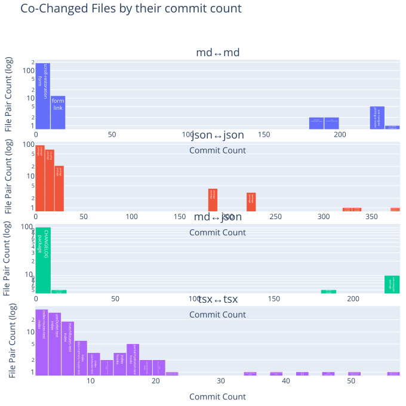
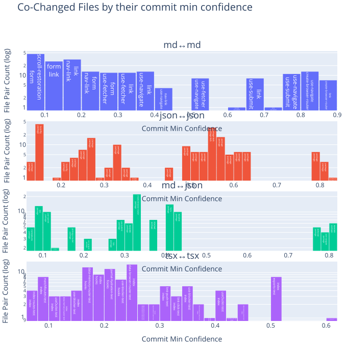
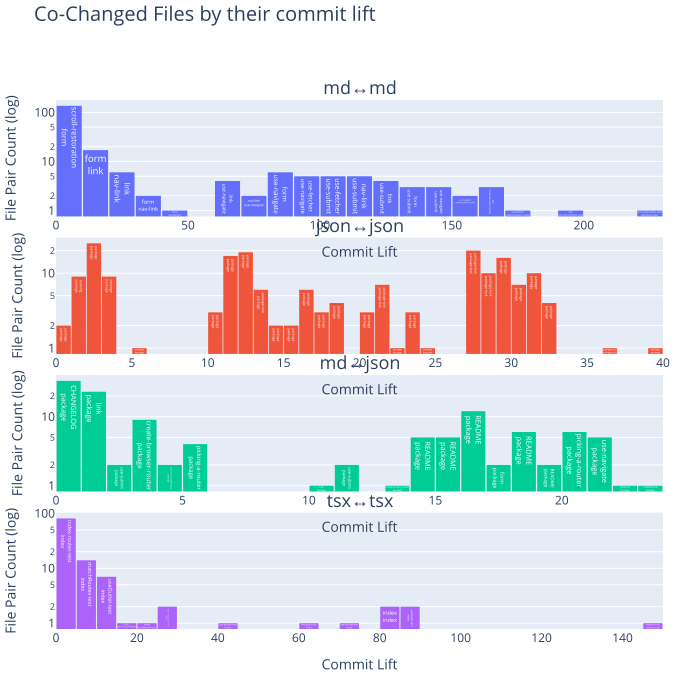
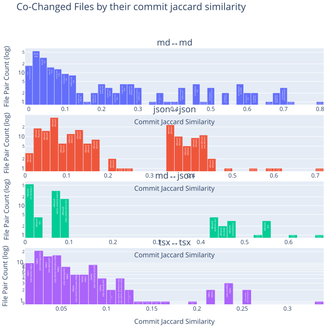

# git log/history
   

### References
- [Visualizing Code: Polyglot Notebooks Repository (YouTube)](https://youtu.be/ipOpToPS-PY?si=3doePt2cp-LgEUmt)
- [gitstractor (GitHub)](https://github.com/IntegerMan/gitstractor)
- [Neo4j Python Driver](https://neo4j.com/docs/api/python-driver/current)

    Command line execution (CLI mode): Yes

## Git History - Directory Commit Statistics

### Data Preview

<table border="1" class="dataframe">
  <thead>
    <tr style="text-align: right;">
      <th></th>
      <th>fileCount</th>
      <th>authorCount</th>
      <th>commitCount</th>
      <th>daysSinceLastCommit</th>
      <th>daysSinceLastCreation</th>
      <th>daysSinceLastModification</th>
    </tr>
  </thead>
  <tbody>
    <tr>
      <th>count</th>
      <td>83.000000</td>
      <td>83.000000</td>
      <td>83.000000</td>
      <td>83.000000</td>
      <td>83.000000</td>
      <td>83.000000</td>
    </tr>
    <tr>
      <th>mean</th>
      <td>25.313253</td>
      <td>19.686747</td>
      <td>130.457831</td>
      <td>585.530120</td>
      <td>999.626506</td>
      <td>586.445783</td>
    </tr>
    <tr>
      <th>std</th>
      <td>77.867763</td>
      <td>46.317549</td>
      <td>293.197024</td>
      <td>294.748025</td>
      <td>389.268598</td>
      <td>295.192465</td>
    </tr>
    <tr>
      <th>min</th>
      <td>1.000000</td>
      <td>2.000000</td>
      <td>3.000000</td>
      <td>97.000000</td>
      <td>117.000000</td>
      <td>96.000000</td>
    </tr>
    <tr>
      <th>25%</th>
      <td>4.000000</td>
      <td>4.000000</td>
      <td>11.000000</td>
      <td>327.000000</td>
      <td>725.000000</td>
      <td>326.000000</td>
    </tr>
    <tr>
      <th>50%</th>
      <td>10.000000</td>
      <td>6.000000</td>
      <td>26.000000</td>
      <td>712.000000</td>
      <td>1080.000000</td>
      <td>711.000000</td>
    </tr>
    <tr>
      <th>75%</th>
      <td>13.000000</td>
      <td>13.500000</td>
      <td>84.000000</td>
      <td>811.000000</td>
      <td>1404.000000</td>
      <td>810.000000</td>
    </tr>
    <tr>
      <th>max</th>
      <td>634.000000</td>
      <td>344.000000</td>
      <td>2000.000000</td>
      <td>1445.000000</td>
      <td>1501.000000</td>
      <td>1444.000000</td>
    </tr>
  </tbody>
</table>

<table border="1" class="dataframe">
  <thead>
    <tr style="text-align: right;">
      <th></th>
      <th>directoryPath</th>
      <th>directoryParentPath</th>
      <th>directoryName</th>
      <th>fileCount</th>
      <th>firstFile</th>
      <th>mostFrequentFileExtension</th>
      <th>authorCount</th>
      <th>mainAuthor</th>
      <th>secondAuthor</th>
      <th>commitCount</th>
      <th>daysSinceLastCommit</th>
      <th>daysSinceLastCreation</th>
      <th>daysSinceLastModification</th>
      <th>lastCommitDate</th>
      <th>lastCreationDate</th>
      <th>lastModificationDate</th>
      <th>maxCommitSha</th>
    </tr>
  </thead>
  <tbody>
    <tr>
      <th>0</th>
      <td>react-router-6.30.1/examples/custom-query-parsing/types</td>
      <td>react-router-6.30.1/examples/custom-query-parsing</td>
      <td>types</td>
      <td>1</td>
      <td>react-router-6.30.1/examples/custom-query-parsing/types/jsurl.d.ts</td>
      <td>ts</td>
      <td>2</td>
      <td>Logan McAnsh</td>
      <td>Michael Jackson</td>
      <td>4</td>
      <td>1404</td>
      <td>1404</td>
      <td>1404</td>
      <td>2021-10-21</td>
      <td>2021-10-20</td>
      <td>2021-10-20</td>
      <td>dd0de338dfb32e38d1f4b091b3442ae55515edc3</td>
    </tr>
    <tr>
      <th>1</th>
      <td>react-router-6.30.1/packages/react-router-dom-v5-compat/lib</td>
      <td>react-router-6.30.1/packages/react-router-dom-v5-compat</td>
      <td>lib</td>
      <td>1</td>
      <td>react-router-6.30.1/packages/react-router-dom-v5-compat/lib/components.tsx</td>
      <td>tsx</td>
      <td>6</td>
      <td>Ayush C</td>
      <td>Brooks Lybrand</td>
      <td>26</td>
      <td>427</td>
      <td>1242</td>
      <td>426</td>
      <td>2024-06-24</td>
      <td>2022-03-31</td>
      <td>2024-06-24</td>
      <td>da57748644da6400e2d051b2aa004df47beda1cf</td>
    </tr>
    <tr>
      <th>2</th>
      <td>react-router-6.30.1/packages/react-router-dom/__tests__/polyfills</td>
      <td>react-router-6.30.1/packages/react-router-dom/__tests__</td>
      <td>polyfills</td>
      <td>1</td>
      <td>react-router-6.30.1/packages/react-router-dom/__tests__/polyfills/drop-FormData-submitter.ts</td>
      <td>ts</td>
      <td>2</td>
      <td>Jon Jensen</td>
      <td>Matt Brophy</td>
      <td>3</td>
      <td>788</td>
      <td>802</td>
      <td>802</td>
      <td>2023-06-29</td>
      <td>2023-06-14</td>
      <td>2023-06-14</td>
      <td>f63774c3843e2f25b6ca5b6f4882ebd4db705603</td>
    </tr>
    <tr>
      <th>3</th>
      <td>react-router-6.30.1/packages/react-router/__tests__/__snapshots__</td>
      <td>react-router-6.30.1/packages/react-router/__tests__</td>
      <td>__snapshots__</td>
      <td>1</td>
      <td>react-router-6.30.1/packages/react-router/__tests__/__snapshots__/route-matching-test.tsx.snap</td>
      <td>snap</td>
      <td>2</td>
      <td>Chance Strickland</td>
      <td>Michael Jackson</td>
      <td>6</td>
      <td>1445</td>
      <td>1501</td>
      <td>1444</td>
      <td>2021-09-10</td>
      <td>2021-07-15</td>
      <td>2021-09-10</td>
      <td>eff2bd9148de1849fb93519f59262e4b53e8d823</td>
    </tr>
    <tr>
      <th>4</th>
      <td>react-router-6.30.1/patches</td>
      <td>react-router-6.30.1</td>
      <td>patches</td>
      <td>1</td>
      <td>react-router-6.30.1/patches/@changesets__get-dependents-graph@1.3.6.patch</td>
      <td>patch</td>
      <td>4</td>
      <td>Chance Strickland</td>
      <td>Mark Dalgleish</td>
      <td>10</td>
      <td>489</td>
      <td>521</td>
      <td>521</td>
      <td>2024-04-23</td>
      <td>2024-03-21</td>
      <td>2024-03-21</td>
      <td>f264d828939e3ae74a6ca47e40d4c4b2fd027e8e</td>
    </tr>
    <tr>
      <th>5</th>
      <td>react-router-6.30.1/.changeset</td>
      <td>react-router-6.30.1</td>
      <td>.changeset</td>
      <td>2</td>
      <td>react-router-6.30.1/.changeset/README.md</td>
      <td>json</td>
      <td>3</td>
      <td>Chance Strickland</td>
      <td>Matt Brophy</td>
      <td>10</td>
      <td>489</td>
      <td>1167</td>
      <td>488</td>
      <td>2024-04-23</td>
      <td>2022-06-14</td>
      <td>2024-04-23</td>
      <td>f3009f5536b6bb3354bfe91d5ff02dd2fae91285</td>
    </tr>
    <tr>
      <th>6</th>
      <td>react-router-6.30.1/docs/upgrading</td>
      <td>react-router-6.30.1/docs</td>
      <td>upgrading</td>
      <td>2</td>
      <td>react-router-6.30.1/docs/upgrading/future.md</td>
      <td>md</td>
      <td>5</td>
      <td>Matt Brophy</td>
      <td>Brooks Lybrand</td>
      <td>16</td>
      <td>263</td>
      <td>451</td>
      <td>263</td>
      <td>2024-12-05</td>
      <td>2024-05-30</td>
      <td>2024-12-05</td>
      <td>fa256911d64a0ce07ee46fa0e598ff734842f622</td>
    </tr>
    <tr>
      <th>7</th>
      <td>react-router-6.30.1/examples/lazy-loading/src/pages</td>
      <td>react-router-6.30.1/examples/lazy-loading/src</td>
      <td>pages</td>
      <td>2</td>
      <td>react-router-6.30.1/examples/lazy-loading/src/pages/About.tsx</td>
      <td>tsx</td>
      <td>3</td>
      <td>Logan McAnsh</td>
      <td>Matt Brophy</td>
      <td>7</td>
      <td>811</td>
      <td>1404</td>
      <td>810</td>
      <td>2023-06-06</td>
      <td>2021-10-21</td>
      <td>2023-06-06</td>
      <td>f3e3f59fa15ab4dbc497a2d8c66055976d3e54d3</td>
    </tr>
    <tr>
      <th>8</th>
      <td>react-router-6.30.1/.github/ISSUE_TEMPLATE</td>
      <td>react-router-6.30.1/.github</td>
      <td>ISSUE_TEMPLATE</td>
      <td>3</td>
      <td>react-router-6.30.1/.github/ISSUE_TEMPLATE/bug_report.yml</td>
      <td>yml</td>
      <td>10</td>
      <td>Chance Strickland</td>
      <td>Matt Brophy</td>
      <td>25</td>
      <td>312</td>
      <td>956</td>
      <td>311</td>
      <td>2024-10-17</td>
      <td>2023-01-11</td>
      <td>2024-10-17</td>
      <td>fdb90690cb74b1060f9e9de550520f30f9c2ef08</td>
    </tr>
    <tr>
      <th>9</th>
      <td>react-router-6.30.1/examples/navigation-blocking/src</td>
      <td>react-router-6.30.1/examples/navigation-blocking</td>
      <td>src</td>
      <td>3</td>
      <td>react-router-6.30.1/examples/navigation-blocking/src/app.tsx</td>
      <td>tsx</td>
      <td>2</td>
      <td>Chance Strickland</td>
      <td>Matt Brophy</td>
      <td>15</td>
      <td>648</td>
      <td>954</td>
      <td>647</td>
      <td>2023-11-16</td>
      <td>2023-01-13</td>
      <td>2023-11-16</td>
      <td>f3e3f59fa15ab4dbc497a2d8c66055976d3e54d3</td>
    </tr>
    <tr>
      <th>10</th>
      <td>react-router-6.30.1/packages/react-router-dom-v5-compat/__tests__</td>
      <td>react-router-6.30.1/packages/react-router-dom-v5-compat</td>
      <td>__tests__</td>
      <td>3</td>
      <td>react-router-6.30.1/packages/react-router-dom-v5-compat/__tests__/compat-router-test.tsx</td>
      <td>tsx</td>
      <td>4</td>
      <td>Matt Brophy</td>
      <td>Pedro Cattori</td>
      <td>9</td>
      <td>942</td>
      <td>948</td>
      <td>948</td>
      <td>2023-01-26</td>
      <td>2023-01-19</td>
      <td>2023-01-19</td>
      <td>d1e7f3b749b8f2b4aa7fc605ed2f3ddc1121b63b</td>
    </tr>
    <tr>
      <th>11</th>
      <td>react-router-6.30.1/decisions</td>
      <td>react-router-6.30.1</td>
      <td>decisions</td>
      <td>4</td>
      <td>react-router-6.30.1/decisions/0001-use-blocker.md</td>
      <td>md</td>
      <td>2</td>
      <td>Matt Brophy</td>
      <td>Jacob Ebey</td>
      <td>9</td>
      <td>489</td>
      <td>531</td>
      <td>531</td>
      <td>2024-04-23</td>
      <td>2024-03-11</td>
      <td>2024-03-11</td>
      <td>fca5e55122ee717afac9da1020861a68d0b6425b</td>
    </tr>
    <tr>
      <th>12</th>
      <td>react-router-6.30.1/examples/basic/src</td>
      <td>react-router-6.30.1/examples/basic</td>
      <td>src</td>
      <td>4</td>
      <td>react-router-6.30.1/examples/basic/src/App.tsx</td>
      <td>tsx</td>
      <td>7</td>
      <td>Chance Strickland</td>
      <td>Michael Jackson</td>
      <td>18</td>
      <td>811</td>
      <td>1462</td>
      <td>810</td>
      <td>2023-06-06</td>
      <td>2021-08-23</td>
      <td>2023-06-06</td>
      <td>fedf1d2ad8b7cc20b2fcfe18d86d0f4eb3f689a2</td>
    </tr>
    <tr>
      <th>13</th>
      <td>react-router-6.30.1/examples/custom-link/src</td>
      <td>react-router-6.30.1/examples/custom-link</td>
      <td>src</td>
      <td>4</td>
      <td>react-router-6.30.1/examples/custom-link/src/App.tsx</td>
      <td>tsx</td>
      <td>5</td>
      <td>Logan McAnsh</td>
      <td>Matt Brophy</td>
      <td>11</td>
      <td>811</td>
      <td>1417</td>
      <td>810</td>
      <td>2023-06-06</td>
      <td>2021-10-07</td>
      <td>2023-06-06</td>
      <td>fedf1d2ad8b7cc20b2fcfe18d86d0f4eb3f689a2</td>
    </tr>
    <tr>
      <th>14</th>
      <td>react-router-6.30.1/examples/custom-query-parsing/src</td>
      <td>react-router-6.30.1/examples/custom-query-parsing</td>
      <td>src</td>
      <td>4</td>
      <td>react-router-6.30.1/examples/custom-query-parsing/src/App.tsx</td>
      <td>tsx</td>
      <td>7</td>
      <td>Logan McAnsh</td>
      <td>Chance Strickland</td>
      <td>18</td>
      <td>811</td>
      <td>1404</td>
      <td>810</td>
      <td>2023-06-06</td>
      <td>2021-10-20</td>
      <td>2023-06-06</td>
      <td>fedf1d2ad8b7cc20b2fcfe18d86d0f4eb3f689a2</td>
    </tr>
    <tr>
      <th>15</th>
      <td>react-router-6.30.1/examples/multi-app/home</td>
      <td>react-router-6.30.1/examples/multi-app</td>
      <td>home</td>
      <td>4</td>
      <td>react-router-6.30.1/examples/multi-app/home/App.jsx</td>
      <td>jsx</td>
      <td>4</td>
      <td>Logan McAnsh</td>
      <td>Michael Jackson</td>
      <td>9</td>
      <td>811</td>
      <td>1402</td>
      <td>810</td>
      <td>2023-06-06</td>
      <td>2021-10-22</td>
      <td>2023-06-06</td>
      <td>f3e3f59fa15ab4dbc497a2d8c66055976d3e54d3</td>
    </tr>
    <tr>
      <th>16</th>
      <td>react-router-6.30.1/examples/route-objects/src</td>
      <td>react-router-6.30.1/examples/route-objects</td>
      <td>src</td>
      <td>4</td>
      <td>react-router-6.30.1/examples/route-objects/src/App.tsx</td>
      <td>tsx</td>
      <td>5</td>
      <td>Logan McAnsh</td>
      <td>Michael Jackson</td>
      <td>11</td>
      <td>811</td>
      <td>1403</td>
      <td>810</td>
      <td>2023-06-06</td>
      <td>2021-10-21</td>
      <td>2023-06-06</td>
      <td>fedf1d2ad8b7cc20b2fcfe18d86d0f4eb3f689a2</td>
    </tr>
    <tr>
      <th>17</th>
      <td>react-router-6.30.1/examples/scroll-restoration/src</td>
      <td>react-router-6.30.1/examples/scroll-restoration</td>
      <td>src</td>
      <td>4</td>
      <td>react-router-6.30.1/examples/scroll-restoration/src/app.tsx</td>
      <td>tsx</td>
      <td>3</td>
      <td>Matt Brophy</td>
      <td>Pedro Cattori</td>
      <td>12</td>
      <td>811</td>
      <td>1081</td>
      <td>810</td>
      <td>2023-06-06</td>
      <td>2022-09-08</td>
      <td>2023-06-06</td>
      <td>f3e3f59fa15ab4dbc497a2d8c66055976d3e54d3</td>
    </tr>
    <tr>
      <th>18</th>
      <td>react-router-6.30.1/examples/search-params/src</td>
      <td>react-router-6.30.1/examples/search-params</td>
      <td>src</td>
      <td>4</td>
      <td>react-router-6.30.1/examples/search-params/src/App.tsx</td>
      <td>tsx</td>
      <td>6</td>
      <td>Logan McAnsh</td>
      <td>Chance Strickland</td>
      <td>13</td>
      <td>811</td>
      <td>1419</td>
      <td>810</td>
      <td>2023-06-06</td>
      <td>2021-10-05</td>
      <td>2023-06-06</td>
      <td>fedf1d2ad8b7cc20b2fcfe18d86d0f4eb3f689a2</td>
    </tr>
    <tr>
      <th>19</th>
      <td>react-router-6.30.1/packages/react-router-native/__tests__/__snapshots__</td>
      <td>react-router-6.30.1/packages/react-router-native/__tests__</td>
      <td>__snapshots__</td>
      <td>4</td>
      <td>react-router-6.30.1/packages/react-router-native/__tests__/__snapshots__/deep-linking-test.tsx.snap</td>
      <td>snap</td>
      <td>4</td>
      <td>Chance Strickland</td>
      <td>Matt Brophy</td>
      <td>14</td>
      <td>942</td>
      <td>1451</td>
      <td>941</td>
      <td>2023-01-26</td>
      <td>2021-09-03</td>
      <td>2023-01-26</td>
      <td>eff2bd9148de1849fb93519f59262e4b53e8d823</td>
    </tr>
    <tr>
      <th>20</th>
      <td>react-router-6.30.1/packages/react-router/lib</td>
      <td>react-router-6.30.1/packages/react-router</td>
      <td>lib</td>
      <td>4</td>
      <td>react-router-6.30.1/packages/react-router/lib/components.tsx</td>
      <td>tsx</td>
      <td>19</td>
      <td>Matt Brophy</td>
      <td>Ayush C</td>
      <td>196</td>
      <td>101</td>
      <td>310</td>
      <td>100</td>
      <td>2025-05-16</td>
      <td>2024-10-18</td>
      <td>2025-05-16</td>
      <td>feebfc0bf10614ba44ff43e2b9c69e22ad07a7a1</td>
    </tr>
    <tr>
      <th>21</th>
      <td>react-router-6.30.1/packages/router/__tests__/utils</td>
      <td>react-router-6.30.1/packages/router/__tests__</td>
      <td>utils</td>
      <td>4</td>
      <td>react-router-6.30.1/packages/router/__tests__/utils/custom-matchers.ts</td>
      <td>ts</td>
      <td>2</td>
      <td>Matt Brophy</td>
      <td>Jacob Ebey</td>
      <td>21</td>
      <td>349</td>
      <td>531</td>
      <td>348</td>
      <td>2024-09-10</td>
      <td>2024-03-11</td>
      <td>2024-09-10</td>
      <td>ec03b12c600ba899d1a35b6f63bc45bb594c1e88</td>
    </tr>
    <tr>
      <th>22</th>
      <td>react-router-6.30.1/tutorial/src</td>
      <td>react-router-6.30.1/tutorial</td>
      <td>src</td>
      <td>4</td>
      <td>react-router-6.30.1/tutorial/src/App.jsx</td>
      <td>jsx</td>
      <td>3</td>
      <td>Chance Strickland</td>
      <td>Chris Chudzicki</td>
      <td>7</td>
      <td>1274</td>
      <td>1392</td>
      <td>1273</td>
      <td>2022-02-28</td>
      <td>2021-11-01</td>
      <td>2022-02-28</td>
      <td>f5dccaa1426ea2c06dc654a73b939e45c7d5038e</td>
    </tr>
    <tr>
      <th>23</th>
      <td>react-router-6.30.1/docs/fetch</td>
      <td>react-router-6.30.1/docs</td>
      <td>fetch</td>
      <td>5</td>
      <td>react-router-6.30.1/docs/fetch/index.md</td>
      <td>md</td>
      <td>6</td>
      <td>Matt Brophy</td>
      <td>Ryan Florence</td>
      <td>16</td>
      <td>389</td>
      <td>389</td>
      <td>389</td>
      <td>2024-08-01</td>
      <td>2024-07-31</td>
      <td>2024-07-31</td>
      <td>f0b886bce7dab2e2f37f53fe58cd6c7ab0660e25</td>
    </tr>
    <tr>
      <th>24</th>
      <td>react-router-6.30.1/examples/auth/src</td>
      <td>react-router-6.30.1/examples/auth</td>
      <td>src</td>
      <td>5</td>
      <td>react-router-6.30.1/examples/auth/src/App.tsx</td>
      <td>tsx</td>
      <td>8</td>
      <td>Logan McAnsh</td>
      <td>Chance Strickland</td>
      <td>22</td>
      <td>811</td>
      <td>1420</td>
      <td>810</td>
      <td>2023-06-06</td>
      <td>2021-10-04</td>
      <td>2023-06-06</td>
      <td>fedf1d2ad8b7cc20b2fcfe18d86d0f4eb3f689a2</td>
    </tr>
    <tr>
      <th>25</th>
      <td>react-router-6.30.1/examples/custom-filter-link/src</td>
      <td>react-router-6.30.1/examples/custom-filter-link</td>
      <td>src</td>
      <td>5</td>
      <td>react-router-6.30.1/examples/custom-filter-link/src/App.tsx</td>
      <td>tsx</td>
      <td>6</td>
      <td>Logan McAnsh</td>
      <td>Chance Strickland</td>
      <td>13</td>
      <td>811</td>
      <td>1417</td>
      <td>810</td>
      <td>2023-06-06</td>
      <td>2021-10-07</td>
      <td>2023-06-06</td>
      <td>fedf1d2ad8b7cc20b2fcfe18d86d0f4eb3f689a2</td>
    </tr>
    <tr>
      <th>26</th>
      <td>react-router-6.30.1/examples/data-router/src</td>
      <td>react-router-6.30.1/examples/data-router</td>
      <td>src</td>
      <td>5</td>
      <td>react-router-6.30.1/examples/data-router/src/app.tsx</td>
      <td>tsx</td>
      <td>4</td>
      <td>Matt Brophy</td>
      <td>Chance Strickland</td>
      <td>25</td>
      <td>648</td>
      <td>1081</td>
      <td>647</td>
      <td>2023-11-16</td>
      <td>2022-09-08</td>
      <td>2023-11-16</td>
      <td>f3e3f59fa15ab4dbc497a2d8c66055976d3e54d3</td>
    </tr>
    <tr>
      <th>27</th>
      <td>react-router-6.30.1/examples/error-boundaries/src</td>
      <td>react-router-6.30.1/examples/error-boundaries</td>
      <td>src</td>
      <td>5</td>
      <td>react-router-6.30.1/examples/error-boundaries/src/app.tsx</td>
      <td>tsx</td>
      <td>2</td>
      <td>Matt Brophy</td>
      <td>Pedro Cattori</td>
      <td>8</td>
      <td>811</td>
      <td>1081</td>
      <td>810</td>
      <td>2023-06-06</td>
      <td>2022-09-08</td>
      <td>2023-06-06</td>
      <td>f3e3f59fa15ab4dbc497a2d8c66055976d3e54d3</td>
    </tr>
    <tr>
      <th>28</th>
      <td>react-router-6.30.1/examples/modal-route-with-outlet/src</td>
      <td>react-router-6.30.1/examples/modal-route-with-outlet</td>
      <td>src</td>
      <td>5</td>
      <td>react-router-6.30.1/examples/modal-route-with-outlet/src/App.tsx</td>
      <td>ts</td>
      <td>2</td>
      <td>Matt Brophy</td>
      <td>Shane Walker</td>
      <td>3</td>
      <td>746</td>
      <td>767</td>
      <td>767</td>
      <td>2023-08-10</td>
      <td>2023-07-19</td>
      <td>2023-07-19</td>
      <td>fad3bc011140d6daec3d03889ac30375aca11c05</td>
    </tr>
    <tr>
      <th>29</th>
      <td>react-router-6.30.1/examples/modal/src</td>
      <td>react-router-6.30.1/examples/modal</td>
      <td>src</td>
      <td>5</td>
      <td>react-router-6.30.1/examples/modal/src/App.tsx</td>
      <td>tsx</td>
      <td>6</td>
      <td>Logan McAnsh</td>
      <td>Michael Jackson</td>
      <td>16</td>
      <td>811</td>
      <td>1417</td>
      <td>810</td>
      <td>2023-06-06</td>
      <td>2021-10-07</td>
      <td>2023-06-06</td>
      <td>fedf1d2ad8b7cc20b2fcfe18d86d0f4eb3f689a2</td>
    </tr>
  </tbody>
</table>

### Number of files per directory

    

    

### Most frequent file extension per directory

    

    

### Number of commits per directory

    

    

### Number of distinct authors per directory

    

    

### Directories with very few different authors

    

    

### Main author per directory

    

    

### Second author per directory

    

    

### Days since last commit per directory

    

    

### Days since last commit per directory (ranked)

    

    

### Days since last file creation per directory

    

    

### Days since last file creation per directory (ranked)

    

    

### Days since last file modification per directory

    

    

### Days since last file modification per directory (ranked)

    

    

## Filecount per commit

Shows how many commits had changed one file, how many had changed two files, and so on.
The chart is limited to 30 lines for improved readability.
The data preview also includes overall statistics including the number of commits that are filtered out in the chart.

### Preview data

    Sum of commits that changed more than 30 files (each) = 229
    Max changed files with one commit = 498

<table border="1" class="dataframe">
  <thead>
    <tr style="text-align: right;">
      <th></th>
      <th>filesPerCommit</th>
      <th>commitCount</th>
    </tr>
  </thead>
  <tbody>
    <tr>
      <th>count</th>
      <td>117.000000</td>
      <td>117.000000</td>
    </tr>
    <tr>
      <th>mean</th>
      <td>79.179487</td>
      <td>57.606838</td>
    </tr>
    <tr>
      <th>std</th>
      <td>78.464424</td>
      <td>318.984216</td>
    </tr>
    <tr>
      <th>min</th>
      <td>1.000000</td>
      <td>1.000000</td>
    </tr>
    <tr>
      <th>25%</th>
      <td>30.000000</td>
      <td>1.000000</td>
    </tr>
    <tr>
      <th>50%</th>
      <td>59.000000</td>
      <td>3.000000</td>
    </tr>
    <tr>
      <th>75%</th>
      <td>96.000000</td>
      <td>8.000000</td>
    </tr>
    <tr>
      <th>max</th>
      <td>498.000000</td>
      <td>3227.000000</td>
    </tr>
  </tbody>
</table>

<table border="1" class="dataframe">
  <thead>
    <tr style="text-align: right;">
      <th></th>
      <th>filesPerCommit</th>
      <th>commitCount</th>
    </tr>
  </thead>
  <tbody>
    <tr>
      <th>0</th>
      <td>1</td>
      <td>3227</td>
    </tr>
    <tr>
      <th>1</th>
      <td>2</td>
      <td>1122</td>
    </tr>
    <tr>
      <th>2</th>
      <td>3</td>
      <td>517</td>
    </tr>
    <tr>
      <th>3</th>
      <td>4</td>
      <td>328</td>
    </tr>
    <tr>
      <th>4</th>
      <td>5</td>
      <td>241</td>
    </tr>
    <tr>
      <th>5</th>
      <td>6</td>
      <td>166</td>
    </tr>
    <tr>
      <th>6</th>
      <td>7</td>
      <td>119</td>
    </tr>
    <tr>
      <th>7</th>
      <td>8</td>
      <td>81</td>
    </tr>
    <tr>
      <th>8</th>
      <td>9</td>
      <td>69</td>
    </tr>
    <tr>
      <th>9</th>
      <td>10</td>
      <td>64</td>
    </tr>
    <tr>
      <th>10</th>
      <td>11</td>
      <td>102</td>
    </tr>
    <tr>
      <th>11</th>
      <td>12</td>
      <td>65</td>
    </tr>
    <tr>
      <th>12</th>
      <td>13</td>
      <td>62</td>
    </tr>
    <tr>
      <th>13</th>
      <td>14</td>
      <td>50</td>
    </tr>
    <tr>
      <th>14</th>
      <td>15</td>
      <td>36</td>
    </tr>
    <tr>
      <th>15</th>
      <td>16</td>
      <td>32</td>
    </tr>
    <tr>
      <th>16</th>
      <td>17</td>
      <td>30</td>
    </tr>
    <tr>
      <th>17</th>
      <td>18</td>
      <td>25</td>
    </tr>
    <tr>
      <th>18</th>
      <td>19</td>
      <td>30</td>
    </tr>
    <tr>
      <th>19</th>
      <td>20</td>
      <td>25</td>
    </tr>
    <tr>
      <th>20</th>
      <td>21</td>
      <td>21</td>
    </tr>
    <tr>
      <th>21</th>
      <td>22</td>
      <td>12</td>
    </tr>
    <tr>
      <th>22</th>
      <td>23</td>
      <td>15</td>
    </tr>
    <tr>
      <th>23</th>
      <td>24</td>
      <td>13</td>
    </tr>
    <tr>
      <th>24</th>
      <td>25</td>
      <td>15</td>
    </tr>
    <tr>
      <th>25</th>
      <td>26</td>
      <td>6</td>
    </tr>
    <tr>
      <th>26</th>
      <td>27</td>
      <td>6</td>
    </tr>
    <tr>
      <th>27</th>
      <td>28</td>
      <td>13</td>
    </tr>
    <tr>
      <th>28</th>
      <td>29</td>
      <td>9</td>
    </tr>
    <tr>
      <th>29</th>
      <td>30</td>
      <td>10</td>
    </tr>
  </tbody>
</table>

### Bar chart with the number of files per commit distribution

    

    

## Pairwise Changed Files

This section analyzes files that where changed together within the same commit and provides several metrics to quantify the strength of the co-change relationship:

- **Commit Count**: The number of commits in which two files were changed together.
- **Commit Lift**: A ratio that indicates whether the co-change pattern is stronger than random chance, given how often each file changes.
- **Jaccard Similarity**: The ratio of commits involving either file that also involved both files.

The following tables show the top pairwise changed files based on these metrics.
The following charts show how these metrics are distributed across pairs of files that were changed together.

### Treemap with files changed frequently with others

    

    

    

    

    

    

### Files changed together by commit count

<table border="1" class="dataframe">
  <thead>
    <tr style="text-align: right;">
      <th></th>
      <th>fileExtensionPair</th>
      <th>updateCommitCount</th>
      <th>GroupRank</th>
      <th>filePair</th>
      <th>filePairWithRelativePath</th>
    </tr>
  </thead>
  <tbody>
    <tr>
      <th>0</th>
      <td>json↔json</td>
      <td>376</td>
      <td>1</td>
      <td>package↔package</td>
      <td>packages/react-router-dom/package.json↔packages/react-router/package.json</td>
    </tr>
    <tr>
      <th>1</th>
      <td>json↔json</td>
      <td>332</td>
      <td>2</td>
      <td>package↔package</td>
      <td>packages/react-router-dom/package.json↔packages/react-router-native/package.json</td>
    </tr>
    <tr>
      <th>2</th>
      <td>json↔json</td>
      <td>327</td>
      <td>3</td>
      <td>package↔package</td>
      <td>packages/react-router-native/package.json↔packages/react-router/package.json</td>
    </tr>
    <tr>
      <th>3</th>
      <td>json↔json</td>
      <td>229</td>
      <td>4</td>
      <td>package↔package</td>
      <td>packages/react-router-dom-v5-compat/package.json↔packages/react-router-dom/package.json</td>
    </tr>
    <tr>
      <th>4</th>
      <td>json↔json</td>
      <td>185</td>
      <td>5</td>
      <td>package↔package</td>
      <td>packages/react-router-dom-v5-compat/package.json↔packages/router/package.json</td>
    </tr>
    <tr>
      <th>5</th>
      <td>json↔json</td>
      <td>184</td>
      <td>6</td>
      <td>package↔package</td>
      <td>packages/react-router-native/package.json↔packages/router/package.json</td>
    </tr>
    <tr>
      <th>6</th>
      <td>json↔json</td>
      <td>21</td>
      <td>7</td>
      <td>package↔package</td>
      <td>examples/auth/package.json↔examples/basic/package.json</td>
    </tr>
    <tr>
      <th>7</th>
      <td>json↔json</td>
      <td>20</td>
      <td>8</td>
      <td>package↔package</td>
      <td>examples/auth/package.json↔examples/custom-filter-link/package.json</td>
    </tr>
    <tr>
      <th>8</th>
      <td>json↔json</td>
      <td>19</td>
      <td>9</td>
      <td>package↔package</td>
      <td>packages/react-router/package.json↔examples/auth/package.json</td>
    </tr>
    <tr>
      <th>9</th>
      <td>json↔json</td>
      <td>18</td>
      <td>10</td>
      <td>package↔package</td>
      <td>packages/react-router/package.json↔examples/custom-filter-link/package.json</td>
    </tr>
    <tr>
      <th>10</th>
      <td>md↔json</td>
      <td>224</td>
      <td>1</td>
      <td>CHANGELOG↔package</td>
      <td>packages/react-router-dom/CHANGELOG.md↔packages/react-router-dom/package.json</td>
    </tr>
    <tr>
      <th>11</th>
      <td>md↔json</td>
      <td>223</td>
      <td>2</td>
      <td>CHANGELOG↔package</td>
      <td>packages/react-router-dom-v5-compat/CHANGELOG.md↔packages/react-router-dom-v5-compat/package.json</td>
    </tr>
    <tr>
      <th>12</th>
      <td>md↔json</td>
      <td>181</td>
      <td>3</td>
      <td>CHANGELOG↔package</td>
      <td>packages/react-router-dom/CHANGELOG.md↔packages/router/package.json</td>
    </tr>
    <tr>
      <th>13</th>
      <td>md↔json</td>
      <td>180</td>
      <td>4</td>
      <td>CHANGELOG↔package</td>
      <td>packages/react-router-native/CHANGELOG.md↔packages/router/package.json</td>
    </tr>
    <tr>
      <th>14</th>
      <td>md↔json</td>
      <td>10</td>
      <td>5</td>
      <td>create-browser-router↔package</td>
      <td>docs/routers/create-browser-router.md↔packages/react-router-dom-v5-compat/package.json</td>
    </tr>
    <tr>
      <th>15</th>
      <td>md↔json</td>
      <td>5</td>
      <td>6</td>
      <td>link↔package</td>
      <td>docs/components/link.md↔packages/react-router-dom-v5-compat/package.json</td>
    </tr>
    <tr>
      <th>16</th>
      <td>md↔json</td>
      <td>4</td>
      <td>7</td>
      <td>picking-a-router↔package</td>
      <td>docs/routers/picking-a-router.md↔packages/react-router-dom-v5-compat/package.json</td>
    </tr>
    <tr>
      <th>17</th>
      <td>md↔json</td>
      <td>3</td>
      <td>8</td>
      <td>use-submit↔package</td>
      <td>docs/hooks/use-submit.md↔packages/react-router-dom-v5-compat/package.json</td>
    </tr>
    <tr>
      <th>18</th>
      <td>md↔md</td>
      <td>235</td>
      <td>1</td>
      <td>CHANGELOG↔CHANGELOG</td>
      <td>packages/react-router-dom/CHANGELOG.md↔packages/react-router/CHANGELOG.md</td>
    </tr>
    <tr>
      <th>19</th>
      <td>md↔md</td>
      <td>229</td>
      <td>2</td>
      <td>CHANGELOG↔CHANGELOG</td>
      <td>packages/react-router-dom-v5-compat/CHANGELOG.md↔packages/react-router-dom/CHANGELOG.md</td>
    </tr>
    <tr>
      <th>20</th>
      <td>md↔md</td>
      <td>195</td>
      <td>3</td>
      <td>CHANGELOG↔CHANGELOG</td>
      <td>packages/react-router/CHANGELOG.md↔packages/router/CHANGELOG.md</td>
    </tr>
    <tr>
      <th>21</th>
      <td>md↔md</td>
      <td>193</td>
      <td>4</td>
      <td>CHANGELOG↔CHANGELOG</td>
      <td>packages/react-router-dom/CHANGELOG.md↔packages/router/CHANGELOG.md</td>
    </tr>
    <tr>
      <th>22</th>
      <td>md↔md</td>
      <td>187</td>
      <td>5</td>
      <td>CHANGELOG↔CHANGELOG</td>
      <td>packages/react-router-native/CHANGELOG.md↔packages/router/CHANGELOG.md</td>
    </tr>
    <tr>
      <th>23</th>
      <td>md↔md</td>
      <td>12</td>
      <td>6</td>
      <td>use-fetcher↔use-submit</td>
      <td>docs/hooks/use-fetcher.md↔docs/hooks/use-submit.md</td>
    </tr>
    <tr>
      <th>24</th>
      <td>md↔md</td>
      <td>11</td>
      <td>7</td>
      <td>link↔use-navigate</td>
      <td>docs/components/link.md↔docs/hooks/use-navigate.md</td>
    </tr>
    <tr>
      <th>25</th>
      <td>md↔md</td>
      <td>10</td>
      <td>8</td>
      <td>CHANGELOG↔DEVELOPMENT</td>
      <td>packages/react-router-native/CHANGELOG.md↔DEVELOPMENT.md</td>
    </tr>
    <tr>
      <th>26</th>
      <td>md↔md</td>
      <td>9</td>
      <td>9</td>
      <td>form↔use-navigate</td>
      <td>docs/components/form.md↔docs/hooks/use-navigate.md</td>
    </tr>
    <tr>
      <th>27</th>
      <td>md↔md</td>
      <td>8</td>
      <td>10</td>
      <td>form↔link</td>
      <td>docs/components/form.md↔docs/components/link.md</td>
    </tr>
    <tr>
      <th>28</th>
      <td>tsx↔tsx</td>
      <td>57</td>
      <td>1</td>
      <td>index↔index</td>
      <td>packages/react-router-native/index.tsx↔packages/react-router-dom/index.tsx</td>
    </tr>
    <tr>
      <th>29</th>
      <td>tsx↔tsx</td>
      <td>50</td>
      <td>2</td>
      <td>data-browser-router-test↔index</td>
      <td>packages/react-router-dom/__tests__/data-browser-router-test.tsx↔packages/react-router-dom/index.tsx</td>
    </tr>
    <tr>
      <th>30</th>
      <td>tsx↔tsx</td>
      <td>47</td>
      <td>3</td>
      <td>index↔components</td>
      <td>packages/react-router-dom/index.tsx↔packages/react-router/lib/components.tsx</td>
    </tr>
    <tr>
      <th>31</th>
      <td>tsx↔tsx</td>
      <td>42</td>
      <td>4</td>
      <td>index↔server</td>
      <td>packages/react-router-dom/index.tsx↔packages/react-router-dom/server.tsx</td>
    </tr>
    <tr>
      <th>32</th>
      <td>tsx↔tsx</td>
      <td>39</td>
      <td>5</td>
      <td>hooks↔index</td>
      <td>packages/react-router/lib/hooks.tsx↔packages/react-router-dom/index.tsx</td>
    </tr>
    <tr>
      <th>33</th>
      <td>tsx↔tsx</td>
      <td>34</td>
      <td>6</td>
      <td>hooks↔components</td>
      <td>packages/react-router/lib/hooks.tsx↔packages/react-router/lib/components.tsx</td>
    </tr>
    <tr>
      <th>34</th>
      <td>tsx↔tsx</td>
      <td>22</td>
      <td>7</td>
      <td>components↔server</td>
      <td>packages/react-router/lib/components.tsx↔packages/react-router-dom/server.tsx</td>
    </tr>
    <tr>
      <th>35</th>
      <td>tsx↔tsx</td>
      <td>21</td>
      <td>8</td>
      <td>hooks↔server</td>
      <td>packages/react-router/lib/hooks.tsx↔packages/react-router-dom/server.tsx</td>
    </tr>
    <tr>
      <th>36</th>
      <td>tsx↔tsx</td>
      <td>20</td>
      <td>9</td>
      <td>index↔nav-link-active-test</td>
      <td>packages/react-router-dom/index.tsx↔packages/react-router-dom/__tests__/nav-link-active-test.tsx</td>
    </tr>
    <tr>
      <th>37</th>
      <td>tsx↔tsx</td>
      <td>19</td>
      <td>10</td>
      <td>hooks↔data-browser-router-test</td>
      <td>packages/react-router/lib/hooks.tsx↔packages/react-router-dom/__tests__/data-browser-router-test.tsx</td>
    </tr>
  </tbody>
</table>

    

    

### Files changed together by commit min confidence

The commit min confidence is the commit count where both files were changed divided by the commit count of the file with the least commits.
This metric is useful to identify pairs of files that are frequently changed together and is not biased by single files that are changed very often.

<table border="1" class="dataframe">
  <thead>
    <tr style="text-align: right;">
      <th></th>
      <th>fileExtensionPair</th>
      <th>updateCommitMinConfidence</th>
      <th>GroupRank</th>
      <th>filePair</th>
      <th>filePairWithRelativePath</th>
    </tr>
  </thead>
  <tbody>
    <tr>
      <th>0</th>
      <td>json↔json</td>
      <td>0.833703</td>
      <td>1</td>
      <td>package↔package</td>
      <td>packages/react-router-dom/package.json↔packages/react-router/package.json</td>
    </tr>
    <tr>
      <th>1</th>
      <td>json↔json</td>
      <td>0.809187</td>
      <td>2</td>
      <td>package↔package</td>
      <td>packages/react-router-dom-v5-compat/package.json↔packages/react-router-dom/package.json</td>
    </tr>
    <tr>
      <th>2</th>
      <td>json↔json</td>
      <td>0.794258</td>
      <td>3</td>
      <td>package↔package</td>
      <td>packages/react-router-dom/package.json↔packages/react-router-native/package.json</td>
    </tr>
    <tr>
      <th>3</th>
      <td>json↔json</td>
      <td>0.793991</td>
      <td>4</td>
      <td>package↔package</td>
      <td>packages/react-router-dom-v5-compat/package.json↔packages/router/package.json</td>
    </tr>
    <tr>
      <th>4</th>
      <td>json↔json</td>
      <td>0.789700</td>
      <td>5</td>
      <td>package↔package</td>
      <td>packages/react-router-native/package.json↔packages/router/package.json</td>
    </tr>
    <tr>
      <th>5</th>
      <td>json↔json</td>
      <td>0.782297</td>
      <td>6</td>
      <td>package↔package</td>
      <td>packages/react-router-native/package.json↔packages/react-router/package.json</td>
    </tr>
    <tr>
      <th>6</th>
      <td>json↔json</td>
      <td>0.625000</td>
      <td>7</td>
      <td>package↔package</td>
      <td>examples/auth/package.json↔examples/custom-filter-link/package.json</td>
    </tr>
    <tr>
      <th>7</th>
      <td>json↔json</td>
      <td>0.600000</td>
      <td>8</td>
      <td>package↔package</td>
      <td>examples/auth/package.json↔examples/basic/package.json</td>
    </tr>
    <tr>
      <th>8</th>
      <td>json↔json</td>
      <td>0.588235</td>
      <td>9</td>
      <td>package↔package</td>
      <td>examples/basic/package.json↔examples/custom-link/package.json</td>
    </tr>
    <tr>
      <th>9</th>
      <td>json↔json</td>
      <td>0.571429</td>
      <td>10</td>
      <td>package↔package</td>
      <td>examples/auth/package.json↔examples/modal/package.json</td>
    </tr>
    <tr>
      <th>10</th>
      <td>md↔json</td>
      <td>0.813869</td>
      <td>1</td>
      <td>CHANGELOG↔package</td>
      <td>packages/react-router-dom-v5-compat/CHANGELOG.md↔packages/react-router-dom-v5-compat/package.json</td>
    </tr>
    <tr>
      <th>11</th>
      <td>md↔json</td>
      <td>0.794326</td>
      <td>2</td>
      <td>CHANGELOG↔package</td>
      <td>packages/react-router-dom/CHANGELOG.md↔packages/react-router-dom/package.json</td>
    </tr>
    <tr>
      <th>12</th>
      <td>md↔json</td>
      <td>0.780488</td>
      <td>3</td>
      <td>CHANGELOG↔package</td>
      <td>packages/react-router/CHANGELOG.md↔packages/react-router/package.json</td>
    </tr>
    <tr>
      <th>13</th>
      <td>md↔json</td>
      <td>0.776824</td>
      <td>4</td>
      <td>CHANGELOG↔package</td>
      <td>packages/react-router-dom/CHANGELOG.md↔packages/router/package.json</td>
    </tr>
    <tr>
      <th>14</th>
      <td>md↔json</td>
      <td>0.772532</td>
      <td>5</td>
      <td>CHANGELOG↔package</td>
      <td>packages/react-router-native/CHANGELOG.md↔packages/router/package.json</td>
    </tr>
    <tr>
      <th>15</th>
      <td>md↔json</td>
      <td>0.428571</td>
      <td>6</td>
      <td>README↔package</td>
      <td>examples/modal/README.md↔packages/react-router-dom/package.json</td>
    </tr>
    <tr>
      <th>16</th>
      <td>md↔json</td>
      <td>0.400000</td>
      <td>7</td>
      <td>README↔package</td>
      <td>examples/search-params/README.md↔packages/react-router-dom/package.json</td>
    </tr>
    <tr>
      <th>17</th>
      <td>md↔json</td>
      <td>0.363636</td>
      <td>8</td>
      <td>README↔package</td>
      <td>examples/basic/README.md↔packages/react-router-dom/package.json</td>
    </tr>
    <tr>
      <th>18</th>
      <td>md↔json</td>
      <td>0.333333</td>
      <td>9</td>
      <td>use-route-loader-data↔package</td>
      <td>docs/hooks/use-route-loader-data.md↔packages/react-router-dom-v5-compat/package.json</td>
    </tr>
    <tr>
      <th>19</th>
      <td>md↔json</td>
      <td>0.300000</td>
      <td>10</td>
      <td>README↔package</td>
      <td>examples/auth/README.md↔examples/custom-filter-link/package.json</td>
    </tr>
    <tr>
      <th>20</th>
      <td>md↔md</td>
      <td>0.888889</td>
      <td>1</td>
      <td>README↔README</td>
      <td>examples/custom-filter-link/README.md↔examples/custom-link/README.md</td>
    </tr>
    <tr>
      <th>21</th>
      <td>md↔md</td>
      <td>0.857143</td>
      <td>2</td>
      <td>README↔README</td>
      <td>examples/custom-filter-link/README.md↔examples/modal/README.md</td>
    </tr>
    <tr>
      <th>22</th>
      <td>md↔md</td>
      <td>0.835766</td>
      <td>3</td>
      <td>CHANGELOG↔CHANGELOG</td>
      <td>packages/react-router-dom-v5-compat/CHANGELOG.md↔packages/react-router-dom/CHANGELOG.md</td>
    </tr>
    <tr>
      <th>23</th>
      <td>md↔md</td>
      <td>0.833333</td>
      <td>4</td>
      <td>CHANGELOG↔CHANGELOG</td>
      <td>packages/react-router-dom/CHANGELOG.md↔packages/react-router/CHANGELOG.md</td>
    </tr>
    <tr>
      <th>24</th>
      <td>md↔md</td>
      <td>0.812500</td>
      <td>5</td>
      <td>CHANGELOG↔CHANGELOG</td>
      <td>packages/react-router/CHANGELOG.md↔packages/router/CHANGELOG.md</td>
    </tr>
    <tr>
      <th>25</th>
      <td>md↔md</td>
      <td>0.804167</td>
      <td>6</td>
      <td>CHANGELOG↔CHANGELOG</td>
      <td>packages/react-router-dom/CHANGELOG.md↔packages/router/CHANGELOG.md</td>
    </tr>
    <tr>
      <th>26</th>
      <td>md↔md</td>
      <td>0.800000</td>
      <td>7</td>
      <td>README↔README</td>
      <td>examples/ssr/README.md↔examples/auth/README.md</td>
    </tr>
    <tr>
      <th>27</th>
      <td>md↔md</td>
      <td>0.779167</td>
      <td>8</td>
      <td>CHANGELOG↔CHANGELOG</td>
      <td>packages/react-router-native/CHANGELOG.md↔packages/router/CHANGELOG.md</td>
    </tr>
    <tr>
      <th>28</th>
      <td>md↔md</td>
      <td>0.750000</td>
      <td>9</td>
      <td>README↔README</td>
      <td>examples/custom-filter-link/README.md↔examples/route-objects/README.md</td>
    </tr>
    <tr>
      <th>29</th>
      <td>md↔md</td>
      <td>0.727273</td>
      <td>10</td>
      <td>README↔README</td>
      <td>examples/ssr/README.md↔examples/basic/README.md</td>
    </tr>
    <tr>
      <th>30</th>
      <td>tsx↔tsx</td>
      <td>0.600000</td>
      <td>1</td>
      <td>index↔index</td>
      <td>packages/react-router-native/index.tsx↔packages/react-router-dom/index.tsx</td>
    </tr>
    <tr>
      <th>31</th>
      <td>tsx↔tsx</td>
      <td>0.500000</td>
      <td>2</td>
      <td>partial-hydration-test↔hooks</td>
      <td>packages/react-router-dom/__tests__/partial-hydration-test.tsx↔packages/react-router/lib/hooks.tsx</td>
    </tr>
    <tr>
      <th>32</th>
      <td>tsx↔tsx</td>
      <td>0.454545</td>
      <td>3</td>
      <td>data-browser-router-test↔index</td>
      <td>packages/react-router-dom/__tests__/data-browser-router-test.tsx↔packages/react-router-dom/index.tsx</td>
    </tr>
    <tr>
      <th>33</th>
      <td>tsx↔tsx</td>
      <td>0.437500</td>
      <td>4</td>
      <td>exports-test↔exports-test</td>
      <td>packages/react-router-dom/__tests__/exports-test.tsx↔packages/react-router-native/__tests__/exports-test.tsx</td>
    </tr>
    <tr>
      <th>34</th>
      <td>tsx↔tsx</td>
      <td>0.419643</td>
      <td>5</td>
      <td>index↔components</td>
      <td>packages/react-router-dom/index.tsx↔packages/react-router/lib/components.tsx</td>
    </tr>
    <tr>
      <th>35</th>
      <td>tsx↔tsx</td>
      <td>0.407767</td>
      <td>6</td>
      <td>index↔server</td>
      <td>packages/react-router-dom/index.tsx↔packages/react-router-dom/server.tsx</td>
    </tr>
    <tr>
      <th>36</th>
      <td>tsx↔tsx</td>
      <td>0.400000</td>
      <td>7</td>
      <td>server↔data-static-router-test</td>
      <td>packages/react-router-dom/server.tsx↔packages/react-router-dom/__tests__/data-static-router-test.tsx</td>
    </tr>
    <tr>
      <th>37</th>
      <td>tsx↔tsx</td>
      <td>0.388889</td>
      <td>8</td>
      <td>index↔exports-test</td>
      <td>packages/react-router-dom/index.tsx↔packages/react-router-dom/__tests__/exports-test.tsx</td>
    </tr>
    <tr>
      <th>38</th>
      <td>tsx↔tsx</td>
      <td>0.375000</td>
      <td>9</td>
      <td>index↔exports-test</td>
      <td>packages/react-router-dom/index.tsx↔packages/react-router-native/__tests__/exports-test.tsx</td>
    </tr>
    <tr>
      <th>39</th>
      <td>tsx↔tsx</td>
      <td>0.363636</td>
      <td>10</td>
      <td>link-push-test↔index</td>
      <td>packages/react-router-dom/__tests__/link-push-test.tsx↔packages/react-router-dom/index.tsx</td>
    </tr>
  </tbody>
</table>

    

    

### Files changed together by commit lift

<table border="1" class="dataframe">
  <thead>
    <tr style="text-align: right;">
      <th></th>
      <th>fileExtensionPair</th>
      <th>updateCommitLift</th>
      <th>GroupRank</th>
      <th>filePair</th>
      <th>filePairWithRelativePath</th>
    </tr>
  </thead>
  <tbody>
    <tr>
      <th>0</th>
      <td>json↔json</td>
      <td>39.622222</td>
      <td>1</td>
      <td>package↔package</td>
      <td>examples/error-boundaries/package.json↔examples/notes/package.json</td>
    </tr>
    <tr>
      <th>1</th>
      <td>json↔json</td>
      <td>36.020202</td>
      <td>2</td>
      <td>package-lock↔package</td>
      <td>examples/navigation-blocking/package-lock.json↔examples/navigation-blocking/package.json</td>
    </tr>
    <tr>
      <th>2</th>
      <td>json↔json</td>
      <td>32.775735</td>
      <td>3</td>
      <td>package↔package</td>
      <td>examples/custom-filter-link/package.json↔examples/custom-link/package.json</td>
    </tr>
    <tr>
      <th>3</th>
      <td>json↔json</td>
      <td>32.592473</td>
      <td>4</td>
      <td>package↔package</td>
      <td>examples/lazy-loading/package.json↔examples/multi-app/package.json</td>
    </tr>
    <tr>
      <th>4</th>
      <td>json↔json</td>
      <td>31.839286</td>
      <td>5</td>
      <td>package↔package</td>
      <td>examples/auth/package.json↔examples/custom-filter-link/package.json</td>
    </tr>
    <tr>
      <th>5</th>
      <td>json↔json</td>
      <td>31.697778</td>
      <td>6</td>
      <td>package↔package</td>
      <td>examples/notes/package.json↔examples/scroll-restoration/package.json</td>
    </tr>
    <tr>
      <th>6</th>
      <td>json↔json</td>
      <td>31.573958</td>
      <td>7</td>
      <td>package↔package</td>
      <td>examples/custom-filter-link/package.json↔examples/multi-app/package.json</td>
    </tr>
    <tr>
      <th>7</th>
      <td>json↔json</td>
      <td>31.541103</td>
      <td>8</td>
      <td>package↔package</td>
      <td>examples/custom-query-parsing/package.json↔examples/lazy-loading/package.json</td>
    </tr>
    <tr>
      <th>8</th>
      <td>json↔json</td>
      <td>30.954861</td>
      <td>9</td>
      <td>package↔package</td>
      <td>examples/basic/package.json↔examples/custom-filter-link/package.json</td>
    </tr>
    <tr>
      <th>9</th>
      <td>json↔json</td>
      <td>30.565714</td>
      <td>10</td>
      <td>package↔package</td>
      <td>examples/auth/package.json↔examples/search-params/package.json</td>
    </tr>
    <tr>
      <th>10</th>
      <td>md↔json</td>
      <td>23.879464</td>
      <td>1</td>
      <td>README↔package</td>
      <td>examples/modal/README.md↔examples/custom-filter-link/package.json</td>
    </tr>
    <tr>
      <th>11</th>
      <td>md↔json</td>
      <td>22.474790</td>
      <td>2</td>
      <td>README↔package</td>
      <td>examples/modal/README.md↔examples/custom-link/package.json</td>
    </tr>
    <tr>
      <th>12</th>
      <td>md↔json</td>
      <td>21.832653</td>
      <td>3</td>
      <td>README↔package</td>
      <td>examples/modal/README.md↔examples/auth/package.json</td>
    </tr>
    <tr>
      <th>13</th>
      <td>md↔json</td>
      <td>21.226190</td>
      <td>4</td>
      <td>README↔package</td>
      <td>examples/modal/README.md↔examples/basic/package.json</td>
    </tr>
    <tr>
      <th>14</th>
      <td>md↔json</td>
      <td>20.377143</td>
      <td>5</td>
      <td>README↔package</td>
      <td>examples/auth/README.md↔examples/auth/package.json</td>
    </tr>
    <tr>
      <th>15</th>
      <td>md↔json</td>
      <td>19.811111</td>
      <td>6</td>
      <td>README↔package</td>
      <td>examples/auth/README.md↔examples/basic/package.json</td>
    </tr>
    <tr>
      <th>16</th>
      <td>md↔json</td>
      <td>18.572917</td>
      <td>7</td>
      <td>README↔package</td>
      <td>examples/custom-filter-link/README.md↔examples/custom-filter-link/package.json</td>
    </tr>
    <tr>
      <th>17</th>
      <td>md↔json</td>
      <td>18.524675</td>
      <td>8</td>
      <td>README↔package</td>
      <td>examples/basic/README.md↔examples/auth/package.json</td>
    </tr>
    <tr>
      <th>18</th>
      <td>md↔json</td>
      <td>18.010101</td>
      <td>9</td>
      <td>README↔package</td>
      <td>examples/basic/README.md↔examples/basic/package.json</td>
    </tr>
    <tr>
      <th>19</th>
      <td>md↔json</td>
      <td>17.480392</td>
      <td>10</td>
      <td>README↔package</td>
      <td>examples/custom-filter-link/README.md↔examples/custom-link/package.json</td>
    </tr>
    <tr>
      <th>20</th>
      <td>md↔md</td>
      <td>222.875000</td>
      <td>1</td>
      <td>README↔README</td>
      <td>examples/lazy-loading/README.md↔examples/route-objects/README.md</td>
    </tr>
    <tr>
      <th>21</th>
      <td>md↔md</td>
      <td>191.035714</td>
      <td>2</td>
      <td>README↔README</td>
      <td>examples/modal/README.md↔examples/route-objects/README.md</td>
    </tr>
    <tr>
      <th>22</th>
      <td>md↔md</td>
      <td>176.098765</td>
      <td>3</td>
      <td>README↔README</td>
      <td>examples/custom-filter-link/README.md↔examples/custom-link/README.md</td>
    </tr>
    <tr>
      <th>23</th>
      <td>md↔md</td>
      <td>169.809524</td>
      <td>4</td>
      <td>README↔README</td>
      <td>examples/custom-filter-link/README.md↔examples/modal/README.md</td>
    </tr>
    <tr>
      <th>24</th>
      <td>md↔md</td>
      <td>167.156250</td>
      <td>5</td>
      <td>README↔README</td>
      <td>examples/custom-query-parsing/README.md↔examples/route-objects/README.md</td>
    </tr>
    <tr>
      <th>25</th>
      <td>md↔md</td>
      <td>152.828571</td>
      <td>6</td>
      <td>README↔README</td>
      <td>examples/auth/README.md↔examples/modal/README.md</td>
    </tr>
    <tr>
      <th>26</th>
      <td>md↔md</td>
      <td>148.583333</td>
      <td>7</td>
      <td>README↔README</td>
      <td>examples/custom-filter-link/README.md↔examples/route-objects/README.md</td>
    </tr>
    <tr>
      <th>27</th>
      <td>md↔md</td>
      <td>142.640000</td>
      <td>8</td>
      <td>README↔README</td>
      <td>examples/auth/README.md↔examples/search-params/README.md</td>
    </tr>
    <tr>
      <th>28</th>
      <td>md↔md</td>
      <td>138.935065</td>
      <td>9</td>
      <td>README↔README</td>
      <td>examples/basic/README.md↔examples/modal/README.md</td>
    </tr>
    <tr>
      <th>29</th>
      <td>md↔md</td>
      <td>133.725000</td>
      <td>10</td>
      <td>README↔README</td>
      <td>examples/auth/README.md↔examples/route-objects/README.md</td>
    </tr>
    <tr>
      <th>30</th>
      <td>tsx↔tsx</td>
      <td>148.583333</td>
      <td>1</td>
      <td>App↔App</td>
      <td>examples/modal/src/App.tsx↔examples/search-params/src/App.tsx</td>
    </tr>
    <tr>
      <th>31</th>
      <td>tsx↔tsx</td>
      <td>89.150000</td>
      <td>2</td>
      <td>App↔App</td>
      <td>examples/custom-query-parsing/src/App.tsx↔examples/modal/src/App.tsx</td>
    </tr>
    <tr>
      <th>32</th>
      <td>tsx↔tsx</td>
      <td>81.045455</td>
      <td>3</td>
      <td>App↔App</td>
      <td>examples/auth/src/App.tsx↔examples/modal/src/App.tsx</td>
    </tr>
    <tr>
      <th>33</th>
      <td>tsx↔tsx</td>
      <td>74.291667</td>
      <td>4</td>
      <td>descendant-routes-splat-matching-test↔layout-routes-test</td>
      <td>packages/react-router/__tests__/descendant-routes-splat-matching-test.tsx↔packages/react-router/__tests__/layout-routes-test.tsx</td>
    </tr>
    <tr>
      <th>34</th>
      <td>tsx↔tsx</td>
      <td>64.836364</td>
      <td>5</td>
      <td>App↔App</td>
      <td>examples/auth/src/App.tsx↔examples/custom-query-parsing/src/App.tsx</td>
    </tr>
    <tr>
      <th>35</th>
      <td>tsx↔tsx</td>
      <td>43.336806</td>
      <td>6</td>
      <td>exports-test↔exports-test</td>
      <td>packages/react-router-dom/__tests__/exports-test.tsx↔packages/react-router-native/__tests__/exports-test.tsx</td>
    </tr>
    <tr>
      <th>36</th>
      <td>tsx↔tsx</td>
      <td>27.859375</td>
      <td>7</td>
      <td>index-routes-test↔matchRoutes-test</td>
      <td>packages/react-router/__tests__/index-routes-test.tsx↔packages/react-router/__tests__/matchRoutes-test.tsx</td>
    </tr>
    <tr>
      <th>37</th>
      <td>tsx↔tsx</td>
      <td>25.716346</td>
      <td>8</td>
      <td>matchRoutes-test↔useMatch-test</td>
      <td>packages/react-router/__tests__/matchRoutes-test.tsx↔packages/react-router/__tests__/useMatch-test.tsx</td>
    </tr>
    <tr>
      <th>38</th>
      <td>tsx↔tsx</td>
      <td>23.256522</td>
      <td>9</td>
      <td>components↔static-location-test</td>
      <td>packages/react-router-dom-v5-compat/lib/components.tsx↔packages/react-router-dom/__tests__/static-location-test.tsx</td>
    </tr>
    <tr>
      <th>39</th>
      <td>tsx↔tsx</td>
      <td>19.380435</td>
      <td>10</td>
      <td>useRoutes-test↔Routes-test</td>
      <td>packages/react-router/__tests__/useRoutes-test.tsx↔packages/react-router/__tests__/Routes-test.tsx</td>
    </tr>
  </tbody>
</table>

    

    

### Files changed together by commit Jaccard similarity

<table border="1" class="dataframe">
  <thead>
    <tr style="text-align: right;">
      <th></th>
      <th>fileExtensionPair</th>
      <th>updateCommitJaccardSimilarity</th>
      <th>GroupRank</th>
      <th>filePair</th>
      <th>filePairWithRelativePath</th>
    </tr>
  </thead>
  <tbody>
    <tr>
      <th>0</th>
      <td>json↔json</td>
      <td>0.708098</td>
      <td>1</td>
      <td>package↔package</td>
      <td>packages/react-router-dom/package.json↔packages/react-router/package.json</td>
    </tr>
    <tr>
      <th>1</th>
      <td>json↔json</td>
      <td>0.618250</td>
      <td>2</td>
      <td>package↔package</td>
      <td>packages/react-router-dom/package.json↔packages/react-router-native/package.json</td>
    </tr>
    <tr>
      <th>2</th>
      <td>json↔json</td>
      <td>0.597806</td>
      <td>3</td>
      <td>package↔package</td>
      <td>packages/react-router-native/package.json↔packages/react-router/package.json</td>
    </tr>
    <tr>
      <th>3</th>
      <td>json↔json</td>
      <td>0.558912</td>
      <td>4</td>
      <td>package↔package</td>
      <td>packages/react-router-dom-v5-compat/package.json↔packages/router/package.json</td>
    </tr>
    <tr>
      <th>4</th>
      <td>json↔json</td>
      <td>0.485169</td>
      <td>5</td>
      <td>package↔package</td>
      <td>packages/react-router-dom-v5-compat/package.json↔packages/react-router-native/package.json</td>
    </tr>
    <tr>
      <th>5</th>
      <td>json↔json</td>
      <td>0.453465</td>
      <td>6</td>
      <td>package↔package</td>
      <td>packages/react-router-dom-v5-compat/package.json↔packages/react-router-dom/package.json</td>
    </tr>
    <tr>
      <th>6</th>
      <td>json↔json</td>
      <td>0.449020</td>
      <td>7</td>
      <td>package↔package</td>
      <td>packages/react-router-dom-v5-compat/package.json↔packages/react-router/package.json</td>
    </tr>
    <tr>
      <th>7</th>
      <td>json↔json</td>
      <td>0.434783</td>
      <td>8</td>
      <td>package↔package</td>
      <td>examples/custom-filter-link/package.json↔examples/custom-link/package.json</td>
    </tr>
    <tr>
      <th>8</th>
      <td>json↔json</td>
      <td>0.428571</td>
      <td>9</td>
      <td>package↔package</td>
      <td>examples/auth/package.json↔examples/search-params/package.json</td>
    </tr>
    <tr>
      <th>9</th>
      <td>json↔json</td>
      <td>0.425532</td>
      <td>10</td>
      <td>package↔package</td>
      <td>examples/auth/package.json↔examples/custom-filter-link/package.json</td>
    </tr>
    <tr>
      <th>10</th>
      <td>md↔json</td>
      <td>0.667665</td>
      <td>1</td>
      <td>CHANGELOG↔package</td>
      <td>packages/react-router-dom-v5-compat/CHANGELOG.md↔packages/react-router-dom-v5-compat/package.json</td>
    </tr>
    <tr>
      <th>11</th>
      <td>md↔json</td>
      <td>0.614334</td>
      <td>2</td>
      <td>CHANGELOG↔package</td>
      <td>packages/router/CHANGELOG.md↔packages/router/package.json</td>
    </tr>
    <tr>
      <th>12</th>
      <td>md↔json</td>
      <td>0.550459</td>
      <td>3</td>
      <td>CHANGELOG↔package</td>
      <td>packages/react-router-native/CHANGELOG.md↔packages/router/package.json</td>
    </tr>
    <tr>
      <th>13</th>
      <td>md↔json</td>
      <td>0.541916</td>
      <td>4</td>
      <td>CHANGELOG↔package</td>
      <td>packages/react-router-dom/CHANGELOG.md↔packages/router/package.json</td>
    </tr>
    <tr>
      <th>14</th>
      <td>md↔json</td>
      <td>0.533923</td>
      <td>5</td>
      <td>CHANGELOG↔package</td>
      <td>packages/react-router/CHANGELOG.md↔packages/router/package.json</td>
    </tr>
    <tr>
      <th>15</th>
      <td>md↔json</td>
      <td>0.475480</td>
      <td>6</td>
      <td>CHANGELOG↔package</td>
      <td>packages/react-router-dom-v5-compat/CHANGELOG.md↔packages/react-router-native/package.json</td>
    </tr>
    <tr>
      <th>16</th>
      <td>md↔json</td>
      <td>0.470588</td>
      <td>7</td>
      <td>CHANGELOG↔package</td>
      <td>packages/react-router-dom/CHANGELOG.md↔packages/react-router-native/package.json</td>
    </tr>
    <tr>
      <th>17</th>
      <td>md↔json</td>
      <td>0.444223</td>
      <td>8</td>
      <td>CHANGELOG↔package</td>
      <td>packages/react-router-dom-v5-compat/CHANGELOG.md↔packages/react-router-dom/package.json</td>
    </tr>
    <tr>
      <th>18</th>
      <td>md↔json</td>
      <td>0.440079</td>
      <td>9</td>
      <td>CHANGELOG↔package</td>
      <td>packages/react-router-dom/CHANGELOG.md↔packages/react-router-dom/package.json</td>
    </tr>
    <tr>
      <th>19</th>
      <td>md↔json</td>
      <td>0.439842</td>
      <td>10</td>
      <td>CHANGELOG↔package</td>
      <td>packages/react-router-dom-v5-compat/CHANGELOG.md↔packages/react-router/package.json</td>
    </tr>
    <tr>
      <th>20</th>
      <td>md↔md</td>
      <td>0.800000</td>
      <td>1</td>
      <td>README↔README</td>
      <td>examples/custom-filter-link/README.md↔examples/custom-link/README.md</td>
    </tr>
    <tr>
      <th>21</th>
      <td>md↔md</td>
      <td>0.717868</td>
      <td>2</td>
      <td>CHANGELOG↔CHANGELOG</td>
      <td>packages/react-router-dom-v5-compat/CHANGELOG.md↔packages/react-router-native/CHANGELOG.md</td>
    </tr>
    <tr>
      <th>22</th>
      <td>md↔md</td>
      <td>0.703593</td>
      <td>3</td>
      <td>CHANGELOG↔CHANGELOG</td>
      <td>packages/react-router-dom/CHANGELOG.md↔packages/react-router/CHANGELOG.md</td>
    </tr>
    <tr>
      <th>23</th>
      <td>md↔md</td>
      <td>0.700306</td>
      <td>4</td>
      <td>CHANGELOG↔CHANGELOG</td>
      <td>packages/react-router-dom-v5-compat/CHANGELOG.md↔packages/react-router-dom/CHANGELOG.md</td>
    </tr>
    <tr>
      <th>24</th>
      <td>md↔md</td>
      <td>0.689759</td>
      <td>5</td>
      <td>CHANGELOG↔CHANGELOG</td>
      <td>packages/react-router-native/CHANGELOG.md↔packages/react-router/CHANGELOG.md</td>
    </tr>
    <tr>
      <th>25</th>
      <td>md↔md</td>
      <td>0.666667</td>
      <td>6</td>
      <td>README↔README</td>
      <td>examples/auth/README.md↔examples/search-params/README.md</td>
    </tr>
    <tr>
      <th>26</th>
      <td>md↔md</td>
      <td>0.615385</td>
      <td>7</td>
      <td>README↔README</td>
      <td>examples/auth/README.md↔examples/basic/README.md</td>
    </tr>
    <tr>
      <th>27</th>
      <td>md↔md</td>
      <td>0.600000</td>
      <td>8</td>
      <td>README↔README</td>
      <td>examples/custom-filter-link/README.md↔examples/modal/README.md</td>
    </tr>
    <tr>
      <th>28</th>
      <td>md↔md</td>
      <td>0.587349</td>
      <td>9</td>
      <td>CHANGELOG↔CHANGELOG</td>
      <td>packages/react-router/CHANGELOG.md↔packages/router/CHANGELOG.md</td>
    </tr>
    <tr>
      <th>29</th>
      <td>md↔md</td>
      <td>0.586626</td>
      <td>10</td>
      <td>CHANGELOG↔CHANGELOG</td>
      <td>packages/react-router-dom/CHANGELOG.md↔packages/router/CHANGELOG.md</td>
    </tr>
    <tr>
      <th>30</th>
      <td>tsx↔tsx</td>
      <td>0.333333</td>
      <td>1</td>
      <td>App↔App</td>
      <td>examples/modal/src/App.tsx↔examples/search-params/src/App.tsx</td>
    </tr>
    <tr>
      <th>31</th>
      <td>tsx↔tsx</td>
      <td>0.259259</td>
      <td>2</td>
      <td>exports-test↔exports-test</td>
      <td>packages/react-router-dom/__tests__/exports-test.tsx↔packages/react-router-native/__tests__/exports-test.tsx</td>
    </tr>
    <tr>
      <th>32</th>
      <td>tsx↔tsx</td>
      <td>0.250000</td>
      <td>3</td>
      <td>descendant-routes-splat-matching-test↔layout-routes-test</td>
      <td>packages/react-router/__tests__/descendant-routes-splat-matching-test.tsx↔packages/react-router/__tests__/layout-routes-test.tsx</td>
    </tr>
    <tr>
      <th>33</th>
      <td>tsx↔tsx</td>
      <td>0.235294</td>
      <td>4</td>
      <td>App↔App</td>
      <td>examples/auth/src/App.tsx↔examples/custom-query-parsing/src/App.tsx</td>
    </tr>
    <tr>
      <th>34</th>
      <td>tsx↔tsx</td>
      <td>0.230769</td>
      <td>5</td>
      <td>App↔App</td>
      <td>examples/custom-query-parsing/src/App.tsx↔examples/modal/src/App.tsx</td>
    </tr>
    <tr>
      <th>35</th>
      <td>tsx↔tsx</td>
      <td>0.214286</td>
      <td>6</td>
      <td>App↔App</td>
      <td>examples/auth/src/App.tsx↔examples/modal/src/App.tsx</td>
    </tr>
    <tr>
      <th>36</th>
      <td>tsx↔tsx</td>
      <td>0.191275</td>
      <td>7</td>
      <td>index↔index</td>
      <td>packages/react-router-native/index.tsx↔packages/react-router-dom/index.tsx</td>
    </tr>
    <tr>
      <th>37</th>
      <td>tsx↔tsx</td>
      <td>0.161137</td>
      <td>8</td>
      <td>hooks↔components</td>
      <td>packages/react-router/lib/hooks.tsx↔packages/react-router/lib/components.tsx</td>
    </tr>
    <tr>
      <th>38</th>
      <td>tsx↔tsx</td>
      <td>0.156250</td>
      <td>9</td>
      <td>data-browser-router-test↔index</td>
      <td>packages/react-router-dom/__tests__/data-browser-router-test.tsx↔packages/react-router-dom/index.tsx</td>
    </tr>
    <tr>
      <th>39</th>
      <td>tsx↔tsx</td>
      <td>0.144615</td>
      <td>10</td>
      <td>index↔components</td>
      <td>packages/react-router-dom/index.tsx↔packages/react-router/lib/components.tsx</td>
    </tr>
  </tbody>
</table>

    

    

### Find pairwise changed files with many highly ranked metrics

Find those pairwise changed files that have a high rank in many metrics by calculating a combined (weighted) score based on the ranks of each metric.
This is useful to identify pairs of files that score high in most metrics, which indicates a strong co-change relationship.

<table border="1" class="dataframe">
  <thead>
    <tr style="text-align: right;">
      <th></th>
      <th>fileExtensionPair</th>
      <th>filePair</th>
      <th>combinedMetricsScore</th>
      <th>updateCommitCountExtensionRank</th>
      <th>updateCommitMinConfidenceExtensionRank</th>
      <th>updateCommitJaccardSimilarityExtensionRank</th>
      <th>updateCommitLiftExtensionRank</th>
      <th>updateCommitCount</th>
      <th>updateCommitMinConfidence</th>
      <th>updateCommitJaccardSimilarity</th>
      <th>updateCommitLift</th>
      <th>filePairWithRelativePath</th>
    </tr>
  </thead>
  <tbody>
    <tr>
      <th>0</th>
      <td>json↔json</td>
      <td>package↔package</td>
      <td>26</td>
      <td>8</td>
      <td>7</td>
      <td>8</td>
      <td>3</td>
      <td>20</td>
      <td>0.625000</td>
      <td>0.434783</td>
      <td>32.775735</td>
      <td>examples/custom-filter-link/package.json↔examples/custom-link/package.json</td>
    </tr>
    <tr>
      <th>1</th>
      <td>json↔json</td>
      <td>package↔package</td>
      <td>30</td>
      <td>8</td>
      <td>7</td>
      <td>10</td>
      <td>5</td>
      <td>20</td>
      <td>0.625000</td>
      <td>0.425532</td>
      <td>31.839286</td>
      <td>examples/auth/package.json↔examples/custom-filter-link/package.json</td>
    </tr>
    <tr>
      <th>2</th>
      <td>json↔json</td>
      <td>package↔package</td>
      <td>30</td>
      <td>8</td>
      <td>7</td>
      <td>10</td>
      <td>5</td>
      <td>20</td>
      <td>0.625000</td>
      <td>0.425532</td>
      <td>31.839286</td>
      <td>examples/custom-filter-link/package.json↔examples/modal/package.json</td>
    </tr>
    <tr>
      <th>3</th>
      <td>json↔json</td>
      <td>package↔package</td>
      <td>30</td>
      <td>8</td>
      <td>7</td>
      <td>10</td>
      <td>5</td>
      <td>20</td>
      <td>0.625000</td>
      <td>0.425532</td>
      <td>31.839286</td>
      <td>examples/custom-filter-link/package.json↔examples/search-params/package.json</td>
    </tr>
    <tr>
      <th>4</th>
      <td>json↔json</td>
      <td>package↔package</td>
      <td>30</td>
      <td>8</td>
      <td>7</td>
      <td>10</td>
      <td>5</td>
      <td>20</td>
      <td>0.625000</td>
      <td>0.425532</td>
      <td>31.839286</td>
      <td>examples/custom-filter-link/package.json↔examples/ssr/package.json</td>
    </tr>
    <tr>
      <th>5</th>
      <td>json↔json</td>
      <td>package↔package</td>
      <td>34</td>
      <td>7</td>
      <td>8</td>
      <td>9</td>
      <td>10</td>
      <td>21</td>
      <td>0.600000</td>
      <td>0.428571</td>
      <td>30.565714</td>
      <td>examples/auth/package.json↔examples/search-params/package.json</td>
    </tr>
    <tr>
      <th>6</th>
      <td>json↔json</td>
      <td>package↔package</td>
      <td>34</td>
      <td>7</td>
      <td>8</td>
      <td>9</td>
      <td>10</td>
      <td>21</td>
      <td>0.600000</td>
      <td>0.428571</td>
      <td>30.565714</td>
      <td>examples/search-params/package.json↔examples/ssr/package.json</td>
    </tr>
    <tr>
      <th>7</th>
      <td>json↔json</td>
      <td>package↔package</td>
      <td>34</td>
      <td>7</td>
      <td>8</td>
      <td>9</td>
      <td>10</td>
      <td>21</td>
      <td>0.600000</td>
      <td>0.428571</td>
      <td>30.565714</td>
      <td>examples/auth/package.json↔examples/ssr/package.json</td>
    </tr>
    <tr>
      <th>8</th>
      <td>json↔json</td>
      <td>package↔package</td>
      <td>36</td>
      <td>8</td>
      <td>7</td>
      <td>12</td>
      <td>9</td>
      <td>20</td>
      <td>0.625000</td>
      <td>0.416667</td>
      <td>30.954861</td>
      <td>examples/basic/package.json↔examples/custom-filter-link/package.json</td>
    </tr>
    <tr>
      <th>9</th>
      <td>json↔json</td>
      <td>package↔package</td>
      <td>39</td>
      <td>7</td>
      <td>8</td>
      <td>11</td>
      <td>13</td>
      <td>21</td>
      <td>0.600000</td>
      <td>0.420000</td>
      <td>29.716667</td>
      <td>examples/auth/package.json↔examples/basic/package.json</td>
    </tr>
    <tr>
      <th>10</th>
      <td>md↔json</td>
      <td>CHANGELOG↔package</td>
      <td>29</td>
      <td>2</td>
      <td>1</td>
      <td>1</td>
      <td>25</td>
      <td>223</td>
      <td>0.813869</td>
      <td>0.667665</td>
      <td>5.127660</td>
      <td>packages/react-router-dom-v5-compat/CHANGELOG.md↔packages/react-router-dom-v5-compat/package.json</td>
    </tr>
    <tr>
      <th>11</th>
      <td>md↔json</td>
      <td>README↔package</td>
      <td>32</td>
      <td>7</td>
      <td>7</td>
      <td>13</td>
      <td>5</td>
      <td>4</td>
      <td>0.400000</td>
      <td>0.097561</td>
      <td>20.377143</td>
      <td>examples/auth/README.md↔examples/auth/package.json</td>
    </tr>
    <tr>
      <th>12</th>
      <td>md↔json</td>
      <td>README↔package</td>
      <td>32</td>
      <td>7</td>
      <td>7</td>
      <td>13</td>
      <td>5</td>
      <td>4</td>
      <td>0.400000</td>
      <td>0.097561</td>
      <td>20.377143</td>
      <td>examples/search-params/README.md↔examples/auth/package.json</td>
    </tr>
    <tr>
      <th>13</th>
      <td>md↔json</td>
      <td>README↔package</td>
      <td>32</td>
      <td>7</td>
      <td>7</td>
      <td>13</td>
      <td>5</td>
      <td>4</td>
      <td>0.400000</td>
      <td>0.097561</td>
      <td>20.377143</td>
      <td>examples/auth/README.md↔examples/search-params/package.json</td>
    </tr>
    <tr>
      <th>14</th>
      <td>md↔json</td>
      <td>README↔package</td>
      <td>32</td>
      <td>7</td>
      <td>7</td>
      <td>13</td>
      <td>5</td>
      <td>4</td>
      <td>0.400000</td>
      <td>0.097561</td>
      <td>20.377143</td>
      <td>examples/search-params/README.md↔examples/search-params/package.json</td>
    </tr>
    <tr>
      <th>15</th>
      <td>md↔json</td>
      <td>README↔package</td>
      <td>32</td>
      <td>7</td>
      <td>7</td>
      <td>13</td>
      <td>5</td>
      <td>4</td>
      <td>0.400000</td>
      <td>0.097561</td>
      <td>20.377143</td>
      <td>examples/search-params/README.md↔examples/ssr/package.json</td>
    </tr>
    <tr>
      <th>16</th>
      <td>md↔json</td>
      <td>README↔package</td>
      <td>32</td>
      <td>7</td>
      <td>7</td>
      <td>13</td>
      <td>5</td>
      <td>4</td>
      <td>0.400000</td>
      <td>0.097561</td>
      <td>20.377143</td>
      <td>examples/auth/README.md↔examples/ssr/package.json</td>
    </tr>
    <tr>
      <th>17</th>
      <td>md↔json</td>
      <td>README↔package</td>
      <td>33</td>
      <td>8</td>
      <td>6</td>
      <td>18</td>
      <td>1</td>
      <td>3</td>
      <td>0.428571</td>
      <td>0.083333</td>
      <td>23.879464</td>
      <td>examples/modal/README.md↔examples/custom-filter-link/package.json</td>
    </tr>
    <tr>
      <th>18</th>
      <td>md↔json</td>
      <td>README↔package</td>
      <td>34</td>
      <td>7</td>
      <td>7</td>
      <td>14</td>
      <td>6</td>
      <td>4</td>
      <td>0.400000</td>
      <td>0.095238</td>
      <td>19.811111</td>
      <td>examples/auth/README.md↔examples/basic/package.json</td>
    </tr>
    <tr>
      <th>19</th>
      <td>md↔json</td>
      <td>README↔package</td>
      <td>34</td>
      <td>7</td>
      <td>7</td>
      <td>14</td>
      <td>6</td>
      <td>4</td>
      <td>0.400000</td>
      <td>0.095238</td>
      <td>19.811111</td>
      <td>examples/search-params/README.md↔examples/basic/package.json</td>
    </tr>
    <tr>
      <th>20</th>
      <td>md↔md</td>
      <td>README↔README</td>
      <td>15</td>
      <td>10</td>
      <td>1</td>
      <td>1</td>
      <td>3</td>
      <td>8</td>
      <td>0.888889</td>
      <td>0.800000</td>
      <td>176.098765</td>
      <td>examples/custom-filter-link/README.md↔examples/custom-link/README.md</td>
    </tr>
    <tr>
      <th>21</th>
      <td>md↔md</td>
      <td>README↔README</td>
      <td>26</td>
      <td>12</td>
      <td>2</td>
      <td>8</td>
      <td>4</td>
      <td>6</td>
      <td>0.857143</td>
      <td>0.600000</td>
      <td>169.809524</td>
      <td>examples/custom-filter-link/README.md↔examples/modal/README.md</td>
    </tr>
    <tr>
      <th>22</th>
      <td>md↔md</td>
      <td>README↔README</td>
      <td>26</td>
      <td>12</td>
      <td>2</td>
      <td>8</td>
      <td>4</td>
      <td>6</td>
      <td>0.857143</td>
      <td>0.600000</td>
      <td>169.809524</td>
      <td>examples/custom-link/README.md↔examples/modal/README.md</td>
    </tr>
    <tr>
      <th>23</th>
      <td>md↔md</td>
      <td>README↔README</td>
      <td>31</td>
      <td>10</td>
      <td>7</td>
      <td>6</td>
      <td>8</td>
      <td>8</td>
      <td>0.800000</td>
      <td>0.666667</td>
      <td>142.640000</td>
      <td>examples/auth/README.md↔examples/search-params/README.md</td>
    </tr>
    <tr>
      <th>24</th>
      <td>md↔md</td>
      <td>README↔README</td>
      <td>32</td>
      <td>12</td>
      <td>2</td>
      <td>12</td>
      <td>6</td>
      <td>6</td>
      <td>0.857143</td>
      <td>0.545455</td>
      <td>152.828571</td>
      <td>examples/auth/README.md↔examples/modal/README.md</td>
    </tr>
    <tr>
      <th>25</th>
      <td>md↔md</td>
      <td>README↔README</td>
      <td>32</td>
      <td>12</td>
      <td>2</td>
      <td>12</td>
      <td>6</td>
      <td>6</td>
      <td>0.857143</td>
      <td>0.545455</td>
      <td>152.828571</td>
      <td>examples/modal/README.md↔examples/search-params/README.md</td>
    </tr>
    <tr>
      <th>26</th>
      <td>md↔md</td>
      <td>README↔README</td>
      <td>35</td>
      <td>10</td>
      <td>7</td>
      <td>7</td>
      <td>11</td>
      <td>8</td>
      <td>0.800000</td>
      <td>0.615385</td>
      <td>129.672727</td>
      <td>examples/auth/README.md↔examples/basic/README.md</td>
    </tr>
    <tr>
      <th>27</th>
      <td>md↔md</td>
      <td>README↔README</td>
      <td>35</td>
      <td>10</td>
      <td>7</td>
      <td>7</td>
      <td>11</td>
      <td>8</td>
      <td>0.800000</td>
      <td>0.615385</td>
      <td>129.672727</td>
      <td>examples/basic/README.md↔examples/search-params/README.md</td>
    </tr>
    <tr>
      <th>28</th>
      <td>md↔md</td>
      <td>README↔README</td>
      <td>36</td>
      <td>12</td>
      <td>2</td>
      <td>13</td>
      <td>9</td>
      <td>6</td>
      <td>0.857143</td>
      <td>0.500000</td>
      <td>138.935065</td>
      <td>examples/basic/README.md↔examples/modal/README.md</td>
    </tr>
    <tr>
      <th>29</th>
      <td>md↔md</td>
      <td>README↔README</td>
      <td>41</td>
      <td>15</td>
      <td>9</td>
      <td>16</td>
      <td>1</td>
      <td>3</td>
      <td>0.750000</td>
      <td>0.428571</td>
      <td>222.875000</td>
      <td>examples/lazy-loading/README.md↔examples/route-objects/README.md</td>
    </tr>
    <tr>
      <th>30</th>
      <td>tsx↔tsx</td>
      <td>App↔App</td>
      <td>28</td>
      <td>24</td>
      <td>2</td>
      <td>1</td>
      <td>1</td>
      <td>3</td>
      <td>0.500000</td>
      <td>0.333333</td>
      <td>148.583333</td>
      <td>examples/modal/src/App.tsx↔examples/search-params/src/App.tsx</td>
    </tr>
    <tr>
      <th>31</th>
      <td>tsx↔tsx</td>
      <td>exports-test↔exports-test</td>
      <td>32</td>
      <td>20</td>
      <td>4</td>
      <td>2</td>
      <td>6</td>
      <td>7</td>
      <td>0.437500</td>
      <td>0.259259</td>
      <td>43.336806</td>
      <td>packages/react-router-dom/__tests__/exports-test.tsx↔packages/react-router-native/__tests__/exports-test.tsx</td>
    </tr>
    <tr>
      <th>32</th>
      <td>tsx↔tsx</td>
      <td>descendant-routes-splat-matching-test↔layout-routes-test</td>
      <td>32</td>
      <td>23</td>
      <td>2</td>
      <td>3</td>
      <td>4</td>
      <td>4</td>
      <td>0.500000</td>
      <td>0.250000</td>
      <td>74.291667</td>
      <td>packages/react-router/__tests__/descendant-routes-splat-matching-test.tsx↔packages/react-router/__tests__/layout-routes-test.tsx</td>
    </tr>
    <tr>
      <th>33</th>
      <td>tsx↔tsx</td>
      <td>App↔App</td>
      <td>33</td>
      <td>24</td>
      <td>2</td>
      <td>5</td>
      <td>2</td>
      <td>3</td>
      <td>0.500000</td>
      <td>0.230769</td>
      <td>89.150000</td>
      <td>examples/custom-query-parsing/src/App.tsx↔examples/modal/src/App.tsx</td>
    </tr>
    <tr>
      <th>34</th>
      <td>tsx↔tsx</td>
      <td>App↔App</td>
      <td>33</td>
      <td>24</td>
      <td>2</td>
      <td>5</td>
      <td>2</td>
      <td>3</td>
      <td>0.500000</td>
      <td>0.230769</td>
      <td>89.150000</td>
      <td>examples/custom-query-parsing/src/App.tsx↔examples/search-params/src/App.tsx</td>
    </tr>
    <tr>
      <th>35</th>
      <td>tsx↔tsx</td>
      <td>App↔App</td>
      <td>35</td>
      <td>24</td>
      <td>2</td>
      <td>6</td>
      <td>3</td>
      <td>3</td>
      <td>0.500000</td>
      <td>0.214286</td>
      <td>81.045455</td>
      <td>examples/auth/src/App.tsx↔examples/modal/src/App.tsx</td>
    </tr>
    <tr>
      <th>36</th>
      <td>tsx↔tsx</td>
      <td>App↔App</td>
      <td>35</td>
      <td>24</td>
      <td>2</td>
      <td>6</td>
      <td>3</td>
      <td>3</td>
      <td>0.500000</td>
      <td>0.214286</td>
      <td>81.045455</td>
      <td>examples/auth/src/App.tsx↔examples/search-params/src/App.tsx</td>
    </tr>
    <tr>
      <th>37</th>
      <td>tsx↔tsx</td>
      <td>App↔App</td>
      <td>39</td>
      <td>23</td>
      <td>7</td>
      <td>4</td>
      <td>5</td>
      <td>4</td>
      <td>0.400000</td>
      <td>0.235294</td>
      <td>64.836364</td>
      <td>examples/auth/src/App.tsx↔examples/custom-query-parsing/src/App.tsx</td>
    </tr>
    <tr>
      <th>38</th>
      <td>tsx↔tsx</td>
      <td>index↔index</td>
      <td>44</td>
      <td>1</td>
      <td>1</td>
      <td>7</td>
      <td>35</td>
      <td>57</td>
      <td>0.600000</td>
      <td>0.191275</td>
      <td>4.114615</td>
      <td>packages/react-router-native/index.tsx↔packages/react-router-dom/index.tsx</td>
    </tr>
    <tr>
      <th>39</th>
      <td>tsx↔tsx</td>
      <td>server↔data-static-router-test</td>
      <td>55</td>
      <td>13</td>
      <td>7</td>
      <td>12</td>
      <td>23</td>
      <td>16</td>
      <td>0.400000</td>
      <td>0.125984</td>
      <td>6.924272</td>
      <td>packages/react-router-dom/server.tsx↔packages/react-router-dom/__tests__/data-static-router-test.tsx</td>
    </tr>
  </tbody>
</table>

### Pairwise changed files with pareto-optimal metrics

A pair (count, confidence, jaccard, lift) is Pareto-optimal if there is no other pair that is better or equal in all metrics and strictly better in at least one. In other words, it is not "dominated" by any other pair.

The frontier = the “best tradeoffs.”

#### Pairwise changed files with pareto-optimal metrics - not considering file extensions

<table border="1" class="dataframe">
  <thead>
    <tr style="text-align: right;">
      <th></th>
      <th>filePair</th>
      <th>combinedMetricsScore</th>
      <th>updateCommitCount</th>
      <th>updateCommitMinConfidence</th>
      <th>updateCommitJaccardSimilarity</th>
      <th>updateCommitLift</th>
      <th>updateCommitCountExtensionRank</th>
      <th>updateCommitMinConfidenceExtensionRank</th>
      <th>updateCommitJaccardSimilarityExtensionRank</th>
      <th>updateCommitLiftExtensionRank</th>
      <th>filePairWithRelativePath</th>
    </tr>
  </thead>
  <tbody>
    <tr>
      <th>0</th>
      <td>CHANGELOG↔CHANGELOG</td>
      <td>85</td>
      <td>229</td>
      <td>0.835766</td>
      <td>0.717868</td>
      <td>5.438582</td>
      <td>2</td>
      <td>3</td>
      <td>2</td>
      <td>78</td>
      <td>packages/react-router-dom-v5-compat/CHANGELOG.md↔packages/react-router-native/CHANGELOG.md</td>
    </tr>
    <tr>
      <th>1</th>
      <td>CHANGELOG↔CHANGELOG</td>
      <td>89</td>
      <td>235</td>
      <td>0.833333</td>
      <td>0.703593</td>
      <td>5.177120</td>
      <td>1</td>
      <td>4</td>
      <td>3</td>
      <td>81</td>
      <td>packages/react-router-dom/CHANGELOG.md↔packages/react-router/CHANGELOG.md</td>
    </tr>
    <tr>
      <th>2</th>
      <td>package↔package</td>
      <td>65</td>
      <td>376</td>
      <td>0.833703</td>
      <td>0.708098</td>
      <td>3.259851</td>
      <td>1</td>
      <td>1</td>
      <td>1</td>
      <td>62</td>
      <td>packages/react-router-dom/package.json↔packages/react-router/package.json</td>
    </tr>
    <tr>
      <th>3</th>
      <td>CHANGELOG↔package</td>
      <td>35</td>
      <td>180</td>
      <td>0.772532</td>
      <td>0.614334</td>
      <td>5.739270</td>
      <td>4</td>
      <td>5</td>
      <td>2</td>
      <td>24</td>
      <td>packages/router/CHANGELOG.md↔packages/router/package.json</td>
    </tr>
    <tr>
      <th>4</th>
      <td>package↔package</td>
      <td>26</td>
      <td>20</td>
      <td>0.625000</td>
      <td>0.434783</td>
      <td>32.775735</td>
      <td>8</td>
      <td>7</td>
      <td>8</td>
      <td>3</td>
      <td>examples/custom-filter-link/package.json↔examples/custom-link/package.json</td>
    </tr>
    <tr>
      <th>5</th>
      <td>package↔package</td>
      <td>34</td>
      <td>21</td>
      <td>0.600000</td>
      <td>0.428571</td>
      <td>30.565714</td>
      <td>7</td>
      <td>8</td>
      <td>9</td>
      <td>10</td>
      <td>examples/auth/package.json↔examples/search-params/package.json</td>
    </tr>
    <tr>
      <th>6</th>
      <td>package↔package</td>
      <td>34</td>
      <td>21</td>
      <td>0.600000</td>
      <td>0.428571</td>
      <td>30.565714</td>
      <td>7</td>
      <td>8</td>
      <td>9</td>
      <td>10</td>
      <td>examples/search-params/package.json↔examples/ssr/package.json</td>
    </tr>
    <tr>
      <th>7</th>
      <td>package↔package</td>
      <td>34</td>
      <td>21</td>
      <td>0.600000</td>
      <td>0.428571</td>
      <td>30.565714</td>
      <td>7</td>
      <td>8</td>
      <td>9</td>
      <td>10</td>
      <td>examples/auth/package.json↔examples/ssr/package.json</td>
    </tr>
    <tr>
      <th>8</th>
      <td>README↔README</td>
      <td>15</td>
      <td>8</td>
      <td>0.888889</td>
      <td>0.800000</td>
      <td>176.098765</td>
      <td>10</td>
      <td>1</td>
      <td>1</td>
      <td>3</td>
      <td>examples/custom-filter-link/README.md↔examples/custom-link/README.md</td>
    </tr>
    <tr>
      <th>9</th>
      <td>README↔README</td>
      <td>41</td>
      <td>3</td>
      <td>0.750000</td>
      <td>0.428571</td>
      <td>222.875000</td>
      <td>15</td>
      <td>9</td>
      <td>16</td>
      <td>1</td>
      <td>examples/lazy-loading/README.md↔examples/route-objects/README.md</td>
    </tr>
  </tbody>
</table>

#### Pairwise changed files with pareto-optimal metrics - using ranks grouped by file extensions

<table border="1" class="dataframe">
  <thead>
    <tr style="text-align: right;">
      <th></th>
      <th>fileExtensionPair</th>
      <th>filePair</th>
      <th>combinedMetricsScore</th>
      <th>updateCommitCount</th>
      <th>updateCommitMinConfidence</th>
      <th>updateCommitJaccardSimilarity</th>
      <th>updateCommitLift</th>
      <th>updateCommitCountExtensionRank</th>
      <th>updateCommitMinConfidenceExtensionRank</th>
      <th>updateCommitJaccardSimilarityExtensionRank</th>
      <th>updateCommitLiftExtensionRank</th>
      <th>filePairWithRelativePath</th>
    </tr>
  </thead>
  <tbody>
    <tr>
      <th>0</th>
      <td>md↔md</td>
      <td>use-submit↔CHANGELOG</td>
      <td>404</td>
      <td>3</td>
      <td>0.073171</td>
      <td>0.009231</td>
      <td>0.454576</td>
      <td>15</td>
      <td>65</td>
      <td>153</td>
      <td>171</td>
      <td>docs/hooks/use-submit.md↔packages/react-router/CHANGELOG.md</td>
    </tr>
    <tr>
      <th>1</th>
      <td>tsx↔tsx</td>
      <td>index↔data-browser-router-test</td>
      <td>263</td>
      <td>6</td>
      <td>0.063158</td>
      <td>0.030151</td>
      <td>1.023732</td>
      <td>21</td>
      <td>67</td>
      <td>72</td>
      <td>103</td>
      <td>packages/react-router-native/index.tsx↔packages/react-router-dom/__tests__/data-browser-router-test.tsx</td>
    </tr>
    <tr>
      <th>2</th>
      <td>tsx↔tsx</td>
      <td>useOutlet-test↔index</td>
      <td>253</td>
      <td>3</td>
      <td>0.214286</td>
      <td>0.011070</td>
      <td>1.469505</td>
      <td>24</td>
      <td>33</td>
      <td>102</td>
      <td>94</td>
      <td>packages/react-router/__tests__/useOutlet-test.tsx↔packages/react-router-dom/index.tsx</td>
    </tr>
    <tr>
      <th>3</th>
      <td>md↔md</td>
      <td>create-browser-router↔tutorial</td>
      <td>311</td>
      <td>3</td>
      <td>0.053571</td>
      <td>0.022388</td>
      <td>1.179233</td>
      <td>15</td>
      <td>67</td>
      <td>103</td>
      <td>126</td>
      <td>docs/routers/create-browser-router.md↔docs/start/tutorial.md</td>
    </tr>
    <tr>
      <th>4</th>
      <td>tsx↔tsx</td>
      <td>index↔components</td>
      <td>268</td>
      <td>4</td>
      <td>0.173913</td>
      <td>0.014337</td>
      <td>1.192642</td>
      <td>23</td>
      <td>46</td>
      <td>100</td>
      <td>99</td>
      <td>packages/react-router-dom/index.tsx↔packages/react-router-dom-v5-compat/lib/components.tsx</td>
    </tr>
    <tr>
      <th>5</th>
      <td>tsx↔tsx</td>
      <td>data-browser-router-test↔nav-link-active-test</td>
      <td>285</td>
      <td>3</td>
      <td>0.068182</td>
      <td>0.019868</td>
      <td>1.105165</td>
      <td>24</td>
      <td>66</td>
      <td>93</td>
      <td>102</td>
      <td>packages/react-router-dom/__tests__/data-browser-router-test.tsx↔packages/react-router-dom/__tests__/nav-link-active-test.tsx</td>
    </tr>
    <tr>
      <th>6</th>
      <td>tsx↔tsx</td>
      <td>index↔navigate-test</td>
      <td>271</td>
      <td>5</td>
      <td>0.161290</td>
      <td>0.017483</td>
      <td>1.106079</td>
      <td>22</td>
      <td>52</td>
      <td>96</td>
      <td>101</td>
      <td>packages/react-router-dom/index.tsx↔packages/react-router/__tests__/navigate-test.tsx</td>
    </tr>
  </tbody>
</table>

## WordCloud of git authors

<table border="1" class="dataframe">
  <thead>
    <tr style="text-align: right;">
      <th></th>
      <th>word</th>
      <th>frequency</th>
    </tr>
  </thead>
  <tbody>
    <tr>
      <th>0</th>
      <td>Michael Jackson</td>
      <td>1832</td>
    </tr>
    <tr>
      <th>1</th>
      <td>Ryan Florence</td>
      <td>1119</td>
    </tr>
    <tr>
      <th>2</th>
      <td>Matt Brophy</td>
      <td>764</td>
    </tr>
    <tr>
      <th>3</th>
      <td>Jimmy Jia</td>
      <td>381</td>
    </tr>
    <tr>
      <th>4</th>
      <td>Tim Dorr</td>
      <td>326</td>
    </tr>
    <tr>
      <th>5</th>
      <td>Chance Strickland</td>
      <td>180</td>
    </tr>
    <tr>
      <th>6</th>
      <td>Mateusz Zatorski</td>
      <td>124</td>
    </tr>
    <tr>
      <th>7</th>
      <td>Logan McAnsh</td>
      <td>99</td>
    </tr>
    <tr>
      <th>8</th>
      <td>Dan Abramov</td>
      <td>92</td>
    </tr>
    <tr>
      <th>9</th>
      <td>Paul Sherman</td>
      <td>77</td>
    </tr>
  </tbody>
</table>

    

    

