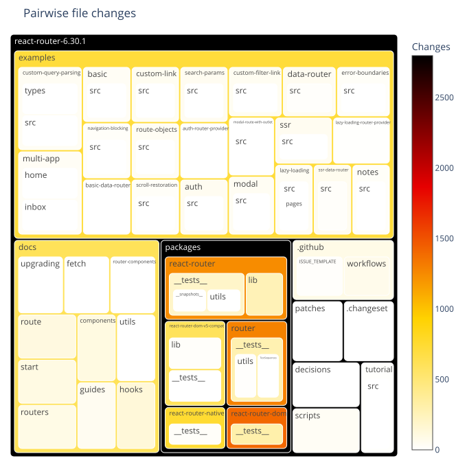
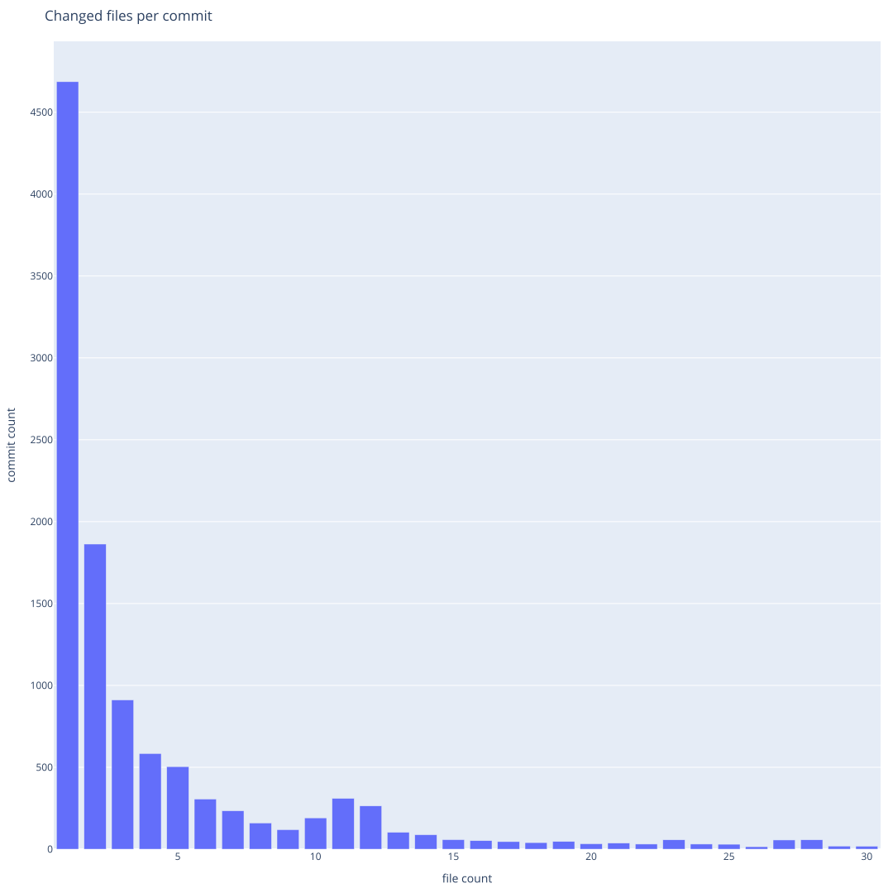

# git log/history
   

### References
- [Visualizing Code: Polyglot Notebooks Repository (YouTube)](https://youtu.be/ipOpToPS-PY?si=3doePt2cp-LgEUmt)
- [gitstractor (GitHub)](https://github.com/IntegerMan/gitstractor)
- [Neo4j Python Driver](https://neo4j.com/docs/api/python-driver/current)

    Command line execution (CLI mode): Yes

## Git History - Directory Commit Statistics

    Received notification from DBMS server: {severity: WARNING} {code: Neo.ClientNotification.Statement.AggregationSkippedNull} {category: UNRECOGNIZED} {title: The query contains an aggregation function that skips null values.} {description: null value eliminated in set function.} {position: None} for query: "// List git files with commit statistics\n \n  MATCH (git_file:File&Git&!Repository)\n  WHERE git_file.deletedAt IS NULL // filter out deleted files\n   WITH percentileDisc(git_file.createdAtEpoch, 0.5)          AS medianCreatedAtEpoch\n       ,percentileDisc(git_file.lastModificationAtEpoch, 0.5) AS medianLastModificationAtEpoch\n       ,collect(git_file)                                     AS git_files\n UNWIND git_files AS git_file\n   WITH *\n       ,datetime.fromepochMillis(coalesce(git_file.createdAtEpoch, medianCreatedAtEpoch))                                            AS fileCreatedAtTimestamp\n       ,datetime.fromepochMillis(coalesce(git_file.lastModificationAtEpoch, git_file.createdAtEpoch, medianLastModificationAtEpoch)) AS fileLastModificationAtTimestamp\n  MATCH (git_repository:Git&Repository)-[:HAS_FILE]->(git_file)\n  MATCH (git_commit:Git&Commit)-[:CONTAINS_CHANGE]->(git_change:Git&Change)-->(old_files_included:Git&File&!Repository)-[:HAS_NEW_NAME*0..3]->(git_file)\n RETURN git_repository.name + '/' + git_file.relativePath AS filePath\n       ,split(git_commit.author, ' <')[0]                 AS author\n       ,count(DISTINCT git_commit.sha)                    AS commitCount\n       ,collect(DISTINCT git_commit.sha)                  AS commitHashes\n       ,date(max(git_commit.date))                        AS lastCommitDate\n       ,max(date(fileCreatedAtTimestamp))                 AS lastCreationDate\n       ,max(date(fileLastModificationAtTimestamp))        AS lastModificationDate\n       ,duration.inDays(date(max(git_commit.date)), date()).days               AS daysSinceLastCommit\n       ,duration.inDays(max(fileCreatedAtTimestamp), datetime()).days          AS daysSinceLastCreation\n       ,duration.inDays(max(fileLastModificationAtTimestamp), datetime()).days AS daysSinceLastModification\n       ,max(git_commit.sha)                               AS maxCommitSha\n ORDER BY filePath ASCENDING, commitCount DESCENDING"

### Data Preview

<table border="1" class="dataframe">
  <thead>
    <tr style="text-align: right;">
      <th></th>
      <th>fileCount</th>
      <th>authorCount</th>
      <th>commitCount</th>
      <th>daysSinceLastCommit</th>
      <th>daysSinceLastCreation</th>
      <th>daysSinceLastModification</th>
    </tr>
  </thead>
  <tbody>
    <tr>
      <th>count</th>
      <td>83.000000</td>
      <td>83.000000</td>
      <td>83.000000</td>
      <td>83.000000</td>
      <td>83.000000</td>
      <td>83.000000</td>
    </tr>
    <tr>
      <th>mean</th>
      <td>25.301205</td>
      <td>19.650602</td>
      <td>129.975904</td>
      <td>491.975904</td>
      <td>895.722892</td>
      <td>492.903614</td>
    </tr>
    <tr>
      <th>std</th>
      <td>77.772453</td>
      <td>46.179246</td>
      <td>291.778607</td>
      <td>277.542657</td>
      <td>386.873122</td>
      <td>277.920045</td>
    </tr>
    <tr>
      <th>min</th>
      <td>1.000000</td>
      <td>2.000000</td>
      <td>3.000000</td>
      <td>74.000000</td>
      <td>103.000000</td>
      <td>73.000000</td>
    </tr>
    <tr>
      <th>25%</th>
      <td>4.000000</td>
      <td>4.000000</td>
      <td>11.000000</td>
      <td>222.000000</td>
      <td>620.000000</td>
      <td>221.000000</td>
    </tr>
    <tr>
      <th>50%</th>
      <td>10.000000</td>
      <td>6.000000</td>
      <td>26.000000</td>
      <td>607.000000</td>
      <td>975.000000</td>
      <td>606.000000</td>
    </tr>
    <tr>
      <th>75%</th>
      <td>13.000000</td>
      <td>13.500000</td>
      <td>83.000000</td>
      <td>706.000000</td>
      <td>1299.000000</td>
      <td>705.000000</td>
    </tr>
    <tr>
      <th>max</th>
      <td>633.000000</td>
      <td>343.000000</td>
      <td>1989.000000</td>
      <td>1340.000000</td>
      <td>1396.000000</td>
      <td>1339.000000</td>
    </tr>
  </tbody>
</table>

<table border="1" class="dataframe">
  <thead>
    <tr style="text-align: right;">
      <th></th>
      <th>directoryPath</th>
      <th>directoryParentPath</th>
      <th>directoryName</th>
      <th>fileCount</th>
      <th>firstFile</th>
      <th>mostFrequentFileExtension</th>
      <th>authorCount</th>
      <th>mainAuthor</th>
      <th>secondAuthor</th>
      <th>commitCount</th>
      <th>daysSinceLastCommit</th>
      <th>daysSinceLastCreation</th>
      <th>daysSinceLastModification</th>
      <th>lastCommitDate</th>
      <th>lastCreationDate</th>
      <th>lastModificationDate</th>
      <th>maxCommitSha</th>
    </tr>
  </thead>
  <tbody>
    <tr>
      <th>0</th>
      <td>react-router-6.30.0/examples/custom-query-parsing/types</td>
      <td>react-router-6.30.0/examples/custom-query-parsing</td>
      <td>types</td>
      <td>1</td>
      <td>react-router-6.30.0/examples/custom-query-parsing/types/jsurl.d.ts</td>
      <td>ts</td>
      <td>2</td>
      <td>Logan McAnsh</td>
      <td>Michael Jackson</td>
      <td>4</td>
      <td>1299</td>
      <td>1299</td>
      <td>1299</td>
      <td>2021-10-21</td>
      <td>2021-10-20</td>
      <td>2021-10-20</td>
      <td>dd0de338dfb32e38d1f4b091b3442ae55515edc3</td>
    </tr>
    <tr>
      <th>1</th>
      <td>react-router-6.30.0/packages/react-router-dom-v5-compat/lib</td>
      <td>react-router-6.30.0/packages/react-router-dom-v5-compat</td>
      <td>lib</td>
      <td>1</td>
      <td>react-router-6.30.0/packages/react-router-dom-v5-compat/lib/components.tsx</td>
      <td>tsx</td>
      <td>6</td>
      <td>Ayush C</td>
      <td>Brooks Lybrand</td>
      <td>26</td>
      <td>322</td>
      <td>1137</td>
      <td>321</td>
      <td>2024-06-24</td>
      <td>2022-03-31</td>
      <td>2024-06-24</td>
      <td>da57748644da6400e2d051b2aa004df47beda1cf</td>
    </tr>
    <tr>
      <th>2</th>
      <td>react-router-6.30.0/packages/react-router-dom/__tests__/polyfills</td>
      <td>react-router-6.30.0/packages/react-router-dom/__tests__</td>
      <td>polyfills</td>
      <td>1</td>
      <td>react-router-6.30.0/packages/react-router-dom/__tests__/polyfills/drop-FormData-submitter.ts</td>
      <td>ts</td>
      <td>2</td>
      <td>Jon Jensen</td>
      <td>Matt Brophy</td>
      <td>3</td>
      <td>683</td>
      <td>697</td>
      <td>697</td>
      <td>2023-06-29</td>
      <td>2023-06-14</td>
      <td>2023-06-14</td>
      <td>f63774c3843e2f25b6ca5b6f4882ebd4db705603</td>
    </tr>
    <tr>
      <th>3</th>
      <td>react-router-6.30.0/packages/react-router/__tests__/__snapshots__</td>
      <td>react-router-6.30.0/packages/react-router/__tests__</td>
      <td>__snapshots__</td>
      <td>1</td>
      <td>react-router-6.30.0/packages/react-router/__tests__/__snapshots__/route-matching-test.tsx.snap</td>
      <td>snap</td>
      <td>2</td>
      <td>Chance Strickland</td>
      <td>Michael Jackson</td>
      <td>6</td>
      <td>1340</td>
      <td>1396</td>
      <td>1339</td>
      <td>2021-09-10</td>
      <td>2021-07-15</td>
      <td>2021-09-10</td>
      <td>eff2bd9148de1849fb93519f59262e4b53e8d823</td>
    </tr>
    <tr>
      <th>4</th>
      <td>react-router-6.30.0/patches</td>
      <td>react-router-6.30.0</td>
      <td>patches</td>
      <td>1</td>
      <td>react-router-6.30.0/patches/@changesets__get-dependents-graph@1.3.6.patch</td>
      <td>patch</td>
      <td>4</td>
      <td>Chance Strickland</td>
      <td>Mark Dalgleish</td>
      <td>10</td>
      <td>384</td>
      <td>416</td>
      <td>416</td>
      <td>2024-04-23</td>
      <td>2024-03-21</td>
      <td>2024-03-21</td>
      <td>f264d828939e3ae74a6ca47e40d4c4b2fd027e8e</td>
    </tr>
    <tr>
      <th>5</th>
      <td>react-router-6.30.0/.changeset</td>
      <td>react-router-6.30.0</td>
      <td>.changeset</td>
      <td>2</td>
      <td>react-router-6.30.0/.changeset/README.md</td>
      <td>json</td>
      <td>3</td>
      <td>Chance Strickland</td>
      <td>Matt Brophy</td>
      <td>10</td>
      <td>384</td>
      <td>1062</td>
      <td>383</td>
      <td>2024-04-23</td>
      <td>2022-06-14</td>
      <td>2024-04-23</td>
      <td>f3009f5536b6bb3354bfe91d5ff02dd2fae91285</td>
    </tr>
    <tr>
      <th>6</th>
      <td>react-router-6.30.0/docs/upgrading</td>
      <td>react-router-6.30.0/docs</td>
      <td>upgrading</td>
      <td>2</td>
      <td>react-router-6.30.0/docs/upgrading/future.md</td>
      <td>md</td>
      <td>5</td>
      <td>Matt Brophy</td>
      <td>Brooks Lybrand</td>
      <td>16</td>
      <td>158</td>
      <td>346</td>
      <td>158</td>
      <td>2024-12-05</td>
      <td>2024-05-30</td>
      <td>2024-12-05</td>
      <td>fa256911d64a0ce07ee46fa0e598ff734842f622</td>
    </tr>
    <tr>
      <th>7</th>
      <td>react-router-6.30.0/examples/lazy-loading/src/pages</td>
      <td>react-router-6.30.0/examples/lazy-loading/src</td>
      <td>pages</td>
      <td>2</td>
      <td>react-router-6.30.0/examples/lazy-loading/src/pages/About.tsx</td>
      <td>tsx</td>
      <td>3</td>
      <td>Logan McAnsh</td>
      <td>Matt Brophy</td>
      <td>7</td>
      <td>706</td>
      <td>1299</td>
      <td>705</td>
      <td>2023-06-06</td>
      <td>2021-10-21</td>
      <td>2023-06-06</td>
      <td>f3e3f59fa15ab4dbc497a2d8c66055976d3e54d3</td>
    </tr>
    <tr>
      <th>8</th>
      <td>react-router-6.30.0/.github/ISSUE_TEMPLATE</td>
      <td>react-router-6.30.0/.github</td>
      <td>ISSUE_TEMPLATE</td>
      <td>3</td>
      <td>react-router-6.30.0/.github/ISSUE_TEMPLATE/bug_report.yml</td>
      <td>yml</td>
      <td>10</td>
      <td>Chance Strickland</td>
      <td>Matt Brophy</td>
      <td>25</td>
      <td>207</td>
      <td>851</td>
      <td>206</td>
      <td>2024-10-17</td>
      <td>2023-01-11</td>
      <td>2024-10-17</td>
      <td>fdb90690cb74b1060f9e9de550520f30f9c2ef08</td>
    </tr>
    <tr>
      <th>9</th>
      <td>react-router-6.30.0/examples/navigation-blocking/src</td>
      <td>react-router-6.30.0/examples/navigation-blocking</td>
      <td>src</td>
      <td>3</td>
      <td>react-router-6.30.0/examples/navigation-blocking/src/app.tsx</td>
      <td>tsx</td>
      <td>2</td>
      <td>Chance Strickland</td>
      <td>Matt Brophy</td>
      <td>15</td>
      <td>543</td>
      <td>849</td>
      <td>542</td>
      <td>2023-11-16</td>
      <td>2023-01-13</td>
      <td>2023-11-16</td>
      <td>f3e3f59fa15ab4dbc497a2d8c66055976d3e54d3</td>
    </tr>
    <tr>
      <th>10</th>
      <td>react-router-6.30.0/packages/react-router-dom-v5-compat/__tests__</td>
      <td>react-router-6.30.0/packages/react-router-dom-v5-compat</td>
      <td>__tests__</td>
      <td>3</td>
      <td>react-router-6.30.0/packages/react-router-dom-v5-compat/__tests__/compat-router-test.tsx</td>
      <td>tsx</td>
      <td>4</td>
      <td>Matt Brophy</td>
      <td>Pedro Cattori</td>
      <td>9</td>
      <td>837</td>
      <td>843</td>
      <td>843</td>
      <td>2023-01-26</td>
      <td>2023-01-19</td>
      <td>2023-01-19</td>
      <td>d1e7f3b749b8f2b4aa7fc605ed2f3ddc1121b63b</td>
    </tr>
    <tr>
      <th>11</th>
      <td>react-router-6.30.0/decisions</td>
      <td>react-router-6.30.0</td>
      <td>decisions</td>
      <td>4</td>
      <td>react-router-6.30.0/decisions/0001-use-blocker.md</td>
      <td>md</td>
      <td>2</td>
      <td>Matt Brophy</td>
      <td>Jacob Ebey</td>
      <td>9</td>
      <td>384</td>
      <td>426</td>
      <td>426</td>
      <td>2024-04-23</td>
      <td>2024-03-11</td>
      <td>2024-03-11</td>
      <td>fca5e55122ee717afac9da1020861a68d0b6425b</td>
    </tr>
    <tr>
      <th>12</th>
      <td>react-router-6.30.0/examples/basic/src</td>
      <td>react-router-6.30.0/examples/basic</td>
      <td>src</td>
      <td>4</td>
      <td>react-router-6.30.0/examples/basic/src/App.tsx</td>
      <td>tsx</td>
      <td>7</td>
      <td>Chance Strickland</td>
      <td>Michael Jackson</td>
      <td>18</td>
      <td>706</td>
      <td>1357</td>
      <td>705</td>
      <td>2023-06-06</td>
      <td>2021-08-23</td>
      <td>2023-06-06</td>
      <td>fedf1d2ad8b7cc20b2fcfe18d86d0f4eb3f689a2</td>
    </tr>
    <tr>
      <th>13</th>
      <td>react-router-6.30.0/examples/custom-link/src</td>
      <td>react-router-6.30.0/examples/custom-link</td>
      <td>src</td>
      <td>4</td>
      <td>react-router-6.30.0/examples/custom-link/src/App.tsx</td>
      <td>tsx</td>
      <td>5</td>
      <td>Logan McAnsh</td>
      <td>Matt Brophy</td>
      <td>11</td>
      <td>706</td>
      <td>1312</td>
      <td>705</td>
      <td>2023-06-06</td>
      <td>2021-10-07</td>
      <td>2023-06-06</td>
      <td>fedf1d2ad8b7cc20b2fcfe18d86d0f4eb3f689a2</td>
    </tr>
    <tr>
      <th>14</th>
      <td>react-router-6.30.0/examples/custom-query-parsing/src</td>
      <td>react-router-6.30.0/examples/custom-query-parsing</td>
      <td>src</td>
      <td>4</td>
      <td>react-router-6.30.0/examples/custom-query-parsing/src/App.tsx</td>
      <td>tsx</td>
      <td>7</td>
      <td>Logan McAnsh</td>
      <td>Chance Strickland</td>
      <td>18</td>
      <td>706</td>
      <td>1299</td>
      <td>705</td>
      <td>2023-06-06</td>
      <td>2021-10-20</td>
      <td>2023-06-06</td>
      <td>fedf1d2ad8b7cc20b2fcfe18d86d0f4eb3f689a2</td>
    </tr>
    <tr>
      <th>15</th>
      <td>react-router-6.30.0/examples/multi-app/home</td>
      <td>react-router-6.30.0/examples/multi-app</td>
      <td>home</td>
      <td>4</td>
      <td>react-router-6.30.0/examples/multi-app/home/App.jsx</td>
      <td>jsx</td>
      <td>4</td>
      <td>Logan McAnsh</td>
      <td>Michael Jackson</td>
      <td>9</td>
      <td>706</td>
      <td>1297</td>
      <td>705</td>
      <td>2023-06-06</td>
      <td>2021-10-22</td>
      <td>2023-06-06</td>
      <td>f3e3f59fa15ab4dbc497a2d8c66055976d3e54d3</td>
    </tr>
    <tr>
      <th>16</th>
      <td>react-router-6.30.0/examples/route-objects/src</td>
      <td>react-router-6.30.0/examples/route-objects</td>
      <td>src</td>
      <td>4</td>
      <td>react-router-6.30.0/examples/route-objects/src/App.tsx</td>
      <td>tsx</td>
      <td>5</td>
      <td>Logan McAnsh</td>
      <td>Michael Jackson</td>
      <td>11</td>
      <td>706</td>
      <td>1298</td>
      <td>705</td>
      <td>2023-06-06</td>
      <td>2021-10-21</td>
      <td>2023-06-06</td>
      <td>fedf1d2ad8b7cc20b2fcfe18d86d0f4eb3f689a2</td>
    </tr>
    <tr>
      <th>17</th>
      <td>react-router-6.30.0/examples/scroll-restoration/src</td>
      <td>react-router-6.30.0/examples/scroll-restoration</td>
      <td>src</td>
      <td>4</td>
      <td>react-router-6.30.0/examples/scroll-restoration/src/app.tsx</td>
      <td>tsx</td>
      <td>3</td>
      <td>Matt Brophy</td>
      <td>Pedro Cattori</td>
      <td>12</td>
      <td>706</td>
      <td>976</td>
      <td>705</td>
      <td>2023-06-06</td>
      <td>2022-09-08</td>
      <td>2023-06-06</td>
      <td>f3e3f59fa15ab4dbc497a2d8c66055976d3e54d3</td>
    </tr>
    <tr>
      <th>18</th>
      <td>react-router-6.30.0/examples/search-params/src</td>
      <td>react-router-6.30.0/examples/search-params</td>
      <td>src</td>
      <td>4</td>
      <td>react-router-6.30.0/examples/search-params/src/App.tsx</td>
      <td>tsx</td>
      <td>6</td>
      <td>Logan McAnsh</td>
      <td>Chance Strickland</td>
      <td>13</td>
      <td>706</td>
      <td>1314</td>
      <td>705</td>
      <td>2023-06-06</td>
      <td>2021-10-05</td>
      <td>2023-06-06</td>
      <td>fedf1d2ad8b7cc20b2fcfe18d86d0f4eb3f689a2</td>
    </tr>
    <tr>
      <th>19</th>
      <td>react-router-6.30.0/packages/react-router-native/__tests__/__snapshots__</td>
      <td>react-router-6.30.0/packages/react-router-native/__tests__</td>
      <td>__snapshots__</td>
      <td>4</td>
      <td>react-router-6.30.0/packages/react-router-native/__tests__/__snapshots__/deep-linking-test.tsx.snap</td>
      <td>snap</td>
      <td>4</td>
      <td>Chance Strickland</td>
      <td>Matt Brophy</td>
      <td>14</td>
      <td>837</td>
      <td>1346</td>
      <td>836</td>
      <td>2023-01-26</td>
      <td>2021-09-03</td>
      <td>2023-01-26</td>
      <td>eff2bd9148de1849fb93519f59262e4b53e8d823</td>
    </tr>
    <tr>
      <th>20</th>
      <td>react-router-6.30.0/packages/react-router/lib</td>
      <td>react-router-6.30.0/packages/react-router</td>
      <td>lib</td>
      <td>4</td>
      <td>react-router-6.30.0/packages/react-router/lib/components.tsx</td>
      <td>tsx</td>
      <td>19</td>
      <td>Matt Brophy</td>
      <td>Ayush C</td>
      <td>194</td>
      <td>102</td>
      <td>205</td>
      <td>101</td>
      <td>2025-01-30</td>
      <td>2024-10-18</td>
      <td>2025-01-30</td>
      <td>feebfc0bf10614ba44ff43e2b9c69e22ad07a7a1</td>
    </tr>
    <tr>
      <th>21</th>
      <td>react-router-6.30.0/packages/router/__tests__/utils</td>
      <td>react-router-6.30.0/packages/router/__tests__</td>
      <td>utils</td>
      <td>4</td>
      <td>react-router-6.30.0/packages/router/__tests__/utils/custom-matchers.ts</td>
      <td>ts</td>
      <td>2</td>
      <td>Matt Brophy</td>
      <td>Jacob Ebey</td>
      <td>21</td>
      <td>244</td>
      <td>426</td>
      <td>243</td>
      <td>2024-09-10</td>
      <td>2024-03-11</td>
      <td>2024-09-10</td>
      <td>ec03b12c600ba899d1a35b6f63bc45bb594c1e88</td>
    </tr>
    <tr>
      <th>22</th>
      <td>react-router-6.30.0/tutorial/src</td>
      <td>react-router-6.30.0/tutorial</td>
      <td>src</td>
      <td>4</td>
      <td>react-router-6.30.0/tutorial/src/App.jsx</td>
      <td>jsx</td>
      <td>3</td>
      <td>Chance Strickland</td>
      <td>Chris Chudzicki</td>
      <td>7</td>
      <td>1169</td>
      <td>1287</td>
      <td>1168</td>
      <td>2022-02-28</td>
      <td>2021-11-01</td>
      <td>2022-02-28</td>
      <td>f5dccaa1426ea2c06dc654a73b939e45c7d5038e</td>
    </tr>
    <tr>
      <th>23</th>
      <td>react-router-6.30.0/docs/fetch</td>
      <td>react-router-6.30.0/docs</td>
      <td>fetch</td>
      <td>5</td>
      <td>react-router-6.30.0/docs/fetch/index.md</td>
      <td>md</td>
      <td>6</td>
      <td>Matt Brophy</td>
      <td>Ryan Florence</td>
      <td>16</td>
      <td>284</td>
      <td>284</td>
      <td>284</td>
      <td>2024-08-01</td>
      <td>2024-07-31</td>
      <td>2024-07-31</td>
      <td>f0b886bce7dab2e2f37f53fe58cd6c7ab0660e25</td>
    </tr>
    <tr>
      <th>24</th>
      <td>react-router-6.30.0/examples/auth/src</td>
      <td>react-router-6.30.0/examples/auth</td>
      <td>src</td>
      <td>5</td>
      <td>react-router-6.30.0/examples/auth/src/App.tsx</td>
      <td>tsx</td>
      <td>8</td>
      <td>Logan McAnsh</td>
      <td>Chance Strickland</td>
      <td>22</td>
      <td>706</td>
      <td>1315</td>
      <td>705</td>
      <td>2023-06-06</td>
      <td>2021-10-04</td>
      <td>2023-06-06</td>
      <td>fedf1d2ad8b7cc20b2fcfe18d86d0f4eb3f689a2</td>
    </tr>
    <tr>
      <th>25</th>
      <td>react-router-6.30.0/examples/custom-filter-link/src</td>
      <td>react-router-6.30.0/examples/custom-filter-link</td>
      <td>src</td>
      <td>5</td>
      <td>react-router-6.30.0/examples/custom-filter-link/src/App.tsx</td>
      <td>tsx</td>
      <td>6</td>
      <td>Logan McAnsh</td>
      <td>Chance Strickland</td>
      <td>13</td>
      <td>706</td>
      <td>1312</td>
      <td>705</td>
      <td>2023-06-06</td>
      <td>2021-10-07</td>
      <td>2023-06-06</td>
      <td>fedf1d2ad8b7cc20b2fcfe18d86d0f4eb3f689a2</td>
    </tr>
    <tr>
      <th>26</th>
      <td>react-router-6.30.0/examples/data-router/src</td>
      <td>react-router-6.30.0/examples/data-router</td>
      <td>src</td>
      <td>5</td>
      <td>react-router-6.30.0/examples/data-router/src/app.tsx</td>
      <td>tsx</td>
      <td>4</td>
      <td>Matt Brophy</td>
      <td>Chance Strickland</td>
      <td>25</td>
      <td>543</td>
      <td>976</td>
      <td>542</td>
      <td>2023-11-16</td>
      <td>2022-09-08</td>
      <td>2023-11-16</td>
      <td>f3e3f59fa15ab4dbc497a2d8c66055976d3e54d3</td>
    </tr>
    <tr>
      <th>27</th>
      <td>react-router-6.30.0/examples/error-boundaries/src</td>
      <td>react-router-6.30.0/examples/error-boundaries</td>
      <td>src</td>
      <td>5</td>
      <td>react-router-6.30.0/examples/error-boundaries/src/app.tsx</td>
      <td>tsx</td>
      <td>2</td>
      <td>Matt Brophy</td>
      <td>Pedro Cattori</td>
      <td>8</td>
      <td>706</td>
      <td>976</td>
      <td>705</td>
      <td>2023-06-06</td>
      <td>2022-09-08</td>
      <td>2023-06-06</td>
      <td>f3e3f59fa15ab4dbc497a2d8c66055976d3e54d3</td>
    </tr>
    <tr>
      <th>28</th>
      <td>react-router-6.30.0/examples/modal-route-with-outlet/src</td>
      <td>react-router-6.30.0/examples/modal-route-with-outlet</td>
      <td>src</td>
      <td>5</td>
      <td>react-router-6.30.0/examples/modal-route-with-outlet/src/App.tsx</td>
      <td>ts</td>
      <td>2</td>
      <td>Matt Brophy</td>
      <td>Shane Walker</td>
      <td>3</td>
      <td>641</td>
      <td>662</td>
      <td>662</td>
      <td>2023-08-10</td>
      <td>2023-07-19</td>
      <td>2023-07-19</td>
      <td>fad3bc011140d6daec3d03889ac30375aca11c05</td>
    </tr>
    <tr>
      <th>29</th>
      <td>react-router-6.30.0/examples/modal/src</td>
      <td>react-router-6.30.0/examples/modal</td>
      <td>src</td>
      <td>5</td>
      <td>react-router-6.30.0/examples/modal/src/App.tsx</td>
      <td>tsx</td>
      <td>6</td>
      <td>Logan McAnsh</td>
      <td>Michael Jackson</td>
      <td>16</td>
      <td>706</td>
      <td>1312</td>
      <td>705</td>
      <td>2023-06-06</td>
      <td>2021-10-07</td>
      <td>2023-06-06</td>
      <td>fedf1d2ad8b7cc20b2fcfe18d86d0f4eb3f689a2</td>
    </tr>
  </tbody>
</table>

### Number of files per directory

    

    

### Most frequent file extension per directory

    

    

### Number of commits per directory

    

    

### Number of distinct authors per directory

    

    

### Directories with very few different authors

    

    

### Main author per directory

    

    

### Second author per directory

    

    

### Days since last commit per directory

    

    

### Days since last commit per directory (ranked)

    

    

### Days since last file creation per directory

    

    

### Days since last file creation per directory (ranked)

    

    

### Days since last file modification per directory

    

    

### Days since last file modification per directory (ranked)

    

    

### File changed frequently with other files

    

    

## Filecount per commit

Shows how many commits had changed one file, how many had changed two files, and so on.
The chart is limited to 30 lines for improved readability.
The data preview also includes overall statistics including the number of commits that are filtered out in the chart.

### Preview data

    Sum of commits that changed more than 30 files (each) = 229
    Max changed files with one commit = 498

<table border="1" class="dataframe">
  <thead>
    <tr style="text-align: right;">
      <th></th>
      <th>filesPerCommit</th>
      <th>commitCount</th>
    </tr>
  </thead>
  <tbody>
    <tr>
      <th>count</th>
      <td>117.000000</td>
      <td>117.000000</td>
    </tr>
    <tr>
      <th>mean</th>
      <td>79.179487</td>
      <td>57.487179</td>
    </tr>
    <tr>
      <th>std</th>
      <td>78.464424</td>
      <td>318.285158</td>
    </tr>
    <tr>
      <th>min</th>
      <td>1.000000</td>
      <td>1.000000</td>
    </tr>
    <tr>
      <th>25%</th>
      <td>30.000000</td>
      <td>1.000000</td>
    </tr>
    <tr>
      <th>50%</th>
      <td>59.000000</td>
      <td>3.000000</td>
    </tr>
    <tr>
      <th>75%</th>
      <td>96.000000</td>
      <td>8.000000</td>
    </tr>
    <tr>
      <th>max</th>
      <td>498.000000</td>
      <td>3220.000000</td>
    </tr>
  </tbody>
</table>

<table border="1" class="dataframe">
  <thead>
    <tr style="text-align: right;">
      <th></th>
      <th>filesPerCommit</th>
      <th>commitCount</th>
    </tr>
  </thead>
  <tbody>
    <tr>
      <th>0</th>
      <td>1</td>
      <td>3220</td>
    </tr>
    <tr>
      <th>1</th>
      <td>2</td>
      <td>1119</td>
    </tr>
    <tr>
      <th>2</th>
      <td>3</td>
      <td>516</td>
    </tr>
    <tr>
      <th>3</th>
      <td>4</td>
      <td>328</td>
    </tr>
    <tr>
      <th>4</th>
      <td>5</td>
      <td>241</td>
    </tr>
    <tr>
      <th>5</th>
      <td>6</td>
      <td>166</td>
    </tr>
    <tr>
      <th>6</th>
      <td>7</td>
      <td>119</td>
    </tr>
    <tr>
      <th>7</th>
      <td>8</td>
      <td>81</td>
    </tr>
    <tr>
      <th>8</th>
      <td>9</td>
      <td>68</td>
    </tr>
    <tr>
      <th>9</th>
      <td>10</td>
      <td>64</td>
    </tr>
    <tr>
      <th>10</th>
      <td>11</td>
      <td>101</td>
    </tr>
    <tr>
      <th>11</th>
      <td>12</td>
      <td>65</td>
    </tr>
    <tr>
      <th>12</th>
      <td>13</td>
      <td>62</td>
    </tr>
    <tr>
      <th>13</th>
      <td>14</td>
      <td>50</td>
    </tr>
    <tr>
      <th>14</th>
      <td>15</td>
      <td>36</td>
    </tr>
    <tr>
      <th>15</th>
      <td>16</td>
      <td>31</td>
    </tr>
    <tr>
      <th>16</th>
      <td>17</td>
      <td>30</td>
    </tr>
    <tr>
      <th>17</th>
      <td>18</td>
      <td>25</td>
    </tr>
    <tr>
      <th>18</th>
      <td>19</td>
      <td>30</td>
    </tr>
    <tr>
      <th>19</th>
      <td>20</td>
      <td>25</td>
    </tr>
    <tr>
      <th>20</th>
      <td>21</td>
      <td>21</td>
    </tr>
    <tr>
      <th>21</th>
      <td>22</td>
      <td>12</td>
    </tr>
    <tr>
      <th>22</th>
      <td>23</td>
      <td>15</td>
    </tr>
    <tr>
      <th>23</th>
      <td>24</td>
      <td>13</td>
    </tr>
    <tr>
      <th>24</th>
      <td>25</td>
      <td>15</td>
    </tr>
    <tr>
      <th>25</th>
      <td>26</td>
      <td>6</td>
    </tr>
    <tr>
      <th>26</th>
      <td>27</td>
      <td>6</td>
    </tr>
    <tr>
      <th>27</th>
      <td>28</td>
      <td>13</td>
    </tr>
    <tr>
      <th>28</th>
      <td>29</td>
      <td>9</td>
    </tr>
    <tr>
      <th>29</th>
      <td>30</td>
      <td>10</td>
    </tr>
  </tbody>
</table>

### Bar chart with the number of files per commit distribution

    

    

## Pairwise Changed Files vs. Dependency Weight

This section explores the correlation between how often pairs of files are changed together (common commit count) and their dependency weight. Note that these results should be interpreted cautiously, as comparing pairwise changes and dependencies is inherently challenging.

### Considerations
- **Historical vs. Current State**: Pairwise changes reflect the entire git history, while dependency weight represents the current state of the codebase.
- **Commit Granularity**: Developers may use different commit strategies, such as squashing changes into a single commit or creating fine-grained commits. Ideally, each commit should represent a single semantic change for accurate analysis.
- **Dependency Representation**: Some file types (e.g., Java files with import statements) clearly define dependencies, while others (e.g., shell scripts, XML, YAML) lack explicit dependency relationships.
- **Repository Characteristics**: Repositories with generated code may have many large commits, while stabilized repositories may only update configuration files for dependency changes.

#### Data Preview

    Received notification from DBMS server: {severity: WARNING} {code: Neo.ClientNotification.Statement.UnknownPropertyKeyWarning} {category: UNRECOGNIZED} {title: The provided property key is not in the database} {description: One of the property names in your query is not available in the database, make sure you didn't misspell it or that the label is available when you run this statement in your application (the missing property name is: weight)} {position: line: 9, column: 28, offset: 549} for query: "// List pair of files that were changed together and that have a declared dependency between each other.\n \n MATCH (firstCodeFile:File)-[dependency:DEPENDS_ON]->(secondCodeFile:File)\n MATCH (firstCodeFile)-[pairwiseChange:CHANGED_TOGETHER_WITH]-(secondCodeFile)\n //De-duplicating the pairs of files isn't necessary, because the dependency relation is directed.\n //WHERE elementId(firstCodeFile) < elementId(secondCodeFile)\n  WITH  firstCodeFile.fileName      AS firstFileName\n       ,secondCodeFile.fileName     AS secondFileName\n       ,coalesce(dependency.weight, dependency.cardinality)    AS dependencyWeight\n       ,pairwiseChange.commitCount  AS commitCount\n       ,dependency.fileDistanceAsFewestChangeDirectoryCommands AS fileDistanceAsFewestChangeDirectoryCommands\n RETURN dependencyWeight\n       ,commitCount\n       ,fileDistanceAsFewestChangeDirectoryCommands\n       // ,count(*)                    AS occurrences\n       // ,collect(firstFileName + ' -> ' + secondFileName)[0..3] AS examples\n ORDER BY dependencyWeight, commitCount\n \n // MATCH (firstCodeFile:File)-[dependency:DEPENDS_ON]->(secondCodeFile:File)\n // MATCH (firstCodeFile)-[pairwiseChange:CHANGED_TOGETHER_WITH]-(secondCodeFile)\n // WHERE elementId(firstCodeFile) < elementId(secondCodeFile)\n // RETURN firstCodeFile.fileName  AS firstFileName\n //       ,secondCodeFile.fileName AS secondFileName\n //       ,dependency.weight           AS dependencyWeight\n //       ,pairwiseChange.commitCount  AS commitCount\n // ORDER BY dependencyWeight, commitCount\n \n //  MATCH (g1:!Git&File)-[relation:CHANGED_TOGETHER_WITH|DEPENDS_ON]-(g2:!Git&File) \n //   WITH count(DISTINCT relation)   AS relatedFilesCount\n //       ,collect(DISTINCT relation) AS relations\n // UNWIND relations AS relation\n //   WITH relatedFilesCount\n //       ,coalesce(relation.commitCount, 0)                                 AS commitCount\n //       ,coalesce(relation.weight, 0)                                      AS dependencyWeight\n //       ,coalesce(relation.fileDistanceAsFewestChangeDirectoryCommands, 0) AS fileDistanceAsFewestChangeDirectoryCommands\n // RETURN dependencyWeight\n //       ,commitCount\n //       ,fileDistanceAsFewestChangeDirectoryCommands\n // ORDER BY dependencyWeight, commitCount\n"

    Received notification from DBMS server: {severity: WARNING} {code: Neo.ClientNotification.Statement.UnknownPropertyKeyWarning} {category: UNRECOGNIZED} {title: The provided property key is not in the database} {description: One of the property names in your query is not available in the database, make sure you didn't misspell it or that the label is available when you run this statement in your application (the missing property name is: fileDistanceAsFewestChangeDirectoryCommands)} {position: line: 11, column: 19, offset: 672} for query: "// List pair of files that were changed together and that have a declared dependency between each other.\n \n MATCH (firstCodeFile:File)-[dependency:DEPENDS_ON]->(secondCodeFile:File)\n MATCH (firstCodeFile)-[pairwiseChange:CHANGED_TOGETHER_WITH]-(secondCodeFile)\n //De-duplicating the pairs of files isn't necessary, because the dependency relation is directed.\n //WHERE elementId(firstCodeFile) < elementId(secondCodeFile)\n  WITH  firstCodeFile.fileName      AS firstFileName\n       ,secondCodeFile.fileName     AS secondFileName\n       ,coalesce(dependency.weight, dependency.cardinality)    AS dependencyWeight\n       ,pairwiseChange.commitCount  AS commitCount\n       ,dependency.fileDistanceAsFewestChangeDirectoryCommands AS fileDistanceAsFewestChangeDirectoryCommands\n RETURN dependencyWeight\n       ,commitCount\n       ,fileDistanceAsFewestChangeDirectoryCommands\n       // ,count(*)                    AS occurrences\n       // ,collect(firstFileName + ' -> ' + secondFileName)[0..3] AS examples\n ORDER BY dependencyWeight, commitCount\n \n // MATCH (firstCodeFile:File)-[dependency:DEPENDS_ON]->(secondCodeFile:File)\n // MATCH (firstCodeFile)-[pairwiseChange:CHANGED_TOGETHER_WITH]-(secondCodeFile)\n // WHERE elementId(firstCodeFile) < elementId(secondCodeFile)\n // RETURN firstCodeFile.fileName  AS firstFileName\n //       ,secondCodeFile.fileName AS secondFileName\n //       ,dependency.weight           AS dependencyWeight\n //       ,pairwiseChange.commitCount  AS commitCount\n // ORDER BY dependencyWeight, commitCount\n \n //  MATCH (g1:!Git&File)-[relation:CHANGED_TOGETHER_WITH|DEPENDS_ON]-(g2:!Git&File) \n //   WITH count(DISTINCT relation)   AS relatedFilesCount\n //       ,collect(DISTINCT relation) AS relations\n // UNWIND relations AS relation\n //   WITH relatedFilesCount\n //       ,coalesce(relation.commitCount, 0)                                 AS commitCount\n //       ,coalesce(relation.weight, 0)                                      AS dependencyWeight\n //       ,coalesce(relation.fileDistanceAsFewestChangeDirectoryCommands, 0) AS fileDistanceAsFewestChangeDirectoryCommands\n // RETURN dependencyWeight\n //       ,commitCount\n //       ,fileDistanceAsFewestChangeDirectoryCommands\n // ORDER BY dependencyWeight, commitCount\n"

<table border="1" class="dataframe">
  <thead>
    <tr style="text-align: right;">
      <th></th>
      <th>dependencyWeight</th>
      <th>commitCount</th>
      <th>fileDistanceAsFewestChangeDirectoryCommands</th>
    </tr>
  </thead>
  <tbody>
  </tbody>
</table>

#### Data Statistics

    'Pairwise changed git files compared to dependency weights - Overall statistics'

<table border="1" class="dataframe">
  <thead>
    <tr style="text-align: right;">
      <th></th>
      <th>dependencyWeight</th>
      <th>commitCount</th>
      <th>fileDistanceAsFewestChangeDirectoryCommands</th>
    </tr>
  </thead>
  <tbody>
    <tr>
      <th>count</th>
      <td>0</td>
      <td>0</td>
      <td>0</td>
    </tr>
    <tr>
      <th>unique</th>
      <td>0</td>
      <td>0</td>
      <td>0</td>
    </tr>
    <tr>
      <th>top</th>
      <td>NaN</td>
      <td>NaN</td>
      <td>NaN</td>
    </tr>
    <tr>
      <th>freq</th>
      <td>NaN</td>
      <td>NaN</td>
      <td>NaN</td>
    </tr>
  </tbody>
</table>

    'Pairwise changed git files compared to dependency weights - Pearson Correlation'

<table border="1" class="dataframe">
  <thead>
    <tr style="text-align: right;">
      <th></th>
      <th>dependencyWeight</th>
      <th>commitCount</th>
      <th>fileDistanceAsFewestChangeDirectoryCommands</th>
    </tr>
  </thead>
  <tbody>
    <tr>
      <th>dependencyWeight</th>
      <td>NaN</td>
      <td>NaN</td>
      <td>NaN</td>
    </tr>
    <tr>
      <th>commitCount</th>
      <td>NaN</td>
      <td>NaN</td>
      <td>NaN</td>
    </tr>
    <tr>
      <th>fileDistanceAsFewestChangeDirectoryCommands</th>
      <td>NaN</td>
      <td>NaN</td>
      <td>NaN</td>
    </tr>
  </tbody>
</table>

    'Pairwise changed git files compared to dependency weights - Spearman Correlation'

<table border="1" class="dataframe">
  <thead>
    <tr style="text-align: right;">
      <th></th>
      <th>dependencyWeight</th>
      <th>commitCount</th>
      <th>fileDistanceAsFewestChangeDirectoryCommands</th>
    </tr>
  </thead>
  <tbody>
    <tr>
      <th>dependencyWeight</th>
      <td>NaN</td>
      <td>NaN</td>
      <td>NaN</td>
    </tr>
    <tr>
      <th>commitCount</th>
      <td>NaN</td>
      <td>NaN</td>
      <td>NaN</td>
    </tr>
    <tr>
      <th>fileDistanceAsFewestChangeDirectoryCommands</th>
      <td>NaN</td>
      <td>NaN</td>
      <td>NaN</td>
    </tr>
  </tbody>
</table>

    Less than 5 samples are not enough to calculate p-values

    No data to plot

## WordCloud of git authors

<table border="1" class="dataframe">
  <thead>
    <tr style="text-align: right;">
      <th></th>
      <th>word</th>
      <th>frequency</th>
    </tr>
  </thead>
  <tbody>
    <tr>
      <th>0</th>
      <td>Michael Jackson</td>
      <td>1832</td>
    </tr>
    <tr>
      <th>1</th>
      <td>Ryan Florence</td>
      <td>1119</td>
    </tr>
    <tr>
      <th>2</th>
      <td>Matt Brophy</td>
      <td>753</td>
    </tr>
    <tr>
      <th>3</th>
      <td>Jimmy Jia</td>
      <td>381</td>
    </tr>
    <tr>
      <th>4</th>
      <td>Tim Dorr</td>
      <td>326</td>
    </tr>
    <tr>
      <th>5</th>
      <td>Chance Strickland</td>
      <td>180</td>
    </tr>
    <tr>
      <th>6</th>
      <td>Mateusz Zatorski</td>
      <td>124</td>
    </tr>
    <tr>
      <th>7</th>
      <td>Logan McAnsh</td>
      <td>99</td>
    </tr>
    <tr>
      <th>8</th>
      <td>Dan Abramov</td>
      <td>92</td>
    </tr>
    <tr>
      <th>9</th>
      <td>Paul Sherman</td>
      <td>77</td>
    </tr>
  </tbody>
</table>

    

    

