# 🔗 Internal Dependencies Report

## 1. Executive Overview

Analyzes internal dependencies: packages, artifacts, modules, NPM packages within codebase.

**Topics**:

- **Internal structure** — interface segregation, widely used types, and usage ratios between modules
- **Path finding** — shortest and longest path distributions revealing dependency chain depth and complexity
- **Topological sort** — build ordering derived from the acyclic view of the dependency graph

> Cyclic analysis is in `cyclic-dependencies` domain. Rows sorted by priority (highest first).

## 📚 Table of Contents

1. [Executive Overview](#1-executive-overview)
1. [Java Internal Structure](#2-java-internal-structure)
1. [TypeScript Internal Structure](#3-typescript-internal-structure)
1. [Path Finding](#4-path-finding)
1. [Topological Sort](#5-topological-sort)
1. [Graph Visualizations](#6-graph-visualizations)
1. [Glossary and Column Definitions](#7-glossary-and-column-definitions)
1. [Object Oriented Design Metrics](#8-object-oriented-design-metrics)
1. [Visibility Metrics](#9-visibility-metrics)
1. [Code Vocabulary](#10-code-vocabulary)

---

## 2. Java Internal Structure

### 2.1 Java Artifact Listing

Artifacts by size and connectivity. High incoming = shared library; high outgoing = aggregator/app-level.

### 2.2 Interface Segregation Principle Candidates

ISP (Robert C. Martin): Interfaces declaring many methods but callers use only a subset — extract focused sub-interfaces.

`usageRatio` (lower = stronger candidate), `callerCount` (high + low ratio = higher priority). `exampleCalledMethods` shows methods to extract.

### 2.3 Widely Used Java Types

Types used by most packages (high ripple risk on changes). Sorted by usage count descending.

### 2.4 Overly Broad Artifact Dependencies

Artifact dependencies where dependents use only a small `usedPackagesPercent`. Low % = optimization/removal candidate.

### 2.5 Class Usage Across Artifacts

Classes used across artifacts — extraction candidates. High reuse = type grown beyond original boundary.

> Rows are sorted by priority — most reused classes across artifacts first.

### 2.6 File Distance Distribution

**File distance** = min directory changes to reach dependency. High distance = misalignment between architecture and folder structure. Distance 0 = same directory.

| directoryDistance | numberOfDependencies | percentageOfDependencies | numberOfDependencyUsers | numberOfDependencyProviders | examples |
| --- | --- | --- | --- | --- | --- |
| 0 | 149 | 41.39 | 68 | 86 | ["./index.ts uses ./copy-template.ts","./index.ts uses ./loading-indicator.ts","./index.ts uses ./prompt.ts","./prompt.ts uses ./prompts-confirm.ts"] |
| 3 | 39 | 10.83 | 22 | 30 | ["./index.ts uses ./sessions/arcTableSessionStorage.ts","./index.ts uses ./sessions/fileStorage.ts","./vite/plugin.ts uses ./config.ts","./config/config.ts uses ./config.ts"] |
| 4 | 121 | 33.61 | 43 | 40 | ["./vite/rsc/virtual-route-config.ts uses ./routes.ts","./config/config.ts uses ./cli/detectPackageManager.ts","./vite/optimize-deps-entries.ts uses ./config/config.ts","./typegen/context.ts uses ./config/config.ts"] |
| 5 | 50 | 13.89 | 23 | 18 | ["./vite/rsc/plugin.ts uses ./config/config.ts","./vite/rsc/plugin.ts uses ./config/routes.ts","./vite/rsc/virtual-route-config.ts uses ./config/routes.ts","./vite/rsc/plugin.ts uses ./typegen/index.ts"] |
| 6 | 1 | 0.28 | 1 | 1 | ["./lib/server-runtime/single-fetch.ts uses ./vendor/turbo-stream-v2/turbo-stream.ts"] |

[Full data](./Distance_distribution_between_dependent_files.csv)

---

## 3. TypeScript Internal Structure

### 3.1 TypeScript Module Listing

Modules by element count and dependency connectivity. Reveals central and complex modules.

| rootProjectName | moduleName | numberOfElements | numberOfGitCommits | incomingDependencies | outgoingDependencies |
| --- | --- | --- | --- | --- | --- |
| react-router-7.13.2 | copy-template | 2 | 0 | 2 | 33 |
| react-router-7.13.2 | create-react-router | 2 | 0 | 0 | 28 |
| react-router-7.13.2 | loading-indicator | 1 | 0 | 1 | 12 |
| react-router-7.13.2 | prompt | 1 | 0 | 1 | 2 |
| react-router-7.13.2 | prompts-confirm | 3 | 0 | 1 | 5 |
| react-router-7.13.2 | prompts-multi-select | 2 | 0 | 1 | 5 |
| react-router-7.13.2 | prompts-prompt-base | 2 | 0 | 8 | 14 |
| react-router-7.13.2 | prompts-select | 3 | 0 | 3 | 6 |
| react-router-7.13.2 | prompts-text | 2 | 0 | 1 | 8 |
| react-router-7.13.2 | utils | 28 | 0 | 36 | 28 |

[Full data](./Typescript_Module/List_all_Typescript_modules.csv)

### 3.2 Widely Used TypeScript Elements

Elements imported by most modules (high ripple risk). Shared utilities or core domain concepts.

| fullQualifiedDependentElementName | dependentElementModuleName | dependentElementName | dependentElementLabels | numberOfUsingModules |
| --- | --- | --- | --- | --- |
| "/home/runner/work/code-graph-analysis-examples/code-graph-analysis-examples/temp/react-router-7.13.2/source/react-router-7.13.2/packages/react-router/lib/router/history.ts".Location | history.ts | Location | Interface | 9 |
| "/home/runner/work/code-graph-analysis-examples/code-graph-analysis-examples/temp/react-router-7.13.2/source/react-router-7.13.2/packages/react-router-dev/config/routes.ts".RouteManifestEntry | routes.ts | RouteManifestEntry | Interface | 9 |
| "/home/runner/work/code-graph-analysis-examples/code-graph-analysis-examples/temp/react-router-7.13.2/source/react-router-7.13.2/packages/react-router-dev/vite/vite.ts".getVite | vite.ts | getVite | Function | 9 |
| "/home/runner/work/code-graph-analysis-examples/code-graph-analysis-examples/temp/react-router-7.13.2/source/react-router-7.13.2/packages/react-router-dev/vite/vite.ts".preloadVite | vite.ts | preloadVite | Function | 9 |
| "/home/runner/work/code-graph-analysis-examples/code-graph-analysis-examples/temp/react-router-7.13.2/source/react-router-7.13.2/packages/react-router/lib/router/utils.ts".RouteMatch | utils.ts | RouteMatch | Interface | 8 |
| "/home/runner/work/code-graph-analysis-examples/code-graph-analysis-examples/temp/react-router-7.13.2/source/react-router-7.13.2/packages/react-router/lib/dom/ssr/routeModules.ts".RouteModules | routeModules.ts | RouteModules | Interface | 7 |
| "/home/runner/work/code-graph-analysis-examples/code-graph-analysis-examples/temp/react-router-7.13.2/source/react-router-7.13.2/packages/react-router/lib/router/router.ts".StaticHandlerContext | router.ts | StaticHandlerContext | Interface | 7 |
| "/home/runner/work/code-graph-analysis-examples/code-graph-analysis-examples/temp/react-router-7.13.2/source/react-router-7.13.2/packages/create-react-router/utils.ts".color | utils.ts | color | Variable | 7 |
| "/home/runner/work/code-graph-analysis-examples/code-graph-analysis-examples/temp/react-router-7.13.2/source/react-router-7.13.2/packages/react-router/lib/router/utils.ts".stripBasename | utils.ts | stripBasename | Function | 7 |
| "/home/runner/work/code-graph-analysis-examples/code-graph-analysis-examples/temp/react-router-7.13.2/source/react-router-7.13.2/packages/react-router/lib/router/utils.ts".DataWithResponseInit | utils.ts | DataWithResponseInit | Class | 6 |

[Full data](./Typescript_Module/WidelyUsedTypescriptElements.csv)

### 3.3 Module Element Usage by Dependent Modules

Low `usedElementsPercent` = public API wider than needed. Candidates for narrower interface.

| sourceModuleName | dependentModuleName | dependentElementsCount | dependentModuleElementsCount | elementUsagePercentage | dependentElementFullNameExamples | dependentElementNameExamples |
| --- | --- | --- | --- | --- | --- | --- |
| memoryStorage | react-router | 1 | 179 | 0.00558659217877095 | ["\"/home/runner/work/code-graph-analysis-examples/code-graph-analysis-examples/temp/react-router-7.13.2/source/react-router-7.13.2/packages/react-router/lib/server-runtime/sessions\".SessionStorage"] | ["SessionStorage"] |
| route-data | react-router | 1 | 171 | 0.005847953216374269 | ["\"/home/runner/work/code-graph-analysis-examples/code-graph-analysis-examples/temp/react-router-7.13.2/source/react-router-7.13.2/packages/react-router/lib/server-runtime/data.ts\".AppLoadContext"] | ["AppLoadContext"] |
| mode | react-router | 1 | 171 | 0.005847953216374269 | ["\"/home/runner/work/code-graph-analysis-examples/code-graph-analysis-examples/temp/react-router-7.13.2/source/react-router-7.13.2/packages/react-router/lib/server-runtime/mode.ts\".ServerMode"] | ["ServerMode"] |
| urls | react-router | 1 | 171 | 0.005847953216374269 | ["\"/home/runner/work/code-graph-analysis-examples/code-graph-analysis-examples/temp/react-router-7.13.2/source/react-router-7.13.2/packages/react-router/lib/router/history.ts\".Path"] | ["Path"] |
| links | utils | 1 | 86 | 0.011627906976744186 | ["\"/home/runner/work/code-graph-analysis-examples/code-graph-analysis-examples/temp/react-router-7.13.2/source/react-router-7.13.2/packages/react-router/lib/router/utils.ts\".DataRouteMatch"] | ["DataRouteMatch"] |
| headers | utils | 1 | 86 | 0.011627906976744186 | ["\"/home/runner/work/code-graph-analysis-examples/code-graph-analysis-examples/temp/react-router-7.13.2/source/react-router-7.13.2/packages/react-router/lib/router/utils.ts\".DataRouteMatch"] | ["DataRouteMatch"] |
| entry | utils | 1 | 86 | 0.011627906976744186 | ["\"/home/runner/work/code-graph-analysis-examples/code-graph-analysis-examples/temp/react-router-7.13.2/source/react-router-7.13.2/packages/react-router/lib/router/utils.ts\".RouteManifest"] | ["RouteManifest"] |
| urls | utils | 1 | 86 | 0.011627906976744186 | ["\"/home/runner/work/code-graph-analysis-examples/code-graph-analysis-examples/temp/react-router-7.13.2/source/react-router-7.13.2/packages/react-router/lib/router/utils.ts\".stripBasename"] | ["stripBasename"] |
| internal | react-router | 2 | 171 | 0.011695906432748537 | ["\"/home/runner/work/code-graph-analysis-examples/code-graph-analysis-examples/temp/react-router-7.13.2/source/react-router-7.13.2/packages/react-router/lib/router/links.ts\".LinkDescriptor","\"/home/runner/work/code-graph-analysis-examples/code-graph-analysis-examples/temp/react-router-7.13.2/source/react-router-7.13.2/packages/react-router/lib/dom/ssr/routeModules.ts\".MetaDescriptor"] | ["LinkDescriptor","MetaDescriptor"] |
| route-module-annotations | react-router | 2 | 171 | 0.011695906432748537 | ["\"/home/runner/work/code-graph-analysis-examples/code-graph-analysis-examples/temp/react-router-7.13.2/source/react-router-7.13.2/packages/react-router/lib/router/links.ts\".LinkDescriptor","\"/home/runner/work/code-graph-analysis-examples/code-graph-analysis-examples/temp/react-router-7.13.2/source/react-router-7.13.2/packages/react-router/lib/dom/ssr/routeModules.ts\".MetaDescriptor"] | ["LinkDescriptor","MetaDescriptor"] |

[Full data](./Typescript_Module/ModuleElementsUsageTypescript.csv)

---

## 4. Path Finding

Reveals dependency chain **depth and complexity**.

**All Pairs Shortest Path (APSP)**: Graph diameter = longest shortest path. Metric of structural depth.

**Longest Path**: Max directed path in DAG. Critical for build ordering. Requires acyclic graph — run after cyclic-dependencies domain.

### 4.1 Java Package Path Finding

Intra-artifact pairs highlighted; intermediate paths may cross artifact boundaries.

#### 4.1.1 All Pairs Shortest Path

Graph diameter = longest shortest path. Higher = deeper transitive dependencies.

⚠️ _No data available — Java not detected in this codebase._

#### 4.1.2 Longest Path

Deepest sequential dependency chain. Worst-case build depth if non-parallelized.

⚠️ _No data available — Java not detected in this codebase._

### 4.2 Java Artifact Path Finding

Coarsest view — artifact (JAR) level. Build parallelism and max sequential depth.

#### 4.2.1 All Pairs Shortest Path

Artifact-level graph diameter. Cycles rare at this level.

⚠️ _No data available — Java not detected in this codebase._

#### 4.2.2 Longest Path

Critical path for sequential artifact building.

⚠️ _No data available — Java not detected in this codebase._

### 4.3 TypeScript Module Path Finding

TypeScript module dependency chains. Comparable to Java Package view.

#### 4.3.1 All Pairs Shortest Path

Graph diameter = longest shortest path among module pairs. Higher = deeper transitive imports.

| distance | pairCount | sourceNodeCount | targetNodeCount | examples |
| --- | --- | --- | --- | --- |
| 6 | 3 | 1 | 3 | ["./lib/server-runtime/serverHandoff.ts ->./vendor/turbo-stream-v2/flatten.ts","./lib/server-runtime/serverHandoff.ts ->./vendor/turbo-stream-v2/unflatten.ts"] |
| 5 | 120 | 36 | 6 | ["./typegen/index.ts ->./config/is-react-router-repo.ts","./dom-export.ts ->./lib/types/utils.ts"] |
| 4 | 146 | 43 | 44 | ["./cli/run.ts ->./manifest.ts","./cli/run.ts ->./routes.ts"] |
| 3 | 538 | 50 | 77 | ["./index.ts ->./prompts-prompt-base.ts","./cli/run.ts ->./config.ts"] |
| 2 | 972 | 60 | 98 | ["./index.ts ->./prompts-confirm.ts","./index.ts ->./prompts-multi-select.ts"] |
| 1 | 344 | 87 | 116 | ["./index.ts ->./copy-template.ts","./vite/rsc/virtual-route-config.ts ->./routes.ts"] |

[Full data per project](./Typescript_Module/Module_all_pairs_shortest_paths_distribution_per_project.csv)

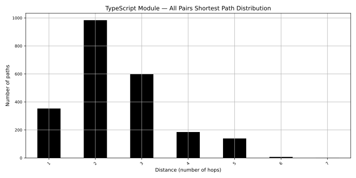

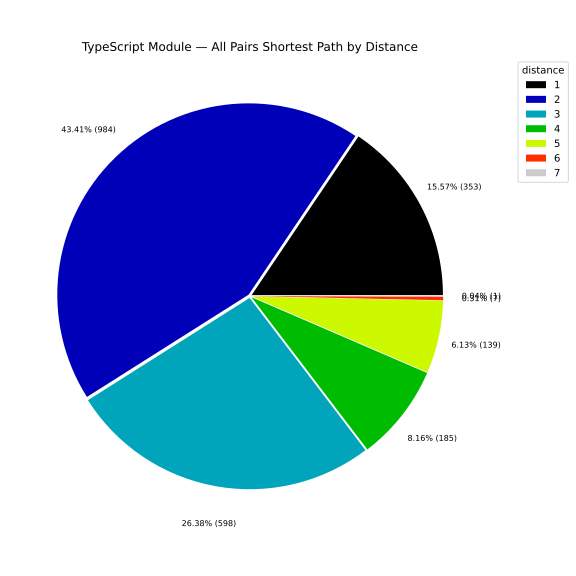

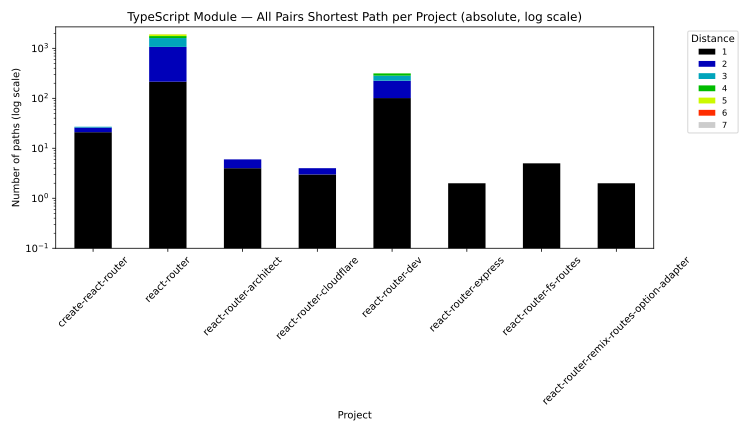

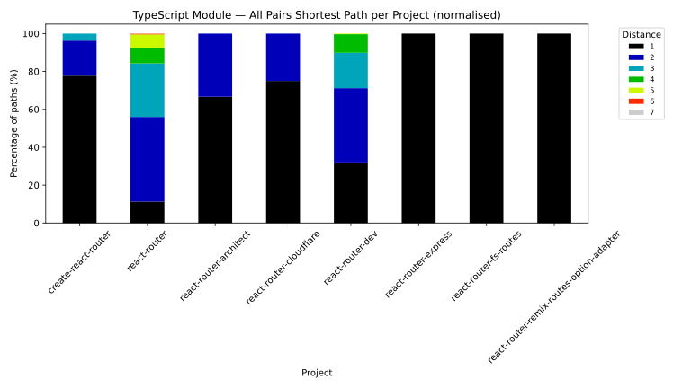

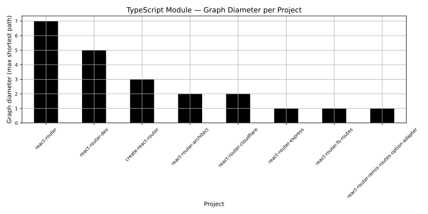

#### 4.3.2 Longest Path

Deepest sequential TypeScript import chain.

| distance | pathsCount |
| --- | --- |
| 5 | 1 |
| 4 | 1 |
| 3 | 7 |
| 2 | 13 |
| 1 | 26 |
| 0 | 14 |

[Full data per project](./Typescript_Module/Module_longest_paths_distribution.csv)

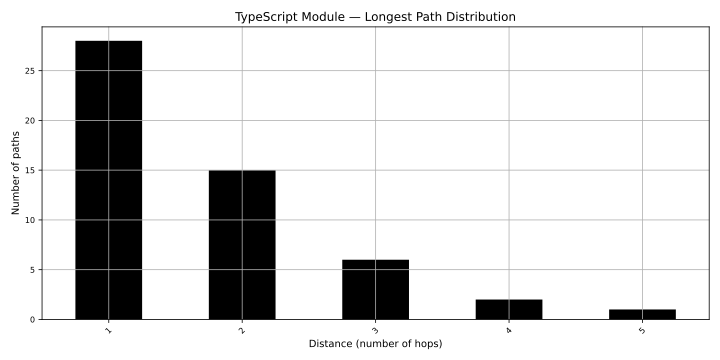

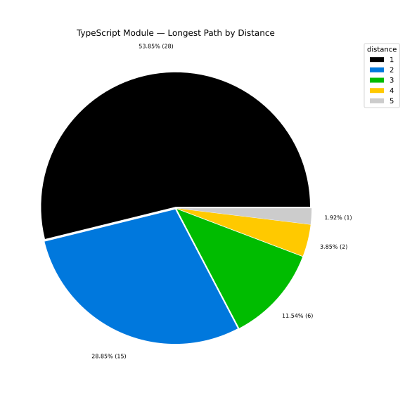

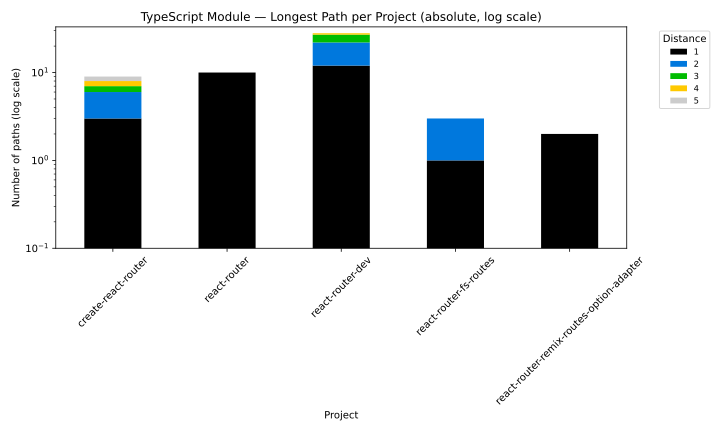

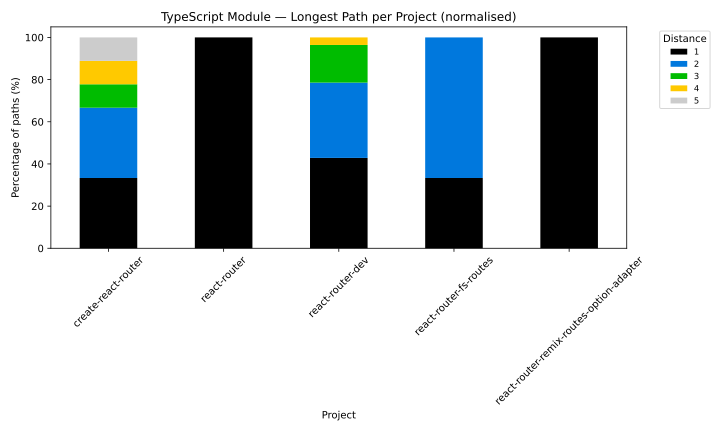

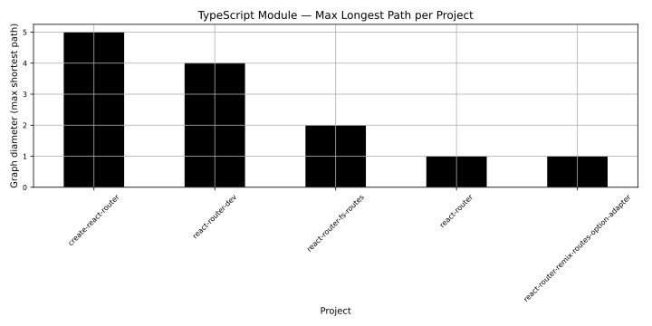

---

## 5. Topological Sort

Assigns **build level** to each node: Level 0 (no dependencies) → Level N (depends on level N−1).

**Critical path** = max level = min sequential build steps with full parallelism. Highest-level node = most central.

### 5.1 Critical Path Lengths

Max build level per abstraction. Higher = deeper sequential chain.

| abstractionLevel | nodeCount | maxBuildLevel |
| --- | --- | --- |
| Java Package | 7 | 4 |
| TypeScript Module | 37 | 5 |

Full topological sort results (node-level build order and level assignments) are in the abstraction-level CSV files under each subdirectory of `reports/internal-dependencies/`.

---

## 6. Graph Visualizations

Directed graphs: node color = build level (darker = higher level = more transitive deps above).

### 6.1 Java Artifact Graphs

**Build levels**: Full artifact hierarchy. **Longest paths**: Isolated chain + contributor view.

### 6.2 TypeScript Module Graphs

**Build levels**: Module layering view. **Longest paths**: Isolated chain + contributor view.

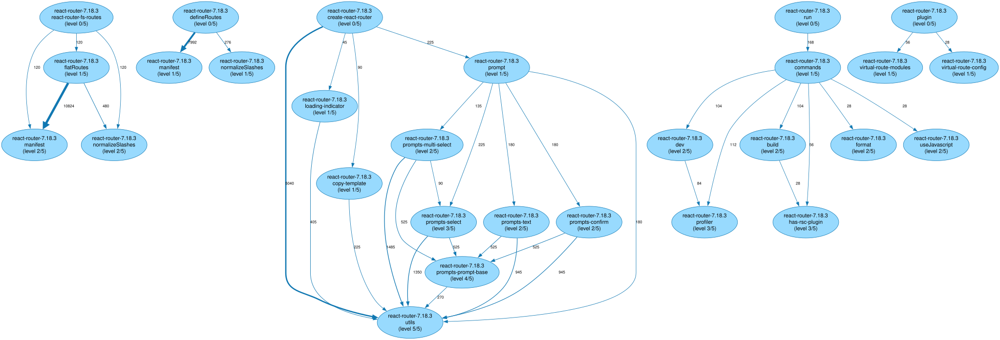

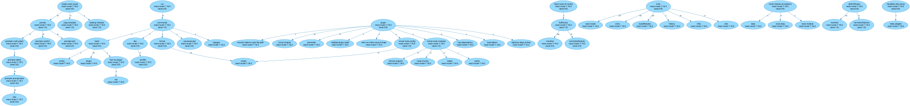

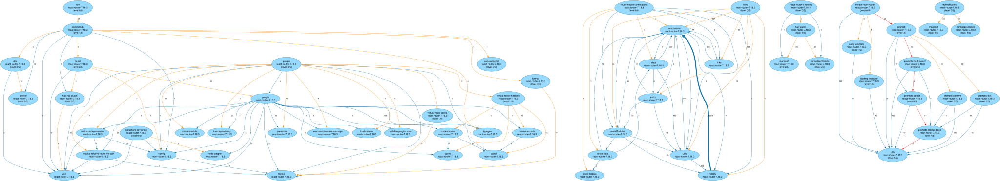

### 6.3 NPM Package Graphs

Build levels and longest paths for NPM packages (prod + dev dependencies).

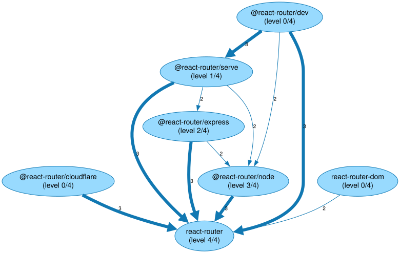

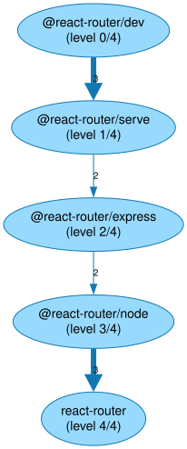

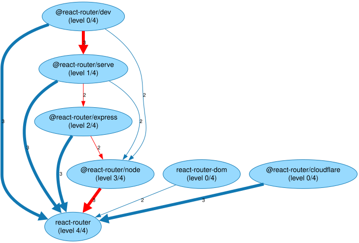

---

## 7. Glossary and Column Definitions

| Term | Definition |
|------|-----------|
| `Graph Diameter` | Longest shortest path. Structural depth metric. |
| `Longest Path` | Max directed path in DAG; critical build path. |
| `File Distance` | Min directory changes to dependency. |
| `Build Level` | Topological sort level (0 = no deps). |
| `usedTypesPercent` | % of package types actually used by dependents. Low = ISP violation. |
| `usedPackagesPercent` | % of artifact packages used by dependents. Low = wide API. |
| `usedElementsPercent` | % of module elements imported by dependents. |
| `Instability` | Outgoing / (incoming + outgoing) deps. 0 = stable; 1 = unstable. |
| `Abstractness` | (Abstract types) / (total types). 0 = concrete; 1 = abstract. |
| `Distance from Main Sequence` | Gap from ideal balance `A + I = 1`. High = pain or uselessness. |
| `Zone of Pain` | Concrete + stable = hard to change/remove. |
| `Zone of Uselessness` | Abstract + unstable = unused abstractions. |

---

## 8. Object-Oriented Design Metrics

Measures conformance to Stable Abstractions Principle(Robert C. Martin): stable components should be abstract; concrete ones unstable.

**Scatter chart**: Abstractness vs. Instability. Green diagonal = Main Sequence (`A + I = 1`). Far off = problem zone.

**Problem zones**: Zone of Pain (concrete + stable) | Zone of Uselessness (abstract + unstable).

**Bar charts**: Top connected packages/modules.

### 8.1 Java Packages (without sub-packages)

⚠️ _No data available — Java not detected in this codebase._

⚠️ _No data available — Java not detected in this codebase._

⚠️ _No data available — Java not detected in this codebase._

### 8.2 Java Packages (including sub-packages)

⚠️ _No data available — Java not detected in this codebase._

⚠️ _No data available — Java not detected in this codebase._

⚠️ _No data available — Java not detected in this codebase._

### 8.3 TypeScript Modules

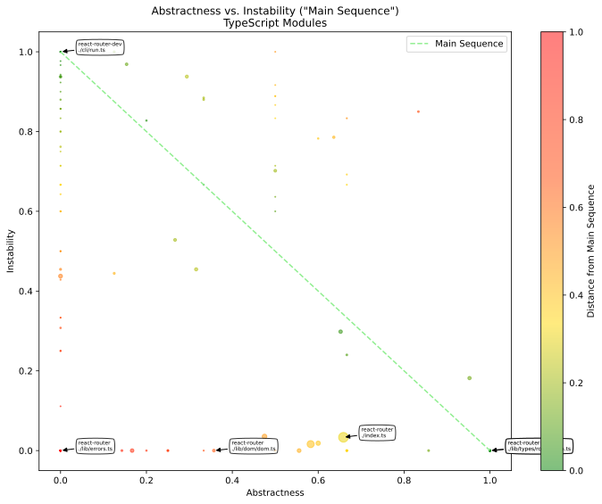

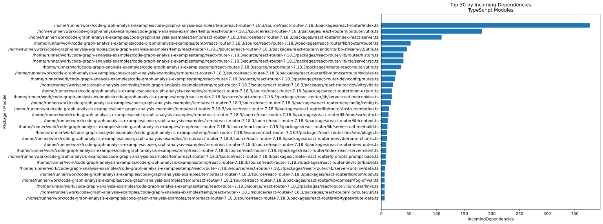

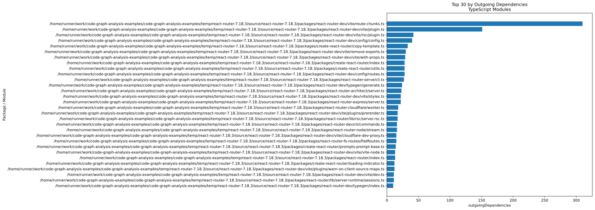

---

## 9. Visibility Metrics

Measures public vs. internal API exposure. High visibility = exposed more than necessary; low = tightly encapsulated.

**Percentile plots** (p25, p50, p75) vs. size (log scale): large artifacts vs. small visibility patterns.

**Scatter charts**: Artifact/project median visibility vs. size • Package/module individual visibility vs. size.

### 9.1 Java Visibility

#### 9.1.1 Artifact-Level Visibility Percentiles

⚠️ _No data available — Java not detected in this codebase._

#### 9.1.2 Artifact-Level Relative Visibility

⚠️ _No data available — Java not detected in this codebase._

#### 9.1.3 Package-Level Relative Visibility

⚠️ _No data available — Java not detected in this codebase._

### 9.2 TypeScript Visibility

#### 9.2.1 Project-Level Visibility Percentiles

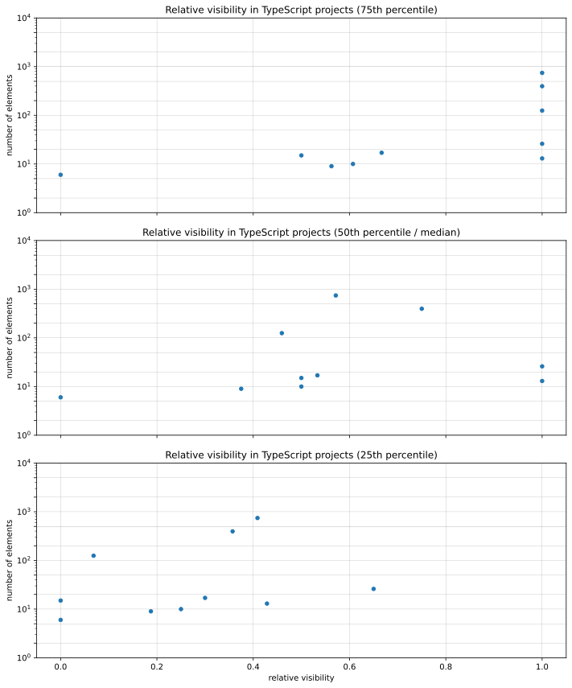

#### 9.2.2 Project-Level Relative Visibility

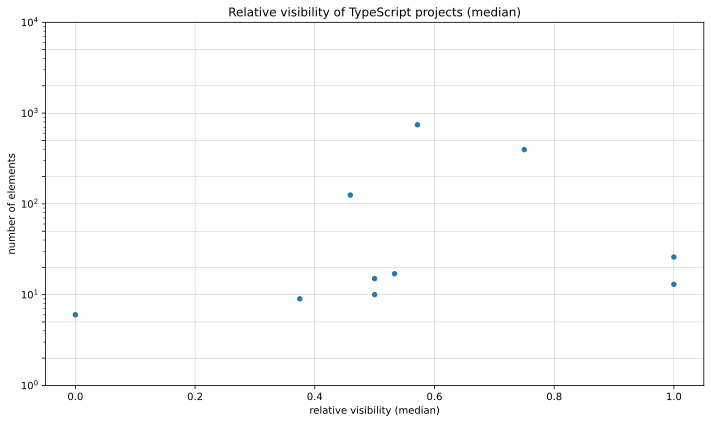

#### 9.2.3 Module-Level Relative Visibility

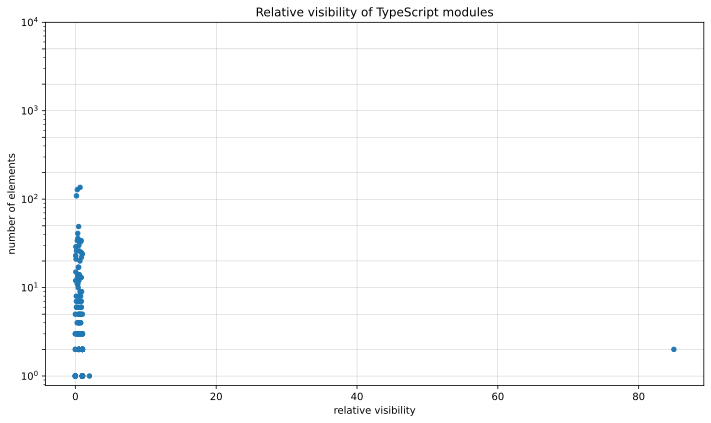

---

## 10. Code Vocabulary

**Word cloud**: Vocabulary from all code element names (filtered for generic words). Reveals domain concepts and naming patterns.

