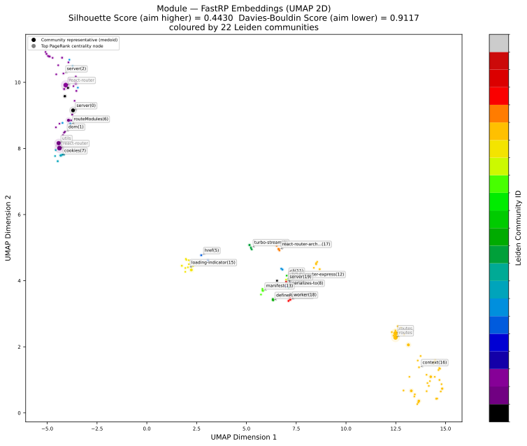
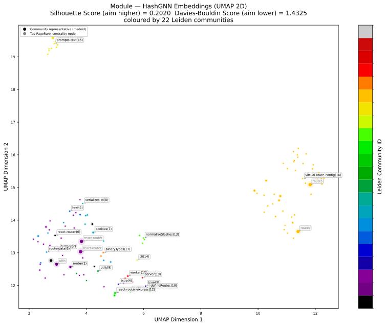
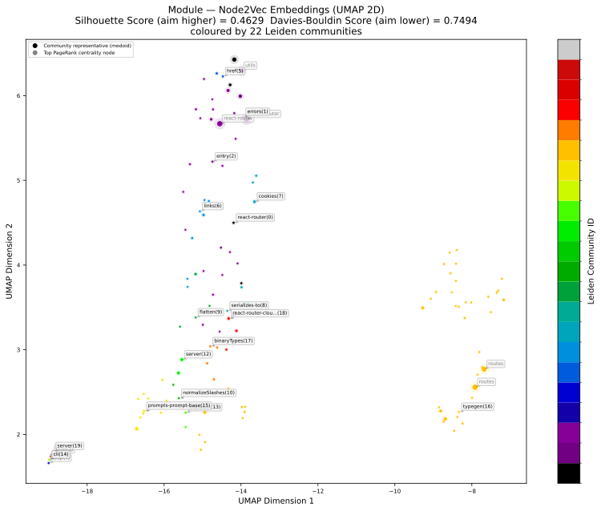

# 🧬 Node Embeddings Report

## 1. Overview

This report summarises node embedding vectors computed from the code dependency graph via the Neo4j Graph Data Science Library.

Node embeddings approximate the structural position of each code unit (package, type, artifact, module) in the graph as a fixed-length vector of floating-point numbers. The embeddings are computed using:

- **FastRP** (Fast Random Projection) — efficient approximate embedding based on random projections
- **HashGNN** (Hash Graph Neural Networks) — lightweight GNN-inspired embedding
- **Node2Vec** — random-walk-based embedding that captures local neighbourhood structure

The UMAP scatter plots visualise the embeddings projected to 2D. Points are coloured by Leiden community (when available) to show how well the embeddings capture community structure.

## 📚 Table of Contents

1. [Overview](#1-overview)
1. [Embedding Properties](#2-embedding-properties)
1. [Embeddings with Community and Centrality](#3-embeddings-with-community-and-centrality)
1. [Package Embedding Charts](#4-package-embedding-charts)
1. [Artifact Embedding Charts](#5-artifact-embedding-charts)
1. [Type Embedding Charts](#6-type-embedding-charts)
1. [Module Embedding Charts](#7-module-embedding-charts)

---

## 2. Embedding Properties

Shows which embedding properties exist and on how many nodes per label.

| nodeLabels | nodeCount | fastRandomProjectionCount | hashGNNCount | node2VecCount | fastRandomProjectionDimensions | hashGNNDimensions | node2VecDimensions |
| --- | --- | --- | --- | --- | --- | --- | --- |
| ["TS","Local","Module"] | 130 | 130 | 130 | 130 | 32 | 32 | 32 |

---

## 3. Embeddings with Community and Centrality

Sample of nodes showing FastRP embedding dimension count alongside Leiden community id and PageRank centrality.
Useful to verify that the embedding pipeline ran end-to-end and that the properties are co-located on the same nodes.

| nodeLabels | nodeName | embeddingDimensions | communityLeidenId | pageRankScore |
| --- | --- | --- | --- | --- |
| ["TS","Local","Module"] | ./index.ts | 32 | 6 | 8.281459225037262 |
| ["TS","Local","Module"] | ./index-react-server.ts | 32 | 6 | 5.353894601979948 |
| ["TS","Local","Module"] | ./config/routes.ts | 32 | 5 | 4.540557522169513 |
| ["TS","Local","Module"] | ./routes.ts | 32 | 5 | 4.075289078859909 |
| ["TS","Local","Module"] | ./lib/router/utils.ts | 32 | 6 | 3.9479101721866328 |
| ["TS","Local","Module"] | ./lib/rsc/server.rsc.ts | 32 | 6 | 2.163341295757832 |
| ["TS","Local","Module"] | ./lib/router/history.ts | 32 | 6 | 1.8359809278406294 |
| ["TS","Local","Module"] | ./config/config.ts | 32 | 5 | 1.8010494100340855 |
| ["TS","Local","Module"] | ./lib/router/router.ts | 32 | 6 | 1.5513700048750918 |
| ["TS","Local","Module"] | ./config.ts | 32 | 5 | 1.35226484417677 |

---

## 4. Package Embedding Charts

UMAP 2D projections of Package node embeddings. Each algorithm produces one scatter plot.

---

## 5. Artifact Embedding Charts

UMAP 2D projections of Artifact node embeddings. Each algorithm produces one scatter plot.

---

## 6. Type Embedding Charts

UMAP 2D projections of Java Type node embeddings. Each algorithm produces one scatter plot.

---

## 7. Module Embedding Charts

UMAP 2D projections of TypeScript Module node embeddings. Each algorithm produces one scatter plot.

