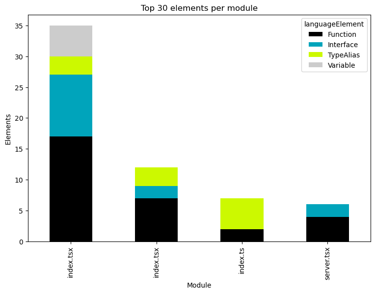
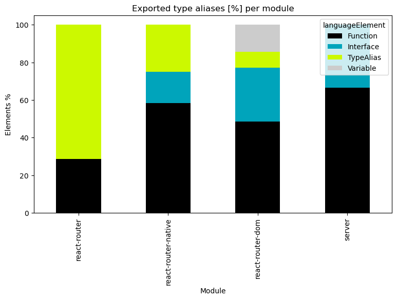
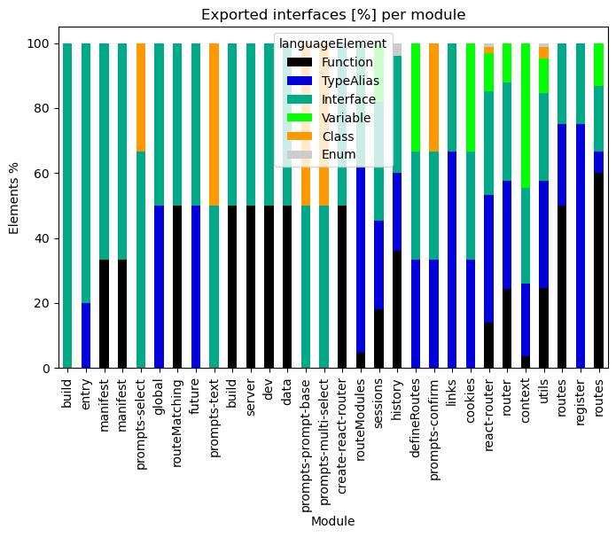
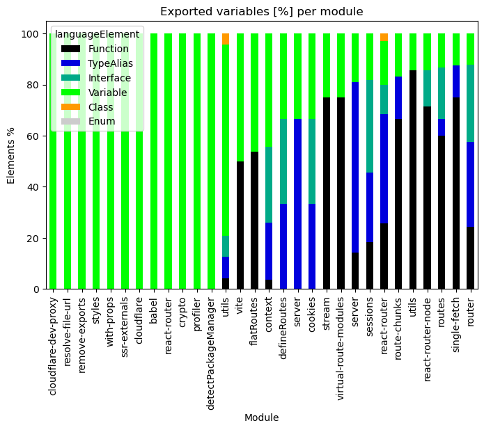
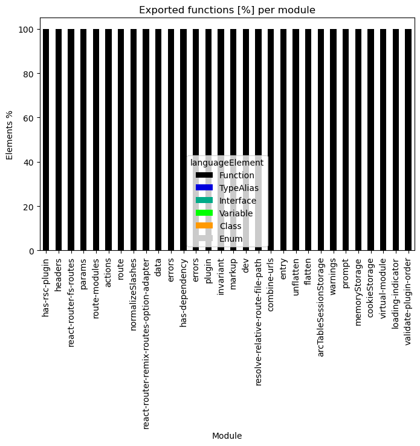

# Overview for Typescript

   

### References
- [jqassistant](https://jqassistant.org)
- [Neo4j Python Driver](https://neo4j.com/docs/api/python-driver/current)

## Overview

### Table 1 - Size

<table border="1" class="dataframe">
  <thead>
    <tr style="text-align: right;">
      <th></th>
      <th>nodeCount</th>
      <th>relationshipCount</th>
      <th>projectCount</th>
      <th>moduleCount</th>
      <th>functionCount</th>
      <th>objectCount</th>
      <th>typeAliasCount</th>
      <th>interfaceCount</th>
      <th>classCount</th>
      <th>methodCount</th>
    </tr>
  </thead>
  <tbody>
    <tr>
      <th>0</th>
      <td>204901</td>
      <td>436769</td>
      <td>11</td>
      <td>158</td>
      <td>1065</td>
      <td>1551</td>
      <td>335</td>
      <td>145</td>
      <td>12</td>
      <td>121</td>
    </tr>
  </tbody>
</table>

## Modules

### Table 2a - Largest 30 elements per module

This table shows the largest (number of elements) modules and their kind of elements (Interface, TypeAlias, Variable).
The whole table can be found in the CSV report `Number_of_elements_per_module_for_Typescript`.

<table border="1" class="dataframe">
  <thead>
    <tr style="text-align: right;">
      <th></th>
      <th>moduleName</th>
      <th>modulePath</th>
      <th>numberOfModuleElements</th>
      <th>languageElement</th>
      <th>numberOfElements</th>
    </tr>
  </thead>
  <tbody>
    <tr>
      <th>0</th>
      <td>react-router</td>
      <td>index.ts</td>
      <td>170</td>
      <td>TypeAlias</td>
      <td>61</td>
    </tr>
    <tr>
      <th>1</th>
      <td>react-router</td>
      <td>index.ts</td>
      <td>170</td>
      <td>Function</td>
      <td>22</td>
    </tr>
    <tr>
      <th>2</th>
      <td>react-router</td>
      <td>index.ts</td>
      <td>170</td>
      <td>Variable</td>
      <td>19</td>
    </tr>
    <tr>
      <th>3</th>
      <td>react-router</td>
      <td>index.ts</td>
      <td>170</td>
      <td>Interface</td>
      <td>50</td>
    </tr>
    <tr>
      <th>4</th>
      <td>react-router</td>
      <td>index.ts</td>
      <td>170</td>
      <td>Class</td>
      <td>3</td>
    </tr>
    <tr>
      <th>5</th>
      <td>react-router</td>
      <td>index.ts</td>
      <td>170</td>
      <td>Enum</td>
      <td>2</td>
    </tr>
    <tr>
      <th>6</th>
      <td>utils</td>
      <td>lib/router/utils.ts</td>
      <td>85</td>
      <td>TypeAlias</td>
      <td>28</td>
    </tr>
    <tr>
      <th>7</th>
      <td>utils</td>
      <td>lib/router/utils.ts</td>
      <td>85</td>
      <td>Function</td>
      <td>21</td>
    </tr>
    <tr>
      <th>8</th>
      <td>utils</td>
      <td>lib/router/utils.ts</td>
      <td>85</td>
      <td>Class</td>
      <td>3</td>
    </tr>
    <tr>
      <th>9</th>
      <td>utils</td>
      <td>lib/router/utils.ts</td>
      <td>85</td>
      <td>Interface</td>
      <td>23</td>
    </tr>
    <tr>
      <th>10</th>
      <td>utils</td>
      <td>lib/router/utils.ts</td>
      <td>85</td>
      <td>Enum</td>
      <td>1</td>
    </tr>
    <tr>
      <th>11</th>
      <td>utils</td>
      <td>lib/router/utils.ts</td>
      <td>85</td>
      <td>Variable</td>
      <td>9</td>
    </tr>
    <tr>
      <th>12</th>
      <td>react-router</td>
      <td>index-react-server.ts</td>
      <td>40</td>
      <td>Interface</td>
      <td>4</td>
    </tr>
    <tr>
      <th>13</th>
      <td>react-router</td>
      <td>index-react-server.ts</td>
      <td>40</td>
      <td>TypeAlias</td>
      <td>15</td>
    </tr>
    <tr>
      <th>14</th>
      <td>react-router</td>
      <td>index-react-server.ts</td>
      <td>40</td>
      <td>Function</td>
      <td>10</td>
    </tr>
    <tr>
      <th>15</th>
      <td>react-router</td>
      <td>index-react-server.ts</td>
      <td>40</td>
      <td>Variable</td>
      <td>6</td>
    </tr>
    <tr>
      <th>16</th>
      <td>react-router</td>
      <td>index-react-server.ts</td>
      <td>40</td>
      <td>Class</td>
      <td>1</td>
    </tr>
    <tr>
      <th>17</th>
      <td>router</td>
      <td>lib/router/router.ts</td>
      <td>33</td>
      <td>Interface</td>
      <td>10</td>
    </tr>
    <tr>
      <th>18</th>
      <td>router</td>
      <td>lib/router/router.ts</td>
      <td>33</td>
      <td>Function</td>
      <td>8</td>
    </tr>
    <tr>
      <th>19</th>
      <td>router</td>
      <td>lib/router/router.ts</td>
      <td>33</td>
      <td>TypeAlias</td>
      <td>11</td>
    </tr>
    <tr>
      <th>20</th>
      <td>router</td>
      <td>lib/router/router.ts</td>
      <td>33</td>
      <td>Variable</td>
      <td>4</td>
    </tr>
    <tr>
      <th>21</th>
      <td>utils</td>
      <td>utils.ts</td>
      <td>28</td>
      <td>Function</td>
      <td>24</td>
    </tr>
    <tr>
      <th>22</th>
      <td>utils</td>
      <td>utils.ts</td>
      <td>28</td>
      <td>Variable</td>
      <td>4</td>
    </tr>
    <tr>
      <th>23</th>
      <td>context</td>
      <td>lib/context.ts</td>
      <td>27</td>
      <td>Interface</td>
      <td>8</td>
    </tr>
    <tr>
      <th>24</th>
      <td>context</td>
      <td>lib/context.ts</td>
      <td>27</td>
      <td>Function</td>
      <td>1</td>
    </tr>
    <tr>
      <th>25</th>
      <td>context</td>
      <td>lib/context.ts</td>
      <td>27</td>
      <td>Variable</td>
      <td>12</td>
    </tr>
    <tr>
      <th>26</th>
      <td>context</td>
      <td>lib/context.ts</td>
      <td>27</td>
      <td>TypeAlias</td>
      <td>6</td>
    </tr>
    <tr>
      <th>27</th>
      <td>history</td>
      <td>lib/router/history.ts</td>
      <td>25</td>
      <td>Interface</td>
      <td>9</td>
    </tr>
    <tr>
      <th>28</th>
      <td>history</td>
      <td>lib/router/history.ts</td>
      <td>25</td>
      <td>TypeAlias</td>
      <td>6</td>
    </tr>
    <tr>
      <th>29</th>
      <td>history</td>
      <td>lib/router/history.ts</td>
      <td>25</td>
      <td>Function</td>
      <td>9</td>
    </tr>
  </tbody>
</table>

### Table 2b - Largest 30 elements per module grouped

This table shows the largest (number of elements) modules each in one row, their kind of elements in columns and the count of them as values.

The source data for this aggregated table can be found in the CSV report `Number_of_elements_per_module_for_Typescript`.

<table border="1" class="dataframe">
  <thead>
    <tr style="text-align: right;">
      <th>languageElement</th>
      <th>modulePath</th>
      <th>moduleName</th>
      <th>Function</th>
      <th>TypeAlias</th>
      <th>Interface</th>
      <th>Variable</th>
      <th>Class</th>
      <th>Enum</th>
    </tr>
  </thead>
  <tbody>
    <tr>
      <th>0</th>
      <td>index.ts</td>
      <td>react-router</td>
      <td>22</td>
      <td>61</td>
      <td>50</td>
      <td>19</td>
      <td>3</td>
      <td>2</td>
    </tr>
    <tr>
      <th>1</th>
      <td>lib/router/utils.ts</td>
      <td>utils</td>
      <td>21</td>
      <td>28</td>
      <td>23</td>
      <td>9</td>
      <td>3</td>
      <td>1</td>
    </tr>
    <tr>
      <th>2</th>
      <td>index-react-server.ts</td>
      <td>react-router</td>
      <td>10</td>
      <td>15</td>
      <td>4</td>
      <td>6</td>
      <td>1</td>
      <td>0</td>
    </tr>
    <tr>
      <th>3</th>
      <td>lib/router/router.ts</td>
      <td>router</td>
      <td>8</td>
      <td>11</td>
      <td>10</td>
      <td>4</td>
      <td>0</td>
      <td>0</td>
    </tr>
    <tr>
      <th>4</th>
      <td>utils.ts</td>
      <td>utils</td>
      <td>24</td>
      <td>0</td>
      <td>0</td>
      <td>4</td>
      <td>0</td>
      <td>0</td>
    </tr>
    <tr>
      <th>5</th>
      <td>lib/context.ts</td>
      <td>context</td>
      <td>1</td>
      <td>6</td>
      <td>8</td>
      <td>12</td>
      <td>0</td>
      <td>0</td>
    </tr>
    <tr>
      <th>6</th>
      <td>lib/router/history.ts</td>
      <td>history</td>
      <td>9</td>
      <td>6</td>
      <td>9</td>
      <td>0</td>
      <td>0</td>
      <td>1</td>
    </tr>
    <tr>
      <th>7</th>
      <td>vendor/turbo-stream-v2/utils.ts</td>
      <td>utils</td>
      <td>1</td>
      <td>2</td>
      <td>2</td>
      <td>18</td>
      <td>1</td>
      <td>0</td>
    </tr>
    <tr>
      <th>8</th>
      <td>lib/rsc/server.rsc.ts</td>
      <td>server</td>
      <td>4</td>
      <td>14</td>
      <td>0</td>
      <td>4</td>
      <td>0</td>
      <td>0</td>
    </tr>
    <tr>
      <th>9</th>
      <td>lib/dom/ssr/routeModules.ts</td>
      <td>routeModules</td>
      <td>1</td>
      <td>12</td>
      <td>8</td>
      <td>0</td>
      <td>0</td>
      <td>0</td>
    </tr>
    <tr>
      <th>10</th>
      <td>vite/plugin.ts</td>
      <td>plugin</td>
      <td>10</td>
      <td>4</td>
      <td>1</td>
      <td>2</td>
      <td>0</td>
      <td>0</td>
    </tr>
    <tr>
      <th>11</th>
      <td>config/routes.ts</td>
      <td>routes</td>
      <td>9</td>
      <td>1</td>
      <td>3</td>
      <td>2</td>
      <td>0</td>
      <td>0</td>
    </tr>
    <tr>
      <th>12</th>
      <td>lib/dom/dom.ts</td>
      <td>dom</td>
      <td>8</td>
      <td>3</td>
      <td>2</td>
      <td>1</td>
      <td>0</td>
      <td>0</td>
    </tr>
    <tr>
      <th>13</th>
      <td>flatRoutes.ts</td>
      <td>flatRoutes</td>
      <td>7</td>
      <td>0</td>
      <td>0</td>
      <td>6</td>
      <td>0</td>
      <td>0</td>
    </tr>
    <tr>
      <th>14</th>
      <td>vite/route-chunks.ts</td>
      <td>route-chunks</td>
      <td>8</td>
      <td>2</td>
      <td>0</td>
      <td>2</td>
      <td>0</td>
      <td>0</td>
    </tr>
    <tr>
      <th>15</th>
      <td>config/config.ts</td>
      <td>config</td>
      <td>4</td>
      <td>7</td>
      <td>0</td>
      <td>1</td>
      <td>0</td>
      <td>0</td>
    </tr>
    <tr>
      <th>16</th>
      <td>lib/server-runtime/sessions.ts</td>
      <td>sessions</td>
      <td>2</td>
      <td>3</td>
      <td>4</td>
      <td>2</td>
      <td>0</td>
      <td>0</td>
    </tr>
    <tr>
      <th>17</th>
      <td>lib/router/instrumentation.ts</td>
      <td>instrumentation</td>
      <td>3</td>
      <td>6</td>
      <td>0</td>
      <td>0</td>
      <td>0</td>
      <td>0</td>
    </tr>
    <tr>
      <th>18</th>
      <td>lib/dom/ssr/links.ts</td>
      <td>links</td>
      <td>7</td>
      <td>1</td>
      <td>0</td>
      <td>0</td>
      <td>0</td>
      <td>0</td>
    </tr>
    <tr>
      <th>19</th>
      <td>lib/server-runtime/single-fetch.ts</td>
      <td>single-fetch</td>
      <td>6</td>
      <td>1</td>
      <td>0</td>
      <td>1</td>
      <td>0</td>
      <td>0</td>
    </tr>
    <tr>
      <th>20</th>
      <td>routes.ts</td>
      <td>routes</td>
      <td>6</td>
      <td>1</td>
      <td>1</td>
      <td>0</td>
      <td>0</td>
      <td>0</td>
    </tr>
    <tr>
      <th>21</th>
      <td>dom-export.ts</td>
      <td>dom-export</td>
      <td>1</td>
      <td>6</td>
      <td>0</td>
      <td>0</td>
      <td>0</td>
      <td>0</td>
    </tr>
    <tr>
      <th>22</th>
      <td>index.ts</td>
      <td>react-router-node</td>
      <td>5</td>
      <td>0</td>
      <td>1</td>
      <td>1</td>
      <td>0</td>
      <td>0</td>
    </tr>
    <tr>
      <th>23</th>
      <td>lib/types/route-data.ts</td>
      <td>route-data</td>
      <td>0</td>
      <td>7</td>
      <td>0</td>
      <td>0</td>
      <td>0</td>
      <td>0</td>
    </tr>
    <tr>
      <th>24</th>
      <td>lib/types/utils.ts</td>
      <td>utils</td>
      <td>0</td>
      <td>6</td>
      <td>0</td>
      <td>0</td>
      <td>0</td>
      <td>0</td>
    </tr>
    <tr>
      <th>25</th>
      <td>lib/dom/ssr/fog-of-war.ts</td>
      <td>fog-of-war</td>
      <td>6</td>
      <td>0</td>
      <td>0</td>
      <td>0</td>
      <td>0</td>
      <td>0</td>
    </tr>
    <tr>
      <th>26</th>
      <td>server.ts</td>
      <td>server</td>
      <td>4</td>
      <td>2</td>
      <td>0</td>
      <td>0</td>
      <td>0</td>
      <td>0</td>
    </tr>
    <tr>
      <th>27</th>
      <td>server.ts</td>
      <td>server</td>
      <td>4</td>
      <td>2</td>
      <td>0</td>
      <td>0</td>
      <td>0</td>
      <td>0</td>
    </tr>
    <tr>
      <th>28</th>
      <td>vite/plugins/prerender.ts</td>
      <td>prerender</td>
      <td>1</td>
      <td>2</td>
      <td>3</td>
      <td>0</td>
      <td>0</td>
      <td>0</td>
    </tr>
    <tr>
      <th>29</th>
      <td>lib/server-runtime/cookies.ts</td>
      <td>cookies</td>
      <td>0</td>
      <td>2</td>
      <td>2</td>
      <td>2</td>
      <td>0</td>
      <td>0</td>
    </tr>
  </tbody>
</table>

### Table 2b Chart 1 - 30 largest modules and their elements stacked

    <Figure size 640x480 with 0 Axes>

    

    

### Table 2c - 30 highest element count per module (grouped and normalized in %)

<table border="1" class="dataframe">
  <thead>
    <tr style="text-align: right;">
      <th>languageElement</th>
      <th>modulePath</th>
      <th>moduleName</th>
      <th>Function</th>
      <th>TypeAlias</th>
      <th>Interface</th>
      <th>Variable</th>
      <th>Class</th>
      <th>Enum</th>
    </tr>
  </thead>
  <tbody>
    <tr>
      <th>0</th>
      <td>index.ts</td>
      <td>react-router</td>
      <td>14.012739</td>
      <td>38.853503</td>
      <td>31.847134</td>
      <td>12.101911</td>
      <td>1.910828</td>
      <td>1.273885</td>
    </tr>
    <tr>
      <th>1</th>
      <td>lib/router/utils.ts</td>
      <td>utils</td>
      <td>24.705882</td>
      <td>32.941176</td>
      <td>27.058824</td>
      <td>10.588235</td>
      <td>3.529412</td>
      <td>1.176471</td>
    </tr>
    <tr>
      <th>2</th>
      <td>index-react-server.ts</td>
      <td>react-router</td>
      <td>27.777778</td>
      <td>41.666667</td>
      <td>11.111111</td>
      <td>16.666667</td>
      <td>2.777778</td>
      <td>0.000000</td>
    </tr>
    <tr>
      <th>3</th>
      <td>lib/router/router.ts</td>
      <td>router</td>
      <td>24.242424</td>
      <td>33.333333</td>
      <td>30.303030</td>
      <td>12.121212</td>
      <td>0.000000</td>
      <td>0.000000</td>
    </tr>
    <tr>
      <th>4</th>
      <td>utils.ts</td>
      <td>utils</td>
      <td>85.714286</td>
      <td>0.000000</td>
      <td>0.000000</td>
      <td>14.285714</td>
      <td>0.000000</td>
      <td>0.000000</td>
    </tr>
    <tr>
      <th>5</th>
      <td>lib/context.ts</td>
      <td>context</td>
      <td>3.703704</td>
      <td>22.222222</td>
      <td>29.629630</td>
      <td>44.444444</td>
      <td>0.000000</td>
      <td>0.000000</td>
    </tr>
    <tr>
      <th>6</th>
      <td>lib/router/history.ts</td>
      <td>history</td>
      <td>36.000000</td>
      <td>24.000000</td>
      <td>36.000000</td>
      <td>0.000000</td>
      <td>0.000000</td>
      <td>4.000000</td>
    </tr>
    <tr>
      <th>7</th>
      <td>vendor/turbo-stream-v2/utils.ts</td>
      <td>utils</td>
      <td>4.166667</td>
      <td>8.333333</td>
      <td>8.333333</td>
      <td>75.000000</td>
      <td>4.166667</td>
      <td>0.000000</td>
    </tr>
    <tr>
      <th>8</th>
      <td>lib/rsc/server.rsc.ts</td>
      <td>server</td>
      <td>18.181818</td>
      <td>63.636364</td>
      <td>0.000000</td>
      <td>18.181818</td>
      <td>0.000000</td>
      <td>0.000000</td>
    </tr>
    <tr>
      <th>9</th>
      <td>lib/dom/ssr/routeModules.ts</td>
      <td>routeModules</td>
      <td>4.761905</td>
      <td>57.142857</td>
      <td>38.095238</td>
      <td>0.000000</td>
      <td>0.000000</td>
      <td>0.000000</td>
    </tr>
    <tr>
      <th>10</th>
      <td>vite/plugin.ts</td>
      <td>plugin</td>
      <td>58.823529</td>
      <td>23.529412</td>
      <td>5.882353</td>
      <td>11.764706</td>
      <td>0.000000</td>
      <td>0.000000</td>
    </tr>
    <tr>
      <th>11</th>
      <td>config/routes.ts</td>
      <td>routes</td>
      <td>60.000000</td>
      <td>6.666667</td>
      <td>20.000000</td>
      <td>13.333333</td>
      <td>0.000000</td>
      <td>0.000000</td>
    </tr>
    <tr>
      <th>12</th>
      <td>lib/dom/dom.ts</td>
      <td>dom</td>
      <td>57.142857</td>
      <td>21.428571</td>
      <td>14.285714</td>
      <td>7.142857</td>
      <td>0.000000</td>
      <td>0.000000</td>
    </tr>
    <tr>
      <th>13</th>
      <td>flatRoutes.ts</td>
      <td>flatRoutes</td>
      <td>53.846154</td>
      <td>0.000000</td>
      <td>0.000000</td>
      <td>46.153846</td>
      <td>0.000000</td>
      <td>0.000000</td>
    </tr>
    <tr>
      <th>14</th>
      <td>vite/route-chunks.ts</td>
      <td>route-chunks</td>
      <td>66.666667</td>
      <td>16.666667</td>
      <td>0.000000</td>
      <td>16.666667</td>
      <td>0.000000</td>
      <td>0.000000</td>
    </tr>
    <tr>
      <th>15</th>
      <td>config/config.ts</td>
      <td>config</td>
      <td>33.333333</td>
      <td>58.333333</td>
      <td>0.000000</td>
      <td>8.333333</td>
      <td>0.000000</td>
      <td>0.000000</td>
    </tr>
    <tr>
      <th>16</th>
      <td>lib/server-runtime/sessions.ts</td>
      <td>sessions</td>
      <td>18.181818</td>
      <td>27.272727</td>
      <td>36.363636</td>
      <td>18.181818</td>
      <td>0.000000</td>
      <td>0.000000</td>
    </tr>
    <tr>
      <th>17</th>
      <td>lib/router/instrumentation.ts</td>
      <td>instrumentation</td>
      <td>33.333333</td>
      <td>66.666667</td>
      <td>0.000000</td>
      <td>0.000000</td>
      <td>0.000000</td>
      <td>0.000000</td>
    </tr>
    <tr>
      <th>18</th>
      <td>lib/dom/ssr/links.ts</td>
      <td>links</td>
      <td>87.500000</td>
      <td>12.500000</td>
      <td>0.000000</td>
      <td>0.000000</td>
      <td>0.000000</td>
      <td>0.000000</td>
    </tr>
    <tr>
      <th>19</th>
      <td>lib/server-runtime/single-fetch.ts</td>
      <td>single-fetch</td>
      <td>75.000000</td>
      <td>12.500000</td>
      <td>0.000000</td>
      <td>12.500000</td>
      <td>0.000000</td>
      <td>0.000000</td>
    </tr>
    <tr>
      <th>20</th>
      <td>routes.ts</td>
      <td>routes</td>
      <td>75.000000</td>
      <td>12.500000</td>
      <td>12.500000</td>
      <td>0.000000</td>
      <td>0.000000</td>
      <td>0.000000</td>
    </tr>
    <tr>
      <th>21</th>
      <td>dom-export.ts</td>
      <td>dom-export</td>
      <td>14.285714</td>
      <td>85.714286</td>
      <td>0.000000</td>
      <td>0.000000</td>
      <td>0.000000</td>
      <td>0.000000</td>
    </tr>
    <tr>
      <th>22</th>
      <td>index.ts</td>
      <td>react-router-node</td>
      <td>71.428571</td>
      <td>0.000000</td>
      <td>14.285714</td>
      <td>14.285714</td>
      <td>0.000000</td>
      <td>0.000000</td>
    </tr>
    <tr>
      <th>23</th>
      <td>lib/types/route-data.ts</td>
      <td>route-data</td>
      <td>0.000000</td>
      <td>100.000000</td>
      <td>0.000000</td>
      <td>0.000000</td>
      <td>0.000000</td>
      <td>0.000000</td>
    </tr>
    <tr>
      <th>24</th>
      <td>lib/types/utils.ts</td>
      <td>utils</td>
      <td>0.000000</td>
      <td>100.000000</td>
      <td>0.000000</td>
      <td>0.000000</td>
      <td>0.000000</td>
      <td>0.000000</td>
    </tr>
    <tr>
      <th>25</th>
      <td>lib/dom/ssr/fog-of-war.ts</td>
      <td>fog-of-war</td>
      <td>100.000000</td>
      <td>0.000000</td>
      <td>0.000000</td>
      <td>0.000000</td>
      <td>0.000000</td>
      <td>0.000000</td>
    </tr>
    <tr>
      <th>26</th>
      <td>server.ts</td>
      <td>server</td>
      <td>66.666667</td>
      <td>33.333333</td>
      <td>0.000000</td>
      <td>0.000000</td>
      <td>0.000000</td>
      <td>0.000000</td>
    </tr>
    <tr>
      <th>27</th>
      <td>server.ts</td>
      <td>server</td>
      <td>66.666667</td>
      <td>33.333333</td>
      <td>0.000000</td>
      <td>0.000000</td>
      <td>0.000000</td>
      <td>0.000000</td>
    </tr>
    <tr>
      <th>28</th>
      <td>vite/plugins/prerender.ts</td>
      <td>prerender</td>
      <td>16.666667</td>
      <td>33.333333</td>
      <td>50.000000</td>
      <td>0.000000</td>
      <td>0.000000</td>
      <td>0.000000</td>
    </tr>
    <tr>
      <th>29</th>
      <td>lib/server-runtime/cookies.ts</td>
      <td>cookies</td>
      <td>0.000000</td>
      <td>33.333333</td>
      <td>33.333333</td>
      <td>33.333333</td>
      <td>0.000000</td>
      <td>0.000000</td>
    </tr>
  </tbody>
</table>

### Table 2c Chart 1 - Top 30 modules with the highest relative amount of type aliases in %

    <Figure size 640x480 with 0 Axes>

    

    

### Table 2c Chart 2 - Top 30 module with the highest relative amount of interfaces in %

    <Figure size 640x480 with 0 Axes>

    

    

### Table 2c Chart 3 - Top 30 modules with the highest relative amount of variables in %

    <Figure size 640x480 with 0 Axes>

    

    

### Table 2c Chart 4 - Top 30 modules with the highest relative amount of functions in %

    <Figure size 640x480 with 0 Axes>

    

    

